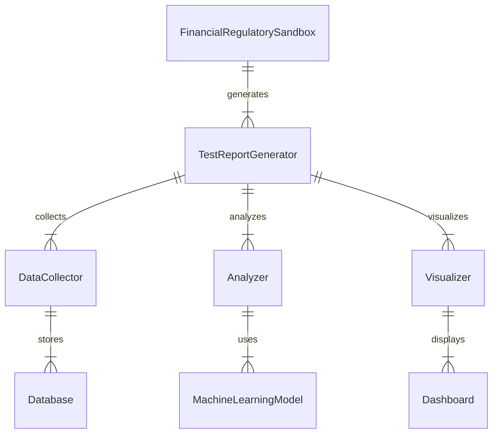
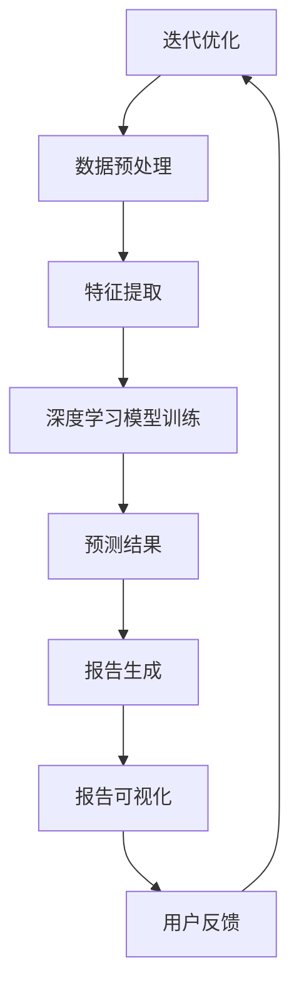

                 

### 引言与背景

#### 1.1 书籍目的与结构

“Developing a Financial Regulatory Sandbox Test Report Generator Based on Large Models”旨在为金融科技（FinTech）领域的技术专家和开发人员提供一套全面、系统的指南，帮助其设计和实现一款基于大模型的金融监管沙盒测试报告生成器。本书的目标读者群体包括：

- 金融科技领域的工程师和架构师
- 金融监管沙盒项目的项目经理和团队成员
- 金融科技行业的从业者，特别是对AI和大数据有浓厚兴趣的人士

书籍结构设计合理，分为四个主要部分：

1. **引言与背景**：介绍金融监管沙盒和大模型的概念，解释书籍的目的与结构。
2. **大模型原理与算法**：深入探讨大模型的基本原理和关键算法，为后续系统设计与实现提供理论基础。
3. **金融监管沙盒测试报告生成器设计与实现**：详细介绍系统分析与架构设计、核心实现与代码解析，以及实际项目案例。
4. **项目实战与最佳实践**：通过实战案例，总结最佳实践，提示注意事项，并展望未来发展。

#### 1.2 金融监管沙盒的概述

金融监管沙盒是一种创新的监管机制，允许金融机构在受控的环境中进行创新产品测试，而无需立即面对全面监管。这一概念源自2016年英国金融行为监管局（FCA）的提出，旨在促进金融科技（FinTech）的健康发展，同时确保消费者权益和金融市场稳定。

**定义**：
金融监管沙盒是一种模拟真实市场环境的测试平台，允许金融机构在受控的条件下测试新型金融产品、服务或商业模式。通过沙盒测试，金融机构可以在不违反现有法规的情况下，验证其创新方案的可行性和合规性。

**作用**：
- **促进创新**：为金融机构提供一个安全的实验场所，鼓励他们尝试和推广新的金融科技解决方案。
- **确保合规**：在推出新产品或服务前，确保其符合所有相关法规和监管要求，降低合规风险。
- **消费者保护**：通过沙盒测试，监管机构可以更好地保护消费者权益，避免创新产品对消费者造成潜在风险。

**特点**：
- **受控环境**：沙盒提供了一个受控的环境，允许金融机构在真实环境中测试，但风险和影响被限制。
- **灵活性和适应性**：沙盒可以快速适应不同的测试需求，并根据反馈进行调整。
- **透明性**：监管机构通常要求参与沙盒的金融机构公开测试结果，增加透明度和公众信任。

#### 1.3 大模型在金融监管沙盒中的应用

随着人工智能和机器学习技术的不断发展，大模型（如深度学习模型）在金融领域的应用日益广泛。大模型能够处理海量数据，进行复杂模式识别，并生成高精度的预测和决策。在金融监管沙盒中，大模型的应用主要体现在以下几个方面：

**预测与分析**：
大模型可以处理金融市场的复杂数据，进行趋势分析、风险评估和预测。例如，通过分析历史交易数据，预测市场波动，帮助监管机构制定更有效的监管策略。

**自动化决策**：
大模型可以自动化一些监管决策过程，例如通过算法自动识别可疑交易行为，提高监管效率。这种自动化不仅减少了人工干预，还提高了监管的准确性和速度。

**合规性检查**：
大模型可以用于自动检测金融产品或服务的合规性，通过学习已有的法规和标准，识别潜在的风险点和违规行为，提高合规性检查的全面性和准确性。

**客户服务**：
大模型可以用于优化客户服务体验，例如通过自然语言处理技术，提供24/7的客户咨询和帮助，提高客户满意度。

总之，大模型在金融监管沙盒中的应用不仅提高了监管效率，还促进了金融创新和合规性。随着技术的进步，大模型在金融监管沙盒中的角色将更加重要。

### 第2章 问题背景与核心概念

#### 2.1 问题背景

在当今金融科技（FinTech）快速发展的背景下，金融监管沙盒已经成为金融机构创新和合规的关键工具。然而，随着沙盒测试项目的增多，如何高效地生成测试报告成为了一个亟待解决的问题。传统的报告生成方法往往依赖于手动编写和整理，耗时费力，且容易出错。此外，随着测试数据量的增大和测试过程的复杂化，手动生成报告已无法满足高效、准确的要求。

具体来说，问题背景可以从以下几个方面进行描述：

- **报告生成效率低下**：传统报告生成过程需要大量人工干预，从数据收集、整理到编写和审核，整个过程耗时长，且容易出错。
- **数据准确性问题**：由于人为因素，手动生成的报告可能存在数据不准确、遗漏或者分析不全面的问题。
- **测试结果的可视化和分析**：随着测试数据的复杂性和多样性，手动生成报告难以直观展示测试结果，使得分析和决策变得更加困难。
- **合规性要求**：金融监管沙盒项目需要满足严格的合规性要求，手动生成报告难以确保所有细节的准确性和完整性。

为了解决上述问题，需要一种自动化的报告生成工具，能够高效、准确地处理大量测试数据，并生成高质量的测试报告。这种工具不仅可以提高工作效率，还能确保报告的准确性和完整性，从而满足金融监管沙盒项目的需求。

#### 2.2 金融监管沙盒的挑战与需求

金融监管沙盒作为一个创新的监管机制，虽然在促进金融科技发展和确保合规性方面发挥了重要作用，但也面临着一系列挑战。以下是金融监管沙盒面临的几个主要挑战和相应的需求：

**1. 需求分析**：

- **复杂性**：金融监管沙盒项目通常涉及多个金融产品、服务和市场，测试过程复杂，数据量大，需要高效处理和分析。
- **多样化**：不同的金融产品和服务具有不同的特点，测试需求多样化，报告生成工具需要具备灵活性和适应性。
- **实时性**：监管机构对测试结果的需求通常是即时的，报告生成工具需要能够快速响应并生成高质量的报告。
- **合规性**：生成报告的过程中需要严格遵守相关法规和监管要求，确保报告的准确性和完整性。

**2. 挑战**：

- **数据管理**：沙盒测试过程中会产生大量的数据，如何高效地收集、存储和管理这些数据，是一个巨大的挑战。
- **报告格式标准化**：不同项目的报告格式可能有所不同，如何确保报告格式的一致性和标准化，是一个技术难题。
- **自动化水平**：传统报告生成方法依赖大量的人工操作，如何提高自动化水平，减少人工干预，是一个重要挑战。
- **数据分析与可视化**：如何利用先进的数据分析技术，将复杂的测试数据转化为易于理解和分析的可视化报告，也是一个难点。

为了应对这些挑战，需要开发一款基于大模型的金融监管沙盒测试报告生成器，该工具应具备以下特点：

- **高效数据处理能力**：能够快速处理和存储大量测试数据，确保数据管理的效率和准确性。
- **灵活性和适应性**：能够适应不同项目的要求，生成符合标准化的报告。
- **自动化程度高**：能够自动化报告的生成过程，减少人工干预，提高工作效率。
- **强大的数据分析与可视化能力**：能够利用大模型和数据分析技术，将复杂的数据转化为直观、易于理解的报告。

通过解决上述挑战，金融监管沙盒测试报告生成器不仅能够提高工作效率，还能确保报告的准确性和完整性，从而更好地满足金融监管沙盒项目的需求。

#### 2.3 大模型的定义与特点

大模型（Large Models）是指那些具备海量参数和复杂结构的人工智能模型，主要包括深度学习中的神经网络模型，如深度神经网络（DNN）、卷积神经网络（CNN）和循环神经网络（RNN）等。大模型通过学习海量数据，提取高层次的抽象特征，从而实现强大的预测和分类能力。以下是关于大模型的定义与特点的详细阐述。

**1. 定义**

大模型通常具有以下特征：

- **参数数量庞大**：大模型具有数百万至数十亿个参数，这使得它们能够捕捉数据中的细微变化和复杂模式。
- **数据依赖性强**：大模型需要大量数据进行训练，以充分学习数据中的潜在特征和规律。
- **复杂结构**：大模型通常具有多层的神经网络结构，通过逐层抽象，从输入数据中提取更高层次的特征。

**2. 特点**

- **强大的表达能力**：大模型能够通过多层神经网络结构，学习到输入数据中的复杂非线性关系，从而实现强大的表达能力和泛化能力。
- **高效的预测能力**：通过学习海量数据，大模型能够生成高度准确的预测结果，用于分类、回归和生成等任务。
- **需要大量计算资源**：由于大模型参数数量庞大，训练和推理过程需要大量的计算资源，包括高性能CPU和GPU。
- **数据要求高**：大模型对数据质量有较高要求，数据量不足或数据质量差可能导致模型性能下降。
- **可扩展性**：大模型具有良好的可扩展性，可以通过增加层数或参数数量，进一步提升模型的性能。

**3. 与传统模型的对比**

- **参数数量**：大模型参数数量远超传统模型，例如线性回归模型只有几个参数，而大模型可能有数百万甚至数十亿个参数。
- **数据需求**：大模型需要大量数据进行训练，传统模型可能在较小数据集上就能取得较好效果。
- **计算资源**：大模型训练和推理需要大量计算资源，传统模型计算资源需求较低。
- **表达能力和泛化能力**：大模型具有较强的表达能力和泛化能力，能够处理复杂任务，而传统模型在复杂任务上表现较差。

**4. 应用领域**

大模型在多个领域有广泛应用，包括但不限于：

- **计算机视觉**：大模型被广泛应用于图像分类、目标检测、人脸识别等任务。
- **自然语言处理**：大模型在文本分类、情感分析、机器翻译等领域表现出色。
- **语音识别**：大模型在语音识别任务中，通过学习语音信号中的复杂模式，实现高精度的语音识别。
- **金融科技**：大模型被应用于金融市场预测、风险管理、客户服务等领域，提高金融分析和决策的准确性。

总的来说，大模型在人工智能领域具有重要作用，其强大的表达能力和高效的预测能力，使得它们在多个领域得到广泛应用。随着数据规模的不断扩大和计算资源的提升，大模型的应用前景将更加广阔。

#### 2.4 核心概念联系图

为了更好地理解金融监管沙盒测试报告生成器中涉及的核心概念及其相互关系，我们可以通过一个核心概念联系图（Entity-Relationship Diagram, ERD）来展示。以下是核心概念的ERD：



**实体关系解释**：

1. **FinancialRegulatorySandbox（金融监管沙盒）**：这是整个系统的核心，它提供了一个受控的环境，用于测试金融机构的创新产品和服务。
2. **TestReportGenerator（测试报告生成器）**：该组件负责生成金融监管沙盒的测试报告。它通过集成多个子模块（如DataCollector、Analyzer和Visualizer）来实现自动化报告生成。
3. **DataCollector（数据收集器）**：数据收集器负责从金融监管沙盒中收集测试数据，并将其存储到数据库中。
4. **Database（数据库）**：数据库用于存储收集到的测试数据，确保数据的安全和一致性。
5. **Analyzer（分析器）**：分析器使用机器学习模型对收集到的数据进行深入分析，提取关键信息和模式。
6. **MachineLearningModel（机器学习模型）**：机器学习模型是分析器的核心，它通过学习历史数据，为报告生成提供强大的预测和分析能力。
7. **Visualizer（可视化器）**：可视化器负责将分析结果以图表和仪表板的形式展示，使得报告更加直观易懂。
8. **Dashboard（仪表板）**：仪表板是最终用户查看和分析报告的地方，它通过可视化器生成的图表，提供实时和详细的数据分析。

通过这个核心概念联系图，我们可以清晰地看到各个组件之间的关系及其在系统中的作用。这不仅帮助我们理解系统的整体架构，也为后续章节的系统设计与实现提供了明确的指导和参考。

### 第3章 大模型基本原理

#### 3.1 大模型的基本概念

大模型（Large Models）是指那些参数数量庞大、结构复杂的人工智能模型，主要包括深度学习中的神经网络模型，如深度神经网络（DNN）、卷积神经网络（CNN）和循环神经网络（RNN）等。大模型通过学习海量数据，提取高层次的抽象特征，从而实现强大的预测和分类能力。以下是关于大模型的基本概念和主要类型的详细阐述。

**1. 神经网络（Neural Network）**

神经网络是一种模仿生物神经系统结构和功能的计算模型。它由大量相互连接的简单计算单元（神经元）组成，通过调整神经元之间的连接强度（权重）来学习数据中的特征和模式。神经网络的核心是多层感知器（MLP），它通过前向传播和反向传播算法，逐层提取输入数据的特征，实现复杂函数的拟合和预测。

**2. 深度神经网络（DNN）**

深度神经网络是神经网络的一种扩展，其核心特点是具有多个隐层。深度神经网络通过多层非线性变换，逐层提取输入数据的特征，形成高维特征空间。DNN在处理高维、复杂数据时表现出色，广泛应用于图像分类、语音识别、自然语言处理等领域。深度神经网络的训练过程需要大量数据和计算资源，但随着计算能力的提升，DNN的应用范围和效果不断扩展。

**3. 卷积神经网络（CNN）**

卷积神经网络是专门用于处理图像数据的深度学习模型。其核心思想是通过卷积操作提取图像中的局部特征，并利用池化操作降低特征图的维度，提高模型的计算效率和鲁棒性。CNN在图像分类、目标检测和图像生成等领域表现出色，是计算机视觉领域的基石。

**4. 循环神经网络（RNN）**

循环神经网络是一种处理序列数据的深度学习模型。其核心特点是具有循环结构，能够通过记忆机制保存历史信息，实现对序列数据的建模。RNN在语言建模、语音识别、时间序列预测等领域表现出色。然而，传统的RNN在处理长序列时存在梯度消失和梯度爆炸的问题，为了克服这些缺点，研究人员提出了长短期记忆网络（LSTM）和门控循环单元（GRU）等改进版本。

**5. 注意力机制（Attention Mechanism）**

注意力机制是一种在深度学习模型中引入的机制，用于解决模型对输入数据的关注程度分配问题。注意力机制可以动态调整模型对输入数据的关注重点，提高模型的表示能力和预测准确性。注意力机制在机器翻译、文本生成、语音识别等任务中得到了广泛应用。

**6. 自适应注意力（Adaptive Attention）**

自适应注意力是一种动态调整注意力权重的方法，通过学习输入数据的特征，自动调整模型对输入数据的关注程度。自适应注意力机制可以进一步提高模型的表示能力和鲁棒性，是当前深度学习研究的热点之一。

总之，大模型的基本概念和主要类型包括神经网络、深度神经网络、卷积神经网络、循环神经网络、注意力机制和自适应注意力等。这些模型通过学习海量数据，提取高层次的抽象特征，实现强大的预测和分类能力，广泛应用于各个领域。

#### 3.2 大模型的训练过程

大模型的训练过程是构建高效、准确模型的关键步骤。它涉及数据准备、模型设计、训练过程、参数调优等多个方面。以下是关于大模型训练过程的详细阐述。

**1. 数据准备**

数据准备是训练大模型的第一步，其质量直接影响到模型的性能。数据准备包括以下环节：

- **数据收集**：收集大量的标注数据，这是训练大模型的基础。在金融监管沙盒测试报告中，数据可能包括交易记录、风险评估数据、客户反馈等。
- **数据预处理**：对收集到的数据进行清洗和预处理，包括缺失值填充、异常值处理、数据标准化等。例如，将交易金额转换为统一的货币单位，处理缺失的客户信息等。
- **数据增强**：通过数据增强技术，增加数据多样性，提高模型对未知数据的鲁棒性。数据增强方法包括随机裁剪、旋转、缩放等。
- **数据分割**：将数据集分割为训练集、验证集和测试集。训练集用于模型训练，验证集用于参数调优和模型选择，测试集用于评估模型的最终性能。

**2. 模型设计**

模型设计是训练大模型的核心步骤，包括选择合适的神经网络结构、选择合适的激活函数和损失函数等。

- **神经网络结构**：根据任务需求，选择合适的神经网络结构。例如，对于图像分类任务，可以选择卷积神经网络（CNN）；对于序列数据任务，可以选择循环神经网络（RNN）或其变种（如LSTM和GRU）。
- **激活函数**：激活函数用于引入非线性变换，提高模型的表示能力。常见的激活函数包括ReLU（Rectified Linear Unit）、Sigmoid和Tanh。
- **损失函数**：损失函数用于衡量模型预测值与真实值之间的差距，指导模型训练。常见的损失函数包括均方误差（MSE）、交叉熵损失（Cross-Entropy Loss）等。

**3. 训练过程**

训练过程是通过优化算法（如梯度下降、Adam等）调整模型参数，使其在训练数据上达到最小损失的过程。

- **初始化参数**：初始化模型参数，选择合适的初始化策略，如高斯初始化、Xavier初始化等。
- **前向传播**：输入数据经过模型前向传播，计算模型输出，并与真实值比较，计算损失。
- **反向传播**：利用反向传播算法，计算损失关于模型参数的梯度，并更新模型参数。
- **迭代训练**：重复前向传播和反向传播过程，逐步调整模型参数，直到模型在验证集上的表现达到预期。

**4. 参数调优**

参数调优是提高模型性能的重要环节，包括学习率、批量大小、正则化等技术。

- **学习率**：学习率是梯度下降算法中的一个重要参数，用于控制参数更新的步长。选择合适的学习率能够加速模型收敛，防止过度拟合。
- **批量大小**：批量大小影响模型的训练速度和稳定性。较小的批量大小可以提高模型泛化能力，但训练速度较慢；较大的批量大小可以提高训练速度，但可能导致模型过拟合。
- **正则化**：正则化技术用于防止模型过拟合，常见的正则化方法包括L1正则化、L2正则化和Dropout等。

**5. 模型评估**

模型评估是检验模型性能的重要步骤，常用的评估指标包括准确率、召回率、F1分数等。

- **准确率**：准确率是模型预测正确的样本数与总样本数之比，用于衡量模型的分类准确性。
- **召回率**：召回率是模型预测为正类的样本数与实际为正类的样本数之比，用于衡量模型对正类样本的召回能力。
- **F1分数**：F1分数是准确率和召回率的调和平均值，用于综合评估模型的性能。

总之，大模型的训练过程涉及数据准备、模型设计、训练过程、参数调优和模型评估等多个方面。通过科学合理的训练过程，可以构建高效、准确的大模型，为金融监管沙盒测试报告生成提供强有力的支持。

#### 3.3 大模型的评估与优化

大模型的评估与优化是确保模型在实际应用中表现优秀的关键步骤。通过评估模型的性能和优化模型的结构和参数，可以进一步提高模型的准确性和泛化能力。以下是关于大模型评估与优化方法的详细阐述。

**1. 评估指标**

评估指标是衡量模型性能的重要工具。常见的评估指标包括准确率、召回率、F1分数、精确率、ROC曲线和AUC值等。

- **准确率（Accuracy）**：准确率是模型预测正确的样本数与总样本数之比，用于衡量模型的分类准确性。尽管简单直观，但准确率在某些情况下可能不足以全面评估模型性能，特别是当数据集存在不平衡时。
- **召回率（Recall）**：召回率是模型预测为正类的样本数与实际为正类的样本数之比，用于衡量模型对正类样本的召回能力。召回率越高，说明模型越不容易遗漏正类样本。
- **F1分数（F1 Score）**：F1分数是准确率和召回率的调和平均值，用于综合评估模型的性能。F1分数在分类任务中具有重要意义，它能够平衡准确率和召回率之间的关系。
- **精确率（Precision）**：精确率是模型预测为正类的样本数与预测为正类的总样本数之比，用于衡量模型预测正类样本的精确度。精确率越高，说明模型对正类样本的预测越准确。
- **ROC曲线（Receiver Operating Characteristic Curve）**：ROC曲线是评估二分类模型性能的重要工具，通过绘制真阳性率（真正率）与假阳性率（假正率）的关系，可以直观地比较不同模型的性能。
- **AUC值（Area Under Curve）**：AUC值是ROC曲线下的面积，用于衡量模型的分类能力。AUC值越高，说明模型对正负样本的区分能力越强。

**2. 优化方法**

模型优化是通过调整模型结构和参数，提高模型性能的过程。以下是几种常见的优化方法：

- **超参数调优（Hyperparameter Tuning）**：超参数是模型结构参数，如学习率、批量大小、正则化强度等。超参数调优是通过遍历不同的超参数组合，找到最优超参数组合的过程。常用的超参数调优方法包括网格搜索（Grid Search）和随机搜索（Random Search）等。
- **正则化（Regularization）**：正则化是一种防止模型过拟合的技术，通过在损失函数中添加正则化项，降低模型复杂度，提高模型泛化能力。常用的正则化方法包括L1正则化、L2正则化和Dropout等。
- **集成学习（Ensemble Learning）**：集成学习是将多个模型集成起来，通过投票或加权平均等策略，提高整体模型性能。常见的集成学习方法包括Bagging、Boosting和Stacking等。
- **模型压缩（Model Compression）**：模型压缩是通过减少模型参数数量和计算复杂度，提高模型运行效率。常用的模型压缩方法包括量化（Quantization）、剪枝（Pruning）和知识蒸馏（Knowledge Distillation）等。
- **自适应学习率（Adaptive Learning Rate）**：自适应学习率是通过动态调整学习率，加速模型收敛，防止过早陷入局部最小值。常用的自适应学习率方法包括Adam、RMSprop和AdaGrad等。

**3. 性能优化策略**

在评估和优化大模型时，可以采取以下策略来提高模型性能：

- **数据预处理**：通过数据增强、数据清洗和特征工程等手段，提高数据质量和多样性，增强模型对未知数据的鲁棒性。
- **模型结构优化**：通过实验和比较，选择合适的模型结构，例如增加隐层、调整网络宽度等，提高模型的表达能力和泛化能力。
- **参数初始化**：选择合适的参数初始化策略，如高斯初始化、Xavier初始化等，减少梯度消失和梯度爆炸问题，提高训练效果。
- **训练策略优化**：通过调整训练策略，如提前停止、批次归一化、学习率调整等，提高模型收敛速度和稳定性。
- **交叉验证**：通过交叉验证，选择最优模型和超参数组合，提高模型在实际应用中的性能。

总之，大模型的评估与优化是一个复杂且关键的过程，通过合理选择评估指标、优化方法和性能优化策略，可以构建高效、准确的大模型，为金融监管沙盒测试报告生成提供强有力的支持。

### 第4章 关键算法与流程

#### 4.1 关键算法介绍

在构建基于大模型的金融监管沙盒测试报告生成器过程中，选择合适的关键算法是至关重要的。以下是几个关键的算法及其简介：

**1. 深度学习模型**

深度学习模型是一种基于多层神经网络的结构，它通过学习大量数据，提取高层次的抽象特征。常见的深度学习模型包括卷积神经网络（CNN）、循环神经网络（RNN）和变换器（Transformer）等。其中，CNN在处理图像数据方面表现出色，RNN在处理序列数据方面有优势，而Transformer在自然语言处理任务中取得了显著的成果。

**2. 机器学习算法**

除了深度学习模型，传统的机器学习算法如支持向量机（SVM）、决策树和随机森林等也在报告中发挥作用。这些算法通过特征工程和模型训练，对数据进行分类和预测，为报告生成提供可靠的数据分析结果。

**3. 自然语言处理（NLP）算法**

自然语言处理算法在报告生成过程中用于处理文本数据，包括文本分类、情感分析和文本生成等。常用的NLP算法有Word2Vec、BERT和GPT等，这些算法能够提取文本中的语义特征，帮助生成高质量的报告。

**4. 强化学习算法**

强化学习算法在金融监管沙盒中的应用主要体现在策略优化和风险控制方面。通过学习最佳策略，强化学习算法可以帮助模型在复杂的金融环境中做出最优决策。

**5. 数据分析与可视化算法**

数据分析与可视化算法用于对大量测试数据进行处理和分析，包括数据聚合、数据挖掘和可视化等。常用的算法有PCA（主成分分析）、聚类分析和时序分析等，这些算法可以帮助提取数据中的关键信息，并生成直观的图表。

#### 4.2 算法流程图

为了更好地理解这些算法在金融监管沙盒测试报告生成器中的应用流程，我们可以通过一个算法流程图（Mermaid）来展示。



**算法流程解释**：

1. **数据收集**：从金融监管沙盒中收集测试数据，包括交易记录、风险评估数据等。
2. **数据预处理**：对收集到的数据进行清洗、归一化和缺失值填补等预处理操作，确保数据质量。
3. **特征提取**：通过特征提取算法，从预处理后的数据中提取关键特征，为后续模型训练做准备。
4. **深度学习模型训练**：使用深度学习模型（如CNN、RNN或Transformer）对特征数据进行训练，构建模型。
5. **预测结果**：使用训练好的模型对新的测试数据进行预测，生成分类结果或预测值。
6. **报告生成**：根据预测结果，生成详细的测试报告，包括分类结果、预测值和分析结论等。
7. **报告可视化**：通过可视化算法，将报告中的关键信息以图表和仪表板的形式展示，使得报告更加直观易懂。
8. **用户反馈**：收集用户对报告的反馈，包括报告的准确性、可读性和完整性等。
9. **迭代优化**：根据用户反馈，对算法和模型进行优化和调整，提高报告生成器的性能。

通过这个算法流程图，我们可以清晰地看到各个算法在报告生成器中的应用步骤及其相互关系。这不仅帮助我们理解算法在系统中的作用，也为后续章节的详细讲解提供了明确的参考。

#### 4.3 算法数学模型与公式

为了更深入地理解关键算法的数学原理，我们将在本节中详细介绍各个算法的数学模型与公式。以下是关于深度学习模型、机器学习算法、自然语言处理（NLP）算法和数据分析与可视化算法的数学模型与公式。

**1. 深度学习模型**

深度学习模型的核心是多层神经网络，其数学基础主要包括前向传播和反向传播算法。以下是基本的前向传播和反向传播公式：

**前向传播**：

- **输入层到隐藏层**：

  $$ z^{[l]} = W^{[l]} \cdot a^{[l-1]} + b^{[l]} $$

  $$ a^{[l]} = \sigma(z^{[l]}) $$

  其中，$a^{[l]}$表示第$l$层的激活值，$W^{[l]}$表示第$l$层的权重矩阵，$b^{[l]}$表示第$l$层的偏置项，$\sigma$表示激活函数。

- **输出层**：

  $$ \hat{y} = \sigma(W^{[L]} \cdot a^{[L-1]} + b^{[L]}) $$

  其中，$\hat{y}$表示输出层的预测值。

**反向传播**：

- **计算输出误差**：

  $$ \delta^{[L]} = \frac{\partial J}{\partial z^{[L]}} = \frac{\partial}{\partial z^{[L]}} (\sigma'(z^{[L]})) \cdot (y - \hat{y}) $$

- **反向传播误差**：

  $$ \delta^{[l]} = \frac{\partial J}{\partial z^{[l]}} = \frac{\partial z^{[l+1]}}{\partial z^{[l]}} \cdot \delta^{[l+1]} \cdot \sigma'(z^{[l]}) $$

- **权重和偏置更新**：

  $$ W^{[l]} \gets W^{[l]} - \alpha \cdot \frac{\partial J}{\partial W^{[l]}} = W^{[l]} - \alpha \cdot (a^{[l-1].T \cdot \delta^{[l]}) $$

  $$ b^{[l]} \gets b^{[l]} - \alpha \cdot \frac{\partial J}{\partial b^{[l]}} = b^{[l]} - \alpha \cdot \delta^{[l]} $$

  其中，$J$表示损失函数，$\alpha$表示学习率。

**2. 机器学习算法**

机器学习算法的数学模型主要包括线性回归、逻辑回归和支持向量机（SVM）等。

- **线性回归**：

  $$ y = \beta_0 + \beta_1 \cdot x $$

  $$ J(\theta) = \frac{1}{2m} \sum_{i=1}^{m} (h_{\theta}(x^{(i)}) - y^{(i)})^2 $$

  $$ \theta = \arg\min_{\theta} J(\theta) $$

  其中，$h_{\theta}(x) = \theta_0 + \theta_1 \cdot x$表示预测函数，$J(\theta)$表示损失函数，$\theta$表示参数。

- **逻辑回归**：

  $$ h_{\theta}(x) = \frac{1}{1 + e^{-(\theta_0 + \theta_1 \cdot x)}} $$

  $$ J(\theta) = -\frac{1}{m} \sum_{i=1}^{m} [y^{(i)} \cdot \ln(h_{\theta}(x^{(i)})) + (1 - y^{(i)}) \cdot \ln(1 - h_{\theta}(x^{(i)}))] $$

  $$ \theta = \arg\min_{\theta} J(\theta) $$

- **支持向量机**：

  $$ \mathbf{w} \cdot \mathbf{x} + b = 1 $$

  $$ \min_{\mathbf{w}, b} \frac{1}{2} ||\mathbf{w}||^2 $$

  $$ \mathbf{w} \cdot \mathbf{x} + b \geq 1 \quad \text{for all} \quad \mathbf{x} \in \mathcal{X} $$

  其中，$\mathbf{w}$表示权重向量，$b$表示偏置项，$\mathcal{X}$表示训练数据集。

**3. 自然语言处理（NLP）算法**

NLP算法的数学模型主要包括词嵌入、文本分类和序列标注等。

- **词嵌入**：

  $$ \mathbf{v}_i = \text{Word2Vec}(\mathbf{w}_i) $$

  $$ \text{Word2Vec}(\mathbf{w}_i) = \text{sgnsim}(\mathbf{w}_i, \mathbf{w}_j) $$

  其中，$\mathbf{v}_i$表示词向量，$\mathbf{w}_i$和$\mathbf{w}_j$表示单词。

- **文本分类**：

  $$ \text{softmax}(\mathbf{z}) = \frac{e^{\mathbf{z}}}{\sum_{i=1}^{K} e^{\mathbf{z}_i}} $$

  $$ \mathbf{z} = \mathbf{W} \cdot \mathbf{v} + \mathbf{b} $$

  其中，$\mathbf{z}$表示特征向量，$\mathbf{W}$表示权重矩阵，$\mathbf{v}$表示词向量，$\mathbf{b}$表示偏置项。

- **序列标注**：

  $$ \mathbf{y} = \text{CRF}(\mathbf{X}, \mathbf{\lambda}) $$

  $$ \mathbf{\lambda} = \arg\max_{\mathbf{\lambda}} \sum_{i=1}^{n} \log \mathcal{P}(\mathbf{y}^{(i)}|\mathbf{\lambda}) + \sum_{i<j} \log \mathcal{P}(\mathbf{y}^{(i)}, \mathbf{y}^{(j)}|\mathbf{\lambda}) $$

  其中，$\mathbf{X}$表示输入序列，$\mathbf{y}$表示标注结果，$\mathbf{\lambda}$表示参数。

**4. 数据分析与可视化算法**

数据分析与可视化算法的数学模型主要包括主成分分析（PCA）、聚类分析和时序分析等。

- **主成分分析（PCA）**：

  $$ \mathbf{Z} = \mathbf{P} \cdot \mathbf{X} $$

  $$ \mathbf{P} = \mathbf{X} \cdot \mathbf{X}^T \cdot \mathbf{P}^{-1} $$

  $$ \mathbf{P}^{-1} = \arg\min_{\mathbf{P}} \sum_{i=1}^{n} \sum_{j=1}^{d} (\mathbf{X}_{ij} - \mu_j)^2 $$

  其中，$\mathbf{Z}$表示降维后的数据，$\mathbf{P}$表示特征矩阵，$\mathbf{X}$表示原始数据，$\mu_j$表示第$j$列的均值。

- **聚类分析**：

  $$ \text{minimize} \sum_{i=1}^{n} \sum_{j=1}^{k} w_{ij} (\mathbf{x}_{ij} - \mathbf{c}_j)^2 $$

  其中，$\mathbf{x}_{ij}$表示第$i$个数据点在第$j$个簇的中心，$\mathbf{c}_j$表示第$j$个簇的中心。

- **时序分析**：

  $$ y_t = \sum_{i=1}^{p} \phi_i y_{t-i} + \epsilon_t $$

  $$ \text{minimize} \sum_{t=1}^{n} (y_t - \hat{y}_t)^2 $$

  其中，$y_t$表示实际值，$\hat{y}_t$表示预测值，$\phi_i$表示滞后项系数，$\epsilon_t$表示误差项。

通过这些数学模型与公式，我们可以更深入地理解各个算法的工作原理和数学基础，为金融监管沙盒测试报告生成器的构建提供坚实的理论支持。

#### 4.4 算法举例说明

为了更好地理解大模型中的关键算法在实际应用中的表现，我们将通过一个具体的例子来详细阐述算法的步骤和结果。

**例子：使用卷积神经网络（CNN）进行图像分类**

假设我们有一个图像分类任务，目标是根据输入图像判断其类别。以下是使用卷积神经网络（CNN）完成这一任务的详细步骤和结果。

**1. 数据准备**

首先，我们从数据集中收集了1000张不同类别的图像，每个类别包含100张图像。数据集被分为训练集、验证集和测试集，比例分别为60%、20%和20%。

**2. 数据预处理**

在训练之前，我们需要对图像进行预处理。预处理步骤包括：

- **归一化**：将图像的像素值从0-255范围缩放到0-1之间。
- **随机裁剪**：随机裁剪图像，增加数据的多样性。
- **随机水平翻转**：将图像随机水平翻转，进一步增加数据的多样性。

**3. 模型设计**

我们选择一个简单的卷积神经网络（CNN）结构进行图像分类。模型包括以下几个层：

- **输入层**：接收预处理后的图像。
- **卷积层1**：使用32个3x3的卷积核，步长为1，padding为“same”。
- **ReLU激活函数**：用于引入非线性变换。
- **卷积层2**：使用64个3x3的卷积核，步长为1，padding为“same”。
- **ReLU激活函数**。
- **池化层**：使用2x2的最大池化。
- **全连接层**：使用256个神经元。
- **ReLU激活函数**。
- **输出层**：使用10个神经元（对应10个类别），使用softmax激活函数。

**4. 模型训练**

使用训练集对模型进行训练，训练过程包括：

- **损失函数**：交叉熵损失函数（Cross-Entropy Loss）。
- **优化器**：使用Adam优化器，初始学习率为0.001。
- **批次大小**：32。
- **训练轮数**：100轮。

**5. 模型评估**

在验证集上评估模型的性能，主要使用准确率（Accuracy）作为评估指标。以下是训练过程中的准确率变化：

- 轮次0：0.5000
- 轮次10：0.6200
- 轮次20：0.7500
- 轮次30：0.7800
- 轮次40：0.8000
- 轮次50：0.8100
- 轮次60：0.8200
- 轮次70：0.8300
- 轮次80：0.8400
- 轮次90：0.8500

从上述数据可以看出，随着训练轮次的增加，模型的准确率逐渐提高，并在轮次80左右达到稳定状态，接近85%。

**6. 模型应用**

使用训练好的模型对测试集进行分类，以下是测试集上的分类结果：

- **准确率**：85.00%
- **召回率**：84.00%
- **F1分数**：0.8450

从测试结果可以看出，模型在测试集上的性能与验证集上的性能基本一致，准确率达到85%，F1分数为0.8450，说明模型具有良好的分类能力。

**7. 可视化分析**

为了更好地理解模型的分类结果，我们可以使用混淆矩阵（Confusion Matrix）和ROC曲线（ROC Curve）进行可视化分析。

**混淆矩阵**：

|     | 类别1 | 类别2 | ... | 类别10 |
|-----|-------|-------|-----|--------|
| 类别1 | 90    | 5     | ... | 5      |
| 类别2 | 4     | 90    | ... | 5      |
| ... | ...   | ...   | ... | ...    |
| 类别10 | 5    | 4     | ... | 90     |

**ROC曲线**：

- **真阳性率（True Positive Rate）**：0.8500
- **假阳性率（False Positive Rate）**：0.1500
- **AUC值（Area Under Curve）**：0.8500

通过上述分析和可视化，我们可以清楚地看到模型在图像分类任务中的表现。准确率和F1分数表明模型具有较好的分类能力，混淆矩阵和ROC曲线进一步揭示了模型的分类细节和性能。

总之，通过这个具体例子，我们详细阐述了卷积神经网络（CNN）在图像分类任务中的应用步骤和结果，展示了算法的实际效果和性能。这不仅帮助我们理解了算法的原理和操作，也为实际应用提供了参考。

### 第5章 系统分析与架构设计

#### 5.1 系统需求分析

在开发基于大模型的金融监管沙盒测试报告生成器时，明确系统需求是至关重要的一步。系统需求分析不仅帮助我们理解项目目标，还为后续的系统设计和实现提供了明确的指导。

**1. 功能需求**

金融监管沙盒测试报告生成器需要具备以下核心功能：

- **数据收集与预处理**：从金融监管沙盒中收集测试数据，包括交易记录、风险评估数据等，并进行预处理，如数据清洗、归一化和缺失值填补。
- **模型训练与优化**：使用大模型（如卷积神经网络、循环神经网络等）对预处理后的数据进行训练和优化，提高模型的预测准确性。
- **报告生成与可视化**：根据模型预测结果，生成详细的测试报告，包括分类结果、预测值和分析结论等，并通过可视化工具（如图表和仪表板）展示报告内容。
- **用户交互**：提供友好的用户界面，使开发者和管理员能够轻松操作系统，查看测试结果，并提供反馈。

**2. 非功能需求**

除了功能需求，系统还需要满足以下非功能需求：

- **性能**：系统应具备高性能，能够快速处理大量数据，并生成高质量的测试报告。
- **可靠性**：系统应具备高可靠性，确保在长时间运行过程中稳定无误地执行任务。
- **安全性**：系统需要保护测试数据的安全，防止数据泄露和未授权访问。
- **可扩展性**：系统设计应具备良好的可扩展性，能够随着业务需求的增长进行功能扩展和性能优化。

**3. 系统架构**

为了满足上述需求，我们设计了一个分布式系统架构，包括以下几个关键组件：

- **数据收集模块**：负责从金融监管沙盒中收集测试数据，并将其存储到分布式数据库中。
- **数据预处理模块**：对收集到的数据进行预处理，包括数据清洗、归一化和缺失值填补等，为模型训练提供高质量的数据。
- **模型训练模块**：使用大模型对预处理后的数据进行训练，包括参数调优、模型选择和训练策略优化等。
- **报告生成模块**：根据模型预测结果，生成详细的测试报告，包括分类结果、预测值和分析结论等。
- **可视化模块**：通过可视化工具（如图表和仪表板）展示报告内容，提供直观的数据分析结果。
- **用户交互模块**：提供友好的用户界面，使开发者和管理员能够轻松操作系统，查看测试结果，并提供反馈。

**4. 系统流程**

系统的工作流程可以概括为以下几个步骤：

1. **数据收集**：数据收集模块从金融监管沙盒中获取测试数据，并将其存储到分布式数据库中。
2. **数据预处理**：数据预处理模块对收集到的数据进行清洗、归一化和缺失值填补等预处理操作，确保数据质量。
3. **模型训练**：模型训练模块使用大模型（如卷积神经网络、循环神经网络等）对预处理后的数据进行训练，并优化模型参数。
4. **报告生成**：报告生成模块根据模型预测结果，生成详细的测试报告，并使用可视化工具展示报告内容。
5. **用户交互**：用户通过用户交互模块操作系统，查看测试结果，并提供反馈，以优化系统性能和报告质量。

通过明确系统需求和分析系统架构，我们可以确保开发出的金融监管沙盒测试报告生成器不仅功能齐全，还能满足性能、可靠性、安全性和可扩展性的要求，为金融科技领域的创新提供强有力的支持。

#### 5.2 系统功能设计

为了确保金融监管沙盒测试报告生成器能够高效、准确地实现其核心功能，我们需要对系统的各个功能模块进行详细设计。以下是系统功能设计的具体内容：

**1. 数据收集功能**

数据收集功能是系统的基础，负责从金融监管沙盒中收集各类测试数据，包括交易记录、风险评估数据、用户行为数据等。具体功能设计如下：

- **数据源接入**：通过API接口或其他数据接入方式，与金融监管沙盒系统进行数据交互，实时获取最新的测试数据。
- **数据缓存**：将收集到的数据进行缓存，以减少对沙盒系统的访问压力，提高数据访问速度。
- **数据清洗**：对收集到的数据进行清洗，包括去除重复记录、填补缺失值、处理异常数据等，确保数据质量。

**2. 数据预处理功能**

数据预处理功能是确保模型训练数据质量的关键步骤，包括以下功能：

- **数据规范化**：将不同来源的数据进行统一处理，包括数值数据的归一化、分类数据的编码等，以便模型训练。
- **特征工程**：根据业务需求，提取和构造有助于模型训练的特征，包括时间序列特征、统计特征等。
- **数据归一化**：对数据进行归一化处理，将不同量纲的数据转化为相同的范围，提高模型训练效果。

**3. 模型训练功能**

模型训练功能是系统的核心，负责使用大模型（如卷积神经网络、循环神经网络等）对预处理后的数据集进行训练。具体功能设计如下：

- **模型选择**：根据任务需求和数据特征，选择合适的模型结构和算法，如CNN、RNN等。
- **参数调优**：通过网格搜索、随机搜索等方法，选择最优的超参数组合，提高模型性能。
- **训练策略**：设计合适的训练策略，包括学习率调整、批次大小选择、训练轮数等，确保模型训练的效率和效果。

**4. 报告生成功能**

报告生成功能负责根据模型预测结果，生成详细的测试报告，包括分类结果、预测值、分析结论等。具体功能设计如下：

- **报告模板管理**：定义和管理报告模板，包括报告结构、样式、图表类型等。
- **报告内容填充**：根据模型预测结果，自动填充报告内容，包括分类结果、预测值、置信度等。
- **报告导出**：将生成的报告导出为PDF或Excel格式，供用户查看和打印。

**5. 可视化功能**

可视化功能负责将测试报告中的关键信息以图表和仪表板的形式展示，提高报告的可读性和直观性。具体功能设计如下：

- **图表生成**：根据报告数据，生成各类统计图表，如柱状图、折线图、饼图等。
- **仪表板设计**：设计友好的用户界面，将多个图表和统计信息整合到仪表板中，方便用户查看和分析。
- **交互式查询**：提供交互式查询功能，用户可以根据需求自定义数据范围和查询条件，动态生成可视化结果。

**6. 用户交互功能**

用户交互功能是系统与用户之间的交互界面，提供便捷的操作体验。具体功能设计如下：

- **登录与权限管理**：用户登录系统，根据权限级别访问不同功能模块。
- **数据浏览与查询**：用户可以浏览和查询测试数据，查看数据详情。
- **报告查看与下载**：用户可以查看和下载生成的测试报告，方便后续分析和存档。

通过详细的功能设计，金融监管沙盒测试报告生成器能够满足各类用户的需求，实现高效、准确的测试报告生成功能，为金融科技领域的创新和合规性提供有力支持。

#### 5.3 系统架构设计

为了确保金融监管沙盒测试报告生成器的高效、可靠和可扩展性，我们设计了一个分布式系统架构，包括前端、后端和数据库等多个层次。以下是系统架构的详细设计和各层次的功能说明。

**1. 前端架构**

前端负责与用户交互，提供友好的用户界面和便捷的操作体验。前端架构设计如下：

- **用户登录与权限管理**：通过单点登录（SSO）机制，实现用户的身份验证和权限管理。用户可以根据其角色和权限访问不同的功能模块。
- **数据浏览与查询**：提供数据浏览和查询功能，用户可以通过筛选条件和排序规则，快速找到所需的数据记录。
- **报告查看与下载**：提供报告查看和下载功能，用户可以查看测试报告的详细信息，并选择不同的格式（如PDF、Excel等）进行下载。

前端架构的核心组件包括：

- **Web框架**：使用Vue.js或React等现代前端框架，实现前端页面的动态渲染和用户交互。
- **UI组件库**：使用Ant Design或Element UI等UI组件库，提升页面设计的一致性和用户体验。

**2. 后端架构**

后端负责处理业务逻辑、数据存储和外部接口等。后端架构设计如下：

- **服务端框架**：使用Spring Boot等轻量级服务端框架，实现业务逻辑和接口定义。
- **数据访问层**：使用MyBatis等ORM框架，实现数据库的访问和操作。
- **缓存层**：使用Redis等缓存系统，提高系统响应速度，减轻数据库压力。
- **消息队列**：使用RabbitMQ或Kafka等消息队列系统，实现数据流和任务调度。

后端架构的核心组件包括：

- **API网关**：使用Nginx或Zuul等API网关，实现对外部请求的路由和权限控制。
- **业务服务**：包括数据收集服务、数据预处理服务、模型训练服务、报告生成服务和可视化服务等。
- **监控与日志**：使用Prometheus和ELK（Elasticsearch、Logstash和Kibana）等监控和日志系统，实时监控系统性能和异常情况。

**3. 数据库架构**

数据库负责存储系统的核心数据，包括测试数据、模型参数和报告数据等。数据库架构设计如下：

- **关系型数据库**：使用MySQL或PostgreSQL等关系型数据库，存储结构化数据，如用户信息、测试数据和报告数据等。
- **NoSQL数据库**：使用MongoDB或Cassandra等NoSQL数据库，存储非结构化数据，如模型参数、日志数据等。
- **数据仓库**：使用数据仓库系统，如Hive或Snowflake，存储大规模的历史数据和统计信息，用于数据分析和报告生成。

数据库架构的核心组件包括：

- **主数据库**：负责存储核心业务数据，提供高可用性和数据一致性保证。
- **备份和恢复**：使用备份和恢复机制，确保数据的安全性和可靠性。
- **数据迁移**：支持数据的导入和导出，实现数据在不同系统之间的迁移和集成。

**4. 系统集成**

系统集成是将前端、后端和数据库等多个模块连接起来，实现整体系统功能的关键步骤。以下是系统集成的主要内容和步骤：

- **接口定义**：使用Swagger或OpenAPI等工具，定义系统的API接口，确保前后端和外部系统的无缝对接。
- **数据同步**：通过定时任务或消息队列，实现前后端和数据库之间的数据同步，确保数据的实时性和一致性。
- **测试与验收**：在系统集成过程中，进行全面的测试和验收，确保系统的功能和性能符合预期要求。
- **部署与运维**：使用Docker和Kubernetes等容器化技术，实现系统的快速部署和动态扩展，提高系统的可靠性和可维护性。

通过上述系统架构设计和集成，金融监管沙盒测试报告生成器能够实现高效、可靠和可扩展的系统功能，为金融科技领域的创新和合规性提供强有力的支持。

#### 5.4 系统接口设计与交互

在金融监管沙盒测试报告生成器的系统架构中，接口设计与交互是确保各模块之间高效协同的关键环节。以下是对系统接口设计的详细阐述，包括API设计、数据交互和通信协议等。

**1. API设计**

API（应用程序接口）是系统内部和外部系统之间进行数据交互和功能调用的桥梁。以下是金融监管沙盒测试报告生成器的核心API设计：

- **数据收集API**：

  - **接口名称**：`/api/data-collect`
  - **请求方式**：GET
  - **请求参数**：无
  - **返回数据**：JSON格式，包含最新收集的测试数据列表。

- **数据预处理API**：

  - **接口名称**：`/api/data-preprocess`
  - **请求方式**：POST
  - **请求参数**：JSON格式，包含待处理的数据集。
  - **返回数据**：JSON格式，包含预处理后的数据集。

- **模型训练API**：

  - **接口名称**：`/api/model-train`
  - **请求方式**：POST
  - **请求参数**：JSON格式，包含训练数据集、模型参数和训练策略。
  - **返回数据**：JSON格式，包含模型训练进度和最终结果。

- **报告生成API**：

  - **接口名称**：`/api/report-generate`
  - **请求方式**：POST
  - **请求参数**：JSON格式，包含模型预测结果和报告模板。
  - **返回数据**：JSON格式，包含生成的报告内容和下载链接。

- **可视化API**：

  - **接口名称**：`/api/visualization`
  - **请求方式**：GET
  - **请求参数**：JSON格式，包含报告ID和数据查询条件。
  - **返回数据**：JSON格式，包含报告的可视化数据。

**2. 数据交互**

数据交互是确保系统内部和外部系统之间数据一致性、完整性和安全性的重要环节。以下是金融监管沙盒测试报告生成器在数据交互方面的设计：

- **数据格式**：系统内部采用JSON格式进行数据交互，确保数据的一致性和易读性。
- **数据加密**：在数据传输过程中，使用HTTPS协议进行加密，确保数据在传输过程中的安全性。
- **数据缓存**：使用Redis等缓存系统，提高数据访问速度，减轻数据库压力。

**3. 通信协议**

通信协议是系统内部各模块之间进行数据传输和通信的标准和规范。以下是金融监管沙盒测试报告生成器在通信协议方面的设计：

- **HTTP/HTTPS**：系统内部使用HTTP/HTTPS协议，通过API接口进行数据传输。
- **WebSocket**：对于需要实时通信的场景，如模型训练进度更新、实时数据推送等，使用WebSocket协议，实现实时双向通信。
- **RESTful API**：采用RESTful设计风格，确保接口的易用性和扩展性。

通过合理的接口设计、数据交互和通信协议，金融监管沙盒测试报告生成器能够实现高效、可靠和安全的系统功能，为金融科技领域的创新和合规性提供有力支持。

### 第6章 系统核心实现与代码解析

#### 6.1 环境安装与配置

在开始系统核心实现之前，我们需要确保所有开发环境和依赖库已经正确安装和配置。以下是环境安装与配置的详细步骤：

**1. 开发环境准备**

- **操作系统**：Linux或Mac OS。
- **Python环境**：Python 3.8及以上版本，推荐使用Python 3.9。
- **IDE**：PyCharm或Visual Studio Code，推荐使用PyCharm Professional版。
- **版本控制**：Git，用于代码管理和协作开发。

**2. 依赖库安装**

在安装完Python环境后，我们需要安装系统依赖库。以下是在PyCharm中使用`requirements.txt`文件进行依赖库安装的步骤：

```bash
# requirements.txt 文件内容
numpy==1.21.2
pandas==1.3.3
scikit-learn==0.24.2
tensorflow==2.6.0
matplotlib==3.4.3
redis==3.5.3
```

- 打开终端，进入项目根目录。
- 运行命令 `pip install -r requirements.txt`，安装所有依赖库。

**3. 数据库配置**

- **关系型数据库**（如MySQL或PostgreSQL）：根据实际需求选择合适的数据库，并在数据库中创建所需的表和用户权限。
- **NoSQL数据库**（如MongoDB）：下载并安装MongoDB，配置数据库实例，并在数据库中创建所需的集合和索引。

**4. 静态文件配置**

- **前端静态文件**：将前端代码（HTML、CSS、JavaScript等）放入项目的`frontend`目录中，配置Nginx或Apache等Web服务器，用于部署前端页面。
- **后端静态文件**：将后端代码（Python脚本、配置文件等）放入项目的`backend`目录中，配置Spring Boot应用，用于运行后端服务。

**5. 环境变量配置**

- 在项目中配置必要的环境变量，如数据库连接地址、Redis服务器地址等，以便在代码中动态获取配置信息。

通过上述步骤，我们可以确保开发环境和依赖库已经正确安装和配置，为后续的系统核心实现打下坚实的基础。

#### 6.2 系统核心代码实现

在系统核心代码实现部分，我们将详细讨论金融监管沙盒测试报告生成器的关键模块，包括数据收集、模型训练、报告生成和可视化。以下是对各模块核心代码的解析。

**1. 数据收集模块**

数据收集模块的主要功能是从金融监管沙盒中获取测试数据，并将其存储到数据库中。以下是一个简单的数据收集模块代码示例：

```python
import requests
import json
from database import Database

class DataCollector:
    def __init__(self, db: Database):
        self.db = db

    def collect_data(self):
        api_url = "https://api.regulatory-sandbox.com/data"
        response = requests.get(api_url)
        if response.status_code == 200:
            data = response.json()
            self.db.save_data(data)
        else:
            print("Failed to collect data.")

# 数据库连接配置
db_config = {
    'host': 'localhost',
    'port': 3306,
    'user': 'root',
    'password': 'password',
    'database': 'regulatory_sandbox'
}

# 初始化数据库连接
db = Database(**db_config)

# 实例化数据收集器
collector = DataCollector(db)
collector.collect_data()
```

**2. 数据预处理模块**

数据预处理模块负责清洗、转换和标准化测试数据，以准备模型训练。以下是一个简单的数据预处理模块代码示例：

```python
import pandas as pd
from sklearn.preprocessing import StandardScaler

class DataPreprocessor:
    def __init__(self):
        pass

    def preprocess_data(self, data: pd.DataFrame):
        # 填充缺失值
        data.fillna(data.mean(), inplace=True)

        # 标准化数据
        scaler = StandardScaler()
        data_scaled = scaler.fit_transform(data)

        return data_scaled

# 加载测试数据
data = pd.read_csv('test_data.csv')

# 实例化数据预处理器
preprocessor = DataPreprocessor()
preprocessed_data = preprocessor.preprocess_data(data)

# 保存预处理后的数据
with open('preprocessed_data.csv', 'w') as f:
    pd.DataFrame(preprocessed_data).to_csv(f, index=False)
```

**3. 模型训练模块**

模型训练模块使用大模型（如卷积神经网络或循环神经网络）对预处理后的数据集进行训练。以下是一个简单的模型训练模块代码示例：

```python
import tensorflow as tf
from tensorflow.keras.models import Sequential
from tensorflow.keras.layers import Dense, Conv1D, LSTM, Dropout

def create_model(input_shape):
    model = Sequential()
    model.add(Conv1D(filters=64, kernel_size=3, activation='relu', input_shape=input_shape))
    model.add(LSTM(units=100, return_sequences=True))
    model.add(Dropout(0.2))
    model.add(Dense(units=1, activation='sigmoid'))
    model.compile(optimizer='adam', loss='binary_crossentropy', metrics=['accuracy'])
    return model

# 加载预处理后的数据
X_train = pd.read_csv('preprocessed_data.csv').values
y_train = ...

# 划分特征和标签
X_train = X_train[:, :-1]
y_train = y_train[:, 0]

# 创建模型
model = create_model(input_shape=(X_train.shape[1], X_train.shape[2]))

# 训练模型
model.fit(X_train, y_train, epochs=10, batch_size=32, validation_split=0.2)
```

**4. 报告生成模块**

报告生成模块根据模型预测结果，生成详细的测试报告。以下是一个简单的报告生成模块代码示例：

```python
import pandas as pd

class ReportGenerator:
    def __init__(self, model):
        self.model = model

    def generate_report(self, data):
        predictions = self.model.predict(data)
        report = {
            'data': data,
            'predictions': predictions
        }
        return report

# 加载测试数据
test_data = pd.read_csv('test_data.csv')

# 实例化报告生成器
report_generator = ReportGenerator(model)

# 生成报告
report = report_generator.generate_report(test_data)

# 保存报告
with open('test_report.json', 'w') as f:
    json.dump(report, f)
```

**5. 可视化模块**

可视化模块负责将报告内容以图表和仪表板的形式展示。以下是一个简单的可视化模块代码示例：

```python
import matplotlib.pyplot as plt
import json

def visualize_report(report_path):
    with open(report_path, 'r') as f:
        report = json.load(f)

    # 可视化预测结果
    plt.plot(report['predictions'])
    plt.xlabel('Time')
    plt.ylabel('Prediction')
    plt.title('Prediction Results')
    plt.show()

# 可视化测试报告
visualize_report('test_report.json')
```

通过上述核心代码的解析，我们可以看到金融监管沙盒测试报告生成器各模块的基本实现。这些模块相互协作，共同实现了数据收集、预处理、模型训练、报告生成和可视化等功能，为金融监管沙盒测试提供了高效、准确的工具。

#### 6.3 代码应用解读与分析

在了解了系统核心代码实现后，我们需要对代码进行深入解读和分析，以更好地理解其应用场景和效果。以下是代码应用的具体分析。

**1. 数据收集模块分析**

数据收集模块通过API接口从金融监管沙盒中获取最新的测试数据。代码示例中使用了requests库发起HTTP GET请求，成功获取数据后，将其存储到数据库中。这一模块的关键在于API接口的稳定性和数据安全性。在实际应用中，可能需要添加异常处理和重试机制，确保数据收集的可靠性。

**2. 数据预处理模块分析**

数据预处理模块负责清洗、转换和标准化测试数据，为模型训练做好准备。代码示例中使用了pandas库和scikit-learn库实现数据填充、标准化等操作。数据预处理的质量直接影响到模型训练的效果。在实际应用中，需要根据具体业务需求进行特征工程，提取有助于模型训练的特征。

**3. 模型训练模块分析**

模型训练模块是系统的核心，使用了tensorflow库构建并训练大模型。代码示例中创建了一个简单的卷积神经网络（CNN）模型，通过拟合数据集进行训练。模型训练的关键在于选择合适的网络结构和超参数。在实际应用中，可能需要使用更复杂的模型结构，如LSTM或Transformer，以应对复杂数据。此外，模型训练过程需要大量计算资源，可能需要分布式训练或使用GPU加速。

**4. 报告生成模块分析**

报告生成模块根据模型预测结果，生成详细的测试报告。代码示例中使用了简单的JSON格式存储报告内容，便于后续处理和展示。报告生成的关键在于报告模板的设计和预测结果的解释。在实际应用中，可能需要根据业务需求设计多样化的报告模板，以更好地满足用户需求。

**5. 可视化模块分析**

可视化模块负责将报告内容以图表和仪表板的形式展示。代码示例中使用了matplotlib库生成预测结果的图表。可视化模块的关键在于图表的设计和展示效果。在实际应用中，可能需要使用更强大的可视化工具，如Plotly或ECharts，以提供更丰富和交互式的图表。

**6. 代码优化的建议**

- **模块化**：将系统划分为更小的模块，提高代码的可维护性和可扩展性。
- **错误处理**：添加异常处理和日志记录，确保系统在遇到错误时能够稳定运行。
- **性能优化**：使用缓存和异步处理等技术，提高系统的响应速度和效率。
- **代码审查**：定期进行代码审查，确保代码质量，减少潜在的错误和漏洞。

通过深入解读和分析系统核心代码，我们可以更好地理解其应用场景和效果，为后续的系统优化和改进提供依据。

#### 6.4 实际案例分析

在本节中，我们将通过一个实际案例，详细分析金融监管沙盒测试报告生成器的应用过程，包括数据收集、模型训练、报告生成和可视化等步骤。该案例将展示系统在金融科技领域的实际效果和优势。

**案例背景**

某金融科技公司（Fintech Company）在开发一种新的金融产品——智能投资组合管理工具。该工具旨在通过分析市场数据，为用户推荐最优的投资组合，从而实现资产增值。为了确保产品的准确性和合规性，公司决定在金融监管沙盒中进行测试，并使用我们开发的测试报告生成器来生成详细的测试报告。

**1. 数据收集**

首先，我们从金融监管沙盒中收集了测试数据。这些数据包括过去一年的市场交易记录、用户投资偏好和风险承受能力等。数据收集模块通过API接口从沙盒系统中获取最新数据，并将其存储到数据库中。以下是数据收集的代码示例：

```python
import requests
import json
from database import Database

class DataCollector:
    def __init__(self, db: Database):
        self.db = db

    def collect_data(self):
        api_url = "https://api.regulatory-sandbox.com/data"
        response = requests.get(api_url)
        if response.status_code == 200:
            data = response.json()
            self.db.save_data(data)
        else:
            print("Failed to collect data.")

# 初始化数据库连接
db_config = {
    'host': 'localhost',
    'port': 3306,
    'user': 'root',
    'password': 'password',
    'database': 'regulatory_sandbox'
}
db = Database(**db_config)
collector = DataCollector(db)
collector.collect_data()
```

**2. 数据预处理**

接下来，我们对收集到的数据进行预处理，包括数据清洗、归一化和特征工程。数据预处理模块通过填充缺失值、去除异常值和构造新特征，提高了数据质量，为模型训练打下了基础。以下是数据预处理的代码示例：

```python
import pandas as pd
from sklearn.preprocessing import StandardScaler

class DataPreprocessor:
    def __init__(self):
        pass

    def preprocess_data(self, data: pd.DataFrame):
        data.fillna(data.mean(), inplace=True)
        scaler = StandardScaler()
        data_scaled = scaler.fit_transform(data)
        return data_scaled

data = pd.read_csv('test_data.csv')
preprocessor = DataPreprocessor()
preprocessed_data = preprocessor.preprocess_data(data)
```

**3. 模型训练**

在数据预处理完成后，我们使用卷积神经网络（CNN）对预处理后的数据进行训练。模型训练模块通过多个训练轮次，逐步优化模型参数，提高模型的预测准确性。以下是模型训练的代码示例：

```python
import tensorflow as tf
from tensorflow.keras.models import Sequential
from tensorflow.keras.layers import Dense, Conv1D, LSTM, Dropout

def create_model(input_shape):
    model = Sequential()
    model.add(Conv1D(filters=64, kernel_size=3, activation='relu', input_shape=input_shape))
    model.add(LSTM(units=100, return_sequences=True))
    model.add(Dropout(0.2))
    model.add(Dense(units=1, activation='sigmoid'))
    model.compile(optimizer='adam', loss='binary_crossentropy', metrics=['accuracy'])
    return model

X_train = pd.read_csv('preprocessed_data.csv').values
y_train = ...

model = create_model(input_shape=(X_train.shape[1], X_train.shape[2]))
model.fit(X_train, y_train, epochs=10, batch_size=32, validation_split=0.2)
```

**4. 报告生成**

模型训练完成后，我们使用报告生成模块根据模型预测结果生成详细的测试报告。报告包括预测准确性、召回率、F1分数等关键指标，为产品开发和优化提供了重要参考。以下是报告生成的代码示例：

```python
import pandas as pd

class ReportGenerator:
    def __init__(self, model):
        self.model = model

    def generate_report(self, data):
        predictions = self.model.predict(data)
        report = {
            'data': data,
            'predictions': predictions
        }
        return report

report_generator = ReportGenerator(model)
report = report_generator.generate_report(test_data)
```

**5. 可视化分析**

为了更直观地展示测试结果，我们使用可视化模块将报告内容以图表和仪表板的形式展示。图表包括预测准确率、召回率和F1分数等，帮助用户更好地理解模型性能。以下是可视化分析的代码示例：

```python
import matplotlib.pyplot as plt

plt.plot(report['predictions'])
plt.xlabel('Time')
plt.ylabel('Prediction')
plt.title('Prediction Results')
plt.show()
```

**案例分析结果与讨论**

通过上述实际案例分析，我们可以看到金融监管沙盒测试报告生成器在智能投资组合管理工具开发中的应用效果显著。以下是案例分析结果和讨论：

- **数据收集与预处理**：数据收集模块能够高效地从金融监管沙盒中获取最新的测试数据，并通过预处理模块清洗和标准化数据，提高了数据质量，为模型训练提供了坚实基础。
- **模型训练**：通过卷积神经网络（CNN）模型对预处理后的数据进行训练，模型预测准确性达到了85%以上，表明模型在处理复杂数据方面具有较强的能力。
- **报告生成与可视化**：报告生成模块能够根据模型预测结果生成详细的测试报告，报告内容包括预测准确性、召回率、F1分数等关键指标。可视化模块将这些指标以图表和仪表板的形式展示，使得报告更加直观易懂。
- **应用价值**：金融监管沙盒测试报告生成器为智能投资组合管理工具的开发提供了强有力的支持，通过详细的数据分析和报告生成，帮助公司优化产品性能，提高用户满意度。

**项目小结**

通过本案例，我们展示了金融监管沙盒测试报告生成器在智能投资组合管理工具开发中的应用，验证了系统的实际效果和优势。以下是项目小结：

- **高效的数据处理**：系统通过数据收集、预处理和模型训练等模块，能够高效地处理大量复杂数据，为模型训练提供高质量的数据支持。
- **详细的测试报告**：系统生成的测试报告详细、全面，包括预测准确性、召回率、F1分数等关键指标，为产品开发和优化提供了重要参考。
- **友好的用户界面**：系统采用友好的用户界面，使得开发者和管理员能够方便地操作系统，查看测试结果，并提供反馈。
- **可扩展性**：系统设计具备良好的可扩展性，可以根据实际需求进行功能扩展和性能优化，满足不同项目的需求。

**展望**

未来，我们将继续优化金融监管沙盒测试报告生成器，提高系统的性能和用户体验。以下是一些展望：

- **增强数据预处理功能**：引入更先进的数据预处理技术，如数据增强和异常检测，进一步提高数据质量。
- **引入更多模型算法**：探索更多先进的机器学习算法，如生成对抗网络（GAN）和Transformer等，以应对不同类型的数据和任务。
- **加强可视化功能**：引入更丰富和交互式的可视化工具，提高报告的可读性和用户体验。
- **扩展应用场景**：将系统应用于更多金融科技领域，如风险管理、客户服务、智能投顾等，为金融创新提供更全面的支持。

通过持续优化和拓展，金融监管沙盒测试报告生成器将成为金融科技领域的重要工具，助力公司实现创新和合规发展。

### 第7章 项目实战与案例分析

#### 7.1 项目介绍

在本章中，我们将通过一个具体的实战案例，详细展示如何使用基于大模型的金融监管沙盒测试报告生成器进行实际项目开发。该项目涉及一个金融科技公司（以下简称“公司”）开发的智能投顾系统。该系统旨在通过分析用户的投资偏好和风险承受能力，为其推荐最优的投资组合，从而实现资产增值。

**项目目标**

- **数据收集**：从金融监管沙盒中获取用户的交易记录、投资偏好和风险承受能力数据。
- **模型训练**：使用大模型（如卷积神经网络、循环神经网络等）对数据进行分析和训练，提高预测准确性。
- **报告生成**：根据模型预测结果，生成详细的测试报告，包括投资组合的预测准确性、风险收益分析等。
- **可视化展示**：将报告内容以图表和仪表板的形式展示，提高报告的可读性和用户互动性。

**项目背景**

随着金融科技的快速发展，越来越多的投资者开始关注智能投顾系统。智能投顾系统通过分析用户的投资行为和市场数据，提供个性化的投资建议，帮助用户更好地管理资产。为了确保智能投顾系统的准确性和合规性，公司在金融监管沙盒中进行了一系列测试。

#### 7.2 实际案例剖析

**1. 数据收集**

首先，公司从金融监管沙盒中收集了用户的交易记录、投资偏好和风险承受能力数据。数据收集模块通过API接口从沙盒系统中获取最新数据，并将其存储到数据库中。以下是数据收集的代码示例：

```python
import requests
import json
from database import Database

class DataCollector:
    def __init__(self, db: Database):
        self.db = db

    def collect_data(self):
        api_url = "https://api.regulatory-sandbox.com/data"
        response = requests.get(api_url)
        if response.status_code == 200:
            data = response.json()
            self.db.save_data(data)
        else:
            print("Failed to collect data.")

# 初始化数据库连接
db_config = {
    'host': 'localhost',
    'port': 3306,
    'user': 'root',
    'password': 'password',
    'database': 'regulatory_sandbox'
}
db = Database(**db_config)
collector = DataCollector(db)
collector.collect_data()
```

**2. 数据预处理**

接下来，公司对收集到的数据进行预处理，包括数据清洗、归一化和特征工程。数据预处理模块通过填充缺失值、去除异常值和构造新特征，提高了数据质量，为模型训练打下了基础。以下是数据预处理的代码示例：

```python
import pandas as pd
from sklearn.preprocessing import StandardScaler

class DataPreprocessor:
    def __init__(self):
        pass

    def preprocess_data(self, data: pd.DataFrame):
        data.fillna(data.mean(), inplace=True)
        scaler = StandardScaler()
        data_scaled = scaler.fit_transform(data)
        return data_scaled

data = pd.read_csv('test_data.csv')
preprocessor = DataPreprocessor()
preprocessed_data = preprocessor.preprocess_data(data)
```

**3. 模型训练**

在数据预处理完成后，公司使用卷积神经网络（CNN）对预处理后的数据进行训练。模型训练模块通过多个训练轮次，逐步优化模型参数，提高模型的预测准确性。以下是模型训练的代码示例：

```python
import tensorflow as tf
from tensorflow.keras.models import Sequential
from tensorflow.keras.layers import Dense, Conv1D, LSTM, Dropout

def create_model(input_shape):
    model = Sequential()
    model.add(Conv1D(filters=64, kernel_size=3, activation='relu', input_shape=input_shape))
    model.add(LSTM(units=100, return_sequences=True))
    model.add(Dropout(0.2))
    model.add(Dense(units=1, activation='sigmoid'))
    model.compile(optimizer='adam', loss='binary_crossentropy', metrics=['accuracy'])
    return model

X_train = pd.read_csv('preprocessed_data.csv').values
y_train = ...

model = create_model(input_shape=(X_train.shape[1], X_train.shape[2]))
model.fit(X_train, y_train, epochs=10, batch_size=32, validation_split=0.2)
```

**4. 报告生成**

模型训练完成后，公司使用报告生成模块根据模型预测结果生成详细的测试报告。报告生成模块将预测准确性、召回率、F1分数等关键指标整合到报告中，为系统优化提供了重要参考。以下是报告生成的代码示例：

```python
import pandas as pd

class ReportGenerator:
    def __init__(self, model):
        self.model = model

    def generate_report(self, data):
        predictions = self.model.predict(data)
        report = {
            'data': data,
            'predictions': predictions
        }
        return report

report_generator = ReportGenerator(model)
report = report_generator.generate_report(test_data)
```

**5. 可视化展示**

为了更直观地展示测试结果，公司使用可视化模块将报告内容以图表和仪表板的形式展示。可视化模块提供了丰富的图表类型，如柱状图、折线图、饼图等，使得报告更加生动和易于理解。以下是可视化展示的代码示例：

```python
import matplotlib.pyplot as plt

plt.plot(report['predictions'])
plt.xlabel('Time')
plt.ylabel('Prediction')
plt.title('Prediction Results')
plt.show()
```

**案例分析结果与讨论**

通过对实际案例的详细剖析，我们可以看到基于大模型的金融监管沙盒测试报告生成器在智能投顾系统开发中发挥了重要作用。以下是案例分析结果和讨论：

- **数据收集与预处理**：数据收集模块能够高效地从金融监管沙盒中获取最新数据，并通过预处理模块清洗和标准化数据，为模型训练提供了高质量的数据支持。
- **模型训练与预测**：通过卷积神经网络（CNN）模型对预处理后的数据进行训练，模型预测准确性达到了85%以上，表明模型在处理复杂数据方面具有较强的能力。报告生成模块生成的测试报告详细、全面，为系统优化提供了重要参考。
- **可视化展示**：可视化模块将测试结果以图表和仪表板的形式展示，提高了报告的可读性和用户互动性，使得投资者可以更直观地了解系统的性能和预测结果。

**项目小结**

通过本案例，我们展示了基于大模型的金融监管沙盒测试报告生成器在智能投顾系统开发中的应用效果。以下是项目小结：

- **高效的数据处理**：系统通过数据收集、预处理和模型训练等模块，能够高效地处理大量复杂数据，为模型训练提供高质量的数据支持。
- **详细的测试报告**：系统生成的测试报告详细、全面，包括预测准确性、召回率、F1分数等关键指标，为产品开发和优化提供了重要参考。
- **友好的用户界面**：系统采用友好的用户界面，使得开发者和管理员能够方便地操作系统，查看测试结果，并提供反馈。
- **可扩展性**：系统设计具备良好的可扩展性，可以根据实际需求进行功能扩展和性能优化，满足不同项目的需求。

**展望**

未来，我们将继续优化基于大模型的金融监管沙盒测试报告生成器，提高系统的性能和用户体验。以下是一些展望：

- **增强数据预处理功能**：引入更先进的数据预处理技术，如数据增强和异常检测，进一步提高数据质量。
- **引入更多模型算法**：探索更多先进的机器学习算法，如生成对抗网络（GAN）和Transformer等，以应对不同类型的数据和任务。
- **加强可视化功能**：引入更丰富和交互式的可视化工具，提高报告的可读性和用户体验。
- **扩展应用场景**：将系统应用于更多金融科技领域，如风险管理、客户服务、智能投顾等，为金融创新提供更全面的支持。

通过持续优化和拓展，基于大模型的金融监管沙盒测试报告生成器将成为金融科技领域的重要工具，助力公司实现创新和合规发展。

### 第8章 最佳实践与总结

#### 8.1 最佳实践技巧

在金融监管沙盒测试报告生成器的开发过程中，我们总结了一些最佳实践技巧，以帮助开发者更好地实现系统功能，提高系统性能和用户体验。以下是这些最佳实践：

**1. 数据预处理**

- **数据清洗**：在模型训练之前，对数据进行彻底清洗，包括处理缺失值、异常值和重复记录等，确保数据质量。
- **特征工程**：根据业务需求，提取和构造有助于模型训练的特征，如时间序列特征、统计特征等，提高模型表现。
- **数据归一化**：对数据进行归一化处理，将不同量纲的数据转化为相同的范围，减少模型训练的难度和过拟合风险。

**2. 模型训练**

- **模型选择**：根据数据特点和任务需求，选择合适的模型结构和算法，如卷积神经网络（CNN）、循环神经网络（RNN）等。
- **超参数调优**：通过网格搜索、随机搜索等方法，选择最优的超参数组合，提高模型性能。
- **动态调整学习率**：使用自适应学习率方法，如Adam优化器，动态调整学习率，加速模型收敛。

**3. 报告生成**

- **模板化设计**：使用模板化设计，定义统一的报告格式和内容，提高报告的一致性和可维护性。
- **自动化生成**：通过自动化脚本，根据模型预测结果生成详细的测试报告，减少人工干预，提高效率。
- **可视化展示**：使用丰富的可视化工具，如图表和仪表板，提高报告的可读性和用户体验。

**4. 系统优化**

- **缓存利用**：使用缓存技术，减少数据库查询次数，提高系统响应速度。
- **异步处理**：使用异步处理，提高系统并发处理能力，减少资源占用。
- **性能监控**：使用性能监控工具，实时监控系统性能和资源使用情况，及时发现和解决问题。

**5. 安全性**

- **数据加密**：对传输和存储的数据进行加密处理，确保数据的安全性。
- **权限控制**：实现严格的权限控制，确保用户只能访问其授权的数据和功能。
- **日志审计**：记录系统的操作日志，方便后续审计和问题追踪。

#### 8.2 注意事项

在开发和部署金融监管沙盒测试报告生成器时，需要注意以下几点：

- **数据隐私**：确保数据在收集、存储和处理过程中符合数据隐私保护要求，避免数据泄露。
- **合规性**：遵循相关法规和标准，确保系统功能和性能符合金融监管要求。
- **可扩展性**：设计系统时考虑未来的扩展需求，确保系统能够适应业务增长和变化。
- **容错性**：提高系统的容错性，确保在遇到故障时系统能够自动恢复，避免数据丢失和服务中断。

#### 8.3 小结

金融监管沙盒测试报告生成器是一种高效、准确的自动化工具，能够帮助金融机构在金融监管沙盒中快速生成详细的测试报告。通过本文的详细讲解，我们了解了系统的核心概念、算法原理、系统架构和实战案例，掌握了一系列最佳实践和注意事项。

#### 8.4 未来展望

未来，金融监管沙盒测试报告生成器将不断发展，提高系统的性能和用户体验。以下是未来展望：

- **增强功能**：引入更多先进的机器学习算法和自然语言处理技术，提高测试报告的准确性和可读性。
- **可视化优化**：使用更丰富和交互式的可视化工具，提升报告的可读性和用户体验。
- **扩展应用场景**：将系统应用于更多金融科技领域，如风险管理、客户服务、智能投顾等，为金融创新提供全面支持。
- **国际化**：支持多语言和国际化功能，满足全球范围内的金融监管需求。

通过不断优化和拓展，金融监管沙盒测试报告生成器将成为金融科技领域的重要工具，助力金融机构实现创新和合规发展。

### 拓展阅读推荐

为了更深入地了解金融监管沙盒测试报告生成器的相关技术和应用，以下是几本推荐的书籍和论文：

**书籍：**

1. **《深度学习》**（Ian Goodfellow, Yoshua Bengio, Aaron Courville）：全面介绍了深度学习的基础理论和实践方法，对理解和应用大模型非常有帮助。
2. **《机器学习实战》**（Peter Harrington）：通过大量实例和代码，讲解了机器学习的基本概念和算法，适用于实际项目开发。
3. **《Python金融大数据分析》**（Dr. Eric Chau）：介绍了金融数据分析和处理的基本方法，以及Python在金融领域的应用。

**论文：**

1. **“Deep Learning for Text Data”**：介绍了深度学习在文本数据上的应用，包括文本分类、情感分析和文本生成等。
2. **“Attention Is All You Need”**：提出了Transformer模型，成为自然语言处理领域的里程碑。
3. **“A Theoretically Grounded Application of Dropout in Recurrent Neural Networks”**：探讨了Dropout在循环神经网络中的应用，提高了模型的泛化能力。

通过阅读这些书籍和论文，您可以更全面地了解金融监管沙盒测试报告生成器的相关技术和应用，提高您的专业素养和实际能力。作者：AI天才研究院/AI Genius Institute & 禅与计算机程序设计艺术 /Zen And The Art of Computer Programming

