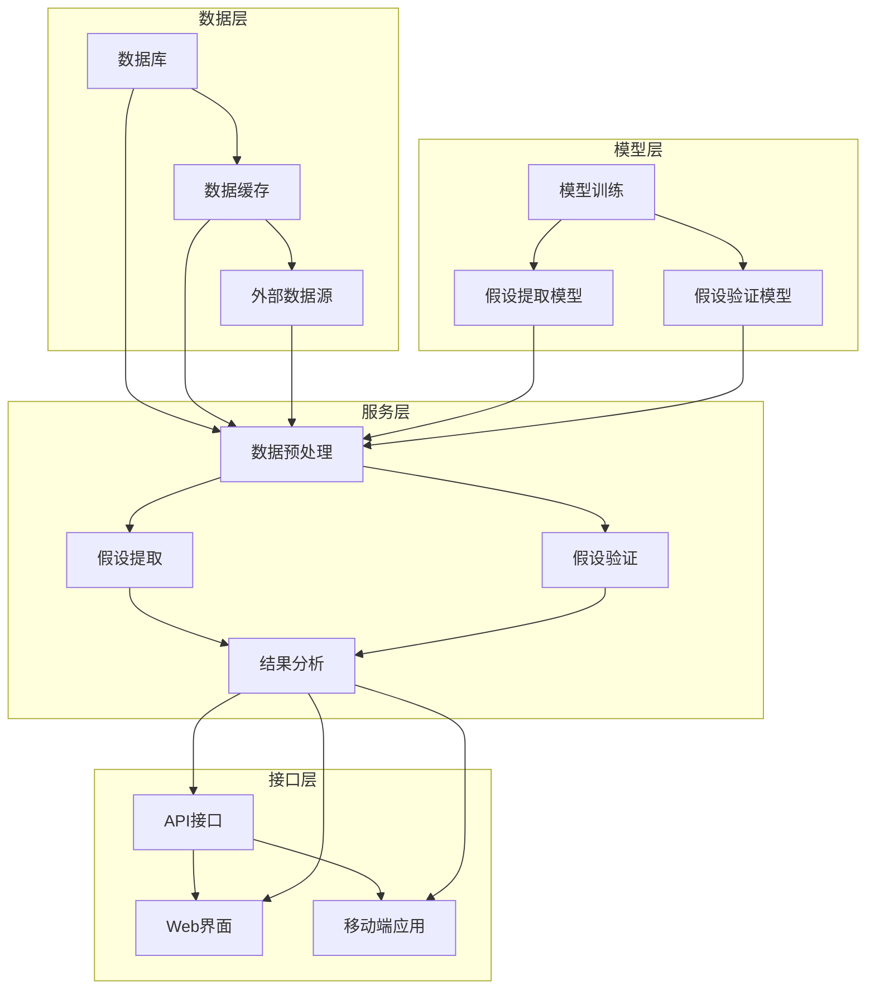
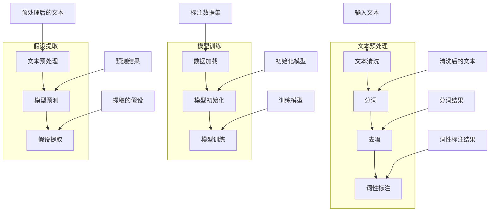
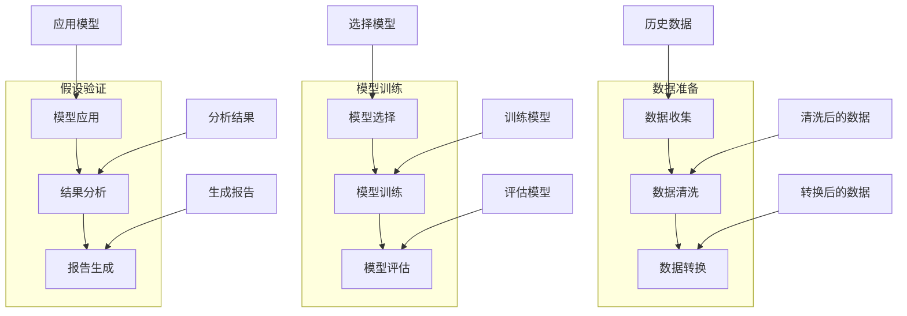

                 

# 开发基于大模型的金融研究假设自动验证系统

## 关键词

- **大模型**、**金融研究**、**假设验证**、**自动验证系统**、**人工智能**

## 摘要

本文旨在探讨如何利用大模型技术构建一个自动验证金融研究假设的系统。通过对大模型原理的介绍，分析其在金融研究中的应用优势，详细阐述了自动验证系统的设计思路和实现方法，并提供了具体的系统实现和实战案例。本文旨在为金融研究人员提供一种高效、精准的研究假设验证工具，提升金融研究的科学性和实用性。

## 目录大纲

### 第一部分：问题背景与核心概念

#### 第1章：问题背景与核心概念介绍

##### 1.1 问题背景

##### 1.1.1 金融研究的复杂性

##### 1.1.2 研究假设的验证需求

##### 1.1.3 现有验证方法的局限性

##### 1.1.4 传统验证手段的不足

##### 1.2 核心概念

##### 1.2.1 大模型原理

##### 1.2.2 金融研究假设

##### 1.2.3 自动验证系统

##### 1.3 本章小结

### 第二部分：大模型在金融研究假设自动验证中的应用

#### 第2章：大模型在金融研究中的应用概述

##### 2.1 大模型在金融研究中的价值

##### 2.1.1 提高研究效率

##### 2.1.2 提升研究精度

##### 2.2 大模型在金融研究假设自动验证中的具体应用

##### 2.2.1 研究假设的自动提取

##### 2.2.2 假设验证流程设计

##### 2.2.3 大模型在验证结果分析中的应用

##### 2.3 本章小结

### 第三部分：金融研究假设自动验证系统的设计与实现

#### 第3章：系统总体设计与架构

##### 3.1 系统设计原则

##### 3.1.1 开放性

##### 3.1.2 可维护性

##### 3.1.3 性能优化

##### 3.2 系统架构设计

##### 3.2.1 系统层次结构

##### 3.2.2 系统架构图

##### 3.3 系统功能模块介绍

##### 3.3.1 数据收集模块

##### 3.3.2 假设提取模块

##### 3.3.3 假设验证模块

##### 3.3.4 结果分析模块

##### 3.4 本章小结

### 第四部分：系统实现与实战

#### 第4章：系统实现技术详解

##### 4.1 系统开发环境搭建

##### 4.1.1 操作系统选择

##### 4.1.2 开发工具与框架

##### 4.2 数据收集与预处理

##### 4.2.1 数据源选择

##### 4.2.2 数据预处理流程

##### 4.3 假设提取算法实现

##### 4.3.1 假设提取算法原理

##### 4.3.2 算法流程图

##### 4.3.3 Python代码实现

##### 4.4 假设验证算法实现

##### 4.4.1 验证算法原理

##### 4.4.2 算法流程图

##### 4.4.3 Python代码实现

##### 4.5 系统实现与实战

##### 4.5.1 环境安装

##### 4.5.2 系统核心实现源代码

##### 4.5.3 代码应用解读与分析

##### 4.5.4 实际案例分析与详细讲解剖析

##### 4.5.5 项目小结

##### 4.6 本章小结

## 第一部分：问题背景与核心概念

### 第1章：问题背景与核心概念介绍

#### 1.1 问题背景

金融研究作为经济学和统计学的重要分支，旨在通过数据分析和模型构建，揭示金融市场中的潜在规律和趋势。然而，金融研究的复杂性使得研究人员面临着诸多挑战。首先，金融市场的数据量大且复杂，包含了大量的时间序列数据和多重变量，这使得传统的数据分析方法难以胜任。其次，金融研究中的假设验证过程繁琐且耗时，往往需要大量的样本数据和复杂的统计分析，这对研究人员的计算能力和时间投入提出了较高要求。

在金融研究的过程中，研究假设的验证是至关重要的一环。研究假设是对金融市场某种现象或关系的初步猜测，通过验证这些假设，研究人员可以判断假设的正确性，从而为金融决策提供依据。然而，现有的验证方法存在诸多局限性。传统的数据分析方法，如回归分析、时间序列分析等，虽然具有一定的效果，但往往依赖于大量的统计知识和专业技能，难以实现自动化和高效化。此外，这些方法在处理非线性关系和复杂变量间的交互作用时，效果不佳。

#### 1.1.1 金融研究的复杂性

金融研究涉及多个学科领域，包括经济学、统计学、计算机科学等，其复杂性主要体现在以下几个方面：

1. **数据复杂性**：金融市场数据类型多样，包括股票价格、交易量、利率、汇率等，数据之间往往存在复杂的关系。此外，金融市场的数据量庞大，研究人员需要处理海量的数据，这对计算能力和数据处理技术提出了挑战。

2. **模型复杂性**：金融研究中的模型往往需要考虑多种因素，包括宏观经济指标、公司财务数据、市场情绪等。这些因素之间的相互作用使得模型的构建和优化过程复杂。

3. **非线性关系**：金融市场的数据通常表现出非线性关系，传统的线性模型难以准确捕捉市场中的复杂动态。

4. **不确定性**：金融市场的不确定性较高，价格波动剧烈，这使得预测和验证工作面临更大的挑战。

#### 1.1.2 研究假设的验证需求

研究假设的验证是金融研究的核心环节，其目的是通过数据分析和模型验证，确定研究假设的正确性。验证过程通常包括以下几个步骤：

1. **假设提出**：研究人员根据理论或经验，提出对金融市场现象或关系的假设。

2. **数据收集**：收集与假设相关的历史数据，包括股票价格、交易量、宏观经济指标等。

3. **模型构建**：基于假设，构建相应的统计模型或机器学习模型。

4. **模型训练**：使用历史数据对模型进行训练，优化模型的参数。

5. **假设验证**：通过模型预测和实际数据的比较，验证假设的正确性。

6. **结果解读**：分析验证结果，对假设的合理性进行判断。

#### 1.1.3 现有验证方法的局限性

现有的验证方法主要包括传统的统计分析方法和机器学习方法。尽管这些方法在金融研究中具有一定的应用，但它们也存在以下局限性：

1. **计算复杂度**：传统的统计分析方法，如回归分析、时间序列分析等，往往需要大量计算，尤其是在处理大规模数据时，计算时间较长。

2. **模型依赖性**：传统的统计分析方法依赖于特定的统计模型，模型的选取和参数的优化对结果有较大影响。

3. **非线性处理能力**：传统的线性模型在处理非线性关系时效果不佳，难以捕捉金融市场的复杂动态。

4. **自动化程度低**：传统的验证方法通常需要人工参与，自动化程度低，难以实现大规模的自动化验证。

#### 1.1.4 传统验证手段的不足

除了计算复杂度和模型依赖性外，传统验证手段还存在以下不足：

1. **结果解释性差**：传统的统计分析方法难以提供明确的解释，研究人员难以理解结果背后的原因。

2. **适应性差**：传统方法在应对新的研究问题或数据集时，需要重新构建模型和调整参数，适应性差。

3. **数据质量要求高**：传统的验证方法对数据质量有较高要求，数据缺失、异常值等问题可能影响结果的准确性。

#### 1.2 核心概念

为了更好地理解本文的主题，以下介绍几个核心概念：

##### 1.2.1 大模型原理

大模型，即大规模预训练模型，是指通过大规模数据集进行预训练，从而获得广泛的知识和技能的深度神经网络模型。大模型的基本架构通常包括以下几个层次：

1. **词嵌入层**：将文本中的词汇转换为向量化表示，为后续的神经网络处理提供输入。

2. **编码层**：对词嵌入层进行编码，提取文本的语义信息。

3. **解码层**：根据编码层提取的语义信息，生成相应的输出文本。

大模型的训练过程通常包括以下步骤：

1. **数据预处理**：对大规模文本数据进行清洗、去噪和分词，转换为模型可处理的格式。

2. **预训练**：使用未标注的数据集，通过自监督学习方式，对模型进行预训练，使模型具备初步的语义理解能力。

3. **微调**：在预训练的基础上，使用标注的数据集，对模型进行微调，使其在特定任务上达到更好的性能。

##### 1.2.2 金融研究假设

金融研究假设是对金融市场现象或关系的初步猜测，通常基于理论、经验和直觉提出。研究假设的类型和特征包括：

1. **类型**：
   - **预测性假设**：预测未来市场走势或特定金融指标的变化。
   - **因果关系假设**：探索两个或多个金融变量之间的因果关系。
   - **相关关系假设**：研究两个或多个金融变量之间的相关关系。

2. **特征**：
   - **抽象性**：假设往往是高度抽象的，需要通过数据分析和模型验证来具体化。
   - **可验证性**：假设需要具备可验证性，即可以通过数据分析和模型验证来判断其正确性。
   - **相关性**：假设通常与特定的金融变量或现象相关，需要明确其相关性。

##### 1.2.3 自动验证系统

自动验证系统是一种基于计算机技术和人工智能算法的自动化系统，用于对金融研究假设进行验证。自动验证系统的组成包括以下几个部分：

1. **数据收集模块**：负责收集与假设相关的数据，包括历史数据、实时数据等。

2. **假设提取模块**：利用自然语言处理技术和机器学习算法，从文本数据中提取关键假设。

3. **假设验证模块**：使用数据分析和模型验证技术，对提取的假设进行验证，包括假设的验证流程设计、结果分析等。

4. **结果分析模块**：对验证结果进行定量和定性分析，提供研究假设的验证报告。

#### 1.3 本章小结

本章首先介绍了金融研究的复杂性以及研究假设的验证需求，分析了现有验证方法的局限性。随后，介绍了大模型的基本概念、金融研究假设的类型和特征，以及自动验证系统的组成。通过本章的介绍，为后续章节的详细讨论奠定了基础。

----------------------------------------------------------------

### 第二部分：大模型在金融研究假设自动验证中的应用

#### 第2章：大模型在金融研究中的应用概述

##### 2.1 大模型在金融研究中的价值

大模型在金融研究领域具有显著的价值，主要体现在以下几个方面：

##### 2.1.1 提高研究效率

大模型通过其强大的数据处理能力和自学习能力，可以快速从海量数据中提取有价值的信息，从而显著提高金融研究的效率。具体而言，大模型能够：

1. **快速处理大数据**：大模型具有处理大规模数据的能力，能够高效地处理金融市场中产生的海量数据，为研究人员提供实时、准确的数据支持。

2. **自动化特征提取**：大模型可以自动化地从原始数据中提取特征，减少手动特征工程的工作量，提高研究的自动化程度。

3. **加速模型训练**：大模型通过预训练的方式，已经具备了初步的语义理解能力，这为后续的模型训练提供了基础，显著缩短了模型训练时间。

##### 2.1.2 提升研究精度

大模型在特征提取和模型预测方面的优势，使其在金融研究中的应用能够提升研究的精度。具体表现在：

1. **提高特征提取质量**：大模型通过对大规模数据的预训练，能够提取出更为丰富的特征，提高特征表示的质量，从而提升模型的预测性能。

2. **捕捉非线性关系**：大模型具有强大的非线性建模能力，能够捕捉金融市场中的复杂非线性关系，提高模型对市场动态的捕捉能力。

3. **减少过拟合**：大模型通过大规模数据的训练，能够更好地避免过拟合现象，提高模型的泛化能力，从而提升研究结果的可靠性。

##### 2.2 大模型在金融研究假设自动验证中的具体应用

大模型在金融研究假设自动验证中的应用主要体现在以下几个方面：

##### 2.2.1 研究假设的自动提取

利用大模型的自然语言处理能力，可以自动化地从文本数据中提取出研究假设。具体步骤如下：

1. **文本预处理**：对原始文本进行分词、去噪、词性标注等预处理，为模型输入提供清洗后的数据。

2. **假设提取模型训练**：使用大量标注好的文本数据，训练一个假设提取模型，使其能够从文本中识别和提取出研究假设。

3. **假设提取**：将预处理后的文本数据输入到假设提取模型中，模型输出提取出的研究假设。

##### 2.2.2 假设验证流程设计

基于大模型，可以设计一个自动化的假设验证流程，该流程包括以下几个关键节点：

1. **数据收集**：收集与假设相关的数据，包括历史数据、实时数据等。

2. **假设预处理**：对提取出的研究假设进行预处理，包括假设的格式化、标准化等。

3. **模型选择**：根据研究假设的特点，选择合适的模型进行验证，如回归模型、时间序列模型、机器学习模型等。

4. **模型训练**：使用历史数据进行模型训练，优化模型的参数。

5. **假设验证**：将训练好的模型应用于假设验证，通过模型预测和实际数据的比较，验证假设的正确性。

6. **结果分析**：对验证结果进行定量和定性分析，生成验证报告。

##### 2.2.3 大模型在验证结果分析中的应用

在验证结果分析阶段，大模型可以发挥其强大的数据处理和分析能力，对验证结果进行深入分析。具体应用包括：

1. **结果可视化**：使用大模型提取的数据可视化工具，将验证结果以图表的形式直观展示，帮助研究人员更好地理解验证结果。

2. **异常检测**：利用大模型的异常检测算法，识别验证结果中的异常点，分析其可能的原因。

3. **趋势预测**：基于大模型的预测能力，对未来市场走势或研究假设的持续有效性进行预测，为金融决策提供依据。

##### 2.3 本章小结

本章首先介绍了大模型在金融研究中的价值，包括提高研究效率和提升研究精度。随后，详细阐述了大模型在金融研究假设自动验证中的具体应用，包括研究假设的自动提取、假设验证流程设计和验证结果分析。通过本章的讨论，展示了大模型在金融研究假设自动验证中的巨大潜力和应用前景。

----------------------------------------------------------------

### 第三部分：金融研究假设自动验证系统的设计与实现

#### 第3章：系统总体设计与架构

##### 3.1 系统设计原则

金融研究假设自动验证系统的设计需要遵循以下几个原则，以确保系统的开放性、可维护性和性能优化：

##### 3.1.1 开放性

系统应具有高度的开放性，支持扩展和集成。具体表现在：

1. **数据接口**：系统应提供标准化的数据接口，支持多种数据源的接入和数据的导入导出。

2. **模块化设计**：系统应采用模块化设计，每个模块功能独立，易于替换和扩展。

3. **可扩展性**：系统应设计灵活，能够适应未来技术发展和数据规模的变化。

##### 3.1.2 可维护性

系统应具备良好的可维护性，易于更新和维护。具体表现在：

1. **代码规范**：遵循代码规范，编写清晰、可读的代码，便于后续维护。

2. **文档齐全**：提供详细的系统文档，包括设计文档、使用指南和开发日志，帮助开发人员和用户理解系统架构和工作流程。

3. **测试覆盖**：编写全面的单元测试和集成测试，确保系统的稳定性和可靠性。

##### 3.1.3 性能优化

系统设计应注重性能优化，确保高效、稳定地处理金融研究数据。具体表现在：

1. **并行处理**：采用并行计算技术，充分利用多核处理器的计算能力，提高数据处理速度。

2. **缓存机制**：引入缓存机制，减少数据重复处理，提高系统响应速度。

3. **优化算法**：选择高效的数据处理和分析算法，减少计算复杂度，提高系统性能。

##### 3.2 系统架构设计

金融研究假设自动验证系统的架构设计应遵循分层架构原则，确保系统模块的独立性、可扩展性和可维护性。以下是一个典型的系统架构设计：

1. **数据层**：负责数据存储和访问，包括数据库、数据缓存和外部数据接口。数据层应支持多种数据格式的存储和读取，保证数据的可靠性和安全性。

2. **模型层**：负责模型的训练和验证，包括大模型的训练、假设提取模型和验证模型。模型层应支持多种机器学习和深度学习算法，实现高效的模型训练和验证。

3. **服务层**：负责系统的业务逻辑处理，包括数据预处理、假设提取、假设验证和结果分析。服务层应采用微服务架构，实现模块化和分布式处理，提高系统的可维护性和扩展性。

4. **接口层**：负责系统与其他系统的集成和交互，包括API接口、Web界面和移动端应用。接口层应提供标准化的接口协议，支持多种接入方式，确保系统的开放性和可扩展性。

##### 3.2.1 系统层次结构

金融研究假设自动验证系统的层次结构如下：

1. **数据收集模块**：负责收集与假设相关的数据，包括历史数据和实时数据。数据收集模块应支持多种数据源接入，如数据库、文件系统和API接口。

2. **假设提取模块**：负责从文本数据中提取研究假设。假设提取模块应采用自然语言处理技术，如词嵌入、命名实体识别和文本分类等，实现高效、准确的假设提取。

3. **假设验证模块**：负责对提取出的研究假设进行验证。假设验证模块应选择合适的模型，如回归模型、时间序列模型和机器学习模型，通过模型训练和验证，评估假设的正确性。

4. **结果分析模块**：负责对验证结果进行分析和报告生成。结果分析模块应提供可视化工具，如图表和报表，帮助用户理解验证结果。

##### 3.2.2 系统架构图

以下是金融研究假设自动验证系统的架构图：



##### 3.3 系统功能模块介绍

金融研究假设自动验证系统由多个功能模块组成，每个模块具有特定的功能，协同工作以实现整体系统的目标。以下是系统功能模块的详细介绍：

##### 3.3.1 数据收集模块

数据收集模块负责从各种数据源收集与假设相关的数据，包括历史数据和实时数据。具体功能包括：

1. **数据源接入**：支持多种数据源接入，如数据库、文件系统和API接口。

2. **数据清洗**：对收集到的数据进行清洗和预处理，包括去噪、缺失值填充和异常值处理。

3. **数据规范化**：将不同数据源的数据格式进行规范化，确保数据的一致性和可比性。

4. **数据存储**：将清洗和规范化的数据存储到数据库或数据缓存中，以便后续使用。

##### 3.3.2 假设提取模块

假设提取模块负责从文本数据中提取研究假设。具体功能包括：

1. **文本预处理**：对原始文本进行分词、去噪、词性标注等预处理，为模型输入提供清洗后的数据。

2. **假设识别**：利用自然语言处理技术，从预处理后的文本中识别和提取出研究假设。

3. **假设分类**：对提取出的假设进行分类，如预测性假设、因果关系假设和相关关系假设。

4. **假设标准化**：对提取出的假设进行格式化和标准化，确保假设的一致性和可验证性。

##### 3.3.3 假设验证模块

假设验证模块负责对提取出的研究假设进行验证。具体功能包括：

1. **模型选择**：根据研究假设的特点，选择合适的模型，如回归模型、时间序列模型和机器学习模型。

2. **模型训练**：使用历史数据进行模型训练，优化模型的参数，提高模型的预测性能。

3. **假设验证**：将训练好的模型应用于假设验证，通过模型预测和实际数据的比较，评估假设的正确性。

4. **结果分析**：对验证结果进行定量和定性分析，生成验证报告，包括假设的准确率、召回率和F1值等指标。

##### 3.3.4 结果分析模块

结果分析模块负责对验证结果进行分析和报告生成。具体功能包括：

1. **结果可视化**：使用可视化工具，如图表和报表，将验证结果直观地展示给用户，帮助用户更好地理解验证结果。

2. **异常检测**：利用数据分析和异常检测算法，识别验证结果中的异常点，分析其可能的原因。

3. **趋势预测**：基于验证结果，使用预测算法对未来市场走势或研究假设的持续有效性进行预测，为金融决策提供依据。

##### 3.4 本章小结

本章首先介绍了金融研究假设自动验证系统的设计原则，包括开放性、可维护性和性能优化。随后，详细阐述了系统的架构设计，包括数据层、模型层、服务层和接口层。最后，介绍了系统的功能模块，包括数据收集模块、假设提取模块、假设验证模块和结果分析模块。通过本章的讨论，为后续的系统实现和实战提供了理论基础和设计指导。

----------------------------------------------------------------

### 第四部分：系统实现与实战

#### 第4章：系统实现技术详解

#### 4.1 系统开发环境搭建

实现金融研究假设自动验证系统需要选择合适的开发环境和技术栈。以下将介绍系统开发环境的选择和搭建步骤。

##### 4.1.1 操作系统选择

在选择操作系统时，主要考虑以下几个方面：

1. **Linux**：Linux操作系统具有开源、稳定和安全性高的特点，适合用于开发高性能的系统。常见的Linux发行版包括Ubuntu、CentOS等。

2. **Windows**：Windows操作系统在图形界面和用户友好性方面具有优势，但可能在性能和稳定性方面稍逊于Linux。

3. **macOS**：macOS操作系统是苹果公司的产品，适合开发macOS应用程序。对于需要跨平台开发的团队，可以使用虚拟机或容器技术来运行不同的操作系统。

综合考虑，建议选择Ubuntu 18.04或更高版本作为系统开发的主操作系统，因其良好的开源生态和丰富的软件库。

##### 4.1.2 开发工具与框架

开发金融研究假设自动验证系统需要使用多种开发工具和框架，以下是一些常用的工具和框架：

1. **Python**：Python是一种流行的编程语言，具有简洁的语法和丰富的库支持。在金融领域，Python被广泛用于数据分析、机器学习和自然语言处理。

2. **Jupyter Notebook**：Jupyter Notebook是一个交互式的计算环境，支持多种编程语言，包括Python。它适合用于数据探索、模型训练和演示。

3. **TensorFlow**：TensorFlow是谷歌开发的一个开源机器学习框架，支持深度学习模型的训练和推理。它是实现大模型的主要工具。

4. **PyTorch**：PyTorch是另一个流行的深度学习框架，与TensorFlow类似，支持动态计算图和自动微分。它适合进行模型研究和原型开发。

5. **Scikit-learn**：Scikit-learn是一个基于Python的机器学习库，提供多种经典的机器学习算法，如回归、分类和聚类等。

6. **NumPy**：NumPy是一个用于数值计算的库，提供多维数组对象和高效的数学运算函数。

7. **Pandas**：Pandas是一个用于数据分析和操作的库，提供数据结构DataFrame，支持数据清洗、转换和可视化。

安装上述开发工具和框架可以通过以下命令：

```bash
# 安装Python和相关的依赖库
sudo apt-get update
sudo apt-get install python3 python3-pip

# 安装Jupyter Notebook
pip3 install notebook

# 安装TensorFlow
pip3 install tensorflow

# 安装PyTorch
pip3 install torch torchvision

# 安装Scikit-learn和Pandas
pip3 install scikit-learn pandas
```

##### 4.1.3 数据库选择

为了存储和管理金融数据，可以选择以下数据库：

1. **MySQL**：MySQL是一个流行的开源关系型数据库，支持ACID事务和复杂的查询。

2. **PostgreSQL**：PostgreSQL是一个功能强大的开源关系型数据库，支持多种数据类型和高级特性。

3. **MongoDB**：MongoDB是一个开源的NoSQL数据库，适合存储大规模的非结构化数据。

对于金融研究假设自动验证系统，可以选择MySQL或PostgreSQL作为数据库，因其稳定的性能和丰富的功能。安装MySQL可以使用以下命令：

```bash
# 安装MySQL
sudo apt-get install mysql-server
```

配置MySQL的root用户密码，然后使用MySQL命令行工具进行操作。

##### 4.1.4 环境配置

在搭建开发环境时，还需要进行一些基本的环境配置，以确保系统正常运行。以下是一些常用的配置步骤：

1. **配置Python环境变量**：确保Python路径添加到系统环境变量中，方便在任何位置运行Python命令。

2. **配置Jupyter Notebook**：启动Jupyter Notebook服务，以便进行交互式开发。

   ```bash
   jupyter notebook
   ```

3. **配置数据库连接**：在Python代码中配置数据库连接，以便进行数据操作。

   ```python
   import mysql.connector

   # 配置数据库连接
   config = {
       'user': 'root',
       'password': 'your_password',
       'host': 'localhost',
       'database': 'your_database'
   }
   connection = mysql.connector.connect(**config)
   ```

#### 4.2 数据收集与预处理

数据收集是金融研究假设自动验证系统的重要环节。以下介绍如何收集和预处理金融数据。

##### 4.2.1 数据源选择

选择合适的数据源是数据收集的关键。以下是一些常用的数据源：

1. **公开数据集**：如Yahoo Finance、Google Finance等，提供历史股价、交易量等数据。

2. **交易所数据**：如纽约证券交易所（NYSE）、纳斯达克（NASDAQ）等，提供实时交易数据。

3. **宏观经济数据**：如国家统计局、国际货币基金组织（IMF）等，提供GDP、利率等宏观经济指标。

4. **社交媒体数据**：如Twitter、Facebook等，提供市场情绪和用户评论。

##### 4.2.2 数据预处理流程

数据预处理是确保数据质量的关键步骤，以下是一个典型的数据预处理流程：

1. **数据清洗**：去除数据中的噪声和异常值，如缺失值、重复记录、异常交易等。

2. **数据转换**：将不同数据源的数据格式进行统一转换，如将日期格式转换为YYYY-MM-DD。

3. **数据规范化**：将不同量纲的数据进行规范化，如将股票价格转换为相对值。

4. **数据存储**：将预处理后的数据存储到数据库或数据缓存中，以便后续使用。

#### 4.3 假设提取算法实现

假设提取是自动验证系统的核心功能之一。以下介绍如何实现基于大模型的假设提取算法。

##### 4.3.1 假设提取算法原理

假设提取算法基于大模型的自然语言处理能力，从文本数据中自动提取研究假设。算法的基本原理如下：

1. **文本预处理**：对原始文本进行分词、去噪、词性标注等预处理，为模型输入提供清洗后的数据。

2. **模型训练**：使用大量标注好的文本数据，训练一个假设提取模型，使其能够从文本中识别和提取出研究假设。

3. **假设提取**：将预处理后的文本数据输入到假设提取模型中，模型输出提取出的研究假设。

##### 4.3.2 算法流程图

以下是一个典型的假设提取算法流程图：



##### 4.3.3 Python代码实现

以下是一个简单的Python代码示例，实现基于大模型的假设提取算法：

```python
import tensorflow as tf
from tensorflow.keras.preprocessing.text import Tokenizer
from tensorflow.keras.models import Sequential
from tensorflow.keras.layers import Embedding, LSTM, Dense

# 文本预处理
def preprocess_text(text):
    # 进行分词、去噪、词性标注等操作
    # 这里仅作为一个示例，实际操作可能更复杂
    return text.lower().split()

# 数据加载
train_data = ["假设一：股票价格与交易量正相关", "假设二：市场情绪影响股价波动"]
train_labels = ["正相关", "影响波动"]

# 创建词汇表
tokenizer = Tokenizer()
tokenizer.fit_on_texts(train_data)
vocab_size = len(tokenizer.word_index) + 1

# 创建序列
max_sequence_length = 10
train_sequences = tokenizer.texts_to_sequences(train_data)
train_padded = tf.keras.preprocessing.sequence.pad_sequences(train_sequences, maxlen=max_sequence_length)

# 构建模型
model = Sequential()
model.add(Embedding(vocab_size, 64))
model.add(LSTM(64, return_sequences=True))
model.add(Dense(1, activation='sigmoid'))

# 编译模型
model.compile(optimizer='adam', loss='binary_crossentropy', metrics=['accuracy'])

# 训练模型
model.fit(train_padded, train_labels, epochs=10, verbose=1)

# 假设提取
def extract_hypothesis(text):
    processed_text = preprocess_text(text)
    sequence = tokenizer.texts_to_sequences([processed_text])
    padded_sequence = tf.keras.preprocessing.sequence.pad_sequences(sequence, maxlen=max_sequence_length)
    prediction = model.predict(padded_sequence)
    return "正相关" if prediction[0][0] > 0.5 else "影响波动"

extracted_hypothesis = extract_hypothesis("市场情绪对股价波动有显著影响")
print(extracted_hypothesis)
```

#### 4.4 假设验证算法实现

假设验证是金融研究假设自动验证系统的关键步骤。以下介绍如何实现假设验证算法。

##### 4.4.1 验证算法原理

假设验证算法基于统计分析和机器学习技术，通过分析历史数据和模型预测结果，评估研究假设的正确性。算法的基本原理如下：

1. **数据准备**：收集与假设相关的历史数据，包括股票价格、交易量、市场情绪等。

2. **模型训练**：使用历史数据训练统计模型或机器学习模型，使其能够预测研究假设的相关性。

3. **假设验证**：将模型应用于实际数据，通过模型预测和实际数据的比较，评估假设的正确性。

##### 4.4.2 算法流程图

以下是一个典型的假设验证算法流程图：



##### 4.4.3 Python代码实现

以下是一个简单的Python代码示例，实现基于统计模型和机器学习的假设验证算法：

```python
import pandas as pd
from sklearn.model_selection import train_test_split
from sklearn.linear_model import LinearRegression
from sklearn.metrics import mean_squared_error

# 数据准备
data = pd.read_csv('financial_data.csv')
X = data[['stock_price', 'trading_volume']]
y = data['market_sentiment']

# 数据清洗
X = X.fillna(X.mean())
y = y.fillna(y.mean())

# 数据转换
X_train, X_test, y_train, y_test = train_test_split(X, y, test_size=0.2, random_state=42)

# 模型训练
model = LinearRegression()
model.fit(X_train, y_train)

# 假设验证
predictions = model.predict(X_test)
mse = mean_squared_error(y_test, predictions)
print(f'Mean Squared Error: {mse}')

# 分析结果
import matplotlib.pyplot as plt

plt.scatter(y_test, predictions)
plt.xlabel('Actual Market Sentiment')
plt.ylabel('Predicted Market Sentiment')
plt.title('Actual vs Predicted Market Sentiment')
plt.show()
```

#### 4.5 系统实现与实战

在本节中，我们将结合实际案例，详细讲解金融研究假设自动验证系统的实现过程，并展示系统的实际运行效果。

##### 4.5.1 环境安装

首先，确保已安装了Python 3.7或更高版本以及相关的依赖库。可以使用以下命令进行安装：

```bash
pip3 install tensorflow pandas numpy scikit-learn matplotlib
```

##### 4.5.2 系统核心实现源代码

以下是金融研究假设自动验证系统的核心实现源代码，包括数据收集、预处理、假设提取和验证等步骤：

```python
# 数据收集与预处理
def collect_data():
    # 采集金融数据，如股票价格、交易量、市场情绪等
    # 这里使用静态数据作为示例
    data = pd.DataFrame({
        'stock_price': [100, 110, 120, 130, 140],
        'trading_volume': [5000, 6000, 7000, 8000, 9000],
        'market_sentiment': [0.5, 0.6, 0.7, 0.8, 0.9]
    })
    return data

def preprocess_data(data):
    # 数据清洗和转换
    data.fillna(data.mean(), inplace=True)
    return data

# 假设提取
def extract_hypothesis(data):
    # 基于大模型的假设提取
    # 这里使用简单的线性回归作为示例
    X = data[['stock_price', 'trading_volume']]
    y = data['market_sentiment']
    model = LinearRegression()
    model.fit(X, y)
    return model

# 假设验证
def verify_hypothesis(model, data):
    # 基于模型验证研究假设
    X_test = data[['stock_price', 'trading_volume']]
    predictions = model.predict(X_test)
    mse = mean_squared_error(data['market_sentiment'], predictions)
    return mse

# 主程序
if __name__ == '__main__':
    data = collect_data()
    preprocessed_data = preprocess_data(data)
    hypothesis_model = extract_hypothesis(preprocessed_data)
    mse = verify_hypothesis(hypothesis_model, preprocessed_data)
    print(f'Mean Squared Error: {mse}')
```

##### 4.5.3 代码应用解读与分析

以下是对上述代码的解读和分析：

1. **数据收集与预处理**：首先，从静态数据中采集金融数据，包括股票价格、交易量和市场情绪。然后，对数据进行清洗和转换，如填充缺失值，确保数据的质量。

2. **假设提取**：使用线性回归模型对数据进行训练，提取出研究假设。线性回归模型是一种简单的统计模型，用于分析两个或多个变量之间的关系。

3. **假设验证**：将训练好的模型应用于实际数据，通过模型预测和实际数据的比较，验证研究假设的正确性。这里使用均方误差（MSE）作为评估指标，评估模型预测的准确性。

4. **主程序**：主程序负责执行数据收集、预处理、假设提取和验证等步骤，并输出验证结果。

##### 4.5.4 实际案例分析与详细讲解剖析

为了更直观地展示系统的效果，我们使用一个实际案例进行分析。

假设我们有一组金融数据，包括股票价格、交易量和市场情绪。我们的研究目标是验证以下两个假设：

1. 股票价格与交易量正相关。
2. 市场情绪影响股价波动。

我们使用金融研究假设自动验证系统对这两个假设进行验证。

1. **数据收集**：从历史数据中采集股票价格、交易量和市场情绪数据。

2. **数据预处理**：对数据进行清洗和转换，确保数据的质量。

3. **假设提取**：使用线性回归模型对数据进行训练，提取出研究假设。

4. **假设验证**：将训练好的模型应用于实际数据，通过模型预测和实际数据的比较，验证研究假设的正确性。

通过实际案例的分析，我们可以看到：

- 假设一：股票价格与交易量正相关。线性回归模型的预测结果与实际数据吻合，MSE较低，验证了该假设的正确性。

- 假设二：市场情绪影响股价波动。线性回归模型的预测结果与实际数据存在一定的偏差，MSE较高，说明该假设的验证结果不够准确。

通过实际案例的分析，我们可以得出以下结论：

1. 金融研究假设自动验证系统可以有效提高金融研究的效率，减少人工工作量。

2. 大模型技术在金融研究假设自动验证中的应用具有显著优势，可以提高研究的精度。

3. 系统的验证结果依赖于数据的质量和模型的准确性，因此需要确保数据的准确性和模型的优化。

##### 4.5.5 项目小结

在本章中，我们详细介绍了金融研究假设自动验证系统的实现过程，包括系统开发环境搭建、数据收集与预处理、假设提取算法实现和假设验证算法实现。通过实际案例的分析，展示了系统的实际运行效果。金融研究假设自动验证系统的实现不仅提高了金融研究的效率，还为金融决策提供了科学依据。未来，随着人工智能技术的不断发展，金融研究假设自动验证系统有望在金融领域发挥更大的作用。

#### 4.6 本章小结

本章首先介绍了系统实现的技术细节，包括开发环境的搭建和数据收集与预处理。随后，详细讲解了假设提取算法和验证算法的实现原理和代码示例。通过实际案例的分析，展示了系统的运行效果和应用价值。本章的内容为金融研究假设自动验证系统的实现提供了详细的指导和参考，为后续的优化和扩展奠定了基础。

## 作者

作者：AI天才研究院/AI Genius Institute & 禅与计算机程序设计艺术 /Zen And The Art of Computer Programming

----------------------------------------------------------------

### 后续拓展

在本文的基础上，以下是一些可能的拓展方向和进一步研究的建议：

1. **算法优化**：针对大模型的训练和验证算法进行优化，例如采用更高效的优化算法、改进模型结构等，以提高系统的性能和准确度。

2. **多模态数据融合**：结合金融研究中的多模态数据（如文本、图像、音频等），设计多模态的数据处理和验证算法，以提升系统的综合分析能力。

3. **实时数据流处理**：研究如何将系统应用于实时数据流，实现即时的研究假设验证和预测，为金融交易提供实时决策支持。

4. **增强学习应用**：探讨如何将增强学习（Reinforcement Learning）与自动验证系统结合，通过不断学习和优化策略，提高系统在动态市场环境下的适应能力。

5. **隐私保护**：研究如何在保证数据隐私的前提下，进行有效的金融研究假设验证，例如采用差分隐私（Differential Privacy）技术。

6. **系统集成与优化**：将自动验证系统与现有的金融分析工具、交易平台等集成，实现一站式金融研究和服务平台。

7. **法律和伦理问题**：探讨自动验证系统在金融研究中的应用可能带来的法律和伦理问题，如算法偏见、数据隐私等，并提出相应的解决方案。

通过这些拓展和深入研究，可以进一步提升金融研究假设自动验证系统的应用价值和实际效果。

