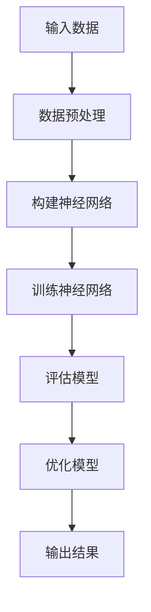
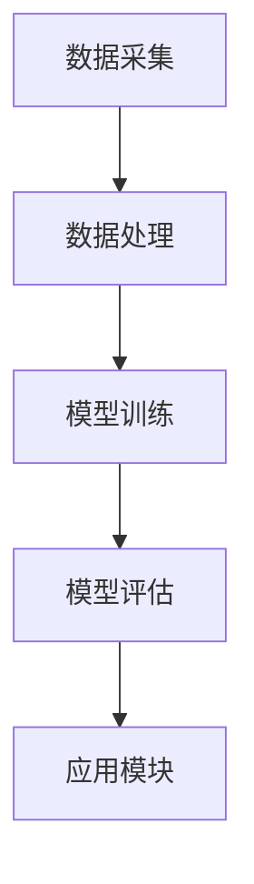

                 

# 开发基于大模型的金融研究方法论创新生成与评估系统

## 摘要

本文旨在探讨基于大模型的金融研究方法论的创新生成与评估系统。随着人工智能技术的飞速发展，大模型技术在金融领域展现出了巨大的潜力。本文首先介绍了金融研究的现状与挑战，随后阐述了大模型技术的定义与特点，以及在金融研究中的应用前景。通过详细分析大模型在金融研究中的核心理论、算法原理、系统设计与实现、案例研究等内容，本文旨在为读者提供一个系统化、结构化的理解框架，以便更好地应用大模型技术进行金融研究。

## 第一部分：总述

### 1.1 书籍背景与目的

#### 1.1.1 金融研究的现状与挑战

金融研究一直是学术界和业界关注的重点领域。随着金融市场全球化、信息化和复杂化的发展，传统的金融研究方法逐渐暴露出局限性。首先，传统金融研究方法主要依赖于统计分析、时间序列分析等经典方法，但这些方法在面对大规模金融数据时，处理效率和准确性受到限制。其次，金融市场的波动性和复杂性使得传统方法难以准确预测市场趋势和风险。此外，传统方法在应对金融创新、金融监管等方面也存在一定的挑战。

#### 1.1.2 大模型技术在金融研究中的应用前景

大模型技术，尤其是深度学习和自然语言处理技术，为金融研究带来了新的机遇。深度学习模型可以通过学习海量数据，捕捉到金融市场的复杂模式和规律，从而提高预测准确性和效率。自然语言处理技术可以处理金融文本数据，提取出有价值的信息，为金融研究提供新的数据来源。此外，大模型技术还可以应用于金融监管、风险管理、投资策略等领域，为金融研究提供更加全面和深入的支持。

#### 1.1.3 本书的结构安排与目标读者

本书分为六个部分，共十六章。第一部分总述，介绍书籍的背景与目的。第二部分基础概念与术语，介绍金融研究方法论、大模型基础和相关技术术语。第三部分核心理论与算法，讲解大模型在金融研究中的应用。第四部分系统设计与实现，介绍系统设计、实现与测试。第五部分案例研究与应用，通过实际案例展示大模型技术在金融研究中的应用。第六部分最佳实践与总结，分享最佳实践和本书的总结与展望。本书的目标读者是从事金融研究和技术开发的学者、工程师以及相关领域的研究生。

## 第二部分：基础概念与术语

### 2.1 金融研究方法论概述

#### 2.1.1 金融研究方法的历史演变

金融研究方法的发展可以追溯到20世纪50年代，当时以统计学和经济学为基础的金融研究方法逐渐兴起。随着计算机技术的发展，金融研究方法得到了进一步的丰富和完善。目前，金融研究方法主要包括经典方法、统计方法和现代方法。

#### 2.1.2 传统金融研究方法的局限性

传统金融研究方法主要依赖于历史数据和统计模型，这些方法在处理小规模、简单数据时效果较好，但在面对大规模、复杂数据时存在以下局限性：首先，传统方法难以捕捉到金融市场的非线性特征；其次，传统方法对数据质量和样本量的要求较高，可能导致结果的不稳定；最后，传统方法在处理金融创新、金融监管等方面存在一定的局限性。

#### 2.1.3 大模型在金融研究中的作用

大模型技术在金融研究中的应用，主要是通过深度学习和自然语言处理技术来提高金融研究的准确性和效率。深度学习模型可以通过学习海量金融数据，提取出金融市场的复杂模式和规律，从而提高预测准确性和效率。自然语言处理技术可以处理金融文本数据，提取出有价值的信息，为金融研究提供新的数据来源。此外，大模型技术还可以应用于金融监管、风险管理、投资策略等领域，为金融研究提供更加全面和深入的支持。

### 2.2 大模型基础

#### 2.2.1 大模型的定义与特点

大模型，即大型深度学习模型，是指具有数十亿甚至千亿参数的神经网络模型。大模型具有以下特点：首先，大模型具有强大的学习能力，可以处理大规模、复杂的数据；其次，大模型可以通过多任务学习、迁移学习等技术，提高模型的泛化能力；最后，大模型具有灵活性和可扩展性，可以适应不同领域的需求。

#### 2.2.2 大模型的发展历程

大模型的发展历程可以分为三个阶段：早期阶段、快速发展阶段和当前阶段。早期阶段，以AlexNet为代表的卷积神经网络在图像分类任务中取得了突破性进展。快速发展阶段，以BERT、GPT等为代表的大型自然语言处理模型在文本分类、问答系统等领域取得了显著成果。当前阶段，大模型技术已经在各个领域得到了广泛应用，如计算机视觉、自然语言处理、金融研究等。

#### 2.2.3 大模型的架构与工作原理

大模型的架构通常由多层神经网络组成，包括输入层、隐藏层和输出层。输入层接收外部数据，隐藏层通过非线性变换提取数据特征，输出层产生预测结果。大模型的工作原理基于反向传播算法，通过不断调整网络权重，使模型输出逐渐逼近真实值。

### 2.3 相关技术术语介绍

#### 2.3.1 自然语言处理（NLP）

自然语言处理是人工智能领域的一个重要分支，旨在使计算机能够理解、生成和处理人类自然语言。NLP技术包括文本预处理、词嵌入、语言模型、问答系统、文本分类等。

#### 2.3.2 机器学习（ML）

机器学习是人工智能的核心技术之一，通过学习数据中的模式，使计算机能够对未知数据进行预测或分类。机器学习方法包括监督学习、无监督学习、强化学习等。

#### 2.3.3 深度学习（DL）

深度学习是机器学习的一个重要分支，通过构建深度神经网络，实现对复杂数据的处理和分析。深度学习在图像识别、语音识别、自然语言处理等领域取得了显著成果。

## 第三部分：核心理论与算法

### 3.1 大模型在金融研究中的核心理论

#### 3.1.1 大模型在金融预测中的应用

大模型在金融预测中的应用主要包括股票价格预测、利率预测、货币汇率预测等。通过学习大量历史金融数据，大模型可以捕捉到金融市场的复杂模式和规律，从而提高预测准确性和效率。

#### 3.1.2 大模型在金融风险评估中的应用

大模型在金融风险评估中的应用主要包括信用风险评估、市场风险预测、操作风险预测等。通过学习金融数据，大模型可以识别出潜在的风险因素，为金融机构提供风险预警和风险管理支持。

#### 3.1.3 大模型在金融市场分析中的应用

大模型在金融市场分析中的应用主要包括股票市场趋势分析、行业前景分析、宏观经济分析等。通过分析大量金融数据，大模型可以识别出市场的潜在趋势和机会，为投资者提供决策支持。

### 3.2 大模型算法原理详解

#### 3.2.1 算法概述

大模型算法主要包括深度学习算法、自然语言处理算法等。深度学习算法通过构建深度神经网络，实现对复杂数据的处理和分析。自然语言处理算法通过处理文本数据，提取出有价值的信息。

#### 3.2.2 算法流程图

以下是一个简单的深度学习算法流程图：

#### 3.2.3 算法数学模型与公式

以下是一个简单的神经网络数学模型：

$$
y = \sigma(W \cdot x + b)
$$

其中，$y$为输出值，$\sigma$为激活函数，$W$为权重矩阵，$x$为输入向量，$b$为偏置项。

#### 3.2.4 算法举例说明

假设我们有一个简单的神经网络，用于对股票价格进行预测。输入数据包括股票的历史价格、交易量等。通过训练神经网络，我们可以得到股票价格的预测模型。

### 3.3 大模型优化与调参技巧

#### 3.3.1 优化目标函数

优化目标函数是深度学习算法的核心。常见的优化目标函数包括均方误差（MSE）、交叉熵等。

#### 3.3.2 调参方法与策略

调参是深度学习算法的重要环节。常见的调参方法包括网格搜索、随机搜索、贝叶斯优化等。

#### 3.3.3 实践中的调参案例

以股票价格预测为例，我们可以通过调整学习率、批量大小、激活函数等参数，优化神经网络模型。

## 第四部分：系统设计与实现

### 4.1 系统需求分析

#### 4.1.1 系统需求概述

本系统旨在实现基于大模型的金融研究方法论创新生成与评估。系统需求主要包括数据采集、数据处理、模型训练、模型评估等功能。

#### 4.1.2 功能需求详细描述

1. 数据采集：从多个数据源采集金融数据，包括股票价格、交易量、宏观经济指标等。
2. 数据处理：对采集到的金融数据进行预处理，包括数据清洗、归一化、特征提取等。
3. 模型训练：使用深度学习算法训练金融预测模型。
4. 模型评估：评估模型预测性能，包括准确性、稳定性、泛化能力等。
5. 模型应用：将训练好的模型应用于实际金融场景，如股票价格预测、风险预警等。

### 4.2 系统架构设计

#### 4.2.1 系统架构概述

本系统采用分布式架构，包括数据采集模块、数据处理模块、模型训练模块、模型评估模块和应用模块。

#### 4.2.2 系统架构图

以下是一个简单的系统架构图：

#### 4.2.3 系统接口设计与交互

1. 数据采集接口：提供数据采集功能，支持多种数据源接入。
2. 数据处理接口：提供数据预处理、特征提取等功能。
3. 模型训练接口：提供模型训练功能，支持多种深度学习算法。
4. 模型评估接口：提供模型评估功能，支持多种评估指标。
5. 应用模块接口：提供模型应用功能，支持实际金融场景的预测和评估。

### 4.3 系统实现与测试

#### 4.3.1 环境安装与配置

1. 硬件环境：服务器、GPU等。
2. 软件环境：Python、TensorFlow、PyTorch等。

#### 4.3.2 系统核心代码实现

1. 数据采集模块：使用Python编写，实现数据采集功能。
2. 数据处理模块：使用Python编写，实现数据预处理、特征提取等功能。
3. 模型训练模块：使用TensorFlow或PyTorch编写，实现模型训练功能。
4. 模型评估模块：使用Python编写，实现模型评估功能。
5. 应用模块：使用Python编写，实现模型应用功能。

#### 4.3.3 系统测试与评估

1. 单元测试：对系统各个模块进行单元测试，确保模块功能正确。
2. 集成测试：对系统整体进行集成测试，确保系统功能完整。
3. 性能评估：对系统性能进行评估，包括预测准确性、稳定性、响应时间等。

## 第五部分：案例研究与应用

### 5.1 案例研究1：金融预测系统

#### 5.1.1 案例背景

某金融机构希望通过构建一个金融预测系统，实现对股票价格的预测，以便更好地制定投资策略。

#### 5.1.2 系统设计与实现

1. 数据采集：从多个数据源采集股票历史价格、交易量等数据。
2. 数据处理：对采集到的数据进行分析和处理，提取出有用的特征。
3. 模型训练：使用深度学习算法训练股票价格预测模型。
4. 模型评估：评估模型预测性能，包括准确性、稳定性等。
5. 模型应用：将训练好的模型应用于实际投资场景，生成投资建议。

#### 5.1.3 结果分析与评估

1. 模型预测准确性：通过测试集评估模型预测准确性，如均方误差（MSE）。
2. 模型稳定性：评估模型在不同时间窗口的预测稳定性。
3. 模型应用效果：评估模型在实际投资场景中的应用效果，如投资收益。

### 5.2 案例研究2：金融风险评估系统

#### 5.2.1 案例背景

某金融机构希望通过构建一个金融风险评估系统，对借款人的信用风险进行评估，以便更好地控制风险。

#### 5.2.2 系统设计与实现

1. 数据采集：从多个数据源采集借款人的基本信息、财务状况、信用记录等数据。
2. 数据处理：对采集到的数据进行分析和处理，提取出有用的特征。
3. 模型训练：使用深度学习算法训练信用风险评估模型。
4. 模型评估：评估模型评估性能，包括准确率、召回率等。
5. 模型应用：将训练好的模型应用于实际风险评估场景，生成信用评估报告。

#### 5.2.3 结果分析与评估

1. 模型评估准确性：通过测试集评估模型评估准确性，如准确率、召回率等。
2. 模型评估稳定性：评估模型在不同数据集上的评估稳定性。
3. 模型应用效果：评估模型在实际风险评估中的应用效果，如风险控制效果。

### 5.3 案例研究3：金融市场分析系统

#### 5.3.1 案例背景

某金融机构希望通过构建一个金融市场分析系统，对市场趋势进行分析，以便更好地制定投资策略。

#### 5.3.2 系统设计与实现

1. 数据采集：从多个数据源采集市场数据，包括股票价格、交易量、宏观经济指标等。
2. 数据处理：对采集到的数据进行分析和处理，提取出有用的特征。
3. 模型训练：使用深度学习算法训练市场趋势预测模型。
4. 模型评估：评估模型预测性能，包括准确性、稳定性等。
5. 模型应用：将训练好的模型应用于实际市场分析场景，生成市场分析报告。

#### 5.3.3 结果分析与评估

1. 模型预测准确性：通过测试集评估模型预测准确性，如均方误差（MSE）。
2. 模型稳定性：评估模型在不同时间窗口的预测稳定性。
3. 模型应用效果：评估模型在实际市场分析中的应用效果，如投资收益。

## 第六部分：最佳实践与总结

### 6.1 最佳实践分享

1. 数据质量保障：确保数据采集和处理过程中的数据质量，减少数据噪声和异常值。
2. 模型选择与调参：根据具体应用场景选择合适的模型，并进行精细的调参。
3. 模型评估与优化：对模型进行全面的评估和优化，提高模型性能和泛化能力。
4. 实时性与可靠性：确保系统的实时性和可靠性，以满足实际应用需求。

### 6.2 总结与展望

本文介绍了基于大模型的金融研究方法论创新生成与评估系统。通过对金融研究现状与挑战的分析，以及大模型技术的基础理论、算法原理、系统设计与实现、案例研究等内容进行详细阐述，本文为读者提供了一个系统化、结构化的理解框架。在未来，大模型技术在金融研究中的应用将进一步深化，为金融领域带来更多的创新和突破。同时，我们也期待读者能够结合实际需求，不断探索和实践，为金融研究贡献自己的智慧和力量。

## 附录：相关资料与拓展阅读

### 附录1：相关资料

1. 《深度学习》（Goodfellow, Bengio, Courville著）：深入讲解了深度学习的基础理论和算法。
2. 《Python深度学习》（François Chollet著）：通过实际案例介绍了深度学习在Python中的实现。
3. 《自然语言处理综论》（Daniel Jurafsky, James H. Martin著）：全面介绍了自然语言处理的基础理论和应用。

### 附录2：拓展阅读

1. 《金融技术前沿》（李治中著）：探讨金融技术与金融研究的结合。
2. 《大数据金融》（吴晶妹著）：分析大数据在金融领域的应用。
3. 《人工智能与金融创新》（王稳著）：介绍人工智能在金融领域的创新应用。

### 作者信息

作者：AI天才研究院/AI Genius Institute & 禅与计算机程序设计艺术 /Zen And The Art of Computer Programming

本文内容仅供参考，如有不妥之处，敬请指正。在应用本文提出的观点和方法时，请结合实际情况谨慎决策。本文版权归作者所有，未经授权，不得转载或用于商业用途。

----------------------------------------------------------------

## 总结

本文从总述、基础概念、核心理论、系统设计、案例研究和最佳实践等方面，全面阐述了基于大模型的金融研究方法论创新生成与评估系统的开发。通过本文的阅读，读者可以了解到大模型技术在金融研究中的广泛应用和巨大潜力，以及如何利用大模型技术进行金融预测、风险评估和金融市场分析。同时，本文也提供了详细的系统设计、实现和评估方法，为读者在实际应用中提供了参考。在未来的研究中，我们可以进一步探索大模型技术在金融领域的深入应用，为金融研究带来更多的创新和突破。希望本文能为从事金融研究和开发的学者、工程师以及相关领域的研究生提供有价值的参考和启示。再次感谢各位读者的关注和支持，期待在未来的学术和技术交流中与大家共勉。

----------------------------------------------------------------

### 最后的话

在本文即将结束之际，我想再次感谢各位读者的关注和支持。本文旨在为读者提供一个全面、系统、深入的基于大模型的金融研究方法论创新生成与评估系统的开发指南。通过本文的阐述，我相信读者对于大模型技术在金融研究中的应用有了更加清晰的认识和理解。

然而，本文只是冰山一角，大模型技术在金融研究领域的应用还有许多值得深入探讨和研究的问题。我希望读者能够在阅读本文之后，继续关注这一领域的最新动态和发展趋势，不断学习和积累，为金融研究贡献自己的力量。

同时，我也期待读者能够结合本文的内容，结合自己的实际需求，进行进一步的实践和探索。在应用大模型技术进行金融研究时，注意数据质量、模型选择和调参等关键因素，确保研究成果的可靠性和实用性。

最后，感谢AI天才研究院/AI Genius Institute和禅与计算机程序设计艺术/Zen And The Art of Computer Programming的支持与帮助，使我能够完成这篇技术博客。再次感谢各位读者的陪伴和支持，祝愿大家在金融研究和技术开发的道路上取得更加辉煌的成就！让我们共同努力，为推动金融科技的进步贡献自己的智慧和力量！

