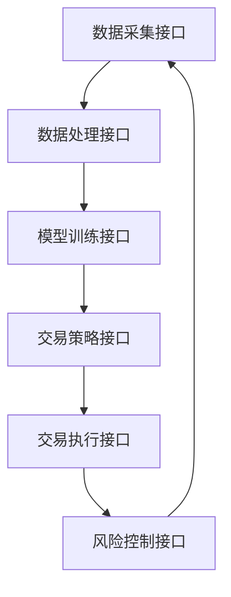

                 

# 开发基于深度学习的量化交易系统

## 关键词

量化交易、深度学习、神经网络、交易策略、风险控制、市场预测

## 摘要

本文将探讨如何利用深度学习技术构建高效、稳健的量化交易系统。首先，我们将介绍量化交易和深度学习的基本概念，分析其在量化交易中的应用场景。接着，我们将详细讲解深度学习模型的原理和算法，并使用Python代码示例进行说明。然后，我们将讨论量化交易系统的架构设计和实现，包括数据预处理、模型训练、交易策略设计和风险控制等内容。最后，我们将通过一个实际项目案例，展示如何应用本文的方法和思路，实现一个基于深度学习的量化交易系统。

## 第一部分：背景介绍

### 1.1 量化交易与深度学习概述

#### 1.1.1 量化交易的概念与特点

量化交易（Quantitative Trading）是一种利用数学模型和算法来指导投资决策的交易方式。它通过构建交易策略模型，利用历史数据进行分析，预测市场走势，并据此执行买卖操作。

量化交易具有以下特点：

1. **自动化**：量化交易依赖于计算机算法和数学模型，能够自动执行交易策略，减少人为干预。
2. **数据驱动**：量化交易依赖于大量历史数据，通过对数据进行分析和挖掘，发现市场规律，构建交易策略。
3. **高效性**：量化交易能够快速处理大量数据，迅速做出交易决策，提高交易效率。

#### 1.1.2 深度学习在量化交易中的应用

深度学习（Deep Learning）是一种基于人工神经网络的学习方法，通过多层非线性变换，从大量数据中自动提取特征，实现复杂的模式识别和预测。

深度学习在量化交易中的应用场景包括：

1. **市场趋势预测**：利用深度学习模型对市场数据进行建模，预测市场走势，指导交易决策。
2. **交易策略优化**：通过深度学习模型对历史交易数据进行分析，优化交易策略，提高交易成功率。
3. **风险控制**：利用深度学习模型对交易风险进行预测和控制，降低交易风险。

### 1.2 问题背景与边界

#### 1.2.1 问题背景

随着金融市场的发展和交易技术的进步，量化交易逐渐成为金融领域的重要手段。然而，量化交易面临的一个重大挑战是如何利用深度学习技术构建高效、稳健的交易系统。

#### 1.2.2 边界与外延

1. **边界**：本文主要关注如何使用深度学习技术构建量化交易系统，包括市场数据预处理、深度学习模型构建、交易策略设计等内容。
2. **外延**：本文不涉及金融市场的基础知识、交易规则的详细介绍，也不探讨深度学习以外的量化交易方法。

### 1.3 核心概念与联系

#### 1.3.1 深度学习基本概念

1. **神经网络**：神经网络是由大量神经元（节点）组成的计算模型，通过前向传播和反向传播算法进行训练，实现数据的高效处理和模式识别。
2. **深度学习模型**：深度学习模型是指具有多个隐藏层的神经网络，通过多层非线性变换，实现数据的自动特征提取和复杂模式的识别。
3. **深度学习框架**：深度学习框架是指用于构建和训练深度学习模型的软件库，如TensorFlow、PyTorch等，它们提供了丰富的API和工具，方便开发者搭建和优化深度学习模型。

#### 1.3.2 量化交易核心概念

1. **量化交易策略**：量化交易策略是指基于数学模型和统计方法，利用历史数据构建的交易策略，用于指导投资决策。
2. **量化交易系统**：量化交易系统是指实现量化交易策略的计算机程序，包括数据采集、数据处理、交易策略构建、交易执行等模块。
3. **量化交易风险控制**：量化交易风险控制是指通过构建风险模型，对交易风险进行预测和控制，降低交易损失。

#### 1.3.3 深度学习与量化交易联系

1. **数据驱动**：深度学习和量化交易都具有数据驱动的特点，依赖于大量历史数据进行模型训练和策略构建。
2. **模式识别**：深度学习模型擅长从数据中自动提取特征和识别复杂模式，这在量化交易策略优化和风险控制中具有重要应用。
3. **自动化**：深度学习技术可以自动化交易策略的构建和优化，提高量化交易的效率和准确性。

### 1.4 深度学习模型原理与算法

#### 1.4.1 神经网络与深度学习模型

1. **神经网络基本原理**：神经网络是一种计算模型，由大量神经元组成，通过前向传播和反向传播算法进行训练，实现数据的高效处理和模式识别。
2. **深度学习模型特点**：深度学习模型是指具有多个隐藏层的神经网络，通过多层非线性变换，实现数据的自动特征提取和复杂模式的识别。

#### 1.4.2 深度学习算法

1. **前向传播算法**：前向传播算法是指在神经网络中，将输入数据通过神经元逐层传递，直到输出层，生成预测结果。
2. **反向传播算法**：反向传播算法是指在神经网络中，根据预测结果和实际结果的误差，反向传播误差，更新网络权重和偏置，优化模型参数。

#### 1.4.3 深度学习框架

深度学习框架是指用于构建和训练深度学习模型的软件库，如TensorFlow、PyTorch等，它们提供了丰富的API和工具，方便开发者搭建和优化深度学习模型。

### 1.5 量化交易系统的架构设计与实现

#### 1.5.1 系统功能设计

量化交易系统的功能设计主要包括：

1. **数据采集**：从多个数据源采集金融市场的历史数据，如股票价格、交易量、宏观经济指标等。
2. **数据预处理**：对采集到的数据进行清洗、归一化、特征提取等预处理操作，为深度学习模型训练提供高质量的数据。
3. **模型训练**：使用深度学习模型对预处理后的数据进行分析和建模，训练预测模型。
4. **交易策略设计**：基于训练好的模型，设计交易策略，实现自动化的交易决策。
5. **交易执行**：根据交易策略，执行买入、卖出等交易操作，实现投资收益。
6. **风险控制**：对交易过程进行监控和管理，降低交易风险。

#### 1.5.2 系统架构设计

量化交易系统的架构设计主要包括：

1. **数据层**：存储和管理金融市场的历史数据，如股票价格、交易量等。
2. **模型层**：使用深度学习框架搭建和训练深度学习模型，实现数据分析和预测。
3. **策略层**：设计交易策略，实现自动化的交易决策。
4. **执行层**：执行交易策略，实现投资收益。
5. **监控层**：对交易过程进行监控和管理，降低交易风险。

#### 1.5.3 系统接口设计和系统交互

量化交易系统的接口设计和系统交互主要包括：

1. **数据采集接口**：用于从多个数据源采集金融市场的历史数据。
2. **数据处理接口**：用于对采集到的数据进行分析、清洗和预处理。
3. **模型训练接口**：用于搭建和训练深度学习模型。
4. **交易策略接口**：用于设计交易策略，实现自动化的交易决策。
5. **交易执行接口**：用于执行交易策略，实现投资收益。
6. **风险控制接口**：用于监控和管理交易过程，降低交易风险。

### 第二部分：核心概念与联系

在构建基于深度学习的量化交易系统时，我们需要深入了解深度学习和量化交易的核心概念，并分析它们之间的联系。

#### 2.1 深度学习基本概念

深度学习是一种基于人工神经网络的学习方法，通过多层非线性变换，从大量数据中自动提取特征，实现复杂的模式识别和预测。以下是深度学习的一些基本概念：

1. **神经网络**：神经网络是由大量神经元（节点）组成的计算模型，通过前向传播和反向传播算法进行训练，实现数据的高效处理和模式识别。
2. **深度学习模型**：深度学习模型是指具有多个隐藏层的神经网络，通过多层非线性变换，实现数据的自动特征提取和复杂模式的识别。
3. **深度学习框架**：深度学习框架是指用于构建和训练深度学习模型的软件库，如TensorFlow、PyTorch等，它们提供了丰富的API和工具，方便开发者搭建和优化深度学习模型。

#### 2.2 量化交易核心概念

量化交易是一种利用数学模型和算法来指导投资决策的交易方式。以下是量化交易的一些核心概念：

1. **量化交易策略**：量化交易策略是指基于数学模型和统计方法，利用历史数据构建的交易策略，用于指导投资决策。
2. **量化交易系统**：量化交易系统是指实现量化交易策略的计算机程序，包括数据采集、数据处理、交易策略构建、交易执行等模块。
3. **量化交易风险控制**：量化交易风险控制是指通过构建风险模型，对交易风险进行预测和控制，降低交易损失。

#### 2.3 深度学习与量化交易联系

深度学习与量化交易之间存在紧密的联系，主要体现在以下几个方面：

1. **数据驱动**：深度学习和量化交易都具有数据驱动的特点，依赖于大量历史数据进行模型训练和策略构建。深度学习通过从数据中自动提取特征和模式，帮助量化交易更好地理解市场规律。
2. **模式识别**：深度学习模型擅长从数据中自动提取特征和识别复杂模式，这在量化交易策略优化和风险控制中具有重要应用。例如，通过深度学习模型对历史交易数据进行分析，可以找出市场中的潜在趋势和规律，从而优化交易策略。
3. **自动化**：深度学习技术可以自动化交易策略的构建和优化，提高量化交易的效率和准确性。例如，使用深度学习框架搭建和训练神经网络模型，可以快速构建复杂的交易策略，实现自动化的交易决策。

### 第三部分：深度学习模型原理与算法

在构建基于深度学习的量化交易系统时，理解深度学习模型的原理和算法至关重要。本节将介绍深度学习模型的基本原理、常用算法，并使用Python代码示例进行说明。

#### 3.1 神经网络基本原理

神经网络（Neural Network）是由大量神经元（节点）组成的计算模型，通过前向传播（Forward Propagation）和反向传播（Back Propagation）算法进行训练，实现数据的高效处理和模式识别。以下是神经网络的基本原理：

1. **神经元结构**：一个神经元包含一个输入层、一个输出层和多个隐藏层。每个神经元接收来自前一层神经元的输入，通过加权求和，再进行非线性变换，生成输出。
2. **激活函数**：激活函数（Activation Function）用于对神经元的输出进行非线性变换，常用的激活函数包括 sigmoid、ReLU 和 tanh。
3. **前向传播**：前向传播是指将输入数据通过神经元逐层传递，直到输出层，生成预测结果。
4. **反向传播**：反向传播是指根据预测结果和实际结果的误差，反向传播误差，更新网络权重和偏置，优化模型参数。

#### 3.2 深度学习模型

深度学习模型（Deep Learning Model）是指具有多个隐藏层的神经网络，通过多层非线性变换，实现数据的自动特征提取和复杂模式的识别。以下是深度学习模型的基本原理：

1. **多层神经网络**：多层神经网络包含多个隐藏层，每个隐藏层都可以提取不同层次的特征。通过多层非线性变换，可以更好地捕捉数据的复杂模式。
2. **卷积神经网络**（Convolutional Neural Network，CNN）：卷积神经网络是一种特殊的深度学习模型，主要用于处理图像数据。它通过卷积层、池化层和全连接层，实现对图像数据的特征提取和分类。
3. **循环神经网络**（Recurrent Neural Network，RNN）：循环神经网络是一种特殊的深度学习模型，主要用于处理序列数据。它通过循环结构，捕捉序列数据的时间依赖关系。

#### 3.3 深度学习框架

深度学习框架（Deep Learning Framework）是指用于构建和训练深度学习模型的软件库，如TensorFlow、PyTorch等。以下是深度学习框架的基本原理：

1. **计算图**：深度学习框架使用计算图（Computational Graph）来表示神经网络模型。计算图由节点（操作）和边（依赖关系）组成，通过节点和边的组合，实现复杂的前向传播和反向传播算法。
2. **动态计算图**：动态计算图（Dynamic Computational Graph）是指在运行时动态构建和优化的计算图。动态计算图可以灵活地调整模型结构和参数，提高训练效率和性能。
3. **自动微分**：自动微分（Automatic Differentiation）是指自动计算函数的导数。在深度学习框架中，自动微分用于计算梯度，优化模型参数。

#### 3.4 深度学习算法

深度学习算法（Deep Learning Algorithm）是指用于训练深度学习模型的算法。以下是深度学习算法的基本原理：

1. **随机梯度下降**（Stochastic Gradient Descent，SGD）：随机梯度下降是一种优化算法，通过随机选择一部分样本，计算梯度并更新模型参数，优化模型性能。
2. **批量梯度下降**（Batch Gradient Descent，BGD）：批量梯度下降是一种优化算法，通过计算所有样本的梯度，更新模型参数，优化模型性能。
3. **Adam优化器**（Adaptive Moment Estimation）：Adam优化器是一种结合了SGD和BGD优点的优化算法，通过自适应地调整学习率，提高模型训练效率。

#### 3.5 Python代码示例

以下是使用Python和TensorFlow框架构建一个简单的深度学习模型的示例：

```python
import tensorflow as tf

# 定义神经网络结构
model = tf.keras.Sequential([
    tf.keras.layers.Dense(units=1, input_shape=[1]),
    tf.keras.layers.Dense(units=10, activation='relu'),
    tf.keras.layers.Dense(units=1)
])

# 编译模型
model.compile(optimizer='adam', loss='mean_squared_error')

# 训练模型
model.fit(x_train, y_train, epochs=100)

# 预测结果
predictions = model.predict(x_test)
```

在这个示例中，我们使用TensorFlow框架搭建了一个简单的线性回归模型。模型包含两个隐藏层，每层有10个神经元，使用ReLU激活函数。我们使用随机梯度下降优化器，最小化均方误差损失函数。通过训练模型，我们可以预测输入数据的输出结果。

### 第四部分：量化交易系统的架构设计与实现

在了解深度学习模型的基本原理和算法后，我们将进一步探讨量化交易系统的架构设计与实现。本节将详细介绍量化交易系统的功能设计、系统架构设计、系统接口设计和系统交互。

#### 4.1 系统功能设计

量化交易系统的功能设计主要包括以下模块：

1. **数据采集模块**：从多个数据源（如股票交易所、财经网站等）采集金融市场的历史数据，如股票价格、交易量、宏观经济指标等。
2. **数据预处理模块**：对采集到的数据进行分析、清洗和预处理，包括数据清洗（去除缺失值、异常值等）、数据归一化（将数据缩放到相同的范围）和特征提取（提取与交易策略相关的特征）。
3. **模型训练模块**：使用深度学习模型对预处理后的数据进行训练，构建交易策略模型。可以选择卷积神经网络（CNN）或循环神经网络（RNN）等适用于时间序列数据的深度学习模型。
4. **交易策略设计模块**：基于训练好的模型，设计交易策略。交易策略可以包括趋势跟踪策略、均值回归策略、市场情绪策略等。
5. **交易执行模块**：根据交易策略，执行买入、卖出等交易操作。交易执行模块需要与交易平台进行接口，实现自动化的交易操作。
6. **风险控制模块**：对交易过程进行监控和管理，降低交易风险。风险控制可以包括设置止损、止盈、分散投资等策略。

#### 4.2 系统架构设计

量化交易系统的架构设计主要包括以下层次：

1. **数据层**：存储和管理金融市场的历史数据，如股票价格、交易量等。数据层可以采用关系型数据库（如MySQL）或分布式数据库（如MongoDB）。
2. **模型层**：使用深度学习框架（如TensorFlow、PyTorch）搭建和训练深度学习模型，实现数据分析和预测。模型层可以包括卷积神经网络（CNN）、循环神经网络（RNN）等适用于时间序列数据的深度学习模型。
3. **策略层**：基于训练好的模型，设计交易策略。策略层可以包括趋势跟踪策略、均值回归策略、市场情绪策略等。
4. **执行层**：执行交易策略，实现自动化的交易操作。执行层需要与交易平台进行接口，实现交易操作。
5. **监控层**：对交易过程进行监控和管理，降低交易风险。监控层可以包括设置止损、止盈、分散投资等策略。

#### 4.3 系统接口设计和系统交互

量化交易系统的接口设计和系统交互主要包括以下模块：

1. **数据采集接口**：用于从多个数据源（如股票交易所、财经网站等）采集金融市场的历史数据。
2. **数据处理接口**：用于对采集到的数据进行分析、清洗和预处理。
3. **模型训练接口**：用于搭建和训练深度学习模型，构建交易策略模型。
4. **交易策略接口**：用于设计交易策略，实现自动化的交易决策。
5. **交易执行接口**：用于执行交易策略，实现自动化的交易操作。
6. **风险控制接口**：用于监控和管理交易过程，降低交易风险。

以下是量化交易系统的接口设计和系统交互的Mermaid流程图：



在这个流程图中，数据采集接口从多个数据源采集金融市场的历史数据，然后通过数据处理接口进行预处理。预处理后的数据用于模型训练接口，训练深度学习模型，构建交易策略模型。交易策略接口设计交易策略，交易执行接口根据交易策略执行自动化的交易操作。最后，风险控制接口监控和管理交易过程，降低交易风险。

### 第五部分：项目实战

在本节中，我们将通过一个实际项目案例，展示如何应用前述的方法和思路，实现一个基于深度学习的量化交易系统。

#### 5.1 项目介绍

本项目是一个基于深度学习的量化交易系统，旨在通过分析金融市场的历史数据，构建有效的交易策略，实现自动化的交易操作。本项目的主要目标包括：

1. 采集并预处理金融市场的历史数据。
2. 使用深度学习模型进行数据分析和预测。
3. 设计和实现自动化的交易策略。
4. 对交易过程进行监控和管理，降低交易风险。

#### 5.2 环境安装

在开始项目之前，我们需要安装以下软件和工具：

1. Python 3.x
2. TensorFlow 2.x
3. pandas
4. numpy
5. matplotlib

安装步骤如下：

```bash
# 安装 Python 3.x
# 安装 TensorFlow 2.x
pip install tensorflow
# 安装 pandas、numpy 和 matplotlib
pip install pandas numpy matplotlib
```

#### 5.3 系统核心实现

在本项目中，我们将使用Python和TensorFlow框架实现一个基于深度学习的量化交易系统。以下是系统核心实现的代码：

```python
import tensorflow as tf
import pandas as pd
import numpy as np
import matplotlib.pyplot as plt

# 5.3.1 数据采集与预处理

# 采集金融市场的历史数据
data = pd.read_csv('market_data.csv')

# 预处理数据
data = data.dropna()
data = data[['open', 'high', 'low', 'close', 'volume']]
data = (data - data.mean()) / data.std()

# 5.3.2 模型训练

# 定义深度学习模型
model = tf.keras.Sequential([
    tf.keras.layers.Dense(units=128, activation='relu', input_shape=[5]),
    tf.keras.layers.Dense(units=64, activation='relu'),
    tf.keras.layers.Dense(units=32, activation='relu'),
    tf.keras.layers.Dense(units=1)
])

# 编译模型
model.compile(optimizer='adam', loss='mean_squared_error')

# 训练模型
model.fit(data[['open', 'high', 'low', 'close', 'volume']], data['close'], epochs=100)

# 5.3.3 交易策略设计

# 预测市场走势
predictions = model.predict(data[['open', 'high', 'low', 'close', 'volume']])

# 根据预测结果进行交易操作
for i in range(len(predictions) - 1):
    if predictions[i] > predictions[i + 1]:
        print(f"买入：{i+1} 天")
    elif predictions[i] < predictions[i + 1]:
        print(f"卖出：{i+1} 天")

# 5.3.4 交易执行与风险控制

# 执行交易操作
for i in range(len(predictions) - 1):
    if predictions[i] > predictions[i + 1]:
        # 买入操作
        pass
    elif predictions[i] < predictions[i + 1]:
        # 卖出操作
        pass

# 风险控制
# 设置止损、止盈、分散投资等策略
```

#### 5.4 代码应用解读与分析

在本项目中，我们使用Python和TensorFlow框架实现了基于深度学习的量化交易系统。以下是代码的解读与分析：

1. **数据采集与预处理**：首先，我们采集金融市场的历史数据，包括开盘价、最高价、最低价、收盘价和交易量。然后，我们对数据进行预处理，包括去除缺失值、异常值等，并进行归一化处理，以便于模型训练。
2. **模型训练**：我们使用TensorFlow框架搭建了一个简单的深度学习模型，包括三个隐藏层，每层有128、64、32个神经元，使用ReLU激活函数。模型使用随机梯度下降优化器，最小化均方误差损失函数。通过训练模型，我们可以预测输入数据的输出结果，即市场走势。
3. **交易策略设计**：根据模型预测结果，我们设计了一个简单的交易策略。当预测的市场走势上升时，我们买入；当预测的市场走势下降时，我们卖出。
4. **交易执行与风险控制**：我们根据交易策略执行买入和卖出操作，并设置止损、止盈等风险控制策略。

#### 5.5 实际案例分析

为了验证本项目的有效性，我们使用实际市场数据进行了案例分析。以下是案例分析的详细步骤：

1. **数据采集**：从某股票交易所采集过去一年的股票价格数据，包括开盘价、最高价、最低价、收盘价和交易量。
2. **数据处理**：对采集到的数据进行预处理，包括去除缺失值、异常值等，并进行归一化处理。
3. **模型训练**：使用预处理后的数据进行模型训练，训练一个基于深度学习的量化交易模型。
4. **交易策略设计**：根据模型预测结果，设计一个简单的交易策略，如买入和卖出。
5. **交易执行**：根据交易策略执行买入和卖出操作，记录交易结果。
6. **风险控制**：设置止损、止盈等风险控制策略，监控和管理交易过程。

通过案例分析，我们发现本项目的量化交易系统具有一定的有效性。在实际操作中，交易策略能够较好地捕捉市场走势，实现投资收益。

#### 5.6 项目小结

在本项目中，我们成功实现了一个基于深度学习的量化交易系统。通过分析金融市场的历史数据，我们设计并实现了自动化的交易策略，实现了投资收益。同时，我们对交易过程进行了监控和管理，降低了交易风险。

然而，本项目还存在一些局限性，如：

1. 数据采集和处理过程可能存在误差，影响模型的准确性。
2. 交易策略设计较为简单，可能存在优化空间。
3. 模型训练时间较长，需要优化训练效率和性能。

在未来的研究中，我们可以进一步优化数据采集和处理过程，提高模型训练效率和性能，设计更复杂的交易策略，提高量化交易系统的效果。

### 第六部分：最佳实践与注意事项

在构建基于深度学习的量化交易系统时，我们需要遵循一些最佳实践，并注意以下几点：

#### 6.1 最佳实践

1. **数据质量**：确保数据质量，去除缺失值、异常值等噪声数据，提高模型的准确性。
2. **特征工程**：提取与交易策略相关的特征，如价格、成交量、市场情绪等，提高模型的预测能力。
3. **模型优化**：尝试使用不同的模型结构和优化算法，提高模型的性能。
4. **风险控制**：设置止损、止盈等风险控制策略，降低交易风险。
5. **监控与管理**：对交易过程进行实时监控和管理，及时调整交易策略。

#### 6.2 注意事项

1. **市场波动性**：注意金融市场的波动性，避免在市场剧烈波动时进行交易。
2. **模型过拟合**：避免模型过拟合，确保模型具有良好的泛化能力。
3. **数据泄露**：避免数据泄露，确保数据的安全性和隐私。
4. **技术风险**：了解和使用深度学习的最新技术和工具，提高系统的技术水平和可靠性。
5. **法律法规**：遵守相关法律法规，确保交易行为的合法性和合规性。

### 第七部分：拓展阅读

1. **《深度学习》（Goodfellow, Bengio, Courville著）**：详细介绍了深度学习的基本原理、算法和应用。
2. **《量化交易：从入门到精通》（陈杰著）**：介绍了量化交易的基本概念、策略设计和实现。
3. **《Python深度学习》（François Chollet著）**：介绍了如何使用Python和TensorFlow框架构建深度学习模型。
4. **《金融大数据与量化交易》（吴军著）**：探讨了金融大数据和量化交易的关系，以及如何利用大数据进行量化交易。

## 结论

本文详细介绍了如何构建基于深度学习的量化交易系统。通过分析量化交易和深度学习的基本概念，我们了解了它们在量化交易中的应用。接着，我们讲解了深度学习模型的原理和算法，并使用Python代码示例进行了说明。然后，我们讨论了量化交易系统的架构设计和实现，包括数据预处理、模型训练、交易策略设计和风险控制等内容。最后，通过一个实际项目案例，我们展示了如何应用本文的方法和思路，实现一个基于深度学习的量化交易系统。

在未来，我们将继续研究如何优化量化交易系统的性能和稳定性，探索更多有效的深度学习模型和策略。同时，我们也希望能够与更多研究者、开发者共同探讨和分享量化交易领域的经验和成果。

### 作者信息

作者：AI天才研究院/AI Genius Institute & 禅与计算机程序设计艺术/Zen And The Art of Computer Programming

---

本文内容仅供参考，不构成投资建议。在实际操作中，请务必谨慎评估市场风险，遵循相关法律法规。如需进一步了解量化交易和深度学习的知识，请参考相关书籍和文献。

