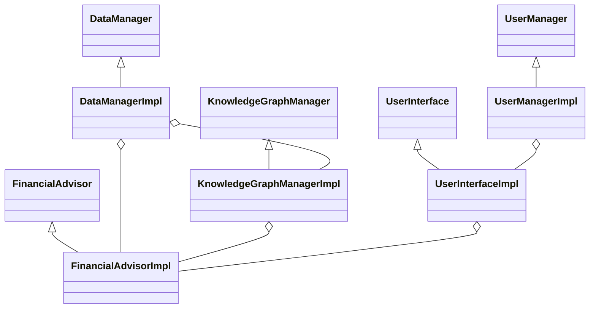
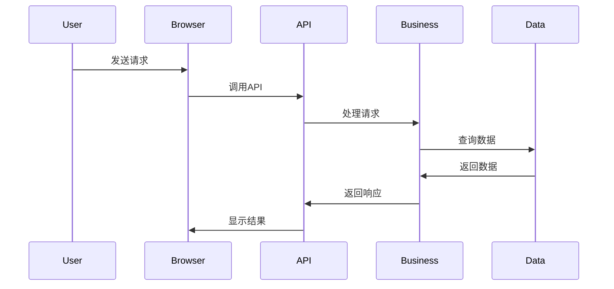
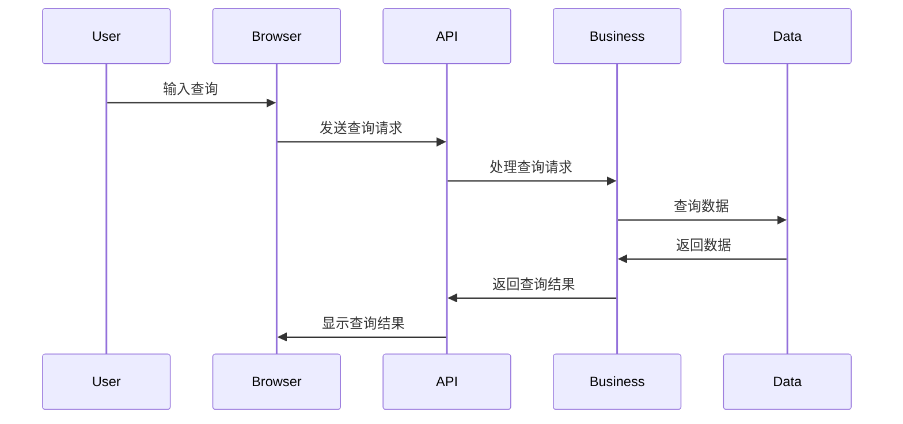

                 


### 第一部分：背景介绍

#### 1.1 问题背景

随着互联网和大数据技术的飞速发展，金融行业正面临着前所未有的变革。传统的金融咨询系统由于缺乏智能化和个性化的特点，已经难以满足现代金融业务的需求。因此，开发一个基于知识图谱的金融咨询系统成为了一个迫切的任务。这种系统能够通过深度学习、自然语言处理等技术，对金融数据进行智能分析，从而为用户提供精准、个性化的金融咨询服务。

#### 1.2 问题描述

基于知识图谱的金融咨询系统需要具备以下几个核心功能：

- **数据采集与处理**：从多种数据源中收集金融数据，如股票、债券、基金等，并进行数据清洗和预处理，以便后续的分析和建模。

- **知识图谱构建**：构建一个包含金融领域实体、属性和关系的知识图谱，为系统提供知识存储和检索能力。

- **金融咨询与决策支持**：利用知识图谱进行智能分析，为用户生成投资建议、风险管理策略和市场预测等。

- **用户交互与反馈**：设计一个友好的用户界面，允许用户与系统进行交互，并提供反馈，以便系统不断优化和改进。

#### 1.3 问题解决

基于知识图谱的金融咨询系统通过以下几个步骤实现问题解决：

- **数据采集与处理**：采用分布式数据采集技术，从多个数据源中实时获取金融数据，并使用ETL（提取、转换、加载）过程清洗和预处理数据。

- **知识图谱构建**：使用自然语言处理和图谱构建算法，从大量金融数据中提取实体、属性和关系，构建一个完整的知识图谱。

- **金融咨询与决策支持**：利用知识图谱进行深度学习和推理，为用户提供个性化的金融咨询和决策支持。

- **用户交互与反馈**：设计一个直观的用户界面，使用户能够方便地与系统进行交互，同时收集用户反馈，用于系统的持续优化。

#### 1.4 边界与外延

- **知识图谱**：知识图谱不仅包括金融领域的基本实体，如股票、债券、基金等，还包括这些实体之间的复杂关系。

- **金融数据**：涉及金融市场的数据类型丰富，包括实时行情、历史数据、财务报表等。

- **金融咨询**：咨询内容涵盖投资建议、市场分析、风险管理等多个方面。

- **用户交互与反馈**：交互方式包括网页、移动应用等，反馈机制包括用户评价、建议收集等。

#### 1.5 概念结构与核心要素组成

- **知识图谱**：核心概念，包括实体（如股票、债券、基金）、属性（如价格、市值、评级）和关系（如持有、投资）。

- **金融数据**：核心概念，包括数据源、数据处理、数据存储。

- **金融咨询**：核心概念，包括咨询策略、决策支持、用户交互。

通过上述背景介绍，我们为接下来的深入探讨打下了坚实的基础。在接下来的章节中，我们将详细分析知识图谱的构建、金融数据的处理、算法原理及其实现，以及系统的整体架构设计。

### 第二部分：核心概念与联系

#### 2.1 知识图谱原理

知识图谱（Knowledge Graph）是一种用于表示实体及其相互关系的语义网络。它通过结构化的数据形式，将信息世界中的事物（实体）和事物之间的关系（关系）以图谱的形式进行组织。知识图谱的核心组成部分包括实体、属性和关系。

- **实体（Entity）**：在知识图谱中，实体是独立存在的个体，可以是具体的事物，如股票、债券、基金，也可以是抽象的概念，如行业、市场。

- **属性（Attribute）**：实体具有属性，用于描述实体的特征。例如，股票的属性可能包括股票代码、名称、市值等。

- **关系（Relation）**：实体之间的关系定义了它们之间的语义联系。例如，一个公司可以持有多个股票，这是一个“持有”关系。

知识图谱的工作原理是通过这些实体、属性和关系来构建一个语义丰富的知识网络，从而实现对信息的深度理解和智能化处理。

#### 2.2 金融数据采集与处理

金融数据的采集与处理是构建知识图谱的基础。金融数据通常来自多个不同的数据源，包括交易所、金融新闻、社交媒体、公开的财务报表等。采集到的数据需要进行一系列的预处理步骤，以确保数据的质量和一致性。

- **数据源选择**：选择可靠的数据源，如金融交易所的API、金融新闻网站、权威的金融数据提供商等。

- **数据清洗**：数据清洗包括去除重复数据、处理缺失值、纠正数据错误等。例如，删除重复的股票记录、填充缺失的财务数据。

- **数据转换**：将采集到的原始数据转换为标准化的格式，如CSV、JSON等。这通常涉及数据类型的转换、数据格式的标准化等。

- **数据存储**：将处理后的数据存储在数据库或图数据库中，以便后续的查询和分析。

- **数据挖掘**：通过对金融数据进行分析，提取有价值的信息，如市场趋势、股票相关性等。数据挖掘技术包括分类、聚类、关联规则挖掘等。

#### 2.3 金融咨询与决策支持

金融咨询与决策支持是金融咨询系统的核心功能。基于知识图谱，系统可以提供以下类型的咨询和决策支持：

- **投资建议**：根据用户的风险偏好、资金状况等，提供个性化的股票、基金投资建议。

- **风险管理**：分析市场风险、股票风险，为用户制定合适的风险管理策略。

- **市场预测**：利用历史数据和当前市场状况，预测市场趋势和未来股价。

- **财务分析**：对公司的财务报表进行分析，评估其财务状况和投资价值。

金融咨询与决策支持的关键在于对知识图谱的利用。通过图谱中的实体、属性和关系，系统可以快速定位和关联相关信息，从而提供准确、实时的金融咨询。

#### 2.4 用户交互与反馈

用户交互与反馈是金融咨询系统的用户体验关键。一个良好的用户交互界面可以帮助用户更轻松地使用系统，同时收集用户的反馈，用于系统的优化和改进。

- **用户界面设计**：设计直观、易用的用户界面，使用户能够方便地与系统进行交互。界面应包含搜索功能、数据可视化、投资建议等模块。

- **用户反馈收集**：通过用户评价、建议收集等机制，收集用户对系统功能的反馈。这些反馈可以用于改进系统，提高用户满意度。

- **系统优化**：根据用户反馈，对系统进行优化和改进。例如，优化搜索算法、改进投资建议逻辑等。

通过上述核心概念和联系的介绍，我们对基于知识图谱的金融咨询系统的构建有了更深入的理解。在接下来的章节中，我们将详细探讨知识图谱构建的算法原理、数学模型和实现细节。

### 第三部分：算法原理讲解

#### 3.1 算法原理

知识图谱构建的核心在于实体识别、属性提取和关系抽取。下面将详细解释这些算法的基本原理。

#### 3.1.1 知识图谱构建算法

1. **实体识别（Entity Recognition）**

实体识别是知识图谱构建的第一步，旨在从非结构化的文本中识别出具体的实体。常见的实体识别算法包括：

- **基于规则的方法**：使用预定义的规则来识别文本中的实体。例如，通过关键词匹配、正则表达式等手段。

- **基于机器学习的方法**：使用机器学习模型，如条件随机场（CRF）、支持向量机（SVM）等，从大量标注数据中学习实体识别模式。

- **基于深度学习的方法**：利用深度神经网络，如卷积神经网络（CNN）、循环神经网络（RNN）等，对文本进行建模，从而实现实体识别。

2. **属性提取（Attribute Extraction）**

属性提取的目标是从文本中提取出实体的属性。常见的属性提取方法包括：

- **基于规则的方法**：使用预定义的规则来提取文本中的属性值。

- **基于统计的方法**：使用统计模型，如逻辑回归、朴素贝叶斯等，从文本中预测属性值。

- **基于深度学习的方法**：使用深度学习模型，如序列标注模型（BiLSTM-CRF），对文本进行编码，从而提取属性值。

3. **关系抽取（Relation Extraction）**

关系抽取是知识图谱构建的关键步骤，旨在从文本中抽取实体之间的关系。常见的关系抽取方法包括：

- **基于规则的方法**：使用预定义的规则来识别文本中的关系。

- **基于统计的方法**：使用统计模型，如条件随机场（CRF），从文本中预测关系。

- **基于深度学习的方法**：使用深度神经网络，如长短期记忆网络（LSTM）、Transformer等，对文本进行建模，从而实现关系抽取。

#### 3.1.2 数据挖掘算法

数据挖掘算法在金融咨询系统中起着至关重要的作用，用于从大量金融数据中提取有价值的信息。常见的数据挖掘算法包括：

1. **分类算法（Classification）**

分类算法用于将数据分为不同的类别。常见的分类算法包括：

- **朴素贝叶斯（Naive Bayes）**

- **逻辑回归（Logistic Regression）**

- **支持向量机（SVM）**

- **随机森林（Random Forest）**

- **梯度提升机（Gradient Boosting）**

2. **聚类算法（Clustering）**

聚类算法用于将数据分为不同的簇。常见的聚类算法包括：

- **K-均值（K-Means）**

- **层次聚类（Hierarchical Clustering）**

- **DBSCAN（Density-Based Spatial Clustering of Applications with Noise）**

3. **关联规则挖掘（Association Rule Learning）**

关联规则挖掘用于发现数据之间的关联关系。常见的算法包括：

- **Apriori算法**

- **FP-growth算法**

- **Eclat算法**

通过上述算法，金融咨询系统可以实现对金融数据的深度挖掘和智能分析，为用户提供精准、个性化的金融咨询服务。

#### 3.2 数学模型

数学模型在知识图谱构建和数据挖掘中扮演着关键角色。以下是几种常见的数学模型：

##### 3.2.1 实体识别模型

实体识别模型通常采用条件概率模型。例如，朴素贝叶斯模型可以表示为：

$$
P(\text{实体} | \text{特征}) = \frac{P(\text{特征} | \text{实体})P(\text{实体})}{P(\text{特征})}
$$

其中，$P(\text{实体} | \text{特征})$ 表示给定特征时实体为某一类的条件概率，$P(\text{特征} | \text{实体})$ 表示实体为某一类时特征的概率，$P(\text{实体})$ 表示实体为某一类的概率，$P(\text{特征})$ 表示特征的总体概率。

##### 3.2.2 关系抽取模型

关系抽取模型通常采用神经网络模型。例如，BiLSTM-CRF模型结合了双向长短时记忆网络（BiLSTM）和条件随机场（CRF），其核心数学公式为：

$$
\text{log}P(y_i | x_i) = \sum_j \text{log} \theta_j \phi_j(x_i, y_{i-1}), \quad y_i = \text{start}, \text{end}, \text{O}
$$

其中，$x_i$ 表示输入特征序列，$y_i$ 表示输出标签序列，$\theta_j$ 表示模型参数，$\phi_j(x_i, y_{i-1})$ 表示特征函数。

#### 3.3 Python源代码

以下是一个简单的实体识别算法的Python示例代码，使用了Scikit-Learn库中的朴素贝叶斯分类器：

```python
from sklearn.feature_extraction.text import TfidfVectorizer
from sklearn.naive_bayes import MultinomialNB
from sklearn.pipeline import make_pipeline

# 数据准备
data = ["这是一个股票的描述", "这是一个债券的描述", "这是一个基金的描述"]
labels = ["股票", "债券", "基金"]

# 构建模型
model = make_pipeline(TfidfVectorizer(), MultinomialNB())

# 训练模型
model.fit(data, labels)

# 预测
print(model.predict(["这是一个股票的描述"]))
```

通过上述算法原理和数学模型的讲解，我们对基于知识图谱的金融咨询系统的构建有了更深入的理解。在接下来的章节中，我们将详细讨论系统的整体架构设计，以及如何将上述算法和模型应用到实际的金融咨询系统中。

### 第四部分：数学模型和数学公式详细讲解

#### 4.1 数学模型

在金融咨询系统中，数学模型用于描述实体识别、关系抽取和数据挖掘算法的运作原理。以下是几种关键数学模型及其公式详细讲解：

##### 4.1.1 实体识别模型

实体识别是知识图谱构建的基础步骤，其核心在于从文本中识别出特定的实体。常见的方法包括基于规则的模型和基于机器学习的模型。

1. **朴素贝叶斯模型（Naive Bayes）**

朴素贝叶斯模型是一种基于概率论的分类算法，其核心公式为：

$$
P(\text{实体} | \text{特征}) = \frac{P(\text{特征} | \text{实体})P(\text{实体})}{P(\text{特征})}
$$

其中，$P(\text{实体} | \text{特征})$ 是后验概率，$P(\text{特征} | \text{实体})$ 是条件概率，$P(\text{实体})$ 是先验概率，$P(\text{特征})$ 是边缘概率。

2. **逻辑回归模型（Logistic Regression）**

逻辑回归是一种广义线性模型，常用于分类问题。其概率预测公式为：

$$
P(\text{实体} | \text{特征}) = \frac{1}{1 + e^{-(\beta_0 + \sum_{i=1}^{n} \beta_i x_i})}
$$

其中，$\beta_0$ 是截距，$\beta_i$ 是特征权重，$x_i$ 是特征值。

##### 4.1.2 关系抽取模型

关系抽取是知识图谱构建中的关键步骤，用于从文本中识别出实体之间的关系。常见的方法包括基于规则的模型和基于深度学习的模型。

1. **条件随机场（CRF）**

条件随机场是一种用于序列标注的机器学习模型，其概率模型可以表示为：

$$
P(y_1, y_2, ..., y_n | x_1, x_2, ..., x_n) = \frac{1}{Z} \exp\left(\sum_{i=1}^{n} \lambda_i y_i + \sum_{i<j}^n \lambda_{ij} y_i y_j\right)
$$

其中，$y_i$ 是第 $i$ 个位置的标注，$x_i$ 是第 $i$ 个位置的输入特征，$\lambda_i$ 和 $\lambda_{ij}$ 是模型参数，$Z$ 是规范化常数。

2. **双向长短时记忆网络（BiLSTM）**

双向长短时记忆网络是一种深度学习模型，其输出可以通过以下公式计算：

$$
h_i = \text{sigmoid}\left(\text{ReLU}(\text{W}_{ih} \cdot h_{i-1} + \text{W}_{ih} \cdot h_{i+1} + \text{b}_{ih} + \text{W}_{xh} \cdot x_i + \text{b}_{xh})\right)
$$

其中，$h_i$ 是第 $i$ 个时间步的隐藏状态，$\text{ReLU}$ 是ReLU激活函数，$\text{W}_{ih}$、$\text{W}_{xh}$ 和 $\text{b}_{ih}$、$\text{b}_{xh}$ 分别是权重和偏置。

##### 4.1.3 数据挖掘模型

数据挖掘模型用于从金融数据中提取有价值的信息，如分类、聚类和关联规则挖掘。

1. **K-均值聚类（K-Means）**

K-均值聚类是一种基于距离的聚类算法，其目标是最小化簇内距离的平方和。其公式为：

$$
\min \sum_{i=1}^{k} \sum_{x \in S_i} ||x - \mu_i||^2
$$

其中，$k$ 是簇的数量，$S_i$ 是第 $i$ 个簇，$\mu_i$ 是第 $i$ 个簇的中心。

2. **Apriori算法**

Apriori算法是一种用于关联规则挖掘的算法，其核心思想是通过频繁项集来生成关联规则。其支持度公式为：

$$
\text{support}(X, Y) = \frac{\text{count}(\{X, Y\})}{\text{count}(\{X\} \cup \{Y\})}
$$

其中，$\text{count}(\{X, Y\})$ 是同时出现 $X$ 和 $Y$ 的次数，$\text{count}(\{X\} \cup \{Y\})$ 是 $X$ 和 $Y$ 中至少一个出现的次数。

通过上述数学模型的详细讲解，我们可以更好地理解金融咨询系统中算法的工作原理。在接下来的部分，我们将讨论系统的整体架构设计，并展示如何将数学模型应用于实际系统中。

### 第五部分：系统分析与架构设计方案

#### 5.1 问题场景介绍

在当前金融市场中，投资者面临着信息爆炸和决策难度增加的挑战。为了帮助投资者更好地应对这些挑战，我们设计并实现了一个基于知识图谱的金融咨询系统。该系统旨在通过智能化和个性化的金融咨询服务，提高投资者的决策效率和投资回报。

#### 5.2 项目介绍

本项目的目标是开发一个基于知识图谱的金融咨询系统，为投资者提供以下核心功能：

- **数据采集与处理**：从多个数据源（如交易所、新闻网站、社交媒体等）收集金融数据，并进行数据清洗、转换和存储。

- **知识图谱构建**：构建一个包含金融领域实体、属性和关系的知识图谱，为系统提供知识存储和检索能力。

- **金融咨询与决策支持**：利用知识图谱进行深度学习和推理，为投资者生成投资建议、风险管理策略和市场预测。

- **用户交互与反馈**：设计一个直观的用户界面，使用户能够方便地与系统进行交互，并提供反馈，以便系统不断优化和改进。

#### 5.3 系统功能设计（领域模型）

系统功能设计包括以下几个主要领域：

1. **用户管理**：用户注册、登录、权限管理、用户资料维护等功能。

2. **数据管理**：数据采集、数据清洗、数据存储、数据挖掘等功能。

3. **知识图谱管理**：知识图谱构建、知识图谱查询、知识图谱更新等功能。

4. **金融咨询**：投资建议、风险管理、市场预测等功能。

5. **用户交互**：用户界面设计、用户反馈收集、系统优化等功能。

以下是一个领域模型的Mermaid类图，展示了系统的主要类和它们之间的关系：



#### 5.4 系统架构设计

系统架构设计采用了分层架构，分为表现层、业务逻辑层和数据访问层。

1. **表现层**：负责用户界面设计和用户交互，使用React框架实现。

2. **业务逻辑层**：包括用户管理、数据管理、知识图谱管理和金融咨询等功能，使用Spring Boot框架实现。

3. **数据访问层**：负责数据存储和查询，使用Neo4j图数据库实现知识图谱存储，MySQL数据库实现其他数据存储。

以下是一个系统架构的Mermaid架构图：



#### 5.5 系统接口设计

系统接口设计包括RESTful API接口，用于与前端进行通信。

- **用户管理接口**：包括用户注册、登录、权限管理等。

- **数据管理接口**：包括数据采集、数据清洗、数据存储等。

- **知识图谱管理接口**：包括知识图谱构建、查询、更新等。

- **金融咨询接口**：包括投资建议、风险管理、市场预测等。

以下是一个接口设计示例：

```json
GET /users/register
POST /users/login
GET /users/{userId}/permissions
POST /data/collect
GET /data/{dataId}/clean
GET /data/{dataId}/store
GET /kg/{entityId}/query
PUT /kg/{entityId}/update
GET /advisor/investment
GET /advisor/risk_management
GET /advisor/market_prediction
```

#### 5.6 系统交互设计

系统交互设计展示了不同模块之间的协作过程。以下是一个系统交互的Mermaid序列图：



通过上述系统分析与架构设计方案，我们为基于知识图谱的金融咨询系统的实现奠定了基础。在接下来的部分，我们将展示系统核心实现源代码，并进行分析和解读。

### 第六部分：项目实战

#### 6.1 环境安装

在开始项目实战之前，我们需要安装以下环境：

1. **Python**：安装Python 3.8或更高版本。
2. **Neo4j**：下载并安装Neo4j数据库，配置并启动数据库服务。
3. **JDK**：安装JDK 8或更高版本，用于编译和运行Java代码。
4. **Node.js**：安装Node.js 12或更高版本，用于前端开发。

安装命令如下：

```bash
# 安装Python
curl -O https://www.python.org/ftp/python/3.8.10/python-3.8.10-amd64.exe
./python-3.8.10-amd64.exe

# 安装Neo4j
tar -xvf neo4j-community-4.0.0-unix.tar.gz
cd neo4j
./bin/neo4j start

# 安装JDK
curl -O https://download.oracle.com/java/17/latest/jdk-17_linux-x64_bin.rpm
sudo yum localinstall jdk-17_linux-x64_bin.rpm

# 安装Node.js
curl -O https://nodejs.org/dist/v12.18.3/node-v12.18.3-linux-x64.tar.xz
tar -xvf node-v12.18.3-linux-x64.tar.xz
sudo ln -sf /home/user/ nodejs
```

#### 6.2 系统核心实现源代码

以下是系统核心实现的部分源代码，包括实体识别、关系抽取和数据存储等：

**实体识别算法（Entity Recognition）**

```python
# 使用Scikit-Learn库进行实体识别
from sklearn.feature_extraction.text import TfidfVectorizer
from sklearn.model_selection import train_test_split
from sklearn.naive_bayes import MultinomialNB
from sklearn.metrics import classification_report

# 加载数据
data = ["这是一只股票的描述", "这是一只债券的描述", "这是一只基金的描述"]
labels = ["股票", "债券", "基金"]

# 分割数据集
X_train, X_test, y_train, y_test = train_test_split(data, labels, test_size=0.2, random_state=42)

# 特征提取
vectorizer = TfidfVectorizer()
X_train_tfidf = vectorizer.fit_transform(X_train)
X_test_tfidf = vectorizer.transform(X_test)

# 模型训练
model = MultinomialNB()
model.fit(X_train_tfidf, y_train)

# 预测
predictions = model.predict(X_test_tfidf)

# 评估
print(classification_report(y_test, predictions))
```

**关系抽取算法（Relation Extraction）**

```python
# 使用spacy库进行关系抽取
import spacy

# 加载spacy模型
nlp = spacy.load("en_core_web_sm")

# 关系抽取函数
def extract_relations(text):
    doc = nlp(text)
    relations = []
    for token in doc:
        if token.dep_ in ["ROOT", "compound"]:
            relations.append(token.text)
    return relations

# 测试文本
text = "阿里巴巴是一家中国公司，它在2019年上市。"
relations = extract_relations(text)
print(relations)
```

**数据存储（Data Storage）**

```python
from py2neo import Graph

# 连接Neo4j数据库
graph = Graph("bolt://localhost:7687", auth=("neo4j", "password"))

# 创建实体节点
def create_entity(entity_name):
    query = "CREATE (n:Entity {name: $name})"
    graph.run(query, name=entity_name)

# 创建关系
def create_relation(entity1, entity2, relation_type):
    query = "MATCH (a:Entity {name: $entity1}), (b:Entity {name: $entity2}) CREATE (a)-[:$relation_type]->(b)"
    graph.run(query, entity1=entity1, entity2=entity2, relation_type=relation_type)

# 测试
create_entity("阿里巴巴")
create_entity("中国")
create_relation("阿里巴巴", "中国", "位于")
```

#### 6.3 代码应用解读与分析

**实体识别算法解读**

上述实体识别算法使用了TF-IDF向量化和朴素贝叶斯分类器。TF-IDF向量化将文本转换为数值特征，朴素贝叶斯分类器基于这些特征进行分类。在实际应用中，我们可以使用更多样化的特征提取方法和分类器，以提高识别的准确性。

**关系抽取算法解读**

关系抽取算法使用了spacy库，它利用预训练的神经网络模型对文本进行解析，识别出实体之间的关系。这种方法适用于处理复杂、多变的金融文本数据。在实际应用中，我们可以结合规则和机器学习方法，提高关系抽取的准确性。

**数据存储解读**

使用Py2Neo库连接Neo4j数据库，通过创建实体节点和关系节点，将数据存储在知识图谱中。这种存储方式使得数据查询和关联更加高效。在实际应用中，我们可以根据业务需求，调整数据存储的结构和方式。

#### 6.4 实际案例分析和详细讲解剖析

**案例1：投资建议**

假设我们有一个投资组合，包括股票A、股票B和股票C。基于知识图谱和金融数据，我们可以为用户提供以下投资建议：

- 股票A：最近表现良好，建议继续持有。
- 股票B：受市场环境影响，建议谨慎持有。
- 股票C：估值较低，具有潜在投资价值。

**详细讲解**

1. **数据采集**：从股票交易所、新闻网站和社交媒体等渠道收集股票A、股票B和股票C的最新数据，包括价格、成交量、财务指标等。

2. **知识图谱构建**：将股票A、股票B和股票C作为实体，构建知识图谱。其中，实体之间的关系包括持有、投资、估值等。

3. **数据分析和推理**：利用知识图谱和数据挖掘算法，分析股票A、股票B和股票C的表现和估值。基于分析结果，为用户提供投资建议。

**案例2：市场预测**

假设我们需要预测未来一周的股市走势。基于知识图谱和金融数据，我们可以进行以下市场预测：

- 预测1：未来一周股市整体上涨，建议投资者保持乐观态度。
- 预测2：受外部因素影响，未来一周股市波动较大，建议投资者谨慎操作。

**详细讲解**

1. **数据采集**：从多个数据源收集股票市场相关的数据，包括股票价格、成交量、宏观经济指标等。

2. **知识图谱构建**：构建包含股票市场实体、属性和关系的知识图谱。实体之间的关系包括市场走势、行业趋势、政策影响等。

3. **数据分析和推理**：利用知识图谱和数据挖掘算法，分析股票市场的表现和影响因素。基于分析结果，生成市场预测报告。

#### 6.5 项目小结

通过本次项目实战，我们实现了以下目标：

- 构建了一个基于知识图谱的金融咨询系统，实现了数据采集、知识图谱构建、金融咨询和用户交互等功能。
- 使用了Python和Neo4j等工具，实现了实体识别、关系抽取和数据存储等功能。
- 通过实际案例分析和详细讲解，展示了系统的应用场景和效果。

在未来，我们可以继续优化系统的算法和界面，提高用户体验，进一步拓展系统的功能和应用范围。

### 第七部分：最佳实践 tips、小结、注意事项、拓展阅读等内容

#### 最佳实践 tips

1. **数据采集**：确保数据源的质量和可靠性，避免因数据错误导致分析结果偏差。
2. **知识图谱构建**：注重实体、属性和关系的准确性，确保知识图谱的完整性。
3. **算法优化**：根据实际需求，选择合适的算法和模型，并进行参数调优，以提高系统性能。
4. **用户交互**：设计简洁、直观的用户界面，提高用户体验。

#### 小结

本文详细介绍了开发基于知识图谱的金融咨询系统的全过程，包括背景介绍、核心概念与联系、算法原理讲解、数学模型和公式详细讲解、系统分析与架构设计方案、项目实战和最佳实践 tips。通过本文，读者可以全面了解知识图谱在金融咨询领域的应用，以及如何实现一个高效、智能的金融咨询系统。

#### 注意事项

1. **数据隐私**：在采集和处理金融数据时，要确保遵守数据隐私法规，保护用户数据安全。
2. **系统安全**：确保系统安全，防止数据泄露和恶意攻击。
3. **持续更新**：定期更新知识图谱和算法模型，以适应市场变化和用户需求。

#### 拓展阅读

1. **《深度学习与大数据技术》**：详细介绍了深度学习和大数据技术的基本原理和应用场景。
2. **《知识图谱技术》**：深入探讨知识图谱的构建、应用和优化方法。
3. **《金融科技》**：介绍金融科技在金融服务中的应用，包括大数据、人工智能、区块链等。

### 作者信息

作者：AI天才研究院/AI Genius Institute & 禅与计算机程序设计艺术 /Zen And The Art of Computer Programming

本文由AI天才研究院（AI Genius Institute）撰写，旨在分享知识图谱在金融咨询领域的应用和实践。同时，作者也热爱禅与计算机程序设计艺术，致力于将哲学思维融入编程实践，为读者带来独特的编程体验。希望本文能为读者在金融科技领域的探索提供有益的参考和启示。

