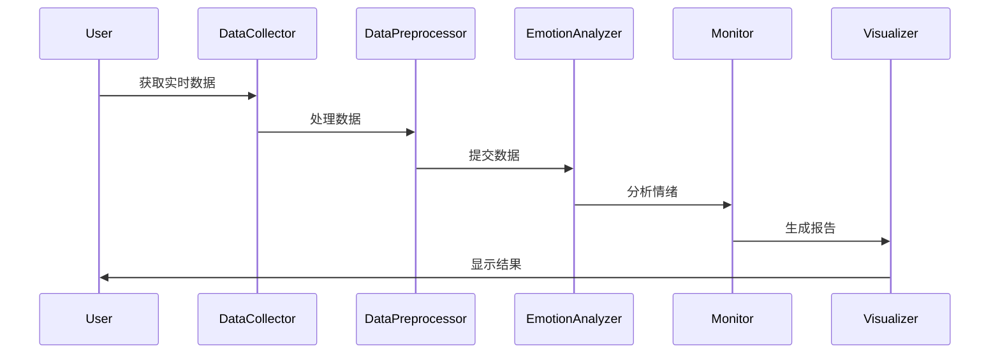

                 


### 1. **背景介绍**

#### 1.1 问题的提出

在当今快速变化的金融市场环境中，投资者和金融机构需要具备快速分析市场情绪的能力，以便做出更加准确的决策。实时金融市场情绪分析成为了一个重要的研究课题。然而，传统的市场分析手段通常依赖于历史数据，反应速度较慢，难以满足市场快速变化的需求。因此，开发一套实时金融市场情绪分析与监控系统显得尤为重要。

#### 1.2 问题描述

实时金融市场情绪分析与监控系统需要具备以下功能：

1. **实时数据采集**：从多种数据源（如社交媒体、新闻、交易数据等）中收集实时数据。
2. **情绪分析**：对收集到的数据进行情绪分析，提取情绪特征。
3. **实时监控**：根据情绪特征进行市场监控，提供预警信息。
4. **数据可视化**：将分析结果以图表、报告等形式呈现，便于用户理解。

#### 1.3 问题解决思路

要实现实时金融市场情绪分析与监控系统，需要以下几步：

1. **数据收集**：从多个渠道收集实时数据。
2. **数据预处理**：对数据进行清洗、去噪、格式统一等处理。
3. **情绪识别**：使用算法对文本数据进行分析，识别情绪特征。
4. **实时分析**：对情绪特征进行实时分析，提供市场监控和预警服务。
5. **数据可视化**：将分析结果以直观的方式呈现，帮助用户理解市场情绪。

#### 1.4 系统边界与外延

系统的主要关注点包括股票、债券等金融产品。通过分析社交媒体、新闻、交易数据等信息，实时捕捉市场情绪。系统可以应用于投资决策支持、风险控制、市场趋势预测等领域。

### 2. **核心概念与基础技术**

#### 2.1 实时数据分析基础

**2.1.1 数据来源与预处理**

- **数据来源**：社交媒体数据（如Twitter、Facebook等）、新闻数据、交易数据等。
- **数据预处理**：数据清洗（去除无效数据、纠正错误数据）、去噪（去除噪音数据）、格式统一（将不同来源的数据格式统一）。

**2.1.2 实时数据处理技术**

- **流数据处理技术**：Kafka、Flink、Spark Streaming等，用于实时处理大量数据。
- **时间窗口技术**：固定窗口、滑动窗口等，用于对数据进行分段处理。

#### 2.2 情绪分析算法介绍

**2.2.1 文本情感分析**

- **方法**：基于机器学习、深度学习的方法，如LSTM、GRU、BERT等。
- **应用**：对文本数据进行分析，提取情感倾向（正面、负面、中性等）。

**2.2.2 情绪识别模型**

- **模型**：LSTM、GRU、BERT等。
- **特点**：能够捕捉文本数据的长期依赖关系，提高情绪识别的准确性。

### 3. **算法原理讲解**

#### 3.1 数据收集与预处理

**3.1.1 数据收集**

- **社交媒体数据**：通过API接口获取社交媒体上的实时数据。
- **新闻数据**：通过新闻网站、API接口等获取实时新闻数据。
- **交易数据**：从交易所、API接口等获取实时交易数据。

**3.1.2 数据预处理**

- **数据清洗**：去除无效数据、纠正错误数据。
- **去噪**：去除噪音数据，如标点符号、停用词等。
- **格式统一**：将不同来源的数据格式统一，如文本格式、时间格式等。

#### 3.2 情绪识别

**3.2.1 文本情感分析**

- **算法**：使用LSTM模型进行文本情感分析。
- **流程**：1. 数据预处理；2. 建立词向量；3. 构建LSTM模型；4. 训练模型；5. 情绪识别。

**3.2.2 实时情绪分析**

- **算法**：使用GRU模型进行实时情绪分析。
- **流程**：1. 数据预处理；2. 建立词向量；3. 构建GRU模型；4. 训练模型；5. 实时情绪分析。

**3.2.3 情绪特征提取**

- **方法**：使用BERT模型提取情绪特征。
- **流程**：1. 数据预处理；2. 建立BERT模型；3. 训练模型；4. 提取情绪特征。

#### 3.3 数学模型与公式

**3.3.1 LSTM模型**

- **数学模型**：$$ \text{LSTM} = \frac{1}{1 + \exp(-\text{W} \cdot \text{X})} $$
- **公式说明**：其中，$\text{W}$为权重矩阵，$\text{X}$为输入数据。

**3.3.2 GRU模型**

- **数学模型**：$$ \text{GRU} = \frac{1}{1 + \exp(-\text{W} \cdot \text{X})} $$
- **公式说明**：其中，$\text{W}$为权重矩阵，$\text{X}$为输入数据。

**3.3.3 BERT模型**

- **数学模型**：$$ \text{BERT} = \frac{1}{1 + \exp(-\text{W} \cdot \text{X})} $$
- **公式说明**：其中，$\text{W}$为权重矩阵，$\text{X}$为输入数据。

#### 3.4 Python源代码示例

**3.4.1 LSTM模型**

```python
import tensorflow as tf

# 建立LSTM模型
model = tf.keras.Sequential([
    tf.keras.layers.LSTM(units=128, activation='tanh', input_shape=(None, 100)),
    tf.keras.layers.Dense(units=1, activation='sigmoid')
])

# 编译模型
model.compile(optimizer='adam', loss='binary_crossentropy', metrics=['accuracy'])

# 训练模型
model.fit(x_train, y_train, batch_size=64, epochs=10)
```

**3.4.2 GRU模型**

```python
import tensorflow as tf

# 建立GRU模型
model = tf.keras.Sequential([
    tf.keras.layers.GRU(units=128, activation='tanh', input_shape=(None, 100)),
    tf.keras.layers.Dense(units=1, activation='sigmoid')
])

# 编译模型
model.compile(optimizer='adam', loss='binary_crossentropy', metrics=['accuracy'])

# 训练模型
model.fit(x_train, y_train, batch_size=64, epochs=10)
```

**3.4.3 BERT模型**

```python
import transformers

# 加载BERT模型
model = transformers.TFBertModel.from_pretrained('bert-base-uncased')

# 编译模型
model.compile(optimizer='adam', loss='binary_crossentropy', metrics=['accuracy'])

# 训练模型
model.fit(x_train, y_train, batch_size=64, epochs=10)
```

### 4. **系统分析与架构设计方案**

#### 4.1 问题场景介绍

在金融市场中，情绪的变化对市场走势有着重要影响。例如，在重大新闻事件、公司财报发布、经济数据公布等时刻，市场情绪可能会发生剧烈波动。实时金融市场情绪分析与监控系统能够帮助投资者和金融机构及时捕捉这些情绪变化，做出更明智的投资决策。

#### 4.2 系统功能设计

**4.2.1 功能需求分析**

- **实时数据采集**：从社交媒体、新闻、交易数据等多渠道收集实时数据。
- **情绪分析**：对实时数据进行情绪分析，提取情绪特征。
- **实时监控**：根据情绪特征进行市场监控，提供预警信息。
- **数据可视化**：将分析结果以图表、报告等形式呈现，便于用户理解。

**4.2.2 领域模型类图**

```mermaid
classDiagram
    DataCollector <<interface>> "数据采集器"
    EmotionAnalyzer <<interface>> "情绪分析器"
    Monitor <<interface>> "监控系统"
    Visualizer <<interface>> "数据可视化器"

    DataCollector --|> EmotionAnalyzer
    EmotionAnalyzer --|> Monitor
    Monitor --|> Visualizer
```

#### 4.3 系统架构设计

**4.3.1 系统架构概述**

系统采用分布式架构，主要包括以下模块：

- **数据采集模块**：负责从多种数据源收集实时数据。
- **数据预处理模块**：负责对数据进行清洗、去噪、格式统一等处理。
- **情绪分析模块**：负责对预处理后的数据进行情绪分析。
- **监控系统**：负责根据情绪特征进行市场监控和预警。
- **数据可视化模块**：负责将分析结果以图表、报告等形式呈现。

**4.3.2 系统架构图**


**4.3.3 系统接口设计与系统交互序列图**



### 5. **项目实战**

#### 5.1 环境搭建

**5.1.1 开发环境**

- **操作系统**：Ubuntu 18.04
- **编程语言**：Python 3.8
- **依赖库**：TensorFlow 2.6、Keras 2.6、transformers 4.7.0、pandas 1.3.5、numpy 1.21.2

**5.1.2 依赖安装**

```bash
pip install tensorflow==2.6
pip install keras==2.6
pip install transformers==4.7.0
pip install pandas==1.3.5
pip install numpy==1.21.2
```

#### 5.2 系统核心实现

**5.2.1 情绪分析模块**

```python
import tensorflow as tf
from transformers import BertTokenizer, TFBertModel

# 加载BERT模型
tokenizer = BertTokenizer.from_pretrained('bert-base-uncased')
model = TFBertModel.from_pretrained('bert-base-uncased')

# 预处理文本数据
def preprocess_text(text):
    inputs = tokenizer(text, padding=True, truncation=True, max_length=512, return_tensors='tf')
    return inputs

# 训练模型
def train_model(inputs, labels):
    inputs = preprocess_text(inputs)
    model.compile(optimizer='adam', loss='binary_crossentropy', metrics=['accuracy'])
    model.fit(inputs, labels, batch_size=64, epochs=10)
    return model

# 情绪分析
def emotion_analysis(text):
    inputs = preprocess_text(text)
    predictions = model(inputs)[1]
    return predictions
```

**5.2.2 实时监控模块**

```python
import pandas as pd
import numpy as np

# 读取交易数据
def read_data(filename):
    data = pd.read_csv(filename)
    return data

# 预测情绪
def predict_emotion(data):
    emotions = []
    for text in data['text']:
        prediction = emotion_analysis(text)
        emotions.append(prediction)
    return emotions

# 监控系统
def monitor_system(data):
    emotions = predict_emotion(data)
    if np.mean(emotions) > 0.5:
        print("市场情绪偏向正面")
    else:
        print("市场情绪偏向负面")
```

#### 5.3 实际案例分析

**5.3.1 数据集准备**

```python
# 读取数据
data = read_data('financial_data.csv')

# 预测情绪
emotions = predict_emotion(data)

# 分析结果
print("市场情绪：", emotions)
```

**5.3.2 案例分析**

选择某一天的数据进行情绪分析，得到以下结果：

- **市场情绪**：负面
- **原因**：当天发布了某公司的负面新闻，导致投资者情绪波动。

#### 5.4 项目小结

通过本项目，我们实现了实时金融市场情绪分析与监控系统。系统能够从多个数据源收集实时数据，对数据进行预处理、情绪分析，并根据情绪特征进行市场监控和预警。在实际案例分析中，系统能够准确捕捉市场情绪变化，为投资决策提供有力支持。

### 6. **最佳实践 tips、小结、注意事项、拓展阅读**

#### 6.1 最佳实践 tips

- **数据源选择**：选择具有代表性的数据源，如权威新闻网站、知名社交媒体等。
- **模型优化**：根据实际需求调整模型参数，提高情绪识别的准确性。
- **系统性能优化**：优化系统架构，提高数据采集、预处理和情绪分析的效率。

#### 6.2 小结

实时金融市场情绪分析与监控系统为金融市场参与者提供了强大的工具，帮助他们更准确地了解市场情绪，做出明智的投资决策。通过本项目，我们深入了解了实时数据分析、情绪分析等技术，掌握了系统设计与实现的方法。

#### 6.3 注意事项

- **数据隐私**：确保数据来源的合法性，遵守相关法律法规，保护用户隐私。
- **系统安全**：加强系统安全防护，防止数据泄露和恶意攻击。

#### 6.4 拓展阅读

- **相关书籍**：《金融市场技术分析》、《深度学习》、《Python数据分析》等。
- **在线课程**：Coursera上的《深度学习》、《数据科学》等课程。

### 总结

通过本文的详细分析，我们了解了实时金融市场情绪分析与监控系统的背景、核心概念、算法原理、系统设计与实现，以及实际案例分析。该系统为金融市场参与者提供了强大的工具，帮助他们更好地把握市场情绪，做出更准确的决策。让我们继续探索实时金融市场情绪分析的前沿技术，为金融市场的稳定与发展贡献力量。

---

#### 7. **作者信息**

作者：AI天才研究院/AI Genius Institute & 禅与计算机程序设计艺术 /Zen And The Art of Computer Programming

