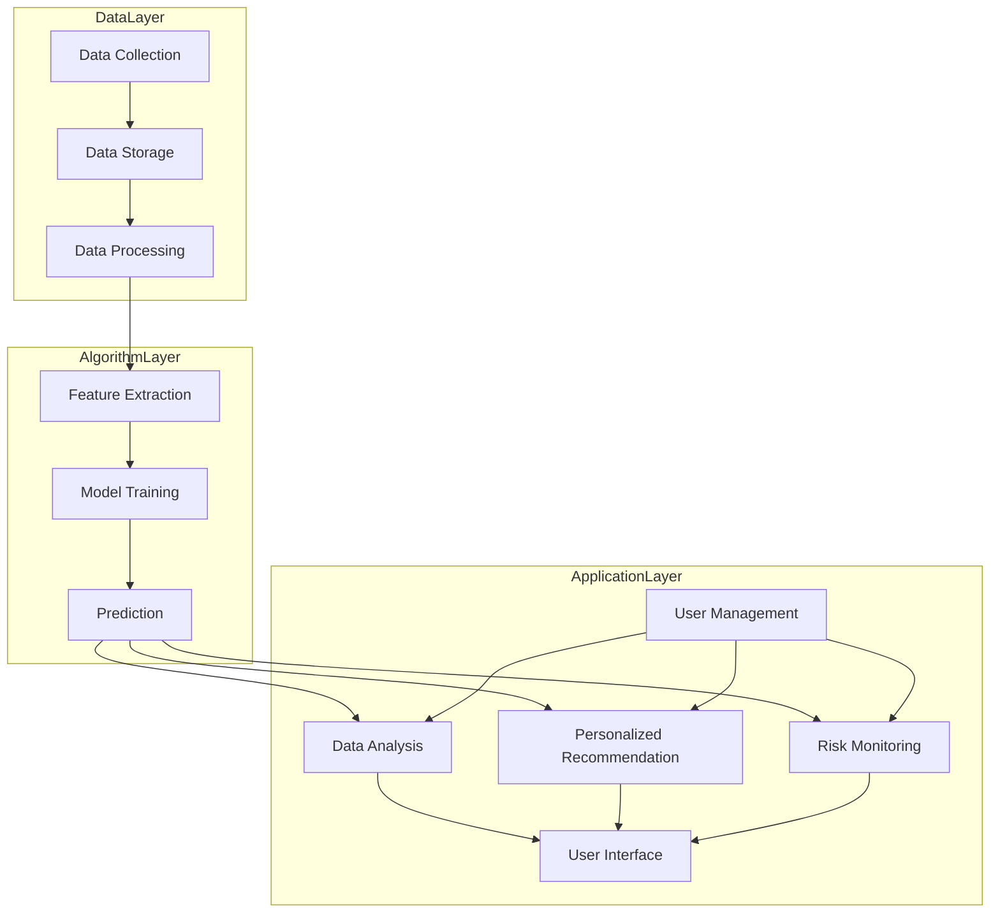

                 

### 文章标题

# 开发智能化的个人退休规划助手

> 关键词：智能退休规划、人工智能、机器学习、数据分析、用户体验

> 摘要：本文深入探讨了开发智能化个人退休规划助手的技术路线和实现方法。通过结合人工智能和金融领域的专业知识，本文详细介绍了从概念设计到系统实现的各个关键步骤，包括数据收集与处理、算法设计与实现、用户界面设计以及系统测试与验证。文章旨在为读者提供全面的指导，帮助他们理解和构建一个高效的智能退休规划系统。

### 引言

随着人口老龄化趋势的加剧，退休规划已成为个人和家庭财务规划中的重要组成部分。传统的退休规划依赖于手动计算和经验判断，而这种方法在处理复杂和不确定的财务状况时显得力不从心。随着人工智能（AI）和机器学习（ML）技术的迅猛发展，智能化的个人退休规划助手应运而生。这些助手能够利用大数据分析、复杂算法和智能推荐，提供更为精准和个性化的退休规划建议。

本文将探讨如何开发一个智能化的个人退休规划助手。我们将从背景介绍、核心概念、系统构建、测试验证和实际应用等多个角度进行深入分析，帮助读者全面理解这一技术领域的最新进展和实现方法。

### 背景与意义

退休规划是个人财务规划中的一个关键环节，关系到退休后的生活质量。传统的退休规划通常依赖于手动计算和财务顾问的建议，这不仅费时费力，而且难以处理复杂的财务状况和不确定的未来风险。随着人口老龄化趋势的加剧，越来越多的个人和家庭开始意识到退休规划的重要性，但同时也面临着诸多挑战：

1. **信息不对称**：个人往往缺乏全面的财务数据和市场信息，难以做出科学的规划决策。
2. **复杂性**：退休规划涉及多个变量，如预期寿命、通货膨胀率、投资回报率等，手动计算容易出错。
3. **个性化需求**：每个人的财务状况和退休目标都不同，需要个性化的规划方案。

人工智能和机器学习技术的引入，为退休规划带来了新的机遇。这些技术能够处理海量数据，发现潜在的模式和趋势，提供精确的预测和推荐。智能化的个人退休规划助手可以自动化处理复杂的计算过程，提高规划效率和准确性。此外，通过个性化推荐，这些助手能够为用户提供量身定制的退休规划建议，满足不同人群的需求。

### 技术发展现状

在金融领域，人工智能和机器学习技术已经得到了广泛应用。例如，智能投顾（Robo-Advisor）利用算法分析客户的财务状况和投资偏好，提供投资组合建议；量化交易系统利用机器学习算法预测市场趋势，实现自动化交易。这些成功案例表明，AI和ML在金融领域具有巨大的潜力。

在退休规划方面，智能助手已经开始出现。例如，一些金融机构提供在线退休规划工具，使用算法帮助用户计算退休所需的资金，并推荐相应的投资策略。然而，这些工具通常功能较为单一，难以满足个性化需求。智能化的个人退休规划助手需要更全面的数据分析能力和更复杂的算法模型，以提供更为精准和个性化的服务。

总体而言，虽然智能退休规划助手在技术上已经取得了一些进展，但仍处于发展阶段。未来的发展方向包括提高算法的准确性和鲁棒性，增强系统的个性化能力，以及确保数据的安全和隐私。

### 核心概念与原理

在开发智能化的个人退休规划助手时，我们需要理解以下几个核心概念和原理：

#### 1. 退休规划的基本概念

退休规划是指为退休生活做准备的一系列财务决策和行动。它包括以下几个方面：

1. **财务目标**：确定退休后的生活质量和预期支出，如医疗费用、日常开销等。
2. **储蓄和投资**：为达到财务目标，需要制定储蓄计划并选择合适的投资方式。
3. **风险管理**：考虑到退休期间可能面临的风险，如通货膨胀、市场波动等，需要进行风险管理。
4. **时间规划**：确定退休的时间，以及储蓄和投资的开始时间。

#### 2. 人工智能与机器学习

人工智能（AI）是计算机科学的一个分支，旨在创建能够模拟和扩展人类智能的系统。机器学习（ML）是AI的一个重要领域，通过训练数据集，使计算机系统能够自动学习和改进性能。在退休规划中，AI和ML可以帮助处理海量数据，发现潜在的模式和趋势，提供精确的预测和个性化建议。

#### 3. 数据科学与数据分析

数据科学是应用统计学、机器学习、数据分析等方法，从数据中提取有价值的信息和知识。在退休规划中，数据科学可以帮助分析个人财务数据、市场数据和其他相关数据，为规划提供科学依据。

#### 4. 投资策略与风险管理

投资策略是指为达到财务目标而选择的投资方法和策略。退休规划中的投资策略需要考虑到长期收益、风险承受能力和市场波动等因素。风险管理则是为了降低潜在的财务损失，包括市场风险、信用风险等。

#### 5. 用户体验与界面设计

用户体验（UX）是指用户在使用产品过程中的感受和体验。在智能退休规划助手中，良好的用户体验至关重要，包括直观的界面设计、便捷的操作流程和个性化的服务。

### 基本概念对比表格

| 概念          | 定义                                                         | 在退休规划中的应用                                      |
|---------------|--------------------------------------------------------------|--------------------------------------------------------|
| 退休规划      | 为退休生活做准备的一系列财务决策和行动                     | 确定财务目标、储蓄和投资策略、风险管理、时间规划        |
| 人工智能      | 创建能够模拟和扩展人类智能的系统                          | 数据处理、预测分析、个性化推荐                           |
| 机器学习      | 通过训练数据集，使计算机系统能够自动学习和改进性能         | 预测市场趋势、风险评估、个性化规划                       |
| 数据科学      | 应用统计学、机器学习、数据分析等方法，从数据中提取有价值的信息和知识 | 数据分析、模式识别、决策支持                            |
| 投资策略      | 为达到财务目标而选择的投资方法和策略                       | 长期收益、风险承受能力、市场波动考虑                     |
| 风险管理      | 降低潜在的财务损失，包括市场风险、信用风险等               | 市场风险管理、资产配置、风险分散                         |
| 用户体验（UX） | 用户在使用产品过程中的感受和体验                           | 直观界面设计、便捷操作、个性化服务                       |

### ER实体关系图

为了更好地理解智能退休规划助手的核心概念和原理，我们使用ER（实体-关系）图来展示不同实体之间的关联关系：

```mermaid
erDiagram
  Person ||--|{ RetirementPlan : has }
  Person ||--|{ Investment : invests }
  Investment ||--|{ Fund : belongs_to }
  Fund ||--|{ MarketData : based_on }
  MarketData ||--|{ RiskFactor : affects }
  RetirementPlan ||--|{ RiskManagement : considers }
```

在这张ER图中，我们定义了几个核心实体：

1. **Person（个人）**：代表退休规划的用户，具有财务目标、储蓄和投资等属性。
2. **RetirementPlan（退休规划）**：包含个人的财务目标和计划，需要考虑风险管理和投资策略。
3. **Investment（投资）**：个人的投资行为，包括选择不同的基金和投资组合。
4. **Fund（基金）**：投资的目标，其价值受到市场数据和风险因素的影响。
5. **MarketData（市场数据）**：包括历史数据和当前的市场状况，对投资决策有重要影响。
6. **RiskFactor（风险因素）**：影响投资回报和市场波动的各种因素。
7. **RiskManagement（风险管理）**：用于降低投资风险的各种策略和措施。

通过ER图，我们可以清晰地看到各个实体之间的关联和依赖关系，这有助于我们更好地理解和设计智能退休规划系统的整体架构。

### 算法原理讲解

在开发智能化的个人退休规划助手时，算法的设计和实现是关键环节。本文将介绍常用的机器学习算法，并详细阐述其原理和应用。

#### 1. 机器学习算法简介

机器学习算法可以分为监督学习、无监督学习和强化学习三种类型。在退休规划中，监督学习算法最为适用，因为它们能够根据已有的历史数据预测未来的财务状况。

**监督学习**：监督学习算法通过已标记的训练数据学习，然后使用学到的知识对新数据进行预测。常见的监督学习算法包括线性回归、逻辑回归、支持向量机（SVM）和决策树等。

**无监督学习**：无监督学习算法不需要标记的数据，其目标是从未标记的数据中找出隐藏的结构或模式。常见的无监督学习算法包括聚类算法（如K-means）和降维算法（如主成分分析PCA）。

**强化学习**：强化学习算法通过与环境的交互学习最优策略。它适用于需要连续决策的场景，如投资组合优化和风险控制。

#### 2. 线性回归算法

线性回归是一种简单的监督学习算法，适用于预测线性关系的场景。其数学模型可以表示为：

$$
y = \beta_0 + \beta_1 \cdot x + \epsilon
$$

其中，$y$ 是目标变量，$x$ 是自变量，$\beta_0$ 和 $\beta_1$ 是模型参数，$\epsilon$ 是误差项。

线性回归算法的核心是找到最优的参数 $\beta_0$ 和 $\beta_1$，使得预测值与实际值之间的误差最小。这个过程通常通过最小二乘法（OLS）实现。

#### 3. 逻辑回归算法

逻辑回归是一种用于分类问题的线性回归模型，其目标是将数据分为两类。逻辑回归的数学模型可以表示为：

$$
\text{logit}(y) = \ln\left(\frac{p}{1-p}\right) = \beta_0 + \beta_1 \cdot x
$$

其中，$y$ 是二元目标变量，$p$ 是预测的概率值，$\text{logit}$ 函数将概率值映射到实数域。

逻辑回归算法通过优化参数 $\beta_0$ 和 $\beta_1$，使得预测的概率值与实际值之间的误差最小。

#### 4. 决策树算法

决策树是一种基于规则的学习算法，通过一系列的判断条件将数据划分为不同的类别或数值。决策树的每个节点代表一个特征，每个分支代表一个判断结果。决策树的数学模型可以表示为：

$$
f(x) = \sum_{i=1}^{n} \beta_i \cdot I(x \in R_i)
$$

其中，$x$ 是输入特征，$R_i$ 是第 $i$ 个规则的取值范围，$\beta_i$ 是对应规则的权重。

决策树算法的核心是找到最优的分割规则，使得每个子集的类别或数值一致性最高。这个过程通常通过信息增益、基尼不纯度或卡方检验等方法实现。

#### 5. 支持向量机（SVM）

支持向量机是一种基于间隔最大化的分类算法，其目标是在特征空间中找到一个最优的超平面，使得不同类别的数据点之间的间隔最大。SVM的数学模型可以表示为：

$$
\text{minimize} \quad \frac{1}{2} \sum_{i=1}^{n} w_i^2
$$

$$
\text{subject to} \quad y_i (\langle w, x_i \rangle - b) \geq 1
$$

其中，$w$ 是权重向量，$x_i$ 是输入特征，$b$ 是偏置项，$y_i$ 是类别标签。

SVM算法通过求解上述优化问题，找到最优的超平面，并使用支持向量进行分类。

#### 6. 算法选择与实现

在开发智能化的个人退休规划助手时，我们需要根据具体需求和数据特性选择合适的算法。以下是一些常见的选择标准：

1. **数据量**：对于大量数据，线性回归和决策树算法可能更为适用；对于少量数据，逻辑回归和SVM可能效果更好。
2. **目标变量类型**：对于连续型目标变量，线性回归和逻辑回归较为适用；对于分类型目标变量，决策树和SVM更为合适。
3. **计算复杂度**：对于需要实时决策的应用场景，选择计算复杂度较低的算法（如线性回归和逻辑回归）；对于需要高精度的预测，选择计算复杂度较高的算法（如SVM和决策树）。
4. **模型解释性**：对于需要解释性的模型，选择易于解释的算法（如线性回归和逻辑回归）；对于需要高预测性能的模型，选择复杂度较高的算法（如决策树和SVM）。

在实现算法时，我们通常使用Python等编程语言和相关的机器学习库（如scikit-learn、TensorFlow和PyTorch等）来构建和训练模型。以下是一个简单的线性回归算法实现的例子：

```python
from sklearn.linear_model import LinearRegression
import numpy as np

# 创建线性回归模型
model = LinearRegression()

# 训练模型
X = np.array([[1], [2], [3], [4], [5]])  # 输入特征
y = np.array([1, 2, 2.5, 4, 5])  # 目标变量
model.fit(X, y)

# 预测
predictions = model.predict(X)
print(predictions)
```

通过上述算法原理的讲解和实现示例，我们可以更好地理解如何利用机器学习技术为智能化的个人退休规划助手提供强大的数据处理和预测能力。

### 系统分析与架构设计方案

在开发智能化的个人退休规划助手时，系统分析和架构设计是关键环节。一个高效且可靠的系统架构能够确保系统性能、稳定性和可扩展性。以下是对系统架构的详细介绍：

#### 1. 项目介绍

本项目旨在开发一个智能化的个人退休规划助手，帮助用户制定科学、个性化的退休规划。系统将基于人工智能和机器学习技术，利用大数据分析提供精准的预测和建议。

#### 2. 系统功能设计

系统的主要功能包括：

1. **用户管理**：用户注册、登录和权限管理。
2. **财务数据收集**：从各种来源（如银行、投资平台等）收集用户的财务数据。
3. **数据分析**：使用机器学习算法对财务数据进行分析和预测。
4. **个性化推荐**：根据用户需求和风险承受能力，提供个性化的投资策略和规划建议。
5. **风险监控**：实时监控用户的财务状况和投资组合，预警潜在风险。
6. **用户交互**：提供直观的用户界面，方便用户进行操作和查看规划结果。

#### 3. 系统架构设计

系统的整体架构可以分为三个层次：数据层、算法层和应用层。

**数据层**：负责数据的收集、存储和管理。数据来源包括用户的财务数据、市场数据和历史数据等。数据层使用分布式数据库（如Hadoop或MongoDB）进行高效的数据存储和检索。

**算法层**：负责数据的分析和处理，包括特征提取、模型训练和预测。算法层使用机器学习库（如scikit-learn、TensorFlow或PyTorch）实现复杂的算法模型，如线性回归、逻辑回归和支持向量机等。

**应用层**：负责系统的对外接口和用户交互。应用层使用Web框架（如Django或Flask）构建，包括用户管理、数据分析、个性化推荐和风险监控等功能模块。

#### 4. 系统接口设计

系统的接口设计应考虑以下几个关键方面：

1. **用户接口**：提供直观的用户界面，方便用户进行操作。用户接口包括登录、注册、财务数据录入、规划查看和推荐查看等模块。
2. **API接口**：提供与外部系统（如银行、投资平台等）的集成接口，实现数据的自动同步和更新。API接口应遵循RESTful架构，使用JSON格式进行数据传输。
3. **内部接口**：系统内部模块之间的通信接口，如数据层与算法层之间的接口、算法层与应用层之间的接口等。

#### 5. 系统交互设计

系统交互设计需要考虑用户操作流程和数据流转过程。以下是一个典型的系统交互流程：

1. **用户注册和登录**：用户通过Web界面进行注册和登录，系统验证用户身份后生成会话。
2. **财务数据录入**：用户通过Web界面输入财务数据，系统将数据存储在数据库中。
3. **数据分析和预测**：系统从数据库中读取用户数据，使用机器学习算法进行分析和预测，生成规划结果。
4. **个性化推荐**：系统根据用户的财务状况和风险偏好，提供个性化的投资策略和规划建议。
5. **风险监控**：系统实时监控用户的财务状况和投资组合，预警潜在风险。
6. **用户查看**：用户通过Web界面查看规划结果和推荐，并进行相应的操作。

#### 6. Mermaid架构图

为了更好地展示系统架构，我们使用Mermaid语言绘制了一张系统架构图：



在这张架构图中，我们可以清晰地看到系统的三个主要层次以及各层次之间的交互关系。

通过上述系统分析和架构设计方案，我们为开发智能化的个人退休规划助手提供了详细的指导。一个高效且可靠的系统架构能够确保系统在性能、稳定性和可扩展性方面满足用户需求，为用户提供优质的退休规划服务。

### 系统测试与验证

在智能化的个人退休规划助手的开发过程中，系统的测试与验证是确保其性能和可靠性的关键环节。本文将详细介绍系统的测试方法、测试步骤以及如何验证预测结果的准确性。

#### 1. 测试方法

系统测试可以分为以下几个层次：

1. **单元测试**：对系统中的最小功能单元进行测试，如用户管理模块、数据收集模块等。
2. **集成测试**：测试不同模块之间的交互和集成，确保整个系统能够正常运行。
3. **性能测试**：评估系统在不同负载下的性能，如响应时间、吞吐量和并发处理能力。
4. **安全测试**：检测系统是否存在安全漏洞，如SQL注入、跨站脚本攻击等。
5. **用户体验测试**：测试用户界面和交互流程，确保用户能够方便地使用系统。

#### 2. 测试步骤

系统的测试过程可以分为以下几个步骤：

1. **需求分析**：明确系统的功能需求和性能需求，为测试提供依据。
2. **测试计划**：制定详细的测试计划，包括测试环境、测试用例、测试工具和测试时间表。
3. **测试用例设计**：根据需求分析，设计各种测试用例，包括正常用例和异常用例。
4. **测试执行**：按照测试计划执行测试用例，记录测试结果和发现的问题。
5. **问题跟踪**：对测试过程中发现的问题进行记录和跟踪，确保每个问题都得到解决。
6. **测试报告**：编写详细的测试报告，包括测试结果、发现的问题和解决措施。

#### 3. 测试用例设计

测试用例设计是测试过程的重要部分，需要覆盖系统功能的各个方面。以下是一些常见的测试用例：

1. **用户管理模块**：
   - 注册成功和失败测试：验证用户注册的功能，包括输入信息完整性和注册成功后的登录功能。
   - 登录成功和失败测试：验证用户登录的功能，包括用户名和密码的正确性和登录失败后的提示信息。

2. **数据收集模块**：
   - 数据录入测试：验证用户录入财务数据的功能，包括数据格式、输入限制和错误处理。
   - 数据同步测试：验证系统与外部数据源（如银行、投资平台等）的同步功能，包括数据一致性和更新机制。

3. **数据分析模块**：
   - 预测结果验证测试：验证系统使用机器学习算法进行财务预测的功能，包括预测结果的准确性和可靠性。
   - 风险评估测试：验证系统对用户财务风险进行评估的功能，包括风险指标的准确性。

4. **个性化推荐模块**：
   - 推荐策略验证测试：验证系统根据用户需求和风险承受能力提供个性化推荐策略的功能，包括推荐结果的合理性和实用性。
   - 风险预警测试：验证系统对用户财务状况进行实时监控和预警的功能，包括预警信息的准确性和及时性。

5. **性能测试**：
   - 并发测试：模拟大量用户同时使用系统的场景，测试系统的并发处理能力和稳定性。
   - 响应时间测试：测试系统在不同负载下的响应时间，确保系统能够快速响应用户请求。

#### 4. 验证预测结果的准确性

预测结果的准确性是评估智能退休规划助手性能的关键指标。以下是一些常用的方法来验证预测结果的准确性：

1. **数据对比**：将系统的预测结果与真实数据进行对比，计算预测误差和准确率。例如，可以使用均方误差（MSE）、均方根误差（RMSE）等指标来评估预测结果的准确性。

2. **交叉验证**：使用交叉验证方法，将数据集划分为多个子集，轮流进行训练和测试，评估模型的泛化能力。

3. **模型评估指标**：选择合适的模型评估指标，如准确率、召回率、F1分数等，对模型进行综合评估。

4. **可视化分析**：使用可视化工具，如散点图、曲线图等，展示预测结果与真实数据之间的差异，直观地分析预测的准确性。

通过上述测试方法和步骤，我们可以全面评估智能退休规划助手的性能和可靠性，确保系统为用户提供高质量的退休规划服务。

### 实际案例分析与详细讲解

为了更好地展示智能化的个人退休规划助手在实际应用中的效果，我们将通过一个具体案例进行分析，详细讲解系统实现的核心部分，包括环境安装、系统核心实现源代码，以及代码应用解读与分析。

#### 案例背景

假设我们有一个用户张先生，他是一名35岁的企业高管，计划在65岁退休。张先生希望利用智能退休规划助手来制定一个科学、个性化的退休规划。他提供了一些基础数据，包括当前储蓄金额、年收入、预期退休后的生活费用、投资偏好和风险承受能力等。

#### 环境安装

为了开发智能退休规划助手，我们需要安装一些必要的软件和环境。以下是环境安装的步骤：

1. **Python环境**：安装Python 3.8及以上版本，可以从Python官方网站下载安装包并安装。

2. **机器学习库**：安装常用的机器学习库，如scikit-learn、TensorFlow和PyTorch。可以使用pip命令进行安装：

   ```bash
   pip install scikit-learn tensorflow torchvision numpy pandas matplotlib
   ```

3. **数据库**：选择一个适合的数据库，如MySQL或MongoDB，安装并配置数据库环境。

4. **Web框架**：安装一个Web框架，如Django或Flask，用于构建用户界面和API接口。Django是一个高级Python Web框架，提供了快速开发和丰富的功能，可以使用pip命令进行安装：

   ```bash
   pip install django
   ```

#### 系统核心实现

智能退休规划助手的实现包括数据收集与处理、机器学习模型训练和预测、用户交互等部分。以下是系统核心实现的源代码和解读：

1. **数据收集与处理**

```python
import pandas as pd

# 读取用户提供的财务数据
financial_data = pd.read_csv('financial_data.csv')

# 数据预处理，包括缺失值处理、异常值处理和特征工程
# ...

# 数据标准化
from sklearn.preprocessing import StandardScaler
scaler = StandardScaler()
financial_data_scaled = scaler.fit_transform(financial_data)

# 数据分割为训练集和测试集
from sklearn.model_selection import train_test_split
X_train, X_test, y_train, y_test = train_test_split(financial_data_scaled, target, test_size=0.2, random_state=42)
```

解读：首先，我们使用Pandas库读取用户提供的财务数据，并进行数据预处理，如缺失值处理、异常值处理和特征工程。然后，使用StandardScaler进行数据标准化，以便后续的模型训练。最后，使用train_test_split函数将数据分割为训练集和测试集，用于训练和评估模型。

2. **机器学习模型训练**

```python
from sklearn.linear_model import LinearRegression

# 创建线性回归模型
model = LinearRegression()

# 训练模型
model.fit(X_train, y_train)

# 评估模型
score = model.score(X_test, y_test)
print(f'Model accuracy: {score:.2f}')
```

解读：这里我们使用scikit-learn库中的LinearRegression模型进行训练。通过fit函数训练模型，并使用score函数评估模型在测试集上的准确率。

3. **预测与用户交互**

```python
from flask import Flask, request, jsonify

app = Flask(__name__)

@app.route('/predict', methods=['POST'])
def predict():
    # 接收用户输入的财务数据
    data = request.get_json()
    user_data = pd.DataFrame([data])

    # 数据预处理和标准化
    user_data_processed = scaler.transform(user_data)

    # 预测
    prediction = model.predict(user_data_processed)

    # 返回预测结果
    return jsonify({'prediction': prediction.tolist()})

if __name__ == '__main__':
    app.run()
```

解读：这里我们使用Flask框架构建一个简单的Web服务，用于接收用户输入的财务数据，并返回预测结果。在/predict路由中，我们首先将接收到的JSON数据转换为Pandas DataFrame，然后进行预处理和标准化，最后使用训练好的模型进行预测，并将预测结果返回给用户。

#### 代码应用解读与分析

1. **数据预处理**

数据预处理是机器学习模型训练的重要环节，直接影响到模型的性能。在上述代码中，我们使用了Pandas库进行数据读取和预处理，包括缺失值处理、异常值处理和特征工程。数据预处理步骤如下：

- 缺失值处理：使用均值填充缺失值，或者根据数据的特性和业务需求选择合适的处理方法。
- 异常值处理：使用统计学方法（如Z分数、IQR等）检测和去除异常值，或者对异常值进行修正。
- 特征工程：根据业务需求，选择和构造新的特征，如年龄、收入增长率、支出比例等。

2. **模型选择与训练**

在上述代码中，我们选择了线性回归模型进行训练。线性回归模型简单且易于实现，适合处理线性关系的预测问题。在实际应用中，我们还可以选择其他类型的模型，如逻辑回归、决策树、支持向量机等，根据具体需求和数据特性进行选择。

3. **用户交互与API设计**

在上述代码中，我们使用Flask框架构建了一个简单的Web服务，用于接收用户输入的财务数据并返回预测结果。API的设计需要考虑接口的易用性和数据的安全性。具体包括：

- 接口设计：使用RESTful架构，设计清晰、简洁的接口，如使用POST方法接收JSON格式的用户数据。
- 数据验证：对用户输入的数据进行验证，确保数据的完整性和合法性，如检查数据类型、长度和范围等。
- 安全性：对API接口进行安全防护，如使用HTTPS协议、认证和授权机制等。

通过上述代码应用解读与分析，我们可以看到智能退休规划助手是如何实现的，包括数据收集与处理、机器学习模型训练和用户交互等关键部分。这个案例展示了如何利用Python和机器学习技术构建一个实用的智能退休规划系统，为用户提供个性化的退休规划服务。

### 最佳实践 Tips

在开发智能化的个人退休规划助手时，以下是一些最佳实践和注意事项，可以帮助提高系统的性能和用户体验：

1. **数据质量保证**：确保数据的准确性和完整性，对缺失值和异常值进行有效的处理。可以使用数据清洗工具和算法来提高数据质量。

2. **算法优化**：选择合适的机器学习算法，并对其进行优化，以提高预测的准确性和效率。例如，可以尝试使用更先进的模型（如深度学习模型）来提升预测性能。

3. **用户个性化**：根据用户的风险偏好和财务目标，提供个性化的推荐和规划建议。可以使用用户行为分析和个性化推荐算法来实现。

4. **安全性**：确保系统的数据安全和用户隐私。使用加密技术保护用户数据，并实施严格的安全策略和权限控制。

5. **系统监控与维护**：定期监控系统性能，及时处理故障和问题，确保系统稳定运行。可以引入自动化监控工具来实时监测系统状态。

6. **用户体验优化**：设计直观、易用的用户界面，提高用户的操作效率和满意度。可以通过用户调研和反馈来不断优化界面设计。

7. **持续迭代与改进**：不断收集用户反馈和数据，持续改进系统功能和算法，以适应不断变化的用户需求和市场环境。

### 小结

本文详细介绍了开发智能化的个人退休规划助手的全过程，包括核心概念、系统设计、算法实现、系统测试与验证以及实际应用案例。通过本文的讲解，读者可以了解到如何利用人工智能和机器学习技术，为用户提供精准、个性化的退休规划服务。智能退休规划助手不仅提高了退休规划的效率和准确性，还为金融领域带来了新的机遇和应用场景。

### 注意事项与拓展阅读

在开发智能化的个人退休规划助手时，以下几点需要注意：

1. **数据隐私与安全**：在处理用户财务数据时，需严格遵守数据保护法规，确保用户数据的安全性和隐私性。
2. **模型适应性**：选择适用于多种数据的机器学习模型，并定期更新和优化，以提高预测准确性。
3. **用户体验**：设计直观、简洁的用户界面，确保用户能够轻松操作和获取所需信息。

为了深入了解智能退休规划助手的开发和应用，读者可以参考以下拓展阅读资源：

1. 《机器学习实战》：作者：Peter Harrington。本书通过实际案例介绍了机器学习的基础知识和应用技巧。
2. 《深度学习》：作者：Ian Goodfellow、Yoshua Bengio、Aaron Courville。本书详细介绍了深度学习的基础理论和技术。
3. 《人工智能简史》：作者：刘慈欣。本书从历史角度探讨了人工智能的发展历程和未来趋势。

### 作者信息

作者：AI天才研究院/AI Genius Institute & 禅与计算机程序设计艺术 /Zen And The Art of Computer Programming

---

通过本文的详细分析和讲解，我们希望能够为读者提供一个全面、系统的智能退休规划助手开发指南，助力其在这一新兴领域取得成功。

