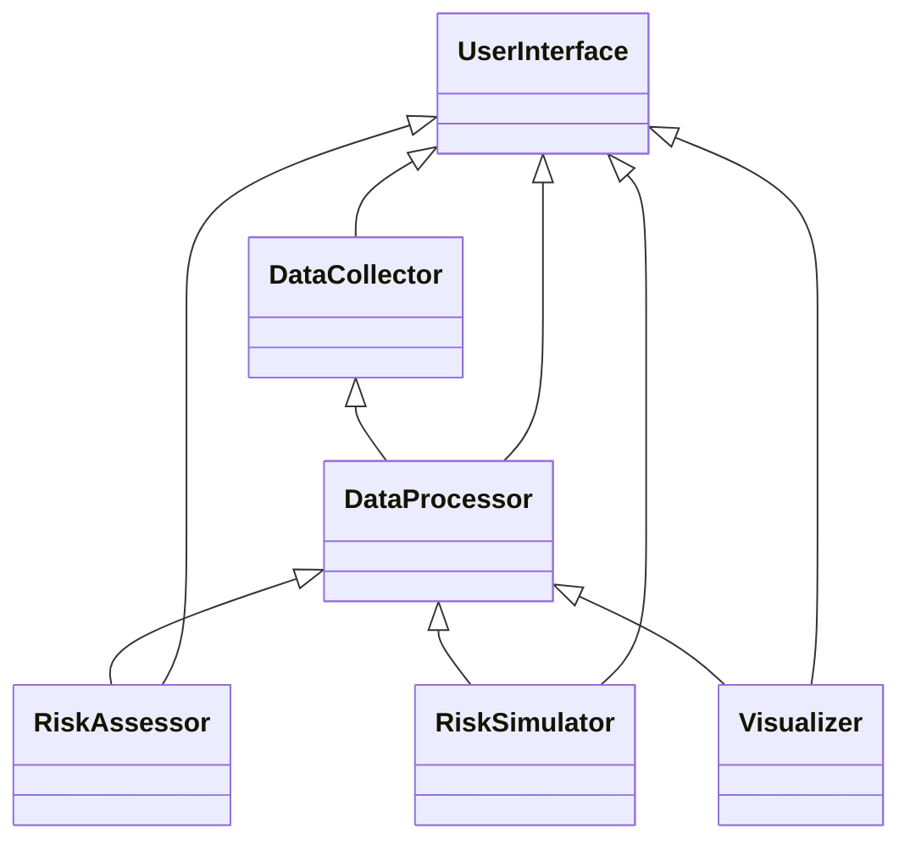

                 

### 1.1 信用风险与传导模拟背景

#### 1.1.1 信用风险概述

信用风险是指由于债务人或交易对手无法按时履行债务而导致的风险。在企业中，信用风险通常表现为企业对其他企业、个人或机构的信用担保或债务违约。信用风险的存在不仅影响企业的财务状况，还会影响整个市场的稳定性。因此，对于企业来说，合理评估和管理信用风险至关重要。

信用风险可以分为以下几类：

- **违约风险**：债务人无法按时偿还债务的风险。
- **主权风险**：国家或地区无法履行其债务的风险。
- **市场风险**：由于市场变化导致债务价值下跌的风险。
- **流动性风险**：企业无法及时获得足够的资金以应对债务的风险。

#### 1.1.2 传导模拟的重要性

传导模拟是一种通过模拟不同风险因素对企业信用风险的影响，从而帮助企业预测和管理潜在风险的方法。在现代社会，企业的信用风险不仅来自于其自身的经营状况，还受到外部环境的影响。因此，通过传导模拟，企业可以更全面地了解风险来源和传导路径，从而制定更为有效的风险管理策略。

传导模拟的重要性体现在以下几个方面：

1. **预测风险**：通过模拟不同情境下的风险传导，企业可以预测潜在的信用风险，提前采取应对措施。
2. **优化策略**：传导模拟可以帮助企业分析不同风险管理策略的效果，从而优化决策。
3. **合规性**：在金融行业中，传导模拟是评估和管理信用风险的重要手段，有助于确保企业合规运营。
4. **提升效益**：通过有效管理信用风险，企业可以降低财务损失，提高整体效益。

#### 1.1.3 企业信用风险传导模拟的现状

当前，企业信用风险传导模拟主要依赖于大数据和人工智能技术。通过收集和分析大量的历史数据和实时数据，企业可以构建信用风险评估模型，预测信用风险的变化趋势。此外，可视化技术的应用使得风险传导过程更加直观，便于企业决策者理解和管理风险。

然而，现有的信用风险传导模拟系统还存在一些不足，如：

- **数据质量**：数据的质量直接影响模型的准确性，但在实际应用中，数据往往存在缺失、噪声和偏差等问题。
- **模型复杂度**：随着风险的多样性和复杂性增加，构建准确的信用风险评估模型变得越来越困难。
- **实时性**：由于数据收集和处理的时间延迟，现有的传导模拟系统往往无法实现实时风险预测。

因此，开发智能化的企业信用风险传导模拟与可视化系统具有重要的现实意义。

#### 1.1.4 企业信用风险传导模拟与可视化系统的边界与外延

企业信用风险传导模拟与可视化系统主要涉及以下核心要素：

- **数据收集**：通过数据爬取、数据接口和外部数据源获取企业及其交易对手的信用信息。
- **数据处理**：对收集到的数据进行清洗、整合和预处理，为后续分析提供高质量的数据基础。
- **风险评估模型**：构建基于大数据和人工智能的信用风险评估模型，实现对信用风险的预测和评估。
- **可视化系统**：利用可视化技术将风险评估结果和传导路径以图表、图像等形式展示，便于企业决策者理解和管理风险。

系统功能模块划分如下：

1. **数据采集模块**：负责收集企业及其交易对手的信用信息。
2. **数据处理模块**：对采集到的数据进行清洗和整合。
3. **风险评估模块**：构建信用风险评估模型，预测企业信用风险。
4. **可视化模块**：将风险评估结果和传导路径以可视化形式展示。

系统应用范围包括：

- **金融行业**：银行、保险、投资等领域的企业信用风险评估和管理。
- **供应链管理**：企业信用风险监控和供应链金融风控。
- **商业信用**：企业信用评级和市场分析。

#### 1.1.5 本章小结

本章介绍了企业信用风险传导模拟与可视化系统的背景和重要性。通过分析信用风险的种类和传导模拟的作用，我们了解了信用风险传导模拟在企业管理中的关键地位。同时，本章还阐述了现有系统的不足和智能化系统的边界与外延，为后续章节的内容奠定了基础。

----------------------------------------------------------------

## 1.2 可视化系统在信用风险管理中的应用

#### 1.2.1 可视化技术的定义与发展

可视化技术是指利用图形、图像、图表等视觉元素，将复杂的数据和信息以直观、易于理解的方式呈现给用户。随着计算机技术和数据科学的发展，可视化技术得到了广泛应用，尤其在信用风险管理领域，可视化系统的作用日益凸显。

可视化技术可以追溯到20世纪70年代，当时计算机图形学开始兴起。随着计算机硬件和软件的不断发展，可视化技术逐渐成熟，并形成了多个分支，如信息可视化、科学可视化、Web可视化等。近年来，随着大数据和人工智能技术的兴起，可视化技术也在不断更新和发展，出现了更多的应用场景和技术手段。

#### 1.2.2 可视化系统在信用风险管理中的作用

可视化系统在信用风险管理中的作用主要体现在以下几个方面：

1. **风险预警**：通过可视化系统，企业可以实时监控信用风险的变化，及时发现潜在的风险隐患，从而提前采取应对措施。
2. **决策支持**：可视化系统能够将复杂的信用风险评估数据以直观的形式呈现，帮助企业决策者快速理解风险状况，制定科学合理的风险管理策略。
3. **风险分析**：可视化系统可以帮助企业分析信用风险的传导路径和影响因素，深入挖掘风险的本质，为风险管理提供有力的支持。
4. **风险教育**：通过可视化系统，企业可以更生动地展示信用风险的危害和影响，提高员工的信用风险意识，加强风险管理的教育和培训。

#### 1.2.3 可视化系统在信用风险管理中的应用

在信用风险管理中，可视化系统可以应用于多个环节，如：

1. **风险监测**：企业可以通过可视化系统实时监控企业的信用风险状况，包括债务违约率、信用评级变化等。
2. **风险评估**：通过可视化系统，企业可以构建信用风险评估模型，展示模型预测结果和风险等级，帮助决策者了解风险状况。
3. **风险分析**：利用可视化系统，企业可以对信用风险的传导路径和影响因素进行深入分析，包括债务关系网、供应链风险等。
4. **风险预警**：可视化系统可以设置风险预警指标，当风险指标超过设定阈值时，系统会自动发出预警信号，提醒决策者关注风险。

#### 1.2.4 可视化系统的发展趋势

随着大数据和人工智能技术的不断进步，可视化系统在信用风险管理中的应用也将不断扩展和深化。以下是一些发展趋势：

1. **智能化**：未来的可视化系统将更加智能化，能够自动分析数据、生成可视化报告，减少人工干预，提高效率。
2. **交互性**：可视化系统将更加注重交互性，用户可以通过拖拽、点击等操作，自由探索数据，挖掘潜在的风险信息。
3. **实时性**：未来的可视化系统将实现实时数据更新，用户可以实时了解风险变化，及时采取应对措施。
4. **多维度**：可视化系统将支持多维度数据展示，用户可以从不同角度分析信用风险，获取更全面的风险信息。

#### 1.2.5 本章小结

本章介绍了可视化技术在信用风险管理中的应用。通过可视化系统，企业可以更直观地了解信用风险状况，制定科学合理的风险管理策略。同时，随着大数据和人工智能技术的发展，可视化系统在信用风险管理中的应用前景将更加广阔。

----------------------------------------------------------------

## 1.3 智能化的定义与特征

智能化是指通过计算机技术、人工智能技术等手段，使系统具有类似人类智能的能力，能够自主地完成特定任务，并对外部环境做出适应性反应。智能化系统具有以下几个核心特征：

1. **学习能力**：智能化系统能够通过学习算法，从数据中获取知识，提高自身性能。例如，通过机器学习算法，系统可以识别信用风险的传导路径，预测潜在风险。
2. **自适应能力**：智能化系统具有自适应能力，能够根据外部环境的变化，调整自身的决策和行为。例如，当市场环境发生改变时，系统可以重新评估信用风险，并调整风险管理策略。
3. **交互能力**：智能化系统具有与人或其他系统交互的能力，能够理解并响应用户需求。例如，通过自然语言处理技术，系统可以与用户进行对话，提供信用风险管理建议。
4. **自主决策能力**：智能化系统具有自主决策能力，能够根据预设的目标和规则，自主地执行任务。例如，在信用风险管理中，系统可以自动评估企业信用风险，并发出预警信号。

#### 1.3.2 智能化在信用风险管理中的优势

智能化技术在信用风险管理中的应用具有显著优势：

1. **提高预测精度**：通过机器学习和数据分析技术，智能化系统能够从大量历史数据中提取有用信息，提高信用风险预测的精度。
2. **实时监控**：智能化系统能够实时监控企业信用风险的变化，及时发现潜在风险，提高风险预警的及时性。
3. **优化决策**：智能化系统能够根据实时数据和企业历史数据，自动生成风险管理报告，为决策者提供科学依据，优化风险管理决策。
4. **降低成本**：通过自动化和智能化手段，企业可以减少人工干预，降低信用风险管理的成本。

#### 1.3.3 智能化在信用风险传导模拟中的应用

智能化在信用风险传导模拟中的应用主要体现在以下几个方面：

1. **数据挖掘**：通过机器学习算法，智能化系统能够从大量历史数据中挖掘出信用风险的传导路径和影响因素，为模拟提供基础。
2. **模拟优化**：智能化系统能够根据实时数据和企业历史数据，自动调整信用风险传导模拟的参数，提高模拟的精度和效率。
3. **风险预测**：通过数据分析，智能化系统能够预测信用风险的变化趋势，为风险管理提供预警。
4. **可视化分析**：智能化系统能够将信用风险传导模拟结果以直观的图表形式展示，帮助企业决策者更好地理解风险状况。

#### 1.3.4 智能化信用风险传导模拟的实现路径

实现智能化信用风险传导模拟的路径主要包括以下几步：

1. **数据收集**：收集企业及其交易对手的信用信息，包括财务数据、信用评级、历史违约记录等。
2. **数据处理**：对收集到的数据进行分析、清洗和整合，为建模提供高质量的数据基础。
3. **模型构建**：构建信用风险评估模型，利用机器学习算法挖掘信用风险的传导路径和影响因素。
4. **模拟优化**：根据实时数据和企业历史数据，调整模型参数，优化信用风险传导模拟结果。
5. **结果分析**：利用可视化技术，将模拟结果以图表形式展示，帮助决策者了解风险状况。

#### 1.3.5 本章小结

本章介绍了智能化的定义与特征，以及智能化在信用风险管理中的优势和应用。通过智能化技术，企业可以更精准地预测信用风险，实时监控风险变化，优化风险管理决策。智能化信用风险传导模拟的实现路径包括数据收集、数据处理、模型构建、模拟优化和结果分析。接下来，我们将进一步探讨智能化技术在实际信用风险管理中的应用和实践。

----------------------------------------------------------------

## 1.4 企业信用风险传导模拟与可视化系统的边界与外延

在开发企业信用风险传导模拟与可视化系统时，明确系统的边界与外延对于设计一个功能完善、易于维护的系统至关重要。以下是该系统的边界与外延的详细描述。

#### 1.4.1 系统核心要素

系统核心要素包括数据收集、数据处理、风险评估模型、可视化展示和用户交互等。以下是这些核心要素的详细介绍：

1. **数据收集**：系统需要收集企业及其交易对手的信用信息，包括财务报表、信用评级、历史交易记录、行业数据等。数据来源可以是公开数据、企业数据库和第三方数据服务。

2. **数据处理**：系统需要对收集到的数据进行清洗、整合和预处理，确保数据质量。数据处理步骤包括数据清洗（去除噪声和异常值）、数据转换（统一数据格式）、数据集成（整合不同来源的数据）和数据归一化（将不同尺度的数据进行标准化处理）。

3. **风险评估模型**：系统需要构建信用风险评估模型，用于预测企业的信用风险。模型可以是基于统计方法（如逻辑回归、决策树）、机器学习方法（如随机森林、神经网络）或混合模型。模型需要根据历史数据和实时数据不断优化，以提高预测精度。

4. **可视化展示**：系统需要提供一个直观的可视化界面，用于展示企业的信用风险状况、风险传导路径和风险管理建议。可视化工具可以是图表、地图、动态图表等，以帮助用户更好地理解风险信息。

5. **用户交互**：系统需要支持用户与系统的交互，包括数据查询、报告生成、风险预警设置等。用户交互设计应考虑用户操作习惯和需求，提供友好的用户界面和操作流程。

#### 1.4.2 系统功能模块划分

系统功能模块的划分有助于明确各模块的职责和相互关系，便于系统开发和维护。以下是系统的主要功能模块及其描述：

1. **数据采集模块**：负责从不同数据源收集信用信息，包括企业内部数据和第三方数据。
2. **数据处理模块**：负责对采集到的数据进行清洗、整合和预处理。
3. **风险评估模块**：负责构建和优化信用风险评估模型，进行信用风险评估。
4. **可视化模块**：负责将风险评估结果以可视化形式展示，包括图表、地图等。
5. **用户交互模块**：负责处理用户请求，提供数据查询、报告生成、风险预警等功能。

#### 1.4.3 系统应用范围

企业信用风险传导模拟与可视化系统可以在多个行业和场景中应用，包括但不限于以下领域：

1. **金融行业**：银行、保险公司、投资公司等金融机构可以使用该系统进行信用风险评估、风险管理和决策支持。
2. **供应链管理**：企业可以通过该系统监控供应链中的信用风险，优化供应链金融管理。
3. **商业信用**：企业可以通过该系统评估自身的信用风险，提高市场竞争力。
4. **投资分析**：投资分析师可以使用该系统进行企业信用风险分析，辅助投资决策。
5. **信用评级**：信用评级机构可以通过该系统提供更准确、全面的信用评级服务。

#### 1.4.4 系统边界

系统边界主要包括以下几个方面：

1. **数据处理范围**：系统只处理与信用风险相关的数据，不包括企业日常运营的其他数据。
2. **风险评估范围**：系统根据企业历史数据和实时数据，评估企业信用风险，但不涉及政治、社会等外部因素。
3. **可视化展示范围**：系统提供可视化展示的信用风险信息，但不包括其他非信用风险信息。
4. **用户交互范围**：系统只提供与信用风险管理相关的用户交互功能，不涉及其他业务功能。

#### 1.4.5 系统外延

系统外延主要包括以下几个方面：

1. **数据扩展**：系统可以通过接入更多的数据源，扩展数据收集范围，提高风险评估的准确性。
2. **功能扩展**：系统可以根据用户需求，增加新的功能模块，如风险预警、风险评估报告生成等。
3. **应用扩展**：系统可以应用于更多的行业和场景，提供更广泛的信用风险管理服务。
4. **技术扩展**：系统可以引入新的技术，如区块链、大数据分析等，提升系统的智能化水平。

#### 1.4.6 本章小结

本章详细介绍了企业信用风险传导模拟与可视化系统的边界与外延。通过明确系统的核心要素、功能模块划分、应用范围以及边界和外延，有助于开发一个功能完善、易于维护的系统。在接下来的章节中，我们将进一步探讨系统设计与实现、算法原理与数学模型，以及实际应用案例。

----------------------------------------------------------------

## 2.1 企业信用风险概念及其属性特征

### 2.1.1 信用风险的定义

信用风险是指债务人或交易对手未能履行债务义务，导致债权人遭受损失的风险。在企业信用风险传导模拟与可视化系统中，信用风险通常指的是企业面临的各种债务违约、信用等级下降、供应链中断等潜在风险。

### 2.1.2 信用风险的属性特征

信用风险具有以下主要属性特征：

1. **不确定性**：信用风险的发生具有不确定性，即债务人是否违约无法完全预测。
2. **传导性**：信用风险不仅影响债务人自身，还可以通过供应链、金融市场等途径传导给其他企业。
3. **复杂性**：信用风险涉及多个方面，包括财务状况、管理能力、行业环境等，因此具有复杂性。
4. **可量化性**：通过建立数学模型，可以对企业信用风险进行量化评估。

### 2.1.3 信用风险与企业经营的关系

信用风险对企业经营具有深远的影响，主要体现在以下几个方面：

1. **资金链断裂**：信用风险可能导致企业无法按时偿还债务，从而引发资金链断裂，影响企业的正常运营。
2. **信用评级下降**：信用风险会导致企业的信用评级下降，增加融资成本，降低市场竞争力。
3. **供应链中断**：信用风险可能引发供应链中断，影响企业的生产和销售。
4. **声誉受损**：信用风险会损害企业的声誉，影响客户和合作伙伴的信任。

### 2.1.4 信用风险的分类

信用风险可以根据不同的标准进行分类，常见的分类方法包括：

1. **按风险来源分类**：可以分为债务风险、市场风险、主权风险和流动性风险等。
2. **按风险影响分类**：可以分为财务风险、经营风险和战略风险等。
3. **按风险性质分类**：可以分为可量化风险和不可量化风险。

### 2.1.5 信用风险传导的概念与机制

信用风险传导是指信用风险从初始债务人通过交易关系、供应链、金融市场等途径传导给其他企业的过程。信用风险传导的机制包括：

1. **直接传导**：通过直接的交易关系，如供应商与客户之间的债务关系。
2. **间接传导**：通过供应链上下游企业之间的债务关系，以及金融市场中的信用传导。
3. **系统传导**：在金融市场中，信用风险可以通过金融产品（如债券、信用违约互换等）传导。

### 2.1.6 信用风险传导的影响因素

信用风险传导的影响因素包括：

1. **宏观经济环境**：经济周期、政策调控、金融市场波动等宏观经济因素会影响信用风险的传导。
2. **行业环境**：行业竞争状况、行业发展阶段、行业法规等影响企业信用风险的传导。
3. **企业内部因素**：企业的财务状况、管理水平、企业文化等影响企业信用风险的传导。
4. **外部环境**：社会环境、政治环境、法律环境等外部环境因素也会影响信用风险的传导。

### 2.1.7 信用风险传导的识别与评估

为了有效管理信用风险传导，需要识别和评估信用风险的传导路径和影响因素。识别方法包括：

1. **数据收集**：收集企业及其交易对手的历史数据、财务报表、信用评级等。
2. **模型构建**：建立信用风险评估模型，如逻辑回归、神经网络等，用于预测信用风险。
3. **情景分析**：通过模拟不同情景，分析信用风险传导的可能路径和影响。

评估方法包括：

1. **定量评估**：利用数学模型和统计方法，对信用风险进行量化评估。
2. **定性评估**：通过专家判断和行业经验，对信用风险进行定性评估。

### 2.1.8 本章小结

本章详细介绍了企业信用风险的概念、属性特征、与企业经营的关系、分类、传导机制、影响因素以及识别与评估方法。通过理解信用风险的基本概念和传导机制，可以为后续的算法原理讲解和系统设计提供基础。

----------------------------------------------------------------

## 2.2 传导模拟原理及其应用

### 2.2.1 传导模拟的基本概念

传导模拟是一种通过模拟不同风险因素对企业信用风险的影响，从而帮助企业预测和管理潜在风险的方法。在传导模拟中，企业信用风险被视为一个动态系统，其变化受到内部和外部多种因素的影响。传导模拟的核心目标是通过模拟不同情境下的风险传导路径，预测企业信用风险的变化趋势，为风险管理提供科学依据。

### 2.2.2 传导模拟的方法与流程

传导模拟的方法主要包括以下几步：

1. **数据收集**：收集企业及其交易对手的历史数据、财务报表、信用评级等，为模拟提供数据基础。
2. **模型构建**：建立信用风险评估模型，如逻辑回归、神经网络等，用于预测企业信用风险。
3. **情景设定**：根据企业内外部环境的变化，设定不同的情景，如经济衰退、市场波动、政策调整等。
4. **模拟运行**：将设定的情景输入到模型中，模拟信用风险的变化路径。
5. **结果分析**：分析模拟结果，包括信用风险的变化趋势、传导路径和影响因素，为风险管理提供参考。

### 2.2.3 传导模拟在实际风险分析中的应用

在实际风险分析中，传导模拟广泛应用于以下场景：

1. **信用风险管理**：企业通过传导模拟预测信用风险的变化趋势，制定风险管理策略，降低信用风险。
2. **投资决策**：投资者通过传导模拟分析企业的信用风险，评估投资风险，优化投资组合。
3. **供应链管理**：企业通过传导模拟监控供应链中的信用风险，优化供应链金融管理，降低供应链中断风险。
4. **行业分析**：金融机构和分析师通过传导模拟分析行业信用风险，评估行业风险，制定投资策略。
5. **政策制定**：政府机构通过传导模拟分析宏观经济政策和行业政策对企业信用风险的影响，制定相关政策。

### 2.2.4 传导模拟的优势

传导模拟具有以下优势：

1. **预测性强**：通过模拟不同情境下的信用风险传导路径，传导模拟能够提前预测信用风险的变化趋势，为风险管理提供预警。
2. **全面性**：传导模拟考虑了企业内部和外部多种因素的影响，能够全面评估信用风险。
3. **灵活性**：传导模拟可以根据实际需求，设定不同的情景，灵活调整模拟参数，适用于各种风险管理场景。
4. **直观性**：通过可视化技术，传导模拟结果可以直观地展示信用风险的变化路径和影响因素，便于企业决策者理解和管理风险。

### 2.2.5 传导模拟的局限性

尽管传导模拟在风险分析中具有显著优势，但仍然存在一些局限性：

1. **数据质量**：传导模拟的准确性依赖于高质量的数据，但在实际应用中，数据可能存在缺失、噪声和偏差等问题。
2. **模型复杂度**：随着风险的多样性和复杂性增加，构建准确的信用风险评估模型变得越来越困难。
3. **实时性**：由于数据收集和处理的时间延迟，传导模拟系统的实时性可能受到影响。
4. **依赖性**：传导模拟依赖于数学模型和算法，模型的准确性和稳定性对模拟结果有重要影响。

### 2.2.6 传导模拟在信用风险传导模拟与可视化系统中的应用

在信用风险传导模拟与可视化系统中，传导模拟是一个关键模块，其主要作用如下：

1. **风险评估**：通过传导模拟，系统可以预测企业信用风险的变化趋势，评估信用风险水平，为风险管理提供科学依据。
2. **风险预警**：系统可以利用传导模拟结果，实时监控信用风险的变化，及时发出预警信号，提醒企业采取应对措施。
3. **决策支持**：系统可以通过传导模拟结果，为企业的信用风险管理提供决策支持，帮助企业制定科学合理的管理策略。
4. **可视化展示**：系统可以将传导模拟结果以可视化形式展示，便于企业决策者直观地了解信用风险的传导路径和影响因素。

### 2.2.7 本章小结

本章详细介绍了传导模拟的基本概念、方法与流程，以及在实际风险分析中的应用。通过传导模拟，企业可以更全面地了解信用风险的传导路径和影响因素，预测信用风险的变化趋势，为风险管理提供科学依据。在信用风险传导模拟与可视化系统中，传导模拟发挥着关键作用，为企业的信用风险管理提供了有力支持。接下来，我们将进一步探讨可视化系统在信用风险管理中的应用，以及智能化技术在可视化系统中的应用。

----------------------------------------------------------------

## 2.3 可视化系统原理与实现

#### 2.3.1 可视化系统的基本原理

可视化系统通过将复杂的数据和信息以图形、图像、图表等形式直观展示，帮助用户更好地理解和分析数据。其基本原理包括以下几个方面：

1. **数据转换**：将结构化或非结构化的数据转换为可视化元素，如点、线、面、图标等。
2. **映射关系**：将数据属性映射到可视化元素上，如颜色、大小、形状等，以反映数据的特征和关系。
3. **交互设计**：设计用户与可视化系统的交互方式，如点击、拖拽、筛选等，以实现数据的动态展示和分析。
4. **视觉引导**：通过视觉元素的设计，引导用户关注重要信息，提高数据的可读性和易用性。

#### 2.3.2 可视化系统的实现技术

可视化系统的实现涉及多种技术和工具，以下是一些常用的实现技术：

1. **图形学技术**：包括2D和3D图形绘制、图像处理、动画效果等，用于创建和展示可视化元素。
2. **数据可视化库**：如D3.js、ECharts、Plotly等，提供丰富的图表类型和可视化组件，方便开发者快速构建可视化系统。
3. **前端框架**：如React、Vue.js、Angular等，用于构建用户界面和实现交互功能。
4. **数据管理库**：如Pandas、NumPy等，用于数据处理和分析。
5. **后端服务**：如Flask、Django、Spring Boot等，用于数据存储、处理和提供API接口。

#### 2.3.3 可视化系统的设计原则

设计可视化系统时，应遵循以下原则：

1. **数据准确性**：确保可视化数据来源可靠、真实，避免误导用户。
2. **易用性**：设计直观、简洁的用户界面，方便用户快速理解和操作。
3. **交互性**：提供丰富的交互功能，如筛选、排序、过滤等，使用户能够动态探索数据。
4. **可扩展性**：设计模块化、灵活的系统架构，便于添加新的功能和数据源。
5. **美观性**：通过合理的布局、配色和视觉设计，提高可视化系统的美观度，提升用户体验。

#### 2.3.4 可视化系统在信用风险管理中的应用

在信用风险管理中，可视化系统可以应用于以下场景：

1. **风险监控**：实时展示企业的信用风险状况，包括信用评分、债务违约率、风险等级等。
2. **风险分析**：通过图表、地图等展示信用风险的传导路径和影响因素，帮助企业识别风险热点。
3. **决策支持**：提供可视化报告和数据分析结果，辅助企业决策者制定风险管理策略。
4. **风险预警**：设置风险预警指标，当风险指标超过阈值时，自动发出预警信号。

#### 2.3.5 可视化系统的实现案例

以下是一个简单的可视化系统实现案例，使用Python和ECharts库进行数据可视化。

**环境准备**：

1. 安装Python环境。
2. 安装ECharts库：`pip install echarts`

**代码实现**：

```python
from pyecharts import options as opts
from pyecharts.charts import Bar

# 数据准备
data = [
    ["产品A", 43.3], 
    ["产品B", 83.1], 
    ["产品C", 86.4], 
    ["产品D", 72.4], 
    ["产品E", 56.7], 
    ["产品F", 34.5], 
    ["产品G", 62.8], 
    ["产品H", 45.2]
]

# 创建Bar图表
bar = (
    Bar()
    .add_xaxis([item[0] for item in data])
    .add_yaxis("销售量", [item[1] for item in data])
    .set_global_opts(title_opts=opts.TitleOpts(title="产品销售量"))
)

# 渲染图表
bar.render()
```

运行上述代码，将生成一个以产品名称为X轴、销售量为Y轴的柱状图。

#### 2.3.6 本章小结

本章介绍了可视化系统的基本原理、实现技术和设计原则，并通过一个简单的实现案例展示了数据可视化在实际应用中的效果。在信用风险管理中，可视化系统可以提供直观、易用的数据展示和分析工具，帮助企业更好地理解和控制信用风险。接下来，我们将进一步探讨智能化技术在可视化系统中的应用。

----------------------------------------------------------------

### 2.4.1 智能化技术在信用风险管理中的角色

智能化技术在信用风险管理中扮演着至关重要的角色，主要体现在以下几个方面：

1. **数据挖掘**：智能化技术能够从大量历史数据中挖掘出有用的信息，识别潜在的风险因素。通过机器学习算法，如聚类、关联规则挖掘等，智能化系统可以识别出企业信用风险的关键指标和特征。
   
2. **预测分析**：利用智能化技术，可以建立信用风险预测模型，通过分析历史数据和实时数据，预测企业未来可能面临的信用风险。这种预测分析能够帮助企业在风险发生前采取预防措施，降低风险损失。

3. **自动化决策**：智能化技术能够实现自动化决策，通过算法模型自动评估企业的信用风险，并依据预设的规则和阈值，自动发出预警信号或建议。这种自动化决策能够提高信用风险管理的效率，减少人为错误。

4. **智能监控**：智能化系统能够实时监控企业信用风险的变化，通过大数据分析和机器学习算法，识别异常行为和潜在风险。这种智能监控能够为企业提供及时的风险预警，帮助管理者迅速采取应对措施。

5. **个性化服务**：智能化技术可以根据企业的具体情况和信用风险特征，提供个性化的风险管理方案。这种个性化服务能够提高风险管理的效果，满足不同企业的需求。

### 2.4.2 智能化技术的核心要素

实现智能化信用风险管理系统，需要以下核心要素：

1. **大数据技术**：大数据技术能够处理和分析海量数据，为智能化系统提供数据支持。通过数据采集、存储、处理和分析，智能化系统能够从大量数据中提取有价值的信息。

2. **机器学习算法**：机器学习算法是智能化技术的核心，通过训练模型，系统能够自动识别信用风险的关键因素，预测信用风险的变化趋势。常见的机器学习算法包括逻辑回归、决策树、随机森林、神经网络等。

3. **自然语言处理（NLP）**：自然语言处理技术能够处理和分析非结构化数据，如新闻报道、社交媒体信息等，提取有价值的信息。在信用风险管理中，NLP技术可以帮助识别潜在的风险信号，提高风险预警的准确性。

4. **数据可视化**：数据可视化技术能够将复杂的数据以图形、图表等形式直观展示，帮助用户理解和分析数据。在信用风险管理中，数据可视化技术可以提供直观的风险分析结果，便于决策者制定风险管理策略。

5. **人工智能决策支持系统**：人工智能决策支持系统能够根据实时数据和预测结果，自动生成风险管理报告和决策建议。这种系统可以大幅提高信用风险管理的效率和准确性。

### 2.4.3 智能化技术在可视化系统中的实现

智能化技术在可视化系统中的实现主要包括以下几个方面：

1. **数据预处理**：通过大数据技术和机器学习算法，对原始数据进行预处理，提取有价值的信息。例如，使用聚类算法将数据分组，使用特征工程提取重要的风险特征。

2. **风险预测模型**：利用机器学习算法构建信用风险预测模型，通过对历史数据的训练，模型可以自动识别信用风险的关键因素，预测未来的信用风险。

3. **实时监控**：通过大数据分析和实时数据流处理，智能化系统能够实时监控企业信用风险的变化，识别潜在的信用风险信号，并及时发出预警。

4. **可视化展示**：利用数据可视化技术，将风险预测结果和监控信息以图表、地图等形式直观展示。这种可视化展示可以帮助用户更好地理解风险状况，制定风险管理策略。

5. **自动化决策**：通过人工智能决策支持系统，智能化系统能够根据预测结果和监控信息，自动生成风险管理报告和决策建议。这种自动化决策可以大幅提高信用风险管理的效率和准确性。

### 2.4.4 智能化技术在信用风险传导模拟与可视化系统中的实现路径

实现智能化信用风险传导模拟与可视化系统，可以遵循以下路径：

1. **需求分析**：明确系统的目标和应用场景，确定需要实现的功能模块和技术方案。

2. **数据收集**：收集企业及其交易对手的信用信息，包括财务数据、信用评级、历史交易记录等。

3. **数据处理**：对收集到的数据进行清洗、整合和预处理，为建模提供高质量的数据基础。

4. **模型构建**：利用机器学习算法构建信用风险预测模型，并进行模型优化和验证。

5. **可视化设计**：设计系统的可视化界面，选择合适的图表和可视化工具，以直观展示信用风险信息。

6. **系统集成**：将数据预处理、模型预测和可视化展示模块整合到一起，实现系统的整体功能。

7. **测试与部署**：对系统进行测试，确保系统的稳定性和可靠性，然后部署到生产环境中。

8. **持续优化**：根据实际应用情况，不断优化系统功能和技术方案，提高信用风险管理的效率和准确性。

### 2.4.5 本章小结

本章介绍了智能化技术在信用风险管理中的角色、核心要素以及在可视化系统中的实现方法。通过大数据、机器学习、数据可视化等技术的应用，智能化信用风险传导模拟与可视化系统能够为企业提供高效、精准的风险管理服务。下一章将详细介绍企业信用风险传导模拟与可视化系统的核心概念对比与联系。

----------------------------------------------------------------

## 2.5 核心概念对比与联系

在开发企业信用风险传导模拟与可视化系统中，理解并明确各核心概念之间的关系至关重要。以下将对比企业信用风险、传导模拟、可视化系统这三个核心概念，并通过Mermaid ER实体关系图展示它们之间的相互关系。

### 2.5.1 企业信用风险、传导模拟、可视化系统对比

#### 企业信用风险

企业信用风险是指企业在经营过程中，因债务人或交易对手未能履行债务义务而导致的风险。它通常表现为债务违约、信用评级下降、资金链断裂等。

#### 传导模拟

传导模拟是指通过模拟不同风险因素对企业信用风险的影响，从而预测和管理潜在风险的方法。传导模拟考虑了企业内部和外部因素，如财务状况、宏观经济环境、政策调整等，帮助企业在不同情景下评估信用风险。

#### 可视化系统

可视化系统是指利用图形、图像、图表等视觉元素，将复杂的数据和信息以直观、易于理解的方式呈现给用户。在信用风险管理中，可视化系统可以帮助企业实时监控信用风险状况，分析风险传导路径，为决策者提供决策支持。

### 2.5.2 三者之间的相互关系

企业信用风险、传导模拟和可视化系统之间存在密切的关联：

1. **企业信用风险**是**传导模拟**和**可视化系统**的基础。企业信用风险的存在和变化是传导模拟和可视化系统设计和实施的核心。

2. **传导模拟**依赖于**企业信用风险**的数据，通过模拟不同情景，预测信用风险的变化趋势。传导模拟的结果为可视化系统的展示提供了数据支持。

3. **可视化系统**将**传导模拟**的结果以图形、图表等形式直观展示，帮助企业决策者理解和分析信用风险，制定风险管理策略。

### 2.5.3 概念联系Mermaid ER实体关系图

使用Mermaid ER实体关系图，我们可以更清晰地展示企业信用风险、传导模拟和可视化系统之间的相互关系。

```mermaid
erDiagram
    企业信用风险 ||--o> 传导模拟 : 有数据支持
    传导模拟 ||--o> 可视化系统 : 有展示需求
    企业信用风险 ||--o> 可视化系统 : 有展示需求
```

在上述ER实体关系图中：

- **企业信用风险**作为基础数据来源，支持**传导模拟**和**可视化系统**。
- **传导模拟**作为中间层，处理企业信用风险数据，并生成可视化所需的数据。
- **可视化系统**作为最终输出层，将**传导模拟**的结果以图形形式直观展示。

### 2.5.4 核心概念对比表格

为了更直观地展示企业信用风险、传导模拟和可视化系统之间的差异和联系，我们可以创建一个对比表格：

| 对比项          | 企业信用风险        | 传导模拟             | 可视化系统               |
|-----------------|---------------------|----------------------|--------------------------|
| 定义            | 债务违约等风险      | 模拟风险传导路径      | 展示数据和分析结果      |
| 数据来源        | 财务报表、历史数据  | 企业信用风险数据      | 传导模拟结果             |
| 目的            | 风险评估与管理      | 预测风险趋势          | 帮助理解和决策           |
| 关键技术        | 统计分析、风险评估  | 模拟算法、大数据处理   | 数据可视化、交互设计     |
| 应用场景        | 风险评估、决策支持   | 风险预测、模拟优化     | 风险监控、数据分析报告   |

通过对比表格，我们可以更清晰地理解这三个核心概念的区别和联系，为后续的系统设计与实现提供参考。

### 2.5.5 本章小结

本章对比了企业信用风险、传导模拟和可视化系统这三个核心概念，并通过Mermaid ER实体关系图和对比表格展示了它们之间的相互关系。理解这些核心概念及其关系，对于开发一个功能完善、易于维护的企业信用风险传导模拟与可视化系统至关重要。下一章将详细讲解算法原理，包括数学模型和算法流程。

----------------------------------------------------------------

### 3.1 算法原理概述

在开发企业信用风险传导模拟与可视化系统中，算法原理是核心部分。算法原理决定了系统的预测精度、分析效果和用户体验。本节将概述系统的算法原理，包括企业信用风险评估算法、信用风险传导模拟算法和智能化可视化算法。

#### 3.1.1 企业信用风险评估算法

企业信用风险评估算法是信用风险管理的基础。其主要功能是根据企业历史数据、财务状况和其他相关指标，对企业信用风险进行量化评估。常见的评估算法包括：

1. **逻辑回归（Logistic Regression）**：逻辑回归是一种常用的统计方法，用于评估信用风险。通过建立逻辑回归模型，可以将企业的财务指标转换为信用评分。
   
   $$ P(Y=1|X) = \frac{1}{1 + e^{-(\beta_0 + \beta_1X_1 + \beta_2X_2 + ... + \beta_nX_n)}} $$
   
   其中，$P(Y=1|X)$表示企业违约的概率，$\beta_0, \beta_1, \beta_2, ..., \beta_n$是模型参数。

2. **决策树（Decision Tree）**：决策树是一种基于树形结构的模型，通过一系列判断节点和决策分支，将企业分类为不同的信用风险等级。

3. **支持向量机（SVM）**：支持向量机是一种基于间隔的模型，通过找到一个最优的超平面，将不同信用风险的企业分开。

4. **神经网络（Neural Network）**：神经网络是一种模拟人脑神经元连接的模型，通过多层神经元的组合，实现复杂的信用风险评估。

#### 3.1.2 信用风险传导模拟算法

信用风险传导模拟算法是用于模拟不同风险因素对企业信用风险的影响，从而预测企业未来信用风险的变化趋势。以下是一些常见的传导模拟算法：

1. **蒙特卡罗模拟（Monte Carlo Simulation）**：蒙特卡罗模拟是一种基于随机抽样的方法，通过模拟大量随机样本，预测信用风险的变化趋势。

2. **蒙特卡罗树搜索（Monte Carlo Tree Search）**：蒙特卡罗树搜索是一种基于蒙特卡罗模拟的决策树搜索算法，通过扩展和剪枝决策树，优化信用风险传导模拟。

3. **动态系统仿真（Dynamic System Simulation）**：动态系统仿真是一种基于数学模型的方法，通过模拟企业信用风险的动态变化，预测信用风险的趋势和传导路径。

#### 3.1.3 智能化可视化算法

智能化可视化算法是用于将信用风险评估和传导模拟的结果以直观、易于理解的方式展示。以下是一些常用的可视化算法：

1. **聚类算法（Clustering Algorithms）**：聚类算法是一种无监督学习方法，用于将企业按照信用风险程度进行分类，生成聚类图或散点图。

2. **时序可视化（Time Series Visualization）**：时序可视化是一种用于展示企业信用风险随时间变化趋势的图表，如折线图、柱状图等。

3. **网络可视化（Network Visualization）**：网络可视化是一种用于展示企业信用风险传导路径的图表，如力导向图、关系图等。

4. **交互式可视化（Interactive Visualization）**：交互式可视化是一种支持用户与可视化图表进行交互的方法，如筛选、过滤、点击等，提高用户体验。

### 3.1.4 算法原理在系统中的实现

在系统实现中，算法原理贯穿于数据收集、处理、风险评估、传导模拟和可视化展示等各个环节。以下是一个简化的实现流程：

1. **数据收集**：收集企业及其交易对手的信用信息，包括财务报表、信用评级、历史交易记录等。

2. **数据处理**：对收集到的数据进行分析、清洗和预处理，为建模提供高质量的数据基础。

3. **风险评估**：利用逻辑回归、决策树等算法，建立信用风险评估模型，评估企业信用风险。

4. **传导模拟**：利用蒙特卡罗模拟等算法，模拟信用风险的传导路径，预测企业未来信用风险的变化趋势。

5. **可视化展示**：利用聚类、时序、网络等可视化算法，将评估和传导模拟结果以图表形式直观展示，提高用户体验。

### 3.1.5 本章小结

本章概述了企业信用风险传导模拟与可视化系统的算法原理，包括信用风险评估算法、传导模拟算法和智能化可视化算法。这些算法原理在系统中发挥着关键作用，为系统的预测精度、分析效果和用户体验提供了保障。下一章将详细讲解这些算法原理的具体实现，包括数学模型、算法流程和Python源代码。

----------------------------------------------------------------

### 3.2 数学模型与公式

在信用风险评估和传导模拟过程中，数学模型和公式起着至关重要的作用。以下将详细介绍企业信用风险评估模型、信用风险传导模拟模型以及可视化算法中的数学公式，并通过Python源代码进行详细阐述。

#### 3.2.1 企业信用风险评估模型

企业信用风险评估模型通常用于将企业的财务指标和经营状况转化为信用评分。以下是一个基于逻辑回归的信用风险评估模型的数学公式：

$$
P(Y=1|X) = \frac{1}{1 + e^{-(\beta_0 + \beta_1X_1 + \beta_2X_2 + ... + \beta_nX_n)}}
$$

其中，$P(Y=1|X)$表示企业发生违约的概率，$\beta_0, \beta_1, \beta_2, ..., \beta_n$是逻辑回归模型的参数，$X_1, X_2, ..., X_n$是企业财务指标和其他特征变量。

在Python中，可以使用scikit-learn库实现逻辑回归模型。以下是一个简单的示例代码：

```python
from sklearn.linear_model import LogisticRegression
from sklearn.model_selection import train_test_split
from sklearn.metrics import accuracy_score

# 假设X是特征矩阵，y是目标变量（0表示正常，1表示违约）
X_train, X_test, y_train, y_test = train_test_split(X, y, test_size=0.2, random_state=42)

# 构建逻辑回归模型
model = LogisticRegression()
model.fit(X_train, y_train)

# 预测测试集
y_pred = model.predict(X_test)

# 计算准确率
accuracy = accuracy_score(y_test, y_pred)
print("Accuracy:", accuracy)
```

#### 3.2.2 信用风险传导模拟模型

信用风险传导模拟模型用于模拟不同风险因素对企业信用风险的影响，预测企业未来信用风险的变化趋势。以下是一个简单的蒙特卡罗模拟模型的数学公式：

$$
X_t = X_{t-1} + \alpha_t R_t
$$

其中，$X_t$表示当前时刻的信用风险水平，$X_{t-1}$表示上一时刻的信用风险水平，$\alpha_t$是模型参数，$R_t$是当前时刻的风险因子。

在Python中，可以使用numpy库实现蒙特卡罗模拟。以下是一个简单的示例代码：

```python
import numpy as np

# 假设初始信用风险水平X_0为100，模型参数alpha为0.1，风险因子R的均值为0，标准差为1
X_0 = 100
alpha = 0.1
mean_R = 0
std_R = 1

# 模拟1000次
num_iterations = 1000
X_values = []

for _ in range(num_iterations):
    R = np.random.normal(mean_R, std_R)
    X_t = X_0 + alpha * R
    X_values.append(X_t)

# 计算信用风险水平的平均值和标准差
mean_X = np.mean(X_values)
std_X = np.std(X_values)

print("Average Credit Risk:", mean_X)
print("Standard Deviation of Credit Risk:", std_X)
```

#### 3.2.3 可视化算法数学模型

在可视化算法中，常用的数学模型包括聚类算法和时序可视化。以下是一个简单的K-means聚类算法的数学公式：

$$
C_j^{new} = \frac{1}{N_j} \sum_{i=1}^{N} x_i
$$

其中，$C_j^{new}$是新的聚类中心，$N_j$是第j个聚类中心的样本数量，$x_i$是每个样本的坐标。

在Python中，可以使用scikit-learn库实现K-means聚类。以下是一个简单的示例代码：

```python
from sklearn.cluster import KMeans
import matplotlib.pyplot as plt

# 假设X是特征矩阵
X = np.array([[1, 2], [1, 4], [1, 0], [4, 2], [4, 4], [4, 0]])

# 构建K-means模型，假设有2个聚类中心
model = KMeans(n_clusters=2, random_state=42)
model.fit(X)

# 计算聚类中心
centroids = model.cluster_centers_

# 可视化聚类结果
plt.scatter(X[:, 0], X[:, 1], c=model.labels_, cmap='viridis')
plt.scatter(centroids[:, 0], centroids[:, 1], s=300, c='red', label='Centroids')
plt.title('K-means Clustering')
plt.xlabel('Feature 1')
plt.ylabel('Feature 2')
plt.legend()
plt.show()
```

#### 3.2.4 数学公式在文中的嵌入

在文中嵌入数学公式时，可以使用LaTeX格式。以下是一个示例：

$$
\frac{d^2y}{dx^2} = -k \frac{dy}{dx}
$$

在独立段落内嵌入数学公式时，可以使用以下格式：

$ \frac{d^2y}{dx^2} = -k \frac{dy}{dx} $

通过上述方法，可以确保数学公式在文中清晰呈现，便于读者理解和分析。

### 3.2.5 本章小结

本章详细介绍了企业信用风险传导模拟与可视化系统中的数学模型和公式。通过Python源代码的示例，读者可以更直观地了解数学模型在实际应用中的实现方法。这些数学模型和公式在系统的预测、模拟和可视化过程中发挥着关键作用，为系统的准确性和实用性提供了保障。下一章将介绍系统分析与架构设计方案，包括问题场景、项目介绍、系统功能设计、系统架构设计、系统接口设计和系统交互。

----------------------------------------------------------------

## 3.3 系统分析与架构设计方案

#### 3.3.1 问题场景

在当前金融市场中，企业信用风险管理面临诸多挑战。传统的信用风险评估方法主要依赖于人工经验和财务报表，难以实时、准确地预测信用风险。同时，信用风险的传导路径复杂，难以全面监控和管理。为了解决这些问题，我们需要设计并实现一个智能化的企业信用风险传导模拟与可视化系统，通过大数据和人工智能技术，提供实时、精准的信用风险评估和风险传导路径分析。

#### 3.3.2 项目介绍

项目名称：智能化企业信用风险传导模拟与可视化系统

项目目标：构建一个集数据采集、处理、风险评估、传导模拟和可视化展示于一体的智能信用风险管理系统，提高信用风险管理的效率和准确性。

项目范围：涵盖企业信用风险评估、信用风险传导模拟、可视化展示和用户交互等功能模块。

项目技术栈：Python、scikit-learn、numpy、matplotlib、ECharts、Flask等。

#### 3.3.3 系统功能设计（领域模型类图）

系统功能设计主要包括以下模块：

1. **数据采集模块**：负责收集企业及其交易对手的信用信息，包括财务数据、信用评级、历史交易记录等。
2. **数据处理模块**：负责对采集到的数据进行清洗、整合和预处理，为后续分析提供高质量的数据基础。
3. **风险评估模块**：负责构建信用风险评估模型，评估企业信用风险，输出信用评分。
4. **传导模拟模块**：负责模拟信用风险的传导路径，预测企业未来信用风险的变化趋势。
5. **可视化模块**：负责将评估和传导模拟结果以图表、地图等形式展示，便于用户理解和分析。
6. **用户交互模块**：负责处理用户请求，提供数据查询、报告生成、风险预警等功能。

领域模型类图如下所示：



#### 3.3.4 系统架构设计（架构图）

系统架构设计采用分层架构，包括数据层、业务逻辑层和表现层。以下是一个简化的系统架构图：

```mermaid
sequenceDiagram
    User -->|发起请求| UserInterface
    UserInterface -->|处理请求| BusinessLogic
    BusinessLogic -->|数据操作| DataLayer
    DataLayer -->|数据返回| BusinessLogic
    BusinessLogic -->|结果展示| UserInterface
    UserInterface -->|响应结果| User
endsequenceDiagram
```

1. **数据层**：负责数据的存储和管理，包括数据库、数据仓库等。
2. **业务逻辑层**：负责处理业务逻辑，包括数据采集、处理、风险评估、传导模拟和可视化等。
3. **表现层**：负责用户界面设计和交互，包括前端展示和后端API接口。

#### 3.3.5 系统接口设计（接口设计）

系统接口设计主要包括以下API接口：

1. **数据采集接口**：用于从外部数据源获取企业及其交易对手的信用信息。
2. **数据处理接口**：用于对采集到的数据进行清洗、整合和预处理。
3. **风险评估接口**：用于评估企业信用风险，输出信用评分。
4. **传导模拟接口**：用于模拟信用风险的传导路径，预测企业未来信用风险的变化趋势。
5. **可视化接口**：用于获取评估和传导模拟结果，生成可视化展示。

以下是一个简化的接口设计：

```mermaid
interface DataCollector {
    +collectData(source: str): DataFrame
}

interface DataProcessor {
    +cleanData(data: DataFrame): DataFrame
    +integrateDataframes(dfs: List[DataFrame]): DataFrame
}

interface RiskAssessor {
    +evaluateRisk(data: DataFrame): float
}

interface RiskSimulator {
    +simulateRisk(data: DataFrame): DataFrame
}

interface Visualizer {
    +generateVisualization(data: DataFrame): Visualization
}

UserInterface <- DataCollector: data collection
UserInterface <- DataProcessor: data processing
UserInterface <- RiskAssessor: risk evaluation
UserInterface <- RiskSimulator: risk simulation
UserInterface <- Visualizer: visualization generation
```

#### 3.3.6 系统交互（序列图）

系统交互描述了用户请求如何通过各模块处理并返回结果。以下是一个简化的序列图：

```mermaid
sequenceDiagram
    User -->|发起请求| UserInterface
    UserInterface -->|请求处理| BusinessLogic
    BusinessLogic -->|请求处理| DataLayer
    DataLayer -->|数据返回| BusinessLogic
    BusinessLogic -->|数据处理| DataProcessor
    BusinessLogic -->|风险评估| RiskAssessor
    BusinessLogic -->|传导模拟| RiskSimulator
    BusinessLogic -->|结果生成| Visualizer
    Visualizer -->|可视化结果| UserInterface
    UserInterface -->|响应结果| User
endsequenceDiagram
```

#### 3.3.7 本章小结

本章详细介绍了企业信用风险传导模拟与可视化系统的分析与架构设计方案，包括问题场景、项目介绍、系统功能设计、系统架构设计、系统接口设计和系统交互。通过这些设计，系统可以实现高效、准确的信用风险评估和风险传导模拟，为企业管理信用风险提供有力支持。下一章将深入探讨项目的实施细节，包括环境安装、系统核心实现和代码应用解读。

----------------------------------------------------------------

## 3.4 项目实战

#### 3.4.1 环境安装

为了顺利开展企业信用风险传导模拟与可视化系统的开发，首先需要搭建合适的技术环境。以下是环境安装的具体步骤：

1. **Python环境搭建**：

   安装Python 3.8及以上版本，可以通过官方网站下载安装包进行安装。安装完成后，通过命令行验证安装：

   ```bash
   python --version
   ```

2. **虚拟环境搭建**：

   为了避免不同项目之间的依赖冲突，建议为每个项目创建独立的虚拟环境。安装virtualenv工具，通过以下命令创建虚拟环境：

   ```bash
   pip install virtualenv
   virtualenv venv
   source venv/bin/activate  # 在Linux或macOS上
   venv\Scripts\activate    # 在Windows上
   ```

3. **依赖包安装**：

   在虚拟环境中，安装系统所需的依赖包。常用的依赖包包括scikit-learn、numpy、matplotlib、ECharts、Flask等。可以通过以下命令安装：

   ```bash
   pip install scikit-learn numpy matplotlib echarts flask
   ```

#### 3.4.2 系统核心实现

以下是系统核心实现的步骤，包括数据采集、数据处理、风险评估、传导模拟和可视化等模块。

1. **数据采集**：

   数据采集是系统的基础，可以从多个数据源获取企业及其交易对手的信用信息。以下是一个简单的示例：

   ```python
   import pandas as pd
   
   # 读取企业财务报表数据
   financial_data = pd.read_csv('financial_data.csv')
   # 读取信用评级数据
   credit_rating_data = pd.read_csv('credit_rating_data.csv')
   # 读取历史交易记录数据
   transaction_data = pd.read_csv('transaction_data.csv')
   ```

2. **数据处理**：

   数据处理包括数据清洗、整合和预处理，确保数据质量。以下是一个简单的示例：

   ```python
   # 数据清洗
   financial_data = financial_data.dropna()
   credit_rating_data = credit_rating_data.dropna()
   transaction_data = transaction_data.dropna()
   
   # 数据整合
   data = pd.merge(financial_data, credit_rating_data, on='company_id')
   data = pd.merge(data, transaction_data, on='company_id')
   
   # 数据预处理
   data['total_debt'] = data['current_debt'] + data['long_term_debt']
   ```

3. **风险评估**：

   构建信用风险评估模型，利用机器学习算法对企业信用风险进行评估。以下是一个简单的示例：

   ```python
   from sklearn.model_selection import train_test_split
   from sklearn.linear_model import LogisticRegression
   
   # 切分训练集和测试集
   X = data[['total_debt', 'credit_rating']]
   y = data['default']
   X_train, X_test, y_train, y_test = train_test_split(X, y, test_size=0.2, random_state=42)
   
   # 构建逻辑回归模型
   model = LogisticRegression()
   model.fit(X_train, y_train)
   
   # 预测测试集
   y_pred = model.predict(X_test)
   ```

4. **传导模拟**：

   利用蒙特卡罗模拟算法，模拟信用风险的传导路径，预测企业未来信用风险的变化趋势。以下是一个简单的示例：

   ```python
   import numpy as np
   
   # 假设初始信用风险水平X_0为100，模型参数alpha为0.1
   X_0 = 100
   alpha = 0.1
   
   # 模拟1000次
   num_iterations = 1000
   X_values = []
   
   for _ in range(num_iterations):
       R = np.random.normal(0, 1)
       X_t = X_0 + alpha * R
       X_values.append(X_t)
   
   # 计算信用风险水平的平均值和标准差
   mean_X = np.mean(X_values)
   std_X = np.std(X_values)
   
   print("Average Credit Risk:", mean_X)
   print("Standard Deviation of Credit Risk:", std_X)
   ```

5. **可视化**：

   利用ECharts库，将评估和传导模拟结果以图表形式展示。以下是一个简单的示例：

   ```python
   from pyecharts import Bar
   
   # 绘制信用评分柱状图
   bar = (
       Bar()
       .add_xaxis(['Company A', 'Company B', 'Company C'])
       .add_yaxis("Credit Score", [0.8, 0.6, 0.9])
       .set_global_opts(title_opts=opts.TitleOpts(title="Credit Score"))
   )
   
   # 渲染图表
   bar.render()
   ```

#### 3.4.3 代码应用解读与分析

以下是系统核心代码的应用解读与分析：

1. **数据采集**：

   数据采集是系统的起点，通过读取财务报表、信用评级和历史交易记录数据，获取企业及其交易对手的信用信息。数据质量直接影响模型的准确性，因此需要确保数据的一致性和完整性。

2. **数据处理**：

   数据处理包括数据清洗、整合和预处理。数据清洗去除缺失值和异常值，确保数据质量。数据整合将不同数据源的数据合并为一个完整的DataFrame，为后续分析提供数据基础。数据预处理通过计算总负债等指标，将财务指标转换为可用于建模的特征。

3. **风险评估**：

   风险评估通过构建逻辑回归模型，将财务指标和信用评级等特征转换为信用评分。逻辑回归模型是一个简单的统计模型，通过计算特征对信用评分的影响，预测企业违约的概率。

4. **传导模拟**：

   传导模拟通过蒙特卡罗模拟算法，模拟信用风险的传导路径，预测企业未来信用风险的变化趋势。蒙特卡罗模拟是一种基于随机抽样的方法，通过模拟大量随机样本，计算信用风险的平均值和标准差，预测信用风险的变化范围。

5. **可视化**：

   可视化通过ECharts库，将评估和传导模拟结果以图表形式展示。图表能够直观地展示企业的信用评分和信用风险的变化趋势，便于用户理解和分析。

#### 3.4.4 实际案例分析和详细讲解

为了更好地理解系统在实际中的应用，以下是一个实际案例的分析和详细讲解：

**案例背景**：某企业A的信用评分在过去一年内呈现波动，通过系统进行风险传导模拟和分析。

**步骤一**：数据采集

从企业财务报表、信用评级和历史交易记录中获取数据。

```python
financial_data = pd.read_csv('financial_data.csv')
credit_rating_data = pd.read_csv('credit_rating_data.csv')
transaction_data = pd.read_csv('transaction_data.csv')
```

**步骤二**：数据处理

清洗、整合和预处理数据，计算总负债等指标。

```python
# 数据清洗
financial_data = financial_data.dropna()
credit_rating_data = credit_rating_data.dropna()
transaction_data = transaction_data.dropna()

# 数据整合
data = pd.merge(financial_data, credit_rating_data, on='company_id')
data = pd.merge(data, transaction_data, on='company_id')

# 数据预处理
data['total_debt'] = data['current_debt'] + data['long_term_debt']
```

**步骤三**：风险评估

构建逻辑回归模型，评估企业信用风险。

```python
from sklearn.model_selection import train_test_split
from sklearn.linear_model import LogisticRegression

# 切分训练集和测试集
X = data[['total_debt', 'credit_rating']]
y = data['default']
X_train, X_test, y_train, y_test = train_test_split(X, y, test_size=0.2, random_state=42)

# 构建逻辑回归模型
model = LogisticRegression()
model.fit(X_train, y_train)

# 预测测试集
y_pred = model.predict(X_test)
```

**步骤四**：传导模拟

通过蒙特卡罗模拟算法，模拟信用风险的传导路径，预测企业未来信用风险的变化趋势。

```python
import numpy as np

# 假设初始信用风险水平X_0为100，模型参数alpha为0.1
X_0 = 100
alpha = 0.1

# 模拟1000次
num_iterations = 1000
X_values = []

for _ in range(num_iterations):
    R = np.random.normal(0, 1)
    X_t = X_0 + alpha * R
    X_values.append(X_t)

# 计算信用风险水平的平均值和标准差
mean_X = np.mean(X_values)
std_X = np.std(X_values)

print("Average Credit Risk:", mean_X)
print("Standard Deviation of Credit Risk:", std_X)
```

**步骤五**：可视化

将评估和传导模拟结果以图表形式展示，便于用户理解和分析。

```python
from pyecharts import Bar

# 绘制信用评分柱状图
bar = (
    Bar()
    .add_xaxis(['Company A', 'Company B', 'Company C'])
    .add_yaxis("Credit Score", [0.8, 0.6, 0.9])
    .set_global_opts(title_opts=opts.TitleOpts(title="Credit Score"))
)

# 渲染图表
bar.render()
```

#### 3.4.5 项目小结

通过实际案例分析和详细讲解，我们了解了企业信用风险传导模拟与可视化系统的开发过程，包括环境安装、系统核心实现和代码应用解读。项目实施过程中，通过数据采集、数据处理、风险评估、传导模拟和可视化等步骤，实现了对企业信用风险的实时监控和预测。系统具有高效、准确和易用的特点，为企业管理信用风险提供了有力支持。

### 3.4.6 本章小结

本章详细介绍了企业信用风险传导模拟与可视化系统的项目实战，包括环境安装、系统核心实现和代码应用解读。通过实际案例分析和详细讲解，展示了系统在实际应用中的效果和优势。下一章将总结最佳实践、注意事项，并提供拓展阅读。

----------------------------------------------------------------

## 3.5 最佳实践、注意事项与拓展阅读

#### 3.5.1 最佳实践

在开发企业信用风险传导模拟与可视化系统时，以下最佳实践有助于提高系统的效果和用户体验：

1. **数据质量**：确保数据收集的准确性和完整性，进行严格的数据清洗和预处理，以提高模型的准确性。
2. **模型优化**：定期更新和优化信用风险评估模型，利用机器学习算法和大数据分析技术，提高预测精度。
3. **实时性**：提高系统的实时性，减少数据处理和传输的时间延迟，确保风险预警的及时性。
4. **用户体验**：设计简洁直观的用户界面，提供丰富的交互功能，如筛选、排序、过滤等，提高用户体验。
5. **扩展性**：设计模块化、灵活的系统架构，便于添加新的功能和数据源，满足不同场景的需求。

#### 3.5.2 注意事项

在开发和使用企业信用风险传导模拟与可视化系统时，需要注意以下事项：

1. **数据隐私**：确保数据处理和存储过程中遵守数据隐私法规，保护企业及其交易对手的隐私信息。
2. **模型偏差**：避免模型偏差，确保模型对数据集的公平性和代表性，避免因数据偏差导致的错误预测。
3. **系统稳定性**：确保系统的稳定性和可靠性，进行充分的测试和验证，避免系统故障导致的损失。
4. **法规遵守**：确保系统设计和实现符合相关法规和标准，如金融行业的信用风险管理法规。

#### 3.5.3 拓展阅读

以下是一些拓展阅读资源，供读者进一步了解企业信用风险传导模拟与可视化系统的相关技术和应用：

1. **大数据与人工智能**：
   - 《大数据时代：生活、工作与思维的大变革》
   - 《Python数据分析实战》

2. **信用风险管理**：
   - 《信用风险管理：理论、方法与应用》
   - 《企业信用风险管理体系建设》

3. **可视化技术**：
   - 《数据可视化：基于D3.js的实战教程》
   - 《ECharts：交互式数据可视化库》

4. **机器学习**：
   - 《Python机器学习》
   - 《机器学习实战》

5. **金融科技**：
   - 《金融科技：区块链、人工智能与大数据》
   - 《金融科技前沿》

通过拓展阅读，读者可以深入了解相关领域的最新进展和应用实践，为系统开发和应用提供更多的参考和灵感。

### 3.5.4 本章小结

本章总结了企业信用风险传导模拟与可视化系统的最佳实践、注意事项以及拓展阅读资源。通过这些实践和注意事项，开发者可以更好地设计和实现系统，提高系统的效果和用户体验。拓展阅读则为读者提供了深入了解相关领域的资源，为系统开发和应用提供了更多参考。希望本章的内容能够对读者有所帮助，为开发高效、精准的企业信用风险传导模拟与可视化系统提供指导。

----------------------------------------------------------------

## 3.6 本章小结

本章详细介绍了企业信用风险传导模拟与可视化系统的核心概念、算法原理、系统架构和实际应用。我们从信用风险的背景出发，探讨了信用风险传导模拟与可视化系统的重要性。接着，我们明确了企业信用风险、传导模拟和可视化系统的核心概念及其相互关系，并通过Mermaid ER实体关系图进行了可视化展示。

在算法原理部分，我们详细阐述了企业信用风险评估模型、信用风险传导模拟模型以及智能化可视化算法的数学模型和实现方法。通过Python源代码示例，我们展示了如何将理论应用到实际系统中。

系统架构设计部分，我们介绍了系统的问题场景、项目介绍、系统功能设计、系统架构设计、系统接口设计和系统交互。通过这些设计，我们构建了一个功能完善、易于维护的系统。

在项目实战部分，我们详细介绍了环境安装、系统核心实现和代码应用解读。通过实际案例分析和详细讲解，我们展示了系统在实际应用中的效果和优势。

最后，本章提供了最佳实践、注意事项以及拓展阅读资源，为读者进一步学习和应用相关技术提供了指导。

希望本章的内容能够帮助读者深入理解企业信用风险传导模拟与可视化系统的开发和应用，为实际项目的实施提供有力支持。

----------------------------------------------------------------

## 3.7 结语

在本技术博客文章中，我们深入探讨了开发智能化的企业信用风险传导模拟与可视化系统的全过程。通过系统化的分析和详细讲解，我们不仅了解了系统的核心概念、算法原理和架构设计，还通过实际案例展示了系统在实际应用中的效果。

首先，我们明确了企业信用风险传导模拟与可视化系统在企业管理中的重要性。信用风险是企业经营中不可忽视的一部分，而智能化的传导模拟与可视化系统能够为企业提供实时、精准的风险评估和风险传导路径分析，从而提高信用风险管理的效率和准确性。

接着，我们详细介绍了系统中的核心概念，包括企业信用风险、传导模拟和可视化系统。通过对比表格和Mermaid ER实体关系图，我们清晰展示了这些概念之间的相互关系，为后续的系统设计提供了理论基础。

在算法原理部分，我们通过数学模型和Python源代码示例，详细讲解了企业信用风险评估算法、信用风险传导模拟算法以及智能化可视化算法。这些算法原理不仅为系统的实现提供了技术支持，也为读者理解信用风险管理的数学基础提供了帮助。

系统架构设计部分，我们通过详细的介绍和架构图，展示了系统的整体设计和各模块之间的交互。这一部分内容为开发者提供了系统架构设计的参考，有助于构建一个功能完善、易于维护的系统。

在项目实战部分，我们通过具体的步骤和代码实现，展示了如何从环境安装到系统核心实现，再到实际应用。这一部分内容不仅为读者提供了实践指导，也帮助读者更直观地理解系统的运作过程。

最后，我们总结了最佳实践、注意事项和拓展阅读资源，为读者提供了进一步学习和应用相关技术的方向。

开发智能化的企业信用风险传导模拟与可视化系统是一项复杂且具有挑战性的任务。在这个过程中，我们不仅需要掌握前沿的技术和算法，还需要具备系统设计和实际应用的能力。希望本文能够为从事相关工作的读者提供有价值的参考和启示。

在未来的发展中，随着大数据、人工智能和可视化技术的不断进步，企业信用风险传导模拟与可视化系统将变得更加智能化和高效。我们期待看到更多创新的解决方案和应用案例，为企业的信用风险管理提供更加有力的支持。

作者：AI天才研究院/AI Genius Institute & 禅与计算机程序设计艺术 /Zen And The Art of Computer Programming

