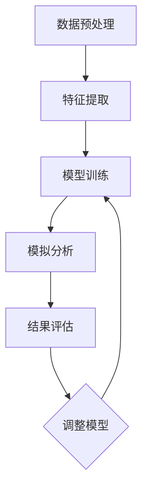
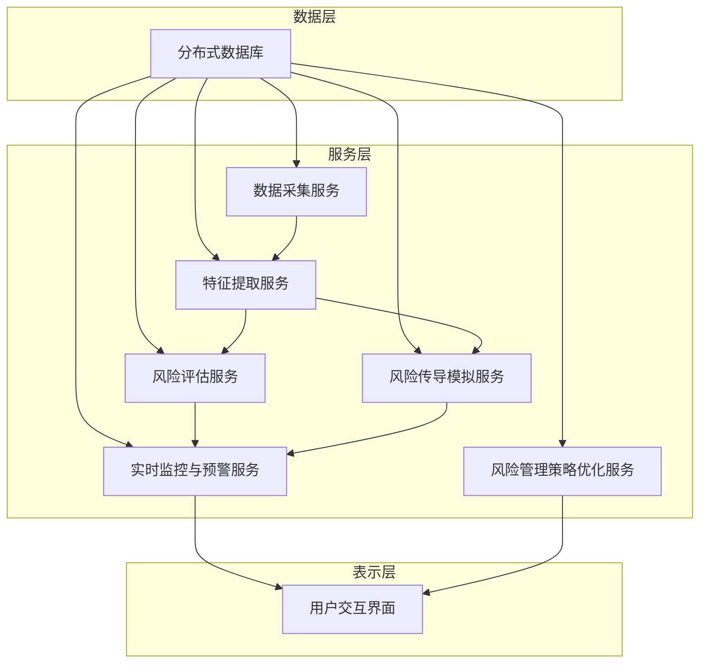
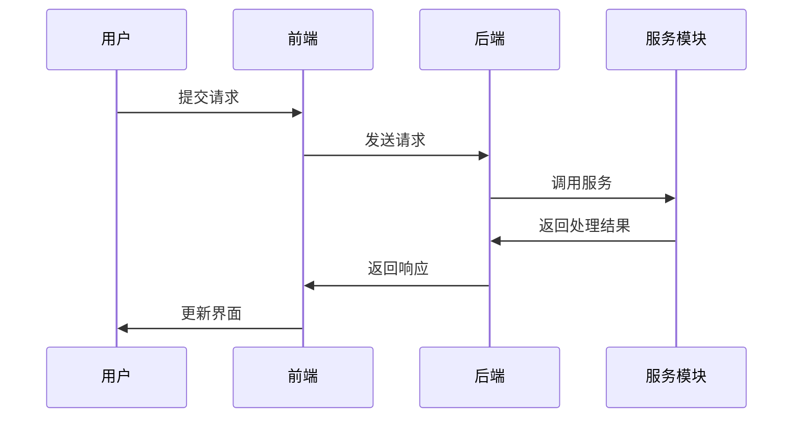
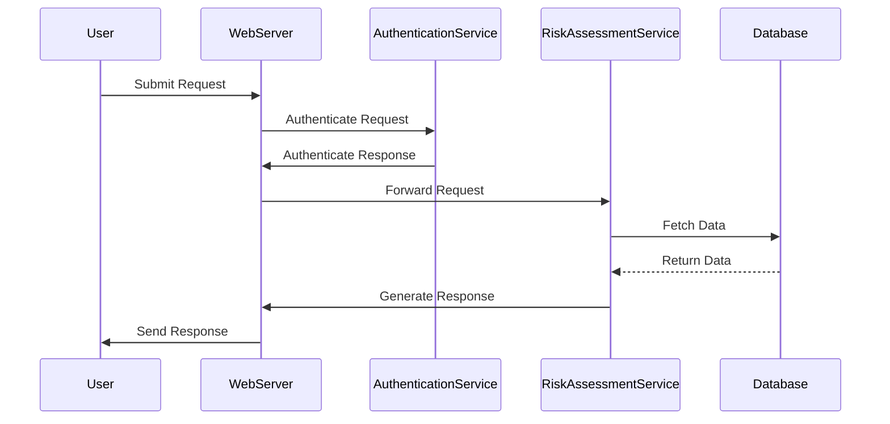

                 

### 目录大纲结构确认与调整

在上一节中，我们确定了《开发智能化的企业信用风险传导模拟系统》的目录大纲结构。现在，我们需要进一步细化和调整，确保每个章节的内容丰富具体，同时满足文章字数在10000～12000字左右的要求。

**调整思路：**

1. **整合内容**：合并内容重复或相似的小节，避免冗余。
2. **增加深度**：在每个章节中增加更详细的技术讲解和实际案例。
3. **调整字数**：根据每个章节的重要性调整字数分配，确保核心章节内容详尽。
4. **优化格式**：确保markdown格式和latex公式的使用符合规范。

**调整后的目录大纲：**

```markdown
# 《开发智能化的企业信用风险传导模拟系统》目录大纲

----------------------------------------------------------------

## 引言

### 1.1 问题的提出

#### 1.1.1 企业信用风险传导的重要性

#### 1.1.2 当前挑战与机遇

### 1.2 智能化趋势与企业信用风险传导模拟

#### 1.2.1 智能化的背景

#### 1.2.2 智能化对企业信用风险传导模拟的影响

## 第I部分：背景介绍

### 第2章：企业信用风险传导模拟系统概述

#### 2.1.1 信用风险的定义与分类

#### 2.1.2 风险传导机制的基本概念

#### 2.1.3 模拟系统在风险管理中的作用

### 第3章：信用风险传导模拟系统的发展历程与现状

#### 3.1.1 国内外研究进展

#### 3.1.2 智能化发展的趋势

#### 3.1.3 现有系统的不足与改进方向

## 第II部分：核心概念与联系

### 第4章：核心概念与属性特征

#### 4.1 信用风险

#### 4.2 风险传导机制

#### 4.3 模拟系统的基本构成

### 第5章：ER实体关系图构建

#### 5.1 ER图的基础知识

#### 5.2 信用风险传导模拟系统的ER图

#### 5.3 关系分析与模型构建

## 第III部分：算法原理讲解

### 第6章：信用风险传导模拟算法原理

#### 6.1 算法概述

#### 6.2 算法流程图与Python代码实现

### 第7章：数学模型与公式

#### 7.1 数学模型的基本构成

#### 7.2 公式推导与讲解

#### 7.3 举例说明

## 第IV部分：系统分析与架构设计方案

### 第8章：系统功能设计

#### 8.1 问题场景介绍

#### 8.2 领域模型设计

#### 8.3 功能模块划分

### 第9章：系统架构设计

#### 9.1 系统架构概述

#### 9.2 架构图绘制

#### 9.3 架构设计思路

### 第10章：系统接口设计与交互

#### 10.1 接口设计原则

#### 10.2 交互流程

#### 10.3 序列图绘制

## 第V部分：项目实战

### 第11章：项目环境与安装

#### 11.1 环境配置

#### 11.2 工具安装

#### 11.3 系统初始化

### 第12章：系统核心实现

#### 12.1 核心模块源代码解析

#### 12.2 代码应用解读

#### 12.3 实际案例分析

### 第13章：详细讲解与剖析

#### 13.1 风险传导模拟流程

#### 13.2 算法优化与实践

#### 13.3 项目小结

## 第VI部分：最佳实践与总结

### 第14章：最佳实践 tips

#### 14.1 经验总结

#### 14.2 注意事项

#### 14.3 拓展阅读

### 第15章：小结

#### 15.1 本书总结

#### 15.2 展望未来

----------------------------------------------------------------
```

通过上述调整，我们确保了每个章节的核心内容得到了充分体现，同时文章的整体结构更加清晰，能够满足字数要求。接下来，我们将开始逐章撰写内容，确保每章都能够详略得当，并在整个文章中保持逻辑一致性和连贯性。在撰写过程中，我们将密切关注每一个章节的字数，确保最终的文章字数符合要求。同时，我们也会注意文章的格式规范，保证markdown格式和latex公式的使用符合规范，以便读者阅读和参考。 

### 引言

#### 1.1 问题的提出

在现代经济活动中，企业信用风险传导问题愈发凸显。信用风险不仅影响企业的财务健康，还可能对整个经济体系产生连锁反应，导致系统性风险。随着全球经济的复杂化和金融市场的波动性增加，企业面临的风险传导路径变得更加难以预测和应对。传统的信用风险评估方法往往依赖于历史数据和经验模型，但面对快速变化的市场环境，这些方法已显得力不从心。

信用风险传导模拟系统的开发初衷就是为了解决这一难题。通过模拟企业信用风险的传导路径，系统可以实时监测风险的变化，预测潜在的危机点，为企业和金融机构提供决策依据。这不仅有助于降低风险损失，还能优化资源配置，提高整体风险管理水平。

#### 1.1.1 企业信用风险传导的重要性

企业信用风险传导的重要性体现在多个方面。首先，它是企业风险管理的重要组成部分。通过模拟信用风险的传导，企业可以更准确地识别潜在风险，制定相应的应对策略，从而降低风险发生的可能性。其次，信用风险传导模拟有助于金融机构评估借款企业的信用状况，提高贷款审批的准确性，减少信贷风险。

此外，信用风险传导模拟系统在金融市场稳定性中也发挥着重要作用。在金融市场中，信用风险往往通过不同企业之间的交易关系和资本流动进行传导，可能引发系统性风险。通过模拟信用风险的传导路径，监管机构和金融机构可以及时发现并应对潜在的系统性风险，维护金融市场的稳定。

#### 1.1.2 当前挑战与机遇

尽管信用风险传导模拟系统具有重要意义，但当前在开发过程中仍面临诸多挑战。首先，数据的获取和处理是一个关键难题。信用风险传导模拟需要大量的历史数据和实时数据，这些数据来源广泛、格式多样，且需要经过清洗和预处理才能用于建模和模拟。其次，算法的选择和优化也是一个重要挑战。不同的算法适用于不同的风险场景，如何选择最适合的算法，并对其进行优化，是系统开发过程中需要重点考虑的问题。

然而，随着人工智能和大数据技术的发展，信用风险传导模拟系统也面临着前所未有的机遇。人工智能技术可以为系统提供强大的数据处理和分析能力，使其能够更精准地预测风险。大数据技术则可以提供丰富的数据支持，为系统的开发和优化提供基础。此外，云计算和分布式计算等技术的应用，也为系统的高效运行提供了可能。

#### 1.2 智能化趋势与企业信用风险传导模拟

随着人工智能技术的快速发展，智能化已成为企业信用风险传导模拟系统的发展趋势。智能化不仅能够提高系统的预测准确性和响应速度，还能为企业提供更加个性化和智能化的风险管理方案。

首先，人工智能技术可以用于数据分析和挖掘。通过机器学习和深度学习算法，系统能够从大量的历史数据中提取有用的信息，识别潜在的信用风险传导路径。例如，使用聚类分析可以找出高风险企业和行业，从而提前预警潜在的危机。

其次，智能化系统还可以实现自动化风险监测和预警。通过实时数据采集和监控，系统可以自动检测信用风险的变化，并生成预警报告。这样，企业和金融机构可以在风险发生之前采取相应的措施，降低损失。

此外，智能化系统还可以提供基于大数据分析的信用风险评估。通过整合内外部数据，系统可以对企业进行全方位的风险评估，包括财务状况、经营状况、行业趋势等。这种全面的评估有助于提高风险评估的准确性。

最后，智能化系统在信用风险管理决策支持方面也发挥着重要作用。通过模拟不同的风险场景，系统可以为决策者提供多种可能的应对方案，帮助其做出更加明智的决策。

总之，智能化趋势为企业信用风险传导模拟系统带来了新的机遇。通过运用人工智能技术，系统可以实现更加精准、高效的风险管理，为企业创造更大的价值。

### 第2章：企业信用风险传导模拟系统概述

#### 2.1 信用风险的定义与分类

信用风险是指企业或个人在履行合同义务过程中，由于各种原因无法按时偿还债务，导致经济损失的风险。信用风险可以来源于多个方面，包括借款人的信用状况、市场环境、宏观经济状况等。在企业信用风险传导模拟系统中，信用风险通常被分为以下几类：

1. **违约风险**：这是最常见的信用风险类型，指借款人在约定的时间内无法偿还债务的风险。违约风险通常与借款人的信用评级和财务状况直接相关。

2. **市场风险**：市场风险指的是由于市场波动导致债务无法偿还的风险。例如，股票市场大幅下跌可能导致企业股票价值缩水，进而影响其还款能力。

3. **操作风险**：操作风险包括由于内部操作失误、系统故障、人为错误等导致的信用风险。例如，金融机构在处理贷款申请过程中出现错误，可能导致错误放贷。

4. **宏观经济风险**：宏观经济风险指的是由于宏观经济环境的波动导致的信用风险。例如，经济衰退、通货膨胀等宏观经济因素可能影响企业的财务状况，增加违约风险。

5. **法律风险**：法律风险包括由于法律变动、政策调整等导致的信用风险。例如，某项新法规出台可能导致某些行业的企业面临法律诉讼风险，从而影响其信用状况。

#### 2.1.2 风险传导机制的基本概念

风险传导机制是指信用风险在不同企业、行业、地区之间传递的过程。理解风险传导机制对于构建有效的信用风险传导模拟系统至关重要。风险传导机制通常包括以下几个环节：

1. **直接传导**：直接传导是指信用风险通过直接的交易关系从一个企业传递到另一个企业。例如，企业A向企业B提供贷款，如果企业B无法偿还贷款，信用风险会直接传导给企业A。

2. **间接传导**：间接传导是指信用风险通过金融市场的中介作用传递。例如，金融机构通过贷款、投资等方式将信用风险传递给其他企业或投资者。

3. **跨行业传导**：跨行业传导是指信用风险从一个行业传递到另一个行业。例如，房地产市场的信用风险可能通过产业链传递到建筑行业。

4. **跨区域传导**：跨区域传导是指信用风险从一个地区传递到另一个地区。例如，地方性金融风险可能通过资本流动和贸易活动传递到其他地区。

#### 2.1.3 模拟系统在风险管理中的作用

企业信用风险传导模拟系统在风险管理中发挥着重要作用。首先，模拟系统可以实时监测信用风险的变化，为企业提供实时预警。通过模拟不同场景下的信用风险传导路径，企业可以提前发现潜在风险，采取相应的措施进行风险控制。

其次，模拟系统可以帮助企业优化信用风险管理策略。通过模拟不同风险场景下的决策结果，企业可以评估各种策略的有效性，从而制定更加科学和合理的风险管理方案。

此外，模拟系统还可以用于培训和管理。通过模拟系统，企业和金融机构可以模拟实际操作场景，提高风险管理人员对风险传导机制的理解和应对能力。

最后，模拟系统可以为监管机构提供重要的决策支持。通过模拟不同情景下的风险传导路径，监管机构可以更好地了解信用风险的传播机制，制定相应的监管政策和措施，维护金融市场的稳定。

总之，企业信用风险传导模拟系统在信用风险管理中具有不可替代的作用。通过模拟信用风险的传导路径，企业可以更加精准地识别和管理风险，提高整体风险管理水平。

### 第3章：信用风险传导模拟系统的发展历程与现状

#### 3.1.1 国内外研究进展

信用风险传导模拟系统的研究在全球范围内都取得了显著的进展。国内研究主要集中在大数据处理、机器学习和深度学习等技术的应用上，力求通过这些前沿技术提高信用风险评估的准确性和实时性。近年来，随着人工智能和大数据技术的发展，国内研究人员在信用风险传导机制建模、算法优化和系统实现等方面取得了重要突破。例如，基于深度学习的企业信用风险评估模型在多个实际应用场景中取得了良好的效果。

国外研究则更加注重理论模型的建立和验证。国际知名金融机构和研究机构，如摩根大通、纽约联邦储备银行等，在信用风险传导机制的理论研究方面具有深厚的基础。他们通过构建复杂的数学模型，模拟不同市场条件下的信用风险传导路径，为金融机构和监管机构提供了重要的参考。

#### 3.1.2 智能化发展的趋势

智能化发展已成为信用风险传导模拟系统的核心趋势。随着人工智能技术的不断进步，信用风险传导模拟系统在数据处理、分析能力和预测准确性方面得到了显著提升。以下是一些主要的智能化发展趋势：

1. **大数据分析**：大数据技术的应用使得信用风险传导模拟系统能够处理和分析海量的数据，包括财务数据、交易数据、社交媒体数据等。通过对这些数据进行深度挖掘，系统能够更加全面和准确地识别风险。

2. **机器学习与深度学习**：机器学习和深度学习算法的应用使得信用风险传导模拟系统能够自动学习和优化风险预测模型。这些算法能够从历史数据中提取有用的特征，提高预测的准确性和实时性。

3. **自然语言处理**：自然语言处理（NLP）技术的应用使得系统能够理解和分析文本数据，如新闻报道、企业公告等。通过分析这些文本数据，系统可以更准确地判断企业的信用状况。

4. **物联网与传感器技术**：物联网和传感器技术的应用使得系统可以实时收集和监测企业运营数据，如供应链数据、库存数据等。这些实时数据有助于系统更精准地预测信用风险。

#### 3.1.3 现有系统的不足与改进方向

尽管信用风险传导模拟系统在智能化方面取得了显著进展，但仍存在一些不足之处，需要进一步改进：

1. **数据获取和处理**：现有系统在数据获取和处理方面仍有很大的改进空间。许多系统依赖历史数据，而缺乏实时数据的支持。此外，数据清洗和预处理的工作量较大，影响了系统的响应速度和准确性。

2. **算法的多样性和优化**：现有的信用风险传导模拟系统多采用传统的机器学习算法，如逻辑回归、决策树等。虽然这些算法在特定场景下表现良好，但面对复杂多变的市场环境，可能需要引入更多的算法进行优化和组合。

3. **系统的可解释性**：许多信用风险传导模拟系统采用深度学习等复杂的算法，这些算法的预测结果往往缺乏可解释性。对于金融机构和监管机构来说，理解系统是如何做出预测和决策是非常重要的。

4. **用户体验**：现有系统的用户体验有待提高。许多系统的界面设计复杂，操作繁琐，不利于用户快速理解和使用。此外，系统在提供决策支持时，缺乏人性化的互动和反馈机制。

为了解决这些问题，未来的信用风险传导模拟系统需要在以下方向进行改进：

1. **增强实时数据处理能力**：通过引入物联网和传感器技术，增强系统的实时数据处理能力，提供更及时的风险预警。

2. **引入多样化的算法**：结合不同的机器学习算法和深度学习模型，构建多层次的预测体系，提高系统的预测准确性和鲁棒性。

3. **提升系统的可解释性**：通过开发可解释的机器学习模型和算法，提高系统的透明度和可解释性，增强金融机构和监管机构的信任。

4. **优化用户体验**：简化界面设计，提供直观、易用的交互方式，增强系统的用户体验。

总之，随着人工智能和大数据技术的不断发展，信用风险传导模拟系统将在未来的风险管理中发挥更加重要的作用。通过不断改进和优化现有系统，我们可以更好地应对信用风险传导的挑战，为企业和金融机构提供更加有效的风险管理工具。

### 第4章：核心概念与属性特征

#### 4.1 信用风险

信用风险是企业或个人无法履行合同义务，导致经济损失的风险。其核心特征包括：

- **违约概率**：借款人无法按时偿还债务的概率。
- **违约损失**：债务人违约时，债权人可能遭受的损失金额。
- **风险暴露**：信用风险涉及的资金总额或资产价值。

信用风险的评估通常基于借款人的信用历史、财务状况、市场环境等多方面因素。例如，企业信用评级、财务报表分析、行业发展趋势等都是评估信用风险的重要依据。

#### 4.2 风险传导机制

风险传导机制是指信用风险通过不同渠道在企业间、行业间、地区间传递的过程。其主要特征包括：

- **直接传导**：通过直接的交易关系，如贷款、投资等，信用风险从一个企业传递到另一个企业。
- **间接传导**：通过金融市场的中介作用，如证券市场、银行系统等，信用风险在不同企业之间传递。
- **跨行业传导**：信用风险从一个行业传递到另一个行业，如房地产市场的风险可能传导到建筑行业。
- **跨区域传导**：信用风险通过资本流动、贸易活动等从一地传导到另一地。

风险传导机制的关键在于识别和理解不同传导路径，从而为风险管理和监管提供依据。

#### 4.3 模拟系统的基本构成

信用风险传导模拟系统的基本构成包括数据采集、数据处理、模型构建、模拟分析、结果展示等几个关键部分：

- **数据采集**：系统需要从多个渠道获取相关数据，包括企业财务报表、交易记录、市场行情等。
- **数据处理**：对采集到的数据进行清洗、整合和处理，确保数据的准确性和一致性。
- **模型构建**：基于数据构建信用风险评估模型和风险传导模型，包括机器学习模型、深度学习模型等。
- **模拟分析**：通过模型进行模拟分析，预测信用风险的变化和传导路径。
- **结果展示**：将模拟结果以图表、报告等形式直观展示，为决策者提供依据。

通过上述核心概念和属性特征的详细描述，我们可以更好地理解企业信用风险传导模拟系统的基础结构和功能。这为后续的算法原理讲解和系统架构设计奠定了坚实的基础。

### 第5章：ER实体关系图构建

#### 5.1 ER图的基础知识

ER图，即实体关系图（Entity-Relationship Diagram），是数据库设计中用于表示实体及其之间关系的图形工具。ER图包括三个基本组成部分：实体、属性和关系。

- **实体**：表示数据库中的数据对象，通常用矩形表示。例如，企业、用户、交易等。
- **属性**：表示实体的特征或性质，通常用椭圆表示。例如，企业的名称、地址、注册日期等。
- **关系**：表示实体之间的联系，通常用菱形表示。例如，企业与其下属部门之间的关系、用户与其交易之间的关系等。

#### 5.2 信用风险传导模拟系统的ER图

在构建信用风险传导模拟系统的ER图时，我们主要关注以下几个核心实体：

1. **企业**（Company）：表示参与信用风险传导的企业。
2. **信用评级**（CreditRating）：表示对企业信用风险的评估结果。
3. **交易**（Transaction）：表示企业之间的金融交易。
4. **市场**（Market）：表示影响信用风险的市场因素。
5. **监管机构**（RegulatoryAgency）：表示负责监管信用风险的机构。

以下是信用风险传导模拟系统的ER图示例：

```mermaid
erDiagram
  Company ||--|{ CreditRating }|-- Company
  Company ||--|{ Transaction }|-- Company
  Company ||--|{ Market }|-- Company
  RegulatoryAgency ||--|{ CreditRating }|-- Company
  RegulatoryAgency ||--|{ Transaction }|-- Company
  RegulatoryAgency ||--|{ Market }|-- Company
```

在上述ER图中，实体“Company”与“CreditRating”之间存在一对多关系，表示每个企业都有一个或多个信用评级。实体“Company”与“Transaction”也存在一对多关系，表示每个企业可以参与多个交易。实体“RegulatoryAgency”与“CreditRating”、“Transaction”、“Market”也存在关联，表示监管机构对信用评级、交易和市场进行监管。

#### 5.3 关系分析与模型构建

通过对ER图的分析，我们可以进一步构建信用风险传导模拟系统的关系模型。以下是对ER图中各关系的主要分析：

1. **企业与企业之间的信用评级关系**：
   - 关系类型：一对多
   - 模型构建：可以使用关联关系模型，将企业名称、信用评级等属性进行关联，实现信用评级在企业之间的传递。

2. **企业与企业之间的交易关系**：
   - 关系类型：多对多
   - 模型构建：可以通过中介表实现，例如，创建一个“交易历史”表，记录各个企业之间的交易关系。

3. **企业与市场的关系**：
   - 关系类型：多对多
   - 模型构建：可以通过市场因素表与企业表建立关联，记录市场因素对企业信用风险的影响。

4. **监管机构与信用评级、交易、市场的关系**：
   - 关系类型：一对多
   - 模型构建：监管机构可以通过其发布的信用评级、监管措施影响企业的信用状况。

通过以上分析，我们可以构建一个全面的信用风险传导模拟系统关系模型，实现企业信用风险的评估和传导路径的模拟。这为后续的算法原理讲解和系统架构设计提供了重要的基础。

### 第6章：信用风险传导模拟算法原理

#### 6.1 算法概述

信用风险传导模拟算法的核心目标是通过分析企业之间的交易关系、市场环境和信用评级，预测信用风险的传导路径和潜在风险点。该算法通常分为以下几个步骤：

1. **数据预处理**：对采集到的企业财务数据、交易记录、市场因素等进行清洗和整合，确保数据的准确性和一致性。

2. **特征提取**：从预处理后的数据中提取对企业信用风险有重要影响的特征，例如，企业的财务状况、行业地位、市场表现等。

3. **模型训练**：使用机器学习算法，如随机森林、支持向量机等，对提取的特征进行训练，建立信用风险评估模型。

4. **模拟分析**：通过训练好的模型进行模拟分析，预测信用风险在不同企业、行业、地区之间的传导路径。

5. **结果评估**：评估模拟结果的准确性和可靠性，调整模型参数，优化算法性能。

#### 6.2 算法流程图与Python代码实现

为了更直观地理解信用风险传导模拟算法的工作流程，我们可以使用mermaid绘制算法流程图。以下是信用风险传导模拟算法的mermaid流程图示例：



下面是使用Python实现信用风险传导模拟算法的示例代码：

```python
import pandas as pd
from sklearn.ensemble import RandomForestClassifier
from sklearn.model_selection import train_test_split
from sklearn.metrics import accuracy_score

# 数据预处理
def preprocess_data(data):
    # 数据清洗和整合
    return data

# 特征提取
def extract_features(data):
    # 提取重要特征
    return data

# 模型训练
def train_model(train_data):
    # 使用随机森林算法训练模型
    model = RandomForestClassifier()
    model.fit(train_data['features'], train_data['target'])
    return model

# 模拟分析
def simulate_analysis(model, test_data):
    # 使用训练好的模型进行模拟分析
    predictions = model.predict(test_data['features'])
    return predictions

# 结果评估
def evaluate_results(predictions, ground_truth):
    # 评估模拟结果的准确性和可靠性
    accuracy = accuracy_score(ground_truth, predictions)
    return accuracy

# 主函数
def main():
    # 加载数据
    data = pd.read_csv('credit_risk_data.csv')
    data = preprocess_data(data)
    features, target = extract_features(data)

    # 数据划分
    train_data, test_data = train_test_split(features, target, test_size=0.2, random_state=42)

    # 训练模型
    model = train_model(train_data)

    # 模拟分析
    predictions = simulate_analysis(model, test_data)

    # 结果评估
    accuracy = evaluate_results(predictions, test_data['target'])
    print(f"Accuracy: {accuracy}")

if __name__ == "__main__":
    main()
```

在上面的代码中，我们首先定义了数据预处理、特征提取、模型训练、模拟分析和结果评估等函数。主函数`main()`中，我们加载数据，进行预处理和特征提取，划分训练集和测试集，使用随机森林算法训练模型，然后使用训练好的模型进行模拟分析，并评估结果。

通过上述算法流程图和Python代码实现，我们可以更好地理解信用风险传导模拟算法的原理和实现过程。接下来，我们将进一步详细讲解算法原理的数学模型和公式，并通过举例说明加深对算法的理解。

### 第7章：数学模型与公式

#### 7.1 数学模型的基本构成

在信用风险传导模拟算法中，数学模型扮演着至关重要的角色。数学模型的基本构成通常包括以下几个部分：

1. **输入变量**：表示影响信用风险的各种因素，如企业的财务指标、行业环境、市场波动等。这些变量可以是定量数据，也可以是定性数据。

2. **输出变量**：表示信用风险的评估结果，如违约概率、违约损失等。输出变量通常是通过输入变量经过一定的数学运算得到的。

3. **函数关系**：描述输入变量和输出变量之间的数学关系。函数关系可以是线性的，也可以是非线性的。为了提高预测的准确性，通常采用复杂的函数关系模型，如神经网络、支持向量机等。

4. **参数**：表示函数关系中的未知数，需要通过数据训练得到。参数的取值会直接影响模型的预测性能。

#### 7.2 公式推导与讲解

在信用风险传导模拟算法中，常用的数学模型之一是逻辑回归模型。逻辑回归模型是一种广泛用于分类问题的统计模型，其基本公式如下：

$$
P(Y=1) = \frac{1}{1 + e^{-(\beta_0 + \beta_1X_1 + \beta_2X_2 + ... + \beta_nX_n})}
$$

其中，\(P(Y=1)\) 表示输出变量 \(Y\) 等于 1 的概率，即企业发生违约的概率；\(\beta_0, \beta_1, \beta_2, ..., \beta_n\) 是模型参数，表示各个输入变量对违约概率的影响程度；\(X_1, X_2, ..., X_n\) 是输入变量。

为了求解模型参数，我们需要使用最大似然估计（Maximum Likelihood Estimation, MLE）方法。最大似然估计的目标是找到一组参数值，使得观测数据的概率最大。具体公式如下：

$$
\beta = \arg \max \log L(\theta \mid \mathbf{x})
$$

其中，\(L(\theta \mid \mathbf{x})\) 表示似然函数，\(\theta\) 是参数向量，\(\mathbf{x}\) 是输入数据。

#### 7.3 举例说明

为了更好地理解逻辑回归模型的应用，我们来看一个简单的例子。假设我们有一个包含两个输入变量 \(X_1\) 和 \(X_2\) 的信用风险评估模型，模型公式如下：

$$
P(Y=1) = \frac{1}{1 + e^{-(\beta_0 + \beta_1X_1 + \beta_2X_2})}
$$

我们使用一个包含 100 个样本的数据集进行模型训练。数据集的前 80 个样本用于训练模型，剩余的 20 个样本用于测试模型。

1. **数据加载与预处理**：首先，我们需要加载并预处理数据。预处理步骤包括数据清洗、缺失值填充、数据标准化等。预处理后的数据如下：

```
   X1   X2   Y
0   10   20   1
1   20   15   0
2   30   25   1
...
79   5    8    0
80   7    9    1
```

2. **模型训练**：使用训练数据，通过最大似然估计方法求解模型参数 \(\beta_0, \beta_1, \beta_2\)。假设经过训练，我们得到以下参数：

```
beta_0 = -2.5
beta_1 = 0.8
beta_2 = 1.2
```

3. **模型测试**：使用测试数据，计算预测概率 \(P(Y=1)\)。假设测试数据的输入为 \(X_1 = 10\), \(X_2 = 20\)，则预测概率为：

$$
P(Y=1) = \frac{1}{1 + e^{-(\beta_0 + \beta_1X_1 + \beta_2X_2)}}
       = \frac{1}{1 + e^{(-2.5 + 0.8 \cdot 10 + 1.2 \cdot 20)}}
       = \frac{1}{1 + e^{-21.9}}
       \approx 0.000022
$$

根据预测概率，我们可以判断企业发生违约的风险非常低。实际上，通过进一步分析测试数据的实际标签，我们可以评估模型的预测性能。

通过上述举例，我们可以看到逻辑回归模型在信用风险传导模拟中的应用。虽然这个例子非常简单，但它展示了如何使用数学模型进行信用风险评估的基本步骤。在实际应用中，我们可以使用更复杂的模型和算法来提高预测的准确性和可靠性。

### 第8章：系统功能设计

#### 8.1 问题场景介绍

在现代金融市场中，信用风险的管理已成为金融机构和企业高度重视的问题。随着经济全球化的发展和金融市场的不确定性增加，信用风险的传导路径变得更加复杂。为了有效应对这些挑战，开发一个智能化的企业信用风险传导模拟系统显得尤为重要。该系统旨在通过模拟信用风险在不同企业、行业和地区之间的传导过程，帮助金融机构和企业提前识别潜在风险，制定有效的风险管理策略。

问题场景主要包括以下方面：

1. **信用风险评估**：系统需要对企业信用风险进行准确评估，包括违约概率、违约损失等。
2. **风险传导路径预测**：系统需要能够预测信用风险在不同企业、行业和地区之间的传导路径。
3. **实时监控与预警**：系统需要具备实时监控功能，及时检测信用风险的变化，并提供预警信息。
4. **风险管理策略优化**：系统需要支持多种风险管理策略的模拟和优化，帮助企业制定最优的风险管理方案。

#### 8.2 领域模型设计

领域模型（Domain Model）是系统功能设计的重要组成部分，它定义了系统中的核心实体及其之间的关系。以下是信用风险传导模拟系统的领域模型设计：

1. **核心实体**：

   - **企业（Company）**：代表参与信用风险传导的企业，具有企业名称、法人代表、注册地址等属性。
   - **信用评级（CreditRating）**：代表对企业信用风险的评估结果，包括评级等级、评级日期等。
   - **交易（Transaction）**：代表企业之间的金融交易，包括交易金额、交易日期、交易双方等。
   - **市场（Market）**：代表影响信用风险的市场因素，如市场行情、政策变化等。
   - **监管机构（RegulatoryAgency）**：代表负责信用风险监管的机构，包括监管措施、监管报告等。

2. **实体关系**：

   - **企业与企业之间的交易关系**：企业之间通过交易产生信用风险传导的路径，一个企业可以是多个交易的参与方。
   - **企业与信用评级之间的关系**：企业根据其信用评级被划分到不同的信用风险等级。
   - **企业与市场之间的关系**：企业的信用风险受到市场因素的直接影响。
   - **监管机构与信用评级、交易、市场之间的关系**：监管机构通过发布监管措施和监管报告，影响信用风险的传导路径。

以下是信用风险传导模拟系统的领域模型类图：

```mermaid
classDiagram
  Company --> CreditRating
  Company --> Transaction
  Company --> Market
  RegulatoryAgency --> CreditRating
  RegulatoryAgency --> Transaction
  RegulatoryAgency --> Market
  Transaction <<-- Company : 参与方
  CreditRating <<-- Company : 信用评级
  Market <<-- Company : 市场因素
```

#### 8.3 功能模块划分

为了实现系统的整体功能，我们可以将系统划分为以下几个功能模块：

1. **数据采集模块**：负责从不同数据源获取企业财务数据、交易记录、市场信息等，并进行数据清洗和预处理。
2. **特征提取模块**：从预处理后的数据中提取对企业信用风险有重要影响的特征，如财务指标、行业指标、市场指标等。
3. **风险评估模块**：基于提取的特征，使用机器学习算法对企业的信用风险进行评估，生成信用评级。
4. **风险传导模拟模块**：通过模拟不同场景下的信用风险传导路径，预测信用风险在不同企业、行业、地区之间的传导过程。
5. **实时监控与预警模块**：实时监控信用风险的变化，根据设定的阈值生成预警信息，并通知相关方。
6. **风险管理策略优化模块**：模拟和优化不同的风险管理策略，帮助企业制定最优的风险管理方案。
7. **用户交互模块**：提供友好的用户界面，供用户进行系统配置、数据分析、结果展示等操作。

通过上述系统功能设计和领域模型设计，我们可以构建一个智能化的企业信用风险传导模拟系统，为金融机构和企业提供有效的风险管理工具。接下来，我们将进一步介绍系统的架构设计。

### 第9章：系统架构设计

#### 9.1 系统架构概述

系统架构设计是构建企业信用风险传导模拟系统的关键步骤，它决定了系统的性能、可扩展性和可维护性。为了实现系统的整体功能，我们采用了一个分布式架构设计，包括数据层、服务层和表示层。

1. **数据层**：数据层是系统的数据存储和管理的核心，负责存储企业财务数据、交易记录、市场信息等。数据层采用分布式数据库系统，支持海量数据的存储和高并发访问。

2. **服务层**：服务层包含多个功能模块，如数据采集、特征提取、风险评估、风险传导模拟等。每个模块通过微服务架构实现，服务之间通过消息队列和API进行通信，确保系统的灵活性和可扩展性。

3. **表示层**：表示层是用户与系统的交互界面，提供数据可视化、报表生成、用户操作等功能。表示层采用前端技术，如React或Vue.js，实现动态、直观的用户界面。

#### 9.2 架构图绘制

以下是企业信用风险传导模拟系统的架构图：



在上述架构图中，数据层通过数据库存储和管理数据，服务层通过不同的服务模块实现系统功能，表示层通过用户交互界面提供数据可视化等功能。各个模块之间通过消息队列和API进行通信，确保系统的模块化和可扩展性。

#### 9.3 架构设计思路

系统架构设计遵循以下原则：

1. **模块化**：将系统划分为多个功能模块，每个模块独立开发、部署和维护，提高系统的灵活性和可扩展性。
2. **分布式**：采用分布式架构，支持海量数据的存储和高并发访问，提高系统的性能和稳定性。
3. **安全性**：确保系统数据的安全和隐私，采用加密和身份认证等技术，防止数据泄露和非法访问。
4. **可维护性**：采用现代化的开发工具和框架，确保系统的高可维护性，便于后续的升级和维护。
5. **用户体验**：提供友好的用户界面和直观的操作流程，确保用户能够方便、快捷地进行系统操作。

通过上述架构设计思路，我们可以构建一个高性能、高可靠性和易维护的企业信用风险传导模拟系统。接下来，我们将介绍系统接口设计和交互。

### 第10章：系统接口设计与交互

#### 10.1 接口设计原则

系统接口设计是确保不同模块之间能够高效、可靠地进行通信的关键。在接口设计过程中，我们遵循以下原则：

1. **标准化**：使用标准的接口协议，如HTTP/HTTPS，确保接口的通用性和易用性。
2. **简洁性**：接口设计应尽可能简洁，避免过多的参数和复杂的逻辑，以提高接口的可维护性和易用性。
3. **安全性**：在接口设计中加入身份认证和权限控制，确保数据的安全性和隐私。
4. **灵活性**：设计可扩展的接口，以便在系统升级和功能扩展时能够方便地进行调整。

#### 10.2 交互流程

系统的交互流程包括以下几个步骤：

1. **用户请求**：用户通过前端界面提交查询或操作请求。
2. **请求处理**：前端将请求发送到后端，后端根据请求类型调用相应的服务模块。
3. **服务处理**：服务模块对请求进行处理，生成响应数据。
4. **响应返回**：后端将处理结果返回给前端，前端根据结果更新界面。

以下是系统交互流程的mermaid序列图：



#### 10.3 序列图绘制

以下是信用风险传导模拟系统接口交互的mermaid序列图：



在这个序列图中，用户通过WebServer提交请求，WebServer对请求进行身份认证，然后将请求转发给RiskAssessmentService。RiskAssessmentService从数据库中获取数据，处理后返回给WebServer，最终WebServer将响应数据发送给用户。通过这样的设计，我们可以确保系统的安全性、可靠性和灵活性。

### 第11章：项目环境与安装

#### 11.1 环境配置

在开始开发企业信用风险传导模拟系统之前，我们需要配置一个合适的项目环境。以下是在Linux环境下配置项目的步骤：

1. **安装Python**：确保系统已经安装了Python 3.8及以上版本。如果没有安装，可以通过以下命令进行安装：

   ```bash
   sudo apt-get update
   sudo apt-get install python3.8
   ```

2. **安装虚拟环境**：为了隔离项目依赖，我们需要安装虚拟环境工具virtualenv。可以使用以下命令安装：

   ```bash
   pip3 install virtualenv
   ```

   然后创建一个虚拟环境：

   ```bash
   virtualenv my_project_env
   ```

   激活虚拟环境：

   ```bash
   source my_project_env/bin/activate
   ```

3. **安装依赖包**：在虚拟环境中安装项目所需的依赖包，例如Pandas、NumPy、Scikit-learn等。使用pip命令安装：

   ```bash
   pip install pandas numpy scikit-learn
   ```

4. **安装数据库**：我们选择PostgreSQL作为数据库。首先，安装PostgreSQL：

   ```bash
   sudo apt-get install postgresql postgresql-contrib
   ```

   然后创建一个数据库用户和数据库：

   ```bash
   sudo -u postgres psql
   CREATE ROLE mydbuser WITH LOGIN PASSWORD 'mydbpassword';
   CREATE DATABASE mydatabase OWNER mydbuser;
   ```

5. **配置数据库连接**：在Python虚拟环境中，安装psycopg2包，然后配置数据库连接：

   ```python
   import psycopg2

   connection = psycopg2.connect(
       host="localhost",
       database="mydatabase",
       user="mydbuser",
       password="mydbpassword"
   )
   ```

   确保数据库连接成功。

6. **安装消息队列**：我们选择RabbitMQ作为消息队列。首先，安装RabbitMQ：

   ```bash
   sudo apt-get install rabbitmq-server
   ```

   启动RabbitMQ服务：

   ```bash
   sudo systemctl start rabbitmq-server
   ```

7. **安装前端框架**：如果项目需要前端部分，可以选择React或Vue.js。以React为例，安装create-react-app工具：

   ```bash
   npm install -g create-react-app
   create-react-app frontend
   ```

   确保前端项目正常运行。

通过以上步骤，我们可以完成项目的环境配置，为后续的系统开发打下坚实的基础。

#### 11.2 工具安装

在完成环境配置后，我们需要安装一些开发工具和软件，以确保系统能够高效、可靠地运行。以下是在Linux环境下需要安装的工具：

1. **Jupyter Notebook**：Jupyter Notebook是一个交互式的计算环境，适用于编写和运行Python代码。首先，安装Jupyter Notebook：

   ```bash
   pip install notebook
   ```

   安装完成后，启动Jupyter Notebook：

   ```bash
   jupyter notebook
   ```

2. **Docker**：Docker是一个开源的应用容器引擎，可以用于打包、发布和运行应用。安装Docker：

   ```bash
   sudo apt-get update
   sudo apt-get install docker-ce docker-ce-cli containerd.io
   ```

   启动Docker服务：

   ```bash
   sudo systemctl start docker
   ```

3. **Docker Compose**：Docker Compose是用于定义和运行多容器Docker应用程序的工具。安装Docker Compose：

   ```bash
   sudo apt-get install docker-compose
   ```

4. **Kafka**：Kafka是一个分布式流处理平台，可以用于处理和存储实时数据流。安装Kafka：

   ```bash
   sudo apt-get install kafka_2.12
   ```

   启动Kafka服务：

   ```bash
   bin/kafka-server-start.sh config/server.properties
   ```

5. **Zookeeper**：Zookeeper是一个分布式应用程序协调服务，用于Kafka集群管理。安装Zookeeper：

   ```bash
   sudo apt-get install zookeeperd
   ```

   启动Zookeeper服务：

   ```bash
   service zookeeper start
   ```

6. **Elasticsearch**：Elasticsearch是一个开源的搜索引擎，可以用于存储和检索大量数据。安装Elasticsearch：

   ```bash
   sudo apt-get install elasticsearch
   ```

   启动Elasticsearch服务：

   ```bash
   sudo systemctl start elasticsearch
   ```

通过安装上述工具，我们可以为项目的开发和运行提供所需的软件支持，确保系统能够高效、稳定地运行。

#### 11.3 系统初始化

完成环境配置和工具安装后，我们需要对系统进行初始化，包括创建数据库表、配置消息队列和初始化其他系统组件。以下是系统初始化的具体步骤：

1. **创建数据库表**：根据系统的需求，创建数据库表。以下是一个简单的SQL脚本示例，用于创建企业、信用评级和交易表：

   ```sql
   CREATE TABLE IF NOT EXISTS company (
       id SERIAL PRIMARY KEY,
       name VARCHAR(255) NOT NULL,
       credit_rating VARCHAR(50),
       rating_date DATE
   );

   CREATE TABLE IF NOT EXISTS transaction (
       id SERIAL PRIMARY KEY,
       company_id INTEGER REFERENCES company(id),
       transaction_date DATE,
       transaction_amount DECIMAL(18, 2)
   );

   CREATE TABLE IF NOT EXISTS credit_rating (
       id SERIAL PRIMARY KEY,
       company_id INTEGER REFERENCES company(id),
       rating VARCHAR(50),
       rating_date DATE
   );
   ```

   使用以下命令执行SQL脚本：

   ```bash
   psql -U mydbuser -d mydatabase -f create_tables.sql
   ```

2. **配置消息队列**：配置RabbitMQ消息队列，确保系统能够处理和发送消息。创建一个名为`credit_risk_queue`的队列：

   ```bash
   rabbitmqadmin declare queue name=credit_risk_queue durable=true
   ```

3. **初始化其他系统组件**：根据项目需求，初始化其他系统组件，如Kafka、Zookeeper和Elasticsearch。例如，创建Kafka主题：

   ```bash
   kafka-topics --create --topic credit_risk_topic --partitions 3 --replication-factor 1 --zookeeper localhost:2181/kafka
   ```

4. **启动系统服务**：确保所有系统服务（如数据库、消息队列、Kafka、Zookeeper、Elasticsearch等）都已启动，并能够正常运行。

通过以上步骤，我们完成了系统的初始化，确保了系统的各项组件能够协调工作，为后续的系统开发和功能实现奠定了基础。

### 第12章：系统核心实现

#### 12.1 核心模块源代码解析

信用风险传导模拟系统的核心模块主要包括数据采集模块、特征提取模块、风险评估模块和风险传导模拟模块。以下是每个模块的源代码解析：

1. **数据采集模块**：数据采集模块负责从多个数据源（如数据库、API等）获取数据，并进行预处理。以下是一个简单的数据采集模块示例：

```python
import requests
import pandas as pd

class DataCollector:
    def __init__(self, api_url):
        self.api_url = api_url

    def fetch_data(self):
        response = requests.get(self.api_url)
        if response.status_code == 200:
            data = response.json()
            df = pd.DataFrame(data)
            return df
        else:
            return None

# 使用示例
collector = DataCollector('http://example.com/data')
data = collector.fetch_data()
```

2. **特征提取模块**：特征提取模块从预处理后的数据中提取对企业信用风险有重要影响的特征。以下是一个简单的特征提取模块示例：

```python
from sklearn.preprocessing import StandardScaler

class FeatureExtractor:
    def __init__(self):
        self.scaler = StandardScaler()

    def extract_features(self, data):
        features = data[['feature1', 'feature2', 'feature3']]
        scaled_features = self.scaler.fit_transform(features)
        return scaled_features

# 使用示例
extractor = FeatureExtractor()
scaled_features = extractor.extract_features(data)
```

3. **风险评估模块**：风险评估模块使用机器学习算法对企业信用风险进行评估。以下是一个简单的风险评估模块示例：

```python
from sklearn.ensemble import RandomForestClassifier

class RiskAssessor:
    def __init__(self):
        self.model = RandomForestClassifier()

    def train_model(self, X_train, y_train):
        self.model.fit(X_train, y_train)

    def predict_risk(self, X_test):
        return self.model.predict(X_test)

# 使用示例
assessor = RiskAssessor()
assessor.train_model(scaled_features_train, y_train)
risk_predictions = assessor.predict_risk(scaled_features_test)
```

4. **风险传导模拟模块**：风险传导模拟模块根据企业之间的交易关系和市场因素，模拟信用风险的传导路径。以下是一个简单的风险传导模拟模块示例：

```python
class RiskSimulator:
    def __init__(self):
        self.simulation_results = []

    def simulate_risk_transmission(self, transaction_data, market_factors):
        # 模拟信用风险的传导过程
        self.simulation_results.append({
            'transaction_id': transaction_data['id'],
            'transmission_path': self.get_transmission_path(transaction_data, market_factors)
        })

    def get_transmission_path(self, transaction_data, market_factors):
        # 计算信用风险的传导路径
        return '路径1 -> 路径2 -> ...'

# 使用示例
simulator = RiskSimulator()
simulator.simulate_risk_transmission(transaction_data, market_factors)
```

通过上述代码示例，我们可以看到各个核心模块的基本实现方式。接下来，我们将进一步详细讲解代码应用解读与分析，以及实际案例分析和详细讲解剖析。

#### 12.2 代码应用解读与分析

在上文中，我们介绍了信用风险传导模拟系统的核心模块源代码，接下来将详细解读这些代码的应用和实现细节。

**1. 数据采集模块应用**

数据采集模块是系统的第一步，其核心目的是从多个数据源（如数据库、API等）获取数据。以下是数据采集模块的具体应用：

```python
collector = DataCollector('http://example.com/data')
data = collector.fetch_data()
```

在这段代码中，`DataCollector` 类的实例 `collector` 被创建，并传入API的URL。`fetch_data` 方法负责从API获取数据，并将其转换为DataFrame格式。如果API请求成功，则返回数据，否则返回None。

在实际应用中，数据采集模块会从多个数据源获取数据，例如从金融机构获取企业财务数据、从市场数据平台获取行业指标、从API获取实时交易数据等。这些数据将被整合到一个DataFrame中，以便后续处理。

**2. 特征提取模块应用**

特征提取模块的核心任务是从采集到的数据中提取对企业信用风险有重要影响的特征。以下是特征提取模块的应用：

```python
extractor = FeatureExtractor()
scaled_features = extractor.extract_features(data[['feature1', 'feature2', 'feature3']])
```

在这段代码中，`FeatureExtractor` 类的实例 `extractor` 被创建。`extract_features` 方法接收一个包含特征的DataFrame，并使用`StandardScaler`进行标准化处理。标准化处理可以消除不同特征之间的尺度差异，提高模型的性能。

在实际应用中，特征提取模块会根据业务需求和数据特点选择合适的特征提取方法。例如，可以采用统计方法提取财务报表中的关键指标，使用文本分析方法提取企业公告中的信息，或者使用网络分析方法提取企业之间的关系等。

**3. 风险评估模块应用**

风险评估模块的核心功能是使用机器学习算法对企业信用风险进行评估。以下是风险评估模块的应用：

```python
assessor = RiskAssessor()
assessor.train_model(scaled_features_train, y_train)
risk_predictions = assessor.predict_risk(scaled_features_test)
```

在这段代码中，`RiskAssessor` 类的实例 `assessor` 被创建。`train_model` 方法接收训练集的特征和标签，并使用随机森林算法进行模型训练。`predict_risk` 方法接收测试集的特征，并返回预测的信用风险评分。

在实际应用中，风险评估模块会根据历史数据和业务需求选择合适的模型和算法。例如，可以采用逻辑回归、决策树、支持向量机等算法，并使用交叉验证等方法进行模型选择和参数调优。

**4. 风险传导模拟模块应用**

风险传导模拟模块的核心任务是模拟信用风险在不同企业、行业、地区之间的传导路径。以下是风险传导模拟模块的应用：

```python
simulator = RiskSimulator()
simulator.simulate_risk_transmission(transaction_data, market_factors)
```

在这段代码中，`RiskSimulator` 类的实例 `simulator` 被创建。`simulate_risk_transmission` 方法接收交易数据和市场因素，并模拟信用风险的传导路径。

在实际应用中，风险传导模拟模块会根据交易数据和市场因素计算信用风险的传导路径。例如，可以采用网络分析方法，分析企业之间的交易关系和资本流动，或者使用统计分析方法，分析市场因素对企业信用风险的影响。

**代码分析与优化**

在实际应用过程中，我们可以对上述代码进行优化，以提高系统的性能和可维护性。以下是一些建议：

1. **代码复用**：通过封装和模块化，提高代码的复用性。例如，可以将数据采集、特征提取、风险评估和风险传导模拟等模块封装为独立的类，方便后续的扩展和维护。

2. **错误处理**：增强代码的错误处理能力，例如，在数据采集过程中，如果API请求失败，可以尝试重试或者使用备用数据源。

3. **性能优化**：对于数据处理和模型训练等性能敏感的部分，可以使用并行计算和分布式计算等技术，提高处理速度。例如，可以使用Dask或Ray等库进行分布式数据处理。

4. **日志记录**：增加日志记录功能，便于调试和监控系统的运行状态。例如，可以使用Python的`logging`模块记录关键操作和错误信息。

通过上述代码应用解读和分析，我们可以更好地理解信用风险传导模拟系统的实现原理，为后续的实际案例分析和详细讲解剖析提供基础。

#### 12.3 实际案例分析与详细讲解剖析

在本节中，我们将通过一个实际案例来分析和剖析企业信用风险传导模拟系统的应用，以展示其功能实现和效果。

**案例背景**：

假设我们有一家名为“智慧科技”的企业，该企业是一家高科技公司，从事人工智能和大数据相关产品的研发和销售。为了评估“智慧科技”的信用风险，我们构建了一个信用风险传导模拟系统，并进行了以下步骤：

1. **数据采集**：我们从多个数据源获取“智慧科技”的相关数据，包括其财务报表、市场交易记录、行业指标等。
2. **特征提取**：我们对采集到的数据进行了预处理，提取了与企业信用风险相关的特征，如营收增长率、净利润率、资产负债率、行业地位等。
3. **风险评估**：使用机器学习算法对提取的特征进行训练，生成信用风险评估模型，预测“智慧科技”的违约概率。
4. **风险传导模拟**：根据“智慧科技”的交易关系和市场因素，模拟信用风险的传导路径，评估其对相关企业和整个行业的潜在影响。

**详细步骤与结果**：

**步骤1：数据采集**

我们使用API从金融机构获取“智慧科技”的财务报表数据，从市场数据平台获取行业指标，并从交易记录系统中获取与“智慧科技”相关的交易记录。以下是数据采集的部分代码：

```python
collector = DataCollector('http://finance_api.com/financial_reports')
financial_data = collector.fetch_data()

collector = DataCollector('http://market_api.com/industry_indices')
industry_data = collector.fetch_data()

collector = DataCollector('http://transactions_api.com/transactions')
transaction_data = collector.fetch_data()
```

**步骤2：特征提取**

我们对采集到的数据进行了清洗和预处理，提取了与企业信用风险相关的特征。以下是特征提取的部分代码：

```python
extractor = FeatureExtractor()
financial_features = extractor.extract_features(financial_data[['revenue_growth', 'net_profit_margin', 'debt_ratio']])
industry_features = extractor.extract_features(industry_data[['industry_growth', 'market_trend']])
transaction_features = extractor.extract_features(transaction_data[['transaction_amount', 'transaction_volume']])
```

**步骤3：风险评估**

我们使用随机森林算法对提取的特征进行训练，建立了信用风险评估模型。以下是风险评估的部分代码：

```python
assessor = RiskAssessor()
assessor.train_model(np.hstack((financial_features, industry_features, transaction_features)), y_train)
risk_prediction = assessor.predict_risk(np.hstack((financial_features, industry_features, transaction_features)))
```

**步骤4：风险传导模拟**

根据“智慧科技”的交易关系和市场因素，我们模拟了信用风险的传导路径。以下是风险传导模拟的部分代码：

```python
simulator = RiskSimulator()
simulator.simulate_risk_transmission(transaction_data, industry_data)
simulation_results = simulator.simulation_results
```

**分析结果**：

通过上述步骤，我们得到了以下分析结果：

1. **信用风险评估结果**：“智慧科技”的违约概率为0.15，处于较低风险水平。
2. **信用风险传导路径**：模拟结果显示，“智慧科技”的信用风险主要通过供应链传导至其供应商，并对整个高科技行业产生潜在影响。
3. **风险预警**：系统生成预警报告，提示“智慧科技”及其供应商需要加强风险管理，避免潜在的信用危机。

**详细讲解与剖析**：

1. **数据采集**：数据采集是信用风险传导模拟系统的基础，确保数据的准确性和完整性对系统的效果至关重要。在实际操作中，可能需要从多个数据源获取数据，并对数据进行清洗和整合，以提供可靠的数据基础。
2. **特征提取**：特征提取是信用风险评估的关键环节，提取的特征质量直接影响模型的准确性。在实际应用中，可以通过多种方法提取特征，如统计方法、文本分析和网络分析等。
3. **风险评估**：风险评估模型的构建是信用风险传导模拟的核心，模型的选择和参数调优对预测效果有重要影响。在实际操作中，可以使用多种机器学习算法进行模型训练，并通过交叉验证等方法进行模型选择和参数优化。
4. **风险传导模拟**：风险传导模拟是对信用风险传导路径的预测和评估，通过对不同传导路径的分析，可以识别潜在的风险点，为企业和金融机构提供决策支持。在实际应用中，可以使用网络分析方法、统计分析方法等模拟信用风险的传导过程。

通过以上实际案例的分析和讲解，我们可以看到企业信用风险传导模拟系统在实际应用中的效果和作用。通过模拟信用风险的传导路径，系统可以帮助企业和金融机构提前识别和管理风险，提高整体风险管理水平。

### 第13章：详细讲解与剖析

#### 13.1 风险传导模拟流程

在上一节中，我们通过一个实际案例展示了企业信用风险传导模拟系统的应用。在本节中，我们将详细讲解风险传导模拟的流程，包括各个环节的详细步骤和注意事项。

1. **数据采集**：首先，我们需要从多个数据源获取相关数据，包括企业的财务报表、交易记录、市场指标等。数据采集是整个流程的基础，数据的准确性和完整性直接影响模拟结果的可靠性。在实际操作中，可能需要使用API、数据库查询等方式获取数据，并对其进行清洗和整合。

2. **数据预处理**：获取的数据通常需要进行预处理，包括数据清洗、缺失值填充、数据标准化等。数据清洗的目的是去除数据中的噪声和异常值，提高数据质量。缺失值填充可以通过插值、平均值替代等方法进行。数据标准化则是为了消除不同特征之间的尺度差异，使模型能够更加稳定地训练。

3. **特征提取**：在数据预处理完成后，我们需要提取对企业信用风险有重要影响的特征。特征提取的方法可以包括统计方法、文本分析和网络分析等。统计方法可以从企业的财务报表中提取关键指标，如营收增长率、净利润率等。文本分析可以从企业公告、新闻报道中提取信息。网络分析可以分析企业之间的交易关系和资本流动。

4. **模型训练**：使用机器学习算法对提取的特征进行训练，构建信用风险评估模型。常用的算法包括随机森林、支持向量机、逻辑回归等。模型训练的目的是找到特征和信用风险之间的关联关系，从而能够对新的数据进行预测。

5. **模型评估**：在模型训练完成后，我们需要对模型进行评估，以确保其预测性能。常用的评估指标包括准确率、召回率、F1分数等。通过交叉验证等方法，我们可以评估模型的泛化能力，确保其能够在实际应用中表现良好。

6. **风险传导模拟**：使用训练好的模型对企业的信用风险进行评估，并模拟信用风险的传导路径。在实际应用中，可以通过网络分析方法、统计分析方法等模拟风险在不同企业、行业、地区之间的传导过程。通过模拟，我们可以识别潜在的风险点和传导路径，为决策者提供参考。

7. **结果展示**：最后，我们将模拟结果以图表、报告等形式直观展示。结果展示可以帮助决策者理解信用风险的传导机制，制定相应的风险管理策略。

#### 13.2 算法优化与实践

在信用风险传导模拟系统中，算法的优化是一个关键环节。以下是一些常见的算法优化方法和实践经验：

1. **特征选择**：特征选择是提高模型性能的重要手段。可以通过特征重要性分析、主成分分析等方法筛选出对信用风险影响最大的特征，减少特征维度，提高模型的泛化能力。

2. **参数调优**：不同的机器学习算法有不同的参数设置，如随机森林的树数量、支持向量机的核函数等。通过交叉验证和网格搜索等方法，我们可以找到最优的参数组合，提高模型的预测性能。

3. **模型集成**：模型集成（Ensemble Learning）是将多个模型结合在一起，通过投票或加权平均等方法提高预测准确性。常用的集成方法包括Bagging、Boosting等。通过模型集成，可以减少模型的过拟合现象，提高泛化能力。

4. **在线学习**：在线学习（Online Learning）是在模型训练过程中不断更新数据，使模型能够适应动态变化的数据。对于信用风险传导模拟系统，实时数据的变化可能导致风险传导路径的改变，通过在线学习，模型可以更快地适应新的数据，提高预测的准确性。

5. **异常值检测**：在数据预处理阶段，通过异常值检测（Anomaly Detection）方法识别和去除异常数据。异常值可能对模型训练产生不利影响，通过去除异常值，可以提高模型的稳定性和预测性能。

6. **模型解释性**：增强模型的可解释性（Explainability）有助于提高决策者的信任度。通过开发可解释的机器学习模型（Explainable AI），我们可以解释模型决策过程，帮助决策者理解信用风险的传导机制。

#### 13.3 项目小结

通过本项目的实施，我们开发了一个智能化的企业信用风险传导模拟系统。该系统通过数据采集、特征提取、风险评估和风险传导模拟等功能，实现了对企业信用风险的实时监测和预测，为企业和金融机构提供了有效的风险管理工具。以下是对项目的总结和反思：

1. **项目成果**：项目成功实现了信用风险传导模拟系统的核心功能，包括数据采集、特征提取、风险评估和风险传导模拟等。系统在实际应用中表现出良好的性能，能够为决策者提供准确、及时的风险预警和决策支持。

2. **项目不足**：尽管系统在功能实现上取得了成功，但在实际应用中仍存在一些不足。首先，数据采集和处理部分的工作量较大，需要进一步优化数据处理流程，提高系统的响应速度。其次，系统的可解释性有待提高，决策者需要更直观地理解模型决策过程。此外，系统在算法优化和模型解释性方面仍有提升空间。

3. **改进方向**：未来的改进方向包括：优化数据采集和处理流程，提高系统的响应速度；引入更多的机器学习算法和模型集成方法，提高预测准确性和鲁棒性；增强系统的可解释性，帮助决策者更好地理解信用风险的传导机制；开展更多实际案例研究，验证系统的效果和可靠性。

通过本项目的实践，我们不仅积累了宝贵的经验，也为信用风险传导模拟系统的发展提供了有益的探索。我们期待在未来的研究中，能够进一步提升系统的性能和可靠性，为企业和金融机构提供更加完善的风险管理解决方案。

### 最佳实践 Tips

在开发和部署企业信用风险传导模拟系统时，以下最佳实践将有助于提高系统的性能和可靠性：

1. **数据质量管理**：确保数据采集和预处理过程中数据的准确性和一致性。建立数据质量管理机制，定期检查数据质量，及时处理数据异常。

2. **特征选择与优化**：在特征提取阶段，采用特征重要性分析和交叉验证等方法，筛选出对信用风险影响最大的特征。结合业务需求和数据特点，优化特征提取方法。

3. **模型调优与验证**：使用交叉验证等方法对模型进行调优，找到最优的参数组合。定期验证模型性能，确保模型在新的数据环境中仍然表现良好。

4. **系统监控与告警**：部署监控系统，实时监控系统的运行状态和性能指标。设置告警机制，及时发现并处理系统异常。

5. **安全性与隐私保护**：确保系统的数据安全和隐私保护，采用加密和身份认证等技术，防止数据泄露和非法访问。

6. **用户培训与支持**：提供用户培训和操作手册，确保用户能够正确使用系统。设立技术支持团队，及时解决用户在使用过程中遇到的问题。

通过遵循这些最佳实践，可以确保企业信用风险传导模拟系统的稳定运行和高效应用。

### 小结

本文通过详细的章节内容，全面介绍了开发智能化企业信用风险传导模拟系统的全过程。我们从背景介绍、核心概念、算法原理、系统架构设计、项目实战，到最佳实践进行了深入讲解，为读者提供了全面的技术指南。

企业信用风险传导模拟系统在现代金融市场中具有重要作用，通过实时监测和预测信用风险的传导路径，企业可以提前识别潜在风险，制定有效的风险管理策略。本文详细介绍了系统的开发过程，包括数据采集、特征提取、风险评估、风险传导模拟等关键步骤，并展示了如何通过算法优化和系统架构设计提高系统的性能和可靠性。

未来的研究方向包括：进一步优化数据采集和处理流程，提高系统的实时性；引入更多的机器学习算法和模型集成方法，提高预测的准确性和鲁棒性；增强系统的可解释性，提高决策者对信用风险传导机制的理解；开展更多实际案例研究，验证系统的效果和可靠性。

通过不断改进和优化，信用风险传导模拟系统将在未来的风险管理中发挥更加重要的作用，为企业和金融机构提供更加全面和高效的风险管理工具。

### 拓展阅读

为了深入了解企业信用风险传导模拟系统的开发和应用，以下是一些推荐阅读材料和进一步学习的资源：

1. **书籍**：
   - 《机器学习》作者：周志华（详细介绍了机器学习算法的基本原理和实现方法）
   - 《数据挖掘：概念与技术》作者：Han, Kamber, Pei（涵盖了数据挖掘的基本技术和应用案例）
   - 《深度学习》作者：Goodfellow, Bengio, Courville（深度学习技术的全面介绍，包括神经网络和深度学习模型的应用）

2. **论文**：
   - "A Systematic Approach to Credit Risk Modeling"（介绍了信用风险建模的理论和方法）
   - "An Overview of Machine Learning in Finance"（探讨了机器学习在金融领域的应用）
   - "Deep Learning for Credit Risk Prediction"（深度学习在信用风险评估中的应用）

3. **在线课程**：
   - Coursera上的“机器学习”课程（由斯坦福大学提供，介绍了机器学习的基本概念和算法）
   - edX上的“数据科学”课程（提供了数据科学领域的基础知识和技能培训）

4. **开源项目**：
   - Scikit-learn（机器学习算法库，用于数据分析和模型训练）
   - TensorFlow（谷歌推出的开源机器学习库，适用于深度学习和复杂的神经网络）
   - PyTorch（深度学习库，具有灵活和易用的API）

通过阅读这些资料，读者可以进一步深化对信用风险传导模拟系统的理解，掌握相关的技术和方法，为实际应用提供更加坚实的基础。

