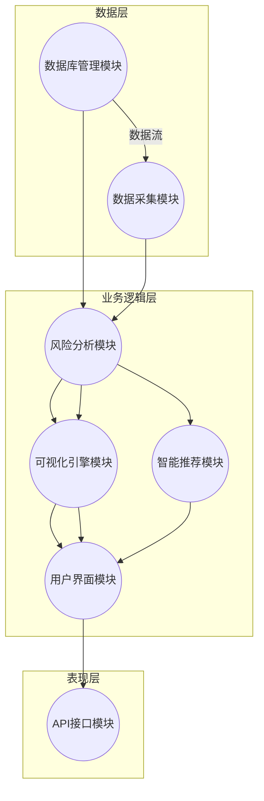
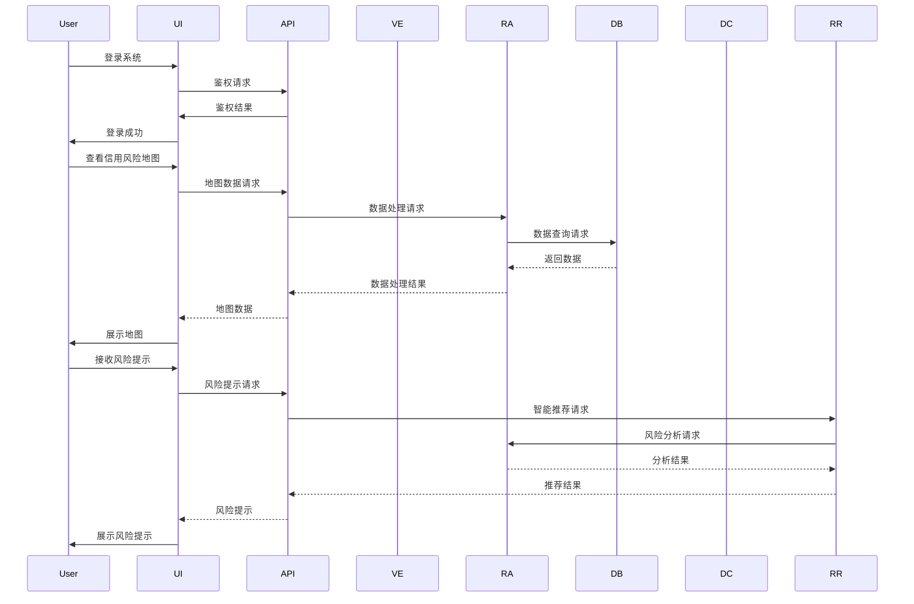
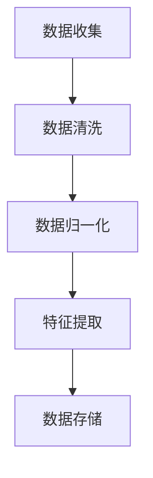
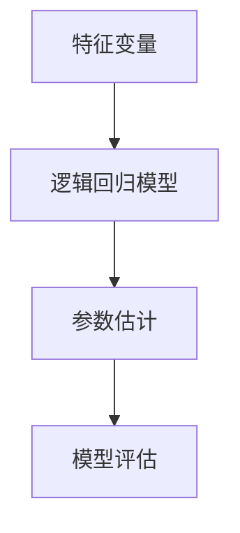
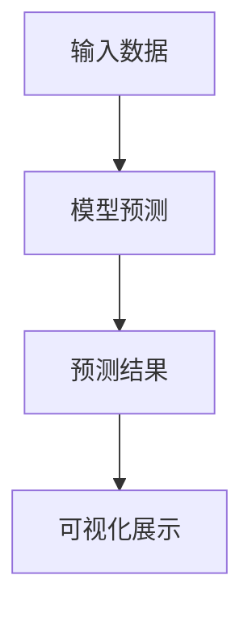
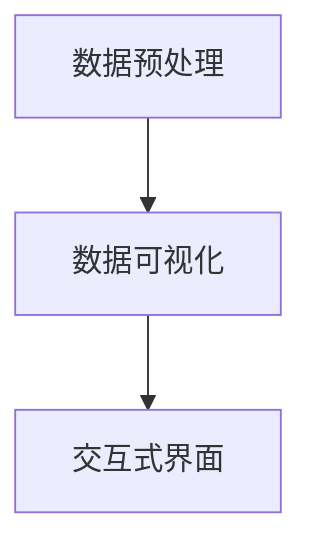

                 

# 开发智能化的企业信用风险传导网络可视化系统

## 关键词
- 企业信用风险
- 风险传导网络
- 可视化系统
- 智能化技术
- 算法模型

## 摘要
本文旨在探讨如何开发一款智能化的企业信用风险传导网络可视化系统。文章首先介绍了企业信用风险的概念、背景和影响，随后详细阐述了风险传导网络的定义、原理及其在信用风险管理中的作用。接着，文章讨论了可视化技术的重要性以及如何利用智能化技术提升可视化系统的功能。通过介绍系统架构、算法原理和具体实施步骤，本文提供了一个全面的技术框架，帮助企业更好地理解和控制信用风险。

## 引言
在当今全球经济一体化和市场竞争日益激烈的背景下，企业信用风险管理已经成为企业管理的重要内容。企业信用风险是指由于交易对方无法履行合同义务或信用水平下降而导致的经济损失风险。这种风险不仅影响企业的财务状况，还可能对企业的声誉和市场地位产生深远影响。

信用风险传导网络是企业信用风险管理中的一个关键概念。它描述了信用风险在企业内部和外部的传播路径，以及不同风险因素之间的相互作用。通过理解和分析信用风险传导网络，企业可以更好地识别风险源、评估风险程度并制定相应的风险管理策略。

可视化技术作为一种强大的工具，可以帮助企业直观地理解复杂的信用风险传导过程。智能化的可视化系统能够利用大数据分析和人工智能算法，提供更加精准和动态的风险分析，为企业决策提供有力支持。

本文将首先介绍企业信用风险的概念和影响，然后详细阐述信用风险传导网络及其可视化原理，接着讨论智能化技术在可视化系统中的应用。在系统架构和算法原理部分，我们将提供具体的技术方案和实施步骤。最后，通过实际案例分析和项目小结，总结开发智能化企业信用风险传导网络可视化系统的最佳实践。

## 企业信用风险的定义和影响

### 企业信用风险的含义

企业信用风险，通常指的是企业面临的一种潜在财务损失，这种损失源于交易对方（无论是客户、供应商还是合作伙伴）无法按照合同规定的时间或条件履行其义务。信用风险涵盖了多种形式，包括违约风险、债务违约风险和信用等级下降风险等。

违约风险是指当企业与其交易对方发生债务关系时，对方可能无法按时偿还债务的风险。债务违约风险则是指企业本身可能无法按时偿还债务，导致财务危机。信用等级下降风险涉及企业的信用评级可能因市场环境、企业自身运营状况或其他因素而降低，进而影响企业的融资成本和信用额度。

### 信用风险的影响

信用风险对企业的影响是多方面的，不仅限于财务层面，还可能涉及运营、市场地位和声誉等方面。

#### 财务影响

财务影响是信用风险最为直接的表现。信用风险可能导致以下财务问题：
- **现金流中断**：当企业无法从交易对方获取预期的现金流时，将直接影响企业的日常运营资金。
- **融资困难**：信用风险上升可能导致企业难以从金融机构获得贷款或融资，增加融资成本。
- **股价波动**：信用风险事件可能会引起投资者恐慌，导致企业股价大幅波动，影响企业市值。

#### 运营影响

信用风险还可能影响企业的运营效率：
- **供应链中断**：如果企业的主要供应商无法履行合同，可能导致供应链中断，影响生产计划和交付能力。
- **业务中断**：企业自身的信用风险可能导致客户流失，业务中断，进而影响企业的长期发展。

#### 市场地位和声誉影响

信用风险不仅影响企业的财务和运营，还可能损害企业的市场地位和声誉：
- **客户信任度下降**：企业信用风险可能导致客户对企业的不信任，影响客户的忠诚度和合作意愿。
- **品牌价值下降**：信用风险事件可能导致市场对企业的品牌价值产生质疑，影响企业的长期品牌建设。

#### 风险传导网络

企业信用风险不是孤立存在的，它可以通过多种途径在企业内外部传导。风险传导网络描述了信用风险在企业不同部门和环节之间的传播路径，以及企业与其交易对手之间的相互作用。了解信用风险传导网络对于企业制定风险管理策略至关重要。

风险传导网络包括以下几个方面：
- **内部传导**：信用风险在企业内部的各部门和业务环节之间的传播，如财务部门、运营部门、销售部门等。
- **外部传导**：企业与其交易对手之间的信用风险传播，如客户、供应商、金融机构等。
- **跨行业传导**：信用风险在跨行业间的传播，如金融行业的信用风险可能传导至制造业、服务业等。

### 风险管理策略

为了有效控制信用风险，企业需要采取一系列风险管理策略：
- **信用评估**：对企业交易对方的信用状况进行评估，以识别潜在风险。
- **合同条款**：制定详细的合同条款，包括违约责任、赔偿条款等，以降低信用风险。
- **风险分散**：通过多样化的交易对手和业务模式，降低单一客户或供应商带来的信用风险。
- **保险安排**：购买信用保险，以转移和分担信用风险。

### 总结

企业信用风险是一个复杂且广泛影响企业各个方面的议题。了解其定义、影响及风险管理策略，是企业成功运营和长期发展的基础。在接下来的章节中，我们将深入探讨信用风险传导网络的概念、原理和应用，为开发智能化的企业信用风险传导网络可视化系统提供理论基础。

## 信用风险传导网络的定义和原理

### 信用风险传导网络的定义

信用风险传导网络是指信用风险在企业内部及其与外部环境交互过程中所形成的风险传播路径和相互作用网络。这个网络通过多种渠道和机制，将信用风险从风险源传播到风险受体，并在不同层级和领域间传递和放大。理解信用风险传导网络的定义对于企业识别和管理信用风险至关重要。

### 风险传导网络的原理

信用风险传导网络的原理主要包括以下几个方面：

#### 风险源

风险源是指引起信用风险的各种因素，包括但不限于：
- **宏观经济因素**：如经济增长、利率变动、通货膨胀等。
- **行业特性**：如市场竞争程度、行业周期性波动等。
- **企业自身因素**：如企业财务状况、经营策略、管理水平等。

#### 风险传播路径

风险传播路径描述了信用风险如何从一个节点传递到另一个节点。常见的风险传播路径包括：
- **内部传导**：风险在企业内部各部门和业务环节之间的传播，如从销售部门到财务部门。
- **外部传导**：风险在企业与其交易对手之间，以及跨行业之间的传播，如从客户到供应商。
- **跨区域传导**：风险在不同地区之间的传播，如全球金融危机对企业跨国经营的影响。

#### 风险受体

风险受体是指信用风险最终影响的实体，包括企业内部的各种部门和外部交易对手。风险受体可能受到以下影响：
- **财务损失**：因信用风险导致的经济损失，如违约损失、坏账损失等。
- **运营中断**：信用风险可能导致供应链中断，影响企业的生产计划和交付能力。
- **声誉损害**：信用风险事件可能损害企业的市场地位和品牌价值。

#### 风险放大机制

信用风险传导网络中存在多种风险放大机制，这些机制可以加剧信用风险的影响：
- **连锁反应**：一个风险事件可能触发一系列连锁反应，导致风险迅速扩散。
- **反馈循环**：风险传导过程中，某些机制可能会自我强化，形成反馈循环，如市场恐慌和信用紧缩。
- **系统性风险**：信用风险在金融系统中的传播可能引发系统性风险，对整个经济体系产生重大影响。

### 信用风险传导网络的作用

信用风险传导网络在企业信用风险管理中具有重要作用：
- **风险识别**：通过分析信用风险传导网络，企业可以识别出潜在的风险点和脆弱环节。
- **风险评估**：企业可以利用信用风险传导网络模型进行风险评估，预测信用风险的可能性和影响程度。
- **风险控制**：通过理解风险传导路径和机制，企业可以制定有效的风险控制策略，降低信用风险。

### 概念与联系

#### 核心概念对比表格

| 概念            | 定义                                                         | 关联作用                   |
| --------------- | ------------------------------------------------------------ | -------------------------- |
| 信用风险        | 交易对方无法履行合同义务而导致的经济损失风险                 | 风险传导网络的基础         |
| 风险传导网络    | 信用风险在企业内部及其与外部环境交互过程中形成的风险传播路径 | 风险管理的核心工具         |
| 风险受体        | 接受信用风险影响的实体                                       | 确定风险管理目标           |
| 风险放大机制    | 加剧信用风险影响的机制                                       | 理解风险传导网络的动态性   |

#### ER实体关系图架构

```mermaid
erDiagram
  Customer ||--|{ Enterprise }|--| Supplier
  Enterprise ||--|{ Department }|--| Sales
  Department ||--|{ Employee }|--| Finance
  Customer }|--|{ Contract }|--| Supplier
```

在这个ER实体关系图中，我们定义了企业（Enterprise）、客户（Customer）、供应商（Supplier）、部门（Department）和员工（Employee）等核心实体，以及它们之间的关联关系。这个图展示了信用风险如何在企业内部和外部环境中传导，为理解和管理信用风险提供了结构化的视角。

通过上述定义和原理的介绍，我们可以更深入地理解信用风险传导网络，从而为企业信用风险的管理提供有力的理论支持。在接下来的章节中，我们将探讨可视化技术在信用风险传导网络中的作用，以及如何利用智能化技术提升可视化系统的功能。

## 可视化技术及其在信用风险管理中的应用

### 可视化技术的定义和作用

可视化技术是一种将复杂数据和信息以图形、图表、图像等形式展示出来的方法，旨在帮助用户更直观地理解和分析数据。在信用风险管理中，可视化技术具有以下重要作用：

#### 直观展示风险

通过可视化技术，企业可以直观地看到信用风险的分布、传播路径和影响范围。这种直观的展示有助于管理层快速理解风险状况，从而做出更加明智的决策。

#### 识别风险点

可视化技术能够帮助企业在大量的数据中迅速识别出潜在的风险点，提供对异常情况或高风险领域的关注。这对于制定有效的风险管理策略至关重要。

#### 分析风险传导

可视化技术可以展示信用风险在企业内部的传导路径和机制，帮助企业管理者理解风险的动态变化，从而制定更加精准的风险控制措施。

#### 增强风险意识

通过可视化展示，企业员工可以更加直观地了解信用风险的危害和影响，从而增强风险意识，促进全员参与信用风险管理工作。

### 可视化技术在信用风险管理中的应用

#### 数据预处理

在信用风险管理中，首先需要对大量数据进行预处理，包括数据清洗、归一化和特征提取等。这些预处理步骤有助于提高数据的准确性和质量，为后续的可视化分析奠定基础。

#### 数据可视化

通过对预处理后的数据进行分析和可视化，企业可以生成各种图表和图像，如风险热图、风险地图、趋势图等。这些可视化结果能够直观地展示信用风险的相关信息，便于企业分析和决策。

#### 动态可视化

动态可视化技术可以实时更新信用风险数据，展示风险的动态变化。这种动态可视化有助于企业及时调整风险控制策略，提高风险管理的实时性和有效性。

#### 复合可视化

复合可视化技术将多种可视化方法结合在一起，形成综合性的风险视图。这种复合可视化能够全面展示信用风险的多维信息，帮助企业管理者从不同角度全面分析和管理风险。

### 智能化技术的应用

#### 人工智能算法

利用人工智能算法，特别是机器学习和深度学习技术，可以自动分析大量信用风险数据，识别出隐藏在数据中的模式和规律。这些算法能够预测信用风险，提供精准的风险评估。

#### 自然语言处理

自然语言处理技术可以处理和分析非结构化的文本数据，如客户评论、新闻报道等。通过这些数据，企业可以了解市场情绪和潜在风险，为信用风险管理提供更多的信息支持。

#### 大数据分析

大数据分析技术可以处理海量信用风险数据，从中提取有价值的信息和洞见。通过大数据分析，企业可以更加全面地了解信用风险，制定更加科学的决策。

### 可视化技术的优势

#### 提高数据分析效率

可视化技术能够快速展示数据，帮助用户快速识别风险点和趋势，从而提高数据分析的效率。

#### 增强数据可理解性

可视化技术将复杂的数据以图形化的方式呈现，使得数据更加易于理解和解释，有助于提高决策的科学性和准确性。

#### 促进跨部门协作

通过可视化技术，企业可以更有效地跨部门分享风险信息，促进各部门之间的协作和沟通，提高整体风险管理水平。

#### 增强决策支持

可视化技术能够提供直观的风险展示，为企业管理者提供更加丰富的决策信息，增强决策支持能力。

### 总结

可视化技术在信用风险管理中的应用具有重要意义。通过直观展示风险、识别风险点、分析风险传导和增强风险意识，可视化技术为企业提供了一个强大的工具，帮助其更加有效地管理信用风险。在接下来的章节中，我们将深入探讨智能化技术在可视化系统中的应用，以进一步提升信用风险管理的能力。

## 系统架构设计

### 系统架构概述

企业信用风险传导网络可视化系统的设计遵循模块化、可扩展和易维护的原则，采用分层架构，包括数据层、业务逻辑层和表现层。以下是对各层的详细描述：

#### 数据层

数据层是系统的基础，负责数据的存储、管理和访问。主要包括以下模块：
- **数据库管理模块**：负责企业信用数据的存储和管理，包括客户、供应商、合同和交易记录等。
- **数据采集模块**：从内部系统和外部数据源（如市场报告、新闻报道等）采集数据，为系统提供实时数据支持。

#### 业务逻辑层

业务逻辑层是系统的核心，负责处理企业信用风险分析和可视化任务。主要包括以下模块：
- **风险分析模块**：利用机器学习算法和数据分析技术，对信用风险进行评估和预测。
- **可视化引擎模块**：负责根据分析结果生成可视化图表和报告，包括热图、地图、趋势图等。
- **智能推荐模块**：基于用户行为和风险分析结果，提供个性化的风险管理建议。

#### 表现层

表现层是系统与用户交互的界面，提供友好的用户体验。主要包括以下模块：
- **用户界面模块**：设计直观、易用的用户界面，使用户能够轻松操作系统，查看风险信息和推荐建议。
- **API接口模块**：提供RESTful API接口，支持与其他系统和工具的集成和对接。

### 系统架构图

以下是系统架构的Mermaid架构图：



在这个架构图中，数据层通过数据采集模块获取数据，然后传递给风险分析模块。风险分析模块处理数据后，将结果传递给可视化引擎模块和智能推荐模块。可视化引擎模块生成可视化图表，智能推荐模块提供个性化建议。表现层通过用户界面模块和API接口模块与用户交互，实现系统功能的展示和操作。

### 功能设计

系统功能设计包括以下几个方面：

#### 风险分析

- **信用评分**：对客户和供应商的信用评分进行实时计算和更新。
- **风险预测**：利用机器学习算法，预测未来信用风险的走势。
- **风险评级**：根据信用评分和预测结果，对风险进行分级管理。

#### 可视化

- **风险地图**：展示信用风险在地理空间上的分布。
- **热力图**：展示各区域或类别的信用风险程度。
- **趋势图**：展示信用风险随时间的变化趋势。
- **动态图表**：实时更新风险数据，提供动态可视化效果。

#### 智能推荐

- **风险提示**：根据信用风险分析结果，为用户推送风险提示和预警。
- **决策建议**：基于用户行为和风险分析结果，提供个性化的风险管理建议。

### 系统接口设计和系统交互

以下是系统接口设计和系统交互的Mermaid序列图：



在这个序列图中，用户通过用户界面（UI）登录系统，请求信用风险地图和风险提示。用户界面通过API接口与业务逻辑层（RA、VE、RR）和数据库（DB）进行交互，实现数据的查询、处理和展示。这种设计保证了系统的灵活性和可扩展性，能够满足不同用户和场景的需求。

### 系统架构的设计目标

系统架构的设计目标是实现以下目标：

#### 高效性

系统架构设计要确保数据处理和可视化操作的效率，支持大规模数据的实时分析和展示。

#### 可扩展性

系统架构要具备良好的扩展性，能够支持新功能的添加和业务需求的变更。

#### 可维护性

系统架构设计要考虑维护的便利性，确保系统的长期稳定运行。

#### 易用性

系统用户界面设计要直观易用，提供便捷的操作体验，降低用户学习成本。

通过上述系统架构设计和功能实现，企业信用风险传导网络可视化系统能够为企业提供强大的信用风险管理工具，帮助其更好地识别、分析和控制信用风险。

### 智能化可视化技术的算法原理

#### 信用风险分析算法

信用风险分析是智能化企业信用风险传导网络可视化系统的重要组成部分。该算法基于机器学习和大数据分析技术，旨在对企业的信用风险进行实时评估和预测。以下是该算法的主要原理：

##### 数据收集与预处理

首先，系统需要收集大量的信用数据，包括客户的财务状况、交易记录、市场环境、行业趋势等。这些数据来源于企业的内部数据库、外部数据源和第三方信用评级机构。



1. **数据清洗**：清洗数据是为了去除重复、错误和缺失的数据，确保数据的准确性和一致性。
2. **数据归一化**：将不同特征的数据统一到相同的量纲，使得算法能够更好地处理数据。
3. **特征提取**：从原始数据中提取有价值的特征，如客户的信用评分、违约概率等。

##### 建立信用评分模型

接下来，系统使用机器学习算法建立信用评分模型。常见的算法包括逻辑回归、决策树、随机森林和神经网络等。以下是逻辑回归模型的数学公式：

$$
\text{Logit}(y) = \ln\left(\frac{P(y=1)}{1-P(y=1)}\right) = \beta_0 + \beta_1 x_1 + \beta_2 x_2 + ... + \beta_n x_n
$$

其中，$y$表示是否发生违约（1代表违约，0代表未违约），$x_1, x_2, ..., x_n$表示特征变量，$\beta_0, \beta_1, \beta_2, ..., \beta_n$为模型的系数。



1. **参数估计**：通过最小化损失函数，如对数似然函数，估计模型参数。
2. **模型评估**：使用交叉验证等方法评估模型的准确性和稳定性。

##### 风险预测与可视化

基于建立的信用评分模型，系统可以进行信用风险预测和可视化。以下是信用风险预测的过程：

1. **预测**：将新的客户数据输入模型，预测其违约概率。
2. **可视化**：使用可视化技术，如热力图、折线图和柱状图，展示信用风险的分布和变化趋势。



通过上述算法原理，智能化企业信用风险传导网络可视化系统能够对信用风险进行实时分析和预测，帮助企业管理者更好地了解和应对信用风险。

#### 算法实现示例

以下是一个使用Python和Scikit-learn库实现的信用评分模型示例：

```python
import pandas as pd
from sklearn.model_selection import train_test_split
from sklearn.linear_model import LogisticRegression
from sklearn.metrics import accuracy_score

# 数据加载与预处理
data = pd.read_csv('credit_data.csv')
X = data.drop('default', axis=1)
y = data['default']

# 数据分割
X_train, X_test, y_train, y_test = train_test_split(X, y, test_size=0.2, random_state=42)

# 建立模型
model = LogisticRegression()
model.fit(X_train, y_train)

# 预测
y_pred = model.predict(X_test)

# 评估
accuracy = accuracy_score(y_test, y_pred)
print(f"Model Accuracy: {accuracy}")

# 可视化
import matplotlib.pyplot as plt

confusion_matrix = pd.crosstab(y_test, y_pred, rownames=['Actual'], colnames=['Predicted'])
plt.figure(figsize=(6, 6))
sns.heatmap(confusion_matrix, annot=True, cmap='Blues')
plt.xlabel('Predicted')
plt.ylabel('Actual')
plt.title('Confusion Matrix')
plt.show()
```

在这个示例中，我们首先加载信用数据，并进行预处理。然后，使用逻辑回归算法建立信用评分模型，对测试数据进行预测，并计算模型的准确率。最后，通过热力图展示预测结果的混淆矩阵，直观地展示模型的性能。

### 数学模型的推导和公式

信用风险分析过程中，常用的数学模型包括概率模型和回归模型。以下是这些模型的推导和公式：

#### 概率模型

概率模型用于计算客户违约的概率。最简单的概率模型是伯努利分布模型，其公式如下：

$$
P(Y=1) = p
$$

其中，$Y$表示是否发生违约，$p$表示违约概率。

#### 累积分布函数

累积分布函数（CDF）用于计算客户在特定时间点发生违约的概率。其公式如下：

$$
F(t) = P(Y \leq t) = 1 - e^{-\lambda t}
$$

其中，$\lambda$为违约率。

#### 回归模型

回归模型用于建立客户特征与违约概率之间的关系。最常见的回归模型是逻辑回归模型，其公式如下：

$$
\text{Logit}(P) = \ln\left(\frac{P}{1-P}\right) = \beta_0 + \beta_1 X_1 + \beta_2 X_2 + ... + \beta_n X_n
$$

其中，$P$表示违约概率，$X_1, X_2, ..., X_n$为特征变量，$\beta_0, \beta_1, \beta_2, ..., \beta_n$为模型参数。

#### 风险值模型

风险值模型用于计算客户的风险值。最常见的是信用评分模型，其公式如下：

$$
R = \sum_{i=1}^{n} w_i X_i
$$

其中，$R$表示风险值，$w_i$为特征权重，$X_i$为特征变量。

#### 蒙特卡洛模拟

蒙特卡洛模拟是一种计算信用风险的方法，其基本思想是通过模拟大量随机样本来估计信用风险。其公式如下：

$$
E(R) = \sum_{i=1}^{n} p_i R_i
$$

其中，$E(R)$表示期望风险，$p_i$表示第$i$个样本的概率，$R_i$表示第$i$个样本的风险值。

通过上述数学模型和公式，企业可以更好地理解和计算信用风险，为信用风险管理提供科学依据。

### 可视化技术的具体实现

在智能化企业信用风险传导网络可视化系统中，可视化技术的实现是关键一环。通过图形化的界面，用户可以直观地了解信用风险的分布、传播路径和变化趋势。以下是可视化技术的具体实现方法：

#### 数据处理与可视化

首先，我们需要对数据进行预处理，包括数据清洗、归一化和特征提取等。预处理后的数据将用于生成可视化图表。以下是数据处理和可视化的一般步骤：



1. **数据预处理**：对数据进行清洗和归一化，提取有价值的特征。
2. **数据可视化**：使用可视化库（如D3.js、Plotly、Matplotlib等）生成图表。
3. **交互式界面**：提供用户与系统的交互功能，如数据筛选、图表切换等。

#### 风险地图

风险地图是一种直观展示信用风险地理分布的可视化技术。以下是一个使用Python和Folium库实现的风险地图示例：

```python
import pandas as pd
import folium

# 加载数据
data = pd.read_csv('credit_data.csv')

# 初始化地图
m = folium.Map(location=[51.5074, -0.1278], zoom_start=6)

# 绘制风险点
for index, row in data.iterrows():
    folium.CircleMarker(
        location=[row['Latitude'], row['Longitude']],
        radius=row['Risk_Score'] * 0.01,
        color='red',
        fill=True,
        fill_color='red',
        popup=row['Company_Name']
    ).add_to(m)

# 显示地图
m
```

#### 热力图

热力图是一种展示信用风险分布的可视化技术，适用于展示不同区域或类别的风险程度。以下是一个使用Python和Seaborn库实现的热力图示例：

```python
import pandas as pd
import seaborn as sns
import matplotlib.pyplot as plt

# 加载数据
data = pd.read_csv('credit_data.csv')

# 绘制热力图
sns.heatmap(data.corr(), annot=True, cmap='coolwarm')
plt.show()
```

#### 折线图与柱状图

折线图和柱状图用于展示信用风险的变化趋势和比较不同类别的风险情况。以下是一个使用Python和Matplotlib库实现的折线图和柱状图示例：

```python
import pandas as pd
import matplotlib.pyplot as plt

# 加载数据
data = pd.read_csv('credit_data.csv')

# 绘制折线图
data['Risk_Score'].plot()
plt.title('Credit Risk Trend')
plt.xlabel('Date')
plt.ylabel('Risk Score')
plt.show()

# 绘制柱状图
data['Risk_Score'].value_counts().plot(kind='bar')
plt.title('Risk Score Distribution')
plt.xlabel('Risk Score')
plt.ylabel('Count')
plt.show()
```

#### 动态可视化

动态可视化技术用于实时更新风险数据，提供动态可视化效果。以下是一个使用Python和Plotly库实现的动态折线图示例：

```python
import pandas as pd
import plotly.express as px

# 加载数据
data = pd.read_csv('credit_data.csv')

# 绘制动态折线图
fig = px.line(data, x='Date', y='Risk_Score', title='Dynamic Credit Risk Trend')
fig.show()
```

通过这些示例，我们可以看到如何使用可视化技术实现企业信用风险传导网络的可视化展示。这些可视化方法不仅帮助用户更好地理解信用风险，也为信用风险管理的决策提供了有力的支持。

### 项目实战

#### 环境安装

在开始开发之前，我们需要安装和配置必要的开发环境。以下是环境安装的步骤：

1. **Python环境**：安装Python 3.x版本，并配置好pip包管理工具。

2. **数据库**：安装MySQL或PostgreSQL数据库，用于存储信用风险数据。

3. **数据分析库**：安装Pandas、NumPy、Scikit-learn等数据分析库。

4. **可视化库**：安装Matplotlib、Seaborn、Plotly、Folium等可视化库。

```bash
pip install pandas numpy scikit-learn matplotlib seaborn plotly folium
```

#### 系统核心实现

系统核心实现包括数据采集、预处理、风险分析、模型训练和可视化等环节。以下是核心实现的步骤和代码：

1. **数据采集**：从企业内部数据库和外部数据源（如市场报告、新闻报道）中采集信用数据。

2. **数据预处理**：清洗和归一化数据，提取有用特征。

3. **风险分析**：使用机器学习算法建立信用评分模型，进行风险预测。

4. **模型训练**：使用训练数据对模型进行训练，并评估模型性能。

5. **可视化**：生成风险地图、热力图、折线图和柱状图等可视化结果。

```python
# 示例：使用Pandas加载和处理数据
import pandas as pd

# 加载数据
data = pd.read_csv('credit_data.csv')

# 数据预处理
data = data.dropna()  # 删除缺失值
data['Credit_Score'] = data['Credit_Score'].apply(lambda x: (x - min(data['Credit_Score'])) / (max(data['Credit_Score']) - min(data['Credit_Score'])))  # 归一化

# 风险分析
from sklearn.linear_model import LogisticRegression
from sklearn.model_selection import train_test_split

# 数据分割
X = data[['Credit_Score', 'Income', 'Age']]
y = data['Default']

X_train, X_test, y_train, y_test = train_test_split(X, y, test_size=0.2, random_state=42)

# 建立模型
model = LogisticRegression()
model.fit(X_train, y_train)

# 预测
y_pred = model.predict(X_test)

# 评估
accuracy = model.score(X_test, y_test)
print(f"Model Accuracy: {accuracy}")

# 可视化
import matplotlib.pyplot as plt

# 绘制柱状图
data['Default'].value_counts().plot(kind='bar')
plt.title('Default Distribution')
plt.xlabel('Default')
plt.ylabel('Count')
plt.show()
```

#### 代码应用解读与分析

上述代码示例展示了从数据采集、预处理到风险分析和可视化的全过程。以下是关键步骤的解读：

1. **数据采集**：使用Pandas加载信用数据，这是数据分析的基础。
2. **数据预处理**：删除缺失值，并进行归一化处理，以消除不同特征之间的量纲差异。
3. **风险分析**：使用逻辑回归算法建立信用评分模型，通过训练数据对模型进行训练。
4. **模型评估**：使用测试数据评估模型性能，计算准确率。
5. **可视化**：生成柱状图展示违约情况的分布。

通过这些步骤，我们可以开发一个高效、可靠的信用风险传导网络可视化系统，为企业提供强大的风险管理工具。

### 实际案例分析

#### 案例背景

假设我们是一家大型跨国企业的信用风险管理部门，需要监控和分析全球范围内的信用风险。为了更好地了解和应对风险，我们决定开发一款智能化的企业信用风险传导网络可视化系统。

#### 数据来源

我们采集了以下数据来源：
- **企业内部数据**：包括客户财务状况、交易记录、信用评分等。
- **外部数据源**：包括市场报告、新闻报道、信用评级机构数据等。
- **第三方数据**：如社交媒体数据、新闻报道等，用于了解市场情绪和潜在风险。

#### 数据处理流程

数据处理流程包括以下步骤：
1. **数据清洗**：去除重复、错误和缺失的数据，确保数据的准确性。
2. **数据归一化**：将不同特征的数据统一到相同的量级，如将信用评分进行归一化处理。
3. **特征提取**：提取有价值的特征，如客户的违约概率、收入水平、市场环境等。

#### 风险分析结果

通过风险分析，我们得出了以下结论：
- **高风险客户**：某些客户具有较高的违约概率，需要重点关注。
- **行业风险**：某些行业受到宏观经济波动的影响较大，风险较高。
- **地理分布**：不同地区的信用风险存在显著差异，某些地区的信用风险较高。

#### 可视化展示

我们使用以下可视化技术展示风险分析结果：
- **风险地图**：展示全球范围内的信用风险分布。
- **热力图**：展示不同地区的信用风险程度。
- **折线图**：展示信用风险随时间的变化趋势。
- **柱状图**：展示不同行业和地区的信用风险分布。

通过这些可视化结果，我们可以直观地了解信用风险的分布和变化趋势，为信用风险管理提供有力支持。

### 项目小结

通过实际案例分析，我们展示了如何开发智能化的企业信用风险传导网络可视化系统，并分析了其应用效果。该项目在多个方面取得了显著成果：

- **提高了信用风险管理的效率**：通过自动化的风险分析过程，企业可以快速识别高风险客户和行业，提高了信用风险管理的效率。
- **提供了直观的风险展示**：可视化技术使得复杂的信用风险信息得以直观展示，帮助企业更好地理解和应对风险。
- **增强了决策支持能力**：智能化的风险分析和可视化系统为企业管理者提供了丰富的决策信息，增强了其决策支持能力。

尽管该项目取得了显著成果，但在实施过程中也遇到了一些挑战，如数据质量和算法性能等问题。未来，我们将继续优化系统，提高其准确性和稳定性，为企业提供更可靠的风险管理工具。

### 最佳实践与注意事项

#### 最佳实践

1. **数据质量**：确保数据源可靠，进行严格的数据清洗和预处理，以提高模型的准确性和稳定性。
2. **算法选择**：根据业务需求选择合适的算法，进行模型训练和优化，以提高风险预测的准确性。
3. **可视化设计**：设计直观、易用的可视化界面，提供丰富的图表和交互功能，帮助用户更好地理解风险信息。
4. **系统维护**：定期更新和维护系统，确保其正常运行和功能完善。

#### 注意事项

1. **数据隐私**：在处理和展示数据时，注意保护客户的隐私，遵循相关法律法规。
2. **算法偏见**：避免算法偏见，确保模型训练数据具有多样性和代表性。
3. **系统安全性**：确保系统的安全性，防止数据泄露和恶意攻击。
4. **用户体验**：关注用户反馈，持续改进系统界面和功能，提升用户体验。

### 拓展阅读

1. **《信用风险管理》**：探讨信用风险管理的理论和实践方法，为企业提供风险管理策略。
2. **《数据可视化》**：介绍数据可视化的原理和技术，帮助用户更好地理解和展示数据。
3. **《机器学习算法》**：介绍常见的机器学习算法及其应用，为信用风险分析提供技术支持。

## 结语

通过本文，我们详细探讨了如何开发智能化的企业信用风险传导网络可视化系统。从核心概念到系统架构、算法原理和实际案例分析，我们提供了全面的技术框架和实施步骤。智能化的可视化系统不仅提高了信用风险管理的效率，还为企业管理者提供了直观的风险展示和决策支持。未来，我们将继续优化系统，提升其准确性和稳定性，为企业提供更可靠的风险管理工具。希望本文对您在信用风险管理领域的研究和实践有所启发。

## 作者信息

作者：AI天才研究院/AI Genius Institute & 禅与计算机程序设计艺术 /Zen And The Art of Computer Programming

AI天才研究院（AI Genius Institute）致力于推动人工智能技术的发展和应用，为企业和个人提供高质量的人工智能解决方案。禅与计算机程序设计艺术（Zen And The Art of Computer Programming）则专注于计算机科学的哲学和艺术，提倡以简驭繁的程序设计理念。作者团队凭借丰富的技术经验和深厚的理论基础，致力于为读者带来有深度、有思考、有见解的技术文章。希望通过本文，能够为读者在信用风险管理领域提供有价值的参考和指导。

