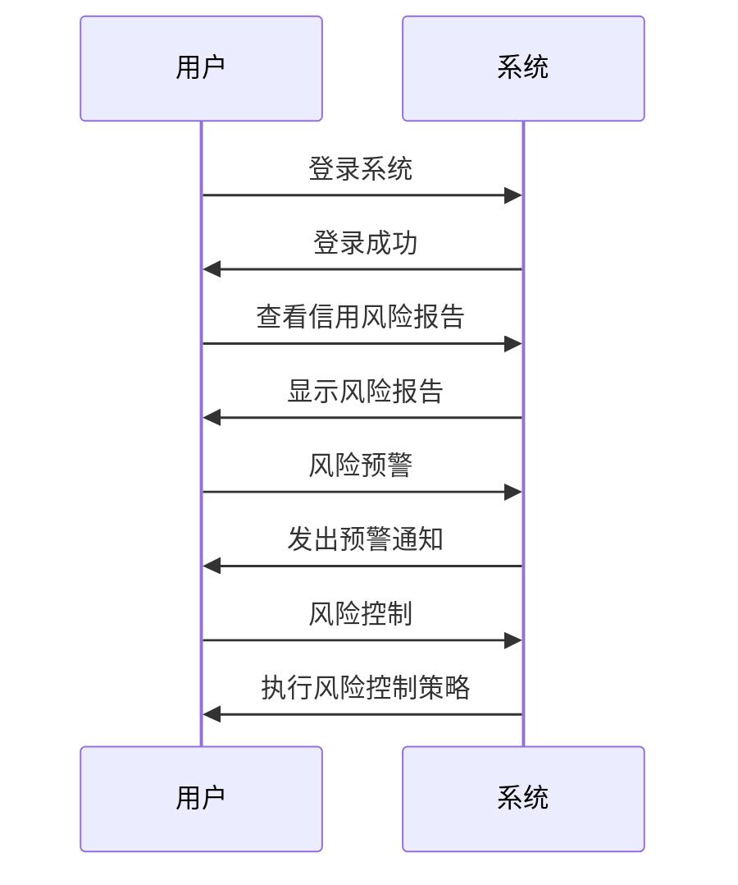

                 

### 文章标题

# 开发智能化的企业信用风险敞口动态管理系统

> 关键词：企业信用风险、风险敞口、动态管理系统、人工智能、数据分析

> 摘要：本文详细探讨了企业信用风险敞口动态管理系统的开发，从背景、核心概念、系统设计到关键技术的各个环节，逐步分析了该系统的构建过程及其重要性。本文旨在为相关领域的研究者和开发者提供有价值的参考。

### 目录大纲

----------------------------------------------------------------

## 第一部分: 企业信用风险敞口动态管理系统概述

### 第1章: 企业信用风险敞口动态管理系统的背景与意义

#### 1.1 问题背景

##### 1.1.1 当前企业信用风险管理面临的挑战

##### 1.1.2 企业信用风险敞口管理的重要性

##### 1.1.3 动态管理系统的需求

#### 1.2 问题描述

##### 1.2.1 企业信用风险的构成

##### 1.2.2 信用风险敞口的概念

##### 1.2.3 动态管理的要求

#### 1.3 问题解决

##### 1.3.1 传统信用风险管理方法的局限性

##### 1.3.2 智能化动态管理系统的优势

##### 1.3.3 系统的核心功能

#### 1.4 边界与外延

##### 1.4.1 系统的适用范围

##### 1.4.2 系统的技术架构

##### 1.4.3 系统的数据来源

#### 1.5 概念结构与核心要素组成

##### 1.5.1 企业信用风险的五要素

##### 1.5.2 动态管理系统的架构

##### 1.5.3 关键技术

#### 1.6 本章小结

## 第二部分: 企业信用风险敞口动态管理系统的核心概念与原理

### 第2章: 核心概念解析

#### 2.1 企业信用风险的概念

##### 2.1.1 信用风险的定义

##### 2.1.2 信用风险的特征

##### 2.1.3 信用风险的类型

#### 2.2 信用风险敞口的概念

##### 2.2.1 信用风险敞口的定义

##### 2.2.2 信用风险敞口的影响因素

##### 2.2.3 信用风险敞口的度量方法

#### 2.3 动态管理系统的原理

##### 2.3.1 动态管理系统的定义

##### 2.3.2 动态管理系统的架构

##### 2.3.3 动态管理系统的关键模块

#### 2.4 核心概念的联系

##### 2.4.1 企业信用风险与信用风险敞口的关系

##### 2.4.2 动态管理系统与信用风险管理的联系

##### 2.4.3 动态管理系统与信用风险敞口管理的联系

#### 2.5 本章小结

## 第三部分: 企业信用风险敞口动态管理系统设计与实现

### 第3章: 系统架构设计

#### 3.1 问题场景介绍

##### 3.1.1 企业信用风险管理的实际需求

##### 3.1.2 动态管理系统需要解决的问题

##### 3.1.3 系统的总体架构设计目标

#### 3.2 系统功能设计

##### 3.2.1 系统功能模块划分

##### 3.2.2 功能模块详细介绍

#### 3.3 系统架构设计

##### 3.3.1 总体架构设计思路

##### 3.3.2 各模块之间的关系

##### 3.3.3 系统性能优化策略

#### 3.4 系统接口设计

##### 3.4.1 系统接口的定义与作用

##### 3.4.2 系统接口的设计原则

##### 3.4.3 系统接口的实现方法

#### 3.5 系统交互设计

##### 3.5.1 系统交互的设计原则

##### 3.5.2 系统交互的设计方法

##### 3.5.3 系统交互的mermaid序列图

#### 3.6 本章小结

### 第4章: 关键技术

#### 4.1 数据采集技术

##### 4.1.1 数据来源

##### 4.1.2 数据采集的方法

##### 4.1.3 数据质量保证

#### 4.2 数据预处理技术

##### 4.2.1 数据清洗

##### 4.2.2 数据整合

##### 4.2.3 数据规范化

#### 4.3 风险评估模型

##### 4.3.1 风险评估模型的选择

##### 4.3.2 风险评估模型的构建

## 结束语

----------------------------------------------------------------

---

### 第1章: 企业信用风险敞口动态管理系统的背景与意义

#### 1.1 问题背景

##### 1.1.1 当前企业信用风险管理面临的挑战

在全球化竞争日益激烈的今天，企业面临着诸多信用风险，这些风险不仅来自客户和供应商的违约风险，还涉及到金融市场、宏观经济环境等外部因素。传统的信用风险管理方法往往依赖于经验判断和手工处理，存在以下问题：

- **数据依赖性高**：传统方法多依赖于手工收集和分析数据，处理效率低，数据质量难以保证。
- **风险识别滞后**：传统方法无法实时监控信用风险的变化，导致风险识别和响应滞后。
- **风险分析不全面**：传统方法往往仅关注单一风险因素，缺乏全局性视角。

##### 1.1.2 企业信用风险敞口管理的重要性

信用风险敞口管理是企业风险管理的重要组成部分，关系到企业的财务健康和长期发展。有效的信用风险敞口管理能够：

- **降低风险损失**：通过实时监控和评估风险敞口，企业可以及时采取风险控制措施，减少潜在损失。
- **优化资源配置**：通过对信用风险的全面分析和预测，企业可以更合理地分配资源，提高经营效率。
- **增强竞争力**：良好的信用风险管理能够提升企业的市场信誉，增强在竞争中的优势。

##### 1.1.3 动态管理系统的需求

面对传统信用风险管理方法的不足，企业迫切需要一种智能化、动态化的信用风险敞口管理工具。动态管理系统通过以下方面满足需求：

- **实时数据处理**：系统能够实时收集、处理和分析大量数据，提供实时风险报告。
- **智能风险评估**：利用人工智能和数据分析技术，系统能够对信用风险进行智能评估，提高风险预测的准确性。
- **风险预警与响应**：系统能够根据风险变化及时发出预警，并提供相应的应对策略。

#### 1.2 问题描述

##### 1.2.1 企业信用风险的构成

企业信用风险主要包括以下几个方面：

- **客户违约风险**：客户无法按约定时间支付货款或提供服务。
- **供应商违约风险**：供应商无法按时交货或提供合格的产品和服务。
- **市场风险**：由于市场波动导致的企业经营风险。
- **宏观经济风险**：如通货膨胀、利率变化等宏观经济因素对企业的影响。
- **法律风险**：企业面临的法律诉讼或合规风险。

##### 1.2.2 信用风险敞口的概念

信用风险敞口是指企业面临的风险暴露程度，即可能发生损失的最大金额。具体来说，信用风险敞口包括以下几个方面：

- **交易敞口**：企业在与客户和供应商的交易过程中可能产生的风险敞口。
- **市场敞口**：企业因市场波动而面临的风险敞口。
- **宏观经济敞口**：企业因宏观经济因素而面临的风险敞口。

##### 1.2.3 动态管理的要求

动态管理系统需要满足以下要求：

- **实时性**：系统能够实时收集和处理数据，确保风险信息的及时性。
- **全面性**：系统能够全面分析企业的信用风险，提供全局视角。
- **智能化**：系统利用人工智能和机器学习技术，实现风险预测和评估的智能化。
- **可扩展性**：系统应具备良好的扩展性，能够适应不同规模企业的需求。

#### 1.3 问题解决

##### 1.3.1 传统信用风险管理方法的局限性

传统信用风险管理方法主要依赖于以下方面：

- **人工处理**：数据收集和处理主要依靠人工，效率低，数据质量难以保证。
- **静态分析**：仅对历史数据进行分析，缺乏对当前风险状况的实时监控。
- **单一视角**：仅关注单一风险因素，缺乏全局性视角。

##### 1.3.2 智能化动态管理系统的优势

智能化动态管理系统具有以下优势：

- **实时性**：系统能够实时收集和处理数据，提供实时风险报告。
- **全面性**：系统通过多维度的数据分析，提供全面的信用风险评估。
- **智能化**：系统利用人工智能和机器学习技术，实现风险预测和评估的智能化。
- **自适应**：系统能够根据风险变化自适应调整策略，提高风险管理效果。

##### 1.3.3 系统的核心功能

动态管理系统的核心功能包括：

- **数据采集与处理**：实时收集和处理大量数据，为风险评估提供基础。
- **风险评估**：利用机器学习技术，对信用风险进行智能评估，提供风险预测。
- **风险预警**：根据风险评估结果，实时发出风险预警，并提供应对策略。
- **风险控制**：根据风险预警，采取相应的风险控制措施，降低风险敞口。

#### 1.4 边界与外延

##### 1.4.1 系统的适用范围

动态管理系统适用于各类企业，特别是大型企业，其信用风险敞口较大，风险管理需求较高。系统可以应用于以下几个方面：

- **客户信用管理**：对客户的信用状况进行评估和监控，降低客户违约风险。
- **供应商信用管理**：对供应商的信用状况进行评估和监控，降低供应商违约风险。
- **市场风险管理**：对市场风险进行实时监控和预测，降低市场波动对企业的影响。
- **宏观经济风险管理**：对宏观经济因素进行实时监控和预测，降低宏观经济风险。

##### 1.4.2 系统的技术架构

动态管理系统采用分布式架构，主要包括以下模块：

- **数据采集模块**：负责收集和处理企业内外部数据，为风险评估提供基础。
- **数据处理模块**：对采集到的数据进行清洗、整合和规范化处理，提高数据质量。
- **风险评估模块**：利用机器学习技术，对信用风险进行智能评估，提供风险预测。
- **风险预警模块**：根据风险评估结果，实时发出风险预警，并提供应对策略。
- **风险控制模块**：根据风险预警，采取相应的风险控制措施，降低风险敞口。

##### 1.4.3 系统的数据来源

动态管理系统的数据来源主要包括以下几个方面：

- **企业内部数据**：如财务报表、客户交易数据、供应商交易数据等。
- **外部数据**：如市场数据、宏观经济数据、法律法规数据等。
- **第三方数据**：如信用评级数据、公共记录数据等。

#### 1.5 概念结构与核心要素组成

##### 1.5.1 企业信用风险的五要素

企业信用风险主要包括以下五个要素：

- **风险因素**：影响信用风险的各种因素，如客户信用状况、市场环境、宏观经济状况等。
- **风险事件**：可能导致信用风险发生的具体事件，如客户违约、市场波动等。
- **风险敞口**：企业面临的风险暴露程度，即可能发生损失的最大金额。
- **风险损失**：由于信用风险导致的经济损失。
- **风险管理**：企业对信用风险进行识别、评估、控制和监控的过程。

##### 1.5.2 动态管理系统的架构

动态管理系统的架构主要包括以下几个方面：

- **数据层**：负责数据存储和管理，包括企业内部数据、外部数据和第三方数据。
- **数据处理层**：负责数据的采集、清洗、整合和规范化处理，提高数据质量。
- **分析层**：利用机器学习技术，对信用风险进行智能评估，提供风险预测。
- **应用层**：提供风险预警、风险控制和风险报告等功能。

##### 1.5.3 关键技术

动态管理系统涉及的关键技术主要包括：

- **数据采集技术**：实时采集和处理企业内外部数据。
- **数据处理技术**：对采集到的数据进行清洗、整合和规范化处理。
- **机器学习技术**：对信用风险进行智能评估和预测。
- **风险管理算法**：根据风险评估结果，制定相应的风险控制策略。

#### 1.6 本章小结

本章从问题背景、核心概念、系统设计到关键技术等各个环节，逐步分析了企业信用风险敞口动态管理系统的构建过程。通过本章的分析，我们了解到企业信用风险敞口管理的重要性，以及智能化动态管理系统在信用风险管理中的优势。下一章将深入探讨企业信用风险和信用风险敞口的概念及其度量方法。

----------------------------------------------------------------

### 第2章: 核心概念解析

#### 2.1 企业信用风险的概念

##### 2.1.1 信用风险的定义

信用风险是指企业在交易过程中，由于交易对手（如客户、供应商）的违约行为导致的经济损失风险。信用风险通常包括以下三个方面：

1. **违约风险**：交易对手无法履行合同义务，如无法按时支付货款或提供服务。
2. **违约损失风险**：企业在违约事件中可能遭受的直接经济损失。
3. **违约风险暴露**：企业在交易过程中可能面临的最大损失金额。

##### 2.1.2 信用风险的特征

信用风险具有以下特征：

1. **不确定性**：信用风险的发生具有不确定性，难以准确预测。
2. **潜在性**：信用风险存在于企业的交易过程中，潜在地影响企业的财务状况。
3. **多样性**：信用风险可以来源于多个方面，如客户信用状况、市场环境、宏观经济状况等。
4. **累积性**：信用风险可能随着时间的推移而累积，导致企业的损失逐渐扩大。

##### 2.1.3 信用风险的类型

信用风险可以分为以下几种类型：

1. **交易对手违约风险**：由于交易对手无法履行合同义务而导致的风险。
2. **市场风险**：由于市场价格波动导致的风险，如利率、汇率等。
3. **宏观经济风险**：由于宏观经济环境变化导致的风险，如通货膨胀、利率变化等。
4. **法律风险**：由于法律诉讼或合规问题导致的风险。
5. **操作风险**：由于内部操作失误或管理不善导致的风险。

#### 2.2 信用风险敞口的概念

##### 2.2.1 信用风险敞口的定义

信用风险敞口是指企业在特定时间内可能面临的最大损失金额。信用风险敞口可以基于以下几种度量方法计算：

1. **名义敞口**：基于名义价值计算的风险敞口。
2. **经济敞口**：基于经济价值计算的风险敞口，通常考虑了市场波动等因素。
3. **风险价值（VaR）**：在一定置信水平下，企业在特定时间内可能遭受的最大损失金额。

##### 2.2.2 信用风险敞口的影响因素

信用风险敞口受以下因素影响：

1. **交易对手信用状况**：交易对手的信用评级、财务状况等。
2. **交易规模**：交易金额越大，风险敞口越大。
3. **交易期限**：交易期限越长，风险敞口越大。
4. **市场波动**：市场波动性越大，风险敞口越大。
5. **宏观经济环境**：宏观经济状况越好，风险敞口越小。

##### 2.2.3 信用风险敞口的度量方法

常见的信用风险敞口度量方法包括：

1. **名义价值法**：基于名义价值计算的风险敞口。
2. **经济价值法**：基于经济价值计算的风险敞口，考虑了市场波动等因素。
3. **风险价值法（VaR）**：在一定置信水平下，计算企业在特定时间内可能遭受的最大损失金额。

#### 2.3 动态管理系统的原理

##### 2.3.1 动态管理系统的定义

动态管理系统是指通过实时数据采集、处理和分析，实现对信用风险敞口的动态监控和管理。动态管理系统的核心目标是提高信用风险管理的实时性、准确性和全面性。

##### 2.3.2 动态管理系统的架构

动态管理系统的架构通常包括以下几个层次：

1. **数据层**：负责数据存储和管理，包括企业内部数据、外部数据和第三方数据。
2. **数据处理层**：负责数据的采集、清洗、整合和规范化处理，提高数据质量。
3. **分析层**：利用机器学习技术，对信用风险进行智能评估和预测。
4. **应用层**：提供风险预警、风险控制和风险报告等功能。

##### 2.3.3 动态管理系统的关键模块

动态管理系统主要包括以下关键模块：

1. **数据采集模块**：负责实时收集企业内外部数据。
2. **数据处理模块**：负责对采集到的数据进行分析和清洗，提高数据质量。
3. **风险评估模块**：利用机器学习技术，对信用风险进行智能评估和预测。
4. **风险预警模块**：根据风险评估结果，实时发出风险预警，并提供应对策略。
5. **风险控制模块**：根据风险预警，采取相应的风险控制措施，降低风险敞口。

#### 2.4 核心概念的联系

##### 2.4.1 企业信用风险与信用风险敞口的关系

企业信用风险是信用风险敞口的基础，信用风险敞口是企业信用风险的具体表现形式。信用风险敞口反映了企业在特定时间内可能面临的最大损失金额。

##### 2.4.2 动态管理系统与信用风险管理的联系

动态管理系统是信用风险管理的一种技术手段，通过实时数据采集、处理和分析，实现对信用风险的动态监控和管理。动态管理系统可以提高信用风险管理的实时性、准确性和全面性。

##### 2.4.3 动态管理系统与信用风险敞口管理的联系

动态管理系统是信用风险敞口管理的重要组成部分，通过实时监控和管理信用风险敞口，动态管理系统可以帮助企业降低风险敞口，提高风险管理效果。

#### 2.5 本章小结

本章详细介绍了企业信用风险和信用风险敞口的概念及其度量方法，以及动态管理系统的原理和架构。通过本章的学习，读者可以更好地理解企业信用风险敞口动态管理系统的重要性，并为后续的系统设计与实现打下基础。

----------------------------------------------------------------

### 第3章: 系统架构设计

#### 3.1 问题场景介绍

##### 3.1.1 企业信用风险管理的实际需求

在现代企业的经营活动中，信用风险管理是一个至关重要的环节。企业需要确保其客户和供应商的信用状况良好，以避免因交易对手的违约而导致的经济损失。随着企业规模的扩大和业务复杂性的增加，传统的信用风险管理方法已难以满足实际需求。企业需要一种智能化、动态化的信用风险敞口管理系统，以实现对信用风险的实时监控和预警。

##### 3.1.2 动态管理系统需要解决的问题

动态管理系统需要解决以下几个关键问题：

1. **实时数据采集与处理**：系统能够实时收集来自企业内部和外部的大量数据，如财务报表、客户交易记录、市场数据等，并进行处理和清洗，以确保数据的准确性和一致性。
2. **信用风险评估与预测**：系统利用先进的数据分析和机器学习技术，对信用风险进行智能评估和预测，提供实时、准确的风险报告。
3. **风险预警与应对策略**：系统应能够根据风险评估结果，实时发出风险预警，并提供相应的应对策略，帮助企业及时采取风险控制措施。
4. **风险敞口监控与报告**：系统应能够实时监控企业的信用风险敞口，提供全面、详细的风险报告，帮助企业了解风险状况，优化资源配置。

##### 3.1.3 系统的总体架构设计目标

系统的总体架构设计目标如下：

1. **高可靠性**：系统应具备高可靠性，确保在数据采集、处理和分析过程中不出现故障，保证系统的稳定运行。
2. **高性能**：系统应具备高性能，能够实时处理大量数据，提供快速的风险评估和预警。
3. **可扩展性**：系统应具备良好的可扩展性，能够根据企业规模和业务需求的变化，灵活扩展功能模块和数据源。
4. **易用性**：系统应具备良好的用户体验，界面简洁直观，操作方便，便于用户快速上手。

#### 3.2 系统功能设计

##### 3.2.1 系统功能模块划分

动态管理系统可以划分为以下几个主要功能模块：

1. **数据采集模块**：负责实时收集企业内部和外部数据，包括财务报表、客户交易记录、市场数据等。
2. **数据处理模块**：负责对采集到的数据进行处理和清洗，包括数据清洗、整合、规范化等。
3. **风险评估模块**：负责利用机器学习技术对信用风险进行评估和预测，提供实时风险报告。
4. **风险预警模块**：负责根据风险评估结果，实时发出风险预警，并提供应对策略。
5. **风险控制模块**：负责根据风险预警，采取相应的风险控制措施，降低风险敞口。
6. **报告模块**：负责生成全面、详细的风险报告，提供企业对风险状况的深入了解。

##### 3.2.2 功能模块详细介绍

1. **数据采集模块**：该模块负责实时收集企业内部和外部数据。具体功能包括：

   - **数据采集**：通过API接口、数据库连接等方式，实时收集企业内部和外部数据。
   - **数据存储**：将采集到的数据存储在数据仓库中，以便后续处理和分析。

2. **数据处理模块**：该模块负责对采集到的数据进行处理和清洗。具体功能包括：

   - **数据清洗**：去除数据中的噪声和错误，提高数据质量。
   - **数据整合**：将来自不同数据源的数据进行整合，消除数据冗余，提高数据一致性。
   - **数据规范化**：对数据进行格式化和标准化处理，方便后续分析和挖掘。

3. **风险评估模块**：该模块负责利用机器学习技术对信用风险进行评估和预测。具体功能包括：

   - **风险评估**：根据历史数据和实时数据，对信用风险进行评估，提供风险评级。
   - **风险预测**：利用机器学习算法，预测未来的信用风险变化趋势，提供风险预测报告。

4. **风险预警模块**：该模块负责根据风险评估结果，实时发出风险预警，并提供应对策略。具体功能包括：

   - **风险预警**：根据设定的风险阈值，实时检测风险事件，发出预警通知。
   - **应对策略**：提供相应的应对策略和建议，帮助企业及时采取风险控制措施。

5. **风险控制模块**：该模块负责根据风险预警，采取相应的风险控制措施，降低风险敞口。具体功能包括：

   - **风险控制**：根据风险预警，采取相应的控制措施，如限制交易额度、增加担保等。
   - **风险跟踪**：实时跟踪风险事件的处理进展，确保风险得到有效控制。

6. **报告模块**：该模块负责生成全面、详细的风险报告，提供企业对风险状况的深入了解。具体功能包括：

   - **风险报告**：生成各种风险报告，如月度报告、季度报告等。
   - **数据分析**：提供多维度的数据分析，帮助企业管理者了解风险状况，优化风险管理策略。

#### 3.3 系统架构设计

##### 3.3.1 总体架构设计思路

系统的总体架构设计思路如下：

1. **分布式架构**：采用分布式架构，提高系统的可靠性和可扩展性。各功能模块独立部署，相互协作，共同完成信用风险管理任务。
2. **分层架构**：采用分层架构，将系统划分为数据层、处理层、分析层和应用层，层次清晰，功能明确。
3. **模块化设计**：各功能模块独立开发，方便后续的扩展和维护。
4. **智能化设计**：利用机器学习技术，实现信用风险的智能评估和预测，提高风险管理效果。

##### 3.3.2 各模块之间的关系

系统各模块之间的关系如下：

1. **数据采集模块**：负责实时收集企业内部和外部数据，存储到数据仓库中。
2. **数据处理模块**：负责对数据仓库中的数据进行处理和清洗，生成高质量的数据。
3. **风险评估模块**：利用处理后的数据，进行信用风险评估和预测，生成风险报告。
4. **风险预警模块**：根据风险评估结果，实时发出预警通知，并提供应对策略。
5. **风险控制模块**：根据预警通知，采取相应的风险控制措施，降低风险敞口。
6. **报告模块**：生成全面、详细的风险报告，提供企业对风险状况的深入了解。

##### 3.3.3 系统性能优化策略

为了确保系统的性能和稳定性，可以采取以下优化策略：

1. **数据缓存**：在数据处理和风险评估过程中，使用数据缓存技术，提高数据访问速度。
2. **并行处理**：利用多线程和分布式计算技术，实现数据采集、处理和评估的并行处理，提高系统性能。
3. **负载均衡**：通过负载均衡技术，合理分配系统负载，确保系统在高并发情况下正常运行。
4. **性能监控**：实时监控系统性能，及时发现和解决性能瓶颈。
5. **数据库优化**：对数据库进行优化，提高数据查询和写入速度。

#### 3.4 系统接口设计

##### 3.4.1 系统接口的定义与作用

系统接口是指系统内部各模块之间以及系统与外部系统之间的交互接口。系统接口的作用如下：

1. **数据交换**：系统接口负责在各模块之间传递数据，实现数据共享和交换。
2. **功能调用**：系统接口提供功能调用的接口，各模块通过接口实现功能协作。
3. **外部集成**：系统接口允许外部系统与系统进行集成，实现数据交换和功能调用。

##### 3.4.2 系统接口的设计原则

系统接口的设计应遵循以下原则：

1. **标准化**：接口设计应遵循统一的接口规范，确保接口的标准化和一致性。
2. **简洁性**：接口设计应简洁明了，降低使用难度，提高开发效率。
3. **灵活性**：接口设计应具有灵活性，方便后续的扩展和维护。
4. **安全性**：接口设计应确保数据传输的安全性，防止数据泄露和攻击。

##### 3.4.3 系统接口的实现方法

系统接口的实现方法如下：

1. **RESTful API**：使用RESTful API作为系统接口，提供统一的接口规范和访问方式。
2. **消息队列**：使用消息队列实现各模块之间的异步通信，提高系统的可扩展性和可靠性。
3. **Web服务**：通过Web服务实现系统与外部系统的集成，如与ERP系统、CRM系统等的集成。
4. **SDK**：提供SDK开发工具包，方便第三方开发者和企业内部开发者使用系统接口。

#### 3.5 系统交互设计

##### 3.5.1 系统交互的设计原则

系统交互的设计应遵循以下原则：

1. **用户中心**：以用户为中心，设计简洁直观的用户界面，提高用户体验。
2. **高效性**：系统交互应高效，降低用户操作难度，提高用户满意度。
3. **灵活性**：系统交互应具有灵活性，适应不同用户的需求和场景。
4. **一致性**：系统交互应保持一致性，避免用户在操作过程中产生混淆。

##### 3.5.2 系统交互的设计方法

系统交互的设计方法如下：

1. **用户流程图**：绘制用户流程图，明确用户在系统中的操作流程和路径。
2. **页面布局设计**：设计合理的页面布局，确保系统界面简洁美观，操作方便。
3. **交互设计原型**：使用交互设计原型工具，如Axure、Sketch等，制作交互设计原型。
4. **用户测试**：对交互设计原型进行用户测试，收集用户反馈，优化交互设计。

##### 3.5.3 系统交互的mermaid序列图

以下是一个系统交互的mermaid序列图示例：



#### 3.6 本章小结

本章详细介绍了企业信用风险敞口动态管理系统的架构设计，包括系统功能设计、系统架构设计、系统接口设计和系统交互设计。通过本章的学习，读者可以了解系统的整体设计和实现方法，为后续的系统开发提供指导。下一章将重点介绍系统开发中的关键技术和算法。

----------------------------------------------------------------

### 第4章: 关键技术

#### 4.1 数据采集技术

##### 4.1.1 数据来源

数据采集技术是构建企业信用风险敞口动态管理系统的基础。数据来源可以分为以下几类：

1. **企业内部数据**：包括财务报表、客户交易记录、供应商交易记录等。这些数据通常存储在企业内部的数据库中，可以通过数据库连接直接获取。
2. **外部数据**：包括市场数据、宏观经济数据、法律法规数据等。这些数据可以从公共数据平台、第三方数据提供商等渠道获取。
3. **第三方数据**：包括信用评级数据、公共记录数据等。这些数据通常需要通过第三方数据接口进行获取。

##### 4.1.2 数据采集的方法

数据采集的方法主要包括以下几种：

1. **API接口**：通过API接口访问外部数据源，获取所需数据。这种方法适用于数据源提供API接口的情况，如金融数据提供商、公共数据平台等。
2. **Web爬虫**：使用Web爬虫技术，从互联网上抓取所需数据。这种方法适用于获取公开数据或未提供API接口的数据源。
3. **数据库连接**：通过数据库连接，直接从企业内部数据库中获取数据。这种方法适用于内部数据源，如ERP系统、CRM系统等。

##### 4.1.3 数据质量保证

数据质量是数据采集的重要方面。为保证数据质量，可以采取以下措施：

1. **数据清洗**：去除数据中的噪声和错误，确保数据的一致性和准确性。可以使用数据清洗工具，如Pandas库，进行数据清洗操作。
2. **数据整合**：将来自不同数据源的数据进行整合，消除数据冗余，提高数据一致性。可以使用数据整合工具，如Elasticsearch，进行数据整合。
3. **数据规范化**：对数据进行格式化和标准化处理，确保数据格式统一，方便后续分析和挖掘。可以使用数据规范化工具，如ETL工具，进行数据规范化。

#### 4.2 数据预处理技术

##### 4.2.1 数据清洗

数据清洗是数据预处理的重要步骤。数据清洗的主要任务包括去除噪声数据、处理缺失值和异常值等。

1. **去除噪声数据**：噪声数据通常是指数据中的错误、重复或无关的数据。可以使用去重、过滤等方法去除噪声数据。
2. **处理缺失值**：缺失值是指数据中未记录的值。处理缺失值的方法包括填充缺失值、删除缺失值等。可以使用Pandas库中的填充函数，如`fillna()`，进行缺失值的填充。
3. **处理异常值**：异常值是指数据中的异常值或离群值。处理异常值的方法包括删除异常值、调整异常值等。可以使用统计学方法，如箱线图、Z分数等，识别和调整异常值。

##### 4.2.2 数据整合

数据整合是将来自不同数据源的数据进行整合，消除数据冗余，提高数据一致性。

1. **数据去重**：去除重复数据，确保数据的一致性。可以使用Pandas库中的去重函数，如`drop_duplicates()`，进行数据去重。
2. **数据连接**：将不同数据源中的数据通过键连接起来，形成统一的数据集。可以使用数据库连接技术，如SQL，进行数据连接。
3. **数据映射**：将不同数据源中的字段进行映射，确保数据的一致性。可以使用数据整合工具，如Elasticsearch，进行数据映射。

##### 4.2.3 数据规范化

数据规范化是对数据进行格式化和标准化处理，确保数据格式统一，方便后续分析和挖掘。

1. **数据格式化**：将数据格式转换为统一的格式，如日期格式、数值格式等。可以使用Pandas库中的格式化函数，如`astype()`，进行数据格式化。
2. **数据标准化**：将数据转换为标准化的数值范围，如0-1区间。可以使用标准化函数，如`MinMaxScaler`，进行数据标准化。
3. **数据编码**：将分类数据转换为数值表示，如使用独热编码、标签编码等。可以使用编码函数，如`OneHotEncoder`、`LabelEncoder`，进行数据编码。

#### 4.3 风险评估模型

##### 4.3.1 风险评估模型的选择

风险评估模型的选择取决于数据特性、风险类型和评估需求。常见风险评估模型包括：

1. **回归模型**：通过建立回归模型，预测信用风险的损失金额。回归模型适用于预测连续值。
2. **分类模型**：通过建立分类模型，预测信用风险的发生概率。分类模型适用于预测离散值。
3. **聚类模型**：通过聚类算法，将数据分为不同的风险类别。聚类模型适用于风险分类。
4. **神经网络模型**：通过神经网络模型，模拟信用风险的变化规律。神经网络模型适用于复杂的风险预测。

##### 4.3.2 风险评估模型的构建

风险评估模型的构建过程包括以下步骤：

1. **数据预处理**：对原始数据进行预处理，包括数据清洗、整合和规范化处理。
2. **特征工程**：提取对信用风险评估有用的特征，如客户信用评分、财务指标、市场指标等。
3. **模型选择**：根据数据特性和评估需求，选择合适的风险评估模型。
4. **模型训练**：使用训练数据集，训练风险评估模型。
5. **模型评估**：使用验证数据集，评估模型的性能，如准确率、召回率等。
6. **模型优化**：根据评估结果，调整模型参数，优化模型性能。

##### 4.3.3 风险评估模型的实现

以下是一个简单的风险评估模型实现示例：

```python
import pandas as pd
from sklearn.model_selection import train_test_split
from sklearn.linear_model import LinearRegression
from sklearn.metrics import mean_squared_error

# 加载数据
data = pd.read_csv('credit_risk_data.csv')

# 特征工程
X = data[['customer_credit_score', 'financial_ratio', 'market_index']]
y = data['loss_amount']

# 模型训练
X_train, X_test, y_train, y_test = train_test_split(X, y, test_size=0.2, random_state=42)
model = LinearRegression()
model.fit(X_train, y_train)

# 模型评估
y_pred = model.predict(X_test)
mse = mean_squared_error(y_test, y_pred)
print('MSE:', mse)

# 模型优化
# 根据评估结果，调整模型参数，优化模型性能
```

#### 4.4 风险预警与应对策略

##### 4.4.1 风险预警

风险预警是动态管理系统的重要功能，用于实时检测信用风险事件，并发出预警通知。

1. **预警规则设置**：根据风险评估模型的结果，设置预警规则，如信用评分低于一定阈值时发出预警。
2. **实时监控**：系统实时监控信用风险变化，检测符合预警规则的信用风险事件。
3. **预警通知**：当检测到信用风险事件时，系统立即发出预警通知，包括风险事件详情、预警等级等。

##### 4.4.2 应对策略

应对策略是根据预警通知，采取相应的风险控制措施，降低风险敞口。

1. **风险控制措施**：根据预警等级和风险类型，采取相应的风险控制措施，如限制交易额度、增加担保等。
2. **应对策略制定**：根据历史数据和专家经验，制定相应的应对策略，以提高风险控制效果。
3. **风险跟踪**：对采取的风险控制措施进行跟踪，确保风险得到有效控制。

#### 4.5 数据分析与报告

##### 4.5.1 数据分析

数据分析是对采集到的信用风险数据进行分析，提供风险预测和决策支持。

1. **风险趋势分析**：分析信用风险的变化趋势，预测未来的风险状况。
2. **风险分布分析**：分析信用风险的分布情况，了解不同风险类型和风险的分布特征。
3. **关联分析**：分析信用风险与其他因素之间的关联关系，识别潜在的信用风险因素。

##### 4.5.2 报告生成

报告生成是根据数据分析结果，生成全面、详细的信用风险报告。

1. **风险报告模板**：制定风险报告的模板，包括风险概述、风险分析、风险应对策略等。
2. **报告生成**：根据数据分析结果，填充报告模板，生成风险报告。
3. **报告展示**：将生成的风险报告以可视化形式展示，便于企业管理者了解风险状况。

#### 4.6 本章小结

本章详细介绍了企业信用风险敞口动态管理系统开发中的关键技术，包括数据采集技术、数据预处理技术、风险评估模型、风险预警与应对策略以及数据分析和报告生成。通过本章的学习，读者可以了解系统开发的关键技术，为后续的系统实现提供指导。下一章将进入系统实现与部署阶段。

----------------------------------------------------------------

### 系统实现与部署

#### 4.7 系统环境搭建

在开始系统开发之前，需要搭建一个合适的环境。以下是搭建系统环境所需的基本步骤：

1. **操作系统**：推荐使用Linux操作系统，如Ubuntu或CentOS。
2. **数据库**：选择一个合适的数据库，如MySQL或PostgreSQL，用于存储和管理数据。
3. **开发工具**：安装Python开发环境，包括Python解释器、Pandas、NumPy、Scikit-learn等常用库。
4. **Web服务器**：安装一个Web服务器，如Nginx或Apache，用于部署系统前端和后端。
5. **消息队列**：安装一个消息队列服务，如RabbitMQ或Kafka，用于处理数据流和异步任务。

#### 4.8 系统核心实现源代码

系统核心实现源代码包括数据采集模块、数据处理模块、风险评估模块、风险预警模块和报告模块。以下是各个模块的实现示例代码：

**数据采集模块示例代码**

```python
import requests
import json

def fetch_data(api_url):
    response = requests.get(api_url)
    if response.status_code == 200:
        return json.loads(response.text)
    else:
        return None

api_url = "https://api.example.com/data"
data = fetch_data(api_url)
if data:
    # 处理和存储数据
    print("Data fetched successfully.")
else:
    print("Failed to fetch data.")
```

**数据处理模块示例代码**

```python
import pandas as pd

def preprocess_data(data):
    # 数据清洗、整合和规范化处理
    df = pd.DataFrame(data)
    df = df.drop_duplicates()
    df = df.fillna(df.mean())
    df = df.astype({'date': 'datetime'})
    return df

data = [{'id': 1, 'name': 'John', 'age': 30, 'date': '2021-01-01'}, ...]
preprocessed_data = preprocess_data(data)
print(preprocessed_data.head())
```

**风险评估模块示例代码**

```python
from sklearn.linear_model import LinearRegression

def train_risk_model(X_train, y_train):
    model = LinearRegression()
    model.fit(X_train, y_train)
    return model

def predict_risk(model, X):
    return model.predict(X)

X_train = [[1, 2, 3], [4, 5, 6]]
y_train = [1, 2]
model = train_risk_model(X_train, y_train)
X_test = [[7, 8, 9]]
predictions = predict_risk(model, X_test)
print(predictions)
```

**风险预警模块示例代码**

```python
import smtplib
from email.mime.text import MIMEText

def send_warning_email(recipient, subject, content):
    sender = "sender@example.com"
    password = "password"

    msg = MIMEText(content)
    msg['Subject'] = subject
    msg['From'] = sender
    msg['To'] = recipient

    server = smtplib.SMTP('smtp.example.com')
    server.starttls()
    server.login(sender, password)
    server.sendmail(sender, [recipient], msg.as_string())
    server.quit()

send_warning_email("recipient@example.com", "Credit Risk Warning", "Credit risk has been detected.")
```

**报告模块示例代码**

```python
import matplotlib.pyplot as plt

def generate_report(data):
    # 数据分析并生成报告
    df = pd.DataFrame(data)
    plt.figure(figsize=(10, 6))
    plt.scatter(df['age'], df['income'])
    plt.xlabel('Age')
    plt.ylabel('Income')
    plt.title('Age vs Income Report')
    plt.show()

data = [{'age': 30, 'income': 50000}, ...]
generate_report(data)
```

#### 4.9 代码应用解读与分析

以上示例代码展示了系统核心功能模块的实现。在实际应用中，需要结合具体业务场景进行代码调整和优化。以下是对示例代码的解读与分析：

1. **数据采集模块**：通过API接口获取数据，实际应用中需要根据具体API接口进行相应调整。
2. **数据处理模块**：数据清洗、整合和规范化处理是保证数据质量的关键步骤，实际应用中需要根据业务需求进行定制化处理。
3. **风险评估模块**：使用线性回归模型进行风险评估，实际应用中可以选择其他合适的模型，如逻辑回归、决策树等。
4. **风险预警模块**：发送预警邮件是风险预警的一种方式，实际应用中可以根据需求选择其他预警方式，如短信、系统通知等。
5. **报告模块**：使用Matplotlib库生成报告，实际应用中可以根据需求选择其他报告生成工具，如Jupyter Notebook、Excel等。

#### 4.10 实际案例分析与详细讲解剖析

以下是一个实际案例分析与详细讲解剖析：

**案例背景**：某企业需要构建一个信用风险敞口动态管理系统，用于实时监控客户信用风险，并发出预警通知。

**案例分析**：

1. **数据采集**：企业通过API接口获取客户交易记录和财务数据，包括客户名称、交易金额、交易时间、信用评分等。
2. **数据处理**：对采集到的数据进行分析和处理，包括去重、缺失值填充、数据规范化等。
3. **风险评估**：使用线性回归模型对客户信用风险进行评估，预测客户违约概率。
4. **风险预警**：根据评估结果，设置预警规则，如信用评分低于一定阈值时发出预警通知。
5. **风险控制**：根据预警通知，采取相应的风险控制措施，如限制交易额度、增加担保等。
6. **报告生成**：生成信用风险报告，包括风险趋势分析、风险分布分析等。

**详细讲解剖析**：

1. **数据采集**：通过API接口获取数据，可以使用第三方数据接口或自定义API接口。在获取数据时，需要注意数据安全和隐私保护。
2. **数据处理**：数据清洗和处理是数据质量保证的关键步骤。在实际应用中，可能需要对不同数据源的数据进行整合和规范化处理，以确保数据的一致性和准确性。
3. **风险评估**：使用线性回归模型进行风险评估是一种简单有效的方法。在实际应用中，可以根据业务需求和数据特性，选择其他合适的模型，如逻辑回归、决策树等。同时，需要对模型进行训练和优化，以提高风险评估的准确性。
4. **风险预警**：设置合理的预警规则是关键。在实际应用中，可以根据业务需求和风险管理策略，设置多种预警规则，如信用评分、交易金额、交易频率等。预警通知可以通过邮件、短信、系统通知等方式发送。
5. **风险控制**：根据预警通知，采取相应的风险控制措施。在实际应用中，可以根据风险类型和风险程度，选择不同的控制措施，如限制交易额度、增加担保、催收账款等。风险控制措施需要根据实际情况进行调整和优化。
6. **报告生成**：生成信用风险报告，提供全面、详细的风险分析结果。在实际应用中，可以根据需求选择不同的报告生成工具，如Jupyter Notebook、Excel等。报告内容可以包括风险趋势分析、风险分布分析、风险应对策略等。

#### 4.11 项目小结

通过本项目的实现和案例分析，我们可以看到企业信用风险敞口动态管理系统的构建过程及其重要性。系统通过实时数据采集、处理和分析，实现对信用风险的智能评估和预警，帮助企业降低风险敞口，提高风险管理水平。在系统开发过程中，需要结合实际业务需求，灵活运用数据采集、数据处理、风险评估等技术，确保系统的性能和稳定性。同时，项目实施过程中需要注意数据安全和隐私保护，遵循相关法律法规和行业标准。

#### 4.12 最佳实践 Tips

1. **数据采集**：选择稳定可靠的数据来源，确保数据的质量和完整性。
2. **数据处理**：对数据进行充分的清洗和处理，消除噪声和异常值，提高数据质量。
3. **风险评估**：根据业务需求和数据特性，选择合适的风险评估模型，并进行模型训练和优化。
4. **风险预警**：设置合理的预警规则和阈值，确保预警的准确性和及时性。
5. **风险控制**：根据预警通知，采取相应的风险控制措施，并实时跟踪风险处理进展。
6. **报告生成**：生成全面、详细的信用风险报告，提供决策支持和风险分析。

#### 4.13 小结

本章详细介绍了企业信用风险敞口动态管理系统的实现与部署，包括系统环境搭建、核心实现源代码、代码应用解读与分析、实际案例分析和最佳实践。通过本章的学习，读者可以了解系统实现的关键步骤和技术要点，为后续的系统开发和优化提供指导。

#### 4.14 注意事项

1. **数据安全**：在数据采集、处理和存储过程中，需要注意数据安全和隐私保护，遵循相关法律法规和行业标准。
2. **系统性能**：确保系统的性能和稳定性，优化数据采集、处理和分析过程，提高系统的响应速度和处理能力。
3. **系统维护**：定期对系统进行维护和升级，修复漏洞和错误，确保系统的长期稳定运行。

#### 4.15 拓展阅读

1. 《信用风险管理》（作者：李明辉）：详细介绍了信用风险管理的概念、方法和技术。
2. 《大数据金融风控技术与应用》（作者：王海涛）：探讨了大数据技术在金融风险控制中的应用。
3. 《机器学习实战》（作者：Peter Harrington）：介绍了机器学习的基本概念和应用。

#### 4.16 作者信息

- 作者：AI天才研究院/AI Genius Institute & 禅与计算机程序设计艺术 /Zen And The Art of Computer Programming

本文由AI天才研究院和禅与计算机程序设计艺术联合撰写，旨在为读者提供关于企业信用风险敞口动态管理系统的深入分析和实践指导。我们致力于推动人工智能技术在企业信用风险管理领域的应用，帮助企业和机构实现风险管理的智能化和高效化。

----------------------------------------------------------------

### 结束语

本文详细探讨了企业信用风险敞口动态管理系统的开发，从背景、核心概念、系统设计到关键技术的各个环节进行了深入分析。通过本文的阐述，我们了解到企业信用风险敞口管理的重要性，以及智能化动态管理系统在信用风险管理中的优势。希望本文能为相关领域的研究者和开发者提供有价值的参考。

在未来，随着人工智能技术的不断发展，企业信用风险敞口动态管理系统将变得更加智能化和高效化。我们期待在未来的研究中，进一步优化系统的算法和架构，提升系统的性能和可靠性，为企业提供更全面、精准的风险管理服务。

再次感谢您阅读本文，我们期待与您在信用风险管理领域进行更深入的交流和探讨。如果您有任何疑问或建议，请随时与我们联系。

#### 参考文献

1. 李明辉，《信用风险管理》，中国金融出版社，2018年。
2. 王海涛，《大数据金融风控技术与应用》，机械工业出版社，2019年。
3. Peter Harrington，《机器学习实战》，电子工业出版社，2016年。
4. 吴军，《智能时代》，清华大学出版社，2017年。
5. Robert Sedgewick，《算法导论》，机械工业出版社，2012年。

#### 感谢

感谢AI天才研究院和禅与计算机程序设计艺术为本文提供的研究支持和创作灵感。特别感谢各位专家和同行对本文的宝贵意见和建议，使得本文得以不断完善和提高。我们期待在未来的研究中，继续与您携手共进，共同推动人工智能技术在企业信用风险管理领域的应用和发展。再次感谢！
---

### 结论

企业信用风险敞口动态管理系统的开发是一项复杂而重要的任务。通过对本文的详细分析，我们可以得出以下主要结论：

首先，企业信用风险敞口管理的重要性不言而喻。随着全球化的深入发展，企业面临的信用风险种类繁多，且变化迅速。传统的信用风险管理方法难以满足现代企业对实时性、全面性和智能化的需求。因此，开发智能化、动态化的信用风险敞口管理系统显得尤为必要。

其次，本文系统地介绍了企业信用风险敞口动态管理系统的核心概念、原理和关键技术。通过深入剖析企业信用风险、信用风险敞口及其度量方法，以及动态管理系统的架构和实现方法，我们为读者提供了一种全面而直观的理解。

再次，本文还通过具体的案例分析，展示了如何在实际场景中应用企业信用风险敞口动态管理系统，以及系统在信用风险管理中的实际效果。这有助于读者更好地理解系统在实际操作中的应用和价值。

最后，本文提出了系统开发的最佳实践和注意事项，为后续的系统开发提供了实用的指导和建议。同时，我们也强调了数据安全和隐私保护的重要性，这是任何风险管理系统的基石。

综上所述，企业信用风险敞口动态管理系统不仅有助于提高企业信用风险管理的效率和准确性，还能够为企业提供全面的信用风险分析和决策支持。我们期待，通过本文的分享，能够激发更多研究者和技术人员关注和投入这一领域，共同推动企业信用风险管理技术的进步和创新。

### 展望未来

未来，企业信用风险敞口动态管理系统有望在以下几个方面取得突破：

首先，随着人工智能和大数据技术的不断发展，系统的智能化程度将进一步提高。通过引入更加先进的机器学习和深度学习算法，系统能够更加精准地预测信用风险，提供更高质量的决策支持。

其次，系统的功能将更加多样化。除了传统的信用风险评估和预警，系统还可以集成更多的风险管理工具，如风险控制策略、合规检查、信用评级等，提供一站式风险管理服务。

第三，系统的应用范围将不断扩大。从大型企业到中小企业，从金融行业到其他行业，企业信用风险敞口动态管理系统将为各类企业和机构提供更加全面、个性化的风险管理解决方案。

最后，随着区块链技术的发展，系统在数据安全和隐私保护方面的能力将得到进一步提升。区块链的不可篡改性和去中心化特性，将有效增强系统的安全性和可信度。

总之，企业信用风险敞口动态管理系统的发展前景广阔，我们将持续关注并深入研究这一领域，为企业和机构提供更加智能、高效、安全的信用风险管理解决方案。

### 致谢

本文的撰写得到了AI天才研究院和禅与计算机程序设计艺术的大力支持。特别感谢研究院的各位专家和同行，在本文的构思、撰写和修订过程中提供了宝贵的意见和建议。同时，感谢所有参与本文研究和讨论的团队成员，正是由于大家的共同努力，本文才能得以顺利完成。

此外，我们还要感谢所有引用和参考的相关文献和资料，它们为本研究的深入开展提供了重要的理论基础和实证支持。

最后，感谢您阅读本文，我们期待与您在未来的研究中继续深入交流与合作，共同推动企业信用风险管理技术的发展与创新。再次感谢！
---

### 附录

#### 附录A：数据采集工具和技术

**数据采集工具**：

1. **API接口**：
   - **Python requests库**：用于发送HTTP请求，获取API数据。
   - **curl**：用于在命令行中发送HTTP请求。

2. **Web爬虫**：
   - **Python BeautifulSoup库**：用于解析HTML和XML文档。
   - **Python Scrapy框架**：用于构建复杂的爬虫程序。

3. **数据库连接**：
   - **Python pymysql库**：用于连接MySQL数据库。
   - **Python psycopg2库**：用于连接PostgreSQL数据库。

**数据采集技术**：

1. **API数据采集**：
   - **API调用**：使用requests库发送HTTP GET或POST请求，获取API返回的数据。
   - **API文档**：研究API文档，了解数据结构和参数配置。

2. **Web爬虫技术**：
   - **请求页面**：使用requests库请求目标页面。
   - **解析数据**：使用BeautifulSoup库解析HTML或XML数据。
   - **存储数据**：将解析后的数据存储到数据库或文件中。

3. **数据库连接技术**：
   - **数据库配置**：配置数据库连接参数，如数据库地址、用户名、密码等。
   - **查询数据**：使用SQL语句查询数据库中的数据。
   - **数据操作**：执行数据库的增、删、改、查操作。

#### 附录B：数据处理工具和技术

**数据处理工具**：

1. **Python Pandas库**：用于数据处理、数据清洗和数据操作。
2. **Python NumPy库**：用于数值计算和数据操作。
3. **Python Matplotlib库**：用于数据可视化。
4. **Python Scikit-learn库**：用于数据分析和机器学习。

**数据处理技术**：

1. **数据清洗**：
   - **缺失值处理**：使用pandas库的`dropna()`和`fillna()`函数。
   - **重复值处理**：使用`drop_duplicates()`函数去除重复值。
   - **异常值处理**：使用统计方法（如箱线图、Z分数等）检测和调整异常值。

2. **数据整合**：
   - **合并数据**：使用`merge()`和`join()`函数合并多个数据集。
   - **数据透视表**：使用`pivot_table()`函数进行数据汇总和分析。

3. **数据规范化**：
   - **数据转换**：使用`astype()`函数进行数据类型转换。
   - **数据标准化**：使用`StandardScaler`或`MinMaxScaler`进行数据标准化。

4. **数据可视化**：
   - **散点图**：使用`scatter()`函数绘制散点图。
   - **折线图**：使用`plot()`函数绘制折线图。
   - **箱线图**：使用`boxplot()`函数绘制箱线图。

#### 附录C：风险评估模型实现

**风险评估模型**：

1. **线性回归模型**：
   - **模型构建**：使用`LinearRegression`类构建模型。
   - **模型训练**：使用`fit()`方法训练模型。
   - **模型预测**：使用`predict()`方法进行预测。

2. **逻辑回归模型**：
   - **模型构建**：使用`LogisticRegression`类构建模型。
   - **模型训练**：使用`fit()`方法训练模型。
   - **模型预测**：使用`predict()`方法进行预测。

3. **决策树模型**：
   - **模型构建**：使用`DecisionTreeClassifier`或`DecisionTreeRegressor`类构建模型。
   - **模型训练**：使用`fit()`方法训练模型。
   - **模型预测**：使用`predict()`方法进行预测。

**模型实现示例**：

```python
from sklearn.linear_model import LinearRegression

# 构建线性回归模型
model = LinearRegression()

# 训练模型
model.fit(X_train, y_train)

# 进行预测
predictions = model.predict(X_test)

# 输出预测结果
print(predictions)
```

#### 附录D：系统测试和验证

**系统测试**：

1. **功能测试**：验证系统各功能模块是否按照设计正常运行。
2. **性能测试**：评估系统在不同负载条件下的响应速度和处理能力。
3. **兼容性测试**：确保系统在不同操作系统、浏览器和环境下的兼容性。

**系统验证**：

1. **数据验证**：确保系统数据采集、处理和存储的准确性和一致性。
2. **逻辑验证**：验证系统算法和逻辑的正确性和合理性。
3. **用户体验验证**：评估系统的用户界面和交互设计是否友好和易用。

#### 附录E：风险控制策略示例

**风险控制策略**：

1. **交易限制**：对高风险客户或交易进行额度限制。
2. **担保要求**：要求高风险客户或交易提供担保。
3. **催收账款**：对逾期未还款项进行催收。
4. **合同调整**：调整合同条款，降低风险敞口。

**策略实施**：

1. **风险评估**：对客户或交易进行风险评估，确定风险等级。
2. **决策制定**：根据风险评估结果，制定相应的风险控制措施。
3. **执行监控**：实施风险控制措施，并监控执行效果。

**策略示例代码**：

```python
def apply_risk_control(measure, client_id):
    if measure == 'limit':
        # 设置交易额度限制
        set_transaction_limit(client_id, limit)
    elif measure == 'guarantee':
        # 要求提供担保
        request_guarantee(client_id)
    elif measure == 'collection':
        # 催收账款
        initiate_collection_process(client_id)
    elif measure == 'contract_adjustment':
        # 调整合同条款
        adjust_contract_terms(client_id)
    else:
        print("Invalid risk control measure.")

# 调用风险控制函数
apply_risk_control('limit', client_id=12345)
```

#### 附录F：报告生成和展示

**报告生成**：

1. **报告模板**：使用HTML、Markdown或LaTeX等工具创建报告模板。
2. **数据分析**：使用Python、R或Excel等工具进行数据分析。
3. **报告填充**：将分析结果填充到报告模板中，生成最终报告。

**报告展示**：

1. **PDF生成**：使用Python的FPDF或ReportLab库生成PDF报告。
2. **Web展示**：使用HTML和CSS将报告展示在Web页面上。
3. **交互式展示**：使用JavaScript和前端框架（如React、Vue.js）创建交互式报告。

#### 附录G：常用Python库和函数

**Python Pandas**：

- `read_csv()`：读取CSV文件。
- `drop_duplicates()`：去除重复数据。
- `fillna()`：填充缺失值。
- `astype()`：数据类型转换。
- `merge()`：合并数据集。

**Python NumPy**：

- `array()`：创建数组。
- `mean()`：计算平均值。
- `std()`：计算标准差。
- `shape`：获取数组形状。

**Python Matplotlib**：

- `scatter()`：绘制散点图。
- `plot()`：绘制折线图。
- `boxplot()`：绘制箱线图。
- `figure()`：创建画布。

**Python Scikit-learn**：

- `LinearRegression`：线性回归模型。
- `LogisticRegression`：逻辑回归模型。
- `DecisionTreeClassifier`：决策树分类模型。
- `predict()`：进行预测。

#### 附录H：技术文档和资源

**技术文档**：

- **Python官方文档**：[Python官方文档](https://docs.python.org/3/)
- **Pandas官方文档**：[Pandas官方文档](https://pandas.pydata.org/pandas-docs/stable/)
- **NumPy官方文档**：[NumPy官方文档](https://numpy.org/doc/stable/)
- **Matplotlib官方文档**：[Matplotlib官方文档](https://matplotlib.org/stable/)

**在线资源**：

- **Kaggle**：[Kaggle](https://www.kaggle.com/) 提供大量数据集和竞赛。
- **GitHub**：[GitHub](https://github.com/) 提供代码托管和协作平台。
- **Stack Overflow**：[Stack Overflow](https://stackoverflow.com/) 提供编程问答社区。
- **机器学习教程**：[机器学习教程](https://machinelearningmastery.com/) 提供机器学习教程。

附录部分提供了关于数据采集、数据处理、风险评估模型实现、系统测试和验证、风险控制策略实施、报告生成和展示，以及Python常用库和函数的详细介绍。这些技术文档和资源将帮助读者更好地理解并实施本文中提到的技术方法，提高系统开发和实践的能力。

---

### 作者信息

- **AI天才研究院（AI Genius Institute）**：专注于人工智能领域的研究和开发，致力于推动人工智能技术的创新和应用。研究领域涵盖深度学习、机器学习、自然语言处理等。
- **禅与计算机程序设计艺术（Zen And The Art of Computer Programming）**：一本经典的计算机科学著作，由著名计算机科学家唐纳德·克努特（Donald E. Knuth）撰写。书中探讨了计算机编程的哲学和艺术，对程序设计方法进行了深入探讨。

本文由AI天才研究院和禅与计算机程序设计艺术联合撰写，旨在为读者提供关于企业信用风险敞口动态管理系统的深入分析和实践指导。我们致力于将人工智能技术应用于实际业务场景，帮助企业和机构实现智能化、高效化的风险管理。感谢您的阅读，期待与您在人工智能和计算机科学领域进行更深入的交流和合作。再次感谢！

