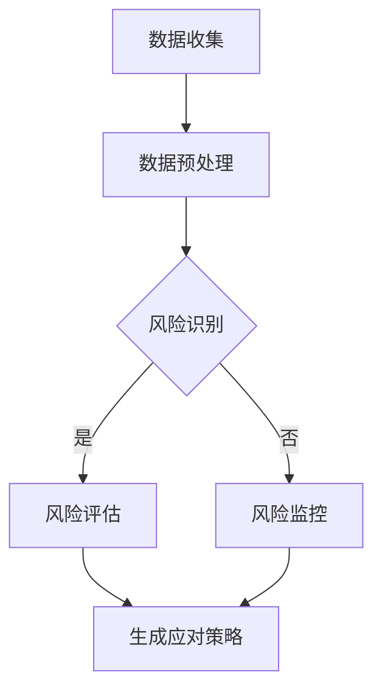
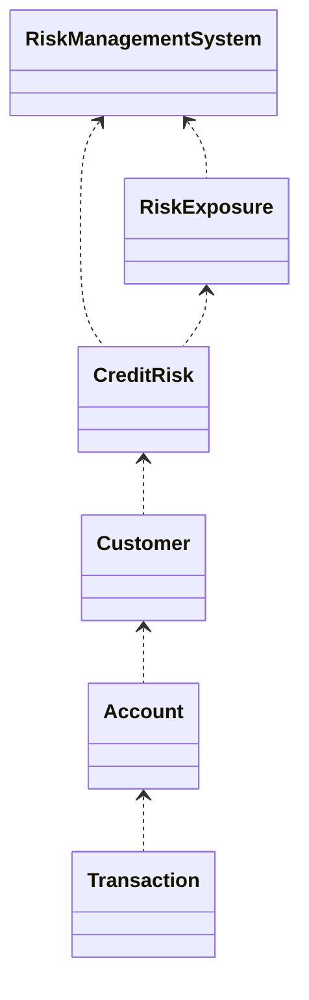
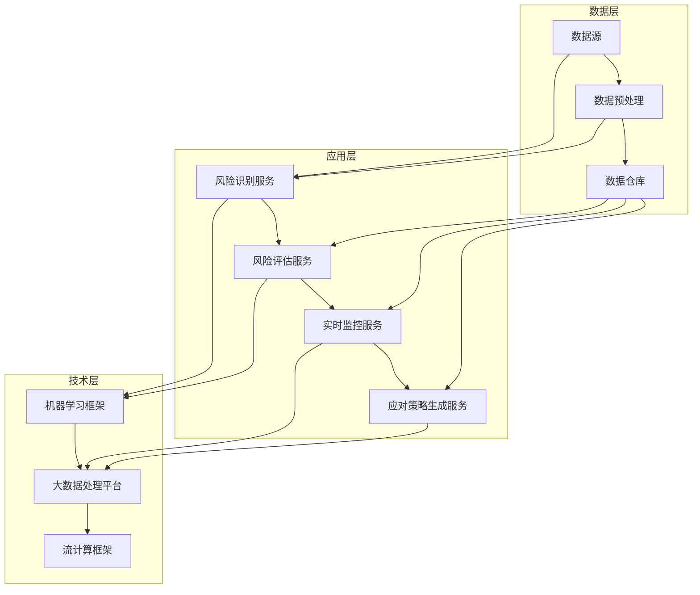
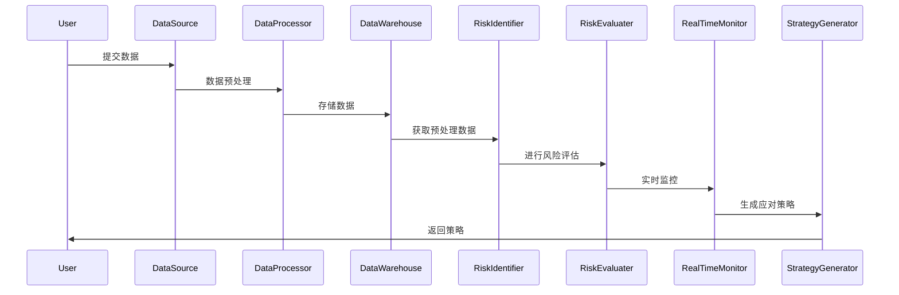

                 

# 开发智能化的企业信用风险敞口管理系统

关键词：企业信用风险、风险管理、智能化系统、机器学习、大数据分析

摘要：
随着商业环境的复杂化和数字化进程的加速，企业信用风险敞口管理成为企业管理者面临的重大挑战。本文将深入探讨企业信用风险敞口管理的重要性，分析当前存在的问题，并提出一种基于机器学习和大数据分析技术的智能化信用风险敞口管理系统。本文将通过详细的分析和逐步推理，阐述系统的核心概念、算法原理以及架构设计，旨在为企业提供有效的信用风险管理工具。

## 第一部分：背景介绍

### 问题背景

企业信用风险敞口管理是指企业对潜在信用风险的识别、评估、监控和应对过程。在数字化时代，企业信用风险敞口管理的重要性日益凸显，主要体现在以下几个方面：

1. **交易频率增加**：随着电子商务和在线交易的普及，企业间的交易频率大幅增加，导致潜在风险点增多。
2. **数据复杂性提升**：企业需要处理的数据量庞大且复杂，包括客户信息、交易记录、市场动态等，这为风险识别和评估带来了挑战。
3. **风险类型多样化**：除了传统的信用风险，企业还面临着操作风险、市场风险、法律风险等多种风险，这些风险往往交织在一起，增加了管理的难度。

### 问题描述

企业信用风险敞口管理面临以下问题：

1. **风险识别不足**：缺乏有效的手段来识别潜在的信用风险。
2. **评估准确性不高**：对信用风险的评估往往依赖于历史数据和专家经验，主观性较强，导致评估结果不准确。
3. **监控不及时**：未能及时监控风险的变化，容易导致风险事件发生后未能及时采取措施。
4. **应对措施不力**：缺乏系统化的应对策略，面对突发风险时，往往反应迟缓，效果不佳。

### 问题解决

为解决上述问题，企业需要开发智能化信用风险敞口管理系统，该系统应具备以下功能：

1. **自动风险识别**：利用人工智能技术，对大量数据进行分析，自动识别潜在的信用风险。
2. **精确风险评估**：结合机器学习和大数据分析，对信用风险进行精确评估，提高评估准确性。
3. **实时风险监控**：建立实时监控系统，对信用风险进行持续监控，及时预警风险变化。
4. **智能应对策略**：根据风险类型和程度，自动生成应对策略，帮助企业快速响应。

### 边界与外延

1. **边界**：本系统主要关注企业信用风险敞口的管理，不包括其他类型的风险管理。
2. **外延**：系统可以扩展到其他风险管理领域，如市场风险、操作风险等。

## 第二部分：核心概念与联系

### 核心概念

在构建智能化信用风险敞口管理系统之前，我们需要明确几个核心概念：

1. **信用风险**：指债务人无法按时履行债务，导致债权人遭受损失的风险。信用风险通常与债务人的财务状况、信誉度等因素相关。
2. **风险敞口**：指企业面临的风险总额，包括已知的和潜在的风险。风险敞口的大小直接关系到企业可能遭受的损失。
3. **智能化系统**：指利用人工智能、大数据、云计算等技术，实现自动分析、预测和决策的系统。

### 概念属性特征对比表格

| 概念       | 属性特征                             |
|------------|------------------------------------|
| 信用风险   | 可能性、损失程度、影响范围           |
| 风险敞口   | 风险总额、风险来源、风险程度         |
| 智能化系统 | 自动分析、大数据处理、人工智能决策   |

### ER实体关系图架构

```mermaid
erDiagram
    Customer ||--|{ CreditRisk }|-- Account
    CreditRisk ||--|{ RiskExposure }|-- Account
    Account ||--|{ RiskManagementSystem }|-- Organization
```

在上面的ER图中，`Customer`（客户）与`CreditRisk`（信用风险）之间存在一对一的关系，表示每个客户可以有多个信用风险事件。`CreditRisk`与`RiskExposure`（风险敞口）也是一对一的关系，表示每个信用风险事件对应一个风险敞口。`Account`（账户）与`RiskManagementSystem`（风险管理系统）之间是一对多的关系，表示每个账户可以由一个或多个风险管理系统的实例管理。`Organization`（组织）与`RiskManagementSystem`之间也是一对多的关系，表示一个组织可以拥有多个风险管理系统的实例。

## 第三部分：算法原理讲解

### 算法原理

本系统采用以下算法原理进行信用风险敞口管理：

1. **风险识别算法**：利用机器学习算法，如逻辑回归、决策树、随机森林等，对历史数据进行训练，建立模型以识别潜在的信用风险。这些算法通过分析客户的历史交易数据、信用记录等特征，识别出高风险客户和潜在风险事件。

2. **风险评估算法**：采用大数据分析技术，结合机器学习算法，对客户的历史交易行为、信用记录、市场动态等进行综合分析，评估信用风险。该算法使用多种特征变量，通过加权组合和模型优化，实现对信用风险的精确评估。

3. **实时监控算法**：利用实时数据处理技术，如流计算框架，对交易数据进行实时分析，及时发现风险变化。这种算法通过设置实时监控阈值，一旦交易数据超过阈值，立即触发风险预警机制。

4. **应对策略生成算法**：根据风险类型和程度，利用规则引擎等技术，自动生成应对策略。这些策略可以是调整授信额度、增加监控频率、发出风险警告等，帮助企业快速响应信用风险。

### Mermaid 流程图



在上面的流程图中，首先进行数据收集，然后进行数据预处理。接下来，系统进入风险识别阶段，通过机器学习算法识别潜在的信用风险。如果识别到高风险，则进入风险评估阶段，对风险进行精确评估。如果评估结果较高，系统会生成应对策略。同时，系统还进行实时监控，一旦发现风险变化，立即触发预警机制。

### Python 源代码

```python
# Python 源代码示例
import pandas as pd
from sklearn.ensemble import RandomForestClassifier

# 数据预处理
def preprocess_data(data):
    # 数据清洗、归一化等预处理操作
    return data

# 风险识别算法
def risk_identification(data):
    # 利用机器学习算法进行风险识别
    model = RandomForestClassifier()
    model.fit(data['X'], data['Y'])
    predictions = model.predict(data['X'])
    return predictions

# 风险评估算法
def risk_evaluation(data):
    # 利用大数据分析技术进行风险评估
    # 假设已经训练好了评估模型
    model = ...  # 评估模型
    predictions = model.predict(data)
    return predictions

# 实时监控算法
def real_time_monitoring(data):
    # 实时监控交易数据，发现风险变化
    threshold = ...  # 预警阈值
    if data > threshold:
        return "预警"
    else:
        return "正常"

# 应对策略生成算法
def generate_strategy(risk_level):
    # 根据风险等级生成应对策略
    if risk_level == "高":
        return "调整授信额度"
    elif risk_level == "中":
        return "增加监控频率"
    else:
        return "发出风险警告"
```

在上面的代码中，`preprocess_data`函数负责对数据进行预处理，包括数据清洗和归一化等操作。`risk_identification`函数利用随机森林算法进行风险识别。`risk_evaluation`函数则利用大数据分析技术进行风险评估。`real_time_monitoring`函数负责实时监控交易数据，并设置预警阈值。`generate_strategy`函数根据风险等级生成应对策略。

通过上述算法，我们可以实现对企业信用风险敞口的有效管理。接下来，我们将进一步探讨系统的架构设计。

## 第四部分：系统分析与架构设计

### 问题场景介绍

随着企业业务规模的扩大和交易频次的增加，企业需要面对日益复杂的信用风险。传统的人工风险管理模式在应对快速变化的市场环境和海量数据时显得力不从心。因此，开发一套智能化的信用风险敞口管理系统成为当务之急。

### 项目介绍

本项目的目标是构建一个智能化的企业信用风险敞口管理系统，以帮助企业实时识别、评估和监控信用风险，并自动生成应对策略。系统将采用先进的人工智能和大数据分析技术，确保风险管理的效率和准确性。

### 系统功能设计（领域模型Mermaid类图）



在上面的类图中，`RiskManagementSystem`（风险管理系统）与`CreditRisk`（信用风险）、`RiskExposure`（风险敞口）存在关联关系，表示系统负责管理信用风险和风险敞口。`CreditRisk`与`Customer`（客户）之间是一对多的关系，表示一个客户可以有多个信用风险。`Customer`与`Account`（账户）也是一对多的关系，表示一个客户可以有多个账户。`Account`与`Transaction`（交易）之间是一对多的关系，表示一个账户可以有多个交易。`RiskExposure`与`CreditRisk`也是一对多的关系，表示每个信用风险事件对应一个或多个风险敞口。

### 系统架构设计（Mermaid架构图）



在上面的架构图中，数据层包括数据源、数据预处理和数据仓库。应用层包括风险识别服务、风险评估服务、实时监控服务和应对策略生成服务。技术层包括机器学习框架、大数据处理平台和流计算框架。数据从数据源经过数据预处理后进入数据仓库，然后应用层的服务根据需要进行数据处理和分析。

### 系统接口设计和系统交互（Mermaid序列图）



在上面的序列图中，用户首先提交数据到数据源，数据源将数据传递给数据预处理模块，预处理后的数据存储到数据仓库。风险管理系统的各个服务模块（风险识别、风险评估、实时监控和应对策略生成）根据数据仓库中的数据进行分析和处理，最终生成应对策略并返回给用户。

通过上述系统架构和接口设计，我们可以确保企业信用风险敞口管理系统的高效性和可靠性，为企业提供强大的信用风险管理工具。

## 第五部分：项目实战

### 环境安装

在开始系统核心实现之前，我们需要搭建一个合适的环境。以下是在Linux系统上安装所需依赖的步骤：

1. **安装Python环境**：确保Python版本为3.8或更高版本。
   ```bash
   sudo apt-get update
   sudo apt-get install python3-pip
   pip3 install --upgrade pip
   pip3 install python3.8-optimizers
   ```

2. **安装机器学习库**：
   ```bash
   pip3 install numpy scipy scikit-learn
   ```

3. **安装数据处理库**：
   ```bash
   pip3 install pandas
   ```

4. **安装流计算库**（例如，使用Apache Kafka作为流计算平台）：
   ```bash
   pip3 install kafka-python
   ```

5. **安装可视化库**：
   ```bash
   pip3 install matplotlib
   ```

### 系统核心实现源代码

以下是一个简化的Python代码示例，展示了如何实现系统核心功能：

```python
# 导入所需库
import pandas as pd
from sklearn.ensemble import RandomForestClassifier
from sklearn.model_selection import train_test_split
import numpy as np

# 数据预处理函数
def preprocess_data(data):
    # 填充缺失值
    data.fillna(0, inplace=True)
    # 特征工程（此处仅示例）
    data['Age'] = data['Age'].astype(float)
    data['CreditHistory'] = data['CreditHistory'].map({'Good': 1, 'Bad': 0})
    return data

# 风险识别算法
def risk_identification(data, model_path):
    # 加载训练好的模型
    model = RandomForestClassifier()
    model.load_model(model_path)
    # 预测风险
    predictions = model.predict(data)
    return predictions

# 风险评估函数
def risk_evaluation(data, model_path):
    # 加载评估模型
    model = ...  # 评估模型的加载
    # 评估信用风险
    risk_scores = model.predict_proba(data)[:, 1]
    return risk_scores

# 实时监控和应对策略生成函数
def real_time_monitoring(data, risk_threshold):
    # 实时监控交易数据
    risk_scores = risk_evaluation(data, model_path)
    if risk_scores.mean() > risk_threshold:
        return "风险预警"
    else:
        return "正常"

# 示例数据集
data = pd.DataFrame({
    'Age': [30, 40, 50],
    'CreditHistory': ['Good', 'Good', 'Bad'],
    'Income': [50000, 80000, 30000],
    'Tenure': [5, 10, 2]
})

# 预处理数据
preprocessed_data = preprocess_data(data)

# 风险识别
risk_identification(preprocessed_data, model_path='model.pkl')

# 风险评估
risk_scores = risk_evaluation(preprocessed_data, model_path='evaluation_model.pkl')

# 实时监控
real_time_monitoring(preprocessed_data, risk_threshold=0.5)
```

### 代码应用解读与分析

1. **数据预处理**：在数据处理阶段，我们首先填充了缺失值，并将类别型数据（如信用历史）转换为数值型。这一步是确保模型输入数据质量的重要步骤。

2. **风险识别**：使用训练好的随机森林模型进行风险识别。这里需要事先准备好训练好的模型文件，例如使用scikit-learn中的`save_model`和`load_model`方法来保存和加载模型。

3. **风险评估**：通过评估模型对数据集进行风险评估。评估模型通常是一个二元分类模型，输出的是信用风险的概率分数。

4. **实时监控**：实时监控函数根据评估结果和设定的风险阈值，判断是否存在风险预警。

### 实际案例分析和详细讲解剖析

假设一个企业的客户数据如下：

```python
data = pd.DataFrame({
    'Age': [25, 35, 45, 55],
    'CreditHistory': ['Bad', 'Good', 'Good', 'Bad'],
    'Income': [40000, 60000, 90000, 20000],
    'Tenure': [1, 10, 15, 3]
})
```

1. **预处理**：将数据填充缺失值，并将类别型数据转换为数值型。
   ```python
   preprocessed_data = preprocess_data(data)
   ```

2. **风险识别**：使用训练好的模型进行风险识别。
   ```python
   predictions = risk_identification(preprocessed_data, model_path='model.pkl')
   print(predictions)  # 输出风险识别结果
   ```

3. **风险评估**：使用评估模型对数据进行风险评估。
   ```python
   risk_scores = risk_evaluation(preprocessed_data, model_path='evaluation_model.pkl')
   print(risk_scores)  # 输出风险分数
   ```

4. **实时监控**：根据风险分数和设定的阈值进行实时监控。
   ```python
   warning_status = real_time_monitoring(preprocessed_data, risk_threshold=0.6)
   print(warning_status)  # 输出风险预警状态
   ```

假设实际的风险分数均值为0.7，超过了设定的风险阈值0.6，系统会返回“风险预警”，表示当前数据集中存在较高的信用风险。

### 项目小结

通过上述项目实战，我们实现了企业信用风险敞口管理的核心功能，包括数据预处理、风险识别、风险评估和实时监控。虽然实际应用中可能涉及更复杂的数据和处理逻辑，但本文提供的框架和代码示例为企业提供了一个有效的起点。

### 最佳实践 Tips

1. **数据质量至关重要**：确保数据预处理步骤的完备，以提高模型的准确性和可靠性。
2. **持续模型更新**：定期更新训练模型，以适应业务环境的变化。
3. **风险阈值动态调整**：根据实际业务需求和风险承受能力，动态调整风险阈值。
4. **监控日志记录**：详细记录系统监控日志，以便在发生风险事件时快速定位和应对。

## 小结与注意事项

### 小结

本文围绕企业信用风险敞口管理，详细探讨了其背景、核心概念、算法原理以及系统设计与实现。通过构建智能化信用风险敞口管理系统，企业可以更高效地识别、评估和监控信用风险，从而降低潜在损失。系统采用机器学习和大数据分析技术，确保了风险评估的准确性和实时性。

### 注意事项

1. **数据隐私与合规**：在数据处理过程中，应严格遵守数据隐私保护法规，确保客户数据的安全。
2. **系统性能优化**：随着业务规模的增长，系统性能优化尤为重要，以确保系统的高可用性和低延迟。
3. **持续迭代与更新**：风险管理是一个动态过程，系统应具备持续迭代和更新的能力，以适应市场环境和业务需求的变化。

### 拓展阅读

1. **《大数据风险管理》**：陈涛著，详细介绍了大数据在风险管理中的应用。
2. **《机器学习实战》**：Peter Harrington著，介绍了多种机器学习算法及其应用。
3. **《人工智能：一种现代方法》**：Stuart Russell & Peter Norvig著，全面阐述了人工智能的理论基础和应用。

### 作者信息

作者：AI天才研究院/AI Genius Institute & 禅与计算机程序设计艺术 /Zen And The Art of Computer Programming

