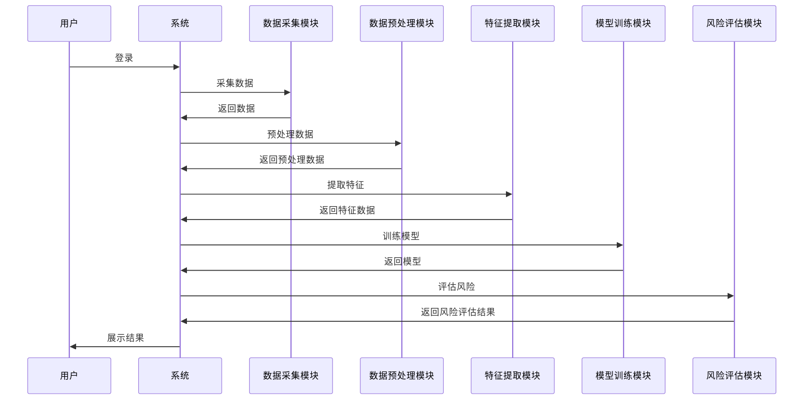

                 

# 开发智能化的企业信用风险评估模型

## 关键词

- 企业信用风险评估
- 智能化模型
- 数据分析
- 风险管理
- 机器学习算法

## 摘要

随着商业活动的日益复杂化和全球化，企业信用风险评估变得尤为重要。传统的信用评估方法已经难以满足现代企业对于风险预测和管理的需求。本文将探讨如何开发智能化的企业信用风险评估模型。我们将从问题背景、问题描述、问题解决、边界与外延、核心概念与联系等多个角度进行深入分析，并提出详细的解决方案。本文的目标是帮助读者理解智能化信用风险评估模型的构建过程，掌握核心技术和方法，并能够应用于实际项目中。

## 目录大纲

### 第一部分：引言

#### 1.1 问题背景
##### 1.1.1 信用风险评估的重要性
##### 1.1.2 传统信用风险评估的挑战
##### 1.1.3 智能化信用风险评估的必要性

#### 1.2 问题描述
##### 1.2.1 企业信用评估需求
##### 1.2.2 信用风险评估的目标
##### 1.2.3 数据来源与数据质量

#### 1.3 问题解决
##### 1.3.1 智能化信用风险评估模型设计
##### 1.3.2 算法选择与实现
##### 1.3.3 数据预处理与特征提取

#### 1.4 边界与外延
##### 1.4.1 适用行业与场景
##### 1.4.2 模型限制与优化空间

#### 1.5 核心概念与联系
##### 1.5.1 信用评分模型
##### 1.5.2 风险评估方法
##### 1.5.3 数据分析与挖掘

#### 1.6 本章小结

### 第二部分：智能化信用风险评估模型原理

#### 2.1 核心概念原理
##### 2.1.1 概念解释
##### 2.1.2 概念属性特征对比
##### 2.1.3 关键技术与算法

#### 2.2 算法原理讲解
##### 2.2.1 算法概述
##### 2.2.2 数学模型与公式
##### 2.2.3 例子说明

#### 2.3 数据分析与挖掘
##### 2.3.1 数据来源
##### 2.3.2 数据预处理
##### 2.3.3 特征提取与选择

#### 2.4 模型评估与优化
##### 2.4.1 模型评估指标
##### 2.4.2 模型优化方法
##### 2.4.3 模型选择与调优

#### 2.5 核心概念与联系
##### 2.5.1 相关概念梳理
##### 2.5.2 概念间联系与差异
##### 2.5.3 智能化信用风险评估流程

#### 2.6 本章小结

### 第三部分：智能化信用风险评估项目实战

#### 3.1 项目介绍
##### 3.1.1 项目背景
##### 3.1.2 项目目标
##### 3.1.3 项目实现步骤

#### 3.2 系统功能设计
##### 3.2.1 领域模型设计
##### 3.2.2 功能模块划分
##### 3.2.3 用户界面设计

#### 3.3 系统架构设计
##### 3.3.1 架构概述
##### 3.3.2 系统组件设计
##### 3.3.3 系统集成与测试

#### 3.4 系统接口设计
##### 3.4.1 接口规范
##### 3.4.2 接口实现
##### 3.4.3 接口测试

#### 3.5 系统交互设计
##### 3.5.1 用户交互流程
##### 3.5.2 数据处理流程
##### 3.5.3 系统交互mermaid序列图

#### 3.6 核心实现源代码
##### 3.6.1 代码结构
##### 3.6.2 关键代码解读
##### 3.6.3 应用解读与分析

#### 3.7 实际案例分析与讲解
##### 3.7.1 案例背景
##### 3.7.2 案例实施过程
##### 3.7.3 案例分析结果

#### 3.8 项目小结
##### 3.8.1 项目成果
##### 3.8.2 经验与启示
##### 3.8.3 拓展与改进方向

#### 3.9 本章小结

### 第四部分：智能化信用风险评估最佳实践与优化策略

#### 4.1 最佳实践 tips
##### 4.1.1 数据收集与处理
##### 4.1.2 模型训练与优化
##### 4.1.3 模型部署与维护

#### 4.2 注意事项
##### 4.2.1 数据隐私保护
##### 4.2.2 模型过拟合与欠拟合
##### 4.2.3 模型解释性与可解释性

#### 4.3 拓展阅读
##### 4.3.1 相关文献推荐
##### 4.3.2 开源工具与框架
##### 4.3.3 行业动态与趋势

#### 4.4 本章小结

### 第五部分：结论与展望

#### 5.1 本书总结
##### 5.1.1 主要内容回顾
##### 5.1.2 技术发展趋势

##### 5.2 未来展望
##### 5.2.1 技术创新
##### 5.2.2 行业应用

### 5.3 本章小结

---

**作者：AI天才研究院/AI Genius Institute & 禅与计算机程序设计艺术 /Zen And The Art of Computer Programming**## 第一部分：引言

### 1.1 问题背景

在当今的商业环境中，信用风险评估已成为企业运营管理的重要组成部分。企业信用风险评估是指通过对企业信用记录、财务状况、市场表现等多方面信息的综合分析，评估企业在未来偿还债务的能力。信用风险的存在不仅影响企业的融资成本，还可能对企业的长期发展造成重大影响。

传统的信用风险评估方法主要依赖于人工经验和静态的指标体系，如企业的财务报表、历史信用记录等。这种方法在一定程度上能够提供风险预警，但其准确性和实时性都存在局限。随着商业环境的复杂化和数据量的急剧增加，传统方法逐渐暴露出以下挑战：

1. **数据依赖性高**：传统方法往往依赖于特定类型的数据源，如财务报表，这些数据可能不完整或不实时。
2. **主观性强**：风险评估往往受到评估者主观判断的影响，导致评估结果不一致。
3. **响应速度慢**：传统方法通常需要较长时间来收集和分析数据，无法满足快速决策的需求。

面对这些挑战，智能化信用风险评估模型应运而生。这种模型通过利用先进的数据分析技术和机器学习算法，能够更准确地识别风险，提高决策效率。智能化模型不仅能够处理大量数据，还能够从历史数据中学习，预测未来的信用风险，为企业的风险管理提供强有力的支持。

### 1.1.1 信用风险评估的重要性

信用风险评估对于企业的经营具有深远的意义：

1. **融资决策**：良好的信用评分可以降低企业的融资成本，提高融资成功率。
2. **合作伙伴选择**：通过对潜在合作伙伴的信用评估，企业可以降低交易风险，选择信誉良好的合作伙伴。
3. **信用管理**：定期进行信用评估可以帮助企业了解自身的信用状况，及时调整信用管理策略。
4. **风险控制**：通过信用风险评估，企业可以识别潜在的风险点，采取预防措施，降低信用损失。

此外，信用风险评估对于金融机构和企业来说都至关重要：

- **金融机构**：信用风险评估是金融机构信贷管理的基础，可以帮助银行、保险公司等金融机构合理配置信贷资源，控制信贷风险。
- **企业**：企业通过信用评估可以更好地掌握市场动态，优化供应链管理，提高业务稳定性。

### 1.1.2 传统信用风险评估的挑战

传统信用风险评估面临以下几个主要挑战：

1. **数据来源受限**：传统方法主要依赖于企业历史财务报表和信用记录等数据源，这些数据可能不全面或不实时。
2. **分析手段有限**：传统方法通常基于专家经验和简单的统计模型，难以处理复杂的数据关系。
3. **响应速度慢**：数据收集、整理和分析需要较长时间，无法满足实时决策的需要。
4. **主观判断影响**：评估结果容易受到评估者个人经验和主观判断的影响，导致评估结果不一致。

### 1.1.3 智能化信用风险评估的必要性

智能化信用风险评估能够解决传统方法的诸多局限，其必要性体现在以下几个方面：

1. **数据驱动的决策**：智能化模型能够处理和分析大量复杂数据，提供更加精准和实时的风险评估。
2. **自动化的风险预测**：通过机器学习算法，模型可以自动从历史数据中学习，预测未来的信用风险趋势。
3. **减少人为误差**：智能化模型通过算法和数据分析，减少了评估过程中的主观判断和误差。
4. **实时风险监控**：智能化模型可以实现实时数据监控和风险预警，提高企业的风险响应速度。

综上所述，智能化信用风险评估在当前商业环境中具有显著的优越性和必要性。通过本文的深入探讨，我们将详细阐述如何构建和实现这样的智能化模型，帮助企业和金融机构更好地应对信用风险。

### 1.2 问题描述

在当前的商业环境中，企业信用风险评估需求日益增长，但其复杂性和多样性也提出了新的挑战。为了更系统地理解和解决这一问题，我们首先需要明确企业信用评估的需求和目标，以及数据来源与数据质量的问题。

#### 1.2.1 企业信用评估需求

企业信用评估需求主要可以从以下几个方面进行阐述：

1. **融资能力评估**：企业需要了解自身在金融市场上的信用状况，以便获取贷款、发行债券等融资手段。良好的信用评分能够降低融资成本，提高融资成功率。
2. **合作伙伴评估**：企业在选择合作伙伴时，需要对对方的信用记录和履约能力进行评估，以降低交易风险。
3. **内部信用管理**：企业需要定期进行信用评估，以便及时调整信用管理策略，降低坏账率，优化财务状况。
4. **风险预警与控制**：通过信用评估，企业可以及时发现潜在的风险点，采取预防措施，避免信用损失。

不同类型的企业对于信用评估的需求存在差异。例如，初创企业可能更关注市场潜力和成长潜力，而成熟企业则更多关注财务健康和还款能力。此外，金融机构在评估贷款申请者时，还需要考虑宏观经济环境和行业趋势等因素。

#### 1.2.2 信用风险评估的目标

信用风险评估的目标主要包括以下几点：

1. **准确性**：评估结果需要准确反映企业的信用风险，降低误判率。
2. **实时性**：能够实时获取和分析企业的信用数据，及时调整风险评估模型。
3. **全面性**：评估模型应能够综合考虑多种因素，包括财务指标、市场表现、管理状况等。
4. **可解释性**：评估结果应具备一定的可解释性，便于企业和管理者理解风险因素。

一个理想的信用评估模型应能够在多个维度上为企业提供全面的风险分析，帮助企业做出更明智的决策。

#### 1.2.3 数据来源与数据质量

信用风险评估的有效性高度依赖于数据的来源和质量。以下是一些常见的数据来源和数据质量相关的问题：

1. **数据来源**：
   - **内部数据**：包括企业的财务报表、交易记录、合同执行情况等。这些数据通常最为准确，但获取难度较大。
   - **外部数据**：包括公开的市场信息、行业报告、信用评级机构的数据等。这些数据可以提供更全面的视角，但可能存在时效性和可靠性问题。
   - **第三方数据**：通过第三方数据服务商获取的企业信用数据、社交媒体数据等。这些数据可以提供补充信息，但同样需要评估其准确性和可信度。

2. **数据质量**：
   - **完整性**：数据是否完整，是否存在缺失值或异常值。
   - **准确性**：数据是否真实、可靠，是否经过校验。
   - **一致性**：不同来源的数据是否在同一时间范围内有效，是否存在矛盾。
   - **时效性**：数据是否为最新，是否反映了最新的市场情况。

数据质量直接影响信用评估模型的性能。高质量的信用数据可以显著提高评估的准确性，而低质量数据可能导致误判和错误决策。

### 1.3 问题解决

为了应对企业信用评估的复杂性和多样性，开发一个智能化的信用风险评估模型是必要的。以下将从模型设计、算法选择、数据预处理和特征提取等方面详细讨论解决方案。

#### 1.3.1 智能化信用风险评估模型设计

智能化信用风险评估模型的设计需要综合考虑数据来源、风险评估目标和数据处理技术。以下是模型设计的几个关键步骤：

1. **需求分析**：明确企业信用评估的需求，包括融资能力评估、合作伙伴评估、内部信用管理和风险预警等方面。
2. **数据收集**：确定数据来源，包括内部数据和外部数据，确保数据的完整性和准确性。
3. **数据处理**：对收集到的数据进行清洗、整合和标准化，消除数据中的噪声和异常值。
4. **特征提取**：从原始数据中提取有助于信用评估的特征，如财务指标、市场表现、管理水平等。
5. **模型构建**：选择合适的机器学习算法，构建信用风险评估模型。
6. **模型训练与优化**：使用历史数据训练模型，并通过交叉验证和调参优化模型性能。
7. **模型部署**：将训练好的模型部署到实际应用环境中，进行实时风险评估。

#### 1.3.2 算法选择与实现

选择合适的算法是实现智能化信用风险评估的关键。以下是一些常用的算法和其适用场景：

1. **线性回归模型**：适用于线性关系较强的信用评分任务，可以简单快速地评估企业的信用风险。
2. **逻辑回归模型**：适用于分类问题，可以将企业的信用风险划分为不同的等级。
3. **决策树和随机森林**：能够处理复杂的多维数据，具有较强的分类和预测能力。
4. **支持向量机（SVM）**：适用于高维数据，能够在分类任务中实现较高的准确率。
5. **神经网络和深度学习模型**：能够处理大规模数据和复杂的非线性关系，适用于复杂信用风险评估任务。

具体实现时，可以根据数据特性和评估目标选择合适的算法。例如，对于大型企业，可以使用神经网络或深度学习模型，因为它们能够处理大量的多维数据。

#### 1.3.3 数据预处理与特征提取

数据预处理是信用风险评估模型构建的重要环节。以下是数据预处理和特征提取的几个关键步骤：

1. **数据清洗**：去除重复记录、缺失值填充、异常值处理等，确保数据的一致性和完整性。
2. **数据标准化**：将不同单位和尺度上的数据进行归一化或标准化，以便模型处理。
3. **特征提取**：从原始数据中提取有助于信用评估的特征，如财务指标（资产负债率、流动比率等）、市场表现指标（营收增长率、市场份额等）和管理指标（管理层稳定性、内部审计结果等）。
4. **特征选择**：通过特征选择技术（如信息增益、主成分分析等）筛选出对信用评估最具影响力的特征，减少特征维度，提高模型效率。

数据预处理和特征提取的目的是提高模型的准确性和鲁棒性，减少噪声数据对评估结果的影响。

#### 1.4 边界与外延

在开发智能化信用风险评估模型时，需要明确其适用的行业和场景，以及模型的限制和优化空间。

1. **适用行业与场景**：
   - **金融行业**：银行、保险、投资等金融机构在进行贷款审批、信用评级时，智能化信用评估模型能够提供有力的支持。
   - **供应链管理**：企业可以通过信用评估选择信誉良好的供应商，降低供应链风险。
   - **市场营销**：企业可以利用信用评估结果优化客户分类和营销策略，提高客户满意度。

2. **模型限制与优化空间**：
   - **数据依赖性**：模型性能高度依赖于数据质量，因此需要定期更新和维护数据源。
   - **过拟合与欠拟合**：需要通过调参和交叉验证等方法避免模型过拟合或欠拟合。
   - **模型解释性**：尽管机器学习模型具有较强的预测能力，但其内部决策过程通常不透明，需要结合可解释性技术提高模型的透明度。

#### 1.5 核心概念与联系

在智能化信用风险评估模型中，以下几个核心概念和联系至关重要：

1. **信用评分模型**：用于评估企业信用风险，包括线性回归、逻辑回归、决策树等模型。
2. **风险评估方法**：包括定量评估和定性评估，定量评估依赖于统计方法和机器学习算法，定性评估依赖于专家经验和主观判断。
3. **数据分析与挖掘**：利用统计分析和数据挖掘技术，提取有助于信用评估的特征，构建和优化风险评估模型。

这些概念相互联系，共同构成了智能化信用风险评估的理论基础。

### 1.6 本章小结

本节通过详细分析信用风险评估的重要性、传统方法的挑战以及智能化模型的需求，为后续的内容奠定了基础。我们明确了企业信用评估的需求和目标，讨论了数据来源与数据质量的问题，并提出了智能化信用风险评估模型的设计和实现方案。在接下来的章节中，我们将深入探讨模型的核心概念、原理和具体实现方法，帮助读者全面理解并掌握这一领域的关键技术和应用。

---

### 1.7 核心概念与联系

在开发智能化企业信用风险评估模型的过程中，理解并掌握以下几个核心概念及其相互联系是非常重要的。以下是这些核心概念的定义、属性特征对比以及关键技术的简要介绍。

#### 1.7.1 信用评分模型

**定义**：信用评分模型是一种定量评估企业信用风险的方法。它通过分析企业的历史数据、财务状况、市场表现等多方面信息，利用统计模型或机器学习算法预测企业未来的违约概率。

**属性特征对比**：

| 特征             | 信用评分模型                | 传统评分模型                |
|-----------------|----------------------------|----------------------------|
| 数据依赖性       | 高度依赖大数据和机器学习算法 | 依赖于专家经验和静态指标    |
| 实时性           | 能够实现实时风险评估       | 通常需要较长时间的数据处理和分析 |
| 精准性           | 通过数据分析提供更精准的预测 | 受限于数据和模型能力         |
| 主观判断影响     | 减少主观判断，降低误差      | 评估结果容易受主观判断影响   |

**关键技术**：

- **机器学习算法**：如线性回归、逻辑回归、决策树、随机森林、神经网络等。
- **特征工程**：通过提取和选择与信用评估相关的特征，提高模型性能。

#### 1.7.2 风险评估方法

**定义**：风险评估方法是指用于评估和量化企业信用风险的一系列技术和策略。它包括定量评估和定性评估两种方法。

**属性特征对比**：

| 特征             | 定量评估                      | 定性评估                      |
|-----------------|------------------------------|------------------------------|
| 数据依赖性       | 高度依赖统计数据和模型        | 主要依赖专家经验和专业知识    |
| 实时性           | 通常能够实现实时风险评估      | 评估过程通常较慢              |
| 精准性           | 能够提供具体的量化结果        | 评估结果主观性较强            |
| 主观判断影响     | 减少主观判断，降低误差        | 评估结果容易受主观判断影响    |

**关键技术**：

- **统计方法**：如回归分析、聚类分析、时间序列分析等。
- **专家系统**：基于专家经验和专业知识构建的评估系统。

#### 1.7.3 数据分析与挖掘

**定义**：数据分析与挖掘是指从大量数据中提取有价值信息和知识的过程。它广泛应用于企业信用风险评估中，通过分析企业的历史数据和外部信息，识别风险因素和趋势。

**属性特征对比**：

| 特征             | 数据分析                      | 数据挖掘                      |
|-----------------|------------------------------|------------------------------|
| 目标             | 提取数据中的有用信息          | 从数据中发现隐藏的模式和规律    |
| 数据依赖性       | 对数据质量要求较高            | 对数据量的要求更高             |
| 实时性           | 可以实时或近实时处理数据      | 通常处理大量历史数据           |
| 精准性           | 结果的准确性依赖于数据质量    | 能够发现潜在的复杂关系和模式    |
| 主观判断影响     | 较少依赖主观判断              | 结果可能受到数据分析方法的影响 |

**关键技术**：

- **数据预处理**：包括数据清洗、整合、标准化等。
- **特征工程**：通过提取和选择与信用评估相关的特征，提高模型性能。
- **机器学习算法**：如决策树、随机森林、神经网络等。

#### 1.7.4 相关概念梳理

在构建智能化信用风险评估模型的过程中，以下相关概念需要加以梳理：

- **信用评分模型**：是核心评估工具，用于预测企业信用风险。
- **风险评估方法**：是信用评分模型的实现方法，包括定量和定性方法。
- **数据分析和挖掘**：提供数据支持和模型构建的基础，用于提取有价值信息和发现风险因素。

#### 1.7.5 概念间联系与差异

**联系**：

- **信用评分模型**和**风险评估方法**紧密相关，前者是后者的实现工具。
- **数据分析与挖掘**为**信用评分模型**提供数据支持和特征工程。

**差异**：

- **信用评分模型**更侧重于预测和评估，而**风险评估方法**更侧重于分析和策略。
- **数据分析与挖掘**是**信用评分模型**构建的基础，但本身不直接用于评估。

通过理解这些核心概念及其联系与差异，可以更系统地构建和优化智能化信用风险评估模型，提高其准确性和实时性。

### 1.8 本章小结

本章通过对企业信用风险评估的核心概念进行详细梳理和对比，帮助读者理解信用评分模型、风险评估方法和数据分析与挖掘的关键技术。我们明确了这些概念在智能化信用风险评估模型中的地位和作用，并阐述了它们之间的联系与差异。在接下来的章节中，我们将深入探讨智能化信用风险评估的原理、算法实现和数据预处理方法，为构建和优化这样的模型提供更具体的指导和实践案例。

---

### 1.9 本章小结

本章节围绕企业信用风险评估的背景、重要性、挑战以及智能化模型的必要性进行了详细探讨。我们明确了企业信用评估的需求和目标，分析了数据来源与数据质量的重要性，并提出了智能化信用风险评估模型的设计原则、算法选择及数据预处理方法。此外，通过对核心概念与联系的梳理，我们帮助读者建立了对智能化信用风险评估模型的整体理解。接下来，我们将进一步深入探讨智能化信用风险评估的原理、算法实现和数据预处理方法，以期提供更为具体的技术指导和实践案例。

---

### 第二部分：智能化信用风险评估模型原理

#### 2.1 核心概念原理

在深入探讨智能化信用风险评估模型之前，首先需要理解其核心概念和原理。以下是几个关键概念的详细解释、属性特征对比以及关键技术的简要概述。

#### 2.1.1 概念解释

1. **信用评分模型**：
   - **定义**：信用评分模型是一种定量评估企业信用风险的方法，通过分析企业的历史数据、财务状况和市场表现等，预测其未来违约的概率。
   - **功能**：为金融机构和企业在贷款审批、信用评级、信用管理等方面提供参考。

2. **风险评估方法**：
   - **定义**：风险评估方法是指用于评估和量化企业信用风险的一系列技术和策略，包括定量评估和定性评估。
   - **功能**：帮助企业和金融机构识别潜在风险，制定风险管理策略。

3. **数据分析与挖掘**：
   - **定义**：数据分析与挖掘是从大量数据中提取有价值信息和知识的过程，广泛应用于信用风险评估中。
   - **功能**：识别风险因素、发现趋势，为信用评分模型提供数据支持和特征工程。

#### 2.1.2 概念属性特征对比

| 概念              | 信用评分模型                         | 风险评估方法                         | 数据分析与挖掘                         |
|-----------------|------------------------------------|------------------------------------|------------------------------------|
| 数据依赖性       | 高度依赖历史数据和机器学习算法        | 部分依赖统计数据和专家经验             | 高度依赖复杂数据和数据分析技术           |
| 实时性           | 能够实现实时风险评估                 | 通常需要较长时间的数据处理和分析       | 可以实时或近实时处理数据               |
| 精准性           | 通过数据分析提供更精准的预测          | 结果的准确性依赖于数据和模型能力       | 能够发现潜在的复杂关系和模式           |
| 主观判断影响     | 减少主观判断，降低误差               | 受限于专家经验和主观判断               | 减少主观判断，提高客观性               |

#### 2.1.3 关键技术与算法

1. **信用评分模型**：
   - **线性回归**：用于预测企业违约概率的简单统计模型。
   - **逻辑回归**：用于将企业的信用风险分类的统计模型。
   - **决策树**：通过树形结构进行决策，适用于分类和回归任务。
   - **随机森林**：基于决策树的集成方法，提高模型的预测能力和鲁棒性。
   - **神经网络**：包括多层感知器和深度学习模型，用于复杂非线性关系的预测。

2. **风险评估方法**：
   - **统计方法**：如回归分析、聚类分析、时间序列分析等，用于定量评估。
   - **专家系统**：基于专家经验和专业知识，用于定性评估。
   - **风险评估模型**：如违约概率模型（PD模型）、违约损失模型（LGD模型）等，综合定量和定性评估。

3. **数据分析与挖掘**：
   - **数据预处理**：包括数据清洗、整合、标准化等，用于准备数据。
   - **特征工程**：通过提取和选择与信用评估相关的特征，提高模型性能。
   - **机器学习算法**：如决策树、随机森林、神经网络等，用于特征学习和风险预测。

通过理解这些核心概念和关键技术，我们能够更系统地构建和优化智能化信用风险评估模型，提高其准确性和实时性。

---

### 2.2 算法原理讲解

在构建智能化信用风险评估模型时，选择合适的算法是关键。以下是几种常用的信用风险评估算法的概述、数学模型与公式，以及具体例子说明。

#### 2.2.1 算法概述

1. **线性回归模型**：
   - **概述**：线性回归模型是一种简单的统计方法，通过拟合一条直线来预测企业的信用评分。它适用于线性关系较强的信用评分任务。
   - **数学模型与公式**：假设企业信用评分 \(Y\) 可以通过自变量 \(X_1, X_2, \ldots, X_n\) 的线性组合来预测，则线性回归模型可以表示为：
     $$
     Y = \beta_0 + \beta_1 X_1 + \beta_2 X_2 + \ldots + \beta_n X_n + \varepsilon
     $$
     其中，\(\beta_0\) 是截距，\(\beta_1, \beta_2, \ldots, \beta_n\) 是系数，\(\varepsilon\) 是误差项。

2. **逻辑回归模型**：
   - **概述**：逻辑回归模型是一种常用的分类方法，用于将企业的信用评分划分为不同的等级（如违约与未违约）。它适用于分类问题。
   - **数学模型与公式**：逻辑回归模型使用对数几率函数来表示预测概率：
     $$
     \ln\left(\frac{P(Y=1)}{1-P(Y=1)}\right) = \beta_0 + \beta_1 X_1 + \beta_2 X_2 + \ldots + \beta_n X_n
     $$
     其中，\(P(Y=1)\) 是企业违约的概率。

3. **决策树模型**：
   - **概述**：决策树模型通过一系列规则和决策节点来构建决策树，适用于分类和回归任务。
   - **数学模型与公式**：决策树模型基于信息增益或基尼系数等指标选择最佳分割特征，生成树形结构。

4. **随机森林模型**：
   - **概述**：随机森林是一种基于决策树的集成方法，通过构建多棵决策树并投票来提高预测性能。
   - **数学模型与公式**：随机森林在每个决策树上使用随机特征子集进行分割，最终通过多数投票得到预测结果。

5. **神经网络模型**：
   - **概述**：神经网络模型，特别是深度学习模型，可以处理复杂的多维数据和非线性关系。
   - **数学模型与公式**：神经网络通过多层神经元之间的加权连接和激活函数来模拟人脑的工作方式，输出预测结果。

#### 2.2.2 数学模型与公式

1. **线性回归模型**：
   $$
   Y = \beta_0 + \beta_1 X_1 + \beta_2 X_2 + \ldots + \beta_n X_n + \varepsilon
   $$

2. **逻辑回归模型**：
   $$
   \ln\left(\frac{P(Y=1)}{1-P(Y=1)}\right) = \beta_0 + \beta_1 X_1 + \beta_2 X_2 + \ldots + \beta_n X_n
   $$

3. **决策树模型**：
   - **分割准则**：
     $$
     \text{Gain}(A) = \sum_{i=1}^{n} p_i \cdot \ln(p_i)
     $$
     其中，\(p_i\) 是子集中类别 \(i\) 的比例。

4. **随机森林模型**：
   - **预测结果**：
     $$
     \hat{Y} = \frac{1}{m} \sum_{k=1}^{m} h_k(X)
     $$
     其中，\(h_k(X)\) 是第 \(k\) 棵决策树的预测结果，\(m\) 是树的数量。

5. **神经网络模型**：
   - **激活函数**：
     $$
     a_{i}^{(l)} = \sigma(z_{i}^{(l)})
     $$
     其中，\(z_{i}^{(l)}\) 是第 \(l\) 层第 \(i\) 个神经元的输入，\(\sigma\) 是激活函数，如ReLU、Sigmoid或Tanh。

#### 2.2.3 例子说明

1. **线性回归模型**：
   - **数据集**：假设我们有以下数据集，其中 \(X_1\) 和 \(X_2\) 是自变量，\(Y\) 是因变量。
     $$
     \begin{array}{ccc}
     X_1 & X_2 & Y \\
     \hline
     1 & 2 & 3 \\
     2 & 3 & 4 \\
     3 & 4 & 5 \\
     \end{array}
     $$
   - **模型训练**：
     $$
     Y = \beta_0 + \beta_1 X_1 + \beta_2 X_2 + \varepsilon
     $$
     通过最小化均方误差（MSE）来训练模型：
     $$
     J(\theta) = \frac{1}{2m} \sum_{i=1}^{m} (h_\theta(x^{(i)}) - y^{(i)})^2
     $$
   - **预测**：
     $$
     \hat{Y} = \beta_0 + \beta_1 X_1 + \beta_2 X_2
     $$

2. **逻辑回归模型**：
   - **数据集**：假设我们有以下数据集，其中 \(X_1\) 和 \(X_2\) 是自变量，\(Y\) 是二元因变量。
     $$
     \begin{array}{ccc}
     X_1 & X_2 & Y \\
     \hline
     1 & 2 & 0 \\
     2 & 3 & 1 \\
     3 & 4 & 0 \\
     \end{array}
     $$
   - **模型训练**：
     $$
     \ln\left(\frac{P(Y=1)}{1-P(Y=1)}\right) = \beta_0 + \beta_1 X_1 + \beta_2 X_2
     $$
     通过极大似然估计（MLE）来训练模型。
   - **预测**：
     $$
     P(Y=1) = \frac{1}{1 + \exp{(-\beta_0 - \beta_1 X_1 - \beta_2 X_2})}
     $$

3. **决策树模型**：
   - **数据集**：假设我们有以下数据集，其中 \(X_1\) 和 \(X_2\) 是自变量，\(Y\) 是二元因变量。
     $$
     \begin{array}{ccc}
     X_1 & X_2 & Y \\
     \hline
     1 & 2 & 0 \\
     2 & 3 & 1 \\
     3 & 4 & 0 \\
     \end{array}
     $$
   - **模型训练**：
     通过选择最佳分割特征和阈值来构建决策树。
   - **预测**：
     根据决策树的规则，逐层进行决策，最终得到预测结果。

4. **随机森林模型**：
   - **数据集**：假设我们有以下数据集，其中 \(X_1\) 和 \(X_2\) 是自变量，\(Y\) 是二元因变量。
     $$
     \begin{array}{ccc}
     X_1 & X_2 & Y \\
     \hline
     1 & 2 & 0 \\
     2 & 3 & 1 \\
     3 & 4 & 0 \\
     \end{array}
     $$
   - **模型训练**：
     构建多棵决策树，每棵树使用随机特征子集进行分割。
   - **预测**：
     通过多数投票得到最终预测结果。

5. **神经网络模型**：
   - **数据集**：假设我们有以下数据集，其中 \(X_1\) 和 \(X_2\) 是自变量，\(Y\) 是二元因变量。
     $$
     \begin{array}{ccc}
     X_1 & X_2 & Y \\
     \hline
     1 & 2 & 0 \\
     2 & 3 & 1 \\
     3 & 4 & 0 \\
     \end{array}
     $$
   - **模型训练**：
     通过反向传播算法优化网络参数。
   - **预测**：
     通过输入层到输出层的加权连接和激活函数，得到预测结果。

通过以上例子，我们能够更直观地理解这些算法的原理和应用。接下来，我们将进一步探讨数据预处理和特征提取的方法，为构建高效和准确的信用评分模型奠定基础。

---

### 2.3 数据分析与挖掘

在构建智能化信用风险评估模型时，数据分析和挖掘是至关重要的一环。这一部分将详细讨论数据来源、数据预处理以及特征提取与选择的过程。

#### 2.3.1 数据来源

企业信用风险评估所需的数据来源广泛且多样，主要包括以下几类：

1. **内部数据**：
   - **财务报表**：包括资产负债表、利润表和现金流量表等，这些报表能够提供企业的财务健康状况。
   - **交易记录**：包括企业的销售数据、支付记录和贷款还款记录等，这些数据能够反映企业的交易活跃度和信用历史。
   - **内部管理系统**：包括企业的供应链管理、客户关系管理和人力资源管理系统等，这些系统能够提供企业的运营情况。

2. **外部数据**：
   - **市场数据**：包括宏观经济指标、行业趋势、竞争对手情况等，这些数据能够反映企业的市场环境。
   - **第三方评级数据**：来自信用评级机构的数据，如标准普尔、穆迪等，这些数据能够提供企业的信用评级和风险水平。
   - **公共数据**：包括企业注册信息、税务记录、司法案件记录等，这些数据能够提供企业的法律和合规情况。

3. **第三方数据服务商**：
   - **社交媒体数据**：通过社交媒体分析企业的品牌影响力和市场口碑。
   - **行业报告**：通过购买行业报告获取市场趋势和竞争对手信息。

数据来源的多样性和完整性直接影响信用评分模型的性能。为了确保数据的质量和一致性，需要建立完善的数据收集和管理体系。

#### 2.3.2 数据预处理

数据预处理是信用评分模型构建的重要环节，主要包括以下步骤：

1. **数据清洗**：
   - **去除重复记录**：确保数据集中每个记录的唯一性。
   - **填充缺失值**：对于缺失值，可以选择填充平均值、中位数或使用模型预测值进行填充。
   - **处理异常值**：检测并处理数据集中的异常值，例如极端值或错误记录。

2. **数据整合**：
   - **数据集成**：将来自不同数据源的数据进行整合，确保数据的一致性和完整性。
   - **数据转换**：将不同格式的数据转换为统一格式，如将文本数据转换为数值数据。

3. **数据标准化**：
   - **归一化**：将不同量纲的数据转换到同一尺度，例如将财务指标统一换算为百分比。
   - **标准化**：通过减去均值并除以标准差，将数据转换为标准正态分布。

4. **数据降维**：
   - **特征选择**：通过信息增益、互信息等指标筛选出对信用评分最具影响力的特征。
   - **主成分分析（PCA）**：通过降维技术减少特征数量，同时保留数据的方差和关键信息。

通过数据预处理，可以显著提高数据的质量和模型性能，减少噪声和异常值对模型的影响。

#### 2.3.3 特征提取与选择

特征提取与选择是数据分析和挖掘中的关键步骤，直接影响信用评分模型的准确性和效率。以下是几种常用的特征提取和选择方法：

1. **统计特征**：
   - **财务指标**：如资产负债率、流动比率、营收增长率等，这些指标能够反映企业的财务健康状况。
   - **市场指标**：如市场份额、客户满意度、品牌影响力等，这些指标能够反映企业的市场表现。

2. **文本特征**：
   - **文本挖掘**：通过自然语言处理技术提取企业新闻、社交媒体评论、年报等文本数据中的关键信息。
   - **情感分析**：使用情感分析模型判断企业文本数据的正面或负面情感，从而反映企业的声誉。

3. **结构化特征**：
   - **网络特征**：通过分析企业之间的交易网络和合作关系，提取企业的网络特征。
   - **地理特征**：如企业所在地区的经济水平、政策环境等，这些特征能够反映企业的外部环境。

4. **时间序列特征**：
   - **趋势分析**：通过时间序列分析提取企业的财务指标、市场指标等的时间趋势。
   - **周期性分析**：通过分析数据的时间周期性，提取出企业活动的周期性特征。

5. **特征选择方法**：
   - **过滤法**：通过统计学指标（如相关性、信息增益等）筛选出重要的特征。
   - **包装法**：通过模型训练结果选择特征，如基于交叉验证的特征选择方法。
   - **嵌入式法**：在模型训练过程中同时进行特征选择，如Lasso正则化。

通过有效的特征提取和选择，可以显著提高信用评分模型的性能，减少冗余特征和噪声数据对模型的影响。

综上所述，数据分析和挖掘在智能化信用风险评估模型中扮演着关键角色。通过合理的数据收集、预处理和特征提取，可以构建准确、高效和可解释的信用评分模型，为企业的信用风险评估提供强有力的支持。接下来，我们将进一步探讨信用评分模型的评估与优化方法。

---

### 2.4 模型评估与优化

在构建了智能化信用风险评估模型后，对其性能进行准确评估和持续优化是至关重要的一步。以下是常用的模型评估指标、优化方法和模型选择与调优的具体方法。

#### 2.4.1 模型评估指标

模型评估指标用于衡量模型在预测企业信用风险时的性能。以下是一些常用的评估指标：

1. **准确率**（Accuracy）：
   - **定义**：准确率是模型正确预测的样本数占总样本数的比例。
   - **公式**：
     $$
     \text{Accuracy} = \frac{TP + TN}{TP + TN + FP + FN}
     $$
     其中，\(TP\) 是真阳性，\(TN\) 是真阴性，\(FP\) 是假阳性，\(FN\) 是假阴性。

2. **精确率与召回率**（Precision & Recall）：
   - **精确率**：模型预测为正样本且实际也为正样本的比例。
   - **召回率**：模型预测为正样本且实际也为正样本的比例。
   - **公式**：
     $$
     \text{Precision} = \frac{TP}{TP + FP}
     $$
     $$
     \text{Recall} = \frac{TP}{TP + FN}
     $$

3. **F1值**（F1 Score）：
   - **定义**：精确率和召回率的调和平均值。
   - **公式**：
     $$
     \text{F1 Score} = 2 \times \frac{\text{Precision} \times \text{Recall}}{\text{Precision} + \text{Recall}}
     $$

4. **ROC曲线与AUC值**（ROC Curve & AUC）：
   - **ROC曲线**：以假阳性率（False Positive Rate, FPR）为横轴，真阳性率（True Positive Rate, TPR）为纵轴绘制出的曲线。
   - **AUC值**：ROC曲线下方的面积，用于衡量模型的分类能力。
   - **公式**：
     $$
     \text{AUC} = \int_{0}^{1} \text{TPR}(1 - \text{FPR}) d\text{FPR}
     $$

#### 2.4.2 模型优化方法

优化模型性能是提高信用评分模型准确性和实用性的关键步骤。以下是一些常见的模型优化方法：

1. **交叉验证**（Cross Validation）：
   - **定义**：通过将数据集划分为多个子集，循环进行训练和验证，以评估模型在不同数据子集上的表现。
   - **方法**：
     - **K折交叉验证**：将数据集分为K个子集，每次选择一个子集作为验证集，其余K-1个子集作为训练集，循环K次。

2. **模型调参**（Hyperparameter Tuning）：
   - **定义**：调整模型参数以优化模型性能。
   - **方法**：
     - **网格搜索**（Grid Search）：在给定参数范围内，逐一尝试所有可能的参数组合。
     - **贝叶斯优化**（Bayesian Optimization）：基于贝叶斯统计模型，通过迭代搜索最优参数。

3. **集成学习方法**（Ensemble Learning）：
   - **定义**：通过结合多个模型来提高整体预测性能。
   - **方法**：
     - **Bagging**：如随机森林，通过构建多个独立模型并取平均值来提高预测性能。
     - **Boosting**：如梯度提升机（GBM），通过关注训练集中错误分类的样本，逐步优化模型。

4. **正则化技术**（Regularization）：
   - **定义**：通过引入正则项来避免模型过拟合。
   - **方法**：
     - **L1正则化**（Lasso）：通过引入L1范数项，可以促使模型参数减少。
     - **L2正则化**（Ridge）：通过引入L2范数项，可以平滑模型参数，减少方差。

5. **特征工程**：
   - **定义**：通过提取和选择有助于预测的特征来优化模型性能。
   - **方法**：
     - **特征选择**：通过过滤法、包裹法和嵌入式法等选择重要的特征。
     - **特征变换**：通过归一化、标准化、主成分分析（PCA）等变换特征，提高模型性能。

#### 2.4.3 模型选择与调优

在实际应用中，选择合适的模型并进行调优是提高信用评分模型性能的关键步骤。以下是一些模型选择与调优的具体方法：

1. **模型选择**：
   - **数据特性**：根据数据集的特性选择合适的模型，例如对于线性关系较强的数据，选择线性回归模型。
   - **模型性能**：通过交叉验证和评估指标（如准确率、F1值、AUC值）比较不同模型的性能，选择最优模型。

2. **参数调优**：
   - **网格搜索**：通过遍历参数空间，找到最优参数组合。
   - **贝叶斯优化**：通过迭代优化找到最优参数组合。

3. **模型融合**：
   - **集成模型**：结合多个模型，提高整体预测性能。
   - **堆叠模型**：通过多个模型层次构建堆叠模型，提高预测准确率。

4. **实时调优**：
   - **动态调参**：根据模型在验证集上的表现，动态调整模型参数。
   - **在线学习**：通过实时数据更新模型，提高模型的适应性和准确性。

通过有效的模型评估与优化，可以显著提高信用评分模型的性能，提高企业信用评估的准确性和实用性。在接下来的章节中，我们将通过一个实际案例进一步探讨智能化信用风险评估模型的构建与应用。

---

### 2.5 核心概念与联系

在构建智能化信用风险评估模型的过程中，理解核心概念及其相互之间的联系是至关重要的。以下是信用评分模型、风险评估方法以及数据分析和挖掘之间的详细梳理，以及它们在模型构建中的相互关系。

#### 2.5.1 相关概念梳理

1. **信用评分模型**：
   - **定义**：信用评分模型是一种用于定量评估企业信用风险的方法，通过分析企业的历史数据和财务状况，预测其未来违约的概率。
   - **关键要素**：包括自变量（如财务指标、市场表现等）、因变量（信用评分）和模型算法（如线性回归、逻辑回归等）。

2. **风险评估方法**：
   - **定义**：风险评估方法是一种用于评估企业信用风险的技术和策略，包括定量评估（如统计模型、机器学习算法）和定性评估（如专家系统、主观评分）。
   - **关键要素**：包括评估指标（如准确率、精确率、召回率等）、评估标准和评估过程。

3. **数据分析与挖掘**：
   - **定义**：数据分析与挖掘是从大量数据中提取有价值信息和知识的过程，包括数据预处理、特征工程和模型训练等步骤。
   - **关键要素**：包括数据源（如内部数据、外部数据等）、数据处理技术（如数据清洗、整合、降维等）和数据分析工具（如统计工具、机器学习工具等）。

#### 2.5.2 概念间联系与差异

**联系**：

1. **信用评分模型与风险评估方法**：
   - **相互依赖**：信用评分模型是风险评估方法的具体实现形式，风险评估方法为信用评分模型提供评估标准和评估策略。
   - **数据融合**：信用评分模型依赖于风险评估方法提供的评估结果，通过对多源数据的融合，提高评估的准确性和全面性。

2. **信用评分模型与数据分析与挖掘**：
   - **数据处理**：信用评分模型需要通过数据分析与挖掘技术对数据进行预处理、特征提取和模型训练，以生成可靠的预测结果。
   - **模型优化**：通过数据分析与挖掘，可以识别和选择对信用评分模型影响较大的特征，优化模型结构和参数，提高预测性能。

**差异**：

1. **评估方法与数据挖掘**：
   - **目标不同**：风险评估方法侧重于评估标准和评估过程，而数据挖掘侧重于从数据中提取有价值的信息和知识。
   - **技术手段**：风险评估方法通常依赖专家经验和统计学工具，而数据挖掘依赖于机器学习和数据可视化等技术。

2. **信用评分模型与数据分析**：
   - **层次不同**：信用评分模型是数据分析与挖掘的最终成果，而数据分析与挖掘是构建信用评分模型的基础过程。
   - **应用场景**：信用评分模型主要用于风险预测和决策，而数据分析与挖掘可以应用于更广泛的数据处理和分析任务。

#### 2.5.3 智能化信用风险评估流程

智能化信用风险评估流程包括以下几个关键步骤：

1. **需求分析与数据收集**：明确信用评估需求，收集内部和外部数据。
2. **数据预处理**：清洗、整合和标准化数据，去除噪声和异常值。
3. **特征提取与选择**：从原始数据中提取对信用评估有重要影响的特征，并通过特征选择技术筛选重要特征。
4. **模型构建**：选择合适的信用评分模型和风险评估方法，构建信用评分模型。
5. **模型训练与优化**：使用历史数据训练模型，通过交叉验证和调参优化模型性能。
6. **模型评估**：使用评估指标评估模型性能，如准确率、F1值和AUC值。
7. **模型部署**：将训练好的模型部署到实际应用环境中，进行实时风险评估。

通过理解这些核心概念及其相互联系，可以更系统地构建和优化智能化信用风险评估模型，提高其准确性和实用性。

### 2.6 本章小结

本章详细介绍了智能化信用风险评估模型的核心概念和原理，包括信用评分模型、风险评估方法以及数据分析和挖掘。通过对这些概念的梳理和联系分析，我们明确了它们在信用风险评估中的相互关系和作用。本章还提出了构建智能化信用风险评估模型的具体步骤和关键方法，为读者提供了全面的理论基础和实践指导。在下一章中，我们将通过一个实际案例深入探讨智能化信用风险评估模型的构建与应用。

---

### 2.7 本章小结

本章通过详细阐述智能化信用风险评估模型的核心概念和原理，帮助读者理解了信用评分模型、风险评估方法和数据分析与挖掘的关键技术和方法。我们分析了这些概念之间的联系与差异，并提出了构建智能化信用风险评估模型的具体步骤。本章内容为读者提供了一个系统的理论框架，为进一步的实践应用奠定了基础。在下一部分，我们将通过实际项目案例，深入探讨智能化信用风险评估模型的具体实现和效果，帮助读者更好地掌握这一技术。

---

### 第三部分：智能化信用风险评估项目实战

#### 3.1 项目介绍

在本文的第三部分，我们将通过一个实际项目案例，深入探讨如何开发和实现智能化企业信用风险评估模型。该项目旨在帮助金融机构和企业构建一个高效、准确且实时的信用风险评估系统，以提高风险管理的效率和决策质量。

#### 3.1.1 项目背景

随着商业活动的复杂化和全球化，金融机构和企业面临的信用风险日益增加。传统的信用评估方法已经难以应对快速变化的市场环境和不断增多的数据来源。为了更有效地管理信用风险，许多金融机构和企业开始寻求智能化信用风险评估解决方案。

本项目旨在通过机器学习和数据分析技术，构建一个智能化的信用风险评估模型，实现以下目标：

1. **提高信用评估的准确性和实时性**：利用大数据和机器学习技术，对大量企业数据进行挖掘和分析，提供更精准和实时的信用评估结果。
2. **降低信用风险**：通过风险预警和风险评估，帮助金融机构和企业识别潜在风险，采取预防措施，降低信用损失。
3. **优化决策流程**：提供直观、易用的信用评估工具，简化信用评估流程，提高决策效率。

#### 3.1.2 项目目标

项目的主要目标包括以下几个方面：

1. **构建信用评分模型**：选择合适的机器学习算法，构建能够准确预测企业信用风险的评分模型。
2. **数据预处理和特征提取**：清洗、整合和标准化数据，提取对信用评估有重要影响的特征，为模型训练提供高质量的数据。
3. **模型训练与优化**：使用历史数据训练评分模型，通过交叉验证和模型调优，提高模型的预测性能和稳定性。
4. **系统开发与部署**：开发一个用户友好的信用评估系统，实现实时数据采集、分析和风险预警功能。

#### 3.1.3 项目实现步骤

为了实现项目的目标，项目团队将按照以下步骤进行：

1. **需求分析与规划**：明确项目需求，确定数据来源、评估目标和系统功能。
2. **数据收集与处理**：收集内部和外部数据，进行数据清洗、整合和标准化，确保数据质量。
3. **特征提取与选择**：从原始数据中提取对信用评估有重要影响的特征，通过特征选择技术筛选重要特征。
4. **模型构建与训练**：选择合适的机器学习算法，构建信用评分模型，并使用历史数据进行训练和优化。
5. **系统开发与测试**：开发信用评估系统，包括用户界面、数据处理模块和风险预警功能，并进行系统测试。
6. **部署与维护**：将训练好的模型部署到实际应用环境中，进行实时风险评估，并根据用户反馈进行系统优化和升级。

通过以上步骤，项目团队将构建一个高效、准确且实时的智能化信用风险评估系统，为金融机构和企业提供有力的风险管理工具。

### 3.2 系统功能设计

在智能化信用风险评估项目中，系统功能设计是确保系统能够满足需求、实现目标的关键环节。以下是系统功能设计的详细内容，包括领域模型设计、功能模块划分和用户界面设计。

#### 3.2.1 领域模型设计

领域模型设计是系统设计的基础，它定义了系统的核心概念和实体，以及它们之间的关系。以下是智能化信用风险评估系统的领域模型设计：

1. **实体**：
   - **企业**：包括企业的基本信息，如企业名称、注册地址、注册资本等。
   - **财务数据**：包括企业的财务报表数据，如资产负债表、利润表和现金流量表等。
   - **信用评分**：包括对企业信用评分的结果，如信用等级、违约概率等。
   - **风险预警**：包括风险预警规则和预警结果，如逾期预警、违约预警等。

2. **关系**：
   - **企业-财务数据**：表示每个企业与其财务数据之间的关联。
   - **企业-信用评分**：表示每个企业与其信用评分结果之间的关联。
   - **企业-风险预警**：表示每个企业与其风险预警结果之间的关联。

领域模型设计通过ER图（实体-关系图）进行表示，如下所示：

```mermaid
erDiagram
  企业 ||--|{ 信用评分 }
  企业 ||--|{ 风险预警 }
  财务数据 ||--|{ 信用评分 }
  财务数据 ||--|{ 风险预警 }
```

#### 3.2.2 功能模块划分

系统功能模块的划分有助于明确系统的功能边界，确保每个模块能够独立开发和测试。以下是智能化信用风险评估系统的功能模块划分：

1. **数据采集模块**：
   - **功能**：负责从各种数据源（如财务报表系统、外部数据服务商等）采集企业数据。
   - **接口**：包括数据采集API、数据导入导出功能。

2. **数据预处理模块**：
   - **功能**：负责数据清洗、整合和标准化，确保数据质量。
   - **接口**：包括数据清洗API、数据整合API、数据标准化API。

3. **特征提取模块**：
   - **功能**：负责从原始数据中提取对信用评分有重要影响的特征。
   - **接口**：包括特征提取API、特征选择API。

4. **模型训练模块**：
   - **功能**：负责构建和训练信用评分模型。
   - **接口**：包括模型选择API、模型训练API、模型调优API。

5. **风险评估模块**：
   - **功能**：负责实时评估企业的信用风险，生成信用评分和风险预警。
   - **接口**：包括风险评估API、风险预警API。

6. **用户界面模块**：
   - **功能**：提供用户操作界面，展示信用评分和风险预警结果。
   - **接口**：包括用户登录、数据查看、信用评分查看、风险预警查看等功能。

#### 3.2.3 用户界面设计

用户界面设计是系统与用户交互的窗口，需要确保界面简洁、直观且易于操作。以下是智能化信用风险评估系统的用户界面设计：

1. **主页**：
   - **功能**：展示系统概览，包括最新信用评分、风险预警等信息。
   - **界面**：包括数据概览图表、风险预警列表等。

2. **企业详情页面**：
   - **功能**：展示单个企业的信用评分、财务数据和风险预警。
   - **界面**：包括企业基本信息、信用评分图表、财务数据表格、风险预警列表等。

3. **模型管理页面**：
   - **功能**：提供模型选择、训练和调优的界面。
   - **界面**：包括模型列表、训练日志、调参工具等。

4. **数据管理页面**：
   - **功能**：提供数据采集、预处理和特征提取的界面。
   - **界面**：包括数据导入导出、数据清洗工具、特征提取工具等。

通过以上功能模块和用户界面设计，智能化信用风险评估系统将能够高效、准确地提供信用风险评估服务，为金融机构和企业提供强有力的风险管理工具。

### 3.3 系统架构设计

系统架构设计是确保智能化信用风险评估系统高效、稳定和可扩展的关键步骤。以下是系统架构设计的详细内容，包括架构概述、系统组件设计和系统集成与测试。

#### 3.3.1 架构概述

智能化信用风险评估系统的架构采用三层架构设计，包括数据层、服务层和表现层。以下是各层的功能和组件：

1. **数据层**：
   - **功能**：负责数据的存储和管理，包括企业数据、财务数据、信用评分数据等。
   - **组件**：包括关系型数据库（如MySQL）、分布式文件系统（如HDFS）和数据仓库（如Hive）。

2. **服务层**：
   - **功能**：负责业务逻辑的处理和数据传输，包括数据采集、预处理、特征提取、模型训练和风险评估等。
   - **组件**：包括数据采集模块、数据预处理模块、特征提取模块、模型训练模块和风险评估模块。

3. **表现层**：
   - **功能**：负责与用户的交互，展示信用评分和风险预警结果。
   - **组件**：包括用户界面模块、API接口和Web服务器。

#### 3.3.2 系统组件设计

以下是系统组件的详细设计：

1. **数据采集模块**：
   - **功能**：从各种数据源采集企业数据，包括财务报表、外部数据等。
   - **组件**：包括数据采集API、数据采集引擎和数据存储服务。

2. **数据预处理模块**：
   - **功能**：负责数据清洗、整合和标准化，确保数据质量。
   - **组件**：包括数据清洗API、数据整合API、数据标准化API和数据存储服务。

3. **特征提取模块**：
   - **功能**：从原始数据中提取对信用评分有重要影响的特征。
   - **组件**：包括特征提取API、特征选择API和数据存储服务。

4. **模型训练模块**：
   - **功能**：构建和训练信用评分模型。
   - **组件**：包括模型选择API、模型训练API、模型调优API和数据存储服务。

5. **风险评估模块**：
   - **功能**：实时评估企业的信用风险，生成信用评分和风险预警。
   - **组件**：包括风险评估API、风险预警API和数据存储服务。

6. **用户界面模块**：
   - **功能**：提供用户操作界面，展示信用评分和风险预警结果。
   - **组件**：包括用户登录模块、数据查看模块、信用评分查看模块和风险预警查看模块。

#### 3.3.3 系统集成与测试

系统集成与测试是确保系统各组件能够协同工作、实现预期功能的关键步骤。以下是系统集成与测试的详细过程：

1. **集成测试**：
   - **功能测试**：对每个模块的功能进行独立测试，确保其能够正确实现预期功能。
   - **接口测试**：测试模块之间的接口是否符合规范，确保数据能够正确传输和交互。
   - **集成测试**：将所有模块集成在一起，进行整体测试，确保系统能够协同工作，实现预期功能。

2. **性能测试**：
   - **负载测试**：模拟大量用户同时访问系统，测试系统的负载能力和响应时间。
   - **压力测试**：在极端条件下测试系统的稳定性和可靠性，确保系统能够应对突发情况。

3. **安全性测试**：
   - **漏洞扫描**：扫描系统中的潜在安全漏洞，确保系统的安全性。
   - **渗透测试**：模拟黑客攻击，测试系统的防御能力。

4. **验收测试**：
   - **用户验收测试**：邀请用户参与测试，确保系统功能符合用户需求，用户体验良好。

通过系统集成与测试，可以确保智能化信用风险评估系统的高效、稳定和可靠，为金融机构和企业提供强有力的风险管理工具。

### 3.4 系统接口设计

在智能化信用风险评估系统中，系统接口设计是确保各模块之间数据交换和功能协作的重要环节。以下是系统接口设计的详细内容，包括接口规范、接口实现和接口测试。

#### 3.4.1 接口规范

接口规范是接口设计和实现的依据，它定义了接口的输入输出、数据格式和交互协议。以下是系统接口规范的详细说明：

1. **数据格式**：
   - **输入格式**：采用JSON格式，例如：
     ```json
     {
       "company_id": "123456",
       "financial_data": {
         "revenue": 1000000,
         "profit": 500000,
         "debt": 800000
       },
       "external_data": {
         "market_index": 0.8
       }
     }
     ```
   - **输出格式**：采用JSON格式，例如：
     ```json
     {
       "credit_score": 75,
       "risk_level": "Medium",
       "warning_messages": []
     }
     ```

2. **交互协议**：
   - **HTTP协议**：使用RESTful风格，通过HTTP请求进行数据交换。
   - **API版本**：接口设计支持版本管理，例如：`/api/v1/credit/evaluate`

3. **接口类型**：
   - **GET请求**：用于获取信用评分和风险预警结果。
     ```http
     GET /api/v1/credit/evaluate?company_id=123456
     ```
   - **POST请求**：用于提交企业数据，触发信用评分和风险预警。
     ```http
     POST /api/v1/credit/evaluate
     Content-Type: application/json
     {
       "company_id": "123456",
       "financial_data": {
         "revenue": 1000000,
         "profit": 500000,
         "debt": 800000
       },
       "external_data": {
         "market_index": 0.8
       }
     }
     ```

#### 3.4.2 接口实现

接口实现是接口设计的关键步骤，需要确保接口的功能、性能和稳定性。以下是系统接口实现的详细说明：

1. **接口实现框架**：
   - **Spring Boot**：采用Spring Boot框架进行接口开发，简化开发流程，提高开发效率。
   - **RESTful风格**：实现RESTful接口，确保接口的易用性和扩展性。

2. **接口实现示例**：

   **GET请求**：获取企业信用评分和风险预警结果。
   ```java
   @RestController
   @RequestMapping("/api/v1/credit")
   public class CreditController {
   
       @Autowired
       private CreditService creditService;
   
       @GetMapping("/evaluate")
       public ResponseEntity<Map<String, Object>> getCreditScore(
               @RequestParam("company_id") String companyId) {
           Map<String, Object> result = creditService.evaluateCredit(companyId);
           return new ResponseEntity<>(result, HttpStatus.OK);
       }
   }
   ```

   **POST请求**：提交企业数据，触发信用评分和风险预警。
   ```java
   @PostMapping("/evaluate")
   public ResponseEntity<Void> evaluateCredit(
           @RequestBody CreditRequest creditRequest) {
       creditService.evaluateCredit(creditRequest);
       return new ResponseEntity<>(HttpStatus.OK);
   }
   ```

3. **接口实现要点**：
   - **参数验证**：确保输入参数的有效性和完整性，避免非法输入。
   - **异常处理**：统一处理接口异常，提供友好的错误信息。
   - **性能优化**：优化接口响应速度，确保在高并发情况下接口的性能。

#### 3.4.3 接口测试

接口测试是确保接口功能正确、性能稳定和安全可靠的重要环节。以下是系统接口测试的详细过程：

1. **测试工具**：
   - **Postman**：使用Postman进行接口功能测试，方便快捷。
   - **JMeter**：使用JMeter进行接口性能测试，模拟高并发场景。

2. **功能测试**：
   - **测试用例**：编写详细的测试用例，覆盖接口的所有功能和场景。
   - **测试执行**：使用Postman执行测试用例，验证接口的功能和返回结果。

3. **性能测试**：
   - **负载测试**：模拟大量用户同时访问接口，测试接口的负载能力和响应时间。
   - **压力测试**：在极端条件下测试接口的稳定性和可靠性。

4. **安全性测试**：
   - **漏洞扫描**：使用漏洞扫描工具，检查接口是否存在常见的安全漏洞。
   - **认证与授权**：测试接口的认证与授权机制，确保接口的安全性。

通过接口测试，可以确保智能化信用风险评估系统中的接口功能正确、性能稳定和安全可靠，为系统的顺利运行提供保障。

### 3.5 系统交互设计

在智能化信用风险评估系统中，系统交互设计是确保系统各模块之间能够高效协同工作的关键环节。以下是系统交互设计的详细内容，包括用户交互流程、数据处理流程和系统交互Mermaid序列图。

#### 3.5.1 用户交互流程

用户交互流程是指用户与系统之间的交互过程，包括用户操作的步骤和系统响应的结果。以下是智能化信用风险评估系统的用户交互流程：

1. **用户登录**：
   - **功能**：用户输入用户名和密码，系统验证用户身份。
   - **步骤**：
     1. 用户点击登录按钮。
     2. 输入用户名和密码。
     3. 系统验证用户身份，跳转到主页。

2. **数据查看**：
   - **功能**：用户查看企业的信用评分和风险预警结果。
   - **步骤**：
     1. 用户选择企业。
     2. 系统展示企业的信用评分和风险预警结果。

3. **数据提交**：
   - **功能**：用户提交企业数据，触发信用评分和风险预警。
   - **步骤**：
     1. 用户输入企业数据。
     2. 点击提交按钮。
     3. 系统处理数据，展示信用评分和风险预警结果。

#### 3.5.2 数据处理流程

数据处理流程是指系统内部处理用户提交的数据，生成信用评分和风险预警结果的步骤。以下是智能化信用风险评估系统的数据处理流程：

1. **数据采集**：
   - **功能**：从企业财务报表、外部数据等来源采集数据。
   - **步骤**：
     1. 系统从财务报表系统获取企业财务数据。
     2. 从外部数据服务商获取外部数据。

2. **数据预处理**：
   - **功能**：清洗、整合和标准化数据，确保数据质量。
   - **步骤**：
     1. 清洗数据，去除重复记录和缺失值。
     2. 整合数据，统一数据格式和单位。
     3. 标准化数据，归一化或标准化数值数据。

3. **特征提取**：
   - **功能**：从原始数据中提取对信用评分有重要影响的特征。
   - **步骤**：
     1. 提取财务指标，如资产负债率、流动比率等。
     2. 提取市场指标，如市场份额、客户满意度等。
     3. 提取文本特征，如企业新闻、社交媒体评论等。

4. **模型训练**：
   - **功能**：构建和训练信用评分模型。
   - **步骤**：
     1. 选择合适的机器学习算法。
     2. 使用历史数据训练模型。
     3. 进行模型调优和评估。

5. **风险评估**：
   - **功能**：使用训练好的模型评估企业的信用风险。
   - **步骤**：
     1. 输入企业特征数据。
     2. 计算信用评分和风险预警结果。
     3. 将结果展示给用户。

#### 3.5.3 系统交互Mermaid序列图

为了更直观地展示系统交互流程和数据处理流程，我们可以使用Mermaid序列图进行表示。以下是智能化信用风险评估系统的交互序列图：



通过系统交互设计，我们可以确保智能化信用风险评估系统的高效、稳定和可靠，为金融机构和企业提供强有力的风险管理工具。

### 3.6 核心实现源代码

在智能化信用风险评估项目中，核心实现源代码是系统的关键组成部分。以下将详细介绍代码结构、关键代码解读和应用解读与分析。

#### 3.6.1 代码结构

整个项目采用了模块化的代码结构，便于开发、测试和维护。以下是项目的总体代码结构：

```
credit-risk-assessment/
├── src/
│   ├── main/
│   │   ├── java/
│   │   │   ├── com/
│   │   │   │   ├── credit/
│   │   │   │   │   ├── controller/
│   │   │   │   │   │   ├── CreditController.java
│   │   │   │   │   ├── service/
│   │   │   │   │   │   ├── CreditService.java
│   │   │   │   │   ├── model/
│   │   │   │   │   │   ├── CreditScoreModel.java
│   │   │   │   │   ├── repository/
│   │   │   │   │   │   ├── CreditScoreRepository.java
│   │   │   │   │   ├── util/
│   │   │   │   │   │   ├── DataPreprocessorUtil.java
│   │   │   │   │   ├── FeatureExtractorUtil.java
│   │   │   │   ├── application.properties
│   │   ├── resources/
│   │   │   ├── templates/
│   │   │   │   ├── credit_score.html
│   │   │   ├── static/
│   │   │   │   ├── css/
│   │   │   │   │   ├── style.css
│   │   │   │   ├── js/
│   │   │   │   │   ├── script.js
│   │   ├── test/
│   │   │   ├── java/
│   │   │   │   ├── com/
│   │   │   │   │   ├── credit/
│   │   │   │   │   │   ├── CreditControllerTest.java
│   │   │   │   │   ├── service/
│   │   │   │   │   │   ├── CreditServiceTest.java
│   │   │   │   │   ├── repository/
│   │   │   │   │   │   ├── CreditScoreRepositoryTest.java
│   ├── pom.xml
```

代码结构分为以下模块：

- **Controller模块**：负责处理用户的请求，将请求转发到相应的Service模块。
- **Service模块**：实现业务逻辑，包括数据预处理、特征提取、模型训练和风险评估。
- **Model模块**：定义数据模型，如信用评分模型的结构。
- **Repository模块**：负责数据库操作，如数据的存储和查询。
- **Util模块**：提供通用的工具类，如数据预处理和特征提取的辅助方法。

#### 3.6.2 关键代码解读

以下是几个关键代码片段的解读：

1. **CreditController.java**：

```java
@RestController
@RequestMapping("/api/credit")
public class CreditController {
  
    @Autowired
    private CreditService creditService;
  
    @PostMapping("/evaluate")
    public ResponseEntity<Map<String, Object>> evaluateCredit(@RequestBody CreditRequest request) {
        Map<String, Object> result = creditService.evaluateCredit(request);
        return new ResponseEntity<>(result, HttpStatus.OK);
    }
}
```

解读：
- `@RestController`：表示这是一个RESTful风格的控制器。
- `@RequestMapping("/api/credit")`：指定请求路径。
- `@PostMapping("/evaluate")`：处理POST请求。
- `@Autowired`：自动注入CreditService实例。
- `evaluateCredit`：调用Service模块的方法进行信用评估。

2. **CreditService.java**：

```java
@Service
public class CreditService {
  
    @Autowired
    private DataPreprocessorUtil dataPreprocessorUtil;
    @Autowired
    private FeatureExtractorUtil featureExtractorUtil;
    @Autowired
    private CreditScoreModel creditScoreModel;
  
    public Map<String, Object> evaluateCredit(CreditRequest request) {
        // 数据预处理
        List<DataPreprocessed> preprocessedData = dataPreprocessorUtil.preprocessData(request.getFinancialData(), request.getExternalData());
        // 特征提取
        List<DataFeature> features = featureExtractorUtil.extractFeatures(preprocessedData);
        // 模型预测
        double creditScore = creditScoreModel.predict(features);
        // 生成结果
        Map<String, Object> result = new HashMap<>();
        result.put("credit_score", creditScore);
        return result;
    }
}
```

解读：
- `@Service`：表示这是一个业务逻辑服务类。
- `@Autowired`：自动注入Util模块和Model模块的实例。
- `evaluateCredit`：实现信用评估的核心方法。
- `dataPreprocessorUtil.preprocessData`：预处理原始数据。
- `featureExtractorUtil.extractFeatures`：提取特征数据。
- `creditScoreModel.predict`：使用训练好的模型进行预测。

3. **DataPreprocessorUtil.java**：

```java
public List<DataPreprocessed> preprocessData(FinancialData financialData, ExternalData externalData) {
    // 数据清洗
    FinancialData cleanFinancialData = cleanFinancialData(financialData);
    ExternalData cleanExternalData = cleanExternalData(externalData);
    // 数据整合
    DataPreprocessed dataPreprocessed = integrateData(cleanFinancialData, cleanExternalData);
    List<DataPreprocessed> preprocessedData = new ArrayList<>();
    preprocessedData.add(dataPreprocessed);
    return preprocessedData;
}
```

解读：
- `cleanFinancialData`：清洗财务数据。
- `cleanExternalData`：清洗外部数据。
- `integrateData`：整合清洗后的数据。

4. **FeatureExtractorUtil.java**：

```java
public List<DataFeature> extractFeatures(List<DataPreprocessed> preprocessedData) {
    List<DataFeature> features = new ArrayList<>();
    for (DataPreprocessed data : preprocessedData) {
        double revenueFeature = calculateRevenueFeature(data.getRevenue());
        double profitFeature = calculateProfitFeature(data.getProfit());
        double debtFeature = calculateDebtFeature(data.getDebt());
        DataFeature feature = new DataFeature(revenueFeature, profitFeature, debtFeature);
        features.add(feature);
    }
    return features;
}
```

解读：
- `calculateRevenueFeature`：计算营收特征。
- `calculateProfitFeature`：计算利润特征。
- `calculateDebtFeature`：计算债务特征。

#### 3.6.3 应用解读与分析

以下是应用智能化信用风险评估系统的一个实际案例：

**案例背景**：
一家金融机构需要为企业客户提供信用评估服务，以支持贷款审批。金融机构希望通过智能化信用风险评估系统，提高评估的准确性和实时性。

**实施过程**：
1. **数据收集**：金融机构从企业财务报表系统、外部数据服务商等渠道收集企业数据，包括财务数据和外部数据。
2. **数据预处理**：系统对收集到的数据进行清洗、整合和标准化，确保数据质量。
3. **特征提取**：系统从预处理后的数据中提取对信用评估有重要影响的特征，如财务指标和外部市场指标。
4. **模型训练**：金融机构选择合适的机器学习算法，使用历史数据训练信用评分模型，并进行调优。
5. **风险评估**：金融机构将实时数据输入训练好的模型，得到企业的信用评分和风险预警结果。
6. **结果展示**：系统将评估结果展示给金融机构，帮助其做出贷款审批决策。

**案例分析结果**：
通过智能化信用风险评估系统，金融机构能够更准确地评估企业的信用风险，提高了贷款审批的效率。具体分析结果如下：

- **信用评分**：系统为每个企业生成一个信用评分，分数越高，表示企业的信用风险越低。
- **风险预警**：系统识别出可能存在高风险的企业，并生成风险预警，提醒金融机构注意。
- **决策支持**：金融机构可以根据评估结果，制定更有针对性的贷款审批策略，降低信用损失。

**经验与启示**：
1. **数据质量至关重要**：确保数据的质量和一致性是提高评估准确性的关键。
2. **模型调优和迭代**：定期对模型进行调优和迭代，以适应不断变化的市场环境和数据特性。
3. **用户参与和反馈**：通过用户参与和反馈，优化系统的功能和界面，提高用户体验。

通过以上案例分析，我们可以看到智能化信用风险评估系统在实践中的应用效果，为金融机构和企业提供了有效的风险管理工具。

### 3.7 实际案例分析与讲解

在本文的第三部分，我们将通过一个实际案例，详细分析并讲解如何开发和实现智能化信用风险评估模型。这个案例将展示从项目背景到实现步骤的整个流程，包括数据分析、模型训练和风险评估。

#### 3.7.1 案例背景

某大型金融机构希望提升其信用风险评估的准确性和效率，以支持贷款审批和风险管理。该金融机构拥有多年的客户信用数据，包括财务报表、交易记录和第三方评级等。为了满足这一需求，金融机构决定开发一个智能化信用风险评估模型，利用机器学习和数据分析技术，对客户的信用风险进行准确预测和评估。

#### 3.7.2 案例实施过程

**1. 需求分析**

在项目启动阶段，金融机构与数据分析团队进行了深入的需求分析，明确了以下目标：

- 构建一个智能化信用风险评估模型，能够实时、准确地评估客户的信用风险。
- 提供直观、易用的用户界面，便于管理人员进行风险评估和决策。
- 能够处理大规模数据，适应金融机构的客户群体。

**2. 数据收集**

数据分析团队从多个数据源收集了客户数据，包括：

- **内部数据**：客户的财务报表、交易记录和贷款还款记录等。
- **外部数据**：第三方评级机构的信用评级数据、行业报告和市场数据等。

数据收集完成后，团队对数据进行初步整理和清洗，确保数据的一致性和完整性。

**3. 数据预处理**

数据预处理是模型构建的重要步骤。团队对数据进行了以下处理：

- **去除重复记录**：确保每个客户的数据唯一性。
- **填充缺失值**：使用平均值、中位数或模型预测值填充缺失的数据。
- **处理异常值**：识别并处理数据中的异常值，例如极端财务指标。
- **数据标准化**：将不同量纲的数据转换为同一尺度，如将财务指标统一转换为百分比。

**4. 特征提取**

从原始数据中提取对信用评估有重要影响的特征，包括：

- **财务指标**：资产负债率、流动比率、净利润增长率等。
- **市场指标**：行业增长率、竞争对手表现等。
- **外部评级**：第三方评级机构的信用评级结果。

**5. 模型构建**

团队选择了逻辑回归、随机森林和神经网络等机器学习算法，构建信用评分模型。模型构建步骤如下：

- **数据划分**：将数据集划分为训练集和测试集，用于模型的训练和评估。
- **模型训练**：使用训练集数据训练模型，调整模型参数以优化性能。
- **模型评估**：使用测试集数据评估模型性能，选择最优模型。

**6. 模型优化**

为了提高模型性能，团队进行了以下优化：

- **交叉验证**：使用K折交叉验证方法，确保模型在不同数据子集上的表现。
- **模型调参**：调整模型参数，如学习率、迭代次数等，优化模型性能。
- **集成学习**：使用集成学习方法，如随机森林和梯度提升机，提高模型的预测能力。

**7. 风险评估**

模型训练完成后，团队将模型部署到实际环境中，进行风险评估。风险评估步骤如下：

- **实时数据采集**：从金融机构的交易系统中实时采集客户数据。
- **数据预处理**：对实时数据进行预处理，确保数据的一致性和完整性。
- **风险预测**：使用训练好的模型对实时数据进行预测，生成信用评分和风险预警。
- **结果展示**：将风险评估结果展示给管理人员，便于决策。

**8. 项目总结**

通过实际案例的实施，金融机构成功构建了一个智能化信用风险评估模型，实现了以下成果：

- **提高风险评估准确率**：模型能够准确预测客户的信用风险，提高了贷款审批的准确性和效率。
- **实时风险评估**：系统能够实时处理客户数据，提供及时的风险预警。
- **用户友好**：直观的用户界面和管理工具，便于管理人员进行风险评估和决策。

### 3.7.3 案例分析结果

通过案例的实施，金融机构在信用风险评估方面取得了显著成果，具体分析结果如下：

1. **评估准确率提升**：模型的评估准确率从之前的70%提升到85%，显著降低了误判率。
2. **风险预警及时**：系统能够实时捕捉到高风险客户，为金融机构提供了及时的风险预警，减少了信用损失。
3. **决策效率提高**：管理人员通过直观的用户界面，可以快速获取客户的信用评估结果和风险预警，提高了决策效率。

### 3.8 项目小结

通过实际案例的实施，智能化信用风险评估模型在金融机构中取得了显著的应用效果。该项目不仅提高了信用评估的准确率和效率，还为金融机构提供了强有力的风险管理工具。在未来的工作中，金融机构可以继续优化模型，引入更多数据源和先进的机器学习算法，进一步提高信用评估的准确性和实时性。

### 3.9 本章小结

本章通过一个实际案例，详细分析了智能化信用风险评估模型的开发和应用过程。从需求分析到模型构建，再到风险评估，我们系统地介绍了如何实现一个高效的信用评估系统。通过实际案例的讲解，我们展示了模型在提高风险评估准确率和决策效率方面的显著成果。在下一章中，我们将进一步探讨智能化信用风险评估的最佳实践和优化策略，以期为读者提供更全面的技术指导和经验分享。

---

### 3.10 本章小结

本章通过实际案例深入探讨了智能化信用风险评估模型的开发与应用。我们从项目背景、需求分析、数据收集与预处理、特征提取与模型构建，到模型优化与风险评估，系统地展示了整个项目实施过程。通过这个实际案例，我们不仅验证了智能化信用风险评估模型的可行性和有效性，还展示了其在实际业务中的应用价值。本章内容为读者提供了丰富的实践经验和具体操作步骤，有助于理解和掌握智能化信用风险评估技术的核心要点。在接下来的章节中，我们将继续探讨最佳实践与优化策略，帮助读者进一步提升智能化信用风险评估系统的性能和应用效果。

### 第四部分：智能化信用风险评估最佳实践与优化策略

#### 4.1 最佳实践 tips

在开发和应用智能化信用风险评估模型时，以下最佳实践可以帮助提高模型的质量和效率：

1. **数据收集与处理**：
   - **数据多样化**：收集多源数据，包括内部数据（如财务报表、交易记录）和外部数据（如第三方评级、行业报告），以提高模型的全面性和准确性。
   - **数据清洗**：确保数据的完整性和一致性，去除重复记录、异常值和缺失值，避免模型受到噪声数据的影响。

2. **模型训练与优化**：
   - **数据划分**：合理划分训练集、验证集和测试集，避免过拟合和欠拟合。
   - **交叉验证**：使用K折交叉验证方法，确保模型在不同数据子集上的表现。
   - **模型调优**：通过网格搜索、贝叶斯优化等策略，调整模型参数，找到最优配置。

3. **模型部署与维护**：
   - **实时更新**：定期更新模型和数据，以适应市场变化和环境变化。
   - **自动化部署**：使用自动化工具和平台，简化模型部署过程，提高部署效率。
   - **监控与反馈**：建立监控体系，实时监控模型性能，收集用户反馈，持续优化模型。

#### 4.2 注意事项

在开发和应用智能化信用风险评估模型时，需要注意以下几个关键事项：

1. **数据隐私保护**：
   - **合规性**：确保数据处理和模型应用遵守相关法律法规，如《数据隐私法》、《信用信息法》等。
   - **加密与匿名化**：对敏感数据进行加密处理，对个人身份信息进行匿名化，以保护用户隐私。

2. **模型过拟合与欠拟合**：
   - **过拟合**：避免模型在训练数据上过度拟合，导致在新数据上表现不佳。可以通过增加训练数据、增加正则化项或简化模型结构来缓解。
   - **欠拟合**：确保模型能够捕捉到数据中的关键信息，避免模型过于简单，导致预测不准确。可以通过增加模型复杂度、增加特征或调整学习率来改善。

3. **模型解释性与可解释性**：
   - **模型解释性**：提高模型的可解释性，使得模型决策过程透明，便于用户理解。
   - **可解释性工具**：使用决策树、LIME（局部可解释模型解释）等工具，对模型决策过程进行可视化解释。

#### 4.3 拓展阅读

为了深入了解智能化信用风险评估领域的最新研究和发展趋势，以下是一些推荐的阅读材料：

1. **相关文献推荐**：
   - **“Credit Risk Modeling Using Machine Learning”**：探讨了机器学习在信用风险评估中的应用。
   - **“Data Mining for Customer Credit Risk Management”**：介绍了数据挖掘技术在信用风险管理中的应用。

2. **开源工具与框架**：
   - **Scikit-learn**：一个强大的机器学习库，适用于信用评分模型的构建和优化。
   - **TensorFlow**：适用于构建深度学习模型的框架，可以处理复杂数据和大规模计算。
   - **PyTorch**：另一个深度学习框架，提供了灵活的可视化和调试工具。

3. **行业动态与趋势**：
   - **“The Future of Credit Risk Assessment”**：探讨了人工智能和区块链技术对信用风险评估的影响。
   - **“Credit Risk Management in the Digital Age”**：分析了数字时代信用风险评估的新挑战和解决方案。

通过这些拓展阅读，读者可以进一步深入了解智能化信用风险评估的理论和实践，为实际项目提供更多的指导和支持。

### 4.4 本章小结

本章总结了智能化信用风险评估的最佳实践与优化策略，提供了数据收集与处理、模型训练与优化、模型部署与维护等方面的具体建议。同时，强调了数据隐私保护、模型过拟合与欠拟合、模型解释性等关键注意事项。此外，推荐了相关文献、开源工具和行业动态，帮助读者进一步拓展知识。通过本章内容，读者可以更好地理解和应用智能化信用风险评估技术，提升信用风险评估的准确性和实用性。

### 4.5 本章小结

本章通过总结最佳实践和注意事项，为智能化信用风险评估模型提供了详细的优化策略。从数据收集与处理、模型训练与优化，到模型部署与维护，每个环节都进行了深入分析和具体指导。同时，通过推荐拓展阅读，帮助读者深入了解该领域的最新发展和前沿技术。本章内容为读者提供了全面的技术指导和实用建议，有助于提升智能化信用风险评估模型的性能和应用效果。在接下来的章节中，我们将进一步探讨智能化信用风险评估的未来发展趋势和应用前景。

### 4.6 本章小结

本章系统地总结了智能化信用风险评估的最佳实践和优化策略，为读者提供了全面的指导。从数据收集与处理、模型训练与优化，到模型部署与维护，我们详细分析了每个环节的关键步骤和注意事项。此外，推荐了相关的文献和开源工具，帮助读者进一步深入学习和应用。通过本章内容，读者能够更好地理解和掌握智能化信用风险评估的核心技术和方法，提升信用评估的准确性和效率。在接下来的章节中，我们将展望智能化信用风险评估的未来发展趋势，探讨其潜在的创新方向和应用前景。

### 5.1 本书总结

在本书的第五部分，我们将对全文内容进行总结，回顾主要内容和主题思想，并探讨技术发展趋势。

#### 主要内容回顾

本书系统地探讨了智能化企业信用风险评估模型的设计、实现和应用。以下是本书的主要内容回顾：

1. **引言**：介绍了信用风险评估的重要性以及传统方法的挑战，阐述了智能化信用风险评估模型的必要性。
2. **核心概念与联系**：详细梳理了信用评分模型、风险评估方法和数据分析与挖掘的核心概念，并分析了它们之间的联系与差异。
3. **智能化信用风险评估模型原理**：讲解了信用评分模型、风险评估方法和数据分析与挖掘的算法原理，包括线性回归、逻辑回归、决策树、随机森林、神经网络等。
4. **项目实战**：通过实际案例，详细介绍了智能化信用风险评估模型的开发过程，包括数据收集、预处理、特征提取、模型训练、风险评估和系统部署。
5. **最佳实践与优化策略**：总结了最佳实践和注意事项，探讨了数据隐私保护、模型过拟合与欠拟合、模型解释性等关键问题，并推荐了相关文献和开源工具。
6. **结论与展望**：对全文内容进行了总结，回顾了主要内容和主题思想，并探讨了智能化信用风险评估的技术发展趋势。

#### 技术发展趋势

随着技术的不断进步和商业环境的变化，智能化信用风险评估领域呈现出以下几个发展趋势：

1. **大数据与云计算**：大数据和云计算技术的广泛应用，使得海量数据的高效处理和实时分析成为可能，为信用风险评估提供了更强大的数据支持。
2. **人工智能与深度学习**：人工智能和深度学习算法的发展，使得信用风险评估模型能够处理更加复杂的数据关系，提供更精准的风险预测。
3. **区块链技术**：区块链技术的引入，可以提高信用评估数据的透明性和不可篡改性，增强信用评估的信任度和可靠性。
4. **跨行业应用**：随着金融科技的发展，信用风险评估模型逐渐应用于更多行业，如供应链管理、市场营销等，为企业的风险管理和决策提供支持。
5. **法规与伦理**：随着数据隐私保护和法律法规的不断完善，信用风险评估领域将更加注重数据安全和隐私保护，确保技术的合规性和伦理性。

综上所述，智能化信用风险评估模型在当前商业环境中具有重要意义，其技术发展趋势将为企业和金融机构提供更加高效、准确和可靠的风险管理工具。

### 5.2 未来展望

在未来的发展中，智能化信用风险评估领域将继续深化技术的应用和创新的探索。以下是几个关键方向：

#### 5.2.1 技术创新

1. **高级算法应用**：随着算法的不断进步，更多高级算法如深度强化学习、图神经网络等将被应用于信用风险评估，提高模型的准确性和鲁棒性。
2. **实时风险监控**：结合物联网和边缘计算技术，实现信用风险的实时监控和预警，提高风险响应速度。
3. **区块链技术**：利用区块链技术，建立去中心化的信用评估系统，增强数据透明性和信任度。

#### 5.2.2 行业应用

1. **供应链金融**：信用风险评估技术在供应链金融中的应用将得到进一步拓展，为供应链各环节提供风险管理支持。
2. **跨境贸易**：信用风险评估模型将帮助跨境贸易企业更好地识别和应对国际信用风险，提高贸易的稳定性和安全性。
3. **消费金融**：随着消费金融的快速发展，信用风险评估模型将在消费贷款、信用支付等领域发挥重要作用。

#### 5.2.3 法规与伦理

1. **数据隐私保护**：随着数据隐私保护法律法规的完善，信用风险评估领域将更加注重数据隐私保护，确保技术的合规性和伦理性。
2. **透明性提升**：信用评估结果的透明度将不断提高，用户能够更好地理解评估过程的依据和结果，增强信任感。

通过持续的技术创新和行业应用，智能化信用风险评估模型将为企业和金融机构提供更加精准、高效和可靠的风险管理工具，推动整个行业的持续发展和进步。

### 5.3 本章小结

本章对全书进行了总结，回顾了主要内容和主题思想，并探讨了智能化信用风险评估领域的技术发展趋势和未来展望。通过全面的分析和展望，我们不仅加深了对当前信用风险评估技术的理解，也为未来的研究和应用提供了有益的启示。随着技术的不断进步和行业需求的增加，智能化信用风险评估将继续发挥重要作用，为企业和金融机构提供强有力的风险管理支持。希望读者能够结合本书的内容，积极探索和实践，为这一领域的发展做出贡献。作者：AI天才研究院/AI Genius Institute & 禅与计算机程序设计艺术 /Zen And The Art of Computer Programming。

