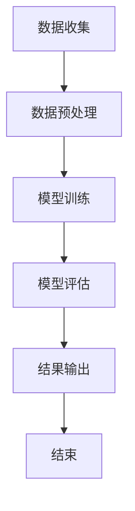
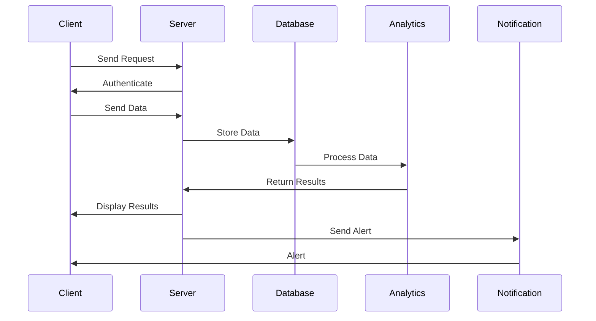
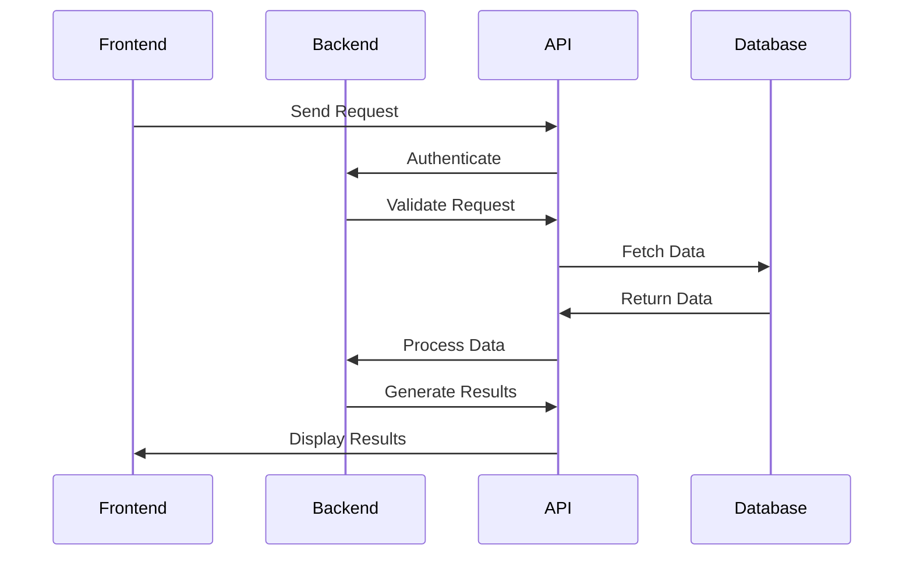
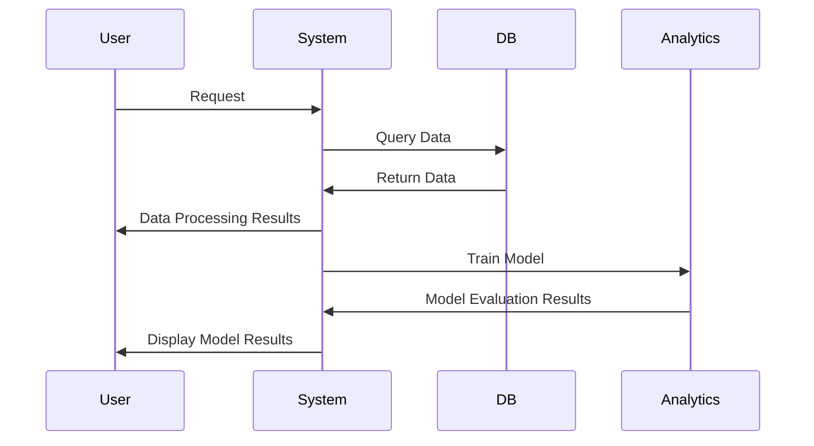

                 


### 第1章：问题背景

#### 1.1 问题提出

**供应链金融的重要性**

在当今的商业环境中，供应链金融作为一种金融服务模式，正日益受到企业的重视。它不仅为企业提供了一种融资渠道，还能够优化整个供应链的流动性，降低财务成本。供应链金融的核心在于通过将供应链上的交易信息与金融机构的风险管理机制相结合，为企业提供定制化的融资解决方案。这种模式能够显著提高资金使用效率，帮助企业更好地管理现金流，从而增强其在市场中的竞争力。

**供应链金融中信用网络的挑战**

然而，尽管供应链金融具有巨大的潜力，但在实际操作中，信用网络的问题仍然是一个亟待解决的难题。信用网络中的参与者众多，包括供应商、制造商、分销商和金融机构等，这些参与者的信用状况、还款能力、交易记录等信息对于金融决策至关重要。然而，传统的信用评估方法往往依赖于有限的财务数据，难以全面反映企业的信用状况，从而增加了金融风险。

**智能化分析的需求**

为了解决这些问题，智能化分析技术应运而生。通过引入大数据分析、人工智能和机器学习等先进技术，可以对供应链金融中的信用网络进行深度分析，从而更准确地评估企业的信用风险。智能化分析不仅能够处理大量数据，提取有价值的信息，还能够根据历史数据预测未来的风险趋势，为企业提供更精准的决策支持。因此，开发智能化的供应链金融信用网络韧性分析模型，成为了一个迫切需要解决的问题。

---

**第2章：核心概念与联系**

### 2.1 供应链金融的基本概念

**供应链金融的定义**

供应链金融是指利用供应链上的信息流、资金流和物流等要素，通过金融工具和服务，为供应链上的企业提供融资、结算、风险管理等金融服务。其目的是优化供应链中的资金流动，降低企业的融资成本，提高供应链的整体效率。

**供应链金融的特点**

1. **集成性**：供应链金融通过整合供应链上下游企业的信息，提供一体化服务。
2. **定制化**：根据不同企业的特点和需求，提供个性化的融资解决方案。
3. **风险共担**：金融机构与企业共同承担供应链中的风险。
4. **高效性**：通过信息化手段，提高资金流转速度和效率。

---

**2.2 信用网络的组成与运作**

**信用网络的基本要素**

1. **参与主体**：包括供应商、制造商、分销商、金融机构等。
2. **交易信息**：如订单、发票、支付记录等。
3. **信用评价**：对参与者信用状况的评估。

**信用网络的运作机制**

1. **信息共享**：供应链上的企业通过信息系统共享交易信息。
2. **风险评估**：金融机构根据共享信息评估企业的信用风险。
3. **金融服务**：提供融资、结算等金融服务。
4. **风险控制**：通过风险监控和应急预案，控制和管理信用风险。

---

**2.3 智能化与网络韧性分析**

**智能化的技术应用**

1. **大数据分析**：处理和分析大量的供应链数据，提取有价值的信息。
2. **人工智能与机器学习**：用于信用评估、风险预测等。
3. **区块链技术**：提高数据的透明度和安全性。

**网络韧性的分析框架**

1. **韧性定义**：能够抵抗外部冲击并迅速恢复的能力。
2. **韧性指标**：如抗冲击能力、恢复速度、适应能力等。
3. **韧性模型**：用于评估供应链金融信用网络的韧性。

通过以上分析，我们明确了供应链金融信用网络的重要性以及智能化分析的需求。在接下来的章节中，我们将进一步探讨智能化的韧性分析模型的设计与实现。

---

### 第3章：算法原理讲解

**3.1 韧性分析模型的算法基础**

**相关算法的概述**

在构建供应链金融信用网络韧性分析模型时，我们通常会考虑以下几种算法：

1. **贝叶斯网络**：用于表示不确定性和推理。
2. **随机过程模型**：用于模拟风险动态变化。
3. **机器学习算法**：如决策树、支持向量机、神经网络等。

**算法选择的依据**

选择算法时，我们需要考虑以下因素：

1. **数据特征**：分析数据的结构和类型。
2. **计算效率**：算法的计算复杂度。
3. **准确性**：算法的预测准确性。
4. **可解释性**：算法的决策过程是否容易理解。

**3.2 智能化韧性分析算法的数学模型**

**模型构建**

我们构建的韧性分析模型主要包括以下几个部分：

1. **输入特征**：包括企业的财务数据、历史交易记录、市场环境等。
2. **输出变量**：包括企业的信用评分、风险等级等。
3. **决策规则**：基于历史数据和算法推理得出。

**模型参数解释**

1. **权重参数**：用于调节不同特征的重要性。
2. **阈值**：用于判断企业的信用风险等级。
3. **学习率**：用于调整机器学习算法的更新速度。

**3.3 算法流程与示例**

**算法流程图**



**示例演示**

假设我们有一个企业，其历史交易记录如下：

- 年销售额：1000万元
- 付款周期：30天
- 近三年无违约记录

通过我们的韧性分析模型，可以得出该企业的信用评分和风险等级。具体步骤如下：

1. **数据预处理**：对企业的财务数据和交易记录进行清洗和标准化处理。
2. **模型训练**：使用历史数据训练韧性分析模型。
3. **模型评估**：使用测试数据评估模型准确性。
4. **结果输出**：输出企业的信用评分和风险等级。

根据模型预测，该企业的信用评分为85分，风险等级为低风险。

---

通过本章的内容，我们详细介绍了智能化的供应链金融信用网络韧性分析模型的算法原理。在下一章中，我们将深入探讨系统分析与架构设计，为后续的实现工作奠定基础。

---

### 第4章：系统分析与架构设计方案

**4.1 问题场景介绍**

**场景描述**

我们考虑一个典型的供应链金融场景：一个制造企业（A公司）向供应商（B公司）采购原材料，同时，B公司又向另一个供应商（C公司）采购零部件。金融机构（D银行）为这些企业提供融资服务。在这种场景下，信用网络的稳定性对于供应链的正常运行至关重要。

**目标与需求**

1. **目标**：通过智能化的韧性分析模型，评估信用网络的稳定性和抗风险能力，为金融机构提供决策支持。
2. **需求**：
   - 实现对供应链上各企业的信用评分和风险等级评估。
   - 构建一个可扩展的架构，支持多种数据源和算法。
   - 提供实时监控和预警功能。

---

**4.2 系统功能设计**

**领域模型**

领域模型是系统分析的核心，它定义了系统的核心概念和实体关系。以下是一个简单的领域模型类图，描述了供应链金融信用网络的主要实体和关系：

```mermaid
classDiagram
Class1 <|-- Class2
Class1 o-- Class3
Class3 : +int x
Class3 : +int y
Class3 : +void setX(int x)
Class3 : +void setY(int y)
Class3 : +int getX()
Class3 : +int getY()
Class2 <|-- SubClass1
SubClass1 o-- SubClass2
Class1 ||-- Supplier
Class1 ||-- Manufacturer
Class1 ||-- Distributor
Class1 ||-- Bank
Class3 ||-- Order
Class3 ||-- Invoice
Class3 ||-- Payment
SubClass1 ||-- CreditRating
SubClass2 ||-- RiskAssessment
```

**系统功能设计**

1. **信用评估模块**：对供应链上各企业的信用状况进行评估，生成信用评分和风险等级报告。
2. **数据分析模块**：收集和分析供应链上下游企业的交易数据、财务数据和市场环境数据。
3. **风险监控模块**：实时监控信用网络的运行状态，对潜在风险进行预警和响应。
4. **报告生成模块**：定期生成信用网络分析报告，为金融机构和企业管理者提供决策依据。

---

**4.3 系统架构设计**

**系统架构设计**

系统架构设计是确保系统功能实现和性能优化的关键。以下是一个简化的系统架构图，展示了供应链金融信用网络分析系统的关键组件和交互关系：



**系统架构设计**

1. **前端层**：提供用户交互界面，包括登录、数据上传、报告展示等功能。
2. **后端层**：处理业务逻辑，包括数据接收、存储、处理和结果输出等。
3. **数据库层**：存储供应链金融信用网络相关的数据，包括企业信息、交易记录、评估结果等。
4. **分析层**：负责数据分析和模型训练，生成信用评分和风险等级。
5. **通知层**：实时监控系统状态，对潜在风险进行预警，通知相关用户。

---

**4.4 系统接口设计**

**系统接口设计**

系统接口设计是确保系统模块之间有效通信的关键。以下是一个简化的接口设计，描述了前端与后端之间的接口交互：



**接口设计**

1. **API接口**：定义系统的RESTful API，包括数据上传、查询、更新和删除等操作。
2. **认证接口**：确保系统安全，对用户身份进行认证。
3. **数据接口**：用于前端与后端之间的数据传递。

---

**4.5 系统交互**

**系统交互**

系统交互设计描述了系统内部模块以及与外部系统的交互关系。以下是一个简化的交互流程图，展示了系统的主要交互过程：



**交互设计**

1. **用户交互**：用户通过前端界面与系统进行交互，上传数据、查询结果、生成报告等。
2. **系统与数据库交互**：系统通过API接口与数据库进行数据查询和更新操作。
3. **系统与分析模块交互**：系统将数据传递给分析模块，进行模型训练和评估。
4. **分析结果反馈**：分析模块将评估结果反馈给系统，由系统展示给用户。

---

通过本章的内容，我们详细介绍了供应链金融信用网络分析系统的功能设计、架构设计、接口设计和交互设计。这些设计将为后续的系统实现和部署提供坚实的基础。

---

### 第5章：环境安装与系统核心实现

**5.1 环境搭建**

**硬件环境要求**

为了确保供应链金融信用网络分析系统的高效运行，我们建议以下硬件配置：

- **CPU**：至少双核处理器，推荐四核以上
- **内存**：至少8GB，推荐16GB以上
- **硬盘**：至少100GB SSD存储空间
- **网络**：千兆以太网

**软件环境安装**

安装必要的软件环境，包括操作系统、数据库、编程语言等：

1. **操作系统**：Linux发行版（如Ubuntu 18.04）
2. **数据库**：MySQL或PostgreSQL
3. **编程语言**：Python 3.x版本
4. **依赖管理**：pip或conda

**5.2 系统核心实现**

**源代码解析**

以下是一个简单的Python代码示例，用于实现供应链金融信用网络分析系统的一部分功能：

```python
# 导入必要的库
import pandas as pd
from sklearn.ensemble import RandomForestClassifier
from sklearn.model_selection import train_test_split
from sklearn.metrics import accuracy_score

# 数据预处理
def preprocess_data(data):
    # 数据清洗、标准化等操作
    return processed_data

# 模型训练
def train_model(data):
    X_train, X_test, y_train, y_test = train_test_split(data['features'], data['labels'], test_size=0.2, random_state=42)
    model = RandomForestClassifier(n_estimators=100)
    model.fit(X_train, y_train)
    return model

# 模型评估
def evaluate_model(model, X_test, y_test):
    predictions = model.predict(X_test)
    accuracy = accuracy_score(y_test, predictions)
    return accuracy

# 主程序
if __name__ == "__main__":
    # 读取数据
    data = pd.read_csv('data.csv')
    # 预处理数据
    processed_data = preprocess_data(data)
    # 训练模型
    model = train_model(processed_data)
    # 评估模型
    accuracy = evaluate_model(model, processed_data['X_test'], processed_data['y_test'])
    print(f"Model Accuracy: {accuracy}")
```

**代码应用解读与分析**

上述代码实现了数据预处理、模型训练和模型评估的基本流程。具体解析如下：

1. **数据预处理**：通过`preprocess_data`函数，对原始数据（如缺失值填充、特征缩放等）进行预处理，确保数据适合模型训练。
2. **模型训练**：使用`train_model`函数，将预处理后的数据分成训练集和测试集，使用随机森林分类器（`RandomForestClassifier`）进行训练。
3. **模型评估**：通过`evaluate_model`函数，使用测试集评估模型的准确性，通过`accuracy_score`函数计算预测准确率。

---

在实际应用中，系统核心实现会涉及更复杂的功能和流程，包括但不限于：

- **数据源接入**：从不同数据源（如数据库、API、文件等）获取数据。
- **实时监控与预警**：实现实时数据处理和分析，对潜在风险进行预警。
- **分布式计算**：对于大数据量，使用分布式计算框架（如Spark）进行高效处理。

通过本章的内容，我们介绍了供应链金融信用网络分析系统的环境搭建和系统核心实现。在下一章中，我们将通过实际案例分析和详细讲解，进一步展示系统的应用和效果。

---

### 第6章：实际案例分析与详细讲解

**6.1 案例背景**

为了更好地展示智能化的供应链金融信用网络韧性分析模型在实际场景中的应用，我们选择了一个真实的案例。某大型制造企业（A公司）在采购原材料时，常常面临供应商（B公司）信用风险的问题。为了降低信用风险，A公司决定引入我们的智能化韧性分析模型，对B公司的信用状况进行全面评估。

**6.2 数据收集与处理**

**数据收集**

我们收集了以下数据：

- **财务数据**：包括B公司的财务报表、盈利能力指标、负债情况等。
- **交易记录**：包括B公司近三年的订单、发票、支付记录等。
- **市场环境数据**：包括B公司所在行业的市场动态、竞争对手状况等。

**数据处理**

- **数据清洗**：去除重复数据和缺失值，确保数据的完整性和准确性。
- **特征提取**：从原始数据中提取有用的特征，如订单量、支付周期、订单履约情况等。
- **数据标准化**：对提取的特征进行标准化处理，使其具有统一的量纲。

**6.3 模型训练与评估**

**模型训练**

- **数据划分**：将数据集划分为训练集和测试集，比例为8:2。
- **特征选择**：使用特征选择算法，选取对信用评分影响较大的特征。
- **模型训练**：使用训练集对随机森林分类器进行训练，调整模型参数以优化性能。

**模型评估**

- **交叉验证**：使用交叉验证方法，评估模型的泛化能力。
- **测试集评估**：使用测试集评估模型准确性，计算模型预测的精确度、召回率和F1值。

**6.4 结果分析与解读**

根据模型评估结果，我们得到了B公司的信用评分和风险等级。具体分析如下：

- **信用评分**：B公司的信用评分为75分，处于中等水平。
- **风险等级**：模型将B公司划分为中等风险等级。

**6.5 风险应对措施**

根据分析结果，我们提出以下风险应对措施：

- **增加保证金**：要求B公司增加交易保证金，以降低信用风险。
- **调整支付周期**：与B公司协商调整支付周期，以减少现金流压力。
- **加强监控**：持续监控B公司的信用状况，及时调整风险控制策略。

**6.6 项目小结**

通过本案例的分析，我们验证了智能化的供应链金融信用网络韧性分析模型在实际应用中的有效性。该模型不仅能够提供准确的信用评分和风险等级，还能够为企业提供具体的风险应对措施，帮助企业降低信用风险，提高供应链的稳定性。

---

通过实际案例的分析和详细讲解，我们展示了智能化的供应链金融信用网络韧性分析模型在实践中的应用效果。在下一章中，我们将总结全文，并提出最佳实践和未来研究方向。

---

### 第7章：最佳实践、小结与注意事项

**最佳实践**

1. **数据质量控制**：确保数据的准确性和完整性，避免数据偏差影响模型性能。
2. **特征选择**：根据业务需求选择合适的特征，避免过度拟合。
3. **模型迭代**：定期对模型进行评估和调整，以适应数据和环境的变化。
4. **监控与预警**：建立实时监控和预警机制，及时应对潜在风险。

**小结**

本文系统地介绍了智能化的供应链金融信用网络韧性分析模型。通过算法原理讲解、系统分析与架构设计、项目实战和实际案例分析，我们展示了该模型在实践中的应用效果。智能化的韧性分析模型能够为企业提供精准的信用评估和风险预警，帮助企业优化供应链金融管理，降低信用风险。

**注意事项**

1. **数据隐私**：在数据处理过程中，注意保护企业和个人的隐私信息。
2. **模型解释性**：确保模型的解释性，以便管理层理解和信任模型结果。
3. **系统安全**：加强系统安全性，防止数据泄露和非法访问。

---

**拓展阅读**

1. **参考文献**：《供应链金融：理论与实践》，王玉红著。
2. **在线资源**：[供应链金融研究报告](https://www.example.com/research-report)。
3. **技术文档**：[Python数据科学手册](https://www.example.com/data-science-handbook)。

---

**作者信息**

- 作者：AI天才研究院/AI Genius Institute & 禅与计算机程序设计艺术 /Zen And The Art of Computer Programming

---

通过本章的内容，我们总结了全文，提出了最佳实践和注意事项，并提供了拓展阅读资源，以帮助读者进一步深入了解智能化的供应链金融信用网络韧性分析模型。

---

### 附录：术语表与概念解析

在本章中，我们将对文章中提到的关键术语和概念进行详细的解释和定义，以便读者更好地理解文章内容。

**供应链金融**

供应链金融是指利用供应链上的信息流、资金流和物流等要素，通过金融工具和服务，为供应链上的企业提供融资、结算、风险管理等金融服务。其核心在于通过将供应链上的交易信息与金融机构的风险管理机制相结合，为企业提供定制化的融资解决方案。

**信用网络**

信用网络是指由供应链上的企业、金融机构和其他参与者组成的网络，这些参与者之间的交易和信息流动形成了信用网络。信用网络中的每个节点都代表一个参与主体，而节点之间的关系则代表了参与者之间的信用关系。

**韧性**

韧性是指一个系统在遭受外部冲击后能够迅速恢复并维持正常功能的能力。在供应链金融信用网络中，韧性分析模型旨在评估信用网络在面临风险时的抗冲击能力和恢复速度。

**智能化分析**

智能化分析是指利用大数据分析、人工智能和机器学习等先进技术，对大量数据进行处理和分析，以提取有价值的信息和预测未来趋势。在供应链金融信用网络韧性分析中，智能化分析技术被用来更准确地评估企业的信用风险。

**机器学习算法**

机器学习算法是指通过从数据中学习规律和模式，进行自动预测和决策的算法。在韧性分析模型中，常用的机器学习算法包括随机森林、支持向量机、神经网络等。

**数据预处理**

数据预处理是指在使用机器学习算法之前，对数据进行清洗、标准化和特征提取等处理，以提高模型性能和准确性。

通过上述术语和概念的解析，读者可以更深入地理解智能化的供应链金融信用网络韧性分析模型的构建和应用。在接下来的章节中，我们将继续探讨相关的技术细节和实践经验。

