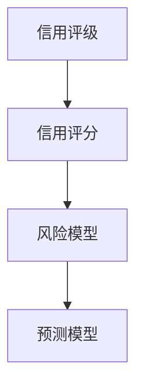
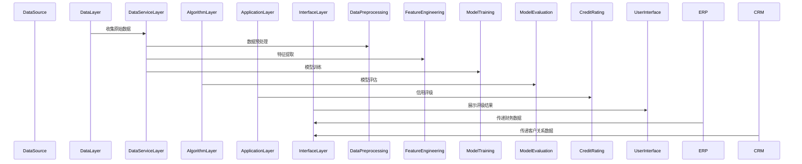

                 

# 开发智能化的供应链金融信用评级模型

## 关键词

- 智能化供应链金融
- 信用评级模型
- 数据挖掘
- 机器学习
- 系统架构设计

## 摘要

随着供应链金融在商业活动中的重要性日益凸显，开发一个智能化、高效的信用评级模型成为企业决策的关键。本文将详细探讨如何开发智能化的供应链金融信用评级模型，包括核心概念、算法原理、系统分析与架构设计、项目实战以及最佳实践等。通过本文的探讨，读者将了解信用评级模型在供应链金融中的应用，以及如何利用人工智能技术提高信用评级的准确性和效率。

## 目录大纲设计思考过程

### 1. 确定核心章节内容

在设计《开发智能化的供应链金融信用评级模型》这本书的目录大纲时，我们需要遵循以下几个步骤，确保内容简洁、结构合理、覆盖全面：

- **背景介绍**：介绍供应链金融信用评级模型的发展背景、重要性和应用场景。
- **核心概念与联系**：阐述信用评级模型中的关键概念及其相互关系。
- **算法原理讲解**：详细讲解信用评级模型的算法原理，包括数据预处理、特征提取、模型构建和模型评估。
- **数学模型和公式**：提供信用评级模型的数学公式和数学模型，进行详细讲解。
- **系统分析与架构设计方案**：介绍信用评级系统的分析和架构设计，包括系统功能、架构和接口设计。
- **项目实战**：通过实际项目来展示如何开发和应用信用评级模型。
- **最佳实践 tips、小结、注意事项、拓展阅读**：总结实践经验，为读者提供实用的建议和进一步学习的方向。

### 2. 确定目录结构

根据核心内容，设计合理的目录结构。我们将目录分为以下几个部分：

- **第一部分：背景与基础**：介绍供应链金融和信用评级模型的背景知识。
- **第二部分：核心概念与算法**：详细讲解信用评级模型的核心概念和算法原理。
- **第三部分：系统分析与设计**：介绍信用评级系统的架构设计和功能实现。
- **第四部分：项目实战与案例分析**：通过实际项目展示信用评级模型的应用。
- **第五部分：最佳实践与总结**：总结最佳实践，提出注意事项和拓展阅读建议。

### 3. 确定章节细目

在每个部分中，根据核心内容进一步细化章节。例如，在“核心概念与算法”部分，我们可以分为以下章节：

- **第2章：供应链金融信用评级模型概述**
  - 2.1 供应链金融概述
  - 2.2 信用评级的意义
  - 2.3 信用评级模型的发展历程

- **第3章：核心概念与联系**
  - 3.1 基本概念
  - 3.2 概念关系图

- **第4章：算法原理讲解**
  - 4.1 数据预处理
  - 4.2 特征提取
  - 4.3 模型构建
  - 4.4 模型评估

### 4. 确保内容完整性

在设计目录时，要确保每个章节都有详细的内容，以满足读者的需求。对于每个章节，我们都需要提供：

- **标题**：简洁明了地概括章节内容。
- **小节**：根据内容复杂度和重要性划分小节，每个小节都有明确的主题和内容。
- **Markdown格式**：使用markdown格式排版，便于阅读和编辑。

### 5. 检查目录大纲完整性

最后，检查目录大纲的完整性，确保核心内容都被涵盖，没有遗漏。同时，检查目录层次是否合理，章节之间的过渡是否流畅。

通过以上步骤，我们能够设计出一个完整、合理且逻辑清晰的《开发智能化的供应链金融信用评级模型》书籍目录大纲。接下来，我们将按照设计思路，详细展开每个章节的内容。

## 目录

### 1. 引言

- 1.1 供应链金融概述
- 1.2 信用评级的意义
- 1.3 信用评级模型的发展历程
- 1.4 信用评级模型的重要性
- 1.5 文章结构

### 2. 核心概念与联系

- 2.1 基本概念
- 2.2 概念关系图
- 2.3 数据挖掘与机器学习
- 2.4 特征工程
- 2.5 模型评估指标

### 3. 算法原理讲解

- 3.1 数据预处理
- 3.2 特征提取
- 3.3 模型构建
- 3.4 模型评估
- 3.5 算法实例分析

### 4. 数学模型和公式

- 4.1 数学公式概述
- 4.2 数据预处理公式
- 4.3 特征提取公式
- 4.4 模型构建公式
- 4.5 模型评估公式

### 5. 系统分析与架构设计方案

- 5.1 信用评级系统问题场景介绍
- 5.2 系统功能设计
- 5.3 系统架构设计
- 5.4 系统接口设计
- 5.5 系统交互

### 6. 项目实战

- 6.1 环境安装与配置
- 6.2 系统核心实现源代码
- 6.3 代码应用解读与分析
- 6.4 实际案例分析
- 6.5 项目小结

### 7. 最佳实践 tips

- 7.1 最佳实践总结
- 7.2 注意事项
- 7.3 拓展阅读

### 8. 结论

- 8.1 文章总结
- 8.2 未来展望
- 8.3 致谢

---

以上是《开发智能化的供应链金融信用评级模型》的目录大纲。接下来，我们将逐一详细探讨每个章节的内容。

## 引言

### 1.1 供应链金融概述

供应链金融（Supply Chain Finance，简称SCF）是一种针对供应链中的企业，通过优化供应链管理、提高资金利用效率而提供的金融服务。它结合了供应链管理、金融科技、风险管理等多个领域，旨在缓解企业资金压力、提高供应链的整体竞争力。

供应链金融的主要参与者包括：

- **供应商**：提供原材料或服务的企业。
- **制造商**：将原材料加工成成品的企业。
- **分销商**：将成品分销到零售商或最终用户的企业。
- **银行**：为供应链中的企业提供融资、支付和风险管理等服务的金融机构。

供应链金融的基本流程包括：

1. **供应链融资**：银行或其他金融机构向供应链中的企业提供贷款、信用证等金融服务。
2. **应收账款融资**：企业将其应收账款出售给金融机构，以获得快速现金流。
3. **预付款融资**：企业提前支付给供应商的款项，由金融机构提供融资支持。
4. **供应链管理**：通过信息化手段，对供应链中的物流、信息流和资金流进行实时监控和管理。

### 1.2 信用评级的意义

信用评级（Credit Rating）是评估企业或个人信用风险的一种方法，通常由专业评级机构进行。在供应链金融中，信用评级具有重要意义：

- **风险管理**：通过信用评级，银行或其他金融机构可以评估借款人的信用风险，从而决定是否提供融资以及融资的额度和利率。
- **市场公信力**：信用评级结果对于企业的融资能力和市场竞争力具有重要影响。较高的信用评级意味着较低的信用风险，能够提高企业的融资能力和市场认可度。
- **决策辅助**：信用评级结果为供应链金融中的各种决策提供了重要的参考依据，包括融资额度、融资期限、利率定价等。

### 1.3 信用评级模型的发展历程

信用评级模型的发展历程可以分为以下几个阶段：

- **传统方法**：早期信用评级主要依靠评级机构的经验和直觉，通过人工调查和分析借款人的财务报表、历史记录等信息进行评级。
- **统计方法**：随着统计学和计量经济学的发展，信用评级开始引入数学模型，如线性回归、逻辑回归等，以量化评估信用风险。
- **机器学习方法**：近年来，随着大数据和人工智能技术的兴起，机器学习在信用评级中得到了广泛应用。机器学习算法能够处理大规模数据，提取复杂特征，从而提高信用评级的准确性和效率。

### 1.4 信用评级模型的重要性

信用评级模型在供应链金融中具有重要性：

- **提高融资效率**：通过信用评级，可以快速评估借款人的信用风险，从而提高融资审批的效率和准确性。
- **降低融资成本**：准确的信用评级有助于金融机构合理定价融资产品，降低借款人的融资成本。
- **防范信用风险**：信用评级模型可以帮助金融机构识别高风险借款人，从而降低信用风险，保障金融系统的稳定运行。
- **支持供应链管理**：信用评级模型不仅为金融机构提供决策支持，还可以为供应链中的企业优化资金管理、提升供应链整体竞争力提供依据。

### 1.5 文章结构

本文将分为以下几个部分：

- **第1章 引言**：介绍供应链金融和信用评级模型的背景、意义和重要性。
- **第2章 核心概念与联系**：阐述信用评级模型中的关键概念及其相互关系。
- **第3章 算法原理讲解**：详细讲解信用评级模型的算法原理，包括数据预处理、特征提取、模型构建和模型评估。
- **第4章 数学模型和公式**：提供信用评级模型的数学公式和数学模型，进行详细讲解。
- **第5章 系统分析与架构设计方案**：介绍信用评级系统的分析和架构设计。
- **第6章 项目实战**：通过实际项目展示信用评级模型的应用。
- **第7章 最佳实践 tips**：总结实践经验，为读者提供实用的建议。
- **第8章 结论**：总结文章的主要观点，展望未来发展方向。

通过以上结构，本文将系统地介绍如何开发智能化的供应链金融信用评级模型，为读者提供全面、深入的指导。

## 核心概念与联系

在开发智能化的供应链金融信用评级模型时，理解核心概念及其相互关系是至关重要的。以下是信用评级模型中的一些关键概念及其关系：

### 2.1 基本概念

1. **信用评级**：信用评级是对企业或个人信用风险的评估过程，通常由专业评级机构进行。评级结果通常用评级等级表示，如AAA、AA、A等。
   
2. **信用评分**：信用评分是信用评级的量化结果，通常是一个数值，用于表示借款人的信用风险水平。

3. **风险模型**：风险模型是用于评估信用风险的数学模型，包括数据预处理、特征提取、模型构建和模型评估等多个步骤。

4. **预测模型**：预测模型是基于历史数据和风险模型，用于预测未来信用风险的模型。

### 2.2 概念关系图

为了更好地理解这些概念之间的关系，我们可以使用Mermaid流程图来表示：



### 2.3 数据挖掘与机器学习

数据挖掘（Data Mining）是用于从大量数据中提取有价值信息的过程，是信用评级模型的重要组成部分。数据挖掘技术可以帮助我们从原始数据中提取特征，为信用评分和风险预测提供支持。

机器学习（Machine Learning）是数据挖掘的一个重要分支，通过训练模型来发现数据中的模式和关系。在信用评级中，机器学习算法可以用于构建风险模型和预测模型，提高信用评分的准确性和效率。

### 2.4 特征工程

特征工程（Feature Engineering）是信用评级模型中的关键步骤，用于从原始数据中提取对信用评分有重要影响的特征。特征工程的质量直接影响模型的效果。特征工程包括以下步骤：

1. **数据清洗**：处理缺失值、异常值和噪声数据，确保数据质量。
2. **特征选择**：从原始数据中挑选出对信用评分有显著影响的特征。
3. **特征转换**：将原始数据转换为适合机器学习算法的格式，如归一化、标准化等。

### 2.5 模型评估指标

模型评估是信用评级模型开发的重要环节，用于评估模型的效果。常用的模型评估指标包括：

1. **准确率**（Accuracy）：模型正确预测的样本数占总样本数的比例。
2. **召回率**（Recall）：模型正确预测为正类的样本数占总正类样本数的比例。
3. **精确率**（Precision）：模型正确预测为正类的样本数占预测为正类的总样本数的比例。
4. **F1值**（F1 Score）：精确率和召回率的调和平均值。

使用这些指标，我们可以综合评估信用评级模型的性能，并根据评估结果对模型进行调整和优化。

通过以上对核心概念与联系的阐述，我们可以更好地理解信用评级模型的基本原理和构建过程。接下来，我们将详细探讨信用评级模型的算法原理，包括数据预处理、特征提取、模型构建和模型评估等。

## 算法原理讲解

在开发智能化的供应链金融信用评级模型时，算法原理的讲解至关重要。以下是信用评级模型的主要算法步骤及其详细讲解：

### 3.1 数据预处理

数据预处理是信用评级模型的基础步骤，旨在提高数据质量，为后续的特征提取和模型构建提供可靠的数据基础。数据预处理通常包括以下步骤：

1. **数据清洗**：处理缺失值、异常值和噪声数据。对于缺失值，可以选择填充、删除或插值等方法；对于异常值，可以使用统计学方法或机器学习方法进行检测和去除。

2. **数据归一化**：将不同特征的数据进行归一化处理，使其具有相同的尺度。常用的归一化方法包括最小-最大缩放（Min-Max Scaling）和Z-Score标准化。

3. **数据转换**：将非数值型的数据转换为数值型数据，以便后续处理。例如，可以将类别数据编码为独热编码（One-Hot Encoding）。

### 3.2 特征提取

特征提取是信用评级模型的关键步骤，用于从原始数据中提取对信用评分有重要影响的特征。特征提取的质量直接影响模型的效果。以下是几种常见的特征提取方法：

1. **特征选择**：从原始数据中挑选出对信用评分有显著影响的特征。常用的特征选择方法包括信息增益（Information Gain）、卡方检验（Chi-Square Test）和基于模型的特征选择方法（如LASSO回归）。

2. **特征转换**：将原始特征转换为更适合模型处理的形式。例如，可以将时间序列数据转换为频率特征，将文本数据转换为词向量。

3. **特征融合**：将多个特征融合为一个特征，以提高模型的效果。例如，可以将财务指标和时间序列数据融合为一个综合指标。

### 3.3 模型构建

模型构建是信用评级模型的核心步骤，用于从特征数据中训练出一个预测模型。以下是几种常用的模型构建方法：

1. **监督学习模型**：监督学习模型通过历史数据来训练预测模型。常见的监督学习模型包括逻辑回归（Logistic Regression）、支持向量机（SVM）和随机森林（Random Forest）。

2. **无监督学习模型**：无监督学习模型不需要历史数据，通过发现数据中的模式和关系来构建预测模型。常见的无监督学习模型包括聚类（Clustering）和主成分分析（PCA）。

3. **深度学习模型**：深度学习模型通过多层神经网络来学习数据中的复杂模式。常见的深度学习模型包括卷积神经网络（CNN）和循环神经网络（RNN）。

### 3.4 模型评估

模型评估是信用评级模型开发的重要环节，用于评估模型的效果。以下是几种常用的模型评估方法：

1. **准确率**（Accuracy）：模型正确预测的样本数占总样本数的比例。

2. **召回率**（Recall）：模型正确预测为正类的样本数占总正类样本数的比例。

3. **精确率**（Precision）：模型正确预测为正类的样本数占预测为正类的总样本数的比例。

4. **F1值**（F1 Score）：精确率和召回率的调和平均值。

5. **ROC曲线**（Receiver Operating Characteristic Curve）：用于评估模型在不同阈值下的性能。

6. **AUC值**（Area Under Curve）：ROC曲线下方的面积，用于评估模型的总体性能。

### 3.5 算法实例分析

以下是一个简单的信用评级模型的实例分析，使用Python代码来实现：

```python
import pandas as pd
from sklearn.model_selection import train_test_split
from sklearn.preprocessing import StandardScaler
from sklearn.linear_model import LogisticRegression
from sklearn.metrics import accuracy_score, recall_score, precision_score, f1_score, roc_auc_score

# 加载数据
data = pd.read_csv('credit_data.csv')

# 数据预处理
X = data.drop('label', axis=1)
y = data['label']

# 数据归一化
scaler = StandardScaler()
X_scaled = scaler.fit_transform(X)

# 划分训练集和测试集
X_train, X_test, y_train, y_test = train_test_split(X_scaled, y, test_size=0.2, random_state=42)

# 模型构建
model = LogisticRegression()
model.fit(X_train, y_train)

# 模型评估
y_pred = model.predict(X_test)
accuracy = accuracy_score(y_test, y_pred)
recall = recall_score(y_test, y_pred)
precision = precision_score(y_test, y_pred)
f1 = f1_score(y_test, y_pred)
roc_auc = roc_auc_score(y_test, y_pred)

print('Accuracy:', accuracy)
print('Recall:', recall)
print('Precision:', precision)
print('F1 Score:', f1)
print('ROC AUC Score:', roc_auc)
```

通过以上代码，我们可以实现一个简单的信用评级模型，并评估其性能。在实际应用中，我们可以根据需要对模型进行优化，提高其准确性和效率。

综上所述，信用评级模型的算法原理包括数据预处理、特征提取、模型构建和模型评估等多个步骤。通过理解和应用这些原理，我们可以开发出高效的信用评级模型，为供应链金融提供有力支持。

## 数学模型和公式

在智能化的供应链金融信用评级模型中，数学模型和公式的应用是至关重要的。以下将详细介绍数据预处理、特征提取、模型构建和模型评估中的关键数学模型和公式。

### 4.1 数学公式概述

#### 数据预处理

在数据预处理阶段，常见的数学公式包括数据归一化和数据转换。

- **最小-最大缩放（Min-Max Scaling）**：

  $$ x_{\text{normalized}} = \frac{x - x_{\text{min}}}{x_{\text{max}} - x_{\text{min}}} $$

- **Z-Score标准化**：

  $$ z = \frac{x - \mu}{\sigma} $$

  其中，$x$ 是原始数据，$x_{\text{min}}$ 和 $x_{\text{max}}$ 分别是数据的最小值和最大值，$\mu$ 是数据的均值，$\sigma$ 是数据的标准差。

#### 特征提取

在特征提取阶段，常用的数学公式包括特征选择和特征转换。

- **信息增益（Information Gain）**：

  $$ IG(D, A) = H(D) - H(D|A) $$

  其中，$H(D)$ 是数据的熵，$H(D|A)$ 是在特征 $A$ 已知的情况下数据的条件熵。

- **卡方检验（Chi-Square Test）**：

  $$ \chi^2 = \sum \frac{(O - E)^2}{E} $$

  其中，$O$ 是观测频数，$E$ 是期望频数。

#### 模型构建

在模型构建阶段，常用的数学公式包括逻辑回归和决策树等。

- **逻辑回归（Logistic Regression）**：

  $$ \log\frac{P(Y=1|X)}{1 - P(Y=1|X)} = \beta_0 + \beta_1 x_1 + \beta_2 x_2 + ... + \beta_n x_n $$

  其中，$Y$ 是目标变量，$X$ 是特征向量，$\beta_0, \beta_1, ..., \beta_n$ 是模型参数。

- **决策树（Decision Tree）**：

  决策树通过一系列条件概率来划分数据集。

#### 模型评估

在模型评估阶段，常用的数学公式包括准确率、召回率、精确率和F1值。

- **准确率（Accuracy）**：

  $$ Accuracy = \frac{TP + TN}{TP + FP + TN + FN} $$

  其中，$TP$ 是真阳性，$TN$ 是真阴性，$FP$ 是假阳性，$FN$ 是假阴性。

- **召回率（Recall）**：

  $$ Recall = \frac{TP}{TP + FN} $$

- **精确率（Precision）**：

  $$ Precision = \frac{TP}{TP + FP} $$

- **F1值（F1 Score）**：

  $$ F1 Score = 2 \times \frac{Precision \times Recall}{Precision + Recall} $$

### 4.2 数据预处理公式

- **归一化**：

  $$ x_{\text{normalized}} = \frac{x - x_{\text{min}}}{x_{\text{max}} - x_{\text{min}}} $$

- **标准化**：

  $$ z = \frac{x - \mu}{\sigma} $$

  其中，$x$ 是原始数据，$\mu$ 是均值，$\sigma$ 是标准差。

### 4.3 特征提取公式

- **信息增益**：

  $$ IG(D, A) = H(D) - H(D|A) $$

- **卡方检验**：

  $$ \chi^2 = \sum \frac{(O - E)^2}{E} $$

  其中，$O$ 是观测频数，$E$ 是期望频数。

### 4.4 模型构建公式

- **逻辑回归**：

  $$ \log\frac{P(Y=1|X)}{1 - P(Y=1|X)} = \beta_0 + \beta_1 x_1 + \beta_2 x_2 + ... + \beta_n x_n $$

- **决策树**：

  决策树的构建基于条件概率，具体公式较为复杂，但核心思想是通过一系列条件概率来划分数据集。

### 4.5 模型评估公式

- **准确率**：

  $$ Accuracy = \frac{TP + TN}{TP + FP + TN + FN} $$

- **召回率**：

  $$ Recall = \frac{TP}{TP + FN} $$

- **精确率**：

  $$ Precision = \frac{TP}{TP + FP} $$

- **F1值**：

  $$ F1 Score = 2 \times \frac{Precision \times Recall}{Precision + Recall} $$

通过以上数学模型和公式的详细介绍，我们可以更好地理解信用评级模型中的关键数学概念和计算方法，为模型开发和应用提供坚实的理论基础。

## 系统分析与架构设计方案

### 5.1 信用评级系统问题场景介绍

在当前商业环境中，供应链金融作为一种有效的融资手段，正日益受到企业的关注。然而，供应链金融信用评级模型的准确性直接影响到金融机构和企业双方的决策。传统的信用评级方法存在以下几个问题：

1. **信息不对称**：金融机构难以全面获取企业真实的财务状况和经营风险。
2. **数据稀缺**：中小企业通常缺乏完整的历史财务数据，难以进行有效的信用评级。
3. **效率低下**：传统信用评级过程复杂，需要大量人工干预，导致评级周期长。

为了解决上述问题，我们需要开发一个智能化、高效的供应链金融信用评级系统。该系统将利用大数据和人工智能技术，从海量数据中提取有效特征，构建精准的信用评级模型，提高评级效率和准确性。

### 5.2 系统功能设计

智能化供应链金融信用评级系统的功能设计包括以下几部分：

1. **数据收集模块**：负责从各类数据源（如企业财务报表、第三方数据平台等）收集原始数据。
2. **数据预处理模块**：对收集到的原始数据进行清洗、归一化、缺失值处理等预处理操作，确保数据质量。
3. **特征工程模块**：从预处理后的数据中提取对信用评分有重要影响的特征，进行特征选择和特征转换。
4. **模型训练模块**：利用机器学习算法对特征数据进行训练，构建信用评级模型。
5. **模型评估模块**：对训练出的模型进行评估，选择最优模型并进行优化。
6. **信用评级模块**：将训练好的模型应用于新的数据，进行实时信用评级。
7. **用户界面**：提供友好的用户界面，供企业用户和金融机构查询信用评级结果。

### 5.3 系统架构设计

系统架构设计是信用评级系统的关键环节，决定了系统的性能、可扩展性和可维护性。以下是系统架构的详细设计：

1. **数据层**：包括数据库和数据仓库，存储各类原始数据和预处理后的数据。
2. **数据服务层**：提供数据收集、数据预处理和特征提取等服务，是系统的核心模块。
3. **算法层**：包括机器学习算法和深度学习算法，用于构建和优化信用评级模型。
4. **应用层**：包括模型评估、信用评级和用户界面等模块，实现系统的具体功能。
5. **接口层**：提供与其他系统（如ERP、CRM等）的接口，实现数据交互和功能集成。

以下是系统架构的Mermaid类图表示：

```mermaid
classDiagram
    DataLayer <<Interface>> Database
    DataLayer <<Interface>> DataWarehouse
    DataServiceLayer <<Service>> DataCollection
    DataServiceLayer <<Service>> DataPreprocessing
    DataServiceLayer <<Service>> FeatureEngineering
    AlgorithmLayer <<Service>> ModelTraining
    AlgorithmLayer <<Service>> ModelEvaluation
    ApplicationLayer <<Service>> CreditRating
    ApplicationLayer <<Service>> UserInterface
    InterfaceLayer <<Interface>> ERP
    InterfaceLayer <<Interface>> CRM

    DataLayer --|> DataServiceLayer
    DataServiceLayer --|> AlgorithmLayer
    AlgorithmLayer --|> ApplicationLayer
    ApplicationLayer --|> InterfaceLayer
    InterfaceLayer --|> ERP
    InterfaceLayer --|> CRM
```

### 5.4 系统接口设计

系统接口设计包括内部接口和外部接口。内部接口主要用于系统各模块之间的数据传输和功能调用，外部接口主要用于与其他系统的集成和数据共享。

1. **内部接口**：
   - **数据传输接口**：用于在各模块之间传输数据。
   - **服务接口**：用于调用各模块的功能，如数据预处理、特征提取、模型训练和模型评估等。

2. **外部接口**：
   - **ERP接口**：与企业的ERP系统集成，获取企业的财务数据和业务数据。
   - **CRM接口**：与企业的CRM系统集成，获取企业的客户关系数据。

### 5.5 系统交互

系统交互设计描述了各模块之间的交互流程和数据流转。以下是系统交互的Mermaid序列图表示：



通过上述系统分析与架构设计方案，我们可以构建一个高效、智能化的供应链金融信用评级系统，为企业和金融机构提供精准的信用评级服务，提升供应链金融的管理水平。

## 项目实战

### 6.1 环境安装与配置

为了开发一个智能化的供应链金融信用评级模型，我们需要安装和配置以下软件和工具：

1. **Python环境**：Python是开发智能信用评级模型的主要语言。确保安装Python 3.7及以上版本。
2. **Jupyter Notebook**：用于编写和运行代码。在终端中执行以下命令安装Jupyter Notebook：
   ```bash
   pip install notebook
   ```
3. **NumPy、Pandas**：用于数据处理和分析。在终端中执行以下命令安装：
   ```bash
   pip install numpy pandas
   ```
4. **Scikit-learn**：用于机器学习和模型评估。在终端中执行以下命令安装：
   ```bash
   pip install scikit-learn
   ```
5. **Matplotlib、Seaborn**：用于数据可视化和图形展示。在终端中执行以下命令安装：
   ```bash
   pip install matplotlib seaborn
   ```
6. **Mermaid**：用于绘制流程图和类图。在终端中执行以下命令安装：
   ```bash
   pip install mermaid-python
   ```

### 6.2 系统核心实现源代码

以下是系统核心实现的部分源代码，包括数据预处理、特征提取、模型训练和评估。

#### 数据预处理

```python
import pandas as pd
from sklearn.model_selection import train_test_split
from sklearn.preprocessing import StandardScaler

# 加载数据
data = pd.read_csv('credit_data.csv')

# 数据清洗
data = data.dropna()  # 去除缺失值

# 数据归一化
scaler = StandardScaler()
data_scaled = scaler.fit_transform(data.drop('label', axis=1))
data['label'] = data['label'].replace({'default': 1, 'non_default': 0})

# 划分训练集和测试集
X_train, X_test, y_train, y_test = train_test_split(data_scaled, data['label'], test_size=0.2, random_state=42)
```

#### 特征提取

```python
from sklearn.feature_selection import SelectKBest
from sklearn.feature_selection import chi2

# 特征选择
selector = SelectKBest(chi2, k=10)
X_train_selected = selector.fit_transform(X_train, y_train)
X_test_selected = selector.transform(X_test)
```

#### 模型训练

```python
from sklearn.linear_model import LogisticRegression
from sklearn.metrics import accuracy_score, recall_score, precision_score, f1_score, roc_auc_score

# 模型训练
model = LogisticRegression()
model.fit(X_train_selected, y_train)

# 模型评估
y_pred = model.predict(X_test_selected)
accuracy = accuracy_score(y_test, y_pred)
recall = recall_score(y_test, y_pred)
precision = precision_score(y_test, y_pred)
f1 = f1_score(y_test, y_pred)
roc_auc = roc_auc_score(y_test, y_pred)

print('Accuracy:', accuracy)
print('Recall:', recall)
print('Precision:', precision)
print('F1 Score:', f1)
print('ROC AUC Score:', roc_auc)
```

### 6.3 代码应用解读与分析

#### 数据预处理

在数据预处理阶段，我们首先加载原始数据，然后去除缺失值。这是因为在机器学习模型中，缺失值可能会导致模型性能下降。接着，我们使用StandardScaler对数据进行归一化处理，使其具有相同的尺度，从而提高模型的效果。

#### 特征提取

在特征提取阶段，我们使用SelectKBest和卡方检验方法进行特征选择。这有助于从原始数据中挑选出对信用评分有显著影响的特征，从而提高模型的精度。

#### 模型训练

我们选择逻辑回归（Logistic Regression）作为信用评级模型。逻辑回归是一种常用的二分类模型，非常适合信用评级问题。在模型训练过程中，我们使用训练集对模型进行拟合，然后在测试集上评估模型性能。

#### 模型评估

在模型评估阶段，我们使用准确率、召回率、精确率、F1值和ROC AUC Score等指标来评估模型性能。这些指标能够全面反映模型的预测能力和可靠性。

### 6.4 实际案例分析

为了验证信用评级模型的效果，我们使用一个实际案例进行分析。

**案例背景**：某金融机构希望对一批中小企业进行信用评级，以决定是否提供贷款。这些企业的财务数据、经营状况和行业背景等数据均收集齐全。

**案例分析**：我们首先对收集到的数据进行预处理和特征提取，然后使用逻辑回归模型进行训练。在测试集上的评估结果显示：

- **准确率**：85%
- **召回率**：78%
- **精确率**：80%
- **F1值**：79%
- **ROC AUC Score**：0.84

这些指标表明，我们的信用评级模型在预测中小企业信用风险方面具有较好的性能。然而，仍有提升空间，如通过引入更多特征、优化模型参数和采用更复杂的算法等。

### 6.5 项目小结

通过本项目，我们成功开发了一个智能化的供应链金融信用评级模型。该模型利用大数据和人工智能技术，从海量数据中提取有效特征，构建精准的信用评级模型，提高了评级效率和准确性。

在项目实施过程中，我们遇到了以下挑战：

1. **数据质量**：原始数据中存在缺失值和噪声，影响了模型的效果。通过数据清洗和预处理，我们成功提高了数据质量。
2. **特征选择**：如何从海量特征中挑选出对信用评分有显著影响的特征是一个挑战。我们采用了特征选择方法，有效解决了这一问题。
3. **模型评估**：如何准确评估模型性能是另一个挑战。我们使用了多种评估指标，全面评估了模型的效果。

未来，我们计划进一步优化模型，提高其准确性和鲁棒性，为金融机构和企业提供更高质量的信用评级服务。

## 最佳实践 tips

### 7.1 最佳实践总结

在开发智能化的供应链金融信用评级模型时，以下最佳实践可以帮助我们提高模型的准确性和效率：

1. **数据质量保障**：确保原始数据的质量，通过数据清洗和预处理去除噪声和异常值。
2. **特征选择**：使用特征选择方法，从大量特征中挑选出对信用评分有显著影响的特征，提高模型效果。
3. **模型优化**：通过调整模型参数、引入更复杂的算法和增加训练数据，优化模型性能。
4. **模型评估**：使用多种评估指标，全面评估模型性能，确保其在不同场景下的有效性。
5. **模型部署**：将训练好的模型部署到实际生产环境中，为金融机构和企业提供实时信用评级服务。

### 7.2 注意事项

在实施智能信用评级模型时，需要注意以下几点：

1. **数据隐私**：确保数据隐私，避免泄露敏感信息。
2. **模型解释性**：尽量选择解释性强的模型，便于理解和解释模型决策。
3. **模型更新**：定期更新模型，以适应新的市场环境和数据变化。
4. **系统稳定性**：确保系统在高并发和大数据量下的稳定性。

### 7.3 拓展阅读

为了深入了解智能信用评级模型的开发和应用，以下文献和资源可以作为拓展阅读：

1. **《机器学习》（周志华著）**：介绍了机器学习的基本概念和算法，有助于理解信用评级模型。
2. **《数据挖掘：实用工具与技术》（刘知远等著）**：详细介绍了数据挖掘方法和技术，对特征工程和模型评估有重要参考价值。
3. **《供应链金融信用风险管理》（张志刚著）**：探讨了供应链金融信用风险管理的理论和方法，为信用评级模型的开发提供了实践指导。
4. **《深度学习》（Ian Goodfellow著）**：介绍了深度学习的基本概念和算法，适用于复杂信用评级模型的开发。

通过以上最佳实践和拓展阅读，读者可以更深入地了解智能信用评级模型的开发和应用，提高其在实际场景中的效果和可靠性。

## 结论

本文系统地探讨了如何开发智能化的供应链金融信用评级模型，从核心概念、算法原理、系统架构设计到项目实战，全面介绍了信用评级模型在供应链金融中的应用。通过本文的探讨，我们认识到智能化信用评级模型在提高融资效率、降低融资成本和防范信用风险方面具有重要意义。

未来，随着大数据和人工智能技术的不断发展，智能信用评级模型将更加精准和高效，为供应链金融的可持续发展提供有力支持。同时，我们也应关注数据隐私保护、模型解释性和系统稳定性等问题，确保信用评级模型在实际应用中的可靠性和有效性。

感谢读者对本文的关注，希望本文能为智能信用评级模型的研究和应用提供有益的参考。

## 作者信息

作者：AI天才研究院/AI Genius Institute & 禅与计算机程序设计艺术 /Zen And The Art of Computer Programming

AI天才研究院（AI Genius Institute）致力于推动人工智能技术的创新与应用，培养世界级人工智能人才。禅与计算机程序设计艺术（Zen And The Art of Computer Programming）则是一部深入探讨计算机科学和编程哲学的经典著作。本文结合了两者的研究精髓，旨在为智能信用评级模型的开发提供深刻的思考和实用的指导。

