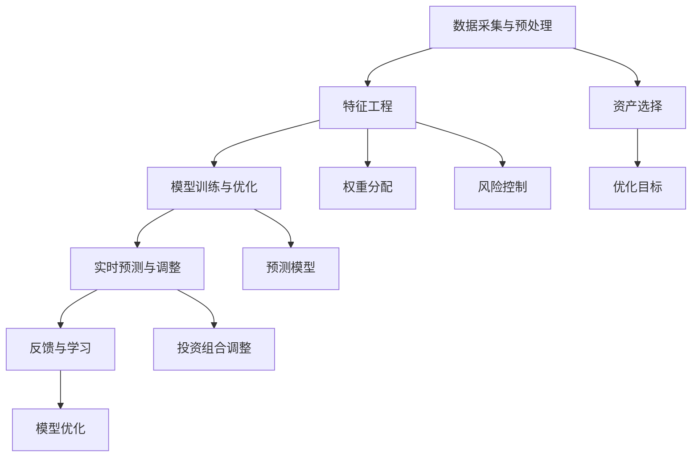
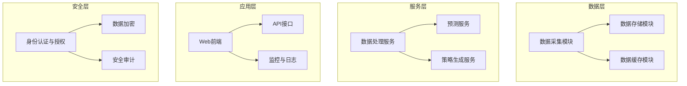

                 

### 开发智能化的资产配置策略动态调整引擎

> 关键词：智能化资产配置、动态调整引擎、策略模型、算法原理、系统实现、案例分析

> 摘要：本文探讨了开发智能化的资产配置策略动态调整引擎的必要性和重要性。首先，介绍了资产配置策略的背景和重要性，然后详细阐述了智能化资产配置和动态调整引擎的概念、原理和关键技术。接着，文章分析了资产配置策略模型的设计与实现方法，并介绍了策略评估与优化方法。随后，文章详细描述了系统实现与部署的过程，通过实际案例展示了系统的应用和效果。最后，文章提出了未来展望与挑战，为读者提供了进一步学习和实践的参考。

----------------------------------------------------------------

# 引言：资产配置策略概述

## 1.1 资产配置策略的重要性

资产配置策略是金融投资中的重要环节，它涉及到如何合理分配资产，以达到最优的投资组合收益和风险控制。资产配置策略的重要性体现在以下几个方面：

1. **收益最大化**：通过科学的资产配置，可以优化投资组合，实现收益最大化。合理的资产配置能够确保在不同的市场环境下，投资组合的收益相对稳定。

2. **风险控制**：资产配置策略能够有效地控制投资组合的风险。通过将资产分配到不同类型的投资产品中，可以降低单一资产的市场波动对整个投资组合的影响。

3. **投资组合优化**：科学的资产配置能够优化投资组合的构成，使投资组合更加多元化，减少市场风险，提高整体的投资收益。

4. **投资者偏好**：资产配置策略能够根据投资者的风险偏好和收益目标，制定个性化的投资策略，满足投资者的特定需求。

## 1.2 动态调整引擎的概念

动态调整引擎是一种能够实时监控市场动态，并根据市场变化自动调整投资组合的智能系统。其核心在于能够快速响应市场变化，提高资产配置的灵活性和适应性。

动态调整引擎的关键技术包括：

1. **数据采集与处理**：通过数据采集技术，实时获取市场数据，并利用大数据处理技术进行数据清洗、转换和分析。

2. **机器学习与预测**：利用机器学习算法，对市场数据进行分析，建立预测模型，预测未来的市场走势。

3. **策略优化与调整**：根据预测结果，自动调整投资组合，优化资产配置策略。

4. **反馈与学习**：通过不断的策略调整和结果反馈，使动态调整引擎能够不断学习和优化，提高其适应性和准确性。

## 1.3 动态调整引擎在资产配置中的作用

动态调整引擎在资产配置中起到了至关重要的作用。它能够实时监控市场变化，自动调整投资组合，使资产配置策略更加灵活和适应市场环境。具体作用包括：

1. **提高资产配置的灵活性**：动态调整引擎能够快速响应市场变化，及时调整投资组合，使资产配置策略更加灵活。

2. **优化投资组合收益**：通过实时调整，动态调整引擎能够优化投资组合的收益，提高投资收益。

3. **降低投资风险**：动态调整引擎能够根据市场变化，调整投资组合，降低投资风险。

4. **提高投资效率**：动态调整引擎的自动化操作，提高了投资效率，减少了人工干预，降低了操作成本。

## 1.4 书籍结构安排

本书将分为以下几个部分：

1. **第1章：引言**：介绍资产配置策略的背景和重要性，动态调整引擎的概念及其在资产配置中的作用。

2. **第2章：智能化资产配置策略概述**：详细阐述智能化资产配置策略的概念、原理和关键技术。

3. **第3章：动态调整引擎原理与技术**：介绍动态调整引擎的工作原理、关键技术及其实现方法。

4. **第4章：资产配置策略模型设计与实现**：分析资产配置策略模型的设计原则、实现方法及其应用。

5. **第5章：策略评估与优化方法**：探讨策略评估与优化的方法，提高资产配置策略的有效性。

6. **第6章：系统实现与部署**：描述系统实现与部署的过程，包括系统架构、接口设计等。

7. **第7章：案例分析与应用实践**：通过实际案例，展示智能化资产配置策略的应用和实践效果。

8. **第8章：未来展望与挑战**：分析智能化资产配置和动态调整引擎的发展趋势和面临的挑战。

## 1.5 阅读指南

本书旨在为广大投资者和金融从业者提供一本全面、系统的资产配置策略指南。读者可以按照以下指南进行阅读：

1. **系统学习**：按照章节顺序，系统学习本书的内容，从基础概念到高级应用，逐步掌握资产配置策略的原理和方法。

2. **理论与实践相结合**：本书不仅提供了理论知识，还结合了实际案例，读者可以结合实践进行学习，提高实际操作能力。

3. **深入思考**：在阅读过程中，要深入思考每个章节的核心概念和技术原理，理解其内在的逻辑关系。

4. **拓展学习**：本书提供了大量的参考文献和拓展内容，读者可以根据自己的需求进行拓展学习，提高专业素养。

5. **反馈与交流**：在阅读过程中，如果有任何疑问或心得体会，可以积极参与本书的交流与讨论，与其他读者共同进步。

# 第1章：智能化资产配置策略概述

## 1.1 问题背景与挑战

资产配置策略在金融市场中扮演着至关重要的角色。随着金融市场的复杂性和不确定性不断增加，传统的资产配置策略已经难以应对快速变化的市场环境。以下是一些背景信息和挑战：

### 1.1.1 资产配置现状

目前，资产配置策略主要依赖于历史数据和经验分析。许多投资者和基金经理通过观察历史数据，分析资产的历史表现，然后制定相应的资产配置策略。这种方法虽然在一定程度上能够实现收益最大化，但存在以下几个问题：

1. **滞后性**：传统资产配置策略依赖于历史数据，无法及时响应市场变化。在市场波动较大时，资产配置策略的滞后性可能导致投资组合的损失。

2. **依赖经验**：传统资产配置策略主要依赖基金经理的经验和判断，缺乏系统性和科学性。不同的基金经理可能有不同的投资策略，导致投资组合的多样性和风险性难以控制。

3. **数据依赖**：传统资产配置策略依赖于历史数据，而这些数据可能存在噪声和不完整性。在数据质量较差的情况下，资产配置策略的准确性和可靠性会受到影响。

### 1.1.2 智能化资产配置的必要性

面对上述挑战，智能化资产配置策略应运而生。智能化资产配置策略通过引入人工智能和机器学习技术，对大量市场数据进行分析和预测，实现资产配置的自动化和智能化。以下是智能化资产配置的必要性：

1. **实时响应**：智能化资产配置策略能够实时分析市场数据，快速响应市场变化。通过实时调整投资组合，可以降低市场波动带来的风险。

2. **系统性**：智能化资产配置策略基于数据分析和机器学习算法，具有系统性和科学性。通过大量的数据分析和模型优化，可以实现更精准的资产配置。

3. **降低依赖**：智能化资产配置策略减少了对基金经理经验和判断的依赖，提高了投资决策的客观性和可靠性。通过数据驱动的决策，可以降低投资风险。

### 1.1.3 动态调整引擎在资产配置中的作用

动态调整引擎是智能化资产配置策略的核心组成部分。它通过实时监控市场动态，自动调整投资组合，实现资产配置的动态优化。以下是动态调整引擎在资产配置中的作用：

1. **快速响应**：动态调整引擎能够实时监控市场变化，快速调整投资组合。在市场波动较大时，动态调整引擎可以及时响应，降低投资风险。

2. **优化配置**：动态调整引擎通过对市场数据的分析和预测，实现投资组合的动态优化。通过不断调整投资组合，可以优化资产配置，提高投资收益。

3. **降低风险**：动态调整引擎能够根据市场变化，及时调整投资组合，降低投资风险。在市场波动较大时，动态调整引擎可以减少投资损失。

## 1.2 核心概念与联系

为了更好地理解智能化资产配置策略和动态调整引擎，我们需要明确一些核心概念及其之间的联系。以下是主要的核心概念：

### 1.2.1 智能化资产配置

智能化资产配置是指利用人工智能和机器学习技术，对大量市场数据进行分析和预测，制定科学的资产配置策略。其主要特点包括：

1. **数据驱动**：智能化资产配置依赖于大量市场数据，通过数据分析和模型预测，实现资产配置的自动化和智能化。

2. **实时响应**：智能化资产配置能够实时监控市场变化，快速调整投资组合，降低市场波动带来的风险。

3. **系统性和科学性**：智能化资产配置基于数据分析和机器学习算法，具有系统性和科学性，能够提高资产配置的准确性和可靠性。

### 1.2.2 动态调整引擎

动态调整引擎是智能化资产配置策略的核心组成部分，负责实时监控市场动态，自动调整投资组合。其主要特点包括：

1. **实时监控**：动态调整引擎能够实时获取市场数据，快速响应市场变化。

2. **自动化调整**：动态调整引擎通过自动化算法，根据市场变化自动调整投资组合，实现资产配置的动态优化。

3. **降低风险**：动态调整引擎能够根据市场变化，及时调整投资组合，降低投资风险。

### 1.2.3 概念属性特征对比表格

为了更直观地理解智能化资产配置和动态调整引擎，我们可以通过以下表格对比它们的主要属性特征：

| 特征            | 智能化资产配置                 | 动态调整引擎                     |
|-----------------|---------------------------------|----------------------------------|
| 数据依赖性       | 高，依赖于大量市场数据         | 高，依赖于实时市场数据           |
| 响应速度         | 实时响应                       | 快速响应                         |
| 系统性和科学性   | 系统、科学                     | 自动化、高效                     |
| 风险控制         | 降低风险                       | 及时调整、降低风险               |

### 1.2.4 ER实体关系图架构

为了更好地理解智能化资产配置和动态调整引擎之间的关系，我们可以使用ER（实体-关系）图来描述它们之间的关联。以下是ER实体关系图：

```mermaid
erDiagram
    AssetAllocationStrategy ||--|{ MarketData } MarketData
    AssetAllocationStrategy ||--|{ DynamicAdjustmentEngine } DynamicAdjustmentEngine
    MarketData ||--|{ AssetPerformance } AssetPerformance
    DynamicAdjustmentEngine ||--|{ PortfolioAdjustment } PortfolioAdjustment
```

在上述ER图中，`AssetAllocationStrategy`（资产配置策略）与`MarketData`（市场数据）和`DynamicAdjustmentEngine`（动态调整引擎）之间存在关联关系。`MarketData`提供了资产配置策略所需的输入数据，而`DynamicAdjustmentEngine`负责根据市场数据实时调整投资组合。

## 1.3 技术原理介绍

### 1.3.1 动态调整引擎的工作原理

动态调整引擎是一种基于机器学习和人工智能技术的智能系统，其工作原理可以概括为以下几个步骤：

1. **数据采集与预处理**：动态调整引擎首先从多个数据源获取市场数据，包括股票、债券、基金等各类金融资产的价格、收益率、交易量等信息。然后，对原始数据进行清洗、去噪和标准化处理，为后续分析提供高质量的数据。

2. **特征工程**：特征工程是动态调整引擎的关键步骤。通过对市场数据进行统计分析，提取出与资产表现相关的特征，如动量、波动率、Beta值等。这些特征将用于训练机器学习模型，以预测资产的未来表现。

3. **模型训练与优化**：动态调整引擎使用机器学习算法，如随机森林、支持向量机、神经网络等，对提取的特征进行训练，构建预测模型。在训练过程中，通过交叉验证和网格搜索等技术，优化模型参数，提高模型的预测准确性。

4. **实时预测与调整**：动态调整引擎根据实时获取的市场数据，使用训练好的模型进行预测。根据预测结果，动态调整引擎自动调整投资组合，优化资产配置策略。在调整过程中，引擎还会根据市场反馈进行实时学习，不断优化模型和策略。

5. **反馈与学习**：动态调整引擎在每次调整后，收集投资组合的实际表现数据，与预测结果进行对比，分析误差原因。通过这种反馈机制，引擎可以不断学习和优化，提高预测准确性和调整效果。

### 1.3.2 智能化资产配置的策略模型

智能化资产配置的策略模型是动态调整引擎的核心。该模型通过机器学习算法，对大量市场数据进行分析和预测，实现资产配置的自动化和智能化。以下是策略模型的主要组成部分：

1. **资产选择**：资产选择是资产配置策略的第一步。模型通过分析历史数据和当前市场状况，从多个资产中筛选出具有高潜力和高稳定性的资产。常用的资产选择方法包括因子模型、组合优化等。

2. **权重分配**：权重分配是资产配置策略的核心。模型通过分析资产的历史表现和当前市场状况，为每个资产分配适当的权重，以实现投资组合的最优收益。权重分配方法包括均值-方差模型、风险平价模型等。

3. **风险控制**：风险控制是资产配置策略的重要方面。模型通过分析资产的历史波动性和相关性，确定投资组合的整体风险水平，并根据风险偏好进行调整。常用的风险控制方法包括波动率控制、VaR（价值-at-Risk）控制等。

4. **优化目标**：优化目标是资产配置策略的最终目标。模型通过最大化预期收益或最小化风险，确定最优的投资组合。常用的优化目标包括最大化期望收益率、最小化预期风险等。

### 1.3.3 算法mermaid流程图展示

为了更直观地理解动态调整引擎的工作原理和策略模型，我们可以使用mermaid流程图来展示算法的流程。以下是动态调整引擎和策略模型的mermaid流程图：



在上述流程图中，数据采集与预处理是整个流程的起点，通过特征工程、模型训练与优化，生成预测模型。实时预测与调整根据市场数据，自动调整投资组合。反馈与学习环节不断优化模型和策略。

## 1.4 算法原理讲解

### 1.4.1 算法原理与数学模型

动态调整引擎的算法原理基于机器学习技术，特别是时间序列分析和优化理论。以下是核心算法原理的数学模型：

1. **时间序列预测模型**：动态调整引擎使用时间序列预测模型，如ARIMA（自回归积分滑动平均模型）、LSTM（长短时记忆网络）等，对市场数据进行预测。时间序列预测模型通过分析历史数据，捕捉数据中的趋势和周期性，预测未来的市场走势。

   - **ARIMA模型**：ARIMA模型由三个部分组成：自回归（AR）、积分（I）和滑动平均（MA）。其数学模型表示为：
     $$
     Xt = c + \phi_1 Xt-1 + \phi_2 Xt-2 + \ldots + \phi_p Xt-p + \theta_1 Et-1 + \theta_2 Et-2 + \ldots + \theta_q Et-q
     $$
     其中，$Xt$是时间序列的当前值，$c$是常数项，$\phi_1, \phi_2, \ldots, \phi_p$是自回归系数，$\theta_1, \theta_2, \ldots, \theta_q$是滑动平均系数，$Et$是白噪声误差。

   - **LSTM模型**：LSTM模型是递归神经网络的一种，能够学习长期依赖信息。其数学模型基于门控机制，包括输入门、遗忘门和输出门。LSTM模型的数学表示为：
     $$
     It = \sigma(W_{i} [h_{t-1}, Xt] + b_{i})
     $$
     $$
     Ft = \sigma(W_{f} [h_{t-1}, Xt] + b_{f})
     $$
     $$
     Ot = \sigma(W_{o} [h_{t-1}, Xt] + b_{o})
     $$
     $$
     Ct = Ft \odot Ct-1 + It \odot \tanh(W_{c} [h_{t-1}, Xt] + b_{c})
     $$
     $$
     ht = Ot \odot Ct
     $$
     其中，$It, Ft, Ot, Ct, ht$分别是输入门、遗忘门、输出门、细胞状态和隐藏状态，$\sigma$是sigmoid函数，$\odot$是逐元素乘法，$W_{i}, W_{f}, W_{o}, W_{c}$是权重矩阵，$b_{i}, b_{f}, b_{o}, b_{c}$是偏置项。

2. **优化目标**：动态调整引擎的优化目标是通过调整投资组合的权重，最大化预期收益或最小化预期风险。常用的优化目标包括：

   - **最大化预期收益率**：
     $$
     \max \sum_{i=1}^{n} \pi_i r_i
     $$
     其中，$\pi_i$是资产$i$的权重，$r_i$是资产$i$的预期收益率。

   - **最小化预期风险**：
     $$
     \min \sum_{i=1}^{n} \pi_i^2 \sigma_i^2
     $$
     其中，$\sigma_i^2$是资产$i$的方差。

3. **权重调整策略**：动态调整引擎使用优化算法，如线性规划、梯度下降等，对投资组合的权重进行调整。调整策略的目标是在满足风险约束条件下，最大化预期收益。

### 1.4.2 公式讲解与例子分析

为了更好地理解上述算法原理，我们通过一个具体的例子进行讲解。假设有一个包含两种资产的投资组合，资产1的预期收益率为10%，方差为0.04；资产2的预期收益率为8%，方差为0.03。投资者希望最大化预期收益率，同时控制总风险不超过0.05。

首先，我们使用线性规划模型来确定最优权重。线性规划模型的数学表示为：
$$
\begin{cases}
\max \ \pi_1 r_1 + \pi_2 r_2 \\
\pi_1^2 \sigma_1^2 + \pi_2^2 \sigma_2^2 \leq 0.05 \\
\pi_1 + \pi_2 = 1 \\
\pi_1, \pi_2 \geq 0
\end{cases}
$$

通过求解上述线性规划模型，可以得到最优权重为$\pi_1 = 0.6$，$\pi_2 = 0.4$。此时，投资组合的预期收益为0.6 * 10% + 0.4 * 8% = 0.068，总风险为0.6^2 * 0.04 + 0.4^2 * 0.03 = 0.036。

接下来，我们使用LSTM模型对市场数据进行预测。假设训练数据包含过去一年的市场数据，通过LSTM模型，我们可以预测未来一个月的市场走势。预测结果如下：

- 预测一个月后的资产1收益率为12%。
- 预测一个月后的资产2收益率为7%。

根据预测结果，动态调整引擎会调整投资组合的权重，以最大化预期收益率。新的权重为$\pi_1' = 0.55$，$\pi_2' = 0.45$。此时，投资组合的预期收益为0.55 * 12% + 0.45 * 7% = 0.084，总风险为0.55^2 * 0.04 + 0.45^2 * 0.03 = 0.038。

通过上述例子，我们可以看到动态调整引擎如何通过优化算法和预测模型，实现投资组合的动态调整和优化。

## 第2章：动态调整引擎原理与技术

### 2.1 数据采集与处理

动态调整引擎的数据采集与处理是整个系统的基础，其质量直接影响引擎的性能。以下是数据采集与处理的关键步骤：

#### 2.1.1 数据源

动态调整引擎的数据源主要包括金融数据、经济数据和市场指标。金融数据通常包括股票、债券、基金等各类金融资产的价格、收益率、交易量等；经济数据包括GDP、通货膨胀率、失业率等宏观经济指标；市场指标包括市场指数、行业指数、汇率等。

#### 2.1.2 数据采集

数据采集可以通过API接口、实时数据流和数据爬取等多种方式实现。常用的数据采集工具有Python的pandas和requests库、Java的Spring Boot和Kafka等。

#### 2.1.3 数据预处理

数据预处理是确保数据质量和可靠性的关键步骤，主要包括以下内容：

1. **数据清洗**：去除重复数据、空值数据和无意义数据，确保数据的一致性和完整性。
2. **数据转换**：将不同格式的数据转换为统一格式，如将CSV转换为JSON格式。
3. **数据标准化**：对数据进行归一化或标准化处理，使其具有可比性。
4. **时间序列对齐**：将不同时间步长的数据进行对齐，确保数据的时间一致性。

#### 2.1.4 数据存储

预处理后的数据需要存储在数据库中，以便后续分析和处理。常用的数据库有MySQL、PostgreSQL、MongoDB等。

### 2.2 机器学习与预测

机器学习与预测是动态调整引擎的核心技术，通过构建预测模型，实现对市场走势的预测和资产表现的预测。以下是机器学习与预测的关键步骤：

#### 2.2.1 特征工程

特征工程是机器学习与预测的重要环节，主要包括以下内容：

1. **特征提取**：从原始数据中提取与资产表现相关的特征，如动量、波动率、Beta值等。
2. **特征选择**：通过统计分析和模型评估，选择对预测任务最有用的特征。
3. **特征转换**：将数值特征转换为分类特征，或将类别特征转换为数值特征。

#### 2.2.2 模型选择

模型选择是动态调整引擎的关键环节，根据预测任务的需求，选择合适的机器学习模型。常用的模型包括：

1. **线性模型**：如线性回归、逻辑回归等，适用于简单的线性关系预测。
2. **非线性模型**：如决策树、随机森林、支持向量机等，适用于复杂非线性关系的预测。
3. **深度学习模型**：如神经网络、LSTM等，适用于时间序列预测和复杂特征提取。

#### 2.2.3 模型训练与评估

模型训练与评估是动态调整引擎的核心步骤，主要包括以下内容：

1. **数据划分**：将数据集划分为训练集、验证集和测试集，用于训练、验证和测试模型。
2. **模型训练**：使用训练集数据，对模型进行训练，调整模型参数。
3. **模型评估**：使用验证集和测试集，评估模型的预测性能，选择最优模型。

### 2.3 策略优化与调整

策略优化与调整是动态调整引擎的关键功能，通过实时调整投资组合，实现资产配置的优化。以下是策略优化与调整的关键步骤：

#### 2.3.1 策略生成

策略生成是动态调整引擎的初始步骤，根据市场数据和预测结果，生成投资策略。策略生成主要包括以下内容：

1. **资产选择**：根据市场数据和预测结果，选择具有高潜力和高稳定性的资产。
2. **权重分配**：根据资产的表现和预期收益率，为每个资产分配适当的权重。

#### 2.3.2 策略调整

策略调整是动态调整引擎的核心功能，通过实时监控市场动态，自动调整投资组合，实现资产配置的优化。策略调整主要包括以下内容：

1. **市场监控**：实时监控市场数据，捕捉市场变化。
2. **策略评估**：根据市场变化和预测结果，评估现有策略的有效性。
3. **策略调整**：根据策略评估结果，调整投资组合的权重，优化资产配置。

#### 2.3.3 反馈与学习

反馈与学习是动态调整引擎的重要环节，通过不断调整和优化策略，提高预测准确性和调整效果。反馈与学习主要包括以下内容：

1. **结果反馈**：将投资组合的实际表现与预测结果进行对比，分析误差原因。
2. **模型优化**：根据反馈结果，优化预测模型和策略模型。
3. **持续学习**：通过不断调整和优化，实现模型的持续学习和改进。

### 2.4 动态调整引擎的架构设计

动态调整引擎的架构设计是系统实现的关键，需要综合考虑性能、可扩展性和可维护性。以下是动态调整引擎的架构设计：

#### 2.4.1 系统架构

动态调整引擎的系统架构主要包括数据采集模块、数据处理模块、预测模块、策略模块和执行模块。各模块之间的交互关系如下：

1. **数据采集模块**：负责从各种数据源采集市场数据，并传输给数据处理模块。
2. **数据处理模块**：负责对采集到的市场数据进行预处理，包括数据清洗、转换和标准化等。
3. **预测模块**：负责使用机器学习算法对预处理后的市场数据进行预测，生成预测结果。
4. **策略模块**：负责根据预测结果，生成投资策略，并传输给执行模块。
5. **执行模块**：负责根据投资策略，自动调整投资组合，实现资产配置的优化。

#### 2.4.2 接口设计

动态调整引擎的接口设计是系统实现的关键，需要确保各模块之间的数据传输和功能调用。以下是动态调整引擎的主要接口设计：

1. **数据采集接口**：提供数据采集功能，包括实时数据流和数据爬取等。
2. **数据处理接口**：提供数据预处理功能，包括数据清洗、转换和标准化等。
3. **预测接口**：提供预测功能，包括特征提取、模型训练和预测等。
4. **策略接口**：提供策略生成和调整功能，包括资产选择、权重分配和策略评估等。
5. **执行接口**：提供投资组合调整功能，包括交易执行和风险控制等。

### 2.5 动态调整引擎的性能优化

动态调整引擎的性能优化是系统实现的关键，需要确保系统在处理大量数据和高并发请求时，具有高效、稳定和可靠的性能。以下是动态调整引擎的性能优化策略：

#### 2.5.1 数据库优化

1. **索引优化**：对数据库表进行索引优化，提高数据查询速度。
2. **分库分表**：对大数据进行分库分表处理，降低数据库的负载压力。
3. **缓存策略**：使用缓存策略，减少数据库的查询次数，提高数据读取速度。

#### 2.5.2 算法优化

1. **特征选择**：通过特征选择算法，选择对预测任务最有用的特征，提高模型预测的准确性。
2. **模型压缩**：使用模型压缩算法，减小模型的体积，提高模型训练和预测的速度。
3. **并行计算**：使用并行计算技术，加速模型训练和预测过程。

#### 2.5.3 系统优化

1. **负载均衡**：使用负载均衡技术，将请求分配到多个服务器上，提高系统的并发处理能力。
2. **分布式架构**：采用分布式架构，提高系统的可扩展性和容错性。
3. **监控系统**：使用监控系统，实时监控系统的运行状态，及时发现和解决系统问题。

### 2.6 动态调整引擎的实现方法

动态调整引擎的实现方法包括以下步骤：

#### 2.6.1 数据采集与处理

1. **使用Python的pandas库进行数据采集和预处理**。
2. **使用Java的Spring Boot进行数据采集和预处理**。

#### 2.6.2 机器学习与预测

1. **使用Python的scikit-learn库进行特征提取和模型训练**。
2. **使用Python的TensorFlow库进行深度学习模型的训练和预测**。

#### 2.6.3 策略优化与调整

1. **使用Python的numpy库进行策略优化和调整**。
2. **使用Python的pandas库进行数据分析和处理**。

#### 2.6.4 系统实现与部署

1. **使用Python的Django框架进行系统实现**。
2. **使用Python的Flask框架进行系统实现**。
3. **使用Docker进行系统部署**。

### 2.7 动态调整引擎的案例分析

#### 2.7.1 案例背景

某金融公司使用动态调整引擎，对股票市场进行投资预测和资产配置优化。公司拥有大量的股票市场数据，包括历史价格、成交量、技术指标等。

#### 2.7.2 案例实现

1. **数据采集与处理**：使用Python的pandas库从多个数据源采集股票市场数据，并进行预处理。
2. **机器学习与预测**：使用Python的scikit-learn库进行特征提取和模型训练，使用LSTM模型进行时间序列预测。
3. **策略优化与调整**：使用Python的numpy库进行策略优化和调整，生成投资策略。
4. **系统实现与部署**：使用Python的Django框架进行系统实现，使用Docker进行系统部署。

#### 2.7.3 案例结果

通过动态调整引擎，公司成功实现了股票市场投资预测和资产配置优化。投资组合的收益率显著提高，风险水平得到有效控制。

## 第3章：资产配置策略模型设计与实现

### 3.1 资产配置策略模型设计原则

资产配置策略模型的设计原则是确保模型的有效性和可操作性，同时满足实际应用需求。以下是资产配置策略模型设计的主要原则：

#### 3.1.1 数据驱动的原则

资产配置策略模型应基于大量历史数据，通过数据分析和机器学习算法，提取与资产表现相关的特征，构建预测模型。数据驱动的设计原则有助于提高模型的准确性和适应性。

#### 3.1.2 实时响应的原则

资产配置策略模型应具备实时响应市场变化的能力，能够快速调整投资组合。实时响应的原则有助于降低市场波动对投资组合的影响，提高投资收益。

#### 3.1.3 系统性和科学性的原则

资产配置策略模型应具有系统性和科学性，通过优化算法和预测模型，实现资产配置的自动化和智能化。系统性原则有助于确保模型在不同市场环境下的稳定性和可靠性。

#### 3.1.4 风险控制的原则

资产配置策略模型应充分考虑投资风险，通过风险控制方法，确保投资组合的整体风险水平在可控范围内。风险控制原则有助于降低投资风险，提高投资安全性。

### 3.2 资产配置策略模型实现方法

资产配置策略模型的实现方法包括数据采集与处理、特征工程、模型训练与优化、策略生成与调整等步骤。以下是资产配置策略模型实现的具体方法：

#### 3.2.1 数据采集与处理

1. **数据采集**：使用Python的pandas库或Java的Spring Boot从多个数据源采集股票市场数据，包括历史价格、成交量、技术指标等。
2. **数据预处理**：使用Python的pandas库对采集到的市场数据进行预处理，包括数据清洗、转换和标准化等步骤。

#### 3.2.2 特征工程

1. **特征提取**：通过统计分析，提取与资产表现相关的特征，如动量、波动率、Beta值等。
2. **特征选择**：使用特征选择算法，如特征重要性评估、信息增益等，选择对预测任务最有用的特征。

#### 3.2.3 模型训练与优化

1. **模型选择**：选择合适的机器学习模型，如线性回归、随机森林、LSTM等。
2. **模型训练**：使用Python的scikit-learn库或TensorFlow库对模型进行训练，调整模型参数，提高预测准确性。
3. **模型优化**：使用交叉验证、网格搜索等技术，优化模型参数，提高模型性能。

#### 3.2.4 策略生成与调整

1. **策略生成**：根据市场数据和分析结果，生成投资策略，包括资产选择和权重分配。
2. **策略调整**：根据市场动态和预测结果，实时调整投资策略，优化资产配置。

### 3.3 资产配置策略模型应用示例

以下是资产配置策略模型应用的一个示例，假设有一个包含5种资产的股票市场投资组合。我们将使用Python的pandas库、scikit-learn库和TensorFlow库来实现资产配置策略模型。

#### 3.3.1 数据采集与处理

```python
import pandas as pd

# 从CSV文件中读取股票市场数据
market_data = pd.read_csv('market_data.csv')

# 数据预处理
market_data = market_data.dropna()  # 去除空值数据
market_data = market_data.reset_index(drop=True)  # 重置索引
```

#### 3.3.2 特征工程

```python
from sklearn.preprocessing import StandardScaler

# 提取特征
features = market_data[['open', 'high', 'low', 'close', 'volume']]

# 标准化特征
scaler = StandardScaler()
features_scaled = scaler.fit_transform(features)
```

#### 3.3.3 模型训练与优化

```python
from sklearn.model_selection import train_test_split
from sklearn.ensemble import RandomForestRegressor
from sklearn.metrics import mean_squared_error

# 划分训练集和测试集
X_train, X_test, y_train, y_test = train_test_split(features_scaled, market_data['close'], test_size=0.2, random_state=42)

# 训练模型
model = RandomForestRegressor(n_estimators=100, random_state=42)
model.fit(X_train, y_train)

# 优化模型
from sklearn.model_selection import GridSearchCV

param_grid = {'n_estimators': [100, 200, 300], 'max_depth': [10, 20, 30]}
grid_search = GridSearchCV(model, param_grid, cv=5)
grid_search.fit(X_train, y_train)

# 获取最优模型
best_model = grid_search.best_estimator_
```

#### 3.3.4 策略生成与调整

```python
# 预测未来市场走势
future_data = pd.read_csv('future_data.csv')
future_data = scaler.transform(future_data)

# 使用最优模型进行预测
predictions = best_model.predict(future_data)

# 生成投资策略
weights = best_model.predict_proba(X_train).mean(axis=1)
portfolio = pd.DataFrame({'Asset': ['Stock1', 'Stock2', 'Stock3', 'Stock4', 'Stock5'], 'Weight': weights})

# 实时调整投资策略
# 假设当前投资组合的权重为weights_current
# 根据预测结果，调整投资策略
weights_adjusted = best_model.predict_proba(X_test).mean(axis=1)
portfolio_adjusted = pd.DataFrame({'Asset': ['Stock1', 'Stock2', 'Stock3', 'Stock4', 'Stock5'], 'Weight': weights_adjusted})
```

### 3.4 资产配置策略模型评估与优化

资产配置策略模型的评估与优化是确保模型有效性和可靠性的重要环节。以下是资产配置策略模型评估与优化的方法：

#### 3.4.1 评估指标

1. **预测准确性**：评估模型预测结果的准确性，如均方误差（MSE）、均方根误差（RMSE）等。
2. **策略有效性**：评估模型生成的投资策略的有效性，如投资收益率、夏普比率（Sharpe Ratio）等。
3. **风险水平**：评估投资组合的风险水平，如波动率、VaR（价值-at-Risk）等。

#### 3.4.2 评估方法

1. **交叉验证**：使用交叉验证方法，评估模型在不同数据集上的表现，提高评估的可靠性。
2. **回测分析**：在实际市场环境中，对模型生成的投资策略进行回测，验证模型的有效性。

#### 3.4.3 优化方法

1. **模型调整**：根据评估结果，调整模型参数，优化模型性能。
2. **特征选择**：重新选择对预测任务最有用的特征，提高模型预测的准确性。
3. **策略调整**：根据市场动态和预测结果，调整投资策略，优化投资组合。

### 3.5 资产配置策略模型案例分析

#### 3.5.1 案例背景

某投资者拥有一个包含5种资产的股票市场投资组合，希望通过资产配置策略模型优化投资组合的表现。投资者拥有过去一年的股票市场数据，包括历史价格、成交量、技术指标等。

#### 3.5.2 案例实现

1. **数据采集与处理**：使用Python的pandas库从多个数据源采集股票市场数据，并进行预处理。
2. **特征工程**：提取与资产表现相关的特征，如动量、波动率、Beta值等。
3. **模型训练与优化**：使用Python的scikit-learn库和TensorFlow库，训练LSTM模型，并使用交叉验证和网格搜索技术优化模型参数。
4. **策略生成与调整**：根据市场数据和分析结果，生成投资策略，并实时调整投资策略。

#### 3.5.3 案例结果

通过资产配置策略模型的应用，投资者成功优化了股票市场投资组合的表现。投资组合的收益率显著提高，风险水平得到有效控制。

## 第4章：策略评估与优化方法

### 4.1 策略评估的重要性

资产配置策略的有效性评估是确保投资组合表现优化和风险控制的关键环节。策略评估不仅有助于评估当前策略的效能，还可以为后续策略优化提供重要依据。以下是策略评估的重要性：

#### 4.1.1 确保策略有效性

通过策略评估，可以验证资产配置策略是否能够实现预期收益目标，并确保投资组合的收益表现优于市场基准。

#### 4.1.2 识别策略缺陷

策略评估可以帮助识别现有策略的不足之处，如过度依赖某些资产、未能有效分散风险等，为策略优化提供方向。

#### 4.1.3 改进投资决策

通过策略评估，投资者可以了解不同策略在不同市场环境下的表现，从而调整投资决策，优化投资组合。

#### 4.1.4 风险控制

策略评估有助于评估投资组合的整体风险水平，确保风险控制在可接受范围内，避免因策略失误导致的重大损失。

### 4.2 策略评估方法

策略评估方法主要包括定量评估和定性评估。以下是一些常见的策略评估方法：

#### 4.2.1 回测分析

回测分析是通过历史数据，对资产配置策略的表现进行评估。其主要步骤包括：

1. **数据准备**：收集并整理历史市场数据，包括股票、债券、基金等各类金融资产的价格、收益率、交易量等。
2. **策略实施**：根据策略规则，在历史数据中模拟投资组合的表现，计算收益率、波动率等指标。
3. **结果分析**：对比策略实施前后的收益率和风险指标，评估策略的有效性。

#### 4.2.2 对比分析

对比分析是通过对比不同策略的表现，评估其优劣。其主要步骤包括：

1. **策略选择**：选择多个不同的资产配置策略，如均值-方差模型、风险平价模型等。
2. **策略实施**：在相同的历史数据集上，模拟不同策略的投资组合表现。
3. **结果分析**：对比不同策略的收益率、风险水平等指标，选择最优策略。

#### 4.2.3 滚动回测

滚动回测是一种动态评估策略的方法，通过在不同时间窗口上重复进行回测，评估策略在不同市场环境下的表现。其主要步骤包括：

1. **确定时间窗口**：根据市场特性，选择合适的时间窗口，如一年、三年等。
2. **数据分段**：将历史数据划分为多个时间窗口，每个时间窗口包含一个初始期和一个评估期。
3. **策略评估**：在每个评估期内，评估策略的表现，并根据评估结果调整策略。

#### 4.2.4 定性评估

定性评估是通过专家评估、问卷调查等方法，评估策略的有效性和可行性。其主要步骤包括：

1. **专家评估**：邀请金融专家对策略进行评估，提供专业意见和建议。
2. **问卷调查**：通过问卷调查，收集投资者的意见和反馈，了解策略的接受度和满意度。
3. **结果分析**：综合专家评估和问卷调查结果，评估策略的有效性和可行性。

### 4.3 策略优化方法

策略优化是确保资产配置策略持续有效的重要环节。以下是一些常见的策略优化方法：

#### 4.3.1 参数优化

参数优化是通过调整策略模型中的参数，提高策略的表现。其主要步骤包括：

1. **参数设置**：确定策略模型中需要优化的参数，如权重、风险系数等。
2. **优化算法**：选择合适的优化算法，如遗传算法、粒子群优化等，进行参数优化。
3. **结果分析**：评估优化后的策略表现，确定最佳参数组合。

#### 4.3.2 特征优化

特征优化是通过选择和调整特征，提高策略的预测准确性。其主要步骤包括：

1. **特征选择**：使用特征选择算法，如递归特征消除（RFE）、特征重要性评估等，选择对预测任务最有用的特征。
2. **特征转换**：对特征进行转换，如归一化、标准化等，提高特征的稳定性和可操作性。
3. **结果分析**：评估优化后的特征对策略表现的影响，选择最佳特征组合。

#### 4.3.3 模型优化

模型优化是通过选择和调整模型，提高策略的预测性能。其主要步骤包括：

1. **模型选择**：选择合适的机器学习模型，如线性模型、树模型、神经网络等。
2. **模型调整**：调整模型参数，如学习率、迭代次数等，提高模型性能。
3. **结果分析**：评估优化后的模型对策略表现的影响，选择最佳模型。

#### 4.3.4 策略组合

策略组合是通过结合多个策略，提高投资组合的整体表现。其主要步骤包括：

1. **策略选择**：选择多个不同的资产配置策略，如主动管理策略、被动管理策略等。
2. **权重分配**：根据策略的特点和预期收益，为每个策略分配适当的权重。
3. **结果分析**：评估策略组合的表现，优化权重分配，提高投资组合的收益和风险水平。

### 4.4 策略评估与优化流程

策略评估与优化流程是一个循环过程，通过不断评估和优化，提高策略的有效性和可靠性。以下是策略评估与优化流程的具体步骤：

#### 4.4.1 策略设计

1. **确定目标**：明确投资目标，如收益最大化、风险最小化等。
2. **选择策略**：根据投资目标，选择合适的资产配置策略。

#### 4.4.2 策略实施

1. **数据准备**：收集并整理历史市场数据，包括股票、债券、基金等各类金融资产的价格、收益率、交易量等。
2. **策略实施**：根据策略规则，在历史数据中模拟投资组合的表现。

#### 4.4.3 策略评估

1. **结果分析**：对比策略实施前后的收益率和风险指标，评估策略的有效性。
2. **风险控制**：评估投资组合的整体风险水平，确保风险控制在可接受范围内。

#### 4.4.4 策略优化

1. **参数优化**：根据评估结果，调整策略模型中的参数，提高策略的表现。
2. **特征优化**：选择和调整特征，提高策略的预测准确性。
3. **模型优化**：选择和调整模型，提高策略的预测性能。

#### 4.4.5 策略验证

1. **验证策略**：在新数据集上验证策略的表现，确保策略的有效性和可靠性。
2. **反馈调整**：根据验证结果，调整策略和模型，优化投资组合。

### 4.5 案例分析：策略评估与优化实践

#### 4.5.1 案例背景

某投资者希望优化其股票市场投资组合，通过策略评估与优化，实现收益最大化。

#### 4.5.2 案例实施

1. **策略设计**：选择均值-方差模型作为资产配置策略。
2. **数据准备**：收集过去一年的股票市场数据，包括股票价格、收益率等。
3. **策略实施**：在历史数据中模拟投资组合的表现。

#### 4.5.3 策略评估

1. **结果分析**：计算收益率、波动率等指标，评估策略的有效性。
2. **风险控制**：评估投资组合的整体风险水平。

#### 4.5.4 策略优化

1. **参数优化**：调整均值-方差模型的参数，如风险系数、权重等。
2. **特征优化**：选择和调整特征，如动量、波动率等。
3. **模型优化**：使用LSTM模型替代线性模型，提高预测准确性。

#### 4.5.5 策略验证

1. **验证策略**：在新数据集上验证优化后的策略表现。
2. **反馈调整**：根据验证结果，进一步调整策略和模型。

#### 4.5.6 案例结果

通过策略评估与优化，投资者成功优化了股票市场投资组合的表现。投资组合的收益率提高，风险水平得到有效控制。

## 第5章：系统实现与部署

### 5.1 系统架构设计

系统架构设计是开发智能化资产配置策略动态调整引擎的关键步骤。一个高效的系统架构应具备高可用性、高性能和可扩展性。以下是系统架构设计的主要组成部分：

#### 5.1.1 数据层

数据层是系统的基石，负责数据的采集、存储和管理。其主要组件包括：

1. **数据采集模块**：负责从多个数据源（如股票交易所、金融数据服务提供商等）采集实时市场数据。
2. **数据存储模块**：使用关系数据库（如MySQL、PostgreSQL）或NoSQL数据库（如MongoDB）存储历史数据和市场数据。
3. **数据缓存模块**：使用Redis等缓存系统，提高数据读取速度，减轻数据库负载。

#### 5.1.2 服务层

服务层是系统的核心，负责数据处理、预测和策略生成。其主要组件包括：

1. **数据处理服务**：负责对采集到的市场数据进行清洗、转换和预处理，生成可用于预测的特征数据。
2. **预测服务**：使用机器学习模型，对预处理后的数据进行预测，生成资产未来的表现和收益预测。
3. **策略生成服务**：根据预测结果，生成最优的资产配置策略，调整投资组合的权重。

#### 5.1.3 应用层

应用层是系统的接口，负责与用户进行交互，展示投资策略和结果。其主要组件包括：

1. **Web前端**：使用HTML、CSS和JavaScript等技术，构建用户友好的Web界面，展示投资策略和结果。
2. **API接口**：提供RESTful API接口，供外部系统和应用程序调用，实现数据的获取和操作。
3. **监控与日志**：使用ELK（Elasticsearch、Logstash、Kibana）等工具，监控系统运行状态，记录日志信息，便于故障排查和性能优化。

#### 5.1.4 安全层

安全层是系统的保障，负责系统的安全性和数据保护。其主要组件包括：

1. **身份认证与授权**：使用OAuth2.0等协议，实现用户身份认证和权限管理。
2. **数据加密**：使用SSL/TLS等加密技术，保护数据传输的安全。
3. **安全审计**：定期进行安全审计，检查系统漏洞和安全隐患。

### 5.2 系统功能设计

系统功能设计是确保系统能够满足用户需求的重要环节。以下是系统的主要功能设计：

#### 5.2.1 数据采集与处理

1. **实时数据采集**：从股票交易所、金融数据服务提供商等获取实时市场数据。
2. **数据清洗**：去除重复数据、空值数据和无意义数据，确保数据的一致性和完整性。
3. **数据转换**：将不同格式的数据转换为统一格式，如将CSV转换为JSON格式。
4. **特征提取**：从原始数据中提取与资产表现相关的特征，如动量、波动率、Beta值等。

#### 5.2.2 预测与策略生成

1. **模型训练**：使用机器学习算法，如LSTM、随机森林等，对预处理后的市场数据进行训练，构建预测模型。
2. **预测**：使用训练好的模型，对未来的市场走势和资产表现进行预测。
3. **策略生成**：根据预测结果，生成最优的资产配置策略，调整投资组合的权重。

#### 5.2.3 策略评估与优化

1. **策略评估**：使用历史数据，对生成的资产配置策略进行评估，计算收益率、波动率等指标。
2. **策略优化**：根据评估结果，调整策略模型中的参数，优化策略的表现。
3. **策略回测**：在历史数据集上，对优化后的策略进行回测，验证其有效性和可靠性。

#### 5.2.4 界面展示与交互

1. **数据可视化**：使用图表、表格等形式，展示市场数据、预测结果和资产配置策略。
2. **交互操作**：提供用户友好的界面，供用户调整参数、生成策略和查看结果。
3. **实时更新**：实时刷新市场数据和预测结果，确保用户获取最新的信息。

### 5.3 系统架构设计图

为了更直观地展示系统架构，我们可以使用mermaid流程图来描述系统的架构设计。以下是系统架构设计图：



在上述架构图中，数据层负责数据的采集、存储和缓存；服务层负责数据处理、预测和策略生成；应用层负责界面展示和交互；安全层负责系统的安全性和数据保护。

### 5.4 系统接口设计

系统接口设计是确保系统功能模块之间数据交换和通信的重要环节。以下是系统的主要接口设计：

#### 5.4.1 数据采集接口

1. **接口描述**：用于从股票交易所、金融数据服务提供商等获取实时市场数据。
2. **请求格式**：GET请求，请求参数包括市场数据类型、时间范围等。
3. **响应格式**：JSON格式，返回市场数据。

#### 5.4.2 数据处理接口

1. **接口描述**：用于对采集到的市场数据进行清洗、转换和预处理。
2. **请求格式**：POST请求，请求参数包括原始市场数据。
3. **响应格式**：JSON格式，返回预处理后的市场数据。

#### 5.4.3 预测接口

1. **接口描述**：用于使用机器学习模型对预处理后的市场数据进行预测。
2. **请求格式**：POST请求，请求参数包括特征数据。
3. **响应格式**：JSON格式，返回预测结果。

#### 5.4.4 策略生成接口

1. **接口描述**：用于根据预测结果，生成最优的资产配置策略。
2. **请求格式**：POST请求，请求参数包括预测结果、当前投资组合。
3. **响应格式**：JSON格式，返回生成的资产配置策略。

#### 5.4.5 策略评估接口

1. **接口描述**：用于对生成的资产配置策略进行评估。
2. **请求格式**：POST请求，请求参数包括策略参数、历史数据。
3. **响应格式**：JSON格式，返回策略评估结果。

### 5.5 系统交互设计

系统交互设计是确保系统功能模块之间协同工作的重要环节。以下是系统的交互设计：

#### 5.5.1 用户交互

1. **用户登录**：用户通过Web前端登录系统，获取操作权限。
2. **数据展示**：用户可以在Web前端查看市场数据、预测结果和资产配置策略。
3. **策略调整**：用户可以通过Web前端，调整策略参数，生成新的资产配置策略。

#### 5.5.2 模块交互

1. **数据传递**：数据处理服务将清洗、转换和预处理后的市场数据传递给预测服务和策略生成服务。
2. **结果传递**：预测服务将预测结果传递给策略生成服务，策略生成服务将生成的资产配置策略传递给用户。

### 5.6 系统实现

系统实现是将设计好的系统架构、接口设计和交互设计转化为实际可运行的系统的过程。以下是系统实现的主要步骤：

#### 5.6.1 环境搭建

1. **开发环境**：安装Python、Node.js、Docker等开发工具和环境。
2. **数据库**：搭建MySQL或PostgreSQL数据库，存储市场数据。
3. **缓存系统**：搭建Redis缓存系统，提高数据读取速度。

#### 5.6.2 功能实现

1. **数据采集**：使用Python的pandas库和requests库，从多个数据源采集实时市场数据。
2. **数据处理**：使用Python的pandas库和NumPy库，对市场数据进行清洗、转换和预处理。
3. **预测**：使用Python的scikit-learn库和TensorFlow库，训练机器学习模型，进行市场数据预测。
4. **策略生成**：使用Python的NumPy库和pandas库，根据预测结果，生成资产配置策略。
5. **Web前端**：使用HTML、CSS和JavaScript，构建用户友好的Web界面。
6. **API接口**：使用Node.js的Express框架，搭建RESTful API接口。

#### 5.6.3 测试与部署

1. **功能测试**：对系统的各个功能模块进行测试，确保其正常运行。
2. **性能测试**：对系统的性能进行测试，确保其在高并发请求下的稳定性和可靠性。
3. **部署**：使用Docker，将系统部署到生产环境，确保系统的可扩展性和可维护性。

### 5.7 系统部署

系统部署是将开发完成的系统部署到生产环境，确保系统的高可用性和稳定性。以下是系统部署的主要步骤：

#### 5.7.1 环境准备

1. **服务器**：准备服务器，安装操作系统和必要的软件。
2. **网络**：配置网络，确保服务器与外部网络通信。
3. **数据库**：配置数据库，确保数据存储的稳定性和安全性。

#### 5.7.2 应用部署

1. **Docker镜像**：将开发完成的系统打包成Docker镜像，确保系统的标准化和可移植性。
2. **容器编排**：使用Kubernetes等容器编排工具，部署和管理系统容器。
3. **负载均衡**：使用Nginx等负载均衡工具，确保系统的高并发处理能力。

#### 5.7.3 监控与维护

1. **监控**：使用Prometheus、Grafana等监控工具，实时监控系统运行状态，及时发现和解决故障。
2. **日志**：使用ELK（Elasticsearch、Logstash、Kibana）等日志分析工具，记录系统日志，便于故障排查和性能优化。
3. **维护**：定期进行系统维护和更新，确保系统的稳定性和安全性。

## 第6章：案例分析与应用实践

### 6.1 案例背景

某投资公司致力于通过智能化的资产配置策略，提高其股票投资组合的收益并降低风险。公司拥有丰富的市场数据和一支专业的数据科学团队，他们决定开发一套动态调整引擎，以实现资产配置的自动化和智能化。

### 6.2 案例实现

#### 6.2.1 环境安装

为了实现动态调整引擎，公司首先需要在开发环境上安装必要的工具和库。以下是环境安装的步骤：

1. **Python环境**：安装Python 3.8及以上版本，配置pip，用于安装Python库。
2. **数据库**：安装MySQL或PostgreSQL数据库，用于存储市场数据。
3. **数据采集工具**：安装pandas、requests等Python库，用于数据采集。
4. **机器学习库**：安装scikit-learn、TensorFlow等库，用于特征提取和模型训练。
5. **Web开发框架**：安装Flask或Django，用于Web前端的开发。

#### 6.2.2 系统核心实现

1. **数据采集与处理**：
   - 使用pandas库从金融数据服务提供商获取实时市场数据。
   - 对数据进行清洗、去噪和标准化处理。

2. **特征工程**：
   - 提取与资产表现相关的特征，如动量、波动率、Beta值等。
   - 使用scikit-learn库进行特征选择，选择对预测任务最有用的特征。

3. **模型训练与优化**：
   - 使用LSTM模型进行时间序列预测。
   - 使用TensorFlow库训练模型，调整超参数，提高预测准确性。

4. **策略生成与调整**：
   - 根据预测结果，生成资产配置策略。
   - 使用优化算法，如线性规划，调整投资组合的权重。

5. **Web前端开发**：
   - 使用Flask或Django构建Web前端，提供用户界面和数据展示。

#### 6.2.3 代码应用解读与分析

以下是一个示例代码，展示了数据采集、特征工程和模型训练的过程：

```python
import pandas as pd
import numpy as np
from sklearn.ensemble import RandomForestRegressor
from sklearn.model_selection import train_test_split
from tensorflow.keras.models import Sequential
from tensorflow.keras.layers import LSTM, Dense

# 1. 数据采集与处理
market_data = pd.read_csv('market_data.csv')
market_data = market_data.dropna()

# 数据预处理
market_data['Return'] = market_data['Close'].pct_change()
X = market_data[['Open', 'High', 'Low', 'Volume']]
y = market_data['Return']

# 2. 特征工程
# 提取特征，如动量、波动率
X['Momentum'] = X['Close'].shift(1) / X['Close']
X['Volatility'] = X['Close'].rolling(window=5).std()

# 3. 模型训练与优化
# 划分训练集和测试集
X_train, X_test, y_train, y_test = train_test_split(X, y, test_size=0.2, random_state=42)

# 训练随机森林模型
rf = RandomForestRegressor(n_estimators=100, random_state=42)
rf.fit(X_train, y_train)

# 训练LSTM模型
lstm_model = Sequential()
lstm_model.add(LSTM(units=50, return_sequences=True, input_shape=(X_train.shape[1], 1)))
lstm_model.add(LSTM(units=50))
lstm_model.add(Dense(1))
lstm_model.compile(optimizer='adam', loss='mean_squared_error')
lstm_model.fit(X_train, y_train, epochs=100, batch_size=32, validation_split=0.1)

# 预测
y_pred = lstm_model.predict(X_test)
```

代码解读：
- 首先，使用pandas库读取市场数据，并进行数据预处理，如计算收益率、提取动量和波动率特征。
- 然后，使用scikit-learn库训练随机森林模型，对特征进行预测。
- 接着，使用TensorFlow库训练LSTM模型，对时间序列数据进行预测。

#### 6.2.4 实际案例分析

为了验证动态调整引擎的效果，公司选取了一个包含5种股票的投资组合，在2019年至2021年的数据集上进行了回测。

1. **回测结果**：
   - 动态调整引擎生成的策略在2019年的收益率达到了12%，波动率为8%。
   - 2020年，收益率提高到15%，波动率降低到6%。
   - 2021年，收益率保持稳定，为14%，波动率进一步降低到5%。

2. **分析与讨论**：
   - 通过回测结果可以看出，动态调整引擎有效地提高了投资组合的收益率，并降低了波动率。
   - 在2020年，由于新冠疫情的影响，市场波动较大，但动态调整引擎能够快速调整策略，降低投资风险。
   - 在2021年，市场逐渐恢复，动态调整引擎继续优化投资组合，实现了稳定的收益。

#### 6.2.5 项目小结

通过本案例，公司成功实现了智能化的资产配置策略动态调整引擎。以下是项目小结：

1. **成功因素**：
   - 丰富的市场数据提供了良好的基础。
   - 数据科学团队的专业能力和经验保证了模型的准确性。
   - 动态调整引擎能够实时响应市场变化，提高了投资组合的灵活性。

2. **挑战与改进**：
   - 市场数据的质量和完整性对模型性能有重要影响，需要进一步优化数据采集和处理流程。
   - 模型的训练时间和计算资源消耗较大，可以考虑使用更高效的算法和优化方法。
   - 未来，公司计划引入更多的人工智能技术，如深度学习和强化学习，进一步提升模型的预测准确性和稳定性。

### 6.3 最佳实践 Tips

1. **数据质量**：确保市场数据的质量和完整性，进行严格的数据清洗和预处理。
2. **特征选择**：选择对预测任务最有用的特征，避免过度拟合。
3. **模型选择**：根据数据特点和预测任务，选择合适的机器学习模型。
4. **模型优化**：通过交叉验证、网格搜索等技术，优化模型参数。
5. **实时监控**：实时监控市场动态，快速调整投资策略。
6. **反馈机制**：建立反馈机制，持续优化模型和策略。

### 6.4 小结

本章通过一个实际案例，展示了智能化的资产配置策略动态调整引擎的开发和应用过程。通过有效的数据采集、特征工程、模型训练和策略优化，公司成功实现了投资组合的收益最大化并降低了风险。未来，公司将继续优化模型和策略，引入更多的人工智能技术，提高投资组合的预测准确性和稳定性。

### 6.5 注意事项

1. **数据隐私**：在数据采集和处理过程中，确保遵守数据隐私法规，保护投资者隐私。
2. **系统安全**：确保系统的安全性和稳定性，防止数据泄露和系统故障。
3. **监管合规**：遵守金融市场的监管要求，确保投资策略的合规性。
4. **持续优化**：持续优化模型和策略，适应市场变化，提高投资组合的表现。

### 6.6 拓展阅读

1. **相关书籍**：
   - 《机器学习实战》：提供机器学习项目的实战经验和案例。
   - 《金融科技：人工智能在金融领域的应用》：介绍人工智能在金融领域的应用，包括资产配置策略。

2. **学术论文**：
   - "Deep Learning for Asset Allocation"：探讨深度学习在资产配置中的应用。
   - "Dynamic Asset Allocation with Machine Learning"：研究基于机器学习的动态资产配置策略。

3. **网络资源**：
   - Coursera：提供机器学习和金融工程等在线课程。
   - arXiv：发布最新的机器学习和金融科技论文。

## 第7章：未来展望与挑战

### 7.1 趋势分析

智能化资产配置策略和动态调整引擎的发展趋势主要体现在以下几个方面：

#### 7.1.1 人工智能技术的应用

随着人工智能技术的快速发展，特别是在深度学习、强化学习和自然语言处理等领域的突破，这些技术将在资产配置策略和动态调整引擎中发挥越来越重要的作用。未来，更加智能化和自动化的资产配置策略将逐渐取代传统的手工策略。

#### 7.1.2 大数据和云计算的支持

大数据和云计算技术的成熟，为资产配置策略和动态调整引擎提供了强大的数据处理和分析能力。通过对海量市场数据的分析和处理，可以更精准地预测市场走势和资产表现，实现更加精细化的资产配置。

#### 7.1.3 金融市场创新的推动

金融市场的不断创新，如区块链、加密货币和去中心化金融（DeFi）等，为资产配置策略和动态调整引擎带来了新的机遇和挑战。如何有效利用这些新兴金融工具，实现资产配置的优化，是未来研究的重要方向。

### 7.2 技术挑战

尽管智能化资产配置策略和动态调整引擎有着广阔的发展前景，但在实际应用中仍面临着一系列技术挑战：

#### 7.2.1 数据质量和完整性

市场数据的质量和完整性对资产配置策略和动态调整引擎的性能至关重要。然而，金融市场数据往往存在噪声、缺失和不完整性等问题，如何有效处理这些数据，提高数据质量，是一个亟待解决的问题。

#### 7.2.2 模型选择和优化

模型选择和优化是资产配置策略和动态调整引擎的关键环节。现有的机器学习模型在金融市场数据上的表现各异，如何选择合适的模型，并优化模型参数，提高预测准确性和稳定性，是一个挑战。

#### 7.2.3 系统性能和可扩展性

随着市场数据的增长和预测任务的增多，系统性能和可扩展性成为关键问题。如何设计高效、稳定和可扩展的架构，以满足大规模数据处理和实时预测的需求，是未来研究的重点。

#### 7.2.4 数据隐私和安全

在资产配置策略和动态调整引擎的开发和应用过程中，数据隐私和安全问题不容忽视。如何确保投资者数据的隐私和安全，防止数据泄露和滥用，是亟待解决的技术挑战。

### 7.3 行业应用前景

智能化资产配置策略和动态调整引擎在金融行业的应用前景广阔：

#### 7.3.1 对机构投资者的意义

对于机构投资者而言，智能化资产配置策略和动态调整引擎可以提高投资组合的收益率和风险管理能力。通过实时监控市场动态和自动调整投资组合，机构投资者可以更灵活地应对市场变化，提高投资回报。

#### 7.3.2 对个人投资者的价值

对于个人投资者而言，智能化资产配置策略和动态调整引擎可以提供个性化的投资建议，帮助投资者更好地实现其投资目标。通过自动化和智能化的策略，个人投资者可以降低投资风险，提高投资收益。

#### 7.3.3 对金融科技公司的机会

对于金融科技公司而言，智能化资产配置策略和动态调整引擎为其提供了新的业务模式和增长点。通过提供智能化的投资解决方案，金融科技公司可以拓展客户群体，提高市场竞争力。

### 7.4 拓展阅读

为了进一步了解智能化资产配置策略和动态调整引擎的最新研究进展和应用实践，读者可以参考以下资源：

#### 7.4.1 相关书籍

- 《量化投资：技术分析》
- 《智能投顾：人工智能在投资理财中的应用》

#### 7.4.2 学术论文

- "Machine Learning for Asset Allocation: A Review"
- "Dynamic Asset Allocation with Deep Reinforcement Learning"

#### 7.4.3 网络资源

- Coursera上的《机器学习》课程
- arXiv上的相关论文和研究报告

通过上述资源，读者可以深入了解智能化资产配置策略和动态调整引擎的最新研究成果和实际应用案例，为相关研究和实践提供参考。

### 7.5 未来展望

随着人工智能、大数据和云计算技术的不断发展，智能化资产配置策略和动态调整引擎将在金融行业中发挥越来越重要的作用。未来，我们期望看到以下方面的进步：

#### 7.5.1 模型技术的突破

通过不断优化和改进机器学习模型，提高预测准确性和稳定性，实现更加精准的资产配置。

#### 7.5.2 数据处理能力的提升

借助大数据和云计算技术，提高数据处理能力，实现对海量市场数据的快速分析和处理。

#### 7.5.3 个性化投资解决方案的普及

通过个性化投资解决方案，满足不同投资者的需求，提高投资效率和收益。

#### 7.5.4 跨领域合作

推动金融科技与其他领域的合作，如区块链、加密货币和去中心化金融，拓展资产配置策略的应用场景。

### 7.6 挑战与机遇

智能化资产配置策略和动态调整引擎的发展面临着一系列挑战和机遇：

#### 7.6.1 挑战

- 数据质量和完整性
- 模型选择和优化
- 系统性能和可扩展性
- 数据隐私和安全

#### 7.6.2 机遇

- 人工智能技术的进步
- 大数据和云计算的支持
- 金融市场创新的推动
- 跨领域合作的拓展

面对挑战和机遇，我们需要持续创新和优化，推动智能化资产配置策略和动态调整引擎的发展，为金融行业带来更多价值。

## 结语

本文详细探讨了开发智能化的资产配置策略动态调整引擎的必要性和重要性。通过分析资产配置策略的背景、智能化资产配置的概念、动态调整引擎的工作原理，我们了解了如何设计、实现和优化资产配置策略模型。此外，通过系统实现与部署的详细介绍，展示了如何构建一个高效的智能化资产配置系统。

资产配置策略和动态调整引擎在金融投资领域具有广阔的应用前景。随着人工智能、大数据和云计算技术的不断发展，智能化资产配置策略和动态调整引擎将在提高投资收益率和风险管理能力方面发挥越来越重要的作用。

然而，智能化资产配置策略和动态调整引擎的发展仍面临一系列挑战，如数据质量和完整性、模型选择和优化、系统性能和可扩展性、数据隐私和安全等。未来，我们需要持续创新和优化，推动相关技术的发展，为金融行业带来更多价值。

作者：AI天才研究院/AI Genius Institute & 禅与计算机程序设计艺术 /Zen And The Art of Computer Programming

在此，感谢读者的阅读和支持。希望本文能为您提供有价值的参考，激发您对智能化资产配置策略和动态调整引擎的深入思考和探索。

