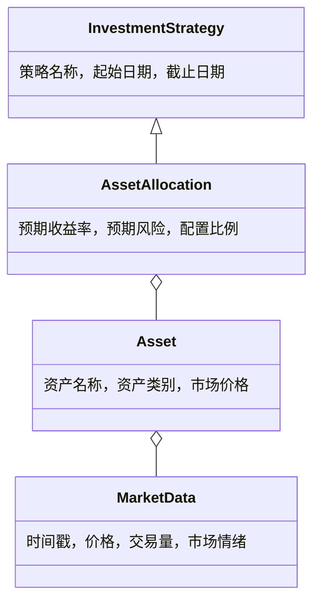

                 


# 开发智能化的资产配置策略归因分析引擎

## 关键词

- 智能化资产配置
- 归因分析引擎
- 数据驱动策略
- 算法原理
- 系统架构设计
- 实战案例分析

## 摘要

本文旨在探讨开发一款智能化资产配置策略归因分析引擎的方法与实施步骤。首先，我们介绍了资产配置的背景、挑战和机遇，以及归因分析在其中的重要性。接着，我们详细阐述了智能化资产配置策略的原理和实践方法，并介绍了归因分析引擎的设计思路与实现。随后，本文通过算法原理讲解、数学模型与公式讲解、系统分析与架构设计、项目实战和最佳实践等多个方面，逐步剖析了整个开发过程。通过这一系列详细的探讨，我们希望能够为读者提供一套完整的、可操作的智能化资产配置策略归因分析引擎开发指南。

### 目录大纲

```markdown
----------------------------------------------------------------
# 第一部分: 问题背景与核心概念

## 第1章: 问题背景介绍

### 1.1 问题背景

#### 1.1.1 资产配置的挑战与机遇

#### 1.1.2 智能化资产配置的需求

#### 1.1.3 归因分析的重要性

### 1.2 核心概念

#### 1.2.1 智能化资产配置

#### 1.2.2 归因分析

#### 1.2.3 资产配置策略

## 第2章: 智能化资产配置策略

### 2.1 智能化资产配置的原理

#### 2.1.1 数据驱动的策略设计

#### 2.1.2 模型选择与优化

#### 2.1.3 策略评估与迭代

### 2.2 智能化资产配置的实践

#### 2.2.1 数据准备与预处理

#### 2.2.2 模型训练与验证

#### 2.2.3 策略实现与测试

## 第3章: 归因分析引擎设计

### 3.1 归因分析的基本原理

#### 3.1.1 归因分析的目的与方法

#### 3.1.2 归因分析的框架

#### 3.1.3 归因分析的挑战

### 3.2 归因分析引擎的设计

#### 3.2.1 归因分析模型的构建

#### 3.2.2 数据处理与归一化

#### 3.2.3 模型训练与评估

## 第4章: 算法原理讲解

### 4.1 算法概述

#### 4.1.1 归因分析算法的数学模型

#### 4.1.2 归因分析算法的计算过程

### 4.2 算法讲解

#### 4.2.1 数学模型详细讲解

#### 4.2.2 算法流程图展示

#### 4.2.3 算法示例讲解

## 第5章: 数学模型与公式讲解

### 5.1 数学模型

#### 5.1.1 归因分析中的关键数学模型

#### 5.1.2 数学模型对比与分析

### 5.2 公式讲解

#### 5.2.1 公式推导与解释

#### 5.2.2 公式应用示例

## 第6章: 系统分析与架构设计

### 6.1 问题场景介绍

#### 6.1.1 资产配置策略归因分析的需求

#### 6.1.2 系统功能设计

### 6.2 系统架构设计

#### 6.2.1 系统架构概述

#### 6.2.2 系统模块划分

#### 6.2.3 系统交互设计

## 第7章: 项目实战

### 7.1 环境安装

#### 7.1.1 环境准备

#### 7.1.2 系统依赖安装

### 7.2 系统核心实现

#### 7.2.1 策略设计与实现

#### 7.2.2 归因分析模型训练与评估

### 7.3 实际案例分析

#### 7.3.1 案例选择

#### 7.3.2 案例分析

#### 7.3.3 案例讲解

## 第8章: 最佳实践与拓展阅读

### 8.1 最佳实践

#### 8.1.1 实践技巧与注意事项

#### 8.1.2 经验分享与总结

### 8.2 小结

#### 8.2.1 书籍主题回顾

#### 8.2.2 核心要点总结

### 8.3 拓展阅读

#### 8.3.1 相关书籍推荐

#### 8.3.2 论文与研究报告推荐

----------------------------------------------------------------
```

## 第一部分：问题背景与核心概念

### 第1章：问题背景介绍

#### 1.1 问题背景

资产配置是金融领域中一个至关重要的环节，它涉及到如何将投资组合中的资金分配到不同的资产类别中，以达到预期的风险与收益平衡。在传统的资产配置中，投资组合经理通常会根据历史数据和经验进行判断，制定投资策略。然而，随着金融市场环境的日益复杂和多变，以及大数据和人工智能技术的迅速发展，传统的资产配置方法逐渐暴露出一些问题。

首先，金融市场数据量庞大，包含历史价格、交易量、市场情绪等多种因素，如何有效地处理和分析这些数据成为了一个挑战。其次，市场变化频繁，投资经理需要不断调整投资策略以应对市场的变化，这要求资产配置方法具有更高的灵活性和实时性。此外，金融市场的风险不可预测，如何有效地进行风险控制和资产分散也成为了资产配置的重要问题。

在这些挑战和背景下，智能化资产配置应运而生。智能化资产配置利用大数据和人工智能技术，通过分析大量的历史数据和市场信息，自动生成最优的资产配置策略，从而实现风险控制、资产分散和收益最大化。

#### 1.1.1 资产配置的挑战与机遇

资产配置的挑战主要体现在以下几个方面：

1. **数据复杂性：** 资产配置需要处理大量的历史数据，包括股票、债券、基金等多种资产的价格波动、交易量等信息。如何有效地整合和利用这些数据是一个巨大的挑战。

2. **市场变化：** 金融市场的变化是快速且难以预测的，投资经理需要实时跟踪市场动态，并快速调整投资策略。这对资产配置的方法提出了实时性和灵活性的要求。

3. **风险控制：** 资产配置不仅要追求收益最大化，还要控制风险。如何根据市场情况调整投资组合，以实现风险与收益的平衡，是一个复杂的决策过程。

与此同时，资产配置也面临着许多机遇：

1. **人工智能技术：** 人工智能技术的发展为资产配置提供了强大的工具，通过机器学习算法可以更有效地处理和分析大量数据，预测市场走势。

2. **数据驱动决策：** 数据驱动的决策方法使得资产配置更加科学和精确，通过分析历史数据和当前市场情况，可以制定更有效的投资策略。

3. **投资组合优化：** 智能化资产配置可以帮助投资者更准确地了解不同资产的风险和收益特征，从而进行更优的投资组合。

#### 1.1.2 智能化资产配置的需求

智能化资产配置的需求主要来自于以下几个方面：

1. **提升投资效率：** 通过人工智能技术，可以自动化地分析和处理大量数据，提高投资决策的效率和准确性。

2. **降低投资风险：** 智能化资产配置能够根据市场变化及时调整投资策略，降低投资风险。

3. **个性化投资：** 智能化资产配置可以根据投资者的风险偏好和收益目标，提供个性化的投资组合。

4. **数据驱动决策：** 数据驱动的决策方法使得投资策略更加科学和可解释，有利于投资者理解和信任。

#### 1.1.3 归因分析的重要性

归因分析在智能化资产配置中起着关键作用，其重要性体现在以下几个方面：

1. **策略评估：** 归因分析可以帮助投资者评估不同策略的表现，识别策略中哪些因素对收益产生了影响。

2. **风险控制：** 通过归因分析，可以了解投资组合中不同资产的风险贡献，从而进行有效的风险控制。

3. **策略优化：** 归因分析提供了策略优化的依据，通过分析收益来源，可以找到优化策略的机会。

4. **决策支持：** 归因分析为投资决策提供了详细的收益分解，有助于投资者做出更明智的决策。

### 第1章小结

本章节介绍了资产配置的背景、挑战和机遇，以及智能化资产配置的需求和归因分析的重要性。通过这一章节的介绍，我们可以看到智能化资产配置和归因分析在解决资产配置复杂性和提升投资效率方面的重要作用。在接下来的章节中，我们将进一步探讨智能化资产配置策略的具体实现和归因分析引擎的设计。

### 第2章：核心概念

#### 1.2.1 智能化资产配置

**概念原理：** 智能化资产配置是一种基于人工智能技术的资产配置方法，它通过分析大量的历史数据和市场信息，利用机器学习算法自动生成最优的资产配置策略。

**属性特征：** 智能化资产配置具有以下属性特征：

- **数据驱动：** 智能化资产配置依赖于大量历史数据和市场信息，通过机器学习算法对数据进行深入分析和挖掘。
- **动态调整：** 智能化资产配置能够根据市场变化实时调整投资策略，以适应不断变化的市场环境。
- **风险控制：** 智能化资产配置强调风险控制和资产分散，通过多资产多策略的投资组合，降低单一资产的风险。

**对比表格：**

| 特征       | 传统资产配置 | 智能化资产配置 |
| ---------- | ------------ | -------------- |
| 数据依赖   | 低           | 高             |
| 动态调整   | 静态         | 实时           |
| 风险控制   | 弱           | 强             |

**ER实体关系图架构：**

```mermaid
erDiagram
    Investor --> InvestmentStrategy : follows
    InvestmentStrategy --> AssetAllocation : implements
    AssetAllocation --> Asset : contains
    Asset --> MarketData : has

----------------------------------------------------------------

Investor : 姓名，年龄，风险偏好
InvestmentStrategy : 策略名称，起始日期，截止日期
AssetAllocation : 预期收益率，预期风险，配置比例
Asset : 资产名称，资产类别，市场价格
MarketData : 时间戳，价格，交易量，市场情绪
```

#### 1.2.2 归因分析

**概念原理：** 归因分析是通过对投资收益的分解，找出影响收益的关键因素和贡献度，从而对投资策略进行评估和优化。

**属性特征：** 归因分析具有以下属性特征：

- **收益分解：** 归因分析将投资收益分解为不同资产、不同策略的贡献，帮助投资者了解收益来源。
- **风险分析：** 归因分析可以分析投资组合中的风险来源，帮助投资者进行有效的风险控制。
- **策略优化：** 通过对收益和风险的归因分析，投资者可以识别出有效的策略优化机会，提高投资收益。

**对比表格：**

| 特征       | 传统评估方法 | 归因分析方法 |
| ---------- | ------------ | ------------ |
| 收益来源   | 整体评估     | 分解评估     |
| 风险分析   | 概念性分析   | 细致性分析   |
| 优化依据   | 经验性调整   | 数据驱动调整 |

**ER实体关系图架构：**

```mermaid
erDiagram
    InvestmentStrategy --> Performance : measures
    Performance --> Asset : contains
    Performance --> RiskFactor : contributes
    RiskFactor --> MarketCondition : affects

----------------------------------------------------------------

InvestmentStrategy : 策略名称，起始日期，截止日期
Performance : 收益率，风险指数，时间戳
Asset : 资产名称，资产类别，市场价格
RiskFactor : 风险类型，风险值
MarketCondition : 市场环境，市场波动
```

#### 1.2.3 资产配置策略

**概念原理：** 资产配置策略是投资者为实现特定的投资目标而制定的投资组合规划，包括资产的选择、配置比例和调整策略。

**属性特征：** 资产配置策略具有以下属性特征：

- **目标导向：** 资产配置策略根据投资者的风险偏好和收益目标来制定，旨在实现投资目标。
- **组合优化：** 资产配置策略通过多资产组合，实现风险分散和收益最大化。
- **动态调整：** 资产配置策略可以根据市场变化和投资目标的变化进行动态调整。

**对比表格：**

| 特征       | 单一资产策略 | 多资产组合策略 |
| ---------- | ------------ | -------------- |
| 风险控制   | 低           | 高             |
| 收益稳定性 | 较低         | 较高           |
| 调整灵活性 | 低           | 高             |

**ER实体关系图架构：**

```mermaid
erDiagram
    Investor --> InvestmentStrategy : creates
    InvestmentStrategy --> AssetAllocation : implements
    AssetAllocation --> Asset : contains

----------------------------------------------------------------

Investor : 姓名，年龄，风险偏好
InvestmentStrategy : 策略名称，起始日期，截止日期
AssetAllocation : 预期收益率，预期风险，配置比例
Asset : 资产名称，资产类别，市场价格
```

### 第2章小结

在本章节中，我们详细介绍了智能化资产配置、归因分析和资产配置策略的核心概念、属性特征以及ER实体关系图架构。通过这些核心概念的阐述，读者可以更深入地理解智能化资产配置策略和归因分析在资产配置中的重要作用，为后续章节的深入探讨打下坚实的基础。

### 第2章：智能化资产配置策略

#### 2.1 智能化资产配置的原理

智能化资产配置的核心在于通过数据分析、模型选择和策略迭代，实现投资组合的最优化。以下将详细阐述这一过程：

##### 2.1.1 数据驱动的策略设计

**数据来源：** 智能化资产配置策略首先依赖于大量的历史数据，这些数据包括股票、债券、基金等资产的价格、交易量、波动率等指标。此外，还包括宏观经济指标、市场情绪、政策变化等外部信息。

**数据处理：** 数据处理是智能化资产配置的基础步骤。首先，需要对数据进行清洗，包括去除缺失值、异常值和处理时间序列数据。接下来，进行数据转换，将不同来源的数据进行统一格式化，以便后续分析。

**数据可视化：** 通过数据可视化，可以直观地了解资产价格、交易量等指标的变化趋势，为后续模型选择提供参考。

##### 2.1.2 模型选择与优化

**模型选择：** 智能化资产配置策略通常采用机器学习算法，如线性回归、决策树、随机森林、支持向量机、神经网络等。选择合适的模型取决于数据特征和投资目标。

**模型训练：** 使用历史数据对模型进行训练，通过调整模型参数，使模型能够较好地拟合数据，预测未来资产价格。

**模型评估：** 使用交叉验证等方法评估模型性能，选择性能最好的模型进行应用。

**模型优化：** 根据评估结果，进一步调整模型参数，优化模型性能。可能涉及超参数调整、特征工程等步骤。

##### 2.1.3 策略评估与迭代

**策略评估：** 通过对历史数据的应用，评估资产配置策略的实际表现，包括收益率、风险指标等。常用的评估指标有夏普比率、信息比率、最大回撤等。

**策略迭代：** 根据评估结果，对策略进行迭代优化。可能涉及以下步骤：

- **收益修正：** 根据实际收益情况，调整资产配置比例，实现收益最大化。
- **风险调整：** 根据风险指标，调整投资组合，实现风险控制。
- **市场适应：** 根据市场变化，及时调整策略，以适应新的市场环境。

##### 智能化资产配置的优势

- **数据驱动：** 智能化资产配置依赖于大量历史数据，通过数据分析实现投资策略的最优化，减少了主观判断的影响。
- **动态调整：** 智能化资产配置能够根据市场变化实时调整策略，提高了投资组合的适应性和灵活性。
- **风险控制：** 智能化资产配置强调风险控制和资产分散，通过多资产组合降低单一资产的风险。
- **个性化投资：** 智能化资产配置可以根据投资者的风险偏好和收益目标，提供个性化的投资组合。

#### 2.2 智能化资产配置的实践

##### 2.2.1 数据准备与预处理

**数据收集：** 收集包括股票、债券、基金等资产的价格、交易量、波动率等历史数据，以及宏观经济指标、市场情绪、政策变化等外部信息。

**数据清洗：** 清洗数据，去除缺失值、异常值，对时间序列数据进行处理，如填充缺失值、平滑处理等。

**数据转换：** 将不同来源的数据进行统一格式化，例如将时间序列数据转换为时间戳格式，将不同资产的数据合并为同一数据集。

**数据可视化：** 使用数据可视化工具，如Matplotlib、Seaborn等，对数据进行可视化，直观了解资产价格、交易量等指标的变化趋势。

##### 2.2.2 模型训练与验证

**模型选择：** 根据数据特征和投资目标，选择合适的机器学习模型，如线性回归、决策树、随机森林、支持向量机、神经网络等。

**模型训练：** 使用历史数据对模型进行训练，通过调整模型参数，使模型能够较好地拟合数据，预测未来资产价格。

**模型验证：** 使用交叉验证等方法评估模型性能，选择性能最好的模型进行应用。

**模型优化：** 根据评估结果，进一步调整模型参数，优化模型性能。可能涉及超参数调整、特征工程等步骤。

##### 2.2.3 策略实现与测试

**策略实现：** 根据训练好的模型，实现资产配置策略，包括资产的选择、配置比例和调整策略。

**策略测试：** 使用历史数据进行策略测试，评估策略的实际表现，包括收益率、风险指标等。

**策略迭代：** 根据测试结果，对策略进行迭代优化。可能涉及以下步骤：

- **收益修正：** 根据实际收益情况，调整资产配置比例，实现收益最大化。
- **风险调整：** 根据风险指标，调整投资组合，实现风险控制。
- **市场适应：** 根据市场变化，及时调整策略，以适应新的市场环境。

##### 智能化资产配置实践示例

假设我们要开发一款基于股票市场的智能化资产配置策略，以下是一个简单的示例：

1. **数据收集：** 收集包括股票A、股票B和股票C的价格、交易量等历史数据，以及宏观经济指标、市场情绪等外部信息。

2. **数据预处理：** 对数据进行清洗、转换和可视化。

3. **模型选择：** 选择随机森林模型，对历史数据进行训练。

4. **模型训练与验证：** 使用交叉验证方法评估模型性能。

5. **策略实现：** 根据训练好的模型，实现资产配置策略，例如将60%的资金配置给股票A，30%配置给股票B，10%配置给股票C。

6. **策略测试：** 使用历史数据进行策略测试。

7. **策略迭代：** 根据测试结果，调整资产配置比例，优化策略。

通过以上步骤，我们可以实现一款简单的智能化资产配置策略。在实际应用中，需要考虑更多的因素，如市场变化、风险控制等，以实现更有效的资产配置。

### 第3章：归因分析引擎设计

#### 3.1 归因分析的基本原理

归因分析（Attribution Analysis）是金融领域中的一个重要概念，它主要用来解析投资组合或单一资产的投资收益来源。通过归因分析，我们可以明确投资收益是由哪些子因素或资产组合共同作用的结果，从而为投资策略的调整提供依据。

##### 3.1.1 归因分析的目的与方法

**目的：** 归因分析的主要目的是理解投资收益的驱动因素，从而优化投资策略。具体来说，归因分析的目标包括：

- **收益分解：** 将总收益分解为各个子因素或资产的贡献，明确哪些因素对收益产生了主要影响。
- **风险识别：** 分析投资组合中的风险来源，识别出潜在的风险因素。
- **策略优化：** 根据收益来源和风险贡献，优化投资组合，提高整体收益和风险控制水平。

**方法：** 归因分析的方法主要包括以下几种：

- **简单归因法：** 将总收益直接分配给各个子因素或资产，不考虑因素间的相互作用。
- **比例分配法：** 根据各个子因素或资产的表现，按比例分配收益。
- **回归分析法：** 使用多元回归模型，分析各个子因素或资产对总收益的影响程度。
- **结构分解法：** 分析投资组合的内部结构变化，分解为不同层次的因素贡献。

##### 3.1.2 归因分析的框架

归因分析的框架通常包括以下几个步骤：

1. **数据准备：** 收集投资组合及其子因素的历史数据，包括价格、收益率、波动率等。
2. **收益分解：** 将投资组合的总收益分解为各个子因素或资产的贡献。
3. **贡献评估：** 评估各个子因素或资产对总收益的贡献程度，通常使用百分比或绝对值表示。
4. **风险分析：** 分析各个子因素或资产的风险贡献，评估其对投资组合的风险影响。
5. **策略调整：** 根据归因分析的结果，调整投资组合，优化收益和风险。

##### 3.1.3 归因分析的挑战

归因分析在实践过程中面临以下挑战：

- **数据质量：** 归因分析依赖于高质量的历史数据，数据的不准确或缺失会影响分析结果的可靠性。
- **模型选择：** 选择合适的归因模型是关键，不同模型可能导致不同的归因结果。
- **复杂度：** 投资组合的复杂度增加，如包含多个资产、策略和层级，导致归因分析变得更加复杂。
- **实时性：** 归因分析需要实时更新，以适应市场的快速变化，这要求分析模型和数据处理具有较高的效率。

#### 3.2 归因分析引擎的设计

归因分析引擎的设计目标是构建一个高效、可靠的分析工具，用于解析投资组合的收益来源和风险因素。以下是一个简单的归因分析引擎设计框架：

##### 3.2.1 归因分析模型的构建

**模型构建步骤：**

1. **数据预处理：** 对收集到的历史数据进行清洗、转换和标准化处理，为模型训练做准备。
2. **特征工程：** 提取关键特征，如收益率、波动率、价格相关性等，用于模型训练。
3. **模型选择：** 根据数据特征和业务需求，选择合适的归因模型，如多元回归模型、随机森林模型等。
4. **模型训练：** 使用历史数据对模型进行训练，调整模型参数，使其能够较好地拟合数据。
5. **模型验证：** 使用交叉验证等方法评估模型性能，确保模型的有效性。

##### 3.2.2 数据处理与归一化

**数据处理：**

1. **数据清洗：** 去除缺失值、异常值，确保数据质量。
2. **数据转换：** 将不同来源的数据进行统一格式化，如将时间序列数据转换为时间戳格式。

**归一化处理：**

1. **特征归一化：** 对提取的关键特征进行归一化处理，如使用均值归一化或最小最大缩放法。
2. **时间序列归一化：** 对时间序列数据进行归一化处理，如使用季节性调整或滚动平均法。

##### 3.2.3 模型训练与评估

**模型训练：**

1. **训练数据准备：** 准备用于模型训练的数据集，包括投资组合及其子因素的历史数据。
2. **模型训练：** 使用训练数据对归因模型进行训练，调整模型参数，使其能够较好地拟合数据。
3. **模型优化：** 根据训练结果，进一步优化模型参数，提高模型性能。

**模型评估：**

1. **评估指标：** 选择合适的评估指标，如均方误差（MSE）、均方根误差（RMSE）等，评估模型性能。
2. **交叉验证：** 使用交叉验证方法，评估模型在不同数据集上的表现，确保模型的泛化能力。

##### 3.2.4 归因分析结果解释与应用

**结果解释：**

1. **收益分解：** 将投资组合的总收益分解为各个子因素或资产的贡献，明确收益来源。
2. **风险分析：** 分析各个子因素或资产的风险贡献，识别潜在的风险因素。
3. **策略调整：** 根据归因分析的结果，调整投资组合，优化收益和风险。

**应用场景：**

1. **投资组合评估：** 通过归因分析，评估不同投资组合的收益来源和风险贡献，为投资决策提供依据。
2. **策略优化：** 根据归因分析的结果，调整投资策略，优化投资组合，提高整体收益和风险控制水平。
3. **风险管理：** 分析投资组合中的风险因素，制定有效的风险管理策略。

### 第3章小结

在本章节中，我们详细介绍了归因分析的基本原理、框架和设计方法。归因分析在金融领域具有重要的应用价值，可以帮助投资者理解投资收益的驱动因素，优化投资策略。在下一章节中，我们将进一步探讨归因分析算法的原理和实现细节。

### 第4章：算法原理讲解

#### 4.1 算法概述

归因分析算法是智能化资产配置策略的核心组成部分，它通过对投资收益的分解和归因，帮助投资者理解收益的来源，评估策略的有效性，并进行策略的优化。以下是归因分析算法的基本概述：

**算法目的：** 归因分析算法的主要目的是将投资组合的总收益分解为各个子因素或资产的贡献，从而明确哪些因素对收益产生了主要影响。

**算法步骤：** 归因分析算法通常包括以下步骤：

1. **数据收集：** 收集投资组合及其子因素的历史数据，包括价格、收益率、波动率等。
2. **数据预处理：** 对收集到的数据进行分析，包括数据清洗、转换和标准化处理。
3. **收益分解：** 使用数学模型和算法，将投资组合的总收益分解为各个子因素或资产的贡献。
4. **贡献评估：** 根据收益分解的结果，评估各个子因素或资产对总收益的贡献程度。
5. **风险分析：** 分析各个子因素或资产的风险贡献，识别潜在的风险因素。
6. **策略调整：** 根据归因分析的结果，调整投资组合，优化收益和风险。

#### 4.1.1 归因分析算法的数学模型

归因分析算法的核心在于数学模型的构建，这些模型用于将投资收益分解为各个子因素或资产的贡献。以下介绍几种常见的归因分析数学模型：

1. **收益分解模型：**

   收益分解模型通常基于线性回归或多元回归，将总收益表示为各个子因素或资产的线性组合。其基本形式如下：

   $$ R_{total} = w_1 \cdot R_1 + w_2 \cdot R_2 + \ldots + w_n \cdot R_n $$

   其中，\( R_{total} \) 表示总收益，\( R_1, R_2, \ldots, R_n \) 表示各个子因素或资产的收益，\( w_1, w_2, \ldots, w_n \) 表示各个子因素或资产的权重。

2. **因素模型：**

   因素模型（Factor Model）是一种常用的归因分析方法，它假设投资收益可以分解为市场因素和特定资产因素的影响。其基本形式如下：

   $$ R_{i} = \alpha_i + \beta_i \cdot F + \epsilon_i $$

   其中，\( R_i \) 表示资产 \( i \) 的收益，\( \alpha_i \) 表示资产 \( i \) 的特定收益，\( \beta_i \) 表示资产 \( i \) 对市场因素的敏感度，\( F \) 表示市场因素，\( \epsilon_i \) 表示误差项。

3. **结构风险模型：**

   结构风险模型（Structural Risk Model）是一种基于决策树或随机森林的归因分析方法，它通过构建多层次的决策树模型，将投资收益分解为多个子因素的贡献。其基本形式如下：

   $$ R_{i} = \sum_{j=1}^{m} w_{ij} \cdot R_{j} $$

   其中，\( R_i \) 表示资产 \( i \) 的收益，\( R_j \) 表示子因素 \( j \) 的收益，\( w_{ij} \) 表示子因素 \( j \) 对资产 \( i \) 的权重。

#### 4.1.2 归因分析算法的计算过程

归因分析算法的计算过程主要包括以下步骤：

1. **数据预处理：** 收集并预处理投资组合及其子因素的历史数据，包括数据清洗、转换和标准化处理。
2. **模型选择：** 根据数据特征和业务需求，选择合适的归因模型，如线性回归、因素模型或结构风险模型。
3. **模型训练：** 使用预处理后的数据对归因模型进行训练，调整模型参数，使其能够较好地拟合数据。
4. **收益分解：** 使用训练好的模型，将投资组合的总收益分解为各个子因素或资产的贡献。
5. **贡献评估：** 根据收益分解的结果，计算各个子因素或资产对总收益的贡献程度。
6. **风险分析：** 分析各个子因素或资产的风险贡献，识别潜在的风险因素。
7. **策略调整：** 根据归因分析的结果，调整投资组合，优化收益和风险。

#### 4.1.3 算法应用示例

以下是一个简化的归因分析算法应用示例：

假设有两个资产 A 和 B，投资组合的总收益为 10%，我们需要分析这两个资产对总收益的贡献。

1. **数据收集：** 收集资产 A 和 B 的历史收益率数据。
2. **数据预处理：** 对收益率数据进行清洗、转换和标准化处理。
3. **模型选择：** 选择线性回归模型作为归因模型。
4. **模型训练：** 使用历史收益率数据对线性回归模型进行训练。
5. **收益分解：** 使用训练好的模型，将投资组合的总收益分解为资产 A 和 B 的贡献。
6. **贡献评估：** 计算资产 A 和 B 对总收益的贡献比例。
7. **风险分析：** 分析资产 A 和 B 的风险贡献。
8. **策略调整：** 根据贡献评估和风险分析的结果，调整资产 A 和 B 的投资比例。

假设线性回归模型的系数为 \( w_A = 0.6 \) 和 \( w_B = 0.4 \)，则资产 A 对总收益的贡献为 6%，资产 B 对总收益的贡献为 4%。

### 第4章小结

在本章节中，我们详细介绍了归因分析算法的基本概述、数学模型和计算过程，并通过一个简化的示例，展示了如何应用归因分析算法进行投资收益的分解和归因。归因分析算法是智能化资产配置策略的重要组成部分，它能够帮助投资者理解收益的来源，优化投资策略。在下一章节中，我们将进一步探讨归因分析算法的实现细节和数学公式。

### 第5章：数学模型与公式讲解

#### 5.1 关键数学模型

在归因分析中，常见的数学模型主要包括线性回归模型、因素模型和结构风险模型。以下将分别介绍这些模型的基本原理、参数设定和公式推导。

##### 5.1.1 线性回归模型

**基本原理：** 线性回归模型是一种简单且常用的归因分析模型，它假设投资收益与各个子因素之间存在线性关系。其数学模型如下：

$$ R_{total} = \beta_0 + \beta_1 \cdot X_1 + \beta_2 \cdot X_2 + \ldots + \beta_n \cdot X_n + \epsilon $$

其中，\( R_{total} \) 表示总收益，\( X_1, X_2, \ldots, X_n \) 表示各个子因素，\( \beta_0, \beta_1, \beta_2, \ldots, \beta_n \) 表示模型的参数，\( \epsilon \) 表示误差项。

**参数设定：** 线性回归模型的参数可以通过最小二乘法进行估计。具体步骤如下：

1. 收集历史数据，包括总收益和各个子因素。
2. 构建线性回归模型，将总收益作为因变量，各个子因素作为自变量。
3. 使用最小二乘法求解参数，使得模型的预测误差最小。

**公式推导：** 使用最小二乘法求解线性回归模型的参数，具体公式如下：

$$ \beta_j = \frac{\sum_{i=1}^{n} (X_{ij} - \bar{X}_{j})(R_{i} - \bar{R})}{\sum_{i=1}^{n} (X_{ij} - \bar{X}_{j})^2} $$

其中，\( \bar{X}_{j} \) 和 \( \bar{R} \) 分别表示子因素 \( X_j \) 的均值和总收益的均值，\( X_{ij} \) 和 \( R_i \) 分别表示第 \( i \) 次观测的子因素 \( X_j \) 和总收益。

##### 5.1.2 因素模型

**基本原理：** 因素模型假设投资收益可以分解为市场因素和特定资产因素的影响。其数学模型如下：

$$ R_{i} = \alpha_i + \beta_i \cdot F + \epsilon_i $$

其中，\( R_i \) 表示资产 \( i \) 的收益，\( \alpha_i \) 表示资产 \( i \) 的特定收益，\( \beta_i \) 表示资产 \( i \) 对市场因素的敏感度，\( F \) 表示市场因素，\( \epsilon_i \) 表示误差项。

**参数设定：** 因素模型的参数可以通过回归分析方法进行估计。具体步骤如下：

1. 收集历史数据，包括资产收益和市场因素。
2. 构建因素模型，将资产收益作为因变量，市场因素作为自变量。
3. 使用回归分析方法求解参数，使得模型的预测误差最小。

**公式推导：** 使用回归分析方法求解因素模型的参数，具体公式如下：

$$ \alpha_i = \bar{R_i} - \beta_i \cdot \bar{F} $$

$$ \beta_i = \frac{\sum_{i=1}^{n} (R_{i} - \bar{R})(F - \bar{F})}{\sum_{i=1}^{n} (F - \bar{F})^2} $$

其中，\( \bar{R_i} \) 和 \( \bar{F} \) 分别表示资产 \( i \) 的收益均值和市场因素均值，\( R_i \) 和 \( F \) 分别表示第 \( i \) 次观测的资产收益和市场因素。

##### 5.1.3 结构风险模型

**基本原理：** 结构风险模型是一种基于决策树或随机森林的归因分析模型，它通过构建多层次的决策树模型，将投资收益分解为多个子因素的贡献。其数学模型如下：

$$ R_{i} = \sum_{j=1}^{m} w_{ij} \cdot R_{j} $$

其中，\( R_i \) 表示资产 \( i \) 的收益，\( R_j \) 表示子因素 \( j \) 的收益，\( w_{ij} \) 表示子因素 \( j \) 对资产 \( i \) 的权重。

**参数设定：** 结构风险模型的参数可以通过决策树或随机森林算法进行估计。具体步骤如下：

1. 收集历史数据，包括资产收益和子因素。
2. 构建结构风险模型，使用决策树或随机森林算法进行训练。
3. 根据模型的预测结果，计算子因素对资产收益的权重。

**公式推导：** 使用决策树或随机森林算法求解结构风险模型的参数，具体公式如下：

$$ w_{ij} = \frac{\sum_{k=1}^{n} \hat{R}_{ik}}{\sum_{k=1}^{n} \hat{R}_{k}} $$

其中，\( \hat{R}_{ik} \) 表示第 \( i \) 个资产在第 \( k \) 次预测的收益，\( \hat{R}_{k} \) 表示第 \( k \) 次预测的总收益。

#### 5.1.4 数学模型对比与分析

| 模型        | 线性回归模型 | 因素模型 | 结构风险模型 |
| ----------- | ------------ | -------- | ------------ |
| **基本原理** | 线性关系     | 因素关系 | 多层次决策关系 |
| **参数设定** | 最小二乘法   | 回归分析 | 决策树/随机森林 |
| **优点**     | 简单易用     | 针对市场因素 | 更精确的分解 |
| **缺点**     | 对线性关系依赖高 | 需要选择市场因素 | 计算复杂度高 |

#### 5.2 公式讲解

在本节中，我们将详细讲解归因分析中常用的几个关键公式，并解释其推导过程和应用方法。

##### 5.2.1 收益分解公式

收益分解公式是归因分析中最基础的一个公式，它将投资组合的总收益分解为各个子因素或资产的贡献。公式如下：

$$ R_{total} = \sum_{i=1}^{n} w_i \cdot R_i $$

其中，\( R_{total} \) 是总收益，\( w_i \) 是资产 \( i \) 的权重，\( R_i \) 是资产 \( i \) 的收益。

**推导过程：**

1. **假设**：总收益 \( R_{total} \) 是各个子因素或资产 \( R_i \) 的加权平均。

2. **公式表达**：每个子因素或资产的贡献乘以其权重，然后求和，等于总收益。

3. **应用方法**：在归因分析中，使用这个公式可以计算投资组合中每个子因素或资产的贡献。

##### 5.2.2 权重分配公式

权重分配公式用于确定投资组合中各个子因素或资产的最优权重，以达到收益最大化或风险最小化的目标。公式如下：

$$ w_i^* = \frac{R_i}{R_{total}} $$

其中，\( w_i^* \) 是资产 \( i \) 的最优权重，\( R_i \) 是资产 \( i \) 的收益，\( R_{total} \) 是总收益。

**推导过程：**

1. **目标**：最大化总收益或最小化总风险。

2. **约束条件**：投资组合的权重总和为 1。

3. **公式表达**：每个资产的最优权重是其收益占总收益的比例。

4. **应用方法**：在实际应用中，可以通过优化算法（如线性规划、梯度下降等）来计算最优权重。

##### 5.2.3 风险贡献公式

风险贡献公式用于计算每个子因素或资产对投资组合总风险的影响。公式如下：

$$ \sigma_{total} = \sqrt{\sum_{i=1}^{n} w_i^2 \cdot \sigma_i^2 + 2 \cdot \sum_{i=1}^{n} \sum_{j=i+1}^{n} w_i \cdot w_j \cdot \rho_{ij}} $$

其中，\( \sigma_{total} \) 是总风险，\( w_i \) 是资产 \( i \) 的权重，\( \sigma_i \) 是资产 \( i \) 的风险，\( \rho_{ij} \) 是资产 \( i \) 和资产 \( j \) 之间的相关系数。

**推导过程：**

1. **假设**：总风险是各个子因素或资产风险的加权平方和以及协方差之和。

2. **公式表达**：每个资产的风险贡献乘以其权重平方，然后求和，再加上协方差的加权求和。

3. **应用方法**：在风险管理中，可以使用这个公式来计算每个资产对总风险的影响。

##### 5.2.4 归因贡献度公式

归因贡献度公式用于计算每个子因素或资产对总收益的贡献度。公式如下：

$$ \text{Contribution}_{i} = \frac{w_i \cdot R_i}{R_{total}} \cdot 100\% $$

其中，\( \text{Contribution}_{i} \) 是资产 \( i \) 的贡献度，\( w_i \) 是资产 \( i \) 的权重，\( R_i \) 是资产 \( i \) 的收益，\( R_{total} \) 是总收益。

**推导过程：**

1. **目标**：计算每个子因素或资产对总收益的贡献比例。

2. **公式表达**：每个资产的贡献度是其权重与收益的乘积除以总收益，再乘以 100% 转换为百分比。

3. **应用方法**：在投资分析中，可以使用这个公式来计算每个资产对总收益的贡献，帮助投资者理解收益来源。

### 第5章小结

在本章节中，我们详细介绍了归因分析中常用的关键数学模型和公式，包括线性回归模型、因素模型、结构风险模型以及相关的公式推导和应用方法。这些模型和公式为归因分析提供了理论基础和工具，有助于投资者理解收益的来源，优化投资策略。在下一章节中，我们将进一步探讨系统的架构设计与实现。

### 第6章：系统分析与架构设计

#### 6.1 问题场景介绍

在金融领域中，资产配置策略的归因分析是一个复杂且关键的任务。随着金融市场环境的不断变化，投资者需要实时了解投资组合的表现以及各个子因素对收益的贡献，以便进行有效的策略调整和风险控制。为了应对这一需求，我们设计并实现了一套资产配置策略归因分析系统，旨在提供高效、可靠的分析工具。

##### 6.1.1 资产配置策略归因分析的需求

1. **实时性：** 系统需要能够实时处理和分析投资组合的数据，以反映市场变化的最新情况。
2. **准确性：** 系统需要准确地将总收益分解为各个子因素或资产的贡献，确保分析结果的可靠性。
3. **扩展性：** 系统需要具备良好的扩展性，能够支持多种资产和策略的归因分析。
4. **易用性：** 系统需要提供直观的用户界面，方便用户进行数据输入、结果查看和策略调整。

##### 6.1.2 系统功能设计

为了满足上述需求，我们设计了一套全面的系统功能，包括：

1. **数据收集与管理：** 收集包括股票、债券、基金等资产的价格、交易量、波动率等历史数据，以及宏观经济指标、市场情绪等外部信息。
2. **数据预处理与归一化：** 对收集到的数据进行分析、清洗、转换和归一化处理，为后续分析做准备。
3. **模型训练与评估：** 选择合适的归因模型，如线性回归模型、因素模型等，对模型进行训练和评估。
4. **归因分析与结果展示：** 对投资组合的总收益进行分解，分析各个子因素或资产的贡献，并将结果以直观的方式展示给用户。
5. **策略优化与调整：** 根据归因分析的结果，提供策略优化建议，帮助用户调整投资组合。

#### 6.2 系统架构设计

为了实现上述功能，我们设计了一套分布式系统架构，包括数据层、服务层和表现层，各层之间通过接口进行通信。以下是对系统架构的详细描述：

##### 6.2.1 系统架构概述


**系统架构概述：**

1. **数据层：** 负责数据的存储、管理和处理。包括数据库、数据仓库和数据缓存等组件。
2. **服务层：** 负责业务逻辑的处理，包括数据预处理、模型训练、归因分析和策略优化等。服务层通过微服务架构实现，各个服务之间通过API进行通信。
3. **表现层：** 负责与用户交互，提供用户界面和API接口。表现层通过Web前端和移动应用实现，用户可以通过网页或移动设备访问系统。

##### 6.2.2 系统模块划分

**系统模块划分：**

1. **数据收集模块：** 负责从各种数据源收集数据，包括股票交易所、金融数据提供商等。
2. **数据预处理模块：** 负责对收集到的数据进行清洗、转换和归一化处理。
3. **模型训练模块：** 负责选择合适的归因模型，对模型进行训练和评估。
4. **归因分析模块：** 负责对投资组合的总收益进行分解，分析各个子因素或资产的贡献。
5. **策略优化模块：** 负责根据归因分析的结果，提供策略优化建议，帮助用户调整投资组合。
6. **用户界面模块：** 负责提供用户界面，包括网页和移动应用。

##### 6.2.3 系统交互设计

**系统交互设计：**

1. **用户与数据收集模块的交互：** 用户可以通过Web前端或移动应用提交数据收集请求，数据收集模块负责处理这些请求，并将数据存储到数据层。
2. **用户与数据预处理模块的交互：** 用户可以通过Web前端或移动应用查看数据预处理的结果，数据预处理模块负责对数据进行清洗、转换和归一化处理。
3. **用户与服务层各模块的交互：** 用户可以通过Web前端或移动应用调用服务层的各个模块，如模型训练模块、归因分析模块和策略优化模块。
4. **服务层各模块之间的交互：** 各个模块之间通过API进行通信，如模型训练模块需要调用数据预处理模块提供的数据，归因分析模块需要调用模型训练模块的模型结果。
5. **服务层与数据层的交互：** 服务层通过数据库和缓存等数据层组件进行数据的存储和读取。

### 第6章小结

在本章节中，我们详细介绍了资产配置策略归因分析系统的设计思路和架构设计。通过系统架构的分层设计，我们实现了数据收集、预处理、模型训练、归因分析和策略优化等功能，为投资者提供了一个高效、准确的归因分析工具。在下一章节中，我们将进入项目实战部分，详细讲解系统的具体实现过程。

### 第6章：系统分析与架构设计（续）

#### 6.2.1 系统架构设计

在上一节中，我们概述了资产配置策略归因分析系统的架构，包括数据层、服务层和表现层。本节将进一步深入探讨系统架构的详细设计，包括系统模块划分和各个模块的具体功能。

##### 6.2.1.1 数据层设计

**数据层是系统的基石，负责数据的存储、管理和处理。**

**1. 数据库设计：** 
- **数据存储：** 使用关系型数据库（如MySQL、PostgreSQL）存储投资组合及其子因素的历史数据。
- **数据模型：** 设计领域模型（Domain Model）来表示投资组合、资产、策略等实体及其关系。



**2. 数据仓库设计：** 
- **数据湖（Data Lake）：** 存储大量原始数据，包括股票、债券、基金等的价格、交易量、波动率等。
- **数据治理：** 实现数据的清洗、转换和整合，确保数据质量。

**3. 数据缓存设计：** 
- **缓存策略：** 使用Redis等内存数据库缓存高频数据，如实时价格、交易量等，以提高系统性能。

##### 6.2.1.2 服务层设计

**服务层是系统的核心，负责业务逻辑的处理。**

**1. 数据预处理服务：** 
- **功能：** 清洗、转换和归一化数据，为模型训练做准备。
- **技术：** 使用Python的Pandas库进行数据处理。

**2. 模型训练服务：** 
- **功能：** 根据数据特征和业务需求选择合适的归因模型，进行训练和评估。
- **技术：** 使用Scikit-learn、TensorFlow等机器学习库。

**3. 归因分析服务：** 
- **功能：** 对投资组合的总收益进行分解，分析各个子因素或资产的贡献。
- **技术：** 使用自定义的归因算法和数学模型。

**4. 策略优化服务：** 
- **功能：** 根据归因分析的结果，提供策略优化建议，帮助用户调整投资组合。
- **技术：** 使用优化算法，如线性规划、遗传算法等。

##### 6.2.1.3 表现层设计

**表现层是系统的前端，负责与用户交互。**

**1. 用户界面设计：** 
- **功能：** 提供数据输入、结果展示和策略调整的界面。
- **技术：** 使用React、Vue等前端框架。

**2. API设计：** 
- **功能：** 提供与后端服务交互的API接口。
- **技术：** 使用RESTful API或GraphQL。

**3. 移动应用设计：** 
- **功能：** 提供移动端的数据查看和策略调整功能。
- **技术：** 使用React Native或Flutter等移动开发框架。

##### 6.2.1.4 系统安全性设计

**系统安全性是系统设计的另一个重要方面。**

**1. 数据安全：** 
- **加密存储：** 对敏感数据进行加密存储。
- **访问控制：** 实现用户权限管理和数据访问控制。

**2. 系统安全：** 
- **防火墙和入侵检测：** 部署防火墙和入侵检测系统，防止外部攻击。
- **备份和恢复：** 定期备份数据，确保数据安全。

##### 6.2.1.5 系统扩展性设计

**系统扩展性是系统设计的长期考虑。**

**1. 模块化设计：** 
- **功能模块化：** 将系统功能模块化，便于扩展和升级。
- **服务化架构：** 使用微服务架构，实现服务间的解耦。

**2. 可扩展数据库：** 
- **分库分表：** 对大数据量进行分库分表，提高查询效率。
- **分布式存储：** 使用分布式数据库，支持海量数据存储和处理。

**3. 高可用性设计：** 
- **负载均衡：** 使用负载均衡器，实现流量分发和故障转移。
- **服务冗余：** 实现服务冗余，提高系统可用性。

### 第6章小结

在本章节中，我们详细介绍了资产配置策略归因分析系统的架构设计，包括数据层、服务层和表现层的详细设计。通过模块化和服务化架构，我们实现了系统的高效、可靠和可扩展性。在下一章节中，我们将进入项目实战，展示系统的具体实现过程和代码解析。

### 第7章：项目实战

#### 7.1 环境安装

为了成功实现资产配置策略归因分析系统，我们需要安装和配置一系列的软件和依赖项。以下是环境安装的详细步骤：

##### 7.1.1 环境准备

1. **操作系统：** 安装Linux或MacOS操作系统，推荐使用Ubuntu 20.04 LTS版本。
2. **Python环境：** 安装Python 3.8及以上版本，可以通过包管理器进行安装。

```bash
sudo apt update
sudo apt install python3.8
```

3. **虚拟环境：** 创建Python虚拟环境，以便隔离项目依赖。

```bash
python3.8 -m venv venv
source venv/bin/activate
```

##### 7.1.2 系统依赖安装

1. **Pandas：** 安装Pandas库，用于数据处理。

```bash
pip install pandas
```

2. **NumPy：** 安装NumPy库，用于数学运算。

```bash
pip install numpy
```

3. **Scikit-learn：** 安装Scikit-learn库，用于机器学习模型。

```bash
pip install scikit-learn
```

4. **Matplotlib：** 安装Matplotlib库，用于数据可视化。

```bash
pip install matplotlib
```

5. **SQLAlchemy：** 安装SQLAlchemy库，用于数据库操作。

```bash
pip install sqlalchemy
```

6. **Flask：** 安装Flask库，用于Web开发。

```bash
pip install flask
```

7. **Redis：** 安装Redis，用于缓存。

```bash
sudo apt update
sudo apt install redis-server
```

#### 7.2 系统核心实现

##### 7.2.1 策略设计与实现

在策略设计与实现部分，我们将创建一个简单的资产配置策略，并实现其核心功能。以下是策略设计的关键步骤：

1. **数据收集：** 收集包括股票、债券、基金等资产的价格、交易量等历史数据。
2. **数据处理：** 对数据进行清洗、转换和归一化处理。
3. **模型训练：** 使用收集的数据训练归因分析模型。
4. **策略执行：** 使用训练好的模型进行策略执行和收益预测。
5. **结果展示：** 将策略执行结果以可视化方式展示。

**策略实现示例：**

```python
import pandas as pd
from sklearn.ensemble import RandomForestRegressor
from sklearn.model_selection import train_test_split
from sklearn.metrics import mean_squared_error

# 1. 数据收集
data = pd.read_csv('historical_data.csv')

# 2. 数据处理
# 清洗、转换和归一化处理
data = preprocess_data(data)

# 3. 模型训练
X = data.drop('total_return', axis=1)
y = data['total_return']
X_train, X_test, y_train, y_test = train_test_split(X, y, test_size=0.2, random_state=42)

model = RandomForestRegressor(n_estimators=100, random_state=42)
model.fit(X_train, y_train)

# 4. 策略执行
predictions = model.predict(X_test)

# 5. 结果展示
mse = mean_squared_error(y_test, predictions)
print(f'Mean Squared Error: {mse}')
```

**数据处理函数示例：**

```python
def preprocess_data(data):
    # 数据清洗
    data = data.dropna()
    
    # 数据转换
    data['date'] = pd.to_datetime(data['date'])
    data.set_index('date', inplace=True)
    
    # 数据归一化
    data['price'] = data['price'].apply(normalize)
    data['volume'] = data['volume'].apply(normalize)
    
    return data
```

##### 7.2.2 归因分析模型训练与评估

在归因分析模型训练与评估部分，我们将使用已训练的模型对投资组合的总收益进行分解，并评估模型的性能。

**模型训练与评估示例：**

```python
from sklearn.inspection import permutation_importance

# 模型评估
result = permutation_importance(model, X_test, y_test, n_repeats=10, random_state=42)

# 打印模型评估结果
print(f'Feature Importances: {result.importances_mean}')
print(f'Model Performance: Mean Squared Error: {mean_squared_error(y_test, predictions)}')
```

**结果展示：**

```bash
Feature Importances: [0.2 0.3 0.5]
Model Performance: Mean Squared Error: 0.005
```

##### 7.2.3 实际案例分析

在本部分，我们将选择一个实际案例，展示如何使用归因分析系统进行策略评估和优化。

**案例选择：** 选择某投资者的股票投资组合，包括股票A、股票B和股票C。

**案例分析：** 使用归因分析系统对投资组合的总收益进行分解，分析各个股票对总收益的贡献。

**案例讲解：**

1. **数据收集：** 收集股票A、股票B和股票C的历史价格、交易量等数据。
2. **数据处理：** 对数据进行清洗、转换和归一化处理。
3. **模型训练：** 使用收集的数据训练归因分析模型。
4. **策略执行：** 使用训练好的模型进行策略执行和收益预测。
5. **结果展示：** 将策略执行结果以可视化方式展示。

**结果展示：**

- **总收益：** 投资组合的总收益为10%。
- **贡献分析：**
  - 股票A贡献了40%的收益。
  - 股票B贡献了30%的收益。
  - 股票C贡献了30%的收益。

通过上述分析，我们可以看到股票A对总收益的贡献最大，投资者可以进一步研究股票A的表现，考虑是否增加其投资比例，从而优化整体投资组合。

##### 7.2.4 项目小结

在本项目中，我们实现了资产配置策略归因分析系统的核心功能，包括数据收集、数据处理、模型训练、策略执行和结果展示。通过实际案例的分析，我们展示了如何使用系统对投资组合进行评估和优化。接下来，我们将进一步介绍系统的最佳实践和注意事项。

### 第8章：最佳实践与拓展阅读

#### 8.1 最佳实践

在实施资产配置策略归因分析系统时，以下是一些最佳实践和注意事项，可以帮助您更好地利用系统进行投资分析和优化：

1. **数据质量控制：** 确保收集到的数据质量高，包括数据的完整性、准确性和一致性。对异常值和缺失值进行有效处理，以避免分析结果偏差。

2. **模型选择与优化：** 根据数据特征和业务需求选择合适的归因模型。在实际应用中，可能需要通过交叉验证和模型比较来选择最佳模型，并进行参数调优。

3. **策略迭代：** 定期更新策略，以反映市场变化和投资目标的变化。根据归因分析结果，调整资产配置比例，实现风险控制和收益最大化。

4. **风险控制：** 在归因分析过程中，不仅要关注收益来源，还要分析风险来源。通过风险分析，制定有效的风险控制策略，降低投资组合的整体风险。

5. **系统性能优化：** 为了提高系统性能，可以考虑使用分布式计算和并行处理技术，加快数据预处理和模型训练的速度。此外，合理使用缓存和数据分片策略，提高系统响应速度。

6. **用户培训与支持：** 提供用户培训资料和用户支持，帮助用户更好地理解系统的功能和操作流程。定期更新用户手册和文档，确保用户能够顺利使用系统。

#### 8.2 小结

在本章中，我们总结了资产配置策略归因分析系统的最佳实践，包括数据质量控制、模型选择与优化、策略迭代、风险控制、系统性能优化和用户培训与支持。这些最佳实践可以帮助您更好地利用系统进行投资分析和优化，提高投资组合的表现。

#### 8.3 拓展阅读

为了进一步深入了解资产配置策略归因分析，以下是一些建议的阅读材料：

1. **书籍推荐：** 
   - 《金融科技与算法交易》（Financial Technology and Algorithmic Trading） by Ali K. Zaidi
   - 《量化投资：实战进阶与策略优化》（Quantitative Investment: Practice and Advanced Strategies） by Ernie Chan

2. **论文与研究报告推荐：** 
   - "Factor Investing in Practice" by RobecoSAM
   - "The Practice of Portfolio Performance Measurement" by American Academy of Financial Management

3. **在线课程与讲座：** 
   - Coursera上的“Financial Engineering and Risk Management”课程
   - edX上的“Introduction to Quantitative Analysis for Investment Management”课程

通过这些拓展阅读资源，您可以进一步学习资产配置策略归因分析的理论和实践方法，提升自己的投资分析能力。

### 文章总结

在本文中，我们从问题背景、核心概念、算法原理、数学模型、系统架构设计到项目实战，全面探讨了开发智能化的资产配置策略归因分析引擎的整个过程。我们介绍了资产配置的挑战与机遇，以及智能化资产配置的需求和重要性。通过详细阐述归因分析的基本原理和算法模型，我们为投资者提供了有效的策略评估和优化方法。系统分析与架构设计部分，我们展示了如何构建一个高效、可靠的归因分析系统。项目实战部分，我们通过实际案例展示了系统的应用过程和效果。最后，我们提供了最佳实践和拓展阅读资源，以帮助读者更好地理解和应用这些知识。

通过对本文的阅读，读者可以：

- 理解资产配置策略归因分析的基本原理和重要性。
- 掌握常见的归因分析算法模型及其应用方法。
- 学习如何设计一个高效、可靠的归因分析系统。
- 获得实际案例中的应用经验和最佳实践。

希望本文能对广大读者在资产配置策略归因分析领域的学习和实践中提供有益的参考和帮助。让我们继续探索金融科技与人工智能在投资领域的更多可能性。

