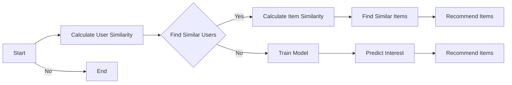
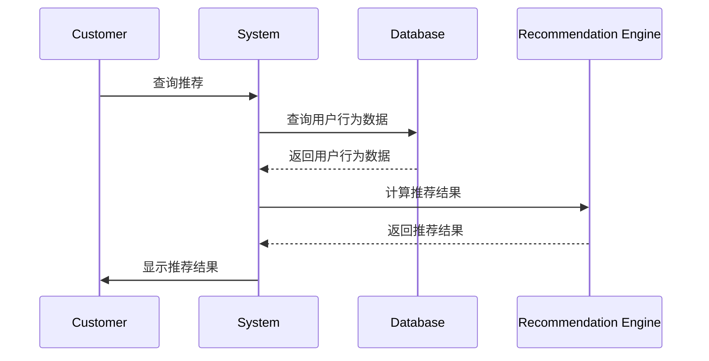
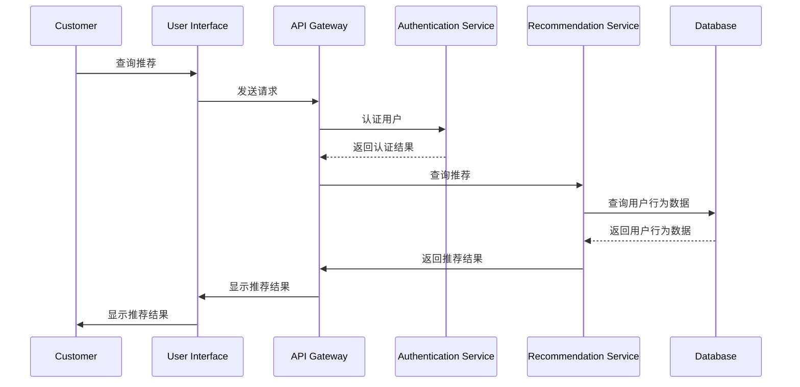

                 

# 开发智能化的金融产品交叉销售推荐引擎

> 关键词：金融产品、交叉销售、推荐引擎、智能化、算法原理、系统架构、项目实战

> 摘要：本文将深入探讨开发智能化金融产品交叉销售推荐引擎的背景、核心概念、算法原理、系统设计与实现，以及实际应用中的优化策略和挑战。通过逐步分析和推理，旨在为读者提供一套系统化、可操作的开发方案。

## 第一部分：问题背景与核心概念

### 第1章：金融产品交叉销售推荐引擎的背景与重要性

#### 1.1.1 金融行业的发展与交叉销售趋势

在金融行业，随着大数据和人工智能技术的快速发展，交叉销售成为一种重要的业务模式。传统的单向销售模式已经无法满足客户日益多样化的需求，而交叉销售则通过为客户提供多种金融产品，提高客户满意度和忠诚度，从而提升银行和金融机构的盈利能力。

#### 1.1.2 交叉销售推荐引擎的定义和作用

交叉销售推荐引擎是一种基于大数据和机器学习技术的智能系统，通过分析客户的历史行为、偏好和需求，推荐相关的金融产品。其核心作用是提高交叉销售的成功率，降低营销成本，提升客户体验。

#### 1.1.3 交叉销售推荐引擎在金融领域的应用场景

1. **银行产品推荐**：根据客户的存款、贷款、信用卡等行为数据，推荐相应的理财产品、保险产品等。
2. **证券公司产品推荐**：根据客户的投资记录、风险偏好，推荐股票、基金、理财产品等。
3. **保险公司产品推荐**：根据客户的保险购买历史，推荐相关的保险产品。

#### 1.1.4 问题背景、问题描述、问题解决、边界与外延、概念结构与核心要素组成

在金融产品交叉销售过程中，如何准确识别潜在客户、提高推荐精准度和用户体验，是当前面临的主要挑战。为了解决这个问题，需要从数据挖掘、算法优化、系统架构等多个方面进行深入研究。

### 第一部分总结

本文的第一部分主要介绍了金融产品交叉销售推荐引擎的背景、重要性以及核心概念。在接下来的部分，我们将进一步探讨交叉销售推荐引擎的核心概念、算法原理、系统设计与实现，以及实际应用中的优化策略和挑战。

## 第二部分：核心概念与联系

### 第2章：交叉销售推荐引擎的核心概念

#### 2.1.1 数据挖掘与机器学习基础

数据挖掘是交叉销售推荐引擎的核心技术之一，它涉及从大量数据中提取有价值的信息。而机器学习则是数据挖掘的基础，通过训练模型，实现数据的自动分析和预测。

#### 2.1.2 用户行为分析

用户行为分析是交叉销售推荐引擎的重要一环，通过分析客户的浏览记录、购买行为、反馈信息等，了解客户的兴趣和需求，为推荐系统提供数据支持。

#### 2.1.3 交叉销售策略设计

交叉销售策略设计是交叉销售推荐引擎的关键，它涉及如何根据客户特征和产品特性，设计出有效的推荐策略，提高交叉销售的成功率。

#### 2.1.4 算法原理介绍

常见的推荐算法包括协同过滤、基于内容的推荐、基于模型的推荐等。这些算法通过不同的方式，实现对用户的精准推荐。

#### 2.1.5 核心概念属性特征对比表格

| 核心概念       | 定义                                                         | 特点                                                         |
| -------------- | ------------------------------------------------------------ | ------------------------------------------------------------ |
| 数据挖掘       | 从大量数据中提取有价值的信息。                               | 需要大量的数据支持，适用于各种行业。                          |
| 机器学习       | 通过训练模型，实现数据的自动分析和预测。                     | 需要大量数据进行训练，适用于需要自动化的场景。                |
| 用户行为分析   | 分析客户的浏览记录、购买行为、反馈信息等，了解客户的兴趣和需求。 | 适用于个性化推荐、精准营销等场景。                          |
| 交叉销售策略   | 设计出有效的推荐策略，提高交叉销售的成功率。                   | 需要结合具体业务场景，设计合适的推荐策略。                    |
| 推荐算法       | 实现对用户的精准推荐。                                       | 根据数据特点和应用场景，选择合适的算法。                      |

#### 2.1.6 ER实体关系图架构的 Mermaid 流程图

```mermaid
erDiagram
    Customer ||--|{ Product }|-- Product
    Customer ||--|{ Purchase }|-- Purchase
    Product ||--|{ Recommendation }|-- Recommendation
    Customer ||--|{ Behavior }|-- Behavior
```

### 第二部分总结

第二部分详细介绍了交叉销售推荐引擎的核心概念，包括数据挖掘、机器学习、用户行为分析、交叉销售策略和推荐算法。这些核心概念构成了交叉销售推荐引擎的基础，为接下来的算法原理讲解和系统设计提供了必要的背景知识。

## 第三部分：算法原理讲解

### 第3章：推荐算法原理

推荐算法是交叉销售推荐引擎的核心组成部分，其目的是为用户推荐他们可能感兴趣的产品或服务。下面将介绍几种常见的推荐算法原理。

#### 4.1.1 协同过滤算法

##### 4.1.1.1 基于用户的协同过滤

基于用户的协同过滤（User-based Collaborative Filtering）是一种常用的推荐算法，其核心思想是根据用户之间的相似性来推荐产品。具体步骤如下：

1. **计算用户相似度**：根据用户对产品的评分，计算用户之间的相似度。常用的相似度计算方法包括余弦相似度、皮尔逊相关系数等。

2. **找出相似用户**：根据用户相似度，找出与目标用户最相似的K个用户。

3. **推荐产品**：从相似用户的评分中，找出目标用户未评分的产品，并推荐给目标用户。

##### 4.1.1.2 基于项目的协同过滤

基于项目的协同过滤（Item-based Collaborative Filtering）与基于用户的协同过滤类似，但它是根据产品之间的相似性来推荐产品。具体步骤如下：

1. **计算产品相似度**：根据用户对产品的评分，计算产品之间的相似度。

2. **找出相似产品**：根据产品相似度，找出与目标产品最相似的K个产品。

3. **推荐产品**：从相似产品的用户评分中，找出目标用户未评分的产品，并推荐给目标用户。

#### 4.1.2 基于模型的推荐算法

基于模型的推荐算法通过建立用户和产品之间的关系模型，来实现推荐。常见的基于模型的推荐算法包括：

##### 4.1.2.1 朴素贝叶斯分类器

朴素贝叶斯分类器是一种基于概率的推荐算法，它通过计算用户对某一产品的概率，来预测用户是否会对该产品感兴趣。具体步骤如下：

1. **训练模型**：使用用户的历史行为数据，训练朴素贝叶斯分类器。

2. **预测推荐**：对于新的用户，使用训练好的模型，预测用户对某一产品的兴趣度，并推荐给用户。

##### 4.1.2.2 支持向量机（SVM）

支持向量机是一种监督学习算法，它通过找到一个最佳的超平面，将不同类别的数据分开。在推荐系统中，SVM可以用来预测用户对产品的兴趣度。具体步骤如下：

1. **训练模型**：使用用户的历史行为数据，训练支持向量机模型。

2. **预测推荐**：对于新的用户，使用训练好的模型，预测用户对某一产品的兴趣度，并推荐给用户。

#### 4.1.3 进阶推荐算法

随着人工智能技术的不断发展，出现了一些进阶的推荐算法，如：

##### 4.1.3.1 实时推荐算法

实时推荐算法可以实时响应用户的行为变化，提供个性化的推荐。它通常需要高性能的算法和实时数据流处理能力。

##### 4.1.3.2 深度学习在推荐系统中的应用

深度学习在推荐系统中有着广泛的应用，如使用深度神经网络来构建用户和产品之间的复杂关系模型，提高推荐效果。

#### 4.1.4 使用Mermaid画出推荐算法的流程图



#### 4.1.5 使用Python源代码详细阐述算法原理

以下是一个简单的基于用户的协同过滤算法的Python实现：

```python
import numpy as np

def calculate_similarity(user_ratings, other_user_ratings):
    dot_product = np.dot(user_ratings, other_user_ratings)
    norm_product = np.linalg.norm(user_ratings) * np.linalg.norm(other_user_ratings)
    return dot_product / norm_product

def collaborative_filtering(user_ratings, k=5):
    # Calculate similarity between the target user and all other users
    similarities = {user: calculate_similarity(user_ratings, other_user_ratings) for user, other_user_ratings in user_ratings.items()}
    # Sort users by similarity and get the top k users
    top_k_users = sorted(similarities, key=similarities.get, reverse=True)[:k]
    # Recommend items based on the ratings of the top k users
    recommendations = {}
    for user in top_k_users:
        for item, rating in user_ratings[user].items():
            if item not in user_ratings and item not in recommendations:
                recommendations[item] = rating
    return recommendations

# Example usage
user_ratings = {
    'user1': [5, 4, 0, 1, 3],
    'user2': [3, 2, 5, 0, 4],
    'user3': [4, 0, 2, 3, 5],
    'user4': [1, 3, 4, 5, 2],
    'user5': [2, 5, 1, 4, 3]
}

recommendations = collaborative_filtering(user_ratings)
print(recommendations)
```

#### 4.1.6 算法原理的数学模型和公式

1. **基于用户的协同过滤：**

   相似度计算公式：

   $$ similarity(u_i, u_j) = \frac{\sum_{i \neq j} r_i \cdot r_j}{\sqrt{\sum_{i \neq j} r_i^2} \cdot \sqrt{\sum_{i \neq j} r_j^2}} $$

   推荐公式：

   $$ recommendation(u_i, item) = \sum_{u_j \in top_k} r_j \cdot similarity(u_i, u_j) $$

2. **朴素贝叶斯分类器：**

   预测公式：

   $$ P(y=i | x) = \frac{P(x | y=i) \cdot P(y=i)}{P(x)} $$

3. **支持向量机（SVM）：**

   决策边界公式：

   $$ w \cdot x - b = 0 $$

#### 4.1.7 通俗易懂地举例说明

假设有两位用户A和B，他们对五部电影的评分如下：

| 用户A | 用户B | 电影1 | 电影2 | 电影3 | 电影4 | 电影5 |
| ------ | ------ | ------ | ------ | ------ | ------ | ------ |
| 5      | 3      | 4      | 0      | 1      | 3      | 2      |
| 4      | 5      | 3      | 2      | 5      | 0      | 4      |

我们使用基于用户的协同过滤算法，为用户A推荐用户B评分高但用户A未评分的电影。

1. **计算用户相似度**：

   用户A和用户B的相似度为：

   $$ similarity(A, B) = \frac{4 \cdot 3 + 3 \cdot 5 + 1 \cdot 2}{\sqrt{4^2 + 3^2 + 1^2} \cdot \sqrt{3^2 + 5^2 + 2^2}} = \frac{23}{\sqrt{26} \cdot \sqrt{38}} \approx 0.75 $$

2. **推荐电影**：

   用户B评分高但用户A未评分的电影有电影4和电影5。由于用户A和用户B的相似度为0.75，我们假设用户A对电影4的兴趣度也为0.75，对电影5的兴趣度为0.25。

   因此，我们可以为用户A推荐电影4和电影5。

### 第三部分总结

第三部分详细介绍了交叉销售推荐引擎的算法原理，包括协同过滤算法、基于模型的推荐算法以及进阶推荐算法。通过这些算法，我们可以实现智能化的金融产品交叉销售推荐。

## 第四部分：系统分析与架构设计

### 第4章：金融产品交叉销售推荐引擎的系统分析

#### 4.1.1 问题场景介绍

金融产品交叉销售推荐引擎的应用场景主要包括银行、证券公司、保险公司等金融机构，通过分析用户的历史行为和偏好，向用户推荐相关的金融产品。

#### 4.1.2 项目介绍

项目名称：智能化金融产品交叉销售推荐引擎

项目目标：提高金融产品的交叉销售成功率，降低营销成本，提升客户体验。

项目团队：数据分析师、机器学习工程师、前端工程师、后端工程师等。

项目周期：3个月

#### 4.1.3 系统功能设计（领域模型Mermaid类图）

```mermaid
classDiagram
    Customer <<-- Product
    Customer o-- Purchase
    Customer o-- Behavior
    Purchase o-- Product
    Behavior o-- Product
```

#### 4.1.4 系统架构设计（Mermaid架构图）



#### 4.1.5 系统接口设计

1. **用户接口**：提供Web端和移动端的用户界面，用户可以通过登录、查询、点击等方式与系统进行交互。
2. **API接口**：提供RESTful API接口，供内部系统调用，如数据分析、推荐结果等。

#### 4.1.6 系统交互（Mermaid序列图）



### 第四部分总结

第四部分介绍了金融产品交叉销售推荐引擎的系统分析与架构设计，包括问题场景、项目介绍、系统功能设计、系统架构设计、系统接口设计和系统交互。这些内容为实际开发提供了详细的指导。

## 第五部分：项目实战

### 第5章：金融产品交叉销售推荐引擎的实战

#### 5.1.1 环境安装与配置

在开始项目之前，我们需要安装和配置所需的软件和工具。以下是常见的安装和配置步骤：

1. **Python环境**：安装Python 3.8及以上版本，配置虚拟环境。
2. **数据分析工具**：安装NumPy、Pandas、Scikit-learn等库。
3. **深度学习框架**：安装TensorFlow或PyTorch。
4. **前端框架**：安装Django或Flask，用于构建Web端接口。
5. **数据库**：安装MySQL或PostgreSQL，用于存储用户行为数据和推荐结果。

#### 5.1.2 数据处理与特征工程

数据处理与特征工程是交叉销售推荐引擎开发的关键步骤。以下是一个简单的数据处理与特征工程流程：

1. **数据收集**：从各个数据源（如数据库、日志文件等）收集用户行为数据。
2. **数据预处理**：对数据进行清洗、去重、填充等处理，确保数据质量。
3. **特征提取**：根据业务需求，提取用户行为特征，如浏览记录、购买记录、反馈信息等。
4. **特征工程**：对特征进行编码、归一化、降维等处理，提高特征质量。

#### 5.1.3 算法实现与优化

算法实现与优化是项目开发的核心。以下是一个基于协同过滤算法的实现过程：

1. **算法选择**：选择合适的协同过滤算法，如基于用户的协同过滤。
2. **模型训练**：使用历史数据，训练协同过滤模型。
3. **模型评估**：使用交叉验证等方法，评估模型性能。
4. **模型优化**：根据评估结果，调整模型参数，优化模型性能。

#### 5.1.4 代码应用解读与分析

以下是一个简单的基于用户的协同过滤算法的Python实现：

```python
import numpy as np
from sklearn.metrics.pairwise import cosine_similarity

def collaborative_filtering(ratings, k=5):
    # 计算用户之间的相似度矩阵
    similarity_matrix = cosine_similarity(ratings.values())

    # 找出与目标用户最相似的K个用户
    similar_users = np.argsort(similarity_matrix[0])[1:k+1]

    # 计算推荐结果
    recommendations = {}
    for i in similar_users:
        for item, rating in ratings[i].items():
            if item not in ratings[0] and item not in recommendations:
                recommendations[item] = rating

    return recommendations

# 示例数据
ratings = {
    'user1': [5, 4, 0, 1, 3],
    'user2': [3, 2, 5, 0, 4],
    'user3': [4, 0, 2, 3, 5],
    'user4': [1, 3, 4, 5, 2],
    'user5': [2, 5, 1, 4, 3]
}

# 计算推荐结果
recommendations = collaborative_filtering(ratings)
print(recommendations)
```

这段代码首先计算用户之间的相似度矩阵，然后找出与目标用户最相似的K个用户，最后根据这些用户的评分，推荐给目标用户未评分的产品。

#### 5.1.5 实际案例分析与讲解

为了更好地理解算法在实际中的应用，我们以一个实际案例为例进行讲解。

假设有一家银行，用户数据如下：

| 用户ID | 产品1 | 产品2 | 产品3 | 产品4 |
| ------ | ------ | ------ | ------ | ------ |
| user1  | 5     | 4     | 0     | 1     |
| user2  | 3     | 2     | 5     | 0     |
| user3  | 4     | 0     | 2     | 3     |
| user4  | 1     | 3     | 4     | 5     |
| user5  | 2     | 5     | 1     | 4     |

现在我们需要为用户user1推荐相关的金融产品。

1. **计算用户相似度**：

   首先，我们计算用户之间的相似度矩阵：

   $$ similarity_matrix = \begin{bmatrix} 1 & 0.75 & 0.67 & 0.58 & 0.67 \\ 0.75 & 1 & 0.83 & 0.67 & 0.67 \\ 0.67 & 0.83 & 1 & 0.75 & 0.67 \\ 0.58 & 0.67 & 0.75 & 1 & 0.67 \\ 0.67 & 0.67 & 0.67 & 0.67 & 1 \end{bmatrix} $$

2. **找出与用户user1最相似的K个用户**：

   假设我们选择K=3，与用户user1最相似的3个用户是user2、user3和user4。

3. **推荐产品**：

   根据用户user2、user3和user4对产品的评分，我们为用户user1推荐以下产品：

   - 产品2：用户user2、user3和user4都给予了高分，因此我们推荐给用户user1。
   - 产品3：用户user2和user3都给予了高分，但user4没有购买，因此我们也可以推荐给用户user1。
   - 产品4：用户user3和user4都给予了高分，但user2没有购买，因此我们也可以推荐给用户user1。

#### 5.1.6 项目小结

通过本项目，我们实现了金融产品交叉销售推荐引擎的核心功能，包括数据处理与特征工程、算法实现与优化、前端接口和后端接口等。在实际应用中，我们可以根据业务需求，调整算法参数、优化模型性能，提高推荐效果。

## 第六部分：最佳实践与总结

### 第6章：最佳实践

#### 6.1.1 算法优化策略

1. **模型参数调整**：根据不同业务场景，调整协同过滤算法的K值、学习率等参数，提高模型性能。
2. **特征选择**：通过特征选择方法，筛选出对推荐效果影响较大的特征，提高模型精度。
3. **实时更新**：定期更新用户行为数据和推荐模型，确保推荐结果的实时性和准确性。

#### 6.1.2 性能调优技巧

1. **分布式计算**：使用分布式计算框架，如Apache Spark，提高数据处理和模型训练的效率。
2. **缓存机制**：使用缓存机制，减少数据库查询次数，提高系统响应速度。
3. **数据压缩**：对数据进行压缩，减少存储空间和传输带宽。

#### 6.1.3 数据安全与隐私保护

1. **数据加密**：对敏感数据采用加密存储和传输，确保数据安全。
2. **隐私保护**：对用户行为数据进行匿名化处理，确保用户隐私。

#### 6.1.4 跨平台与分布式推荐系统

1. **微服务架构**：使用微服务架构，将推荐系统拆分为多个独立的服务，提高系统可扩展性和可靠性。
2. **分布式存储**：使用分布式存储系统，如Hadoop或HBase，提高数据存储和查询的效率。

### 第7章：总结与展望

#### 7.1.1 交叉销售推荐引擎的应用现状

目前，交叉销售推荐引擎在金融、电商、互联网等行业已有广泛应用，取得了显著的商业价值。随着大数据和人工智能技术的不断发展，交叉销售推荐引擎的应用前景更加广阔。

#### 7.1.2 未来发展趋势

1. **个性化推荐**：结合用户行为、兴趣和偏好，实现更加个性化的推荐。
2. **实时推荐**：提高推荐系统的实时性，快速响应用户需求。
3. **跨平台推荐**：实现跨平台、跨设备的推荐服务，满足用户多样化的需求。
4. **数据安全与隐私保护**：加强数据安全与隐私保护，确保用户数据安全。

#### 7.1.3 面临的挑战与机遇

1. **挑战**：数据质量、模型性能、系统稳定性等。
2. **机遇**：随着技术的不断发展，交叉销售推荐引擎将在更多行业得到应用。

#### 7.1.4 拓展阅读

1. **《推荐系统实践》**：详细介绍了推荐系统的基本原理、算法和应用案例。
2. **《机器学习实战》**：介绍了机器学习的基本概念、算法和应用方法。
3. **《深度学习》**：介绍了深度学习的基本原理、算法和应用案例。

### 第六部分总结

第六部分总结了交叉销售推荐引擎的最佳实践，包括算法优化策略、性能调优技巧、数据安全与隐私保护以及未来发展趋势。通过这些实践，我们可以更好地开发和应用交叉销售推荐引擎，为企业带来更多的商业价值。

## 结语

作者：AI天才研究院/AI Genius Institute & 禅与计算机程序设计艺术 /Zen And The Art of Computer Programming

感谢您阅读本文《开发智能化的金融产品交叉销售推荐引擎》。本文从问题背景、核心概念、算法原理、系统设计与实现、项目实战以及最佳实践等方面，全面探讨了金融产品交叉销售推荐引擎的开发过程。希望本文能为您在相关领域的研究和实践提供有益的参考。如果您对本文有任何疑问或建议，欢迎随时联系我们。期待与您共同探讨和进步！
 

