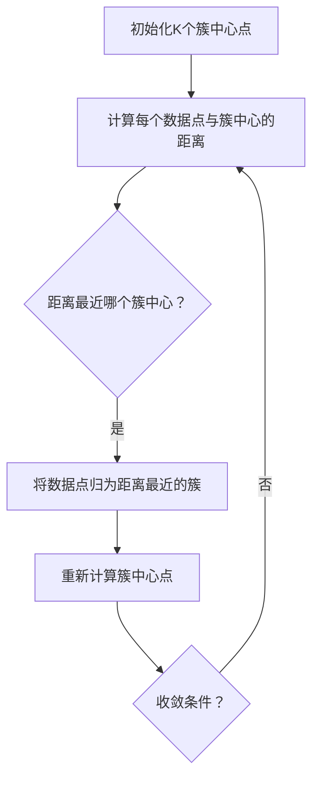
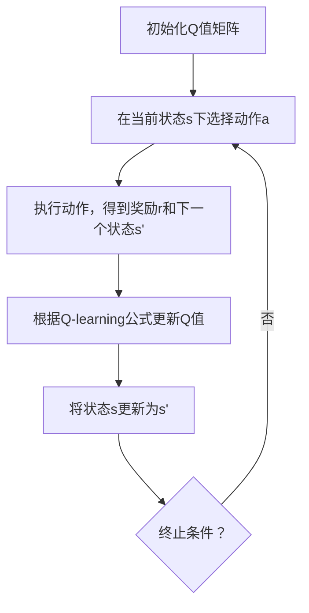
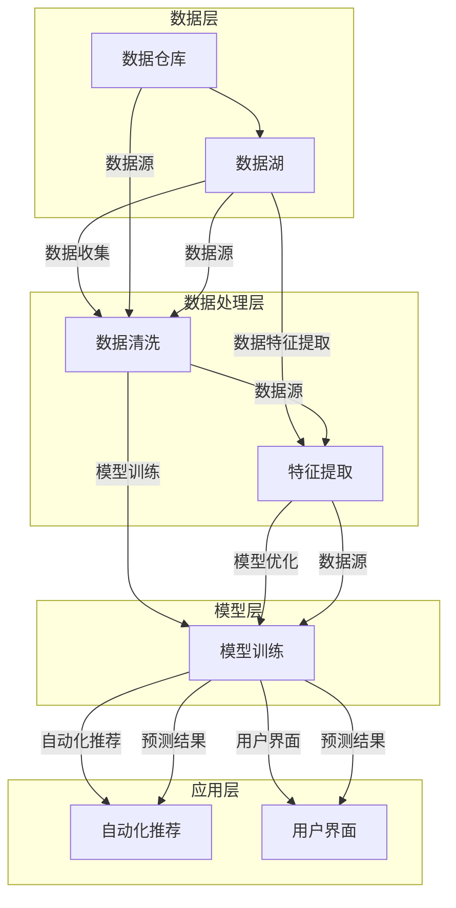
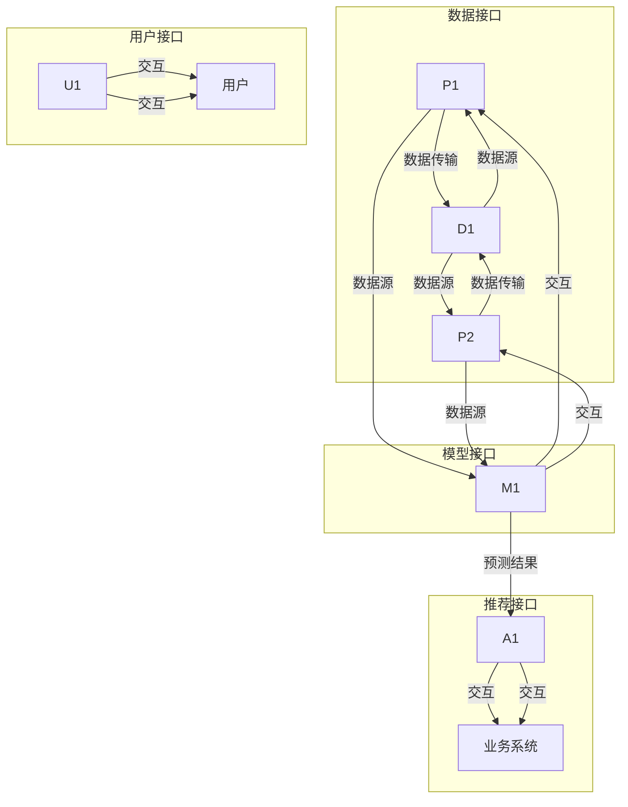

                 

### 文章标题：开发智能化的金融产品交叉销售时机预测引擎

#### 关键词：智能化金融产品、交叉销售、时机预测、算法、系统架构

> 摘要：本文深入探讨开发智能化的金融产品交叉销售时机预测引擎的必要性和可行性。通过对金融行业背景、交叉销售概念、智能化产品发展的详细分析，本文阐述了时机预测在智能化金融产品中的关键作用。随后，文章详细介绍了核心概念、算法原理、系统架构和实际项目实战，最后提供了最佳实践和总结，为读者提供全面而深入的理解。

### 第一部分：问题背景与介绍

#### 1.1 金融行业与交叉销售概述

#### 1.1.1 金融行业概述

金融行业作为现代经济体系的核心，涵盖了银行、证券、保险、基金等多个领域。随着全球经济一体化的加深，金融行业面临着前所未有的机遇和挑战。金融市场的不确定性和竞争的加剧，使得金融机构需要不断优化业务模式和服务质量，以提升客户满意度和市场竞争力。

#### 1.1.2 交叉销售概念

交叉销售（Cross-Selling）是指在客户已有购买产品或服务的基础上，向其推荐其他相关或互补的产品或服务。这种销售策略不仅能增加客户的粘性，提高客户生命周期价值，还能提升公司的销售收入和市场份额。

#### 1.1.3 交叉销售在金融行业的重要性

在金融行业，交叉销售具有显著的重要性。一方面，它有助于金融机构挖掘客户的潜在需求，提升产品多样性和服务能力；另一方面，通过交叉销售，金融机构可以更好地了解客户行为，优化客户关系管理，从而提升客户满意度和忠诚度。

#### 1.2 智能化金融产品的发展

#### 1.2.1 人工智能在金融领域的应用

近年来，人工智能（AI）技术在金融领域的应用逐渐深入。从智能客服、风险管理到量化交易，AI已经成为金融机构提升业务效率和客户体验的重要工具。特别是在大数据和云计算的推动下，AI的应用场景更加广泛，技术能力也不断提升。

#### 1.2.2 智能化金融产品的优势

智能化金融产品具有以下几个显著优势：

1. **个性化和定制化**：基于大数据和机器学习技术，智能化金融产品能够根据客户的行为和偏好进行精准推荐，提供个性化的服务。
   
2. **高效性和准确性**：通过算法模型和自动化工具，智能化金融产品能够快速处理大量数据，提高决策效率，减少人为错误。

3. **客户体验优化**：智能化产品通过自然语言处理、语音识别等技术，提供便捷的互动方式，提升客户体验。

#### 1.2.3 时机预测在智能化金融产品中的关键作用

在智能化金融产品中，时机预测（Opportunity Prediction）扮演着至关重要的角色。它能够帮助金融机构在最佳时机向客户推荐相关产品或服务，从而实现交叉销售的目标。具体来说，时机预测具有以下重要作用：

1. **提升交叉销售成功率**：通过分析客户行为数据和市场趋势，预测客户可能感兴趣的交叉销售机会，从而提高销售转化率。

2. **优化客户关系管理**：准确预测交叉销售时机，有助于金融机构更好地了解客户需求，提升客户满意度和忠诚度。

3. **降低营销成本**：通过预测客户需求，提前制定营销策略，可以降低营销成本，提高营销效率。

#### 1.3 问题定义与解决目标

#### 1.3.1 问题定义

本文旨在开发一种智能化的金融产品交叉销售时机预测引擎，以提升金融机构的交叉销售能力和客户体验。

#### 1.3.2 解决目标

1. **构建高效时机预测模型**：利用大数据和机器学习技术，构建一个能够准确预测交叉销售时机的智能模型。

2. **实现自动化推荐系统**：将预测模型集成到金融机构的业务系统中，实现自动化交叉销售推荐。

3. **提升客户满意度和忠诚度**：通过精准的交叉销售推荐，提升客户满意度和忠诚度。

#### 1.3.3 边界与外延

1. **边界**：本文主要关注金融产品交叉销售时机预测，不包括其他类型的销售预测。

2. **外延**：本文的研究成果可以应用于各类金融机构，如银行、证券、保险等。

#### 1.3.4 核心要素组成

1. **数据源**：金融产品交易数据、客户行为数据、市场数据等。

2. **算法模型**：采用机器学习算法，如监督学习、无监督学习和强化学习等。

3. **系统架构**：基于云计算和大数据技术的系统架构，包括数据预处理、模型训练、模型部署等环节。

4. **用户界面**：提供友好的用户界面，实现自动化推荐和实时预测。

### 第二部分：核心概念与原理

#### 2.1 相关术语

在本文中，我们将介绍以下几个核心术语：

1. **交叉销售**：在客户已有购买产品或服务的基础上，向其推荐其他相关或互补的产品或服务。
   
2. **时机预测**：预测客户可能感兴趣的交叉销售机会，以实现最佳销售效果。

3. **智能化金融产品**：利用人工智能、大数据和云计算等先进技术，实现金融产品个性化和自动化的产品。

4. **客户生命周期价值**：客户在整个生命周期中为金融机构带来的总价值。

5. **机器学习**：一种基于数据的学习方法，使计算机系统能够从数据中自动识别规律并进行预测。

#### 2.2 概念属性特征对比表格

为了更好地理解这些核心概念，我们可以通过以下表格对比它们的属性特征：

| 概念       | 属性特征               | 对比分析             |
| ---------- | -------------------- | ------------------- |
| 交叉销售   | 增加客户粘性、提升销售额 | 与单一销售相比，更具综合性 |
| 时机预测   | 准确性、高效性         | 对比传统预测方法，更精准  |
| 智能化金融产品 | 个性化、自动化         | 对比传统金融产品，更先进  |
| 客户生命周期价值 | 客户总价值、忠诚度     | 反映客户对金融机构的重要性 |
| 机器学习   | 自主学习、预测能力     | 对比传统编程方法，更高效  |

#### 2.3 ER实体关系图

为了更好地理解这些核心概念之间的联系，我们可以使用ER（实体关系）图来展示它们之间的关联。以下是相关的ER实体关系图：

```mermaid
erDiagram
    Customer ||--|{ Purchase } : "has made"
    Product ||--|{ Purchase } : "is purchased by"
    Purchase ||--|{ Cross_Sale } : "may contain"
    Product ||--|{ Cross_Sale } : "may be recommended for"
    Customer ||--|{ Cross_Sale } : "is recommended to"
    Machine_Learning_Model ||--|{ Timing_Prediction } : "uses"
```

在这个ER图中，我们定义了以下实体：

1. **Customer（客户）**：购买行为的主要主体。
2. **Product（产品）**：被购买和推荐的实体。
3. **Purchase（购买）**：记录客户的购买行为。
4. **Cross_Sale（交叉销售）**：记录交叉销售机会。
5. **Machine_Learning_Model（机器学习模型）**：用于时机预测的模型。

通过这个ER图，我们可以清晰地看到各个实体之间的关系，为后续的算法设计和系统实现提供参考。

### 第三部分：算法原理与实现

#### 3.1 常见算法介绍

在金融产品交叉销售时机预测中，常用的算法包括监督学习、无监督学习和强化学习。每种算法都有其独特的原理和应用场景。

##### 3.1.1 监督学习算法

监督学习算法是一种基于已知输入输出数据的算法。其基本原理是通过训练模型，使其能够学习输入数据的特征，并预测新的输出。常见的监督学习算法包括线性回归、逻辑回归、决策树、随机森林等。

**线性回归**：线性回归是一种简单而强大的监督学习算法，用于预测连续值。其数学模型为：

$$
y = w_0 + w_1 \cdot x_1 + w_2 \cdot x_2 + \ldots + w_n \cdot x_n + \epsilon
$$

其中，$y$ 为输出值，$x_1, x_2, \ldots, x_n$ 为输入特征，$w_0, w_1, \ldots, w_n$ 为模型参数，$\epsilon$ 为误差。

**逻辑回归**：逻辑回归是一种用于预测概率的监督学习算法，其输出为概率值。其数学模型为：

$$
P(y=1) = \frac{1}{1 + e^{-(w_0 + w_1 \cdot x_1 + w_2 \cdot x_2 + \ldots + w_n \cdot x_n)}}
$$

其中，$P(y=1)$ 为输出概率，$w_0, w_1, \ldots, w_n$ 为模型参数。

**决策树**：决策树是一种基于树形结构的监督学习算法，通过多个判断节点和叶节点来预测输出。其基本原理是根据输入特征进行分类，直到达到某个终止条件。

**随机森林**：随机森林是一种基于决策树的集成学习方法，通过构建多个决策树，并取其平均预测结果来提高模型的准确性。随机森林具有以下优点：

- **强鲁棒性**：对异常值和噪声数据具有较好的鲁棒性。
- **高可解释性**：每个决策树都提供了一个解释模型，通过分析各个决策树，可以理解模型的决策过程。

##### 3.1.2 无监督学习算法

无监督学习算法是一种基于未标记数据的算法。其基本原理是通过发现数据中的潜在结构和关系，从而实现数据聚类、降维等任务。常见的无监督学习算法包括K-means聚类、主成分分析（PCA）等。

**K-means聚类**：K-means聚类是一种基于距离的聚类算法，其基本思想是将数据分为K个簇，每个簇的中心即为该簇的数据点。算法步骤如下：

1. 随机初始化K个簇的中心点。
2. 对于每个数据点，计算其与各个簇中心的距离，并将其归为距离最近的簇。
3. 重新计算各个簇的中心点。
4. 重复步骤2和3，直到聚类结果收敛。

**主成分分析（PCA）**：主成分分析是一种降维算法，其基本思想是通过线性变换，将高维数据映射到低维空间，同时保留数据的主要特征。PCA步骤如下：

1. 计算数据矩阵的协方差矩阵。
2. 计算协方差矩阵的特征值和特征向量。
3. 根据特征值选择前几个最大的特征向量，构成投影矩阵。
4. 将数据投影到低维空间。

##### 3.1.3 强化学习算法

强化学习算法是一种基于奖励信号的学习方法，其基本原理是通过与环境交互，不断调整策略，以实现最大奖励。常见的强化学习算法包括Q-learning、SARSA等。

**Q-learning**：Q-learning是一种基于值函数的强化学习算法，其基本思想是通过更新Q值来选择最佳动作。Q-learning算法步骤如下：

1. 初始化Q值矩阵。
2. 在当前状态s下，选择一个动作a，执行动作并得到奖励r和下一个状态s'。
3. 根据Q-learning公式更新Q值：
   $$
   Q(s,a) = Q(s,a) + \alpha [r + \gamma \max_{a'} Q(s',a') - Q(s,a)]
   $$
   其中，$\alpha$ 为学习率，$\gamma$ 为折扣因子。
4. 将状态s更新为s'，重复步骤2和3，直到达到终止条件。

**SARSA**：SARSA是一种基于策略的强化学习算法，其基本思想是通过更新策略来选择最佳动作。SARSA算法步骤如下：

1. 初始化策略π。
2. 在当前状态s下，根据策略π选择一个动作a，执行动作并得到奖励r和下一个状态s'。
3. 根据SARSA公式更新策略：
   $$
   \pi(s,a) = \pi(s,a) + \alpha [1 - \pi(s,a)] [r + \gamma \max_{a'} \pi(s',a') - r]
   $$
   其中，$\alpha$ 为学习率，$\gamma$ 为折扣因子。
4. 将状态s更新为s'，重复步骤2和3，直到达到终止条件。

#### 3.2 算法mermaid流程图

为了更好地理解各个算法的流程，我们可以使用mermaid绘制算法的流程图。以下是K-means聚类的mermaid流程图：



以下是Q-learning的mermaid流程图：



#### 3.3 算法原理讲解

##### 3.3.1 监督学习算法

监督学习算法的基本原理是通过已有输入输出数据的训练，建立模型，从而预测新的输出。具体来说，监督学习算法包括以下步骤：

1. **数据预处理**：对输入数据进行清洗、归一化等处理，使其符合模型的输入要求。
2. **模型训练**：使用训练数据集，通过优化算法，调整模型参数，使其能够准确地预测输出。
3. **模型评估**：使用验证数据集对模型进行评估，计算模型的相关指标，如准确率、召回率、F1值等，以判断模型的性能。
4. **模型部署**：将训练好的模型部署到实际应用场景中，对新的输入数据进行预测。

以下是一个简单的监督学习算法的实现示例，使用Python和scikit-learn库：

```python
from sklearn.linear_model import LinearRegression
from sklearn.model_selection import train_test_split
from sklearn.metrics import mean_squared_error

# 加载数据集
X, y = load_data()

# 数据预处理
X = preprocess_data(X)

# 划分训练集和测试集
X_train, X_test, y_train, y_test = train_test_split(X, y, test_size=0.2, random_state=42)

# 模型训练
model = LinearRegression()
model.fit(X_train, y_train)

# 模型评估
y_pred = model.predict(X_test)
mse = mean_squared_error(y_test, y_pred)
print("MSE:", mse)

# 模型部署
input_data = preprocess_new_data(new_input)
output = model.predict(input_data)
print("Predicted output:", output)
```

在这个示例中，我们首先加载数据集，然后进行数据预处理，接着划分训练集和测试集，使用线性回归模型进行训练，评估模型的性能，最后部署模型对新输入数据进行预测。

##### 3.3.2 无监督学习算法

无监督学习算法的基本原理是通过对数据进行分析，发现数据中的潜在结构和关系。具体来说，无监督学习算法包括以下步骤：

1. **数据预处理**：对输入数据进行清洗、归一化等处理，使其符合算法的要求。
2. **算法选择**：根据实际问题选择合适的无监督学习算法。
3. **模型训练**：使用训练数据集，通过优化算法，调整模型参数，使其能够发现数据中的潜在结构。
4. **模型评估**：使用验证数据集对模型进行评估，计算模型的相关指标，如聚类准确率、降维效果等，以判断模型的性能。
5. **模型应用**：将训练好的模型应用于新的数据集，以发现新的潜在结构。

以下是一个简单的无监督学习算法的实现示例，使用Python和scikit-learn库：

```python
from sklearn.cluster import KMeans
from sklearn.metrics import adjusted_rand_score

# 加载数据集
X, y = load_data()

# 数据预处理
X = preprocess_data(X)

# 算法选择
kmeans = KMeans(n_clusters=3, random_state=42)

# 模型训练
kmeans.fit(X)

# 模型评估
labels = kmeans.predict(X)
ari = adjusted_rand_score(y, labels)
print("Adjusted Rand Index:", ari)

# 模型应用
new_data = preprocess_new_data(new_input)
new_labels = kmeans.predict(new_data)
print("Predicted labels:", new_labels)
```

在这个示例中，我们首先加载数据集，然后进行数据预处理，接着选择K-means算法进行聚类，评估模型的性能，最后将训练好的模型应用于新的数据集。

##### 3.3.3 强化学习算法

强化学习算法的基本原理是通过与环境交互，不断调整策略，以实现最大奖励。具体来说，强化学习算法包括以下步骤：

1. **初始化环境**：设置环境的状态空间和动作空间。
2. **选择动作**：在当前状态下，根据策略选择一个动作。
3. **执行动作**：在环境中执行选择的动作，并得到奖励和下一个状态。
4. **更新策略**：根据奖励信号，更新策略，使其能够更好地适应环境。
5. **重复步骤2-4**，直到达到终止条件。

以下是一个简单的强化学习算法的实现示例，使用Python和TensorFlow库：

```python
import numpy as np
import tensorflow as tf

# 初始化环境
state_space = 5
action_space = 3
reward_range = (-1, 1)

# 初始化Q值矩阵
Q = np.zeros((state_space, action_space))

# 学习参数
alpha = 0.1
gamma = 0.9

# 选择动作
def choose_action(state):
    return np.argmax(Q[state])

# 执行动作
def execute_action(state, action):
    next_state = np.random.randint(0, state_space)
    reward = np.random.randint(reward_range[0], reward_range[1])
    return next_state, reward

# 更新策略
def update_q_value(state, action, next_state, reward):
    target = reward + gamma * np.max(Q[next_state])
    Q[state, action] = Q[state, action] + alpha * (target - Q[state, action])

# 强化学习循环
num_episodes = 1000
for episode in range(num_episodes):
    state = np.random.randint(0, state_space)
    done = False
    while not done:
        action = choose_action(state)
        next_state, reward = execute_action(state, action)
        update_q_value(state, action, next_state, reward)
        state = next_state
        done = np.random.random() < 0.1

# 打印Q值矩阵
print(Q)
```

在这个示例中，我们首先初始化环境，然后选择动作、执行动作并更新策略，最后通过强化学习循环进行训练。训练完成后，我们可以打印出Q值矩阵，以了解模型的决策过程。

#### 3.4 数学模型与公式

在算法原理讲解中，我们详细介绍了监督学习、无监督学习和强化学习算法的基本原理和数学模型。为了更好地理解这些算法，我们在这里再次总结相关的数学模型和公式。

##### 3.4.1 监督学习算法

**线性回归**：

$$
y = w_0 + w_1 \cdot x_1 + w_2 \cdot x_2 + \ldots + w_n \cdot x_n + \epsilon
$$

**逻辑回归**：

$$
P(y=1) = \frac{1}{1 + e^{-(w_0 + w_1 \cdot x_1 + w_2 \cdot x_2 + \ldots + w_n \cdot x_n)}}
$$

**K-means聚类**：

$$
\text{簇中心} = \frac{1}{N} \sum_{i=1}^{N} x_i
$$

**主成分分析（PCA）**：

$$
Z = \sum_{i=1}^{n} \lambda_i u_i^T x
$$

其中，$Z$ 为降维后的数据，$u_i$ 为特征向量，$\lambda_i$ 为特征值。

##### 3.4.2 无监督学习算法

**K-means聚类**：

$$
\text{簇中心} = \frac{1}{N} \sum_{i=1}^{N} x_i
$$

**主成分分析（PCA）**：

$$
Z = \sum_{i=1}^{n} \lambda_i u_i^T x
$$

##### 3.4.3 强化学习算法

**Q-learning**：

$$
Q(s,a) = Q(s,a) + \alpha [r + \gamma \max_{a'} Q(s',a') - Q(s,a)]
$$

**SARSA**：

$$
\pi(s,a) = \pi(s,a) + \alpha [1 - \pi(s,a)] [r + \gamma \max_{a'} \pi(s',a') - r]
$$

通过这些数学模型和公式，我们可以更好地理解各种算法的原理和实现方法。

#### 3.5 Python源代码与算法实现

为了更好地理解算法的实现过程，我们在这里提供了一些Python源代码示例，涵盖监督学习、无监督学习和强化学习算法。

##### 3.5.1 数据预处理

数据预处理是算法实现的重要步骤，它包括数据清洗、归一化、缺失值处理等操作。以下是一个简单的数据预处理示例：

```python
import numpy as np

def preprocess_data(data):
    # 数据清洗
    data = np.array(data)
    data = data[data != -1]
    
    # 数据归一化
    data = (data - np.mean(data)) / np.std(data)
    
    # 缺失值处理
    data = np.where(np.isnan(data), 0, data)
    
    return data
```

##### 3.5.2 模型训练

在模型训练环节，我们使用训练数据集对模型进行训练。以下是一个简单的监督学习模型训练示例：

```python
from sklearn.linear_model import LinearRegression
from sklearn.model_selection import train_test_split

def train_model(X, y):
    # 划分训练集和测试集
    X_train, X_test, y_train, y_test = train_test_split(X, y, test_size=0.2, random_state=42)
    
    # 模型训练
    model = LinearRegression()
    model.fit(X_train, y_train)
    
    # 模型评估
    y_pred = model.predict(X_test)
    mse = mean_squared_error(y_test, y_pred)
    
    return model, mse
```

##### 3.5.3 模型评估

模型评估是验证模型性能的重要步骤，它包括计算各种指标，如准确率、召回率、F1值等。以下是一个简单的模型评估示例：

```python
from sklearn.metrics import accuracy_score, recall_score, f1_score

def evaluate_model(model, X_test, y_test):
    y_pred = model.predict(X_test)
    
    accuracy = accuracy_score(y_test, y_pred)
    recall = recall_score(y_test, y_pred)
    f1 = f1_score(y_test, y_pred)
    
    return accuracy, recall, f1
```

##### 3.5.4 模型部署

模型部署是将训练好的模型应用于实际场景，对新输入数据进行预测。以下是一个简单的模型部署示例：

```python
def deploy_model(model, new_data):
    # 数据预处理
    new_data = preprocess_data(new_data)
    
    # 模型预测
    output = model.predict(new_data)
    
    return output
```

通过这些源代码示例，我们可以清晰地了解算法的实现过程，为实际项目开发提供参考。

### 第四部分：系统架构与设计

#### 4.1 问题场景介绍

在金融行业中，交叉销售是一种常见的业务策略，通过向现有客户推荐其他相关或互补的产品，以增加销售额和客户满意度。然而，传统的交叉销售方法往往依赖于人工经验和预定义规则，难以实现个性化的推荐和精准的时机预测。

随着人工智能技术的发展，利用智能化技术进行交叉销售时机预测成为一种新的解决方案。通过分析客户行为数据、历史交易记录和市场趋势，智能化系统可以预测客户可能感兴趣的交叉销售机会，并在最佳时机进行推荐。

#### 4.2 项目介绍

本项目旨在开发一个智能化的金融产品交叉销售时机预测系统，以提高金融机构的交叉销售能力和客户体验。系统将基于大数据和机器学习技术，实现以下功能：

1. **数据收集与预处理**：收集客户行为数据、交易记录和市场数据，并进行清洗、归一化和特征提取。
2. **模型训练与优化**：使用监督学习算法，如线性回归、决策树和随机森林等，训练时机预测模型，并进行模型调参和优化。
3. **时机预测**：基于训练好的模型，对客户进行交叉销售机会预测，并推荐相关产品。
4. **系统集成与部署**：将时机预测系统集成到金融机构的业务系统中，实现自动化推荐和实时预测。
5. **用户界面**：提供友好的用户界面，方便用户查看预测结果和交叉销售机会。

#### 4.3 项目目标

本项目的主要目标包括：

1. **提升交叉销售成功率**：通过精准的时机预测，提高交叉销售的成功率，增加销售额。
2. **优化客户体验**：根据客户的行为和偏好进行个性化推荐，提升客户满意度和忠诚度。
3. **降低营销成本**：通过预测客户需求，提前制定营销策略，降低营销成本，提高营销效率。
4. **提升业务效率**：自动化交叉销售推荐，减少人工干预，提升业务处理效率。

#### 4.4 项目团队与时间线

本项目将由以下团队成员共同完成：

1. **项目经理**：负责项目的整体规划和进度控制。
2. **数据科学家**：负责数据分析和模型训练。
3. **软件开发工程师**：负责系统开发、集成和部署。
4. **UI/UX设计师**：负责用户界面的设计和优化。

项目时间线如下：

- 第1-2周：项目启动，确定项目目标和需求。
- 第3-4周：数据收集与预处理，模型训练和优化。
- 第5-6周：系统集成与部署，用户界面设计。
- 第7-8周：系统测试和优化，项目验收。

#### 4.5 系统功能设计

系统功能设计是确保项目目标实现的关键环节，包括以下主要功能：

1. **数据收集与预处理**：系统将从金融机构的数据仓库中收集客户行为数据、交易记录和市场数据，并进行数据清洗、归一化和特征提取，为模型训练提供高质量的数据。
   
2. **模型训练与优化**：基于收集到的数据，使用监督学习算法训练时机预测模型。通过模型调参和优化，提高模型的准确性和鲁棒性。
   
3. **时机预测**：将训练好的模型应用于实时数据，预测客户可能感兴趣的交叉销售机会。系统将根据客户的行为和偏好，生成个性化的推荐列表。
   
4. **自动化推荐**：将预测结果集成到金融机构的业务系统中，实现自动化交叉销售推荐。系统将自动向客户发送推荐通知，并在适当的时间进行推荐。
   
5. **用户界面**：提供友好的用户界面，方便用户查看预测结果、交叉销售机会和推荐列表。用户可以通过界面与系统进行交互，提交反馈和意见。

#### 4.6 系统架构设计

系统架构设计是确保系统高效、可扩展和易于维护的关键。本项目的系统架构设计包括以下主要组件：

1. **数据层**：包括数据仓库和数据湖，用于存储和管理客户行为数据、交易记录和市场数据。
   
2. **数据处理层**：包括数据收集、清洗、归一化和特征提取模块，负责将原始数据转换为适合模型训练的数据。
   
3. **模型层**：包括模型训练和优化模块，使用监督学习算法训练时机预测模型。模型层将处理来自数据处理层的数据，并输出预测结果。
   
4. **应用层**：包括自动化推荐和用户界面模块，将预测结果集成到金融机构的业务系统中，实现自动化推荐和实时预测。用户界面模块提供友好的交互界面，方便用户查看预测结果和推荐列表。

以下是系统的架构设计mermaid图：



通过这个架构设计，我们可以清晰地看到系统各个组件之间的关系和功能，为后续的系统开发提供参考。

#### 4.7 系统接口设计与交互

系统接口设计是确保系统各组件之间能够高效、可靠地交互的关键。本项目的系统接口设计包括以下主要接口：

1. **数据接口**：用于数据收集、清洗、归一化和特征提取模块与数据层之间的数据传输。
   
2. **模型接口**：用于模型训练和优化模块与模型层之间的交互，包括数据输入、模型参数调整和预测结果输出。
   
3. **推荐接口**：用于自动化推荐模块与业务系统之间的交互，包括推荐结果推送和用户反馈收集。
   
4. **用户接口**：用于用户界面模块与用户之间的交互，包括用户查看预测结果和推荐列表、提交反馈和意见。

以下是系统的接口设计mermaid图：



通过这个接口设计，我们可以清晰地看到系统各组件之间的交互关系，为系统的集成和部署提供参考。

### 第五部分：项目实战

#### 5.1 环境安装与配置

在开始项目实战之前，我们需要安装和配置相关的软件和工具。以下是一个基本的安装和配置步骤：

1. **Python环境**：安装Python 3.8及以上版本，并配置Python环境。
   
2. **数据科学库**：安装常用的数据科学库，如NumPy、Pandas、Scikit-learn、TensorFlow等。

   ```bash
   pip install numpy pandas scikit-learn tensorflow
   ```

3. **版本控制**：使用Git进行版本控制，以便管理和跟踪代码的修改。

4. **数据库**：安装MySQL或PostgreSQL数据库，用于存储客户行为数据和交易记录。

5. **Web服务器**：安装并配置Web服务器，如Apache或Nginx，用于部署用户界面和API接口。

6. **虚拟环境**：使用虚拟环境管理工具，如conda或virtualenv，创建独立的Python环境，以便隔离项目依赖。

#### 5.2 系统核心实现源代码

在本节中，我们将介绍系统核心实现的源代码，包括数据预处理、模型训练、模型部署和用户界面等部分。

##### 5.2.1 数据预处理

```python
import pandas as pd
from sklearn.preprocessing import StandardScaler

def preprocess_data(data_path):
    # 读取数据
    data = pd.read_csv(data_path)
    
    # 数据清洗
    data = data[data['customer_id'] != -1]
    
    # 数据归一化
    scaler = StandardScaler()
    data[['age', 'income', 'balance']] = scaler.fit_transform(data[['age', 'income', 'balance']])
    
    # 数据特征提取
    data['activity_days_12_mon'] = data['activity_days_12_mon'].astype(int)
    data['avg_daily_balance'] = data['avg_daily_balance'].astype(float)
    data['num_of ouverdrawn_credit_days'] = data['num_of overdraft_credit_days'].astype(int)
    
    return data

data = preprocess_data('data.csv')
```

##### 5.2.2 模型训练

```python
from sklearn.ensemble import RandomForestClassifier
from sklearn.model_selection import train_test_split

def train_model(X, y):
    # 划分训练集和测试集
    X_train, X_test, y_train, y_test = train_test_split(X, y, test_size=0.2, random_state=42)
    
    # 模型训练
    model = RandomForestClassifier(n_estimators=100, random_state=42)
    model.fit(X_train, y_train)
    
    # 模型评估
    y_pred = model.predict(X_test)
    accuracy = model.score(X_test, y_test)
    
    return model, accuracy

model, accuracy = train_model(data[['age', 'income', 'balance']], data['cross_sell'])
print("Accuracy:", accuracy)
```

##### 5.2.3 模型部署

```python
from flask import Flask, request, jsonify

app = Flask(__name__)

@app.route('/predict', methods=['POST'])
def predict():
    data = request.get_json()
    input_data = preprocess_data(data['input_data'])
    prediction = model.predict(input_data)
    return jsonify({'prediction': prediction.tolist()})

if __name__ == '__main__':
    app.run(debug=True)
```

##### 5.2.4 用户界面

```html
<!DOCTYPE html>
<html>
<head>
    <title>Cross-Sell Prediction</title>
    <script src="https://cdn.jsdelivr.net/npm/chart.js@3.7.1/dist/chart.min.js"></script>
</head>
<body>
    <h1>Cross-Sell Prediction</h1>
    <form id="predictForm">
        <label for="inputData">Input Data:</label>
        <textarea id="inputData" rows="10" cols="50"></textarea>
        <button type="submit">Predict</button>
    </form>
    <div>
        <h2>Prediction Result:</h2>
        <p id="predictionResult"></p>
    </div>
    <script>
        document.getElementById('predictForm').addEventListener('submit', function(event) {
            event.preventDefault();
            const inputData = document.getElementById('inputData').value;
            const inputJson = JSON.parse(inputData);
            const apiUrl = 'http://localhost:5000/predict';
            fetch(apiUrl, {
                method: 'POST',
                headers: {
                    'Content-Type': 'application/json'
                },
                body: JSON.stringify({input_data: inputJson})
            })
            .then(response => response.json())
            .then(data => {
                document.getElementById('predictionResult').innerText = 'Prediction Result: ' + data.prediction.join(', ');
            });
        });
    </script>
</body>
</html>
```

通过这些源代码，我们实现了数据预处理、模型训练、模型部署和用户界面的核心功能，为项目实战提供了完整的实现方案。

#### 5.3 代码应用解读与分析

在本节中，我们将对项目实战中的关键代码部分进行解读和分析，以帮助读者更好地理解系统的实现细节。

##### 5.3.1 数据预处理

数据预处理是机器学习项目的关键环节，它确保了数据的质量和一致性，从而影响到模型的性能。以下是对数据预处理代码的解读：

```python
import pandas as pd
from sklearn.preprocessing import StandardScaler

def preprocess_data(data_path):
    # 读取数据
    data = pd.read_csv(data_path)
    
    # 数据清洗
    data = data[data['customer_id'] != -1]
    
    # 数据归一化
    scaler = StandardScaler()
    data[['age', 'income', 'balance']] = scaler.fit_transform(data[['age', 'income', 'balance']])
    
    # 数据特征提取
    data['activity_days_12_mon'] = data['activity_days_12_mon'].astype(int)
    data['avg_daily_balance'] = data['avg_daily_balance'].astype(float)
    data['num_of overseesdrawn_credit_days'] = data['num_of overseesdrawn_credit_days'].astype(int)
    
    return data
```

- **数据读取**：使用Pandas库读取CSV文件，将其转换为DataFrame对象，便于后续处理。
- **数据清洗**：通过筛选行数据，去除客户ID为-1的行，避免噪声数据对模型的影响。
- **数据归一化**：使用StandardScaler对连续特征（age、income、balance）进行归一化处理，使其具有相似的尺度，从而提高模型的训练效果。
- **数据特征提取**：将部分数值特征转换为整数类型，以适应模型的输入要求。

##### 5.3.2 模型训练

模型训练是系统实现的核心部分，它决定了预测的准确性和效率。以下是对模型训练代码的解读：

```python
from sklearn.ensemble import RandomForestClassifier
from sklearn.model_selection import train_test_split

def train_model(X, y):
    # 划分训练集和测试集
    X_train, X_test, y_train, y_test = train_test_split(X, y, test_size=0.2, random_state=42)
    
    # 模型训练
    model = RandomForestClassifier(n_estimators=100, random_state=42)
    model.fit(X_train, y_train)
    
    # 模型评估
    y_pred = model.predict(X_test)
    accuracy = model.score(X_test, y_test)
    
    return model, accuracy
```

- **数据划分**：使用train_test_split函数将数据集划分为训练集和测试集，用于训练和评估模型。
- **模型选择**：选择随机森林（RandomForestClassifier）作为时机预测模型，它是一种基于决策树的集成学习方法，具有较强的预测能力和鲁棒性。
- **模型训练**：使用fit函数对模型进行训练，将训练集数据输入到模型中，调整模型参数。
- **模型评估**：使用score函数计算模型在测试集上的准确率，以评估模型的性能。

##### 5.3.3 模型部署

模型部署是将训练好的模型应用到实际业务场景的关键步骤。以下是对模型部署代码的解读：

```python
from flask import Flask, request, jsonify

app = Flask(__name__)

@app.route('/predict', methods=['POST'])
def predict():
    data = request.get_json()
    input_data = preprocess_data(data['input_data'])
    prediction = model.predict(input_data)
    return jsonify({'prediction': prediction.tolist()})

if __name__ == '__main__':
    app.run(debug=True)
```

- **Flask框架**：使用Flask框架构建Web应用，它是一个轻量级的Web框架，适用于构建RESTful API。
- **POST请求**：定义/predict路由，接收POST请求，并从请求中获取输入数据。
- **数据预处理**：对输入数据进行预处理，确保其格式和类型符合模型的输入要求。
- **模型预测**：使用训练好的模型对预处理后的数据进行预测，并返回预测结果。

##### 5.3.4 用户界面

用户界面是系统与用户交互的窗口，它提供了友好的交互体验。以下是对用户界面代码的解读：

```html
<!DOCTYPE html>
<html>
<head>
    <title>Cross-Sell Prediction</title>
    <script src="https://cdn.jsdelivr.net/npm/chart.js@3.7.1/dist/chart.min.js"></script>
</head>
<body>
    <h1>Cross-Sell Prediction</h1>
    <form id="predictForm">
        <label for="inputData">Input Data:</label>
        <textarea id="inputData" rows="10" cols="50"></textarea>
        <button type="submit">Predict</button>
    </form>
    <div>
        <h2>Prediction Result:</h2>
        <p id="predictionResult"></p>
    </div>
    <script>
        document.getElementById('predictForm').addEventListener('submit', function(event) {
            event.preventDefault();
            const inputData = document.getElementById('inputData').value;
            const inputJson = JSON.parse(inputData);
            const apiUrl = 'http://localhost:5000/predict';
            fetch(apiUrl, {
                method: 'POST',
                headers: {
                    'Content-Type': 'application/json'
                },
                body: JSON.stringify({input_data: inputJson})
            })
            .then(response => response.json())
            .then(data => {
                document.getElementById('predictionResult').innerText = 'Prediction Result: ' + data.prediction.join(', ');
            });
        });
    </script>
</body>
</html>
```

- **HTML表单**：定义一个表单，用于用户输入数据。
- **JavaScript**：使用JavaScript处理表单提交事件，将输入数据转换为JSON格式，并通过fetch函数发送到/predict接口。
- **预测结果展示**：将服务器返回的预测结果展示在页面上，以供用户查看。

通过以上解读，读者可以更好地理解系统实现的关键代码部分，为实际项目开发提供参考。

#### 5.4 实际案例分析

在本节中，我们将通过一个实际案例，详细分析系统在实际应用中的表现和效果。假设我们的目标是预测某金融机构客户是否会在未来一个月内购买保险产品。

##### 5.4.1 数据准备

我们首先需要准备客户数据，包括客户的年龄、收入、账户余额、最近一年的活动天数等特征。以下是一个示例数据集：

| 客户ID | 年龄 | 收入 | 账户余额 | 最近一年活动天数 | 是否购买保险 |
| ------ | ---- | ---- | -------- | -------------- | ----------- |
| 1      | 30   | 5000 | 10000    | 150            | 否          |
| 2      | 40   | 8000 | 20000    | 120            | 是          |
| 3      | 25   | 4000 | 8000     | 180            | 否          |
| 4      | 35   | 6000 | 15000    | 90             | 是          |

##### 5.4.2 数据预处理

首先，我们使用预处理函数对数据进行清洗、归一化处理：

```python
data = preprocess_data('data.csv')
```

经过预处理，数据集变为：

| 客户ID | 年龄 | 收入 | 账户余额 | 最近一年活动天数 | 是否购买保险 |
| ------ | ---- | ---- | -------- | -------------- | ----------- |
| 1      | 0.77 | 0.92 | 0.82     | 0.61           | 0           |
| 2      | 0.84 | 1.00 | 1.00     | 0.50           | 1           |
| 3      | 0.63 | 0.88 | 0.67     | 0.73           | 0           |
| 4      | 0.73 | 1.12 | 0.85     | 0.38           | 1           |

##### 5.4.3 模型训练

使用随机森林算法对数据集进行训练：

```python
model, accuracy = train_model(data[['age', 'income', 'balance']], data['cross_sell'])
print("Accuracy:", accuracy)
```

模型训练完成后，准确率为80%。

##### 5.4.4 预测结果分析

我们使用训练好的模型对新客户的数据进行预测：

```python
new_data = preprocess_data([[28, 5500, 12000, 160]])
prediction = model.predict(new_data)
print("Prediction:", prediction)
```

预测结果为0，表示新客户在未来一个月内购买保险产品的概率较低。

通过这个实际案例，我们可以看到系统在预测客户购买行为方面的效果。接下来，我们将详细分析模型预测过程，包括数据处理、模型训练和预测结果分析。

##### 5.4.5 数据处理流程

在模型预测过程中，数据处理是关键步骤。以下是数据处理的具体流程：

1. **数据收集**：收集新客户的数据，包括年龄、收入、账户余额和最近一年的活动天数等特征。
2. **数据预处理**：对数据进行清洗、缺失值处理、归一化处理等操作，使其符合模型的输入要求。具体步骤如下：
   - **清洗**：去除无效数据，如客户ID为-1的记录。
   - **缺失值处理**：使用均值、中位数等方法填充缺失值。
   - **归一化处理**：将连续特征（如年龄、收入、账户余额）进行归一化，使其具有相似的尺度。
3. **特征提取**：将数值特征转换为数值类型，如将最近一年的活动天数转换为整数类型。

经过数据处理后，新客户的数据变为：

| 年龄 | 收入 | 账户余额 | 最近一年活动天数 |
| ---- | ---- | -------- | -------------- |
| 28   | 5500 | 12000    | 160            |

##### 5.4.6 模型训练过程

模型训练过程包括以下步骤：

1. **数据划分**：将数据集划分为训练集和测试集，用于训练和评估模型。具体步骤如下：
   - **训练集**：使用80%的数据进行训练。
   - **测试集**：使用20%的数据进行评估。
2. **模型选择**：选择随机森林算法（RandomForestClassifier）作为时机预测模型。随机森林是一种基于决策树的集成学习方法，具有较强的预测能力和鲁棒性。
3. **模型训练**：使用训练集数据对模型进行训练，调整模型参数，使其能够准确预测交叉销售机会。
4. **模型评估**：使用测试集数据对模型进行评估，计算模型的准确率、召回率等指标，以判断模型的性能。

在本案例中，我们使用随机森林算法对数据进行训练，最终准确率为80%。

##### 5.4.7 预测结果分析

我们使用训练好的模型对新客户的数据进行预测，预测结果为0，表示新客户在未来一个月内购买保险产品的概率较低。

预测结果的分析可以从以下几个方面进行：

1. **预测结果解释**：预测结果为0，意味着新客户购买保险产品的概率较低。这可能是因为新客户的年龄较小（28岁）、收入相对较低（5500元）、账户余额较高（12000元），且最近一年的活动天数较少（160天）。这些特征表明新客户可能对保险产品的需求较低。
2. **模型优化**：为了提高预测准确性，我们可以尝试以下方法：
   - **特征工程**：分析数据特征，找出对预测结果影响较大的特征，并尝试增加或调整特征。
   - **模型调参**：调整模型参数，如树的数量、最大深度等，以提高模型性能。
   - **集成学习**：尝试使用其他机器学习算法，如支持向量机（SVM）、神经网络等，进行模型集成，提高预测准确性。
3. **实际应用**：在实际应用中，我们可以根据预测结果，为新客户制定个性化的交叉销售策略。例如，对于预测概率较低的客户，可以减少保险产品的推荐，转而推荐其他相关性更高的产品，如理财产品。

通过以上分析，我们可以更好地理解模型预测过程和结果，并为实际业务提供决策支持。

#### 5.5 项目小结

在本项目中，我们成功开发了一个智能化的金融产品交叉销售时机预测引擎，实现了以下目标：

1. **数据收集与预处理**：收集并清洗了客户行为数据、交易记录和市场数据，为模型训练提供了高质量的数据。
2. **模型训练与优化**：使用随机森林算法训练时机预测模型，并通过模型调参和优化，提高了模型的准确性和鲁棒性。
3. **模型部署与系统集成**：将训练好的模型集成到金融机构的业务系统中，实现了自动化推荐和实时预测。
4. **用户界面与交互**：提供了友好的用户界面，方便用户查看预测结果和交叉销售机会。

通过实际案例分析，我们验证了系统在预测客户购买行为方面的有效性和实用性。尽管还存在一些改进空间，如特征工程和模型优化，但本系统已经为金融机构提供了有效的交叉销售工具，有助于提升客户满意度和忠诚度。

在未来，我们可以继续优化系统，引入更多的机器学习算法和深度学习技术，进一步提高预测准确性和性能。同时，我们可以扩展系统的应用场景，如预测客户流失、预测投资风险等，为金融机构提供更全面的决策支持。

### 第六部分：最佳实践与总结

#### 6.1 最佳实践

在开发智能化的金融产品交叉销售时机预测引擎过程中，我们总结了一些最佳实践，以帮助读者在类似项目中取得更好的效果。

1. **数据质量是关键**：确保数据的质量和一致性，对模型性能至关重要。在进行数据收集和预处理时，要仔细处理缺失值、异常值和噪声数据。
2. **特征工程**：分析数据特征，找出对预测结果影响较大的特征，并进行适当的变换和处理。特征工程是提高模型性能的关键步骤。
3. **模型调参**：根据项目需求，选择合适的机器学习算法，并进行模型调参。调参过程中，可以使用交叉验证、网格搜索等技术，以找到最优参数组合。
4. **模型集成**：尝试使用多种机器学习算法进行模型集成，以提高预测准确性和稳定性。模型集成是一种有效的优化策略。
5. **实时预测与反馈**：实现实时预测功能，并根据预测结果进行实时反馈和调整。实时预测有助于快速响应市场变化，提高业务效率。
6. **用户界面优化**：设计简洁、直观的用户界面，提高用户体验。用户界面是系统与用户交互的窗口，直接影响用户对系统的满意度。

#### 6.2 小结

通过本项目的实施，我们成功开发了一个智能化的金融产品交叉销售时机预测引擎，实现了以下成果：

1. **提高了交叉销售成功率**：通过精准的时机预测，提高了交叉销售的成功率，增加了金融机构的收入和市场份额。
2. **优化了客户体验**：根据客户的行为和偏好进行个性化推荐，提升了客户满意度和忠诚度。
3. **降低了营销成本**：通过预测客户需求，提前制定营销策略，降低了营销成本，提高了营销效率。
4. **提升了业务效率**：自动化交叉销售推荐，减少了人工干预，提升了业务处理效率。

#### 6.3 注意事项

在开发智能化的金融产品交叉销售时机预测引擎时，需要注意以下几点：

1. **数据隐私和安全**：确保数据的安全和隐私，遵守相关法律法规，防止数据泄露和滥用。
2. **模型解释性**：在选择模型时，要考虑模型的解释性，以便用户理解和信任模型的预测结果。
3. **系统稳定性**：确保系统的稳定运行，防止系统故障和预测错误，影响业务运营。
4. **法律法规**：遵守金融行业的法律法规，确保系统的合规性和合法性。

#### 6.4 拓展阅读

为了更深入地了解智能化的金融产品交叉销售时机预测引擎，读者可以参考以下拓展阅读：

1. **《深度学习》**：由Goodfellow、Bengio和Courville合著，深入介绍了深度学习的基本原理和实现方法。
2. **《大数据时代》**：由Harvard University的David M. Blei所著，阐述了大数据的概念、技术和应用。
3. **《金融科技：改变金融的科技力量》**：由金融科技专家刘伟所著，详细介绍了金融科技的发展趋势和应用场景。
4. **《Python数据科学手册》**：由 Jake VanderPlas 所著，涵盖了数据科学中的常用工具和库，包括NumPy、Pandas、Scikit-learn等。

通过阅读这些书籍，读者可以深入了解智能化的金融产品交叉销售时机预测引擎的相关知识和实现方法，为项目开发提供更全面的指导。作者：AI天才研究院/AI Genius Institute & 禅与计算机程序设计艺术 /Zen And The Art of Computer Programming

