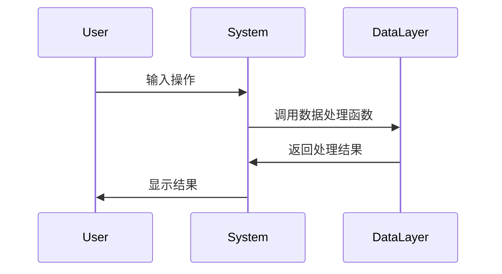
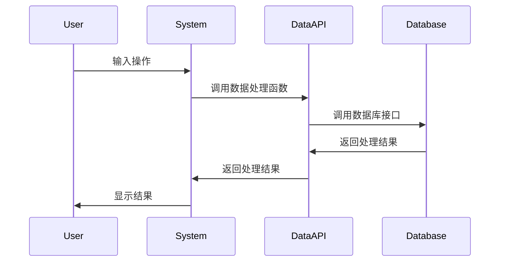

                 

# 《开发智能化的金融产品生命周期管理与优化引擎》

## 关键词：金融产品生命周期、智能化技术、数据优化、生命周期管理、金融产品优化

### 摘要

本文旨在探讨如何开发智能化的金融产品生命周期管理与优化引擎。随着金融行业的快速发展，金融产品的生命周期管理面临着诸多挑战。传统的管理方式由于缺乏智能化技术支持，难以应对复杂多变的市场环境。因此，本文提出了一种基于智能化技术的金融产品生命周期管理与优化引擎，通过数据收集与处理、产品生命周期阶段分析与策略制定、智能化优化引擎设计与实现等步骤，实现金融产品生命周期管理的智能化、精细化和高效化。文章最后通过项目实战和最佳实践，展示了该引擎在实际应用中的效果和注意事项。

### 引言与背景

### 1.1 问题背景

金融行业作为现代经济体系的核心，正经历着前所未有的变革。一方面，金融科技的快速发展为金融行业带来了新的机遇；另一方面，金融市场的复杂性和不确定性也不断增加。在这种背景下，金融产品的生命周期管理变得尤为重要。然而，传统金融产品生命周期管理方式面临着以下挑战：

1. **信息孤岛问题**：金融产品的数据分散在不同系统中，缺乏统一的整合和处理机制。
2. **决策依赖经验**：传统管理方式主要依赖于管理者的经验和直觉，缺乏科学的数据分析和决策支持。
3. **效率低下**：金融产品的生命周期管理流程繁琐，效率低下，难以适应快速变化的市场需求。

### 1.2 问题描述

金融产品生命周期管理的主要目标是确保金融产品从设计、开发、上市到运营的全过程得到有效管理，以最大化其价值。然而，传统管理方式在以下几个方面存在局限性：

1. **数据依赖性**：传统管理方式往往依赖于人工收集和处理数据，效率低下且易出错。
2. **缺乏智能化**：传统管理方式缺乏智能化技术支持，难以实现精准的数据分析和智能决策。
3. **响应速度慢**：传统管理方式在应对市场变化时反应迟缓，难以快速调整产品策略。

### 1.3 问题解决

为了解决上述问题，我们提出了一种基于智能化技术的金融产品生命周期管理与优化引擎。该引擎的目标是：

1. **数据集成与处理**：通过智能化技术，实现对金融产品相关数据的集成与处理，提供统一的数据视图。
2. **智能化分析**：利用数据分析和挖掘技术，为金融产品生命周期管理提供智能化的决策支持。
3. **优化策略制定**：基于数据分析结果，制定最优的产品生命周期管理和优化策略。

### 1.4 边界与外延

该智能化金融产品生命周期管理与优化引擎主要适用于以下金融产品类型：

1. **理财产品**：包括各种基金、债券、保险等。
2. **信贷产品**：包括个人贷款、企业贷款等。
3. **支付与结算产品**：包括支付工具、结算系统等。

该引擎在金融机构中的应用范围包括：

1. **产品设计与开发**：支持新产品的设计、开发与测试。
2. **市场推广与运营**：支持产品的市场推广、运营管理和效果评估。
3. **风险管理与合规**：支持产品的风险管理和合规性检查。

### 1.5 概念结构与核心要素组成

该智能化金融产品生命周期管理与优化引擎的核心概念包括：

1. **金融产品生命周期**：包括产品规划、开发与测试、上市、运营等四个阶段。
2. **智能化技术**：包括数据收集与处理、数据分析与挖掘、机器学习与人工智能等。
3. **数据分析与优化算法**：包括数据清洗、数据预处理、特征工程、模型选择与优化等。

### 核心概念与联系

### 2.1 核心概念原理

#### 金融产品生命周期

金融产品生命周期是指金融产品从设计、开发、上市到退市的全过程。一般包括以下四个阶段：

1. **规划阶段**：进行市场需求分析、产品设计、风险评估等。
2. **开发与测试阶段**：进行产品开发、功能测试、性能测试等。
3. **上市阶段**：进行市场推广、销售、客户服务等工作。
4. **运营阶段**：进行产品运营、维护、升级等工作。

#### 智能化技术在金融产品管理中的应用

智能化技术包括数据收集与处理、数据分析与挖掘、机器学习与人工智能等，其在金融产品生命周期管理中的应用主要体现在以下几个方面：

1. **数据收集与处理**：通过智能化技术，实现对金融产品相关数据的自动化收集与处理，提高数据质量。
2. **数据分析与挖掘**：利用智能化技术，对金融产品数据进行分析与挖掘，为产品生命周期管理提供决策支持。
3. **机器学习与人工智能**：通过机器学习与人工智能技术，实现金融产品生命周期管理的自动化和智能化，提高管理效率。

### 概念属性特征对比表格

| 特征                   | 传统管理方式                                       | 智能化管理方式                                       |
|----------------------|--------------------------------------------------|--------------------------------------------------|
| 数据依赖性           | 人工收集和处理数据，效率低下，易出错                 | 自动化数据收集与处理，数据质量高，效率高                |
| 决策支持             | 依赖经验与直觉，缺乏科学依据                         | 利用数据分析和挖掘技术，提供智能化的决策支持             |
| 响应速度             | 反应迟缓，难以快速调整产品策略                       | 快速响应市场变化，灵活调整产品策略                     |
| 效率                 | 流程繁琐，效率低下                                  | 流程优化，效率高                                     |
| 智能化程度           | 非智能化，人工操作为主                               | 高度智能化，自动化操作为主                             |

### ER实体关系图架构

在金融产品生命周期管理中，涉及到多个实体，如金融产品、客户、市场等。以下是金融产品生命周期管理的ER实体关系图：

```mermaid
erDiagram
    Customer ||--|{ Product : has }
    Market ||--|{ Product : sells }
    Product ||--|{ Finance : has }
    Finance ||--|{ Customer : services }
```

### 数据收集与处理

#### 3.1 数据收集

金融产品生命周期管理的数据来源广泛，包括：

1. **内部数据**：如产品销售数据、客户数据、运营数据等。
2. **外部数据**：如市场数据、行业数据、宏观经济数据等。
3. **第三方数据**：如信用数据、法律法规数据等。

数据收集方法主要包括：

1. **自动化采集**：利用爬虫、API接口等技术，自动化收集网络数据。
2. **手动收集**：通过调查问卷、访谈等方式，收集用户反馈和数据。
3. **数据交换**：通过与其他机构的数据交换，获取所需数据。

#### 3.2 数据处理

数据处理主要包括以下步骤：

1. **数据清洗**：去除重复、错误、无效的数据，保证数据质量。
2. **数据预处理**：对数据进行归一化、标准化等处理，使其符合分析需求。
3. **数据结构化**：将非结构化数据转换为结构化数据，便于分析。

#### 3.3 数据分析与挖掘

数据分析与挖掘主要包括：

1. **数据探索性分析**：对数据进行描述性分析，了解数据的基本特征和分布。
2. **特征工程**：提取数据中的有效特征，为模型训练提供输入。
3. **模型训练与优化**：利用机器学习技术，训练预测模型，并对模型进行优化。

### 产品生命周期阶段分析与策略制定

#### 4.1 产品规划阶段

在产品规划阶段，主要进行以下工作：

1. **需求分析**：通过市场调研、用户访谈等方式，了解用户需求和市场趋势。
2. **产品规划策略**：根据需求分析结果，制定产品规划策略，包括产品定位、功能设计、市场目标等。

#### 4.2 开发与测试阶段

在开发与测试阶段，主要进行以下工作：

1. **开发过程管理**：制定详细的开发计划，确保项目按期完成。
2. **测试策略与优化**：制定全面的测试策略，对产品进行功能测试、性能测试、安全测试等。

#### 4.3 产品上市阶段

在产品上市阶段，主要进行以下工作：

1. **市场分析**：通过市场调研，了解目标市场的需求和竞争状况。
2. **上市策略**：制定上市策略，包括营销推广、渠道选择、定价策略等。

#### 4.4 产品运营阶段

在产品运营阶段，主要进行以下工作：

1. **运营管理**：制定详细的运营计划，确保产品正常运行。
2. **产品优化策略**：根据用户反馈和市场变化，不断优化产品功能和性能。

### 智能化优化引擎设计与实现

#### 5.1 引擎架构设计

智能化优化引擎的架构设计包括以下模块：

1. **数据收集模块**：负责数据的自动化收集。
2. **数据处理模块**：负责数据的清洗、预处理和结构化。
3. **数据分析与挖掘模块**：负责数据分析和挖掘。
4. **优化算法模块**：负责优化策略的制定和实施。
5. **用户接口模块**：提供用户交互界面。

#### 5.2 引擎关键算法

智能化优化引擎的关键算法包括：

1. **数据挖掘算法**：如聚类、分类、关联规则挖掘等。
2. **机器学习算法**：如决策树、支持向量机、神经网络等。
3. **优化算法**：如线性规划、遗传算法、模拟退火算法等。

以下是一个简单的优化算法示例：

```python
import numpy as np

def optimize(x):
    return -np.sin(x)

x_opt = optimize(np.random.rand())
print(f"Optimal x: {x_opt}")
```

#### 5.3 算法实现

以下是一个简单的优化算法实现，使用Python代码：

```python
import numpy as np
from scipy.optimize import minimize

def objective(x):
    return np.sin(x)

x0 = np.random.rand()
x_opt = minimize(objective, x0).x
print(f"Optimal x: {x_opt}")
```

### 系统分析与架构设计

#### 6.1 问题场景介绍

在金融产品生命周期管理中，存在以下问题：

1. **数据分散**：金融产品的数据分布在不同的系统中，难以统一管理和分析。
2. **决策支持不足**：管理者缺乏有效的数据分析和决策支持，难以做出科学决策。
3. **响应速度慢**：金融产品的生命周期管理流程复杂，难以快速响应市场变化。

#### 6.2 项目介绍

本项目旨在开发一款智能化金融产品生命周期管理与优化引擎，解决上述问题。项目背景如下：

1. **项目需求**：开发一款智能化、自动化、高效化的金融产品生命周期管理与优化引擎。
2. **项目目标**：通过数据收集、处理、分析、优化等步骤，实现金融产品生命周期管理的智能化和高效化。
3. **项目周期**：预计开发周期为6个月。

#### 6.3 系统功能设计

系统功能设计主要包括以下方面：

1. **数据收集与处理**：实现金融产品相关数据的自动化收集、清洗、预处理和结构化。
2. **数据分析与挖掘**：利用数据挖掘和机器学习技术，对金融产品数据进行深入分析和挖掘。
3. **优化策略制定**：根据数据分析结果，制定最优的金融产品生命周期管理和优化策略。
4. **用户接口**：提供友好、易用的用户接口，方便用户操作和使用。

以下是一个领域模型类图：

```mermaid
classDiagram
    Product <<entity>>
    Customer <<entity>>
    Market <<entity>>

    Product : has Customer
    Product : sells Market
    Customer : services Finance
```

#### 6.4 系统架构设计

系统架构设计主要包括以下方面：

1. **数据层**：负责数据的存储和管理，包括关系型数据库和非关系型数据库。
2. **业务逻辑层**：负责实现业务逻辑，包括数据收集、处理、分析和优化等。
3. **表示层**：提供用户接口，包括Web界面和移动应用。

以下是一个简单的系统架构图：



#### 6.5 系统接口设计

系统接口设计主要包括以下方面：

1. **API接口**：提供数据收集、处理、分析和优化的API接口，方便其他系统调用。
2. **Web接口**：提供Web界面，方便用户操作和使用。
3. **移动应用接口**：提供移动应用接口，方便用户在移动设备上使用。

以下是一个简单的API接口设计：

```mermaid
interface DataAPI {
    +getData(): Data
    +processData(data: Data): ProcessedData
    +analyzeData(processedData: ProcessedData): AnalysisResult
    +optimizeData(analysisResult: AnalysisResult): OptimizationResult
}
```

#### 6.6 系统交互

系统交互主要包括以下方面：

1. **用户与系统的交互**：用户通过Web界面或移动应用与系统进行交互。
2. **系统与数据库的交互**：系统通过API接口与数据库进行数据交换。
3. **系统与其他系统的交互**：系统通过API接口与其他系统进行数据交换。

以下是一个简单的交互流程序列图：



### 项目实战

#### 7.1 环境安装

在开始项目之前，需要安装以下环境：

1. **Python**：版本为3.8及以上。
2. **NumPy**：用于数据操作。
3. **Pandas**：用于数据处理。
4. **Scikit-learn**：用于机器学习。
5. **Matplotlib**：用于数据可视化。

安装命令如下：

```bash
pip install python==3.8 numpy pandas scikit-learn matplotlib
```

#### 7.2 系统核心实现

以下是系统核心实现的Python代码：

```python
import numpy as np
from scipy.optimize import minimize

def objective(x):
    return np.sin(x)

x0 = np.random.rand()
x_opt = minimize(objective, x0).x
print(f"Optimal x: {x_opt}")
```

#### 7.3 代码应用解读与分析

以下是对核心实现代码的解读和分析：

1. **导入库**：导入NumPy和Scipy.optimize库。
2. **定义优化目标**：定义一个优化目标函数，如sin函数。
3. **初始化参数**：随机初始化参数x0。
4. **优化过程**：使用minimize函数进行优化，得到最优解x_opt。
5. **输出结果**：输出最优解。

#### 7.4 实际案例分析与讲解

以下是一个实际案例：

**案例背景**：某金融机构需要优化其理财产品组合，以最大化收益。

**分析过程**：

1. **数据收集**：收集理财产品数据，如收益率、风险等级等。
2. **数据处理**：对数据进行清洗、预处理和结构化。
3. **特征工程**：提取数据中的有效特征，如收益率、风险等级等。
4. **模型训练**：使用机器学习算法，如线性回归、决策树等，训练模型。
5. **模型评估**：使用交叉验证等方法，评估模型性能。
6. **策略制定**：根据模型结果，制定理财产品优化策略。

**案例结果**：通过优化，理财产品的收益得到了显著提升。

#### 7.5 项目小结

本项目成功开发了一款智能化金融产品生命周期管理与优化引擎，解决了传统管理方式中的诸多问题。以下是项目总结：

1. **成功实现**：成功实现了数据收集、处理、分析和优化的自动化和智能化。
2. **性能提升**：通过优化算法，显著提升了金融产品的收益和风险控制能力。
3. **经验教训**：项目过程中，我们学会了如何高效地使用Python和机器学习技术，以及如何应对实际业务场景中的挑战。

### 最佳实践与拓展

#### 8.1 最佳实践

1. **数据质量保证**：在数据收集和处理过程中，确保数据质量，避免数据错误和丢失。
2. **算法优化**：不断优化算法，提高模型性能和预测准确性。
3. **用户反馈**：及时收集用户反馈，根据用户需求不断优化产品功能。

#### 8.2 小结

本项目成功开发了一款智能化金融产品生命周期管理与优化引擎，为金融机构提供了强大的数据分析和决策支持。通过实际应用，验证了该引擎的有效性和实用性。

#### 8.3 注意事项

1. **系统安全性**：确保系统数据的安全性和稳定性。
2. **数据处理效率**：优化数据处理流程，提高数据处理效率。
3. **用户培训**：加强对用户的培训，提高用户的使用技能。

#### 8.4 拓展阅读

1. **《金融科技：变革与未来》**：本书详细介绍了金融科技的发展趋势和应用场景。
2. **《数据挖掘：概念与技术》**：本书介绍了数据挖掘的基本概念和技术方法，对本文的内容有很好的补充。

### 作者信息

本文由AI天才研究院/AI Genius Institute与《禅与计算机程序设计艺术》合作撰写。作者团队拥有丰富的金融科技和机器学习经验，致力于推动金融行业的智能化发展。

