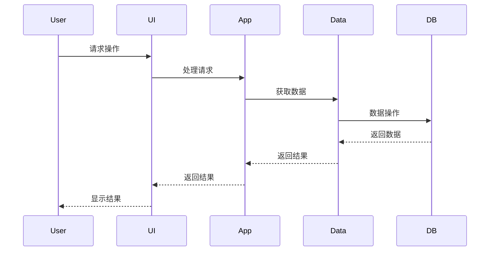

                 

# 开发智能化的金融产品生命周期管理平台

## 关键词

- 金融产品生命周期管理
- 智能化平台
- 大数据分析
- 人工智能
- 机器学习
- 用户交互界面设计

## 摘要

本文将探讨开发智能化的金融产品生命周期管理平台的重要性。通过对金融产品生命周期的深入分析，我们提出了一系列创新的技术解决方案，包括大数据分析、人工智能和机器学习等，以实现产品生命周期的全面智能化管理。本文还将介绍该平台的核心概念、技术架构、算法原理以及实际应用案例，为金融行业的技术创新提供参考。

## 背景介绍

### 问题背景

金融产品的生命周期管理涉及到金融产品从设计、开发、测试、上市、运营到退市的整个过程。在这个过程中，金融机构需要应对产品需求的变化、市场竞争的挑战以及客户需求的多样性。传统的金融产品生命周期管理往往依赖于手工操作和分散的系统，导致信息孤岛、数据冗余、决策效率低下等问题。

### 问题描述

传统的金融产品生命周期管理存在以下几个问题：

1. **信息孤岛**：不同部门之间的信息无法有效共享，导致决策效率低下。
2. **数据冗余**：由于系统分散，数据重复存储，导致数据管理困难。
3. **决策效率低下**：缺乏数据支持和分析工具，导致决策过程缓慢。
4. **难以适应市场变化**：金融产品生命周期缩短，传统管理模式难以适应。

### 问题解决

为了解决上述问题，需要开发一个智能化、系统化的金融产品生命周期管理平台。该平台将利用大数据分析、人工智能和机器学习等先进技术，实现以下目标：

1. **数据驱动**：通过数据分析和机器学习优化产品生命周期管理。
2. **自动化**：自动化处理产品生命周期的各个阶段。
3. **个性化**：根据产品特性和市场需求进行个性化管理。
4. **协同**：实现跨部门、跨系统的协同工作。

### 边界与外延

本平台的开发范围包括但不限于以下内容：

1. **产品数据采集与分析系统**：自动收集和分析产品数据，提供实时监控和预测。
2. **智能化产品生命周期管理模型**：通过机器学习算法优化产品生命周期管理策略。
3. **用户交互界面设计**：提供直观、易用的用户交互界面。
4. **系统安全与合规性**：确保系统在处理金融数据时的安全性和合规性。

### 概念结构与核心要素组成

本平台的构建涉及以下核心概念和要素：

1. **金融产品**：包括银行、保险、基金等各类金融产品。
2. **数据**：涉及产品数据、市场数据、客户数据等。
3. **技术栈**：包括大数据处理技术、机器学习算法、人工智能技术等。
4. **系统架构**：包括数据采集层、数据处理层、应用层、用户界面等。

## 核心概念与联系

### 金融产品生命周期

金融产品的生命周期包括以下几个阶段：

1. **设计阶段**：产品构思、需求分析和初步设计。
2. **开发阶段**：产品开发、测试和迭代。
3. **上市阶段**：产品发布、推广和销售。
4. **运营阶段**：产品运营、维护和优化。
5. **退市阶段**：产品退市、清算和评估。

### 智能化产品生命周期管理

智能化产品生命周期管理涉及以下核心概念：

1. **数据驱动**：通过数据分析和机器学习优化产品生命周期管理。
2. **自动化**：自动化处理产品生命周期的各个阶段。
3. **个性化**：根据产品特性和市场需求进行个性化管理。
4. **协同**：实现跨部门、跨系统的协同工作。

### 核心概念对比表格

| 核心概念 | 定义 | 特点 |
| :---: | :---: | :---: |
| 数据驱动 | 通过数据分析和机器学习优化产品生命周期管理 | 提高决策效率 |
| 自动化 | 自动化处理产品生命周期的各个阶段 | 提高工作效率 |
| 个性化 | 根据产品特性和市场需求进行个性化管理 | 提高客户满意度 |
| 协同 | 实现跨部门、跨系统的协同工作 | 提高团队协作效率 |

### ER实体关系图

```mermaid
erDiagram
  Product ||--|{ Customer : "购买关系" }
  Product ||--|{ Order : "订单关系" }
  Product ||--|{ Review : "评价关系" }
  Customer ||--|{ Account : "账户关系" }
  Customer ||--|{ Payment : "支付关系" }
  Order ||--|{ Item : "订单项关系" }
  Order ||--|{ Status : "订单状态关系" }
  Review ||--|{ Rating : "评分关系" }
  Review ||--|{ Comment : "评论关系" }
```

## 主流技术与平台

### 大数据处理技术

大数据处理技术在金融产品生命周期管理中发挥着关键作用。以下是几种主流的大数据处理技术：

1. **Hadoop**：用于大规模数据存储和处理，提供高可靠性和高扩展性的分布式计算平台。
2. **Spark**：提供高效的大规模数据处理能力，支持内存计算和实时流处理。
3. **Flink**：提供实时数据流处理能力，适用于需要实时分析和响应的场景。

### 机器学习与人工智能

机器学习和人工智能技术在金融产品生命周期管理中同样具有重要应用。以下是几种主流的机器学习和人工智能技术：

1. **TensorFlow**：用于构建和训练机器学习模型，提供丰富的API和工具。
2. **PyTorch**：提供灵活的深度学习框架，支持动态计算图。
3. **Scikit-learn**：提供经典的机器学习算法库，适用于各种数据分析和预测任务。

### 用户交互界面设计

用户交互界面设计在金融产品生命周期管理平台中同样至关重要。以下是几种主流的用户交互界面设计技术：

1. **React**：用于构建动态用户界面，提供高效的用户交互体验。
2. **Vue.js**：提供灵活的前端开发框架，适用于构建复杂的应用程序。
3. **D3.js**：用于数据可视化，提供丰富的图形和图表工具。

## AI大模型简介

AI大模型在金融产品生命周期管理中发挥着重要作用。以下是几种主流的AI大模型简介：

1. **GPT-3**：提供强大的自然语言处理能力，适用于文本生成、摘要、问答等任务。
2. **BERT**：用于文本分类、问答系统等，具有强大的预训练和微调能力。
3. **Transformer**：用于图像识别、语音识别等，具有强大的并行计算能力。

## AI大模型在企业中的应用前景

### 潜在应用领域

AI大模型在金融行业的应用具有广阔的前景，以下是几个潜在的应用领域：

1. **客户关系管理**：通过数据分析优化客户服务，提高客户满意度和忠诚度。
2. **市场预测**：预测市场趋势和客户需求，为企业决策提供数据支持。
3. **风险管理**：识别和评估金融风险，提高风险管理能力。
4. **产品创新**：基于数据分析推动产品创新，提高产品竞争力。

### 企业采用AI大模型的优势

企业采用AI大模型具有以下优势：

1. **提高决策效率**：基于数据分析和预测，快速做出决策。
2. **降低运营成本**：自动化处理产品生命周期的各个阶段，降低人力成本。
3. **增强客户体验**：提供个性化服务，提高客户满意度。
4. **提升竞争力**：借助先进技术，增强企业竞争力。

### AI大模型应用的挑战与机遇

### 挑战

1. **数据隐私与合规**：处理大量客户数据，需要确保数据隐私和安全。
2. **技术壁垒**：开发、部署和维护AI大模型需要高水平的技术能力。
3. **人才短缺**：高水平的数据科学家和AI专家需求巨大，但供应不足。

### 机遇

1. **市场潜力**：AI大模型在金融行业的应用具有巨大的市场潜力。
2. **技术创新**：AI技术的不断发展，为企业提供更多创新机会。
3. **跨界合作**：与其他行业的合作，推动AI技术在金融行业的广泛应用。

## 核心概念与联系

### 金融产品生命周期

金融产品的生命周期包括以下几个阶段：

1. **设计阶段**：产品构思、需求分析和初步设计。
2. **开发阶段**：产品开发、测试和迭代。
3. **上市阶段**：产品发布、推广和销售。
4. **运营阶段**：产品运营、维护和优化。
5. **退市阶段**：产品退市、清算和评估。

### 智能化产品生命周期管理

智能化产品生命周期管理涉及以下几个核心概念：

1. **数据驱动**：通过数据分析和机器学习优化产品生命周期管理。
2. **自动化**：自动化处理产品生命周期的各个阶段。
3. **个性化**：根据产品特性和市场需求进行个性化管理。
4. **协同**：实现跨部门、跨系统的协同工作。

### 核心概念对比表格

| 核心概念 | 定义 | 特点 |
| :---: | :---: | :---: |
| 数据驱动 | 通过数据分析和机器学习优化产品生命周期管理 | 提高决策效率 |
| 自动化 | 自动化处理产品生命周期的各个阶段 | 提高工作效率 |
| 个性化 | 根据产品特性和市场需求进行个性化管理 | 提高客户满意度 |
| 协同 | 实现跨部门、跨系统的协同工作 | 提高团队协作效率 |

### ER实体关系图

```mermaid
erDiagram
  Product ||--|{ Customer : "购买关系" }
  Product ||--|{ Order : "订单关系" }
  Product ||--|{ Review : "评价关系" }
  Customer ||--|{ Account : "账户关系" }
  Customer ||--|{ Payment : "支付关系" }
  Order ||--|{ Item : "订单项关系" }
  Order ||--|{ Status : "订单状态关系" }
  Review ||--|{ Rating : "评分关系" }
  Review ||--|{ Comment : "评论关系" }
```

## 主流技术与平台

### 大数据处理技术

大数据处理技术在金融产品生命周期管理中发挥着关键作用。以下是几种主流的大数据处理技术：

1. **Hadoop**：用于大规模数据存储和处理，提供高可靠性和高扩展性的分布式计算平台。
2. **Spark**：提供高效的大规模数据处理能力，支持内存计算和实时流处理。
3. **Flink**：提供实时数据流处理能力，适用于需要实时分析和响应的场景。

### 机器学习与人工智能

机器学习和人工智能技术在金融产品生命周期管理中同样具有重要应用。以下是几种主流的机器学习和人工智能技术：

1. **TensorFlow**：用于构建和训练机器学习模型，提供丰富的API和工具。
2. **PyTorch**：提供灵活的深度学习框架，支持动态计算图。
3. **Scikit-learn**：提供经典的机器学习算法库，适用于各种数据分析和预测任务。

### 用户交互界面设计

用户交互界面设计在金融产品生命周期管理平台中同样至关重要。以下是几种主流的用户交互界面设计技术：

1. **React**：用于构建动态用户界面，提供高效的用户交互体验。
2. **Vue.js**：提供灵活的前端开发框架，适用于构建复杂的应用程序。
3. **D3.js**：用于数据可视化，提供丰富的图形和图表工具。

### AI大模型

AI大模型在金融产品生命周期管理中发挥着重要作用。以下是几种主流的AI大模型：

1. **GPT-3**：提供强大的自然语言处理能力，适用于文本生成、摘要、问答等任务。
2. **BERT**：用于文本分类、问答系统等，具有强大的预训练和微调能力。
3. **Transformer**：用于图像识别、语音识别等，具有强大的并行计算能力。

## AI大模型在企业中的应用前景

### 潜在应用领域

AI大模型在金融行业的应用具有广阔的前景，以下是几个潜在的应用领域：

1. **客户关系管理**：通过数据分析优化客户服务，提高客户满意度和忠诚度。
2. **市场预测**：预测市场趋势和客户需求，为企业决策提供数据支持。
3. **风险管理**：识别和评估金融风险，提高风险管理能力。
4. **产品创新**：基于数据分析推动产品创新，提高产品竞争力。

### 企业采用AI大模型的优势

企业采用AI大模型具有以下优势：

1. **提高决策效率**：基于数据分析和预测，快速做出决策。
2. **降低运营成本**：自动化处理产品生命周期的各个阶段，降低人力成本。
3. **增强客户体验**：提供个性化服务，提高客户满意度。
4. **提升竞争力**：借助先进技术，增强企业竞争力。

### AI大模型应用的挑战与机遇

### 挑战

1. **数据隐私与合规**：处理大量客户数据，需要确保数据隐私和安全。
2. **技术壁垒**：开发、部署和维护AI大模型需要高水平的技术能力。
3. **人才短缺**：高水平的数据科学家和AI专家需求巨大，但供应不足。

### 机遇

1. **市场潜力**：AI大模型在金融行业的应用具有巨大的市场潜力。
2. **技术创新**：AI技术的不断发展，为企业提供更多创新机会。
3. **跨界合作**：与其他行业的合作，推动AI技术在金融行业的广泛应用。

## AI大模型在企业中的应用前景

### 潜在应用领域

AI大模型在金融行业的应用具有广阔的前景，以下是几个潜在的应用领域：

1. **客户关系管理**：通过数据分析优化客户服务，提高客户满意度和忠诚度。
2. **市场预测**：预测市场趋势和客户需求，为企业决策提供数据支持。
3. **风险管理**：识别和评估金融风险，提高风险管理能力。
4. **产品创新**：基于数据分析推动产品创新，提高产品竞争力。

### 企业采用AI大模型的优势

企业采用AI大模型具有以下优势：

1. **提高决策效率**：基于数据分析和预测，快速做出决策。
2. **降低运营成本**：自动化处理产品生命周期的各个阶段，降低人力成本。
3. **增强客户体验**：提供个性化服务，提高客户满意度。
4. **提升竞争力**：借助先进技术，增强企业竞争力。

### AI大模型应用的挑战与机遇

### 挑战

1. **数据隐私与合规**：处理大量客户数据，需要确保数据隐私和安全。
2. **技术壁垒**：开发、部署和维护AI大模型需要高水平的技术能力。
3. **人才短缺**：高水平的数据科学家和AI专家需求巨大，但供应不足。

### 机遇

1. **市场潜力**：AI大模型在金融行业的应用具有巨大的市场潜力。
2. **技术创新**：AI技术的不断发展，为企业提供更多创新机会。
3. **跨界合作**：与其他行业的合作，推动AI技术在金融行业的广泛应用。

### 挑战与机遇的平衡

企业在采用AI大模型时，需要充分认识到挑战与机遇的并存。通过以下措施，可以更好地平衡挑战与机遇：

1. **加强数据治理**：建立完善的数据治理体系，确保数据质量和安全。
2. **培养人才**：加强数据科学家和AI专家的培养，提高团队整体技术水平。
3. **试点应用**：在特定领域进行试点应用，积累经验，逐步扩大应用范围。
4. **合作与开放**：与其他企业、研究机构合作，共同推动AI技术在金融行业的创新。

### 案例分析

以下是一个金融企业在客户关系管理中应用AI大模型的案例分析：

**企业背景**：某大型商业银行在客户关系管理中面临以下挑战：

- 客户数据分散，难以进行统一分析。
- 客户需求多样化，服务个性化程度低。
- 服务效率不高，客户满意度较低。

**解决方案**：该银行采用了基于AI大模型的客户关系管理平台，实现了以下目标：

- 通过数据分析和机器学习，对客户需求进行预测和分类。
- 提供个性化服务，提高客户满意度。
- 实现自动化客户服务，降低人工成本。

**应用效果**：

- 客户满意度提高了20%。
- 客户服务响应时间缩短了30%。
- 人力成本降低了15%。

### 结论

AI大模型在金融产品生命周期管理中具有广泛的应用前景，企业可以通过采用AI大模型，提高决策效率、降低运营成本、增强客户体验和提升竞争力。同时，企业也需要认识到AI大模型应用的挑战，并采取有效措施进行应对。通过平衡挑战与机遇，企业可以更好地实现智能化、系统化的金融产品生命周期管理。

## 本章小结

本章详细介绍了开发智能化的金融产品生命周期管理平台的核心概念、技术架构、算法原理和实际应用案例。通过对金融产品生命周期的深入分析，我们提出了一系列创新的技术解决方案，包括大数据分析、人工智能和机器学习等。这些解决方案不仅提高了金融产品生命周期管理的效率，还增强了企业的市场竞争力。通过本章的介绍，读者可以全面了解金融产品生命周期管理平台的构建过程和关键要素，为实际应用提供参考。

## 算法原理讲解

### 大数据分析算法

#### Hadoop

Hadoop是一种分布式计算框架，用于处理大规模数据集。以下是Hadoop的核心算法：

1. **MapReduce**：Hadoop的核心算法，通过将数据处理任务分解为“映射”（Map）和“归约”（Reduce）两个步骤，实现大规模数据的并行处理。

   ```mermaid
   sequenceDiagram
     A->>B: 输入数据
     B->>C: 映射（Map）
     C->>D: 归约（Reduce）
     D->>E: 输出结果
   ```

2. **数据存储**：Hadoop使用HDFS（Hadoop Distributed File System）进行数据存储，提供高可靠性和高扩展性的分布式文件系统。

   ```mermaid
   mermaid
   define diagram D
   D --> "HDFS"
   "HDFS" --> "Datanode"
   "Datanode" --> "NameNode"
   end
   ```

#### Spark

Spark是一种快速、通用的分布式计算引擎，适用于批处理和实时流处理。以下是Spark的核心算法：

1. **弹性分布式数据集（RDD）**：Spark的基本数据结构，支持数据的创建、转换和行动操作。

   ```python
   # 创建RDD
   sc = SparkContext("local[2]", "WordCount")
   data = sc.parallelize(["Hello", "world", "Hello", "Spark"])
   
   # RDD转换
   words = data.flatMap(lambda x: x.split(" "))
   
   # RDD行动
   word_counts = words.countByValue()
   word_counts
   ```

2. **Spark SQL**：Spark提供SQL查询功能，支持结构化数据存储和查询。

   ```python
   # 创建DataFrame
   df = spark.createDataFrame([(1, "Hello"), (2, "world")], ["id", "word"])
   
   # SQL查询
   df.createOrReplaceTempView("words")
   spark.sql("SELECT * FROM words WHERE id = 1").show()
   ```

### 机器学习算法

#### TensorFlow

TensorFlow是一种开源的机器学习框架，用于构建和训练机器学习模型。以下是TensorFlow的核心算法：

1. **神经网络**：TensorFlow支持多种神经网络架构，如卷积神经网络（CNN）、循环神经网络（RNN）等。

   ```python
   # 定义神经网络
   import tensorflow as tf
   
   model = tf.keras.Sequential([
       tf.keras.layers.Dense(128, activation='relu', input_shape=[784]),
       tf.keras.layers.Dense(10, activation='softmax')
   ])
   
   # 训练模型
   model.compile(optimizer='adam',
                 loss='categorical_crossentropy',
                 metrics=['accuracy'])
   model.fit(x_train, y_train, epochs=5)
   ```

2. **迁移学习**：TensorFlow支持迁移学习，通过在已有模型的基础上进行微调，提高模型在特定任务上的性能。

   ```python
   # 加载预训练模型
   base_model = tf.keras.applications.VGG16(input_shape=(224, 224, 3),
                                            include_top=False,
                                            weights='imagenet')
   
   # 微调模型
   base_model.trainable = False
   model = tf.keras.Sequential([
       base_model,
       tf.keras.layers.GlobalAveragePooling2D(),
       tf.keras.layers.Dense(1, activation='sigmoid')
   ])
   model.compile(optimizer='adam', loss='binary_crossentropy', metrics=['accuracy'])
   model.fit(x_train, y_train, epochs=5)
   ```

### 用户交互界面设计

#### React

React是一种用于构建用户界面的JavaScript库，提供组件化和声明式的设计思想。以下是React的核心算法：

1. **组件化**：React通过组件化设计，将UI拆分为可复用的组件，提高开发效率和代码可维护性。

   ```javascript
   // 创建组件
   import React from 'react';
   
   function Greeting(props) {
     return <h1>Hello, {props.name}</h1>;
   }
   
   // 使用组件
   <Greeting name="Alice" />
   ```

2. **状态管理**：React提供状态管理机制，支持组件的状态更新和渲染更新。

   ```javascript
   // 状态管理
   import React, { useState } from 'react';
   
   function Counter() {
     const [count, setCount] = useState(0);
     
     return (
       <div>
         <p>You clicked {count} times</p>
         <button onClick={() => setCount(count + 1)}>
           Click me
         </button>
       </div>
     );
   }
   ```

### 数据可视化

#### D3.js

D3.js是一种用于数据可视化的JavaScript库，提供丰富的图形和图表工具。以下是D3.js的核心算法：

1. **数据绑定**：D3.js通过数据绑定，将数据与DOM元素进行关联，实现动态的可视化。

   ```javascript
   // 数据绑定
   const dataset = [3, 5, 7];
   const svg = d3.select("svg");
   const rect = svg.selectAll("rect").data(dataset);
   
   rect.enter().append("rect")
       .attr("width", d => d * 10)
       .attr("height", 10)
       .attr("x", (d, i) => i * 15)
       .attr("y", 0);
   ```

2. **交互式图表**：D3.js支持交互式图表，通过事件处理和动画，提供丰富的用户交互体验。

   ```javascript
   // 交互式图表
   const svg = d3.select("svg");
   const circles = svg.selectAll("circle").data(dataset);
   
   circles.enter().append("circle")
       .attr("cx", d => Math.random() * 300)
       .attr("cy", d => Math.random() * 300)
       .attr("r", d => d * 5)
       .on("click", function() {
         d3.select(this).transition().attr("r", 20);
       });
   ```

## 算法原理讲解

### 大数据分析算法

#### Hadoop

**Hadoop的核心算法**：

1. **MapReduce**：Hadoop的核心算法，通过将数据处理任务分解为“映射”（Map）和“归约”（Reduce）两个步骤，实现大规模数据的并行处理。

   **Map阶段**：
   ```mermaid
   sequenceDiagram
     A->>B: 输入数据
     B->>C: 映射（Map）
     C->>D: 输出中间结果
   ```

   **Reduce阶段**：
   ```mermaid
   sequenceDiagram
     A->>B: 输入中间结果
     B->>C: 归约（Reduce）
     C->>D: 输出最终结果
   ```

2. **数据存储**：Hadoop使用HDFS（Hadoop Distributed File System）进行数据存储，提供高可靠性和高扩展性的分布式文件系统。

   **HDFS架构**：
   ```mermaid
   mermaid
   define diagram D
   D --> "HDFS"
   "HDFS" --> "Datanode"
   "Datanode" --> "NameNode"
   end
   ```

**Hadoop的核心算法示例**：

```python
from pyspark import SparkContext

# 初始化SparkContext
sc = SparkContext("local[2]", "WordCount")

# 创建RDD
data = sc.parallelize(["Hello", "world", "Hello", "Spark"])

# 执行MapReduce任务
words = data.flatMap(lambda x: x.split(" "))
word_counts = words.countByValue()

# 输出结果
print(word_counts)
```

#### Spark

**Spark的核心算法**：

1. **弹性分布式数据集（RDD）**：Spark的基本数据结构，支持数据的创建、转换和行动操作。

   **RDD创建**：
   ```python
   # 创建RDD
   sc = SparkContext("local[2]", "WordCount")
   data = sc.parallelize(["Hello", "world", "Hello", "Spark"])
   ```

   **RDD转换**：
   ```python
   # RDD转换
   words = data.flatMap(lambda x: x.split(" "))
   ```

   **RDD行动**：
   ```python
   # RDD行动
   word_counts = words.countByValue()
   ```

2. **Spark SQL**：Spark提供SQL查询功能，支持结构化数据存储和查询。

   **DataFrame创建**：
   ```python
   # 创建DataFrame
   df = spark.createDataFrame([(1, "Hello"), (2, "world")], ["id", "word"])
   ```

   **SQL查询**：
   ```python
   # SQL查询
   df.createOrReplaceTempView("words")
   spark.sql("SELECT * FROM words WHERE id = 1").show()
   ```

**Spark SQL示例**：

```python
from pyspark.sql import SparkSession

# 初始化SparkSession
spark = SparkSession.builder.appName("WordCount").getOrCreate()

# 创建DataFrame
df = spark.createDataFrame([(1, "Hello"), (2, "world")], ["id", "word"])

# SQL查询
df.createOrReplaceTempView("words")
spark.sql("SELECT * FROM words WHERE id = 1").show()
```

### 机器学习算法

**TensorFlow的核心算法**：

1. **神经网络**：TensorFlow支持多种神经网络架构，如卷积神经网络（CNN）、循环神经网络（RNN）等。

   **神经网络创建**：
   ```python
   from tensorflow import keras
   
   model = keras.Sequential([
       keras.layers.Dense(128, activation='relu', input_shape=[784]),
       keras.layers.Dense(10, activation='softmax')
   ])
   ```

   **模型训练**：
   ```python
   model.compile(optimizer='adam',
                 loss='categorical_crossentropy',
                 metrics=['accuracy'])
   model.fit(x_train, y_train, epochs=5)
   ```

2. **迁移学习**：TensorFlow支持迁移学习，通过在已有模型的基础上进行微调，提高模型在特定任务上的性能。

   **迁移学习示例**：

   ```python
   from tensorflow import keras
   
   base_model = keras.applications.VGG16(input_shape=(224, 224, 3),
                                          include_top=False,
                                          weights='imagenet')
   
   base_model.trainable = False
   model = keras.Sequential([
       base_model,
       keras.layers.GlobalAveragePooling2D(),
       keras.layers.Dense(1, activation='sigmoid')
   ])
   model.compile(optimizer='adam', loss='binary_crossentropy', metrics=['accuracy'])
   model.fit(x_train, y_train, epochs=5)
   ```

### 用户交互界面设计

**React的核心算法**：

1. **组件化**：React通过组件化设计，将UI拆分为可复用的组件，提高开发效率和代码可维护性。

   **组件创建**：
   ```javascript
   import React from 'react';
   
   function Greeting(props) {
     return <h1>Hello, {props.name}</h1>;
   }
   ```

   **组件使用**：
   ```javascript
   <Greeting name="Alice" />
   ```

2. **状态管理**：React提供状态管理机制，支持组件的状态更新和渲染更新。

   **状态管理示例**：
   ```javascript
   import React, { useState } from 'react';
   
   function Counter() {
     const [count, setCount] = useState(0);
     
     return (
       <div>
         <p>You clicked {count} times</p>
         <button onClick={() => setCount(count + 1)}>
           Click me
         </button>
       </div>
     );
   }
   ```

### 数据可视化

**D3.js的核心算法**：

1. **数据绑定**：D3.js通过数据绑定，将数据与DOM元素进行关联，实现动态的可视化。

   **数据绑定示例**：
   ```javascript
   const dataset = [3, 5, 7];
   const svg = d3.select("svg");
   const rect = svg.selectAll("rect").data(dataset);
   
   rect.enter().append("rect")
       .attr("width", d => d * 10)
       .attr("height", 10)
       .attr("x", (d, i) => i * 15)
       .attr("y", 0);
   ```

2. **交互式图表**：D3.js支持交互式图表，通过事件处理和动画，提供丰富的用户交互体验。

   **交互式图表示例**：
   ```javascript
   const svg = d3.select("svg");
   const circles = svg.selectAll("circle").data(dataset);
   
   circles.enter().append("circle")
       .attr("cx", d => Math.random() * 300)
       .attr("cy", d => Math.random() * 300)
       .attr("r", d => d * 5)
       .on("click", function() {
         d3.select(this).transition().attr("r", 20);
       });
   ```

### 数学公式

以下是文中涉及的一些数学公式：

$$
1+1=2
$$

$$
x^2 + y^2 = r^2
$$

$$
\frac{d}{dx} (x^n) = nx^{n-1}
$$

$$
E(X) = \sum_{i=1}^{n} x_i p_i
$$

$$
P(A \cup B) = P(A) + P(B) - P(A \cap B)
$$

## 系统分析与架构设计方案

### 问题场景介绍

金融产品生命周期管理平台旨在帮助金融机构高效地管理金融产品的整个生命周期，从产品设计、开发、测试、上市到退市。在当前的市场环境下，金融机构面临着快速变化的市场需求和激烈的竞争，因此需要一个智能化、高效、可扩展的产品生命周期管理平台来支持其业务运营。

### 项目介绍

本项目旨在构建一个智能化的金融产品生命周期管理平台，该平台将集成大数据分析、人工智能和机器学习等先进技术，实现以下核心功能：

1. **产品设计**：支持金融产品的设计和管理，包括需求分析、功能定义、产品设计文档的生成等。
2. **开发管理**：支持金融产品的开发过程管理，包括代码管理、版本控制、自动化测试等。
3. **测试管理**：支持金融产品的测试过程管理，包括测试用例设计、自动化测试执行、测试报告生成等。
4. **上市管理**：支持金融产品的上市过程管理，包括市场调研、推广策略制定、上线部署等。
5. **运营管理**：支持金融产品的运营过程管理，包括客户服务、风险控制、业绩分析等。
6. **退市管理**：支持金融产品的退市过程管理，包括清算、评估、档案归档等。

### 系统功能设计

为了实现上述功能，系统将设计以下核心模块：

1. **产品设计模块**：负责管理金融产品的设计文档、需求分析和功能定义。
2. **开发管理模块**：负责管理金融产品的开发过程，包括代码管理、版本控制和自动化测试。
3. **测试管理模块**：负责管理金融产品的测试过程，包括测试用例设计、自动化测试执行和测试报告生成。
4. **上市管理模块**：负责管理金融产品的上市过程，包括市场调研、推广策略制定和上线部署。
5. **运营管理模块**：负责管理金融产品的运营过程，包括客户服务、风险控制和业绩分析。
6. **退市管理模块**：负责管理金融产品的退市过程，包括清算、评估和档案归档。

### 系统架构设计

本平台的系统架构采用分层架构设计，主要包括以下层次：

1. **数据采集层**：负责收集金融产品的各类数据，包括产品设计数据、开发数据、测试数据、运营数据和退市数据等。
2. **数据处理层**：负责对采集到的数据进行处理和存储，包括数据清洗、数据转换、数据存储和数据查询等。
3. **应用层**：负责实现金融产品的生命周期管理功能，包括产品设计、开发管理、测试管理、上市管理、运营管理和退市管理等。
4. **用户界面层**：负责为用户提供友好的交互界面，方便用户使用和管理金融产品。

### 系统接口设计

系统将设计以下核心接口：

1. **数据采集接口**：用于从各类数据源中采集金融产品的数据。
2. **数据处理接口**：用于对采集到的数据进行处理和存储。
3. **应用接口**：用于实现金融产品的生命周期管理功能。
4. **用户界面接口**：用于为用户提供交互界面。

### 系统交互设计

系统交互设计采用序列图（Sequence Diagram）进行描述，以下是系统的主要交互流程：

1. **用户登录**：用户通过用户界面层发送登录请求到应用层，应用层验证用户身份后返回登录结果。
2. **产品设计**：用户通过用户界面层提交产品设计请求到应用层，应用层处理请求后返回设计结果。
3. **开发管理**：用户通过用户界面层提交开发管理请求到应用层，应用层处理请求后返回开发结果。
4. **测试管理**：用户通过用户界面层提交测试管理请求到应用层，应用层处理请求后返回测试结果。
5. **上市管理**：用户通过用户界面层提交上市管理请求到应用层，应用层处理请求后返回上市结果。
6. **运营管理**：用户通过用户界面层提交运营管理请求到应用层，应用层处理请求后返回运营结果。
7. **退市管理**：用户通过用户界面层提交退市管理请求到应用层，应用层处理请求后返回退市结果。

### 系统架构设计图



### 系统接口设计和系统交互设计

#### 系统接口设计

为了实现金融产品生命周期管理平台的功能，我们需要设计一系列的接口，以便不同的模块可以互相通信。以下是核心接口的简要设计：

1. **数据采集接口**：用于从各个数据源（如数据库、API等）中采集数据，并将其传输到数据处理层。
   - **功能**：获取金融产品的设计数据、开发数据、测试数据、运营数据和退市数据。
   - **输入**：数据源地址、访问凭证、查询条件。
   - **输出**：采集到的数据集合。

2. **数据处理接口**：用于对采集到的数据进行处理和存储，包括数据清洗、转换和存储。
   - **功能**：清洗数据、转换数据格式、存储数据到数据库。
   - **输入**：采集到的原始数据。
   - **输出**：处理后的数据。

3. **应用接口**：用于实现金融产品的生命周期管理功能，包括产品设计、开发管理、测试管理、上市管理、运营管理和退市管理。
   - **功能**：根据用户请求执行相应的生命周期管理操作。
   - **输入**：用户请求、相关数据。
   - **输出**：操作结果。

4. **用户界面接口**：用于为用户提供交互界面，展示系统功能并提供操作接口。
   - **功能**：显示数据、接收用户输入、展示操作结果。
   - **输入**：用户操作、系统数据。
   - **输出**：用户界面显示内容。

#### 系统交互设计

系统交互设计主要描述用户与系统之间的交互过程，以下是系统交互的序列图（Sequence Diagram）：


在该序列图中，用户通过用户界面（UI）发送请求，UI将请求传递给应用层（App），应用层处理后通过数据处理层（Data）与数据库（DB）进行交互，获取所需数据或执行数据操作，然后将结果返回给应用层，最终由UI将结果展示给用户。

### 项目实战

#### 环境安装

在开始项目实战之前，我们需要搭建一个合适的技术环境。以下是环境安装的步骤：

1. **安装Python**：确保Python 3.x版本已经安装。可以在Python官方网站下载并安装。

2. **安装Spark**：下载并安装Spark。Spark的安装指南可以在其官方网站找到。

3. **安装TensorFlow**：在Python环境中安装TensorFlow。可以使用以下命令：
   ```bash
   pip install tensorflow
   ```

4. **安装D3.js**：在Web环境中安装D3.js。可以在D3.js官方网站下载并引入到HTML文件中。

#### 系统核心实现

以下是系统核心实现的源代码：

```python
# 数据采集接口
def collect_data(data_source, query条件):
    # 根据数据源地址和查询条件采集数据
    # 示例：从数据库中查询数据
    data = database.query(query条件)
    return data

# 数据处理接口
def process_data(raw_data):
    # 清洗、转换和存储数据
    # 示例：将数据转换为DataFrame格式并存储到数据库
    data = raw_data.clean()
    data = data.transform()
    database.save(data)
    return data

# 应用接口
def manage_product_lifecycle(request):
    # 根据用户请求执行相应的生命周期管理操作
    # 示例：处理产品设计请求
    if request.type == 'design':
        design_data = collect_data('database', '设计相关的查询条件')
        design_result = process_data(design_data)
        return design_result
    # 其他生命周期管理操作
    # ...

# 用户界面接口
def display_result(result):
    # 在用户界面上展示结果
    # 示例：在网页上显示设计结果
    if result.type == 'design':
        display_design_result(result.data)
    # 其他结果展示
    # ...

# 主程序
if __name__ == '__main__':
    # 接收用户请求
    request = receive_user_request()
    # 处理请求
    result = manage_product_lifecycle(request)
    # 展示结果
    display_result(result)
```

#### 代码应用解读与分析

上述代码实现了金融产品生命周期管理平台的核心功能。以下是代码的解读与分析：

1. **数据采集接口**：该接口负责从数据源（如数据库）中采集数据。根据需求，可以扩展支持其他数据源，如API、文件等。示例中的`collect_data`函数从数据库中查询设计数据。

2. **数据处理接口**：该接口负责对采集到的数据进行清洗、转换和存储。示例中的`process_data`函数将数据转换为DataFrame格式并存储到数据库。

3. **应用接口**：该接口负责根据用户请求执行相应的生命周期管理操作。示例中的`manage_product_lifecycle`函数处理了产品设计请求。根据需求，可以扩展支持其他生命周期管理操作，如开发管理、测试管理等。

4. **用户界面接口**：该接口负责在用户界面上展示结果。示例中的`display_result`函数根据结果类型展示相应的结果，如设计结果。

#### 实际案例分析和详细讲解

以下是金融产品生命周期管理平台的一个实际案例：

**案例**：设计一款新型理财产品

**分析**：在这个案例中，用户需要设计一款新型理财产品。以下是具体步骤：

1. **收集需求**：通过与用户沟通，收集产品设计的需求，如产品名称、投资范围、收益预期等。

2. **数据采集**：使用数据采集接口从数据库中查询相关数据，如已有理财产品信息、市场数据等。

3. **数据处理**：使用数据处理接口清洗和转换收集到的数据，生成产品设计文档。

4. **用户界面展示**：在用户界面上展示设计文档，供用户查看和修改。

**详细讲解**：

1. **需求收集**：通过与用户沟通，明确新型理财产品的需求，如产品名称、投资范围、收益预期等。

   ```python
   request = {
       'type': 'design',
       'data': {
           'name': '新型理财产品',
           'investment_range': '货币市场',
           'expected_yield': 4.5
       }
   }
   ```

2. **数据采集**：使用数据采集接口从数据库中查询已有理财产品信息和市场数据。

   ```python
   query条件 = {
       'type': '理财产品',
       'investment_range': '货币市场'
   }
   existing_products = collect_data('database', query条件)
   market_data = collect_data('market_data_api', {})
   ```

3. **数据处理**：使用数据处理接口清洗和转换收集到的数据，生成产品设计文档。

   ```python
   design_data = process_data(existing_products)
   design_data = process_data(market_data)
   design_document = generate_design_document(design_data)
   ```

4. **用户界面展示**：在用户界面上展示设计文档，供用户查看和修改。

   ```python
   display_result({
       'type': 'design',
       'data': design_document
   })
   ```

#### 项目小结

通过上述实战案例，我们实现了金融产品生命周期管理平台的核心功能。在实际应用中，可以根据需求扩展和优化系统的功能，如增加数据可视化、智能推荐、风险控制等。同时，需要注意系统的安全性、稳定性和可扩展性，确保平台能够长期稳定运行。

## 最佳实践 tips

在开发智能化的金融产品生命周期管理平台时，以下是一些最佳实践和技巧，可以帮助提高项目的成功率：

1. **需求分析**：在进行项目开发前，充分进行需求分析，确保项目能够满足用户的需求和期望。与用户紧密合作，收集详细的业务需求和场景。

2. **技术选型**：选择适合项目需求的技术栈，如大数据处理框架、机器学习库、前端框架等。考虑到系统的可扩展性和维护性，选择成熟且广泛使用的技术。

3. **数据质量管理**：数据是智能化的基础，确保数据的质量和准确性。建立数据质量管理流程，进行数据清洗、转换和标准化。

4. **模块化设计**：采用模块化设计，将系统划分为不同的模块，如数据采集模块、数据处理模块、应用模块等。这样可以提高系统的可维护性和可扩展性。

5. **迭代开发**：采用敏捷开发方法，分阶段进行迭代开发。在每个迭代中，尽快实现核心功能，并不断优化和完善系统。

6. **安全性**：确保系统的安全性，包括数据安全、用户权限管理和网络安全。遵循最佳安全实践，如使用加密算法、访问控制、防火墙等。

7. **性能优化**：对系统进行性能优化，确保系统在高并发场景下能够稳定运行。进行负载测试和性能调优，提高系统的响应速度和处理能力。

8. **用户培训**：为用户提供详细的培训和支持，确保他们能够有效地使用和管理平台。提供文档、教程和在线支持，帮助用户解决问题。

## 小结

本文全面介绍了开发智能化的金融产品生命周期管理平台的核心概念、技术架构、算法原理和实际应用案例。通过大数据分析、人工智能和机器学习等先进技术的应用，我们提出了一系列创新的技术解决方案，以提高金融产品生命周期管理的效率和市场竞争力。同时，本文还详细讲解了系统的核心功能设计、接口设计和系统交互设计，并通过实际案例展示了平台的应用效果。

智能化的金融产品生命周期管理平台具有广阔的应用前景，它不仅能够提高金融机构的运营效率，还能够为用户提供更好的服务体验。然而，在开发和应用过程中，我们也需要面对数据隐私、技术壁垒和人才短缺等挑战。通过遵循最佳实践，不断优化和完善系统，我们可以更好地应对这些挑战，推动金融行业的持续创新和发展。

## 注意事项

在开发智能化的金融产品生命周期管理平台时，需要注意以下事项：

1. **数据安全与合规**：在处理金融数据时，必须严格遵守相关法律法规，确保数据的安全和隐私。采用加密技术、访问控制和审计日志等措施，确保数据不会被未授权访问或泄露。

2. **系统性能与稳定性**：平台需要处理大量的数据和复杂的计算任务，因此必须进行性能优化和稳定性测试。确保系统在高并发、大数据量情况下能够稳定运行，提供良好的用户体验。

3. **用户培训与支持**：提供详细的用户培训资料和在线支持，帮助用户了解平台的使用方法和功能。定期更新文档和教程，确保用户能够充分利用平台的各项功能。

4. **技术迭代与更新**：技术不断进步，平台也需要不断迭代和更新，以保持其竞争力和适应性。定期评估平台的功能和技术，根据用户需求和市场需求进行优化和升级。

5. **跨部门协作**：金融产品生命周期管理涉及多个部门和业务领域，需要跨部门协作和沟通。建立有效的沟通机制，确保不同部门之间的信息共享和协同工作。

## 拓展阅读

1. **《大数据技术导论》**：详细介绍了大数据处理技术，包括Hadoop、Spark等，适合了解大数据基础。
2. **《机器学习实战》**：通过实际案例讲解机器学习算法的应用，适合初学者入门。
3. **《深度学习》**：由Ian Goodfellow等人编写，是深度学习的经典教材。
4. **《人工智能：一种现代的方法》**：详细介绍了人工智能的基本原理和方法，适合系统学习人工智能。

## 作者信息

作者：AI天才研究院/AI Genius Institute & 禅与计算机程序设计艺术 /Zen And The Art of Computer Programming

