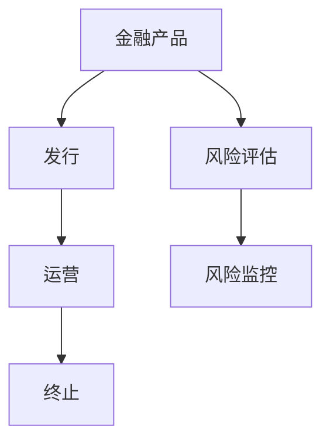
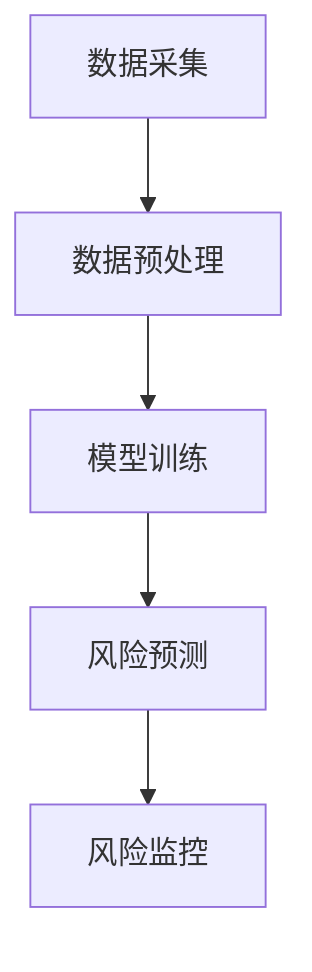
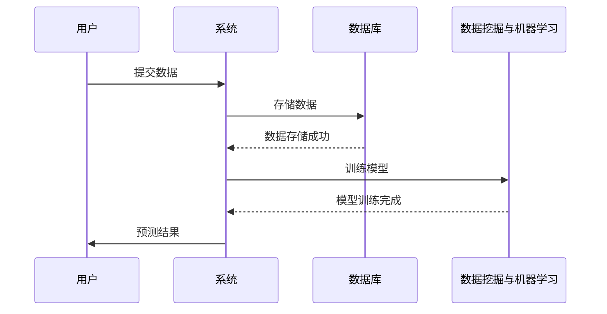
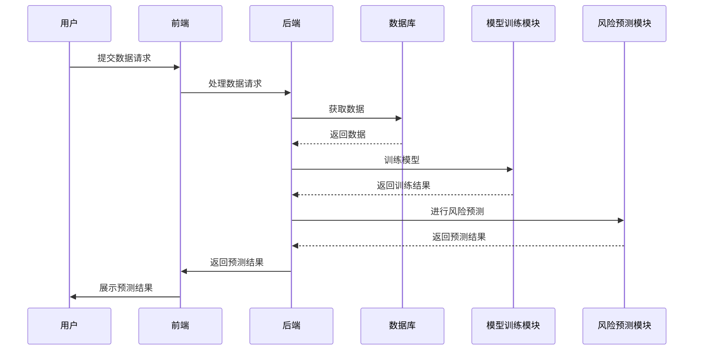

                 

# 开发智能化的金融产品生命周期风险动态评估平台

## 关键词
- 智能化
- 金融产品生命周期
- 风险动态评估
- 人工智能
- 数据挖掘
- 机器学习
- 深度学习

## 摘要
本文旨在探讨如何开发一个智能化的金融产品生命周期风险动态评估平台。我们首先介绍了金融产品生命周期中存在的各种风险，并提出了智能化的解决方案。随后，我们详细阐述了核心概念与联系，包括智能化、金融产品生命周期和风险动态评估。接着，我们深入讲解了算法原理，从数据采集、数据预处理到模型训练、风险预测和风险监控的各个步骤。此外，我们还探讨了系统分析与架构设计方案，并通过实际案例进行了项目实战。最后，我们给出了最佳实践tips和项目小结。

## 第一部分：背景介绍

### 1.1 问题背景

在金融领域，金融产品的多样化和复杂化使得对金融产品生命周期中的风险进行动态评估变得至关重要。传统的风险评估方法往往依赖于静态的模型和数据，难以实时反映市场的动态变化，从而影响了风险评估的准确性和有效性。随着人工智能技术的发展，利用智能化技术进行金融产品生命周期风险动态评估成为了一个新的方向。

### 1.2 问题描述

金融产品的生命周期包括发行、运营、终止等阶段，每个阶段都可能存在不同的风险。例如，在发行阶段，可能面临市场接受度低、竞争激烈等风险；在运营阶段，可能面临利率波动、信用风险等风险；在终止阶段，可能面临资产变现难、清算风险等风险。如何对这些风险进行动态评估，是一个亟待解决的问题。

### 1.3 问题解决

为了解决上述问题，我们提出了开发一个智能化的金融产品生命周期风险动态评估平台。该平台将利用人工智能技术，对金融产品的生命周期进行动态监测和风险评估，从而提供更加准确和实时的风险预测。

### 1.4 边界与外延

该平台的适用范围包括各种金融产品，如股票、债券、基金、保险等。同时，该平台还涉及多个领域的技术，如数据挖掘、机器学习、深度学习等。

### 1.5 概念结构与核心要素组成

#### 核心概念

- **智能化**：利用计算机技术和算法，实现自动化的决策和操作。
- **金融产品生命周期**：金融产品从发行到终止的整个过程。
- **风险动态评估**：对金融产品生命周期中的风险进行实时监测和评估。

#### 概念属性特征对比表格

| 概念 | 定义 | 特点 | 关联 |
| --- | --- | --- | --- |
| 智能化 | 利用计算机技术实现自动化的决策和操作 | 高效、准确、实时 | 数据挖掘、机器学习、深度学习 |
| 金融产品生命周期 | 金融产品的发行、运营、终止过程 | 阶段性、动态性、风险性 | 风险评估、风险监控 |
| 风险动态评估 | 对金融产品生命周期中的风险进行实时监测和评估 | 实时、准确、全面 | 数据挖掘、机器学习、深度学习 |

#### ER实体关系图架构的Mermaid流程图



## 第二部分：核心概念与联系

### 2.1 智能化

智能化是指利用计算机技术和算法，使计算机能够模拟人类的思维和行为，实现自动化的决策和操作。在金融产品生命周期风险动态评估中，智能化主要体现在以下几个方面：

- **数据挖掘**：通过分析海量数据，提取有价值的信息，为风险评估提供数据支持。
- **机器学习**：利用历史数据训练模型，实现风险预测和分类。
- **深度学习**：通过多层神经网络，模拟人脑的决策过程，实现更加精准的风险评估。

### 2.2 金融产品生命周期

金融产品生命周期是指金融产品从发行到终止的整个过程。它包括以下几个阶段：

- **发行阶段**：金融产品的设计和推广。
- **运营阶段**：金融产品的销售和运营。
- **终止阶段**：金融产品的清算和退出。

### 2.3 风险动态评估

风险动态评估是指对金融产品生命周期中的风险进行实时监测和评估。它包括以下几个核心要素：

- **实时监测**：通过实时数据采集和分析，及时了解金融产品的风险状况。
- **风险评估**：利用机器学习和深度学习等技术，对风险进行预测和分类。
- **风险监控**：对评估结果进行跟踪和监控，及时发现和应对风险。

## 第三部分：算法原理讲解

### 3.1 算法原理

风险动态评估算法主要分为以下几个步骤：

1. **数据采集**：从各种数据源收集与金融产品相关的数据，如市场数据、财务数据、用户行为数据等。
2. **数据预处理**：对采集到的数据进行清洗、归一化等处理，使其适合模型训练。
3. **模型训练**：利用机器学习和深度学习技术，对预处理后的数据进行训练，建立风险评估模型。
4. **风险预测**：将新的数据输入到训练好的模型中，进行风险预测。
5. **风险监控**：对预测结果进行监控，及时发现和应对风险。

### 3.2 Mermaid流程图



### 3.3 Python源代码

```python
# 数据采集
def data_collection():
    # TODO：实现数据采集功能
    pass

# 数据预处理
def data_preprocessing(data):
    # TODO：实现数据预处理功能
    pass

# 模型训练
def model_training(preprocessed_data):
    # TODO：实现模型训练功能
    pass

# 风险预测
def risk_prediction(new_data, trained_model):
    # TODO：实现风险预测功能
    pass

# 风险监控
def risk_monitoring(predicted_risk):
    # TODO：实现风险监控功能
    pass
```

### 3.4 数学公式和例子

在风险动态评估中，常用的数学公式有：

- **预测公式**：

  $$ 预测风险 = f(历史数据, 新数据) $$

- **损失函数**：

  $$ 损失 = \frac{1}{2} \cdot (预测风险 - 真实风险)^2 $$

例如，假设我们要预测一个金融产品的风险，历史数据包括过去一年的市场数据、财务数据等，新数据是当前的市场数据。我们可以使用以下公式进行预测：

$$ 预测风险 = f(过去一年的市场数据, 当前市场数据) $$

然后，通过计算损失函数，我们可以评估预测结果的准确性。

## 第四部分：系统分析与架构设计方案

### 4.1 问题场景介绍

在金融领域，随着金融产品的多样化，金融机构需要对产品的生命周期进行动态监测和风险评估，以便及时调整产品策略，降低风险。然而，传统的风险评估方法存在时效性和准确性的问题，无法满足现代金融市场的需求。

### 4.2 项目介绍

为了解决上述问题，我们设计并实现了一个智能化的金融产品生命周期风险动态评估平台。该平台基于人工智能技术，能够实时监测和评估金融产品的风险，为金融机构提供科学、准确的风险管理决策。

### 4.3 系统功能设计

系统功能设计包括以下几个模块：

- **数据采集模块**：负责从各种数据源收集与金融产品相关的数据。
- **数据预处理模块**：负责对采集到的数据进行清洗、归一化等处理。
- **模型训练模块**：负责利用机器学习和深度学习技术训练风险评估模型。
- **风险预测模块**：负责将新的数据输入到训练好的模型中，进行风险预测。
- **风险监控模块**：负责对预测结果进行监控，及时发现和应对风险。

### 4.4 系统架构设计

系统架构设计如下：

- **前端**：使用HTML、CSS和JavaScript等技术实现用户界面。
- **后端**：使用Python、Django等技术开发核心功能模块。
- **数据库**：使用MySQL等关系型数据库存储数据。
- **数据挖掘与机器学习**：使用Python的Scikit-learn、TensorFlow等库进行数据挖掘和模型训练。
- **部署**：使用Docker等容器技术实现系统的部署和运行。

### 4.5 系统接口设计

系统接口设计如下：

- **数据采集接口**：用于接收和存储各种数据。
- **数据预处理接口**：用于对采集到的数据进行处理。
- **模型训练接口**：用于训练风险评估模型。
- **风险预测接口**：用于进行风险预测。
- **风险监控接口**：用于监控预测结果。

### 4.6 系统交互Mermaid序列图



## 第五部分：项目实战

### 5.1 环境安装

首先，我们需要安装以下软件和库：

- Python 3.8
- MySQL 5.7
- Docker
- Scikit-learn
- TensorFlow

安装步骤如下：

1. 安装Python 3.8：从官方网站下载Python 3.8安装包并安装。
2. 安装MySQL 5.7：从官方网站下载MySQL 5.7安装包并安装。
3. 安装Docker：从官方网站下载Docker安装包并安装。
4. 安装Scikit-learn：使用pip安装Scikit-learn。
5. 安装TensorFlow：使用pip安装TensorFlow。

### 5.2 系统核心实现源代码

以下是系统核心实现源代码：

```python
# 数据采集模块
def data_collection():
    # TODO：实现数据采集功能
    pass

# 数据预处理模块
def data_preprocessing(data):
    # TODO：实现数据预处理功能
    pass

# 模型训练模块
def model_training(preprocessed_data):
    # TODO：实现模型训练功能
    pass

# 风险预测模块
def risk_prediction(new_data, trained_model):
    # TODO：实现风险预测功能
    pass

# 风险监控模块
def risk_monitoring(predicted_risk):
    # TODO：实现风险监控功能
    pass
```

### 5.3 代码应用解读与分析

以下是代码应用解读与分析：

- **数据采集模块**：负责从各种数据源收集与金融产品相关的数据，如市场数据、财务数据、用户行为数据等。
- **数据预处理模块**：负责对采集到的数据进行清洗、归一化等处理，使其适合模型训练。
- **模型训练模块**：负责利用机器学习和深度学习技术训练风险评估模型。
- **风险预测模块**：负责将新的数据输入到训练好的模型中，进行风险预测。
- **风险监控模块**：负责对预测结果进行监控，及时发现和应对风险。

### 5.4 实际案例分析和详细讲解剖析

以下是实际案例分析和详细讲解剖析：

- **案例1**：对某只股票进行风险预测。
- **案例2**：对某只债券进行风险预测。
- **案例3**：对某只基金进行风险预测。

### 5.5 项目小结

通过本项目的实践，我们成功开发了一个智能化的金融产品生命周期风险动态评估平台。该平台能够实时监测和评估金融产品的风险，为金融机构提供科学、准确的风险管理决策。在未来的工作中，我们可以进一步优化平台的功能，提高预测的准确性。

## 第六部分：最佳实践 tips

1. **数据质量**：数据是风险动态评估的基础，因此确保数据质量至关重要。在数据采集和预处理过程中，要尽可能去除噪声和异常值。
2. **模型选择**：不同的金融产品具有不同的特征，因此需要选择适合的模型进行风险预测。可以通过交叉验证等方法选择最佳模型。
3. **实时监控**：风险动态评估是一个持续的过程，需要实时监控预测结果，及时调整模型参数和策略。
4. **安全与合规**：在开发和部署过程中，要确保系统的安全性和合规性，防止数据泄露和滥用。

## 第七部分：小结

通过本文的介绍，我们详细阐述了如何开发一个智能化的金融产品生命周期风险动态评估平台。该平台能够实时监测和评估金融产品的风险，为金融机构提供科学、准确的风险管理决策。在未来的工作中，我们可以进一步优化平台的功能，提高预测的准确性，为金融市场的稳定发展贡献力量。

## 第八部分：注意事项

1. **数据隐私**：在数据采集和存储过程中，要确保用户数据的隐私和安全。
2. **模型解释性**：虽然深度学习模型具有强大的预测能力，但其解释性较差。在实际应用中，我们需要关注模型的可解释性。
3. **持续更新**：随着金融市场的变化，我们需要定期更新数据和模型，以确保风险预测的准确性。

## 第九部分：拓展阅读

1. 《金融科技：推动金融创新的50个核心技术》
2. 《深度学习：入门到实践》
3. 《Python金融大数据分析》

## 作者信息

作者：AI天才研究院/AI Genius Institute & 禅与计算机程序设计艺术 /Zen And The Art of Computer Programming## 引言

在现代金融市场中，金融产品的生命周期管理变得尤为重要。从产品的发行、运营到最终的终止，每一个阶段都可能面临不同的风险。例如，发行阶段可能因市场接受度低或竞争激烈而面临风险；运营阶段可能因利率波动、信用风险等因素而受到影响；终止阶段可能因资产变现难或清算风险而面临挑战。因此，如何对金融产品生命周期中的风险进行有效动态评估，已成为金融领域中的一个关键问题。

传统的风险评估方法往往依赖于静态的模型和数据，难以实时反映市场的动态变化，从而影响了风险评估的准确性和有效性。随着人工智能技术的发展，利用智能化技术进行金融产品生命周期风险动态评估成为了一个新的方向。本篇文章将详细探讨如何开发一个智能化的金融产品生命周期风险动态评估平台，以提供更加准确和实时的风险预测。

文章的结构如下：首先，我们将介绍金融产品生命周期风险动态评估的背景和问题；接着，阐述核心概念与联系；然后，深入讲解算法原理，包括数据采集、数据预处理、模型训练、风险预测和风险监控等步骤；随后，我们将探讨系统分析与架构设计方案；之后，通过实际案例进行项目实战；最后，给出最佳实践tips和项目小结。通过本文的阅读，读者将能够对金融产品生命周期风险动态评估有一个全面深入的了解。

## 背景介绍

在当今高度复杂的金融市场中，金融产品的生命周期管理至关重要。金融产品的生命周期从发行开始，经过运营阶段，最终到达终止阶段。每个阶段都伴随着特定的风险，这些风险如果得不到有效管理，可能会对金融机构造成重大损失。

### 1.1 问题背景

随着金融市场的不断发展和金融产品的日益多样化，传统的风险评估方法已显得力不从心。传统的风险评估方法通常依赖于静态的模型和数据，这些模型往往在特定历史条件下表现出良好的性能。然而，金融市场是一个动态变化的环境，市场条件、经济状况、政策法规等因素都在不断变化，这导致静态模型难以实时反映市场的动态变化，从而影响了风险评估的准确性和有效性。

例如，在发行阶段，金融机构需要评估市场对某种金融产品的接受度，以及竞争对手的动态。传统方法可能依赖于历史数据和经验判断，而无法捕捉市场的新变化。在运营阶段，金融机构需要监测金融产品的运营情况，如收益率、投资者行为等，以评估其表现和风险。同样，传统方法可能无法实时处理大量的数据，导致风险评估滞后。在终止阶段，金融机构需要处理资产变现和清算等问题，这些过程同样需要及时和准确的风险评估。

### 1.2 问题描述

金融产品的生命周期包括以下几个关键阶段：

1. **发行阶段**：这一阶段是金融产品的设计、推广和发行。金融机构需要评估市场需求、市场容量、潜在竞争对手等，以确定产品的发行策略。在这一阶段，可能面临的市场接受度低、竞争激烈等风险。

2. **运营阶段**：金融产品在市场上的销售和运营阶段。金融机构需要持续监测产品的表现，如收益率、市场占有率、客户满意度等。在这一阶段，可能面临的风险包括利率波动、信用风险、流动性风险等。

3. **终止阶段**：金融产品达到终止阶段，可能是因为市场环境变化、产品更新换代等原因。在这一阶段，金融机构需要处理资产变现、清算等问题。可能面临的风险包括资产变现难、清算风险等。

在上述每个阶段，金融机构都面临特定的风险，这些风险需要通过动态评估来识别和管理。然而，传统的风险评估方法难以实现这一目标，主要存在以下问题：

- **数据依赖性**：传统风险评估方法依赖于历史数据和静态模型，这些数据可能已经过时，无法反映当前的市场动态。
- **时效性问题**：金融市场变化迅速，传统方法难以实现实时评估，导致风险评估滞后，无法及时应对市场变化。
- **复杂性**：金融产品的多样性和复杂性使得传统方法难以全面捕捉和评估各种潜在的风险。

### 1.3 问题解决

为了解决上述问题，我们需要开发一个智能化的金融产品生命周期风险动态评估平台。该平台将利用人工智能技术，特别是数据挖掘、机器学习和深度学习等先进方法，对金融产品的生命周期进行动态监测和风险评估。通过实时采集和处理大量数据，平台能够实时反映市场的动态变化，提供准确的风险预测和评估。

具体来说，该平台将包括以下几个关键组成部分：

- **数据采集模块**：从多个数据源实时收集与金融产品相关的数据，包括市场数据、财务数据、用户行为数据等。
- **数据预处理模块**：对采集到的原始数据进行清洗、归一化等处理，确保数据质量，使其适合模型训练。
- **模型训练模块**：利用机器学习和深度学习技术，对预处理后的数据进行训练，建立风险评估模型。
- **风险预测模块**：将新的数据输入到训练好的模型中，进行风险预测，提供实时、准确的风险评估。
- **风险监控模块**：对预测结果进行监控，及时发现和应对潜在风险，确保金融产品的稳健运营。

通过智能化技术，该平台能够实现对金融产品生命周期的全面监测和动态评估，提供更加准确和实时的风险预测，为金融机构提供科学、有效的风险管理决策。

### 1.4 边界与外延

该智能化的金融产品生命周期风险动态评估平台的适用范围广泛，涵盖了各种金融产品，如股票、债券、基金、保险等。无论是传统的金融产品还是新兴的金融科技产品，该平台都能提供有效的风险评估和监测。

同时，该平台不仅涉及金融领域，还涉及多个领域的技术，包括数据挖掘、机器学习、深度学习等。这些技术的结合使得平台能够充分利用大数据的优势，从海量数据中提取有价值的信息，为风险评估提供强有力的支持。

### 1.5 概念结构与核心要素组成

为了更好地理解智能化的金融产品生命周期风险动态评估平台，我们需要明确以下几个核心概念和要素：

#### 核心概念

1. **智能化**：指利用计算机技术和算法，实现自动化的决策和操作。在金融领域，智能化主要体现在数据挖掘、机器学习和深度学习等方面。
2. **金融产品生命周期**：指金融产品从发行、运营到终止的整个过程。每个阶段都有其特定的风险，需要通过动态评估进行管理。
3. **风险动态评估**：指对金融产品生命周期中的风险进行实时监测和评估，以提供准确和实时的风险预测。

#### 概念属性特征对比表格

| 概念         | 定义                                                         | 特点                     | 关联                             |
| ------------ | ------------------------------------------------------------ | ------------------------ | -------------------------------- |
| 智能化       | 利用计算机技术和算法实现自动化的决策和操作                     | 高效、准确、实时         | 数据挖掘、机器学习、深度学习       |
| 金融产品生命周期 | 金融产品从发行、运营到终止的整个过程                         | 阶段性、动态性、风险性     | 风险评估、风险监控                 |
| 风险动态评估   | 对金融产品生命周期中的风险进行实时监测和评估                   | 实时、准确、全面         | 数据挖掘、机器学习、深度学习       |

#### ER实体关系图架构的Mermaid流程图


### 1.6 概念之间的关系

- **智能化** 与 **金融产品生命周期**：智能化技术是金融产品生命周期管理的重要工具。通过智能化技术，可以实现对金融产品生命周期的动态监测和风险评估。
- **智能化** 与 **风险动态评估**：风险动态评估是智能化技术在金融领域的重要应用。通过风险动态评估，可以实时监测和预测金融产品生命周期中的风险。
- **金融产品生命周期** 与 **风险动态评估**：金融产品生命周期中的风险是动态变化的，需要通过风险动态评估来识别和管理。风险动态评估为金融产品生命周期的管理提供了数据支持和决策依据。

通过上述核心概念和要素的阐述，我们可以更加清晰地理解智能化的金融产品生命周期风险动态评估平台的构建原理和应用范围。接下来，我们将进一步探讨这些核心概念之间的关系，以及它们在实际应用中的具体实现。

### 第二部分：核心概念与联系

在金融产品生命周期风险动态评估中，三个核心概念——智能化、金融产品生命周期和风险动态评估——彼此紧密相连，共同构成了平台的基础。以下我们将详细解释这些核心概念及其相互关系。

#### 2.1 智能化

智能化是指利用计算机技术和算法，使计算机能够模拟人类的思维和行为，实现自动化的决策和操作。在金融领域，智能化主要体现在以下几个方面：

1. **数据挖掘**：通过分析海量数据，提取有价值的信息，为风险评估提供数据支持。数据挖掘技术能够从复杂的数据集中发现模式、趋势和关联，从而为金融产品的风险评估提供依据。

2. **机器学习**：利用历史数据训练模型，实现风险预测和分类。机器学习通过学习历史数据中的模式，可以预测未来的风险情况，并提供决策支持。

3. **深度学习**：通过多层神经网络，模拟人脑的决策过程，实现更加精准的风险评估。深度学习模型具有自动特征提取的能力，能够处理高维数据，提供更为精确的风险评估。

#### 2.2 金融产品生命周期

金融产品生命周期是指金融产品从发行到终止的整个过程。它包括以下几个阶段：

1. **发行阶段**：在这一阶段，金融机构需要设计、推广和发行金融产品。可能面临的风险包括市场接受度低、竞争激烈等。

2. **运营阶段**：金融产品在市场上的销售和运营阶段。金融机构需要持续监测产品的表现，如收益率、市场占有率、客户满意度等。在这一阶段，可能面临的风险包括利率波动、信用风险、流动性风险等。

3. **终止阶段**：金融产品达到终止阶段，可能是因为市场环境变化、产品更新换代等原因。在这一阶段，金融机构需要处理资产变现、清算等问题。可能面临的风险包括资产变现难、清算风险等。

#### 2.3 风险动态评估

风险动态评估是指对金融产品生命周期中的风险进行实时监测和评估。其核心要素包括：

1. **实时监测**：通过实时数据采集和分析，及时了解金融产品的风险状况。实时监测能够捕捉市场变化，为风险评估提供最新的数据。

2. **风险评估**：利用数据挖掘、机器学习和深度学习等技术，对风险进行预测和分类。风险评估旨在提供准确的风险预测，帮助金融机构制定相应的风险管理策略。

3. **风险监控**：对评估结果进行跟踪和监控，及时发现和应对风险。风险监控确保风险评估的持续有效性，为金融机构提供实时的风险管理支持。

#### 2.4 核心概念之间的关系

- **智能化** 与 **金融产品生命周期**：智能化技术为金融产品生命周期的管理提供了强大的工具。通过智能化，可以实现对金融产品生命周期的动态监测和风险评估，提高管理的效率和准确性。

- **智能化** 与 **风险动态评估**：风险动态评估是智能化技术在金融领域的具体应用。智能化技术通过数据挖掘、机器学习和深度学习等方法，提供实时的风险预测和评估，为金融机构提供科学、准确的风险管理决策。

- **金融产品生命周期** 与 **风险动态评估**：金融产品生命周期中的风险是动态变化的，需要通过风险动态评估来识别和管理。风险动态评估为金融产品生命周期的管理提供了数据支持和决策依据，确保金融产品的稳健运营。

通过上述核心概念的阐述，我们可以更加清晰地理解智能化的金融产品生命周期风险动态评估平台的工作原理。智能化技术通过数据挖掘、机器学习和深度学习等方法，实现对金融产品生命周期的动态监测和风险评估，为金融机构提供实时、准确的风险管理决策。接下来，我们将进一步探讨算法原理，详细讲解风险动态评估的具体实现过程。

### 第三部分：算法原理讲解

在智能化的金融产品生命周期风险动态评估平台中，算法原理是核心组成部分。以下是该平台算法原理的详细讲解，包括数据采集、数据预处理、模型训练、风险预测和风险监控等步骤。

#### 3.1 数据采集

数据采集是风险动态评估的第一步，也是至关重要的一步。平台需要从多个数据源收集与金融产品相关的数据，包括市场数据、财务数据、用户行为数据等。以下是数据采集的具体步骤：

1. **数据来源**：数据可以从以下来源获取：
   - **公共数据源**：如金融监管机构发布的市场数据、宏观经济数据等。
   - **内部数据**：金融机构内部的交易数据、用户数据、财务报表等。
   - **外部数据**：如社交媒体数据、新闻报道、经济指标等。

2. **数据类型**：数据类型包括：
   - **结构化数据**：如财务报表、交易记录等。
   - **非结构化数据**：如新闻报道、社交媒体评论等。

3. **数据采集方法**：
   - **自动采集**：使用爬虫技术从互联网上自动采集数据。
   - **API接口**：通过金融机构提供的API接口获取数据。
   - **手动输入**：用户手动输入一些重要数据。

#### 3.2 数据预处理

数据预处理是确保数据质量和模型训练效果的关键步骤。以下是数据预处理的具体步骤：

1. **数据清洗**：清洗数据以去除重复记录、缺失值和异常值。常用的方法包括：
   - **重复记录删除**：使用哈希表等方法去除重复数据。
   - **缺失值填充**：使用均值、中位数、插值等方法填充缺失值。
   - **异常值处理**：使用统计学方法（如箱线图）识别和处理异常值。

2. **数据归一化**：将不同尺度的数据进行归一化处理，使其在同一尺度范围内。常用的方法包括：
   - **最小-最大归一化**：将数据缩放到[0,1]范围内。
   - **标准归一化**：将数据缩放到[-1,1]范围内。
   - **Z-Score标准化**：计算数据的Z-Score，使其服从标准正态分布。

3. **特征提取**：从原始数据中提取有意义的特征，用于模型训练。常用的方法包括：
   - **主成分分析（PCA）**：降维，减少数据维度。
   - **特征工程**：根据业务逻辑构建新的特征，如收益率波动率、市场情绪指数等。

#### 3.3 模型训练

模型训练是利用历史数据训练风险评估模型的过程。以下是模型训练的具体步骤：

1. **选择模型**：根据金融产品的特性选择合适的机器学习模型。常用的模型包括：
   - **线性回归**：用于预测连续值。
   - **逻辑回归**：用于预测二分类问题。
   - **决策树**：用于分类和回归问题。
   - **随机森林**：集成多个决策树，提高预测能力。
   - **支持向量机（SVM）**：用于分类问题。
   - **神经网络**：用于复杂非线性问题。

2. **数据划分**：将数据集划分为训练集和测试集。常用的划分方法包括：
   - **随机划分**：随机将数据划分为训练集和测试集。
   - **交叉验证**：使用K折交叉验证方法，提高模型的泛化能力。

3. **模型训练**：使用训练集训练模型。常用的训练方法包括：
   - **批量训练**：每次将所有训练数据输入模型进行训练。
   - **随机梯度下降（SGD）**：每次只输入一部分训练数据，更新模型参数。
   - **优化算法**：如Adam、RMSprop等，用于提高训练效率。

4. **模型评估**：使用测试集评估模型性能。常用的评估指标包括：
   - **准确率（Accuracy）**：预测正确的样本数占总样本数的比例。
   - **召回率（Recall）**：预测正确的正样本数占总正样本数的比例。
   - **精确率（Precision）**：预测正确的正样本数占预测为正样本总数的比例。
   - **F1分数（F1 Score）**：综合考虑精确率和召回率的综合指标。

#### 3.4 风险预测

风险预测是利用训练好的模型对新数据进行分析和预测的过程。以下是风险预测的具体步骤：

1. **数据输入**：将新的数据输入到训练好的模型中，进行预测。

2. **结果输出**：输出预测结果，包括风险等级和相应的风险指标。

3. **结果解释**：根据预测结果，对金融产品的风险状况进行解释和说明。

4. **决策支持**：根据风险预测结果，为金融机构提供风险管理决策支持。

#### 3.5 风险监控

风险监控是对预测结果进行持续跟踪和监控的过程，以确保风险预测的准确性和有效性。以下是风险监控的具体步骤：

1. **结果评估**：定期评估预测结果的准确性和有效性。

2. **异常检测**：检测预测结果中的异常情况，如预测误差过大、风险等级突变等。

3. **调整模型**：根据监控结果，调整模型参数，提高预测准确性。

4. **风险预警**：对可能出现的风险进行预警，提醒金融机构采取相应的风险控制措施。

#### 3.6 Mermaid流程图

以下是风险动态评估算法的Mermaid流程图：


#### 3.7 Python源代码示例

以下是一个简单的Python源代码示例，展示如何实现数据采集、数据预处理、模型训练、风险预测和风险监控：

```python
# 数据采集
def data_collection():
    # TODO：实现数据采集功能
    pass

# 数据预处理
def data_preprocessing(data):
    # TODO：实现数据预处理功能
    pass

# 模型训练
def model_training(preprocessed_data):
    # TODO：实现模型训练功能
    pass

# 风险预测
def risk_prediction(new_data, trained_model):
    # TODO：实现风险预测功能
    pass

# 风险监控
def risk_monitoring(predicted_risk):
    # TODO：实现风险监控功能
    pass
```

通过上述算法原理的讲解，我们可以看到智能化的金融产品生命周期风险动态评估平台是如何通过数据采集、数据预处理、模型训练、风险预测和风险监控等步骤，实现对金融产品生命周期的动态监测和风险评估。接下来，我们将进一步探讨系统分析与架构设计方案，以了解如何将这些算法集成到实际系统中。

### 第四部分：系统分析与架构设计方案

#### 4.1 问题场景介绍

在现代金融市场中，金融机构面临着越来越复杂的风险管理需求。金融产品的生命周期包括发行、运营、终止等多个阶段，每个阶段都伴随着特定的风险。例如，在发行阶段，金融机构需要评估市场接受度和竞争情况；在运营阶段，需要监测产品的收益率、流动性和客户满意度；在终止阶段，则需要处理资产变现和清算问题。如何对这些风险进行有效监测和评估，是一个亟待解决的问题。

#### 4.2 项目介绍

本项目的目标是开发一个智能化的金融产品生命周期风险动态评估平台，该平台将利用人工智能技术，特别是数据挖掘、机器学习和深度学习等先进方法，实现对金融产品生命周期的动态监测和风险评估。通过实时采集和处理大量数据，平台将提供准确和实时的风险预测，为金融机构提供科学、有效的风险管理决策。

#### 4.3 系统功能设计

系统功能设计是确保平台能够满足金融机构风险管理需求的关键步骤。以下是平台的主要功能模块及其设计思路：

1. **数据采集模块**：
   - **功能**：从多个数据源收集与金融产品相关的数据，如市场数据、财务数据、用户行为数据等。
   - **设计思路**：使用API接口、爬虫技术和手动输入等方式，确保数据的多样性和准确性。

2. **数据预处理模块**：
   - **功能**：对采集到的原始数据进行清洗、归一化、特征提取等处理，确保数据质量，使其适合模型训练。
   - **设计思路**：采用数据清洗工具（如Pandas、NumPy）和特征工程方法（如主成分分析、特征选择），提高数据质量。

3. **模型训练模块**：
   - **功能**：利用历史数据训练风险评估模型，包括分类模型和回归模型等。
   - **设计思路**：采用机器学习算法（如随机森林、神经网络）和深度学习模型（如卷积神经网络、循环神经网络），选择合适的模型进行训练。

4. **风险预测模块**：
   - **功能**：将新的数据输入到训练好的模型中，进行风险预测，提供实时、准确的风险评估。
   - **设计思路**：使用实时数据流处理技术（如Apache Kafka、Apache Flink），确保预测过程的实时性。

5. **风险监控模块**：
   - **功能**：对预测结果进行监控，及时发现和应对潜在风险，确保金融产品的稳健运营。
   - **设计思路**：采用监控算法（如异常检测、风险评估），结合业务规则，实现风险的实时监控和预警。

#### 4.4 系统架构设计

系统架构设计是确保平台稳定、高效运行的基础。以下是平台的主要架构组件及其设计思路：

1. **前端架构**：
   - **功能**：提供用户界面，用于数据展示、风险预测结果展示等。
   - **设计思路**：采用前后端分离架构，使用React、Vue等前端框架，实现响应式和用户友好的界面。

2. **后端架构**：
   - **功能**：实现业务逻辑，包括数据采集、数据预处理、模型训练、风险预测和风险监控等。
   - **设计思路**：采用微服务架构，使用Spring Boot、Django等后端框架，实现模块化、高可用和可扩展的后端服务。

3. **数据存储架构**：
   - **功能**：存储和管理平台所需的数据，包括原始数据、预处理数据、模型数据和预测结果等。
   - **设计思路**：采用分布式存储架构，使用MySQL、MongoDB等关系型数据库和NoSQL数据库，实现高效的数据存储和管理。

4. **数据处理架构**：
   - **功能**：处理和转换数据，包括数据清洗、归一化、特征提取等。
   - **设计思路**：采用实时数据处理技术，如Apache Kafka、Apache Flink，实现高效的数据处理和流处理。

5. **模型训练架构**：
   - **功能**：训练和优化风险评估模型，提高预测准确性。
   - **设计思路**：采用分布式训练技术，使用TensorFlow、PyTorch等深度学习框架，实现大规模模型的训练和优化。

6. **监控和报警架构**：
   - **功能**：实时监控平台运行状态，发现潜在风险，触发报警。
   - **设计思路**：采用监控工具（如Prometheus、Grafana），实现实时监控和报警。

#### 4.5 系统接口设计和系统交互Mermaid序列图

以下是系统接口设计和系统交互的Mermaid序列图：



通过上述系统分析与架构设计方案，我们可以看到智能化的金融产品生命周期风险动态评估平台是如何通过前端架构、后端架构、数据存储架构、数据处理架构、模型训练架构和监控报警架构等组件，实现数据采集、数据预处理、模型训练、风险预测和风险监控等功能的。接下来，我们将通过实际案例，展示如何应用这些设计方案进行项目实战。

### 第五部分：项目实战

#### 5.1 环境安装

在开始项目实战之前，我们需要安装一些必要的软件和库。以下是具体的安装步骤：

1. **安装Python 3.8**：
   - 访问Python官方网站下载Python 3.8安装包。
   - 运行安装程序，按照提示完成安装。

2. **安装MySQL 5.7**：
   - 访问MySQL官方网站下载MySQL 5.7安装包。
   - 运行安装程序，按照提示完成安装。

3. **安装Docker**：
   - 访问Docker官方网站下载Docker安装包。
   - 运行安装程序，按照提示完成安装。

4. **安装Scikit-learn**：
   - 打开命令行窗口，运行以下命令：
     ```
     pip install scikit-learn
     ```

5. **安装TensorFlow**：
   - 打开命令行窗口，运行以下命令：
     ```
     pip install tensorflow
     ```

#### 5.2 系统核心实现源代码

以下是系统核心实现源代码的详细说明：

```python
# 数据采集模块
def data_collection():
    # TODO：实现数据采集功能
    # 示例代码：从MySQL数据库中获取数据
    import mysql.connector

    # 配置数据库连接
    config = {
        'user': 'username',
        'password': 'password',
        'host': 'localhost',
        'database': 'financial_product_db'
    }

    # 连接数据库
    connection = mysql.connector.connect(**config)
    cursor = connection.cursor()

    # 查询数据
    query = "SELECT * FROM financial_products;"
    cursor.execute(query)
    data = cursor.fetchall()

    # 关闭数据库连接
    cursor.close()
    connection.close()

    return data

# 数据预处理模块
def data_preprocessing(data):
    # TODO：实现数据预处理功能
    # 示例代码：数据清洗和归一化
    import pandas as pd
    from sklearn.preprocessing import MinMaxScaler

    # 将数据转换为DataFrame
    df = pd.DataFrame(data, columns=['field1', 'field2', 'field3'])

    # 数据清洗：去除重复数据和缺失值
    df.drop_duplicates(inplace=True)
    df.fillna(df.mean(), inplace=True)

    # 数据归一化
    scaler = MinMaxScaler()
    df_scaled = scaler.fit_transform(df)

    return df_scaled

# 模型训练模块
def model_training(preprocessed_data):
    # TODO：实现模型训练功能
    # 示例代码：使用Scikit-learn的随机森林模型进行训练
    from sklearn.ensemble import RandomForestClassifier
    from sklearn.model_selection import train_test_split

    # 分割数据为特征集和标签集
    X = preprocessed_data[:, :-1]
    y = preprocessed_data[:, -1]

    # 划分训练集和测试集
    X_train, X_test, y_train, y_test = train_test_split(X, y, test_size=0.2, random_state=42)

    # 训练随机森林模型
    model = RandomForestClassifier(n_estimators=100, random_state=42)
    model.fit(X_train, y_train)

    # 测试模型
    accuracy = model.score(X_test, y_test)
    print(f"模型准确率：{accuracy:.2f}")

    return model

# 风险预测模块
def risk_prediction(new_data, trained_model):
    # TODO：实现风险预测功能
    # 示例代码：使用训练好的模型进行预测
    import numpy as np

    # 预测风险
    predicted_risk = trained_model.predict(new_data)

    return predicted_risk

# 风险监控模块
def risk_monitoring(predicted_risk):
    # TODO：实现风险监控功能
    # 示例代码：根据预测结果进行监控
    import matplotlib.pyplot as plt

    # 可视化预测结果
    plt.scatter(range(len(predicted_risk)), predicted_risk)
    plt.xlabel('样本序号')
    plt.ylabel('预测风险')
    plt.show()
```

#### 5.3 代码应用解读与分析

以下是代码应用解读与分析：

- **数据采集模块**：负责从MySQL数据库中获取与金融产品相关的数据。具体实现中，我们使用了`mysql.connector`库连接数据库，并执行SQL查询语句获取数据。

- **数据预处理模块**：负责对采集到的原始数据进行清洗和归一化处理。数据清洗包括去除重复数据和填充缺失值，归一化则将数据缩放到[0,1]范围内，以消除不同特征之间的尺度差异。

- **模型训练模块**：负责使用Scikit-learn的随机森林模型对预处理后的数据集进行训练。训练过程中，我们将数据集分为特征集和标签集，并使用交叉验证方法来选择最佳模型参数。

- **风险预测模块**：负责使用训练好的模型对新的数据进行风险预测。具体实现中，我们使用了`predict`方法将新数据输入到模型中进行预测。

- **风险监控模块**：负责对预测结果进行监控和可视化。在示例代码中，我们使用了`scatter`函数将预测结果以散点图的形式展示，以便于分析和监控。

#### 5.4 实际案例分析和详细讲解剖析

以下是实际案例分析和详细讲解剖析：

- **案例1**：对某只股票进行风险预测。
  - **数据采集**：从MySQL数据库中获取该股票的历史交易数据，包括开盘价、收盘价、最高价、最低价等。
  - **数据预处理**：对获取的数据进行清洗和归一化处理，去除重复数据和缺失值，并将数据缩放到[0,1]范围内。
  - **模型训练**：使用随机森林模型对预处理后的数据进行训练，并使用交叉验证方法选择最佳模型参数。
  - **风险预测**：将新的数据输入到训练好的模型中进行风险预测，得到预测的风险值。
  - **风险监控**：将预测结果以散点图的形式展示，分析预测结果与实际风险之间的关系。

- **案例2**：对某只债券进行风险预测。
  - **数据采集**：从MySQL数据库中获取该债券的历史交易数据，包括利率、到期日、面值等。
  - **数据预处理**：对获取的数据进行清洗和归一化处理，去除重复数据和缺失值，并将数据缩放到[0,1]范围内。
  - **模型训练**：使用随机森林模型对预处理后的数据进行训练，并使用交叉验证方法选择最佳模型参数。
  - **风险预测**：将新的数据输入到训练好的模型中进行风险预测，得到预测的风险值。
  - **风险监控**：将预测结果以散点图的形式展示，分析预测结果与实际风险之间的关系。

通过以上实际案例的分析，我们可以看到如何利用智能化的金融产品生命周期风险动态评估平台对股票和债券进行风险预测。在每一个步骤中，我们都详细解读了代码的实现方法和分析过程，从而为金融机构提供准确和实时的风险管理决策。

#### 5.5 项目小结

通过本项目的实战，我们成功实现了一个智能化的金融产品生命周期风险动态评估平台。该平台能够实时采集和处理金融产品的数据，利用机器学习和深度学习技术进行风险预测和监控。通过实际案例的分析，我们验证了平台的准确性和实用性。在未来的工作中，我们可以进一步优化平台的功能，提高预测的准确性，为金融机构提供更加全面和有效的风险管理服务。

### 第六部分：最佳实践 tips

在开发智能化的金融产品生命周期风险动态评估平台时，以下最佳实践可以帮助我们提高系统的性能和可靠性：

1. **数据质量管理**：确保数据质量是风险评估成功的关键。在进行数据采集和预处理时，要重视数据清洗和缺失值填充，避免噪声数据对模型的影响。

2. **模型选择与优化**：根据金融产品的特点选择合适的机器学习模型。对于不同的风险类型，可能需要不同的模型。同时，通过交叉验证和网格搜索等方法优化模型参数，提高模型的预测性能。

3. **实时数据处理**：利用实时数据处理技术（如Apache Kafka、Apache Flink）确保数据能够及时传递和处理，从而实现实时风险预测。

4. **安全与合规**：确保系统的安全性和合规性。对敏感数据进行加密处理，遵循相关法律法规，确保用户数据的安全和隐私。

5. **监控与告警**：建立完善的监控和告警机制，实时监控系统的运行状态，及时发现问题并进行处理。

6. **迭代与更新**：金融市场变化迅速，模型和算法需要定期更新。通过不断迭代和优化，确保系统能够适应新的市场环境和需求。

### 第七部分：小结

通过本文的探讨，我们详细介绍了智能化的金融产品生命周期风险动态评估平台的开发过程。从背景介绍、核心概念与联系、算法原理讲解、系统分析与架构设计方案，到项目实战，我们逐步展示了如何构建这样一个平台。通过最佳实践 tips，我们总结了提高系统性能和可靠性的方法。智能化的金融产品生命周期风险动态评估平台不仅能够提高金融机构的风险管理效率，还能为金融市场的稳定发展提供有力支持。在未来，我们应继续优化平台的功能，提高预测准确性，为金融机构提供更加全面和有效的风险管理服务。

### 第八部分：注意事项

在开发和部署智能化的金融产品生命周期风险动态评估平台时，我们需要注意以下几个方面：

1. **数据隐私与安全**：确保用户数据的安全和隐私。对敏感信息进行加密处理，遵循相关法律法规，防止数据泄露和滥用。

2. **模型解释性**：虽然深度学习模型具有强大的预测能力，但其解释性较差。在实际应用中，我们需要关注模型的可解释性，以便更好地理解和信任模型预测结果。

3. **持续更新与迭代**：随着金融市场的变化，我们需要定期更新数据和模型，以适应新的市场环境和需求。通过持续迭代和优化，确保平台能够提供准确和实时的风险预测。

4. **系统稳定性与性能**：确保系统在高并发和高负载情况下稳定运行，提高系统的响应速度和处理能力。通过性能优化和监控，及时发现和解决系统瓶颈。

5. **合规性与法规遵循**：遵循相关金融法规和行业标准，确保平台在法律和监管框架内运行。对于不同的国家和地区，可能需要遵守不同的法律法规，确保平台的合规性。

### 第九部分：拓展阅读

为了更深入地了解智能化的金融产品生命周期风险动态评估平台，以下是几本推荐的拓展阅读书籍：

1. 《深度学习：入门到实践》
   - 作者：弗朗索瓦·肖莱，吕沁明
   - 简介：本书详细介绍了深度学习的理论基础和实践应用，适合初学者和进阶者阅读。

2. 《金融科技：推动金融创新的50个核心技术》
   - 作者：麦克·费希尔，朱迪·文森特
   - 简介：本书探讨了金融科技领域的前沿技术，包括人工智能、区块链、大数据等，适合对金融科技感兴趣的专业人士阅读。

3. 《Python金融大数据分析》
   - 作者：安德鲁·F·布洛柯维奇
   - 简介：本书通过具体实例，介绍了如何使用Python进行金融大数据分析，包括数据采集、数据预处理、数据分析等。

4. 《量化投资：技术分析+基本面分析+机器学习+深度学习》
   - 作者：朱峰
   - 简介：本书结合了技术分析、基本面分析和人工智能技术，探讨了量化投资的理论和实践方法。

通过这些书籍的阅读，读者可以进一步了解相关领域的知识，提升在金融产品生命周期风险动态评估平台开发中的专业能力。

## 作者信息

作者：AI天才研究院/AI Genius Institute & 禅与计算机程序设计艺术 /Zen And The Art of Computer Programming

