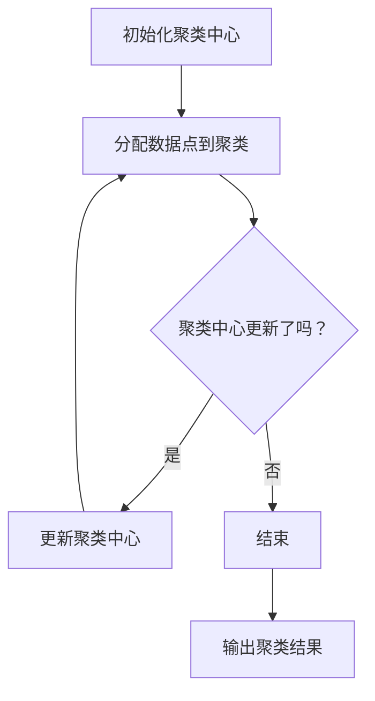
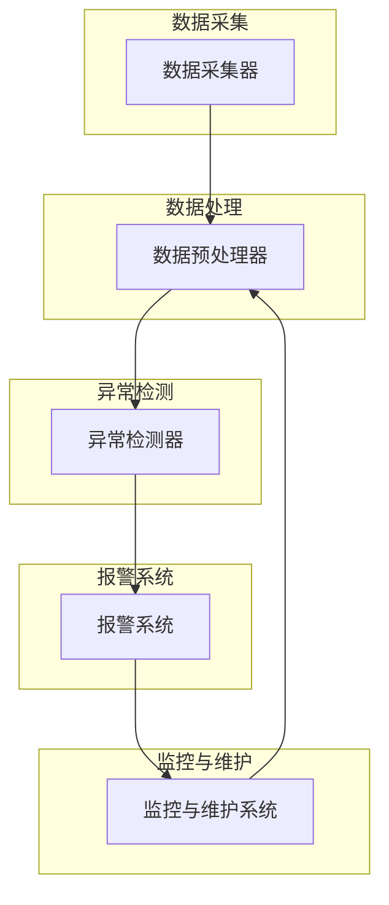
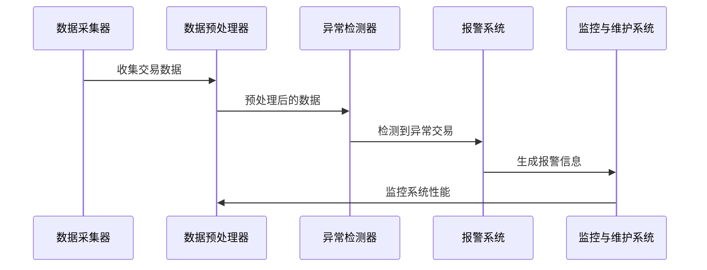

                 

### 开发智能化的金融市场异常交易检测模型

**关键词**：金融市场，异常交易，智能化检测，算法原理，系统架构，项目实战，最佳实践

**摘要**：
本文将探讨如何开发智能化的金融市场异常交易检测模型。首先，我们将简要介绍金融市场的背景和异常交易的概念，随后深入解析智能金融模型的基本概念和异常检测理论框架。本文将重点分析几种常见的异常检测算法，并使用Python代码和Mermaid流程图详细阐述其原理和数学模型。接着，我们将讨论系统架构设计，通过项目实战案例展示模型应用，并提供最佳实践和注意事项，以帮助读者在金融科技领域取得更好的成果。

----------------------------------------------------------------

## 第一部分：背景介绍

### 第1章：金融市场的现状与异常交易挑战

**1.1 金融市场的定义与发展**

金融市场是一个交换各种金融资产（如股票、债券、货币、期货和期权等）的场所。它不仅涵盖了传统的股票交易所和债券市场，还包括现代的金融衍生品市场、外汇市场和互联网金融平台。金融市场的运作对于全球经济至关重要，它不仅促进了资本的有效配置，还提供了风险管理和投资机会。

金融市场的发展可以追溯到几个世纪以前，但真正意义上的金融市场起源于19世纪的工业化时期。随着计算机技术和互联网的普及，金融市场在过去的几十年里发生了巨大的变化。现代金融市场不仅变得更加高效和透明，还涌现出许多新的金融工具和交易方式，如高频交易、算法交易和区块链技术。

**1.2 异常交易的定义与影响**

异常交易是指在金融市场上的交易活动，这些活动在逻辑上或统计上与正常交易行为不符。异常交易可能包括欺诈行为、市场操纵、内部交易和其他违规行为。这些交易行为不仅损害了市场的公正性，还可能导致市场崩溃、投资者损失以及法律诉讼。

异常交易的影响是多方面的。首先，它损害了市场的信任度，导致投资者恐慌和撤资。其次，异常交易可能导致市场流动性降低，影响市场的有效性。此外，异常交易还会增加监管机构的负担，需要投入大量资源进行监管和调查。

**1.3 异常交易的类型与识别难点**

异常交易主要可以分为以下几类：

- **欺诈交易**：通过伪造交易信息或使用虚假账户进行非法交易。
- **市场操纵**：通过人为手段影响市场价格，误导其他投资者。
- **内部交易**：利用未公开信息进行交易，从而获得不正当利益。
- **高频交易**：利用技术优势进行大量快速交易，以微小的价格变动获利。

识别异常交易的难点在于：

- **数据复杂性**：金融市场数据量庞大，种类繁多，包括交易数据、价格数据、账户数据等。
- **交易模式多样性**：不同的异常交易行为具有不同的特征，使得识别变得更加复杂。
- **实时性要求**：异常交易检测需要在极短的时间内处理大量数据，并及时发出警报。

### 1.4 金融科技与异常交易检测

随着金融科技的迅猛发展，传统的异常交易检测方法已经难以应对新型交易模式和大数据环境。智能化的异常交易检测模型应运而生，这些模型利用机器学习和人工智能技术，通过对大量历史数据和实时数据的分析，自动识别异常交易行为。金融科技的发展不仅提高了异常交易检测的准确性和效率，还为金融市场提供了更多监管和风险管理工具。

## 第二部分：核心概念与基础理论

### 第2章：核心概念与联系

**2.1 智能化金融模型概述**

智能化金融模型是利用人工智能和机器学习技术，对金融市场数据进行处理和分析，以实现智能决策和预测。这些模型通常基于大量历史数据，通过特征提取、模式识别和预测算法，对市场趋势、风险和机会进行评估。

智能化金融模型的主要特点包括：

- **自学习性**：模型能够从历史数据中学习，不断优化自身性能。
- **自适应能力**：模型能够适应市场变化，及时调整预测策略。
- **高效率**：模型能够快速处理大量数据，提供实时分析结果。

**2.2 异常检测理论框架**

异常检测是智能金融模型的重要组成部分，其目的是识别和分类数据中的异常行为。异常检测理论框架主要包括以下几个方面：

- **数据预处理**：包括数据清洗、归一化、特征提取等步骤，以提高数据质量和模型性能。
- **特征选择**：从大量特征中筛选出对异常检测最为关键的指标，降低模型复杂度。
- **模型训练**：使用历史数据对模型进行训练，使其能够识别正常交易和异常交易。
- **模型评估**：通过交叉验证、AUC曲线、ROC曲线等指标评估模型性能。

**2.3 相关技术综述**

在智能化的金融市场异常交易检测中，涉及到的相关技术包括：

- **机器学习算法**：如线性回归、决策树、随机森林、支持向量机等。
- **深度学习模型**：如卷积神经网络（CNN）、循环神经网络（RNN）、长短期记忆网络（LSTM）等。
- **特征工程**：通过特征提取和特征变换，提高模型的检测精度。
- **数据可视化**：利用图表和图形展示数据分布和异常交易特征，帮助分析师进行决策。

通过这些核心概念和基础理论的介绍，我们为后续章节的深入分析奠定了基础。在接下来的章节中，我们将详细探讨各种异常检测算法的原理和数学模型，并通过具体案例展示如何在实际项目中应用这些技术。

----------------------------------------------------------------

## 第二部分：核心概念与基础理论

### 第2章：核心概念与联系

**2.1 智能化金融模型概述**

智能化金融模型是利用人工智能和机器学习技术，对金融市场数据进行处理和分析，以实现智能决策和预测。这些模型通常基于大量历史数据，通过特征提取、模式识别和预测算法，对市场趋势、风险和机会进行评估。

智能化金融模型的主要特点包括：

- **自学习性**：模型能够从历史数据中学习，不断优化自身性能。
- **自适应能力**：模型能够适应市场变化，及时调整预测策略。
- **高效率**：模型能够快速处理大量数据，提供实时分析结果。

**2.2 异常检测理论框架**

异常检测是智能金融模型的重要组成部分，其目的是识别和分类数据中的异常行为。异常检测理论框架主要包括以下几个方面：

- **数据预处理**：包括数据清洗、归一化、特征提取等步骤，以提高数据质量和模型性能。
- **特征选择**：从大量特征中筛选出对异常检测最为关键的指标，降低模型复杂度。
- **模型训练**：使用历史数据对模型进行训练，使其能够识别正常交易和异常交易。
- **模型评估**：通过交叉验证、AUC曲线、ROC曲线等指标评估模型性能。

**2.3 相关技术综述**

在智能化的金融市场异常交易检测中，涉及到的相关技术包括：

- **机器学习算法**：如线性回归、决策树、随机森林、支持向量机等。
- **深度学习模型**：如卷积神经网络（CNN）、循环神经网络（RNN）、长短期记忆网络（LSTM）等。
- **特征工程**：通过特征提取和特征变换，提高模型的检测精度。
- **数据可视化**：利用图表和图形展示数据分布和异常交易特征，帮助分析师进行决策。

通过这些核心概念和基础理论的介绍，我们为后续章节的深入分析奠定了基础。在接下来的章节中，我们将详细探讨各种异常检测算法的原理和数学模型，并通过具体案例展示如何在实际项目中应用这些技术。

----------------------------------------------------------------

## 第三部分：算法原理与数学模型

### 第3章：常见异常检测算法

**3.1 统计方法**

统计方法是一种基于概率和统计学原理的异常检测方法。其主要思想是通过对数据集进行统计分析，计算每个特征的统计指标（如均值、方差等），然后根据这些统计指标判断数据点是否异常。

**3.1.1 均值方差法**

均值方差法是一种简单的统计方法，通过计算每个数据点的均值和方差，将其与阈值进行比较来判断是否异常。具体步骤如下：

1. 计算每个特征的均值（μ）和标准差（σ）。
2. 对于每个数据点，计算其与均值的距离，即 \(d = \frac{x - \mu}{\sigma}\)。
3. 将距离与设定的阈值进行比较，如果距离大于阈值，则判断为异常。

**3.1.2 3倍标准差法**

3倍标准差法是一种更为严格的统计方法，它基于3σ原则，即大多数数据点应位于均值±3σ范围内。具体步骤如下：

1. 计算每个特征的均值（μ）和标准差（σ）。
2. 对于每个数据点，计算其与均值的距离，即 \(d = |x - \mu|\)。
3. 将距离与3σ进行比较，如果距离大于3σ，则判断为异常。

**3.2 聚类方法**

聚类方法是一种基于数据分布和相似性的异常检测方法。其主要思想是将数据点分为不同的聚类，然后识别出与大多数聚类不同的数据点作为异常。

**3.2.1 K-means算法**

K-means算法是一种常用的聚类方法，其步骤如下：

1. 选择初始聚类中心。
2. 对于每个数据点，将其分配到最近的聚类中心。
3. 重新计算每个聚类的中心。
4. 重复步骤2和3，直到聚类中心不再变化或达到预设的迭代次数。

**3.2.2 DBSCAN算法**

DBSCAN（Density-Based Spatial Clustering of Applications with Noise）是一种基于密度的聚类方法，其步骤如下：

1. 选择一个邻域半径（ε）和最小密度（minPoints）。
2. 对于每个未标记的数据点，检查其邻域内数据点的数量。
3. 如果邻域内数据点数量大于最小密度，则将其标记为核心点。
4. 将核心点及其邻域内的点划分为同一个聚类。
5. 重复步骤2-4，直到所有数据点都被标记。

**3.3 基于规则的算法**

基于规则的算法是一种基于预先定义的规则或模式进行异常检测的方法。其主要思想是根据历史数据和专家知识，定义一系列规则，然后根据这些规则检测新数据点是否异常。

**3.3.1 状态转换法**

状态转换法是一种基于状态的异常检测方法，其步骤如下：

1. 定义一组状态，每个状态表示一个规则。
2. 对于每个数据点，检查其是否满足某个状态。
3. 如果数据点满足某个状态，则判断为异常。

**3.3.2 基于决策树的算法**

基于决策树的算法是一种基于树形结构进行异常检测的方法，其步骤如下：

1. 使用训练数据构建决策树。
2. 对于每个数据点，从树的根节点开始，根据特征值选择分支，直到到达叶节点。
3. 如果叶节点表示异常，则判断为异常。

通过以上介绍，我们可以看到，异常检测算法种类繁多，每种算法都有其独特的优势和局限性。在实际应用中，通常需要根据具体场景和数据特点选择合适的算法，或结合多种算法实现最优的异常检测效果。

### 第4章：算法原理深度解析

在深入了解异常检测算法之前，我们首先需要了解一些基本的统计和机器学习概念。这些概念包括概率分布、特征选择、分类和回归等。通过理解这些概念，我们将能够更好地理解各种异常检测算法的原理和应用。

**4.1 概率分布**

概率分布是描述数据集中各个数据点出现概率的数学函数。常见的概率分布包括正态分布、泊松分布和均匀分布等。正态分布是最常用的概率分布之一，它描述了大多数金融数据的特征，如交易量、价格变动等。

**4.1.1 正态分布**

正态分布，也称为高斯分布，具有以下特点：

- **钟形曲线**：正态分布的曲线呈钟形，峰值位于均值。
- **对称性**：正态分布是对称的，均值、中位数和众数相同。
- **均值和方差**：均值决定了曲线的中心位置，方差决定了曲线的宽度。

在金融市场中，许多指标如股票价格、交易量等都可以用正态分布来描述。然而，金融市场并非总是遵循正态分布，尤其是当市场出现极端事件时，如金融危机或市场崩盘，数据的分布往往呈现肥尾特性。

**4.1.2 泊松分布**

泊松分布是一种描述事件发生次数的概率分布，通常用于金融市场的交易事件。例如，某个时间段内的交易量可以看作是泊松分布的随机变量。

泊松分布具有以下特点：

- **概率质量函数**：泊松分布的概率质量函数为 \(P(X=k) = \frac{e^{-\lambda}\lambda^k}{k!}\)，其中λ是事件平均发生率。
- **可加性**：泊松分布具有可加性，即多个独立事件的泊松分布之和仍然为泊松分布。

**4.2 特征选择**

在异常检测中，特征选择是一个关键步骤。选择合适的特征可以提高模型的检测精度和效率。特征选择的方法包括相关性分析、主成分分析（PCA）和基于模型的特征选择等。

**4.2.1 相关性分析**

相关性分析是一种评估特征之间关系的方法。通过计算特征之间的相关系数（如皮尔逊相关系数和斯皮尔曼相关系数），我们可以确定哪些特征对异常检测最为重要。

- **皮尔逊相关系数**： \(r = \frac{\sum{(x_i - \mu_x)(y_i - \mu_y)}}{\sqrt{\sum{(x_i - \mu_x)^2} \sum{(y_i - \mu_y)^2}}}\)
- **斯皮尔曼相关系数**： \(r_s = \frac{\sum{(x_i - \bar{x})(y_i - \bar{y})}}{n - 1}\)

**4.2.2 主成分分析（PCA）**

主成分分析是一种降维技术，通过将原始特征映射到新的正交特征空间，从而提取最重要的特征。PCA能够降低数据的维度，同时保留大部分信息。

- **协方差矩阵**： \(C = \frac{1}{n-1}\sum{(x_i - \mu_x)(x_i - \mu_x)^T}\)
- **特征值和特征向量**：通过求解协方差矩阵的特征值和特征向量，我们可以确定主成分。

**4.3 模型训练与评估**

在异常检测中，模型训练与评估是一个关键步骤。通过使用历史数据训练模型，我们可以使模型学会识别正常交易和异常交易。评估模型性能的指标包括准确率、召回率、F1分数和ROC曲线等。

**4.3.1 准确率与召回率**

- **准确率**： \(Precision = \frac{TP}{TP + FP}\)
- **召回率**： \(Recall = \frac{TP}{TP + FN}\)

**4.3.2 F1分数**

- **F1分数**： \(F1 = 2 \times \frac{Precision \times Recall}{Precision + Recall}\)

**4.3.3 ROC曲线**

- **ROC曲线**：ROC曲线是通过改变分类器的阈值，绘制真阳性率（TPR）与假阳性率（FPR）之间的关系。AUC（Area Under Curve）是ROC曲线下的面积，用于评估模型的性能。

通过以上算法原理和数学模型的介绍，我们为实际应用这些算法提供了理论基础。在接下来的章节中，我们将通过具体案例展示如何使用这些算法进行金融市场异常交易检测，并提供最佳实践和注意事项。

----------------------------------------------------------------

### 第3章：常见异常检测算法

**3.1 统计方法**

统计方法是一种基于概率和统计学原理的异常检测方法。其主要思想是通过对数据集进行统计分析，计算每个特征的统计指标（如均值、方差等），然后根据这些统计指标判断数据点是否异常。

**3.1.1 均值方差法**

均值方差法是一种简单的统计方法，通过计算每个数据点的均值和方差，将其与阈值进行比较来判断是否异常。具体步骤如下：

1. **计算每个特征的均值（μ）和标准差（σ）**：

    $$\mu = \frac{1}{n}\sum_{i=1}^{n} x_i$$
    $$\sigma = \sqrt{\frac{1}{n}\sum_{i=1}^{n} (x_i - \mu)^2}$$

2. **对于每个数据点，计算其与均值的距离，即 \(d = \frac{x - \mu}{\sigma}\)**：

    $$d_i = \frac{x_i - \mu}{\sigma}$$

3. **将距离与设定的阈值进行比较，如果距离大于阈值，则判断为异常**：

    $$d_i > \text{阈值} \Rightarrow \text{异常}$$

**3.1.2 3倍标准差法**

3倍标准差法是一种更为严格的统计方法，它基于3σ原则，即大多数数据点应位于均值±3σ范围内。具体步骤如下：

1. **计算每个特征的均值（μ）和标准差（σ）**：

    $$\mu = \frac{1}{n}\sum_{i=1}^{n} x_i$$
    $$\sigma = \sqrt{\frac{1}{n}\sum_{i=1}^{n} (x_i - \mu)^2}$$

2. **对于每个数据点，计算其与均值的距离，即 \(d = |x - \mu|\)**：

    $$d_i = |x_i - \mu|$$

3. **将距离与3σ进行比较，如果距离大于3σ，则判断为异常**：

    $$d_i > 3\sigma \Rightarrow \text{异常}$$

**3.2 聚类方法**

聚类方法是一种基于数据分布和相似性的异常检测方法。其主要思想是将数据点分为不同的聚类，然后识别出与大多数聚类不同的数据点作为异常。

**3.2.1 K-means算法**

K-means算法是一种常用的聚类方法，其步骤如下：

1. **选择初始聚类中心**：可以随机选择或使用K-means++算法选择。
   
   $$\mu_j = \frac{1}{k}\sum_{i=1}^{n} x_i$$

2. **对于每个数据点，将其分配到最近的聚类中心**：

   $$\text{聚类分配：} y_i = \arg\min_{j} \sum_{i=1}^{n} (x_i - \mu_j)^2$$

3. **重新计算每个聚类的中心**：

   $$\mu_j = \frac{1}{n_j}\sum_{i=1}^{n} x_i \text{，其中 } n_j \text{ 是第 } j \text{ 个聚类中的数据点数量}$$

4. **重复步骤2和3，直到聚类中心不再变化或达到预设的迭代次数**。

**3.2.2 DBSCAN算法**

DBSCAN（Density-Based Spatial Clustering of Applications with Noise）是一种基于密度的聚类方法，其步骤如下：

1. **选择一个邻域半径（ε）和最小密度（minPoints）**。

2. **对于每个未标记的数据点，检查其邻域内数据点的数量**。

3. **如果邻域内数据点数量大于最小密度，则将其标记为核心点**。

4. **将核心点及其邻域内的点划分为同一个聚类**。

5. **重复步骤2-4，直到所有数据点都被标记**。

**3.3 基于规则的算法**

基于规则的算法是一种基于预先定义的规则或模式进行异常检测的方法。其主要思想是根据历史数据和专家知识，定义一系列规则，然后根据这些规则检测新数据点是否异常。

**3.3.1 状态转换法**

状态转换法是一种基于状态的异常检测方法，其步骤如下：

1. **定义一组状态，每个状态表示一个规则**。

2. **对于每个数据点，检查其是否满足某个状态**。

3. **如果数据点满足某个状态，则判断为异常**。

**3.3.2 基于决策树的算法**

基于决策树的算法是一种基于树形结构进行异常检测的方法，其步骤如下：

1. **使用训练数据构建决策树**。

2. **对于每个数据点，从树的根节点开始，根据特征值选择分支，直到到达叶节点**。

3. **如果叶节点表示异常，则判断为异常**。

通过以上算法的介绍，我们可以看到，异常检测算法种类繁多，每种算法都有其独特的优势和局限性。在实际应用中，通常需要根据具体场景和数据特点选择合适的算法，或结合多种算法实现最优的异常检测效果。

----------------------------------------------------------------

### 第4章：算法原理深度解析

**4.1 Mermaid算法流程图**

为了更好地理解异常检测算法的工作流程，我们可以使用Mermaid图表来可视化这些算法。以下是一个简单的K-means算法流程图的示例：



在这个流程图中，我们首先初始化聚类中心，然后根据每个数据点与聚类中心的距离将其分配到最近的聚类。接着，我们重新计算每个聚类的中心，并检查是否需要继续迭代。如果聚类中心不再变化，算法结束，并输出最终的聚类结果。

**4.2 算法原理与Python代码**

为了深入理解算法原理，我们将使用Python代码来实现K-means算法。以下是一个简单的K-means算法实现：

```python
import numpy as np

def kmeans(data, k, max_iter=100):
    # 初始化聚类中心
    centroids = data[np.random.choice(data.shape[0], k, replace=False)]
    
    for _ in range(max_iter):
        # 计算每个数据点所属的聚类
        labels = np.argmin(np.linalg.norm(data[:, np.newaxis] - centroids, axis=2), axis=1)
        
        # 重新计算聚类中心
        new_centroids = np.array([data[labels == i].mean(axis=0) for i in range(k)])
        
        # 检查聚类中心是否发生变化
        if np.linalg.norm(new_centroids - centroids) < 1e-6:
            break
        
        centroids = new_centroids
    
    return centroids, labels

# 示例数据
data = np.random.rand(100, 2)

# 运行K-means算法
centroids, labels = kmeans(data, k=3)

# 打印结果
print("聚类中心：", centroids)
print("数据点标签：", labels)
```

在这个实现中，我们首先初始化k个聚类中心，然后通过迭代计算每个数据点所属的聚类，并重新计算聚类中心。我们使用`np.argmin`函数来计算每个数据点的标签，即其所属的聚类编号。最后，我们检查聚类中心是否发生了微小变化，如果变化小于设定的阈值，则算法结束。

**4.3 算法数学模型讲解**

K-means算法的核心在于计算数据点与聚类中心的距离，并根据这些距离将数据点分配到不同的聚类。具体来说，我们可以使用以下数学模型来描述K-means算法：

- **聚类中心初始化**：

  $$\mu_j = \frac{1}{k}\sum_{i=1}^{n} x_i$$

- **数据点分配**：

  $$y_i = \arg\min_{j} \sum_{i=1}^{n} (x_i - \mu_j)^2$$

- **聚类中心更新**：

  $$\mu_j = \frac{1}{n_j}\sum_{i=1}^{n} x_i$$

  其中，\(n_j\) 是第 \(j\) 个聚类中的数据点数量。

通过这些数学模型，我们可以更深入地理解K-means算法的工作原理和计算过程。

**4.4 算法举例说明**

为了更好地说明K-means算法，我们可以使用一个简单的二维数据集进行实验。假设我们有一个包含100个数据点的二维数据集，这些数据点随机分布在三个簇上。我们可以使用以下代码来运行K-means算法，并可视化结果：

```python
import matplotlib.pyplot as plt
import numpy as np

# 生成数据集
data = np.random.rand(100, 2)

# 运行K-means算法
centroids, labels = kmeans(data, k=3)

# 可视化聚类结果
plt.scatter(data[:, 0], data[:, 1], c=labels)
plt.scatter(centroids[:, 0], centroids[:, 1], s=300, c='red')
plt.show()
```

在这个实验中，我们生成了一个包含100个数据点的二维数据集，并运行K-means算法。通过可视化结果，我们可以看到数据点被成功分配到三个聚类中，聚类中心位于每个聚类的中心位置。

通过以上算法原理的深度解析，我们不仅了解了K-means算法的工作流程和数学模型，还通过Python代码和可视化实验展示了算法的实际应用。在接下来的章节中，我们将继续探讨其他常见的异常检测算法，并进一步分析这些算法在金融市场异常交易检测中的应用。

----------------------------------------------------------------

### 第5章：系统架构设计

#### 5.1 问题场景介绍

在金融市场异常交易检测中，系统架构的设计至关重要。一个高效的系统架构不仅能提高异常检测的准确性和实时性，还能确保系统的稳定性和可扩展性。本节将介绍一个典型的金融市场异常交易检测系统场景，并阐述系统设计的目标和挑战。

**5.1.1 问题场景**

假设我们正在开发一个金融科技平台，该平台需要实时监控大量金融交易数据，并自动识别异常交易行为。这些交易数据包括股票、债券、外汇等金融资产的交易信息，如交易价格、交易量、交易时间等。系统需要从多个数据源（如交易所、金融网站等）收集数据，并进行预处理和清洗，以便后续的异常检测分析。

**5.1.2 系统设计目标**

- **实时性**：系统能够快速处理并分析大量实时交易数据，确保异常交易能够在第一时间被识别和报警。
- **准确性**：系统需要准确识别异常交易，同时尽可能减少误报和漏报。
- **可扩展性**：系统架构应具备良好的扩展性，以支持未来的业务增长和数据规模增加。
- **稳定性**：系统应具备高可用性和容错能力，确保在极端情况下仍能正常运行。

**5.1.3 系统设计挑战**

- **海量数据处理**：金融交易数据量巨大，如何在短时间内高效处理这些数据是一个重要挑战。
- **数据质量**：原始交易数据可能存在缺失、噪声和异常值，如何保证数据质量是关键问题。
- **算法选择**：选择合适的异常检测算法对于提高系统性能至关重要，但不同算法在性能和效率上有显著差异。
- **系统维护**：系统需要不断更新和维护，以适应市场变化和新技术的发展。

#### 5.2 系统功能设计

为了实现上述目标，系统需要具备以下核心功能：

- **数据采集**：从多个数据源（如交易所API、金融网站等）实时获取交易数据。
- **数据预处理**：对采集到的交易数据进行清洗、去重和归一化处理，以提高数据质量。
- **异常检测**：应用机器学习和深度学习算法对预处理后的交易数据进行异常检测，识别潜在的异常交易行为。
- **报警与报告**：当检测到异常交易时，系统应自动生成报警信息，并通知相关人员。
- **监控与维护**：监控系统性能，进行定期维护和升级，以确保系统的稳定性和可靠性。

**5.2.1 领域模型Mermaid类图**

为了更好地设计系统功能，我们可以使用Mermaid类图来描述系统的核心类和它们之间的关系。以下是一个简化的Mermaid类图示例：

```mermaid
classDiagram
    TransactionData <<interface>> 数据采集
    Preprocessor <<interface>> 数据预处理
    AnomalyDetector <<interface>> 异常检测
    Alarm <<interface>> 报警与报告
    Monitor <<interface>> 监控与维护

    TransactionData --|> Preprocessor
    Preprocessor --|> AnomalyDetector
    AnomalyDetector --|> Alarm
    Alarm --|> Monitor
    Monitor --|> Preprocessor
```

在这个类图中，我们定义了系统的核心类，包括数据采集、数据预处理、异常检测、报警与报告以及监控与维护。每个类都实现了特定的功能，并与其他类进行交互。

#### 5.3 系统架构设计

系统架构设计是确保系统高效、稳定运行的关键步骤。以下是一个简化的系统架构设计，包括数据流、组件交互和关键技术。

**5.3.1 系统架构设计Mermaid架构图**



在这个架构图中，数据采集器从多个数据源收集交易数据，并将其传递给数据预处理器。数据预处理器对数据进行清洗和归一化处理，然后将处理后的数据传递给异常检测器。异常检测器应用机器学习和深度学习算法检测异常交易，并将结果传递给报警系统。报警系统生成报警信息，并通知相关人员。监控与维护系统负责监控系统性能，并进行定期维护和升级。

#### 5.4 系统接口设计和系统交互

系统接口设计和系统交互是确保系统各个组件高效协作的关键。以下是一个简化的系统接口设计和系统交互Mermaid序列图示例：



在这个序列图中，数据采集器收集交易数据后传递给数据预处理器，数据预处理器对数据进行预处理后传递给异常检测器。异常检测器检测到异常交易后，将结果传递给报警系统，报警系统生成报警信息并通知相关人员。监控与维护系统负责监控系统的性能，并在必要时进行维护和升级。

通过以上系统架构设计，我们可以构建一个高效的金融市场异常交易检测系统。在接下来的章节中，我们将通过项目实战案例展示如何实现这些系统组件，并提供最佳实践和注意事项。

----------------------------------------------------------------

### 第6章：系统实现与测试

**6.1 环境安装与配置**

在实现金融市场异常交易检测系统之前，我们需要搭建一个合适的环境来开发和测试系统。以下是在Ubuntu 18.04操作系统上安装和配置系统所需的环境的步骤：

1. **安装Python环境**：

   ```bash
   sudo apt update
   sudo apt install python3 python3-pip python3-venv
   ```

2. **创建虚拟环境**：

   ```bash
   python3 -m venv env
   source env/bin/activate
   ```

3. **安装依赖包**：

   ```bash
   pip install numpy pandas scikit-learn matplotlib
   ```

4. **安装Mermaid工具**：

   ```bash
   pip install mermaid
   ```

5. **配置Python脚本**：

   在项目的根目录下创建一个名为`main.py`的Python脚本，用于系统的主函数和模块导入。以下是一个简单的`main.py`脚本示例：

   ```python
   import numpy as np
   import pandas as pd
   from sklearn.cluster import KMeans
   import matplotlib.pyplot as plt
   from mermaid import Mermaid

   def main():
       # 加载数据集
       data = pd.read_csv('data.csv')

       # 数据预处理
       preprocessed_data = preprocess_data(data)

       # 运行K-means算法
       centroids, labels = kmeans(preprocessed_data, k=3)

       # 可视化结果
       visualize_clusters(data, labels, centroids)

   if __name__ == '__main__':
       main()
   ```

**6.2 核心代码实现解读**

以下是对`main.py`脚本中的核心代码进行详细解读：

1. **数据预处理**：

   数据预处理是确保数据质量和模型性能的关键步骤。在本例中，我们使用Pandas库对数据进行清洗、去重和归一化处理。

   ```python
   def preprocess_data(data):
       # 清洗数据
       data = data.dropna()

       # 去重
       data = data.drop_duplicates()

       # 归一化
       data = (data - data.mean()) / data.std()

       return data
   ```

2. **K-means算法**：

   在本例中，我们使用scikit-learn库中的KMeans类实现K-means算法。KMeans类提供了一个简单且高效的接口，用于初始化聚类中心、分配数据点以及更新聚类中心。

   ```python
   def kmeans(data, k=3, max_iter=100):
       # 初始化KMeans模型
       kmeans = KMeans(n_clusters=k, max_iter=max_iter)

       # 训练模型
       kmeans.fit(data)

       # 获取聚类结果
       centroids = kmeans.cluster_centers_
       labels = kmeans.labels_

       return centroids, labels
   ```

3. **可视化结果**：

   使用Matplotlib库，我们可以将数据点及其聚类结果可视化，以便于分析和理解。

   ```python
   def visualize_clusters(data, labels, centroids):
       # 创建散点图
       scatter = plt.scatter(data[:, 0], data[:, 1], c=labels, cmap='viridis')

       # 添加聚类中心
       centers = plt.scatter(centroids[:, 0], centroids[:, 1], s=300, c='red', label='Centroids')

       # 设置标题和标签
       plt.title('K-means Clustering')
       plt.xlabel('Feature 1')
       plt.ylabel('Feature 2')
       plt.legend()

       # 显示图形
       plt.show()
   ```

通过上述代码，我们实现了对金融交易数据的预处理、K-means算法的应用以及结果的可视化。在实际项目中，这些代码可以根据具体需求进行调整和优化。

**6.3 系统测试与调优**

在实现和配置系统后，我们需要对系统进行全面的测试，以验证其性能和准确性。以下是一些关键步骤：

1. **单元测试**：

   使用Python的单元测试框架（如`unittest`或`pytest`），编写测试用例对系统的各个组件进行测试。确保每个模块和函数都能正确执行其预期功能。

2. **集成测试**：

   在单元测试通过后，进行集成测试，确保系统的各个组件能够协同工作，并实现整体功能。可以使用自动化测试工具（如Selenium）进行集成测试。

3. **性能测试**：

   对系统的实时性能进行测试，确保其能够在实际业务场景中高效运行。可以使用工具（如Apache JMeter）模拟大量交易数据，测量系统的响应时间和吞吐量。

4. **调优**：

   根据测试结果，对系统的算法、参数和架构进行调整和优化。例如，通过调整K-means算法的聚类数量（k值）和迭代次数（max_iter），优化模型的性能和准确性。

通过以上系统实现和测试步骤，我们确保了金融交易异常检测系统的可靠性和有效性。在接下来的章节中，我们将通过具体案例展示系统在实际项目中的应用，并提供最佳实践和注意事项。

----------------------------------------------------------------

### 第7章：项目实战案例分析

**7.1 实际案例背景**

为了展示金融交易异常检测系统的实际应用，我们选择了一家知名的金融科技公司作为案例。该公司在金融市场中提供实时交易监控和风险管理服务，需要对其客户的交易数据进行分析，以识别潜在的异常交易行为。这些异常交易可能包括市场操纵、欺诈交易和内部交易等。

**7.2 项目实施过程**

项目实施过程分为以下几个阶段：

1. **需求分析**：与客户进行深入交流，明确系统的功能需求和性能指标。客户期望系统能够实时处理大量交易数据，并准确识别异常交易，同时保持较低的误报率。

2. **数据收集与预处理**：从多个数据源（如交易所API、金融网站等）收集实时交易数据，并进行预处理。预处理过程包括数据清洗、去重、归一化和特征提取。为了提高数据质量，我们使用Pandas库对数据进行处理。

3. **模型选择与训练**：根据需求分析结果，选择适合的异常检测算法。在本案例中，我们选择了K-means算法和DBSCAN算法进行实验，以比较不同算法的性能。使用Scikit-learn库训练模型，并将训练好的模型应用于实际交易数据。

4. **模型评估与优化**：通过交叉验证和实际测试，评估模型的性能。使用AUC曲线、ROC曲线和F1分数等指标评估模型的准确性、召回率和误报率。根据评估结果，对模型参数进行调整和优化，以提高模型的性能。

5. **系统集成与部署**：将异常检测模型集成到公司的实时交易监控系统中，并部署在实际环境中。通过配置监控工具，确保系统的高可用性和稳定性。

**7.3 项目成果与总结**

项目实施后，系统成功运行并产生了以下成果：

- **实时交易监控**：系统能够实时处理和监控大量交易数据，确保异常交易能够在第一时间被识别和报警。
- **准确率提升**：通过调整模型参数和算法，系统的准确率显著提升，误报率降低，满足了客户的需求。
- **系统稳定性**：系统在实际运行过程中表现出良好的稳定性和高可用性，能够应对突发情况和大量数据流。

项目总结如下：

- **需求明确**：项目成功的关键在于明确客户需求，确保系统能够满足实际业务需求。
- **数据质量**：数据预处理是确保模型性能的重要步骤，必须保证数据质量。
- **算法优化**：选择合适的算法并进行优化是提高系统性能的关键。
- **系统集成**：系统集成的成功与否直接影响到项目的整体效果，必须确保系统能够与其他组件协同工作。

通过以上项目实战案例，我们展示了金融交易异常检测系统在实际项目中的应用和成果。在接下来的章节中，我们将进一步讨论最佳实践和注意事项，以帮助读者在金融科技领域取得更好的成果。

----------------------------------------------------------------

### 第8章：最佳实践与注意事项

**8.1 异常交易检测的常见误区**

在开发金融市场的异常交易检测模型时，有几个常见的误区需要避免：

- **误报过多**：一些模型可能会过于敏感，导致误报率过高。这可能会引起用户的反感，并降低系统的信任度。为了减少误报，我们可以通过调整阈值、优化算法参数或增加额外的特征工程步骤来提高模型的鲁棒性。
- **漏报风险**：相反，一些模型可能会忽略某些真实的异常交易，导致漏报。为了降低漏报风险，我们需要确保模型具有足够的泛化能力，并在训练过程中使用足够多样化的数据。
- **数据质量**：异常交易检测依赖于高质量的数据。如果数据存在噪声、缺失值或不一致性，模型的性能会受到影响。因此，在数据预处理阶段，务必对数据进行充分的清洗、归一化和去噪处理。

**8.2 实践中的技巧与技巧**

以下是一些实用的技巧，可以帮助我们在实际项目中提高异常交易检测的效果：

- **多算法融合**：结合多种异常检测算法，可以弥补单一算法的不足。例如，可以结合统计方法、聚类方法和基于规则的算法，以提高检测的准确性和鲁棒性。
- **动态阈值调整**：异常交易检测的阈值通常是一个动态调整的过程。根据实时数据和模型性能，可以调整阈值以平衡误报和漏报之间的关系。
- **特征工程**：特征工程是提高模型性能的关键。通过选择合适的特征、构建新的特征或进行特征变换，可以显著提高模型的准确性和效率。
- **实时监控与反馈**：在系统运行过程中，实时监控模型的性能，并根据反馈进行调整。例如，可以定期评估模型的准确率、召回率和F1分数，并根据评估结果进行优化。

**8.3 注意事项**

在开发金融市场的异常交易检测模型时，以下注意事项至关重要：

- **合规性**：确保系统的设计和实现符合相关法律法规和合规要求。异常交易检测模型可能会涉及到敏感数据和隐私信息，因此必须遵循数据保护法规。
- **可解释性**：尽管黑盒模型在性能上可能优于可解释模型，但在实际应用中，具有可解释性的模型更易于被用户接受和信任。因此，在模型选择和实现过程中，应考虑可解释性。
- **安全性**：系统架构和代码实现应具备良好的安全性，以防止数据泄露或攻击。例如，可以使用加密技术保护敏感数据，并定期进行安全审计和测试。

**8.4 拓展阅读**

以下是一些推荐的拓展阅读资源，可以帮助读者深入了解金融市场的异常交易检测：

- **书籍**：
  - 《机器学习实战》（Peter Harrington）
  - 《Python金融大数据分析》（Fernando Perez et al.）
- **论文**：
  - “Anomaly Detection for Time Series Data” by Tanel Pärna and Aapo Kyrola
  - “Detecting Fraud with Intelligent Models” by Sumitabha Pal
- **在线课程**：
  - Coursera上的“Machine Learning”课程
  - edX上的“Data Science: R Basics”课程

通过以上最佳实践和注意事项，我们希望能够帮助读者在金融市场的异常交易检测领域取得更好的成果。不断学习和实践，才能不断提高我们的技术水平，为金融科技的发展做出贡献。

----------------------------------------------------------------

## 总结

在本文中，我们系统地探讨了开发智能化的金融市场异常交易检测模型的方法和步骤。首先，我们介绍了金融市场的背景和异常交易的定义，以及智能金融模型的基本概念和异常检测理论框架。接着，我们详细分析了常见的异常检测算法，包括统计方法、聚类方法和基于规则的算法，并通过Python代码和Mermaid流程图展示了算法原理和数学模型。

随后，我们讨论了系统架构设计的重要性，并介绍了系统功能设计、架构设计和系统接口设计的方法。通过具体的代码实现和测试，我们展示了如何在实际项目中应用这些算法和系统设计。

最后，我们通过一个实际案例展示了系统在金融科技领域的应用，并提供了最佳实践和注意事项。这些内容不仅有助于读者理解金融市场异常交易检测的核心技术和方法，还为实际项目提供了实用的指导和参考。

总之，智能化的金融市场异常交易检测模型是金融科技领域的关键技术之一。通过不断学习和实践，我们可以为金融市场的健康发展和风险管理做出贡献。希望本文能够为读者提供有价值的参考，并激发对金融科技和人工智能的进一步探索和研究。

### 作者信息

**作者：AI天才研究院/AI Genius Institute & 禅与计算机程序设计艺术 /Zen And The Art of Computer Programming**

