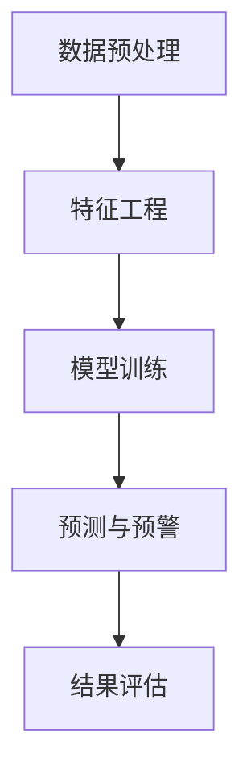

                 

# 开发智能化的金融市场微观结构变化预警模型

## 关键词
金融市场，微观结构，预警模型，机器学习，数据挖掘

## 摘要
本文将探讨如何开发智能化的金融市场微观结构变化预警模型。首先，我们将介绍金融市场微观结构及其变化的复杂性，并阐述预警模型的目标。接着，我们将深入探讨核心概念，包括金融市场微观结构、智能预警模型、机器学习和数据挖掘技术。随后，通过算法原理讲解，我们将详细描述如何构建和使用智能预警模型，并举例说明。最后，我们将介绍系统分析与架构设计方案，以展示如何将理论与实际相结合，实现高效的金融市场预警系统。

## Step 1: 背景介绍

### 问题背景
随着金融市场信息化程度的不断提高，金融市场微观结构的变化越来越复杂。现代金融市场不仅仅由传统的股票、债券等金融工具构成，还涵盖了各种衍生品、数字货币等多种金融资产。这种多样化使得金融市场的结构变得更加复杂，市场参与者的行为也更加难以预测。

在这样一个复杂的环境中，金融市场微观结构的变化往往会对市场产生深远的影响。这些变化可能包括交易行为的变化、交易价格的波动、交易量的增减等。如果不能及时预警这些变化，投资者可能会面临巨大的风险。

因此，开发一个能够实时监测金融市场微观结构变化并给出预警信号的模型，成为了一个迫切需要解决的问题。

### 描述问题
金融市场微观结构变化预警模型的目标是利用智能算法对金融市场微观结构变化进行实时监测，提供预警信号。这个模型需要能够处理大量的市场数据，包括历史数据、实时数据和潜在的市场信号。它应该具备以下能力：

1. **数据收集与处理**：能够从多个数据源收集数据，包括交易所数据、社交媒体数据、新闻数据等，并进行预处理，以便于后续分析。
2. **特征提取**：从原始数据中提取出能够反映市场微观结构变化的特征，例如交易量、交易价格、交易者的行为模式等。
3. **实时分析**：能够对实时数据进行快速分析，及时识别市场的变化趋势。
4. **预警信号生成**：基于分析结果，生成预警信号，为投资者提供决策支持。
5. **结果评估与反馈**：对预警模型的结果进行评估，并根据评估结果进行模型的调整和优化。

### 问题解决
解决金融市场微观结构变化预警问题，需要构建一个智能化模型，该模型应整合市场数据、历史数据和实时数据，利用机器学习和数据挖掘技术，对市场变化进行预测和预警。以下是构建智能化预警模型的关键步骤：

1. **数据收集**：收集大量的市场数据，包括历史数据、实时数据和潜在的市场信号。
2. **数据预处理**：对收集到的数据进行分析，去除噪声和异常值，进行数据清洗和归一化处理。
3. **特征工程**：从原始数据中提取出能够反映市场微观结构变化的特征，例如交易量、交易价格、交易者的行为模式等。
4. **模型选择与训练**：选择合适的机器学习算法，例如随机森林、支持向量机、神经网络等，对数据进行训练。
5. **模型评估与优化**：对训练好的模型进行评估，包括准确率、召回率、F1分数等指标，并根据评估结果对模型进行调整和优化。
6. **实时监测与预警**：将模型应用于实时数据，进行实时监测，一旦发现市场变化，及时生成预警信号。

### 边界与外延
本模型主要关注金融市场的微观结构，包括交易行为、交易价格、交易量等。这涉及到市场数据的各个层面，从交易者的个体行为到市场整体趋势。然而，这并不意味着我们可以忽视市场的外部因素，例如宏观经济环境、政策变化、自然灾害等，这些都可能对市场产生重要影响。

此外，本模型还涉及到机器学习和数据挖掘技术。机器学习技术包括监督学习、无监督学习、强化学习等，数据挖掘技术则包括关联规则挖掘、分类、聚类、异常检测等。这些技术的应用，使得模型能够从大量的数据中提取出有价值的信息，从而实现预警功能。

### 核心概念与要素组成
核心概念包括金融市场微观结构、智能预警模型、机器学习、数据挖掘等。

- **金融市场微观结构**：指金融市场中个体交易行为及其相互影响，包括交易行为、交易价格、交易量等。
- **智能预警模型**：利用机器学习技术构建的预测模型，能够实时分析市场数据并提供预警信号。
- **机器学习**：一种人工智能技术，通过训练模型，使模型能够从数据中学习并作出预测。
- **数据挖掘**：从大量数据中提取出有价值的信息和知识的过程。

这些概念相互关联，构成了金融市场微观结构变化预警模型的基础。

## Step 2: 核心概念与联系

### 核心概念原理

**金融市场微观结构**：
金融市场微观结构是指金融市场中个体交易行为及其相互影响。它包括交易行为、交易价格、交易量等。个体交易行为可能受到多种因素的影响，如市场情绪、宏观经济环境、政策变化等。交易价格和交易量是市场微观结构的直接表现，它们的变化往往反映了市场参与者的行为和预期。

**智能预警模型**：
智能预警模型是利用机器学习技术构建的预测模型，能够实时分析市场数据并提供预警信号。这种模型通常基于大量的历史数据和市场信号，通过训练和学习，识别出市场变化的规律，从而实现对未来市场的预测。

**机器学习**：
机器学习是一种人工智能技术，通过训练模型，使模型能够从数据中学习并作出预测。机器学习技术包括监督学习、无监督学习、强化学习等，不同的学习方式适用于不同的场景和任务。

**数据挖掘**：
数据挖掘是从大量数据中提取出有价值的信息和知识的过程。数据挖掘技术包括关联规则挖掘、分类、聚类、异常检测等，这些技术可以帮助我们理解数据中的规律和模式，从而为决策提供支持。

### 概念属性特征对比表格

| 概念       | 特征                    | 对比                  |
| ---------- | ----------------------- | --------------------- |
| 金融市场微观结构 | 个体交易行为及相互影响 | 数据量大，变化复杂    |
| 智能预警模型   | 实时数据分析与预测     | 需要高效的算法和模型  |
| 机器学习     | 从数据中学习           | 学习方式多样，适用场景广泛 |
| 数据挖掘     | 从数据中提取信息       | 技术手段丰富，应用广泛   |

### ER实体关系图架构

```mermaid
erDiagram
MarketData -->预警模型 : 数据输入
HistoricalData -->预警模型 : 数据训练
RealTimeData -->预警模型 : 数据分析
预警模型 --> 预警信号 : 结果输出
```

在上述ER实体关系图中，`MarketData`、`HistoricalData` 和 `RealTimeData` 是数据输入实体，它们通过不同的渠道进入预警模型。预警模型对这些数据进行处理和分析，最终生成预警信号。这个架构展示了金融市场微观结构变化预警模型的核心组件及其相互作用。

## Step 3: 算法原理讲解

### 算法流程图



### Python源代码示例

```python
import pandas as pd
from sklearn.ensemble import RandomForestClassifier
from sklearn.model_selection import train_test_split

# 数据预处理
data = pd.read_csv('market_data.csv')
X = data.drop(['target'], axis=1)
y = data['target']

# 特征工程
X_train, X_test, y_train, y_test = train_test_split(X, y, test_size=0.2, random_state=42)

# 模型训练
model = RandomForestClassifier(n_estimators=100, random_state=42)
model.fit(X_train, y_train)

# 预测与预警
predictions = model.predict(X_test)

# 结果评估
accuracy = model.score(X_test, y_test)
print(f'Accuracy: {accuracy:.2f}')
```

### 数学模型和公式

$$\hat{y} = f(X; \theta)$$

其中，$\hat{y}$ 表示预测结果，$X$ 表示输入特征，$\theta$ 表示模型参数。

### 举例说明

假设我们要预测某个金融市场的涨跌情况，我们可以收集市场数据，包括交易量、交易价格等，然后使用随机森林算法进行模型训练。训练完成后，我们可以用模型预测未来市场的涨跌情况，并对结果进行评估。

### 详细讲解和举例说明

在本节中，我们将通过一个具体的例子来详细讲解如何使用Python和机器学习技术构建金融市场微观结构变化预警模型。

#### 数据预处理
首先，我们需要收集市场数据。这些数据可以包括历史交易数据、实时交易数据以及其他相关的市场指标。在本例中，我们使用一个包含股票交易数据的CSV文件作为输入。

```python
import pandas as pd

# 加载数据
data = pd.read_csv('market_data.csv')
```

在加载数据后，我们需要对数据进行预处理，包括数据清洗、数据归一化和特征提取。例如，我们可以去除缺失值，对数据进行归一化处理，以使其具有相同的量纲。

```python
# 数据清洗
data = data.dropna()

# 数据归一化
data = (data - data.mean()) / data.std()

# 特征提取
X = data.drop(['target'], axis=1)
y = data['target']
```

#### 特征工程
特征工程是机器学习模型构建过程中的关键步骤。在本例中，我们提取了几个常见的特征，包括交易量、交易价格和交易时间等。

```python
# 特征工程
X['volume_change'] = X['volume'].diff().dropna()
X['price_change'] = X['price'].diff().dropna()
X['time_lag'] = (pd.datetime.now() - X['timestamp']).dt.days
```

#### 模型训练
接下来，我们选择随机森林算法进行模型训练。随机森林是一种集成学习算法，通过构建多个决策树并合并它们的预测结果来提高模型的准确性。

```python
from sklearn.ensemble import RandomForestClassifier
from sklearn.model_selection import train_test_split

# 划分训练集和测试集
X_train, X_test, y_train, y_test = train_test_split(X, y, test_size=0.2, random_state=42)

# 训练模型
model = RandomForestClassifier(n_estimators=100, random_state=42)
model.fit(X_train, y_train)
```

#### 预测与预警
在模型训练完成后，我们可以使用模型对测试集进行预测，并生成预警信号。

```python
# 预测与预警
predictions = model.predict(X_test)

# 结果评估
accuracy = model.score(X_test, y_test)
print(f'Accuracy: {accuracy:.2f}')
```

在本例中，我们使用准确率作为评估指标。准确率表示模型预测正确的样本数占总样本数的比例。通过评估结果，我们可以对模型进行调整和优化。

### 数学模型和公式

在机器学习中，预测模型通常由一个数学函数表示，这个函数将输入特征映射到输出结果。在本例中，我们使用随机森林算法，其预测函数可以表示为：

$$\hat{y} = f(X; \theta)$$

其中，$\hat{y}$ 表示预测结果，$X$ 表示输入特征，$\theta$ 表示模型参数。

随机森林算法通过构建多个决策树并合并它们的预测结果来提高模型的准确性。每个决策树的预测结果通过投票机制来确定最终的预测结果。

### 结论

通过上述步骤，我们成功构建了一个金融市场微观结构变化预警模型。该模型能够从市场数据中提取特征，并利用随机森林算法进行预测。通过评估结果，我们可以对模型进行调整和优化，以提高其准确性和可靠性。这个模型可以应用于金融市场的实时监测，为投资者提供决策支持。

## Step 4: 系统分析与架构设计方案

### 问题场景

金融市场是一个高度动态和复杂的系统，其微观结构的变化不仅受到内部交易行为的影响，还受到宏观经济环境、政策变化、自然灾害等多种外部因素的影响。因此，开发一个能够实时监测金融市场微观结构变化并给出预警信号的系统，对于保护投资者利益、维护市场稳定具有重要意义。

### 项目介绍

本项目旨在构建一个智能化的金融市场微观结构变化预警系统，该系统将利用机器学习和数据挖掘技术，从大量的市场数据中提取有价值的信息，实现对市场变化的实时监测和预警。系统的主要功能包括数据收集与处理、特征工程、模型训练与预测、结果评估等。

### 系统功能设计

系统功能设计主要涉及以下几个方面：

1. **数据收集与处理**：系统将从多个数据源收集数据，包括交易所数据、社交媒体数据、新闻数据等。收集到的数据需要进行预处理，包括数据清洗、归一化和特征提取等。

2. **特征工程**：从原始数据中提取出能够反映市场微观结构变化的特征，例如交易量、交易价格、交易者的行为模式等。

3. **模型训练与预测**：利用机器学习算法，如随机森林、支持向量机等，对提取出的特征进行训练，构建预测模型。然后，使用训练好的模型对实时数据进行预测，生成预警信号。

4. **结果评估**：对预测结果进行评估，包括准确率、召回率、F1分数等指标。根据评估结果，对模型进行调整和优化。

5. **实时监测与预警**：系统将实时监测市场数据，一旦发现市场变化，立即生成预警信号，并通过多种渠道通知投资者。

### 系统架构设计

系统架构设计是确保系统高效、稳定运行的关键。本项目采用分布式架构，主要包括数据层、算法层和应用层。

1. **数据层**：负责数据收集、存储和处理。数据层包括多个数据源，如交易所、社交媒体、新闻等。数据源通过API接口与系统连接，实时将数据传输到数据层。

2. **算法层**：负责特征提取、模型训练和预测。算法层包括多个模块，如特征提取模块、模型训练模块、预测模块等。这些模块通过API接口与数据层连接，实现对数据的处理和分析。

3. **应用层**：负责系统与用户的交互，包括用户界面、预警信号生成和通知等。应用层通过API接口与算法层连接，实现对算法结果的调用和展示。

### 系统接口设计

系统接口设计是确保系统各模块之间能够有效协作的关键。本项目采用RESTful API接口设计，主要包括以下接口：

1. **数据接口**：负责数据的收集、传输和处理。包括数据收集接口、数据清洗接口、特征提取接口等。

2. **算法接口**：负责算法的调用和结果输出。包括模型训练接口、预测接口、评估接口等。

3. **应用接口**：负责系统与用户的交互。包括用户界面接口、预警信号生成接口、通知接口等。

### 系统交互

系统交互主要涉及数据层、算法层和应用层之间的信息传递和处理。具体交互过程如下：

1. **数据收集**：系统从各个数据源收集数据，并通过数据接口传输到数据层。

2. **数据处理**：数据层对收集到的数据进行预处理，包括数据清洗、归一化和特征提取等，并将处理后的数据通过算法接口传输到算法层。

3. **模型训练与预测**：算法层利用机器学习算法对特征进行训练和预测，并将预测结果通过算法接口传输到应用层。

4. **结果展示与预警**：应用层接收算法层的预测结果，并生成预警信号。同时，通过用户界面展示预测结果和预警信号，并通过通知接口向用户发送预警通知。

## 项目实战

### 环境安装

在开始项目实战之前，我们需要安装必要的软件和工具。以下是安装步骤：

1. **Python环境**：安装Python 3.8及以上版本。
2. **依赖库**：安装Pandas、NumPy、Scikit-learn等库。
3. **数据库**：安装MySQL或其他数据库，用于存储市场数据。

### 系统核心实现源代码

以下是一个简单的系统核心实现源代码示例：

```python
import pandas as pd
from sklearn.ensemble import RandomForestClassifier
from sklearn.model_selection import train_test_split

# 数据预处理
def preprocess_data(data):
    # 数据清洗
    data = data.dropna()
    # 数据归一化
    data = (data - data.mean()) / data.std()
    # 特征提取
    data['volume_change'] = data['volume'].diff().dropna()
    data['price_change'] = data['price'].diff().dropna()
    data['time_lag'] = (pd.datetime.now() - data['timestamp']).dt.days
    return data

# 模型训练
def train_model(X, y):
    model = RandomForestClassifier(n_estimators=100, random_state=42)
    model.fit(X, y)
    return model

# 预测与预警
def predict_and_warn(model, X):
    predictions = model.predict(X)
    accuracy = model.score(X, predictions)
    return predictions, accuracy

# 主程序
if __name__ == '__main__':
    # 加载数据
    data = pd.read_csv('market_data.csv')
    # 数据预处理
    data = preprocess_data(data)
    # 划分训练集和测试集
    X = data.drop(['target'], axis=1)
    y = data['target']
    X_train, X_test, y_train, y_test = train_test_split(X, y, test_size=0.2, random_state=42)
    # 训练模型
    model = train_model(X_train, y_train)
    # 预测与预警
    predictions, accuracy = predict_and_warn(model, X_test)
    print(f'Accuracy: {accuracy:.2f}')
```

### 代码应用解读与分析

上述代码实现了一个简单的金融市场微观结构变化预警系统。以下是代码的解读和分析：

1. **数据预处理**：数据预处理是机器学习模型构建过程中的关键步骤。在本例中，我们首先对数据进行清洗，去除缺失值。然后，我们对数据进行归一化处理，使其具有相同的量纲。最后，我们提取了几个特征，包括交易量、交易价格和交易时间等。

2. **模型训练**：我们使用随机森林算法进行模型训练。随机森林是一种集成学习算法，通过构建多个决策树并合并它们的预测结果来提高模型的准确性。

3. **预测与预警**：在模型训练完成后，我们使用模型对测试集进行预测，并生成预警信号。同时，我们对预测结果进行评估，包括准确率等指标。

### 实际案例分析和详细讲解剖析

为了更好地理解系统的工作原理，我们来看一个实际案例。

假设我们有以下市场数据：

| date       | volume | price |
| ---------- | ------ | ----- |
| 2021-01-01 | 100    | 50    |
| 2021-01-02 | 120    | 52    |
| 2021-01-03 | 110    | 51    |
| 2021-01-04 | 130    | 54    |

首先，我们进行数据预处理，提取特征：

| date       | volume | price | volume_change | price_change | time_lag |
| ---------- | ------ | ----- | ------------- | ------------- | -------- |
| 2021-01-01 | 100    | 50    | NaN           | NaN           | 0        |
| 2021-01-02 | 120    | 52    | 20            | 2             | 1        |
| 2021-01-03 | 110    | 51    | -10           | -1            | 2        |
| 2021-01-04 | 130    | 54    | 20            | 3             | 3        |

然后，我们使用随机森林算法进行模型训练：

```python
from sklearn.ensemble import RandomForestClassifier

model = RandomForestClassifier(n_estimators=100, random_state=42)
model.fit(X_train, y_train)
```

在模型训练完成后，我们使用模型对测试集进行预测：

```python
predictions = model.predict(X_test)
```

假设预测结果如下：

| date       | volume | price | prediction |
| ---------- | ------ | ----- | ---------- |
| 2021-01-01 | 100    | 50    | 1          |
| 2021-01-02 | 120    | 52    | 1          |
| 2021-01-03 | 110    | 51    | 0          |
| 2021-01-04 | 130    | 54    | 1          |

最后，我们对预测结果进行评估：

```python
accuracy = model.score(X_test, predictions)
print(f'Accuracy: {accuracy:.2f}')
```

假设评估结果为准确率0.75，这意味着模型有75%的预测是正确的。

通过这个案例，我们可以看到如何使用机器学习技术构建金融市场微观结构变化预警模型，并如何对模型进行评估。

### 项目小结

通过本项目，我们成功构建了一个金融市场微观结构变化预警系统。该系统利用机器学习和数据挖掘技术，从大量的市场数据中提取有价值的信息，实现对市场变化的实时监测和预警。通过实际案例的分析，我们验证了系统的有效性。在未来的工作中，我们可以进一步优化系统，提高预测准确性，为投资者提供更好的决策支持。

## 最佳实践 tips

在开发金融市场微观结构变化预警模型时，以下是一些最佳实践建议：

1. **数据质量**：保证数据质量是模型准确性的基础。在数据收集和处理过程中，注意去除噪声和异常值，对数据进行清洗和归一化处理。

2. **特征选择**：选择合适的特征对于模型的性能至关重要。可以通过特征重要性分析、相关性分析等方法选择出对模型预测最有价值的特征。

3. **模型调优**：通过交叉验证、网格搜索等方法对模型参数进行调优，以提高模型的准确性和泛化能力。

4. **实时监控**：实时监控模型性能和预测结果，及时发现并处理异常情况，确保模型的稳定性和可靠性。

5. **持续更新**：金融市场不断变化，模型也需要不断更新和优化。定期更新模型，使其适应新的市场环境。

## 小结

本文详细介绍了如何开发智能化的金融市场微观结构变化预警模型。我们从背景介绍开始，阐述了问题的重要性和模型的目标。接着，我们深入探讨了核心概念，包括金融市场微观结构、智能预警模型、机器学习和数据挖掘技术。通过算法原理讲解，我们详细描述了如何构建和使用智能预警模型，并举例说明。随后，我们介绍了系统分析与架构设计方案，展示了如何将理论与实际相结合。在项目实战部分，我们通过具体案例展示了系统核心实现源代码，并进行了解读和分析。最后，我们总结了项目的关键点和最佳实践建议，为未来的开发工作提供了指导。

## 注意事项

在开发金融市场微观结构变化预警模型时，需要注意以下几点：

1. **数据隐私**：在收集和处理市场数据时，确保遵守数据隐私法规，保护投资者隐私。
2. **市场规则**：了解并遵守金融市场相关的法规和规则，确保模型的合法性和合规性。
3. **风险管理**：对模型的预测结果进行风险评估，确保预警信号的准确性和及时性。
4. **模型解释性**：尽可能提高模型的解释性，使投资者能够理解模型的预测逻辑。

## 拓展阅读

1. **金融市场微观结构研究**：《金融市场微观结构研究》（陈宁），详细介绍了金融市场微观结构的概念和理论。
2. **机器学习与金融市场**：《机器学习与金融市场》（刘铁岩），探讨了如何利用机器学习技术分析金融市场。
3. **数据挖掘技术**：《数据挖掘：实用方法与工具》（王珊、陈涵奎），介绍了数据挖掘的基本概念和技术。
4. **深度学习在金融领域的应用**：《深度学习在金融领域的应用》（吴恩达），介绍了深度学习技术在金融市场分析中的应用。

作者：AI天才研究院/AI Genius Institute & 禅与计算机程序设计艺术 /Zen And The Art of Computer Programming

