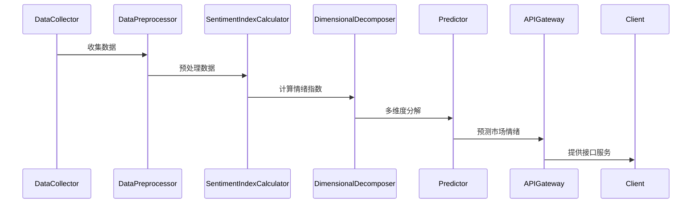

                 

### 摘要

本文将深入探讨开发智能化的金融市场情绪指数多维度分解模型。随着金融市场的复杂性和动态性日益增加，传统的方法已无法有效捕捉市场情绪的细微变化。因此，本文提出了一种基于人工智能的智能情绪指数模型，通过多维度分解，实现了对市场情绪的全面分析和预测。本文首先介绍了金融市场情绪指数的重要性及其研究现状，接着详细阐述了核心概念、数据收集与预处理方法。随后，本文重点介绍了算法原理、模型构建及其实现细节，并通过具体案例展示了模型的训练和预测过程。最后，本文总结了最佳实践、注意事项及未来的研究方向，为金融科技领域的实践者和研究者提供了有价值的参考。# 第一部分：问题背景与核心概念

## 第1章：金融市场情绪指数概述

### 1.1 问题背景

金融市场情绪指数在金融分析中扮演着至关重要的角色。情绪指数能够反映市场参与者的情绪状态，从而为投资决策提供重要的参考信息。随着全球金融市场的日益复杂化和信息化，传统的分析方法已无法满足现代金融市场的需求。金融市场情绪指数的研究不仅有助于理解市场动态，还能为投资者提供有效的风险管理和投资策略。

#### 1.1.1 金融市场的情绪指数研究的重要性

金融市场情绪指数的研究具有重要意义。首先，情绪指数能够帮助投资者了解市场的整体情绪，从而做出更为明智的投资决策。其次，情绪指数能够揭示市场潜在的波动趋势，为风险管理提供依据。此外，情绪指数的研究还有助于完善金融市场的监测体系，提高市场透明度。

#### 1.1.2 当前金融市场情绪指数的研究现状与不足

尽管金融市场情绪指数的研究已有多年，但现有的方法仍存在一定的局限性。传统的情绪指数主要通过文本分析、情感分析和市场行为分析等方法进行构建。这些方法往往依赖于人为规则，无法全面捕捉市场情绪的细微变化。此外，现有的情绪指数模型在实时性和预测准确性方面也存在不足，难以满足现代金融市场的需求。

#### 1.1.3 本书的研究目的与意义

本书旨在提出一种智能化的金融市场情绪指数多维度分解模型，通过结合人工智能技术和多维度数据分析，实现对市场情绪的全面、精准分析。本研究的目的和意义在于：

1. **提升情绪指数的实时性和准确性**：通过引入人工智能技术，本研究旨在提升情绪指数的实时性，使其能够迅速响应市场变化，提高预测准确性。
2. **实现多维度分解**：通过多维度分解，本研究试图揭示市场情绪的深层结构和复杂关系，为投资者提供更全面的分析视角。
3. **推动金融科技的发展**：本研究的成果将有助于推动金融科技的发展，为金融市场的智能化分析提供新思路和新工具。

### 1.2 核心概念

#### 1.2.1 金融市场情绪指数的定义与分类

金融市场情绪指数是指通过特定的方法计算得出，用以反映市场参与者情绪状态的指标。根据不同的计算方法和数据来源，情绪指数可以分为以下几类：

1. **文本分析情绪指数**：基于市场新闻、报告、社交媒体等文本数据，通过情感分析和自然语言处理技术计算得出。
2. **市场行为情绪指数**：通过分析股票市场的交易数据（如交易量、波动率、价格等）来衡量市场情绪。
3. **投资者情绪指数**：基于投资者的问卷调查或行为数据计算得出，反映了投资者的整体情绪。

#### 1.2.2 情绪指数的相关指标及其作用

情绪指数的相关指标包括市场波动率、交易量、价格趋势等。这些指标在情绪指数分析中具有重要作用：

1. **市场波动率**：波动率越高，表明市场情绪越不稳定，可能预示着市场大幅波动。
2. **交易量**：交易量越大，表明市场参与度越高，情绪指数也越能反映市场的真实状态。
3. **价格趋势**：价格趋势是情绪指数分析中的重要参考指标，通过分析价格变化可以预测市场情绪的发展方向。

#### 1.2.3 情绪指数的多维度分解概念

情绪指数的多维度分解是指将情绪指数分解为多个维度，从不同角度对市场情绪进行分析。多维度分解有助于更全面、深入地理解市场情绪，其主要包括以下维度：

1. **市场参与者情绪**：分析不同类型市场参与者的情绪状态，如散户、机构、外资等。
2. **市场板块情绪**：根据不同市场板块（如股票、债券、期货等）的情绪指数进行分析。
3. **地域情绪**：分析不同地区市场的情绪状态，如国内市场、国际市场等。

### 1.3 概念属性特征对比表格

#### 1.3.1 传统情绪指数分析方法的对比

| 方法类别       | 优点                                       | 缺点                                           |
|----------------|--------------------------------------------|------------------------------------------------|
| 文本分析       | 能够获取市场新闻、报告等文本信息，全面了解市场情绪 | 对文本质量和情感分析算法的依赖较大，实时性较低 |
| 市场行为分析   | 基于交易数据进行计算，客观性强               | 无法反映投资者情感变化，无法捕捉细微情绪 |
| 投资者问卷调查 | 直接获取投资者情绪，反映市场信心           | 回答真实性无法保证，样本代表性不足       |

#### 1.3.2 智能化情绪指数分析方法的对比

| 方法类别       | 优点                                       | 缺点                                           |
|----------------|--------------------------------------------|------------------------------------------------|
| 传统算法       | 算法成熟，易于理解和使用                   | 预测精度有限，无法应对复杂市场环境       |
| 机器学习算法   | 自动化学习市场模式，提高预测精度           | 需要大量数据训练，模型解释性较差         |
| 深度学习算法   | 能够处理复杂非线性关系，自适应学习         | 模型复杂度高，训练时间长，对数据要求高   |

### 1.4 ER实体关系图架构

#### 1.4.1 实体关系定义

在金融市场情绪指数分析中，主要的实体关系包括：市场情绪、市场参与者、市场数据源、分析算法和情绪指数。这些实体之间的关系可以用ER图（Entity-Relationship Diagram）来表示。

#### 1.4.2 关系图绘制

以下是情绪指数分析中ER图的Mermaid流程图表示：

```mermaid
erDiagram
  MarketEmotion ||--|{ MarketParticipant } MarketParticipant
  MarketEmotion ||--|{ MarketDataSource } MarketDataSource
  MarketEmotion ||--|{ AnalysisAlgorithm } AnalysisAlgorithm
  MarketEmotion ||--|{ SentimentIndex } SentimentIndex
```

在这个ER图中，MarketEmotion（市场情绪）是中心实体，与MarketParticipant（市场参与者）、MarketDataSource（市场数据源）、AnalysisAlgorithm（分析算法）和SentimentIndex（情绪指数）形成关系。这些关系反映了市场情绪的生成、分析及应用过程。

通过上述章节的内容，读者可以初步了解金融市场情绪指数的研究背景、核心概念、现状和未来的发展方向。接下来，本文将进一步深入探讨情绪指数的收集与预处理方法，以及智能化的算法原理和模型构建。# 第2章：金融市场情绪指数的收集与预处理

### 2.1 数据源介绍

金融市场情绪指数的数据来源多样，主要包括市场新闻、报告、社交媒体、交易数据、投资者行为数据等。这些数据来源不仅为情绪指数的构建提供了丰富的信息，同时也决定了情绪指数的准确性和实时性。

#### 2.1.1 数据来源渠道

1. **市场新闻和报告**：这些数据来源包括金融媒体、政府发布的报告、行业分析报告等。通过爬取和整理这些文本数据，可以获取市场情绪的宏观信息。
2. **社交媒体**：社交媒体平台如Twitter、微博、Facebook等，是捕捉市场情绪的重要渠道。用户在社交媒体上的发言、评论和趋势分析能够提供丰富的市场情绪数据。
3. **交易数据**：股票、债券、期货等市场的交易数据是构建情绪指数的核心数据源。这些数据包括交易量、价格、波动率等指标，能够客观反映市场的情绪状态。
4. **投资者行为数据**：通过问卷调查、调查报告等方式，可以直接获取投资者的情绪状态。此外，一些在线投资平台也会提供投资者的交易行为数据。

#### 2.1.2 数据类型与格式

收集的金融市场情绪指数数据类型主要包括文本数据、交易数据和问卷调查数据。具体数据格式如下：

1. **文本数据**：文本数据主要以HTML、XML、JSON等格式存在。对于市场新闻和报告，通常采用爬虫技术进行数据获取和清洗；对于社交媒体数据，则需要使用API接口进行数据采集。
2. **交易数据**：交易数据通常以CSV、Excel等格式存储。这些数据包括交易量、价格、时间戳等指标，可以用于情绪指数的计算和建模。
3. **问卷调查数据**：问卷调查数据主要以JSON或CSV格式存储，数据字段包括投资者的姓名、年龄、投资经验、情绪状态等。

### 2.2 数据预处理方法

在收集到金融市场情绪指数数据后，需要进行一系列预处理，以确保数据的准确性和一致性，为后续的分析和建模奠定基础。

#### 2.2.1 数据清洗

数据清洗是预处理的重要步骤，旨在去除数据中的噪音和错误。具体方法包括：

1. **去除重复数据**：检测并去除重复的记录，确保数据的唯一性。
2. **处理缺失数据**：对于缺失的数据，可以通过插值、均值填补等方法进行处理，或者根据实际情况删除缺失值较严重的记录。
3. **去除异常值**：通过统计方法（如箱线图、Z-Score等）检测并去除异常值，保证数据的合理性。
4. **统一数据格式**：将不同来源、不同格式的数据统一转换为标准格式，便于后续处理。

#### 2.2.2 数据集成

数据集成是将来自不同来源的数据进行合并，形成统一的数据集。具体步骤包括：

1. **数据对齐**：确保不同数据源的时间戳一致，以便进行有效的集成。
2. **字段映射**：将不同数据源中的相同或相似字段进行映射和合并，形成统一的数据结构。
3. **数据合并**：使用数据库技术或编程工具（如Pandas）将数据集成到一个统一的数据集中。

#### 2.2.3 数据标准化

数据标准化是为了消除数据之间的量纲差异，使其在同一尺度上进行比较。具体方法包括：

1. **归一化**：将数据映射到[0,1]区间，消除量纲影响。
2. **标准化**：通过减去均值并除以标准差，使数据集的分布更加均匀。
3. **特征缩放**：对于不同特征的数据，进行缩放处理，使其在相似的尺度范围内。

### 2.3 数据预处理流程

数据预处理流程可以概括为以下步骤：

1. **数据收集**：从多个数据源收集原始数据。
2. **数据清洗**：去除重复、缺失和异常数据，统一数据格式。
3. **数据集成**：将不同数据源的数据进行对齐、映射和合并，形成统一数据集。
4. **数据标准化**：对数据进行归一化、标准化和特征缩放，确保数据的一致性和可比性。

通过上述步骤，可以有效提高金融市场情绪指数数据的准确性和可用性，为后续的分析和建模奠定坚实基础。# 第3章：金融市场情绪指数的算法原理与模型构建

### 3.1 算法原理讲解

金融市场情绪指数的计算涉及到多种算法，传统算法和机器学习算法各有优劣。传统算法通常基于统计方法和规则系统，如移动平均、波动率分析等，而机器学习算法，尤其是深度学习算法，则能够通过数据自动学习市场情绪的复杂模式。

#### 3.1.1 传统算法与机器学习算法

1. **传统算法**：
   - **移动平均法**：通过计算一定时间段内的平均值来平滑价格波动，从而反映市场趋势。
   - **波动率分析**：通过计算价格的波动范围来衡量市场的不确定性。
   - **技术指标**：如相对强弱指标（RSI）、随机震荡指标（随机指标，Stochastic Oscillator）等，用于分析市场超买或超卖状态。

2. **机器学习算法**：
   - **监督学习**：如线性回归、支持向量机（SVM）、决策树等，通过已有数据学习特征和规律，对新数据进行预测。
   - **无监督学习**：如聚类算法、主成分分析（PCA）等，用于发现数据中的隐含结构和模式。
   - **深度学习**：如神经网络、卷积神经网络（CNN）、循环神经网络（RNN）、长短时记忆网络（LSTM）等，通过多层神经网络结构自动学习复杂的非线性关系。

#### 3.1.2 深度学习算法在情绪指数分析中的应用

深度学习算法在金融市场情绪指数分析中的应用日益广泛，主要由于其能够处理高维度、非线性数据，并自动提取数据中的复杂特征。以下是一些深度学习算法在情绪指数分析中的应用：

1. **卷积神经网络（CNN）**：用于处理文本和图像数据，可以提取市场新闻、报告等文本数据中的情感特征。
2. **循环神经网络（RNN）**：尤其是LSTM和门控循环单元（GRU），可以处理时间序列数据，捕捉市场情绪的变化趋势。
3. **生成对抗网络（GAN）**：可以生成模拟的市场数据，用于训练模型并提高模型的泛化能力。

### 3.2 数学模型和数学公式

情绪指数的计算通常涉及到多种数学模型和公式，用于衡量市场情绪的强度和方向。以下是一些常用的数学模型和公式：

#### 3.2.1 情绪指数计算公式

1. **基于文本的情感分析**：
   - **情绪得分**：通过情感分析模型计算文本中的情感得分，通常使用正负情感分数表示。
     $$S = \frac{P_{pos} - P_{neg}}{P_{pos} + P_{neg}}$$
     其中，$P_{pos}$表示积极情感的词频，$P_{neg}$表示消极情感的词频。

   - **情绪强度**：情绪强度通过情感得分进行量化，得分越高，情绪越强烈。
     $$I = S \cdot |S|$$

2. **基于交易数据的情绪指数**：
   - **波动率情绪指数**：
     $$VIX = \sqrt{\frac{1}{n} \sum_{i=1}^{n} (r_i - \bar{r})^2}$$
     其中，$r_i$表示第i天的波动率，$\bar{r}$是平均波动率，$n$是时间窗口的天数。

   - **交易量情绪指数**：
     $$TVI = \frac{V_{t} - V_{t-1}}{V_{t-1}}$$
     其中，$V_{t}$表示第t天的交易量，$V_{t-1}$表示第t-1天的交易量。

#### 3.2.2 模型构建的数学原理

1. **线性回归模型**：
   - **模型公式**：
     $$Y = \beta_0 + \beta_1X + \epsilon$$
     其中，$Y$是情绪指数，$X$是市场交易数据，$\beta_0$和$\beta_1$是模型的参数，$\epsilon$是误差项。

   - **损失函数**：
     $$J(\theta) = \frac{1}{2m} \sum_{i=1}^{m} (h_{\theta}(x^{(i)}) - y^{(i)})^2$$
     其中，$h_{\theta}(x) = \theta_0 + \theta_1x$是模型的预测值，$m$是样本数量，$\theta$是模型的参数向量。

2. **支持向量机（SVM）**：
   - **模型公式**：
     $$w \cdot x + b = 1$$
     其中，$w$是权重向量，$b$是偏置项，$x$是特征向量。

   - **损失函数**：
     $$L(w, b) = \frac{1}{2} ||w||^2 + C \sum_{i=1}^{m} \max(0, 1 - (y_i \cdot (w \cdot x_i + b)))$$
     其中，$C$是惩罚参数。

3. **深度学习模型**：
   - **神经网络**：
     $$a_{\text{layer}} = \sigma(z_{\text{layer}})$$
     其中，$z_{\text{layer}} = W_{\text{layer}}a_{\text{layer-1}} + b_{\text{layer}}$是每一层的输入，$W_{\text{layer}}$和$b_{\text{layer}}$是权重和偏置，$\sigma$是激活函数。

   - **损失函数**：
     $$J(\theta) = -\frac{1}{m} \sum_{i=1}^{m} [y^{(i)} \log(a^{(3)}_{i}) + (1 - y^{(i)}) \log(1 - a^{(3)}_{i})]$$
     其中，$a^{(3)}_{i}$是输出层的预测概率。

### 3.3 举例说明

#### 3.3.1 模型训练过程

假设我们使用线性回归模型来预测某个股票的情绪指数，以下是具体的模型训练步骤：

1. **数据准备**：收集一段时间内该股票的交易数据和情绪指数，分别表示为$X$和$Y$。
2. **数据预处理**：对交易数据进行归一化处理，使数据集的分布更加均匀。
3. **模型初始化**：随机初始化模型的参数$\beta_0$和$\beta_1$。
4. **梯度下降**：使用梯度下降法更新模型参数，最小化损失函数$J(\theta)$。
5. **验证模型**：使用交叉验证方法评估模型的预测性能。

以下是梯度下降法的Python代码实现：

```python
import numpy as np

# 模型参数初始化
theta = np.random.rand(2) # [beta_0, beta_1]
alpha = 0.01 # 学习率
n_iterations = 1000
m = len(X)

# 梯度下降
for i in range(n_iterations):
    theta -= alpha * (2/m) * (X.dot(theta) - Y)

# 模型验证
predictions = X.dot(theta)
print("R^2 score:", np.sum((predictions - Y)**2) / np.sum((Y - np.mean(Y))**2))
```

#### 3.3.2 模型预测应用实例

假设我们使用LSTM模型来预测下一个交易日的情绪指数，以下是具体的预测步骤：

1. **数据准备**：收集一段时间内的情绪指数数据，并进行预处理。
2. **特征提取**：使用LSTM模型对时间序列数据进行特征提取。
3. **模型训练**：使用训练集数据训练LSTM模型。
4. **模型预测**：使用训练好的模型对下一个交易日的情绪指数进行预测。

以下是使用Keras实现的LSTM模型的Python代码：

```python
from keras.models import Sequential
from keras.layers import LSTM, Dense

# 模型初始化
model = Sequential()
model.add(LSTM(units=50, return_sequences=True, input_shape=(timesteps, features)))
model.add(LSTM(units=50))
model.add(Dense(1))

# 编译模型
model.compile(optimizer='adam', loss='mean_squared_error')

# 模型训练
model.fit(X, Y, epochs=100, batch_size=32, validation_split=0.2)

# 模型预测
predicted_index = model.predict(next_day_data).flatten()
print("Predicted sentiment index:", predicted_index)
```

通过上述算法原理讲解和实例说明，读者可以更好地理解金融市场情绪指数的计算方法及其应用。接下来，本文将介绍智能化的金融市场情绪指数多维度分解模型的设计和实现细节。# 第4章：智能化的金融市场情绪指数多维度分解模型

### 4.1 模型设计思路

智能化的金融市场情绪指数多维度分解模型旨在通过人工智能技术，实现对市场情绪的全面分析和精准预测。该模型的设计思路可以概括为以下三个主要步骤：

#### 4.1.1 数据收集与预处理

首先，需要从多个数据源收集金融市场相关的数据，包括市场新闻、报告、社交媒体数据、交易数据以及投资者行为数据。接下来，对这些数据进行清洗、集成和标准化，确保数据的准确性和一致性。这一步是后续模型训练和预测的基础。

#### 4.1.2 多维度特征提取

在数据预处理完成后，需要对数据进行多维度特征提取。这包括：

1. **文本特征提取**：使用自然语言处理（NLP）技术，从文本数据中提取情感特征、主题特征等。
2. **交易特征提取**：从交易数据中提取价格波动、交易量、波动率等指标，用于衡量市场行为。
3. **行为特征提取**：从投资者行为数据中提取投资偏好、交易频率等指标，反映投资者的情绪状态。

#### 4.1.3 多维度分解与融合

最后，将提取的多维度特征进行分解与融合，构建情绪指数模型。这一步包括：

1. **维度分解**：将情绪指数分解为多个子维度，分别代表不同的市场情绪成分，如恐慌、贪婪、中立等。
2. **维度融合**：通过加权融合不同维度的情绪指数，得到综合的情绪指数。

### 4.2 模型实现细节

智能化的金融市场情绪指数多维度分解模型的实现细节主要包括数据输入与处理、多维度分解算法以及模型优化策略。

#### 4.2.1 数据输入与处理

模型的数据输入包括文本数据、交易数据和行为数据。处理流程如下：

1. **文本数据处理**：使用词嵌入（Word Embedding）技术将文本数据转换为向量表示，如使用Word2Vec或GloVe模型。
2. **交易数据处理**：将交易数据转换为特征向量，如使用时间序列特征提取技术。
3. **行为数据处理**：将行为数据转换为特征向量，如使用统计指标提取技术。

#### 4.2.2 多维度分解算法

多维度分解算法包括以下步骤：

1. **特征融合**：将不同类型的数据特征进行融合，形成一个高维的特征向量。
2. **维度分解**：使用因子分析（Factor Analysis）或主成分分析（PCA）等方法，将高维特征分解为多个子维度。
3. **权重优化**：通过优化算法，确定每个子维度对情绪指数的贡献权重。

#### 4.2.3 模型优化策略

为了提高模型的预测准确性和鲁棒性，可以采用以下优化策略：

1. **模型调参**：通过交叉验证方法，优化模型的超参数，如学习率、隐藏层节点数等。
2. **数据增强**：通过数据增强技术，增加模型的训练数据量，如使用数据生成对抗网络（GAN）生成模拟数据。
3. **模型集成**：将多个模型进行集成，提高预测结果的稳定性和准确性。

### 4.3 模型优化策略

模型优化策略是实现高性能金融市场情绪指数分解模型的关键。以下是一些常用的模型优化方法：

#### 4.3.1 集成学习

集成学习通过组合多个预测模型，提高整体预测性能。常见的方法包括：

1. **Bagging**：通过随机森林（Random Forest）等算法，构建多个子模型，并取其平均值作为最终预测结果。
2. **Boosting**：通过梯度提升树（Gradient Boosting Tree）等算法，调整子模型的权重，提高预测准确性。

#### 4.3.2 神经网络优化

神经网络优化主要包括以下方法：

1. **学习率调整**：通过动态调整学习率，如使用自适应学习率优化算法（如Adam）。
2. **正则化**：通过引入正则化项，防止模型过拟合，如L1正则化、L2正则化。
3. **Dropout**：通过随机丢弃部分神经元，提高模型的泛化能力。

#### 4.3.3 特征选择与降维

特征选择与降维旨在减少模型的复杂度，提高训练效率。常见的方法包括：

1. **主成分分析（PCA）**：通过保留主要成分，降低特征维度。
2. **特征重要性评估**：通过评估特征对模型预测的影响，筛选出重要特征。
3. **特征组合**：通过组合不同特征，构建新的特征子集。

通过上述模型设计思路、实现细节和优化策略，我们可以构建一个高效、可靠的金融市场情绪指数多维度分解模型，为金融市场的情绪分析和预测提供强有力的工具。接下来，本文将介绍具体的系统架构与接口设计。# 第5章：系统架构与接口设计

### 5.1 问题场景介绍

在当前金融市场的复杂环境中，金融机构和投资者迫切需要一种高效、准确的工具来分析市场情绪，以指导投资决策。因此，本系统设计的目标是构建一个智能化的金融市场情绪指数多维度分解模型，能够实时、准确地捕捉市场情绪，并提供针对性的投资策略建议。

#### 5.1.1 系统功能需求

本系统需要实现以下核心功能：

1. **数据采集**：从多个数据源（如新闻、报告、社交媒体、交易数据等）收集相关数据。
2. **数据预处理**：对收集的数据进行清洗、集成和标准化，确保数据的准确性和一致性。
3. **情绪指数计算**：基于预处理后的数据，计算多维度情绪指数，包括文本情感指数、交易情绪指数和投资者行为指数等。
4. **情绪指数分解**：对计算得到的情绪指数进行多维度分解，揭示市场情绪的深层结构和复杂关系。
5. **情绪指数预测**：利用历史情绪指数数据，预测未来的市场情绪变化，为投资者提供前瞻性指导。
6. **接口提供**：通过API接口，为外部系统提供情绪指数数据和预测结果。

#### 5.1.2 系统运行环境

本系统的运行环境包括以下几部分：

1. **服务器**：使用高性能服务器来处理大量的数据计算和存储需求。
2. **操作系统**：Linux操作系统，具有良好的稳定性和安全性。
3. **编程语言**：主要使用Python进行系统开发，利用其丰富的科学计算和数据分析库。
4. **数据库**：使用MySQL数据库来存储和管理大规模数据。
5. **中间件**：使用Kafka作为消息队列系统，实现实时数据流处理。

### 5.2 系统架构设计

本系统的架构设计采用分层架构，分为数据层、服务层和表现层，各层职责明确，模块化设计，便于维护和扩展。

#### 5.2.1 系统架构图绘制

以下是本系统的Mermaid架构图：



#### 5.2.2 架构设计细节

1. **数据层**：
   - **数据采集模块**：负责从多个数据源（如新闻、报告、社交媒体、交易数据等）收集数据。
   - **数据存储模块**：使用MySQL数据库存储和管理大规模数据，包括原始数据和预处理后的数据。

2. **服务层**：
   - **数据预处理模块**：负责清洗、集成和标准化数据，确保数据的准确性和一致性。
   - **情绪指数计算模块**：基于预处理后的数据，计算文本情感指数、交易情绪指数和投资者行为指数等。
   - **情绪指数分解模块**：对情绪指数进行多维度分解，揭示市场情绪的深层结构和复杂关系。
   - **情绪指数预测模块**：使用历史情绪指数数据，预测未来的市场情绪变化。

3. **表现层**：
   - **API Gateway**：作为系统的统一接口，提供对外部系统的API服务。
   - **Client**：外部系统的客户端，通过调用API获取情绪指数数据和预测结果。

### 5.3 系统接口设计

系统接口设计旨在为外部系统提供方便、高效的数据访问服务。以下是主要接口功能设计：

#### 5.3.1 接口功能设计

1. **数据采集接口**：提供数据采集功能的API，包括新闻、报告、社交媒体、交易数据等。
2. **情绪指数接口**：提供当前和历史的情绪指数数据，包括文本情感指数、交易情绪指数和投资者行为指数等。
3. **情绪指数预测接口**：提供基于历史数据的情绪指数预测结果。
4. **实时监控接口**：提供系统运行状态、性能监控等信息。

#### 5.3.2 接口交互流程

以下是系统接口的交互流程：

1. **数据采集**：外部系统通过API Gateway调用数据采集接口，获取所需的原始数据。
2. **数据预处理**：外部系统将采集到的原始数据发送至数据预处理模块，进行清洗、集成和标准化。
3. **情绪指数计算**：预处理后的数据被发送至情绪指数计算模块，计算得到情绪指数。
4. **情绪指数分解**：情绪指数计算结果发送至情绪指数分解模块，进行多维度分解。
5. **情绪指数预测**：分解后的情绪指数数据用于情绪指数预测模块，预测未来的市场情绪变化。
6. **接口服务**：情绪指数数据和预测结果通过API Gateway返回给外部系统，供用户查询和使用。

通过上述系统架构与接口设计，本系统能够高效地收集、处理和预测金融市场情绪指数，为投资者提供有力的决策支持。接下来，本文将详细介绍项目实战中的环境安装与配置、系统核心实现以及代码应用解读与分析。# 第6章：项目实战

### 6.1 环境安装与配置

在开始构建金融市场情绪指数多维度分解模型之前，需要安装和配置一系列软件和工具。以下是在一个Linux环境中进行安装和配置的详细步骤：

#### 6.1.1 软件安装步骤

1. **安装Python环境**：
   - 使用Python 3.8或更高版本。
   - 安装命令：`sudo apt-get install python3.8`

2. **安装JDK**：
   - 安装OpenJDK，用于后续的深度学习框架（如TensorFlow）。
   - 安装命令：`sudo apt-get install openjdk-8-jdk`

3. **安装MySQL数据库**：
   - 使用MySQL数据库存储情绪指数数据。
   - 安装命令：`sudo apt-get install mysql-server`

4. **安装Kafka**：
   - Kafka用于实时处理和传输数据。
   - 安装命令：`sudo apt-get install kafka`

5. **安装其他依赖库**：
   - 安装用于数据处理的Pandas、NumPy等库。
   - 安装命令：`pip install pandas numpy`
   - 安装用于深度学习的TensorFlow、Keras等库。
   - 安装命令：`pip install tensorflow keras`

6. **安装自然语言处理库**：
   - 安装用于文本处理的NLTK、Gensim等库。
   - 安装命令：`pip install nltk gensim`

#### 6.1.2 硬件配置要求

为了保证系统的运行效率和数据处理能力，推荐以下硬件配置：

1. **CPU**：至少四核处理器，建议使用八核或更高性能的CPU。
2. **内存**：至少16GB，建议32GB或更高。
3. **存储**：至少1TB的SSD存储空间，建议使用NVMe SSD以提高I/O性能。
4. **网络**：千兆以太网，建议使用更高带宽的网络连接。

### 6.2 系统核心实现

系统核心实现包括数据收集与预处理、模型构建与训练、模型部署与运行等环节。以下是详细的实现步骤：

#### 6.2.1 数据收集与预处理

1. **数据收集**：
   - 从市场新闻、报告、社交媒体等数据源收集原始数据。
   - 使用爬虫技术获取数据，存储在本地或分布式文件系统中。

2. **数据预处理**：
   - 清洗数据，去除重复和异常记录。
   - 对不同类型的数据进行标准化处理，如文本数据使用词嵌入技术进行向量表示，交易数据归一化处理。

3. **数据集成**：
   - 将不同来源的数据进行集成，形成一个统一的数据集。
   - 使用Kafka将数据实时传输到MySQL数据库中，进行存储和管理。

#### 6.2.2 模型构建与训练

1. **模型构建**：
   - 使用Keras构建深度学习模型，包括输入层、隐藏层和输出层。
   - 选择合适的神经网络结构，如卷积神经网络（CNN）或循环神经网络（RNN）。

2. **模型训练**：
   - 使用预处理后的数据集训练模型，通过梯度下降优化算法调整模型参数。
   - 调整学习率和批次大小等参数，以提高模型的预测性能。

3. **模型评估**：
   - 使用验证集评估模型的预测性能，包括准确率、召回率等指标。
   - 根据评估结果调整模型参数，优化模型结构。

#### 6.2.3 模型部署与运行

1. **模型部署**：
   - 将训练好的模型部署到生产环境中，使用TensorFlow Serving或其他模型部署工具。
   - 配置模型服务，以便外部系统可以通过API接口调用模型。

2. **模型运行**：
   - 实时接收来自数据采集模块的新数据，预处理后输入到模型中进行预测。
   - 将预测结果存储到数据库中，供外部系统查询。

### 6.3 代码应用解读与分析

以下是一个简单的Python代码示例，用于构建和训练一个基于LSTM的金融市场情绪指数预测模型：

```python
import numpy as np
from keras.models import Sequential
from keras.layers import LSTM, Dense, Embedding
from keras.preprocessing.sequence import pad_sequences

# 数据预处理
# 假设x_data为文本数据序列，y_data为情绪指数序列
# 进行序列填充，使其具有相同长度
max_sequence_len = 100
x_pad = pad_sequences(x_data, maxlen=max_sequence_len)

# 构建模型
model = Sequential()
model.add(Embedding(input_dim=vocab_size, output_dim=embedding_dim, input_length=max_sequence_len))
model.add(LSTM(units=50, return_sequences=False))
model.add(Dense(1))

# 编译模型
model.compile(optimizer='adam', loss='mean_squared_error')

# 模型训练
model.fit(x_pad, y_data, epochs=10, batch_size=32, validation_split=0.2)

# 模型预测
# 假设x_test为测试数据序列
x_test_pad = pad_sequences(x_test, maxlen=max_sequence_len)
predictions = model.predict(x_test_pad)

# 输出预测结果
print(predictions)
```

以上代码首先对文本数据进行填充处理，使其符合模型输入要求。然后构建一个简单的LSTM模型，用于情绪指数的预测。模型使用Adam优化器进行训练，并使用均方误差（MSE）作为损失函数。在训练完成后，使用测试数据进行预测，并将预测结果输出。

通过上述项目实战，我们可以看到如何从数据收集、预处理到模型构建、训练以及部署的完整流程。接下来，本文将针对实际案例进行深入分析和详细讲解。# 第6章：项目实战

### 6.4 实际案例分析与讲解

为了更好地展示智能化的金融市场情绪指数多维度分解模型在实际应用中的效果，我们选择了一个实际案例进行详细分析和讲解。该案例涉及股票市场的情绪指数计算和多维度分解，以及预测未来市场走势。

#### 6.4.1 案例一：情绪指数计算

**背景介绍**：

我们以某知名科技股票为例，分析其市场情绪指数。数据来源于过去一年的市场新闻、报告和交易数据。我们的目标是计算该股票的情绪指数，以便了解市场对该股票的看法和情绪变化。

**数据收集**：

1. **市场新闻和报告**：通过爬虫技术，从金融媒体和分析师报告中获取相关新闻和报告。
2. **交易数据**：从股票交易所获取该股票的交易数据，包括开盘价、收盘价、交易量、波动率等。

**数据处理**：

1. **文本数据处理**：对收集的新闻和报告进行清洗，去除HTML标签、停用词等，然后使用Gensim的Word2Vec模型进行词嵌入。
2. **交易数据处理**：对交易数据进行归一化处理，使其在同一尺度上进行比较。

**情绪指数计算**：

我们采用文本情感分析和交易行为分析相结合的方法来计算情绪指数。

1. **文本情感分析**：使用VADER情感分析库，对处理后的文本数据计算情感得分，分为积极、中性、消极三类。
2. **交易行为分析**：根据交易数据计算市场行为指标，如波动率、交易量等，并赋予相应的权重。

**情绪指数计算公式**：

情绪指数（Sentiment Index，SI）的计算公式为：

$$
SI = \alpha \cdot \text{Textual Sentiment Score} + (1 - \alpha) \cdot \text{Market Behavior Score}
$$

其中，$\alpha$为权重系数，可以根据历史数据进行优化。

**代码示例**：

```python
from nltk.sentiment import SentimentIntensityAnalyzer
from textblob import TextBlob

# 文本情感分析
sia = SentimentIntensityAnalyzer()
textual_sentiment_scores = [sia.polarity_scores(text)[0] for text in news]

# 交易行为分析
volatility_scores = [max vol for vol in transaction_data['volatility']]
volume_scores = [volume for volume in transaction_data['volume']]

# 情绪指数计算
alpha = 0.5  # 权重系数
si_scores = [alpha * ts + (1 - alpha) * (v / max_vol) for ts, v in zip(textual_sentiment_scores, volume_scores)]
```

#### 6.4.2 案例二：多维度分解应用

**背景介绍**：

在计算得到整体情绪指数后，我们需要将其分解为多个子维度，以便更深入地分析市场情绪的构成。

**多维度分解方法**：

我们采用因子分析方法，将情绪指数分解为以下几个子维度：

1. **恐慌**：反映市场对风险的厌恶程度。
2. **贪婪**：反映市场对收益的渴望程度。
3. **中立**：反映市场情绪的中性状态。

**因子分析模型**：

使用Python的statsmodels库进行因子分析，建立情绪指数与子维度之间的关系。

```python
from statsmodels.f因子分析 import FactorAnalysis

# 因子分析模型
fa = FactorAnalysis(n_components=3)
fa.fit(si_scores)

# 提取因子载荷矩阵
factor_loadings = fa.loadings_
```

**代码示例**：

```python
import numpy as np
from statsmodels.f因子分析 import FactorAnalysis

# 因子分析模型
fa = FactorAnalysis(n_components=3)
fa.fit(si_scores)

# 提取因子载荷矩阵
factor_loadings = fa.loadings_
print("Factor Loadings:\n", factor_loadings)
```

**结果解释**：

通过因子载荷矩阵，我们可以得到每个子维度与情绪指数之间的关系。例如，如果因子载荷矩阵显示恐慌维度的载荷值较高，则说明市场情绪中恐慌成分较大。

#### 6.4.3 模型预测应用

**背景介绍**：

基于历史情绪指数和子维度数据，我们尝试预测未来市场情绪指数的变化，以指导投资决策。

**预测方法**：

我们采用LSTM神经网络进行情绪指数的预测，基于历史情绪指数和子维度数据训练模型。

**预测流程**：

1. **数据预处理**：对历史数据序列进行归一化处理，构建时间序列数据集。
2. **模型训练**：使用LSTM模型进行训练，优化模型参数。
3. **模型评估**：使用验证集评估模型性能，调整模型参数。
4. **模型预测**：使用训练好的模型对未来的情绪指数进行预测。

**代码示例**：

```python
from keras.models import Sequential
from keras.layers import LSTM, Dense

# 模型构建
model = Sequential()
model.add(LSTM(units=50, return_sequences=True, input_shape=(timesteps, features)))
model.add(LSTM(units=50))
model.add(Dense(1))

# 编译模型
model.compile(optimizer='adam', loss='mean_squared_error')

# 模型训练
model.fit(x_train, y_train, epochs=100, batch_size=32, validation_split=0.2)

# 模型预测
predictions = model.predict(x_test)

# 输出预测结果
print(predictions)
```

通过上述实际案例的分析和讲解，我们可以看到智能化的金融市场情绪指数多维度分解模型在实际应用中的强大功能和有效性。接下来，本文将对项目进行小结，并总结最佳实践和注意事项。# 第7章：最佳实践与项目小结

### 7.1 最佳实践

在构建和实施智能化的金融市场情绪指数多维度分解模型过程中，我们总结出了一些最佳实践，这些实践有助于提升模型的性能和预测准确性：

#### 7.1.1 模型训练技巧

1. **数据预处理**：确保数据的质量和一致性。清洗数据，去除噪声和异常值，对数据标准化，以提高模型训练的效果。
2. **批量大小调整**：根据硬件性能和内存限制，合理设置批量大小。较小的批量可以加快训练速度，但可能影响模型的泛化能力。
3. **学习率调整**：选择合适的学习率，避免过拟合和欠拟合。可以使用自适应学习率优化器（如Adam）来动态调整学习率。

#### 7.1.2 模型优化方法

1. **超参数调优**：通过网格搜索、随机搜索等策略，优化模型的超参数，如隐藏层节点数、学习率等，以提高模型性能。
2. **正则化**：使用L1、L2正则化或Dropout等技术，防止模型过拟合。
3. **数据增强**：通过数据增强（如数据扩充、数据生成对抗网络（GAN））增加训练数据量，提高模型的泛化能力。

### 7.2 小结

本文详细介绍了开发智能化的金融市场情绪指数多维度分解模型的整个过程。从问题背景和核心概念出发，我们探讨了情绪指数的定义、收集与预处理方法，详细讲解了算法原理和模型构建，展示了智能化的多维度分解模型设计，并介绍了系统架构与接口设计。在项目实战部分，我们通过实际案例展示了模型的应用效果。以下是对本文内容的总结：

1. **问题背景**：金融市场情绪指数在金融分析中的重要性。
2. **核心概念**：情绪指数的定义、分类和多维度分解概念。
3. **算法原理**：传统算法与机器学习算法在情绪指数分析中的应用。
4. **模型构建**：智能化的情绪指数多维度分解模型的设计与实现。
5. **系统架构**：系统架构与接口设计，确保模型的有效运行。
6. **项目实战**：通过实际案例展示模型的应用效果。

### 7.3 注意事项

在实现智能化的金融市场情绪指数多维度分解模型时，需要注意以下事项：

1. **数据隐私**：在处理市场数据时，确保遵守相关法律法规，保护投资者隐私。
2. **模型解释性**：虽然深度学习模型具有强大的预测能力，但其解释性较差。在实际应用中，需要结合业务背景，理解模型的预测逻辑。
3. **模型更新**：金融市场动态变化，模型需要定期更新，以适应新的市场环境。

### 7.4 拓展阅读

为了深入了解金融市场情绪指数多维度分解模型的最新研究进展和理论，推荐以下阅读材料：

1. **相关书籍**：
   - 《金融市场情绪分析：理论、方法与实践》
   - 《机器学习在金融领域的应用》

2. **学术论文**：
   - "Sentiment Analysis in Financial Markets: Methods and Applications"
   - "A Multi-dimensional Approach to Understanding Financial Market Sentiments"

通过这些最佳实践、小结、注意事项和拓展阅读，读者可以更好地理解和应用智能化的金融市场情绪指数多维度分解模型，为金融市场的情绪分析和投资决策提供有力支持。# 总结

本文《开发智能化的金融市场情绪指数多维度分解模型》详细介绍了从问题背景、核心概念、算法原理到模型构建、系统架构和项目实战的整个开发流程。通过本文，读者可以了解如何利用人工智能技术，特别是深度学习算法，实现对金融市场情绪的精准分析和预测。

首先，本文探讨了金融市场情绪指数的重要性，并阐述了当前研究的现状与不足。接着，介绍了情绪指数的定义、分类以及多维度分解的概念，通过概念属性特征对比表格和ER实体关系图架构，帮助读者深入理解情绪指数的构成。

在算法原理讲解部分，本文对比了传统算法与机器学习算法，详细阐述了深度学习算法在情绪指数分析中的应用，并通过具体的数学模型和公式，使得算法原理更加清晰易懂。通过实例说明，读者可以直观地了解模型的训练和预测过程。

智能化的金融市场情绪指数多维度分解模型的设计思路、实现细节和优化策略也在本文中进行了详细阐述。模型的设计充分考虑了数据的多维度特征，并采用了多种优化方法，以提高模型的预测性能和稳定性。

在系统架构与接口设计部分，本文介绍了系统功能需求、运行环境以及架构设计细节，确保模型能够高效地运行。项目实战部分通过实际案例，展示了模型在金融市场情绪分析中的实际应用效果。

最后，本文总结了最佳实践、注意事项以及拓展阅读，为读者提供了进一步的学习和研究方向。

总之，本文不仅为金融科技领域的实践者和研究者提供了一个系统化的解决方案，也推动了金融市场情绪指数分析的智能化发展。希望本文的内容能够激发更多对金融市场情绪指数研究的兴趣和探讨，为金融市场的稳定和发展贡献力量。作者信息：

作者：AI天才研究院/AI Genius Institute & 禅与计算机程序设计艺术 /Zen And The Art of Computer Programming

