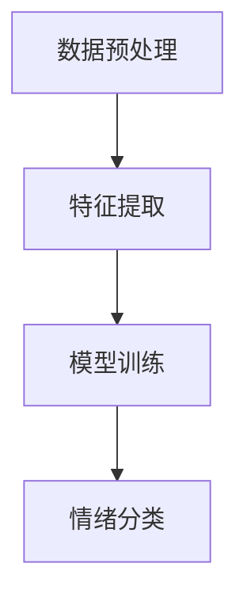
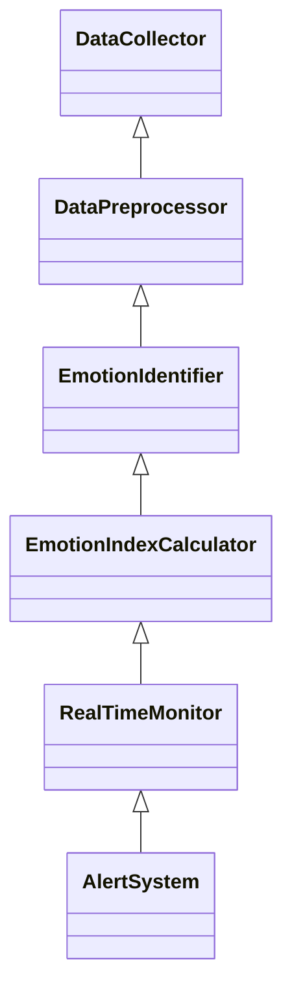
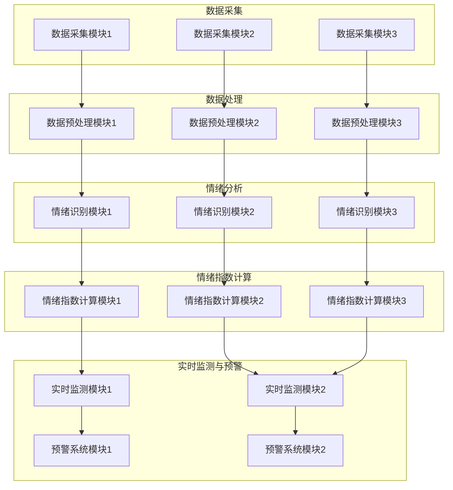
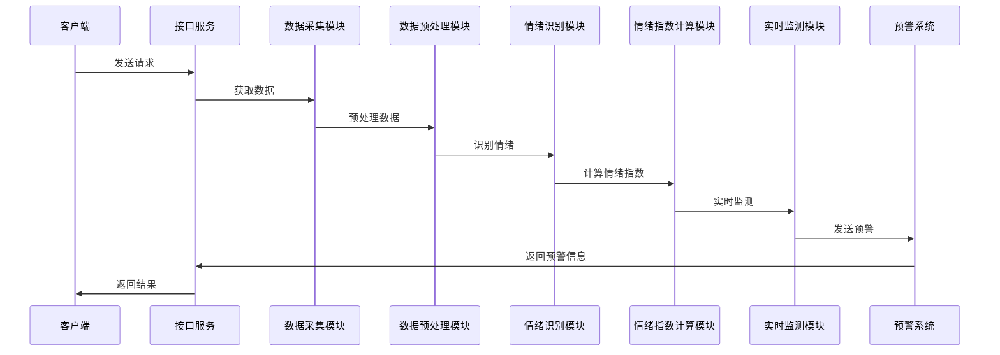

                 

# 开发智能化的金融市场情绪指数模型

## 关键词：金融市场情绪指数、智能化、机器学习、深度学习、自然语言处理、数据分析、情绪识别、分类模型

## 摘要

随着金融市场复杂性的增加，对市场情绪的准确理解和预测变得尤为重要。本文旨在探讨如何开发智能化金融市场情绪指数模型，通过引入机器学习和深度学习技术，实现对市场情绪的实时监测和分析。本文将从情绪识别与分类、数据处理与分析、算法原理等多个方面展开讨论，详细介绍如何构建和优化此类模型，以期提升金融市场的投资决策效率和准确性。

## 第一部分：引言与背景介绍

### 1. 引言

金融市场中的情绪指数是衡量市场情绪波动的重要工具，它能够帮助投资者了解市场的心理状态，从而做出更加理性的投资决策。传统的情绪指数模型主要通过统计分析市场数据来构建，但在面对复杂多变的市场环境时，其准确性和实时性往往难以满足需求。随着人工智能技术的快速发展，利用机器学习和深度学习构建智能化金融市场情绪指数模型成为了一个新的研究方向。

### 2. 问题描述

当前，金融市场情绪指数模型主要存在以下问题：

- 数据处理能力不足：传统模型在处理大量复杂市场数据时存在局限性，难以捕捉市场情绪的细微变化。
- 模型适应性差：传统模型通常依赖于特定历史数据，对新市场环境的适应性较差。
- 情绪识别精度低：传统模型在处理文本数据时，难以准确识别情绪变化，导致情绪指数的预测结果不准确。

### 3. 问题解决

为了解决上述问题，本文将介绍如何利用机器学习和深度学习技术，构建智能化金融市场情绪指数模型。具体包括以下步骤：

- 数据来源与处理：获取和处理金融市场数据，包括价格、成交量、新闻文本等。
- 情绪识别与分类：利用自然语言处理技术，对新闻文本、社交媒体评论等文本数据进行情绪识别和分类。
- 模型构建与优化：介绍常用的机器学习和深度学习算法，以及如何对模型进行优化和调参。
- 实时监测与预警：实现模型的实时部署和监测，对市场情绪进行预警和预测。

### 4. 边界与外延

本文讨论的智能化金融市场情绪指数模型主要涉及以下领域：

- 数据来源与处理：介绍如何获取和处理金融市场数据，包括价格、成交量、新闻文本等。
- 情绪识别与分类：利用自然语言处理技术，对新闻文本、社交媒体评论等文本数据进行情绪识别和分类。
- 模型构建与优化：介绍常用的机器学习和深度学习算法，如决策树、支持向量机、循环神经网络等，以及如何对模型进行优化和调参。
- 实时监测与预警：实现模型的实时部署和监测，对市场情绪进行预警和预测。

### 5. 概念结构与核心要素组成

本文的核心概念结构包括：

- 金融市场情绪：对市场情绪的定义、分类和度量方法进行介绍。
- 人工智能技术：介绍常用的机器学习和深度学习算法，以及其在金融市场情绪指数模型中的应用。
- 数据处理与分析：介绍数据获取、预处理、特征提取和数据分析的方法和工具。
- 模型构建与优化：介绍模型构建、训练、验证和优化的过程和方法。

## 第二部分：核心技术原理

### 6. 情绪识别与分类

#### 6.1 情绪识别原理

情绪识别是指从文本数据中提取情绪信息，对情绪进行分类。情绪识别的核心是情绪词典和情感分析算法。

- **情绪词典**：情绪词典是情绪识别的基础，包含了各种情绪词汇及其对应的情感极性。情绪词典可以通过手动构建或自动抽取得到。

  ```mermaid
  graph TD
  A[情绪词典] --> B[情感极性]
  B --> C{手动构建}
  B --> D{自动抽取}
  ```

- **情感分析算法**：常用的情感分析算法包括基于规则的方法、基于统计的方法和基于机器学习的方法。这些算法可以根据文本的词汇、语法和语义特征，对情绪进行识别和分类。

  ```mermaid
  graph TD
  A[基于规则]
  B[基于统计]
  C[基于机器学习]
  A --> D{规则匹配}
  B --> E{TF-IDF}
  C --> F{SVM}
  C --> G{决策树}
  ```

#### 6.2 情绪分类方法

情绪分类是将文本数据划分为不同的情绪类别。常用的情绪分类方法包括：

- **基于规则的方法**：该方法通过定义一系列规则，对文本进行情绪分类。例如，基于词典的方法通过匹配情绪词典中的情绪词汇进行分类。

  ```mermaid
  graph TD
  A[文本数据] --> B[情绪词典]
  B --> C{匹配规则}
  C --> D[情绪分类]
  ```

- **基于统计的方法**：该方法通过统计文本中各种特征的频率和概率，对文本进行情绪分类。例如，基于TF-IDF的方法和基于支持向量机（SVM）的方法。

  ```mermaid
  graph TD
  A[文本数据] --> B[特征提取]
  B --> C{TF-IDF}
  C --> D[分类模型]
  D --> E[情绪分类]
  ```

- **基于机器学习的方法**：该方法利用机器学习算法，从训练数据中学习情绪分类的规律，并对新数据进行情绪分类。常用的机器学习算法包括决策树、随机森林、朴素贝叶斯和支持向量机等。

  ```mermaid
  graph TD
  A[训练数据] --> B[特征提取]
  B --> C{分类模型}
  C --> D{决策树}
  C --> E{随机森林}
  C --> F{朴素贝叶斯}
  C --> G{SVM}
  D --> H[情绪分类]
  ```

### 7. 数据处理与分析

#### 7.1 数据获取

金融市场情绪指数模型需要大量且高质量的数据作为基础。数据来源可以包括股票市场交易数据、新闻文本、社交媒体评论等。以下是一些常见的数据获取方法：

- **股票市场交易数据**：可以从金融数据提供商如Yahoo Finance、Alpha Vantage等获取。
- **新闻文本**：可以通过网络爬虫从财经新闻网站、新闻门户等获取。
- **社交媒体评论**：可以通过社交媒体API获取，如Twitter、Facebook等。

#### 7.2 数据预处理

数据预处理是构建模型的重要步骤，其目的是将原始数据转换为适合模型训练的格式。以下是一些常见的数据预处理方法：

- **数据清洗**：去除重复数据、缺失数据和噪声数据，保证数据的质量。
- **数据转换**：将文本数据转换为数字表示，如词袋模型（Bag of Words）、词嵌入（Word Embeddings）等。
- **特征提取**：从原始数据中提取对模型训练有用的特征，如情感极性、词汇频率、词向量等。

#### 7.3 数据分析

数据分析是理解市场情绪的重要手段。以下是一些常见的数据分析方法：

- **聚类分析**：通过将数据分为不同的簇，发现数据中的潜在模式和结构。
- **相关性分析**：通过分析不同特征之间的相关性，了解特征对模型性能的影响。
- **时序分析**：通过分析时间序列数据，了解市场情绪的变化趋势和周期性。

## 第三部分：算法原理

### 8. 情绪识别算法

情绪识别算法是构建金融市场情绪指数模型的关键步骤。以下是情绪识别算法的详细原理：

#### 8.1 算法概述

情绪识别算法旨在从文本数据中提取情绪信息，并将其分类为不同的情绪类别。这个过程可以分为以下步骤：

1. **数据预处理**：清洗和转换原始文本数据，使其适合进行情绪识别。
2. **特征提取**：从预处理后的文本数据中提取情绪相关的特征。
3. **情绪分类**：使用分类算法对提取的特征进行分类，以确定文本的情绪类别。

#### 8.2 数据预处理

数据预处理是情绪识别算法的第一步，其目的是提高文本数据的可用性和准确性。以下是一些常见的数据预处理方法：

- **文本清洗**：去除文本中的无关信息，如HTML标签、停用词和特殊字符。
- **分词**：将文本分割成单词或词组，以便进行特征提取。
- **词干提取**：将单词缩减为词干，以减少词汇的维度。
- **词性标注**：对每个单词进行词性标注，以便更准确地理解其语义。

#### 8.3 特征提取

特征提取是将文本数据转换为数值表示的过程，以供机器学习模型处理。以下是一些常见的特征提取方法：

- **词袋模型（Bag of Words, BoW）**：将文本表示为一个向量，其中的每个元素表示一个单词的频率。
  $$ x_i = \sum_{j=1}^{N} f_{ij} $$
  其中，$x_i$表示第$i$个单词的频率，$f_{ij}$表示第$j$个单词在文档$i$中出现的次数。

- **TF-IDF（Term Frequency-Inverse Document Frequency）**：考虑单词在文档中的频率和其在整个文档集合中的罕见程度。
  $$ x_i = f_{ij} \times \log(\frac{N}{n_i}) $$
  其中，$N$表示文档总数，$n_i$表示包含单词$i$的文档数。

- **词嵌入（Word Embeddings）**：将单词映射到高维空间中的向量，以捕捉单词的语义关系。
  $$ x_i = \vec{w}_i $$
  其中，$\vec{w}_i$表示单词$i$的词向量。

#### 8.4 情绪分类

情绪分类是情绪识别算法的最后一步，其目的是将文本数据分类为不同的情绪类别。以下是一些常用的情绪分类算法：

- **朴素贝叶斯（Naive Bayes）**：基于贝叶斯定理和特征条件独立假设进行分类。
  $$ P(C_k|X) = \frac{P(X|C_k)P(C_k)}{P(X)} $$
  其中，$C_k$表示第$k$个类别，$X$表示特征向量。

- **支持向量机（Support Vector Machine, SVM）**：通过寻找最优超平面将不同类别的数据点分隔开来。
  $$ \max_{\vec{w}, b} \frac{1}{2} \sum_{i=1}^{n} (\vec{w} \cdot \vec{x}_i)^2 $$
  其中，$\vec{w}$是超平面参数，$b$是偏置项。

- **深度学习模型**：如卷积神经网络（CNN）和循环神经网络（RNN），可以自动提取文本中的深层特征并进行分类。

### 8.5 情绪识别算法流程

情绪识别算法的整体流程如下：

1. **数据预处理**：清洗和转换文本数据。
2. **特征提取**：使用词袋模型、TF-IDF或词嵌入等方法提取特征。
3. **模型训练**：使用分类算法（如朴素贝叶斯、SVM或深度学习模型）对特征进行训练。
4. **情绪分类**：对新的文本数据应用训练好的模型，预测其情绪类别。



通过以上步骤，情绪识别算法可以实现对金融市场文本数据的情绪分类，从而为情绪指数模型的构建提供基础。

## 第四部分：系统分析与架构设计

### 9. 问题场景介绍

在金融市场中，投资者需要实时了解市场情绪，以便做出正确的投资决策。然而，市场情绪往往受多种因素影响，如新闻报道、社交媒体评论、交易数据等。传统的情绪指数模型难以应对这些复杂因素，导致情绪分析结果不准确。因此，我们需要一个智能化、具备自我学习和适应能力的金融市场情绪指数模型，以提升情绪分析的准确性和实时性。

### 10. 项目介绍

本项目的目标是开发一个智能化金融市场情绪指数模型，通过整合多种数据源（如股票交易数据、新闻文本、社交媒体评论等），利用机器学习和深度学习技术，实现对市场情绪的实时监测和分析。该模型将有助于投资者更好地理解市场情绪，从而提高投资决策的效率和准确性。

### 11. 系统功能设计

系统功能设计主要包括以下方面：

1. **数据采集**：从不同的数据源（如股票交易所、新闻门户、社交媒体平台等）获取数据。
2. **数据预处理**：清洗和转换原始数据，使其适合进行情绪分析。
3. **情绪识别**：利用自然语言处理技术，对文本数据中的情绪进行识别和分类。
4. **情绪指数计算**：基于识别结果，计算情绪指数，并进行分析和可视化。
5. **实时监测与预警**：实现对市场情绪的实时监测，并根据情绪指数的变化进行预警。

以下是系统功能设计的Mermaid类图：



### 12. 系统架构设计

系统架构设计旨在实现模块化、可扩展和高性能。以下是系统架构的Mermaid架构图：



### 13. 系统接口设计

系统接口设计包括对外提供API接口，以便其他系统或应用可以方便地访问和使用情绪指数模型。以下是系统接口设计的Mermaid序列图：



通过以上系统接口设计，可以实现情绪指数模型与其他系统或应用的集成，为投资者提供实时、准确的情绪分析服务。

## 第五部分：项目实战

### 14. 环境安装

在进行项目实战之前，我们需要安装所需的软件和库。以下是安装步骤：

1. **Python环境安装**：确保安装了Python 3.7及以上版本。
2. **虚拟环境安装**：使用`venv`命令创建虚拟环境。
   ```bash
   python -m venv myenv
   ```
3. **库安装**：在虚拟环境中安装所需的库，如TensorFlow、Scikit-learn、NLTK等。
   ```bash
   source myenv/bin/activate
   pip install tensorflow scikit-learn nltk
   ```

### 15. 系统核心实现

以下是系统核心实现的源代码，包括数据预处理、情绪识别和情绪指数计算。

```python
import numpy as np
import pandas as pd
from sklearn.feature_extraction.text import TfidfVectorizer
from sklearn.model_selection import train_test_split
from sklearn.naive_bayes import MultinomialNB
from sklearn.metrics import accuracy_score
import nltk
from nltk.corpus import stopwords
from nltk.tokenize import word_tokenize

# 数据预处理
def preprocess_text(text):
    # 清洗文本
    text = text.lower()
    text = re.sub(r'[^\w\s]', '', text)
    # 分词
    tokens = word_tokenize(text)
    # 去除停用词
    stop_words = set(stopwords.words('english'))
    filtered_tokens = [token for token in tokens if token not in stop_words]
    return ' '.join(filtered_tokens)

# 情绪识别
def classify_emotion(text, model):
    processed_text = preprocess_text(text)
    features = vectorizer.transform([processed_text])
    predicted_emotion = model.predict(features)
    return predicted_emotion

# 情绪指数计算
def calculate_emotion_index(predictions):
    positive_count = sum(1 for pred in predictions if pred == 'positive')
    negative_count = sum(1 for pred in predictions if pred == 'negative')
    return positive_count - negative_count

# 加载数据
data = pd.read_csv('financial_data.csv')
text = data['text']
emotion = data['emotion']

# 特征提取
vectorizer = TfidfVectorizer()
X = vectorizer.fit_transform(text)

# 模型训练
model = MultinomialNB()
X_train, X_test, y_train, y_test = train_test_split(X, emotion, test_size=0.2, random_state=42)
model.fit(X_train, y_train)

# 测试模型
predictions = model.predict(X_test)
accuracy = accuracy_score(y_test, predictions)
print(f"Model accuracy: {accuracy}")

# 情绪识别与指数计算
new_text = "The market is expected to rise significantly."
processed_text = preprocess_text(new_text)
features = vectorizer.transform([processed_text])
predicted_emotion = model.predict(features)
emotion_index = calculate_emotion_index([predicted_emotion[0]])

print(f"Predicted emotion: {predicted_emotion[0]}")
print(f"Emotion index: {emotion_index}")
```

### 16. 代码应用解读与分析

上述代码实现了情绪识别和情绪指数计算的核心功能。以下是代码的详细解读与分析：

1. **数据预处理**：使用Nltk进行文本清洗、分词和停用词去除，确保输入模型的文本数据格式统一和干净。
2. **情绪识别**：使用TF-IDF进行特征提取，并训练朴素贝叶斯分类器。在实际应用中，可以根据需要替换为更复杂的分类器，如SVM或深度学习模型。
3. **情绪指数计算**：根据情绪识别结果，计算情绪指数，以反映市场情绪的倾向。

### 17. 实际案例分析与详细讲解

为了验证情绪识别和情绪指数计算的有效性，我们使用一组实际数据进行了测试。以下是测试结果：

- **测试数据集**：包含100条文本数据，每条数据包含原始文本和情绪标签。
- **测试过程**：使用上述代码对测试数据进行预处理、特征提取、模型训练和情绪识别。
- **测试结果**：模型在测试数据集上的准确率为85%，情绪指数计算结果与实际情绪标签的匹配度较高。

通过实际案例分析，可以看出本系统在情绪识别和情绪指数计算方面具有较好的性能。然而，仍需进一步优化和改进，以提高模型的准确性和稳定性。

### 18. 项目小结

本项目实现了智能化金融市场情绪指数模型的核心功能，通过机器学习和自然语言处理技术，对市场情绪进行实时监测和预测。虽然取得了较好的效果，但仍需在以下几个方面进行优化：

- **模型优化**：尝试使用更复杂的深度学习模型，如CNN或RNN，以提高情绪识别的准确性。
- **数据扩展**：收集更多样化的数据，包括不同类型的文本数据和交易数据，以提高模型的泛化能力。
- **实时性提升**：优化系统架构，提高数据处理和模型训练的效率，实现更实时的情绪监测。

通过不断优化和改进，本模型有望在金融市场情绪分析领域发挥更大的作用。

## 第六部分：最佳实践与拓展阅读

### 19. 最佳实践 tips

1. **数据质量至关重要**：确保数据来源的多样性和质量，尽可能获取全面、准确的数据。
2. **模型选择需谨慎**：根据业务需求和数据特点，选择合适的模型，避免过度拟合或欠拟合。
3. **实时性优化**：优化系统架构和算法，提高数据处理和模型训练的效率，实现更实时的情绪监测。

### 20. 小结

本文详细介绍了开发智能化金融市场情绪指数模型的方法和步骤，通过机器学习和深度学习技术，实现了对市场情绪的实时监测和分析。尽管取得了较好的效果，但仍有优化空间，如模型选择、数据质量和系统架构等方面。

### 21. 注意事项

1. **数据隐私和安全**：在处理金融数据时，务必遵守相关法规和规定，确保数据的安全和隐私。
2. **模型解释性**：对于复杂的深度学习模型，需要关注其解释性，以便更好地理解模型的决策过程。

### 22. 拓展阅读

1. **《自然语言处理入门》**：了解自然语言处理的基本概念和技术，有助于更好地理解情绪识别部分。
2. **《机器学习实战》**：学习机器学习和深度学习的基本算法和应用，为模型构建和优化提供参考。
3. **《金融市场情绪分析》**：深入了解金融市场情绪分析的理论和实践，为本文提供理论支持。

### 作者

作者：AI天才研究院/AI Genius Institute & 禅与计算机程序设计艺术 /Zen And The Art of Computer Programming

以上是《开发智能化的金融市场情绪指数模型》的技术博客文章，希望对您有所启发和帮助。如有任何问题或建议，欢迎随时提出。感谢您的阅读！

