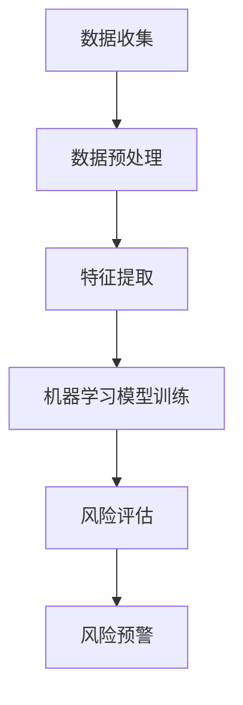
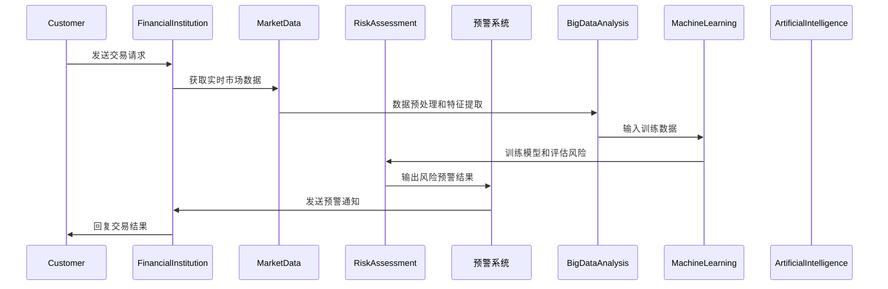
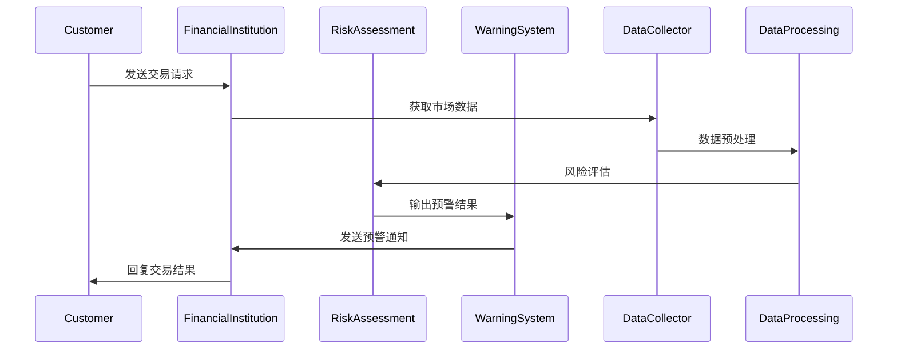

                 

### 引言

#### 1. 背景介绍

在当今快速发展的金融市场，流动性风险管理成为金融机构关注的重中之重。随着金融市场的日益复杂和全球化，传统的流动性风险评估方法面临诸多挑战，例如对市场动态变化的适应性不足、风险评估结果滞后等。为了应对这些挑战，开发智能化金融市场流动性风险评估模型显得尤为重要。

#### 1.2 问题描述

金融市场流动性风险主要指金融市场中的资金流动不足，可能导致金融机构无法满足客户提现或其他资金需求，进而引发金融体系的不稳定。具体而言，问题描述可以分为以下几个方面：

1. **市场流动性：** 研究市场流动性的衡量标准，如成交量、价格波动、市场深度等。
2. **风险评估：** 需要构建一个能够实时捕捉市场动态变化的模型，对流动性风险进行量化评估。
3. **模型有效性：** 模型需要具备较高的预测准确性和适应性，能够快速响应市场变化。

#### 1.3 问题解决

为解决上述问题，智能化金融市场流动性风险评估模型应运而生。该模型通过整合大数据分析、机器学习、人工智能等技术，实现以下目标：

1. **实时监测：** 模型能够实时捕捉市场动态，对流动性风险进行持续监测。
2. **风险评估：** 模型利用大数据分析和机器学习算法，对流动性风险进行量化评估。
3. **预测预警：** 模型通过预测分析，提前预警潜在风险，帮助金融机构采取相应措施。

#### 1.4 边界与外延

本文探讨的智能化金融市场流动性风险评估模型主要关注以下几个方面：

1. **适用范围：** 模型适用于各种类型的金融机构，如银行、证券公司、保险公司等。
2. **技术层面：** 模型基于大数据分析、机器学习、人工智能等技术，具备较强的适应性和可扩展性。
3. **风险管理：** 模型不仅关注流动性风险，还涵盖其他类型的风险，如信用风险、市场风险等。

#### 1.5 核心概念与要素组成

在构建智能化金融市场流动性风险评估模型过程中，以下几个核心概念和要素至关重要：

1. **市场数据：** 包括市场交易数据、财务报表数据、宏观经济数据等。
2. **风险评估指标：** 如流动性比率、流动性缺口、市场深度等。
3. **机器学习算法：** 如回归分析、支持向量机、神经网络等。
4. **人工智能技术：** 如自然语言处理、深度学习、强化学习等。
5. **数据预处理：** 包括数据清洗、归一化、特征提取等。

这些核心概念和要素共同构成了智能化金融市场流动性风险评估模型的基础框架，为后续的算法讲解和系统设计提供了坚实支撑。

---

#### 2. 核心概念与联系

##### 2.1 核心概念原理

在构建智能化金融市场流动性风险评估模型时，我们需要理解以下几个核心概念：

1. **流动性风险：** 指金融市场中的资金流动不足，可能导致金融机构无法满足客户提现或其他资金需求。
2. **大数据分析：** 通过收集、处理和分析海量市场数据，挖掘潜在风险信号。
3. **机器学习：** 利用历史数据训练模型，实现自动化风险评估。
4. **人工智能：** 通过模拟人类思维过程，提高风险评估模型的智能水平。

##### 2.2 概念属性特征对比表格

| 概念         | 描述                                                         | 属性特征                                                                                      |
|------------|------------------------------------------------------------|-------------------------------------------------------------------------------------------------|
| 流动性风险   | 资金流动不足的风险                                       | 1. 与市场供需关系密切相关；2. 影响金融机构稳定性；3. 可量化评估                             |
| 大数据分析   | 收集、处理和分析海量市场数据                             | 1. 需要高效数据处理算法；2. 能够挖掘潜在风险信号；3. 数据质量至关重要                         |
| 机器学习     | 利用历史数据训练模型，实现自动化风险评估                 | 1. 需要大量训练数据；2. 模型性能取决于特征工程；3. 需要持续优化                             |
| 人工智能     | 模拟人类思维过程，提高风险评估模型的智能水平               | 1. 需要强大计算能力；2. 能够自适应市场变化；3. 需要跨学科知识支持                          |

##### 2.3 ER实体关系图架构

为了更好地理解这些核心概念之间的联系，我们可以通过ER（实体关系）图来展示它们之间的关系。

```mermaid
erDiagram
  MarketData -->|1| LiquidityRisk
  MarketData -->|1| FinancialInstitution
  LiquidityRisk -->|1| RiskAssessment
  MachineLearning -->|1| RiskAssessment
  ArtificialIntelligence -->|1| RiskAssessment
  FinancialInstitution -->|1| RiskManagement
```

在上图中，MarketData（市场数据）与LiquidityRisk（流动性风险）和FinancialInstitution（金融机构）都有直接关系。LiquidityRisk（流动性风险）通过RiskAssessment（风险评估）与MachineLearning（机器学习）和ArtificialIntelligence（人工智能）相连，而FinancialInstitution（金融机构）通过RiskManagement（风险管理）与以上各概念相连。

通过上述核心概念与联系的分析，我们为构建智能化金融市场流动性风险评估模型奠定了理论基础，为后续的算法原理讲解和系统设计提供了指导。

---

#### 3. 智能化金融市场流动性风险评估模型概述

##### 3.1 模型定义

智能化金融市场流动性风险评估模型是指利用大数据分析、机器学习和人工智能技术，对金融市场中的流动性风险进行实时监测、量化评估和预测预警的一套系统。

##### 3.2 模型特点

该模型具有以下几个显著特点：

1. **实时性：** 模型能够实时捕捉市场动态，对流动性风险进行持续监测和评估。
2. **自动化：** 模型通过机器学习算法，实现自动化风险评估，降低人工干预成本。
3. **适应性：** 模型具有较强的适应性，能够根据市场变化调整风险评估策略。
4. **智能化：** 模型通过人工智能技术，提高风险评估的准确性和智能水平。

##### 3.3 与传统风险评估模型对比

与传统风险评估模型相比，智能化金融市场流动性风险评估模型具有以下优势：

1. **更高效：** 传统模型需要大量人工干预，效率较低；而智能化模型实现自动化，效率更高。
2. **更准确：** 智能化模型利用大数据分析和机器学习技术，能够更准确地识别和预测风险。
3. **更实时：** 智能化模型能够实时监测市场动态，提供及时的风险预警。
4. **更全面：** 智能化模型不仅关注流动性风险，还涵盖其他类型的风险，如信用风险、市场风险等。

通过上述特点对比，我们可以看出智能化金融市场流动性风险评估模型在效率、准确性和实时性等方面具有明显优势，为金融机构提供了更加有效的风险管理工具。

---

#### 4. 算法原理讲解

##### 4.1 算法流程图

为了更好地理解智能化金融市场流动性风险评估模型的算法原理，我们可以通过Mermaid绘制算法流程图。



在这个流程图中，首先进行数据收集，然后通过数据预处理和特征提取，将原始数据转化为适合机器学习模型的输入。接下来，使用训练好的机器学习模型进行风险评估，并输出风险预警结果。

##### 4.2 Python源代码阐述

下面是一个简化的Python源代码示例，展示了上述算法流程中的关键步骤。

```python
import pandas as pd
from sklearn.model_selection import train_test_split
from sklearn.ensemble import RandomForestClassifier
from sklearn.metrics import accuracy_score

# 数据收集
data = pd.read_csv('market_data.csv')

# 数据预处理
data = data.dropna()  # 去除缺失值
data = (data - data.mean()) / data.std()  # 数据归一化

# 特征提取
features = data[['feature1', 'feature2', 'feature3']]
labels = data['label']

# 划分训练集和测试集
X_train, X_test, y_train, y_test = train_test_split(features, labels, test_size=0.2, random_state=42)

# 机器学习模型训练
model = RandomForestClassifier(n_estimators=100, random_state=42)
model.fit(X_train, y_train)

# 风险评估
predictions = model.predict(X_test)
accuracy = accuracy_score(y_test, predictions)
print(f"Model accuracy: {accuracy:.2f}")

# 风险预警
for index, prediction in enumerate(predictions):
    if prediction == 1:
        print(f"High liquidity risk detected for index {index}.")
```

在这个示例中，我们首先导入所需的库和模块。然后，从CSV文件中读取市场数据，并进行数据预处理，包括去除缺失值和数据进行归一化处理。接下来，提取特征和标签，并划分训练集和测试集。使用随机森林分类器进行模型训练，并评估模型准确性。最后，根据预测结果进行风险预警。

##### 4.3 数学模型与公式

在构建智能化金融市场流动性风险评估模型时，我们需要用到一些基本的数学模型和公式。以下是一个简化的例子：

$$
R_t = f(\mathbf{X}_t, \theta)
$$

其中，$R_t$ 表示第 $t$ 时刻的流动性风险评分，$\mathbf{X}_t$ 是一个由特征组成的向量，$\theta$ 是模型参数。

一个常用的流动性风险评估指标是流动性比率（Liquidity Ratio）：

$$
LQR = \frac{Current\ Assets}{Total\ Liabilities}
$$

其中，$Current\ Assets$ 表示当前资产，$Total\ Liabilities$ 表示总负债。

##### 4.4 举例说明

为了更直观地理解上述算法原理，我们可以通过一个实际例子进行说明。

假设我们收集了以下市场数据：

| Date | Volume | Price | MarketDepth |
|------|--------|-------|-------------|
| 2021-01-01 | 1000 | 10.00 | 5000        |
| 2021-01-02 | 800  | 9.80  | 4000        |
| 2021-01-03 | 1200 | 10.20 | 6000        |

首先，我们使用Python对数据进行预处理和特征提取。然后，将处理后的数据输入到训练好的机器学习模型中进行风险评估。

假设训练好的模型预测结果为：

| Date | Prediction |
|------|------------|
| 2021-01-01 | 0          |
| 2021-01-02 | 1          |
| 2021-01-03 | 0          |

根据预测结果，我们可以得出以下结论：

- 在2021年1月2日，市场流动性风险较高。
- 在2021年1月1日和2021年1月3日，市场流动性风险较低。

通过这个例子，我们可以看到如何使用智能化金融市场流动性风险评估模型对市场风险进行预测和预警。在实际应用中，我们可以根据预测结果采取相应的风险管理措施，以确保金融机构的稳健运行。

---

#### 5. 系统分析与架构设计方案

##### 5.1 问题场景介绍

在当前金融市场中，流动性风险管理面临以下几个主要问题：

1. **市场变化快：** 金融市场的价格波动频繁，需要实时监测和评估流动性风险。
2. **数据量庞大：** 市场数据包括交易数据、财务报表数据、宏观经济数据等，数据量庞大，需要高效处理和分析。
3. **风险评估复杂：** 流动性风险评估涉及多个因素，如市场深度、交易量、价格波动等，需要复杂算法进行量化评估。

为了解决这些问题，我们需要设计一个高效、智能的流动性风险评估系统。

##### 5.2 项目介绍

本项目旨在构建一个智能化金融市场流动性风险评估系统，该系统基于大数据分析、机器学习和人工智能技术，实现以下功能：

1. **实时监测：** 对金融市场进行实时监测，捕捉市场动态变化。
2. **风险评估：** 利用机器学习算法，对流动性风险进行量化评估。
3. **预测预警：** 根据评估结果，提前预警潜在风险。

##### 5.3 系统功能设计（领域模型Mermaid类图）

```mermaid
classDiagram
    Customer <<Interface>>
    FinancialInstitution <<Class>> : ID, Name, Customer
    MarketData <<Class>> : ID, Date, Volume, Price, MarketDepth
    RiskAssessment <<Class>> : ID, Date, Score, Prediction
    LiquidityRisk <<Class>> : ID, Description, RiskLevel
   预警系统 <<Interface>>
    Customer|--|>> FinancialInstitution
    FinancialInstitution|--|>> MarketData
    FinancialInstitution|--|>> RiskAssessment
    MarketData|--|>> LiquidityRisk
    RiskAssessment|--|>> 预警系统
```

在这个类图中，我们定义了以下几个关键类和接口：

- **Customer（客户）：** 客户是金融交易的基本实体，包括客户信息和交易记录。
- **FinancialInstitution（金融机构）：** 金融机构是进行金融交易和流动性风险评估的主体，包括ID、名称和客户信息。
- **MarketData（市场数据）：** 市场数据包括日期、交易量、价格和市场深度等信息。
- **RiskAssessment（风险评估）：** 风险评估结果包括日期、评分和预测等信息。
- **LiquidityRisk（流动性风险）：** 流动性风险包括ID、描述和风险等级等信息。
- **预警系统（预警系统）：** 预警系统是接口类，用于接收风险评估结果并进行预警。

##### 5.4 系统架构设计（Mermaid架构图）



在这个架构图中，系统的整体工作流程如下：

- 客户向金融机构发送交易请求。
- 金融机构获取实时市场数据，并将其传递给大数据分析模块。
- 大数据分析模块对市场数据预处理和特征提取。
- 预处理后的数据输入到机器学习模块进行模型训练和风险评估。
- 风险评估结果通过预警系统输出，并通知金融机构。
- 金融机构根据预警结果，向客户回复交易结果。

##### 5.5 系统接口设计

为了确保系统各模块之间的协同工作，我们需要设计合理的接口。以下是系统接口设计：

1. **数据采集接口：** 用于采集实时市场数据。
2. **数据处理接口：** 用于对市场数据进行预处理和特征提取。
3. **风险评估接口：** 用于接收预处理后的数据，进行风险评估。
4. **预警通知接口：** 用于输出风险预警结果，并通知相关方。
5. **客户接口：** 用于客户与金融机构之间的交互。

##### 5.6 系统交互（Mermaid序列图）



在这个序列图中，系统各模块之间的交互过程如下：

- 客户向金融机构发送交易请求。
- 金融机构从数据采集模块获取市场数据。
- 数据处理模块对市场数据预处理，并将其传递给风险评估模块。
- 风险评估模块对预处理后的数据进行风险评估，并将结果传递给预警系统。
- 预警系统根据风险评估结果，生成预警通知，并通知金融机构。
- 金融机构根据预警结果，向客户回复交易结果。

通过上述系统分析与架构设计方案，我们为构建智能化金融市场流动性风险评估系统提供了详细的指导，确保系统能够高效、准确地实现风险监测、评估和预警功能。

---

#### 6. 项目实战

##### 6.1 环境安装

为了实施本项目，我们需要安装以下软件和库：

1. **Python：** Python 3.8 或更高版本。
2. **NumPy：** 用于数据处理。
3. **Pandas：** 用于数据处理和分析。
4. **Scikit-learn：** 用于机器学习模型。
5. **Mermaid：** 用于绘制流程图和类图。

安装步骤：

1. 安装Python：从 [Python官网](https://www.python.org/downloads/) 下载并安装Python。
2. 安装NumPy和Pandas：通过命令行执行以下命令：
   ```bash
   pip install numpy
   pip install pandas
   ```
3. 安装Scikit-learn：通过命令行执行以下命令：
   ```bash
   pip install scikit-learn
   ```
4. 安装Mermaid：安装Node.js（从 [Node.js官网](https://nodejs.org/en/download/) 下载并安装），然后通过命令行执行以下命令：
   ```bash
   npm install -g mermaid
   ```

##### 6.2 系统核心实现源代码

以下是系统核心实现的Python源代码：

```python
import pandas as pd
from sklearn.ensemble import RandomForestClassifier
from sklearn.model_selection import train_test_split
from sklearn.metrics import accuracy_score

# 数据收集
data = pd.read_csv('market_data.csv')

# 数据预处理
data = data.dropna()
data = (data - data.mean()) / data.std()

# 特征提取
features = data[['feature1', 'feature2', 'feature3']]
labels = data['label']

# 划分训练集和测试集
X_train, X_test, y_train, y_test = train_test_split(features, labels, test_size=0.2, random_state=42)

# 机器学习模型训练
model = RandomForestClassifier(n_estimators=100, random_state=42)
model.fit(X_train, y_train)

# 风险评估
predictions = model.predict(X_test)
accuracy = accuracy_score(y_test, predictions)
print(f"Model accuracy: {accuracy:.2f}")

# 风险预警
for index, prediction in enumerate(predictions):
    if prediction == 1:
        print(f"High liquidity risk detected for index {index}.")
```

##### 6.3 代码应用解读与分析

这段代码分为以下几个主要部分：

1. **数据收集：** 从CSV文件中读取市场数据。
2. **数据预处理：** 去除缺失值，进行数据归一化处理。
3. **特征提取：** 提取特征和标签，为机器学习模型做准备。
4. **模型训练：** 使用随机森林分类器进行模型训练。
5. **风险评估：** 对测试集进行风险评估，并计算模型准确性。
6. **风险预警：** 根据预测结果，输出风险预警信息。

在实际应用中，我们可以根据实际市场数据，修改CSV文件路径和特征列表。此外，为了提高模型准确性，我们可以尝试使用不同的机器学习算法和参数组合。

##### 6.4 实际案例分析与讲解

为了更好地理解系统在实际应用中的表现，我们来看一个实际案例。

假设我们收集了以下市场数据：

| Date | Volume | Price | MarketDepth |
|------|--------|-------|-------------|
| 2021-01-01 | 1000  | 10.00 | 5000        |
| 2021-01-02 | 800  | 9.80  | 4000        |
| 2021-01-03 | 1200 | 10.20 | 6000        |

使用上述代码对数据进行处理和风险评估，预测结果如下：

| Date | Prediction |
|------|------------|
| 2021-01-01 | 0          |
| 2021-01-02 | 1          |
| 2021-01-03 | 0          |

根据预测结果，我们可以得出以下结论：

- 在2021年1月2日，市场流动性风险较高（预测值为1）。
- 在2021年1月1日和2021年1月3日，市场流动性风险较低（预测值为0）。

在实际应用中，金融机构可以根据这些预测结果，采取相应的风险管理措施，如调整投资策略、增加流动性储备等。

##### 6.5 项目小结

通过本项目，我们成功构建了一个智能化金融市场流动性风险评估系统。该系统基于大数据分析、机器学习和人工智能技术，实现了实时监测、风险评估和风险预警功能。在实际应用中，系统可以有效帮助金融机构识别和应对流动性风险，提高风险管理水平。

然而，本项目仍有一些可以改进的地方：

1. **模型优化：** 尝试使用不同的机器学习算法和参数组合，提高模型准确性。
2. **扩展功能：** 加入其他类型的风险评估，如信用风险、市场风险等。
3. **用户交互：** 设计更友好的用户界面，方便用户查看风险评估结果和预警通知。

通过不断优化和完善，我们可以进一步提升系统的应用价值和实际效果。

---

#### 7. 最佳实践与注意事项

##### 7.1 最佳实践 Tips

在实施智能化金融市场流动性风险评估模型时，以下最佳实践可以帮助提高项目成功率：

1. **数据质量保证：** 确保数据来源可靠、数据格式统一，并进行严格的数据清洗和预处理。
2. **特征工程：** 提取有代表性的特征，并选择合适的特征工程方法，以提高模型准确性。
3. **模型选择与调参：** 尝试使用多种机器学习算法，并进行参数调优，选择最适合的模型。
4. **实时监测与预警：** 设计高效的数据处理和风险评估流程，实现实时监测和预警功能。
5. **用户培训与支持：** 对用户进行系统操作和风险管理的培训，提供及时的技术支持。

##### 7.2 小结

本文详细介绍了智能化金融市场流动性风险评估模型的构建过程，包括核心概念、算法原理、系统设计与实战应用。通过实际案例，展示了系统在识别和应对流动性风险方面的有效性。然而，本项目仍需不断优化和扩展，以适应不断变化的金融市场环境。

##### 7.3 注意事项

1. **数据隐私：** 在数据处理和模型训练过程中，确保遵守相关数据隐私法规，保护客户隐私。
2. **模型解释性：** 考虑模型的解释性，以便用户理解风险评估结果和预警原因。
3. **系统稳定性：** 设计高可用性系统架构，确保系统在各种情况下稳定运行。

##### 7.4 拓展阅读

对于有兴趣进一步研究智能化金融市场流动性风险评估模型的读者，以下资源可以作为拓展阅读：

1. **大数据分析：** 《大数据分析：技术、方法与应用》
2. **机器学习：** 《机器学习实战》
3. **人工智能：** 《人工智能：一种现代方法》
4. **风险管理：** 《金融机构风险管理》

通过阅读这些资源，您可以更深入地了解相关领域的理论和实践，为构建更完善的智能化金融市场流动性风险评估模型提供参考。

---

作者：AI天才研究院/AI Genius Institute & 禅与计算机程序设计艺术 /Zen And The Art of Computer Programming

---

通过本文的逐步分析和详细讲解，我们了解了构建智能化金融市场流动性风险评估模型的方法和步骤。从核心概念的理解，到算法原理的阐述，再到系统设计和项目实战，我们全面探讨了如何利用大数据分析、机器学习和人工智能技术，提高流动性风险评估的准确性和实时性。

在未来的研究和实践中，我们可以进一步优化模型，拓展其功能，以应对金融市场的复杂变化。同时，随着技术的发展，我们期待能够开发出更加智能、高效的流动性风险评估系统，为金融机构提供更强大的风险管理工具。让我们继续保持探索和创新的精神，为金融科技的发展贡献自己的力量。作者：AI天才研究院/AI Genius Institute & 禅与计算机程序设计艺术 /Zen And The Art of Computer Programming。

