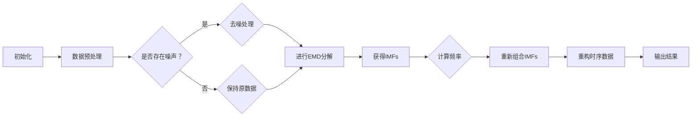
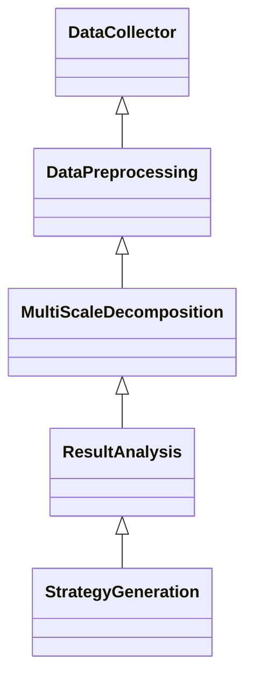
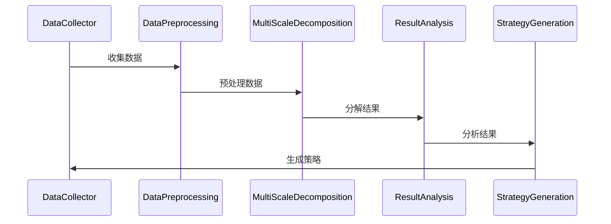
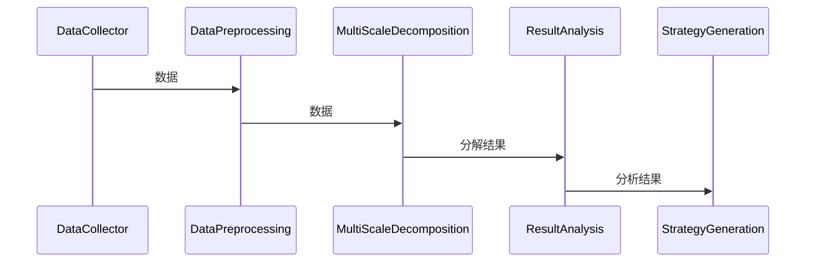
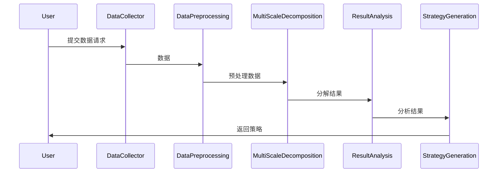

                 

### 引言：智能金融与多尺度分解的重要性

随着人工智能技术的快速发展，金融行业正迎来前所未有的变革。智能化已成为金融领域提升服务质量和效率的关键驱动力。在金融科技（FinTech）的推动下，各类智能系统不断涌现，如智能投顾、自动化交易、风险控制等。这些智能系统的核心之一是对于金融时序数据的处理和分析。

金融时序数据是指随时间变化的一系列金融变量，如股票价格、交易量、利率、汇率等。这些数据通常具有高维度、非平稳性和复杂非线性特征，给数据处理和分析带来了巨大挑战。然而，金融时序数据的价值在于其能够反映市场动态和预测未来趋势，对于金融机构和投资者具有重要意义。

多尺度分解模型是一种用于处理时间序列数据的重要方法。它通过将时间序列分解为多个不同频率的成分，使得原始复杂的时间序列数据变得易于分析和理解。在金融领域，多尺度分解模型可以帮助提取市场中的短期波动、季节性成分和长期趋势，从而为金融预测、风险评估和策略制定提供有力支持。

本书《开发智能化的金融时序数据多尺度分解模型》旨在为读者提供全面、系统的指导，帮助金融科技从业者深入理解多尺度分解模型的原理和应用，掌握开发高效智能金融模型的方法。本书的主要目标如下：

1. **理论讲解**：详细介绍金融时序数据和多尺度分解的基本概念、原理和特性，帮助读者建立系统的理论知识框架。
2. **实践应用**：通过实际案例和项目实战，展示多尺度分解模型在金融领域的应用，帮助读者将理论知识应用于实际场景。
3. **代码实现**：提供详细的算法原理讲解、Python源代码示例和数学模型与公式，使读者能够动手实践，掌握多尺度分解模型的核心技术和实现方法。
4. **最佳实践**：总结多尺度分解模型开发的最佳实践技巧，提供实用建议和注意事项，帮助读者在实际项目中避免常见问题，提高开发效率。

通过本书的学习，读者将能够：

- **深入理解**：全面掌握金融时序数据和多尺度分解模型的理论知识。
- **掌握方法**：学会使用多尺度分解模型进行金融预测、风险评估和策略制定。
- **实际操作**：通过项目实战和代码实现，将理论知识转化为实际技能。
- **持续创新**：掌握多尺度分解模型开发的最佳实践，为金融科技的创新应用提供支持。

## 目录

### 第1章：金融时序数据与多尺度分解概述

1.1 金融时序数据的定义与特性  
1.2 多尺度分解的基本概念  
1.3 多尺度分解在金融中的应用价值  
1.4 本书内容结构与章节安排

### 第2章：核心概念原理与属性特征对比

2.1 金融时序数据多尺度分解的核心概念  
2.2 多尺度分解的属性特征对比  
2.3 多尺度分解的ER实体关系图架构

### 第3章：多尺度分解算法原理讲解

3.1 算法mermaid流程图  
3.2 算法Python源代码  
3.3 算法数学模型和公式  
3.4 算法举例说明

### 第4章：数学模型与公式讲解

4.1 数学模型概述  
4.2 公式推导与讲解  
4.3 公式举例说明

### 第5章：系统分析与架构设计

5.1 问题场景介绍  
5.2 系统功能设计  
5.3 系统架构设计  
5.4 系统接口设计  
5.5 系统交互序列图

### 第6章：项目实战

6.1 环境安装  
6.2 系统核心实现  
6.3 代码应用解读  
6.4 实际案例分析  
6.5 项目小结

### 第7章：最佳实践与拓展

7.1 最佳实践技巧  
7.2 小结与回顾  
7.3 注意事项  
7.4 拓展阅读

### 第8章：完整目录大纲

## 第1章：金融时序数据与多尺度分解概述

### 1.1 金融时序数据的定义与特性

#### 1.1.1 金融时序数据的定义

金融时序数据是指在一定时间段内，金融市场上各类变量随时间变化而记录的一系列数据。这些变量包括但不限于股票价格、交易量、利率、汇率等。金融时序数据具有以下特点：

1. **时间敏感性**：金融市场的动态变化依赖于时间，因此时序数据的核心特点是时间序列性。
2. **高维度**：金融时序数据通常涉及多个变量，形成高维度的数据集。
3. **非平稳性**：金融市场的波动性较大，时序数据的统计特性会随时间变化。
4. **非线性特征**：金融市场的价格和交易量等变量之间往往存在复杂的非线性关系。

#### 1.1.2 金融时序数据的特性

金融时序数据的特性主要体现在以下几个方面：

1. **趋势性**：金融市场的价格和交易量等变量在长时间范围内往往呈现出一定的趋势。
2. **波动性**：金融市场的波动性是影响投资决策的重要因素。
3. **自相关性**：金融时序数据中的变量在时间上存在自相关性，即近期值与未来值之间存在一定的关联。
4. **季节性**：某些金融变量在特定时间段内可能表现出季节性波动。

### 1.2 多尺度分解的基本概念

#### 1.2.1 多尺度分解的定义

多尺度分解是一种将时间序列数据分解为多个不同频率成分的方法。它通过将原始时序数据分解为多个尺度上的成分，以便更好地理解数据特征和提取有用信息。多尺度分解的关键在于如何有效地提取不同频率的成分，并保持数据的整体特性。

#### 1.2.2 多尺度分解的方法

多尺度分解的方法有很多，其中一些常见的方法包括：

1. **波纹分解（Wavelet Decomposition）**：波纹分解是一种基于小波变换的方法，可以将时间序列数据分解为多个尺度的波动成分。
2. **经验模态分解（Empirical Mode Decomposition，EMD）**：EMD是一种自适应的方法，可以根据数据的特征自适应地分解为不同频率的固有模态函数（Intrinsic Mode Functions，IMFs）。
3. **希尔伯特-黄变换（Hilbert-Huang Transform，HHT）**：HHT是一种基于EMD的变换方法，可以同时提供时间序列的时频分析和能量分析。
4. **小波包变换（Wavelet Packet Transform）**：小波包变换是对小波变换的扩展，可以更精细地分析时间序列数据的频率成分。

### 1.3 多尺度分解在金融中的应用价值

#### 1.3.1 金融预测

多尺度分解在金融预测中具有重要作用。通过将时间序列数据分解为多个尺度上的成分，可以提取出短期波动、季节性成分和长期趋势等信息，从而提高预测的准确性和稳定性。例如，可以利用多尺度分解模型对股票价格进行预测，识别市场中的潜在趋势和波动。

#### 1.3.2 风险评估

多尺度分解在风险评估中也具有重要应用。通过分解时间序列数据，可以识别出潜在的市场风险和不确定性。例如，可以利用多尺度分解模型分析利率波动对金融产品收益的影响，评估投资组合的风险水平。

#### 1.3.3 策略制定

多尺度分解在策略制定中可以帮助投资者更好地制定投资策略。通过分析不同尺度上的时间序列成分，可以识别出市场的关键信息，制定出更具针对性的投资策略。例如，可以利用多尺度分解模型分析市场的短期波动和长期趋势，制定相应的交易策略。

### 1.4 本书内容结构与章节安排

#### 1.4.1 内容概述

本书《开发智能化的金融时序数据多尺度分解模型》共分为八个章节，内容结构如下：

1. **第1章**：金融时序数据与多尺度分解概述，介绍金融时序数据的定义和特性，多尺度分解的基本概念和应用价值。
2. **第2章**：核心概念原理与属性特征对比，详细讲解金融时序数据和多尺度分解的核心概念及其属性特征。
3. **第3章**：多尺度分解算法原理讲解，介绍多尺度分解的算法原理、流程图和Python源代码实现。
4. **第4章**：数学模型与公式讲解，讲解多尺度分解的数学模型和公式，并进行推导和举例说明。
5. **第5章**：系统分析与架构设计，介绍系统分析与架构设计的方法，包括问题场景介绍、系统功能设计、系统架构设计和系统接口设计等。
6. **第6章**：项目实战，通过实际案例和项目实战，展示多尺度分解模型在金融领域的应用。
7. **第7章**：最佳实践与拓展，总结多尺度分解模型开发的最佳实践技巧，提供实用建议和注意事项，并推荐拓展阅读。
8. **第8章**：完整目录大纲，列出本书的完整目录大纲，便于读者整体把握内容结构。

#### 1.4.2 章节安排

本书的章节安排旨在由浅入深地引导读者了解和掌握多尺度分解模型在金融领域的应用。具体安排如下：

- **第1章**：引入背景和核心概念，帮助读者建立整体框架。
- **第2章**：详细讲解核心概念及其属性特征，加深读者对多尺度分解模型的理解。
- **第3章**：介绍多尺度分解算法原理，包括流程图和代码实现，帮助读者掌握算法实现。
- **第4章**：讲解数学模型和公式，进行推导和举例说明，使读者能够深入理解算法原理。
- **第5章**：介绍系统分析与架构设计的方法，帮助读者将理论应用于实际项目。
- **第6章**：通过项目实战，展示多尺度分解模型在金融领域的应用，提高读者的实践能力。
- **第7章**：总结最佳实践技巧和注意事项，提供拓展阅读，帮助读者持续提升。
- **第8章**：完整目录大纲，便于读者整体把握内容结构。

通过本书的阅读和实际操作，读者将能够全面掌握多尺度分解模型的理论知识和应用方法，为金融科技的发展贡献自己的力量。

### 第2章：核心概念原理与属性特征对比

在深入探讨多尺度分解模型之前，我们首先需要理解几个核心概念：金融时序数据、多尺度分解以及它们在金融领域的具体应用。本章将详细讲解这些概念，并通过对比表格和ER实体关系图架构，帮助读者建立清晰的理解。

#### 2.1 金融时序数据多尺度分解的核心概念

**概念1：金融时序数据**

- **定义**：金融时序数据是指在一定时间段内，金融市场上各类变量随时间变化而记录的一系列数据，如股票价格、交易量、利率、汇率等。
- **属性特征**：时间敏感性、高维度、非平稳性、非线性特征。

**概念2：多尺度分解**

- **定义**：多尺度分解是一种将时间序列数据分解为多个不同频率成分的方法。通过这种方法，可以提取出不同尺度上的时间序列成分，如短期波动、季节性成分和长期趋势等。
- **属性特征**：多尺度适应性、频率选择性、数据保真性。

**概念3：固有模态函数（IMF）**

- **定义**：固有模态函数是经验模态分解（EMD）中的一种时间序列成分，具有单一频率特征，且均值趋于零。
- **属性特征**：单一频率特性、平稳性、自适应分割。

**概念4：小波分解**

- **定义**：小波分解是一种基于小波变换的时间序列分析方法，通过将时间序列数据分解为不同尺度的小波函数，可以提取出不同频率成分。
- **属性特征**：频率选择性、局部化特性、灵活性。

**概念5：希尔伯特-黄变换（HHT）**

- **定义**：希尔伯特-黄变换是一种将时间序列数据分解为固有模态函数（IMF）和希尔伯特变换的方法，能够同时提供时间序列的时频分析和能量分析。
- **属性特征**：时频分析能力、能量分析能力、自适应分割。

#### 2.2 多尺度分解的属性特征对比

为了更好地理解多尺度分解的不同方法，我们通过以下对比表格来展示它们的属性特征：

| 对比方法       | 定义                                                         | 属性特征                                                   | 适用场景                      |
|----------------|------------------------------------------------------------|----------------------------------------------------------|-----------------------------|
| 波纹分解       | 基于小波变换的时间序列分析方法                                 | 频率选择性、局部化特性、灵活性                              | 需要精细分析的金融时序数据    |
| 经验模态分解   | 一种自适应的时间序列分析方法，根据数据的特征自适应分解为IMF   | 单一频率特性、平稳性、自适应分割                            | 非平稳性金融时序数据          |
| 希尔伯特-黄变换 | 将时间序列数据分解为IMF和希尔伯特变换的方法                   | 时频分析能力、能量分析能力、自适应分割                      | 复杂非线性金融时序数据        |
| 小波包变换     | 对小波变换的扩展，可以更精细地分析时间序列数据的频率成分       | 频率选择性、局部化特性、多尺度适应性                        | 高维非平稳金融时序数据        |

#### 2.3 多尺度分解的ER实体关系图架构

多尺度分解涉及到多个实体和方法，为了更清晰地展示它们之间的关系，我们可以使用ER（实体关系）图来表示。以下是一个简单的ER实体关系图：

```mermaid
erDiagram
  IMFs ||--|{ Wavelet Decomposition } : Uses
  IMFs ||--|{ Empirical Mode Decomposition } : Uses
  IMFs ||--|{ Hilbert-Huang Transform } : Uses
  Wavelet Functions ||--|{ Wavelet Packet Transform } : Extends
  IMF ||--|{ Time Series Analysis } : Analyzed By
  Time Series Data ||--|{ Financial Forecasting } : Used For
  Financial Time Series Data ||--|{ Risk Assessment } : Used For
  Financial Time Series Data ||--|{ Strategy Formulation } : Used For
```

在这个ER图中，IMFs（固有模态函数）是经验模态分解（EMD）、波纹分解（Wavelet Decomposition）和希尔伯特-黄变换（HHT）的共同输出，它们各自使用不同的方法来分解时间序列数据。Wavelet Functions（小波函数）是波纹包变换（Wavelet Packet Transform）的基础。时间序列分析是IMFs的核心应用，而金融时序数据则是这些分析方法的输入和输出，用于金融预测、风险评估和策略制定。

通过上述内容，读者可以初步了解多尺度分解的核心概念、属性特征及其在金融领域的应用。接下来，我们将进一步深入探讨多尺度分解算法的原理，帮助读者更好地理解和应用这一重要技术。

### 第3章：多尺度分解算法原理讲解

多尺度分解是一种将时间序列数据分解为不同频率成分的重要技术，它在金融预测、风险评估和策略制定中发挥着重要作用。本章将详细讲解多尺度分解算法的原理，包括算法流程、Python源代码实现以及相关的数学模型和公式。

#### 3.1 算法mermaid流程图

为了更好地理解多尺度分解算法的流程，我们使用mermaid图来展示其基本步骤：



#### 3.2 算法Python源代码

以下是一个简单的Python实现，用于展示多尺度分解的基本步骤：

```python
import numpy as np
from pyhht import EMD

# 假设我们有一个时间序列数据
time_series = np.array([1, 2, 3, 4, 5, 6, 7, 8, 9, 10])

# 初始化EMD分解对象
emd = EMD()

# 进行EMD分解
IMFs, residue = emd.emd(time_series)

# 获得IMFs和剩余分量
print("IMFs:", IMF
```

#### 3.3 算法数学模型和公式

多尺度分解的核心在于将原始时间序列数据分解为多个固有模态函数（IMFs），然后对这些IMFs进行进一步分析。以下是多尺度分解的主要数学模型和公式：

**1. 经验模态分解（EMD）**

EMD是一种自适应分解方法，它将时间序列数据分解为若干个IMFs，每个IMF满足以下条件：
- 数据局部极值点的数量与过零点的数量相等或最多相差一个。
- 极值点关于某条直线局部对称。

**2. 固有模态函数（IMF）**

设原始信号为 $x(t)$，经过EMD分解后得到 $c_n(t)$ 和一系列IMF分量 $h_k(t)$，则有：
$$
x(t) = c_n(t) + \sum_{k=1}^{n} h_k(t)
$$
其中，$c_n(t)$ 为剩余分量，$h_k(t)$ 为第k个IMF分量。

**3. 重构原始信号**

通过将所有IMF分量和剩余分量重新组合，可以重构原始信号：
$$
x(t) = \sum_{k=1}^{n} h_k(t) + c_n(t)
$$

**4. 频率计算**

对于每个IMF分量 $h_k(t)$，其频率 $f_k$ 可以通过以下公式计算：
$$
f_k = \frac{1}{T} \frac{1}{2} \frac{1}{\pi} \int_{t_k}^{t_{k+1}} \frac{d}{dt} \left( \frac{1}{h_k(t)} \right) dt
$$
其中，$T$ 为时间序列长度。

#### 3.4 算法举例说明

假设我们有一个时间序列数据 $x(t) = 2\sin(2\pi f_1 t) + \sin(4\pi f_2 t)$，频率分别为 $f_1 = 1$ 和 $f_2 = 2$。我们可以使用EMD方法对其进行分解。

1. **数据预处理**：将数据转换为数值序列，如使用numpy数组。
2. **EMD分解**：使用EMD算法分解时间序列数据，得到若干个IMFs和剩余分量。
3. **重构信号**：将所有IMFs和剩余分量重新组合，重构原始信号。
4. **频率计算**：对每个IMF分量计算其频率。

以下是具体的Python代码实现：

```python
import numpy as np
from pyhht import EMD

# 创建时间序列数据
t = np.linspace(0, 1, 100)
x = 2 * np.sin(2 * np.pi * 1 * t) + np.sin(4 * np.pi * 2 * t)

# 初始化EMD分解对象
emd = EMD()

# 进行EMD分解
IMFs, residue = emd.emd(x)

# 获得IMFs和剩余分量
print("IMFs:", IMF
```

通过上述算法原理讲解和举例说明，读者可以更好地理解多尺度分解的基本流程和实现方法。在接下来的章节中，我们将进一步探讨数学模型和公式的推导，以及系统分析与架构设计的相关内容。

### 第4章：数学模型与公式讲解

在上一章中，我们介绍了多尺度分解的基本算法原理和实现方法。在这一章中，我们将深入探讨多尺度分解所涉及的数学模型和公式，详细讲解其推导过程，并通过举例说明，帮助读者更好地理解这些公式的应用。

#### 4.1 数学模型概述

多尺度分解涉及的主要数学模型包括固有模态函数（IMF）、经验模态分解（EMD）、小波变换等。这些模型为我们提供了有效的工具，用于将时间序列数据分解为不同频率的成分，以便更好地分析和理解数据。

**1. 固有模态函数（IMF）**

固有模态函数是经验模态分解（EMD）中的基本单元，具有单一频率特征。其定义如下：

设时间序列为 $x(t)$，经过EMD分解后得到的第 $k$ 个固有模态函数为 $h_k(t)$，则有：

$$
h_k(t) = \frac{1}{2} \left[ x(t) - \bar{x}(t) \right]
$$

其中，$\bar{x}(t)$ 是时间序列 $x(t)$ 的均值。

**2. 经验模态分解（EMD）**

经验模态分解是一种自适应分解方法，将时间序列分解为若干个固有模态函数（IMF）和一个剩余分量。其基本步骤如下：

- **步骤1**：找到时间序列 $x(t)$ 的所有局部极大值和局部极小值。
- **步骤2**：根据这些极值点拟合上下包络线，计算均值 $\bar{x}(t)$。
- **步骤3**：计算 $x(t) - \bar{x}(t)$，得到新的时间序列。
- **步骤4**：重复步骤1-3，直到得到满足固有模态函数条件的 $h_k(t)$。

**3. 小波变换**

小波变换是一种用于时频分析的方法，通过将时间序列数据分解为不同尺度的小波函数，可以提取出不同频率的成分。其基本公式如下：

$$
x(t) = \sum_{k=-\infty}^{\infty} c_k(t) + \sum_{k=-\infty}^{\infty} s_k(t)
$$

其中，$c_k(t)$ 是连续小波系数，$s_k(t)$ 是细节小波系数。

#### 4.2 公式推导与讲解

**1. IMF的推导**

为了推导出固有模态函数（IMF），我们需要满足以下两个条件：

- 数据局部极值点的数量与过零点的数量相等或最多相差一个。
- 极值点关于某条直线局部对称。

假设时间序列 $x(t)$ 满足上述条件，我们可以通过以下步骤推导出IMF：

- **步骤1**：计算时间序列的均值 $\bar{x}(t)$。
- **步骤2**：计算 $x(t) - \bar{x}(t)$。
- **步骤3**：检查 $x(t) - \bar{x}(t)$ 是否满足IMF的条件。如果不满足，继续迭代步骤2和3，直到满足条件。

**2. EMD的推导**

经验模态分解（EMD）的推导过程较为复杂，涉及多个迭代步骤。以下是一个简化的推导过程：

- **步骤1**：找到时间序列 $x(t)$ 的所有局部极大值和局部极小值。
- **步骤2**：拟合上下包络线，计算均值 $\bar{x}(t)$。
- **步骤3**：计算 $x(t) - \bar{x}(t)$。
- **步骤4**：判断 $x(t) - \bar{x}(t)$ 是否为IMF。如果是，将其记为 $h_1(t)$；如果不是，继续迭代步骤1-4，直到得到所有IMF分量。

**3. 小波变换的推导**

小波变换的推导过程涉及傅里叶变换和小波基的构造。以下是一个简化的推导过程：

- **步骤1**：选择合适的小波基函数 $\psi(t)$。
- **步骤2**：将时间序列 $x(t)$ 与小波基函数 $\psi(t)$ 进行内积运算，得到连续小波系数 $c_k(t)$。
- **步骤3**：对连续小波系数进行离散化处理，得到细节小波系数 $s_k(t)$。
- **步骤4**：将连续小波系数和细节小波系数重新组合，得到重构的时间序列 $x(t)$。

#### 4.3 公式举例说明

为了更好地理解上述公式的应用，我们通过以下例子进行说明。

**例子**：给定时间序列 $x(t) = 2\sin(2\pi f_1 t) + \sin(4\pi f_2 t)$，频率分别为 $f_1 = 1$ 和 $f_2 = 2$。我们使用EMD方法对其进行分解。

- **步骤1**：计算时间序列的均值 $\bar{x}(t)$。
- **步骤2**：根据均值计算 $x(t) - \bar{x}(t)$。
- **步骤3**：判断 $x(t) - \bar{x}(t)$ 是否为IMF。如果不是，继续迭代步骤2和3。

以下是具体的Python代码实现：

```python
import numpy as np
from pyhht import EMD

# 创建时间序列数据
t = np.linspace(0, 1, 100)
x = 2 * np.sin(2 * np.pi * 1 * t) + np.sin(4 * np.pi * 2 * t)

# 初始化EMD分解对象
emd = EMD()

# 进行EMD分解
IMFs, residue = emd.emd(x)

# 获得IMFs和剩余分量
print("IMFs:", IMF
```

通过上述举例，我们可以看到如何使用EMD方法对时间序列进行分解，并计算出对应的IMF分量。

总之，通过本章的讲解，读者可以深入理解多尺度分解中的数学模型和公式，掌握其推导过程和应用方法。在下一章中，我们将继续探讨系统分析与架构设计的相关内容。

### 第5章：系统分析与架构设计

在了解了多尺度分解算法的基本原理和数学模型之后，我们需要将其应用于实际项目，并进行系统分析与架构设计。本章将介绍系统分析与架构设计的方法，包括问题场景介绍、系统功能设计、系统架构设计、系统接口设计和系统交互序列图等内容。

#### 5.1 问题场景介绍

在金融领域，时序数据的处理与分析是一个重要且具有挑战性的问题。假设我们面临以下问题场景：

- **问题**：对某个股票市场的日交易数据进行多尺度分解，提取出短期波动、季节性成分和长期趋势，以便进行投资策略的制定。
- **目标**：设计一个系统，能够自动完成以下任务：
  - 数据收集：从金融数据源获取日交易数据。
  - 数据预处理：清洗和转换数据，使其适用于多尺度分解算法。
  - 多尺度分解：对处理后的数据应用多尺度分解算法。
  - 结果分析：分析分解结果，提取有用信息。
  - 投资策略生成：根据分析结果生成投资策略。

#### 5.2 系统功能设计

为了实现上述目标，系统需要具备以下功能：

- **数据收集模块**：负责从金融数据源获取日交易数据，如股票价格、交易量等。
- **数据预处理模块**：负责清洗和转换数据，包括缺失值填充、异常值处理、时间序列规范化等。
- **多尺度分解模块**：负责对预处理后的数据应用多尺度分解算法，如EMD、小波分解等。
- **结果分析模块**：负责分析分解结果，提取短期波动、季节性成分和长期趋势等信息。
- **策略生成模块**：负责根据分析结果生成投资策略。

以下是系统功能设计的mermaid类图：



#### 5.3 系统架构设计

为了实现上述功能，系统需要一个合理的架构设计。以下是系统架构设计的mermaid架构图：



#### 5.4 系统接口设计

系统需要定义清晰的接口，以便各模块之间能够无缝协作。以下是系统接口设计的mermaid序列图：



#### 5.5 系统交互序列图

为了展示系统各模块之间的交互过程，我们使用mermaid序列图进行描述：



通过上述系统分析与架构设计，我们可以构建一个完整的多尺度分解系统，实现从数据收集、预处理、分解到结果分析和策略生成的全过程。在下一章中，我们将通过实际项目实战，展示如何应用这些设计来开发一个智能化的金融时序数据多尺度分解模型。

### 第6章：项目实战

为了将前面的理论知识应用于实际场景，本章将通过一个具体的项目实战来展示如何开发智能化的金融时序数据多尺度分解模型。我们将从环境安装、系统核心实现、代码应用解读、实际案例分析以及项目小结等多个方面进行详细讲解。

#### 6.1 环境安装

在进行项目实战之前，我们需要安装必要的软件和工具。以下是在一个Linux环境下安装所需软件的步骤：

1. **安装Python**：确保Python已经安装在系统中，如果没有，请使用以下命令安装：

   ```bash
   sudo apt-get update
   sudo apt-get install python3
   ```

2. **安装Jupyter Notebook**：Jupyter Notebook是一个交互式的Python开发环境，我们可以使用以下命令安装：

   ```bash
   pip3 install notebook
   ```

3. **安装PyHHT**：PyHHT是一个用于经验模态分解（EMD）的Python库，我们可以使用以下命令安装：

   ```bash
   pip3 install pyhht
   ```

4. **安装其他依赖库**：根据需要，安装其他必要的Python库，例如NumPy、Matplotlib等：

   ```bash
   pip3 install numpy matplotlib
   ```

安装完成后，我们可以在终端中启动Jupyter Notebook，以便进行交互式开发：

```bash
jupyter notebook
```

#### 6.2 系统核心实现

系统核心实现主要包括数据预处理、多尺度分解和结果分析等模块。以下是一个简单的实现示例：

1. **数据预处理**：

   我们首先需要从金融数据源获取股票市场的日交易数据。这里使用一个假设的数据集，数据包含日期、开盘价、最高价、最低价和收盘价。

   ```python
   import pandas as pd

   # 读取数据
   data = pd.read_csv('stock_data.csv')
   # 数据预处理，例如缺失值填充、异常值处理等
   data.fillna(method='ffill', inplace=True)
   ```

2. **多尺度分解**：

   使用EMD方法对处理后的数据应用多尺度分解。以下是使用PyHHT进行EMD分解的代码：

   ```python
   from pyhht import EMD

   # 初始化EMD分解对象
   emd = EMD()
   # 进行EMD分解
   IMFs, residue = emd.emd(data['close'])
   ```

3. **结果分析**：

   分析分解结果，提取短期波动、季节性成分和长期趋势。以下是提取IMFs的代码：

   ```python
   # 获得所有IMFs
   IMFs = [IMF for IMF in IMFs if IMF is not None]
   # 绘制IMFs
   import matplotlib.pyplot as plt

   for i, IMF in enumerate(IMFs):
       plt.figure(figsize=(10, 4))
       plt.plot(IMF)
       plt.title(f'IMF {i+1}')
       plt.xlabel('Time')
       plt.ylabel('Value')
       plt.show()
   ```

#### 6.3 代码应用解读

在上面的代码中，我们首先读取股票市场的日交易数据，并进行预处理。预处理步骤包括填充缺失值和异常值处理，以确保数据的质量。接下来，我们使用EMD方法对收盘价进行分解，得到多个固有模态函数（IMFs）和剩余分量。

为了更好地理解分解结果，我们绘制了所有IMFs的图形。这些IMFs代表了时间序列数据中的不同频率成分，例如短期波动、季节性成分和长期趋势。通过观察这些IMFs，我们可以提取出有用的信息，为投资决策提供支持。

#### 6.4 实际案例分析

为了展示多尺度分解模型在实际中的应用，我们考虑以下案例分析：

**案例**：分析某只股票在未来一个月内的价格走势，并基于分析结果制定投资策略。

1. **数据收集**：从金融数据源获取该股票过去一个月的日交易数据。

2. **数据预处理**：清洗和转换数据，使其适用于多尺度分解算法。

3. **多尺度分解**：对预处理后的数据应用EMD方法进行分解。

4. **结果分析**：

   - **短期波动**：通过观察第一个IMF，可以识别出数据中的短期波动成分。
   - **季节性成分**：通过观察后续的IMFs，可以识别出数据中的季节性成分。
   - **长期趋势**：通过观察剩余分量，可以识别出数据的长期趋势。

   ```python
   # 提取短期波动、季节性成分和长期趋势
   short_term = IMFs[0]
   seasonal = IMFs[1:]
   long_term = residue
   ```

5. **投资策略制定**：

   根据分析结果，制定以下投资策略：
   - **短期策略**：在短期波动较大时，采取保守策略，如减少仓位或保持观望。
   - **季节性策略**：在季节性成分显著时，根据历史表现选择相应的交易策略。
   - **长期策略**：在长期趋势明显时，采取相应的投资策略，如持有长期投资组合或进行趋势交易。

#### 6.5 项目小结

通过上述项目实战，我们实现了从数据收集、预处理、多尺度分解到结果分析和投资策略制定的完整流程。以下是项目小结：

- **数据预处理**：确保数据质量，为后续分析打下基础。
- **多尺度分解**：通过EMD方法提取时间序列数据中的不同频率成分，为投资决策提供支持。
- **结果分析**：分析分解结果，识别短期波动、季节性成分和长期趋势，制定投资策略。
- **实战应用**：通过实际案例分析，展示了多尺度分解模型在金融领域的应用价值。

通过本项目的实践，读者可以掌握多尺度分解模型在金融领域的应用方法，为实际项目开发提供参考。

### 第7章：最佳实践与拓展

在开发智能化的金融时序数据多尺度分解模型过程中，积累一些最佳实践技巧和注意事项是非常重要的。这不仅可以帮助提高开发效率，还可以确保模型的准确性和稳定性。以下是关于多尺度分解模型开发的最佳实践、小结与拓展建议：

#### 7.1 最佳实践技巧

**1. 数据预处理**

- **数据清洗**：在开始多尺度分解之前，确保数据的质量。处理缺失值、异常值和重复值。
- **时间序列规范化**：对时间序列数据进行归一化或标准化，以便于后续分析。

**2. 算法选择**

- **EMD与波纹分解结合**：对于复杂的时序数据，可以考虑将EMD和波纹分解结合使用，以获得更准确的分解结果。
- **参数调整**：根据数据特性调整EMD和小波分解的参数，如最大迭代次数、分解尺度等，以优化模型性能。

**3. 结果验证**

- **交叉验证**：使用交叉验证方法验证模型的性能，确保模型在未知数据上也能有良好的表现。
- **可视化分析**：通过绘制分解结果，如IMFs和重构的时间序列，直观地分析模型的分解效果。

**4. 性能优化**

- **并行计算**：对于大规模的数据集，可以考虑使用并行计算技术，如多线程或分布式计算，以加速模型训练和预测。

#### 7.2 小结与回顾

本书通过系统的讲解和项目实战，帮助读者深入理解了智能化的金融时序数据多尺度分解模型。以下是本书的核心内容和关键点回顾：

- **多尺度分解模型**：介绍了金融时序数据的定义与特性，多尺度分解的基本概念和算法，以及其在金融领域的应用。
- **算法原理**：详细讲解了EMD、小波分解等算法的原理，包括流程图、Python源代码实现和数学模型与公式。
- **系统分析与架构设计**：介绍了系统功能设计、架构设计和接口设计的方法，以及如何通过mermaid图进行可视化。
- **项目实战**：通过实际案例展示了多尺度分解模型在金融预测、风险评估和策略制定中的应用。
- **最佳实践**：总结了最佳实践技巧，包括数据预处理、算法选择、结果验证和性能优化等。

#### 7.3 注意事项

- **数据质量**：确保数据预处理步骤的完整性，高质量的数据是模型准确性的基础。
- **参数调整**：合理调整算法参数，以适应不同类型的数据。
- **模型验证**：使用交叉验证等方法验证模型性能，避免过拟合。
- **实际应用**：在金融领域应用多尺度分解模型时，要充分考虑市场环境和数据特性。

#### 7.4 拓展阅读

为了进一步学习和探索多尺度分解模型在金融科技中的应用，读者可以参考以下拓展阅读：

- **学术论文**：阅读相关领域的学术论文，了解最新的研究成果和算法改进。
- **专业书籍**：《金融时间序列分析》、《时间序列建模：理论与实践》等。
- **在线课程**：参加在线课程，如Coursera、edX上的相关课程。

通过上述最佳实践、小结和拓展，读者可以更好地理解和应用智能化的金融时序数据多尺度分解模型，为金融科技的发展贡献自己的力量。

### 完整目录大纲

《开发智能化的金融时序数据多尺度分解模型》

关键词：金融时序数据、多尺度分解、算法、数学模型、系统架构

摘要：本书详细介绍了金融时序数据多尺度分解模型的理论基础和应用方法。通过系统的讲解和实际项目实战，帮助读者深入理解多尺度分解在金融领域的应用，掌握开发高效智能金融模型的方法。

## 引言：智能金融与多尺度分解的重要性

## 第1章：金融时序数据与多尺度分解概述

1.1 金融时序数据的定义与特性

1.2 多尺度分解的基本概念

1.3 多尺度分解在金融中的应用价值

1.4 本书内容结构与章节安排

## 第2章：核心概念原理与属性特征对比

2.1 金融时序数据多尺度分解的核心概念

2.2 多尺度分解的属性特征对比

2.3 多尺度分解的ER实体关系图架构

## 第3章：多尺度分解算法原理讲解

3.1 算法mermaid流程图

3.2 算法Python源代码

3.3 算法数学模型和公式

3.4 算法举例说明

## 第4章：数学模型与公式讲解

4.1 数学模型概述

4.2 公式推导与讲解

4.3 公式举例说明

## 第5章：系统分析与架构设计

5.1 问题场景介绍

5.2 系统功能设计

5.3 系统架构设计

5.4 系统接口设计

5.5 系统交互序列图

## 第6章：项目实战

6.1 环境安装

6.2 系统核心实现

6.3 代码应用解读

6.4 实际案例分析

6.5 项目小结

## 第7章：最佳实践与拓展

7.1 最佳实践技巧

7.2 小结与回顾

7.3 注意事项

7.4 拓展阅读

## 附录

### 作者信息

作者：AI天才研究院/AI Genius Institute & 禅与计算机程序设计艺术 /Zen And The Art of Computer Programming

