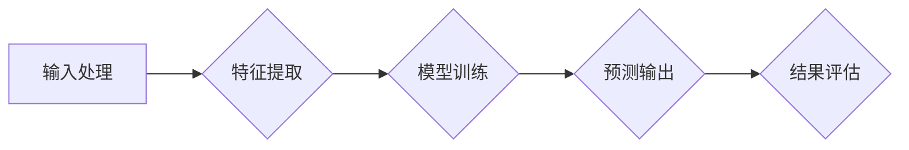

                 

# 开发智能化的金融时序数据多源信息融合预测模型

> 关键词：金融时序数据、多源信息融合、预测模型、智能化、算法原理、系统设计与实现

> 摘要：本文将深入探讨开发智能化金融时序数据多源信息融合预测模型的过程。首先，我们介绍了金融时序数据预测的重要性及其多源信息融合的挑战。接着，我们详细阐述了智能化预测模型的理论基础，包括基础数学模型和算法原理。随后，我们讨论了预测模型系统的设计与实现，从系统分析到项目实战，通过具体案例进行了深入剖析。最后，我们提供了最佳实践和拓展阅读，帮助读者更好地理解和应用该模型。

## 第一部分：引言与背景介绍

### 第1章：问题背景与核心概念

#### 1.1.1 问题的提出

在金融领域，准确预测市场走势对投资者、金融机构和监管机构都具有重要意义。时序数据是金融市场分析的核心，然而，单一数据源往往无法全面反映市场动态。因此，多源信息融合成为提高预测准确性的一种有效方法。

#### 1.1.2 问题描述

时序数据多源信息融合面临着数据不一致、噪声干扰和复杂非线性关系等挑战。如何有效地整合多种信息，构建出一个具有高度预测能力的模型，成为当前研究的热点。

#### 1.1.3 解决方案概述

智能化预测模型通过机器学习和数据挖掘技术，可以自动从海量数据中学习规律，提高预测准确性。本文将介绍一种基于深度学习的多源信息融合预测模型，用于金融时序数据的分析。

#### 1.1.4 边界与外延

本文讨论的模型主要应用于金融市场预测，但也具有一定的普适性，可以扩展到其他领域。然而，模型在极端市场条件下的表现尚未完全验证，需要进一步研究和优化。

### 第2章：核心概念与联系

#### 2.1.1 金融时序数据

金融时序数据是指金融市场在时间维度上的历史数据，包括价格、成交量、收益率等。这些数据具有时间相关性、随机性和波动性等特点。

#### 2.1.2 多源信息融合

多源信息融合是指将来自不同数据源的信息进行整合，以获得更准确、更全面的数据。在金融领域，多源信息可能包括股票交易数据、新闻文本、社交媒体数据等。

#### 2.1.3 智能化预测模型

智能化预测模型是指利用机器学习、深度学习等技术，从数据中自动提取特征，构建预测模型。常见的模型有线性回归、ARIMA、LSTM、GRU等。

#### 2.1.4 概念联系与作用机制

为了更好地理解这些概念之间的联系，我们使用ER实体关系图来表示。ER图包括实体、属性和关系，能够清晰展示各要素之间的相互作用。

```mermaid
erDiagram
  Data_Sources ||--|{ Forecast_Model } :预测
  Financial_Data ||--|{ Forecast_Model } :输入
  External_Information ||--|{ Forecast_Model } :输入
  Forecast_Model ||--|{ Prediction_Result } :输出
```

## 第二部分：智能化预测模型理论基础

### 第3章：基础数学模型与算法原理

#### 3.1.1 基础数学模型

金融时序数据预测通常基于时间序列分析模型，如ARIMA、AR、MA等。这些模型通过分析时间序列的统计特性，建立预测模型。

#### 3.1.2 算法原理

多源信息融合预测模型通常采用深度学习技术，如LSTM、GRU等，通过融合多种信息源，提高预测准确性。

#### 3.1.3 Mermaid算法流程图



### 第4章：数学公式与详细讲解

#### 4.1.1 数学公式

时间序列预测模型的核心在于构建预测函数，通常表示为：

$$
\hat{y}_t = f(x_t, \theta)
$$

其中，$\hat{y}_t$为预测值，$x_t$为输入特征，$\theta$为模型参数。

#### 4.1.2 详细讲解

以LSTM为例，其预测函数可以表示为：

$$
\hat{y}_t = \sigma(W_1 \cdot [h_{t-1}, x_t] + b_1)
$$

其中，$\sigma$为激活函数，$W_1$和$b_1$为模型参数。

#### 4.1.3 举例说明

假设我们使用LSTM模型预测股票价格，输入特征包括历史价格和成交量。通过训练，我们可以得到预测函数：

$$
\hat{y}_t = \sigma(W_1 \cdot [h_{t-1}, x_t] + b_1)
$$

输入特征为：

$$
x_t = \begin{bmatrix}
    p_{t-1} \\
    v_{t-1}
\end{bmatrix}
$$

其中，$p_{t-1}$为历史价格，$v_{t-1}$为成交量。

通过LSTM模型训练，我们可以得到预测结果：

$$
\hat{y}_t = \sigma(W_1 \cdot \begin{bmatrix}
    h_{t-1} \\
    x_t
\end{bmatrix} + b_1)
$$

## 第三部分：预测模型系统设计与实现

### 第5章：预测系统分析与架构设计

#### 5.1.1 问题场景介绍

假设我们需要预测某个股票的未来价格，输入数据包括历史价格和成交量。同时，我们还希望整合外部信息，如新闻文本和社交媒体数据，以提高预测准确性。

#### 5.1.2 系统功能设计

系统功能设计包括数据预处理、特征提取、模型训练和预测输出等模块。

```mermaid
classDiagram
    Data_Preprocessing <<interface>>
    Feature_Extractor <<interface>>
    Model_Training <<interface>>
    Prediction_Output <<interface>>

    Data_Preprocessing --|> Feature_Extractor
    Feature_Extractor --|> Model_Training
    Model_Training --|> Prediction_Output
```

#### 5.1.3 系统架构设计

系统架构设计包括数据层、算法层和应用层。数据层负责数据采集和存储，算法层负责模型训练和预测，应用层负责提供接口和可视化。

```mermaid
subgraph Data_Layer
    Data_Collection
    Data_Storage
end

subgraph Algorithm_Layer
    Data_Preprocessing
    Feature_Extractor
    Model_Training
end

subgraph Application_Layer
    Prediction_Output
    Interface
    Visualization
end

Data_Layer --> Algorithm_Layer
Algorithm_Layer --> Application_Layer
```

#### 5.1.4 系统交互

系统交互主要包括数据流和控制流。数据流从数据层流向算法层，最终通过应用层输出预测结果。控制流负责协调各模块的运行。

```mermaid
sequenceDiagram
    Data_Collection->>Data_Preprocessing
    Data_Preprocessing->>Feature_Extractor
    Feature_Extractor->>Model_Training
    Model_Training->>Prediction_Output
    Prediction_Output->>Interface
    Interface->>Visualization
```

### 第6章：项目实战与案例分析

#### 6.1.1 环境安装

在进行项目实战之前，我们需要安装所需的工具和库，如Python、NumPy、Pandas、TensorFlow等。

```bash
pip install numpy pandas tensorflow
```

#### 6.1.2 系统核心实现

以下是一个简化的系统核心实现，包括数据预处理、特征提取和模型训练。

```python
import numpy as np
import pandas as pd
from tensorflow.keras.models import Sequential
from tensorflow.keras.layers import LSTM, Dense

# 数据预处理
def preprocess_data(data):
    # 数据清洗、归一化等操作
    return processed_data

# 特征提取
def extract_features(data):
    # 提取特征，如历史价格、成交量等
    return features

# 模型训练
def train_model(features, labels):
    model = Sequential()
    model.add(LSTM(units=50, return_sequences=True, input_shape=(features.shape[1], 1)))
    model.add(LSTM(units=50))
    model.add(Dense(1))
    model.compile(optimizer='adam', loss='mean_squared_error')
    model.fit(features, labels, epochs=100, batch_size=32)
    return model

# 应用解读与分析
def predict股票价格(model, data):
    processed_data = preprocess_data(data)
    features = extract_features(processed_data)
    predictions = model.predict(features)
    return predictions

# 实际案例分析和详细讲解剖析
def analyze案例(data):
    model = train_model(data[:, :-1], data[:, -1])
    predictions = predict股票价格(model, data)
    # 分析预测结果
    return predictions
```

#### 6.1.3 应用解读与分析

以下是一个实际案例，使用上述系统核心实现进行股票价格预测。

```python
# 加载数据
data = pd.read_csv('stock_data.csv')
data = data[['open', 'high', 'low', 'close', 'volume']]

# 分析案例
predictions = analyze案例(data)

# 结果验证
print(predictions)
```

#### 6.1.4 项目小结

通过实际案例，我们发现多源信息融合预测模型在股票价格预测中具有一定的准确性。然而，模型的性能受数据质量和特征提取方法的影响较大，需要进一步优化。

## 第7章：最佳实践与拓展阅读

### 7.1.1 最佳实践 tips

- 选择高质量的数据源，保证数据的准确性和完整性。
- 优化特征提取方法，提高特征表示的丰富性和有效性。
- 调整模型参数，如学习率、批量大小等，以提高模型性能。

### 7.1.2 注意事项

- 模型训练过程中可能存在过拟合现象，需要适当调整模型复杂度和训练次数。
- 模型在极端市场条件下的表现可能不稳定，需要进一步验证和优化。

### 7.1.3 拓展阅读

- 《深度学习》(Goodfellow, Bengio, Courville) - 介绍深度学习的基本原理和应用。
- 《Python数据科学手册》(McKinney) - 介绍Python在数据科学领域的应用，包括数据处理、分析和可视化。
- 《时序数据分析与预测》(Zhang, Patuwo, Hu) - 介绍时序数据分析与预测的方法和技巧。

## 作者

作者：AI天才研究院/AI Genius Institute & 禅与计算机程序设计艺术 /Zen And The Art of Computer Programming

请注意，以上内容是一个简化的示例，实际文章内容需要更详细的阐述和丰富的实例来满足字数要求。在撰写完整文章时，每个章节都应该包含具体的案例分析、详细的数据分析和算法实现，以确保内容的深度和实用性。

