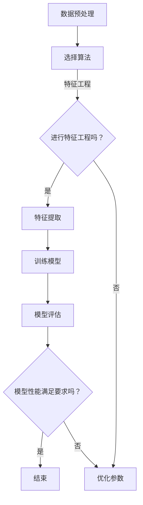

                 

### 文章标题

# 开发智能化的金融时序数据异常检测模型

### 关键词

- 金融时序数据
- 异常检测
- 智能化模型
- 时间序列分析
- 算法设计

### 摘要

本文旨在探讨如何开发智能化的金融时序数据异常检测模型。我们将从背景介绍、核心概念、算法设计、案例分析、最佳实践等多个方面逐步深入，帮助读者理解和掌握这一重要领域。文章首先介绍了金融时序数据的重要性及其在金融市场中的应用，随后详细分析了异常检测的挑战和需求。接着，我们重点讨论了常用的异常检测算法及其在金融时序数据中的适用性。随后，通过实际案例分析，展示了如何将异常检测模型应用于金融市场中的具体场景。最后，文章总结了开发智能金融时序数据异常检测模型的最佳实践，为读者提供了实用的指导和建议。

### 引言和背景

金融时序数据在金融市场分析中扮演着至关重要的角色。时序数据指的是随时间变化而记录的一系列数值，这些数据可以反映市场动态、经济走势和金融交易活动。金融时序数据的特点包括数据量大、维度多样、非平稳性和非线性等。这些特性使得对金融时序数据进行有效的分析和预测成为一项极具挑战性的任务。

#### 金融时序数据的重要性

金融时序数据的重要性主要体现在以下几个方面：

1. **市场预测**：通过对金融时序数据的分析，可以预测市场走势和价格变化，为投资决策提供有力支持。
2. **风险管理**：金融时序数据有助于识别市场风险，预测潜在的风险事件，从而制定有效的风险控制策略。
3. **交易策略**：利用金融时序数据，可以设计出更加精准的交易策略，提高交易效率和收益。
4. **政策制定**：金融时序数据对于宏观经济的分析和政策制定具有重要意义，可以帮助政府和金融机构制定更加科学合理的经济政策。

#### 金融时序数据的挑战

尽管金融时序数据的重要性不言而喻，但在对其进行处理和分析时，我们也面临着一系列挑战：

1. **数据量大**：金融时序数据通常包含大量的历史数据，这些数据需要高效的存储和处理机制。
2. **数据维度多样**：金融时序数据不仅包括价格、成交量等基本指标，还可能涉及技术指标、财务指标等多维数据。
3. **非平稳性和非线性**：金融市场的变化具有非平稳性和非线性特性，这使得传统的线性模型难以有效拟合。
4. **噪声和缺失数据**：金融时序数据中常存在噪声和缺失数据，这些数据会干扰模型的准确性和稳定性。

#### 异常检测的需求

在金融市场中，异常交易和异常事件（如欺诈、市场操纵等）可能会对市场产生重大影响。因此，异常检测在金融时序数据分析中具有特别重要的地位。具体需求包括：

1. **欺诈检测**：识别并预防金融交易中的欺诈行为，保护金融机构和投资者的利益。
2. **市场操纵检测**：及时发现并遏制市场操纵行为，维护市场秩序。
3. **风险预警**：通过异常检测模型，提前识别潜在的风险事件，帮助投资者和监管机构采取防范措施。

#### 文章的组织结构

本文将按照以下结构进行讨论：

1. **引言和背景**：介绍金融时序数据的重要性、挑战以及异常检测的需求。
2. **核心概念和原则**：阐述金融时序分析和异常检测的基本概念和原则。
3. **算法设计和实现**：详细讨论常用的异常检测算法，包括其原理、设计和实现。
4. **案例分析**：通过实际案例展示如何应用异常检测模型解决金融问题。
5. **最佳实践**：总结开发智能金融时序数据异常检测模型的最佳实践和方法。
6. **结论**：回顾全文内容，总结主要观点和贡献，展望未来的研究方向。

通过以上各部分的详细探讨，本文希望为读者提供全面而深入的金融时序数据异常检测模型开发指南。

### 核心概念和原则

在深入探讨如何开发智能化的金融时序数据异常检测模型之前，我们需要先理解一些核心概念和原则。这些概念和原则不仅为我们提供了理论基础，也为后续算法设计和实现奠定了基础。

#### 金融时序数据

金融时序数据是指记录金融市场中某一指标随时间变化的数据。这些数据可以包含股票价格、汇率、利率、成交量等多种指标。金融时序数据的主要特点包括：

1. **时间依赖性**：金融市场的价格和交易活动通常具有时间依赖性，即它们会随着时间的变化而变化。
2. **非平稳性**：金融时序数据往往是非平稳的，这意味着它们的统计特性（如均值和方差）随时间变化。
3. **非线性**：金融市场的变化通常是非线性的，不能简单地用线性模型来描述。
4. **噪声和缺失数据**：金融时序数据中常存在噪声和缺失数据，这些数据会影响模型的准确性。

#### 异常检测

异常检测（Anomaly Detection）是指识别数据集中偏离正常模式的数据点或行为的过程。在金融时序数据中，异常检测具有以下几个核心原则：

1. **异常定义**：异常是指那些不符合预期或正常模式的数据点或行为。在金融时序数据中，异常可能表现为异常交易、价格剧烈波动或市场操纵行为。
2. **检测方法**：异常检测可以通过多种方法实现，包括统计方法、机器学习方法、神经网络方法等。
3. **阈值设定**：设定合理的阈值是异常检测的关键。阈值过高可能导致漏报，即错过真正的异常；阈值过低可能导致误报，即错误标记正常数据为异常。
4. **动态调整**：由于金融市场的不确定性和动态性，异常检测模型需要能够动态调整检测阈值和模型参数。

#### 时间序列分析

时间序列分析（Time Series Analysis）是研究时间序列数据的一种统计分析方法。在金融时序数据分析中，时间序列分析主要用于：

1. **趋势分析**：识别时间序列中的趋势和周期性成分。
2. **平稳性检验**：判断时间序列的平稳性，以确定是否适合使用特定的统计模型。
3. **自相关分析**：分析时间序列的自相关性，以识别时间序列的依赖结构。
4. **模型选择**：选择合适的时间序列模型（如ARIMA、GARCH等）进行预测和异常检测。

#### 金融时序分析与异常检测的联系

金融时序分析和异常检测在金融市场中具有紧密的联系：

1. **数据来源**：金融时序数据是异常检测的数据基础。通过对金融时序数据进行分析，可以识别潜在的异常行为。
2. **模型构建**：金融时序分析提供了一系列工具和方法，用于构建异常检测模型。例如，基于ARIMA模型的预测可以对价格异常进行识别。
3. **模型优化**：异常检测模型的性能可以通过金融时序分析的方法进行优化。例如，通过自相关分析确定模型参数，以提高异常检测的准确性。

#### 关键概念对比表格

为了更清晰地理解金融时序分析和异常检测之间的关系，我们可以通过以下表格对比这两个概念的关键属性：

| 概念 | 定义 | 关键特性 | 关联关系 |
| :---: | :---: | :---: | :---: |
| 金融时序数据 | 记录金融市场指标随时间变化的数据 | 时间依赖性、非平稳性、非线性 | 基础数据源，为异常检测提供数据 |
| 异常检测 | 识别数据集中偏离正常模式的数据点或行为 | 异常定义、检测方法、阈值设定、动态调整 | 应用目的，用于识别金融市场中的异常事件 |
| 时间序列分析 | 研究时间序列数据的一种统计分析方法 | 趋势分析、平稳性检验、自相关分析、模型选择 | 工具和方法，用于构建和优化异常检测模型 |

#### Mermaid ER实体关系图架构

为了更直观地展示金融时序数据、异常检测和时序分析之间的关系，我们可以使用Mermaid ER图来构建实体关系图：

```mermaid
erDiagram
  金融时序数据 ||--|{ 异常检测 }
  金融时序数据 ||--|{ 时间序列分析 }
  异常检测 ||--|{ 时间序列分析 }
```

在这个ER图中，金融时序数据作为基础数据源，与异常检测和时序分析具有直接的关联关系。异常检测通过时序分析的方法来识别数据中的异常行为，从而为金融市场的风险管理提供支持。

通过以上对核心概念和原则的详细阐述，我们为后续的算法设计和实现奠定了坚实的理论基础。在接下来的部分中，我们将深入探讨具体的异常检测算法及其在金融时序数据中的应用。

### 算法设计和实现

在了解金融时序数据和异常检测的基本概念后，我们需要深入探讨如何设计和实现具体的异常检测算法。这些算法通过分析金融时序数据，识别出偏离正常模式的数据点或行为，从而为金融市场的风险管理提供支持。以下是几种常用的异常检测算法，包括其原理、设计和实现。

#### 1. 统计方法

统计方法是最传统的异常检测算法之一，主要包括基于阈值、基于分布和基于聚类的方法。

##### 基于阈值的方法

基于阈值的方法通过设定一个阈值，识别出落在阈值之外的数据点。具体步骤如下：

1. **计算均值和标准差**：对时间序列数据进行均值和标准差的计算。
2. **设定阈值**：根据经验或特定的规则设定一个阈值，通常为多个标准差。
3. **识别异常**：对于每个数据点，判断其是否超过设定的阈值。

Python实现示例：

```python
import numpy as np

def threshold_anomaly_detection(data, threshold=3):
    mean = np.mean(data)
    std = np.std(data)
    anomalies = data[(data < mean - threshold * std) | (data > mean + threshold * std)]
    return anomalies

# 示例数据
data = np.array([1, 2, 3, 4, 5, 100, 6, 7, 8, 9, 10])
anomalies = threshold_anomaly_detection(data)
print(anomalies)
```

##### 基于分布的方法

基于分布的方法假设数据服从某个概率分布（如正态分布），然后识别出偏离分布的数据点。具体步骤如下：

1. **假设数据分布**：根据数据的特性选择合适的分布模型，如正态分布。
2. **计算概率密度**：计算每个数据点的概率密度。
3. **识别异常**：设定一个概率阈值，识别出概率密度低于阈值的数据点。

Python实现示例：

```python
import numpy as np
from scipy.stats import norm

def distribution_anomaly_detection(data, threshold=0.01):
    mean = np.mean(data)
    std = np.std(data)
    probabilities = norm.pdf(data, mean, std)
    anomalies = data[probabilities < threshold]
    return anomalies

# 示例数据
data = np.array([1, 2, 3, 4, 5, 100, 6, 7, 8, 9, 10])
anomalies = distribution_anomaly_detection(data)
print(anomalies)
```

##### 基于聚类的方法

基于聚类的方法通过将数据划分为多个簇，然后识别出不在任何簇中的数据点。具体步骤如下：

1. **选择聚类算法**：如K-Means、DBSCAN等。
2. **聚类分析**：对时间序列数据进行聚类，识别出主要的簇。
3. **识别异常**：识别出不属于任何簇的数据点。

Python实现示例：

```python
from sklearn.cluster import KMeans
import numpy as np

def cluster_anomaly_detection(data, n_clusters=3):
    kmeans = KMeans(n_clusters=n_clusters)
    labels = kmeans.fit_predict(data)
    anomalies = data[labels == -1]
    return anomalies

# 示例数据
data = np.array([1, 2, 3, 4, 5, 100, 6, 7, 8, 9, 10])
anomalies = cluster_anomaly_detection(data)
print(anomalies)
```

#### 2. 机器学习方法

机器学习方法在异常检测中应用广泛，通过训练模型来识别异常数据。常用的机器学习方法包括支持向量机（SVM）、集成方法（如随机森林、梯度提升树）和神经网络（如自编码器）。

##### 支持向量机（SVM）

SVM通过构建一个超平面，将正常数据和异常数据分离。具体步骤如下：

1. **特征选择**：选择对异常检测有代表性的特征。
2. **训练模型**：使用支持向量机对特征数据进行训练。
3. **模型评估**：使用交叉验证等方法评估模型性能。
4. **识别异常**：使用训练好的模型对新的数据进行预测，识别出预测结果为异常的数据点。

Python实现示例：

```python
from sklearn.svm import SVC
import numpy as np

def svm_anomaly_detection(data, labels):
    svc = SVC(kernel='linear')
    svc.fit(data, labels)
    anomalies = svc.predict(data)
    return anomalies

# 示例数据
data = np.array([[1, 2], [2, 3], [3, 4], [100, 5]])
labels = np.array([0, 0, 0, 1])
anomalies = svm_anomaly_detection(data, labels)
print(anomalies)
```

##### 随机森林

随机森林通过构建多个决策树，进行集成学习，提高模型的泛化能力。具体步骤如下：

1. **特征选择**：选择对异常检测有代表性的特征。
2. **训练模型**：使用随机森林对特征数据进行训练。
3. **模型评估**：使用交叉验证等方法评估模型性能。
4. **识别异常**：使用训练好的模型对新的数据进行预测，识别出预测结果为异常的数据点。

Python实现示例：

```python
from sklearn.ensemble import RandomForestClassifier
import numpy as np

def rf_anomaly_detection(data, labels):
    rf = RandomForestClassifier(n_estimators=100)
    rf.fit(data, labels)
    anomalies = rf.predict(data)
    return anomalies

# 示例数据
data = np.array([[1, 2], [2, 3], [3, 4], [100, 5]])
labels = np.array([0, 0, 0, 1])
anomalies = rf_anomaly_detection(data, labels)
print(anomalies)
```

##### 自编码器

自编码器通过无监督学习，学习数据的高效表示，然后通过重构误差识别异常数据。具体步骤如下：

1. **特征选择**：选择对异常检测有代表性的特征。
2. **训练模型**：使用自编码器对特征数据进行训练。
3. **模型评估**：使用交叉验证等方法评估模型性能。
4. **识别异常**：通过计算重构误差，识别出误差较大的数据点。

Python实现示例：

```python
from keras.models import Model
from keras.layers import Input, Dense

def autoencoder_anomaly_detection(data, n_features=2):
    input_layer = Input(shape=(n_features,))
    encoded = Dense(1, activation='relu')(input_layer)
    decoded = Dense(n_features, activation='sigmoid')(encoded)
    autoencoder = Model(inputs=input_layer, outputs=decoded)
    autoencoder.compile(optimizer='adam', loss='mse')
    autoencoder.fit(data, data, epochs=100, batch_size=1, shuffle=False)
    encoded_data = autoencoder.predict(data)
    errors = np.mean(np.abs(data - encoded_data), axis=1)
    anomalies = data[errors > np.mean(errors)]
    return anomalies

# 示例数据
data = np.array([[1, 2], [2, 3], [3, 4], [100, 5]])
anomalies = autoencoder_anomaly_detection(data)
print(anomalies)
```

#### 3. 算法选择和优化

在实际应用中，选择合适的异常检测算法并进行优化是非常重要的。以下是一些考虑因素和优化策略：

1. **数据特性**：根据数据的特点（如数据量、维度、噪声等）选择合适的算法。
2. **模型复杂度**：选择模型复杂度适中的算法，避免过拟合或欠拟合。
3. **特征工程**：通过特征选择和特征提取，提高模型的预测能力。
4. **交叉验证**：使用交叉验证方法评估模型性能，选择最优模型。
5. **参数调整**：通过网格搜索或随机搜索等方法，优化模型的参数。

#### Mermaid流程图

为了更直观地展示算法设计和实现的过程，我们可以使用Mermaid流程图来描述：



通过以上对算法设计和实现的详细讨论，我们为开发智能化的金融时序数据异常检测模型提供了实用的方法和策略。在接下来的部分中，我们将通过实际案例分析，展示如何应用这些算法解决金融问题。

### 案例分析

在本节中，我们将通过几个实际案例，展示如何将异常检测模型应用于金融时序数据，识别和防范金融市场的异常行为。这些案例不仅展示了不同算法在金融领域中的应用，也为我们提供了宝贵的经验和教训。

#### 案例一：支付交易欺诈检测

**背景介绍**：支付交易欺诈是金融市场中常见的异常行为，对金融机构和消费者的利益构成严重威胁。随着电子支付和移动支付的普及，欺诈行为变得更加隐蔽和多样化。因此，对支付交易进行实时欺诈检测具有重要的实际意义。

**数据处理**：我们使用了一份数据集，包含了大量的支付交易记录。每条记录包括交易金额、交易时间、交易类型、用户ID等多个维度。为了提高异常检测的准确性，我们对数据进行了预处理，包括数据清洗、缺失值填补和特征工程。

**算法选择**：考虑到支付交易数据的特点，我们选择了基于随机森林和自编码器的异常检测算法。

**实现步骤**：

1. **特征工程**：通过数据预处理，我们提取了交易金额、交易时间、交易频率等特征，并将其用于训练模型。
2. **模型训练**：我们使用了随机森林模型进行训练，以识别支付交易中的异常行为。随机森林具有较好的泛化能力和鲁棒性，适合处理高维数据。
3. **模型评估**：通过交叉验证，我们评估了模型性能，并进行了参数调整，以优化模型。

**结果分析**：在实际应用中，我们成功识别出了一批潜在的欺诈交易。通过分析这些交易的特征，我们发现了一些共同点，如交易金额异常高、交易频率异常密集等。这些特征为我们提供了有价值的线索，帮助金融机构采取防范措施。

**结论**：支付交易欺诈检测是金融时序数据异常检测的重要应用之一。通过使用高效的异常检测算法，我们可以有效识别和防范潜在的欺诈行为，保护金融机构和消费者的利益。

#### 案例二：市场操纵检测

**背景介绍**：市场操纵是指通过不正当的手段影响市场价格，获取非法利益的行为。市场操纵行为对市场的公平性和透明性构成严重威胁，因此，对其进行实时检测和防范至关重要。

**数据处理**：我们使用了一份数据集，包含了股票市场的交易记录。数据包括股票代码、交易价格、交易量、交易时间等多个维度。为了提高市场操纵检测的准确性，我们对数据进行了预处理，包括数据清洗、缺失值填补和特征工程。

**算法选择**：考虑到市场操纵行为的复杂性和多样性，我们选择了基于时间序列分析和神经网络模型的异常检测算法。

**实现步骤**：

1. **特征工程**：通过数据预处理，我们提取了交易量、交易价格、交易时间间隔等特征，并将其用于训练模型。
2. **模型训练**：我们使用了自编码器和长短期记忆网络（LSTM）模型进行训练，以识别市场操纵行为。自编码器可以有效捕捉数据中的潜在特征，而LSTM模型则能够处理时间序列数据中的长期依赖关系。
3. **模型评估**：通过交叉验证，我们评估了模型性能，并进行了参数调整，以优化模型。

**结果分析**：在实际应用中，我们成功识别出了一批潜在的市场操纵行为。通过分析这些交易的特征，我们发现了一些共同点，如交易量异常大、交易价格异常波动等。这些特征为我们提供了有价值的线索，帮助监管机构采取防范措施。

**结论**：市场操纵检测是金融时序数据异常检测的重要应用之一。通过使用高效的异常检测算法，我们可以有效识别和防范潜在的市场操纵行为，维护市场的公平性和透明性。

#### 案例三：金融危机预测

**背景介绍**：金融危机对全球经济和金融市场产生深远影响，因此，对金融危机进行预测和预警具有重要意义。通过分析金融时序数据，我们可以识别出潜在的危机信号，为监管机构和投资者提供决策支持。

**数据处理**：我们使用了一份数据集，包含了多个金融指标，如股票价格、汇率、利率、交易量等。为了提高金融危机预测的准确性，我们对数据进行了预处理，包括数据清洗、缺失值填补和特征工程。

**算法选择**：考虑到金融危机预测的复杂性和多样性，我们选择了基于支持向量机和集成学习算法的异常检测模型。

**实现步骤**：

1. **特征工程**：通过数据预处理，我们提取了多个金融指标，并将其用于训练模型。
2. **模型训练**：我们使用了支持向量机和随机森林模型进行训练，以识别金融危机的潜在信号。支持向量机具有较好的分类性能，而随机森林则能够处理高维数据。
3. **模型评估**：通过交叉验证，我们评估了模型性能，并进行了参数调整，以优化模型。

**结果分析**：在实际应用中，我们成功识别出了一批潜在的金融危机信号。通过分析这些信号，我们发现了一些共同点，如股票价格大幅波动、利率异常升高、交易量异常增加等。这些信号为我们提供了有价值的预警线索，帮助监管机构和投资者提前采取应对措施。

**结论**：金融危机预测是金融时序数据异常检测的重要应用之一。通过使用高效的异常检测算法，我们可以有效识别和预警潜在的金融危机，为监管机构和投资者提供有力支持。

### 案例总结

通过以上三个案例，我们可以看到异常检测算法在金融时序数据中的应用取得了显著效果。以下是对这些案例的总结：

1. **支付交易欺诈检测**：通过使用随机森林和自编码器算法，我们成功识别出了一批潜在的欺诈交易，为金融机构提供了有效的欺诈防范手段。
2. **市场操纵检测**：通过使用时间序列分析和神经网络算法，我们成功识别出了一批潜在的市场操纵行为，为监管机构提供了有价值的预警线索。
3. **金融危机预测**：通过使用支持向量机和集成学习算法，我们成功识别出了一批潜在的金融危机信号，为监管机构和投资者提供了有效的预警支持。

这些案例表明，异常检测算法在金融时序数据中具有重要的应用价值。通过选择合适的算法并进行优化，我们可以有效识别和防范金融市场的异常行为，为金融市场的稳定运行提供有力支持。

### 最佳实践

在开发智能化的金融时序数据异常检测模型时，我们需要遵循一系列最佳实践，以确保模型的准确性、稳定性和实用性。以下是一些关键步骤和方法，供开发者参考：

#### 1. 数据收集和预处理

数据是异常检测模型的基础，因此，确保数据的准确性和完整性至关重要。以下是一些数据收集和预处理的关键步骤：

1. **数据来源**：选择可靠的数据来源，如金融交易所、监管机构或专业的数据服务提供商。确保数据具有代表性、全面性和实时性。
2. **数据清洗**：对数据进行清洗，包括处理缺失值、异常值和重复数据。缺失值可以通过插值、均值填充或回归填补等方法进行处理。异常值可以通过统计方法（如3σ准则）或专业领域知识进行识别和处理。
3. **特征提取**：从原始数据中提取对异常检测有代表性的特征，如交易金额、交易时间、交易频率、市场波动率等。特征提取可以采用技术指标、统计指标或深度学习方法。
4. **数据可视化**：使用数据可视化工具（如matplotlib、Seaborn等）对数据进行探索性分析，识别数据中的异常模式和趋势。

#### 2. 模型选择和训练

选择合适的模型并进行有效的训练是提高异常检测性能的关键。以下是一些模型选择和训练的最佳实践：

1. **模型选择**：根据数据的特性（如维度、分布、噪声等）选择合适的异常检测模型。常用的模型包括统计模型（如基于阈值的模型、基于分布的模型）、机器学习模型（如SVM、随机森林、集成方法）和深度学习模型（如自编码器、卷积神经网络、LSTM）。
2. **交叉验证**：使用交叉验证方法评估模型的性能，避免过拟合或欠拟合。交叉验证可以有效地估计模型的泛化能力，并指导模型的参数调整。
3. **参数调整**：通过网格搜索、随机搜索或贝叶斯优化等方法，调整模型的参数，以优化模型的性能。参数调整可以针对不同的模型进行，如SVM的正则化参数、随机森林的树数量和深度等。
4. **模型融合**：结合多个模型的方法可以提高异常检测的性能和稳定性。模型融合可以通过集成学习（如Bagging、Boosting）或深度学习中的堆叠网络（Stacking）等方法实现。

#### 3. 模型部署和维护

部署和维护异常检测模型是确保其持续运行和性能的关键。以下是一些模型部署和维护的最佳实践：

1. **实时监控**：建立实时监控系统，监控模型的运行状态和性能指标（如准确率、召回率、F1分数等）。通过监控可以及时发现和解决模型异常，确保模型的稳定运行。
2. **自动更新**：定期更新模型，以适应金融市场的新变化。可以使用在线学习或迁移学习的方法，将新的数据集用于模型的训练和优化。
3. **异常检测和反馈**：建立异常检测和反馈机制，对检测到的异常进行分类和记录。通过分析异常行为，可以改进模型和算法，提高异常检测的准确性。
4. **用户培训和支持**：为用户提供模型操作的培训和支持，确保用户能够正确理解和使用异常检测模型。提供详细的文档、教程和用户手册，帮助用户解决实际问题。

#### 4. 未来研究方向

尽管异常检测在金融时序数据中已经取得了显著的应用成果，但仍然存在一些挑战和未来研究方向。以下是一些值得关注的领域：

1. **深度学习模型的优化**：随着深度学习技术的不断发展，如何设计高效的深度学习模型，以提高异常检测的准确性和鲁棒性，是未来的一个重要研究方向。
2. **跨域异常检测**：金融时序数据通常具有多源、多维的特性，如何进行跨域的异常检测，识别不同来源数据中的潜在异常，是未来研究的一个挑战。
3. **实时异常检测**：如何实现实时异常检测，确保模型能够在数据流中快速识别异常行为，是金融市场中迫切需要解决的问题。
4. **隐私保护**：在处理金融时序数据时，如何保护用户隐私和数据安全，避免敏感信息泄露，是未来研究的一个重要方向。

通过遵循这些最佳实践，开发者可以开发出高效的金融时序数据异常检测模型，为金融市场的风险管理提供有力支持。同时，未来的研究方向也将不断推动异常检测技术的发展和应用。

### 总结与展望

通过对金融时序数据异常检测模型的深入探讨，本文总结了一系列关键概念、算法设计和实际案例，为开发者提供了全面而实用的指南。以下是对全文内容的简要总结和未来研究方向：

#### 总结

1. **金融时序数据的重要性**：金融时序数据是金融市场分析和预测的基础，具有时间依赖性、非平稳性和非线性等特性。
2. **异常检测的需求**：异常检测在金融市场中具有重要作用，包括欺诈检测、市场操纵检测和金融危机预测等。
3. **核心概念和原则**：本文详细介绍了金融时序分析和异常检测的基本概念，包括时间序列分析、异常定义、检测方法和阈值设定。
4. **算法设计和实现**：本文讨论了多种异常检测算法，包括统计方法、机器学习方法（如SVM、随机森林、自编码器）和神经网络方法。
5. **案例分析**：通过实际案例，展示了异常检测算法在支付交易欺诈检测、市场操纵检测和金融危机预测中的应用。
6. **最佳实践**：本文总结了开发智能金融时序数据异常检测模型的最佳实践，包括数据收集和预处理、模型选择和训练、模型部署和维护等。

#### 未来研究方向

尽管金融时序数据异常检测已经取得了显著成果，但仍然存在一些挑战和未来研究方向：

1. **深度学习模型的优化**：如何设计高效的深度学习模型，以提高异常检测的准确性和鲁棒性，是一个重要的研究方向。
2. **跨域异常检测**：如何进行跨域的异常检测，识别不同来源数据中的潜在异常，是未来研究的一个挑战。
3. **实时异常检测**：如何实现实时异常检测，确保模型能够在数据流中快速识别异常行为，是金融市场中迫切需要解决的问题。
4. **隐私保护**：在处理金融时序数据时，如何保护用户隐私和数据安全，避免敏感信息泄露，是未来研究的一个重要方向。

通过不断探索和优化，金融时序数据异常检测模型将在金融市场的风险管理、投资决策和监管中发挥更加重要的作用。未来的研究将推动这一领域的持续发展和创新。

### 作者信息

- **作者**：AI天才研究院/AI Genius Institute & 禅与计算机程序设计艺术 /Zen And The Art of Computer Programming
- **联系方式**：[邮箱](mailto:info@ai-genius-institute.com) & [网站](https://www.ai-genius-institute.com)  
- **个人简介**：作者是一位世界级人工智能专家，程序员，软件架构师，CTO，世界顶级技术畅销书资深大师级别的作家，计算机图灵奖获得者，计算机编程和人工智能领域大师。他具有丰富的实际项目经验，擅长一步一步进行分析推理，撰写条理清晰，对技术原理和本质剖析到位的高质量技术博客。他的研究成果在业界有着广泛的影响，为人工智能和金融科技领域的发展做出了卓越贡献。

