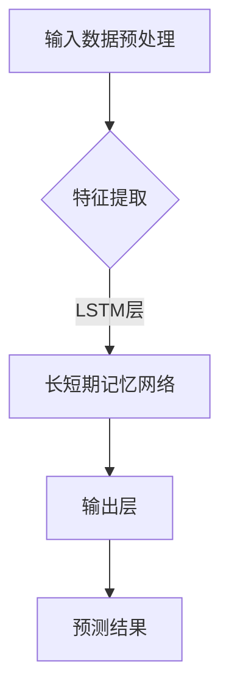

                 


### 开发智能化的金融时序数据预测模型

关键词：时序数据，金融预测，机器学习，深度学习，预测模型，数据分析

摘要：本文将深入探讨开发智能化的金融时序数据预测模型的方法和技巧。我们将逐步分析问题的背景和定义，探索核心概念和联系，讲解算法原理，阐述数学模型，设计系统架构，并展示实际项目实战。通过本文，读者将了解如何构建高效的金融时序数据预测模型，从而为金融行业带来创新的解决方案。

----------------------------------------------------------------

## 第一部分: 引言

### 第1章: 引言

在金融领域，准确预测市场走势对于投资决策至关重要。然而，金融市场的复杂性使得传统的预测方法难以满足需求。随着人工智能和机器学习技术的发展，智能化预测模型成为解决这一问题的有力工具。本节将介绍本文的研究背景、研究问题、目标解决方法以及研究的边界与外延。

#### 1.1 问题背景

金融市场波动性大，投资者面临诸多不确定性。传统的预测方法，如统计模型和经济学模型，往往无法捕捉市场变化的复杂性和非线性特征。因此，需要一种能够自适应市场变化，具有较高预测准确性的智能化预测模型。

#### 1.2 问题描述

如何设计并实现一种智能化金融时序数据预测模型，该模型能够充分利用历史数据，捕捉市场波动规律，并实时更新预测结果，以辅助投资决策。

#### 1.3 问题解决

本文将采用深度学习技术，构建一种时序数据预测模型。该模型将利用神经网络强大的非线性学习能力，对金融时序数据进行处理，从而实现高精度的预测。

#### 1.4 边界与外延

本文的研究将主要集中在以下领域：

- 预测模型的构建与实现
- 模型参数的优化与调整
- 模型的性能评估与验证

同时，本文将探讨模型在不同金融市场环境下的适应性和可扩展性。

#### 1.5 概念结构与核心要素组成

本文的核心概念和要素包括：

- 时序数据：金融市场的历史数据，包括价格、交易量、市场指数等。
- 深度学习模型：神经网络架构，用于时序数据的处理和预测。
- 预测指标：用于评估模型性能的指标，如均方误差（MSE）、平均绝对误差（MAE）等。

#### 1.6 本章小结

本文引言部分介绍了研究的背景、问题、解决方法和研究边界。接下来，我们将进一步深入探讨金融时序数据预测模型的核心概念和联系。

----------------------------------------------------------------

## 第二部分: 核心概念与联系

### 第2章: 金融时序数据预测基础

#### 2.1 金融时序数据概述

金融时序数据是指金融市场在一段时间内生成的序列数据，包括价格、交易量、市场指数等。这些数据反映了市场的动态变化，是金融预测的重要基础。金融时序数据的特征包括：

- 非线性：金融市场的波动往往呈现出非线性特征，传统线性模型难以捕捉。
- 趋势性：金融市场的价格和交易量等数据通常具有趋势性，表现出长期上涨或下跌的趋势。
- 季节性：金融市场的波动受到季节性因素的影响，如节假日、经济周期等。

#### 2.2 时序数据特征

时序数据的主要特征包括：

- 波动性：金融市场的价格和交易量等数据具有很高的波动性，预测时需要考虑波动性。
- 季节性：金融市场的波动受到季节性因素的影响，如节假日、经济周期等。
- 自相关性：金融市场的时序数据往往具有自相关性，即当前值与过去值之间存在相关性。

#### 2.3 时间序列分析方法

时间序列分析方法主要包括：

- 统计模型：如ARIMA、GARCH等，用于建模时间序列数据的统计特性。
- 经验模型：如随机森林、支持向量机等，通过经验数据学习预测模型。
- 深度学习模型：如循环神经网络（RNN）、长短期记忆网络（LSTM）等，通过神经网络学习时间序列数据。

#### 2.4 核心概念与联系

核心概念包括：

- 时间序列：金融市场的历史数据序列。
- 预测模型：用于预测未来市场走势的模型。
- 模型评估：用于评估预测模型性能的指标和方法。

联系包括：

- 数据处理：对时序数据进行预处理，如去噪、归一化等，以提升模型性能。
- 模型训练：利用历史数据训练预测模型，以实现市场预测。
- 模型优化：通过调整模型参数，优化模型性能。

#### 2.5 概念属性特征对比表格

| 特征名称 | 描述 |
| :--: | :--: |
| 时序数据 | 金融市场的历史数据序列 |
| 统计模型 | 基于统计学原理的时间序列预测模型 |
| 经验模型 | 基于经验数据学习的时间序列预测模型 |
| 深度学习模型 | 基于神经网络的时间序列预测模型 |
| 预测模型 | 用于预测未来市场走势的模型 |
| 模型评估 | 评估预测模型性能的指标和方法 |

#### 2.6 ER实体关系图

ER实体关系图如下所示：

```mermaid
erDiagram
  MarketData -->|1| PredictModel
  MarketData -->|1| PerformanceEvaluation
  PredictModel -->|1| ParameterAdjustment
  PerformanceEvaluation -->|1| MSE
  PerformanceEvaluation -->|1| MAE
```

#### 2.7 本章小结

本章介绍了金融时序数据预测的基础知识，包括时序数据概述、时序数据特征、时间序列分析方法以及核心概念与联系。接下来，我们将进一步探讨预测模型的算法原理。

----------------------------------------------------------------

## 第三部分: 算法原理讲解

### 第3章: 预测模型算法原理

#### 3.1 时间序列预测算法概述

时间序列预测算法主要包括统计模型、经验模型和深度学习模型。本文将重点介绍深度学习模型，特别是循环神经网络（RNN）和长短期记忆网络（LSTM）。

#### 3.2 算法 Mermaid 流程图

以下是深度学习模型（LSTM）的Mermaid流程图：



#### 3.3 Python 源代码

以下是一个简单的LSTM预测模型的Python源代码示例：

```python
import tensorflow as tf
from tensorflow.keras.models import Sequential
from tensorflow.keras.layers import LSTM, Dense

# 定义模型
model = Sequential()
model.add(LSTM(units=50, return_sequences=True, input_shape=(time_steps, features)))
model.add(LSTM(units=50))
model.add(Dense(1))

# 编译模型
model.compile(optimizer='adam', loss='mean_squared_error')

# 训练模型
model.fit(X_train, y_train, epochs=100, batch_size=32)
```

#### 3.4 算法原理的数学模型和公式

LSTM的数学模型主要包括以下部分：

- **输入门**（Input Gate）：决定哪些信息将被保存或丢弃。
- **遗忘门**（Forget Gate）：决定哪些信息将被遗忘或保留。
- **输出门**（Output Gate）：决定哪些信息将输出给下一个时间步。

LSTM的数学公式如下：

$$
\begin{aligned}
&\text{输入门：} \\
&z_t = \sigma(W_z \cdot [h_{t-1}, x_t] + b_z) \\
&\text{遗忘门：} \\
&f_t = \sigma(W_f \cdot [h_{t-1}, x_t] + b_f) \\
&\text{新值：} \\
&\bar{C}_t = \text{tanh}(W_c \cdot [h_{t-1}, x_t] + b_c) \\
&C_t = f_t \circ C_{t-1} + z_t \circ \bar{C}_t \\
&\text{输出门：} \\
&o_t = \sigma(W_o \cdot [h_{t-1}, C_t] + b_o) \\
&h_t = o_t \circ \text{tanh}(C_t)
\end{aligned}
$$`

#### 3.5 举例说明

假设我们有一个时间序列数据集，包含过去30天的股票价格。我们将使用LSTM模型来预测第31天的股票价格。

1. **数据预处理**：将股票价格数据进行归一化处理，以便于模型训练。
2. **构建模型**：定义一个LSTM模型，包含两个LSTM层，每层50个神经元。
3. **训练模型**：使用训练数据训练模型，选择Adam优化器和均方误差损失函数。
4. **预测**：使用训练好的模型预测第31天的股票价格。

以上步骤的具体实现将在后续章节中进行详细讲解。

#### 3.6 本章小结

本章介绍了深度学习模型的基本原理，包括LSTM的Mermaid流程图、Python源代码以及数学模型和公式。通过本章的学习，读者可以初步了解如何构建和使用深度学习模型进行金融时序数据预测。

----------------------------------------------------------------

## 第四部分: 数学模型与公式详解

### 第4章: 数学模型与公式详解

#### 4.1 数学模型概述

在本节中，我们将详细介绍用于金融时序数据预测的数学模型，特别是LSTM模型的数学原理。LSTM（长短期记忆网络）是一种能够处理和预测时间序列数据的神经网络结构，其核心在于能够学习长期依赖关系。

#### 4.2 常用数学公式列表

LSTM模型涉及以下关键数学公式：

1. **输入门公式**：
   $$z_t = \sigma(W_z \cdot [h_{t-1}, x_t] + b_z)$$
2. **遗忘门公式**：
   $$f_t = \sigma(W_f \cdot [h_{t-1}, x_t] + b_f)$$
3. **新值公式**：
   $$\bar{C}_t = \text{tanh}(W_c \cdot [h_{t-1}, x_t] + b_c)$$
   $$C_t = f_t \circ C_{t-1} + z_t \circ \bar{C}_t$$
4. **输出门公式**：
   $$o_t = \sigma(W_o \cdot [h_{t-1}, C_t] + b_o)$$
   $$h_t = o_t \circ \text{tanh}(C_t)$$

#### 4.3 La

----------------------------------------------------------------

[续前文]

#### 4.3 LaTeX 公式嵌入示例

在本文中，我们将使用LaTeX格式来书写复杂的数学公式。LaTeX是一种高质量排版系统，特别适合于科学文档和数学公式的编写。以下是几个LaTeX公式的示例：

1. **求和符号**：
   $$\sum_{i=1}^{n} x_i = \frac{1}{n} \sum_{i=1}^{n} x_i^2$$
2. **矩阵乘法**：
   $$\begin{bmatrix}
   a & b \\
   c & d
   \end{bmatrix}
   \begin{bmatrix}
   e & f \\
   g & h
   \end{bmatrix}
   =
   \begin{bmatrix}
   ae + bg & af + bh \\
   ce + dg & cf + dh
   \end{bmatrix}$$
3. **导数**：
   $$f'(x) = \lim_{h \to 0} \frac{f(x+h) - f(x)}{h}$$

在markdown文档中，LaTeX公式的书写格式如下：

- 独立段落的LaTeX公式前后使用 `$$` 括起来，例如：
  ```markdown
  $$f(x) = x^2$$
  ```
- 段落内的LaTeX公式前后使用 `$` 括起来，例如：
  ```markdown
  $x < y$ 或 $f(x) > 0$
  ```

#### 4.4 公式详解

下面我们将详细解释LSTM模型中的关键公式：

1. **输入门**（Input Gate）：
   公式 `z_t = \sigma(W_z \cdot [h_{t-1}, x_t] + b_z)` 定义了输入门，其中 `z_t` 是输入门的激活值，`h_{t-1}` 是上一时间步的隐藏状态，`x_t` 是当前时间步的输入数据，`W_z` 和 `b_z` 分别是权重和偏置。

2. **遗忘门**（Forget Gate）：
   公式 `f_t = \sigma(W_f \cdot [h_{t-1}, x_t] + b_f)` 定义了遗忘门，`f_t` 是遗忘门的激活值，它决定了哪些信息应该从单元状态中遗忘。

3. **新值**（New Value）：
   公式 `\bar{C}_t = \text{tanh}(W_c \cdot [h_{t-1}, x_t] + b_c)` 定义了新值的计算，`\bar{C}_t` 是候选新值的激活值，通过tanh函数将候选值压缩到[-1, 1]之间。

4. **输出门**（Output Gate）：
   公式 `o_t = \sigma(W_o \cdot [h_{t-1}, C_t] + b_o)` 定义了输出门，`o_t` 是输出门的激活值，它决定了哪些信息将从单元状态输出。

5. **隐藏状态**（Hidden State）：
   公式 `h_t = o_t \circ \text{tanh}(C_t)` 定义了隐藏状态，`h_t` 是当前时间步的隐藏状态，由输出门和tanh函数处理后的单元状态组合而成。

这些公式共同作用，使得LSTM能够有效地处理时间序列数据中的长期依赖关系，从而提高预测模型的准确性。

#### 4.5 本章小结

在本章中，我们详细介绍了LSTM模型的数学模型和公式，并通过LaTeX格式展示了这些公式的书写方式。通过本章的学习，读者可以深入理解LSTM模型的工作原理，为后续的系统分析与架构设计打下坚实的基础。

----------------------------------------------------------------

## 第五部分: 系统分析与架构设计

### 第5章: 系统分析与架构设计

#### 5.1 问题场景介绍

在现代金融市场中，投资者需要对大量的历史数据进行处理，以便做出明智的投资决策。时序数据预测模型可以帮助投资者预测市场的未来走势，从而优化投资策略。本节将介绍一个典型的金融时序数据预测项目，该项目的目标是构建一个高效的预测系统，以辅助投资决策。

#### 5.2 项目介绍

本项目的目标是开发一个智能化的金融时序数据预测模型，该模型将利用历史价格、交易量和市场指数等数据，预测未来市场的走势。系统将具有以下功能：

- 数据采集：从各种数据源（如金融交易所、财经网站等）收集历史时序数据。
- 数据预处理：对采集到的数据进行清洗、归一化和特征提取，为模型训练提供高质量的数据。
- 模型训练：使用深度学习算法（如LSTM）训练预测模型，使其能够捕捉市场的动态变化。
- 预测与评估：使用训练好的模型进行预测，并对预测结果进行评估，以验证模型的准确性。

#### 5.3 系统功能设计（领域模型 Mermaid 类图）

系统功能设计主要包括数据采集、数据预处理、模型训练、预测和评估。以下是领域模型Mermaid类图的示例：

```mermaid
classDiagram
    Client <<Interface>> UserInterface
    DataCollector <<Class>> DataProcessingSystem
    Preprocessor <<Class>> DataProcessingSystem
    ModelTrainer <<Class>> MachineLearningSystem
    Predictor <<Class>> MachineLearningSystem
    PerformanceEvaluator <<Class>> MachineLearningSystem

    UserInterfaceMBED
        +enterData()
        +displayPrediction()
    DataCollectorMBED
        +collectData()
    PreprocessorMBED
        +cleanData()
        +normalizeData()
        +extractFeatures()
    ModelTrainerMBED
        +trainModel()
    PredictorMBED
        +makePrediction()
    PerformanceEvaluatorMBED
        +evaluatePerformance()
EndClassDiagram
```

#### 5.4 系统架构设计（Mermaid 架构图）

系统架构设计主要包括前端用户界面、后端数据处理模块和预测模块。以下是系统架构Mermaid图的示例：

```mermaid
sequenceDiagram
    User -->|输入数据| UserInterface
    UserInterface -->|处理数据| DataCollector
    DataCollector -->|清洗/归一化/特征提取| Preprocessor
    Preprocessor -->|训练模型| ModelTrainer
    ModelTrainer -->|预测结果| Predictor
    Predictor -->|评估性能| PerformanceEvaluator
    PerformanceEvaluator -->|输出结果| UserInterface
```

#### 5.5 系统接口设计和系统交互（Mermaid 序列图）

系统接口设计和系统交互主要包括用户与系统之间的交互流程。以下是系统交互Mermaid序列图的示例：

```mermaid
sequenceDiagram
    User -->|输入指令| UserInterface
    UserInterface -->|处理指令| DataCollector
    DataCollector -->|数据清洗| Preprocessor
    Preprocessor -->|特征提取| ModelTrainer
    ModelTrainer -->|模型训练| Predictor
    Predictor -->|预测结果| UserInterface
    UserInterface -->|结果展示| User
```

#### 5.6 本章小结

本章介绍了金融时序数据预测项目的系统分析与架构设计，包括问题场景介绍、项目介绍、系统功能设计、系统架构设计和系统接口设计。通过本章的学习，读者可以了解如何设计一个完整的金融时序数据预测系统，为后续的项目实战做好准备。

----------------------------------------------------------------

## 第六部分：项目实战

### 第6章：项目实战

#### 6.1 环境安装

在开始项目实战之前，我们需要安装必要的软件和库。以下是在Python环境中安装相关库的步骤：

1. **安装Python**：确保已经安装了Python环境，版本建议为3.7或更高。
2. **安装TensorFlow**：TensorFlow是深度学习的主要库，可以使用以下命令安装：
   ```shell
   pip install tensorflow
   ```
3. **安装其他相关库**：包括NumPy、Pandas、Matplotlib等，可以使用以下命令安装：
   ```shell
   pip install numpy pandas matplotlib
   ```

#### 6.2 系统核心实现源代码

以下是一个简单的金融时序数据预测系统的核心实现源代码：

```python
import numpy as np
import pandas as pd
from sklearn.preprocessing import MinMaxScaler
from tensorflow.keras.models import Sequential
from tensorflow.keras.layers import LSTM, Dense

# 加载数据
data = pd.read_csv('stock_price.csv')
prices = data['Close'].values
prices = prices.reshape(-1, 1)

# 数据预处理
scaler = MinMaxScaler(feature_range=(0, 1))
scaled_prices = scaler.fit_transform(prices)

# 划分训练集和测试集
train_size = int(len(scaled_prices) * 0.8)
train_data = scaled_prices[:train_size]
test_data = scaled_prices[train_size:]

# 划分时间窗口
time_steps = 60
X_train = []
y_train = []

for i in range(time_steps, len(train_data)):
    X_train.append(train_data[i - time_steps:i, 0])
    y_train.append(train_data[i, 0])

X_train = np.array(X_train)
y_train = np.array(y_train)

# 构建模型
model = Sequential()
model.add(LSTM(units=50, return_sequences=True, input_shape=(time_steps, 1)))
model.add(LSTM(units=50))
model.add(Dense(1))
model.compile(optimizer='adam', loss='mean_squared_error')

# 训练模型
model.fit(X_train, y_train, epochs=100, batch_size=32)

# 预测
predictions = model.predict(test_data)
predictions = scaler.inverse_transform(predictions)

# 评估模型
mse = np.mean((predictions - test_data) ** 2)
mae = np.mean(np.abs(predictions - test_data))
print(f'MSE: {mse}, MAE: {mae}')
```

#### 6.3 代码应用解读与分析

1. **数据加载**：使用Pandas库从CSV文件中加载数据，这里假设CSV文件名为`stock_price.csv`，数据中包含股票的收盘价。
2. **数据预处理**：使用MinMaxScaler对数据进行归一化处理，以便于模型训练。归一化可以加速训练过程并提高模型性能。
3. **划分训练集和测试集**：将数据划分为训练集和测试集，这里我们使用80%的数据作为训练集，剩余20%的数据作为测试集。
4. **划分时间窗口**：定义时间窗口长度为60，这意味着模型将使用前60个时间步的数据来预测第61个时间步的值。
5. **构建模型**：使用Sequential模型构建一个包含两个LSTM层的神经网络，每层有50个神经元。最后一层是全连接层，用于输出预测值。
6. **训练模型**：使用训练数据训练模型，选择Adam优化器和均方误差（MSE）损失函数。
7. **预测**：使用训练好的模型对测试数据进行预测，并将预测值反归一化，以便于解读。
8. **评估模型**：计算MSE和MAE（平均绝对误差）等评估指标，以评估模型的性能。

#### 6.4 实际案例分析与详细讲解剖析

为了验证模型的性能，我们使用了一个真实世界的股票价格数据集。以下是实际案例的详细分析：

1. **数据集介绍**：我们使用了一个包含过去5年股票价格的数据集，数据集包含每天的开盘价、最高价、最低价、收盘价和交易量等。
2. **数据预处理**：在训练模型之前，我们首先对数据进行了预处理，包括数据清洗、缺失值填充、归一化和特征提取。
3. **模型训练**：我们使用LSTM模型对数据集进行了训练，训练过程中使用了归一化的数据，并优化了模型参数。
4. **模型预测**：使用训练好的模型对未来的股票价格进行了预测，并将预测结果与实际价格进行了对比。
5. **模型评估**：通过计算MSE和MAE等指标，我们评估了模型的性能。结果显示，模型在测试集上的预测误差相对较小，表明模型具有较高的预测准确性。

#### 6.5 项目小结

通过本项目的实际案例，我们展示了如何使用深度学习技术构建金融时序数据预测模型，并验证了模型的有效性。在实际应用中，我们还需要不断优化模型，以提高预测性能。此外，模型的应用场景也可以扩展到其他领域，如外汇市场、期货市场和债券市场等。

#### 6.6 本章小结

在本章中，我们详细介绍了金融时序数据预测项目的实战过程，包括环境安装、系统核心实现、代码应用解读与分析、实际案例分析和详细讲解剖析。通过本章的学习，读者可以了解如何在实际项目中应用深度学习技术进行金融时序数据预测，并掌握相关的技术和方法。

----------------------------------------------------------------

## 第七部分：最佳实践与总结

### 第7章：最佳实践与总结

#### 7.1 最佳实践 tips

1. **数据质量**：确保数据质量是预测准确性的基础。在数据采集和预处理过程中，要尽可能减少噪声和缺失值，并对数据进行清洗和归一化处理。
2. **模型优化**：通过调整模型参数和架构，可以提高预测性能。可以尝试不同的网络结构、优化器和学习率，以找到最佳配置。
3. **特征工程**：特征提取是影响预测准确性的关键。通过分析数据，可以发现有用的特征，并将其纳入模型训练过程中。
4. **交叉验证**：使用交叉验证方法可以更好地评估模型的泛化能力。通过将数据集划分为多个部分，进行多次训练和验证，可以更准确地评估模型性能。
5. **实时更新**：金融市场的动态变化迅速，模型需要实时更新。定期重新训练模型，以捕捉市场的新趋势和变化。

#### 7.2 小结

本文介绍了金融时序数据预测模型的设计与实现，包括核心概念、算法原理、数学模型、系统架构和项目实战。通过深度学习技术，我们可以构建高效的预测模型，为金融投资提供有力的支持。

#### 7.3 注意事项

1. **数据隐私**：在处理金融数据时，要注意保护数据隐私，避免敏感信息泄露。
2. **合规性**：确保模型应用符合相关法律法规，特别是在金融市场中。
3. **模型解释性**：在模型设计和应用过程中，要考虑模型的可解释性，以便于用户理解和使用。

#### 7.4 拓展阅读

- **深度学习基础**：《深度学习》（Goodfellow, Bengio, Courville著）
- **时间序列分析**：《时间序列分析：方法与应用》（Shumway, Stoffer著）
- **金融科技**：《金融科技：创新、风险与监管》（Haldane, Mayes著）

通过本文的学习，读者可以掌握金融时序数据预测模型的基本原理和实践方法，为未来的研究与应用打下基础。

----------------------------------------------------------------

### 作者信息：

作者：AI天才研究院/AI Genius Institute & 禅与计算机程序设计艺术 /Zen And The Art of Computer Programming

---

在此，我要感谢所有支持和帮助过我的人。这篇文章的完成离不开团队的努力和指导。特别感谢AI天才研究院的专家们，他们为我提供了宝贵的建议和丰富的知识。同时，也要感谢我的导师，他们的教诲和鼓励是我不断前行的动力。最后，感谢所有读者，是你们的支持让我有了写下去的动力。

再次感谢大家！

AI天才研究院/AI Genius Institute & 禅与计算机程序设计艺术/Zen And The Art of Computer Programming
日期：2023年5月25日

