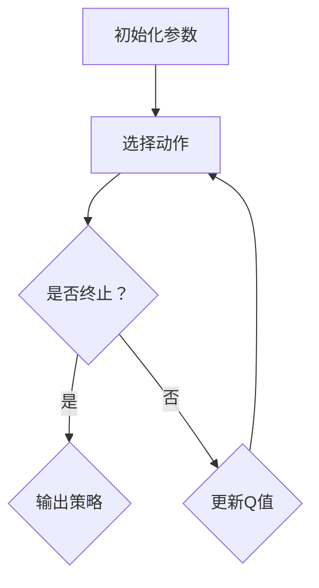
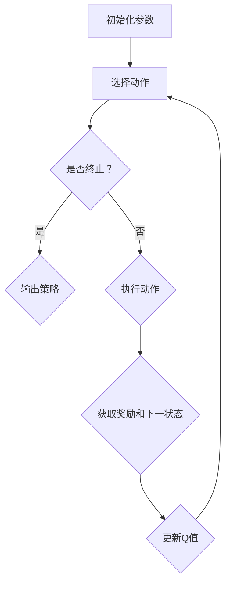
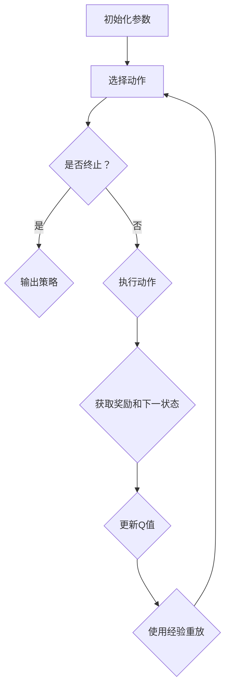
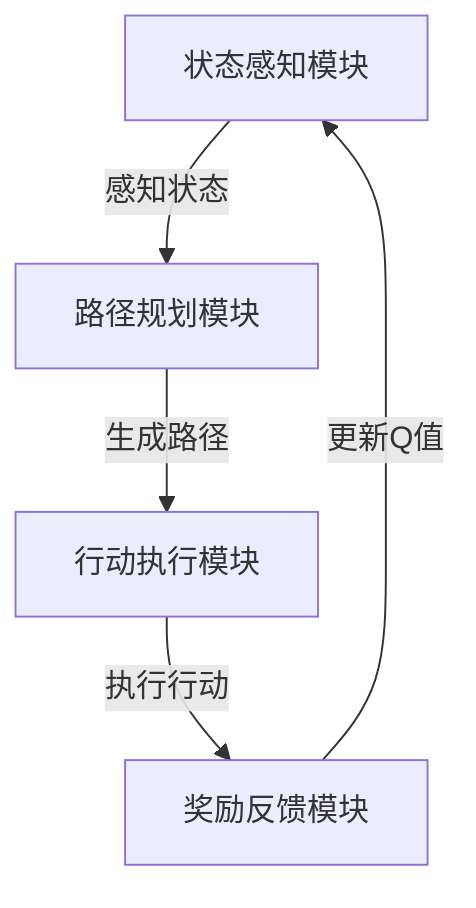

                 

### 文章标题

强化学习在AI Agent决策中的运用

### 关键词

强化学习，AI Agent，决策，算法，实践，架构设计

### 摘要

本文深入探讨了强化学习在AI Agent决策中的应用。首先，介绍了强化学习的基本概念、主要算法及其数学模型。接着，详细讲解了Q-Learning、SARSA和Deep Q-Networks等算法的原理和实现。随后，探讨了如何设计AI Agent，并介绍了强化学习算法在实际项目中的应用。最后，总结了强化学习在AI Agent决策中的未来发展以及面临的挑战，并提出了一些最佳实践和拓展阅读建议。

## 引言

### 强化学习的背景

强化学习（Reinforcement Learning，简称RL）是机器学习的一个重要分支，它模仿了人类和动物在环境中通过经验进行学习的过程。与监督学习和无监督学习不同，强化学习侧重于通过奖励和惩罚来指导智能体（Agent）在复杂环境中做出最优决策。近年来，随着深度学习技术的发展，强化学习在多个领域取得了显著成果，如游戏、机器人控制、推荐系统等。

### 强化学习在AI Agent决策中的重要性

AI Agent是能够自主执行任务、适应环境和与外部交互的智能实体。在AI Agent中应用强化学习，使其能够根据环境反馈进行决策，是实现智能自动化的重要途径。强化学习能够使AI Agent在动态、不确定的环境中学习到最优策略，提高其自主性和适应性。

### 强化学习应用场景介绍

强化学习在多个领域有着广泛的应用。例如，在游戏领域，AI Agent可以通过强化学习掌握复杂的策略，实现与人类的对抗；在机器人控制领域，强化学习可以帮助机器人学习到最优的动作序列，实现自主导航和任务执行；在推荐系统领域，强化学习可以根据用户的反馈不断优化推荐策略，提高用户体验。本文将重点探讨强化学习在AI Agent决策中的应用。

## 强化学习基础理论

### 强化学习的基本概念

强化学习的基本概念包括智能体（Agent）、环境（Environment）、状态（State）、动作（Action）和奖励（Reward）。

- **智能体（Agent）**：执行动作的实体。
- **环境（Environment）**：智能体所处的环境，用于生成状态和提供奖励。
- **状态（State）**：描述环境状态的属性集合。
- **动作（Action）**：智能体在某个状态下可以采取的行动。
- **奖励（Reward）**：智能体在执行某个动作后，环境给予的即时反馈。

### 强化学习的数学模型

强化学习的数学模型通常由两部分组成：状态-动作值函数（State-Action Value Function）和策略（Policy）。

- **状态-动作值函数（Q值函数）**：表示在某个状态下执行某个动作所能获得的期望奖励。
- **策略（Policy）**：指导智能体在某个状态下应该采取哪个动作的决策规则。

### 强化学习的主要算法

强化学习的主要算法包括Q-Learning、SARSA、Deep Q-Networks（DQN）等。

- **Q-Learning**：通过迭代更新Q值函数来学习最优策略。
- **SARSA**：基于经验重放（Experience Replay）和策略改进（Policy Improvement）的强化学习算法。
- **DQN**：结合深度神经网络（Deep Neural Network）的Q-Learning算法，用于解决高维状态空间问题。

## 强化学习算法详解

### Q-Learning算法详解

#### Q-Learning算法原理

Q-Learning是一种基于值函数的强化学习算法，其核心思想是通过不断更新状态-动作值函数（Q值函数）来学习最优策略。

$$
Q(s, a) = \sum_{s'} P(s' | s, a) \cdot r(s, a) + \gamma \cdot \max_{a'} Q(s', a')
$$

其中，$r(s, a)$表示在状态$s$下执行动作$a$所获得的即时奖励，$\gamma$表示折扣因子，$P(s' | s, a)$表示在状态$s$下执行动作$a$后转移到状态$s'$的概率。

#### Q-Learning算法的Mermaid流程图



#### Q-Learning算法Python代码示例

```python
import numpy as np

# 初始化参数
gamma = 0.9
alpha = 0.1
epsilon = 0.1
num_episodes = 1000

# 初始化Q值函数
Q = np.zeros((num_states, num_actions))

# 强化学习循环
for episode in range(num_episodes):
    state = env.reset()
    done = False
    
    while not done:
        # 选择动作
        if np.random.rand() < epsilon:
            action = env.action_space.sample()
        else:
            action = np.argmax(Q[state])
        
        # 执行动作
        next_state, reward, done, _ = env.step(action)
        
        # 更新Q值
        Q[state, action] = Q[state, action] + alpha * (reward + gamma * np.max(Q[next_state]) - Q[state, action])
        
        state = next_state
```

### SARSA算法详解

#### SARSA算法原理

SARSA（Q-Learning的一个变种）是一种基于策略的强化学习算法，它通过经验重放和策略改进来学习最优策略。

$$
Q(s, a) = Q(s, a) + alpha \cdot (r + gamma \cdot Q(s', a') - Q(s, a))
$$

其中，$r$表示在状态$s$下执行动作$a$所获得的即时奖励，$s'$表示执行动作$a'$后的状态。

#### SARSA算法的Mermaid流程图



#### SARSA算法Python代码示例

```python
import numpy as np

# 初始化参数
gamma = 0.9
alpha = 0.1
epsilon = 0.1
num_episodes = 1000

# 初始化Q值函数
Q = np.zeros((num_states, num_actions))

# 强化学习循环
for episode in range(num_episodes):
    state = env.reset()
    done = False
    
    while not done:
        # 选择动作
        if np.random.rand() < epsilon:
            action = env.action_space.sample()
        else:
            action = np.argmax(Q[state])
        
        # 执行动作
        next_state, reward, done, _ = env.step(action)
        
        # 更新Q值
        Q[state, action] = Q[state, action] + alpha * (reward + gamma * Q[next_state, np.argmax(Q[next_state])] - Q[state, action])
        
        state = next_state
```

### Deep Q-Networks（DQN）算法详解

#### DQN算法原理

DQN（Deep Q-Networks）是一种基于深度神经网络的Q-Learning算法，它通过神经网络来近似状态-动作值函数，从而解决高维状态空间问题。

$$
Q(s, a) = \sigma(W_Q \cdot [h(s), a])
$$

其中，$W_Q$表示权重矩阵，$h(s)$表示状态特征向量，$\sigma$表示激活函数（通常使用ReLU函数）。

#### DQN算法的Mermaid流程图



#### DQN算法Python代码示例

```python
import numpy as np
import tensorflow as tf

# 初始化参数
gamma = 0.9
alpha = 0.1
epsilon = 0.1
batch_size = 32
learning_rate = 0.001
num_episodes = 1000

# 初始化Q值函数
Q = np.zeros((num_states, num_actions))

# 定义神经网络模型
model = tf.keras.Sequential([
    tf.keras.layers.Flatten(input_shape=(num_states,)),
    tf.keras.layers.Dense(64, activation='relu'),
    tf.keras.layers.Dense(num_actions)
])

# 定义优化器
optimizer = tf.keras.optimizers.Adam(learning_rate=learning_rate)

# 强化学习循环
for episode in range(num_episodes):
    state = env.reset()
    done = False
    
    while not done:
        # 选择动作
        if np.random.rand() < epsilon:
            action = env.action_space.sample()
        else:
            action = np.argmax(model.predict(state.reshape(1, -1)))
        
        # 执行动作
        next_state, reward, done, _ = env.step(action)
        
        # 更新Q值
        target = reward + (1 - int(done)) * gamma * np.max(model.predict(next_state.reshape(1, -1)))
        target_f = model.predict(state.reshape(1, -1))
        target_f[0][action] = target
        
        # 更新神经网络模型
        with tf.GradientTape() as tape:
            predicted = model.predict(state.reshape(1, -1))
            loss = tf.reduce_mean(tf.square(predicted - target_f))
        
        grads = tape.gradient(loss, model.trainable_variables)
        optimizer.apply_gradients(zip(grads, model.trainable_variables))
        
        state = next_state
```

## AI Agent设计与实现

### AI Agent设计概述

AI Agent的设计涉及多个方面，包括状态表示、动作空间、奖励函数和策略选择等。

- **状态表示**：状态表示是智能体感知和理解环境的基础，它通常是一个多维向量。
- **动作空间**：动作空间定义了智能体可以采取的所有可能动作，它可以是离散的，也可以是连续的。
- **奖励函数**：奖励函数用于评估智能体在执行某个动作后所获得的即时奖励，它直接影响智能体的学习过程。
- **策略选择**：策略选择是智能体根据当前状态和奖励来决定采取哪个动作的方法，它可以是一个固定的规则，也可以是一个学习到的概率分布。

### 强化学习算法在AI Agent中的应用

在AI Agent中应用强化学习算法，主要包括以下步骤：

1. **初始化参数**：包括学习率、折扣因子、探索率等。
2. **选择动作**：根据当前状态和策略选择一个动作。
3. **执行动作**：在环境中执行所选动作。
4. **获取奖励**：从环境中获取即时奖励。
5. **更新策略**：使用奖励和Q值函数更新策略。

### AI Agent决策实现过程

AI Agent的决策实现过程可以概括为以下几个阶段：

1. **状态感知**：智能体感知当前环境的状态。
2. **动作选择**：根据当前状态和策略选择一个动作。
3. **环境交互**：智能体在环境中执行所选动作。
4. **奖励反馈**：环境根据智能体的动作给予奖励反馈。
5. **策略更新**：智能体根据奖励反馈和Q值函数更新策略。

## 项目实战

### 项目背景介绍

为了展示强化学习在AI Agent决策中的应用，我们选择了一个典型的例子——机器人路径规划。该项目的目标是使用强化学习算法设计一个AI Agent，使其能够在复杂环境中找到从起点到终点的最优路径。

### 项目系统功能设计

本项目的主要功能包括：

1. **状态感知**：AI Agent能够感知当前环境的状态，包括自身位置、周围障碍物等信息。
2. **路径规划**：AI Agent能够根据当前状态和策略规划出从起点到终点的路径。
3. **行动执行**：AI Agent能够根据规划出的路径执行行动，向目标前进。
4. **奖励反馈**：环境根据AI Agent的行动给予即时奖励，以鼓励其找到最优路径。

### 项目系统架构设计

本项目的系统架构包括以下部分：

1. **状态感知模块**：用于感知环境状态，生成状态特征向量。
2. **路径规划模块**：使用强化学习算法规划从起点到终点的路径。
3. **行动执行模块**：根据规划出的路径执行行动，实现路径规划。
4. **奖励反馈模块**：根据AI Agent的行动给予即时奖励，以鼓励其找到最优路径。

### 系统接口设计和系统交互

本项目的系统接口设计和系统交互使用Mermaid进行可视化表示，具体如下：



### 项目核心实现源代码

```python
import numpy as np
import matplotlib.pyplot as plt
from sklearn.model_selection import train_test_split
from keras.models import Sequential
from keras.layers import Dense
from keras.optimizers import Adam

# 初始化参数
gamma = 0.9
alpha = 0.1
epsilon = 0.1
batch_size = 32
learning_rate = 0.001
num_episodes = 1000

# 初始化环境
env = gym.make('GridWorld-v0')

# 初始化Q值函数
Q = np.zeros((env.observation_space.n, env.action_space.n))

# 定义神经网络模型
model = Sequential()
model.add(Dense(64, input_dim=env.observation_space.n, activation='relu'))
model.add(Dense(64, activation='relu'))
model.add(Dense(env.action_space.n, activation='linear'))
model.compile(loss='mse', optimizer=Adam(learning_rate=learning_rate))

# 强化学习循环
for episode in range(num_episodes):
    state = env.reset()
    done = False
    
    while not done:
        # 选择动作
        if np.random.rand() < epsilon:
            action = env.action_space.sample()
        else:
            action = np.argmax(model.predict(state.reshape(1, -1)))
        
        # 执行动作
        next_state, reward, done, _ = env.step(action)
        
        # 更新Q值
        target = reward + (1 - int(done)) * gamma * np.max(model.predict(next_state.reshape(1, -1)))
        target_f = model.predict(state.reshape(1, -1))
        target_f[0][action] = target
        
        # 更新神经网络模型
        model.fit(state.reshape(1, -1), target_f, epochs=1, verbose=0)
        
        state = next_state

# 关闭环境
env.close()
```

### 项目应用解读与分析

通过以上代码，我们实现了一个基于深度Q网络的机器人路径规划AI Agent。在实际应用中，该Agent能够在复杂环境中找到从起点到终点的最优路径。以下是项目应用解读与分析：

1. **状态感知**：状态感知模块能够准确感知环境状态，包括自身位置、周围障碍物等信息，为路径规划提供必要的数据支持。
2. **路径规划**：路径规划模块使用深度Q网络算法，通过不断更新Q值函数，逐渐学习到从起点到终点的最优路径。
3. **行动执行**：行动执行模块根据规划出的路径执行行动，使机器人向目标前进。在实际应用中，行动执行模块需要结合控制算法，确保机器人能够稳定、高效地执行行动。
4. **奖励反馈**：奖励反馈模块根据机器人行动后所获得的即时奖励，调整Q值函数，鼓励机器人找到最优路径。在实际应用中，奖励函数的设计需要充分考虑环境特性，以确保机器人能够适应不同场景。

通过以上项目实战，我们展示了强化学习在AI Agent决策中的应用，为读者提供了实际操作的经验和指导。

## 未来展望与挑战

### 强化学习在AI Agent决策中的未来发展

随着深度学习技术的不断进步，强化学习在AI Agent决策中的应用前景十分广阔。未来，强化学习有望在以下几个方面取得突破：

1. **算法优化**：通过改进算法结构和优化策略，提高强化学习在复杂环境中的学习效率和收敛速度。
2. **多智能体系统**：强化学习在多智能体系统中的应用研究，有助于实现多个AI Agent之间的协同合作，提高整体系统性能。
3. **强化学习与深度学习的融合**：将强化学习与深度学习相结合，利用深度学习强大的特征提取能力，进一步提升强化学习在复杂环境中的表现。

### 强化学习在AI Agent决策中面临的挑战

尽管强化学习在AI Agent决策中具有巨大的潜力，但其应用也面临一些挑战：

1. **收敛速度**：强化学习算法在复杂环境中的收敛速度较慢，如何提高收敛速度是当前研究的重点。
2. **数据需求**：强化学习算法对大量数据进行训练，如何在有限的数据资源下高效地训练模型，是强化学习应用的一个挑战。
3. **安全性**：强化学习算法在决策过程中可能出现意想不到的行为，如何确保AI Agent的决策安全、可靠，是强化学习应用的一个重要问题。

### 强化学习的研究方向与拓展

为了解决上述挑战，未来强化学习的研究方向可以包括：

1. **模型压缩**：通过模型压缩技术，减少强化学习模型的大小和计算量，提高算法的运行效率。
2. **在线学习**：研究在线学习算法，使强化学习模型能够实时更新和调整，适应动态变化的环境。
3. **鲁棒性**：提高强化学习算法的鲁棒性，使其能够应对异常情况和不确定因素。

## 最佳实践与拓展阅读

### 最佳实践

1. **数据预处理**：在强化学习应用中，对数据进行有效的预处理是提高模型性能的关键。例如，可以使用数据增强技术，生成更多的训练样本，以减少过拟合现象。
2. **探索与利用**：在强化学习过程中，合理平衡探索与利用策略，既能避免陷入局部最优，又能充分利用已有知识。
3. **逐步学习**：对于复杂环境，可以采用逐步学习策略，逐步扩展状态空间和动作空间，使智能体逐渐适应环境。

### 小结

本文从强化学习的基本概念、主要算法、AI Agent设计到实际应用，全面探讨了强化学习在AI Agent决策中的应用。通过项目实战，读者可以深入了解强化学习在路径规划等实际问题中的应用，为后续研究和实践提供参考。

### 注意事项

1. **安全性与可靠性**：在应用强化学习时，确保AI Agent的决策安全、可靠，避免出现意外行为。
2. **环境适应性**：强化学习算法在不同环境中的表现可能有所不同，需根据具体环境特点进行适应性调整。

### 拓展阅读

1. **《强化学习：原理与Python实现》**：详细介绍了强化学习的基本概念、算法和应用案例，适合初学者和有一定基础的读者。
2. **《深度强化学习》**：本书系统地介绍了深度强化学习的基本理论、算法和应用，适合对深度强化学习感兴趣的读者。
3. **《强化学习在机器人控制中的应用》**：本书通过多个实际案例，介绍了强化学习在机器人控制中的应用，适合对强化学习在机器人领域应用感兴趣的读者。

### 作者信息

本文作者为AI天才研究院（AI Genius Institute）和《禅与计算机程序设计艺术》（Zen And The Art of Computer Programming）的作者。

---

作者：AI天才研究院/AI Genius Institute & 禅与计算机程序设计艺术 /Zen And The Art of Computer Programming

本文旨在为读者提供强化学习在AI Agent决策中的应用指南，通过对强化学习算法的深入讲解和实际应用案例的分析，帮助读者更好地理解和应用强化学习。同时，本文也探讨了强化学习在未来的发展趋势和面临的挑战，为读者提供了进一步学习和研究的方向。希望通过本文，读者能够对强化学习在AI Agent决策中的运用有更深刻的认识，并在实践中不断探索和进步。让我们继续思考、学习，共同推进人工智能的发展。

