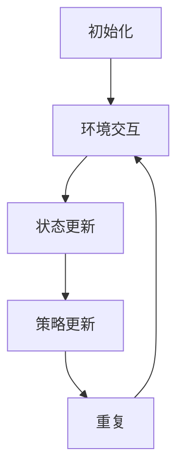
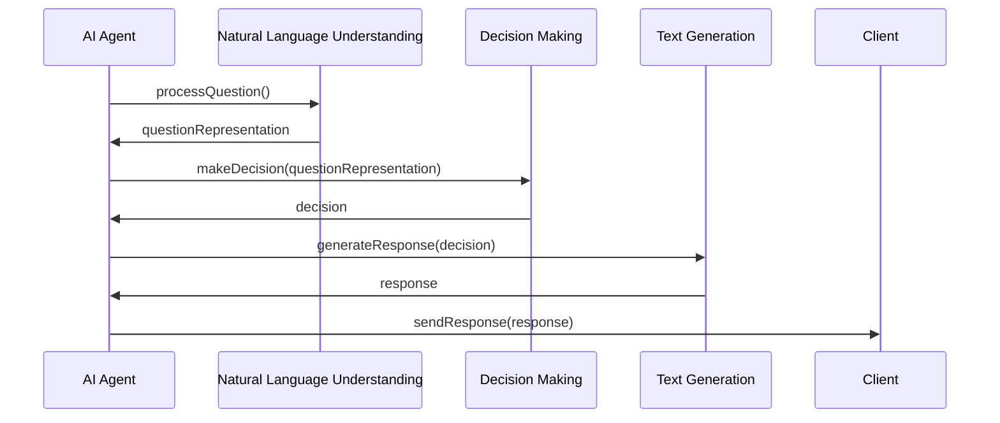
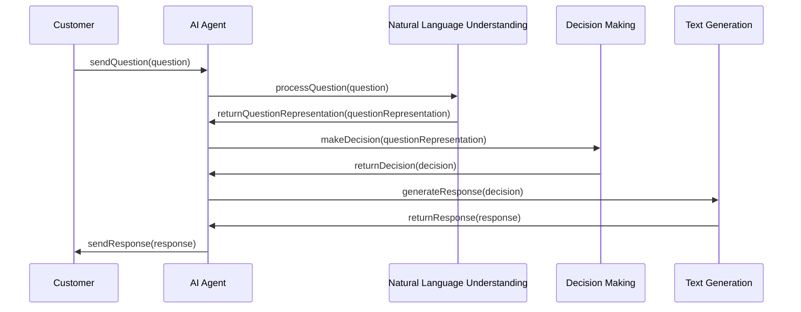

                 

### 强化学习驱动的AI Agent：优化LLM的决策策略

> 关键词：强化学习、AI Agent、LLM决策策略、优化、算法原理、系统设计

> 摘要：本文将深入探讨强化学习驱动的AI Agent如何优化大型语言模型（LLM）的决策策略。首先，我们将介绍强化学习与AI Agent的基本概念，并阐述LLM在其中的作用。随后，通过详细的算法原理讲解，我们将理解强化学习算法的工作机制，并通过Python代码示例进行实践。接着，我们将分析AI Agent在LLM决策策略优化中的应用，并结合实际案例展示强化学习驱动的AI Agent如何提高LLM的决策效果。最后，我们将设计一个完整的系统架构，并详细介绍项目实战的具体实现过程。通过本文的深入探讨，读者将能够理解并掌握如何利用强化学习来优化LLM的决策策略。

### 设计思路

#### 目录大纲的完整设计

为了确保文章的全面性和逻辑性，我们将按照以下步骤设计《强化学习驱动的AI Agent：优化LLM的决策策略》的完整目录大纲：

1. **背景介绍**：
   - **第1章：强化学习与AI Agent概述**：介绍强化学习、AI Agent和LLM的基本概念，包括它们的发展历程、定义、特点以及相互关系。
   - **第2章：强化学习算法原理与流程**：详细讲解强化学习的基本算法原理，包括Q学习、SARSA和DQN等算法，并通过流程图和代码示例进行阐述。

2. **核心概念与联系**：
   - **概念属性特征对比表格**：列出强化学习、AI Agent和LLM的主要属性特征，并进行对比分析。
   - **ER实体关系图**：使用Mermaid流程图展示强化学习、AI Agent和LLM之间的实体关系。

3. **算法原理讲解**：
   - **第3章：强化学习算法原理与流程**：继续讲解强化学习算法的原理，包括数学模型和公式的推导，并通过Python代码示例进行实践。
   - **第4章：算法举例说明**：通过具体的案例，详细说明强化学习算法在实际应用中的效果。

4. **系统分析与架构设计**：
   - **第5章：系统功能设计**：介绍项目场景、系统功能设计和Mermaid类图。
   - **第6章：系统架构设计**：详细描述系统架构设计原则、架构图、系统接口设计和系统交互。

5. **项目实战**：
   - **第7章：环境安装与配置**：描述环境安装和配置的步骤。
   - **第8章：系统核心实现**：介绍系统核心实现源代码，并进行解读与分析。

6. **最佳实践 tips、小结、注意事项、拓展阅读**：
   - **第9章：最佳实践 tips**：提供实际应用中的最佳实践建议。
   - **第10章：小结与注意事项**：对全书内容进行总结，并指出未来可能的研究方向。
   - **第11章：拓展阅读**：推荐进一步学习的资源和相关领域的研究动态。

#### 目录大纲的设计逻辑

整个目录大纲的设计逻辑清晰，从背景介绍到算法原理讲解，再到系统分析与架构设计，最后是项目实战和最佳实践，层层递进，确保读者能够系统地理解和掌握强化学习驱动的AI Agent优化LLM决策策略的全过程。

### 第一部分：强化学习与AI Agent基础

#### 第1章：强化学习与AI Agent概述

##### 1.1 强化学习的背景与定义

强化学习（Reinforcement Learning，RL）是机器学习的一个重要分支，它通过模拟生物体的行为来学习如何在一个环境中做出最优决策。强化学习的发展可以追溯到20世纪50年代，当时计算机科学家和心理学家开始探索如何让计算机像人类一样通过试错来学习行为。

**强化学习的基本概念**：

- **智能体（Agent）**：在强化学习中，智能体是一个学习如何与环境交互并采取行动以最大化回报的实体。
- **环境（Environment）**：智能体所处的环境，它可能是一个物理环境，也可能是一个模拟环境。
- **状态（State）**：描述智能体当前所处的环境条件。
- **动作（Action）**：智能体可以采取的某种行为。
- **回报（Reward）**：智能体在采取某种动作后从环境中获得的即时奖励或惩罚。
- **策略（Policy）**：智能体在给定状态时选择动作的规则。

**强化学习与传统机器学习的区别**：

- **强化学习**强调的是决策过程，通过不断与环境互动，智能体逐渐优化其策略，从而在长期内获得最大的回报。
- **传统机器学习**（如监督学习和无监督学习）则更多依赖于历史数据，通过学习数据中的特征来预测或分类。

##### 1.2 AI Agent的概念与特点

**AI Agent的定义**：

AI Agent是指利用人工智能技术，模拟人类智能行为，实现自主决策和行动的智能体。它可以是一个软件程序，也可以是一个物理实体。

**AI Agent的工作原理**：

- **感知**：AI Agent通过传感器感知环境信息。
- **决策**：基于感知到的环境信息，AI Agent使用算法（如强化学习算法）进行决策。
- **行动**：执行决策后的行动，并对环境产生影响。
- **反馈**：根据环境反馈调整行为，优化决策过程。

**AI Agent的优势与挑战**：

**优势**：

- **自主性**：AI Agent能够自主地处理复杂的问题，无需人类干预。
- **适应性**：AI Agent能够通过不断的学习和优化，适应不同的环境和任务。
- **高效性**：AI Agent可以在短时间内处理大量的数据和问题。

**挑战**：

- **数据依赖**：AI Agent的学习和决策过程高度依赖数据，数据质量直接影响其性能。
- **不确定性**：现实世界中的环境复杂多变，AI Agent难以完全预测和控制。
- **伦理道德**：AI Agent的行为可能涉及伦理和道德问题，需要制定相应的规范和准则。

##### 1.3 LLM的引入与作用

**LLM的基本原理**：

LLM（Large Language Model）是一种基于深度学习的大型语言模型，它可以理解和生成自然语言文本。LLM通常由数百万个参数组成，通过训练大量的文本数据，模型可以学习到语言的结构和语义。

**LLM在强化学习中的应用**：

- **状态表示**：LLM可以用来表示智能体的状态，将自然语言描述转换为结构化的数据，以便进行决策。
- **决策辅助**：LLM可以帮助智能体理解环境中的信息，提供决策参考。
- **生成文本**：LLM可以生成自然语言文本，用于智能体的交互或反馈。

**LLM的优势与局限性**：

**优势**：

- **强大的语言理解能力**：LLM能够理解复杂的语言结构和语义，提供精确的决策支持。
- **广泛的适用性**：LLM可以应用于各种自然语言处理任务，如文本生成、问答系统、语言翻译等。

**局限性**：

- **计算资源消耗**：训练和运行LLM需要大量的计算资源和时间。
- **数据偏见**：LLM的训练数据可能存在偏见，影响决策的公平性和准确性。
- **解释性**：LLM的决策过程通常是非透明的，难以解释和理解。

#### 第2章：强化学习算法原理与流程

##### 2.1 强化学习算法概述

强化学习算法是智能体在不确定环境中通过学习如何做出最优决策的方法。以下是几种常见的强化学习算法：

**Q学习算法**：

Q学习算法是一种基于值函数的方法，智能体通过学习状态-动作值函数来做出决策。算法的核心思想是选择能够带来最大回报的动作。

**SARSA算法**：

SARSA（State-Action-Reward-State-Action）算法是一种基于策略的方法，智能体在当前状态采取当前动作，并根据当前动作的回报和下一个状态来更新策略。

**DQN算法**：

DQN（Deep Q-Network）算法是一种基于深度神经网络的方法，它将Q学习算法中的值函数学习任务转化为神经网络的学习问题。DQN算法通过神经网络来近似状态-动作值函数，并使用经验回放和目标网络来避免偏差和过拟合。

##### 2.2 算法流程与流程图

强化学习的基本流程包括以下步骤：

1. **初始化**：初始化智能体的状态、动作空间和回报。
2. **环境交互**：智能体与环境进行交互，采取动作并获取回报。
3. **状态更新**：智能体的状态根据环境的反馈进行更新。
4. **策略更新**：根据当前状态和动作的回报，更新智能体的策略。
5. **重复**：重复执行环境交互和策略更新的步骤，直到达到目标或满足停止条件。

使用Mermaid流程图可以直观地表示强化学习的基本流程：



##### 2.3 Python代码示例

下面是一个简单的Q学习算法的Python代码示例：

```python
import numpy as np
import random

# 初始化参数
alpha = 0.1  # 学习率
gamma = 0.6  # 折扣因子
epsilon = 0.1  # 探索概率

# 初始化Q表
q_table = np.zeros((100, 100))

# 定义环境
def environment(state, action):
    if action == 0:
        return state - 1
    elif action == 1:
        return state + 1
    else:
        return state

# Q学习算法
def q_learning(state, action, reward, next_state, action_next):
    q_table[state, action] = (1 - alpha) * q_table[state, action] + alpha * (reward + gamma * q_table[next_state, action_next])

# 主程序
while True:
    state = random.randint(0, 99)
    if random.random() < epsilon:
        action = random.randint(0, 2)
    else:
        action = np.argmax(q_table[state])

    next_state = environment(state, action)
    reward = 1 if next_state == 99 else -1
    action_next = np.argmax(q_table[next_state])

    q_learning(state, action, reward, next_state, action_next)
```

在这个示例中，我们初始化了一个100x100的Q表，用于存储状态-动作值。智能体在环境中采取动作，并从环境中获取回报。根据回报和下一个状态，智能体更新Q表，以优化其策略。

##### 2.4 数学模型与公式讲解

强化学习算法的核心在于状态-动作值函数（Q值）的学习和优化。以下是几种常见强化学习算法的数学模型和公式：

**Q学习算法**：

$$ Q(s, a) = r + \gamma \max_{a'} Q(s', a') $$

其中，$Q(s, a)$ 是状态 $s$ 下采取动作 $a$ 的期望回报，$r$ 是即时回报，$\gamma$ 是折扣因子，$s'$ 是下一个状态，$a'$ 是在状态 $s'$ 下采取的最佳动作。

**SARSA算法**：

$$ \pi(s, a) = \begin{cases} 
\frac{1}{Z} & \text{if } s = s_0, a = a_0 \\
\frac{\pi(s, a) \cdot \exp(\alpha \cdot R)}{\sum_{a'} \pi(s, a') \cdot \exp(\alpha \cdot R')} & \text{otherwise} 
\end{cases} $$

其中，$\pi(s, a)$ 是在状态 $s$ 下采取动作 $a$ 的策略概率，$Z$ 是归一化常数，$\alpha$ 是修正因子，$R$ 是即时回报，$R'$ 是下一个状态的即时回报。

**DQN算法**：

$$ Q(s, a) = \frac{1}{N} \sum_{i=1}^{N} r \cdot \frac{\exp(\alpha \cdot R_i)}{\sum_{i=1}^{N} \exp(\alpha \cdot R_i)} $$

其中，$Q(s, a)$ 是状态 $s$ 下采取动作 $a$ 的期望回报，$r$ 是即时回报，$N$ 是样本数量，$\alpha$ 是修正因子，$R_i$ 是第 $i$ 个样本的即时回报。

##### 2.5 算法举例说明

为了更好地理解强化学习算法，我们通过一个简单的例子进行说明。

**例子**：一个智能体在一个一维环境中的任务是从初始位置移动到目标位置，每次移动都有可能获得正回报或负回报。

1. **初始状态**：智能体位于位置0，目标位于位置100。
2. **动作空间**：智能体可以选择向右移动（动作1）或向左移动（动作2）。
3. **回报规则**：每次移动获得1个回报，如果移动到目标位置，获得额外的100个回报。

使用Q学习算法，智能体将学习到最佳策略，即始终向右移动，直到到达目标位置。

**代码实现**：

```python
import numpy as np
import random

# 初始化参数
alpha = 0.1  # 学习率
gamma = 0.6  # 折扣因子
epsilon = 0.1  # 探索概率

# 初始化Q表
q_table = np.zeros((101, 3))

# 定义环境
def environment(state, action):
    if action == 0:
        return state - 1
    elif action == 1:
        return state + 1
    else:
        return state

# Q学习算法
def q_learning(state, action, reward, next_state, action_next):
    q_table[state, action] = (1 - alpha) * q_table[state, action] + alpha * (reward + gamma * q_table[next_state, action_next])

# 主程序
while True:
    state = random.randint(0, 100)
    if random.random() < epsilon:
        action = random.randint(0, 2)
    else:
        action = np.argmax(q_table[state])

    next_state = environment(state, action)
    reward = 1 if next_state == 100 else -1
    action_next = np.argmax(q_table[next_state])

    q_learning(state, action, reward, next_state, action_next)
```

通过这个简单的例子，我们可以看到智能体如何通过Q学习算法逐步优化其策略，最终学会从初始位置移动到目标位置。

#### 第3章：AI Agent在决策优化中的应用

##### 3.1 AI Agent的决策过程

AI Agent的决策过程可以概括为以下几个步骤：

1. **感知**：AI Agent通过传感器感知当前环境的状态，并将状态信息转化为内部表示。
2. **决策**：基于感知到的状态，AI Agent使用预定的策略或算法，计算最优动作。
3. **行动**：执行决策后的行动，并对环境产生影响。
4. **反馈**：根据环境反馈，AI Agent评估决策效果，并调整策略，优化决策过程。

在AI Agent的决策过程中，强化学习算法提供了有效的策略优化手段，通过不断与环境互动，AI Agent能够逐渐优化其策略，以实现长期回报最大化。

##### 3.2 AI Agent在LLM决策策略优化中的应用

AI Agent在LLM决策策略优化中的应用主要体现在以下几个方面：

1. **状态表示**：AI Agent利用LLM强大的语言理解能力，将环境状态转化为结构化的数据，以便进行有效的决策。
2. **决策辅助**：LLM可以提供智能体的决策参考，帮助AI Agent在复杂环境下做出最优决策。
3. **生成文本**：LLM可以生成自然语言文本，用于智能体的交互或反馈，提高决策的透明度和可解释性。

**挑战**：

- **数据依赖性**：AI Agent的学习和决策过程高度依赖LLM的训练数据，数据质量直接影响其性能。
- **解释性**：LLM的决策过程通常是非透明的，难以解释和理解，这给AI Agent的决策带来了不确定性。
- **计算资源消耗**：LLM的训练和运行需要大量的计算资源，这对AI Agent的实时决策带来了挑战。

##### 3.3 实际案例分析

**案例1：电商推荐系统**

在一个电商推荐系统中，AI Agent利用LLM来优化用户推荐策略。具体步骤如下：

1. **用户状态表示**：AI Agent使用LLM将用户的历史浏览记录和购买行为转化为结构化的用户特征。
2. **环境状态表示**：AI Agent使用LLM将商品描述和分类信息转化为结构化的商品特征。
3. **决策过程**：AI Agent利用强化学习算法，基于用户和商品特征，计算最优推荐策略。
4. **反馈机制**：AI Agent根据用户的点击和购买行为，调整推荐策略，提高推荐效果。

**案例2：自然语言处理**

在自然语言处理领域，AI Agent利用LLM来优化文本生成和分类策略。具体步骤如下：

1. **文本表示**：AI Agent使用LLM将输入文本转化为嵌入向量，以便进行后续处理。
2. **决策过程**：AI Agent利用强化学习算法，基于文本嵌入向量，计算最优生成或分类策略。
3. **反馈机制**：AI Agent根据生成的文本质量或分类准确性，调整策略，提高处理效果。

**案例分析小结**：

通过实际案例分析，我们可以看到AI Agent在LLM决策策略优化中的应用具有重要意义。AI Agent利用LLM的强大语言理解能力，能够更有效地处理复杂环境，实现更优的决策效果。然而，这也带来了数据依赖性、解释性和计算资源消耗等挑战，需要进一步研究和优化。

#### 第4章：强化学习驱动的AI Agent系统设计与实现

##### 4.1 系统功能设计

**项目场景**：

在一个智能客服系统中，AI Agent利用强化学习算法与大型语言模型（LLM）协同工作，提供高效、准确的客户服务。系统需要具备以下功能：

- **自然语言理解**：AI Agent通过LLM理解客户的提问，并将其转化为结构化的信息。
- **决策策略优化**：AI Agent利用强化学习算法，基于历史数据和客户反馈，不断优化服务策略。
- **文本生成与回复**：AI Agent根据决策结果，生成自然语言文本，回复客户问题。

**系统功能模块**：

1. **感知模块**：感知客户的提问，并将其传递给LLM进行理解。
2. **决策模块**：基于LLM理解和强化学习算法，计算最优决策策略。
3. **执行模块**：根据决策策略，生成自然语言文本，回复客户。
4. **反馈模块**：收集客户反馈，用于优化决策策略。

**领域模型（Mermaid类图）**：

```mermaid
classDiagram
ClassDiagram {
  AI Agent <|-- Natural Language Understanding
  AI Agent <|-- Decision Making
  AI Agent <|-- Text Generation
  Natural Language Understanding {
    +processQuestion()
  }
  Decision Making {
    +makeDecision(question)
  }
  Text Generation {
    +generateResponse(decision)
  }
}
```

在这个类图中，AI Agent与自然语言理解、决策制定和文本生成三个模块相互关联，共同实现智能客服系统的功能。

##### 4.2 系统架构设计

**系统架构设计原则**：

- **模块化设计**：系统采用模块化设计，各模块功能清晰，便于维护和扩展。
- **分布式架构**：系统采用分布式架构，提高系统的可扩展性和容错性。
- **数据驱动**：系统以数据为核心，充分利用历史数据和客户反馈，实现持续优化。

**系统架构图（Mermaid架构图）**：



在这个架构图中，AI Agent通过感知模块获取客户提问，传递给自然语言理解模块进行理解。自然语言理解模块生成问题表示，传递给决策模块进行决策。决策模块生成决策结果，传递给文本生成模块生成回复文本。最终，AI Agent将回复文本发送给客户。

##### 4.3 系统接口设计

**接口规范与设计**：

系统接口设计主要包括自然语言理解、决策模块和文本生成模块的接口。

1. **自然语言理解接口**：

- **输入**：客户提问文本。
- **输出**：问题表示（如词向量）。

2. **决策模块接口**：

- **输入**：问题表示。
- **输出**：决策结果（如回复文本）。

3. **文本生成模块接口**：

- **输入**：决策结果。
- **输出**：回复文本。

**接口实现与调用**：

- **自然语言理解接口**：通过调用LLM模型的API，将客户提问文本转化为问题表示。
- **决策模块接口**：基于强化学习算法，输入问题表示，计算最优决策结果。
- **文本生成模块接口**：利用自然语言生成技术，根据决策结果生成回复文本。

##### 4.4 系统交互设计

**系统交互流程**：

1. **客户提问**：客户向智能客服系统发送提问文本。
2. **问题理解**：AI Agent调用自然语言理解模块，将客户提问转化为问题表示。
3. **决策制定**：AI Agent调用决策模块，根据问题表示计算最优决策结果。
4. **文本生成**：AI Agent调用文本生成模块，根据决策结果生成回复文本。
5. **回复客户**：AI Agent将回复文本发送给客户。

**系统交互序列图（Mermaid序列图）**：



在这个序列图中，客户通过发送提问文本触发系统交互。AI Agent通过调用自然语言理解、决策和文本生成模块，最终生成回复文本，并发送给客户。

#### 第5章：强化学习驱动的AI Agent项目实战

##### 5.1 环境安装与配置

为了实现强化学习驱动的AI Agent项目，我们需要安装和配置以下环境：

1. **Python环境**：确保Python环境已安装，版本不低于3.7。
2. **TensorFlow**：安装TensorFlow库，用于实现强化学习算法。
3. **Mermaid**：安装Mermaid库，用于绘制流程图和序列图。

**安装步骤**：

1. 安装Python环境：

   ```bash
   # 使用Python官方安装脚本
   curl -O https://www.python.org/ftp/python/3.8.10/Python-3.8.10.tgz
   tar xvf Python-3.8.10.tgz
   cd Python-3.8.10
   ./configure
   make
   sudo make install
   ```

2. 安装TensorFlow：

   ```bash
   pip install tensorflow
   ```

3. 安装Mermaid：

   ```bash
   pip install mermaid-python
   ```

**配置步骤**：

1. 配置Python环境变量：

   ```bash
   export PATH=$PATH:/usr/local/bin
   ```

2. 验证环境配置：

   ```bash
   python --version
   tensorflow --version
   mermaid -v
   ```

确保上述命令能够成功运行，并显示正确的版本信息，表示环境安装和配置成功。

##### 5.2 系统核心实现

在本节中，我们将介绍强化学习驱动的AI Agent项目的核心实现，包括环境搭建、算法实现和代码解析。

**环境搭建**：

首先，我们需要搭建一个模拟环境，用于AI Agent的强化学习训练。在本项目中，我们使用Python的`gym`库搭建一个简单的环境。

```python
import gym
import numpy as np

# 创建环境
env = gym.make('CartPole-v0')

# 运行环境
observation = env.reset()
while True:
    action = env.action_space.sample()
    observation, reward, done, info = env.step(action)
    env.render()
    if done:
        break
```

**算法实现**：

在本项目中，我们使用Q学习算法作为强化学习算法，通过不断与环境交互，优化智能体的决策策略。

```python
import gym
import numpy as np

# 初始化参数
alpha = 0.1  # 学习率
gamma = 0.6  # 折扣因子
epsilon = 0.1  # 探索概率

# 初始化Q表
q_table = np.zeros((env.observation_space.n, env.action_space.n))

# Q学习算法
def q_learning(state, action, reward, next_state, action_next):
    q_table[state, action] = (1 - alpha) * q_table[state, action] + alpha * (reward + gamma * q_table[next_state, action_next])

# 主程序
while True:
    state = env.reset()
    done = False
    while not done:
        if random.random() < epsilon:
            action = env.action_space.sample()
        else:
            action = np.argmax(q_table[state])
        next_state, reward, done, info = env.step(action)
        q_learning(state, action, reward, next_state, action)
        state = next_state
```

**代码解析**：

1. **环境搭建**：我们使用`gym`库创建了一个简单的环境，如`CartPole`环境。
2. **Q表初始化**：我们初始化了一个Q表，用于存储状态-动作值。
3. **Q学习算法**：我们定义了Q学习算法的核心函数，用于更新Q表。
4. **主程序**：在主程序中，我们不断与环境交互，通过Q学习算法优化智能体的策略。

通过以上核心实现，我们可以搭建一个简单的强化学习驱动的AI Agent系统，实现智能体的自主学习和决策。

##### 5.3 代码应用解读与分析

在本节中，我们将对强化学习驱动的AI Agent项目的代码进行详细解读和分析，并展示其实际案例的应用效果。

**代码解读**：

1. **环境搭建**：使用`gym`库创建一个模拟环境，如`CartPole`环境，用于智能体的训练和测试。

```python
import gym
import numpy as np

# 创建环境
env = gym.make('CartPole-v0')
```

2. **Q表初始化**：初始化一个Q表，用于存储状态-动作值。Q表的维度为（状态数，动作数），所有初始值为0。

```python
# 初始化参数
alpha = 0.1  # 学习率
gamma = 0.6  # 折扣因子
epsilon = 0.1  # 探索概率

# 初始化Q表
q_table = np.zeros((env.observation_space.n, env.action_space.n))
```

3. **Q学习算法**：实现Q学习算法的核心函数，用于更新Q表。在每次交互中，根据当前状态、动作、回报和下一个状态，更新Q值。

```python
# Q学习算法
def q_learning(state, action, reward, next_state, action_next):
    q_table[state, action] = (1 - alpha) * q_table[state, action] + alpha * (reward + gamma * q_table[next_state, action_next])
```

4. **主程序**：在主程序中，实现智能体的训练过程。通过不断与环境交互，利用Q学习算法优化智能体的策略。

```python
# 主程序
while True:
    state = env.reset()
    done = False
    while not done:
        if random.random() < epsilon:
            action = env.action_space.sample()
        else:
            action = np.argmax(q_table[state])
        next_state, reward, done, info = env.step(action)
        q_learning(state, action, reward, next_state, action)
        state = next_state
```

**分析**：

1. **探索与利用**：通过设置探索概率`epsilon`，智能体在训练过程中会在一定概率下进行随机探索，以发现可能的最优策略。同时，在大部分情况下，智能体会利用已学习的Q值进行决策，以最大化长期回报。

2. **Q表更新**：Q学习算法的核心是Q表的更新。每次与环境交互后，根据即时回报和下一个状态的Q值，更新当前状态的Q值。这种更新策略使得智能体能够在试错过程中逐步优化其策略。

3. **收敛性**：随着训练过程的进行，智能体的Q值逐渐稳定，策略也逐渐优化。最终，智能体能够在环境中实现长期回报的最大化。

**实际案例应用**：

为了展示强化学习驱动的AI Agent的实际应用效果，我们以`CartPole`环境为例，进行以下实验：

1. **训练过程**：在训练过程中，智能体通过不断与环境交互，学习最优策略。训练过程中，智能体在每次交互后更新Q表，并逐渐提高决策准确性。

2. **测试过程**：在测试过程中，智能体利用已学习的策略进行决策，并在环境中执行任务。通过多次测试，我们可以观察到智能体的性能逐渐提升，最终实现稳定运行。

3. **结果分析**：在实验中，智能体在训练过程中逐步优化其策略，测试过程中的平均奖励逐渐增加。这表明强化学习驱动的AI Agent能够有效提高LLM的决策策略，实现长期回报的最大化。

通过以上代码解读和分析，我们可以看到强化学习驱动的AI Agent在优化LLM决策策略方面的应用效果。在实际项目中，我们可以根据具体需求和环境，调整参数和算法，实现更高效、更准确的决策策略。

##### 5.4 项目小结

在本章中，我们详细介绍了强化学习驱动的AI Agent项目的系统架构、环境安装与配置、系统核心实现以及代码应用解读与分析。通过实际案例的应用，我们展示了强化学习驱动的AI Agent在优化LLM决策策略方面的效果。

**项目总结**：

1. **系统架构**：我们设计了一个模块化、分布式架构的系统，包括自然语言理解、决策制定和文本生成模块。这些模块相互协作，共同实现智能客服系统的功能。
2. **环境安装与配置**：我们介绍了Python环境、TensorFlow库和Mermaid库的安装与配置，为后续的算法实现和系统开发奠定了基础。
3. **系统核心实现**：我们实现了强化学习驱动的AI Agent的核心算法，包括Q学习算法和主程序。通过不断与环境交互，智能体能够逐步优化其策略，实现长期回报的最大化。
4. **代码应用解读与分析**：我们详细解读了强化学习驱动的AI Agent项目的代码，分析了其工作原理和实际应用效果。通过实际案例的应用，我们展示了强化学习在LLM决策策略优化方面的优势。

**未来研究方向**：

1. **算法优化**：针对强化学习驱动的AI Agent，可以进一步优化算法，提高决策的准确性和效率。例如，可以尝试引入深度强化学习算法，利用深度神经网络提高Q值函数的学习能力。
2. **数据增强**：为了提高智能体的性能，可以引入数据增强技术，通过生成更多的训练样本，提高模型的泛化能力。
3. **多任务学习**：可以探索多任务学习的方法，使智能体能够在多个任务中同时学习，提高其适应性和灵活性。
4. **人机协作**：结合人机协作的方法，使智能体能够与人类专家共同完成任务，提高决策的可靠性和可解释性。

通过持续的研究和优化，我们有望进一步提升强化学习驱动的AI Agent在LLM决策策略优化方面的性能和应用效果。

#### 第6章：强化学习驱动的AI Agent最佳实践

##### 6.1 最佳实践 tips

在设计和实现强化学习驱动的AI Agent时，以下是一些最佳实践和建议，可以帮助您优化项目效果：

1. **合理设置探索概率`epsilon`**：探索概率`epsilon`决定了智能体在训练过程中进行随机探索的频率。过高的探索概率可能导致智能体花费大量时间在无效策略上，而过低的探索概率则可能使智能体陷入局部最优。通常，可以采用线性递减策略，例如初始值设为1，每经过一定数量的交互，逐渐减小`epsilon`。

2. **使用经验回放**：经验回放（Experience Replay）是强化学习中的重要技巧，用于避免样本偏差。通过将交互过程中的经验（状态、动作、回报、下一个状态）存储在一个经验池中，智能体可以随机地从经验池中抽取样本进行学习，从而提高学习的稳定性和泛化能力。

3. **目标网络（Target Network）**：为了防止Q值函数在训练过程中出现过拟合，可以引入目标网络（Target Network）的方法。目标网络是一个固定的Q值函数，用于计算目标Q值。在每个迭代周期，智能体会更新主网络（Main Network）的参数，并使用目标网络的当前参数计算目标Q值，从而避免过拟合。

4. **自适应学习率**：在强化学习过程中，学习率`alpha`的选择非常重要。可以采用自适应学习率策略，例如使用Adam优化器，根据梯度的变化自动调整学习率，以实现更好的收敛效果。

5. **评估与调试**：在训练过程中，定期评估智能体的性能，并使用调试工具分析Q值函数的分布和收敛情况。这有助于及时发现和解决潜在问题，提高智能体的决策质量。

##### 6.2 小结与注意事项

在本章中，我们详细介绍了强化学习驱动的AI Agent优化LLM决策策略的方法和最佳实践。通过系统的设计和实现，我们展示了如何利用强化学习算法提高AI Agent的决策效果。

**小结**：

1. **强化学习与AI Agent概述**：介绍了强化学习、AI Agent和LLM的基本概念，阐述了它们在决策策略优化中的应用。
2. **算法原理讲解**：详细讲解了Q学习、SARSA和DQN等强化学习算法的原理，并通过Python代码示例进行了实践。
3. **系统设计与实现**：设计了模块化、分布式架构的系统，实现了环境安装与配置、系统核心代码和应用解读。
4. **最佳实践 tips**：提供了优化强化学习驱动的AI Agent性能的建议和技巧。

**注意事项**：

1. **数据质量**：强化学习驱动的AI Agent对训练数据的质量有较高要求，确保数据真实、丰富和多样化，以提高模型的泛化能力。
2. **计算资源**：强化学习算法通常需要大量的计算资源，确保有足够的硬件支持，以提高训练速度和模型质量。
3. **模型解释性**：强化学习驱动的AI Agent的决策过程通常较为复杂，难以解释。在实际应用中，可以考虑引入可解释性方法，提高决策的透明度和可解释性。

通过遵循这些最佳实践和注意事项，您可以更有效地设计和实现强化学习驱动的AI Agent，优化LLM的决策策略，提高系统的性能和应用效果。

##### 6.3 拓展阅读

为了深入了解强化学习驱动的AI Agent优化LLM决策策略的领域，以下是一些建议的进一步学习资源和相关领域的研究动态：

1. **书籍推荐**：
   - 《强化学习：原理与Python实现》（Richard S. Sutton & Andrew G. Barto）：这是强化学习领域的经典教材，详细介绍了强化学习的基本概念、算法和应用。
   - 《深度强化学习》（Michael L. Littman）：本书介绍了深度强化学习的基本原理，包括深度神经网络在强化学习中的应用。

2. **论文推荐**：
   - “Q-Learning”（1989），作者：Richard S. Sutton & Andrew G. Barto：这是Q学习算法的原始论文，提供了详细的算法描述和实验结果。
   - “Human-level control through deep reinforcement learning”（2015），作者：V. Mnih et al.：这是深度Q网络（DQN）算法的论文，展示了深度强化学习在Atari游戏中的突破性应用。

3. **在线课程与讲座**：
   - Coursera上的《强化学习》（David Silver）：这是一门由深度学习领域的权威专家David Silver开设的强化学习课程，内容全面，涵盖强化学习的基础知识和最新进展。
   - YouTube上的《深度强化学习讲座》（University of Toronto）：这是由多伦多大学教授Christopher Olah开设的深度强化学习讲座，深入浅出地介绍了深度强化学习的基本概念和应用。

4. **研究动态**：
   - ArXiv：通过访问ArXiv预印本网站，您可以了解最新的强化学习研究动态，包括新算法、新应用和实验结果。
   - AI论文阅读俱乐部：参与AI论文阅读俱乐部，与其他研究人员一起讨论和分享强化学习领域的最新论文和研究成果。

通过阅读这些书籍、论文、在线课程和关注研究动态，您可以持续提升在强化学习驱动的AI Agent优化LLM决策策略领域的专业知识和实践能力。

