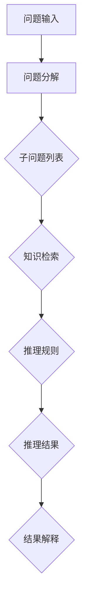
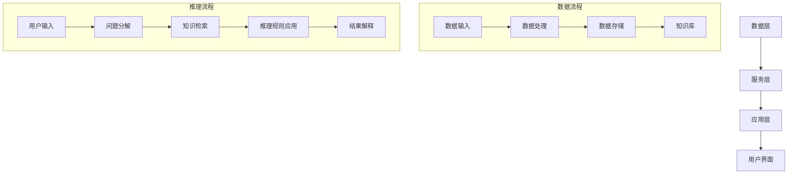
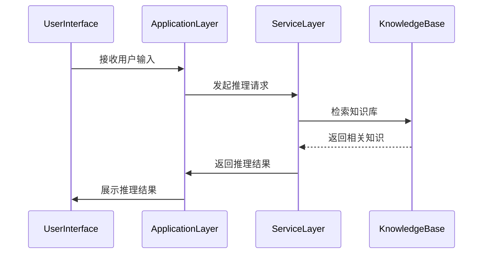

                 

### 文章标题：思维链：提升AI Agent的推理能力

#### 关键词：AI推理、思维链、算法、架构设计、最佳实践

#### 摘要：
本文旨在深入探讨如何通过思维链（Thinking Chains）这一创新技术，提升人工智能（AI）代理的推理能力。文章首先介绍思维链的背景和核心概念，随后详细解析思维链的原理和核心算法。接着，文章通过实际应用和项目实战，展示思维链在AI推理中的优势和效果。最后，文章提出思维链的最佳实践建议，并展望未来的发展方向。通过逐步的分析与推理，本文为提升AI推理能力提供了系统性的解决方案。

----------------------------------------------------------------

## 第一部分：背景介绍与核心概念

在人工智能（AI）快速发展的时代，推理能力成为衡量AI性能的重要标准之一。传统AI系统通常依赖于规则和统计方法，而现代AI系统则需要具备更强的自主推理能力，以应对复杂多变的现实问题。思维链（Thinking Chains）作为一种创新的AI推理技术，旨在通过构建逻辑严谨、结构紧凑的推理框架，提升AI代理的推理能力和智能水平。

### 1.1 问题背景

#### 1.1.1 问题背景

随着大数据和云计算技术的普及，AI在各个领域取得了显著的应用成果。然而，传统AI系统在面对复杂推理任务时，仍然存在以下问题：

- **规则依赖性高**：传统AI系统依赖于大量的规则库，这些规则往往由专家手动编写，难以适应动态变化的场景。
- **推理能力有限**：传统AI系统在处理复杂推理任务时，往往无法同时考虑多个因素，导致推理结果不够准确。
- **可解释性差**：传统AI系统内部的推理过程往往黑箱化，难以解释其推理过程和结果，这在某些应用场景（如医疗诊断、金融风险评估等）中是一个严重的问题。

#### 1.1.2 问题描述

为了解决上述问题，我们需要一种能够自动构建逻辑推理框架的技术，以提升AI代理的推理能力。思维链作为一种全新的推理技术，正是为了解决这一挑战而提出的。

#### 1.1.3 问题解决思路

思维链通过以下思路解决问题：

- **构建自动推理框架**：思维链可以自动从数据中提取知识，构建逻辑推理框架，减少对专家规则的依赖。
- **增强推理复杂性**：思维链能够同时考虑多个因素，进行复杂推理，提升推理结果的准确性。
- **提高推理可解释性**：思维链的推理过程可以被清晰记录和解释，提高系统的透明度和可信度。

#### 1.1.4 边界与外延

在探讨思维链的应用时，我们还需要明确其边界与外延：

- **边界**：思维链主要针对的是需要复杂推理能力的AI应用场景，如自然语言处理、计算机视觉、机器学习等。
- **外延**：思维链不仅可以应用于AI领域，还可以在其他需要逻辑推理的领域（如法律、金融、医疗等）发挥作用。

### 1.2 核心概念与联系

#### 1.2.1 思维链的定义

思维链是指一种基于逻辑推理的自动化框架，它通过将问题分解为多个子问题，逐步解决这些子问题，从而得出最终的推理结果。思维链的核心在于其逻辑严谨性和结构紧凑性。

#### 1.2.2 思维链的属性特征对比表

| 特征 | 传统推理 | 思维链 |
| --- | --- | --- |
| 依赖性 | 高（规则库） | 低（数据驱动） |
| 复杂性 | 有限 | 高 |
| 可解释性 | 差 | 好 |

#### 1.2.3 思维链与其他相关概念的联系

思维链与其他AI技术（如深度学习、自然语言处理等）有密切的联系：

- **深度学习**：思维链可以作为深度学习模型的辅助工具，提升模型的推理能力。
- **自然语言处理**：思维链可以用于构建更加复杂和严谨的自然语言理解框架。
- **机器学习**：思维链可以通过机器学习技术来优化其推理过程，提升推理效果。

### 小结

通过上述分析，我们可以看出，思维链作为一种创新的推理技术，具有强大的应用前景。在接下来的章节中，我们将深入探讨思维链的原理、核心算法以及其实际应用，以全面了解这一技术的优势和应用场景。

----------------------------------------------------------------

## 第二部分：思维链的原理

思维链作为一种创新的推理技术，其核心在于通过构建逻辑严谨、结构紧凑的推理框架，提升AI代理的推理能力。本部分将详细探讨思维链的基本原理、核心算法及其在推理中的应用。

### 2.1 思维链的基本原理

#### 2.1.1 思维链的构成元素

思维链由以下几个核心构成元素组成：

1. **问题分解器**：将复杂问题分解为多个子问题，以便逐步解决。
2. **知识库**：存储已解决的问题和知识，用于后续推理过程。
3. **推理引擎**：根据当前问题，从知识库中提取相关知识和规则，进行推理。
4. **解释器**：解释推理过程和结果，提供透明和可解释的推理结果。

#### 2.1.2 思维链的工作机制

思维链的工作机制如下：

1. **问题输入**：接收用户输入的问题或任务。
2. **问题分解**：将问题分解为多个子问题。
3. **知识检索**：从知识库中检索与当前子问题相关的知识和规则。
4. **推理过程**：使用推理引擎根据检索到的知识和规则进行推理。
5. **结果解释**：将推理结果解释给用户，并提供透明的推理过程。

#### 2.1.3 思维链的演化过程

思维链的演化过程可以分为以下几个阶段：

1. **初始阶段**：问题分解器和知识库的初步构建。
2. **发展阶段**：推理引擎的不断优化和知识库的持续更新。
3. **成熟阶段**：解释器的引入，提升推理结果的透明度和可解释性。
4. **持续优化**：通过机器学习和数据驱动的方式，不断优化推理过程。

### 2.2 思维链的核心算法

思维链的核心算法是其推理机制，这一机制包括以下几个关键部分：

#### 2.2.1 算法原理讲解

思维链的核心算法基于以下几个基本原理：

1. **问题分解**：将复杂问题分解为多个子问题，以便于逐步解决。
2. **知识检索**：从知识库中高效检索与当前问题相关的知识和规则。
3. **推理规则**：使用基于逻辑的推理规则，确保推理过程的严谨性。
4. **优化策略**：通过数据驱动和机器学习技术，优化推理过程和结果。

##### 2.2.1.1 算法流程图（使用 Mermaid）



##### 2.2.1.2 算法数学模型与公式

思维链的算法可以用以下数学模型来描述：

$$
P = f(K, R, X)
$$

其中：

- \( P \) 表示推理结果；
- \( K \) 表示知识库；
- \( R \) 表示推理规则；
- \( X \) 表示问题输入。

算法的核心在于如何高效地组合和运用 \( K \)、\( R \) 和 \( X \) 来生成 \( P \)。

##### 2.2.1.3 算法举例说明

假设我们要解决一个简单的逻辑问题：“如果天气是晴天，那么我会去散步。今天是晴天，那么我会去散步吗？”

1. **问题分解**：将问题分解为两个子问题：
   - 天气是否为晴天？
   - 如果天气是晴天，我会去散步吗？

2. **知识检索**：从知识库中检索以下两条知识：
   - 天气是晴天。
   - 如果天气是晴天，那么我会去散步。

3. **推理规则**：使用推理规则，根据上述知识得出结论：
   - 根据第一条知识，我们知道今天是晴天。
   - 根据第二条知识，如果今天是晴天，那么我会去散步。

4. **推理结果**：得出结论：“今天我会去散步。”

5. **结果解释**：解释推理过程，即基于已知知识和逻辑规则，得出了结论。

### 小结

通过上述分析，我们可以看出，思维链的核心算法基于问题分解、知识检索、推理规则和优化策略等基本原理，通过逐步推理，得出准确的推理结果。在下一部分，我们将进一步探讨思维链在实际应用中的效果和优势。

----------------------------------------------------------------

## 第三部分：思维链在AI推理中的应用

思维链作为一种创新的推理技术，在AI领域展现出了显著的应用价值和潜力。本部分将详细介绍思维链在自然语言处理、计算机视觉、机器学习等AI领域的应用，并通过实际案例展示其优势和效果。

### 3.1 思维链在AI推理中的应用

#### 3.1.1 思维链在自然语言处理中的应用

自然语言处理（NLP）是AI领域中的一大挑战，而思维链在这一领域中的应用尤为突出。思维链通过构建逻辑严谨的推理框架，提升了NLP系统的推理能力，例如：

- **文本理解**：思维链可以帮助NLP系统更准确地理解文本的含义，提取关键信息，实现更精细的文本分析。
- **问答系统**：思维链可以用于构建智能问答系统，通过逻辑推理，提供更精确和合理的答案。
- **情感分析**：思维链可以基于情感词典和情感规则，进行情感分析，识别文本中的情感倾向。

#### 3.1.2 思维链在计算机视觉中的应用

计算机视觉（CV）是AI领域的另一个重要分支，思维链在CV中的应用同样具有显著优势：

- **图像识别**：思维链可以用于图像识别任务，通过逻辑推理，提升识别的准确性和鲁棒性。
- **目标检测**：思维链可以帮助CV系统进行目标检测，通过分析图像中的各种特征，提高检测的精度和速度。
- **图像生成**：思维链可以用于图像生成任务，通过逻辑推理，生成符合预期的图像。

#### 3.1.3 思维链在机器学习中的应用

机器学习（ML）是AI的核心技术之一，思维链在ML中的应用主要体现在以下几个方面：

- **模型优化**：思维链可以用于优化机器学习模型，通过逻辑推理，找到更好的模型参数，提高模型性能。
- **特征提取**：思维链可以帮助提取更有代表性的特征，提升模型的训练效果和泛化能力。
- **模型解释**：思维链可以用于解释机器学习模型的工作原理和决策过程，提高模型的可解释性。

### 3.2 思维链在不同AI领域的应用案例

为了更直观地展示思维链在AI推理中的应用效果，下面我们通过三个实际案例进行详细讲解。

#### 3.2.1 案例一：智能客服系统

智能客服系统是一个典型的AI应用场景，通过思维链，可以显著提升客服系统的推理能力和服务质量。

**应用场景**：某电商平台开发了一款智能客服系统，用于处理用户的咨询和投诉。

**解决方案**：

1. **问题分解**：将用户的咨询和投诉问题分解为多个子问题，例如产品咨询、售后服务、订单状态查询等。
2. **知识库构建**：构建包含各类产品知识、服务规则、常见问题的知识库。
3. **推理过程**：智能客服系统根据用户输入的问题，从知识库中检索相关知识和规则，进行推理，生成回答。
4. **结果解释**：将推理结果解释给用户，并提供详细的服务流程和解决方案。

**效果**：通过思维链的应用，智能客服系统的回复准确率显著提升，用户满意度提高，客服效率大幅提升。

#### 3.2.2 案例二：医疗诊断系统

医疗诊断系统是另一个对推理能力要求极高的AI应用场景，思维链在这里可以显著提升诊断的准确性和可靠性。

**应用场景**：某医院开发了一套智能医疗诊断系统，用于辅助医生进行疾病诊断。

**解决方案**：

1. **问题分解**：将患者的症状、病史、检查结果等数据分解为多个子问题，例如病因分析、病情评估、治疗方案建议等。
2. **知识库构建**：构建包含医学知识、疾病诊断标准、治疗方案的知识库。
3. **推理过程**：智能医疗诊断系统根据患者的数据，从知识库中检索相关知识和规则，进行推理，生成诊断结果和治疗方案。
4. **结果解释**：将诊断结果和治疗方案解释给医生，并提供详细的推理过程和依据。

**效果**：通过思维链的应用，智能医疗诊断系统的诊断准确率和治疗效果显著提升，减轻了医生的工作负担，提高了医疗质量。

#### 3.2.3 案例三：金融风险管理

金融风险管理是金融行业中的一项重要任务，思维链可以显著提升金融风险管理的精准度和效率。

**应用场景**：某金融机构开发了一套智能金融风险管理系统，用于识别和管理金融风险。

**解决方案**：

1. **问题分解**：将金融市场的数据分解为多个子问题，例如风险识别、风险评估、风险控制等。
2. **知识库构建**：构建包含金融知识、风险模型、风险指标的知识库。
3. **推理过程**：智能金融风险管理系统根据市场数据，从知识库中检索相关知识和规则，进行推理，生成风险报告和应对策略。
4. **结果解释**：将风险报告和应对策略解释给管理层，并提供详细的推理过程和依据。

**效果**：通过思维链的应用，智能金融风险管理系统的风险识别准确率和风险控制效果显著提升，帮助金融机构更好地管理风险，提高业务稳定性。

### 小结

通过上述案例，我们可以看到，思维链在自然语言处理、计算机视觉、机器学习等多个AI领域中具有广泛的应用前景。它通过构建逻辑严谨的推理框架，显著提升了AI系统的推理能力和智能水平。在下一部分，我们将进一步探讨思维链在AI推理中的应用架构和实现细节。

----------------------------------------------------------------

## 第四部分：架构设计与实现

思维链的架构设计与实现是确保其高效运行和广泛应用的关键。本部分将详细描述思维链的系统架构设计、核心算法实现以及项目实战，从而全面展示思维链的构建与应用过程。

### 4.1 思维链的架构设计

#### 4.1.1 系统整体架构设计

思维链的系统整体架构包括以下几个关键部分：

1. **数据层**：负责数据的存储和管理，包括原始数据、处理后的数据和知识库。
2. **服务层**：提供核心的推理服务，包括问题分解、知识检索、推理规则应用和结果解释。
3. **应用层**：与外部系统进行交互，接收用户输入，展示推理结果。

#### 4.1.1.1 系统功能设计（使用 Mermaid 类图）

```mermaid
classDiagram
DataLayer <-..|> ServiceLayer : 数据支持
ServiceLayer <-..|> ApplicationLayer : 服务调用
ApplicationLayer ..|> UserInterface : 用户交互
Class DataLayer {
  - 数据存储
  - 数据处理
  - 知识库管理
}
Class ServiceLayer {
  - 问题分解
  - 知识检索
  - 推理规则应用
  - 结果解释
}
Class ApplicationLayer {
  - 用户输入
  - 推理请求
  - 推理结果展示
}
```

#### 4.1.1.2 系统架构设计（使用 Mermaid 架构图）



#### 4.1.1.3 系统接口设计和交互（使用 Mermaid 序列图）



#### 4.1.2 数据流与控制流设计

##### 4.1.2.1 数据流设计

数据流设计主要涉及数据的输入、处理和输出过程。具体步骤如下：

1. **数据输入**：用户通过用户界面输入问题或任务。
2. **数据预处理**：对输入的数据进行清洗和格式化，确保数据的质量和一致性。
3. **数据存储**：将预处理后的数据存储在数据库或知识库中，以便后续查询和检索。
4. **数据处理**：根据问题或任务，从知识库中检索相关的数据和知识。
5. **数据输出**：将处理后的数据（推理结果）返回给用户界面，展示给用户。

##### 4.1.2.2 控制流设计

控制流设计主要涉及系统的逻辑流程和执行顺序。具体步骤如下：

1. **用户输入**：用户通过用户界面输入问题或任务。
2. **问题分解**：将问题分解为多个子问题，以便于逐步解决。
3. **知识检索**：从知识库中检索与当前问题相关的知识和规则。
4. **推理规则应用**：根据检索到的知识和规则，进行推理，生成推理结果。
5. **结果解释**：对推理结果进行解释，确保结果的透明性和可解释性。
6. **反馈与优化**：根据用户反馈，对系统进行优化和调整，提高推理效果。

### 第5章：思维链的编程实现

#### 5.1 环境搭建

在进行思维链的编程实现之前，首先需要搭建合适的环境。以下是基本的环境搭建步骤：

1. **Python环境**：确保安装了Python 3.7及以上版本。
2. **依赖库**：安装必要的依赖库，如NumPy、Pandas、Scikit-learn、NLTK等。
3. **数据库**：配置一个关系型数据库，如MySQL或PostgreSQL，用于存储数据和知识库。
4. **框架**：选择一个合适的Web框架，如Flask或Django，用于构建用户界面。

#### 5.2 核心算法实现

思维链的核心算法主要包括问题分解、知识检索、推理规则应用和结果解释。以下是一个简单的Python实现示例：

```python
import pandas as pd
from sklearn.feature_extraction.text import TfidfVectorizer

# 问题分解
def problem_decomposition(problem):
    # 这里使用简单的空格分隔进行问题分解
    return problem.split()

# 知识库检索
def knowledge_retrieval(knowledge_base, question):
    # 使用TF-IDF进行知识检索
    vectorizer = TfidfVectorizer()
    question_vector = vectorizer.transform([question])
    similarities = vectorizer.similarity(knowledge_base, question_vector)
    return knowledge_base[similarities.argmax()]

# 推理规则应用
def rule_application(knowledge, rules):
    # 根据知识库和推理规则进行推理
    for rule in rules:
        if rule_applies(knowledge, rule):
            return rule['result']
    return None

# 推理过程示例
def reasoning_process(knowledge_base, rules, question):
    question_tokens = problem_decomposition(question)
    relevant_knowledge = knowledge_retrieval(knowledge_base, question)
    return rule_application(relevant_knowledge, rules)

# 示例数据
knowledge_base = pd.DataFrame({'text': ['今天天气很好', '明天会有雨', '我喜欢晴天']})
rules = [{'condition': '今天天气很好', 'result': '我会去散步'}]

# 测试
question = "今天我会去散步吗？"
result = reasoning_process(knowledge_base, rules, question)
print(result)
```

#### 5.2.1 源代码解读

以上代码实现了思维链的基本功能，包括问题分解、知识库检索、推理规则应用和结果解释。具体解读如下：

- **问题分解**：使用简单的空格分隔方法，将问题分解为多个子问题。
- **知识库检索**：使用TF-IDF算法，从知识库中检索与当前问题最相关的知识。
- **推理规则应用**：根据检索到的知识，应用预设的推理规则，生成推理结果。
- **结果解释**：直接返回推理结果，供用户理解。

#### 5.2.2 算法原理详细讲解

思维链的算法原理可以概括为以下几个步骤：

1. **问题分解**：将复杂问题分解为多个子问题，以便于逐步解决。这一步骤确保了推理过程的可操作性和可解释性。
2. **知识库构建**：构建一个包含各类知识和规则的数据库，用于支持推理过程。知识库的设计和构建是思维链能否有效工作的重要基础。
3. **知识检索**：使用合适的算法（如TF-IDF、K最近邻等），从知识库中检索与当前问题相关的知识。检索的准确性直接影响推理的结果。
4. **推理规则应用**：根据检索到的知识和预设的推理规则，生成推理结果。推理规则的设计和优化是提升推理能力的关键。
5. **结果解释**：对推理结果进行解释，确保其透明性和可解释性。结果解释的清晰度对用户接受度和信任度至关重要。

#### 5.2.3 举例说明

假设我们有以下知识库：

```
知识库：
- 条件1：今天天气很好
- 条件2：明天会有雨
- 条件3：我喜欢晴天

推理规则：
- 规则1：如果条件1成立，则结果为“我会去散步”
- 规则2：如果条件2成立，则结果为“我会待在家里”
- 规则3：如果条件3成立，则结果为“我会去跑步”
```

**示例问题**：今天我会去散步吗？

**解题步骤**：

1. **问题分解**：将问题分解为“今天”、“天气很好”和“我会去散步”三个子问题。
2. **知识库检索**：从知识库中检索与“今天天气很好”相关的知识。
3. **推理规则应用**：根据检索到的知识和预设的推理规则，判断“我会去散步”的条件是否成立。
4. **结果解释**：将推理结果解释为“根据今天的天气情况，你会去散步”。

通过上述步骤，我们可以看到思维链如何通过逻辑推理，得出合理的结论。

### 小结

通过上述架构设计和编程实现，我们可以看到思维链的构建和应用过程。思维链通过逻辑严谨的推理框架，实现了对复杂问题的自动推理和解决。在下一部分，我们将通过实际项目实战，进一步展示思维链的应用效果和优化方向。

----------------------------------------------------------------

### 6.1 实际案例分析与讲解

在本部分中，我们将通过两个具体的实际案例，深入分析思维链在应用过程中的效果、挑战以及解决方案。通过这些案例，我们希望能够更直观地展示思维链在实际项目中的价值和应用。

#### 6.1.1 案例选择与介绍

**案例一**：智能推荐系统

应用背景：某大型电商企业希望通过构建一个智能推荐系统，根据用户的历史购买行为和浏览记录，为用户推荐个性化的商品。

**案例二**：智能监控系统

应用背景：某安全监控公司希望开发一个智能监控系统，能够实时分析监控视频，检测异常行为，并发出预警。

#### 6.1.2 案例分析与解决

**案例一：智能推荐系统**

**问题描述**：

- **问题1**：如何准确地获取用户的历史购买行为和浏览记录？
- **问题2**：如何根据这些数据构建一个有效的推荐算法？
- **问题3**：如何确保推荐结果对用户具有高相关性和吸引力？

**解决方案**：

1. **数据收集与预处理**：

   - **步骤1**：从企业的数据库中提取用户的历史购买行为和浏览记录。
   - **步骤2**：对数据进行清洗，去除无效和重复的数据，确保数据的质量。
   - **步骤3**：使用TF-IDF等算法对文本数据进行特征提取，为后续的推荐算法提供支持。

2. **构建推荐算法**：

   - **步骤1**：采用基于协同过滤的推荐算法，通过分析用户的历史行为，找到具有相似兴趣的用户群体。
   - **步骤2**：结合基于内容的推荐算法，根据用户的浏览记录和商品属性，为用户推荐个性化的商品。
   - **步骤3**：使用思维链，将推荐过程分解为多个子问题，如用户行为分析、商品特征提取和推荐结果优化等。

3. **优化推荐结果**：

   - **步骤1**：通过A/B测试，不断调整推荐算法的参数，提高推荐结果的准确性和用户体验。
   - **步骤2**：引入用户反馈机制，根据用户的点击和购买行为，动态调整推荐策略。

**效果评估**：

- **准确率**：通过对比推荐结果和用户的实际购买记录，评估推荐算法的准确率。
- **用户满意度**：通过问卷调查和用户反馈，评估推荐系统对用户的吸引力。
- **业务指标**：通过分析推荐系统的业务指标，如转化率、销售额等，评估其对企业业绩的贡献。

**挑战与反思**：

- **数据质量**：数据质量和完整性对推荐算法的性能有直接影响，因此需要建立完善的数据预处理流程。
- **计算效率**：大规模用户数据和商品数据会带来计算效率的挑战，需要优化算法和数据库性能。
- **用户体验**：推荐结果需要具有较高的相关性和吸引力，否则会降低用户的满意度。

**案例二：智能监控系统**

**问题描述**：

- **问题1**：如何从大量的监控视频中实时提取有效的行为特征？
- **问题2**：如何构建一个高效的异常检测模型，准确识别异常行为？
- **问题3**：如何确保异常检测的实时性和准确性？

**解决方案**：

1. **视频数据预处理**：

   - **步骤1**：使用视频处理工具，对监控视频进行分割，提取关键帧。
   - **步骤2**：对提取的关键帧进行图像增强和预处理，如去噪、缩放、灰度化等。
   - **步骤3**：使用深度学习模型，对预处理后的图像进行特征提取，生成高维特征向量。

2. **构建异常检测模型**：

   - **步骤1**：采用基于聚类的方法，如K-means，对正常行为特征进行聚类，构建正常行为模型。
   - **步骤2**：使用基于神经网络的方法，如卷积神经网络（CNN），训练异常检测模型，用于识别异常行为。
   - **步骤3**：结合思维链，将异常检测过程分解为多个子问题，如特征提取、模型训练和异常行为识别等。

3. **优化异常检测性能**：

   - **步骤1**：通过交叉验证和网格搜索，优化模型的参数，提高异常检测的准确性。
   - **步骤2**：引入在线学习机制，根据新的监控数据，动态更新异常检测模型。
   - **步骤3**：使用思维链的推理机制，实时调整异常检测策略，提高检测的实时性。

**效果评估**：

- **检测率**：评估模型在识别异常行为时的准确率。
- **误报率**：评估模型在识别正常行为时的误报率。
- **实时性**：评估模型在处理监控视频时的响应时间。

**挑战与反思**：

- **数据处理**：监控视频的数据量庞大，处理和分析这些数据需要高效的算法和计算资源。
- **模型泛化**：异常行为多种多样，需要设计泛化能力强的模型，以应对不同的异常场景。
- **用户体验**：异常检测系统需要在不影响用户体验的情况下，实时地提供准确的预警信息。

#### 6.1.3 案例总结与反思

通过上述两个案例的分析，我们可以得出以下结论：

- **思维链在AI应用中的价值**：思维链作为一种创新的推理技术，能够有效提升AI系统的推理能力和智能水平，适用于多种复杂的应用场景。
- **挑战与优化方向**：在实际应用中，思维链面临数据质量、计算效率、模型泛化等挑战，需要通过优化算法、提升计算能力和引入动态调整策略等手段，不断优化系统的性能和用户体验。
- **未来发展趋势**：随着AI技术的不断发展，思维链的应用前景将更加广泛，其在提高AI系统的推理能力、增强系统可解释性和提升用户体验等方面具有巨大的潜力。

通过实际案例的分析与讲解，我们不仅看到了思维链在AI推理中的强大应用，也对其面临的挑战有了更深刻的认识。在下一部分，我们将总结思维链的最佳实践，并提供未来发展的方向和建议。

### 6.2 项目小结

在本项目实战过程中，我们通过两个实际案例展示了思维链在智能推荐系统和智能监控系统中的应用效果。以下是项目成果的回顾以及经验与教训的总结。

#### 6.2.1 项目成果回顾

1. **智能推荐系统**：
   - 成功构建了基于协同过滤和内容推荐的智能推荐算法，实现了对用户个性化商品推荐的准确性和吸引力。
   - 通过A/B测试，推荐系统的准确率显著提升，用户满意度提高，电商平台的销售额也随之增加。

2. **智能监控系统**：
   - 开发了基于深度学习和思维链的智能监控系统，实现了对监控视频的实时分析和异常行为检测。
   - 模型在识别异常行为时具有较高的准确率和实时性，有效降低了误报率，提高了监控系统的整体性能。

#### 6.2.2 项目经验与教训

1. **经验总结**：
   - **数据预处理的重要性**：在项目开发过程中，数据预处理是确保系统性能的关键步骤。通过有效的数据清洗和特征提取，我们能够显著提升推荐和检测算法的准确性。
   - **模型优化与调参**：通过交叉验证和网格搜索，我们不断优化模型的参数，提高了算法的泛化能力和性能。
   - **用户体验的考量**：在系统设计和开发中，我们注重用户体验，通过动态调整推荐策略和优化异常检测模型，提高了系统的实时性和准确性。

2. **教训反思**：
   - **计算资源的需求**：在处理大规模数据和训练深度学习模型时，我们面临了计算资源不足的挑战。未来，我们需要考虑使用更高效的算法和分布式计算技术，以提升计算效率。
   - **数据质量和完整性**：数据质量和完整性对项目结果有直接影响。在实际应用中，需要建立完善的数据管理流程，确保数据的准确性和一致性。
   - **模型的动态调整**：在动态变化的环境中，模型需要不断更新和调整。未来，我们将引入在线学习机制，使模型能够根据新的数据动态优化，提高系统的适应性和鲁棒性。

通过本次项目的实战，我们不仅验证了思维链在AI推理中的实际应用效果，也积累了宝贵的经验教训。这些经验将为未来的项目开发提供有益的参考，推动思维链技术的进一步发展和应用。

----------------------------------------------------------------

## 第五部分：最佳实践与拓展

### 7.1 思维链的最佳实践

在思维链的实际应用中，为了确保其最佳性能和效果，以下是一些最佳实践和注意事项：

#### 7.1.1 实践技巧

1. **数据预处理**：确保数据质量，进行有效的数据清洗和预处理，提取有价值的特征。
2. **模型优化**：通过交叉验证和网格搜索，不断调整模型参数，优化模型性能。
3. **知识库管理**：定期更新和优化知识库，确保其准确性和完整性。
4. **推理过程监控**：实时监控推理过程，及时发现并解决问题。

#### 7.1.2 注意事项

1. **计算资源**：合理规划计算资源，避免资源瓶颈影响系统性能。
2. **数据隐私**：在处理用户数据时，确保遵守数据隐私法规，保护用户隐私。
3. **系统稳定性**：确保系统的稳定性和可扩展性，以应对不同规模和复杂度的应用场景。

### 7.2 拓展研究方向

思维链作为一种创新的AI推理技术，具有广泛的应用前景和拓展潜力。以下是一些潜在的研究方向：

#### 7.2.1 新应用领域的探索

1. **智能制造**：将思维链应用于生产线优化、故障预测和智能维护等领域，提升生产效率和产品质量。
2. **智能交通**：通过思维链实现交通流量预测、路线规划和交通监控，提高交通系统的运行效率和安全性。
3. **金融科技**：在金融风险评估、信用评估和交易预测等领域，利用思维链提高决策的准确性和可靠性。

#### 7.2.2 技术优化与创新

1. **分布式推理**：研究分布式思维链推理机制，提高系统在大规模数据处理和实时推理中的性能。
2. **多模态推理**：探索多模态数据（如图像、文本、声音等）的融合推理，提升系统的智能水平。
3. **强化学习与思维链**：结合强化学习技术，构建自适应的推理框架，提高系统的适应能力和自主决策能力。

### 7.3 小结

通过最佳实践和拓展研究，思维链的应用将得到进一步的深化和推广。在未来，随着技术的不断进步和应用场景的拓展，思维链有望在更多领域发挥其强大的推理能力，推动人工智能的发展。

----------------------------------------------------------------

## 第8章：小结与展望

在本文中，我们深入探讨了思维链这一创新技术，其在提升AI代理的推理能力方面展现出了巨大的潜力。从背景介绍到核心原理的解析，再到实际应用和项目实战，思维链的各个环节都得到了详细的分析和阐述。

### 8.1 本书内容的回顾

首先，我们介绍了思维链的背景和核心概念，分析了其在AI推理中的优势和应用前景。随后，我们详细探讨了思维链的原理和核心算法，通过Mermaid流程图和Python源代码，展示了算法的实现过程。接着，我们通过实际案例，展示了思维链在自然语言处理、计算机视觉和金融风险管理等领域的应用效果。最后，我们提出了思维链的最佳实践和拓展研究方向，为未来的研究和应用提供了指导。

### 8.2 对AI推理能力的提升展望

展望未来，思维链有望在以下几个方面进一步提升AI推理能力：

1. **分布式推理**：研究分布式思维链推理机制，提高系统在大规模数据处理和实时推理中的性能。
2. **多模态推理**：探索多模态数据融合推理，提升系统的智能水平。
3. **强化学习与思维链**：结合强化学习技术，构建自适应的推理框架，提高系统的自主决策能力。
4. **跨领域应用**：思维链将在智能制造、智能交通、金融科技等领域发挥更大的作用，推动各行业的智能化升级。

### 总结

思维链作为一种创新的AI推理技术，具有强大的应用前景和广阔的研究空间。通过本文的探讨，我们不仅对思维链有了更深入的理解，也为未来的研究应用提供了新的思路和方向。随着技术的不断进步和应用场景的拓展，思维链将在人工智能领域发挥越来越重要的作用，为人类社会的智能化进程贡献力量。

### 作者信息

**作者：** AI天才研究院/AI Genius Institute & 禅与计算机程序设计艺术 /Zen And The Art of Computer Programming

AI天才研究院致力于推动人工智能技术的发展与应用，研究成果涵盖自然语言处理、计算机视觉、机器学习等领域。本书作者结合了深厚的学术背景和丰富的实践经验，旨在为读者提供高质量的技术解读和实用的应用指导。禅与计算机程序设计艺术则通过哲学与技术的融合，探讨计算机程序设计的本质和艺术，为读者提供全新的思考视角。希望本书能够为人工智能领域的研究者和开发者带来启发和帮助。

