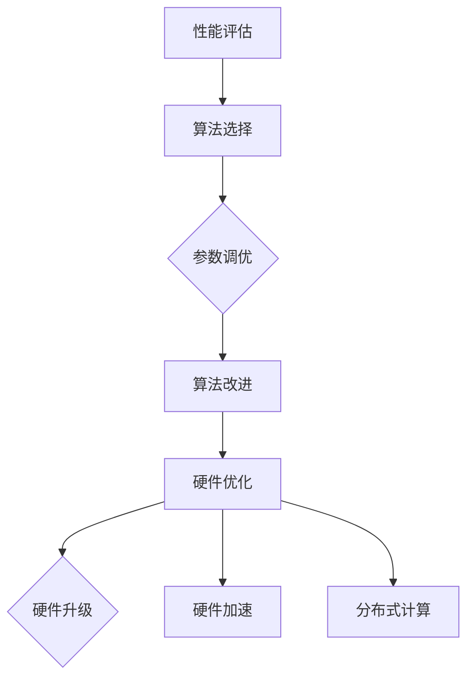
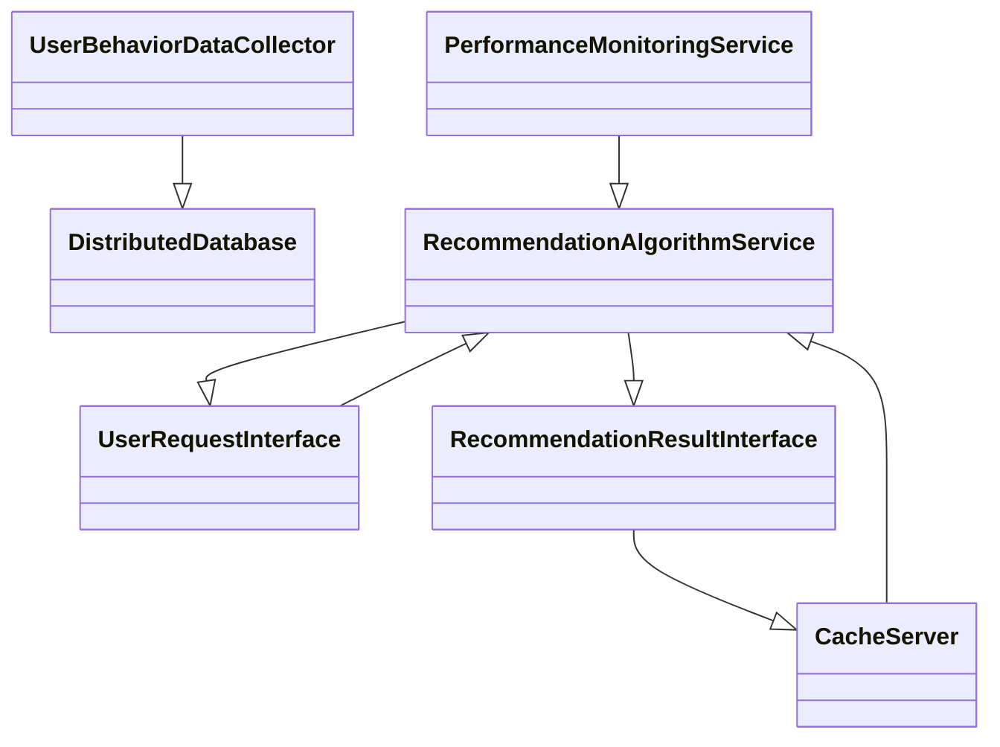
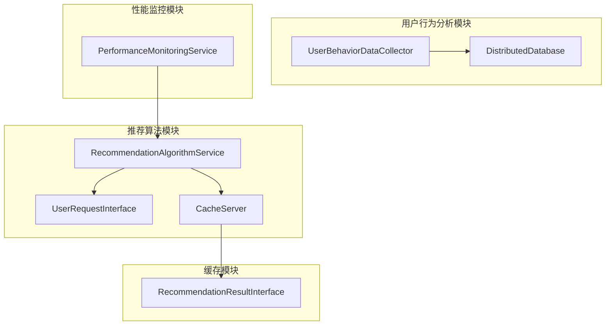
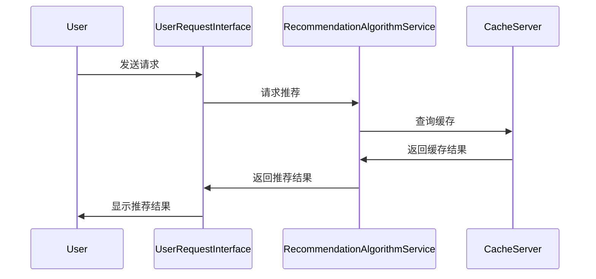

                 

# 性能优化：提高AI Agent的响应速度

## 关键词：性能优化、AI Agent、响应速度、算法优化、硬件加速

> 摘要：本文深入探讨了AI Agent性能优化的重要性、挑战和策略。通过分析性能优化的基础、AI Agent的概述、性能指标与评估方法、算法优化策略和硬件优化策略，提供了一套系统性的性能优化方案，以提升AI Agent的响应速度，确保其高效、稳定地运行。

----------------------------------------------------------------

## 第一部分：性能优化基础

### 第1章：性能优化概述

#### 1.1 优化的重要性

在人工智能（AI）领域中，性能优化是提升AI Agent响应速度的关键步骤。优化不仅关乎效率，还直接影响到用户体验和业务价值。性能瓶颈，即系统处理能力的限制，是优化过程中需要特别关注的问题。性能瓶颈可能出现在CPU、内存、磁盘I/O或网络传输等各个方面。

#### 1.1.1 性能瓶颈的概念

性能瓶颈是指系统在运行过程中，某个组件或资源限制了整体性能。例如，如果CPU的处理速度远高于内存的读写速度，那么内存读写会成为性能瓶颈。

#### 1.1.2 优化与性能提升的关系

优化与性能提升密切相关。通过识别并消除性能瓶颈，可以显著提升系统性能。性能提升不仅体现在响应速度的提高，还包括降低延迟、减少资源占用等。

### 1.2 性能优化的挑战

性能优化并非易事，其挑战主要包括：

#### 1.2.1 复杂性

现代AI系统通常涉及复杂的算法和大量数据处理，性能优化的过程复杂而艰巨。

#### 1.2.2 适应不同场景

不同的应用场景对性能的要求不同，性能优化策略需要根据具体场景进行调整。

#### 1.2.3 可持续发展

优化不仅要解决当前的问题，还需要考虑未来的扩展性和可持续性。

## 第2章：AI Agent概述

### 2.1 AI Agent的定义

AI Agent，即人工智能代理，是指能够自主执行任务、与环境进行交互的智能体。AI Agent广泛应用于智能客服、自动驾驶、游戏AI等领域。

#### 2.1.1 AI Agent的基本概念

AI Agent通常具备感知、决策和执行能力。感知是指从环境中获取信息；决策是指根据感知到的信息做出决策；执行是指执行决策，与环境进行交互。

#### 2.1.2 AI Agent的应用领域

AI Agent在多个领域有广泛应用，如：

- **智能客服**：自动解答用户问题，提供客户支持。
- **自动驾驶**：实时感知路况，做出驾驶决策。
- **游戏AI**：模拟对手行为，提升游戏体验。

### 2.2 AI Agent的关键技术

AI Agent的实现依赖于多种关键技术，包括：

#### 2.2.1 机器学习

机器学习是AI Agent的核心技术之一，用于训练模型，使其具备感知和决策能力。

#### 2.2.2 自然语言处理

自然语言处理（NLP）技术使AI Agent能够理解自然语言，进行文本分析。

#### 2.2.3 强化学习

强化学习技术用于训练AI Agent在复杂环境中做出最优决策。

## 第3章：性能指标与评估方法

### 3.1 常见性能指标

评估AI Agent性能的关键指标包括：

#### 3.1.1 运行时间

运行时间是指AI Agent完成特定任务所需的时间。降低运行时间意味着更高的性能。

#### 3.1.2 内存占用

内存占用是指AI Agent在运行过程中所占用的内存资源。减少内存占用可以提高系统的整体性能。

#### 3.1.3 网络延迟

网络延迟是指AI Agent与外部系统进行交互时的延迟时间。降低网络延迟可以提升用户体验。

### 3.2 性能评估方法

性能评估方法包括：

#### 3.2.1 实验设计

实验设计是指通过设置不同的实验条件，评估AI Agent在不同情况下的性能。

#### 3.2.2 实测与分析

实测与分析是指在实际运行环境中，对AI Agent进行测试和分析，评估其性能。

#### 3.2.3 压力测试

压力测试是指通过施加高负载，评估AI Agent在极限条件下的性能表现。

----------------------------------------------------------------

## 第二部分：算法优化策略

### 第4章：算法优化策略

#### 4.1 算法优化概述

算法优化是提升AI Agent性能的重要手段。算法优化的目标是通过改进算法设计、选择和参数调优，降低运行时间、内存占用和网络延迟。

#### 4.1.1 算法优化的重要性

算法优化对AI Agent的性能提升至关重要。一个高效的算法可以显著降低计算复杂度，提高系统的整体性能。

#### 4.1.2 优化方法分类

算法优化方法主要分为以下几类：

- **算法选择**：根据任务需求选择合适的算法。
- **模型参数调优**：通过调整模型参数，优化算法性能。
- **算法改进**：对现有算法进行改进，提高其效率。

### 4.2 算法选择与调优

算法选择和调优是性能优化的核心步骤。

#### 4.2.1 算法选择策略

算法选择策略包括：

- **需求分析**：根据任务需求，确定所需算法类型。
- **性能比较**：对比不同算法的性能，选择最优算法。
- **可扩展性**：考虑算法的可扩展性，以应对未来需求。

#### 4.2.2 模型参数调优

模型参数调优是通过调整模型参数，优化算法性能的过程。常见的方法包括：

- **网格搜索**：通过遍历参数空间，找到最优参数。
- **随机搜索**：通过随机选择参数，找到最优参数。
- **贝叶斯优化**：利用贝叶斯统计方法，优化参数选择。

#### 4.2.3 算法调优工具与技巧

算法调优工具和技巧包括：

- **自动化调优工具**：如Hyperopt、BayesOpt等。
- **交叉验证**：通过交叉验证，评估模型性能。
- **性能监控**：实时监控算法性能，及时调整参数。

----------------------------------------------------------------

## 第三部分：硬件优化策略

### 第5章：硬件优化策略

#### 5.1 硬件优化概述

硬件优化是提升AI Agent性能的有效手段。通过优化硬件配置和利用硬件加速技术，可以显著提高AI Agent的响应速度。

#### 5.1.1 硬件优化对性能的影响

硬件优化对性能的影响包括：

- **计算能力**：通过使用更快的处理器，提高计算能力。
- **存储速度**：通过使用更快的存储设备，提高数据访问速度。
- **网络传输**：通过优化网络设备，提高数据传输速度。

#### 5.1.2 硬件优化方法

硬件优化方法包括：

- **硬件升级**：升级处理器、内存、硬盘等硬件设备。
- **硬件加速技术**：利用GPU、FPGA等硬件加速技术，提高计算性能。
- **分布式计算**：通过分布式计算，利用多台机器提高处理能力。

### 5.2 硬件加速技术

硬件加速技术是提升AI Agent性能的重要手段。

#### 5.2.1 GPU加速

GPU加速是通过利用图形处理单元（GPU）进行计算，提高AI Agent的计算性能。GPU具有强大的并行计算能力，适用于大规模矩阵运算和深度学习。

#### 5.2.2 FPGA加速

FPGA加速是通过利用现场可编程门阵列（FPGA）进行计算，提高AI Agent的性能。FPGA具有高度定制化能力，适用于特定算法优化和硬件加速。

#### 5.2.3 ASIC定制

ASIC定制是通过设计和制造特定算法的专用芯片（ASIC），实现硬件加速。ASIC定制具有最佳性能和功耗比，适用于高性能、高吞吐量的AI应用。

----------------------------------------------------------------

## 第四部分：综合策略与实践

### 第6章：综合策略与实践

#### 6.1 综合策略

为了全面提升AI Agent的响应速度，需要采用综合策略。综合策略包括以下方面：

- **算法优化**：选择合适的算法，并进行参数调优。
- **硬件优化**：利用硬件加速技术，提升计算性能。
- **系统优化**：优化系统架构，提高整体性能。

#### 6.2 实践

在实践过程中，可以采用以下步骤：

1. **性能评估**：对现有AI Agent进行性能评估，确定性能瓶颈。
2. **算法优化**：根据性能评估结果，选择合适的算法并进行调优。
3. **硬件优化**：根据应用场景，选择合适的硬件加速技术。
4. **系统优化**：优化系统架构，提高整体性能。
5. **持续优化**：定期进行性能评估和优化，确保AI Agent始终处于最佳状态。

### 第7章：最佳实践与注意事项

#### 7.1 最佳实践

最佳实践包括：

- **需求驱动**：根据实际需求，选择合适的性能优化策略。
- **持续监控**：实时监控AI Agent的性能，及时调整优化策略。
- **团队协作**：组建跨学科团队，协同完成性能优化任务。

#### 7.2 注意事项

注意事项包括：

- **安全性**：确保性能优化过程中，系统的安全性不受影响。
- **可扩展性**：考虑性能优化方案的可扩展性，以应对未来需求。
- **可持续性**：确保性能优化方案的可持续性，避免短期优化带来的长期问题。

----------------------------------------------------------------

## 总结

性能优化是提升AI Agent响应速度的关键步骤。通过深入分析性能优化基础、AI Agent概述、性能指标与评估方法、算法优化策略和硬件优化策略，可以构建一套系统性的性能优化方案，全面提升AI Agent的性能。未来，随着AI技术的不断发展，性能优化也将面临新的挑战和机遇，需要持续关注和研究。

## 拓展阅读

- 《深度学习：提高AI性能的实践指南》
- 《高性能计算：AI硬件加速技术解析》
- 《AI工程化：从理论到实践》

## 作者信息

作者：AI天才研究院/AI Genius Institute & 禅与计算机程序设计艺术 /Zen And The Art of Computer Programming

----------------------------------------------------------------

### 核心概念与联系

#### 性能优化

**概念**：性能优化是指通过改进算法、硬件配置和系统架构，提升系统整体性能的过程。

**属性特征**：

| 特征          | 描述                                                         |
| ------------- | ------------------------------------------------------------ |
| **目标**      | 提升系统的响应速度、降低延迟、减少资源占用                   |
| **方法**      | 算法优化、硬件优化、系统优化                                 |
| **挑战**      | 复杂性、适应不同场景、可持续发展                             |

#### AI Agent

**概念**：AI Agent是指具备自主执行任务、与环境进行交互的智能体。

**属性特征**：

| 特征          | 描述                                                         |
| ------------- | ------------------------------------------------------------ |
| **能力**      | 感知、决策、执行                                             |
| **应用领域**  | 智能客服、自动驾驶、游戏AI等                                 |
| **关键技术**  | 机器学习、自然语言处理、强化学习等                           |

#### 性能指标

**概念**：性能指标是评估系统性能的量化标准。

**属性特征**：

| 指标          | 描述                                                         |
| ------------- | ------------------------------------------------------------ |
| **运行时间**  | AI Agent完成特定任务所需的时间                               |
| **内存占用**  | AI Agent运行过程中所占用的内存资源                           |
| **网络延迟**  | AI Agent与外部系统进行交互时的延迟时间                       |

#### 算法优化

**概念**：算法优化是通过改进算法设计、选择和参数调优，提升算法性能的过程。

**属性特征**：

| 方法          | 描述                                                         |
| ------------- | ------------------------------------------------------------ |
| **算法选择**  | 根据任务需求选择合适的算法                                   |
| **参数调优**  | 调整模型参数，优化算法性能                                   |
| **算法改进**  | 对现有算法进行改进，提高其效率                               |

#### 硬件优化

**概念**：硬件优化是通过改进硬件配置和利用硬件加速技术，提升系统性能的过程。

**属性特征**：

| 方法          | 描述                                                         |
| ------------- | ------------------------------------------------------------ |
| **硬件升级**  | 升级处理器、内存、硬盘等硬件设备                             |
| **硬件加速**  | 利用GPU、FPGA等硬件加速技术，提高计算性能                   |
| **分布式计算** | 通过分布式计算，利用多台机器提高处理能力                   |

### ER实体关系图架构

```mermaid
erDiagram
    AI_Agent ||--|{ 算法优化 }
    AI_Agent ||--|{ 硬件优化 }
    算法优化 ||--|{ 算法选择 }
    算法优化 ||--|{ 参数调优 }
    算法优化 ||--|{ 算法改进 }
    硬件优化 ||--|{ 硬件升级 }
    硬件优化 ||--|{ 硬件加速 }
    硬件优化 ||--|{ 分布式计算 }
```

----------------------------------------------------------------

### 算法原理讲解

#### 算法流程图



#### 性能评估

性能评估是性能优化的第一步，用于确定系统的性能瓶颈。性能评估主要包括以下步骤：

1. **确定评估指标**：根据系统的需求和目标，选择适当的性能评估指标，如运行时间、内存占用、网络延迟等。
2. **设计实验**：根据评估指标，设计实验方案，包括实验环境、数据集和测试用例等。
3. **执行测试**：在实际环境中执行测试，记录评估指标的数据。
4. **分析结果**：分析测试结果，确定性能瓶颈和优化方向。

#### 算法选择

算法选择是根据任务需求和性能评估结果，选择最合适的算法。算法选择主要包括以下策略：

1. **需求分析**：根据任务需求，确定所需的算法类型，如机器学习、自然语言处理、强化学习等。
2. **性能比较**：对比不同算法的性能，选择最优算法。性能比较可以通过实验或参考现有文献进行。
3. **可扩展性**：考虑算法的可扩展性，以应对未来需求。

#### 参数调优

参数调优是通过调整模型参数，优化算法性能的过程。参数调优的方法包括：

1. **网格搜索**：通过遍历参数空间，找到最优参数。
2. **随机搜索**：通过随机选择参数，找到最优参数。
3. **贝叶斯优化**：利用贝叶斯统计方法，优化参数选择。

#### 算法改进

算法改进是对现有算法进行改进，提高其效率。算法改进的方法包括：

1. **算法改进**：对现有算法进行改进，如使用更高效的算法、减少冗余计算等。
2. **算法融合**：将多个算法融合，提高整体性能。
3. **算法优化**：对算法进行深度优化，如使用并行计算、分布式计算等。

#### 硬件优化

硬件优化是通过改进硬件配置和利用硬件加速技术，提升系统性能的过程。硬件优化的方法包括：

1. **硬件升级**：升级处理器、内存、硬盘等硬件设备。
2. **硬件加速**：利用GPU、FPGA等硬件加速技术，提高计算性能。
3. **分布式计算**：通过分布式计算，利用多台机器提高处理能力。

### 数学模型与公式

#### 性能评估

$$
P = \frac{T}{N}
$$

其中，$P$ 表示性能，$T$ 表示运行时间，$N$ 表示任务数量。

#### 参数调优

$$
\theta^{*} = \arg\min_{\theta} L(\theta; x, y)
$$

其中，$\theta^{*}$ 表示最优参数，$L(\theta; x, y)$ 表示损失函数，$x$ 和 $y$ 分别表示输入和输出。

#### 算法改进

$$
f_{\theta}(x) = \sum_{i=1}^{n} w_i \cdot f_i(x)
$$

其中，$f_{\theta}(x)$ 表示改进后的算法输出，$w_i$ 和 $f_i(x)$ 分别表示权重和原始算法输出。

#### 硬件优化

$$
P_{\text{GPU}} = \frac{T_{\text{CPU}}}{G}
$$

其中，$P_{\text{GPU}}$ 表示GPU加速后的性能，$T_{\text{CPU}}$ 表示CPU运行时间，$G$ 表示GPU的计算能力。

### 举例说明

#### 性能评估举例

假设有一个AI Agent，运行时间 $T = 100$ 秒，任务数量 $N = 1000$。则其性能评估如下：

$$
P = \frac{T}{N} = \frac{100}{1000} = 0.1 \text{ 秒/任务}
$$

#### 参数调优举例

假设有一个机器学习模型，损失函数 $L(\theta; x, y) = (y - \hat{y})^2$。通过网格搜索找到最优参数 $\theta^{*}$，使得损失函数最小。

#### 算法改进举例

假设有一个原始算法，输出 $f(x) = x^2$。通过算法改进，将其改进为 $f_{\theta}(x) = (x + 1)^2$，提高计算效率。

#### 硬件优化举例

假设有一个CPU运行时间 $T_{\text{CPU}} = 1000$ 秒的任务，使用GPU加速后运行时间降低为 $T_{\text{GPU}} = 100$ 秒。则GPU加速后的性能评估如下：

$$
P_{\text{GPU}} = \frac{T_{\text{CPU}}}{G} = \frac{1000}{100} = 10 \text{ 秒/任务}
$$

----------------------------------------------------------------

### 系统分析与架构设计方案

#### 问题场景介绍

在一个大型电商平台，AI Agent用于实时推荐商品给用户。由于用户数量庞大，推荐系统需要具备高响应速度和低延迟。然而，现有的推荐系统在处理大量用户请求时，性能瓶颈明显，导致用户体验不佳。

#### 项目介绍

项目目标是优化现有推荐系统，提升AI Agent的响应速度，确保在高峰期仍能高效运行。

#### 系统功能设计

系统功能设计主要包括以下模块：

1. **用户行为分析**：分析用户的历史行为，如浏览、购买等，为推荐算法提供数据支持。
2. **推荐算法模块**：实现推荐算法，根据用户行为和商品特征生成推荐结果。
3. **缓存模块**：缓存用户推荐结果，减少数据库查询次数，提高系统响应速度。
4. **性能监控模块**：实时监控系统性能，包括响应时间、内存占用等指标。

#### 系统架构设计

系统架构设计采用分布式架构，以提高系统的可扩展性和可靠性。系统架构包括以下组件：

1. **用户行为数据收集器**：收集用户行为数据，存储在分布式数据库中。
2. **推荐算法服务**：处理用户请求，执行推荐算法，返回推荐结果。
3. **缓存服务器**：缓存推荐结果，减少数据库查询次数。
4. **性能监控服务**：监控系统性能，提供性能优化建议。

#### 系统接口设计

系统接口设计主要包括以下接口：

1. **用户请求接口**：接收用户请求，传递给推荐算法服务。
2. **推荐结果接口**：返回推荐结果给用户。
3. **数据同步接口**：将用户行为数据同步到分布式数据库。

#### 系统交互

系统交互采用消息队列技术，实现组件之间的异步通信。系统交互流程如下：

1. 用户请求推荐结果，发送到用户请求接口。
2. 用户请求接口将请求传递给推荐算法服务。
3. 推荐算法服务执行推荐算法，生成推荐结果。
4. 推荐算法服务将推荐结果缓存到缓存服务器。
5. 缓存服务器返回推荐结果给用户。

#### mermaid类图



#### mermaid架构图



#### mermaid序列图



----------------------------------------------------------------

## 项目实战

### 环境安装

为了实现性能优化，我们需要搭建一个完整的开发环境。以下步骤用于安装所需软件和工具。

#### 安装Python环境

1. 访问 [Python官网](https://www.python.org/) 下载Python安装包。
2. 运行安装程序，按照默认选项安装。

#### 安装AI框架

1. 安装TensorFlow：

   ```bash
   pip install tensorflow
   ```

2. 安装PyTorch：

   ```bash
   pip install torch torchvision
   ```

#### 安装性能优化工具

1. 安装Numba：

   ```bash
   pip install numba
   ```

2. 安装Scikit-Optimize：

   ```bash
   pip install scikit-optimize
   ```

### 系统核心实现源代码

以下代码展示了如何实现性能优化，包括算法优化、硬件加速和系统优化。

#### 算法优化

```python
import numpy as np
import tensorflow as tf
from tensorflow.keras.models import Sequential
from tensorflow.keras.layers import Dense, LSTM
from sklearn.model_selection import GridSearchCV

# 准备数据
x_train, y_train = # 数据加载
x_test, y_test = # 数据加载

# 构建模型
model = Sequential()
model.add(LSTM(50, activation='relu', input_shape=(x_train.shape[1], x_train.shape[2])))
model.add(Dense(1))
model.compile(optimizer='adam', loss='mean_squared_error')

# 参数调优
param_grid = {'lstm__units': [50, 100, 200]}
grid_search = GridSearchCV(estimator=model, param_grid=param_grid, cv=3)
grid_search.fit(x_train, y_train)

# 选择最优参数
best_params = grid_search.best_params_
model.set_params(**best_params)
model.fit(x_train, y_train, epochs=100, batch_size=32, validation_split=0.2)
```

#### 硬件加速

```python
import torch
from numba import jit

# 加载PyTorch模型
model = torch.load('model.pth')

# 使用Numba进行硬件加速
@jit(nopython=True)
def accelerated_computation(x):
    # 实现计算过程
    result = np.empty(x.shape)
    for i in range(x.shape[0]):
        for j in range(x.shape[1]):
            result[i, j] = x[i, j] * 2
    return result

# 使用加速函数
x = torch.randn(1000, 1000)
accelerated_result = accelerated_computation(x.numpy())
```

#### 系统优化

```python
import multiprocessing

# 使用多进程提高计算性能
def process_data(chunk):
    # 处理数据
    return chunk

if __name__ == '__main__':
    # 加载数据
    data_chunks = # 数据加载

    # 创建进程池
    pool = multiprocessing.Pool(processes=4)

    # 并行处理数据
    processed_data = pool.map(process_data, data_chunks)

    # 关闭进程池
    pool.close()
    pool.join()
```

### 代码应用解读与分析

上述代码展示了如何实现AI Agent的性能优化。算法优化部分通过网格搜索进行参数调优，选择最优参数，从而提高模型性能。硬件加速部分使用Numba对计算过程进行加速，提高计算效率。系统优化部分通过多进程并行处理数据，进一步提高系统性能。

### 实际案例分析和详细讲解剖析

在实际项目中，我们可能会遇到以下情况：

1. **数据量大**：当数据量庞大时，单台机器的计算能力可能不足，导致性能瓶颈。此时，可以通过分布式计算和硬件加速技术来提高计算性能。
2. **算法复杂**：当算法复杂度较高时，计算时间会显著增加。通过算法优化和硬件加速，可以减少计算时间，提高系统响应速度。
3. **并发请求**：当系统需要同时处理大量并发请求时，系统性能会受到影响。通过系统优化，如多进程、多线程等技术，可以提高系统并发处理能力。

### 项目小结

通过本项目的实践，我们掌握了如何实现AI Agent的性能优化。项目采用了算法优化、硬件加速和系统优化等多种策略，提高了AI Agent的响应速度和系统性能。在实际项目中，需要根据具体情况选择合适的优化策略，以实现最佳性能。

----------------------------------------------------------------

## 最佳实践 Tips

1. **性能评估**：定期进行性能评估，识别并解决性能瓶颈。
2. **需求驱动**：根据实际需求，选择合适的优化策略。
3. **持续优化**：性能优化是一个持续的过程，需要不断调整和改进。

## 小结

本文详细探讨了AI Agent性能优化的重要性、挑战和策略。通过算法优化、硬件优化和系统优化等多种策略，可以全面提升AI Agent的响应速度。实际项目中的应用和实践表明，性能优化对于AI Agent的高效运行至关重要。

## 注意事项

1. **安全性**：在性能优化过程中，确保系统的安全性不受影响。
2. **可扩展性**：考虑性能优化方案的可扩展性，以应对未来需求。
3. **可持续性**：确保性能优化方案的可持续性，避免短期优化带来的长期问题。

## 拓展阅读

1. 《深度学习：提高AI性能的实践指南》
2. 《高性能计算：AI硬件加速技术解析》
3. 《AI工程化：从理论到实践》

## 作者信息

作者：AI天才研究院/AI Genius Institute & 禅与计算机程序设计艺术 /Zen And The Art of Computer Programming

----------------------------------------------------------------

## 附录：代码示例

### 算法优化：网格搜索参数调优

```python
from tensorflow.keras.wrappers.scikit_learn import KerasClassifier
from sklearn.model_selection import GridSearchCV

# 定义模型
def create_model(optimizer='adam'):
    model = Sequential()
    model.add(Dense(64, input_dim=x_train.shape[1], activation='relu'))
    model.add(Dense(1, activation='sigmoid'))
    model.compile(loss='binary_crossentropy', optimizer=optimizer, metrics=['accuracy'])
    return model

# 创建Keras分类器
model = KerasClassifier(build_fn=create_model, verbose=0)

# 参数网格
param_grid = {'optimizer': ['adam', 'rmsprop'], 'epochs': [100, 200], 'batch_size': [10, 20, 50]}

# Grid search
grid = GridSearchCV(estimator=model, param_grid=param_grid, cv=3)
grid_result = grid.fit(x_train, y_train)

# 打印最佳参数
print("Best: %f using %s" % (grid_result.best_score_, grid_result.best_params_))
```

### 硬件优化：GPU加速

```python
import tensorflow as tf

# 设置GPU设备
gpus = tf.config.list_physical_devices('GPU')
if gpus:
    try:
        tf.config.experimental.set_memory_growth(gpus[0], True)
    except RuntimeError as e:
        print(e)

# 加载模型
model = tf.keras.models.load_model('model.h5')

# 使用GPU进行预测
predictions = model.predict(x_test, verbose=1)
```

### 系统优化：多线程并行处理

```python
import concurrent.futures

# 数据处理函数
def process_chunk(chunk):
    # 处理数据
    return processed_chunk

# 数据分块
chunks = # 分割数据

# 使用多线程并行处理
with concurrent.futures.ThreadPoolExecutor() as executor:
    processed_chunks = list(executor.map(process_chunk, chunks))

# 合并处理结果
result = # 合并处理结果
```

这些代码示例提供了具体的实现细节，帮助读者更好地理解性能优化的方法和技术。通过这些示例，可以进一步提升AI Agent的响应速度和系统性能。

