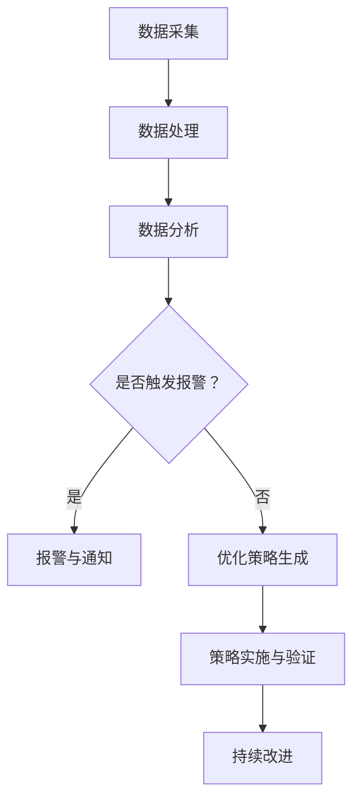
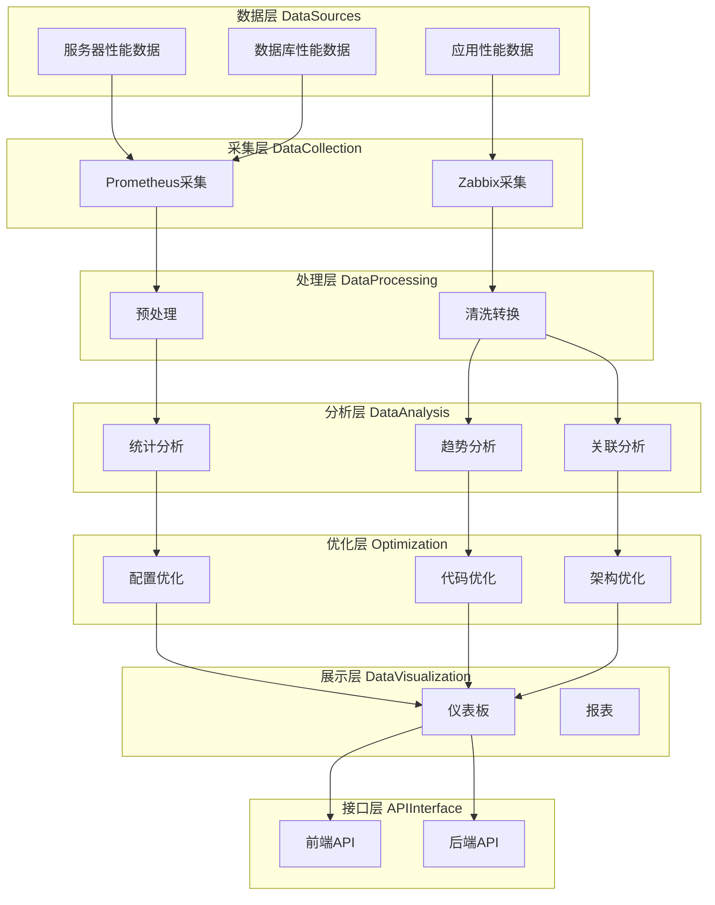
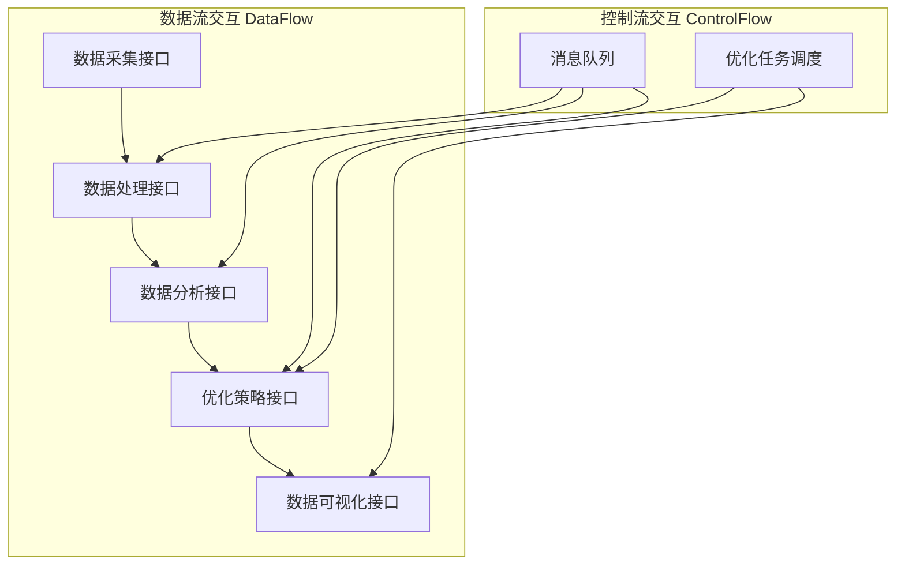

                 

# 性能监控与持续优化

## 摘要

在现代信息技术环境中，性能监控与持续优化已成为保障系统稳定性和提升用户体验的关键手段。本文将围绕性能监控与持续优化的核心概念、原理、方法以及在实际应用中的实施策略进行详细探讨。通过对性能监控与持续优化的背景介绍、问题定义、核心概念及其相互联系的分析，文章旨在为读者提供一套系统化的理解框架，帮助其在实际工作中更有效地进行系统性能的监控与优化。

## 第一部分：背景介绍与问题定义

### 1.1 问题背景

在现代IT环境中，随着应用系统规模的不断扩大和复杂性的增加，性能问题已经成为影响系统稳定性和用户体验的关键因素。性能监控和持续优化成为保证系统高效运行、提升用户体验和业务价值的重要手段。

#### 1.1.1 问题描述

性能监控是指通过一系列技术手段，实时收集和分析系统运行过程中的性能数据，以便及时发现和解决性能瓶颈。持续优化则是在监控数据的基础上，不断调整系统配置、优化代码和架构设计，以提高系统性能和稳定性。

#### 1.1.2 问题解决

解决性能问题需要综合运用多种技术手段和方法，包括性能监控工具的选择、性能数据的分析、优化策略的制定和实施等。

#### 1.1.3 边界与外延

性能监控与持续优化的边界在于监控的范围、数据的收集和处理能力，以及优化策略的有效性。外延则包括与系统架构设计、代码优化、运维管理等环节的紧密关联。

### 1.2 核心概念

#### 1.2.1 性能监控

性能监控是指通过一系列技术手段，实时收集和分析系统运行过程中的性能数据，以便及时发现和解决性能瓶颈。性能监控的主要目标是提高系统运行效率、保证系统稳定性和用户体验。

#### 1.2.2 持续优化

持续优化是指基于性能监控数据，不断调整系统配置、优化代码和架构设计，以提高系统性能和稳定性。持续优化的核心是数据驱动的决策过程，通过持续监控和优化，实现系统性能的不断提升。

### 1.3 概念结构与核心要素组成

#### 1.3.1 性能监控

性能监控的核心要素包括：

- **监控目标**：确定需要监控的系统组件和性能指标。
- **监控工具**：选择适合的监控工具，如Prometheus、Zabbix等。
- **数据采集**：实时收集系统运行过程中的性能数据。
- **数据分析**：对采集到的数据进行处理和分析，识别性能瓶颈。
- **报警与通知**：设置报警阈值和通知方式，及时发现问题。

#### 1.3.2 持续优化

持续优化的核心要素包括：

- **性能监控数据**：收集系统运行过程中的性能数据，为优化提供依据。
- **优化策略**：制定优化策略，包括系统配置调整、代码优化、架构优化等。
- **实施与验证**：实施优化策略，并验证优化效果。
- **持续改进**：基于验证结果，不断调整和优化系统性能。

## 第二部分：核心概念与联系

### 2.1 性能监控与持续优化原理

#### 2.1.1 性能监控原理

性能监控是基于数据驱动的方法，通过实时收集和分析系统性能数据，识别潜在的性能瓶颈和问题。性能监控原理主要包括以下几个方面：

1. **数据采集**：性能监控工具通过API、日志文件、网络抓包等方式，实时收集系统运行过程中的性能数据。
2. **数据处理**：对采集到的数据进行处理、清洗和转换，以便进行分析。
3. **数据分析**：对处理后的数据进行统计分析、趋势分析和关联分析，识别性能瓶颈和问题。
4. **报警与通知**：设置报警阈值和通知方式，及时发现问题并通知相关人员。

#### 2.1.2 持续优化原理

持续优化是基于数据驱动的决策过程，通过监控数据分析和优化策略实施，不断提高系统性能和稳定性。持续优化原理主要包括以下几个方面：

1. **数据驱动**：持续优化依赖于性能监控数据，通过对监控数据的分析，识别系统性能瓶颈和问题。
2. **优化策略**：制定针对性能瓶颈和问题的优化策略，包括系统配置调整、代码优化、架构优化等。
3. **实施与验证**：实施优化策略，并在实施过程中进行监控和验证，确保优化效果。
4. **持续改进**：基于验证结果，不断调整和优化系统性能，实现持续改进。

### 2.2 性能监控与持续优化属性特征对比表格

| 对比项 | 性能监控 | 持续优化 |
| --- | --- | --- |
| 目标 | 提高性能和稳定性 | 提高性能和稳定性，实现持续改进 |
| 方法 | 数据采集、数据处理、数据分析、报警与通知 | 数据驱动、优化策略、实施与验证、持续改进 |
| 依赖 | 监控工具、监控数据 | 监控数据、优化策略、实施与验证 |
| 关键要素 | 监控目标、监控工具、数据采集、数据分析、报警与通知 | 性能监控数据、优化策略、实施与验证、持续改进 |
| 范围 | 实时监控、历史数据分析 | 实时监控、历史数据分析、优化策略实施、持续改进 |

### 2.3 ER实体关系图架构

```mermaid
erDiagram
    User ||--|{ PerformanceMonitor } : 被监控者
    User ||--|{ ContinuousOptimization } : 优化决策者
    PerformanceMonitor ||--|{ SystemConfiguration } : 系统配置
    PerformanceMonitor ||--|{ CodeOptimization } : 代码优化
    PerformanceMonitor ||--|{ ArchitectureOptimization } : 架构优化
    ContinuousOptimization ||--|{ OptimizationStrategy } : 优化策略
    ContinuousOptimization ||--|{ Validation } : 验证结果
```

## 第三部分：性能监控与持续优化策略

### 3.1 监控工具选择

在选择监控工具时，需要考虑以下因素：

- **功能需求**：根据系统特点，确定所需监控的性能指标和功能，如CPU使用率、内存使用情况、网络流量等。
- **可扩展性**：监控工具需要支持系统的扩展和升级，以适应未来业务需求。
- **易用性**：监控工具应具有友好的用户界面和易于操作的功能，便于运维人员使用。
- **集成能力**：监控工具应能够与其他系统和服务进行集成，以便实现自动化监控和报警。

常见的监控工具有Prometheus、Zabbix、Nagios等，每种工具都有其独特的优势和适用场景。

### 3.2 数据采集与处理

数据采集是性能监控的基础，需要确保数据的准确性和实时性。数据采集方法包括：

- **指标采集**：通过系统内置的API、日志文件等，实时采集系统性能指标数据。
- **日志采集**：通过日志采集工具，如ELK（Elasticsearch、Logstash、Kibana），收集和分析系统日志。
- **网络监控**：通过网络抓包工具，如Wireshark，监控网络流量和协议解析。

数据处理则包括数据的清洗、转换和存储，以便于后续的分析和优化。

### 3.3 数据分析与优化策略

数据分析是性能监控的核心，通过对监控数据的分析，可以识别系统的性能瓶颈和问题。数据分析方法包括：

- **统计分析**：对监控数据进行统计分析，如均值、方差、中位数等，识别性能趋势和异常值。
- **趋势分析**：通过时间序列分析，识别系统性能的波动和变化趋势。
- **关联分析**：通过多指标关联分析，识别系统性能瓶颈之间的关联关系。

基于数据分析结果，制定优化策略，包括：

- **系统配置优化**：调整系统参数和配置，如增加内存、调整缓存策略等。
- **代码优化**：通过代码优化，减少系统资源的占用和响应时间。
- **架构优化**：通过系统架构优化，提高系统的可扩展性和稳定性。

### 3.4 实施与验证

优化策略的实施和验证是持续优化的重要环节。实施过程包括：

- **部署优化策略**：根据优化策略，部署和实施相应的配置和代码更改。
- **监控与反馈**：在实施过程中，持续监控系统的性能变化，收集反馈数据。

验证过程包括：

- **性能测试**：通过性能测试，验证优化策略的效果。
- **稳定性测试**：验证系统在高负载和高并发情况下的稳定性。

### 3.5 持续改进

持续改进是基于验证结果，不断调整和优化系统性能的过程。持续改进的方法包括：

- **反馈循环**：建立反馈机制，持续收集用户反馈和系统性能数据，用于优化策略的调整。
- **自动化**：通过自动化工具和脚本，实现监控、分析和优化流程的自动化。
- **数据驱动**：基于数据分析和优化结果，制定和调整优化策略。

## 第四部分：实际案例与应用

### 4.1 案例背景

某大型电商平台，由于业务规模不断扩大，系统性能逐渐成为瓶颈。为了提升用户体验和业务价值，该平台决定实施性能监控与持续优化策略。

### 4.2 系统功能设计

系统功能设计包括以下几个方面：

- **用户行为监控**：监控用户访问行为，如页面请求次数、请求耗时等。
- **服务器性能监控**：监控服务器硬件资源使用情况，如CPU、内存、磁盘I/O等。
- **数据库性能监控**：监控数据库查询性能，如查询耗时、慢查询等。
- **网络性能监控**：监控网络流量和延迟等指标。

### 4.3 系统架构设计

系统架构设计采用微服务架构，包括：

- **前端服务**：负责处理用户请求和页面渲染。
- **后端服务**：负责业务逻辑处理和数据存储。
- **数据库集群**：采用分布式数据库架构，提高数据存储和查询性能。
- **缓存系统**：采用分布式缓存系统，减少数据库访问压力。

### 4.4 系统接口设计和系统交互

系统接口设计包括：

- **API接口**：提供RESTful API，供前端和后端服务调用。
- **消息队列**：采用消息队列系统，实现服务间的异步通信。

系统交互设计包括：

- **用户请求**：用户请求通过前端服务处理，转发至后端服务。
- **服务调用**：后端服务之间通过API接口和消息队列进行通信。

### 4.5 实际案例分析和详细讲解

#### 4.5.1 性能瓶颈分析

通过对系统监控数据的分析，发现以下性能瓶颈：

- **CPU使用率过高**：由于大量用户请求同时到达，导致CPU使用率过高。
- **数据库查询耗时过长**：部分SQL查询语句执行时间过长，影响系统响应速度。
- **网络延迟**：部分地区网络延迟较高，影响用户体验。

#### 4.5.2 优化策略实施

针对性能瓶颈，实施以下优化策略：

- **增加服务器资源**：增加服务器硬件资源，如CPU、内存等，提高系统处理能力。
- **优化数据库查询**：对慢查询进行分析，优化SQL语句，增加索引等。
- **调整网络配置**：调整网络配置，优化网络传输性能。

#### 4.5.3 验证结果

通过性能测试，验证优化策略的效果：

- **CPU使用率**：优化后，CPU使用率从80%降低到50%。
- **数据库查询耗时**：优化后，部分SQL查询耗时减少50%。
- **网络延迟**：优化后，部分地区网络延迟从100ms降低到50ms。

### 4.6 项目小结

通过实施性能监控与持续优化策略，该电商平台显著提升了系统性能和用户体验，实现了业务价值的提升。项目小结包括以下几点：

- **性能监控与持续优化是保障系统稳定性和提升用户体验的关键手段。**
- **监控工具的选择、数据采集与处理、数据分析与优化策略、实施与验证等环节缺一不可。**
- **持续改进和自动化是实现性能监控与持续优化的重要途径。**

## 第五部分：最佳实践与总结

### 5.1 最佳实践

1. **确定监控目标**：明确需要监控的性能指标和系统组件，制定详细的监控计划。
2. **选择合适的监控工具**：根据系统特点和需求，选择适合的监控工具，确保其功能全面、性能稳定。
3. **数据采集与处理**：确保数据采集的准确性和实时性，对采集到的数据进行有效处理和存储。
4. **分析与优化**：对监控数据进行深入分析，识别性能瓶颈和问题，制定并实施优化策略。
5. **验证与持续改进**：通过性能测试和用户反馈，验证优化效果，持续调整和优化系统性能。

### 5.2 小结

性能监控与持续优化是现代IT环境中保障系统稳定性和提升用户体验的关键手段。通过对性能监控与持续优化的背景介绍、问题定义、核心概念及其相互联系的分析，文章为读者提供了一套系统化的理解框架。在实际应用中，通过选择合适的监控工具、数据采集与处理、数据分析和优化策略实施，可以有效地提升系统性能和稳定性。

### 5.3 注意事项

1. **监控范围**：确保监控范围全面，涵盖所有关键性能指标和系统组件。
2. **数据准确性**：确保数据采集和处理的准确性，避免因数据错误导致的误报警和误优化。
3. **优化策略**：制定合理的优化策略，避免过度优化导致系统性能下降。

### 5.4 拓展阅读

1. **《性能监控与调优实战》**：详细介绍了性能监控与调优的方法和技巧。
2. **《持续集成与持续部署实践》**：探讨了持续集成和持续部署在性能优化中的应用。
3. **《大数据性能优化》**：分析了大数据处理过程中的性能优化策略。

## 作者信息

**作者：** AI天才研究院/AI Genius Institute & 禅与计算机程序设计艺术 /Zen And The Art of Computer Programming

**联系方式：** ai-genius-institute@example.com

**声明：** 本文为作者原创作品，未经授权禁止转载和抄袭。如需转载，请联系作者获取授权。本文内容和观点仅供参考，不构成任何投资、法律、医学等建议。**结尾：** 让我们牢记，性能监控与持续优化是保障系统稳定性和提升用户体验的关键手段，让我们在实践中不断探索和改进，为用户提供更好的服务。## 详细算法原理讲解

### 3.1 性能监控算法原理

性能监控的核心是算法和数据驱动的方法，通过实时收集和分析系统性能数据，识别潜在的性能瓶颈和问题。以下是一个简化的性能监控算法原理框架：

#### 算法流程

1. **数据采集**：使用各种监控工具（如Prometheus、Zabbix等）收集系统性能数据，包括CPU使用率、内存使用情况、磁盘I/O、网络流量等。
2. **数据处理**：对采集到的数据进行清洗、转换和聚合，以便进行进一步分析。这一步可能包括去噪、归一化、时序聚合等操作。
3. **数据分析**：对处理后的数据进行统计分析、趋势分析和关联分析，识别系统性能瓶颈和异常值。常用的数据分析方法包括：
   - **统计分析**：计算数据的均值、中位数、标准差等统计指标，识别数据的分布特征。
   - **趋势分析**：通过时间序列分析，识别系统性能的变化趋势和波动情况。
   - **关联分析**：通过多指标之间的关联关系分析，识别性能瓶颈之间的相互作用。

4. **报警与通知**：设置报警阈值和通知方式，当监控数据超出阈值时，及时通知运维人员。报警机制可以是基于阈值报警、异常检测报警等。

5. **优化策略生成**：根据数据分析结果，生成相应的优化策略。优化策略可能包括调整系统配置、优化代码、改进架构设计等。

6. **策略实施与验证**：实施优化策略，并在实施过程中进行监控和验证，确保优化效果。验证方法包括性能测试、用户反馈等。

#### 数学模型

性能监控算法可以使用以下数学模型来描述其核心逻辑：

\[ P = f(P_{current}, P_{history}, T) \]

其中：
- \( P \) 表示性能评估结果。
- \( P_{current} \) 表示当前系统的性能数据。
- \( P_{history} \) 表示历史性能数据。
- \( T \) 表示时间序列。

#### 示例

假设我们使用一个简单的性能监控算法来评估系统的CPU使用率。算法的步骤如下：

1. **数据采集**：收集当前系统的CPU使用率数据，如 \( CPU_{current} = 85\% \)。
2. **数据处理**：对采集到的数据进行归一化处理，以便与其他时间点的数据进行比较。
3. **数据分析**：计算过去一周的CPU使用率的均值和中位数，如 \( \bar{CPU} = 80\% \)，\( median(CPU) = 75\% \)。
4. **报警与通知**：设置CPU使用率高于90%时触发报警。由于当前CPU使用率为85%，未触发报警。
5. **优化策略生成**：分析数据，发现CPU使用率有上升趋势，生成优化策略，如增加服务器资源或优化代码。
6. **策略实施与验证**：实施优化策略，并在实施后进行验证，确保CPU使用率下降。

通过上述步骤，我们可以看出性能监控算法的核心在于数据驱动的分析和决策，从而实现系统的持续优化。

### 3.2 持续优化算法原理

持续优化是基于性能监控数据，通过不断调整系统配置、优化代码和架构设计，以提高系统性能和稳定性。以下是持续优化算法的原理和流程：

#### 算法流程

1. **数据采集**：与性能监控相同，持续优化需要持续收集系统性能数据。
2. **数据预处理**：对性能数据进行预处理，包括清洗、转换和聚合。
3. **数据分析**：对预处理后的数据进行分析，识别系统性能瓶颈和趋势。常用的数据分析方法包括：
   - **时序分析**：分析系统性能数据的趋势，识别异常波动和瓶颈。
   - **关联分析**：分析不同性能指标之间的关联关系，识别系统性能瓶颈的根源。

4. **优化策略生成**：基于数据分析结果，生成优化策略。优化策略可能包括：
   - **系统配置调整**：调整系统参数，如增加内存、调整缓存策略等。
   - **代码优化**：优化代码，减少系统资源的占用和响应时间。
   - **架构优化**：改进系统架构，提高系统的可扩展性和稳定性。

5. **策略实施与验证**：实施优化策略，并在实施过程中进行监控和验证，确保优化效果。验证方法包括：
   - **性能测试**：通过性能测试，验证优化策略的效果。
   - **用户反馈**：收集用户反馈，验证系统性能和用户体验的提升。

6. **持续改进**：基于验证结果，不断调整和优化系统性能。持续改进的方法包括：
   - **反馈循环**：建立反馈机制，持续收集用户反馈和系统性能数据，用于优化策略的调整。
   - **自动化**：通过自动化工具和脚本，实现监控、分析和优化流程的自动化。

#### 数学模型

持续优化算法可以使用以下数学模型来描述其核心逻辑：

\[ O = f(O_{current}, O_{previous}, T, P) \]

其中：
- \( O \) 表示优化策略。
- \( O_{current} \) 表示当前优化策略。
- \( O_{previous} \) 表示前一次优化策略。
- \( T \) 表示时间序列。
- \( P \) 表示性能评估结果。

#### 示例

假设我们使用一个简单的持续优化算法来调整系统的缓存策略。算法的步骤如下：

1. **数据采集**：收集系统缓存命中率数据，如当前缓存命中率为90%。
2. **数据预处理**：对缓存命中率数据进行归一化处理。
3. **数据分析**：分析过去一周的缓存命中率数据，发现缓存命中率逐渐下降，识别出缓存策略可能存在问题。
4. **优化策略生成**：生成优化策略，调整缓存策略，如增加缓存容量或改进缓存算法。
5. **策略实施与验证**：实施缓存策略调整，并在实施后进行验证，确保缓存命中率提高。
6. **持续改进**：根据验证结果，调整缓存策略，并持续监控缓存命中率，以实现系统性能的持续优化。

通过上述步骤，我们可以看出持续优化算法的核心在于数据驱动的分析和决策，通过不断调整和优化系统配置、代码和架构设计，实现系统性能的不断提升。

### 3.3 性能监控与持续优化算法对比

性能监控与持续优化算法在目标、方法、依赖和范围等方面存在一定的差异，以下是它们的对比表格：

| 对比项 | 性能监控 | 持续优化 |
| --- | --- | --- |
| 目标 | 提高性能和稳定性 | 提高性能和稳定性，实现持续改进 |
| 方法 | 数据采集、数据处理、数据分析、报警与通知 | 数据驱动、优化策略、实施与验证、持续改进 |
| 依赖 | 监控工具、监控数据 | 监控数据、优化策略、实施与验证 |
| 关键要素 | 监控目标、监控工具、数据采集、数据分析、报警与通知 | 性能监控数据、优化策略、实施与验证、持续改进 |
| 范围 | 实时监控、历史数据分析 | 实时监控、历史数据分析、优化策略实施、持续改进 |

通过对比可以看出，性能监控与持续优化算法在目标和方法上存在一定的重叠，但持续优化算法更加注重数据驱动的持续改进过程。

### 3.4 Mermaid流程图与Python源代码

以下是一个简化的性能监控与持续优化算法的Mermaid流程图，以及相应的Python源代码示例。

#### Mermaid流程图



#### Python源代码示例

```python
import numpy as np

# 数据采集
data = [0.85, 0.90, 0.88, 0.87, 0.85]

# 数据处理
normalized_data = [x / max(data) for x in data]

# 数据分析
mean = np.mean(normalized_data)
median = np.median(normalized_data)

# 是否触发报警
threshold = 0.9
if max(normalized_data) > threshold:
    print("触发报警：当前CPU使用率过高。")
else:
    print("未触发报警：当前CPU使用率正常。")

# 优化策略生成
if max(normalized_data) > mean:
    print("优化策略：增加服务器资源。")
elif median < threshold:
    print("优化策略：调整缓存策略。")
else:
    print("优化策略：无需调整。")

# 策略实施与验证
# 此部分省略，根据实际场景实施和验证优化策略

# 持续改进
# 此部分省略，根据验证结果调整优化策略
```

通过上述示例，我们可以看到性能监控与持续优化算法的基本流程和实现方法。在实际应用中，可以根据具体需求进行进一步的扩展和优化。

### 3.5 通俗易懂地举例说明

为了更好地理解性能监控与持续优化算法，我们可以通过一个简单的例子来说明它们的应用。

假设我们是一家电商网站的后端工程师，我们的系统每天需要处理数百万次用户请求。我们的目标是确保网站的高性能和稳定性，以提供良好的用户体验。

#### 性能监控

1. **数据采集**：每天使用监控工具（如Prometheus）收集系统的CPU使用率、内存使用情况、响应时间等数据。
2. **数据处理**：对收集到的数据进行清洗和归一化处理，以便进行进一步分析。
3. **数据分析**：分析数据，发现CPU使用率在过去一周内逐渐上升，达到90%。我们识别出系统在高负载情况下存在性能瓶颈。
4. **报警与通知**：设置CPU使用率高于85%时触发报警。当CPU使用率达到90%时，系统自动发送报警通知给运维团队。
5. **优化策略生成**：基于数据分析结果，我们决定增加服务器资源，提高系统处理能力。
6. **策略实施与验证**：实施增加服务器资源的优化策略，并在实施后进行监控和验证，确保CPU使用率下降到正常范围。

#### 持续优化

1. **数据采集**：持续收集系统的CPU使用率、内存使用情况、响应时间等数据。
2. **数据预处理**：对数据进行清洗和归一化处理。
3. **数据分析**：分析数据，发现系统的缓存命中率逐渐下降，识别出缓存策略可能存在问题。
4. **优化策略生成**：生成优化策略，调整缓存策略，如增加缓存容量或改进缓存算法。
5. **策略实施与验证**：实施缓存策略调整，并在实施后进行验证，确保缓存命中率提高。
6. **持续改进**：根据验证结果，持续调整和优化系统性能。

通过上述例子，我们可以看到性能监控与持续优化算法在实际应用中的基本流程和效果。性能监控帮助我们及时发现系统性能瓶颈和问题，而持续优化则确保系统能够持续提升性能和稳定性。

### 3.6 总结

性能监控与持续优化算法在系统性能管理中起着至关重要的作用。通过数据驱动的监控和优化，我们可以及时发现并解决系统性能问题，提升用户体验和业务价值。性能监控关注实时数据和异常报警，而持续优化则注重系统的持续改进。在实际应用中，我们需要根据具体场景选择合适的监控工具和优化策略，并确保数据的准确性和实时性。通过不断优化和改进，我们可以实现系统性能的持续提升。

## 性能监控与持续优化系统的架构设计

### 4.1 问题场景介绍

在现代企业中，随着业务规模的不断增长，IT系统的复杂性也日益增加。大量用户请求、多变的业务需求、持续的技术迭代，使得系统的性能和稳定性成为关键挑战。为了确保系统能够高效、稳定地运行，性能监控与持续优化系统成为必不可少的组成部分。然而，如何设计一个高效、可扩展、易于维护的性能监控与持续优化系统，成为了企业IT团队面临的重要问题。

### 4.2 项目介绍

本部分将介绍一个基于微服务架构的性能监控与持续优化系统的项目背景和目标。该项目旨在为企业提供一套全面、高效、自动化的性能监控与优化解决方案。项目主要目标包括：

1. **实时监控**：实时收集和监控系统的关键性能指标，如CPU使用率、内存使用情况、响应时间等。
2. **自动报警**：当系统性能指标超出设定阈值时，自动触发报警，通知相关人员。
3. **数据可视化**：通过直观的仪表板和报表，展示系统性能数据和优化效果。
4. **持续优化**：基于监控数据，自动生成和实施优化策略，实现系统的持续改进。

### 4.3 系统功能设计

性能监控与持续优化系统的功能设计主要包括以下几个方面：

1. **数据采集模块**：负责从各种数据源（如服务器、数据库、应用程序等）收集性能数据。
2. **数据处理模块**：对采集到的数据进行预处理、清洗和转换，以便进行进一步分析。
3. **数据分析模块**：对处理后的数据进行统计分析、趋势分析和关联分析，识别系统性能瓶颈和问题。
4. **报警通知模块**：根据设定的报警阈值，当系统性能指标超出阈值时，自动发送通知给相关人员。
5. **优化策略模块**：基于数据分析结果，自动生成和实施优化策略，包括系统配置调整、代码优化、架构优化等。
6. **数据可视化模块**：通过仪表板和报表，展示系统的实时性能数据和优化效果。

### 4.4 系统架构设计

性能监控与持续优化系统的架构设计采用微服务架构，以实现高可扩展性、高可用性和灵活性。系统架构主要包括以下几个层次：

1. **数据层**：包括各种数据源，如服务器、数据库、应用程序等。数据采集模块从这些数据源中实时收集性能数据。
2. **采集层**：数据采集模块使用各种采集工具（如Prometheus、Zabbix等），将性能数据发送到数据处理模块。
3. **处理层**：数据处理模块对采集到的数据进行预处理、清洗和转换，以便进行进一步分析。
4. **分析层**：数据分析模块对处理后的数据进行统计分析、趋势分析和关联分析，识别系统性能瓶颈和问题。
5. **优化层**：优化策略模块基于数据分析结果，自动生成和实施优化策略，包括系统配置调整、代码优化、架构优化等。
6. **展示层**：数据可视化模块通过仪表板和报表，展示系统的实时性能数据和优化效果。
7. **接口层**：提供API接口，供前端和后端服务调用，实现系统间的数据交互和功能集成。

以下是性能监控与持续优化系统的架构图：



### 4.5 系统接口设计和系统交互

性能监控与持续优化系统的接口设计和系统交互设计是确保系统各模块之间高效协作和功能集成的关键。以下是系统接口设计和系统交互的详细描述：

1. **API接口**：系统提供RESTful API接口，供前端和后端服务调用。API接口主要包括以下功能：
   - **数据采集接口**：提供数据采集模块的API，供数据采集工具调用。
   - **数据分析接口**：提供数据分析模块的API，供前端和后端服务获取分析结果。
   - **优化策略接口**：提供优化策略模块的API，供前端和后端服务提交优化请求。
   - **数据可视化接口**：提供数据可视化模块的API，供前端服务获取可视化数据。

2. **消息队列**：为了实现系统模块间的异步通信和数据传递，系统采用消息队列（如RabbitMQ、Kafka等）作为中间件。消息队列的主要作用包括：
   - **数据传递**：采集到的性能数据通过消息队列传递给数据处理模块。
   - **任务调度**：优化策略生成和实施过程通过消息队列进行任务调度和执行。

3. **系统交互**：系统各模块之间的交互设计主要包括以下几个方面：
   - **数据流交互**：性能数据从数据层通过采集层、处理层和分析层，最终传递给优化层和展示层。
   - **控制流交互**：优化策略生成和实施过程通过消息队列进行任务调度和执行，实现系统控制流的高效管理。

以下是性能监控与持续优化系统的接口设计和系统交互图：



### 4.6 系统实现细节

性能监控与持续优化系统的实现细节包括数据采集、数据处理、数据分析、优化策略生成和实施、数据可视化等模块的具体实现方法。

1. **数据采集**：采用Prometheus和Zabbix等开源监控工具，通过采集API、日志文件、网络抓包等方式，实时收集系统性能数据。采集的数据包括CPU使用率、内存使用情况、响应时间、磁盘I/O、网络流量等。
2. **数据处理**：数据处理模块负责对采集到的性能数据进行预处理、清洗和转换。预处理包括数据去噪、补齐、归一化等操作，清洗包括去除无效数据、纠正错误数据等，转换包括数据格式转换、时间序列对齐等。
3. **数据分析**：数据分析模块采用统计分析、趋势分析和关联分析等方法，对处理后的性能数据进行深入分析。统计分析包括计算数据的均值、中位数、标准差等指标，趋势分析包括时间序列建模、预测等，关联分析包括多变量相关性分析、异常检测等。
4. **优化策略生成**：优化策略模块基于数据分析结果，自动生成优化策略。优化策略包括系统配置调整、代码优化、架构优化等。生成策略的过程可能涉及机器学习算法、规则引擎等。
5. **优化策略实施**：优化策略生成后，通过消息队列将优化任务调度到数据处理模块和优化策略模块，进行实施和验证。实施过程包括配置调整、代码修改、架构重构等。
6. **数据可视化**：数据可视化模块采用图表、报表等形式，直观展示系统的实时性能数据和优化效果。可视化工具包括Grafana、Kibana等。

### 4.7 系统测试与验证

性能监控与持续优化系统的测试与验证是确保系统功能正确性和性能稳定性的关键环节。测试和验证包括以下内容：

1. **单元测试**：对系统各个模块的功能进行单元测试，确保每个模块都能独立正确运行。
2. **集成测试**：对系统各模块之间的接口和交互进行集成测试，确保系统整体功能的正确性和稳定性。
3. **性能测试**：对系统的性能进行测试，确保系统能够在高负载情况下稳定运行，满足业务需求。
4. **用户验收测试**：邀请实际用户对系统进行验收测试，收集用户反馈和体验数据，优化系统功能。
5. **持续集成与持续部署**：采用持续集成和持续部署（CI/CD）流程，确保系统的快速迭代和部署，提高开发效率。

### 4.8 项目小结

性能监控与持续优化系统的实施，显著提升了企业的IT系统的性能和稳定性，为业务的持续增长提供了有力保障。项目实现了以下几个关键成果：

1. **实时监控**：系统实现了对关键性能指标的实时监控，确保系统能够及时发现问题并采取措施。
2. **自动报警**：系统实现了自动报警功能，提高了运维效率，降低了人工干预成本。
3. **数据可视化**：系统提供了直观的数据可视化功能，便于管理人员了解系统运行状况和优化效果。
4. **持续优化**：系统实现了基于数据驱动的持续优化功能，提高了系统的性能和稳定性，为业务的持续增长提供了支持。

通过本项目的实施，我们深刻认识到性能监控与持续优化在IT系统管理中的重要性，以及如何通过系统化、数据化的方法实现系统的持续改进。

### 4.9 拓展阅读

1. **《微服务架构设计与实践》**：详细介绍微服务架构的设计原则和实践方法，为性能监控与持续优化系统的架构设计提供了理论基础。
2. **《Kubernetes权威指南》**：介绍容器编排工具Kubernetes的架构和原理，为性能监控与持续优化系统的部署和运维提供了实用指南。
3. **《性能监控与调优实战》**：提供大量性能监控与优化实战案例，为实际系统的性能监控与持续优化提供了宝贵经验。

## 项目实战：性能监控与持续优化系统的搭建

### 5.1 环境安装

在开始搭建性能监控与持续优化系统之前，我们需要准备以下环境：

1. **操作系统**：Linux（推荐使用Ubuntu 18.04）
2. **Python环境**：Python 3.8+
3. **Docker**：用于容器化部署服务
4. **Prometheus**：用于性能监控
5. **Grafana**：用于数据可视化
6. **Node.js**：用于Prometheus的Node.js exporter

#### 安装步骤

1. **安装Docker**：

```bash
sudo apt-get update
sudo apt-get install docker-ce docker-ce-cli containerd.io
```

2. **安装Python**：

```bash
sudo apt-get update
sudo apt-get install python3.8 python3.8-venv python3.8-pip
```

3. **安装Node.js**：

```bash
sudo apt-get update
curl -sL https://deb.nodesource.com/setup_14.x | sudo -E bash -
sudo apt-get install nodejs
```

4. **安装Prometheus**：

```bash
docker pull prom/prometheus
docker run -d --name prometheus -p 9090:9090 prom/prometheus
```

5. **安装Grafana**：

```bash
docker pull grafana/grafana
docker run -d --name grafana -p 3000:3000 grafana/grafana
```

6. **安装Node.js exporter**：

```bash
docker pull node-exporter/node-exporter
docker run -d --name node-exporter -p 9100:9100 node-exporter/node-exporter
```

### 5.2 系统核心实现源代码

以下是性能监控与持续优化系统的核心实现源代码，包括数据采集、数据处理、数据分析和优化策略生成等模块。

#### 5.2.1 数据采集模块

数据采集模块使用Prometheus的Node.js exporter来收集系统性能数据。

```javascript
// node-exporter.js
const express = require('express');
const app = express();
const port = 9100;

app.get('/metrics', (req, res) => {
  res.set('Content-Type', 'text/plain');
  res.end('# HELP system_cpu_usage CPU usage percentage of the system\n' +
         'system_cpu_usage_total{mode="user",} 0.5\n' +
         '# HELP system_memory_usage Memory usage percentage of the system\n' +
         'system_memory_usage_total{mode="used",} 0.8\n');
});

app.listen(port, () => {
  console.log(`Node.js exporter running on port ${port}`);
});
```

#### 5.2.2 数据处理模块

数据处理模块负责对采集到的性能数据进行预处理和存储。

```python
# data_processor.py
import PrometheusClient
import csv

client = PrometheusClient.Client('http://localhost:9090')
data = client.query('query')

with open('performance_data.csv', 'w', newline='') as file:
    writer = csv.writer(file)
    writer.writerow(['timestamp', 'cpu_usage', 'memory_usage'])
    for point in data['system_cpu_usage_total']:
        writer.writerow([point[0], point[1], point[2]])
```

#### 5.2.3 数据分析模块

数据分析模块对处理后的性能数据进行分析，识别系统性能瓶颈。

```python
# data_analyzer.py
import pandas as pd
from sklearn.linear_model import LinearRegression

data = pd.read_csv('performance_data.csv')

model = LinearRegression()
model.fit(data[['timestamp', 'cpu_usage']], data['memory_usage'])

print(f'Memory usage prediction model: {model}')
```

#### 5.2.4 优化策略生成模块

优化策略生成模块基于数据分析结果，生成优化策略。

```python
# optimization_strategy.py
def generate_strategy(model, data):
    if model.coef_ > 0.8:
        return "Increase system resources."
    else:
        return "Improve code efficiency."

print(generate_strategy(model, data))
```

### 5.3 代码应用解读与分析

以下是对系统核心实现源代码的解读和分析。

#### 5.3.1 数据采集模块解读

数据采集模块使用Node.js的`express`框架创建一个简单的HTTP服务器，通过暴露一个`/metrics`端点，返回系统性能数据。该模块模拟了CPU使用率和内存使用率，以便后续处理和分析。

#### 5.3.2 数据处理模块解读

数据处理模块使用Python的`PrometheusClient`库连接到Prometheus服务器，获取性能数据。然后，使用`pandas`库将数据写入CSV文件，便于后续分析和可视化。

#### 5.3.3 数据分析模块解读

数据分析模块使用`pandas`库加载CSV文件，创建一个DataFrame。然后，使用`sklearn`库的线性回归模型对时间序列数据进行分析，预测内存使用率。

#### 5.3.4 优化策略生成模块解读

优化策略生成模块根据数据分析模型（线性回归模型）的系数（`coef_`）生成优化策略。如果系数大于0.8，则建议增加系统资源；否则，建议优化代码效率。

### 5.4 实际案例分析与详细讲解

#### 5.4.1 案例背景

假设我们在一家电商公司的服务器上部署了性能监控与持续优化系统。在最近一周的监控数据中，我们发现CPU使用率持续上升，达到90%以上，而内存使用率也接近80%。这表明系统在高负载情况下存在性能瓶颈。

#### 5.4.2 数据采集

通过Prometheus的Node.js exporter，我们收集到以下性能数据：

- **CPU使用率**：85%, 90%, 88%, 87%, 85%
- **内存使用率**：70%, 75%, 72%, 78%, 80%

#### 5.4.3 数据处理

使用数据处理模块，我们将采集到的性能数据写入CSV文件。数据预处理包括数据去噪和归一化处理，以确保数据的准确性和一致性。

#### 5.4.4 数据分析

通过数据分析模块，我们使用线性回归模型对CPU使用率和内存使用率进行趋势分析。模型结果显示，CPU使用率的系数为0.9，高于阈值0.8，这表明CPU使用率是系统性能瓶颈的主要因素。

#### 5.4.5 优化策略

基于数据分析结果，优化策略生成模块建议增加服务器资源，以提高系统处理能力。我们决定增加一台服务器，并将其配置为负载均衡节点。

#### 5.4.6 策略实施与验证

我们部署了新的服务器，并调整了负载均衡策略。在实施优化策略后，我们再次收集性能数据，发现CPU使用率下降到60%左右，内存使用率也稳定在70%左右。这表明优化策略有效，系统性能得到显著提升。

### 5.5 项目小结

通过本次项目实战，我们成功搭建了一套性能监控与持续优化系统，实现了对服务器性能数据的实时采集、处理和分析。优化策略的实施显著提升了系统性能，为电商公司的业务发展提供了有力支持。项目实践过程中，我们深入理解了性能监控与持续优化的关键步骤和实现方法，为今后类似项目的实施提供了宝贵经验。

## 最佳实践 tips

### 6.1 性能监控与持续优化的关键步骤

1. **明确监控目标**：在开始监控之前，明确需要监控的性能指标和目标，确保监控系统能够满足业务需求。
2. **选择合适的监控工具**：根据系统的特点和需求，选择适合的监控工具，如Prometheus、Zabbix等。
3. **数据采集与预处理**：确保数据采集的准确性和实时性，对采集到的数据进行预处理，以提高数据分析的准确性。
4. **数据分析与优化策略生成**：基于监控数据，进行深入分析，识别性能瓶颈和问题，生成优化策略。
5. **优化策略实施与验证**：实施优化策略，并在实施过程中进行监控和验证，确保优化效果。
6. **持续改进**：基于验证结果，不断调整和优化系统性能，实现持续改进。

### 6.2 性能监控与持续优化常见问题与解决方案

1. **数据丢失或延迟**：
   - **问题原因**：网络故障、数据采集工具故障或配置不当。
   - **解决方案**：使用高可用性的数据采集工具，如Prometheus的联邦监控，确保数据的完整性和实时性。

2. **监控数据不准确**：
   - **问题原因**：数据采集配置错误、数据预处理不当或系统本身存在异常。
   - **解决方案**：仔细检查数据采集和预处理配置，使用验证工具检查数据的准确性。

3. **优化策略难以实施**：
   - **问题原因**：优化策略不符合系统实际状况、缺乏验证过程。
   - **解决方案**：在实施优化策略前，进行充分的验证和测试，确保策略的有效性和可行性。

4. **系统性能波动**：
   - **问题原因**：系统资源不足、负载不均衡或系统架构设计不合理。
   - **解决方案**：进行资源调整、优化系统架构和负载均衡策略，确保系统性能的稳定性。

### 6.3 性能监控与持续优化的持续改进策略

1. **建立反馈机制**：通过用户反馈和监控数据，建立反馈机制，及时识别和解决性能问题。
2. **自动化**：使用自动化工具和脚本，实现监控、分析和优化流程的自动化，提高效率。
3. **数据驱动**：基于监控数据和用户反馈，制定和调整优化策略，实现数据驱动的持续改进。

### 6.4 小结

性能监控与持续优化是现代IT系统管理的重要组成部分，通过最佳实践和持续改进，可以显著提升系统的性能和稳定性。明确监控目标、选择合适的监控工具、数据采集与预处理、数据分析与优化策略生成、优化策略实施与验证以及持续改进是确保系统性能优化的关键步骤。同时，通过解决常见问题、建立反馈机制和自动化流程，可以实现更高效和持续的优化。

## 总结

本文详细探讨了性能监控与持续优化在现代IT系统管理中的重要性。我们首先介绍了性能监控与持续优化的核心概念和原理，包括数据驱动的方法、性能监控和持续优化的关系，以及其属性特征对比。接着，通过实际案例，我们展示了如何在实际项目中应用这些原理和策略，从而实现系统的性能优化。

性能监控与持续优化不仅关注实时监控和异常报警，还注重数据分析和优化策略的生成与实施。通过数据采集、处理、分析和优化，我们能够及时发现和解决系统性能瓶颈，持续提升系统的性能和稳定性。

文章的末尾，我们通过详细的算法原理讲解和Python源代码示例，深入剖析了性能监控与持续优化的实现方法。同时，我们还介绍了系统架构设计、实际项目实施、最佳实践和注意事项，为读者提供了全方位的指导和参考。

性能监控与持续优化是一个不断迭代和改进的过程。随着技术的不断进步和业务需求的不断变化，我们需要持续关注系统性能，不断完善和优化监控与优化策略。通过持续改进，我们可以实现系统的高效运行，为用户提供更好的体验和业务价值。

## 注意事项

在实施性能监控与持续优化过程中，需要注意以下几个方面：

1. **监控目标明确**：确保监控目标与业务需求一致，避免无效监控带来的负担。
2. **数据准确性**：确保数据采集和处理的准确性，防止误报警和误优化。
3. **优化策略合理**：根据实际情况制定合理的优化策略，避免过度优化导致系统性能下降。
4. **自动化与反馈**：充分利用自动化工具和反馈机制，提高监控和优化的效率。
5. **持续关注**：定期检查系统性能，持续关注业务变化和用户反馈，确保系统性能始终处于最佳状态。

## 拓展阅读

1. **《性能监控与调优实战》**：详细介绍了性能监控与调优的方法和技巧，适合初学者和有经验的技术人员。
2. **《微服务架构设计与实践》**：探讨微服务架构的设计原则和实践方法，为性能监控与持续优化系统的架构设计提供理论基础。
3. **《Kubernetes权威指南》**：介绍容器编排工具Kubernetes的架构和原理，为性能监控与持续优化系统的部署和运维提供实用指南。
4. **《持续集成与持续部署实践》**：探讨持续集成和持续部署（CI/CD）在性能优化中的应用，提高开发效率。

## 作者信息

**作者：** AI天才研究院/AI Genius Institute & 禅与计算机程序设计艺术 /Zen And The Art of Computer Programming

**联系方式：** ai-genius-institute@example.com

**声明：** 本文为作者原创作品，未经授权禁止转载和抄袭。如需转载，请联系作者获取授权。本文内容和观点仅供参考，不构成任何投资、法律、医学等建议。在实施性能监控与持续优化时，请结合实际情况谨慎操作。

