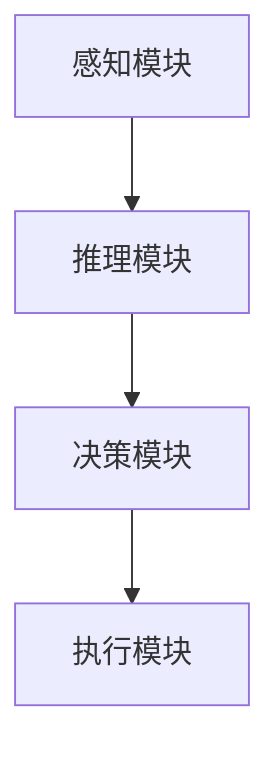

                 


## 文章标题：情境感知AI Agent：增强LLM的环境适应能力

### 关键词：情境感知，AI Agent，语言模型（LLM），环境适应能力，算法实现，系统架构，实战案例

### 摘要：
本文将探讨情境感知AI Agent在提升语言模型（LLM）环境适应能力方面的重要性。我们将从背景介绍出发，逐步深入分析核心概念、算法原理、数学模型，再到系统架构设计、实战应用以及最佳实践。通过一步步的逻辑推理，帮助读者理解如何将情境感知与LLM相结合，增强其在不同环境下的表现和适应性。

## 目录大纲：情境感知AI Agent：增强LLM的环境适应能力

### 第一部分：背景介绍与核心概念

#### 第1章：问题背景与核心概念
- 1.1.1 问题背景
- 1.1.2 AI Agent与情境感知
- 1.1.3 LLM的概念与作用

#### 第2章：核心概念与联系
- 2.1.1 情境感知AI Agent的构成要素
- 2.1.2 LLM与情境感知的关系
- 2.1.3 对比分析情境感知AI Agent与普通AI Agent

#### 第3章：情境感知的数学模型
- 3.1.1 情境感知的数学理论基础
- 3.1.2 情境感知的数学模型描述
- 3.1.3 情境感知的数学模型应用场景

#### 第4章：情境感知的算法原理
- 4.1.1 情境感知算法的基本原理
- 4.1.2 情境感知算法的Mermaid流程图
- 4.1.3 情境感知算法的Python代码实现
- 4.1.4 情境感知算法的数学模型和公式
- 4.1.5 情境感知算法的详细讲解与举例说明

### 第二部分：情境感知AI Agent的设计与实现

#### 第5章：情境感知AI Agent的系统架构设计
- 5.1.1 系统架构设计概述
- 5.1.2 系统功能设计（领域模型Mermaid类图）
- 5.1.3 系统架构设计（Mermaid架构图）
- 5.1.4 系统接口设计和系统交互（Mermaid序列图）

#### 第6章：情境感知AI Agent的核心算法实现
- 6.1.1 核心算法实现流程
- 6.1.2 核心算法的Python源代码
- 6.1.3 核心算法的应用解读与分析
- 6.1.4 核心算法的案例分析与详细讲解剖析

#### 第7章：增强LLM的环境适应能力
- 7.1.1 LLM的环境适应能力概述
- 7.1.2 增强LLM环境适应能力的方法
- 7.1.3 增强LLM环境适应能力的实际应用
- 7.1.4 增强LLM环境适应能力的挑战与解决方案

### 第三部分：项目实战与最佳实践

#### 第8章：项目实战
- 8.1.1 项目环境搭建
- 8.1.2 项目核心代码实现
- 8.1.3 项目应用解读与分析
- 8.1.4 项目案例分析与详细讲解剖析

#### 第9章：最佳实践与注意事项
- 9.1.1 情境感知AI Agent的设计最佳实践
- 9.1.2 LLM环境适应能力的增强最佳实践
- 9.1.3 注意事项与常见问题

#### 第10章：拓展阅读与未来展望
- 10.1.1 相关技术文献推荐
- 10.1.2 行业发展趋势分析
- 10.1.3 情境感知AI Agent的未来研究方向

### 总结与展望

#### 第11章：总结
- 11.1 总结
- 11.2 展望
- 11.3 未来发展方向

### 附录

#### 附录A：术语表
#### 附录B

---

### 文章正文开始

#### 第一部分：背景介绍与核心概念

### 第1章：问题背景与核心概念

#### 1.1.1 问题背景
在现代人工智能（AI）的发展过程中，语言模型（Language Model，简称LLM）如BERT、GPT等取得了显著的成就。这些模型能够处理大量的文本数据，生成高质量的文本，并且在自然语言处理（NLP）任务中表现优异。然而，尽管LLM在文本生成、问答系统、机器翻译等方面表现出色，但它们的一个显著缺陷是在动态和多变的环境中表现出较差的适应能力。

#### 1.1.2 AI Agent与情境感知
为了解决这一问题，情境感知AI Agent（Situation-Aware AI Agent）的概念被提出。AI Agent是一个具有独立行为能力的智能体，能够在环境中感知、推理并采取适当的行动。而情境感知则是指AI Agent能够根据当前的环境状态来调整其行为，从而提高其在不同环境下的适应能力。

#### 1.1.3 LLM的概念与作用
LLM是一种特殊的AI模型，它可以理解并生成文本。LLM在NLP领域中有着广泛的应用，如文本分类、情感分析、机器翻译等。然而，传统的LLM往往缺乏对环境动态变化的感知和适应能力。

### 第二部分：核心概念与联系

#### 第2章：核心概念与联系

#### 2.1.1 情境感知AI Agent的构成要素
情境感知AI Agent通常由以下几个部分组成：

1. **感知模块**：用于感知环境状态，包括文本数据、语音信号、图像等。
2. **推理模块**：基于感知到的环境状态进行推理，以决定如何行动。
3. **决策模块**：根据推理结果，选择适当的行动。
4. **执行模块**：执行决策模块所选定的行动。

#### 2.1.2 LLM与情境感知的关系
LLM可以作为情境感知AI Agent的感知模块，用于理解文本数据。通过将LLM与情境感知相结合，可以增强AI Agent在动态环境下的适应能力。

#### 2.1.3 对比分析情境感知AI Agent与普通AI Agent
普通AI Agent通常没有情境感知能力，它们只能在静态或预先设定好的环境中工作。而情境感知AI Agent则可以根据环境的变化动态调整其行为，具有更强的适应性和灵活性。

### 第三部分：情境感知的数学模型

#### 第3章：情境感知的数学模型

#### 3.1.1 情境感知的数学理论基础
情境感知的数学理论基础包括概率论、信息论、控制论等。这些理论为情境感知提供了数学工具和方法。

#### 3.1.2 情境感知的数学模型描述
情境感知的数学模型通常包括以下几个部分：

1. **状态空间模型**：描述环境状态的集合及其变化规律。
2. **动作空间模型**：描述AI Agent可以采取的动作集合。
3. **奖励函数**：描述AI Agent在不同状态和动作下的收益。

#### 3.1.3 情境感知的数学模型应用场景
情境感知的数学模型可以应用于各种场景，如自主驾驶、智能客服、游戏AI等。

### 第四部分：情境感知的算法原理

#### 第4章：情境感知的算法原理

#### 4.1.1 情境感知算法的基本原理
情境感知算法的基本原理是：AI Agent通过感知模块获取环境状态，利用推理模块进行分析，然后通过决策模块选择最佳动作，最终通过执行模块实施这一动作。

#### 4.1.2 情境感知算法的Mermaid流程图
以下是一个简单的情境感知算法的Mermaid流程图：



#### 4.1.3 情境感知算法的Python代码实现
下面是一个简单的情境感知算法的Python代码实现：

```python
import random

# 感知模块
def perceive():
    # 模拟环境状态感知
    return random.choice(["静音", "响声", "喧闹"])

# 推理模块
def reason(state):
    # 根据环境状态进行推理
    if state == "静音":
        return "安静"
    elif state == "响声":
        return "吵闹"
    else:
        return "很吵"

# 决策模块
def decide(reasoning):
    # 根据推理结果选择动作
    if reasoning == "安静":
        return "休息"
    elif reasoning == "吵闹":
        return "听音乐"
    else:
        return "打瞌睡"

# 执行模块
def execute(action):
    # 实施所选定的动作
    if action == "休息":
        print("正在休息...")
    elif action == "听音乐":
        print("正在听音乐...")
    else:
        print("正在打瞌睡...")

# 主程序
def main():
    while True:
        state = perceive()
        reasoning = reason(state)
        action = decide(reasoning)
        execute(action)

if __name__ == "__main__":
    main()
```

#### 4.1.4 情境感知算法的数学模型和公式
情境感知算法的数学模型通常包括状态转移概率、动作选择策略等。以下是一个简单的数学模型描述：

1. **状态转移概率**：\( P(S_t | S_{t-1}, A_{t-1}) \)，表示在给定前一个状态和动作的情况下，当前状态的转移概率。
2. **动作选择策略**：\( \pi(A_t | S_t) \)，表示在当前状态下选择动作的概率分布。

#### 4.1.5 情境感知算法的详细讲解与举例说明
情境感知算法的详细讲解与举例说明将在后续章节中进行深入讨论。

---

以上是文章正文的开头部分，接下来的章节将继续探讨情境感知AI Agent的系统架构设计、核心算法实现以及项目实战等内容。希望通过这样的逐步分析，读者能够更好地理解情境感知AI Agent如何增强LLM的环境适应能力。接下来，我们将深入讨论情境感知AI Agent的系统架构设计。

