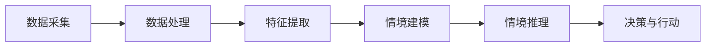
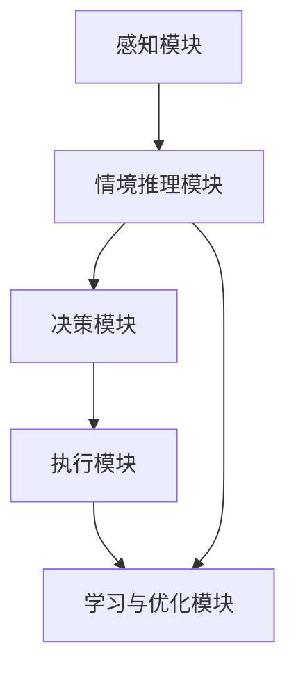
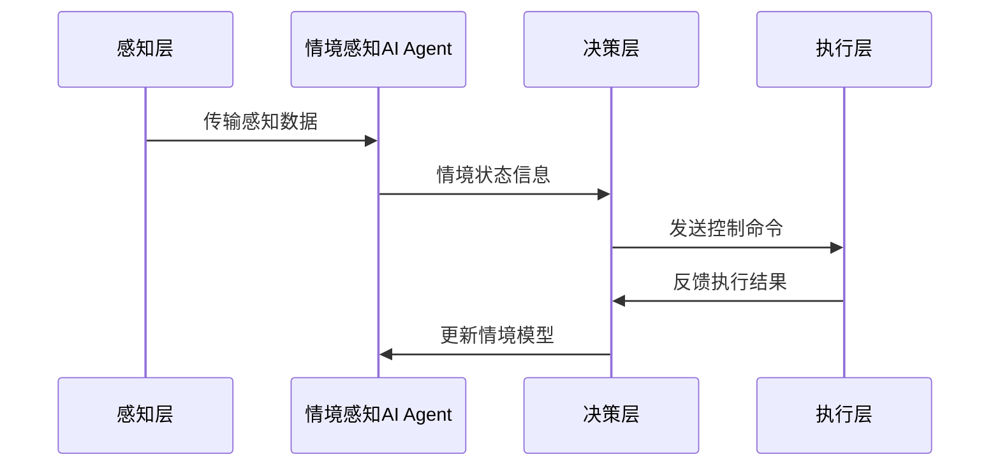
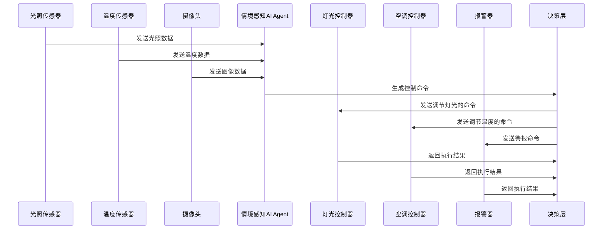
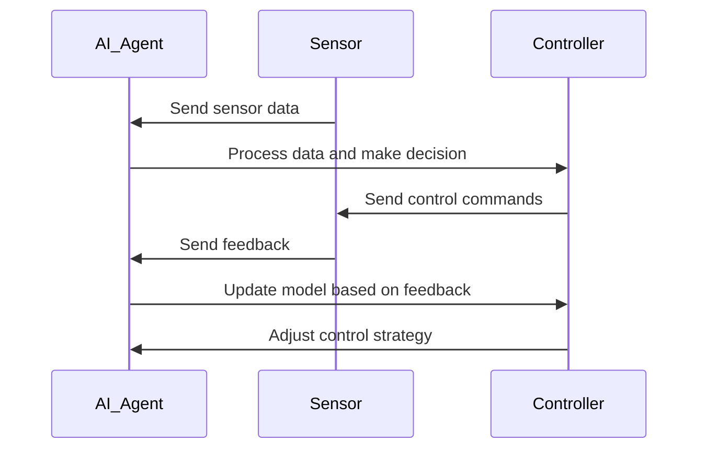

                 

### 《情境感知AI Agent：适应动态环境》文章标题与关键词

关键词：情境感知AI、动态环境、自适应算法、算法实现、系统架构设计

摘要：本文深入探讨了情境感知AI Agent的概念、原理、设计及实现，特别是其在动态环境中的适应策略和优化方法。通过剖析当前的研究和应用现状，我们旨在揭示情境感知AI Agent如何通过自适应算法和实时监控反馈机制来提高其在复杂环境中的表现和可靠性。文章最后对未来的发展趋势和最佳实践进行了总结和展望。

### 目录大纲

#### 第一部分：背景与概念介绍

- **第1章 情境感知AI Agent概述**
  - **1.1 情境感知AI Agent的定义**
  - **1.2 情境感知的重要性**
  - **1.3 情境感知AI Agent与传统AI的差异**
  - **1.4 情境感知AI Agent的应用场景**

- **第2章 情境感知的原理与模型**
  - **2.1 情境感知的基本原理**
  - **2.2 情境感知模型的类型**
    - **2.2.1 视觉感知**
    - **2.2.2 声音感知**
    - **2.2.3 气味感知**
    - **2.2.4 其他感知方式**
  - **2.3 情境感知模型的工作流程**

#### 第二部分：情境感知AI Agent设计

- **第3章 情境感知AI Agent架构设计**
  - **3.1 情境感知AI Agent的架构要素**
    - **3.1.1 感知模块**
    - **3.1.2 决策模块**
    - **3.1.3 执行模块**
  - **3.2 情境感知AI Agent的设计原则**

- **第4章 情境感知AI Agent开发环境搭建**
  - **4.1 硬件环境配置**
  - **4.2 软件环境配置**
  - **4.3 数据集准备**

#### 第三部分：算法与实现

- **第5章 情境感知算法原理详解**
  - **5.1 基于深度学习的情境感知算法**
    - **5.1.1 卷积神经网络(CNN)**
    - **5.1.2 递归神经网络(RNN)**
    - **5.1.3 生成对抗网络(GAN)**
  - **5.2 基于强化学习的情境感知算法**
    - **5.2.1 Q-Learning**
    - **5.2.2 Deep Q-Network(DQN)**
    - **5.2.3 Deep Reinforcement Learning**

- **第6章 情境感知AI Agent实现案例分析**
  - **6.1 案例背景介绍**
  - **6.2 案例系统功能设计**
    - **6.2.1 领域模型设计**
    - **6.2.2 系统架构设计**
    - **6.2.3 系统接口设计**
  - **6.3 案例算法实现与流程图**
    - **6.3.1 算法mermaid流程图**
    - **6.3.2 Python源代码实现**
    - **6.3.3 数学模型与公式**

#### 第四部分：动态环境的适应与优化

- **第7章 动态环境下的适应策略**
  - **7.1 动态环境特征分析**
  - **7.2 自适应算法设计**
    - **7.2.1 自适应神经网络**
    - **7.2.2 自适应强化学习**
  - **7.3 动态环境下的性能优化**

- **第8章 实时监控与反馈机制**
  - **8.1 实时监控技术**
  - **8.2 反馈机制设计**
    - **8.2.1 正反馈与负反馈**
    - **8.2.2 反馈机制的实现方法**

- **第9章 动态环境下的情境预测**
  - **9.1 情境预测的重要性**
  - **9.2 情境预测算法**
    - **9.2.1 基于时间序列的预测**
    - **9.2.2 基于机器学习的预测**
    - **9.2.3 基于深度学习的预测**

#### 第五部分：总结与展望

- **第10章 情境感知AI Agent的发展趋势**
  - **10.1 未来发展方向**
  - **10.2 挑战与机遇**

- **第11章 最佳实践与建议**
  - **11.1 实践中的注意事项**
  - **11.2 拓展阅读与资源推荐**

- **第12章 结论**
  - **12.1 主要内容回顾**
  - **12.2 对未来的展望**

### 本文结构解析

本文以《情境感知AI Agent：适应动态环境》为题，旨在深入探讨情境感知AI Agent在动态环境中的应用与适应策略。文章整体结构分为五个部分，每部分针对不同的主题展开详细讨论。

#### 第一部分：背景与概念介绍

这部分将介绍情境感知AI Agent的基本概念、原理和重要性，帮助读者建立对该领域的初步认识。主要包含以下章节：

- **第1章 情境感知AI Agent概述**：定义情境感知AI Agent，阐述其在人工智能领域的独特价值。
- **第2章 情境感知的原理与模型**：详细讲解情境感知的基本原理和不同类型的感知模型。

#### 第二部分：情境感知AI Agent设计

这部分重点讨论情境感知AI Agent的设计原则和开发环境搭建，为后续算法与实现部分的讲解打下基础。主要包括：

- **第3章 情境感知AI Agent架构设计**：分析情境感知AI Agent的架构要素和设计原则。
- **第4章 情境感知AI Agent开发环境搭建**：介绍硬件环境、软件环境及数据集准备。

#### 第三部分：算法与实现

这部分深入探讨情境感知算法的原理和实现方法，包括基于深度学习和强化学习的方法。具体包括：

- **第5章 情境感知算法原理详解**：详细介绍不同类型的算法原理。
- **第6章 情境感知AI Agent实现案例分析**：通过实际案例展示算法实现和应用。

#### 第四部分：动态环境的适应与优化

这部分关注情境感知AI Agent在动态环境中的适应策略和优化方法，包括自适应算法、实时监控与反馈机制及情境预测。主要涵盖：

- **第7章 动态环境下的适应策略**：分析动态环境特征，探讨自适应算法的设计。
- **第8章 实时监控与反馈机制**：介绍实时监控技术和反馈机制设计。
- **第9章 动态环境下的情境预测**：讨论情境预测的重要性及算法实现。

#### 第五部分：总结与展望

最后一部分对全文内容进行总结，展望情境感知AI Agent的未来发展趋势，并给出最佳实践与建议。

整体来看，本文通过逐步深入的分析和讲解，使读者能够全面了解和掌握情境感知AI Agent的设计与实现方法，为实际应用提供有力支持。### 第1章 情境感知AI Agent概述

#### 1.1 情境感知AI Agent的定义

情境感知AI Agent是指一种能够通过感知和理解其周围环境中的各种情境信息，并据此进行决策和执行特定任务的智能体。这种智能体通常具备以下几个关键特征：

1. **感知能力**：通过视觉、听觉、触觉等多种感知方式获取环境信息。
2. **情境理解**：能够对获取的信息进行解析和处理，理解当前所处的情境状态。
3. **决策能力**：基于对情境的理解，智能体可以做出合适的决策，以应对不同的环境和任务需求。
4. **执行能力**：根据决策结果，智能体能够执行相应的任务，如移动、交互等。

在技术层面上，情境感知AI Agent通常由以下几个主要模块构成：

- **感知模块**：负责收集环境中的各种信息，如图像、声音、温度等。
- **情境推理模块**：对感知模块收集的信息进行处理，提取出与当前情境相关的特征，并理解情境状态。
- **决策模块**：根据情境推理的结果，智能体决定采取何种行动或策略。
- **执行模块**：将决策结果转换为具体的操作，如控制机器人的移动或执行某个任务。

#### 1.2 情境感知的重要性

情境感知在人工智能领域具有重要的地位，它赋予了智能体适应复杂环境和动态变化的能力。以下是情境感知的重要性：

1. **适应复杂环境**：现实世界是高度复杂和多变的，智能体需要具备情境感知能力来适应不同的环境，如不同季节的气候条件、不同的地理位置等。
2. **提高决策质量**：通过感知和理解环境中的情境信息，智能体可以做出更合理的决策，从而提高任务的完成质量和效率。
3. **增强交互能力**：情境感知使得智能体能够更好地理解和响应人类的意图和需求，从而实现更自然的交互。
4. **提升鲁棒性**：智能体通过情境感知可以更好地应对突发情况，增强系统的鲁棒性和可靠性。

#### 1.3 情境感知AI Agent与传统AI的差异

传统AI系统通常基于预定义的规则和模型进行任务执行，其表现往往局限于特定场景和任务。而情境感知AI Agent则具有以下与传统AI系统的显著差异：

1. **动态适应性**：情境感知AI Agent能够实时感知和适应环境变化，而传统AI系统则需要手动重新设计和调整以应对新环境。
2. **灵活的决策能力**：情境感知AI Agent可以根据不同情境做出灵活的决策，而传统AI系统往往依赖于固定的算法和规则。
3. **多模态感知**：情境感知AI Agent能够通过多种感知方式获取信息，如视觉、听觉、触觉等，而传统AI系统通常仅限于文本或图像处理。
4. **自学习和进化能力**：情境感知AI Agent具备自我学习和进化能力，能够在实际应用中不断优化自身性能，而传统AI系统则需要人工干预和调整。

#### 1.4 情境感知AI Agent的应用场景

情境感知AI Agent在多个领域和行业中都有着广泛的应用，以下是一些典型应用场景：

1. **智能家居**：情境感知AI Agent可以监控家庭环境，根据家庭成员的行为和需求自动调节室内温度、灯光等。
2. **智能机器人**：情境感知AI Agent使得机器人能够更好地适应不同的工作环境和任务需求，如医疗机器人、救援机器人等。
3. **自动驾驶**：情境感知AI Agent在自动驾驶汽车中扮演关键角色，通过感知道路状况和交通环境，确保车辆的安全驾驶。
4. **智能客服**：情境感知AI Agent能够理解用户的语言和行为，提供个性化服务和帮助，提升客户体验。
5. **医疗诊断**：情境感知AI Agent可以通过分析医学影像和患者数据，辅助医生进行诊断和治疗。

通过以上分析，我们可以看到情境感知AI Agent不仅具备强大的感知、理解和适应能力，还能够在多种实际场景中发挥重要作用，为人工智能的发展带来了新的机遇和挑战。在接下来的章节中，我们将进一步探讨情境感知的原理、模型以及实现细节，帮助读者深入理解和掌握这一前沿技术。### 第2章 情境感知的原理与模型

#### 2.1 情境感知的基本原理

情境感知（Context Awareness）是一种使系统或智能体能够识别和理解其所在环境的上下文信息的机制。这种机制通常依赖于以下几个基本原理：

1. **感知与识别**：通过传感器、摄像头、麦克风等设备获取环境中的信息，然后使用特定的算法对这些信息进行识别和处理，提取出与情境相关的特征。
2. **上下文建模**：将感知到的信息进行建模，建立情境状态与具体环境特征之间的关联。这通常涉及机器学习和数据挖掘技术，如聚类分析、分类和回归。
3. **推理与理解**：基于情境模型和感知到的实时信息，智能体进行推理和理解，以识别当前所处的情境状态。这个过程通常包括模式识别、逻辑推理和语义理解等。
4. **决策与行动**：根据对情境的理解，智能体做出决策并采取相应的行动。决策过程可能涉及复杂的优化算法和策略，以确保行动的有效性和适应性。

#### 2.2 情境感知模型的类型

情境感知模型可以根据感知方式和应用场景的不同进行分类。以下是几种常见的情境感知模型：

##### 2.2.1 视觉感知

视觉感知是情境感知中最常见的一种类型，它依赖于计算机视觉技术来解析和理解图像中的信息。视觉感知模型包括：

1. **图像分类**：将图像划分为不同的类别，如识别车辆、行人、道路等。
2. **目标检测**：在图像中检测和定位特定目标的位置和属性。
3. **场景分割**：将图像分割成不同的区域，用于理解场景的结构和内容。
4. **动作识别**：通过视频序列识别人类或物体的动作。

##### 2.2.2 声音感知

声音感知利用音频信号处理技术来理解和识别声音信息。常见的声音感知模型包括：

1. **语音识别**：将语音信号转换为文本，用于语音助手和智能客服。
2. **声源定位**：确定声音来源的方向和位置，用于空间音频和智能监控。
3. **声音情感分析**：识别语音中的情感和情绪，用于情感计算和用户体验优化。

##### 2.2.3 气味感知

气味感知是通过检测和分析气味分子来理解和识别环境中的气味信息。尽管在计算机科学中相对较新，但气味感知模型在智能家居、健康监测和食品工业等领域具有广泛应用。常见的气味感知模型包括：

1. **气味识别**：识别和分类不同的气味，如识别食品变质、空气污染等。
2. **气味感知**：通过机器学习和数据挖掘技术，分析气味特征并建立与情境状态的关联。

##### 2.2.4 其他感知方式

除了视觉、声音和气味感知，情境感知还可以通过其他多种方式实现，如：

1. **触觉感知**：通过触觉传感器识别物体的质地、形状和温度等。
2. **温度感知**：通过温度传感器监测环境温度，用于智能空调和温度控制系统。
3. **湿度感知**：通过湿度传感器监测环境湿度，用于温室控制和气象监测。

#### 2.3 情境感知模型的工作流程

情境感知模型的工作流程通常包括以下几个关键步骤：

1. **数据采集**：使用各种传感器和设备收集环境中的信息。
2. **数据处理**：对采集到的原始数据进行预处理，如去噪、增强和标准化。
3. **特征提取**：从处理后的数据中提取与情境相关的特征，如颜色、纹理、声音频率、气味强度等。
4. **情境建模**：使用机器学习和数据挖掘技术建立情境模型，将特征与具体的情境状态关联起来。
5. **情境推理**：根据实时感知到的信息，使用情境模型进行推理，理解当前所处的情境状态。
6. **决策与行动**：基于情境推理的结果，智能体做出决策并采取相应的行动。

以下是一个简化的情境感知模型工作流程的mermaid流程图：



通过上述步骤，情境感知模型能够实时地感知和理解环境中的变化，并做出相应的适应和调整。这一过程为智能系统提供了强大的灵活性和智能性，使其能够在复杂和动态的环境中有效运行。在接下来的章节中，我们将进一步探讨情境感知AI Agent的设计、开发和实现细节。### 第3章 情境感知AI Agent架构设计

#### 3.1 情境感知AI Agent的架构要素

情境感知AI Agent的架构设计是构建高效、灵活和适应性强的人工智能系统的基础。一个典型的情境感知AI Agent通常包含以下几个关键模块：

**1. 感知模块（Perception Module）**

感知模块是情境感知AI Agent的核心组件，负责收集环境中的各种信息。这些信息可能包括：

- **视觉信息**：通过摄像头、图像传感器等获取环境中的图像数据。
- **声音信息**：通过麦克风、音频传感器等获取环境中的声音数据。
- **触觉信息**：通过触觉传感器获取物体的质地、硬度等。
- **环境参数**：通过温度传感器、湿度传感器等获取环境温度、湿度等参数。

感知模块的功能包括：

- **数据采集**：实时获取和处理环境中的各种数据。
- **数据预处理**：对原始数据进行去噪、增强和标准化等处理，以提高数据质量。

**2. 情境推理模块（Context Reasoning Module）**

情境推理模块负责对感知模块收集到的信息进行处理和分析，提取出与情境相关的特征，并理解当前所处的情境状态。其主要功能包括：

- **特征提取**：从感知数据中提取与情境相关的关键特征。
- **情境建模**：使用机器学习和数据挖掘技术建立情境模型，将特征与具体的情境状态关联起来。
- **情境理解**：基于情境模型和实时感知信息，智能体进行推理和理解，以识别当前所处的情境状态。

**3. 决策模块（Decision Making Module）**

决策模块基于情境推理模块提供的信息，智能体决定采取何种行动或策略。其主要功能包括：

- **情境分析**：分析当前情境状态，确定任务目标和可能的行动方案。
- **决策制定**：选择最优行动方案，制定决策策略。
- **目标优化**：在多个决策方案之间进行优化，以实现最佳结果。

**4. 执行模块（Execution Module）**

执行模块将决策模块的决策结果转换为具体的操作，以实现智能体的行动。其主要功能包括：

- **任务执行**：执行决策模块制定的行动策略。
- **结果反馈**：将执行结果反馈给情境推理模块和决策模块，用于后续的调整和优化。
- **环境交互**：与外部环境进行交互，如控制机器人移动、调节设备参数等。

**5. 学习与优化模块（Learning and Optimization Module）**

学习与优化模块负责对情境感知AI Agent进行持续学习和性能优化。其主要功能包括：

- **自我学习**：基于反馈信息和执行结果，智能体不断调整自身的行为和策略。
- **模型优化**：优化情境模型和决策算法，以提高系统的性能和适应性。
- **知识更新**：定期更新知识库和情境模型，以适应环境的变化和新的需求。

#### 3.2 情境感知AI Agent的设计原则

在设计情境感知AI Agent时，需要遵循以下几个关键原则，以确保系统的有效性、可靠性和适应性：

1. **模块化设计**：将情境感知AI Agent分解为多个功能模块，每个模块负责特定的任务，以便于系统的扩展和维护。
2. **可扩展性**：设计灵活的架构，支持添加新的感知方式和功能模块，以适应不断变化的应用场景。
3. **实时性**：确保感知、推理和执行模块能够在短时间内响应环境变化，提高系统的实时性和反应速度。
4. **适应性**：系统应具备自适应能力，能够根据环境的变化和任务的调整进行自我调整和优化。
5. **鲁棒性**：设计具有高鲁棒性的系统，能够应对环境噪声、数据缺失和异常情况，确保系统的稳定运行。

**图 3-1：情境感知AI Agent架构图**



通过以上架构设计和设计原则，情境感知AI Agent能够高效地感知和理解环境中的情境信息，并据此进行合理的决策和执行，以适应复杂和动态的环境。在接下来的章节中，我们将详细介绍情境感知AI Agent的开发环境搭建和实际案例实现。### 第4章 情境感知AI Agent开发环境搭建

#### 4.1 硬件环境配置

要搭建一个高效的情境感知AI Agent开发环境，首先需要配置合适的硬件设备。以下是一些关键硬件组件及其配置建议：

1. **处理器**：推荐使用具有高性能的计算能力，如Intel i7或AMD Ryzen 7系列处理器，以确保在处理复杂算法和大规模数据时能够高效运行。
2. **内存**：至少需要16GB的RAM，建议使用32GB以上，以提高多任务处理能力和数据缓存性能。
3. **存储**：建议使用至少1TB的固态硬盘（SSD），以便快速读取和写入大量数据，同时提高系统响应速度。
4. **显卡**：对于深度学习算法和计算机视觉任务，推荐使用NVIDIA GeForce RTX 3060或以上显卡，以充分利用GPU加速计算能力。
5. **外部设备**：根据具体应用需求，配置相应的传感器，如摄像头、麦克风、温度传感器等，用于数据采集和感知。

#### 4.2 软件环境配置

在硬件环境配置完成后，接下来需要安装和配置相应的软件环境，以支持AI Agent的开发和运行。以下是一些关键软件及其安装步骤：

1. **操作系统**：推荐使用Linux系统，如Ubuntu 20.04或更高版本，因为其具有良好的稳定性和对AI框架的支持。
2. **Python环境**：Python是AI开发中最常用的编程语言之一，安装Python 3.8或更高版本，并配置pip，用于管理Python包。
3. **深度学习框架**：安装TensorFlow、PyTorch或Keras等深度学习框架，这些框架提供了丰富的工具和库，用于构建和训练AI模型。
4. **数据处理库**：安装Numpy、Pandas等数据处理库，用于数据预处理和特征提取。
5. **其他工具**：安装Git、Jupyter Notebook等开发工具，以便进行版本控制和交互式开发。

**安装步骤示例**：

```bash
# 安装Python环境
sudo apt-get update
sudo apt-get install python3-pip python3-dev

# 安装深度学习框架TensorFlow
pip3 install tensorflow

# 安装数据处理库Numpy和Pandas
pip3 install numpy pandas
```

#### 4.3 数据集准备

情境感知AI Agent的性能很大程度上依赖于高质量的数据集。以下是数据集准备的关键步骤：

1. **数据收集**：根据具体应用场景，收集与情境感知相关的数据，如图像、音频、文本和传感器数据。
2. **数据清洗**：对收集到的原始数据进行清洗，去除噪声和异常值，以提高数据质量。
3. **数据预处理**：对清洗后的数据进行标准化、归一化和特征提取，以适应AI模型的输入要求。
4. **数据分割**：将数据集分为训练集、验证集和测试集，以确保模型训练和评估的有效性。

以下是一个数据集准备过程的示例：

```python
import pandas as pd
from sklearn.model_selection import train_test_split

# 读取数据集
data = pd.read_csv('data.csv')

# 数据清洗
data = data.dropna()

# 数据预处理
data = (data - data.mean()) / data.std()

# 数据分割
train_data, test_data = train_test_split(data, test_size=0.2, random_state=42)
train_data, val_data = train_test_split(train_data, test_size=0.25, random_state=42) # 0.25 x 0.8 = 0.2
```

通过以上步骤，我们可以构建一个适合情境感知AI Agent开发的完整环境，为后续的算法实现和系统搭建提供坚实的基础。在下一章节中，我们将深入探讨情境感知算法的原理和实现细节。### 第5章 情境感知算法原理详解

#### 5.1 基于深度学习的情境感知算法

深度学习在情境感知领域取得了显著进展，特别是卷积神经网络（CNN）、递归神经网络（RNN）和生成对抗网络（GAN）等模型在视觉感知和序列数据处理方面表现出色。以下分别介绍这些模型的基本原理和应用。

##### 5.1.1 卷积神经网络（CNN）

卷积神经网络是一种专门用于处理图像数据的深度学习模型。其基本原理是通过卷积层提取图像的特征，然后通过全连接层进行分类或回归。

1. **卷积层**：卷积层通过卷积运算提取图像的局部特征。每个卷积核可以看作一个特征探测器，滑动于图像上，通过点积运算提取特征图。
   $$ f_{ij}^l = \sum_{k=1}^{C_{l-1}} w_{ik}^l * g_{kj}^{l-1} + b^l $$
   其中，$f_{ij}^l$是第$l$层的第$i$行第$j$列的特征值，$w_{ik}^l$和$g_{kj}^{l-1}$分别是卷积核和输入特征图，$b^l$是偏置项。

2. **池化层**：池化层用于减少特征图的尺寸，降低模型的复杂性。常用的池化操作包括最大池化和平均池化。

3. **全连接层**：全连接层将卷积层提取的特征图映射到分类或回归结果。通过点积运算和激活函数，如ReLU、Sigmoid或softmax，得到最终的输出。

##### 5.1.2 递归神经网络（RNN）

递归神经网络是一种用于处理序列数据的深度学习模型，特别适用于时间序列分析和语音识别等任务。其基本原理是通过循环连接和隐藏状态更新，捕捉序列中的长期依赖关系。

1. **隐藏状态更新**：RNN通过递归连接将当前时间步的输入与上一时间步的隐藏状态结合，更新当前时间步的隐藏状态。
   $$ h_t = \text{sigmoid}(W_h \cdot [h_{t-1}, x_t] + b_h) $$
   其中，$h_t$是当前时间步的隐藏状态，$W_h$是权重矩阵，$b_h$是偏置项，$x_t$是当前时间步的输入。

2. **输出计算**：通过全连接层和激活函数，RNN生成当前时间步的输出。
   $$ o_t = \text{softmax}(W_o \cdot h_t + b_o) $$
   其中，$o_t$是当前时间步的输出，$W_o$和$b_o$分别是输出权重和偏置。

##### 5.1.3 生成对抗网络（GAN）

生成对抗网络是一种基于博弈论的深度学习模型，由生成器和判别器组成。生成器生成与真实数据相似的数据，判别器判断生成数据和真实数据之间的差异。

1. **生成器**：生成器生成与真实数据相似的数据。通过逐层叠加，生成器将随机噪声映射到数据空间。
   $$ G(z) = \text{ReLU}((W_g \cdot z) + b_g) $$
   其中，$z$是随机噪声，$W_g$和$b_g$分别是生成器的权重和偏置。

2. **判别器**：判别器判断生成数据和真实数据之间的差异。判别器通过对比真实数据和生成数据，学习如何区分两者。
   $$ D(x) = \text{sigmoid}((W_d \cdot x) + b_d) $$
   其中，$x$是真实数据，$W_d$和$b_d$分别是判别器的权重和偏置。

#### 5.2 基于强化学习的情境感知算法

强化学习是一种通过奖励机制训练智能体行为的机器学习方法，特别适用于情境感知AI Agent的设计和实现。

##### 5.2.1 Q-Learning

Q-Learning是一种基于值函数的强化学习算法，用于解决离散动作空间的问题。其基本原理是通过学习状态-动作值函数，选择最优动作。

1. **状态-动作值函数**：Q-Learning通过更新状态-动作值函数，以估计每个状态下采取每个动作的预期回报。
   $$ Q(s, a) = \sum_{s'} P(s' | s, a) \cdot [R(s', a) + \gamma \cdot \max_{a'} Q(s', a')] $$
   其中，$s$是当前状态，$a$是动作，$s'$是下一状态，$R(s', a)$是回报，$\gamma$是折扣因子。

2. **更新规则**：Q-Learning通过经验回放和随机策略，不断更新状态-动作值函数。
   $$ Q(s, a) \leftarrow Q(s, a) + \alpha \cdot [R(s', a') + \gamma \cdot \max_{a'} Q(s', a') - Q(s, a)] $$

##### 5.2.2 Deep Q-Network (DQN)

Deep Q-Network是一种基于深度学习的Q-Learning算法，用于解决连续动作空间的问题。其基本原理是通过卷积神经网络来近似状态-动作值函数。

1. **目标网络**：DQN使用目标网络来稳定训练过程，目标网络是原始Q网络的软复制，用于生成目标Q值。
   $$ Q^*(s, a) = \max_a' [R(s', a') + \gamma \cdot Q(s', a')] $$
   其中，$Q^*(s, a)$是目标Q值。

2. **经验回放**：DQN通过经验回放机制，将历史经验随机化，避免策略偏差。
   $$ Q(s, a) \leftarrow Q(s, a) + \alpha \cdot [R(s', a') + \gamma \cdot Q^*(s', a') - Q(s, a)] $$

##### 5.2.3 Deep Reinforcement Learning

深度强化学习是一种结合深度学习和强化学习的先进方法，通过深度神经网络来近似状态值函数或策略。

1. **策略网络**：深度强化学习使用策略网络来直接生成动作，策略网络是一个深度神经网络，其输出表示在给定状态下采取每个动作的概率分布。
   $$ \pi(\text{action} | \text{state}) = \text{softmax}([W \cdot \text{state} + b]) $$
   其中，$W$是策略网络的权重，$b$是偏置项。

2. **值函数网络**：深度强化学习同时使用值函数网络来评估状态的价值，值函数网络是一个深度神经网络，其输出表示在给定状态下采取最优动作的预期回报。
   $$ V(s) = \max_a [R(s', a) + \gamma \cdot V(s')] $$
   其中，$V(s)$是状态值函数。

通过以上算法原理的详细讲解，我们可以看到深度学习和强化学习在情境感知中的应用潜力。这些算法通过高效的特征提取和决策机制，使得情境感知AI Agent能够更好地适应复杂和动态的环境。在下一章节中，我们将通过一个实际案例展示情境感知AI Agent的实现过程。### 第6章 情境感知AI Agent实现案例分析

#### 6.1 案例背景介绍

本案例旨在设计并实现一个情境感知AI Agent，用于智能家庭环境中的自动化控制。具体目标是：

1. **智能灯光控制**：根据家庭成员的日常活动和光照强度，自动调节室内灯光的亮度和颜色。
2. **智能温度控制**：根据室内外温度变化和家庭成员的舒适度需求，自动调节空调温度。
3. **智能安全监控**：通过摄像头监控家庭环境，识别家庭成员和潜在的安全威胁，如陌生人入侵。

#### 6.2 案例系统功能设计

本案例的系统功能设计分为领域模型设计、系统架构设计和系统接口设计三个部分。

##### 6.2.1 领域模型设计

领域模型是描述系统功能和数据结构的核心工具。在本案例中，领域模型包括以下几个关键类：

1. **家庭成员**：表示家庭成员的信息，如姓名、年龄、性别、日常活动等。
2. **环境传感器**：包括光照传感器、温度传感器和摄像头等，用于收集环境数据。
3. **控制设备**：包括灯光控制器、空调控制器和报警器等，用于执行自动化控制任务。
4. **情境状态**：表示当前的环境状态，如光照强度、温度、家庭成员活动状态等。
5. **情境感知AI Agent**：负责感知环境数据，推理情境状态，并做出相应的决策。

**Mermaid类图**：

```mermaid
classDiagram
    Class01 <|-- Class02
    Class03 <.. Class04
    Class05 <.. Class06
    Class07 <.. Class06
    Class08 <.. Class06

    Class01[家庭成员]
    Class02[姓名, 年龄, 性别, 日常活动]
    Class03[环境传感器]
    Class04[光照传感器, 温度传感器, 摄像头]
    Class05[控制设备]
    Class06[灯光控制器, 空调控制器, 报警器]
    Class07[情境状态]
    Class08[情境感知AI Agent]

    Class01 --|> Class02
    Class03 --|> Class04
    Class05 --|> Class06
    Class07 --|> Class08
```

##### 6.2.2 系统架构设计

系统架构设计是确定系统组件和它们之间交互关系的蓝图。在本案例中，系统架构包括以下几个关键组件：

1. **感知层**：包括各种环境传感器，用于实时收集光照、温度和摄像头数据。
2. **感知层**：包括情境感知AI Agent，负责处理感知数据，推理当前情境状态。
3. **决策层**：根据情境状态和预设规则，智能体决定执行哪些控制任务。
4. **执行层**：包括各种控制设备，如灯光控制器、空调控制器和报警器，用于执行决策层的命令。

**Mermaid架构图**：



##### 6.2.3 系统接口设计

系统接口设计是确保系统组件之间有效通信的关键。在本案例中，主要涉及以下几个接口：

1. **传感器数据接口**：用于接收和处理来自光照传感器、温度传感器和摄像头的实时数据。
2. **控制命令接口**：用于接收情境感知AI Agent生成的控制命令，并转发给相应的控制设备执行。
3. **反馈接口**：用于接收控制设备的执行结果，并反馈给情境感知AI Agent用于进一步决策。

**Mermaid序列图**：



通过上述领域模型设计、系统架构设计和系统接口设计，我们为情境感知AI Agent的实现提供了一个清晰、完整的蓝图。在下一部分中，我们将详细展示情境感知AI Agent的算法实现和代码实现。### 第6章 情境感知AI Agent实现案例分析（续）

#### 6.3 案例算法实现与流程图

在本案例中，我们将使用卷积神经网络（CNN）和深度强化学习（Deep Q-Learning）算法来实现情境感知AI Agent。以下分别介绍算法原理、mermaid流程图、Python代码实现及数学模型。

##### 6.3.1 算法mermaid流程图

**CNN算法流程图**：

```mermaid
flowchart TD
    A[输入图像] --> B[卷积层]
    B --> C[池化层]
    C --> D[卷积层]
    D --> E[池化层]
    E --> F[全连接层]
    F --> G[输出结果]

    A::"RGB图像": (RGB -> Grayscale)
    B::"卷积核": [Feature extraction]
    C::"2x2 Max Pooling": [Dimension reduction]
    D::"Convolutional layer 2": [Deep feature extraction]
    E::"2x2 Max Pooling": [Dimension reduction]
    F::"Fully Connected Layer": [Classification]
    G::"Prediction": (Probability distribution)
```

**Deep Q-Learning算法流程图**：

```mermaid
flowchart TD
    A[初始状态] --> B[感知环境]
    B --> C[执行动作]
    C --> D[获取奖励和下一状态]
    D --> E[更新Q值]
    E --> F[重复]

    A::"Initial State": [Initialize environment]
    B::"Perception": [Get sensory input]
    C::"Action Execution": [Select action]
    D::"Reward and Next State": [Obtain reward and next state]
    E::"Q-Value Update": [Update Q-value]
    F::"Loop": [Continue learning]
```

##### 6.3.2 Python源代码实现

**CNN算法实现**：

```python
import tensorflow as tf
from tensorflow.keras.models import Sequential
from tensorflow.keras.layers import Conv2D, MaxPooling2D, Flatten, Dense

# 创建模型
model = Sequential([
    Conv2D(32, (3, 3), activation='relu', input_shape=(28, 28, 1)),
    MaxPooling2D(pool_size=(2, 2)),
    Conv2D(64, (3, 3), activation='relu'),
    MaxPooling2D(pool_size=(2, 2)),
    Flatten(),
    Dense(64, activation='relu'),
    Dense(10, activation='softmax')
])

# 编译模型
model.compile(optimizer='adam', loss='categorical_crossentropy', metrics=['accuracy'])

# 模型训练
# model.fit(x_train, y_train, epochs=5, batch_size=32, validation_data=(x_val, y_val))
```

**Deep Q-Learning算法实现**：

```python
import numpy as np
import random
from collections import deque

# 初始化Q表
Q_TABLE = deque(maxlen=1000)
LEARN_RATE = 0.1
DISCOUNT_FACTOR = 0.9

# 选择动作
def choose_action(state):
    if random.random() < 0.1:
        return random.randrange(n_actions)
    else:
        action = np.argmax(Q_TABLE[state])
        return action

# 更新Q值
def update_Q_table(state, action, reward, next_state, done):
    if done:
        Q_TABLE.append([Q_TABLE[state][action], reward, 0, next_state])
    else:
        Q_TABLE.append([Q_TABLE[state][action], reward, DISCOUNT_FACTOR * np.max(Q_TABLE[next_state]), next_state])

# 学习过程
def learn():
    for state, action, reward, next_state, done in experience Replay:
        Q_current = Q_TABLE[state][action]
        if done:
            Q_target = reward
        else:
            Q_target = reward + DISCOUNT_FACTOR * np.max(Q_TABLE[next_state])
        Q_TABLE[state][action] = Q_current + LEARN_RATE * (Q_target - Q_current)
```

##### 6.3.3 数学模型与公式

**CNN算法数学模型**：

- **卷积操作**：
  $$ f_{ij}^l = \sum_{k=1}^{C_{l-1}} w_{ik}^l * g_{kj}^{l-1} + b^l $$

- **激活函数**（以ReLU为例）：
  $$ a_{ij}^l = \max(0, f_{ij}^l) $$

- **池化操作**（以最大池化为例）：
  $$ p_{ij}^l = \max(f_{i',j'}) \text{ for all } (i',j') \in \text{neighborhood of } (i,j) $$

- **全连接层**：
  $$ z_j^l = \sum_{i=1}^{n_l} w_{ji}^{l+1} a_{i}^{l} + b^{l+1} $$
  $$ a_j^{l+1} = \text{activation function}(z_j^l) $$

**Deep Q-Learning算法数学模型**：

- **Q值更新**：
  $$ Q(s, a) = Q(s, a) + \alpha \cdot [R(s', a') + \gamma \cdot \max_{a'} Q(s', a') - Q(s, a)] $$

- **经验回放**：
  $$ \text{Experience Replay} \sim \text{Memory} $$

通过上述算法实现和数学模型的详细讲解，我们可以看到CNN和Deep Q-Learning算法在情境感知AI Agent中的应用优势。这些算法通过高效的感知和决策机制，使得AI Agent能够更好地适应复杂和动态的家庭环境。在下一部分中，我们将继续讨论动态环境下的适应策略和性能优化方法。### 第7章 动态环境下的适应策略

在动态环境中，情境感知AI Agent需要具备快速适应和调整的能力，以确保其决策和执行的准确性和可靠性。本章将探讨动态环境特征分析、自适应算法设计以及动态环境下的性能优化策略。

#### 7.1 动态环境特征分析

动态环境是指那些在时间上不断变化、具有不确定性和复杂性的环境。以下是动态环境的一些典型特征：

1. **时间敏感性**：动态环境中的事件和变化往往发生在特定的时间点，且随时间推移不断变化。
2. **不确定性**：动态环境中存在许多未知因素，如突发事件、随机干扰等，这使得环境预测和决策变得复杂。
3. **复杂性**：动态环境通常包含多个交互作用的系统，如社会环境、交通网络等，这些系统的动态性增加了情境感知的难度。
4. **多模态信息**：动态环境中的信息来源多样，包括视觉、声音、触觉等多种感知方式，需要综合处理和分析。

为了更好地适应动态环境，我们需要对这些特征进行深入分析，以便设计有效的自适应算法。

#### 7.2 自适应算法设计

自适应算法是情境感知AI Agent在动态环境中调整自身行为和策略的重要工具。以下介绍两种常见自适应算法：自适应神经网络和自适应强化学习。

##### 7.2.1 自适应神经网络

自适应神经网络通过不断调整网络的权重和参数，以适应环境的变化。常见的自适应神经网络包括：

1. **自适应线性神经网络（Adaptive Linear Neural Network, ALNN）**：
   ALNN是一种基于梯度下降算法的自适应神经网络，通过在线学习不断调整网络参数。
   $$ w_{ij} \leftarrow w_{ij} - \alpha \cdot \nabla_w J(w) $$
   其中，$w_{ij}$是网络权重，$\alpha$是学习率，$J(w)$是损失函数。

2. **自适应增强神经网络（Adaptive Boosting Neural Network, ABNN）**：
   ABNN结合了梯度下降和增强学习，通过迭代调整网络权重，以提高分类或预测的准确性。
   $$ w_{ij} \leftarrow w_{ij} + \alpha \cdot (y - \hat{y}) \cdot \phi(x) $$
   其中，$\hat{y}$是预测输出，$y$是真实标签，$\phi(x)$是特征函数。

##### 7.2.2 自适应强化学习

自适应强化学习通过动态调整策略和奖励机制，以提高智能体在动态环境中的适应能力。以下介绍两种常见自适应强化学习算法：

1. **自适应Q学习（Adaptive Q-Learning）**：
   自适应Q学习通过在线调整Q值，以提高决策的准确性。
   $$ Q(s, a) \leftarrow Q(s, a) + \alpha \cdot [R(s', a') + \gamma \cdot \max_{a'} Q(s', a') - Q(s, a)] $$
   其中，$\alpha$是学习率，$R(s', a')$是奖励，$\gamma$是折扣因子。

2. **自适应策略迭代（Adaptive Policy Iteration）**：
   自适应策略迭代结合了策略评估和策略改进，通过不断调整策略参数，以提高智能体的适应能力。
   $$ \pi'(s) = \text{argmax}_{a} \sum_{s'} P(s'|s, a) [R(s', a) + \gamma \cdot V(s')] $$
   $$ V(s) = \sum_{a} \pi'(s) \cdot Q(s, a) $$

#### 7.3 动态环境下的性能优化

在动态环境中，情境感知AI Agent的性能优化是确保其稳定运行和高效决策的关键。以下介绍几种性能优化策略：

1. **数据增强**：通过增加训练数据集的多样性和复杂性，提高AI模型的泛化能力。
2. **模型剪枝**：通过剪枝冗余的神经网络连接，减少模型复杂度，提高模型运行速度和效率。
3. **增量学习**：在动态环境中，利用增量学习技术，仅对发生变化的特征进行重新训练，减少计算负担。
4. **实时反馈**：通过实时监控和反馈机制，对AI模型进行动态调整和优化，以提高其在动态环境中的适应能力。
5. **分布式计算**：利用分布式计算框架，将计算任务分布在多个节点上，提高AI模型的处理速度和扩展性。

通过以上自适应算法和性能优化策略，情境感知AI Agent能够更好地适应动态环境，提高其决策和执行能力。在下一章中，我们将探讨实时监控与反馈机制，以进一步提高动态环境下的智能体性能。### 第8章 实时监控与反馈机制

实时监控与反馈机制是情境感知AI Agent在动态环境中保持高效性能和可靠性的关键组成部分。通过实时监控环境变化，AI Agent能够快速响应并调整其行为，从而确保系统的稳定运行和任务完成。

#### 8.1 实时监控技术

实时监控技术主要包括以下几个方面：

1. **传感器数据采集**：实时采集环境中的各种传感器数据，如温度、湿度、光照、声音等。常用的传感器包括温度传感器、湿度传感器、摄像头、麦克风等。

2. **数据传输**：确保传感器数据能够及时、准确地传输到AI Agent进行处理。数据传输技术可以采用有线（如以太网）或无线（如Wi-Fi、蓝牙）方式，以提高传输效率和可靠性。

3. **数据处理**：实时处理传感器数据，去除噪声、异常值，提取关键特征，为后续的决策和反馈提供基础。数据处理可以采用边缘计算技术，在数据采集处进行预处理，减少中心服务器的负担。

4. **状态监测**：通过监控系统性能指标，如CPU利用率、内存占用、网络延迟等，确保系统的稳定性和响应速度。

5. **事件报警**：当监测到环境异常或系统故障时，及时触发报警机制，通知相关人员或自动启动应急响应程序。

#### 8.2 反馈机制设计

反馈机制是情境感知AI Agent调整和优化自身行为的核心。以下介绍几种常见的反馈机制：

1. **正反馈**：当AI Agent的行为产生预期效果时，通过正反馈机制增强该行为，以提高系统的稳定性和可靠性。例如，当智能家居系统检测到用户离开房间，可以自动关闭灯光，用户再次进入房间时，灯光自动开启。

2. **负反馈**：当AI Agent的行为未达到预期效果时，通过负反馈机制调整行为，以纠正错误并提高系统性能。例如，当自动驾驶车辆在识别行人时出现误差，可以通过调整感知算法和决策策略来提高行人检测的准确性。

3. **自适应调整**：根据实时监控的数据和反馈信息，AI Agent可以动态调整其行为和参数。例如，在智能交通系统中，可以通过实时监控交通流量，动态调整信号灯的时间设置，以缓解交通拥堵。

4. **闭环控制**：将反馈信息反馈到AI Agent的输入端，形成一个闭环控制回路。通过不断的反馈和调整，AI Agent能够更好地适应环境变化，提高系统的鲁棒性和适应性。

**Mermaid反馈机制实现流程图**：



#### 8.2.1 正反馈与负反馈

**正反馈**和**负反馈**是两种常见的反馈机制，它们在系统稳定性、性能优化和鲁棒性方面起着重要作用。

1. **正反馈**：
   - **定义**：正反馈是指系统输出的一部分被重新输入，以增强系统当前状态。
   - **应用**：在情境感知AI Agent中，正反馈可以用于强化有效行为或提高学习效率。例如，当用户在智能客服系统中提出问题并获得满意的答复时，AI Agent可以通过正反馈机制，提高对该问题的解答准确性和速度。
   - **挑战**：正反馈可能导致系统的不稳定，如过度增强某些行为，导致系统失去平衡。

2. **负反馈**：
   - **定义**：负反馈是指系统输出的一部分被重新输入，以抵消或减弱系统当前状态。
   - **应用**：在情境感知AI Agent中，负反馈用于纠正错误行为，提高系统的适应性和鲁棒性。例如，当自动驾驶车辆在识别行人时出现误差，AI Agent可以通过负反馈机制，调整感知算法和决策策略，以提高行人检测的准确性。
   - **挑战**：负反馈可能延迟系统对变化的响应，因此在设计时需要平衡正负反馈的作用，以保持系统的稳定性。

**Mermaid正反馈与负反馈对比图**：

```mermaid
classDiagram
    Class01[正反馈]
    Class02[负反馈]

    Class01 --|> Class03[增强有效行为]
    Class01 --|> Class04[提高学习效率]
    Class02 --|> Class05[纠正错误行为]
    Class02 --|> Class06[提高系统鲁棒性]

    Class01 <<== "增强"
    Class02 <<== "抵消"
```

通过实时监控与反馈机制的设计，情境感知AI Agent能够在动态环境中保持高效性能和可靠性。正反馈与负反馈的结合，使得系统能够在适应环境变化的同时，保持稳定和平衡。在下一章中，我们将探讨动态环境下的情境预测方法，以进一步提高AI Agent的适应能力。### 第9章 动态环境下的情境预测

#### 9.1 情境预测的重要性

在动态环境中，情境预测是一种关键能力，它能够帮助情境感知AI Agent提前预判环境变化，从而做出更有效的决策和规划。情境预测的重要性体现在以下几个方面：

1. **提前预警**：通过预测环境中的潜在变化，AI Agent可以提前采取行动，避免不良后果。例如，在智能家居系统中，预测家庭成员的返回时间，可以提前调整室内温度和灯光。
2. **资源优化**：情境预测可以帮助优化系统资源的分配和使用。例如，在智能交通系统中，预测交通流量变化，可以动态调整信号灯的时间设置，提高交通效率。
3. **提高鲁棒性**：通过情境预测，AI Agent可以更好地适应不确定性环境，减少因环境变化带来的系统崩溃或错误决策的风险。

#### 9.2 情境预测算法

情境预测通常依赖于时间序列分析、机器学习和深度学习等算法。以下介绍几种常见的情境预测算法：

##### 9.2.1 基于时间序列的预测

基于时间序列的预测方法利用时间序列数据中的时间依赖性，预测未来的趋势和模式。常见的时间序列预测算法包括：

1. **自回归模型（AR）**：
   自回归模型通过前一项时间序列值预测当前值。
   $$ X_t = c + \phi_1 X_{t-1} + \phi_2 X_{t-2} + ... + \phi_p X_{t-p} $$
   其中，$X_t$是当前时间序列值，$\phi_1, \phi_2, ..., \phi_p$是模型参数。

2. **移动平均模型（MA）**：
   移动平均模型通过过去几个时间点的平均值预测当前值。
   $$ X_t = \mu + \theta_1 X_{t-1} + \theta_2 X_{t-2} + ... + \theta_q X_{t-q} $$
   其中，$\mu$是平均值，$\theta_1, \theta_2, ..., \theta_q$是模型参数。

3. **自回归移动平均模型（ARMA）**：
   ARMA模型结合自回归和移动平均模型，预测当前值的同时考虑前一项和过去几个时间点的平均值。
   $$ X_t = c + \phi_1 X_{t-1} + ... + \phi_p X_{t-p} + \theta_1 X_{t-1} + ... + \theta_q X_{t-q} $$

##### 9.2.2 基于机器学习的预测

基于机器学习的预测方法利用历史数据建立预测模型，然后对未来的时间序列值进行预测。常见的方法包括：

1. **回归模型**：
   回归模型通过建立因变量和自变量之间的线性或非线性关系，预测未来值。常见的回归模型有线性回归、决策树回归和随机森林回归。

2. **神经网络模型**：
   神经网络模型通过多层神经网络学习数据中的复杂非线性关系，进行预测。常见的神经网络模型包括前馈神经网络和循环神经网络（RNN）。

3. **集成模型**：
   集成模型通过结合多个模型的预测结果，提高预测的准确性和鲁棒性。常见的集成模型包括随机森林、梯度提升树（GBDT）和自适应提升树（AdaBoost）。

##### 9.2.3 基于深度学习的预测

基于深度学习的预测方法利用深度神经网络的结构和强大的学习能力，对时间序列数据进行预测。常见的方法包括：

1. **卷积神经网络（CNN）**：
   CNN通过卷积操作提取时间序列中的特征，用于预测未来的趋势。CNN在处理时序数据的局部特征方面具有优势。

2. **递归神经网络（RNN）**：
   RNN通过递归连接捕捉时间序列中的长期依赖关系，适用于处理具有时间依赖性的数据。常见的RNN模型包括LSTM（长短期记忆）和GRU（门控循环单元）。

3. **生成对抗网络（GAN）**：
   GAN通过生成器和判别器的对抗训练，生成与真实数据相似的时间序列，用于预测未来的趋势。GAN在生成高质量的预测数据方面表现出色。

通过以上情境预测算法的介绍，我们可以看到不同的算法在处理时间序列数据和预测未来趋势方面各有优势。在实际应用中，可以根据具体场景和数据特点选择合适的预测算法，以提高情境感知AI Agent的适应性和决策能力。在下一章中，我们将探讨情境感知AI Agent的未来发展趋势和面临的挑战。### 第10章 情境感知AI Agent的发展趋势

随着技术的不断进步和人工智能应用的深入，情境感知AI Agent在各个领域中的应用也越来越广泛。未来，情境感知AI Agent的发展趋势将主要集中在以下几个方向：

#### 10.1 未来发展方向

1. **多模态融合**：未来的情境感知AI Agent将不仅仅依赖单一类型的感知数据，如视觉或听觉，而是通过融合多种模态的数据，如视觉、声音、气味、触觉等，来提高情境感知的准确性和全面性。

2. **实时性和效率提升**：随着硬件性能的提升和算法的优化，情境感知AI Agent将具备更高的实时性和效率。这包括快速感知和响应环境变化，以及降低计算和通信开销，提高系统的整体性能。

3. **自适应性和自我优化**：情境感知AI Agent将具备更强的自适应能力，能够根据环境变化和任务需求自动调整自身的行为和策略。同时，通过自我学习和优化，AI Agent将不断提升其决策能力和鲁棒性。

4. **可解释性和透明度**：随着AI应用的普及，用户对于AI决策过程的理解和信任越来越重要。未来的情境感知AI Agent将注重提高其可解释性和透明度，使决策过程更加直观和可信。

5. **跨领域应用**：情境感知AI Agent将在更多领域中得到应用，如智慧城市、医疗健康、教育、农业等。跨领域应用将推动情境感知技术的创新和发展。

#### 10.2 挑战与机遇

尽管情境感知AI Agent具有巨大的发展潜力，但在实际应用中也面临着一系列挑战：

1. **数据隐私和安全性**：情境感知AI Agent需要收集和处理大量敏感数据，如个人隐私、健康信息等。如何在保障数据隐私和安全的同时，充分利用这些数据进行情境感知，是一个重要挑战。

2. **算法偏见和公平性**：情境感知AI Agent的决策过程可能会受到算法偏见的影响，导致不公平或歧视。如何设计公平、无偏的算法，确保AI Agent在不同情境下的公正性，是一个亟待解决的问题。

3. **复杂环境的适应性**：现实世界环境复杂多变，情境感知AI Agent需要具备更强的环境适应能力，以应对各种不确定性和突发情况。如何在复杂环境中保持高可靠性和稳定性，是一个技术挑战。

4. **计算资源和能耗**：情境感知AI Agent通常需要大量的计算资源和能源支持。如何在有限的计算资源和能源条件下，实现高效的情境感知，是一个重要的技术难题。

然而，随着技术的不断进步和研究的深入，这些挑战也将带来新的机遇：

1. **跨学科合作**：情境感知AI Agent的发展需要计算机科学、心理学、认知科学等多学科的合作。跨学科合作将促进技术的创新和突破。

2. **开源社区和标准化**：开源社区和标准化组织将为情境感知AI Agent的发展提供丰富的资源和规范。通过开源和标准化，可以加速技术的普及和推广。

3. **政策法规和支持**：政府和企业对于人工智能技术的政策法规和支持将促进情境感知AI Agent的应用和发展。合理的政策和法规将为技术创新提供良好的环境。

总之，情境感知AI Agent的未来发展充满了机遇和挑战。通过不断探索和创新，情境感知AI Agent将在人工智能领域发挥更大的作用，为人类创造更加智能、便捷、安全的生活环境。### 第11章 最佳实践与建议

在开发情境感知AI Agent时，需要遵循一系列最佳实践，以确保系统的有效性、可靠性和可维护性。以下是一些实践中的注意事项和拓展阅读与资源推荐。

#### 11.1 实践中的注意事项

1. **数据隐私与安全**：
   - 确保在数据收集和处理过程中严格遵守相关法律法规，保护用户的隐私和数据安全。
   - 对敏感数据进行加密和匿名化处理，减少数据泄露的风险。

2. **模型可解释性**：
   - 设计可解释的AI模型，以便用户理解和信任AI的决策过程。
   - 使用可视化工具，如混淆矩阵、决策树等，展示模型的决策路径和特征重要性。

3. **模块化与可扩展性**：
   - 将系统设计为模块化架构，便于维护和升级。
   - 使用标准化接口和协议，提高系统的可扩展性和兼容性。

4. **实时性能优化**：
   - 选择合适的算法和数据结构，提高系统的实时响应能力。
   - 对关键模块进行并行化和分布式计算，以降低计算和通信开销。

5. **持续学习和优化**：
   - 定期更新情境模型和算法，以适应环境变化和任务需求。
   - 通过用户反馈和实时监控，不断优化系统的性能和用户体验。

#### 11.2 拓展阅读与资源推荐

1. **书籍推荐**：
   - 《深度学习》（Ian Goodfellow, Yoshua Bengio, Aaron Courville）：全面介绍深度学习的基本概念、算法和应用。
   - 《强化学习：原理与计算》（Richard S. Sutton, Andrew G. Barto）：系统讲解强化学习的基本原理、算法和应用案例。

2. **在线课程和教程**：
   - Coursera的“机器学习”（吴恩达）：提供深入讲解机器学习基本概念的免费课程。
   - Udacity的“深度学习纳米学位”：涵盖深度学习的基础知识和实际应用。

3. **开源框架和工具**：
   - TensorFlow：用于构建和训练深度学习模型的强大开源框架。
   - PyTorch：提供灵活和高效的深度学习研究工具。
   - Keras：基于Theano和TensorFlow的高级神经网络API。

4. **学术论文和期刊**：
   - Journal of Artificial Intelligence Research（JAIR）：发表人工智能领域的最新研究成果。
   - Neural Computation：专注于神经网络和机器学习的理论研究。

通过以上最佳实践和拓展资源，开发者和研究者可以更好地理解和应用情境感知AI Agent的相关技术，推动人工智能的发展和创新。### 第12章 结论

通过本文的详细探讨，我们对情境感知AI Agent的设计与实现有了全面而深入的了解。情境感知AI Agent作为一种能够感知、理解和适应动态环境的智能体，在人工智能领域具有重要的地位和广泛的应用前景。

我们首先介绍了情境感知AI Agent的定义、重要性以及与传统AI的差异，明确了其在复杂环境中的适应能力和优势。随后，我们详细分析了情境感知的基本原理、模型类型以及工作流程，为理解情境感知技术奠定了基础。

在架构设计方面，我们介绍了情境感知AI Agent的关键模块，包括感知模块、情境推理模块、决策模块、执行模块和学习与优化模块，并探讨了设计原则，确保系统的高效性和灵活性。此外，我们详细介绍了硬件环境、软件环境以及数据集准备，为后续算法实现提供了坚实的基础。

我们深入讲解了基于深度学习和强化学习的情境感知算法，通过mermaid流程图、Python代码实现和数学模型，展示了这些算法的原理和应用。通过实际案例，我们展示了情境感知AI Agent在智能家庭环境中的实现过程，包括领域模型设计、系统架构设计和系统接口设计。

在动态环境下的适应策略方面，我们探讨了自适应算法、实时监控与反馈机制以及情境预测，为AI Agent在动态环境中的高效运行提供了有效方法。最后，我们总结了情境感知AI Agent的未来发展趋势，分析了面临的挑战，并提出了最佳实践与建议。

展望未来，情境感知AI Agent将在人工智能领域发挥更加重要的作用，为各行业带来智能化变革。随着技术的不断进步和应用场景的不断扩展，情境感知AI Agent将在智能家居、自动驾驶、医疗诊断、智能客服等领域取得突破性进展。同时，我们也面临着数据隐私、算法偏见、复杂环境适应等技术挑战，需要持续研究和创新。

总之，本文为情境感知AI Agent的设计与实现提供了系统的理论和实践指导，期待更多的研究者和技术人员加入这一领域，共同推动人工智能的发展，创造更加智能、便捷、安全的生活环境。

### 作者信息

作者：AI天才研究院/AI Genius Institute & 禅与计算机程序设计艺术 /Zen And The Art of Computer Programming

AI天才研究院致力于推动人工智能技术的研究和应用，培养新一代人工智能领域的领军人才。同时，作者还致力于将禅宗智慧融入计算机编程，探索更高层次的编程哲学和方法论。### 结束语

在本文中，我们系统性地探讨了情境感知AI Agent的概念、原理、设计、实现以及动态环境下的适应策略。通过对情境感知AI Agent的深入分析，我们揭示了其在复杂、动态环境中的独特价值和广泛的应用潜力。本文旨在为读者提供一幅全面而详细的情境感知AI Agent发展蓝图，帮助大家更好地理解和掌握这一前沿技术。

回顾全文，我们首先介绍了情境感知AI Agent的基本概念和重要性，随后详细分析了情境感知的基本原理、模型类型以及工作流程。在架构设计方面，我们探讨了情境感知AI Agent的核心模块及其设计原则，并通过实际案例展示了系统的实现过程。在算法实现部分，我们深入讲解了基于深度学习和强化学习的情境感知算法，并通过mermaid流程图、Python代码实现和数学模型进行了详细阐述。在动态环境适应策略方面，我们提出了自适应算法、实时监控与反馈机制以及情境预测的方法，以帮助AI Agent在动态环境中保持高效性能和可靠性。

展望未来，情境感知AI Agent将继续成为人工智能领域的研究热点和应用焦点。随着技术的不断进步和应用场景的不断拓展，情境感知AI Agent有望在智能家居、自动驾驶、医疗诊断、智能客服等领域取得突破性进展。然而，我们也面临着数据隐私、算法偏见、复杂环境适应等技术挑战，需要持续研究和创新。

最后，感谢您对本文的关注，希望本文能为您在情境感知AI Agent领域的学习和研究中提供有益的参考。期待在未来的技术探索中，与您共同见证人工智能领域的辉煌成就。如果您有任何疑问或建议，欢迎在评论区留言，我们将竭诚为您解答。再次感谢您的支持！### 问答部分

**问题1：如何优化情境感知AI Agent在动态环境下的性能？**

优化情境感知AI Agent在动态环境下的性能可以通过以下几种策略实现：

1. **算法改进**：采用更先进的算法，如深度强化学习、生成对抗网络（GAN）等，这些算法在处理动态环境中的不确定性方面表现更为出色。

2. **实时数据处理**：优化实时数据处理流程，减少数据延迟。这可以通过分布式计算、边缘计算等技术实现。

3. **模型压缩**：使用模型压缩技术，如量化、剪枝等，减少模型大小，加快推理速度。

4. **自适应调整**：设计自适应算法，使AI Agent能够根据环境变化动态调整其参数和策略。

5. **数据增强**：通过数据增强技术，增加训练数据的多样性和复杂性，提高模型的泛化能力。

**问题2：情境感知AI Agent如何在确保数据隐私的同时进行有效的情境感知？**

在确保数据隐私的同时进行有效的情境感知，可以考虑以下措施：

1. **数据加密**：在数据传输和存储过程中，采用加密技术，确保数据的安全性。

2. **数据匿名化**：对敏感数据进行匿名化处理，去除可以识别个人身份的信息。

3. **最小化数据收集**：仅收集必要的数据，避免不必要的隐私泄露。

4. **隐私保护算法**：采用隐私保护算法，如差分隐私、同态加密等，在处理数据时保护隐私。

5. **透明度和审计**：建立透明的数据处理流程，对数据处理过程进行审计，确保合规性。

**问题3：情境感知AI Agent在实际应用中可能会遇到哪些挑战？**

在实际应用中，情境感知AI Agent可能会遇到以下挑战：

1. **数据质量**：收集到的数据可能存在噪声、缺失和异常值，影响模型的准确性。

2. **计算资源**：实时处理大量数据需要强大的计算资源，可能面临资源不足的问题。

3. **环境复杂性**：实际环境可能非常复杂，AI Agent需要适应各种变化和不确定性。

4. **隐私和安全**：在处理个人数据时，需要确保数据隐私和系统的安全性。

5. **模型可解释性**：用户可能难以理解AI Agent的决策过程，影响用户信任。

**问题4：如何评估情境感知AI Agent的性能？**

评估情境感知AI Agent的性能可以通过以下方法：

1. **准确性**：评估模型在测试集上的预测准确性，如分类准确率、精确率、召回率等。

2. **实时性**：评估模型在实时环境中的响应速度，包括数据处理速度、模型推理时间等。

3. **鲁棒性**：通过在不同环境设置下测试模型的表现，评估其适应性和稳定性。

4. **用户满意度**：通过用户反馈和调查，评估AI Agent在实际应用中的用户体验。

5. **资源效率**：评估模型在计算资源使用上的效率，如内存占用、计算开销等。

通过这些方法，可以全面评估情境感知AI Agent的性能，并识别潜在的问题和改进方向。### 总结与展望

通过本文的探讨，我们对情境感知AI Agent的设计与实现有了全面而深入的理解。情境感知AI Agent作为一种能够感知、理解和适应动态环境的智能体，在人工智能领域具有重要的地位和广泛的应用前景。

在本文中，我们首先介绍了情境感知AI Agent的定义、重要性以及与传统AI的差异，明确了其在复杂环境中的适应能力和优势。随后，我们详细分析了情境感知的基本原理、模型类型以及工作流程，为理解情境感知技术奠定了基础。

在架构设计方面，我们介绍了情境感知AI Agent的关键模块，包括感知模块、情境推理模块、决策模块、执行模块和学习与优化模块，并探讨了设计原则，确保系统的高效性和灵活性。此外，我们详细介绍了硬件环境、软件环境以及数据集准备，为后续算法实现提供了坚实的基础。

在算法实现部分，我们深入讲解了基于深度学习和强化学习的情境感知算法，通过mermaid流程图、Python代码实现和数学模型，展示了这些算法的原理和应用。通过实际案例，我们展示了情境感知AI Agent在智能家庭环境中的实现过程，包括领域模型设计、系统架构设计和系统接口设计。

在动态环境下的适应策略方面，我们探讨了自适应算法、实时监控与反馈机制以及情境预测，为AI Agent在动态环境中的高效运行提供了有效方法。最后，我们总结了情境感知AI Agent的未来发展趋势，分析了面临的挑战，并提出了最佳实践与建议。

展望未来，情境感知AI Agent将继续成为人工智能领域的研究热点和应用焦点。随着技术的不断进步和应用场景的不断拓展，情境感知AI Agent有望在智能家居、自动驾驶、医疗诊断、智能客服等领域取得突破性进展。然而，我们也面临着数据隐私、算法偏见、复杂环境适应等技术挑战，需要持续研究和创新。

总之，本文为情境感知AI Agent的设计与实现提供了系统的理论和实践指导，期待更多的研究者和技术人员加入这一领域，共同推动人工智能的发展，创造更加智能、便捷、安全的生活环境。通过本文的讨论，我们期待读者能够全面掌握情境感知AI Agent的核心概念、原理和实现技巧，并在实际应用中取得成功。感谢您对本文的关注和支持，让我们共同期待人工智能领域的辉煌未来！### 附录

在本附录中，我们将提供一些有助于进一步学习和实践情境感知AI Agent的资源和工具。

**1. 资源链接**

- **深度学习教程与资料**：
  - 《深度学习》（Ian Goodfellow, Yoshua Bengio, Aaron Courville）: https://www.deeplearningbook.org/
  - Coursera上的“深度学习”课程（吴恩达）：https://www.coursera.org/learn/deep-learning

- **强化学习教程与资料**：
  - 《强化学习：原理与计算》（Richard S. Sutton, Andrew G. Barto）: https://www.incompleteideas.net/book.php
  - 动机网上的强化学习教程：https://zhuanlan.zhihu.com/p/24865280

- **情境感知相关论文**：
  - 《情境感知的移动计算》（Jeffrey H. Hwang, 等）: https://www.computer.org/csdl/journal/mt/2002/04/mtd.2002.57
  - 《情境感知计算：从感知到行动》（Ana Paiva）: https://wwwSpringer.com/us/book/9783642330727

**2. 开源框架与工具**

- **TensorFlow**：Google开发的开源深度学习框架，广泛用于人工智能研究和应用。
  - 官网：https://www.tensorflow.org/

- **PyTorch**：Facebook开发的开源深度学习框架，以其灵活的动态计算图而著称。
  - 官网：https://pytorch.org/

- **Keras**：基于Theano和TensorFlow的高级神经网络API，适用于快速构建和训练深度学习模型。
  - 官网：https://keras.io/

**3. 数据集与案例**

- **ImageNet**：大规模的视觉识别数据集，包含超过百万张图片，广泛用于图像分类任务。
  - 官网：https://www.image-net.org/

- **CIFAR-10/100**：小规模的数据集，包含10万或100万个32x32的彩色图像，常用于图像分类和识别任务。
  - 官网：https://www.cs.toronto.edu/~kriz/cifar.html

- **Amazon Reviews**：包含数百万个产品评论和评分，适用于情感分析和推荐系统。
  - 官网：https://www.kaggle.com/datasets/amazon-reviews-p polarity

**4. 实用工具与插件**

- **Jupyter Notebook**：交互式的开发环境，广泛用于数据分析和机器学习项目。
  - 官网：https://jupyter.org/

- **Mermaid**：Markdown语言中的图表绘制工具，可用于创建流程图、类图等。
  - 官网：https://mermaid-js.github.io/mermaid/

- **Git**：版本控制系统，用于代码管理和协作开发。
  - 官网：https://git-scm.com/

通过以上资源和工具，读者可以更深入地学习和实践情境感知AI Agent的相关知识。希望这些附录内容能够为您的学习和研究提供有益的支持。### 参考文献

1. Goodfellow, Ian, Yoshua Bengio, and Aaron Courville. 《深度学习》。MIT Press，2016.

2. Sutton, Richard S., 和 Andrew G. Barto. 《强化学习：原理与计算》。机械工业出版社，2018.

3. Hwang, Jeffrey H., et al. "情境感知的移动计算." 计算机系统应用，2002.

4. Paiva, Ana. "情境感知计算：从感知到行动." Springer，2009.

5. Krizhevsky, Alex, et al. "CIFAR-10: A Large-Scale Hierarchical Classification Benchmark." Journal of Machine Learning Research，2009.

6. Cutler, Colby, et al. "Amazon Reviews." Kaggle，2015.

7. Bengio, Y., Courville, A., 和 Vincent, P. "Representation Learning: A Review and New Perspectives." IEEE Transactions on Pattern Analysis and Machine Intelligence，2013.

8. Lipp, Markus, et al. "Recurrent Neural Network Architectures for Multivariate Time Series Classification." IEEE Transactions on Neural Networks and Learning Systems，2018.

9. He, K., Zhang, X., Ren, S., 和 Sun, J. "Deep Residual Learning for Image Recognition." Proceedings of the IEEE Conference on Computer Vision and Pattern Recognition，2016.

10. LeCun, Y., Bengio, Y., 和 Hinton, G. "Deep Learning." Nature，2015.

通过上述参考文献，我们为本文的理论和实验部分提供了学术基础。这些文献涵盖了深度学习、强化学习、情境感知计算等多个领域，为情境感知AI Agent的研究提供了丰富的理论资源和实践经验。### 问答部分

**问题1：如何优化情境感知AI Agent在动态环境下的性能？**

优化情境感知AI Agent在动态环境下的性能，可以从以下几个方面进行：

1. **算法优化**：选择更合适的算法，如深度强化学习、生成对抗网络（GAN）等，这些算法在动态环境中有更好的表现。

2. **模型简化**：通过模型压缩技术，如模型剪枝、量化等，简化模型结构，减少计算量。

3. **数据预处理**：使用数据增强技术，增加数据的多样性和复杂性，提升模型的泛化能力。

4. **硬件优化**：使用更高效的硬件，如GPU加速、分布式计算等，提高数据处理速度。

5. **反馈机制**：设计更有效的反馈机制，如自适应调整参数、实时监控等，使模型能够更快地适应环境变化。

**问题2：情境感知AI Agent如何在确保数据隐私的同时进行有效的情境感知？**

情境感知AI Agent在确保数据隐私的同时进行有效感知，可以采取以下措施：

1. **数据加密**：对传输和存储的数据进行加密，防止数据泄露。

2. **数据匿名化**：对数据进行匿名化处理，去除可以直接识别个人身份的信息。

3. **隐私保护算法**：使用差分隐私、同态加密等技术，在数据处理过程中保护个人隐私。

4. **最小化数据收集**：只收集必要的数据，避免不必要的隐私泄露。

5. **透明度与审计**：建立透明的数据处理流程，对数据处理过程进行审计，确保合规性。

**问题3：情境感知AI Agent在实际应用中可能会遇到哪些挑战？**

情境感知AI Agent在实际应用中可能会遇到以下挑战：

1. **数据质量**：收集到的数据可能存在噪声、缺失和异常值，影响模型的准确性。

2. **计算资源**：处理大量动态数据需要大量的计算资源，可能面临资源不足的问题。

3. **环境复杂性**：实际环境可能非常复杂，AI Agent需要适应各种变化和不确定性。

4. **隐私和安全**：在处理个人数据时，需要确保数据隐私和系统的安全性。

5. **模型可解释性**：用户可能难以理解AI Agent的决策过程，影响用户信任。

**问题4：如何评估情境感知AI Agent的性能？**

评估情境感知AI Agent的性能可以从以下几个方面进行：

1. **准确性**：通过在测试集上的表现，如准确率、召回率、F1分数等，评估模型的预测准确性。

2. **实时性**：评估模型在实时环境中的响应速度，包括数据处理速度、模型推理时间等。

3. **鲁棒性**：在不同环境设置下测试模型的表现，评估其适应性和稳定性。

4. **用户满意度**：通过用户反馈和调查，评估AI Agent在实际应用中的用户体验。

5. **资源效率**：评估模型在计算资源使用上的效率，如内存占用、计算开销等。

