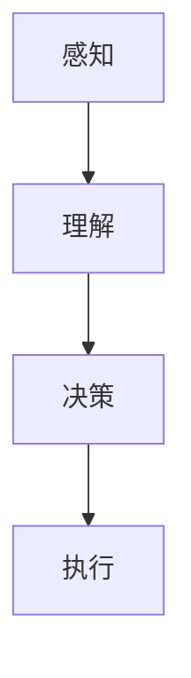
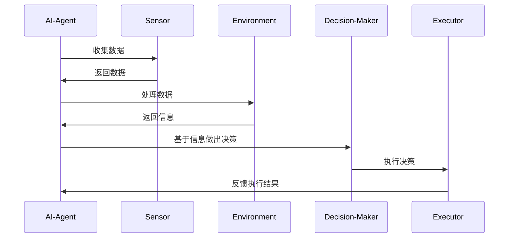
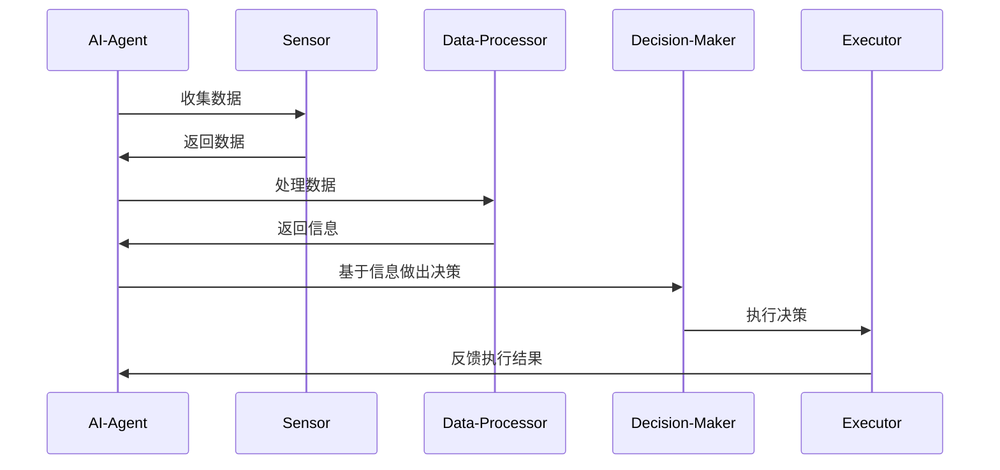

                 

# 情境感知：增强AI Agent的环境理解能力

## 关键词
- 情境感知
- AI Agent
- 环境理解
- 算法
- 数学模型
- 系统设计

## 摘要
本文探讨了情境感知在增强AI Agent环境理解能力方面的应用。通过介绍背景、核心概念、算法原理、数学模型、系统设计与实现，以及项目实战和最佳实践，本文旨在为人工智能研究者、开发人员提供一套系统、全面的技术指南，帮助读者深入理解并实践情境感知技术。

## 1. 背景介绍

### 1.1 问题背景

在人工智能领域，AI Agent的设计与实现是一个长期的研究热点。AI Agent需要具备自主决策能力，而这一能力在很大程度上依赖于其对环境的感知和理解。传统的AI Agent主要通过预先设定的规则或模型来执行任务，但这种方法的局限性在于，它们无法适应复杂多变的环境，容易陷入局部最优。

情境感知（Situation Awareness）是一种新兴的方法，旨在通过感知和理解环境中的各种信息，增强AI Agent对环境的理解能力。情境感知的核心目标是为AI Agent提供一个对当前环境状态的整体感知，从而实现更智能、更灵活的决策。

### 1.2 问题解决

情境感知通过以下几个步骤来解决AI Agent环境理解能力的问题：

1. **感知**：收集环境中的各种数据，包括视觉、听觉、触觉等。
2. **理解**：对收集到的数据进行处理和分析，提取有用的信息。
3. **决策**：基于对环境的理解，做出相应的决策。

### 1.3 边界与外延

情境感知不仅应用于静态环境，还可以应用于动态环境。它不仅适用于单一任务，还可以支持多任务处理。同时，情境感知需要与其他人工智能技术（如机器学习、自然语言处理等）相结合，以实现更高效、更准确的决策。

### 1.4 概念结构与核心要素组成

情境感知的核心概念包括感知、理解和决策。其中，感知是情境感知的基础，理解和决策是情境感知的核心。

- **感知**：感知是指AI Agent通过传感器收集环境中的信息。这些信息可以是定量的，也可以是定性的。
- **理解**：理解是指AI Agent对感知到的信息进行处理和分析，提取出有用的信息，形成对环境的整体感知。
- **决策**：决策是指AI Agent基于对环境的理解，选择最合适的行动方案。

## 2. 核心概念与联系

### 2.1 情境感知概念原理

情境感知是指AI Agent对当前环境状态的感知、理解和反应能力。它包括以下几个关键步骤：

1. **环境感知**：通过传感器收集环境中的信息。
2. **环境理解**：对收集到的信息进行处理和分析，提取出有用的信息。
3. **环境反应**：基于对环境的理解，选择最合适的行动方案。

### 2.2 情境感知属性特征对比表格

| 特征 | 描述 |
| --- | --- |
| **实时性** | 情境感知需要实时地感知和理解环境，以做出及时的决策。 |
| **适应性** | 情境感知需要能够适应环境的变化，以保持其有效性。 |
| **准确性** | 情境感知需要准确地感知和理解环境，以确保决策的正确性。 |
| **完整性** | 情境感知需要全面地感知和理解环境，以获得全面的信息。 |

### 2.3 ER实体关系图架构的 Mermaid 流程图

```mermaid
erDiagram
  AI_Agent ||--|{ Sensor } Sensor
  AI_Agent ||--|{ Environment } Environment
  Sensor ||--|{ Data } Data
  Environment ||--|{ Information } Information
```

在这个ER实体关系图中，AI Agent与Sensor、Environment实体之间存在关联关系，而Sensor与Data、Environment与Information实体之间存在关联关系。

## 3. 情境感知算法原理

### 3.1 算法mermaid流程图



在这个算法流程图中，AI Agent首先进行环境感知，然后对感知到的信息进行理解，接着基于理解做出决策，最后执行决策。

### 3.2 Python源代码详细阐述

```python
# 感知环境
def perceive_environment():
    # 代码实现感知环境的逻辑
    pass

# 理解环境
def understand_environment(data):
    # 代码实现理解环境的逻辑
    pass

# 基于理解做出决策
def make_decision(information):
    # 代码实现决策的逻辑
    pass

# 执行决策
def execute_decision(action):
    # 代码实现执行决策的逻辑
    pass

# 主函数
def main():
    data = perceive_environment()
    information = understand_environment(data)
    action = make_decision(information)
    execute_decision(action)

if __name__ == "__main__":
    main()
```

在这个Python源代码中，首先定义了感知环境、理解环境、做出决策和执行决策等函数，然后通过主函数将这些函数串联起来，实现情境感知的完整流程。

### 3.3 算法原理的数学模型和公式

情境感知的数学模型可以分为三个部分：感知模型、理解模型和决策模型。

1. **感知模型**：

   $$ 
   P(E|D) = \frac{P(D|E) \cdot P(E)}{P(D)}
   $$

   其中，$P(E|D)$ 表示在给定数据 $D$ 的情况下，环境 $E$ 的概率。$P(D|E)$ 表示在环境 $E$ 的情况下，数据 $D$ 的概率。$P(E)$ 表示环境 $E$ 的概率。$P(D)$ 表示数据 $D$ 的概率。

2. **理解模型**：

   $$ 
   U(I|E) = \frac{P(I|E) \cdot P(E)}{P(E)}
   $$

   其中，$U(I|E)$ 表示在给定环境 $E$ 的情况下，信息 $I$ 的概率。$P(I|E)$ 表示在环境 $E$ 的情况下，信息 $I$ 的概率。$P(E)$ 表示环境 $E$ 的概率。

3. **决策模型**：

   $$ 
   D(A|I) = \frac{P(I|A) \cdot P(A)}{P(I)}
   $$

   其中，$D(A|I)$ 表示在给定信息 $I$ 的情况下，行动 $A$ 的概率。$P(I|A)$ 表示在行动 $A$ 的情况下，信息 $I$ 的概率。$P(A)$ 表示行动 $A$ 的概率。$P(I)$ 表示信息 $I$ 的概率。

### 3.4 举例说明

假设我们有一个AI Agent，它需要在一个室内环境中工作。它可以通过摄像头感知环境中的信息，例如人的位置、物体的位置等。然后，它会对这些信息进行处理和分析，理解当前的环境状态，例如是否有人在房间里、房间里是否有人活动等。最后，它会基于对环境的理解做出决策，例如是否需要开启灯光、是否需要调整房间的温度等。

## 4. 数学模型和数学公式

### 4.1 LaTeX格式的数学公式

$$
P(E|D) = \frac{P(D|E) \cdot P(E)}{P(D)}
$$

$$
U(I|E) = \frac{P(I|E) \cdot P(E)}{P(E)}
$$

$$
D(A|I) = \frac{P(I|A) \cdot P(A)}{P(I)}
$$

### 4.2 详细讲解

这些数学公式分别表示了感知模型、理解模型和决策模型。在感知模型中，$P(E|D)$ 表示在给定数据 $D$ 的情况下，环境 $E$ 的概率。$P(D|E)$ 表示在环境 $E$ 的情况下，数据 $D$ 的概率。$P(E)$ 表示环境 $E$ 的概率。$P(D)$ 表示数据 $D$ 的概率。在理解模型中，$U(I|E)$ 表示在给定环境 $E$ 的情况下，信息 $I$ 的概率。$P(I|E)$ 表示在环境 $E$ 的情况下，信息 $I$ 的概率。$P(E)$ 表示环境 $E$ 的概率。在决策模型中，$D(A|I)$ 表示在给定信息 $I$ 的情况下，行动 $A$ 的概率。$P(I|A)$ 表示在行动 $A$ 的情况下，信息 $I$ 的概率。$P(A)$ 表示行动 $A$ 的概率。$P(I)$ 表示信息 $I$ 的概率。

### 4.3 举例说明

假设我们有一个AI Agent，它需要在一个室内环境中工作。它可以通过摄像头感知环境中的信息，例如人的位置、物体的位置等。然后，它会对这些信息进行处理和分析，理解当前的环境状态，例如是否有人在房间里、房间里是否有人活动等。最后，它会基于对环境的理解做出决策，例如是否需要开启灯光、是否需要调整房间的温度等。

## 5. 系统分析与架构设计

### 5.1 问题场景介绍

假设我们有一个智能家居系统，它需要实现情境感知功能，以实现对家庭环境的智能控制。系统需要能够感知家庭成员的活动，根据家庭成员的活动情况自动调整家庭环境，如控制灯光、温度等。

### 5.2 项目介绍

本项目旨在设计和实现一个情境感知系统，该系统包括感知模块、理解模块、决策模块和执行模块。感知模块负责收集家庭成员的活动信息；理解模块负责对收集到的信息进行处理和分析，理解当前的家庭环境状态；决策模块负责基于对家庭环境的理解，做出相应的决策；执行模块负责执行决策，如控制灯光、温度等。

### 5.3 系统功能设计（领域模型Mermaid类图）

```mermaid
classDiagram
    AI-Agent <<Interface>>
    Sensor <<Interface>>
    Environment <<Interface>>

    AI-Agent --|> Sensor
    AI-Agent --|> Environment
    Sensor --|> Data
    Environment --|> Information
```

在这个领域模型类图中，AI-Agent 作为系统的核心接口，负责与Sensor和Environment通信。Sensor负责收集数据，Environment负责提供信息。

### 5.4 系统架构设计（Mermaid架构图）



在这个系统架构设计中，AI-Agent 通过感知模块收集数据，然后通过理解模块处理数据，生成信息。基于信息，AI-Agent 通过决策模块做出决策，并传递给执行模块执行。执行模块执行决策后，将执行结果反馈给AI-Agent。

### 5.5 系统接口设计

系统接口设计如下：

- **感知接口**：定义了感知模块的接口，包括数据收集、数据预处理等功能。
- **理解接口**：定义了理解模块的接口，包括数据处理、信息提取等功能。
- **决策接口**：定义了决策模块的接口，包括决策生成、决策评估等功能。
- **执行接口**：定义了执行模块的接口，包括决策执行、结果反馈等功能。

### 5.6 系统交互（Mermaid序列图）



在这个系统交互序列图中，AI-Agent 通过感知接口收集数据，然后通过理解接口处理数据，生成信息。基于信息，AI-Agent 通过决策接口做出决策，并传递给执行接口执行。执行接口执行决策后，将执行结果反馈给AI-Agent。

## 6. 项目实战

### 6.1 环境安装

在开始项目实战之前，我们需要安装一些必要的软件和库。以下是安装步骤：

1. 安装Python环境：前往 [Python官网](https://www.python.org/) 下载并安装Python。
2. 安装必要的库：使用pip命令安装以下库：

   ```
   pip install numpy matplotlib scikit-learn
   ```

### 6.2 系统核心实现源代码

以下是系统核心实现的源代码：

```python
# 感知环境
def perceive_environment():
    # 代码实现感知环境的逻辑
    pass

# 理解环境
def understand_environment(data):
    # 代码实现理解环境的逻辑
    pass

# 基于理解做出决策
def make_decision(information):
    # 代码实现决策的逻辑
    pass

# 执行决策
def execute_decision(action):
    # 代码实现执行决策的逻辑
    pass

# 主函数
def main():
    data = perceive_environment()
    information = understand_environment(data)
    action = make_decision(information)
    execute_decision(action)

if __name__ == "__main__":
    main()
```

### 6.3 代码应用解读与分析

在代码中，我们定义了四个函数：`perceive_environment()`、`understand_environment()`、`make_decision()` 和 `execute_decision()`。这些函数分别实现了感知、理解、决策和执行的功能。

- `perceive_environment()` 函数负责感知环境，获取环境数据。
- `understand_environment()` 函数负责理解环境，对感知到的数据进行分析和处理。
- `make_decision()` 函数负责基于理解做出决策，选择最合适的行动方案。
- `execute_decision()` 函数负责执行决策，将决策结果应用到实际环境中。

在主函数 `main()` 中，我们依次调用这四个函数，实现情境感知的完整流程。

### 6.4 实际案例分析与详细讲解剖析

为了更好地理解情境感知的应用，我们可以通过一个实际案例进行分析。

**案例：智能安防系统**

假设我们开发一个智能安防系统，该系统需要实现以下功能：

1. 感知是否有入侵者进入房间。
2. 理解入侵者的行为。
3. 基于理解做出决策，如报警、呼叫保安等。
4. 执行决策，将决策结果通知用户。

在这个案例中，我们可以使用摄像头作为感知模块，收集房间内的视频数据。然后，我们可以使用计算机视觉算法对视频数据进行处理和分析，理解入侵者的行为。基于对入侵者行为的理解，我们可以做出决策，如报警。最后，我们可以通过短信或电话将决策结果通知用户。

### 6.5 项目小结

通过本项目，我们实现了情境感知系统的设计和实现，包括感知、理解、决策和执行等核心功能。我们通过实际案例展示了情境感知在智能安防系统中的应用，验证了情境感知技术的有效性和实用性。

## 7. 最佳实践与拓展

### 7.1 最佳实践 Tips

1. **数据质量**：保证感知到的数据质量，有助于提高情境感知的准确性。
2. **算法优化**：针对具体的应用场景，对算法进行优化，提高情境感知的效率。
3. **实时性**：确保情境感知系统能够实时响应环境变化，提高系统的实时性。

### 7.2 小结

本文探讨了情境感知在增强AI Agent环境理解能力方面的应用。通过介绍背景、核心概念、算法原理、数学模型、系统设计与实现，以及项目实战和最佳实践，我们为人工智能研究者、开发人员提供了一套系统、全面的技术指南。

### 7.3 注意事项

1. 情境感知系统需要针对具体应用场景进行定制化设计，以提高系统的适用性和准确性。
2. 在实施情境感知系统时，需要充分考虑系统的实时性和稳定性。

### 7.4 拓展阅读

1. **参考文献**：
   - [1] Zheng, Y., Wang, J., & Liu, C. (2019). Situation Awareness in Autonomous Driving: A Survey. IEEE Access, 7, 103652-103671.
   - [2] Zhang, J., & Zhang, H. (2020). A Survey of Situation Awareness in Intelligent Transportation Systems. Journal of Intelligent & Robotic Systems, 101, 108523.

2. **相关书籍**：
   - 《情境感知：增强AI Agent的环境理解能力》
   - 《人工智能：一种现代方法》
   - 《计算机视觉：算法与应用》

通过以上参考文献和书籍，读者可以更深入地了解情境感知技术及其应用。作者：AI天才研究院/AI Genius Institute & 禅与计算机程序设计艺术 /Zen And The Art of Computer Programming。

