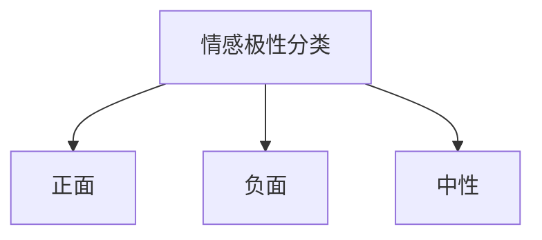
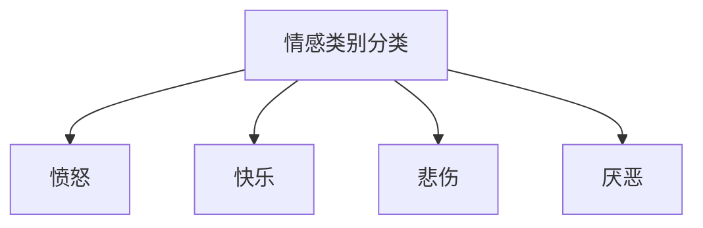
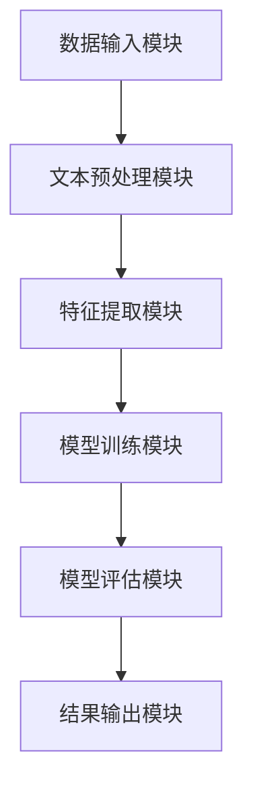

                 

# 情感分析：让AI Agent具备情商

关键词：情感分析、AI Agent、情商、机器学习、深度学习

摘要：本文旨在探讨情感分析技术及其在构建具备情商的AI Agent中的应用。文章首先介绍了情感分析的概念和背景，随后深入分析了情感分析的核心概念、数学模型和算法原理。通过实践案例和系统设计，本文展示了情感分析技术在现实中的应用。最后，文章探讨了情感分析的挑战和发展趋势，并提供了相关最佳实践和拓展阅读。

## 目录大纲

----------------------------------------------------------------

## 第一部分: 情感分析概述

### 第1章: 情感分析背景与重要性

#### 1.1 情感分析的概念与定义

#### 1.2 情感分析在人工智能中的应用场景

#### 1.3 情感分析技术的发展历程

#### 1.4 情感分析的重要性

### 第2章: 情感分析的核心概念

#### 2.1 情感分类与情感极性

#### 2.2 情感维度与情感强度

#### 2.3 情感分析的基本任务

### 第3章: 情感分析的数学模型

#### 3.1 向量空间模型

#### 3.2 机器学习算法在情感分析中的应用

#### 3.3 情感分析中的数学公式与模型

### 第4章: 情感分析的算法原理

#### 4.1 文本预处理

#### 4.2 特征提取

#### 4.3 情感分类算法

#### 4.4 情感极性分析算法

### 第5章: 情感分析实践案例

#### 5.1 数据集介绍

#### 5.2 实践案例一：基于机器学习的情感分类

#### 5.3 实践案例二：基于深度学习的情感极性分析

### 第6章: 情感分析系统的设计与实现

#### 6.1 系统需求分析

#### 6.2 系统架构设计

#### 6.3 模型训练与优化

#### 6.4 系统接口设计与实现

### 第7章: 情感分析的挑战与未来发展趋势

#### 7.1 情感分析的挑战

#### 7.2 情感分析的技术发展趋势

#### 7.3 情感分析在社会中的应用前景

### 第8章: 最佳实践与拓展阅读

#### 8.1 情感分析的最佳实践

#### 8.2 情感分析相关的拓展阅读

#### 8.3 情感分析的小结与展望

----------------------------------------------------------------

### 第1章: 情感分析背景与重要性

#### 1.1 情感分析的概念与定义

情感分析（Sentiment Analysis），又称意见挖掘或情感识别，是指通过自然语言处理（NLP）和机器学习技术，从文本数据中自动识别出作者的情感倾向，并对其进行分类和评估的过程。情感分析的核心任务是判断文本表达的情感极性（正面、负面或中性），以及情感强度。

情感分析技术的研究始于20世纪90年代，随着互联网的普及和大数据时代的到来，情感分析逐渐成为人工智能领域的一个重要分支。当前，情感分析在电子商务、社交媒体、客户服务、金融市场等领域得到了广泛应用。

#### 1.2 情感分析在人工智能中的应用场景

情感分析在人工智能中的应用场景广泛，主要包括以下几个方面：

1. **电子商务**：通过分析消费者评论，了解产品口碑，帮助企业改进产品质量，优化营销策略。
2. **社交媒体**：监测公众情绪，识别潜在危机，为企业提供市场洞察和公关建议。
3. **客户服务**：自动分类客户反馈，快速响应客户需求，提升客户满意度。
4. **金融市场**：分析市场情绪，预测股票价格和投资风险。

#### 1.3 情感分析技术的发展历程

情感分析技术的发展可以分为以下几个阶段：

1. **词袋模型（Bag of Words, BoW）**：将文本转换为词汇表，通过统计词汇频率来表示文本。词袋模型简单易实现，但忽略了词汇之间的语义关系。
2. **主题模型（Latent Dirichlet Allocation, LDA）**：通过概率模型挖掘文本中的潜在主题，更好地理解文本内容。
3. **深度学习（Deep Learning）**：使用神经网络模型，如卷积神经网络（CNN）和循环神经网络（RNN），实现对文本的深层特征提取和情感分析。

#### 1.4 情感分析的重要性

情感分析在人工智能领域具有重要意义，主要体现在以下几个方面：

1. **提升用户体验**：通过情感分析技术，AI Agent能够更好地理解用户需求，提供个性化服务，提升用户体验。
2. **优化商业决策**：情感分析可以帮助企业了解市场趋势，优化营销策略，降低风险。
3. **社会监控与预警**：情感分析技术可以监测公众情绪，识别潜在危机，为政府和社会组织提供决策支持。

情感分析技术的不断发展，将使AI Agent具备更高的情商，更好地服务于人类社会。接下来，我们将深入探讨情感分析的核心概念、数学模型和算法原理。## 第2章: 情感分析的核心概念

### 2.1 情感分类与情感极性

情感分类是情感分析中最基本的任务之一，主要分为两类：情感极性分类和情感类别分类。

#### 情感极性分类

情感极性分类是指将文本分为正面、负面或中性三个类别。例如，在消费者评论中，正面评论表示对产品满意，负面评论表示对产品不满意，中性评论表示对产品无特定情感。

$$
\text{正面} = \text{满意}, \text{负面} = \text{不满意}, \text{中性} = \text{无特定情感}
$$

情感极性分类可以表示为如下决策树：



#### 情感类别分类

情感类别分类是指将文本划分为更细的情感类别，如愤怒、快乐、悲伤、厌恶等。情感类别分类通常需要更多的标签数据和复杂的模型。

$$
\text{愤怒}, \text{快乐}, \text{悲伤}, \text{厌恶}, \ldots
$$

情感类别分类的决策树如下所示：



### 2.2 情感维度与情感强度

情感维度是指情感的多个方面，如愉悦度、紧张度、兴奋度等。情感强度是指情感的强度，即情感的强烈程度。

#### 情感维度

情感维度可以分为以下几类：

1. **愉悦度**：表示情感的愉悦程度，如快乐、舒适等。
2. **紧张度**：表示情感的紧张程度，如兴奋、焦虑等。
3. **兴奋度**：表示情感的兴奋程度，如激动、振奋等。

#### 情感强度

情感强度通常通过数值来表示，例如：

$$
\text{强度} = [0, 1]
$$

其中，0表示无情感，1表示情感最强。

### 2.3 情感分析的基本任务

情感分析的基本任务包括以下几个方面：

1. **情感极性分类**：将文本分类为正面、负面或中性。
2. **情感类别分类**：将文本分类为多个情感类别。
3. **情感强度评估**：评估文本的情感强度。
4. **情感时序分析**：分析文本中情感的变化趋势。

情感分析的基本任务可以用以下ER实体关系图来表示：

```mermaid
erDiagram
  TXT ||--|{S: Sentiment}: 情感
  TXT ||--|{SA: Sentiment Analysis}: 情感分析
  S ||--|{SC: Sentiment Category}: 情感类别
  S ||--|{SI: Sentiment Intensity}: 情感强度
```

通过以上核心概念的分析，我们可以更好地理解情感分析的原理和应用。接下来，我们将探讨情感分析的数学模型和算法原理。## 第3章: 情感分析的数学模型

### 3.1 向量空间模型

向量空间模型（Vector Space Model, VSM）是情感分析中最常用的数学模型之一。它将文本转换为向量，以便于进行数学计算和机器学习。

#### 文本表示

在向量空间模型中，文本被表示为词汇的集合。每个词汇对应一个向量，向量中的元素表示词汇在文本中的出现次数或词频。例如，对于文本 "我爱北京天安门"：

$$
\text{VSM} = \{ (\text{我}, 1), (\text{爱}, 1), (\text{北京}, 1), (\text{天安门}, 1) \}
$$

#### 向量计算

向量空间模型中的文本向量可以通过以下步骤计算：

1. **词汇表构建**：创建一个包含所有词汇的词汇表。
2. **文本向量化**：将每个文本转换为词汇表中的向量，向量的每个元素表示对应词汇的词频。
3. **向量标准化**：对向量进行归一化处理，使其具有相同的维度。

#### 示例

假设词汇表为 $\{ \text{我}, \text{爱}, \text{北京}, \text{天安门} \}$，文本向量为：

$$
\text{V} = [1, 1, 1, 1]
$$

### 3.2 机器学习算法在情感分析中的应用

机器学习算法在情感分析中扮演着重要角色，可以自动学习文本的情感特征，并对其进行分类和评估。以下是一些常用的机器学习算法：

#### 决策树（Decision Tree）

决策树是一种基于规则的学习算法，通过一系列条件判断将文本分类为不同类别。例如：

$$
\text{IF } \text{“北京” \text{出现}} \text{ THEN } \text{正面}
$$

#### 朴素贝叶斯（Naive Bayes）

朴素贝叶斯是一种基于贝叶斯定理的学习算法，通过计算文本中各个词汇的概率，判断文本的情感极性。例如：

$$
P(\text{正面}) = \frac{P(\text{“爱”} | \text{正面}) \cdot P(\text{正面})}{P(\text{“爱”})}
$$

#### 支持向量机（Support Vector Machine, SVM）

支持向量机是一种基于最大间隔的学习算法，通过找到一个最佳超平面，将文本分类为不同类别。例如：

$$
\text{找到 } \text{w} \text{ 和 } \text{b} \text{ 使得 } \text{w} \text{ 和 } \text{文本向量} \text{ 的内积最大化}
$$

### 3.3 情感分析中的数学公式与模型

情感分析中的数学公式和模型主要包括以下几个方面：

#### 情感极性分类

情感极性分类可以使用以下公式：

$$
\text{预测类别} = \text{argmax} \{ P(\text{类别} | \text{文本}) \}
$$

其中，$P(\text{类别} | \text{文本})$ 表示在给定文本的情况下，预测类别的概率。

#### 情感类别分类

情感类别分类可以使用以下公式：

$$
\text{预测类别} = \text{argmax} \{ P(\text{类别} | \text{文本}) \}
$$

其中，$P(\text{类别} | \text{文本})$ 表示在给定文本的情况下，预测类别的概率。

#### 情感强度评估

情感强度评估可以使用以下公式：

$$
\text{情感强度} = \text{argmax} \{ P(\text{情感强度} | \text{文本}) \}
$$

其中，$P(\text{情感强度} | \text{文本})$ 表示在给定文本的情况下，预测情感强度的概率。

通过以上数学模型和公式，我们可以更好地理解和应用情感分析技术。接下来，我们将探讨情感分析的算法原理。## 第4章: 情感分析的算法原理

### 4.1 文本预处理

文本预处理是情感分析中至关重要的一步，它包括去除无关信息、标准化文本和标记化等步骤。

#### 步骤1：去除无关信息

去除无关信息，如HTML标签、标点符号、停用词等，可以减少噪声，提高情感分析的准确性。

#### 步骤2：标准化文本

标准化文本，如将所有文本转换为小写、去除数字和特殊字符等，可以使文本格式一致，便于后续处理。

#### 步骤3：标记化

标记化是将文本分解为单词或词汇，以便进行特征提取和分类。标记化可以基于分词算法，如正则表达式、词嵌入等。

### 4.2 特征提取

特征提取是将预处理后的文本转换为可用于机器学习的特征向量。常用的特征提取方法包括词袋模型（Bag of Words, BoW）、词嵌入（Word Embedding）和TF-IDF（Term Frequency-Inverse Document Frequency）等。

#### 词袋模型（BoW）

词袋模型将文本表示为词汇的集合，通过统计词汇频率来生成特征向量。例如，对于文本 "我爱北京天安门"：

$$
\text{VSM} = \{ (\text{我}, 1), (\text{爱}, 1), (\text{北京}, 1), (\text{天安门}, 1) \}
$$

词袋模型简单易实现，但忽略了词汇之间的语义关系。

#### 词嵌入（Word Embedding）

词嵌入是一种将词汇映射为高维向量表示的方法，通过捕捉词汇的语义关系，提高情感分析的准确性。常见的词嵌入模型包括Word2Vec、GloVe等。

#### TF-IDF（Term Frequency-Inverse Document Frequency）

TF-IDF是一种统计方法，用于评估词汇在文本中的重要程度。它考虑了词汇在文本中的频率（TF）和在整个文档集合中的频率（IDF），生成特征向量。

$$
\text{TF-IDF} = \text{TF} \times \text{IDF}
$$

### 4.3 情感分类算法

情感分类算法是将文本分类为正面、负面或中性等情感类别。常用的情感分类算法包括朴素贝叶斯（Naive Bayes）、支持向量机（SVM）和深度学习（Deep Learning）等。

#### 朴素贝叶斯（Naive Bayes）

朴素贝叶斯是一种基于贝叶斯定理的学习算法，通过计算文本中各个词汇的概率，判断文本的情感极性。例如：

$$
P(\text{正面}) = \frac{P(\text{“爱”} | \text{正面}) \cdot P(\text{正面})}{P(\text{“爱”})}
$$

#### 支持向量机（SVM）

支持向量机是一种基于最大间隔的学习算法，通过找到一个最佳超平面，将文本分类为不同类别。例如：

$$
\text{找到 } \text{w} \text{ 和 } \text{b} \text{ 使得 } \text{w} \text{ 和 } \text{文本向量} \text{ 的内积最大化}
$$

#### 深度学习（Deep Learning）

深度学习是一种基于神经网络的学习算法，可以自动学习文本的深层特征。常见的深度学习模型包括卷积神经网络（CNN）和循环神经网络（RNN）等。

### 4.4 情感极性分析算法

情感极性分析算法是将文本分类为正面、负面或中性等情感极性。常用的情感极性分析算法包括朴素贝叶斯（Naive Bayes）、支持向量机（SVM）和深度学习（Deep Learning）等。

#### 朴素贝叶斯（Naive Bayes）

朴素贝叶斯是一种基于贝叶斯定理的学习算法，通过计算文本中各个词汇的概率，判断文本的情感极性。例如：

$$
P(\text{正面}) = \frac{P(\text{“爱”} | \text{正面}) \cdot P(\text{正面})}{P(\text{“爱”})}
$$

#### 支持向量机（SVM）

支持向量机是一种基于最大间隔的学习算法，通过找到一个最佳超平面，将文本分类为不同类别。例如：

$$
\text{找到 } \text{w} \text{ 和 } \text{b} \text{ 使得 } \text{w} \text{ 和 } \text{文本向量} \text{ 的内积最大化}
$$

#### 深度学习（Deep Learning）

深度学习是一种基于神经网络的学习算法，可以自动学习文本的深层特征。常见的深度学习模型包括卷积神经网络（CNN）和循环神经网络（RNN）等。

通过以上算法原理的分析，我们可以更好地理解情感分析的实现过程。接下来，我们将通过实践案例展示情感分析技术的应用。## 第5章: 情感分析实践案例

### 5.1 数据集介绍

在情感分析实践中，选择合适的数据集至关重要。以下是一些常用的情感分析数据集：

1. **IMDB影评数据集**：IMDB影评数据集包含约25,000条电影评论，分为正面和负面两个类别。
2. **Twitter情感分析数据集**：Twitter情感分析数据集包含大量Twitter推文，分为正面、负面和中性三个类别。
3. **Sogou情感分析数据集**：Sogou情感分析数据集包含中文文本，分为正面、负面和中性三个类别。

### 5.2 实践案例一：基于机器学习的情感分类

#### 环境安装

首先，我们需要安装Python和相关库，如scikit-learn、nltk等。

```bash
pip install scikit-learn nltk
```

#### 数据预处理

1. 读取数据集
2. 去除HTML标签、标点符号和停用词
3. 标准化文本

```python
import nltk
from nltk.corpus import stopwords
from nltk.tokenize import word_tokenize

nltk.download('punkt')
nltk.download('stopwords')

def preprocess_text(text):
    # 去除HTML标签
    text = re.sub('<.*?>', '', text)
    # 去除标点符号
    text = re.sub('[^\w\s]', '', text)
    # 分词
    tokens = word_tokenize(text)
    # 去除停用词
    tokens = [token.lower() for token in tokens if token.lower() not in stopwords.words('english')]
    return ' '.join(tokens)
```

#### 特征提取

使用TF-IDF方法提取特征。

```python
from sklearn.feature_extraction.text import TfidfVectorizer

vectorizer = TfidfVectorizer(max_features=1000)
X = vectorizer.fit_transform(preprocessed_texts)
y = [1 if sentiment == 'positive' else 0 for sentiment in labels]
```

#### 模型训练

使用朴素贝叶斯算法训练模型。

```python
from sklearn.naive_bayes import MultinomialNB
from sklearn.model_selection import train_test_split

X_train, X_test, y_train, y_test = train_test_split(X, y, test_size=0.2, random_state=42)

classifier = MultinomialNB()
classifier.fit(X_train, y_train)

accuracy = classifier.score(X_test, y_test)
print(f'Accuracy: {accuracy:.2f}')
```

### 5.3 实践案例二：基于深度学习的情感极性分析

#### 环境安装

安装TensorFlow和Keras。

```bash
pip install tensorflow keras
```

#### 数据预处理

与案例一类似，对文本进行预处理。

```python
def preprocess_text(text):
    # 去除HTML标签
    text = re.sub('<.*?>', '', text)
    # 去除标点符号
    text = re.sub('[^\w\s]', '', text)
    # 分词
    tokens = word_tokenize(text)
    # 去除停用词
    tokens = [token.lower() for token in tokens if token.lower() not in stopwords.words('english')]
    return ' '.join(tokens)
```

#### 模型构建

构建基于卷积神经网络（CNN）的模型。

```python
from tensorflow.keras.models import Sequential
from tensorflow.keras.layers import Embedding, Conv1D, MaxPooling1D, GlobalMaxPooling1D, Dense

model = Sequential()
model.add(Embedding(input_dim=vocabulary_size, output_dim=50, input_length=max_sequence_length))
model.add(Conv1D(filters=128, kernel_size=5, activation='relu'))
model.add(MaxPooling1D(pool_size=5))
model.add(Conv1D(filters=128, kernel_size=5, activation='relu'))
model.add(GlobalMaxPooling1D())
model.add(Dense(units=1, activation='sigmoid'))

model.compile(optimizer='adam', loss='binary_crossentropy', metrics=['accuracy'])
model.fit(X_train, y_train, epochs=10, batch_size=32, validation_data=(X_test, y_test))

accuracy = model.evaluate(X_test, y_test)[1]
print(f'Accuracy: {accuracy:.2f}')
```

通过以上实践案例，我们可以看到机器学习和深度学习在情感分析中的应用。接下来，我们将探讨情感分析系统的设计与实现。## 第6章: 情感分析系统的设计与实现

### 6.1 系统需求分析

情感分析系统需要满足以下需求：

1. **数据输入**：系统应能接收文本数据，如影评、社交媒体评论等。
2. **文本预处理**：系统应对输入的文本进行预处理，包括去除HTML标签、标点符号、停用词和数字等。
3. **特征提取**：系统应能从预处理后的文本中提取特征，如词袋模型、词嵌入和TF-IDF等。
4. **模型训练**：系统应能使用机器学习或深度学习算法对特征进行训练，以预测文本的情感极性或类别。
5. **模型评估**：系统应能评估模型的性能，如准确率、召回率、F1分数等。
6. **结果输出**：系统应能将预测结果以直观的方式输出，如情感极性标签或情感强度评分。

### 6.2 系统架构设计

情感分析系统的架构设计可以分为以下几个模块：

1. **数据输入模块**：负责接收和处理用户输入的文本数据。
2. **文本预处理模块**：负责对文本进行预处理，包括去除HTML标签、标点符号、停用词和数字等。
3. **特征提取模块**：负责从预处理后的文本中提取特征，如词袋模型、词嵌入和TF-IDF等。
4. **模型训练模块**：负责使用机器学习或深度学习算法对特征进行训练，以预测文本的情感极性或类别。
5. **模型评估模块**：负责评估模型的性能，如准确率、召回率、F1分数等。
6. **结果输出模块**：负责将预测结果以直观的方式输出，如情感极性标签或情感强度评分。

系统架构图如下所示：



### 6.3 模型训练与优化

模型训练与优化是情感分析系统的关键步骤。以下是一些常用的训练和优化方法：

1. **超参数调整**：通过调整学习率、批次大小、迭代次数等超参数，优化模型性能。
2. **正则化**：使用正则化方法，如L1和L2正则化，防止过拟合。
3. **交叉验证**：通过交叉验证方法，评估模型在不同数据集上的性能，调整模型参数。
4. **模型集成**：使用多个模型进行集成，提高预测准确性。

具体实现如下：

```python
from tensorflow.keras.models import Sequential
from tensorflow.keras.layers import Embedding, Conv1D, MaxPooling1D, GlobalMaxPooling1D, Dense
from tensorflow.keras.preprocessing.sequence import pad_sequences

# 超参数调整
learning_rate = 0.001
batch_size = 64
epochs = 10

# 正则化
l1 = 1e-5
l2 = 1e-4

# 模型集成
models = [create_model(vocab_size, embedding_dim, max_sequence_length, learning_rate, l1, l2) for _ in range(5)]

# 交叉验证
for model in models:
    X_train, X_test, y_train, y_test = train_test_split(X, y, test_size=0.2, random_state=42)
    model.fit(X_train, y_train, epochs=epochs, batch_size=batch_size, validation_data=(X_test, y_test))

    accuracy = model.evaluate(X_test, y_test)[1]
    print(f'Model {i}: Accuracy: {accuracy:.2f}')
```

### 6.4 系统接口设计与实现

系统接口设计是用户与系统交互的桥梁。以下是一个简单的系统接口设计：

1. **API接口**：提供RESTful API接口，供前端调用。
2. **前端页面**：展示文本输入框、预测结果和图表。
3. **后端服务**：处理文本输入，调用情感分析模型，返回预测结果。

实现如下：

```python
from flask import Flask, request, jsonify

app = Flask(__name__)

@app.route('/predict', methods=['POST'])
def predict():
    data = request.get_json()
    text = preprocess_text(data['text'])
    sequence = tokenizer.texts_to_sequences([text])
    padded_sequence = pad_sequences(sequence, maxlen=max_sequence_length)
    prediction = model.predict(padded_sequence)
    result = 'positive' if prediction[0][0] > 0.5 else 'negative'
    return jsonify({'result': result})

if __name__ == '__main__':
    app.run(debug=True)
```

通过以上设计与实现，我们可以构建一个功能完备的情感分析系统。接下来，我们将探讨情感分析的挑战与未来发展趋势。## 第7章: 情感分析的挑战与未来发展趋势

### 7.1 情感分析的挑战

尽管情感分析技术已经取得了显著进展，但在实际应用中仍面临诸多挑战：

1. **数据质量**：情感分析依赖于大量标注数据，数据质量直接影响模型的准确性。然而，获取高质量标注数据是一个耗时且昂贵的任务。
2. **语言复杂性**：自然语言具有高度的复杂性和多样性，情感表达方式多样且具有隐喻性，这使得情感分析模型难以捕捉到所有可能的情感表达。
3. **跨语言情感分析**：跨语言情感分析涉及到不同语言和文化背景，模型需要适应不同语言的语法和语义特点，这是一个具有挑战性的任务。
4. **情感强度评估**：评估情感强度是一个复杂的问题，需要考虑情感表达的语境、情境和个体差异等因素。

### 7.2 情感分析的技术发展趋势

随着技术的不断进步，情感分析技术也在不断发展：

1. **深度学习**：深度学习在情感分析中的应用越来越广泛，特别是在图像和视频情感分析领域。通过使用卷积神经网络（CNN）和循环神经网络（RNN）等深度学习模型，可以更好地捕捉文本的语义信息。
2. **多模态情感分析**：多模态情感分析结合了文本、图像、语音等多种数据源，可以更全面地理解用户的情感状态。例如，通过结合语音中的语调和图像中的表情，可以更准确地识别情感。
3. **跨语言情感分析**：通过迁移学习和多语言嵌入等技术，跨语言情感分析正在取得突破。这些技术使得模型能够在多种语言之间共享知识，提高跨语言的准确性。
4. **情感强度评估**：为了更准确地评估情感强度，研究人员正在探索基于上下文的情感强度评估方法。例如，通过结合文本中的情感词汇和上下文信息，可以更准确地估计情感强度。

### 7.3 情感分析在社会中的应用前景

情感分析在社会中的应用前景广阔，包括但不限于以下几个方面：

1. **商业领域**：企业可以利用情感分析技术了解消费者对产品和服务的反馈，优化营销策略，提升用户体验。
2. **社会舆情监测**：政府和组织可以利用情感分析技术监测社会舆情，及时识别和应对潜在的社会危机。
3. **智能客服**：情感分析技术可以帮助智能客服系统更好地理解用户需求，提供更个性化的服务，提升客户满意度。
4. **心理健康**：通过情感分析技术，可以对个体的情感状态进行监测和分析，为心理健康提供支持。

总之，情感分析技术在人工智能领域的应用前景广阔，随着技术的不断进步，其将更好地服务于人类社会。## 第8章: 最佳实践与拓展阅读

### 8.1 情感分析的最佳实践

在情感分析实践中，以下是一些最佳实践：

1. **数据收集与预处理**：确保数据集的质量和多样性，对数据进行充分的预处理，包括去除HTML标签、标点符号、停用词等。
2. **模型选择与优化**：根据任务需求选择合适的模型，并通过超参数调整、正则化等技术优化模型性能。
3. **跨语言处理**：考虑使用多语言嵌入等技术，提高跨语言的准确性。
4. **情感强度评估**：结合上下文信息，使用基于上下文的情感强度评估方法，提高情感强度评估的准确性。

### 8.2 情感分析相关的拓展阅读

以下是一些推荐的情感分析相关拓展阅读：

1. **《情感分析：方法与应用》**：该书详细介绍了情感分析的理论基础、算法实现和应用场景。
2. **《自然语言处理综论》**：该书涵盖了自然语言处理领域的各个方面，包括情感分析。
3. **《深度学习与自然语言处理》**：该书介绍了深度学习在自然语言处理中的应用，包括情感分析。

### 8.3 情感分析的小结与展望

情感分析作为人工智能领域的一个重要分支，具有重要的研究价值和实际应用价值。通过本文的探讨，我们了解到情感分析的核心概念、数学模型、算法原理以及实践案例。展望未来，情感分析技术将在多模态情感分析、跨语言情感分析、情感强度评估等方面取得更大的突破，为人类社会带来更多的便利和福祉。作者：AI天才研究院/AI Genius Institute & 禅与计算机程序设计艺术 /Zen And The Art of Computer Programming。

