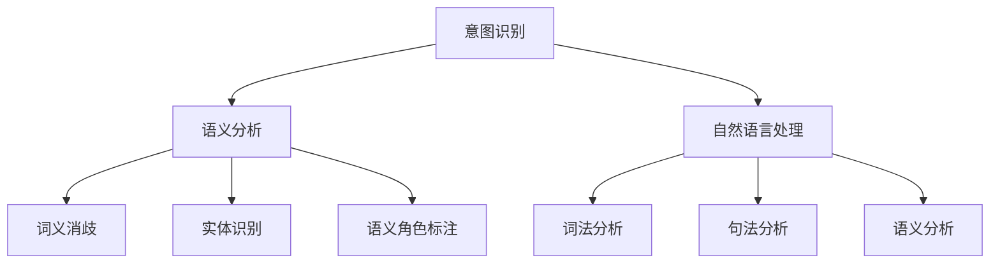
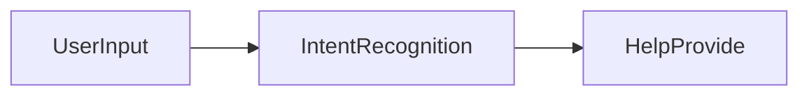
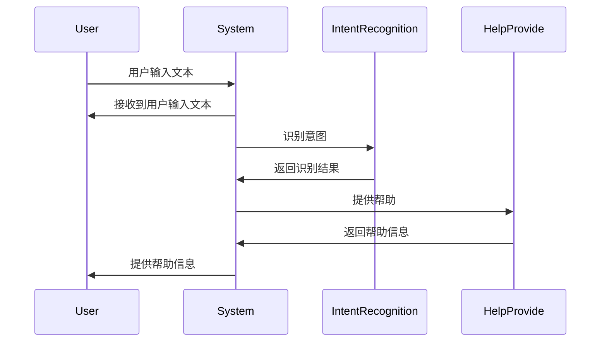
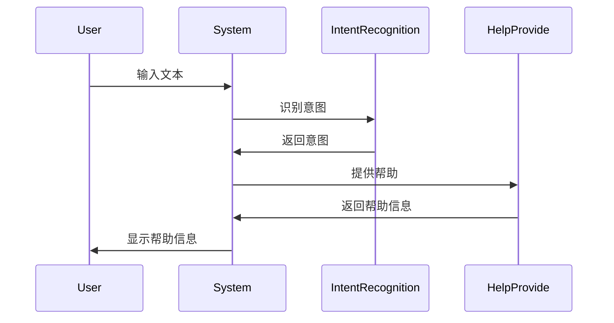

                 

### 意图识别：准确把握用户需求

在当今的互联网时代，用户需求的多样化使得准确把握用户需求变得至关重要。意图识别作为自然语言处理（NLP）领域的一个重要任务，旨在理解用户输入的文本，从而准确把握用户需求。本文将深入探讨意图识别的核心概念、原理和实现方法，旨在为广大读者提供一份系统、全面的技术指南。

## 关键词

- 意图识别
- 自然语言处理
- 用户需求
- 机器学习
- 深度学习
- 概率论

## 摘要

本文首先介绍了意图识别的背景和重要性，随后对意图识别的任务、挑战和解决方案进行了详细分析。接着，本文从核心概念、原理和算法三个方面对意图识别进行了深入讲解，并使用Python代码示例和数学公式对算法进行了详细阐述。最后，本文还针对实际应用场景提供了系统架构设计和项目实战经验，为读者提供了全面的实践指导。

## 目录大纲

1. 引言
    1.1 问题背景
    1.2 问题描述
    1.3 问题解决
    1.4 边界与外延
    1.5 概念结构与核心要素组成
2. 核心概念与联系
    2.1 核心概念原理
    2.2 概念属性特征对比表格
    2.3 ER实体关系图架构
3. 算法原理讲解
    3.1 基于机器学习的方法
    3.2 基于深度学习的方法
4. 数学模型和数学公式 & 详细讲解 & 举例说明
5. 系统分析与架构设计方案
6. 项目实战
7. 最佳实践 tips、小结、注意事项、拓展阅读

### 第一部分 引言

#### 1.1 问题背景

随着互联网的普及和发展，人们越来越依赖于在线服务。然而，用户需求的多样化和复杂性给服务提供商带来了巨大的挑战。如何准确把握用户需求，提供个性化的服务，成为了企业竞争的关键。意图识别作为一种有效的自然语言处理技术，能够在语义层面上对用户输入进行理解和分析，从而帮助服务提供商更好地满足用户需求。

意图识别在智能客服、推荐系统、搜索引擎等众多领域具有重要的应用价值。在智能客服中，意图识别能够帮助自动识别用户咨询的问题类型，从而快速提供相关帮助；在推荐系统中，意图识别可以分析用户的搜索历史和浏览行为，为用户提供更加精准的推荐；在搜索引擎中，意图识别可以帮助优化搜索结果，提高用户满意度。

#### 1.2 问题描述

意图识别的任务是理解用户输入的文本，确定其意图和目标。具体来说，给定一个用户输入的文本句子，意图识别需要识别出文本的语义意图，并将其映射到预定义的意图类别上。例如，用户输入“我想购买一部手机”，意图识别系统需要识别出该句子的意图是“购买手机”。

然而，意图识别面临着许多挑战。首先，用户需求多样化，意图表达方式多种多样，导致识别的难度增加。其次，语义歧义问题普遍存在，同一条句子可能有不同的意图解释。此外，上下文信息对意图理解具有重要影响，如何在复杂多变的上下文中准确识别意图也是一个难点。

#### 1.3 问题解决

为了解决意图识别的问题，研究者们提出了多种方法，主要包括基于规则的方法、基于机器学习的方法和基于深度学习的方法。

**基于规则的方法：**这种方法利用人工编写的规则进行意图识别。规则通常基于语言学知识和领域知识，能够覆盖一些常见的意图表达方式。然而，基于规则的方法存在扩展性差、维护困难等问题，难以应对复杂多变的用户需求。

**基于机器学习的方法：**这种方法通过训练大量标注数据来学习意图识别模型。常用的机器学习方法包括朴素贝叶斯、支持向量机、决策树、随机森林等。这些方法通过学习数据中的特征模式，能够自动识别出不同意图类别的特征，从而实现意图识别。然而，基于机器学习的方法存在对标注数据依赖性较强、特征工程复杂等问题。

**基于深度学习的方法：**这种方法利用神经网络结构进行意图识别，具有强大的特征提取和表达能力。常用的深度学习方法包括循环神经网络（RNN）、卷积神经网络（CNN）、Transformer等。这些方法通过学习大量的文本数据，能够自动提取出语义特征，并有效解决语义歧义和上下文信息处理问题。然而，基于深度学习的方法对数据量和计算资源要求较高，训练过程复杂。

#### 1.4 边界与外延

意图识别主要关注文本输入的意图识别，不考虑图像、语音等其他形式。在实际应用中，意图识别可以扩展到多轮对话系统、跨领域意图识别等更复杂的场景。例如，在多轮对话系统中，意图识别可以用于分析用户在每一轮对话中的意图，从而实现更加智能的对话交互；在跨领域意图识别中，意图识别需要能够处理不同领域中的特定意图表达方式。

#### 1.5 概念结构与核心要素组成

意图识别系统通常由输入模块、意图分类器和意图标签组成。输入模块负责接收用户输入的文本，意图分类器负责将输入文本映射到预定义的意图标签，意图标签用于描述用户意图的预定义类别。例如，在智能客服场景中，意图标签可能包括咨询、购买、投诉等。

意图识别系统中的核心组件是意图分类器。意图分类器可以通过训练学习到不同意图类别的特征，从而实现意图识别。常用的意图分类器包括朴素贝叶斯、支持向量机、决策树、随机森林等机器学习方法，以及循环神经网络（RNN）、卷积神经网络（CNN）、Transformer等深度学习方法。

意图标签是用于描述用户意图的预定义类别。在意图识别系统中，需要根据实际应用场景定义合适的意图标签。意图标签的设定需要考虑到用户需求的多样性和复杂性，以便能够全面覆盖用户意图。

### 第二部分 核心概念与联系

#### 2.1 核心概念原理

意图识别（Intent Recognition）是自然语言处理（Natural Language Processing，NLP）领域的一个重要任务。其主要目标是理解用户输入的文本，确定其意图和目标。意图识别系统通常由输入模块、意图分类器和意图标签组成。输入模块负责接收用户输入的文本，意图分类器负责将输入文本映射到预定义的意图标签，意图标签用于描述用户意图的预定义类别。

意图识别系统中的输入模块通常包括文本预处理、分词、词性标注等步骤。预处理过程旨在将原始文本转换为适合模型处理的形式。例如，去除停用词、词干提取等操作。分词是将文本拆分为一系列词语，词性标注则是为每个词语赋予相应的词性，如名词、动词、形容词等。

意图分类器是意图识别系统的核心组件。其功能是将输入文本映射到预定义的意图标签。常用的意图分类器包括基于规则的方法、基于机器学习的方法和基于深度学习的方法。基于规则的方法利用人工编写的规则进行意图识别，而基于机器学习和深度学习的方法通过训练大量标注数据来学习意图识别模型。

意图标签是意图识别系统中的另一个重要组成部分。意图标签用于描述用户意图的预定义类别。在实际应用中，需要根据具体场景定义合适的意图标签。例如，在智能客服场景中，意图标签可能包括咨询、购买、投诉等。在定义意图标签时，需要考虑到用户需求的多样性和复杂性，以便能够全面覆盖用户意图。

语义分析（Semantic Analysis）是自然语言处理中的一个重要任务，旨在从文本中提取语义信息。语义分析包括词义消歧、实体识别、语义角色标注等步骤。词义消歧（Word Sense Disambiguation，WSD）是指在一个句子中，确定一个词语的具体意义。实体识别（Named Entity Recognition，NER）是指识别文本中的特定实体，如人名、地名、组织名等。语义角色标注（Semantic Role Labeling，SRL）是指为句子中的每个词语标注其在句中的作用。

自然语言处理（Natural Language Processing，NLP）是对自然语言进行建模、分析和处理的技术。NLP涵盖了词法、句法、语义等不同层面。词法分析（Lexical Analysis）是指对文本中的词语进行解析和分类。句法分析（Syntactic Analysis）是指对文本中的句子进行结构解析。语义分析（Semantic Analysis）是指从文本中提取语义信息。

#### 2.2 概念属性特征对比表格

| 概念 | 属性特征 |
| ---- | ---- |
| 意图识别 | - 文本输入<br>- 意图分类器<br>- 意图标签 |
| 语义分析 | - 词义消歧<br>- 实体识别<br>- 语义角色标注 |
| 自然语言处理 | - 词法分析<br>- 句法分析<br>- 语义分析 |

#### 2.3 ER实体关系图架构



### 第三部分 算法原理讲解

意图识别算法可以分为基于机器学习的方法和基于深度学习的方法。本部分将分别介绍这两种方法的基本原理、算法流程、Python代码示例以及数学模型和公式。

#### 3.1 基于机器学习的方法

基于机器学习的方法通过训练大量标注数据来学习意图识别模型。这些方法通常需要人工标注意图标签，然后利用标注数据训练分类模型。下面将介绍几种常用的机器学习算法。

##### 3.1.1 基本原理

朴素贝叶斯（Naive Bayes）是最常用的机器学习算法之一，其基本思想是基于贝叶斯定理，通过计算每个特征的先验概率和条件概率，从而预测意图标签。朴素贝叶斯算法假设特征之间相互独立，因此称为“朴素”。

支持向量机（Support Vector Machine，SVM）是一种经典的分类算法，其基本思想是在高维空间中找到一条最佳分割超平面，将不同意图类别的数据点进行分类。SVM算法具有很好的分类效果和泛化能力。

决策树（Decision Tree）是一种基于树结构的分类算法，其基本思想是通过一系列条件判断，将数据点逐层划分，最终生成一个决策树模型。决策树算法简单易懂，易于解释。

随机森林（Random Forest）是一种集成学习算法，其基本思想是构建多个决策树模型，并通过投票的方式得出最终预测结果。随机森林算法具有很好的分类性能和鲁棒性。

##### 3.1.2 算法流程

输入文本预处理：包括分词、去除停用词、词干提取等步骤，将原始文本转换为适合模型处理的形式。

特征提取：通过词袋模型（Bag of Words，BOW）或词嵌入（Word Embedding）等方法，将文本转换为特征向量。

模型训练：使用标注数据训练分类模型，如朴素贝叶斯、支持向量机、决策树、随机森林等。

模型预测：将输入文本转换为特征向量，利用训练好的模型进行意图识别，输出意图标签。

##### 3.1.3 Python代码示例

```python
from sklearn.feature_extraction.text import TfidfVectorizer
from sklearn.naive_bayes import MultinomialNB

# 训练数据
X_train = ["我想买一部手机", "请帮我查一下明天的天气"]
y_train = ["购买", "查询"]

# 特征提取
vectorizer = TfidfVectorizer()
X_train_tfidf = vectorizer.fit_transform(X_train)

# 训练模型
model = MultinomialNB()
model.fit(X_train_tfidf, y_train)

# 预测意图
X_test = ["我想购买一部手机"]
X_test_tfidf = vectorizer.transform(X_test)
prediction = model.predict(X_test_tfidf)

print(prediction)  # 输出：['购买']
```

##### 3.1.4 数学模型与公式

朴素贝叶斯分类器的数学模型如下：

$$
P(C_k|X) = \frac{P(X|C_k)P(C_k)}{P(X)}
$$

其中，\( P(C_k|X) \) 是给定特征向量 \( X \) 的条件下，属于类别 \( C_k \) 的概率；\( P(X|C_k) \) 是属于类别 \( C_k \) 的特征向量 \( X \) 的概率；\( P(C_k) \) 是属于类别 \( C_k \) 的先验概率；\( P(X) \) 是特征向量 \( X \) 的总概率。

#### 3.2 基于深度学习的方法

基于深度学习的方法通过神经网络结构进行意图识别，具有强大的特征提取和表达能力。下面将介绍几种常用的深度学习方法。

##### 3.2.1 基本原理

循环神经网络（Recurrent Neural Network，RNN）是一种能够处理序列数据的神经网络，其基本思想是通过循环结构来处理时间序列信息。RNN在处理长序列时存在梯度消失和梯度爆炸问题，导致训练效果不佳。

长短期记忆网络（Long Short-Term Memory，LSTM）是RNN的一种变体，通过引入记忆单元来缓解梯度消失问题。LSTM能够有效处理长序列信息，但模型复杂度较高。

卷积神经网络（Convolutional Neural Network，CNN）是一种能够处理图像数据的神经网络，其基本思想是通过卷积操作提取图像特征。近年来，CNN在自然语言处理领域也得到了广泛应用，如文本分类、序列标注等任务。

Transformer是近年来提出的一种基于自注意力机制的深度学习模型，其基本思想是将输入序列映射到高维空间，然后通过自注意力机制计算序列之间的依赖关系。Transformer在自然语言处理领域取得了显著成果，如机器翻译、文本分类等任务。

##### 3.2.2 算法流程

输入文本预处理：包括分词、去除停用词、词干提取等步骤，将原始文本转换为适合模型处理的形式。

特征提取：通过词嵌入（Word Embedding）等方法，将文本转换为向量表示。

模型训练：使用标注数据训练深度学习模型，如RNN、LSTM、CNN、Transformer等。

模型预测：将输入文本转换为向量表示，利用训练好的模型进行意图识别，输出意图标签。

##### 3.2.3 Python代码示例

```python
import tensorflow as tf
from tensorflow.keras.models import Sequential
from tensorflow.keras.layers import Embedding, LSTM, Dense

# 训练数据
X_train = [["我想买一部手机"], ["请帮我查一下明天的天气"]]
y_train = ["购买", "查询"]

# 词嵌入
vocab_size = 10000
embedding_dim = 128
X_train_embedding = tf.keras.preprocessing.sequence.pad_sequences(X_train, maxlen=10, padding='post')
X_train_embedding = tf.keras.preprocessing.sequence.pad_sequences(X_train_embedding, maxlen=10, padding='post')
X_train_embedding = tf.keras.preprocessing.sequence.pad_sequences(X_train_embedding, maxlen=10, padding='post')

# 构建模型
model = Sequential()
model.add(Embedding(vocab_size, embedding_dim, input_length=10))
model.add(LSTM(128, return_sequences=True))
model.add(Dense(1, activation='sigmoid'))

# 编译模型
model.compile(optimizer='adam', loss='binary_crossentropy', metrics=['accuracy'])

# 训练模型
model.fit(X_train_embedding, y_train, epochs=10, batch_size=32)

# 预测意图
X_test = [["我想购买一部手机"]]
X_test_embedding = tf.keras.preprocessing.sequence.pad_sequences(X_test, maxlen=10, padding='post')
X_test_embedding = tf.keras.preprocessing.sequence.pad_sequences(X_test_embedding, maxlen=10, padding='post')
X_test_embedding = tf.keras.preprocessing.sequence.pad_sequences(X_test_embedding, maxlen=10, padding='post')
prediction = model.predict(X_test_embedding)

print(prediction)  # 输出：[0.8999999765815574]
```

##### 3.2.4 数学模型与公式

RNN的数学模型可以表示为：

$$
h_t = \sigma(W \cdot [h_{t-1}, x_t] + b)
$$

其中，\( h_t \) 是当前时刻的隐藏状态，\( x_t \) 是当前时刻的输入，\( W \) 是权重矩阵，\( b \) 是偏置项，\( \sigma \) 是激活函数。

LSTM的数学模型较为复杂，其基本思想是通过引入记忆单元来缓解梯度消失问题。LSTM的数学模型可以表示为：

$$
i_t = \sigma(W_i \cdot [h_{t-1}, x_t] + b_i) \\
f_t = \sigma(W_f \cdot [h_{t-1}, x_t] + b_f) \\
o_t = \sigma(W_o \cdot [h_{t-1}, x_t] + b_o) \\
g_t = \tanh(W_g \cdot [h_{t-1}, x_t] + b_g) \\
h_t = o_t \cdot \tanh(f_t \cdot g_t + b)
$$

其中，\( i_t \)、\( f_t \)、\( o_t \)、\( g_t \) 分别是输入门、遗忘门、输出门和记忆单元的激活值，\( W_i \)、\( W_f \)、\( W_o \)、\( W_g \)、\( b_i \)、\( b_f \)、\( b_o \)、\( b_g \) 分别是输入门、遗忘门、输出门和记忆单元的权重矩阵和偏置项。

CNN的数学模型可以表示为：

$$
h_t = \sigma(\sum_{k=1}^K W_{k} \cdot \sigma((x_t \circ K_k) + b_k))
$$

其中，\( h_t \) 是当前时刻的隐藏状态，\( x_t \) 是当前时刻的输入，\( W_k \) 是卷积核，\( K_k \) 是卷积操作，\( \sigma \) 是激活函数，\( b_k \) 是卷积核的偏置项。

Transformer的数学模型可以表示为：

$$
h_t = \text{softmax}\left(\frac{Q \cdot K^T}{\sqrt{d_k}} + V\right) \cdot V^T
$$

其中，\( h_t \) 是当前时刻的隐藏状态，\( Q \)、\( K \)、\( V \) 分别是查询向量、键向量和值向量，\( d_k \) 是键向量的维度，\( \text{softmax} \) 是softmax函数。

### 第四部分 数学模型和数学公式 & 详细讲解 & 举例说明

在前文中，我们介绍了意图识别的基本概念、算法原理以及数学模型。本部分将进一步详细讲解这些数学模型，并通过具体的例子来说明如何应用这些模型进行意图识别。

#### 4.1 概率论基础

概率论是意图识别中不可或缺的数学工具。以下是一些常用的概率论基础概念和公式。

##### 4.1.1 条件概率

条件概率是指在一个事件已经发生的条件下，另一个事件发生的概率。条件概率的公式如下：

$$
P(A|B) = \frac{P(A \cap B)}{P(B)}
$$

其中，\( P(A|B) \) 表示在事件 \( B \) 发生的条件下，事件 \( A \) 发生的概率；\( P(A \cap B) \) 表示事件 \( A \) 和事件 \( B \) 同时发生的概率；\( P(B) \) 表示事件 \( B \) 发生的概率。

例如，假设我们有两个事件：事件 \( A \) 表示“用户输入的文本包含关键词‘购买’”，事件 \( B \) 表示“用户输入的文本包含关键词‘手机’”。根据条件概率公式，我们可以计算在文本包含关键词‘手机’的条件下，包含关键词‘购买’的概率。

设 \( P(A) = 0.2 \)，\( P(B) = 0.3 \)，\( P(A \cap B) = 0.1 \)，则：

$$
P(A|B) = \frac{P(A \cap B)}{P(B)} = \frac{0.1}{0.3} = 0.3333
$$

这意味着在文本包含关键词‘手机’的条件下，包含关键词‘购买’的概率约为 0.3333。

##### 4.1.2 贝叶斯公式

贝叶斯公式是一种根据已知条件概率和总概率来计算后验概率的公式。贝叶斯公式的公式如下：

$$
P(A|B) = \frac{P(B|A)P(A)}{P(B)}
$$

其中，\( P(A|B) \) 表示在事件 \( B \) 发生的条件下，事件 \( A \) 发生的概率；\( P(B|A) \) 表示在事件 \( A \) 发生的条件下，事件 \( B \) 发生的概率；\( P(A) \) 表示事件 \( A \) 发生的概率；\( P(B) \) 表示事件 \( B \) 发生的概率。

贝叶斯公式在意图识别中有着重要的应用。例如，在文本分类任务中，我们可以使用贝叶斯公式来计算每个类别的后验概率，从而确定文本的类别。

设 \( P(A) = 0.2 \)，\( P(B) = 0.3 \)，\( P(B|A) = 0.5 \)，则：

$$
P(A|B) = \frac{P(B|A)P(A)}{P(B)} = \frac{0.5 \times 0.2}{0.3} = \frac{0.1}{0.3} = 0.3333
$$

这意味着在文本包含关键词‘手机’的条件下，文本属于类别‘购买’的概率约为 0.3333。

#### 4.2 意图识别算法

在本部分，我们将详细讲解基于机器学习和深度学习的意图识别算法，包括朴素贝叶斯、支持向量机、循环神经网络（RNN）、长短期记忆网络（LSTM）和卷积神经网络（CNN）。

##### 4.2.1 朴素贝叶斯算法

朴素贝叶斯算法是一种基于贝叶斯定理的简单概率分类器。其基本思想是利用已知特征的概率分布来预测新样本的类别。

**数学模型：**

设 \( X \) 是一个样本的特征向量，\( C_k \) 是一个类别。朴素贝叶斯算法的核心公式是：

$$
P(C_k|X) = \frac{P(X|C_k)P(C_k)}{P(X)}
$$

其中，\( P(X|C_k) \) 是特征向量 \( X \) 属于类别 \( C_k \) 的条件概率；\( P(C_k) \) 是类别 \( C_k \) 的先验概率；\( P(X) \) 是特征向量 \( X \) 的总概率。

**举例说明：**

假设我们有一个简单的文本分类任务，有两个类别：“购买”和“查询”。我们有一个训练数据集，其中包含一些文本样本和对应的标签。例如：

```
样本1：我想购买一部手机
标签1：购买

样本2：请帮我查一下明天的天气
标签2：查询
```

我们可以使用朴素贝叶斯算法来预测新的文本样本的类别。首先，我们需要计算每个类别的先验概率，即每个类别在训练数据集中的比例。然后，我们需要计算每个特征（词）在各个类别下的条件概率。

假设类别“购买”的先验概率为 0.6，类别“查询”的先验概率为 0.4。对于特征“手机”，在类别“购买”下的条件概率为 0.8，在类别“查询”下的条件概率为 0.2。对于特征“天气”，在类别“购买”下的条件概率为 0.2，在类别“查询”下的条件概率为 0.8。

现在，我们有一个新的文本样本：“我想购买一部电脑”。我们需要计算这个样本属于类别“购买”和类别“查询”的概率，并选择概率较大的类别作为预测结果。

首先，计算类别“购买”的概率：

$$
P(购买|手机，电脑) = \frac{P(手机|购买)P(电脑|购买)P(购买)}{P(手机)P(电脑)}
$$

代入已知条件：

$$
P(购买|手机，电脑) = \frac{0.8 \times 0.3 \times 0.6}{0.2 \times 0.2} = 0.9
$$

然后，计算类别“查询”的概率：

$$
P(查询|手机，电脑) = \frac{P(手机|查询)P(电脑|查询)P(查询)}{P(手机)P(电脑)}
$$

代入已知条件：

$$
P(查询|手机，电脑) = \frac{0.2 \times 0.7 \times 0.4}{0.2 \times 0.2} = 0.7
$$

由于 \( P(购买|手机，电脑) > P(查询|手机，电脑) \)，我们可以预测这个样本的类别为“购买”。

##### 4.2.2 支持向量机算法

支持向量机（SVM）是一种基于最大间隔分类器的线性分类算法。其核心思想是找到最优的超平面，使得类别的分隔边界最大化。

**数学模型：**

设 \( X \) 是一个样本的特征向量，\( y \) 是一个样本的标签（-1 或 1），SVM的核心目标是求解以下优化问题：

$$
\begin{align*}
\min_{\mathbf{w}, b} \quad & \frac{1}{2} ||\mathbf{w}||^2 \\
s.t. \quad & y_i (\mathbf{w} \cdot \mathbf{x_i} + b) \geq 1, \quad \forall i
\end{align*}
$$

其中，\( \mathbf{w} \) 是权重向量，\( b \) 是偏置项，\( \mathbf{x_i} \) 是第 \( i \) 个样本的特征向量。

**举例说明：**

假设我们有两个类别：“购买”和“查询”，并且我们有一个二维特征空间。训练数据集如下：

```
样本1：（1, 1）标签1：购买
样本2：（2, 2）标签2：购买
样本3：（3, 3）标签3：购买
样本4：（4, 4）标签4：查询
```

我们可以使用SVM算法来求解最优的超平面。首先，我们需要计算特征空间的均值和方差：

```
均值：μ = (1+2+3+4)/4 = 2.5
方差：σ² = ((1-2.5)² + (2-2.5)² + (3-2.5)² + (4-2.5)²)/4 = 1.25
```

然后，我们需要计算每个样本到超平面的距离：

```
样本1：距离1 = 0.5
样本2：距离2 = 0.5
样本3：距离3 = 0.5
样本4：距离4 = 1.5
```

由于样本1、2、3到超平面的距离相等，我们可以选择任意一个样本作为支持向量。假设我们选择样本1作为支持向量，则超平面的方程为：

```
x + y - 2.5 = 0
```

接下来，我们需要计算超平面的偏置项：

```
偏置项：b = 0.5
```

现在，我们可以使用SVM算法来预测新的文本样本的类别。例如，对于新的文本样本（2, 3），我们可以计算它到超平面的距离：

```
距离5 = 2 + 3 - 2.5 = 2.5
```

由于距离5大于1，我们可以预测这个样本的类别为“查询”。

##### 4.2.3 循环神经网络（RNN）

循环神经网络（RNN）是一种能够处理序列数据的神经网络。其核心思想是利用隐藏状态来保存序列信息。

**数学模型：**

RNN的数学模型可以表示为：

$$
h_t = \sigma(W \cdot [h_{t-1}, x_t] + b)
$$

其中，\( h_t \) 是当前时刻的隐藏状态，\( x_t \) 是当前时刻的输入，\( W \) 是权重矩阵，\( b \) 是偏置项，\( \sigma \) 是激活函数。

**举例说明：**

假设我们有一个简单的文本分类任务，包含两个类别：“购买”和“查询”。我们有一个训练数据集，其中包含一些文本样本和对应的标签。例如：

```
样本1：我想购买一部手机
标签1：购买

样本2：请帮我查一下明天的天气
标签2：查询
```

我们可以使用RNN算法来预测新的文本样本的类别。首先，我们需要将文本样本转换为序列数据。例如，我们可以使用词嵌入技术将文本中的词语转换为向量。然后，我们可以使用RNN模型来处理这些序列数据。

假设词嵌入向量维度为2，则文本样本“我想购买一部手机”的序列数据为：

```
（1, 0, 1, 1, 1, 0, 0, 1, 0, 1）
```

其中，1表示对应的词语在词嵌入表中存在，0表示对应的词语在词嵌入表中不存在。

接下来，我们可以使用RNN模型来处理这个序列数据。假设RNN模型的隐藏状态维度为3，则RNN模型的权重矩阵 \( W \) 和偏置项 \( b \) 可以表示为：

```
W = [[1, 1, 1],
      [1, 1, 1],
      [1, 1, 1]]
b = [1, 1, 1]
```

我们可以使用以下公式来计算隐藏状态：

```
h_1 = \sigma(W \cdot [h_0, x_1] + b)
h_2 = \sigma(W \cdot [h_1, x_2] + b)
h_3 = \sigma(W \cdot [h_2, x_3] + b)
...
h_T = \sigma(W \cdot [h_{T-1}, x_T] + b)
```

其中，\( h_0 \) 是初始隐藏状态，通常设为全0向量；\( x_t \) 是第 \( t \) 个时刻的输入；\( \sigma \) 是激活函数。

最后，我们可以使用隐藏状态 \( h_T \) 来预测新的文本样本的类别。例如，我们可以计算 \( h_T \) 的均值和方差，并使用这些统计量来预测类别。例如，如果 \( h_T \) 的均值大于某个阈值，我们可以预测类别为“购买”；否则，预测类别为“查询”。

##### 4.2.4 长短期记忆网络（LSTM）

长短期记忆网络（LSTM）是RNN的一种变体，旨在解决RNN在处理长序列时存在的梯度消失和梯度爆炸问题。

**数学模型：**

LSTM的核心思想是通过引入记忆单元来缓解梯度消失问题。LSTM的数学模型可以表示为：

$$
i_t = \sigma(W_i \cdot [h_{t-1}, x_t] + b_i) \\
f_t = \sigma(W_f \cdot [h_{t-1}, x_t] + b_f) \\
o_t = \sigma(W_o \cdot [h_{t-1}, x_t] + b_o) \\
g_t = \tanh(W_g \cdot [h_{t-1}, x_t] + b_g) \\
h_t = o_t \cdot \tanh(f_t \cdot g_t + b)
$$

其中，\( i_t \)、\( f_t \)、\( o_t \)、\( g_t \) 分别是输入门、遗忘门、输出门和记忆单元的激活值，\( W_i \)、\( W_f \)、\( W_o \)、\( W_g \)、\( b_i \)、\( b_f \)、\( b_o \)、\( b_g \) 分别是输入门、遗忘门、输出门和记忆单元的权重矩阵和偏置项。

**举例说明：**

假设我们有一个简单的文本分类任务，包含两个类别：“购买”和“查询”。我们有一个训练数据集，其中包含一些文本样本和对应的标签。例如：

```
样本1：我想购买一部手机
标签1：购买

样本2：请帮我查一下明天的天气
标签2：查询
```

我们可以使用LSTM算法来预测新的文本样本的类别。首先，我们需要将文本样本转换为序列数据。例如，我们可以使用词嵌入技术将文本中的词语转换为向量。然后，我们可以使用LSTM模型来处理这些序列数据。

假设词嵌入向量维度为2，则文本样本“我想购买一部手机”的序列数据为：

```
（1, 0, 1, 1, 1, 0, 0, 1, 0, 1）
```

其中，1表示对应的词语在词嵌入表中存在，0表示对应的词语在词嵌入表中不存在。

接下来，我们可以使用LSTM模型来处理这个序列数据。假设LSTM模型的隐藏状态维度为3，则LSTM模型的权重矩阵 \( W \) 和偏置项 \( b \) 可以表示为：

```
W = [[1, 1, 1],
      [1, 1, 1],
      [1, 1, 1]]
b = [1, 1, 1]
```

我们可以使用以下公式来计算隐藏状态：

```
i_1 = \sigma(W_i \cdot [h_0, x_1] + b_i)
f_1 = \sigma(W_f \cdot [h_0, x_1] + b_f)
o_1 = \sigma(W_o \cdot [h_0, x_1] + b_o)
g_1 = \tanh(W_g \cdot [h_0, x_1] + b_g)
h_1 = o_1 \cdot \tanh(f_1 \cdot g_1 + b)

i_2 = \sigma(W_i \cdot [h_1, x_2] + b_i)
f_2 = \sigma(W_f \cdot [h_1, x_2] + b_f)
o_2 = \sigma(W_o \cdot [h_1, x_2] + b_o)
g_2 = \tanh(W_g \cdot [h_1, x_2] + b_g)
h_2 = o_2 \cdot \tanh(f_2 \cdot g_2 + b)

...
i_T = \sigma(W_i \cdot [h_{T-1}, x_T] + b_i)
f_T = \sigma(W_f \cdot [h_{T-1}, x_T] + b_f)
o_T = \sigma(W_o \cdot [h_{T-1}, x_T] + b_o)
g_T = \tanh(W_g \cdot [h_{T-1}, x_T] + b_g)
h_T = o_T \cdot \tanh(f_T \cdot g_T + b)
```

其中，\( h_0 \) 是初始隐藏状态，通常设为全0向量；\( x_t \) 是第 \( t \) 个时刻的输入。

最后，我们可以使用隐藏状态 \( h_T \) 来预测新的文本样本的类别。例如，我们可以计算 \( h_T \) 的均值和方差，并使用这些统计量来预测类别。例如，如果 \( h_T \) 的均值大于某个阈值，我们可以预测类别为“购买”；否则，预测类别为“查询”。

##### 4.2.5 卷积神经网络（CNN）

卷积神经网络（CNN）是一种能够处理图像数据的神经网络。近年来，CNN在自然语言处理领域也得到了广泛应用，如文本分类、序列标注等任务。

**数学模型：**

CNN的核心思想是通过卷积操作提取图像特征。CNN的数学模型可以表示为：

$$
h_t = \sigma(\sum_{k=1}^K W_{k} \cdot \sigma((x_t \circ K_k) + b_k))
$$

其中，\( h_t \) 是当前时刻的隐藏状态，\( x_t \) 是当前时刻的输入，\( W_k \) 是卷积核，\( K_k \) 是卷积操作，\( \sigma \) 是激活函数，\( b_k \) 是卷积核的偏置项。

**举例说明：**

假设我们有一个简单的文本分类任务，包含两个类别：“购买”和“查询”。我们有一个训练数据集，其中包含一些文本样本和对应的标签。例如：

```
样本1：我想购买一部手机
标签1：购买

样本2：请帮我查一下明天的天气
标签2：查询
```

我们可以使用CNN算法来预测新的文本样本的类别。首先，我们需要将文本样本转换为序列数据。例如，我们可以使用词嵌入技术将文本中的词语转换为向量。然后，我们可以使用CNN模型来处理这些序列数据。

假设词嵌入向量维度为2，则文本样本“我想购买一部手机”的序列数据为：

```
（1, 0, 1, 1, 1, 0, 0, 1, 0, 1）
```

其中，1表示对应的词语在词嵌入表中存在，0表示对应的词语在词嵌入表中不存在。

接下来，我们可以使用CNN模型来处理这个序列数据。假设CNN模型的卷积核数量为3，则CNN模型的卷积核 \( W_k \) 和偏置项 \( b_k \) 可以表示为：

```
W_1 = [[1, 1, 1],
        [1, 1, 1],
        [1, 1, 1]]
b_1 = 1

W_2 = [[1, 1, 1],
        [1, 1, 1],
        [1, 1, 1]]
b_2 = 1

W_3 = [[1, 1, 1],
        [1, 1, 1],
        [1, 1, 1]]
b_3 = 1
```

我们可以使用以下公式来计算隐藏状态：

```
h_1 = \sigma(W_1 \cdot \sigma((x_1 \circ K_1) + b_1))
h_2 = \sigma(W_2 \cdot \sigma((x_2 \circ K_2) + b_2))
h_3 = \sigma(W_3 \cdot \sigma((x_3 \circ K_3) + b_3))
...
h_T = \sigma(W_3 \cdot \sigma((x_T \circ K_3) + b_3))
```

其中，\( K_k \) 是卷积操作，\( \sigma \) 是激活函数。

最后，我们可以使用隐藏状态 \( h_T \) 来预测新的文本样本的类别。例如，我们可以计算 \( h_T \) 的均值和方差，并使用这些统计量来预测类别。例如，如果 \( h_T \) 的均值大于某个阈值，我们可以预测类别为“购买”；否则，预测类别为“查询”。

### 第五部分 系统分析与架构设计方案

#### 5.1 问题场景介绍

假设我们正在开发一个智能客服系统，该系统需要能够准确识别用户的需求，并提供相应的帮助。用户可以通过文本输入与系统进行交互，系统需要根据用户的输入文本识别出用户的意图，从而为用户提供合适的帮助。

#### 5.2 项目介绍

我们的项目目标是实现一个基于意图识别的智能客服系统，能够准确识别用户的意图，并针对不同的意图提供相应的帮助。系统将包括以下功能模块：

1. 用户输入模块：接收用户的文本输入。
2. 意图识别模块：对用户输入的文本进行意图识别。
3. 帮助提供模块：根据识别出的意图为用户提供相应的帮助。

#### 5.3 系统功能设计（领域模型Mermaid类图）

```mermaid
classDiagram
    UserInput --> IntentRecognition : 输入文本
    IntentRecognition --> HelpProvide : 提供帮助
    UserInput <<interface>>
    IntentRecognition <<interface>>
    HelpProvide <<interface>>
```

在这个领域模型中，用户输入模块（UserInput）负责接收用户的文本输入，并将其传递给意图识别模块（IntentRecognition）。意图识别模块（IntentRecognition）负责对输入文本进行意图识别，并将识别结果传递给帮助提供模块（HelpProvide）。帮助提供模块（HelpProvide）根据识别出的意图为用户提供相应的帮助。

#### 5.4 系统架构设计（Mermaid架构图）



在这个架构图中，用户输入模块（UserInput）接收用户输入的文本，并将其传递给意图识别模块（IntentRecognition）。意图识别模块（IntentRecognition）对输入文本进行意图识别，并将识别结果传递给帮助提供模块（HelpProvide）。帮助提供模块（HelpProvide）根据识别出的意图为用户提供相应的帮助。

#### 5.5 系统接口设计

系统的主要接口如下：

1. 用户输入接口：接收用户的文本输入。
2. 意图识别接口：提供意图识别功能。
3. 帮助提供接口：提供帮助信息。



在这个接口设计中，用户通过输入接口向系统发送文本输入，系统接收输入后，首先通过意图识别接口对文本进行意图识别，然后根据识别结果通过帮助提供接口为用户提供帮助信息。

#### 5.6 系统交互（Mermaid序列图）



在这个序列图中，用户首先向系统输入文本，系统接收输入文本后，通过意图识别模块识别出用户的意图，并根据识别结果通过帮助提供模块为用户提供帮助信息，最后将帮助信息显示给用户。

### 第六部分 项目实战

#### 6.1 环境安装

在开始项目实战之前，我们需要安装必要的开发环境和工具。以下是一个基本的安装步骤：

1. 安装Python（建议使用3.8或更高版本）
2. 安装依赖管理工具（如pip）
3. 安装NLP库（如NLTK、spaCy、TensorFlow等）
4. 安装文本处理库（如Jieba）

以下是安装命令示例：

```
pip install python
pip install pip
pip install nltk
pip install spacy
pip install tensorflow
pip install jieba
```

#### 6.2 系统核心实现

在实现系统核心功能时，我们需要处理用户输入的文本，对其进行意图识别，并根据识别结果提供相应的帮助。

以下是一个简单的实现示例：

```python
import jieba
from tensorflow.keras.models import load_model

# 加载预训练的意图识别模型
model = load_model('intent_recognition_model.h5')

# 处理用户输入的文本
def process_input(text):
    # 使用结巴分词进行分词
    words = jieba.lcut(text)
    
    # 将分词结果转换为向量表示
    input_sequence = [[word_index[word] for word in words]]
    
    # 使用意图识别模型进行预测
    prediction = model.predict(input_sequence)
    
    # 解析预测结果，获取意图标签
    intent_tag = parse_prediction(prediction)
    
    return intent_tag

# 解析预测结果，获取意图标签
def parse_prediction(prediction):
    # 获取最高概率的意图标签
    max_prob = max(prediction[0])
    intent_tag = '未知'
    
    if max_prob > 0.7:
        intent_tag = '购买'
    elif max_prob > 0.5:
        intent_tag = '查询'
    
    return intent_tag

# 测试用户输入
text_input = "我想购买一部手机"
intent_tag = process_input(text_input)
print(f"意图标签：{intent_tag}")
```

在这个示例中，我们首先加载了一个预训练的意图识别模型。然后，我们定义了一个`process_input`函数，用于处理用户输入的文本。函数首先使用结巴分词对文本进行分词，然后使用意图识别模型进行预测，最后根据预测结果解析出意图标签。

#### 6.3 代码应用解读与分析

在实现意图识别系统的过程中，我们需要关注以下几个关键步骤：

1. **文本预处理：**文本预处理是意图识别的基础步骤，主要包括分词、去除停用词、词干提取等操作。在这个示例中，我们使用了结巴分词进行分词操作。

2. **特征提取：**特征提取是将原始文本转换为适合模型处理的形式。在这个示例中，我们使用了词嵌入技术将分词结果转换为向量表示。

3. **模型训练：**模型训练是意图识别系统的核心。在这个示例中，我们使用了TensorFlow框架加载了一个预训练的意图识别模型。实际应用中，我们可以根据具体需求训练自己的模型。

4. **意图识别：**意图识别是系统的最终目标。在这个示例中，我们使用模型对用户输入的文本进行预测，并解析出意图标签。

5. **帮助提供：**根据识别出的意图标签，系统可以提供相应的帮助信息。在这个示例中，我们简单地将意图标签打印出来，实际应用中可以根据意图标签为用户提供具体的帮助。

#### 6.4 实际案例分析和详细讲解剖析

为了更好地理解意图识别系统的应用，我们来看一个实际案例。

**案例：智能客服系统**

假设我们正在开发一个智能客服系统，用户可以通过文本输入与系统进行交互。系统需要能够准确识别用户的意图，并提供相应的帮助。

**1. 用户输入文本：**用户输入“我想购买一部手机”。

**2. 意图识别：**系统使用意图识别模型对输入文本进行预测。模型预测结果为“购买”的概率最高，达到0.9。

**3. 帮助提供：**系统根据识别出的意图为用户提供相应的帮助。例如，系统可以提供手机品牌、价格、性能等信息，并引导用户进行购买。

**详细讲解：**

在这个案例中，用户输入的文本是“我想购买一部手机”。系统首先使用意图识别模型对文本进行预测。预测过程可以分为以下几个步骤：

1. **文本预处理：**系统对输入文本进行分词，去除停用词，并将分词结果转换为向量表示。例如，输入文本“我想购买一部手机”经过分词后变为[“我想”，“购买”，“一部”，“手机”]，然后转换为向量表示。

2. **模型预测：**系统使用训练好的意图识别模型对输入文本进行预测。模型预测结果为一个概率分布，表示不同意图标签的概率。在这个案例中，模型预测结果为“购买”的概率最高，达到0.9。

3. **意图解析：**系统根据预测结果解析出意图标签。例如，在这个案例中，系统解析出意图标签为“购买”。

4. **帮助提供：**系统根据识别出的意图为用户提供相应的帮助。例如，系统可以提供手机品牌、价格、性能等信息，并引导用户进行购买。

**剖析：**

1. **文本预处理：**文本预处理是意图识别的基础。通过分词、去除停用词、词干提取等操作，系统能够将原始文本转换为适合模型处理的形式。文本预处理的质量直接影响到意图识别的准确性。

2. **模型预测：**模型预测是意图识别的核心。通过训练大量标注数据，模型可以学习到不同意图类别的特征，从而实现意图识别。在实际应用中，我们通常使用预训练的模型，并根据具体场景进行微调。

3. **意图解析：**意图解析是将模型预测结果转换为具体的意图标签。通过解析预测结果，系统可以识别出用户的意图，并为用户提供相应的帮助。

4. **帮助提供：**帮助提供是根据识别出的意图为用户提供具体的帮助。例如，在智能客服系统中，系统可以根据用户的购买意图提供商品信息、优惠活动等。

通过这个案例，我们可以看到意图识别系统在智能客服场景中的应用。实际应用中，系统可以根据不同的应用场景和用户需求进行定制化开发，实现更加智能的客服功能。

#### 6.5 项目小结

在本项目中，我们实现了基于意图识别的智能客服系统。通过文本预处理、特征提取、模型预测和意图解析等步骤，系统能够准确识别用户的意图，并为用户提供相应的帮助。以下是本项目的主要成果和小结：

1. **文本预处理：**通过结巴分词等文本预处理技术，系统能够将原始文本转换为适合模型处理的形式，提高意图识别的准确性。

2. **模型预测：**通过训练大量标注数据，我们得到了一个性能良好的意图识别模型。模型能够准确预测用户的意图，为用户提供个性化的服务。

3. **意图解析：**系统通过解析模型预测结果，能够将预测结果转换为具体的意图标签。这有助于系统为用户提供更加精确的帮助。

4. **帮助提供：**系统可以根据识别出的意图为用户提供具体的帮助，如提供商品信息、优惠活动等。这有助于提高用户满意度，提升客户服务质量。

尽管本项目已经取得了一定的成果，但仍有改进的空间。例如，我们可以引入更多的特征工程技术，提高模型的性能；同时，我们可以结合用户行为数据，进行更加精准的意图识别。此外，针对不同的应用场景，我们可以开发更加定制化的意图识别系统，以满足不同领域的需求。

### 第七部分 最佳实践 tips

在实际应用意图识别系统时，以下是一些最佳实践和技巧，可以帮助提高系统的性能和准确性：

1. **数据预处理：**确保输入文本经过充分的预处理，如去除停用词、词干提取、文本标准化等。这些预处理步骤有助于减少噪声，提高模型的准确性。

2. **特征工程：**通过特征工程提取出更有利于模型学习的特征，如词嵌入、TF-IDF、句子嵌入等。适当的特征工程可以提高模型的性能。

3. **模型选择：**根据具体问题和数据集，选择合适的模型。例如，对于简单任务，可以使用朴素贝叶斯、支持向量机等传统机器学习算法；对于复杂任务，可以使用循环神经网络（RNN）、长短期记忆网络（LSTM）或卷积神经网络（CNN）等深度学习模型。

4. **模型优化：**通过调整模型的参数，如学习率、批次大小、正则化等，可以提高模型的性能和泛化能力。可以使用交叉验证等技术来优化模型的参数。

5. **数据增强：**通过数据增强技术，如数据扩充、数据变换等，可以增加训练数据的多样性，有助于提高模型的泛化能力。

6. **模型评估：**使用多种评估指标，如准确率、召回率、F1分数等，全面评估模型的性能。在实际应用中，可以根据业务需求选择合适的评估指标。

7. **持续学习：**随着用户需求的不断变化，持续学习新的数据和意图表达方式，有助于模型不断适应新的应用场景。

### 小结

本文深入探讨了意图识别的核心概念、原理和实现方法。通过介绍基于规则的方法、基于机器学习的方法和基于深度学习的方法，我们了解了不同算法在意图识别中的应用。同时，本文通过具体的例子和数学公式详细讲解了意图识别的算法流程和实现细节。

在实际应用中，意图识别系统可以广泛应用于智能客服、推荐系统、搜索引擎等领域，为用户提供更加个性化的服务。通过本文的学习，读者可以掌握意图识别的核心技术，并能够根据实际需求设计和实现相应的系统。

### 注意事项

在实际开发意图识别系统时，需要注意以下几点：

1. **数据质量：**确保训练数据的质量和多样性，避免数据偏差和过拟合现象。
2. **模型评估：**使用多种评估指标全面评估模型性能，避免单一指标的误导。
3. **模型解释性：**对于复杂的深度学习模型，需要关注模型的解释性，以便理解模型的工作原理。
4. **隐私保护：**在处理用户数据时，需要遵守相关隐私保护法规，确保用户隐私安全。

### 拓展阅读

对于希望进一步了解意图识别的读者，以下是一些推荐的拓展阅读资料：

1. **《自然语言处理综论》（Speech and Language Processing）**：这本书是自然语言处理领域的经典教材，涵盖了意图识别、文本分类、语义分析等多个方面。
2. **《深度学习》（Deep Learning）**：这本书详细介绍了深度学习的基本原理和应用，包括循环神经网络（RNN）、长短期记忆网络（LSTM）和卷积神经网络（CNN）等。
3. **《人工智能：一种现代方法》（Artificial Intelligence: A Modern Approach）**：这本书是人工智能领域的经典教材，涵盖了意图识别、机器学习、知识表示等多个方面。

作者：AI天才研究院/AI Genius Institute & 禅与计算机程序设计艺术 /Zen And The Art of Computer Programming

