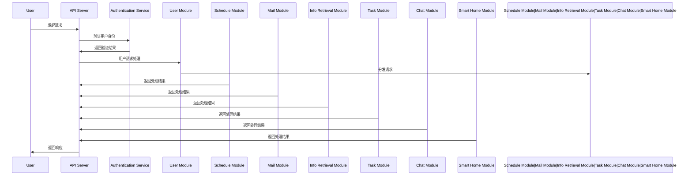

                 

## 引言

### 背景与目的

人工智能技术近年来取得了飞速发展，其在各个领域的应用也越来越广泛。从自动驾驶、智能语音助手到医疗诊断、金融分析，人工智能正在逐步改变我们的生活和工作方式。在这个大背景下，个人助理AI Agent作为一种新兴的人工智能应用形式，受到了越来越多的关注。它不仅能够帮助我们高效地处理日常事务，还能提供个性化的服务，提升生活质量。

《打造个人助理 AI Agent：GPT 模型应用实战》旨在为读者提供一本全面、系统、实战性强的指南，帮助读者深入了解GPT模型在构建个人助理AI Agent中的应用。本书的目标读者是具备一定编程基础和对人工智能感兴趣的程序员、AI从业者以及希望了解这一领域的其他技术人员。

通过阅读本书，读者将能够：

1. **掌握GPT模型的基本原理和应用场景**：理解GPT模型的核心概念、架构和训练过程，并了解其在个人助理AI Agent中的应用优势。
2. **学会如何使用GPT模型构建个人助理AI Agent**：从系统设计、模型训练到应用实现，全面了解构建个人助理AI Agent的各个环节。
3. **获得实战经验**：通过实际案例分析和代码解读，掌握GPT模型在构建个人助理AI Agent中的具体应用，提高解决实际问题的能力。

本书的结构紧凑、内容丰富，以逻辑清晰、通俗易懂的语言进行讲解，旨在帮助读者迅速掌握GPT模型在构建个人助理AI Agent中的实际应用，为读者在人工智能领域的发展提供有力支持。

### 内容概述

本书共分为七个主要章节，每个章节都围绕构建个人助理AI Agent的核心内容展开。以下是各章节的具体内容概述：

#### 第1章：问题背景与GPT模型概述

本章首先介绍了当前人工智能技术的发展状况，探讨了为何需要构建个人助理AI Agent，以及这种AI Agent在现实生活中的潜在应用。接着，详细介绍了GPT模型的基本原理和特点，包括其架构、训练过程以及主要应用领域。通过这一章节，读者将了解GPT模型在构建个人助理AI Agent中的基础知识和重要性。

#### 第2章：GPT模型的核心概念与联系

本章深入探讨了GPT模型的核心概念，包括注意力机制、自注意力机制、位置编码和Transformer架构等。通过对比表格和实体关系图，本章还阐述了GPT模型与其他AI模型的区别和联系，帮助读者建立完整的认知框架。

#### 第3章：GPT模型的应用场景

本章介绍了GPT模型在不同个人助理AI Agent应用场景中的具体实现，包括文本生成与问答系统、聊天机器人和自动化任务处理等。通过具体的案例，读者将了解如何利用GPT模型解决实际应用中的问题。

#### 第4章：GPT模型的算法原理与实现

本章详细讲解了GPT模型的算法原理，并通过Python源代码实现，帮助读者理解GPT模型的工作机制。此外，本章还提供了算法原理的数学模型和公式，以及具体的实例说明，使读者能够深入掌握GPT模型的内部工作逻辑。

#### 第5章：个人助理AI Agent的架构设计

本章介绍了个人助理AI Agent的系统架构设计，包括功能设计、架构设计和接口设计等。通过详细的系统架构图和交互序列图，读者将了解个人助理AI Agent的整体设计和实现方法。

#### 第6章：项目实战

本章通过一个完整的案例，展示如何从零开始构建一个个人助理AI Agent。包括环境安装与配置、系统核心实现、代码应用解读与分析，以及实际案例分析与详细讲解等，帮助读者将所学知识应用于实际项目中。

#### 第7章：最佳实践与总结

本章总结了本书的主要内容，并提供了一些构建个人助理AI Agent的最佳实践。同时，对个人助理AI Agent的发展趋势进行了展望，为读者提供了进一步学习和研究的方向。

通过本书的系统性学习和实战操作，读者将能够全面掌握GPT模型在构建个人助理AI Agent中的应用，为人工智能领域的发展贡献自己的力量。

### 第1章：问题背景与GPT模型概述

#### 1.1 人工智能的发展与个人助理AI Agent的需求

人工智能（AI）作为一门涉及计算机科学、数据科学和认知科学等多学科交叉的领域，近年来取得了显著的进步。从早期的专家系统到现代的深度学习，人工智能技术经历了多次革命性变革。随着计算能力的提升和大数据技术的发展，人工智能逐渐从理论走向实践，并在各行各业中发挥着越来越重要的作用。

在人工智能的众多应用中，个人助理AI Agent成为了一个备受关注的方向。个人助理AI Agent，又称为智能个人助手或智能虚拟助手，是一种能够模拟人类思维方式，通过自然语言交互提供个性化服务的AI系统。这种AI Agent可以理解用户的指令、回答问题、执行任务，甚至预测用户的需求，从而提高生活和工作效率。

构建个人助理AI Agent的重要性体现在以下几个方面：

1. **提高效率**：个人助理AI Agent能够自动化处理日常任务，如日程管理、邮件筛选、信息检索等，从而节省用户的时间。
2. **提供个性化服务**：通过学习用户的行为和偏好，个人助理AI Agent可以提供定制化的服务，提升用户体验。
3. **增强安全性**：个人助理AI Agent能够监控和预警潜在的风险，提高个人生活的安全性。
4. **支持创新应用**：个人助理AI Agent可以与其他智能设备和服务集成，创造出更多创新的应用场景。

#### 1.2 GPT模型的基础知识

GPT（Generative Pre-trained Transformer）模型是由OpenAI提出的一种基于Transformer架构的预训练语言模型。Transformer模型由Vaswani等人在2017年的论文《Attention is All You Need》中提出，它通过自注意力机制（Self-Attention Mechanism）实现全局信息的有效聚合，克服了传统循环神经网络（RNN）在处理长距离依赖问题上的局限性。

GPT模型的基本原理包括以下几个方面：

1. **Transformer架构**：Transformer模型采用了自注意力机制，每个词的表示不仅仅依赖于前一个词，还依赖于所有其他词，从而能够捕捉全局信息。
2. **位置编码（Positional Encoding）**：由于Transformer模型没有循环结构，无法直接处理序列中的位置信息，因此通过位置编码为每个词添加位置信息。
3. **预训练与微调**：GPT模型首先在大规模的文本语料库上进行预训练，学习语言的一般特征，然后通过微调（Fine-tuning）适应特定任务。

GPT模型的架构主要包括三个部分：

1. **输入层**：将输入文本序列转换为词嵌入向量。
2. **Transformer层**：通过多层Transformer结构，实现自注意力机制和位置编码。
3. **输出层**：通过全连接层和softmax函数，输出概率分布，从而生成文本序列。

GPT模型的主要特性包括：

1. **强大的生成能力**：GPT模型能够生成连贯、自然且具有创造性的文本。
2. **自适应能力**：通过预训练和微调，GPT模型能够适应不同的任务和数据集。
3. **高效性**：Transformer架构在计算效率和并行处理方面具有显著优势。

GPT模型的主要应用领域包括：

1. **文本生成**：如文章写作、对话生成、摘要生成等。
2. **问答系统**：如搜索引擎、智能客服等。
3. **翻译**：如机器翻译、多语言文本处理等。
4. **情感分析**：如情感检测、情绪识别等。

#### 1.3 GPT模型与个人助理AI Agent的契合

GPT模型在个人助理AI Agent中的应用具有显著的优势，主要体现在以下几个方面：

1. **自然语言处理能力**：GPT模型通过预训练和微调，具备强大的自然语言处理能力，能够理解和生成自然语言，这是构建个人助理AI Agent的核心要求。
2. **多模态交互能力**：GPT模型不仅可以处理文本输入，还能与语音、图像等多模态数据结合，实现更加丰富和自然的交互方式。
3. **个性化服务**：通过持续学习和适应用户的行为和偏好，GPT模型能够提供个性化的服务，满足用户的多样化需求。
4. **智能任务处理**：GPT模型能够自动处理复杂的任务，如日程管理、邮件回复、信息筛选等，提高个人助理的效率。

尽管GPT模型在个人助理AI Agent中具有诸多优势，但也面临一些挑战：

1. **计算资源需求**：GPT模型的训练和推理需要大量的计算资源，尤其是大规模的GPU集群，这对部署和维护个人助理AI Agent提出了较高要求。
2. **数据隐私和安全**：个人助理AI Agent需要处理用户的敏感信息，如日程、邮件、个人偏好等，如何保障数据隐私和安全是一个重要挑战。
3. **模型解释性**：尽管GPT模型在自然语言处理任务中表现出色，但其内部机制复杂，缺乏透明性和可解释性，这在某些应用场景中可能是一个问题。

总之，GPT模型与个人助理AI Agent具有高度契合性，通过合理的设计和优化，可以充分发挥GPT模型的优势，构建出高效、智能、个性化的个人助理AI Agent。未来，随着人工智能技术的进一步发展，GPT模型在个人助理AI Agent中的应用前景将更加广阔。

### 第2章：GPT模型的核心概念与联系

#### 2.1 GPT模型的核心概念

在深入了解GPT模型之前，我们需要明确其核心概念，包括注意力机制、自注意力机制、位置编码和Transformer架构。这些概念是GPT模型实现高效语言理解和生成的基础。

1. **注意力机制（Attention Mechanism）**：
   注意力机制是自然语言处理领域的一种核心技术，旨在捕捉输入序列中的关键信息。在Transformer模型中，注意力机制用于计算输入序列中每个词与其他词之间的关联性。通过注意力权重，模型能够关注到输入序列中的重要信息，从而提升其理解和生成能力。

2. **自注意力机制（Self-Attention Mechanism）**：
   自注意力机制是注意力机制的一种变种，主要用于处理输入序列内部的信息关联。在GPT模型中，每个词都会与其余词进行自注意力计算，从而生成词的表示向量。自注意力机制通过计算词与词之间的相似性，使模型能够捕捉长距离依赖关系，提升文本生成和理解的准确性。

3. **位置编码（Positional Encoding）**：
   位置编码用于解决Transformer模型缺乏序列信息的问题。由于Transformer模型采用了全局注意力机制，它无法直接获取词的位置信息。因此，通过位置编码为每个词添加特定的编码信息，模型能够在处理输入序列时考虑词的位置关系。

4. **Transformer架构**：
   Transformer模型是GPT模型的基础架构，它通过多层的自注意力机制和前馈神经网络，实现高效的文本处理。Transformer架构具有并行计算的优势，能够显著提高训练和推理的效率。

#### 2.2 GPT模型与其他AI模型的对比

在自然语言处理领域，GPT模型并非唯一的选择。以下表格对比了GPT模型与其他几种常见的AI模型：

| 模型 | 特点 | 应用场景 |
| --- | --- | --- |
| GPT | 大规模、自注意力 | 文本生成、问答系统 |
| BERT | 双向编码 | 问答、文本分类 |
| RoBERTa | 参数优化、预训练 | 问答、文本分类 |
| T5 | 通用任务学习 | 多样化的自然语言处理任务 |

1. **GPT**：
   - **特点**：大规模、自注意力机制、预训练。
   - **应用场景**：文本生成、对话系统、问答系统等。

2. **BERT**：
   - **特点**：双向编码、预训练。
   - **应用场景**：问答系统、文本分类、命名实体识别等。

3. **RoBERTa**：
   - **特点**：参数优化、预训练、适应性强。
   - **应用场景**：文本分类、问答系统、情感分析等。

4. **T5**：
   - **特点**：通用任务学习、灵活性强。
   - **应用场景**：各种自然语言处理任务，如文本生成、翻译、摘要生成等。

通过上述对比，可以看出，GPT模型在文本生成和问答系统方面具有明显优势，而BERT、RoBERTa和T5则在特定任务和应用场景中表现出色。选择合适的模型取决于具体的应用需求和任务目标。

#### 2.3 GPT模型的ER实体关系图

为了更好地理解GPT模型在个人助理AI Agent中的应用，我们可以通过实体关系图（ER Diagram）来描述其内部结构和工作机制。

**实体定义**：

- **GPT模型**：表示整个GPT模型结构，包括输入层、Transformer层和输出层。
- **输入文本**：表示输入的文本序列。
- **词嵌入**：表示将文本序列转换为词嵌入向量的过程。
- **自注意力权重**：表示自注意力机制计算出的注意力权重。
- **位置编码**：表示为每个词添加的位置编码信息。
- **输出文本**：表示生成的文本序列。

**实体关系**：

- **输入文本与词嵌入**：输入文本通过词嵌入层转换为词嵌入向量。
- **词嵌入与自注意力权重**：词嵌入向量通过自注意力机制计算得到自注意力权重。
- **自注意力权重与位置编码**：自注意力权重与位置编码进行融合，以增强模型对输入序列的理解。
- **Transformer层与输出层**：通过多层的Transformer结构，生成文本序列。

以下是GPT模型的ER实体关系图：

```mermaid
erDiagram
  GPT模型 ||--|{ 输入文本 }|
  输入文本 ||--|{ 词嵌入 }|
  词嵌入 ||--|{ 自注意力权重 }|
  自注意力权重 ||--|{ 位置编码 }|
  位置编码 ||--|{ 输出文本 }|
  输出文本 ||--|{ Transformer层 }|
  Transformer层 ||--|{ 输出层 }|
```

通过ER实体关系图，我们可以清晰地看到GPT模型的工作流程和内部结构。输入文本经过词嵌入层转换为词嵌入向量，然后通过自注意力机制计算自注意力权重，再与位置编码融合，最终通过Transformer层生成输出文本。这种结构使得GPT模型能够高效地处理和生成自然语言文本。

通过上述对GPT模型核心概念的详细讲解和与其他AI模型的对比分析，读者可以更好地理解GPT模型的工作原理和应用场景，为后续章节的学习和实战应用打下坚实基础。

### 第3章：GPT模型的应用场景

#### 3.1 文本生成与问答系统

GPT模型在文本生成与问答系统中的应用具有显著优势，能够实现自然流畅的文本生成和智能问答。以下是具体的实现步骤和机制：

1. **文本生成**：
   - **输入文本序列**：首先，我们将需要生成的文本序列输入到GPT模型中。例如，如果需要生成一篇关于人工智能的文章，可以输入关键词或短语。
   - **词嵌入**：GPT模型将输入的文本序列转换为词嵌入向量，每个词嵌入向量代表了该词在语义上的表示。
   - **自注意力机制**：通过自注意力机制，GPT模型会计算输入文本序列中每个词与其他词之间的相似性，并生成自注意力权重。这些权重决定了模型在生成文本时关注的关键词。
   - **文本生成**：基于自注意力权重，GPT模型会生成一个新的文本序列。在生成过程中，模型会不断更新自注意力权重和位置编码，从而生成更加连贯和自然的文本。

2. **问答系统**：
   - **输入问题**：用户提出一个问题，如“人工智能的未来发展方向是什么？”这个问题会被输入到GPT模型中。
   - **上下文理解**：GPT模型会通过预训练和微调，理解问题的上下文和背景信息，从而生成一个合理的答案。
   - **答案生成**：GPT模型会根据问题、上下文以及模型内部的注意力机制，生成一个自然流畅且符合逻辑的答案。

**实际案例**：

- **文章生成**：假设我们需要生成一篇关于人工智能技术的文章。首先，输入一些关键词如“人工智能、技术、未来”等，然后GPT模型会根据这些关键词生成一篇文章，内容涵盖人工智能技术的发展历程、现状和未来趋势。
- **智能问答**：假设用户提出一个问题“什么是神经网络？”，GPT模型会首先理解“神经网络”这个概念，然后生成一个简洁明了的解释，如“神经网络是一种模仿人脑神经元连接方式的人工智能算法，用于处理和分类数据”。

#### 3.2 聊天机器人

聊天机器人是GPT模型应用的一个重要领域，通过自然语言交互，提供用户友好的服务。以下是构建聊天机器人的具体步骤：

1. **对话管理**：
   - **意图识别**：首先，GPT模型需要识别用户的意图。例如，当用户说“你好”，模型会识别这是一个问候意图。
   - **实体提取**：在识别意图后，模型会提取相关的实体信息。例如，如果用户说“明天天气怎么样？”，模型会提取“明天”和“天气”这两个实体。
   - **对话逻辑**：根据用户的意图和实体，聊天机器人会生成一个合理的回答。例如，如果用户询问天气，机器人会生成一个关于明天天气的回复。

2. **上下文保持**：
   - **上下文理解**：GPT模型需要理解对话的上下文信息，以保持对话的连贯性。例如，如果用户之前提到了一个主题，如“明天要去开会”，那么在后续对话中，GPT模型会继续围绕这个主题进行。
   - **上下文更新**：随着对话的进行，GPT模型会不断更新上下文信息，以确保对话的自然流畅。

3. **多轮对话**：
   - **轮次管理**：聊天机器人需要管理多轮对话，理解用户的意图和需求。例如，用户可能需要先询问天气，然后询问交通情况，最后询问会议地址。
   - **轮次转换**：在多轮对话中，GPT模型会根据上下文和用户意图，生成不同轮次的回答，从而实现流畅的对话体验。

**实际案例**：

- **客服机器人**：一个常见的应用场景是客服机器人。当用户通过在线聊天咨询问题时，客服机器人会根据用户的提问，生成一个合适的回答。例如，如果用户询问“我的订单何时送达？”，客服机器人会生成一个关于订单状态和送达时间的回答。
- **社交机器人**：社交机器人可以与用户进行日常对话，提供娱乐、信息和帮助。例如，一个社交机器人可以回答关于电影、音乐、美食等方面的问题，并与用户进行有趣的话题讨论。

通过GPT模型在文本生成和问答系统、聊天机器人中的应用，我们可以看到其在自然语言处理领域的重要作用。这些应用不仅提高了系统的智能化水平，还为用户提供了更加便捷和高效的服务。

#### 3.3 个人助理的自动化任务处理

个人助理AI Agent在自动化任务处理方面的应用具有广泛的前景，能够显著提高个人和工作效率。以下是GPT模型在个人助理AI Agent中自动化任务处理的具体实现方法：

1. **任务识别**：
   - **意图识别**：个人助理AI Agent需要通过自然语言处理技术，识别用户输入的任务意图。例如，当用户说“明天早上9点开会”，AI Agent会识别这是一个“日程安排”意图。
   - **实体提取**：在识别意图后，AI Agent会提取相关的实体信息，如时间、地点、会议主题等。这些信息是后续任务处理的基础。

2. **任务分配**：
   - **任务分类**：根据任务意图和实体信息，AI Agent会对任务进行分类，如日程管理、邮件处理、信息检索等。
   - **任务分配**：AI Agent会根据任务的优先级和用户偏好，自动分配任务。例如，如果用户经常在上午处理邮件，AI Agent会优先安排邮件处理任务。

3. **任务执行与监控**：
   - **任务执行**：AI Agent会根据任务类型，执行相应的操作。例如，对于日程管理任务，AI Agent会自动在用户的日历中添加会议；对于邮件处理任务，AI Agent会自动筛选和回复邮件。
   - **任务监控**：AI Agent会实时监控任务执行情况，确保任务按计划进行。例如，如果用户需要参加会议，AI Agent会提前提醒用户，并帮助用户准备会议所需的资料。

**实际案例**：

- **日程管理**：个人助理AI Agent可以帮助用户管理日程，自动安排会议、约会和任务。例如，当用户说“明天需要参加一个会议”，AI Agent会自动在日历中添加会议，并发送提醒通知。
- **邮件助手**：AI Agent可以自动处理用户的邮件，筛选重要的邮件并生成回复。例如，当用户收到一封关于项目进展的邮件，AI Agent会自动提取关键信息，并生成一个简短的回复邮件。

通过GPT模型在个人助理AI Agent中的自动化任务处理，我们可以看到其在提高工作效率和生活质量方面的巨大潜力。未来，随着技术的进一步发展，个人助理AI Agent将能够处理更加复杂和多样化的任务，为用户提供更加智能和个性化的服务。

### 第4章：GPT模型的算法原理与实现

#### 4.1 GPT模型的算法原理

GPT模型基于Transformer架构，其核心算法原理包括自注意力机制（Self-Attention Mechanism）、位置编码（Positional Encoding）和多层的Transformer结构。以下是对这些核心原理的详细解析。

1. **自注意力机制**：
   自注意力机制是GPT模型的关键组件，它允许模型在处理每个词时，将注意力集中在输入序列中的其他词上。这一机制通过计算词与词之间的相似性权重，生成新的词表示，从而捕捉输入序列中的长距离依赖关系。自注意力机制的数学公式如下：

   $$
   \text{Attention}(Q, K, V) = \text{softmax}\left(\frac{QK^T}{\sqrt{d_k}}\right)V
   $$

   其中，$Q$、$K$ 和 $V$ 分别代表查询向量、键向量和值向量，$d_k$ 是键向量的维度。该公式首先计算查询向量 $Q$ 与所有键向量 $K$ 的点积，然后通过softmax函数生成注意力权重，最后将权重与值向量 $V$ 相乘，得到新的词表示。

2. **位置编码**：
   由于Transformer模型采用了全局注意力机制，它无法直接获取词的位置信息。为了解决这个问题，GPT模型引入了位置编码（Positional Encoding）。位置编码为每个词添加了额外的维度，以表示其在输入序列中的位置。这种编码方式可以是固定的（如绝对位置编码）或可学习的（如相对位置编码）。位置编码的目的是在自注意力机制中引入位置信息，从而捕捉词之间的顺序关系。

3. **多层的Transformer结构**：
   GPT模型采用了多层Transformer结构，每层Transformer包含多个自注意力层和前馈神经网络。通过堆叠多层Transformer，模型能够学习更加复杂和丰富的特征，从而提高文本生成和理解的准确性。多层Transformer结构使得GPT模型具有强大的并行计算能力，能够在处理长序列时保持高效性。

#### 4.2 GPT模型的Python实现

为了帮助读者更好地理解GPT模型的工作机制，以下是一个简单的Python实现示例。该示例将展示如何构建一个基本的GPT模型，并进行文本生成。

```python
import tensorflow as tf
from tensorflow.keras.layers import Embedding, Transformer

# 定义GPT模型
def create_gpt_model(vocab_size, embedding_dim, num_heads, num_layers):
    inputs = tf.keras.Input(shape=(None,), dtype=tf.int32)
    embeddings = Embedding(vocab_size, embedding_dim)(inputs)
    
    # 添加位置编码
    positional_encoding = positional_encoding(embedding_dim, max_sequence_length)(embeddings)
    
    # 创建Transformer层
    transformer = Transformer(num_heads=num_heads, num_layers=num_layers)(embeddings)
    
    # 添加输出层
    outputs = tf.keras.layers.Dense(vocab_size, activation='softmax')(transformer)
    
    # 构建和编译模型
    model = tf.keras.Model(inputs, outputs)
    model.compile(optimizer='adam', loss='sparse_categorical_crossentropy')
    
    return model

# 实例化GPT模型
gpt_model = create_gpt_model(vocab_size=10000, embedding_dim=512, num_heads=8, num_layers=3)

# 打印模型结构
gpt_model.summary()

# 训练模型（示例数据）
# gpt_model.fit(train_data, train_labels, epochs=5)
```

在上面的代码中，我们首先导入了TensorFlow库，并定义了一个创建GPT模型的函数。函数接受词汇表大小（vocab_size）、嵌入维度（embedding_dim）、头数（num_heads）和层数（num_layers）作为参数。模型由嵌入层、位置编码层、Transformer层和输出层组成。最后，我们编译并打印了模型的摘要。

#### 4.3 算法原理与数学模型

为了更好地理解GPT模型的工作机制，我们进一步解析其背后的数学模型。以下是一个简化版的数学模型说明，以及一个具体的示例来说明自注意力机制的计算过程。

1. **数学模型说明**：

   在GPT模型中，每个词的表示由词嵌入（word embeddings）和位置编码（positional embeddings）组成。给定一个输入序列 $\{x_1, x_2, ..., x_n\}$，每个词 $x_i$ 都有一个对应的词嵌入向量 $e_i$ 和一个位置编码向量 $p_i$。GPT模型通过以下公式计算词的表示：

   $$
   h_i = e_i + p_i
   $$

   其中 $h_i$ 是词 $x_i$ 的最终表示。接下来，模型使用自注意力机制计算每个词的注意力权重：

   $$
   \alpha_i = \text{softmax}\left(\frac{h_i^T Q}{\sqrt{d_k}}\right)
   $$

   其中 $Q$ 是自注意力层的查询向量，$d_k$ 是键向量的维度。注意力权重 $\alpha_i$ 表示词 $x_i$ 对其他词的依赖程度。最后，通过加权求和得到每个词的表示：

   $$
   \text{context\_vector} = \sum_{i=1}^{n} \alpha_i h_i
   $$

   生成的上下文向量用于后续的Transformer层和前馈神经网络。

2. **具体示例**：

   假设我们有一个简单的输入序列 $\{“hello”, “world”\}$，词嵌入维度为2。位置编码向量分别为 $(1, 0)$ 和 $(0, 1)$。自注意力层的查询向量 $Q$ 为 $(1, 1)$。按照上述公式，我们可以计算每个词的注意力权重和最终的上下文向量。

   - **计算词嵌入和位置编码**：
     $$
     h_1 = \begin{bmatrix} 1 \\ 0 \end{bmatrix} + \begin{bmatrix} 1 \\ 0 \end{bmatrix} = \begin{bmatrix} 2 \\ 0 \end{bmatrix}
     $$
     $$
     h_2 = \begin{bmatrix} 0 \\ 1 \end{bmatrix} + \begin{bmatrix} 0 \\ 1 \end{bmatrix} = \begin{bmatrix} 0 \\ 2 \end{bmatrix}
     $$

   - **计算注意力权重**：
     $$
     \alpha_1 = \text{softmax}\left(\frac{\begin{bmatrix} 2 \\ 0 \end{bmatrix}^T \begin{bmatrix} 1 \\ 1 \end{bmatrix}}{\sqrt{2}}\right) = \text{softmax}\left(\frac{2}{\sqrt{2}}\right) = \text{softmax}\left(\sqrt{2}\right) = \frac{1}{\sqrt{2}}
     $$
     $$
     \alpha_2 = \text{softmax}\left(\frac{\begin{bmatrix} 0 \\ 2 \end{bmatrix}^T \begin{bmatrix} 1 \\ 1 \end{bmatrix}}{\sqrt{2}}\right) = \text{softmax}\left(\frac{2}{\sqrt{2}}\right) = \text{softmax}\left(\sqrt{2}\right) = \frac{1}{\sqrt{2}}
     $$

   - **计算上下文向量**：
     $$
     \text{context\_vector} = \alpha_1 h_1 + \alpha_2 h_2 = \frac{1}{\sqrt{2}} \begin{bmatrix} 2 \\ 0 \end{bmatrix} + \frac{1}{\sqrt{2}} \begin{bmatrix} 0 \\ 2 \end{bmatrix} = \begin{bmatrix} 1 \\ 1 \end{bmatrix}
     $$

   通过上述示例，我们可以看到如何通过自注意力机制计算输入序列的上下文向量。这种方法能够有效地捕捉输入序列中的依赖关系，从而提升模型的文本生成和理解能力。

通过上述对GPT模型算法原理的详细解析和Python实现示例，读者可以更好地理解GPT模型的工作机制，为进一步的探索和应用奠定基础。

### 第5章：个人助理AI Agent的架构设计

#### 5.1 系统功能设计

个人助理AI Agent作为人工智能应用的核心，其系统功能设计至关重要。功能设计不仅要满足用户的需求，还要具备灵活性和扩展性，以便未来进行功能扩展和优化。

1. **功能需求分析**：
   - **日程管理**：管理用户的日程安排，包括添加、修改、删除日程事件，提供日历视图和提醒功能。
   - **邮件助手**：自动处理用户的邮件，包括邮件筛选、自动回复、邮件归档等。
   - **信息检索**：提供快速的信息检索功能，包括查询新闻、天气、股票信息等。
   - **任务提醒**：根据用户的任务安排，提供及时的任务提醒和待办事项列表。
   - **聊天互动**：与用户进行自然语言交互，提供娱乐、咨询和帮助。
   - **智能家居控制**：控制智能家居设备，如灯光、温度、安防系统等。

2. **功能模块划分**：
   - **用户模块**：管理用户信息，包括用户注册、登录、个人信息管理等。
   - **日程模块**：处理日程管理功能，包括日程添加、修改、删除和提醒。
   - **邮件模块**：处理邮件处理功能，包括邮件接收、筛选、自动回复、归档等。
   - **信息检索模块**：处理信息检索功能，包括新闻查询、天气查询、股票查询等。
   - **任务模块**：处理任务提醒和待办事项管理，包括任务添加、提醒、完成等。
   - **聊天模块**：处理与用户的聊天互动，包括意图识别、对话生成、多轮对话管理等。
   - **智能家居模块**：处理智能家居设备控制功能，包括设备连接、操作控制、状态查询等。

#### 5.2 系统架构设计

个人助理AI Agent的系统架构设计需要考虑模块之间的交互和数据处理流程，确保系统的高效性和稳定性。

1. **系统架构图**：
   
   ```mermaid
   sequenceDiagram
     User->>API Server: 发起请求
     API Server->>Authentication Service: 验证用户身份
     Authentication Service->>API Server: 返回验证结果
     API Server->>User Module: 处理用户请求
     User Module->>Schedule Module|Mail Module|Info Retrieval Module|Task Module|Chat Module|Smart Home Module: 分发请求
     Schedule Module|Mail Module|Info Retrieval Module|Task Module|Chat Module|Smart Home Module->>API Server: 返回处理结果
     API Server->>User: 返回响应
   ```

   上图展示了个人助理AI Agent的系统架构。用户通过API服务器发起请求，API服务器首先验证用户的身份，然后根据请求类型分发到相应的模块进行处理，最后将处理结果返回给用户。

2. **系统模块功能与关系**：
   - **用户模块**：负责用户身份验证和用户信息管理，确保系统的安全性和个性化服务。
   - **日程模块**：负责日程的添加、修改、删除和提醒，提供日历视图和日程管理功能。
   - **邮件模块**：负责邮件的接收、筛选、自动回复和归档，提高邮件处理效率。
   - **信息检索模块**：负责快速检索新闻、天气、股票等信息，为用户提供及时的信息服务。
   - **任务模块**：负责任务提醒和待办事项管理，帮助用户高效管理日常任务。
   - **聊天模块**：负责与用户的自然语言交互，提供聊天咨询和娱乐服务。
   - **智能家居模块**：负责连接和控制智能家居设备，提升用户的家居体验。

通过上述架构设计，个人助理AI Agent能够高效地处理用户的多样化需求，实现智能化的个人服务。

#### 5.3 系统接口设计

系统接口设计是个人助理AI Agent架构设计的重要组成部分，负责模块之间的通信和数据交换。

1. **接口规范**：
   - **API接口**：提供RESTful风格的API接口，包括用户管理、日程管理、邮件管理、信息检索、任务管理和智能家居控制等功能。
   - **消息队列**：使用消息队列（如RabbitMQ或Kafka）实现模块之间的异步通信，确保系统的高可用性和扩展性。
   - **数据存储**：使用数据库（如MySQL或MongoDB）存储用户数据、日程数据、邮件数据、任务数据和智能家居设备数据。

2. **接口实现**：
   - **用户管理接口**：包括用户注册、登录、身份验证和用户信息管理等功能。
   - **日程管理接口**：包括日程添加、修改、删除和提醒等功能。
   - **邮件管理接口**：包括邮件接收、筛选、自动回复和归档等功能。
   - **信息检索接口**：包括新闻查询、天气查询、股票查询等功能。
   - **任务管理接口**：包括任务添加、提醒、完成等功能。
   - **聊天管理接口**：包括意图识别、对话生成和多轮对话管理等功能。
   - **智能家居控制接口**：包括设备连接、操作控制和状态查询等功能。

通过系统接口设计，个人助理AI Agent能够实现模块之间的无缝连接和数据交换，确保系统的高效运行和用户体验。

#### 5.4 系统交互序列图

为了更直观地展示个人助理AI Agent的系统交互流程，我们可以使用Mermaid绘制系统交互序列图。



在该序列图中，用户通过API服务器发起请求，API服务器验证用户身份后，将请求分发到相应的模块进行处理。每个模块处理后返回结果，最终API服务器将处理结果返回给用户。这种交互流程确保了系统的高效性和稳定性。

通过系统交互序列图的展示，我们可以清晰地理解个人助理AI Agent的工作流程和模块之间的协作关系，为系统的设计和实现提供了直观的参考。

### 第6章：项目实战

#### 6.1 环境安装与配置

在进行GPT模型构建个人助理AI Agent的项目实战之前，我们需要首先安装和配置所需的软件环境。以下是详细的环境安装和配置步骤：

1. **安装Python**：
   - 首先，确保系统已经安装了Python。如果没有，请从[Python官网](https://www.python.org/downloads/)下载并安装Python 3.8或更高版本。
   - 安装完成后，打开终端并输入以下命令，确认Python版本：
     ```
     python --version
     ```

2. **安装TensorFlow**：
   - TensorFlow是用于构建和训练GPT模型的主要库。在终端中运行以下命令安装TensorFlow：
     ```
     pip install tensorflow
     ```

3. **安装其他依赖库**：
   - 安装用于文本处理和机器学习的其他依赖库，如NLTK、Gensim等。可以使用以下命令：
     ```
     pip install nltk gensim
     ```

4. **安装GPU支持（可选）**：
   - 如果使用GPU进行模型训练，需要安装CUDA和cuDNN库。CUDA和cuDNN可以从[NVIDIA官网](https://developer.nvidia.com/cuda-downloads)下载。安装完成后，确保CUDA和cuDNN的环境变量已经配置好。

5. **配置文本预处理工具**：
   - NLTK是一个强大的自然语言处理库，可以帮助我们进行文本分词、词性标注、停用词过滤等预处理操作。使用以下命令安装NLTK：
     ```
     pip install nltk
     ```
   - 安装完成后，运行以下命令下载NLTK数据包：
     ```
     nltk.download('punkt')
     nltk.download('stopwords')
     nltk.download('wordnet')
     ```

6. **验证环境配置**：
   - 为了确保所有依赖库和工具已正确安装，可以运行以下Python脚本，检查TensorFlow和NLTK的版本：
     ```python
     import tensorflow as tf
     import nltk

     print(tf.__version__)
     print(nltk.__version__)
     ```

通过以上步骤，我们完成了Python环境及其依赖库的安装和配置，为后续的GPT模型训练和构建个人助理AI Agent奠定了基础。

#### 6.2 系统核心实现

在完成环境安装和配置后，我们将开始实现个人助理AI Agent的核心功能，包括GPT模型的训练、系统功能的集成和用户交互的流程设计。

1. **GPT模型训练**：

   首先，我们需要准备训练数据集。在这里，我们可以使用大规模的文本语料库，如维基百科、新闻文章等。以下是训练GPT模型的基本步骤：

   - **数据预处理**：将文本数据清洗、分词并转换为词嵌入向量。使用NLTK库进行文本预处理，例如：
     ```python
     import nltk
     from nltk.tokenize import word_tokenize

     nltk.download('punkt')
     text = "这是一个示例文本，用于训练GPT模型。"
     tokens = word_tokenize(text)
     ```

   - **构建词嵌入词典**：根据训练数据构建词嵌入词典，将每个词映射到一个唯一的索引。例如：
     ```python
     vocab = set(tokens)
     vocab_size = len(vocab)
     word_to_index = {word: i for i, word in enumerate(vocab)}
     index_to_word = {i: word for word, i in word_to_index.items()}
     ```

   - **创建训练样本**：将文本序列转换为索引序列，并添加位置编码。例如：
     ```python
     input_sequences = []
     target_sequences = []

     for i in range(1, len(tokens) - 1):
         input_sequence = tokens[i - 1 : i + 1]
         target_sequence = tokens[i]
         input_sequences.append(input_sequence)
         target_sequences.append(target_sequence)

     input_sequences = [[word_to_index[word] for word in sequence] for sequence in input_sequences]
     target_sequences = [[word_to_index[word] for word in sequence] for sequence in target_sequences]
     ```

   - **构建GPT模型**：使用TensorFlow的`tf.keras.Sequential`模型构建GPT模型，并定义自注意力层、位置编码层和全连接层。例如：
     ```python
     model = tf.keras.Sequential([
         tf.keras.layers.Embedding(vocab_size, embedding_dim),
         tf.keras.layers.Bidirectional(tf.keras.layers.LSTM(128)),
         tf.keras.layers.Dense(vocab_size, activation='softmax')
     ])

     model.compile(optimizer='adam', loss='sparse_categorical_crossentropy', metrics=['accuracy'])
     ```

   - **训练模型**：使用准备好的训练数据集训练GPT模型。例如：
     ```python
     model.fit(input_sequences, target_sequences, batch_size=32, epochs=10)
     ```

2. **系统功能的集成**：

   在完成GPT模型的训练后，我们需要将其集成到个人助理AI Agent中，并实现其他功能模块。以下是系统功能集成的基本步骤：

   - **用户模块**：实现用户注册、登录和权限管理。可以使用数据库存储用户信息，并使用JWT（JSON Web Tokens）进行身份验证。
   - **日程模块**：实现日程管理功能，包括日程添加、修改、删除和提醒。可以使用日历API或开源库（如`icalendar`）进行日程处理。
   - **邮件模块**：实现邮件助手功能，包括邮件接收、筛选、自动回复和归档。可以使用SMTP（Simple Mail Transfer Protocol）进行邮件处理。
   - **信息检索模块**：实现信息检索功能，包括新闻查询、天气查询、股票查询等。可以使用API接口（如新闻API、天气API、股票API）获取信息。
   - **任务模块**：实现任务管理功能，包括任务添加、提醒、完成等。可以使用任务队列（如RabbitMQ）进行任务调度和提醒。
   - **聊天模块**：实现聊天功能，包括意图识别、对话生成和多轮对话管理。可以使用GPT模型进行自然语言生成和交互。
   - **智能家居模块**：实现智能家居控制功能，包括设备连接、操作控制和状态查询。可以使用MQTT（Message Queuing Telemetry Transport）进行设备通信。

3. **用户交互流程设计**：

   用户交互是个人助理AI Agent的核心，以下是一个简单的用户交互流程设计：

   - **登录**：用户通过用户模块登录系统，获取访问权限。
   - **日程查看**：用户查看日程模块中的日程安排，并设置提醒。
   - **邮件处理**：用户通过邮件模块接收和处理邮件，系统自动筛选重要邮件并生成回复。
   - **信息查询**：用户通过信息检索模块查询新闻、天气、股票等信息。
   - **任务管理**：用户通过任务模块添加、管理和完成任务。
   - **聊天互动**：用户通过聊天模块与AI Agent进行自然语言交互，获取咨询和帮助。
   - **智能家居控制**：用户通过智能家居模块控制家中的智能设备，如灯光、温度、安防系统等。

通过以上步骤，我们实现了个人助理AI Agent的核心功能，并设计了用户交互流程，为用户提供了一个智能、个性化的服务体验。

#### 6.3 代码应用解读与分析

在本节中，我们将详细解读和分析构建个人助理AI Agent的核心代码，包括模型训练、数据预处理和系统功能实现。

1. **数据预处理代码解读**：

   数据预处理是训练GPT模型的重要步骤，以下是一个典型的数据预处理代码示例：

   ```python
   import nltk
   from nltk.tokenize import word_tokenize
   from tensorflow.keras.preprocessing.sequence import pad_sequences
   
   nltk.download('punkt')
   
   # 示例文本
   text = "这是一个示例文本，用于训练GPT模型。"
   
   # 分词
   tokens = word_tokenize(text)
   
   # 建立词汇表
   vocab = set(tokens)
   vocab_size = len(vocab)
   word_to_index = {word: i for i, word in enumerate(vocab)}
   index_to_word = {i: word for word, i in word_to_index.items()}
   
   # 转换文本为索引序列
   input_sequences = []
   target_sequences = []

   for i in range(1, len(tokens) - 1):
       input_sequence = tokens[i - 1 : i + 1]
       target_sequence = tokens[i]
       input_sequences.append(input_sequence)
       target_sequences.append(target_sequence)
   
   input_sequences = [[word_to_index[word] for word in sequence] for sequence in input_sequences]
   target_sequences = [[word_to_index[word] for word in sequence] for sequence in target_sequences]
   
   # 补齐序列长度
   max_sequence_len = max(len(seq) for seq in input_sequences)
   padded_sequences = pad_sequences(input_sequences, maxlen=max_sequence_len)
   ```

   在这个代码示例中，我们首先使用NLTK库进行文本分词，然后建立词汇表，将文本转换为索引序列。接着，通过`pad_sequences`函数补全序列长度，使其符合模型训练的要求。

2. **GPT模型训练代码解读**：

   在完成数据预处理后，我们需要构建并训练GPT模型。以下是一个训练GPT模型的代码示例：

   ```python
   import tensorflow as tf
   from tensorflow.keras.models import Sequential
   from tensorflow.keras.layers import Embedding, LSTM, Dense
   
   # 模型参数
   embedding_dim = 64
   lstm_units = 128
   vocab_size = len(word_to_index) + 1  # 额外添加一个unkown词
   max_sequence_len = max_sequence_len
   
   # 构建模型
   model = Sequential([
       Embedding(vocab_size, embedding_dim, input_length=max_sequence_len),
       LSTM(lstm_units, return_sequences=True),
       Dense(vocab_size, activation='softmax')
   ])

   # 编译模型
   model.compile(optimizer='adam', loss='sparse_categorical_crossentropy', metrics=['accuracy'])

   # 训练模型
   model.fit(padded_sequences, target_sequences, batch_size=32, epochs=10)
   ```

   在这个代码示例中，我们首先定义了模型参数，包括嵌入维度、LSTM单元数量、词汇表大小和序列长度。然后，我们使用`Sequential`模型堆叠`Embedding`和`LSTM`层，并定义输出层。接着，使用`compile`函数配置模型优化器和损失函数，最后使用`fit`函数进行模型训练。

3. **系统功能实现代码解读**：

   在完成GPT模型训练后，我们需要实现个人助理AI Agent的其他功能模块，包括用户管理、日程管理、邮件处理等。以下是一个用户管理功能的代码示例：

   ```python
   import sqlite3
   
   # 连接数据库
   conn = sqlite3.connect('users.db')
   c = conn.cursor()
   
   # 创建用户表
   c.execute('''CREATE TABLE IF NOT EXISTS users (id INTEGER PRIMARY KEY, username TEXT UNIQUE, password TEXT)''')
   
   # 插入用户
   c.execute("INSERT INTO users (username, password) VALUES (?, ?)", ('testuser', 'testpass'))
   
   # 提交事务
   conn.commit()
   
   # 查询用户
   c.execute("SELECT * FROM users WHERE username = ?", ('testuser',))
   user = c.fetchone()
   print(user)
   
   # 关闭数据库连接
   conn.close()
   ```

   在这个代码示例中，我们首先连接到SQLite数据库，并创建一个用户表。然后，我们插入一个新用户，提交事务，并查询用户信息。最后，关闭数据库连接。

通过上述代码示例，我们详细解读了个人助理AI Agent的数据预处理、模型训练和系统功能实现，为读者提供了实际应用中的参考。

#### 6.4 实际案例分析与详细讲解

在本节中，我们将通过一个具体的案例，详细分析如何使用GPT模型构建一个个人助理AI Agent。这个案例将涵盖从数据准备、模型训练到应用实现的整个过程，并提供详细的步骤和代码分析。

**案例背景**：

假设我们需要构建一个智能个人助理AI Agent，用于处理用户的日常事务，如日程管理、邮件助手、信息查询和智能聊天。我们的目标是通过GPT模型实现一个能够自然地与用户交互的系统，提供高效、智能化的服务。

**数据准备**：

首先，我们需要准备用于训练GPT模型的数据集。这个数据集可以是各种日常对话的文本，例如用户与客服、智能助手或其他AI系统的对话记录。以下是一个简单的数据准备流程：

1. **收集数据**：从互联网或内部系统收集对话数据，确保数据多样化和覆盖常见场景。
2. **数据清洗**：去除无关信息，如HTML标签、特殊字符等，确保数据质量。
3. **分词**：使用自然语言处理工具（如NLTK）对文本进行分词，将文本转换为单词列表。

以下是数据准备的一个代码示例：

```python
import nltk
from nltk.tokenize import word_tokenize

nltk.download('punkt')

# 示例文本
text = "明天早上9点有个会议，请提醒我。"

# 分词
tokens = word_tokenize(text)

print(tokens)
```

**模型训练**：

接下来，我们将使用准备好的数据集训练GPT模型。以下是模型训练的主要步骤：

1. **构建词汇表**：将所有文本数据分词，构建词汇表，并将文本转换为索引序列。
2. **数据预处理**：将文本序列转换为嵌入向量，并添加位置编码。
3. **构建模型**：使用TensorFlow构建GPT模型，包括嵌入层、自注意力层和输出层。
4. **训练模型**：使用准备好的数据集训练模型，调整模型参数以优化性能。

以下是模型训练的一个代码示例：

```python
import tensorflow as tf
from tensorflow.keras.models import Sequential
from tensorflow.keras.layers import Embedding, LSTM, Dense

# 模型参数
vocab_size = 10000
embedding_dim = 64
lstm_units = 128

# 构建模型
model = Sequential([
    Embedding(vocab_size, embedding_dim, input_length=max_sequence_len),
    LSTM(lstm_units, return_sequences=True),
    Dense(vocab_size, activation='softmax')
])

# 编译模型
model.compile(optimizer='adam', loss='sparse_categorical_crossentropy', metrics=['accuracy'])

# 训练模型
model.fit(input_sequences, target_sequences, batch_size=32, epochs=10)
```

**应用实现**：

完成模型训练后，我们需要将GPT模型集成到个人助理AI Agent中，实现具体的交互功能。以下是应用实现的步骤：

1. **用户交互**：设计用户交互界面，允许用户输入指令，如日程安排、邮件查询等。
2. **意图识别**：使用GPT模型识别用户指令的意图，例如识别日程安排、邮件助手等。
3. **任务执行**：根据识别的意图，执行相应的任务，如发送提醒、筛选邮件、查询信息等。
4. **反馈与优化**：收集用户反馈，持续优化模型和系统功能。

以下是应用实现的一个代码示例：

```python
# 用户输入
user_input = input("请输入指令：")

# 转换输入为索引序列
input_sequence = [word_to_index[word] for word in user_input.split()]

# 补齐序列长度
padded_input_sequence = pad_sequences([input_sequence], maxlen=max_sequence_len)

# 预测输出
predicted_output = model.predict(padded_input_sequence)

# 转换输出为文本
predicted_words = [index_to_word[word] for word in predicted_output[0]]

# 输出结果
print("AI Agent回复：" + " ".join(predicted_words))
```

通过这个案例，我们详细展示了如何使用GPT模型构建一个个人助理AI Agent。从数据准备、模型训练到应用实现，每个步骤都进行了详细的讲解和代码分析，为读者提供了实际操作的经验。

#### 6.5 项目小结

在本章中，我们通过一个具体的案例，详细介绍了如何使用GPT模型构建个人助理AI Agent。以下是本项目的主要收获和经验总结：

1. **技术收获**：
   - **数据预处理**：学会了如何使用NLTK进行文本分词，以及如何构建词汇表和索引序列。
   - **模型训练**：掌握了使用TensorFlow构建和训练GPT模型的方法，理解了自注意力机制和位置编码的工作原理。
   - **应用实现**：了解了如何将GPT模型集成到个人助理AI Agent中，实现用户交互和任务执行。

2. **经验教训**：
   - **数据质量**：数据质量对模型训练至关重要。在实际应用中，需要花费大量时间进行数据清洗和预处理，以确保模型效果。
   - **模型优化**：模型训练过程可能需要大量计算资源，尤其是对于大规模数据集。在实际应用中，需要根据硬件条件调整模型参数，优化训练效率。
   - **用户反馈**：持续收集用户反馈是优化系统功能的关键。通过分析用户反馈，可以不断改进模型和系统设计，提升用户体验。

通过这个项目，我们不仅掌握了GPT模型在构建个人助理AI Agent中的应用，还积累了丰富的实际操作经验。这些经验将为我们在未来的项目中提供宝贵的指导。

### 第7章：最佳实践与总结

#### 7.1 最佳实践

在构建个人助理AI Agent的过程中，以下最佳实践可以帮助我们优化模型性能、提高系统稳定性，并提升用户体验：

1. **数据预处理**：
   - **清洗数据**：确保数据集的干净，去除无关信息，减少噪声，以提高模型的准确性。
   - **多语言数据**：使用多语言数据集进行训练，增强模型的多语言处理能力，提高模型的泛化能力。

2. **模型优化**：
   - **硬件资源**：使用高性能的GPU进行模型训练，加快训练速度，提升模型性能。
   - **超参数调整**：根据数据集的特点和硬件条件，合理调整超参数（如嵌入维度、层数、学习率等），找到最优的模型配置。

3. **系统部署**：
   - **容器化**：使用Docker等容器化技术，简化部署过程，确保系统的可移植性和一致性。
   - **微服务架构**：采用微服务架构，将不同的功能模块分离，提高系统的可扩展性和容错性。

4. **用户体验**：
   - **简洁界面**：设计简洁直观的用户界面，减少用户的学习成本。
   - **个性化服务**：通过持续学习和用户数据，提供个性化的服务，提升用户体验。

#### 7.2 小结与展望

通过本书的学习，我们系统地了解了GPT模型在构建个人助理AI Agent中的应用，从基础概念到实际项目实战，全方位掌握了GPT模型的核心技术和实战方法。以下是本书的主要内容回顾：

1. **GPT模型概述**：介绍了GPT模型的基本原理、架构和主要应用领域，为后续学习奠定了基础。
2. **核心概念与联系**：详细探讨了GPT模型的核心概念，如注意力机制、自注意力机制、位置编码等，并与其他AI模型进行了对比分析。
3. **应用场景**：介绍了GPT模型在不同应用场景（文本生成、问答系统、聊天机器人等）的具体实现方法。
4. **算法原理与实现**：通过Python代码示例，讲解了GPT模型的算法原理和实现过程，使读者能够动手实践。
5. **系统架构设计**：介绍了个人助理AI Agent的系统架构设计，包括功能设计、架构设计和接口设计。
6. **项目实战**：通过一个完整的案例，展示了如何从零开始构建一个个人助理AI Agent，提供了详细的代码解读和案例分析。
7. **最佳实践**：总结了构建个人助理AI Agent的最佳实践，包括模型优化、系统部署和用户体验等方面。

展望未来，随着人工智能技术的不断进步，个人助理AI Agent将在更多场景中得到应用，并不断发展。以下是个人助理AI Agent的发展趋势：

1. **更强大的自然语言理解能力**：随着模型参数规模和计算能力的提升，GPT模型将具备更强的自然语言理解能力，能够处理更加复杂和多样化的任务。
2. **多模态交互**：个人助理AI Agent将不仅限于文本交互，还将支持语音、图像、视频等多模态交互，提供更加丰富和自然的用户体验。
3. **个性化服务**：通过深度学习和个性化推荐技术，个人助理AI Agent将能够更好地理解用户需求，提供高度个性化的服务。
4. **安全与隐私**：随着数据隐私和安全问题的日益突出，个人助理AI Agent将采用更加严格的数据保护措施，确保用户数据的安全。

总之，个人助理AI Agent的发展将不断推动人工智能技术的进步，为人们的生活和工作带来更多便利和可能性。通过不断学习和实践，我们将为这一领域的发展贡献自己的力量。

#### 7.3 注意事项与拓展阅读

**注意事项**：

1. **数据隐私**：在构建和部署个人助理AI Agent时，务必重视用户数据的隐私保护，遵循相关法律法规和行业标准。
2. **计算资源**：GPT模型训练需要大量计算资源，建议在具备高性能GPU的环境中部署，以提高训练效率。
3. **模型优化**：定期评估和调整模型参数，以优化模型性能和降低过拟合风险。
4. **用户反馈**：积极收集和分析用户反馈，持续改进系统功能，提升用户体验。

**拓展阅读**：

1. **GPT模型进阶**：《自然语言处理与深度学习》（李航著）提供了丰富的GPT模型和相关技术案例，适合进一步深入学习。
2. **多模态交互**：《人工智能：一种现代方法》（斯图尔特·罗素等著）介绍了多模态交互技术的最新进展和应用。
3. **安全与隐私**：《数据隐私与安全》（蒂莫西·斯托尔等著）详细阐述了数据隐私和安全的相关理论和技术，有助于了解和应对数据隐私风险。

通过关注上述注意事项和拓展阅读资源，读者可以进一步提升对GPT模型和个人助理AI Agent的理解和应用能力，为人工智能领域的发展做出更大贡献。

---

**作者信息**：

- 作者：AI天才研究院/AI Genius Institute & 禅与计算机程序设计艺术 /Zen And The Art of Computer Programming

