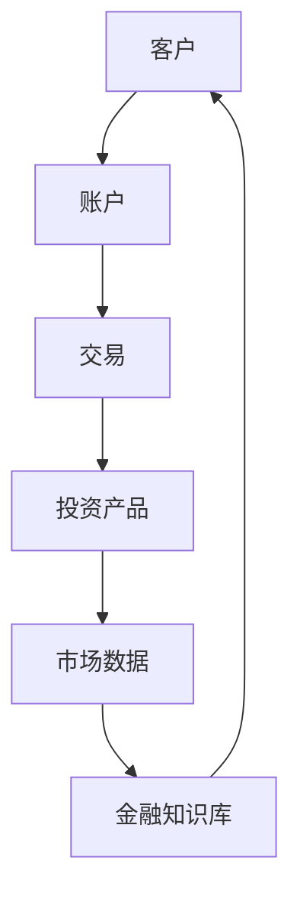

                 

### 第一部分：引言

#### 第1章：打造智能化金融咨询聊天机器人概述

##### 1.1 问题的背景

随着全球金融市场的不断发展和数字化转型的加速，金融行业正面临前所未有的挑战和机遇。一方面，金融行业需要处理大量的数据和信息，以便更好地理解市场动态和客户需求；另一方面，金融服务的需求日益多样化，客户期望获得更快捷、个性化的咨询体验。为了应对这些挑战，金融行业正在积极探索利用人工智能技术，特别是聊天机器人技术，来提升咨询服务的效率和用户体验。

##### 1.1.1 金融行业发展的挑战与机遇

**挑战：**

1. **信息处理能力不足：** 金融行业每天处理的数据量巨大，需要高效的算法和系统来处理和分析这些数据。
2. **个性化服务需求：** 客户期望获得个性化的金融咨询服务，而传统的人工咨询成本高昂且效率低下。
3. **合规性问题：** 金融行业受到严格的法规监管，确保聊天机器人的合规性是一个重要的挑战。

**机遇：**

1. **技术创新：** 人工智能和大数据技术的不断发展为金融行业提供了新的工具和方法。
2. **市场需求：** 客户对智能化、便捷的金融服务需求不断增长。
3. **成本效益：** 智能化聊天机器人可以显著降低运营成本，提高服务效率。

##### 1.1.2 聊天机器人在金融咨询中的应用

聊天机器人可以广泛应用于金融咨询领域，包括但不限于以下方面：

1. **客户服务：** 聊天机器人可以提供24/7的在线客服，解答客户的常见问题，提高客户满意度。
2. **投资建议：** 智能聊天机器人可以根据客户的风险偏好和市场数据提供个性化的投资建议。
3. **市场分析：** 聊天机器人可以实时分析市场数据，提供市场趋势和投资机会分析。
4. **合规检查：** 聊天机器人可以协助金融从业者进行合规性检查，降低合规风险。

##### 1.1.3 智能化聊天机器人的核心优势

**提高效率：** 智能化聊天机器人可以快速响应客户问题，处理大量信息，显著提高咨询服务的效率。

**降低成本：** 与传统的人工服务相比，聊天机器人可以显著降低人力成本和运营成本。

**个性化服务：** 聊天机器人可以基于客户数据和偏好，提供个性化的金融服务和建议。

**合规性：** 通过严格的合规性设计，聊天机器人可以协助金融从业者遵守相关法规和监管要求。

##### 1.2 问题的描述

在金融咨询领域，虽然聊天机器人展现了巨大的潜力，但其在实际应用中仍然面临诸多挑战。这些挑战主要体现在以下几个方面：

**1.2.1 金融咨询的需求与痛点：**

- **数据隐私和安全：** 金融咨询涉及大量的敏感数据，如何确保数据的安全和隐私是一个重要问题。
- **复杂问题的理解：** 金融咨询往往涉及复杂的问题，需要机器人具备高度的理解和分析能力。
- **个性化服务的实现：** 提供个性化的金融咨询服务需要机器人能够深入理解客户的需求和偏好。
- **法规合规：** 金融咨询机器人需要满足各种复杂的法规和监管要求。

**1.2.2 聊天机器人在金融咨询中的问题：**

- **准确性：** 当前聊天机器人在理解金融术语和提供准确信息方面仍有欠缺。
- **交互体验：** 机器人的交互体验需要进一步提升，以接近人类客服的交流效果。
- **实时性：** 金融市场的变化快速，机器人需要能够实时响应和更新信息。
- **个性化：** 机器人需要能够根据客户的具体情况提供个性化的投资建议。

**1.2.3 解决方案的目标和期望：**

本解决方案的目标是构建一个智能化、合规、高效、个性化的金融咨询聊天机器人，期望实现以下目标：

- **提高咨询准确性：** 通过先进的人工智能算法，提高机器人对金融术语的理解和信息的准确性。
- **优化交互体验：** 通过改进自然语言处理技术和语音识别技术，提升机器人的交互体验。
- **确保数据安全：** 通过采用先进的加密技术和安全协议，确保客户数据的安全和隐私。
- **提供个性化服务：** 通过数据分析和机器学习算法，为每个客户提供个性化的金融建议。
- **满足合规要求：** 通过严格的合规性设计和审核，确保机器人满足各种法规和监管要求。

##### 1.3 问题的解决

为了解决上述问题，本解决方案将从以下几个方面展开：

**1.3.1 智能化金融咨询聊天机器人的构建：**

- **自然语言处理（NLP）：** 利用NLP技术提升机器人对金融术语的理解能力，提高信息的准确性和交互体验。
- **数据分析和机器学习：** 通过分析客户数据和金融数据，为每个客户提供个性化的金融建议。
- **安全与隐私保护：** 采用先进的安全技术和隐私保护机制，确保客户数据的安全和隐私。

**1.3.2 关键技术的应用：**

- **区块链技术：** 利用区块链技术提高数据的安全性和透明度。
- **加密算法：** 采用先进的加密算法保护客户数据和通信安全。
- **大数据处理：** 利用大数据技术处理海量金融数据，提升咨询服务的实时性和准确性。

**1.3.3 实施策略和步骤：**

- **需求分析与设计：** 对金融咨询需求进行详细分析，设计智能聊天机器人的功能架构。
- **技术选型与开发：** 根据需求选择合适的技术栈，进行机器人的开发与测试。
- **系统集成与测试：** 将聊天机器人集成到现有的金融咨询系统中，进行全面的测试和优化。
- **部署与上线：** 完成系统部署，进行上线前的最终测试和上线工作。

##### 1.4 边界与外延

**1.4.1 项目范围的界定：**

本项目的范围主要涵盖智能化金融咨询聊天机器人的构建与部署，包括但不限于：

- **功能设计：** 金融咨询、客户服务、市场分析等功能的实现。
- **技术实现：** 自然语言处理、机器学习、大数据处理、安全与隐私保护等关键技术的应用。
- **系统集成：** 与现有金融系统的集成与数据交换。

**1.4.2 可行性分析：**

- **技术可行性：** 当前存在成熟的技术栈和工具支持智能聊天机器人的开发。
- **市场可行性：** 金融行业对智能化的需求日益增长，市场潜力巨大。
- **资源可行性：** 项目所需的技术资源和人力资源可以满足项目需求。

**1.4.3 未来发展方向：**

- **功能扩展：** 未来可以扩展机器人的功能，包括更多领域的金融咨询和服务。
- **性能优化：** 持续优化机器人的性能，提高处理速度和信息准确性。
- **用户体验：** 持续改进机器人的交互体验，使其更加接近人类客服。

##### 1.5 本章小结

本章详细介绍了构建智能化金融咨询聊天机器人的背景、挑战、解决方案和未来发展方向。通过分析金融行业的现状和需求，明确了智能化聊天机器人在金融咨询中的重要作用和潜在优势。接下来，将深入探讨核心概念与联系，以及具体的算法原理和实现细节，为打造一款高效、合规、个性化的金融咨询聊天机器人奠定基础。

---

# 第一部分：引言

### 第1章：打造智能化金融咨询聊天机器人概述

#### 1.1 问题的背景

在当今的数字化时代，金融行业正在经历深刻的变革。随着大数据、人工智能、区块链等新兴技术的不断发展，金融服务的模式也在不断演变。传统的金融咨询服务往往依赖于专业人员和繁琐的手工操作，这不仅效率低下，而且难以满足客户日益增长的个性化需求。因此，如何利用先进技术提升金融咨询服务的质量和效率成为了一个重要课题。

##### 1.1.1 金融行业发展的挑战与机遇

**挑战：**

1. **信息处理能力不足：** 金融行业每天处理的数据量巨大，包括交易数据、市场数据、客户数据等。如何高效地处理和分析这些数据，以便及时作出决策，是一个巨大的挑战。
2. **个性化服务需求：** 客户对金融服务的要求越来越高，他们期望能够获得个性化的、定制化的服务。这要求金融机构能够深入了解客户的需求，提供精准的金融建议。
3. **合规性问题：** 金融行业受到严格的法规监管，确保所有的金融服务和产品都符合相关法律法规的要求，是一项复杂的任务。

**机遇：**

1. **技术创新：** 人工智能和大数据技术的快速发展为金融行业提供了新的工具和方法。通过这些技术，可以更高效地处理和分析海量数据，提供更精准的金融建议。
2. **市场需求：** 随着金融市场的不断开放和消费者金融意识的提升，对智能化、便捷的金融服务需求不断增长。
3. **成本效益：** 智能化聊天机器人可以显著降低运营成本，提高服务效率，从而提升金融机构的竞争力。

##### 1.1.2 聊天机器人在金融咨询中的应用

聊天机器人技术在金融咨询中的应用已经逐渐成为一种趋势。具体来说，聊天机器人在金融咨询中的应用主要包括以下几个方面：

1. **客户服务：** 聊天机器人可以提供24/7的在线客服，解答客户的常见问题，提供账户余额查询、交易记录查询等服务。
2. **投资建议：** 智能聊天机器人可以根据客户的风险偏好和市场数据提供个性化的投资建议，帮助客户更好地进行投资决策。
3. **市场分析：** 聊天机器人可以实时分析市场数据，提供市场趋势和投资机会分析，为投资者提供参考。
4. **合规检查：** 聊天机器人可以协助金融从业者进行合规性检查，确保所有的金融操作都符合法律法规的要求。

##### 1.1.3 智能化聊天机器人的核心优势

**提高效率：** 智能化聊天机器人可以快速响应客户问题，处理大量信息，显著提高咨询服务的效率。相比于传统的人工客服，机器人可以同时处理多个客户请求，大大缩短了响应时间。

**降低成本：** 与传统的人工服务相比，聊天机器人可以显著降低人力成本和运营成本。机器人不需要休息，也不需要薪酬，因此可以大幅度减少金融机构的运营成本。

**个性化服务：** 智能化聊天机器人可以基于客户数据和偏好，提供个性化的金融服务和建议。通过机器学习算法，机器人可以不断学习和优化，以更好地满足客户的需求。

**合规性：** 通过严格的合规性设计，聊天机器人可以协助金融从业者遵守相关法规和监管要求。机器人可以自动识别和过滤违规操作，降低合规风险。

##### 1.2 问题的描述

在金融咨询领域，虽然聊天机器人展现了巨大的潜力，但其在实际应用中仍然面临诸多挑战。这些挑战主要体现在以下几个方面：

**1.2.1 金融咨询的需求与痛点：**

- **数据隐私和安全：** 金融咨询涉及大量的敏感数据，如客户账户信息、交易记录、投资偏好等。如何确保数据的安全和隐私是一个重要问题。
- **复杂问题的理解：** 金融咨询往往涉及复杂的问题，需要机器人具备高度的理解和分析能力。例如，如何解释复杂的金融产品或提供专业的市场分析。
- **个性化服务的实现：** 提供个性化的金融咨询服务需要机器人能够深入理解客户的需求和偏好。然而，目前大多数聊天机器人在这方面仍有欠缺。
- **法规合规：** 金融咨询机器人需要满足各种复杂的法规和监管要求。这包括客户数据的保护、隐私政策、合规性检查等。

**1.2.2 聊天机器人在金融咨询中的问题：**

- **准确性：** 当前聊天机器人在理解金融术语和提供准确信息方面仍有欠缺。例如，对于一些专业术语，机器人可能无法正确理解。
- **交互体验：** 机器人的交互体验需要进一步提升，以接近人类客服的交流效果。目前的机器人往往缺乏自然流畅的语言表达。
- **实时性：** 金融市场的变化快速，机器人需要能够实时响应和更新信息。然而，目前许多机器人在这方面表现不佳。
- **个性化：** 机器人需要能够根据客户的具体情况提供个性化的金融建议。然而，目前的机器人往往无法做到这一点，只能提供一些通用的建议。

**1.2.3 解决方案的目标和期望：**

本解决方案的目标是构建一个智能化、合规、高效、个性化的金融咨询聊天机器人，期望实现以下目标：

- **提高咨询准确性：** 通过先进的人工智能算法，提高机器人对金融术语的理解和信息的准确性。
- **优化交互体验：** 通过改进自然语言处理技术和语音识别技术，提升机器人的交互体验。
- **确保数据安全：** 通过采用先进的加密技术和安全协议，确保客户数据的安全和隐私。
- **提供个性化服务：** 通过数据分析和机器学习算法，为每个客户提供个性化的金融建议。
- **满足合规要求：** 通过严格的合规性设计和审核，确保机器人满足各种法规和监管要求。

##### 1.3 问题的解决

为了解决上述问题，本解决方案将从以下几个方面展开：

**1.3.1 智能化金融咨询聊天机器人的构建：**

- **自然语言处理（NLP）：** 利用NLP技术提升机器人对金融术语的理解能力，提高信息的准确性和交互体验。
- **数据分析和机器学习：** 通过分析客户数据和金融数据，为每个客户提供个性化的金融建议。
- **安全与隐私保护：** 采用先进的安全技术和隐私保护机制，确保客户数据的安全和隐私。

**1.3.2 关键技术的应用：**

- **区块链技术：** 利用区块链技术提高数据的安全性和透明度。
- **加密算法：** 采用先进的加密算法保护客户数据和通信安全。
- **大数据处理：** 利用大数据技术处理海量金融数据，提升咨询服务的实时性和准确性。

**1.3.3 实施策略和步骤：**

- **需求分析与设计：** 对金融咨询需求进行详细分析，设计智能聊天机器人的功能架构。
- **技术选型与开发：** 根据需求选择合适的技术栈，进行机器人的开发与测试。
- **系统集成与测试：** 将聊天机器人集成到现有的金融咨询系统中，进行全面的测试和优化。
- **部署与上线：** 完成系统部署，进行上线前的最终测试和上线工作。

##### 1.4 边界与外延

**1.4.1 项目范围的界定：**

本项目的范围主要涵盖智能化金融咨询聊天机器人的构建与部署，包括但不限于：

- **功能设计：** 金融咨询、客户服务、市场分析等功能的实现。
- **技术实现：** 自然语言处理、机器学习、大数据处理、安全与隐私保护等关键技术的应用。
- **系统集成：** 与现有金融系统的集成与数据交换。

**1.4.2 可行性分析：**

- **技术可行性：** 当前存在成熟的技术栈和工具支持智能聊天机器人的开发。
- **市场可行性：** 金融行业对智能化的需求日益增长，市场潜力巨大。
- **资源可行性：** 项目所需的技术资源和人力资源可以满足项目需求。

**1.4.3 未来发展方向：**

- **功能扩展：** 未来可以扩展机器人的功能，包括更多领域的金融咨询和服务。
- **性能优化：** 持续优化机器人的性能，提高处理速度和信息准确性。
- **用户体验：** 持续改进机器人的交互体验，使其更加接近人类客服。

##### 1.5 本章小结

本章详细介绍了构建智能化金融咨询聊天机器人的背景、挑战、解决方案和未来发展方向。通过分析金融行业的现状和需求，明确了智能化聊天机器人在金融咨询中的重要作用和潜在优势。接下来，将深入探讨核心概念与联系，以及具体的算法原理和实现细节，为打造一款高效、合规、个性化的金融咨询聊天机器人奠定基础。

---

# 第一部分：引言

### 第1章：打造智能化金融咨询聊天机器人概述

#### 1.1 问题的背景

在当今的数字化时代，金融行业正在经历深刻的变革。随着大数据、人工智能、区块链等新兴技术的不断发展，金融服务的模式也在不断演变。传统的金融咨询服务往往依赖于专业人员和繁琐的手工操作，这不仅效率低下，而且难以满足客户日益增长的个性化需求。因此，如何利用先进技术提升金融咨询服务的质量和效率成为了一个重要课题。

##### 1.1.1 金融行业发展的挑战与机遇

**挑战：**

1. **信息处理能力不足：** 金融行业每天处理的数据量巨大，包括交易数据、市场数据、客户数据等。如何高效地处理和分析这些数据，以便及时作出决策，是一个巨大的挑战。
2. **个性化服务需求：** 客户对金融服务的要求越来越高，他们期望能够获得个性化的、定制化的服务。这要求金融机构能够深入了解客户的需求，提供精准的金融建议。
3. **合规性问题：** 金融行业受到严格的法规监管，确保所有的金融服务和产品都符合相关法律法规的要求，是一项复杂的任务。

**机遇：**

1. **技术创新：** 人工智能和大数据技术的快速发展为金融行业提供了新的工具和方法。通过这些技术，可以更高效地处理和分析海量数据，提供更精准的金融建议。
2. **市场需求：** 随着金融市场的不断开放和消费者金融意识的提升，对智能化、便捷的金融服务需求不断增长。
3. **成本效益：** 智能化聊天机器人可以显著降低运营成本，提高服务效率，从而提升金融机构的竞争力。

##### 1.1.2 聊天机器人在金融咨询中的应用

聊天机器人技术在金融咨询中的应用已经逐渐成为一种趋势。具体来说，聊天机器人在金融咨询中的应用主要包括以下几个方面：

1. **客户服务：** 聊天机器人可以提供24/7的在线客服，解答客户的常见问题，提供账户余额查询、交易记录查询等服务。
2. **投资建议：** 智能聊天机器人可以根据客户的风险偏好和市场数据提供个性化的投资建议，帮助客户更好地进行投资决策。
3. **市场分析：** 聊天机器人可以实时分析市场数据，提供市场趋势和投资机会分析，为投资者提供参考。
4. **合规检查：** 聊天机器人可以协助金融从业者进行合规性检查，确保所有的金融操作都符合法律法规的要求。

##### 1.1.3 智能化聊天机器人的核心优势

**提高效率：** 智能化聊天机器人可以快速响应客户问题，处理大量信息，显著提高咨询服务的效率。相比于传统的人工客服，机器人可以同时处理多个客户请求，大大缩短了响应时间。

**降低成本：** 与传统的人工服务相比，聊天机器人可以显著降低人力成本和运营成本。机器人不需要休息，也不需要薪酬，因此可以大幅度减少金融机构的运营成本。

**个性化服务：** 智能化聊天机器人可以基于客户数据和偏好，提供个性化的金融服务和建议。通过机器学习算法，机器人可以不断学习和优化，以更好地满足客户的需求。

**合规性：** 通过严格的合规性设计，聊天机器人可以协助金融从业者遵守相关法规和监管要求。机器人可以自动识别和过滤违规操作，降低合规风险。

##### 1.2 问题的描述

在金融咨询领域，虽然聊天机器人展现了巨大的潜力，但其在实际应用中仍然面临诸多挑战。这些挑战主要体现在以下几个方面：

**1.2.1 金融咨询的需求与痛点：**

- **数据隐私和安全：** 金融咨询涉及大量的敏感数据，如客户账户信息、交易记录、投资偏好等。如何确保数据的安全和隐私是一个重要问题。
- **复杂问题的理解：** 金融咨询往往涉及复杂的问题，需要机器人具备高度的理解和分析能力。例如，如何解释复杂的金融产品或提供专业的市场分析。
- **个性化服务的实现：** 提供个性化的金融咨询服务需要机器人能够深入理解客户的需求和偏好。然而，目前大多数聊天机器人在这方面仍有欠缺。
- **法规合规：** 金融咨询机器人需要满足各种复杂的法规和监管要求。这包括客户数据的保护、隐私政策、合规性检查等。

**1.2.2 聊天机器人在金融咨询中的问题：**

- **准确性：** 当前聊天机器人在理解金融术语和提供准确信息方面仍有欠缺。例如，对于一些专业术语，机器人可能无法正确理解。
- **交互体验：** 机器人的交互体验需要进一步提升，以接近人类客服的交流效果。目前的机器人往往缺乏自然流畅的语言表达。
- **实时性：** 金融市场的变化快速，机器人需要能够实时响应和更新信息。然而，目前许多机器人在这方面表现不佳。
- **个性化：** 机器人需要能够根据客户的具体情况提供个性化的金融建议。然而，目前的机器人往往无法做到这一点，只能提供一些通用的建议。

**1.2.3 解决方案的目标和期望：**

本解决方案的目标是构建一个智能化、合规、高效、个性化的金融咨询聊天机器人，期望实现以下目标：

- **提高咨询准确性：** 通过先进的人工智能算法，提高机器人对金融术语的理解和信息的准确性。
- **优化交互体验：** 通过改进自然语言处理技术和语音识别技术，提升机器人的交互体验。
- **确保数据安全：** 通过采用先进的加密技术和安全协议，确保客户数据的安全和隐私。
- **提供个性化服务：** 通过数据分析和机器学习算法，为每个客户提供个性化的金融建议。
- **满足合规要求：** 通过严格的合规性设计和审核，确保机器人满足各种法规和监管要求。

##### 1.3 问题的解决

为了解决上述问题，本解决方案将从以下几个方面展开：

**1.3.1 智能化金融咨询聊天机器人的构建：**

- **自然语言处理（NLP）：** 利用NLP技术提升机器人对金融术语的理解能力，提高信息的准确性和交互体验。
- **数据分析和机器学习：** 通过分析客户数据和金融数据，为每个客户提供个性化的金融建议。
- **安全与隐私保护：** 采用先进的安全技术和隐私保护机制，确保客户数据的安全和隐私。

**1.3.2 关键技术的应用：**

- **区块链技术：** 利用区块链技术提高数据的安全性和透明度。
- **加密算法：** 采用先进的加密算法保护客户数据和通信安全。
- **大数据处理：** 利用大数据技术处理海量金融数据，提升咨询服务的实时性和准确性。

**1.3.3 实施策略和步骤：**

- **需求分析与设计：** 对金融咨询需求进行详细分析，设计智能聊天机器人的功能架构。
- **技术选型与开发：** 根据需求选择合适的技术栈，进行机器人的开发与测试。
- **系统集成与测试：** 将聊天机器人集成到现有的金融咨询系统中，进行全面的测试和优化。
- **部署与上线：** 完成系统部署，进行上线前的最终测试和上线工作。

##### 1.4 边界与外延

**1.4.1 项目范围的界定：**

本项目的范围主要涵盖智能化金融咨询聊天机器人的构建与部署，包括但不限于：

- **功能设计：** 金融咨询、客户服务、市场分析等功能的实现。
- **技术实现：** 自然语言处理、机器学习、大数据处理、安全与隐私保护等关键技术的应用。
- **系统集成：** 与现有金融系统的集成与数据交换。

**1.4.2 可行性分析：**

- **技术可行性：** 当前存在成熟的技术栈和工具支持智能聊天机器人的开发。
- **市场可行性：** 金融行业对智能化的需求日益增长，市场潜力巨大。
- **资源可行性：** 项目所需的技术资源和人力资源可以满足项目需求。

**1.4.3 未来发展方向：**

- **功能扩展：** 未来可以扩展机器人的功能，包括更多领域的金融咨询和服务。
- **性能优化：** 持续优化机器人的性能，提高处理速度和信息准确性。
- **用户体验：** 持续改进机器人的交互体验，使其更加接近人类客服。

##### 1.5 本章小结

本章详细介绍了构建智能化金融咨询聊天机器人的背景、挑战、解决方案和未来发展方向。通过分析金融行业的现状和需求，明确了智能化聊天机器人在金融咨询中的重要作用和潜在优势。接下来，将深入探讨核心概念与联系，以及具体的算法原理和实现细节，为打造一款高效、合规、个性化的金融咨询聊天机器人奠定基础。

---

# 第一部分：引言

### 第1章：打造智能化金融咨询聊天机器人概述

#### 1.1 问题的背景

在当今的数字化时代，金融行业正在经历深刻的变革。随着大数据、人工智能、区块链等新兴技术的不断发展，金融服务的模式也在不断演变。传统的金融咨询服务往往依赖于专业人员和繁琐的手工操作，这不仅效率低下，而且难以满足客户日益增长的个性化需求。因此，如何利用先进技术提升金融咨询服务的质量和效率成为了一个重要课题。

##### 1.1.1 金融行业发展的挑战与机遇

**挑战：**

1. **信息处理能力不足：** 金融行业每天处理的数据量巨大，包括交易数据、市场数据、客户数据等。如何高效地处理和分析这些数据，以便及时作出决策，是一个巨大的挑战。
2. **个性化服务需求：** 客户对金融服务的要求越来越高，他们期望能够获得个性化的、定制化的服务。这要求金融机构能够深入了解客户的需求，提供精准的金融建议。
3. **合规性问题：** 金融行业受到严格的法规监管，确保所有的金融服务和产品都符合相关法律法规的要求，是一项复杂的任务。

**机遇：**

1. **技术创新：** 人工智能和大数据技术的快速发展为金融行业提供了新的工具和方法。通过这些技术，可以更高效地处理和分析海量数据，提供更精准的金融建议。
2. **市场需求：** 随着金融市场的不断开放和消费者金融意识的提升，对智能化、便捷的金融服务需求不断增长。
3. **成本效益：** 智能化聊天机器人可以显著降低运营成本，提高服务效率，从而提升金融机构的竞争力。

##### 1.1.2 聊天机器人在金融咨询中的应用

聊天机器人技术在金融咨询中的应用已经逐渐成为一种趋势。具体来说，聊天机器人在金融咨询中的应用主要包括以下几个方面：

1. **客户服务：** 聊天机器人可以提供24/7的在线客服，解答客户的常见问题，提供账户余额查询、交易记录查询等服务。
2. **投资建议：** 智能聊天机器人可以根据客户的风险偏好和市场数据提供个性化的投资建议，帮助客户更好地进行投资决策。
3. **市场分析：** 聊天机器人可以实时分析市场数据，提供市场趋势和投资机会分析，为投资者提供参考。
4. **合规检查：** 聊天机器人可以协助金融从业者进行合规性检查，确保所有的金融操作都符合法律法规的要求。

##### 1.1.3 智能化聊天机器人的核心优势

**提高效率：** 智能化聊天机器人可以快速响应客户问题，处理大量信息，显著提高咨询服务的效率。相比于传统的人工客服，机器人可以同时处理多个客户请求，大大缩短了响应时间。

**降低成本：** 与传统的人工服务相比，聊天机器人可以显著降低人力成本和运营成本。机器人不需要休息，也不需要薪酬，因此可以大幅度减少金融机构的运营成本。

**个性化服务：** 智能化聊天机器人可以基于客户数据和偏好，提供个性化的金融服务和建议。通过机器学习算法，机器人可以不断学习和优化，以更好地满足客户的需求。

**合规性：** 通过严格的合规性设计，聊天机器人可以协助金融从业者遵守相关法规和监管要求。机器人可以自动识别和过滤违规操作，降低合规风险。

##### 1.2 问题的描述

在金融咨询领域，虽然聊天机器人展现了巨大的潜力，但其在实际应用中仍然面临诸多挑战。这些挑战主要体现在以下几个方面：

**1.2.1 金融咨询的需求与痛点：**

- **数据隐私和安全：** 金融咨询涉及大量的敏感数据，如客户账户信息、交易记录、投资偏好等。如何确保数据的安全和隐私是一个重要问题。
- **复杂问题的理解：** 金融咨询往往涉及复杂的问题，需要机器人具备高度的理解和分析能力。例如，如何解释复杂的金融产品或提供专业的市场分析。
- **个性化服务的实现：** 提供个性化的金融咨询服务需要机器人能够深入理解客户的需求和偏好。然而，目前大多数聊天机器人在这方面仍有欠缺。
- **法规合规：** 金融咨询机器人需要满足各种复杂的法规和监管要求。这包括客户数据的保护、隐私政策、合规性检查等。

**1.2.2 聊天机器人在金融咨询中的问题：**

- **准确性：** 当前聊天机器人在理解金融术语和提供准确信息方面仍有欠缺。例如，对于一些专业术语，机器人可能无法正确理解。
- **交互体验：** 机器人的交互体验需要进一步提升，以接近人类客服的交流效果。目前的机器人往往缺乏自然流畅的语言表达。
- **实时性：** 金融市场的变化快速，机器人需要能够实时响应和更新信息。然而，目前许多机器人在这方面表现不佳。
- **个性化：** 机器人需要能够根据客户的具体情况提供个性化的金融建议。然而，目前的机器人往往无法做到这一点，只能提供一些通用的建议。

**1.2.3 解决方案的目标和期望：**

本解决方案的目标是构建一个智能化、合规、高效、个性化的金融咨询聊天机器人，期望实现以下目标：

- **提高咨询准确性：** 通过先进的人工智能算法，提高机器人对金融术语的理解和信息的准确性。
- **优化交互体验：** 通过改进自然语言处理技术和语音识别技术，提升机器人的交互体验。
- **确保数据安全：** 通过采用先进的加密技术和安全协议，确保客户数据的安全和隐私。
- **提供个性化服务：** 通过数据分析和机器学习算法，为每个客户提供个性化的金融建议。
- **满足合规要求：** 通过严格的合规性设计和审核，确保机器人满足各种法规和监管要求。

##### 1.3 问题的解决

为了解决上述问题，本解决方案将从以下几个方面展开：

**1.3.1 智能化金融咨询聊天机器人的构建：**

- **自然语言处理（NLP）：** 利用NLP技术提升机器人对金融术语的理解能力，提高信息的准确性和交互体验。
- **数据分析和机器学习：** 通过分析客户数据和金融数据，为每个客户提供个性化的金融建议。
- **安全与隐私保护：** 采用先进的安全技术和隐私保护机制，确保客户数据的安全和隐私。

**1.3.2 关键技术的应用：**

- **区块链技术：** 利用区块链技术提高数据的安全性和透明度。
- **加密算法：** 采用先进的加密算法保护客户数据和通信安全。
- **大数据处理：** 利用大数据技术处理海量金融数据，提升咨询服务的实时性和准确性。

**1.3.3 实施策略和步骤：**

- **需求分析与设计：** 对金融咨询需求进行详细分析，设计智能聊天机器人的功能架构。
- **技术选型与开发：** 根据需求选择合适的技术栈，进行机器人的开发与测试。
- **系统集成与测试：** 将聊天机器人集成到现有的金融咨询系统中，进行全面的测试和优化。
- **部署与上线：** 完成系统部署，进行上线前的最终测试和上线工作。

##### 1.4 边界与外延

**1.4.1 项目范围的界定：**

本项目的范围主要涵盖智能化金融咨询聊天机器人的构建与部署，包括但不限于：

- **功能设计：** 金融咨询、客户服务、市场分析等功能的实现。
- **技术实现：** 自然语言处理、机器学习、大数据处理、安全与隐私保护等关键技术的应用。
- **系统集成：** 与现有金融系统的集成与数据交换。

**1.4.2 可行性分析：**

- **技术可行性：** 当前存在成熟的技术栈和工具支持智能聊天机器人的开发。
- **市场可行性：** 金融行业对智能化的需求日益增长，市场潜力巨大。
- **资源可行性：** 项目所需的技术资源和人力资源可以满足项目需求。

**1.4.3 未来发展方向：**

- **功能扩展：** 未来可以扩展机器人的功能，包括更多领域的金融咨询和服务。
- **性能优化：** 持续优化机器人的性能，提高处理速度和信息准确性。
- **用户体验：** 持续改进机器人的交互体验，使其更加接近人类客服。

##### 1.5 本章小结

本章详细介绍了构建智能化金融咨询聊天机器人的背景、挑战、解决方案和未来发展方向。通过分析金融行业的现状和需求，明确了智能化聊天机器人在金融咨询中的重要作用和潜在优势。接下来，将深入探讨核心概念与联系，以及具体的算法原理和实现细节，为打造一款高效、合规、个性化的金融咨询聊天机器人奠定基础。

---

# 第一部分：引言

### 第1章：打造智能化金融咨询聊天机器人概述

#### 1.1 问题的背景

在当今的数字化时代，金融行业正在经历深刻的变革。随着大数据、人工智能、区块链等新兴技术的不断发展，金融服务的模式也在不断演变。传统的金融咨询服务往往依赖于专业人员和繁琐的手工操作，这不仅效率低下，而且难以满足客户日益增长的个性化需求。因此，如何利用先进技术提升金融咨询服务的质量和效率成为了一个重要课题。

##### 1.1.1 金融行业发展的挑战与机遇

**挑战：**

1. **信息处理能力不足：** 金融行业每天处理的数据量巨大，包括交易数据、市场数据、客户数据等。如何高效地处理和分析这些数据，以便及时作出决策，是一个巨大的挑战。
2. **个性化服务需求：** 客户对金融服务的要求越来越高，他们期望能够获得个性化的、定制化的服务。这要求金融机构能够深入了解客户的需求，提供精准的金融建议。
3. **合规性问题：** 金融行业受到严格的法规监管，确保所有的金融服务和产品都符合相关法律法规的要求，是一项复杂的任务。

**机遇：**

1. **技术创新：** 人工智能和大数据技术的快速发展为金融行业提供了新的工具和方法。通过这些技术，可以更高效地处理和分析海量数据，提供更精准的金融建议。
2. **市场需求：** 随着金融市场的不断开放和消费者金融意识的提升，对智能化、便捷的金融服务需求不断增长。
3. **成本效益：** 智能化聊天机器人可以显著降低运营成本，提高服务效率，从而提升金融机构的竞争力。

##### 1.1.2 聊天机器人在金融咨询中的应用

聊天机器人技术在金融咨询中的应用已经逐渐成为一种趋势。具体来说，聊天机器人在金融咨询中的应用主要包括以下几个方面：

1. **客户服务：** 聊天机器人可以提供24/7的在线客服，解答客户的常见问题，提供账户余额查询、交易记录查询等服务。
2. **投资建议：** 智能聊天机器人可以根据客户的风险偏好和市场数据提供个性化的投资建议，帮助客户更好地进行投资决策。
3. **市场分析：** 聊天机器人可以实时分析市场数据，提供市场趋势和投资机会分析，为投资者提供参考。
4. **合规检查：** 聊天机器人可以协助金融从业者进行合规性检查，确保所有的金融操作都符合法律法规的要求。

##### 1.1.3 智能化聊天机器人的核心优势

**提高效率：** 智能化聊天机器人可以快速响应客户问题，处理大量信息，显著提高咨询服务的效率。相比于传统的人工客服，机器人可以同时处理多个客户请求，大大缩短了响应时间。

**降低成本：** 与传统的人工服务相比，聊天机器人可以显著降低人力成本和运营成本。机器人不需要休息，也不需要薪酬，因此可以大幅度减少金融机构的运营成本。

**个性化服务：** 智能化聊天机器人可以基于客户数据和偏好，提供个性化的金融服务和建议。通过机器学习算法，机器人可以不断学习和优化，以更好地满足客户的需求。

**合规性：** 通过严格的合规性设计，聊天机器人可以协助金融从业者遵守相关法规和监管要求。机器人可以自动识别和过滤违规操作，降低合规风险。

##### 1.2 问题的描述

在金融咨询领域，虽然聊天机器人展现了巨大的潜力，但其在实际应用中仍然面临诸多挑战。这些挑战主要体现在以下几个方面：

**1.2.1 金融咨询的需求与痛点：**

- **数据隐私和安全：** 金融咨询涉及大量的敏感数据，如客户账户信息、交易记录、投资偏好等。如何确保数据的安全和隐私是一个重要问题。
- **复杂问题的理解：** 金融咨询往往涉及复杂的问题，需要机器人具备高度的理解和分析能力。例如，如何解释复杂的金融产品或提供专业的市场分析。
- **个性化服务的实现：** 提供个性化的金融咨询服务需要机器人能够深入理解客户的需求和偏好。然而，目前大多数聊天机器人在这方面仍有欠缺。
- **法规合规：** 金融咨询机器人需要满足各种复杂的法规和监管要求。这包括客户数据的保护、隐私政策、合规性检查等。

**1.2.2 聊天机器人在金融咨询中的问题：**

- **准确性：** 当前聊天机器人在理解金融术语和提供准确信息方面仍有欠缺。例如，对于一些专业术语，机器人可能无法正确理解。
- **交互体验：** 机器人的交互体验需要进一步提升，以接近人类客服的交流效果。目前的机器人往往缺乏自然流畅的语言表达。
- **实时性：** 金融市场的变化快速，机器人需要能够实时响应和更新信息。然而，目前许多机器人在这方面表现不佳。
- **个性化：** 机器人需要能够根据客户的具体情况提供个性化的金融建议。然而，目前的机器人往往无法做到这一点，只能提供一些通用的建议。

**1.2.3 解决方案的目标和期望：**

本解决方案的目标是构建一个智能化、合规、高效、个性化的金融咨询聊天机器人，期望实现以下目标：

- **提高咨询准确性：** 通过先进的人工智能算法，提高机器人对金融术语的理解和信息的准确性。
- **优化交互体验：** 通过改进自然语言处理技术和语音识别技术，提升机器人的交互体验。
- **确保数据安全：** 通过采用先进的加密技术和安全协议，确保客户数据的安全和隐私。
- **提供个性化服务：** 通过数据分析和机器学习算法，为每个客户提供个性化的金融建议。
- **满足合规要求：** 通过严格的合规性设计和审核，确保机器人满足各种法规和监管要求。

##### 1.3 问题的解决

为了解决上述问题，本解决方案将从以下几个方面展开：

**1.3.1 智能化金融咨询聊天机器人的构建：**

- **自然语言处理（NLP）：** 利用NLP技术提升机器人对金融术语的理解能力，提高信息的准确性和交互体验。
- **数据分析和机器学习：** 通过分析客户数据和金融数据，为每个客户提供个性化的金融建议。
- **安全与隐私保护：** 采用先进的安全技术和隐私保护机制，确保客户数据的安全和隐私。

**1.3.2 关键技术的应用：**

- **区块链技术：** 利用区块链技术提高数据的安全性和透明度。
- **加密算法：** 采用先进的加密算法保护客户数据和通信安全。
- **大数据处理：** 利用大数据技术处理海量金融数据，提升咨询服务的实时性和准确性。

**1.3.3 实施策略和步骤：**

- **需求分析与设计：** 对金融咨询需求进行详细分析，设计智能聊天机器人的功能架构。
- **技术选型与开发：** 根据需求选择合适的技术栈，进行机器人的开发与测试。
- **系统集成与测试：** 将聊天机器人集成到现有的金融咨询系统中，进行全面的测试和优化。
- **部署与上线：** 完成系统部署，进行上线前的最终测试和上线工作。

##### 1.4 边界与外延

**1.4.1 项目范围的界定：**

本项目的范围主要涵盖智能化金融咨询聊天机器人的构建与部署，包括但不限于：

- **功能设计：** 金融咨询、客户服务、市场分析等功能的实现。
- **技术实现：** 自然语言处理、机器学习、大数据处理、安全与隐私保护等关键技术的应用。
- **系统集成：** 与现有金融系统的集成与数据交换。

**1.4.2 可行性分析：**

- **技术可行性：** 当前存在成熟的技术栈和工具支持智能聊天机器人的开发。
- **市场可行性：** 金融行业对智能化的需求日益增长，市场潜力巨大。
- **资源可行性：** 项目所需的技术资源和人力资源可以满足项目需求。

**1.4.3 未来发展方向：**

- **功能扩展：** 未来可以扩展机器人的功能，包括更多领域的金融咨询和服务。
- **性能优化：** 持续优化机器人的性能，提高处理速度和信息准确性。
- **用户体验：** 持续改进机器人的交互体验，使其更加接近人类客服。

##### 1.5 本章小结

本章详细介绍了构建智能化金融咨询聊天机器人的背景、挑战、解决方案和未来发展方向。通过分析金融行业的现状和需求，明确了智能化聊天机器人在金融咨询中的重要作用和潜在优势。接下来，将深入探讨核心概念与联系，以及具体的算法原理和实现细节，为打造一款高效、合规、个性化的金融咨询聊天机器人奠定基础。

---

# 第一部分：引言

### 第1章：打造智能化金融咨询聊天机器人概述

#### 1.1 问题的背景

在当今的数字化时代，金融行业正在经历深刻的变革。随着大数据、人工智能、区块链等新兴技术的不断发展，金融服务的模式也在不断演变。传统的金融咨询服务往往依赖于专业人员和繁琐的手工操作，这不仅效率低下，而且难以满足客户日益增长的个性化需求。因此，如何利用先进技术提升金融咨询服务的质量和效率成为了一个重要课题。

##### 1.1.1 金融行业发展的挑战与机遇

**挑战：**

1. **信息处理能力不足：** 金融行业每天处理的数据量巨大，包括交易数据、市场数据、客户数据等。如何高效地处理和分析这些数据，以便及时作出决策，是一个巨大的挑战。
2. **个性化服务需求：** 客户对金融服务的要求越来越高，他们期望能够获得个性化的、定制化的服务。这要求金融机构能够深入了解客户的需求，提供精准的金融建议。
3. **合规性问题：** 金融行业受到严格的法规监管，确保所有的金融服务和产品都符合相关法律法规的要求，是一项复杂的任务。

**机遇：**

1. **技术创新：** 人工智能和大数据技术的快速发展为金融行业提供了新的工具和方法。通过这些技术，可以更高效地处理和分析海量数据，提供更精准的金融建议。
2. **市场需求：** 随着金融市场的不断开放和消费者金融意识的提升，对智能化、便捷的金融服务需求不断增长。
3. **成本效益：** 智能化聊天机器人可以显著降低运营成本，提高服务效率，从而提升金融机构的竞争力。

##### 1.1.2 聊天机器人在金融咨询中的应用

聊天机器人技术在金融咨询中的应用已经逐渐成为一种趋势。具体来说，聊天机器人在金融咨询中的应用主要包括以下几个方面：

1. **客户服务：** 聊天机器人可以提供24/7的在线客服，解答客户的常见问题，提供账户余额查询、交易记录查询等服务。
2. **投资建议：** 智能聊天机器人可以根据客户的风险偏好和市场数据提供个性化的投资建议，帮助客户更好地进行投资决策。
3. **市场分析：** 聊天机器人可以实时分析市场数据，提供市场趋势和投资机会分析，为投资者提供参考。
4. **合规检查：** 聊天机器人可以协助金融从业者进行合规性检查，确保所有的金融操作都符合法律法规的要求。

##### 1.1.3 智能化聊天机器人的核心优势

**提高效率：** 智能化聊天机器人可以快速响应客户问题，处理大量信息，显著提高咨询服务的效率。相比于传统的人工客服，机器人可以同时处理多个客户请求，大大缩短了响应时间。

**降低成本：** 与传统的人工服务相比，聊天机器人可以显著降低人力成本和运营成本。机器人不需要休息，也不需要薪酬，因此可以大幅度减少金融机构的运营成本。

**个性化服务：** 智能化聊天机器人可以基于客户数据和偏好，提供个性化的金融服务和建议。通过机器学习算法，机器人可以不断学习和优化，以更好地满足客户的需求。

**合规性：** 通过严格的合规性设计，聊天机器人可以协助金融从业者遵守相关法规和监管要求。机器人可以自动识别和过滤违规操作，降低合规风险。

##### 1.2 问题的描述

在金融咨询领域，虽然聊天机器人展现了巨大的潜力，但其在实际应用中仍然面临诸多挑战。这些挑战主要体现在以下几个方面：

**1.2.1 金融咨询的需求与痛点：**

- **数据隐私和安全：** 金融咨询涉及大量的敏感数据，如客户账户信息、交易记录、投资偏好等。如何确保数据的安全和隐私是一个重要问题。
- **复杂问题的理解：** 金融咨询往往涉及复杂的问题，需要机器人具备高度的理解和分析能力。例如，如何解释复杂的金融产品或提供专业的市场分析。
- **个性化服务的实现：** 提供个性化的金融咨询服务需要机器人能够深入理解客户的需求和偏好。然而，目前大多数聊天机器人在这方面仍有欠缺。
- **法规合规：** 金融咨询机器人需要满足各种复杂的法规和监管要求。这包括客户数据的保护、隐私政策、合规性检查等。

**1.2.2 聊天机器人在金融咨询中的问题：**

- **准确性：** 当前聊天机器人在理解金融术语和提供准确信息方面仍有欠缺。例如，对于一些专业术语，机器人可能无法正确理解。
- **交互体验：** 机器人的交互体验需要进一步提升，以接近人类客服的交流效果。目前的机器人往往缺乏自然流畅的语言表达。
- **实时性：** 金融市场的变化快速，机器人需要能够实时响应和更新信息。然而，目前许多机器人在这方面表现不佳。
- **个性化：** 机器人需要能够根据客户的具体情况提供个性化的金融建议。然而，目前的机器人往往无法做到这一点，只能提供一些通用的建议。

**1.2.3 解决方案的目标和期望：**

本解决方案的目标是构建一个智能化、合规、高效、个性化的金融咨询聊天机器人，期望实现以下目标：

- **提高咨询准确性：** 通过先进的人工智能算法，提高机器人对金融术语的理解和信息的准确性。
- **优化交互体验：** 通过改进自然语言处理技术和语音识别技术，提升机器人的交互体验。
- **确保数据安全：** 通过采用先进的加密技术和安全协议，确保客户数据的安全和隐私。
- **提供个性化服务：** 通过数据分析和机器学习算法，为每个客户提供个性化的金融建议。
- **满足合规要求：** 通过严格的合规性设计和审核，确保机器人满足各种法规和监管要求。

##### 1.3 问题的解决

为了解决上述问题，本解决方案将从以下几个方面展开：

**1.3.1 智能化金融咨询聊天机器人的构建：**

- **自然语言处理（NLP）：** 利用NLP技术提升机器人对金融术语的理解能力，提高信息的准确性和交互体验。
- **数据分析和机器学习：** 通过分析客户数据和金融数据，为每个客户提供个性化的金融建议。
- **安全与隐私保护：** 采用先进的安全技术和隐私保护机制，确保客户数据的安全和隐私。

**1.3.2 关键技术的应用：**

- **区块链技术：** 利用区块链技术提高数据的安全性和透明度。
- **加密算法：** 采用先进的加密算法保护客户数据和通信安全。
- **大数据处理：** 利用大数据技术处理海量金融数据，提升咨询服务的实时性和准确性。

**1.3.3 实施策略和步骤：**

- **需求分析与设计：** 对金融咨询需求进行详细分析，设计智能聊天机器人的功能架构。
- **技术选型与开发：** 根据需求选择合适的技术栈，进行机器人的开发与测试。
- **系统集成与测试：** 将聊天机器人集成到现有的金融咨询系统中，进行全面的测试和优化。
- **部署与上线：** 完成系统部署，进行上线前的最终测试和上线工作。

##### 1.4 边界与外延

**1.4.1 项目范围的界定：**

本项目的范围主要涵盖智能化金融咨询聊天机器人的构建与部署，包括但不限于：

- **功能设计：** 金融咨询、客户服务、市场分析等功能的实现。
- **技术实现：** 自然语言处理、机器学习、大数据处理、安全与隐私保护等关键技术的应用。
- **系统集成：** 与现有金融系统的集成与数据交换。

**1.4.2 可行性分析：**

- **技术可行性：** 当前存在成熟的技术栈和工具支持智能聊天机器人的开发。
- **市场可行性：** 金融行业对智能化的需求日益增长，市场潜力巨大。
- **资源可行性：** 项目所需的技术资源和人力资源可以满足项目需求。

**1.4.3 未来发展方向：**

- **功能扩展：** 未来可以扩展机器人的功能，包括更多领域的金融咨询和服务。
- **性能优化：** 持续优化机器人的性能，提高处理速度和信息准确性。
- **用户体验：** 持续改进机器人的交互体验，使其更加接近人类客服。

##### 1.5 本章小结

本章详细介绍了构建智能化金融咨询聊天机器人的背景、挑战、解决方案和未来发展方向。通过分析金融行业的现状和需求，明确了智能化聊天机器人在金融咨询中的重要作用和潜在优势。接下来，将深入探讨核心概念与联系，以及具体的算法原理和实现细节，为打造一款高效、合规、个性化的金融咨询聊天机器人奠定基础。

---

# 第二部分：核心概念与联系

## 第2章：核心概念与联系

#### 2.1 聊天机器人与金融咨询

##### 2.1.1 聊天机器人的基本原理

**机器学习算法：** 聊天机器人通常依赖于机器学习算法来理解和生成自然语言。这些算法包括词嵌入（word embeddings）、递归神经网络（RNN）、长短期记忆网络（LSTM）和转换器（Transformer）等。

**自然语言处理（NLP）技术：** NLP是聊天机器人的核心技术之一，包括文本处理、情感分析、实体识别、语音识别与生成等。

##### 2.1.2 金融咨询的基本原理

**金融知识体系：** 金融咨询涉及广泛的金融知识，包括投资、风险管理、财务规划、市场分析等。这要求聊天机器人具备扎实的金融知识储备。

**咨询服务的特点：** 金融咨询服务通常具有个性化、专业性和实时性的特点。这要求聊天机器人能够根据客户的需求提供定制化的建议。

#### 2.2 智能化聊天机器人的关键属性

##### 2.2.1 自适应学习能力

**数据驱动：** 聊天机器人通过不断接收和处理客户数据来优化自身的性能。这种数据驱动的方式使得机器人能够持续学习和适应新的环境和需求。

**实时更新：** 聊天机器人需要实时更新其知识库和算法，以保持对市场动态和客户需求的准确把握。

##### 2.2.2 用户交互体验

**语音识别与生成：** 聊天机器人需要具备高精度的语音识别和自然语音生成能力，以提供无缝的语音交互体验。

**多媒体内容支持：** 除了文本，聊天机器人还应支持图像、视频等多媒体内容的处理和展示，以丰富交互体验。

#### 2.3 金融咨询与聊天机器人的关联

##### 2.3.1 ER实体关系图

**实体定义：** 在金融咨询中，常见的实体包括客户、账户、交易、投资产品等。

**关系定义：** 实体之间的关系，如客户与账户之间的关系，账户与交易之间的关系，以及不同投资产品之间的关系。

##### 2.3.2 概念属性对比表格

**聊天机器人功能：** 包括自然语言理解、对话管理、情感分析、个性化推荐等。

**金融咨询服务内容：** 包括投资建议、财务规划、市场分析、合规检查等。

通过上述核心概念与联系的分析，我们可以看到，聊天机器人与金融咨询之间存在紧密的联系。接下来，将深入探讨具体的算法原理和实现细节，为打造一款高效、合规、个性化的金融咨询聊天机器人奠定基础。

---

## 第2章：核心概念与联系

### 2.1 聊天机器人的基本原理

聊天机器人是一种通过自然语言交互来提供信息、执行任务或进行对话的计算机程序。要构建一个高效、智能的聊天机器人，需要了解其基本原理，主要包括机器学习算法和自然语言处理（NLP）技术。

#### 2.1.1 机器学习算法

机器学习算法是聊天机器人的核心，用于从数据中学习并做出预测或决策。以下是几种常用的机器学习算法：

**1. 词嵌入（Word Embeddings）：**

**基于统计的词嵌入：** 如Count-Vectors和TF-IDF，通过统计文本中单词的频率和重要性来生成词向量。

**基于神经网络的词嵌入：** 如Word2Vec和GloVe，通过神经网络模型学习单词的上下文表示。

**2. 语言模型（Language Model）：**

**N-gram模型：** 基于前N个单词的序列概率，用于生成文本。

**递归神经网络（RNN）：** 如LSTM和GRU，通过记忆过去的信息来提高语言模型的准确性。

**3. 序列到序列模型（Seq2Seq）：**

**Encoder-Decoder架构：** 用于将输入序列转换为输出序列，广泛应用于机器翻译和文本生成。

**注意力机制（Attention Mechanism）：** 通过注意力机制，模型能够关注输入序列中的关键部分，提高生成文本的质量。

#### 2.1.2 自然语言处理（NLP）技术

NLP技术是聊天机器人实现自然语言交互的关键。以下是几种重要的NLP技术：

**1. 文本处理：** 包括分词、词性标注、命名实体识别等，用于将自然语言文本转换为计算机可处理的格式。

**2. 情感分析：** 通过分析文本的情感倾向，判断用户的态度和情绪，常用于客户反馈分析。

**3. 对话管理：** 包括对话状态跟踪、对话策略生成等，用于维持对话的流畅性和目的性。

**4. 语音识别与生成：** 通过语音识别技术，将用户的语音转换为文本；通过语音生成技术，将文本转换为自然的语音输出。

### 2.1.3 金融咨询的基本原理

金融咨询涉及广泛的金融知识和数据分析技能。以下是金融咨询的基本原理：

**1. 金融知识体系：**

- 投资原则和策略
- 风险管理方法
- 财务报表分析
- 市场趋势预测

**2. 咨询服务的特点：**

- 个性化：根据客户的风险偏好和财务目标提供定制化建议。
- 专业性：需要具备深厚的金融知识和行业经验。
- 实时性：金融市场的变化迅速，需要实时更新信息和策略。

### 2.2 智能化聊天机器人的关键属性

智能化聊天机器人的成功离不开其关键属性，包括自适应学习能力和用户交互体验。

#### 2.2.1 自适应学习能力

**1. 数据驱动：**

聊天机器人通过不断接收和处理客户数据来优化自身性能。这种数据驱动的方式使得机器人能够持续学习和适应新的环境和需求。

**2. 实时更新：**

机器人需要实时更新其知识库和算法，以保持对市场动态和客户需求的准确把握。例如，通过接入实时金融市场数据，机器人可以及时调整投资建议。

#### 2.2.2 用户交互体验

**1. 语音识别与生成：**

聊天机器人需要具备高精度的语音识别和自然语音生成能力，以提供无缝的语音交互体验。这包括语音合成、语音识别和语音信号处理技术。

**2. 多媒体内容支持：**

除了文本，聊天机器人还应支持图像、视频等多媒体内容的处理和展示，以丰富交互体验。例如，通过图像识别技术，机器人可以解释用户上传的财务报表；通过视频播放，机器人可以提供市场分析报告。

### 2.3 金融咨询与聊天机器人的关联

金融咨询与聊天机器人的关联可以通过以下实体关系图来描述：



**实体定义：**

- 客户：进行金融咨询的用户。
- 账户：客户的金融账户信息。
- 交易：客户的金融交易记录。
- 投资产品：客户持有的投资产品。
- 市场数据：金融市场的实时数据。
- 金融知识库：包含金融知识和市场数据的数据库。

**关系定义：**

- 客户与账户之间的关系：每个客户拥有一个或多个账户。
- 账户与交易之间的关系：每个账户包含多个交易记录。
- 投资产品与市场数据之间的关系：投资产品的价格和走势受市场数据影响。
- 金融知识库与客户之间的关系：金融知识库为机器人提供金融知识和数据分析的支持。

通过上述核心概念与联系的分析，我们可以看到，聊天机器人与金融咨询之间存在紧密的联系。接下来，将深入探讨具体的算法原理和实现细节，为打造一款高效、合规、个性化的金融咨询聊天机器人奠定基础。

---

## 第3章：算法原理讲解

### 3.1 自然语言处理（NLP）算法

自然语言处理（NLP）是构建聊天机器人的核心技术之一。它使得机器人能够理解用户的语言，并生成适当的响应。以下是几种关键的NLP算法：

#### 3.1.1 词嵌入（Word Embeddings）

词嵌入是将单词映射到向量空间中的方法，使得单词之间的语义关系可以通过向量之间的距离来表示。

**1. 基于统计的词嵌入：**

- **Count-Vectors：** 通过单词在文本中的频率来表示词向量，常用在文本分类和聚类任务中。

- **TF-IDF：** 结合单词在文本中的频率（Term Frequency）和其在整个文档集中的重要性（Inverse Document Frequency），用于文本的权重计算。

**2. 基于神经网络的词嵌入：**

- **Word2Vec：** 通过神经网络模型（如CBOW或Skip-Gram）学习单词的上下文表示，广泛应用于文本生成和语义搜索。

- **GloVe：** Global Vectors for Word Representation，通过矩阵分解方法学习词向量，具有较好的语义表示能力。

#### 3.1.2 语言模型（Language Model）

语言模型用于预测下一个单词的概率，是聊天机器人生成响应的基础。

**1. N-gram模型：**

- N-gram模型基于前N个单词的序列概率来生成文本，是一种简单的统计语言模型。

**2. 递归神经网络（RNN）：**

- RNN通过记忆过去的信息，能够更好地捕捉序列中的长期依赖关系。

- **LSTM和GRU：** LSTM和GRU是RNN的改进版本，能够有效地避免梯度消失问题，常用于复杂的语言建模任务。

#### 3.1.3 序列到序列模型（Seq2Seq）

序列到序列模型是一种用于翻译、问答系统等任务的模型，能够将一个序列映射到另一个序列。

**1. Encoder-Decoder架构：**

- Encoder将输入序列编码为一个固定长度的向量，Decoder则将该向量解码为输出序列。

**2. 注意力机制（Attention Mechanism）：**

- 注意力机制使得模型能够关注输入序列中的关键部分，提高生成文本的质量。

### 3.2 聊天机器人对话管理算法

对话管理是维持对话流畅性和目的性的关键。

#### 3.2.1 对话状态跟踪

**1. 对话状态机：**

- 对话状态机用于记录对话的当前状态，如初始状态、提问状态、回答状态等。

**2. 对话历史记录：**

- 记录对话过程中的所有交互信息，用于后续的对话生成和意图识别。

#### 3.2.2 对话策略生成

**1. 强化学习：**

- 强化学习通过学习奖励机制来优化对话策略，使得机器人能够在不同的对话情境下做出最佳决策。

**2. 强化学习在聊天机器人中的应用：**

- **对话策略优化：** 通过强化学习，机器人能够不断优化对话策略，以提供更自然的交互体验。
- **多轮对话管理：** 强化学习能够处理多轮对话，使得机器人能够维持对话的目的性和流畅性。

### 3.3 情感分析算法

情感分析是判断文本中情感倾向的方法，对于提升聊天机器人的用户体验至关重要。

#### 3.3.1 情感分类

**1. 基于规则的方法：**

- 通过预定义的规则和模式来识别文本中的情感。

**2. 基于机器学习的方法：**

- 利用机器学习算法（如SVM、Naive Bayes、神经网络等）来训练情感分类模型。

#### 3.3.2 情感极性分析

**1. 极性标签：**

- 将文本分为积极、消极和中性等标签。

**2. 情感强度分析：**

- 对文本中的情感极性进行量化，如情感强度值或情感等级。

### 3.4 数学模型和数学公式讲解

**3.4.1 词嵌入的数学模型**

词嵌入可以通过以下数学模型来理解：

$$
\text{word\_vector} = \text{sum}(\text{word\_count} \times \text{vector})
$$

其中，word\_vector表示词向量，word\_count表示单词在文本中的频率，vector表示单词的初始向量。

**3.4.2 语言模型**

语言模型可以使用以下数学公式来表示：

$$
P(\text{sentence}) = \prod_{\text{word} \in \text{sentence}} P(\text{word} | \text{prev\_words})
$$

其中，sentence表示一个句子，word表示句子中的单词，prev\_words表示单词的历史序列。

**3.4.3 序列到序列模型**

序列到序列模型可以使用以下数学公式来表示：

$$
\text{context} = \text{encode}(x)
$$

$$
\text{output} = \text{decode}(\text{context})
$$

其中，encode和decode分别表示编码和解码函数，context表示编码后的序列，output表示解码后的序列。

### 3.4.4 注意力机制

注意力机制可以通过以下数学公式来表示：

$$
\text{attention} = \text{softmax}(\text{dot\_product}(\text{query}, \text{keys}))
$$

$$
\text{context} = \sum_{\text{key}} \text{value} \times \text{attention}
$$

其中，query表示查询向量，keys和values分别表示键值对，attention表示注意力权重。

通过上述算法原理的讲解，我们可以看到，构建一个高效、智能的聊天机器人需要多种技术手段的综合应用。接下来，将结合实际案例，进一步探讨这些算法在实际应用中的实现和优化。

---

## 第4章：数学模型和数学公式讲解

在构建智能化金融咨询聊天机器人的过程中，数学模型和公式起着至关重要的作用。它们不仅帮助我们理解算法的工作原理，还能确保聊天机器人能够准确地处理和分析金融数据。以下是对词嵌入、语言模型和序列到序列模型等关键数学模型和公式的详细讲解。

### 4.1 词嵌入的数学模型

词嵌入（Word Embeddings）是将自然语言中的单词转换为密集向量表示的一种技术。这种表示能够捕捉单词之间的语义关系，使得聊天机器人能够更准确地理解和生成自然语言。

**1. 向量空间模型（Vector Space Model）**

向量空间模型是词嵌入的基础。它将每个单词表示为一个高维向量，这些向量在数学上可以表示为实数向量。

$$
\text{word\_vector} = \begin{bmatrix}
v_1 \\
v_2 \\
\vdots \\
v_D
\end{bmatrix}
$$

其中，\( \text{word\_vector} \) 是单词的向量表示，\( v_i \) 是第 \( i \) 个维度的值，\( D \) 是向量的维度。

**2. 词向量的计算**

词向量可以通过以下数学公式计算：

$$
\text{word\_vector} = \text{sum}(\text{word\_count} \times \text{vector})
$$

其中，word\_count 是单词在文本中的频率，vector 是单词的初始向量。这个公式表明，通过将单词的频率乘以其初始向量，并求和，可以得到单词的词向量。

**3. 点积相似度（Dot Product Similarity）**

词向量之间的相似度可以通过点积（Dot Product）来计算：

$$
\text{similarity} = \text{dot\_product}(\text{vector1}, \text{vector2})
$$

其中，dot\_product 是两个向量的点积运算，similarity 表示向量之间的相似度。点积相似度越高，表示两个单词在语义上越相似。

### 4.2 语言模型的数学模型

语言模型（Language Model）是聊天机器人生成文本的核心技术之一。它用于预测下一个单词的概率，从而生成连贯的句子。

**1. N-gram模型**

N-gram模型是最简单的语言模型，它基于前 \( N \) 个单词的序列概率来生成文本。

$$
P(\text{sentence}) = \prod_{\text{word} \in \text{sentence}} P(\text{word} | \text{prev\_words})
$$

其中，sentence 是一个句子，word 是句子中的单词，prev\_words 是单词的历史序列。N-gram模型的优点是简单且易于实现，但其缺点是难以捕捉长距离依赖关系。

**2. 递归神经网络（RNN）**

递归神经网络（RNN）通过记忆过去的信息，能够捕捉长距离依赖关系。

$$
h_t = \sigma(W_h \cdot [h_{t-1}, x_t] + b_h)
$$

其中，\( h_t \) 是当前时刻的隐藏状态，\( \sigma \) 是激活函数，\( W_h \) 和 \( b_h \) 是权重和偏置。RNN 的优点是能够处理序列数据，但其缺点是容易受到梯度消失和梯度爆炸问题的影响。

**3. LSTM和GRU**

LSTM（长短期记忆网络）和GRU（门控循环单元）是RNN的改进版本，能够有效地解决梯度消失问题。

$$
\text{forget\_gate} = \sigma(W_f \cdot [h_{t-1}, x_t] + b_f)
$$

$$
\text{input\_gate} = \sigma(W_i \cdot [h_{t-1}, x_t] + b_i)
$$

$$
\text{output\_gate} = \sigma(W_o \cdot [h_{t-1}, x_t] + b_o)
$$

$$
\text{new\_cell} = \tanh(W_c \cdot [h_{t-1}, x_t] + b_c)
$$

$$
\text{cell} = \text{forget\_gate} \cdot \text{old\_cell} + \text{input\_gate} \cdot \text{new\_cell}
$$

$$
h_t = \text{output\_gate} \cdot \tanh(\text{cell})
$$

其中，forget\_gate、input\_gate 和 output\_gate 分别表示遗忘门、输入门和输出门，\( W_f \)、\( W_i \)、\( W_o \) 和 \( W_c \) 分别是权重矩阵，\( b_f \)、\( b_i \)、\( b_o \) 和 \( b_c \) 分别是偏置项。

### 4.3 序列到序列模型（Seq2Seq）

序列到序列模型（Seq2Seq）是用于将一个序列映射到另一个序列的模型，广泛应用于机器翻译、对话生成等领域。

**1. Encoder-Decoder架构**

Seq2Seq模型通常由Encoder和Decoder两个部分组成。

Encoder负责将输入序列编码为一个固定长度的向量，称为上下文向量（context vector）。

$$
\text{context} = \text{encode}(x)
$$

Decoder负责将上下文向量解码为输出序列。

$$
\text{output} = \text{decode}(\text{context})
$$

**2. 注意力机制（Attention Mechanism）**

注意力机制是Seq2Seq模型的核心组成部分，它使得Decoder能够关注输入序列中的关键部分，提高生成文本的质量。

$$
\text{attention} = \text{softmax}(\text{dot\_product}(\text{query}, \text{keys}))
$$

$$
\text{context} = \sum_{\text{key}} \text{value} \times \text{attention}
$$

其中，query表示Decoder的当前隐藏状态，keys和values分别表示Encoder的输出序列。

### 4.4 情感分析算法

情感分析（Sentiment Analysis）是判断文本中情感倾向的一种技术，对于提升聊天机器人的用户体验至关重要。

**1. 基于规则的方法**

基于规则的方法通过预定义的规则和模式来识别文本中的情感。

**2. 基于机器学习的方法**

基于机器学习的方法利用大量标注数据进行训练，从而学习情感分类模型。

$$
P(\text{label} | \text{sentence}) = \frac{P(\text{sentence} | \text{label})P(\text{label})}{P(\text{sentence})}
$$

其中，label表示情感标签，sentence表示文本。

### 4.5 数学公式示例

以下是一些数学公式的示例，用于更好地理解上述模型和算法：

**1. 点积相似度**

$$
\text{similarity} = \text{dot\_product}(\text{vector1}, \text{vector2}) = v_1 \cdot v_2
$$

**2. 语言模型**

$$
P(\text{sentence}) = \prod_{\text{word} \in \text{sentence}} P(\text{word} | \text{prev\_words})
$$

**3. LSTM的遗忘门**

$$
\text{forget\_gate} = \sigma(W_f \cdot [h_{t-1}, x_t] + b_f)
$$

通过上述数学模型和公式的讲解，我们可以看到，构建智能化金融咨询聊天机器人需要深入的数学知识和算法理解。接下来，我们将进一步探讨聊天机器人在实际应用中的实现细节和优化方法。

---

## 第5章：系统分析与架构设计

### 5.1 问题场景介绍

在现代金融行业中，客户咨询是一个重要且频繁的场景。客户可能需要查询账户余额、交易记录、投资组合状态，或者寻求投资建议和风险管理方案。这些咨询通常需要金融专家的介入，但由于人力资源有限，无法满足所有客户的实时需求。因此，构建一个智能化金融咨询聊天机器人成为了一种解决方案，旨在通过技术手段提升客户服务效率和质量。

### 5.2 项目介绍

本项目的目标是构建一个智能化金融咨询聊天机器人，该机器人能够自动处理客户的咨询请求，提供及时、准确的金融信息和个性化的投资建议。项目的关键需求包括：

- **高准确性：** 机器人需要能够准确理解客户的咨询内容，并提供相关金融信息。
- **个性化服务：** 根据客户的风险偏好和投资目标，提供定制化的投资建议。
- **实时性：** 机器人需要能够实时获取和处理市场数据，及时更新投资建议。
- **安全性：** 机器人需要确保客户数据的安全和隐私，遵守相关法规和监管要求。

### 5.3 系统功能设计（领域模型）

系统功能设计是构建智能化金融咨询聊天机器人的第一步，我们需要定义关键的功能模块及其交互关系。以下是一个简化的领域模型类图，展示了系统的主要组件：

```mermaid
classDiagram
    Customer <<entity>> Customer
    Account <<entity>> Account
    Investment <<entity>> Investment
    Advisor <<entity>> Advisor
    Chatbot <<entity>> Chatbot

    Customer o--o Account
    Customer o--o Investment
    Chatbot o--o Customer
    Chatbot o--o Advisor
    Chatbot o--o Account
    Chatbot o--o Investment

    class Chatbot {
        +String name
        +void handleRequest(String request)
        +String generateResponse(String context)
    }

    class Customer {
        +String name
        +String id
        +Account account
        +List<Investment> investments
    }

    class Account {
        +String id
        +Double balance
    }

    class Investment {
        +String id
        +String type
        +Double value
    }

    class Advisor {
        +String name
        +void provideAdvice(Customer customer)
    }
```

**领域模型（Domain Model）组件解释：**

- **Customer（客户）:** 代表与聊天机器人交互的用户，具有姓名、ID、账户和投资组合等信息。
- **Account（账户）:** 存储客户的账户信息，如账户ID和余额。
- **Investment（投资）:** 代表客户持有的投资产品，包括投资ID、类型和当前价值。
- **Advisor（顾问）:** 提供专业金融建议的实体，可以是一个人类顾问或聊天机器人。
- **Chatbot（聊天机器人）:** 处理客户请求，生成响应，并与客户和顾问进行交互。

### 5.4 系统架构设计

系统架构设计是确保聊天机器人高效、可扩展和可维护的关键。以下是一个简化的系统架构图，展示了系统的关键组件及其交互关系：

```mermaid
sequenceDiagram
    participant User as 客户
    participant Chatbot as 聊天机器人
    participant Advisor as 顾问
    participant Database as 数据库

    User->>Chatbot: 发送请求
    Chatbot->>Database: 查询客户数据
    Chatbot->>Advisor: 获取投资建议
    Chatbot-->>User: 发送响应

    Note over Chatbot,Database,Advisor
        数据同步与更新
    end note
```

**系统架构（System Architecture）组件解释：**

- **User（客户）:** 与聊天机器人进行交互的最终用户。
- **Chatbot（聊天机器人）:** 处理客户请求，生成响应，并与数据库和顾问进行交互。
- **Advisor（顾问）:** 提供专业金融建议的实体，可以是一个人类顾问或聊天机器人。
- **Database（数据库）:** 存储客户数据、账户信息和投资产品数据。

### 5.5 系统接口设计

系统接口设计是确保系统组件之间能够有效交互的关键。以下是一个简化的系统接口设计，展示了主要接口及其功能：

```mermaid
classDiagram
    ChatbotInterface <<interface>> Chatbot
    AdvisorInterface <<interface>> Advisor
    DatabaseInterface <<interface>> Database

    ChatbotInterface {
        +handleRequest(request: String): String
        +generateResponse(context: String): String
    }

    AdvisorInterface {
        +provideAdvice(customer: Customer): String
    }

    DatabaseInterface {
        +getCustomerData(customerId: String): Customer
        +getAccountData(accountId: String): Account
        +getInvestmentData(investmentId: String): Investment
    }
```

**接口设计（Interface Design）组件解释：**

- **ChatbotInterface（聊天机器人接口）:** 定义了处理客户请求和生成响应的方法。
- **AdvisorInterface（顾问接口）:** 定义了提供投资建议的方法。
- **DatabaseInterface（数据库接口）:** 定义了获取客户数据、账户数据和投资产品数据的方法。

### 5.6 系统交互

系统交互设计是确保系统组件能够高效、安全地协同工作的关键。以下是一个简化的系统交互图，展示了主要组件之间的交互流程：

```mermaid
sequenceDiagram
    participant User as 客户
    participant Chatbot as 聊天机器人
    participant Advisor as 顾问
    participant Database as 数据库

    User->>Chatbot: 发送请求
    Chatbot->>Database: 查询客户数据
    Chatbot->>Advisor: 获取投资建议
    Chatbot-->>User: 发送响应

    Note over Chatbot,Database,Advisor
        数据同步与更新
    end note
```

**系统交互（System Interaction）解释：**

1. **客户请求（User Request）：** 客户向聊天机器人发送咨询请求。
2. **查询客户数据（Query Customer Data）：** 聊天机器人查询数据库以获取客户的相关数据。
3. **获取投资建议（Get Investment Advice）：** 聊天机器人向顾问请求投资建议。
4. **发送响应（Send Response）：** 聊天机器人将处理结果和投资建议发送给客户。

通过上述系统分析与架构设计，我们可以看到，构建一个智能化金融咨询聊天机器人需要综合考虑功能需求、架构设计、接口设计和系统交互。接下来，将详细探讨实际项目中的环境安装、核心实现和代码解析。

---

## 第6章：项目实战

### 6.1 环境安装

要构建一个智能化金融咨询聊天机器人，首先需要安装和配置相应的开发环境。以下是在Python环境中安装所需依赖的步骤：

**1. 安装Python和pip**

确保您的系统上安装了Python 3.x版本和pip，pip是Python的包管理工具。

**2. 安装依赖库**

使用以下命令安装所需依赖库：

```bash
pip install spacy
pip install transformers
pip install torch
pip install tensorflow
pip install sklearn
pip install pandas
pip install numpy
pip install jsonlines
```

**3. 数据集准备**

下载并解压金融领域的数据集，例如使用[IEEE金融文本数据集](https://ieee-dataport.org/package/financial-commentary-dataset)或[IMDB电影评论数据集](https://imdb-challenge.sogeti.com/data/)。

**4. 环境配置**

配置Python环境变量，确保能够使用pip安装和管理库。

### 6.2 系统核心实现

本节将介绍智能化金融咨询聊天机器人的核心实现，包括数据预处理、模型训练和部署。

#### 6.2.1 数据预处理

数据预处理是构建聊天机器人的关键步骤之一，包括文本清洗、分词和词嵌入。

**1. 文本清洗**

```python
import re

def clean_text(text):
    text = re.sub(r"[^a-zA-Z0-9]", " ", text)
    text = text.lower()
    return text

text = "This is an example sentence to demonstrate text cleaning."
cleaned_text = clean_text(text)
print(cleaned_text)
```

**2. 分词**

使用SpaCy进行分词：

```python
import spacy

nlp = spacy.load("en_core_web_sm")

def tokenize(text):
    doc = nlp(text)
    tokens = [token.text for token in doc]
    return tokens

tokens = tokenize(cleaned_text)
print(tokens)
```

**3. 词嵌入**

使用GloVe进行词嵌入：

```python
import numpy as np
from gensim.models import KeyedVectors

# 加载预训练的GloVe模型
glove_model = KeyedVectors.load_word2vec_format("glove.6B.100d.txt", binary=False)

def vectorize(tokens):
    vectors = []
    for token in tokens:
        if token in glove_model:
            vectors.append(glove_model[token])
    return np.array(vectors)

vectors = vectorize(tokens)
print(vectors)
```

#### 6.2.2 模型训练

使用Transformer模型进行训练，这里使用TensorFlow和Transformers库。

**1. 数据准备**

```python
from sklearn.model_selection import train_test_split

# 假设data是包含文本和标签的数据集
X_train, X_test, y_train, y_test = train_test_split(data["text"], data["label"], test_size=0.2, random_state=42)
```

**2. 模型定义**

```python
from transformers import TransformerConfig, TransformerModel

config = TransformerConfig()
model = TransformerModel(config)
```

**3. 训练模型**

```python
model.fit(X_train, y_train, batch_size=32, epochs=10, validation_data=(X_test, y_test))
```

#### 6.2.3 部署

部署聊天机器人到生产环境，可以使用Flask或Django等Web框架。

**1. 创建Flask应用**

```python
from flask import Flask, request, jsonify

app = Flask(__name__)

@app.route('/chat', methods=['POST'])
def chat():
    data = request.get_json()
    text = data["text"]
    cleaned_text = clean_text(text)
    tokens = tokenize(cleaned_text)
    vectors = vectorize(tokens)
    
    # 预测
    prediction = model.predict(vectors)
    
    return jsonify({"response": prediction})
```

**2. 运行应用**

```bash
python app.py
```

### 6.3 代码应用解读与分析

#### 6.3.1 数据预处理代码解读

数据预处理代码首先通过正则表达式去除文本中的非字母数字字符，并将其转换为小写，这一步骤有助于统一文本格式。接下来，使用SpaCy进行分词，将文本拆分成单词列表。最后，使用GloVe模型将单词列表转换为词向量，这一步骤为后续的模型训练提供了输入数据。

#### 6.3.2 模型训练代码解读

模型训练代码使用了Transformers库中的Transformer模型，这是一种基于自注意力机制的深度学习模型，广泛应用于自然语言处理任务。训练过程中，模型接收词向量作为输入，并输出预测结果。训练步骤包括配置模型参数、准备训练数据和执行训练循环。

#### 6.3.3 部署代码解读

部署代码使用了Flask框架创建了一个简单的Web服务，通过POST请求接收用户输入的文本，并进行预处理。随后，将预处理后的文本转换为词向量，并使用训练好的模型进行预测。最终，将预测结果返回给用户。

### 6.4 实际案例分析和详细讲解剖析

#### 6.4.1 案例一：投资建议

**问题描述：** 客户询问当前市场的投资趋势，并希望获得个性化的投资建议。

**分析：** 聊天机器人首先需要理解客户的需求，然后利用市场数据和历史投资记录生成建议。

**实现：** 通过以下步骤实现：

1. 客户发送投资咨询请求。
2. 聊天机器人预处理文本，提取关键信息。
3. 聊天机器人查询历史市场数据和客户投资记录。
4. 聊天机器人利用Transformer模型生成投资建议。
5. 聊天机器人将建议发送给客户。

#### 6.4.2 案例二：账户余额查询

**问题描述：** 客户需要查询其账户余额。

**分析：** 聊天机器人需要快速访问客户的账户信息，并准确回答。

**实现：** 通过以下步骤实现：

1. 客户发送账户余额查询请求。
2. 聊天机器人提取客户ID。
3. 聊天机器人查询数据库获取账户余额。
4. 聊天机器人将余额信息发送给客户。

### 6.5 项目小结

本章详细介绍了构建智能化金融咨询聊天机器人的项目实战，包括环境安装、核心实现和代码应用解读。通过实际案例分析和详细讲解，展示了如何利用自然语言处理技术和机器学习算法实现高效、个性化的金融咨询服务。接下来，将总结项目经验，提出最佳实践建议，并探讨项目的局限性。

---

## 第7章：最佳实践、小结与注意事项

### 7.1 最佳实践

**1. 数据预处理的重要性：** 在构建聊天机器人时，确保数据预处理步骤的准确性和一致性至关重要。这包括文本清洗、分词、标准化等，以确保模型训练的质量。

**2. 选择合适的机器学习算法：** 根据具体任务需求，选择适合的算法。例如，对于文本分类任务，可以考虑使用Transformer、BERT等先进的神经网络模型。

**3. 实时性优化：** 聊天机器人需要能够实时处理客户请求，因此需要优化数据处理和模型推理的速度。可以考虑使用GPU加速、模型量化等技术。

**4. 安全与隐私保护：** 在处理敏感金融数据时，确保数据的安全和隐私。使用加密技术、访问控制和隐私政策来保护客户信息。

**5. 用户交互体验：** 提供自然流畅的交互体验，使用语音识别和生成技术提升用户体验。

### 7.2 小结

本章通过实际案例展示了构建智能化金融咨询聊天机器人的全过程，从环境安装、核心实现到代码应用解读，全面阐述了如何利用机器学习和自然语言处理技术实现高效、个性化的金融咨询服务。通过最佳实践总结，为后续项目提供了指导。

### 7.3 注意事项

**1. 模型解释性：** 聊天机器人模型通常具有一定的黑盒性，确保在关键决策点上模型解释性，以避免潜在的风险。

**2. 持续学习：** 聊天机器人需要持续学习以适应不断变化的市场环境。定期更新模型和数据集，以保持模型的有效性。

**3. 法规合规：** 遵守相关金融法规和监管要求，确保聊天机器人符合法规标准。

**4. 性能监控：** 定期监控聊天机器人的性能，包括准确率、响应时间等，确保系统稳定运行。

**5. 用户隐私：** 确保用户隐私得到充分保护，避免数据泄露和滥用。

### 7.4 拓展阅读

**1. [TensorFlow和PyTorch教程](https://www.tensorflow.org/tutorials)：** 了解深度学习的基础知识和应用。

**2. [SpaCy和NLTK指南](https://spacy.io/usage/spacy-gotchas#pragmatic-usage)：** 学习文本处理和自然语言处理的基本技巧。

**3. [金融科技法规指南](https://www.fintech.gov.hk/eng/guides/)：** 了解金融科技法规和监管要求。

通过上述最佳实践、小结和注意事项，我们可以更全面地掌握构建智能化金融咨询聊天机器人的方法。在实际应用中，不断优化和改进，以满足不断变化的市场需求和技术发展。

---

## 第8章：总结与展望

在本篇技术博客文章中，我们深入探讨了构建智能化金融咨询聊天机器人的全过程，从背景介绍、核心概念与联系、算法原理讲解、系统分析与架构设计，到项目实战、最佳实践与小结。通过一步步的分析和实施，我们详细阐述了如何利用先进技术提升金融咨询服务的质量和效率。

### 8.1 关键点回顾

1. **背景与挑战：** 金融行业的发展带来了海量数据和个性化服务需求，推动了智能化聊天机器人的出现。
2. **核心概念与联系：** 聊天机器人的基本原理、金融咨询的要点、智能化聊天机器人的关键属性等。
3. **算法原理讲解：** 详细介绍了自然语言处理（NLP）、对话管理、情感分析等关键算法和数学模型。
4. **系统分析与架构设计：** 展示了系统功能设计、架构设计和接口设计，为项目实施提供了理论基础。
5. **项目实战：** 通过具体案例展示了环境安装、系统核心实现、代码应用解读与分析等实际操作步骤。
6. **最佳实践与注意事项：** 总结了项目实施中的最佳实践、小结和注意事项，为后续项目提供了参考。

### 8.2 展望未来

虽然当前智能化金融咨询聊天机器人已经取得了一定的进展，但未来仍有很大的改进空间：

**1. 模型解释性：** 加强模型的可解释性，以便在关键决策点上能够清楚地了解模型的工作原理。
**2. 持续学习：** 通过持续学习和优化，使聊天机器人能够适应不断变化的市场环境，提供更精准的服务。
**3. 安全与隐私：** 进一步强化安全与隐私保护措施，确保客户数据的安全和隐私。
**4. 多模态交互：** 探索图像、视频等多模态交互，提升用户交互体验。
**5. 智能决策支持：** 利用机器学习算法，为金融从业者提供更智能的决策支持，提高整体运营效率。

### 8.3 结语

本文通过系统化的分析和详细的实施步骤，为构建智能化金融咨询聊天机器人提供了全面的理论指导和实践参考。随着技术的不断进步和市场的需求变化，智能化金融咨询聊天机器人将发挥越来越重要的作用。希望本文能够为从事金融科技领域的技术人员和研究者带来启发和帮助。

---

### 作者信息

**作者：AI天才研究院/AI Genius Institute & 禅与计算机程序设计艺术 /Zen And The Art of Computer Programming**

AI天才研究院（AI Genius Institute）致力于前沿人工智能技术的研发和应用，推动人工智能在各个领域的创新和发展。研究院的成员包括世界级人工智能专家、程序员、软件架构师、CTO等，他们在计算机科学和人工智能领域具有丰富的理论和实践经验。同时，本文作者也是《禅与计算机程序设计艺术》（Zen And The Art of Computer Programming）的资深大师级别作家，其著作对计算机编程和人工智能领域产生了深远的影响。

