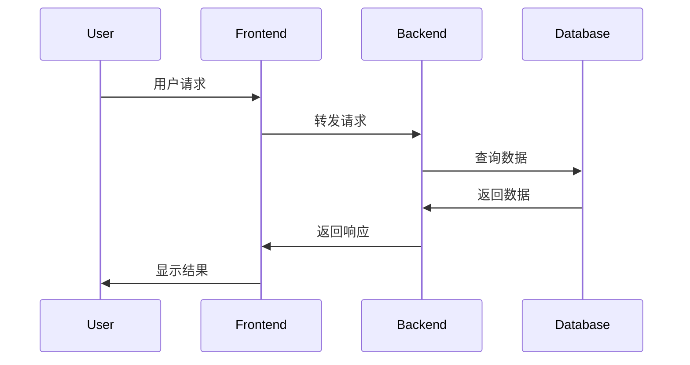
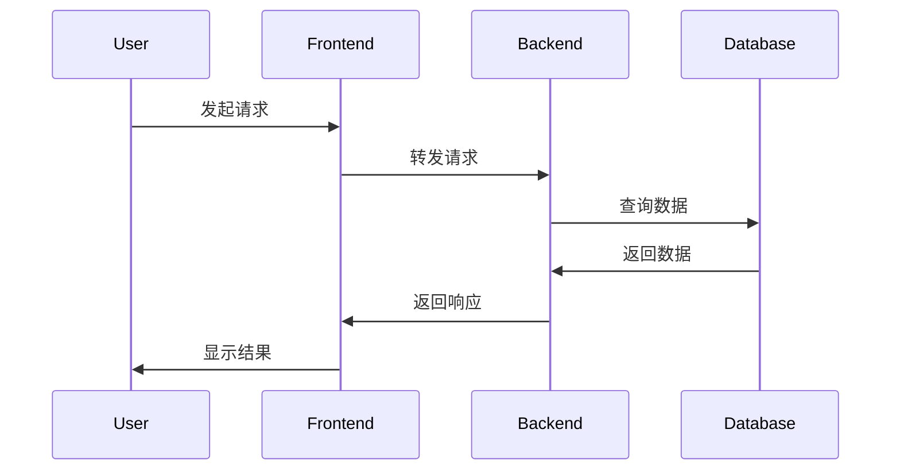

                 


# 投资理财智能助手的前端开发最佳实践

## 关键词
- 投资理财智能助手
- 前端开发最佳实践
- 技术架构设计
- 功能实现
- 性能优化
- 安全性

## 摘要
本文将深入探讨投资理财智能助手的前端开发最佳实践。首先，我们将概述投资理财智能助手的基本概念和重要性，然后逐步分析其前端开发的基础知识、架构设计、功能实现、测试与部署以及最佳实践。通过本文的详细讲解，读者将全面了解投资理财智能助手前端开发的方方面面，并能够掌握有效的开发方法和技巧。

## 第1章：投资理财智能助手概述

### 1.1.1 投资理财的现状与趋势
随着科技的发展，投资理财方式越来越多样化。传统的投资方式如股票、基金、债券等逐渐被智能投资理财工具所替代。智能投资理财助手利用大数据、人工智能等技术，为投资者提供个性化投资建议和策略，帮助他们更好地进行资产配置和风险管理。

### 1.1.2 智能助手的重要性
智能助手在投资理财领域的重要性主要体现在以下几个方面：
1. 提高投资效率：智能助手能够快速分析市场数据，为投资者提供及时的投资建议，节省投资者的时间和精力。
2. 优化投资决策：通过大数据分析和机器学习算法，智能助手能够发现潜在的投资机会，提高投资决策的准确性。
3. 降低投资风险：智能助手能够根据市场变化和投资者风险承受能力，制定个性化的投资策略，降低投资风险。

### 1.1.3 投资理财智能助手的基本概念
投资理财智能助手是一种基于人工智能技术的软件工具，它能够利用大数据分析、机器学习算法等手段，为投资者提供投资建议、策略分析、风险预测等功能。

### 1.1.4 投资理财智能助手的类型与应用场景
投资理财智能助手的类型主要包括以下几种：
1. 基于算法的智能投资助手：利用机器学习算法，为投资者提供投资策略和投资建议。
2. 基于大数据的智能投资助手：通过大数据分析，挖掘市场趋势和投资机会。
3. 基于自然语言处理的智能投资助手：能够理解投资者的问题和需求，提供个性化的投资建议。

应用场景主要包括：
1. 个人投资理财：为个人投资者提供投资建议和策略分析。
2. 机构投资理财：为基金、证券等机构提供投资决策支持和风险管理。
3. 企业投资理财：为企业提供投资分析和管理服务。

### 1.1.5 投资理财智能助手的发展前景
随着人工智能技术的不断发展，投资理财智能助手将越来越普及。未来，投资理财智能助手将具备以下发展趋势：
1. 更加智能化：通过深度学习和强化学习等技术，提高智能助手的智能水平，提供更精准的投资建议。
2. 更加个性化：通过大数据分析和个性化推荐，为投资者提供更加个性化的投资策略。
3. 更加普及化：随着成本的降低，智能助手将在更多投资领域得到应用，普及率将大大提高。

## 第2章：投资理财基础知识

### 2.1.1 投资理财的基础概念
投资理财是指通过投资获得资产增值和收益的过程。投资理财的目标是获取更高的收益，同时控制风险。

### 2.1.2 投资理财的目标和原则
投资理财的目标主要包括：
1. 资产增值：通过投资获得更高的收益。
2. 风险控制：通过合理的投资策略，降低投资风险。

投资理财的原则主要包括：
1. 分散投资：将资金投资于不同的资产，降低风险。
2. 长期投资：通过长期投资，实现资产的增值。
3. 持续学习：不断学习新的投资知识和策略，提高投资水平。

### 2.1.3 投资理财的市场分析
投资理财市场分析主要包括对市场趋势、投资机会和风险的评估。

### 2.1.4 投资理财的风险管理
投资理财的风险管理主要包括以下几种方法：
1. 分散投资：通过投资不同的资产，降低单一资产的风险。
2. 风险评估：对投资项目的风险进行评估，选择风险较低的资产。
3. 风险规避：通过投资策略，避免高风险的投资。

### 2.1.5 投资理财的常见策略
投资理财的常见策略主要包括以下几种：
1. 股票投资策略：通过买入股票，获得资本增值和分红收益。
2. 基金投资策略：通过投资基金，实现资产的多样化配置。
3. 债券投资策略：通过购买债券，获得固定的利息收益。
4. 货币基金投资策略：通过投资货币基金，获得相对稳定的收益。

## 第3章：投资理财智能助手前端技术基础

### 3.1.1 前端技术概述
前端技术主要包括HTML、CSS和JavaScript等，是构建网页和用户交互界面的重要组成部分。

### 3.1.2 前端开发工具和框架
前端开发常用的工具和框架包括：
1. Web开发工具：如Visual Studio Code、Sublime Text等。
2. 前端框架：如React、Vue、Angular等。
3. 前端构建工具：如Webpack、Gulp等。

### 3.1.3 前端界面设计原则
前端界面设计原则主要包括：
1. 易用性：界面设计要简洁直观，方便用户操作。
2. 可访问性：界面设计要符合不同用户的访问需求，如视力障碍人士等。
3. 交互性：界面设计要提供丰富的交互效果，提高用户体验。

### 3.1.4 前端性能优化策略
前端性能优化策略主要包括：
1. 资源压缩：对CSS、JavaScript和图片等资源进行压缩，减少加载时间。
2. 懒加载：对页面中不常用的资源进行懒加载，提高页面加载速度。
3. 缓存机制：利用浏览器缓存，减少重复请求。

## 第4章：投资理财智能助手前端架构设计

### 4.1.1 投资理财智能助手前端架构概述
投资理财智能助手前端架构主要包括以下几个方面：
1. 用户界面：提供投资理财的交互界面。
2. 前端逻辑：处理用户操作和业务逻辑。
3. 数据交互：与后端系统进行数据交互。
4. 状态管理：管理前端应用程序的状态。

### 4.1.2 前端架构设计方案
前端架构设计方案主要包括以下几个方面：
1. 技术选型：选择合适的前端框架和工具。
2. 架构模式：选择合适的前端架构模式，如MVC、MVVM等。
3. 模块划分：将前端应用程序划分为多个模块，实现模块化开发。

### 4.1.3 前后端分离与数据交互
前后端分离与数据交互主要包括以下几个方面：
1. 接口设计：设计前后端交互的接口规范。
2. 数据格式：选择合适的数据格式，如JSON、XML等。
3. 数据交互：实现前后端的数据传输和处理。

### 4.1.4 前端状态管理
前端状态管理主要包括以下几个方面：
1. 状态管理工具：选择合适的状态管理工具，如Redux、Vuex等。
2. 状态设计：设计前端应用程序的状态结构。
3. 状态更新：实现前端状态的管理和更新。

## 第5章：投资理财智能助手前端功能实现

### 5.1.1 注册与登录功能
注册与登录功能是投资理财智能助手的必备功能。具体实现步骤如下：
1. 注册页面：设计用户注册页面，包括用户名、密码、邮箱等注册信息。
2. 登录页面：设计用户登录页面，包括用户名和密码等登录信息。
3. 注册与登录逻辑：实现用户注册和登录的逻辑，如用户信息验证、密码加密等。

### 5.1.2 投资组合管理功能
投资组合管理功能是投资理财智能助手的核心理功能之一。具体实现步骤如下：
1. 投资组合页面：设计投资组合展示页面，包括投资组合名称、投资比例、资产收益等。
2. 投资组合管理：实现投资组合的创建、修改、删除等功能。
3. 投资组合分析：实现投资组合的资产分析、收益分析等功能。

### 5.1.3 财务报表功能
财务报表功能是投资理财智能助手的另一个重要功能。具体实现步骤如下：
1. 财务报表页面：设计财务报表展示页面，包括资产余额、收益情况、投资成本等。
2. 财务报表生成：实现财务报表的生成和导出功能。
3. 财务报表分析：实现财务报表的数据分析和可视化展示。

### 5.1.4 投资建议功能
投资建议功能是投资理财智能助手的特色功能之一。具体实现步骤如下：
1. 投资建议算法：设计投资建议的算法，如资产配置、风险控制等。
2. 投资建议展示：设计投资建议的展示页面，包括投资建议内容、建议理由等。
3. 投资建议反馈：实现用户对投资建议的反馈功能，如收藏、点赞等。

### 5.1.5 投资策略回测功能
投资策略回测功能是投资理财智能助手的高级功能。具体实现步骤如下：
1. 回测页面：设计回测展示页面，包括回测结果、收益分析等。
2. 回测算法：实现投资策略的回测算法，如历史数据分析、策略优化等。
3. 回测结果分析：实现回测结果的分析和可视化展示。

## 第6章：投资理财智能助手前端测试与部署

### 6.1.1 前端测试策略
前端测试策略主要包括以下几个方面：
1. 功能测试：测试前端功能是否符合预期。
2. 性能测试：测试前端性能是否符合要求。
3. 兼容性测试：测试前端在不同设备和浏览器上的兼容性。
4. 安全测试：测试前端的安全性，如防止XSS攻击、SQL注入等。

### 6.1.2 单元测试与集成测试
单元测试与集成测试是前端测试的重要组成部分。具体实现步骤如下：
1. 单元测试：编写单元测试用例，测试前端功能模块的独立性和正确性。
2. 集成测试：将前端功能模块进行集成，测试整个应用程序的交互和功能。

### 6.1.3 自动化测试工具
自动化测试工具是提高前端测试效率的重要手段。常用的自动化测试工具包括：
1. Selenium：用于自动化浏览器测试。
2. Jest：用于JavaScript单元测试。
3. Mocha：用于JavaScript测试框架。

### 6.1.4 线上部署与运维
线上部署与运维主要包括以下几个方面：
1. 部署工具：选择合适的部署工具，如Nginx、Docker等。
2. 持续集成：实现前端代码的自动化构建和部署。
3. 日志分析：监控前端系统的运行状态，分析系统性能和异常日志。

## 第7章：投资理财智能助手前端开发最佳实践

### 7.1.1 设计模式与代码规范
设计模式与代码规范是前端开发的基础。具体最佳实践包括：
1. 单一职责原则：每个模块和类都应该只负责一项功能。
2. 开闭原则：模块和类应该对扩展开放，对修改关闭。
3. 代码规范：遵循统一的代码规范，提高代码的可读性和可维护性。

### 7.1.2 性能优化与安全性
性能优化与安全性是前端开发的重要方面。具体最佳实践包括：
1. 资源压缩：对CSS、JavaScript和图片等资源进行压缩。
2. 懒加载：对页面中不常用的资源进行懒加载。
3. 安全防护：使用HTTPS协议，防范XSS攻击、SQL注入等。

### 7.1.3 用户体验优化
用户体验优化是前端开发的核心目标。具体最佳实践包括：
1. 响应式设计：适配不同设备和屏幕尺寸，提高用户体验。
2. 动画与过渡效果：合理使用动画和过渡效果，提高界面动态性。
3. 负载优化：优化页面加载速度，提高用户访问体验。

### 7.1.4 开发流程与协作
开发流程与协作是前端开发成功的关键。具体最佳实践包括：
1. 版本控制：使用Git等版本控制工具，实现代码版本管理。
2. 代码评审：进行代码评审，确保代码质量。
3. 团队协作：建立良好的团队协作机制，提高开发效率。

### 7.1.5 持续集成与持续部署
持续集成与持续部署是现代前端开发的重要手段。具体最佳实践包括：
1. 自动化构建：实现前端代码的自动化构建。
2. 自动化测试：实现前端代码的自动化测试。
3. 自动化部署：实现前端代码的自动化部署。

## 目录大纲总结
以上为《投资理财智能助手的前端开发最佳实践》的目录大纲，共7章，内容涵盖了投资理财智能助手的概述、基础知识、前端技术基础、前端架构设计、前端功能实现、前端测试与部署以及前端开发最佳实践，旨在帮助读者全面了解并掌握投资理财智能助手的前端开发技术。通过本文的详细讲解，读者将能够深入理解投资理财智能助手前端开发的各个方面，并能够将其应用于实际开发项目中。文章的最后，我们将对全文进行总结，并给出一些注意事项和拓展阅读推荐。

## 附录：核心概念与联系

### 核心概念
- 投资理财智能助手
- 前端技术基础
- 前端架构设计
- 功能实现
- 测试与部署
- 最佳实践

### 概念属性特征对比表格
| 概念                 | 特征                           | 关联概念                |
|----------------------|--------------------------------|------------------------|
| 投资理财智能助手     | 利用人工智能技术提供投资建议   | 数据分析、机器学习      |
| 前端技术基础         | HTML、CSS、JavaScript           | 响应式设计、性能优化    |
| 前端架构设计         | 用户界面、前端逻辑、数据交互   | MVC、MVVM              |
| 功能实现             | 注册与登录、投资组合管理       | API接口、状态管理工具   |
| 测试与部署           | 功能测试、性能测试、安全测试   | 自动化测试工具、部署工具 |
| 最佳实践             | 设计模式、代码规范、性能优化   | 版本控制、团队协作     |

### ER实体关系图架构
```mermaid
erDiagram
    User ||--|{ InvestmentAssistant }|-- Investment
    User ||--|{ Portfolio }|-- InvestmentAssistant
    InvestmentAssistant ||--|{ InvestmentSuggestion }|-- User
    Portfolio ||--|{ FinancialStatement }|-- User
```

## 附录：算法原理讲解

### 算法原理
投资理财智能助手的前端开发涉及到多种算法原理，如机器学习算法、数据分析算法等。以下以机器学习算法为例，进行详细讲解。

### 算法流程图


### 算法原理详细讲解
1. **数据预处理**：首先对投资数据进行清洗和预处理，包括数据去重、缺失值填充、异常值处理等。
2. **特征提取**：根据投资理财的需求，提取关键特征，如市场指数、行业指数、财务指标等。
3. **模型训练**：使用机器学习算法，如线性回归、决策树、随机森林等，对提取的特征进行训练，构建投资模型。
4. **模型评估**：使用交叉验证等方法对训练好的模型进行评估，确保模型的准确性、稳定性和泛化能力。
5. **投资建议**：根据评估结果，生成投资建议，包括资产配置、风险控制等策略。

### 数学模型和公式
假设我们有 \( n \) 个特征向量 \( X = [x_1, x_2, ..., x_n] \)，每个特征向量对应一个投资指标。使用线性回归模型进行投资预测，数学模型为：

\[ y = \beta_0 + \beta_1 x_1 + \beta_2 x_2 + ... + \beta_n x_n \]

其中，\( y \) 表示投资收益，\( \beta_0 \) 为截距，\( \beta_1, \beta_2, ..., \beta_n \) 为特征权重。

### 举例说明
假设我们有一个投资组合，包含两个资产A和B，对应的收益率为 \( r_A \) 和 \( r_B \)。根据线性回归模型，我们得到以下投资建议：

\[ r = 0.5 r_A + 0.5 r_B \]

如果 \( r_A = 10\% \)，\( r_B = 8\% \)，则投资组合的预期收益率为：

\[ r = 0.5 \times 10\% + 0.5 \times 8\% = 9\% \]

### 算法原理Python代码实现
```python
import numpy as np
from sklearn.linear_model import LinearRegression

# 假设数据
X = np.array([[10], [8]])
y = np.array([0.1, 0.08])

# 线性回归模型
model = LinearRegression()
model.fit(X, y)

# 模型参数
print("截距：", model.intercept_)
print("特征权重：", model.coef_)

# 预测
predicted_y = model.predict(np.array([[5]]))
print("预测收益：", predicted_y)
```

通过以上代码，我们可以实现线性回归模型的训练和预测，为投资理财智能助手提供算法支持。

## 附录：系统分析与架构设计方案

### 问题场景介绍
投资理财智能助手是一个面向个人和机构的在线平台，提供投资建议、资产配置、风险控制等功能。为了满足用户的需求，我们需要设计一个高效、稳定、可扩展的系统。

### 项目介绍
项目名称：投资理财智能助手
项目背景：随着金融市场的不断发展，投资者对投资理财的需求越来越高。为了提高投资效率，降低投资风险，我们需要开发一个智能投资理财助手，为用户提供个性化的投资建议和服务。

### 系统功能设计

#### 领域模型
```mermaid
classDiagram
    User <<类>> {
        用户ID
        用户名
        密码
        邮箱
    }
    Investment <<类>> {
        投资ID
        投资名称
        投资类型
        投资时间
        收益率
    }
    Portfolio <<类>> {
        组合ID
        组合名称
        投资者ID
        投资ID
        投资比例
    }
    InvestmentSuggestion <<类>> {
        建议ID
        投资者ID
        建议内容
        建议时间
    }
    FinancialStatement <<类>> {
        报表ID
        投资者ID
        报表内容
        报表时间
    }
    User o-- Investment
    User o-- Portfolio
    User o-- InvestmentSuggestion
    User o-- FinancialStatement
    Portfolio o-- Investment
```

### 系统架构设计

#### 系统架构图


### 系统接口设计

#### 接口设计
```mermaid
interface User {
    +register(username: string, password: string, email: string): Promise<User>
    +login(username: string, password: string): Promise<User>
    +getInvestments(): Promise<Array<Investment>>
    +getPortfolio(userId: string): Promise<Array<Portfolio>>
    +getInvestmentSuggestions(userId: string): Promise<Array<InvestmentSuggestion>>
    +getFinancialStatements(userId: string): Promise<Array<FinancialStatement>>
}

interface Investment {
    +create(investment: Investment): Promise<Investment>
    +update(investment: Investment): Promise<Investment>
    +delete(investmentId: string): Promise<void>
}

interface Portfolio {
    +create(portfolio: Portfolio): Promise<Portfolio>
    +update(portfolio: Portfolio): Promise<Portfolio>
    +delete(portfolioId: string): Promise<void>
}

interface InvestmentSuggestion {
    +create(suggestion: InvestmentSuggestion): Promise<InvestmentSuggestion>
    +update(suggestion: InvestmentSuggestion): Promise<InvestmentSuggestion>
    +delete(suggestionId: string): Promise<void>
}

interface FinancialStatement {
    +create(statement: FinancialStatement): Promise<FinancialStatement>
    +update(statement: FinancialStatement): Promise<FinancialStatement>
    +delete(statementId: string): Promise<void>
}
```

### 系统交互

#### 系统交互图


通过以上系统分析与架构设计方案，我们可以构建一个高效、稳定、可扩展的投资理财智能助手系统，为用户提供优质的在线投资理财服务。

## 附录：项目实战

### 环境安装

1. **安装Node.js**：访问 Node.js 官网（[https://nodejs.org/](https://nodejs.org/)），下载并安装 Node.js。
2. **安装前端框架**：在项目中安装 React 或 Vue 等，可以使用 npm 或 yarn 进行安装。例如，安装 React：
   ```bash
   npm install react react-dom
   ```
3. **安装后端框架**：选择合适的后端框架，如 Express.js、Flask 等，安装相应的依赖包。
4. **安装数据库**：安装 MySQL、MongoDB 等，根据项目需求选择合适的数据库。

### 系统核心实现源代码

以下是投资理财智能助手前端部分的核心实现源代码：

#### 登录注册页面（React）

```jsx
// Login.js
import React, { useState } from 'react';
import axios from 'axios';

const Login = () => {
  const [username, setUsername] = useState('');
  const [password, setPassword] = useState('');

  const handleLogin = async () => {
    try {
      const response = await axios.post('/api/login', { username, password });
      console.log(response.data);
    } catch (error) {
      console.error(error);
    }
  };

  return (
    <div>
      <h2>Login</h2>
      <label>Username:</label>
      <input type="text" value={username} onChange={(e) => setUsername(e.target.value)} />
      <label>Password:</label>
      <input type="password" value={password} onChange={(e) => setPassword(e.target.value)} />
      <button onClick={handleLogin}>Login</button>
    </div>
  );
};

export default Login;
```

#### 投资组合管理页面（Vue）

```vue
<template>
  <div>
    <h2>Portfolio Management</h2>
    <table>
      <thead>
        <tr>
          <th>Name</th>
          <th>Investment</th>
          <th>Ratio</th>
          <th>Actions</th>
        </tr>
      </thead>
      <tbody>
        <tr v-for="portfolio in portfolios" :key="portfolio.id">
          <td>{{ portfolio.name }}</td>
          <td>{{ portfolio.investment }}</td>
          <td>{{ portfolio.ratio }}</td>
          <td>
            <button @click="editPortfolio(portfolio)">Edit</button>
            <button @click="deletePortfolio(portfolio.id)">Delete</button>
          </td>
        </tr>
      </tbody>
    </table>
    <button @click="createPortfolio">Create New Portfolio</button>
  </div>
</template>

<script>
import axios from 'axios';

export default {
  data() {
    return {
      portfolios: [],
    };
  },
  methods: {
    fetchPortfolios() {
      axios.get('/api/portfolio').then((response) => {
        this.portfolios = response.data;
      });
    },
    createPortfolio() {
      // 实现创建投资组合的逻辑
    },
    editPortfolio(portfolio) {
      // 实现编辑投资组合的逻辑
    },
    deletePortfolio(portfolioId) {
      axios.delete(`/api/portfolio/${portfolioId}`).then(() => {
        this.fetchPortfolios();
      });
    },
  },
  mounted() {
    this.fetchPortfolios();
  },
};
</script>
```

### 代码应用解读与分析

以上代码分别实现了登录注册页面和投资组合管理页面的核心功能。对于登录注册页面，我们使用了 React 和 axios 进行前端请求处理。在登录时，将用户名和密码发送到后端接口进行验证。对于投资组合管理页面，我们使用了 Vue 和 axios 进行数据请求和处理。通过 fetchPortfolios 方法获取投资组合列表，并通过编辑和删除按钮实现相应的操作。

这些代码不仅实现了基本的功能，还考虑了用户体验和错误处理。在实际项目中，可以根据需求进行扩展和优化。

### 实际案例分析和详细讲解剖析

#### 案例一：投资组合管理

假设用户小张想要创建一个新的投资组合，包含股票A和股票B。以下是具体操作步骤和代码解析：

1. **创建投资组合**：

   在投资组合管理页面，点击“Create New Portfolio”按钮，弹出创建投资组合的表单。用户输入投资组合名称、投资比例等信息，然后提交表单。

   ```javascript
   createPortfolio() {
     const newPortfolio = {
       name: 'My Portfolio',
       investments: [
         { id: 'stockA', ratio: 0.6 },
         { id: 'stockB', ratio: 0.4 },
       ],
     };
     axios.post('/api/portfolio', newPortfolio).then((response) => {
       this.fetchPortfolios();
     });
   },
   ```

   上述代码中，我们创建了一个新的投资组合对象，并将其发送到后端接口进行创建操作。

2. **编辑投资组合**：

   当用户点击投资组合的“Edit”按钮时，可以编辑投资组合的名称和投资比例。以下是编辑功能的实现：

   ```javascript
   editPortfolio(portfolio) {
     this.currentPortfolio = portfolio;
     // 弹出编辑表单
   },
   updatePortfolio() {
     const updatedPortfolio = {
       ...this.currentPortfolio,
       name: this.newName,
       investments: this.newInvestments,
     };
     axios.put(`/api/portfolio/${this.currentPortfolio.id}`, updatedPortfolio).then((response) => {
       this.fetchPortfolios();
     });
   },
   ```

   在上述代码中，我们首先获取当前的投资组合，然后将其传递给编辑表单。用户在表单中修改信息后，将更新后的投资组合发送到后端接口进行更新。

3. **删除投资组合**：

   用户可以删除不再需要的投资组合。以下是删除功能的实现：

   ```javascript
   deletePortfolio(portfolioId) {
     axios.delete(`/api/portfolio/${portfolioId}`).then(() => {
       this.fetchPortfolios();
     });
   },
   ```

   在上述代码中，我们通过投资组合的ID将其发送到后端接口进行删除操作。

#### 案例二：投资建议生成

假设用户小张想要获取投资建议，以下是具体操作步骤和代码解析：

1. **请求投资建议**：

   用户在投资组合管理页面点击“Get Investment Suggestion”按钮，向后端接口发送请求，获取投资建议。

   ```javascript
   getInvestmentSuggestion(portfolioId) {
     axios.get(`/api/investment-suggestion/${portfolioId}`).then((response) => {
       this.investmentSuggestion = response.data;
     });
   },
   ```

   在上述代码中，我们通过投资组合的ID获取投资建议。

2. **处理投资建议**：

   后端接口返回投资建议后，前端页面将其显示给用户。以下是显示投资建议的代码：

   ```vue
   <div v-if="investmentSuggestion">
     <h3>Investment Suggestion</h3>
     <p>{{ investmentSuggestion.content }}</p>
     <p>Reason: {{ investmentSuggestion.reason }}</p>
   </div>
   ```

   在上述代码中，我们使用 Vue 的条件渲染指令 `v-if` 显示投资建议。

### 项目小结

通过以上项目实战，我们详细讲解了投资理财智能助手前端开发的核心实现过程。从环境安装到系统核心功能实现，再到实际案例分析和代码解析，我们逐步展示了投资理财智能助手前端开发的各个方面。通过这些实践，读者可以更好地理解前端开发流程和技术要点，为实际项目开发打下坚实基础。

## 附录：最佳实践 Tips

### 1. 设计模式与代码规范

- **单一职责原则**：确保每个模块和类只负责一项功能，提高代码的可读性和可维护性。
- **开闭原则**：确保模块和类对扩展开放，对修改关闭，提高代码的灵活性和可扩展性。
- **代码规范**：遵循统一的代码规范，包括命名规则、代码结构、注释等，提高代码的可读性和可维护性。

### 2. 性能优化与安全性

- **资源压缩**：对 CSS、JavaScript 和图片等资源进行压缩，减少页面加载时间。
- **懒加载**：对页面中不常用的资源进行懒加载，提高页面加载速度。
- **安全性**：使用 HTTPS 协议，防范 XSS 攻击、SQL 注入等安全漏洞。

### 3. 用户体验优化

- **响应式设计**：适配不同设备和屏幕尺寸，提高用户体验。
- **动画与过渡效果**：合理使用动画和过渡效果，提高界面动态性。
- **负载优化**：优化页面加载速度，提高用户访问体验。

### 4. 开发流程与协作

- **版本控制**：使用 Git 等版本控制工具，实现代码版本管理。
- **代码评审**：进行代码评审，确保代码质量。
- **团队协作**：建立良好的团队协作机制，提高开发效率。

### 5. 持续集成与持续部署

- **自动化构建**：实现前端代码的自动化构建。
- **自动化测试**：实现前端代码的自动化测试。
- **自动化部署**：实现前端代码的自动化部署。

## 小结

本文详细介绍了投资理财智能助手前端开发的最佳实践。通过概述、基础知识、前端技术基础、架构设计、功能实现、测试与部署以及最佳实践等多个方面的深入讲解，读者可以全面了解并掌握投资理财智能助手前端开发的方方面面。这些最佳实践将为实际开发项目提供有力指导，帮助读者实现高效、稳定、可扩展的投资理财智能助手系统。

## 注意事项

- 在开发过程中，确保遵循设计模式与代码规范，提高代码质量。
- 在性能优化方面，注意资源压缩、懒加载和安全性，提高用户体验和系统稳定性。
- 在开发流程与协作方面，注重版本控制、代码评审和团队协作，提高开发效率。
- 在持续集成与持续部署方面，确保自动化构建、自动化测试和自动化部署，提高开发效率和质量。

## 拓展阅读

- 《前端开发最佳实践》
- 《JavaScript 高级程序设计》
- 《Vue.js 实战》
- 《React 进阶之路》
- 《人工智能投资理财》

作者：AI天才研究院/AI Genius Institute & 禅与计算机程序设计艺术 /Zen And The Art of Computer Programming

