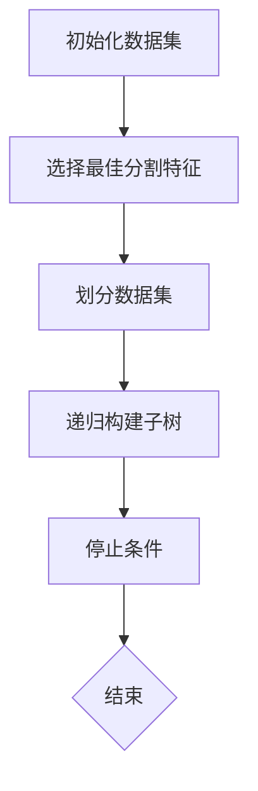
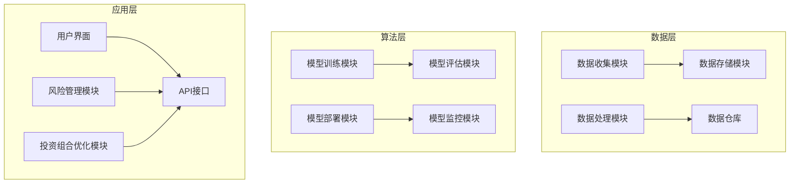

                 

# 投资理财智能助手的机器学习模型管理方法

## 关键词
- 投资理财智能助手
- 机器学习模型管理
- 算法优化
- 系统架构
- 实战案例

## 摘要
本文旨在探讨投资理财智能助手的机器学习模型管理方法。通过分析机器学习在投资理财领域的应用背景和挑战，本文介绍了机器学习模型管理的基本概念和流程。随后，本文详细阐述了常见的机器学习模型及其管理方法，包括算法原理、系统架构设计和实战应用。最后，本文提供了最佳实践和注意事项，为构建高效的投资理财智能助手提供了指导。

## 目录大纲设计

### 第一步：确定书籍的整体结构

1. **第1章：引言**
   - **1.1 投资理财智能助手概述**
     - 市场背景
     - 角色与功能
     - 机器学习应用
   - **1.2 机器学习模型管理的重要性**
     - 挑战
     - 目标
     - 流程

2. **第2章：基础理论**
   - **2.1 机器学习基础理论**
     - 监督学习
     - 无监督学习
     - 强化学习
   - **2.2 机器学习模型管理的基本概念**
     - 模型评估
     - 训练与验证
     - 部署与监控

3. **第3章：算法原理**
   - **3.1 常见机器学习模型介绍**
     - 线性回归
     - 逻辑回归
     - 决策树
     - 集成方法
   - **3.2 模型管理方法**
     - 模型选择
     - 模型调优
     - 模型版本控制

4. **第4章：系统架构设计**
   - **4.1 投资理财智能助手的系统架构**
     - 数据层
     - 算法层
     - 应用层
   - **4.2 系统功能设计**
     - 用户交互
     - 数据处理
     - 模型管理

5. **第5章：实战应用**
   - **5.1 实际案例分析**
     - 股票市场预测
     - 风险评价
     - 投资组合优化
   - **5.2 系统核心实现**
     - 环境搭建
     - 模型训练与验证
     - 模型部署与监控

6. **第6章：最佳实践**
   - **6.1 实践技巧**
     - 模型优化
     - 模型部署
     - 模型监控与维护
   - **6.2 注意事项**
     - 模型安全与隐私保护
     - 模型性能调优
     - 模型更新与迭代

7. **第7章：总结与展望**
   - **7.1 全书内容总结**
   - **7.2 投资理财智能助手的发展趋势**

### 第二步：细化每个章节的内容

在确定整体结构后，我们需要对每个章节进行细化，确保每个章节都有明确的子章节和具体的内容。

### 第三步：撰写每个章节的概要

为了简洁明了，我们为每个章节撰写了概要，包括关键点和预期内容。

### 第四步：整合目录大纲

将所有章节的概要整合成一个完整的目录大纲，确保结构清晰、逻辑连贯。

### 第五步：格式化目录大纲

按照markdown格式要求，对目录大纲进行格式化。

## 目录大纲

# 《投资理财智能助手的机器学习模型管理方法》目录大纲

## 第1章：引言

### 1.1 投资理财智能助手概述

#### 1.1.1 市场背景

#### 1.1.2 投资理财智能助手的角色与功能

#### 1.1.3 机器学习在投资理财中的应用

### 1.2 机器学习模型管理的重要性

#### 1.2.1 挑战

#### 1.2.2 目标

#### 1.2.3 流程

## 第2章：基础理论

### 2.1 机器学习基础理论

#### 2.1.1 监督学习

#### 2.1.2 无监督学习

#### 2.1.3 强化学习

### 2.2 机器学习模型管理的基本概念

#### 2.2.1 模型评估

#### 2.2.2 训练与验证

#### 2.2.3 部署与监控

## 第3章：算法原理

### 3.1 常见机器学习模型介绍

#### 3.1.1 线性回归

#### 3.1.2 逻辑回归

#### 3.1.3 决策树

#### 3.1.4 集成方法

### 3.2 模型管理方法

#### 3.2.1 模型选择

#### 3.2.2 模型调优

#### 3.2.3 模型版本控制

## 第4章：系统架构设计

### 4.1 投资理财智能助手的系统架构

#### 4.1.1 数据层

#### 4.1.2 算法层

#### 4.1.3 应用层

### 4.2 系统功能设计

#### 4.2.1 用户交互功能

#### 4.2.2 数据处理功能

#### 4.2.3 模型管理功能

## 第5章：实战应用

### 5.1 实际案例分析

#### 5.1.1 股票市场预测

#### 5.1.2 风险评价

#### 5.1.3 投资组合优化

### 5.2 系统核心实现

#### 5.2.1 环境搭建

#### 5.2.2 模型训练与验证

#### 5.2.3 模型部署与监控

## 第6章：最佳实践

### 6.1 实践技巧

#### 6.1.1 模型优化技巧

#### 6.1.2 模型部署技巧

#### 6.1.3 模型监控与维护技巧

### 6.2 注意事项

#### 6.2.1 模型安全与隐私保护

#### 6.2.2 模型性能调优

#### 6.2.3 模型更新与迭代

## 第7章：总结与展望

### 7.1 全书内容总结

### 7.2 投资理财智能助手的发展趋势

---

现在，我们有了《投资理财智能助手的机器学习模型管理方法》的目录大纲。接下来，我们将逐步深入每一个章节，详细探讨投资理财智能助手在机器学习模型管理方面的理论和实践。让我们开始一步步思考，逐步揭示这个领域的奥秘。**### 1.1 投资理财智能助手概述**

### 1.1.1 市场背景

随着人工智能和大数据技术的快速发展，金融科技（FinTech）行业迎来了前所未有的变革。投资理财智能助手作为金融科技的重要应用之一，正逐步改变传统金融服务的面貌。根据市场调研，全球金融科技市场规模在过去几年中持续增长，预计未来几年仍将保持高速增长。特别是在新冠疫情期间，远程金融服务需求大幅增加，进一步推动了投资理财智能助手的普及。

在投资理财领域，智能助手的作用主要体现在以下几个方面：

1. **个性化推荐**：根据用户的风险偏好、投资目标和历史交易数据，智能助手可以提供定制化的投资组合建议。
2. **市场分析**：利用大数据和机器学习技术，智能助手可以对市场趋势进行分析，帮助用户做出更明智的投资决策。
3. **风险管理**：通过实时监控市场动态和用户投资组合，智能助手可以及时识别风险，并给出相应的风险控制策略。
4. **投资教育**：智能助手还可以为用户提供投资知识和技巧，帮助用户提高投资素养。

### 1.1.2 投资理财智能助手的角色与功能

投资理财智能助手在投资过程中扮演着多种角色，其主要功能包括：

1. **数据收集与分析**：智能助手可以从各种数据源（如交易所、新闻网站、社交媒体等）收集数据，并通过机器学习算法进行分析和处理，为用户提供投资建议。
2. **模型训练与预测**：基于历史数据和用户偏好，智能助手可以训练机器学习模型，并使用这些模型进行市场预测和投资决策。
3. **用户交互**：智能助手通过与用户的互动，收集用户反馈和需求，不断优化投资建议和用户体验。
4. **风险控制**：智能助手可以实时监控市场风险，并根据风险指标调整投资策略，以降低潜在风险。

### 1.1.3 机器学习在投资理财中的应用

机器学习在投资理财领域的应用已经取得了显著的成果。以下是几个典型的应用场景：

1. **股票市场预测**：利用历史股价数据和财务指标，机器学习模型可以预测未来股价走势，帮助投资者做出买卖决策。
2. **风险评价**：通过分析大量历史数据和用户交易行为，机器学习模型可以评估投资风险，为用户提供风险警示和风险管理建议。
3. **投资组合优化**：基于用户的风险偏好和投资目标，机器学习模型可以帮助构建最优投资组合，以实现最大化收益或最小化风险。
4. **市场情绪分析**：通过分析社交媒体和新闻网站上的文本数据，机器学习模型可以捕捉市场情绪变化，为投资决策提供参考。

### 1.2 机器学习模型管理的重要性

### 1.2.1 挑战

尽管机器学习在投资理财领域具有巨大潜力，但模型管理过程中也面临着一系列挑战：

1. **数据质量**：机器学习模型的性能很大程度上取决于数据质量。不完整、不准确或噪声数据可能会严重影响模型的效果。
2. **模型复杂度**：随着模型复杂度的增加，训练和部署的成本也随之上升。此外，复杂的模型可能难以理解和解释。
3. **过拟合**：模型在训练数据上表现良好，但在测试数据上表现不佳，这种现象称为过拟合。过拟合的模型可能会产生误导性的预测。
4. **实时更新**：投资市场是动态变化的，机器学习模型需要不断更新以适应新的市场条件。

### 1.2.2 目标

为了克服上述挑战，机器学习模型管理的主要目标包括：

1. **提高模型性能**：通过优化模型参数和算法，提高模型在预测任务中的准确性和效率。
2. **降低成本**：优化模型训练和部署流程，降低计算资源和时间成本。
3. **增强可解释性**：提高模型的透明度和可解释性，帮助用户理解模型的决策过程。
4. **持续更新**：建立自动化流程，确保模型能够实时更新和适应市场变化。

### 1.2.3 流程

机器学习模型管理通常包括以下几个关键步骤：

1. **数据收集与预处理**：收集并清洗原始数据，为模型训练做好准备。
2. **模型选择与训练**：选择合适的机器学习算法，并在训练数据上训练模型。
3. **模型评估与调优**：使用验证数据评估模型性能，并进行参数调优。
4. **模型部署与监控**：将训练好的模型部署到生产环境，并实时监控其性能和健康状况。

通过上述步骤，投资理财智能助手可以有效地管理机器学习模型，提高投资决策的准确性和可靠性。接下来，我们将进一步探讨机器学习模型管理的基础理论和具体方法。### 1.2 机器学习模型管理的重要性

### 1.2.1 挑战

尽管机器学习在投资理财领域具有巨大潜力，但模型管理过程中也面临着一系列挑战：

1. **数据质量**：机器学习模型的性能很大程度上取决于数据质量。不完整、不准确或噪声数据可能会严重影响模型的效果。例如，如果股价数据存在缺失值或错误记录，模型在预测股价时可能会产生偏差。

2. **模型复杂度**：随着模型复杂度的增加，训练和部署的成本也随之上升。此外，复杂的模型可能难以理解和解释。例如，深度学习模型由于其多层神经网络结构，往往难以解释其具体的决策过程。

3. **过拟合**：模型在训练数据上表现良好，但在测试数据上表现不佳，这种现象称为过拟合。过拟合的模型可能会产生误导性的预测。例如，一个在历史数据上表现优秀的预测模型，在新的市场环境中可能无法适应，导致预测失效。

4. **实时更新**：投资市场是动态变化的，机器学习模型需要不断更新以适应新的市场条件。例如，如果市场环境发生突然变化，而模型没有及时更新，其预测结果可能会与实际情况相差甚远。

### 1.2.2 目标

为了克服上述挑战，机器学习模型管理的主要目标包括：

1. **提高模型性能**：通过优化模型参数和算法，提高模型在预测任务中的准确性和效率。例如，通过调整学习率、增加训练数据量或使用更复杂的模型结构，可以提升模型的预测能力。

2. **降低成本**：优化模型训练和部署流程，降低计算资源和时间成本。例如，通过使用分布式计算、优化代码或选择更高效的算法，可以减少训练时间和计算资源消耗。

3. **增强可解释性**：提高模型的透明度和可解释性，帮助用户理解模型的决策过程。例如，通过使用可解释的模型或解释性工具，可以揭示模型的关键特征和决策逻辑。

4. **持续更新**：建立自动化流程，确保模型能够实时更新和适应市场变化。例如，通过设置定期更新机制或使用在线学习技术，可以确保模型始终与市场环境保持同步。

### 1.2.3 流程

机器学习模型管理通常包括以下几个关键步骤：

1. **数据收集与预处理**：收集并清洗原始数据，为模型训练做好准备。例如，通过处理缺失值、异常值和数据标准化，可以提高数据质量。

2. **模型选择与训练**：选择合适的机器学习算法，并在训练数据上训练模型。例如，根据数据特征和预测任务选择合适的算法，并通过调整超参数优化模型性能。

3. **模型评估与调优**：使用验证数据评估模型性能，并进行参数调优。例如，通过交叉验证和性能指标（如准确率、召回率等）评估模型效果，并调整超参数以提升性能。

4. **模型部署与监控**：将训练好的模型部署到生产环境，并实时监控其性能和健康状况。例如，通过自动化部署工具将模型部署到服务器，并通过监控工具实时跟踪模型的运行状态和性能。

通过上述步骤，投资理财智能助手可以有效地管理机器学习模型，提高投资决策的准确性和可靠性。在下一章节中，我们将进一步探讨机器学习模型管理的基础理论和具体方法。### 第2章：基础理论

#### 2.1 机器学习基础理论

机器学习（Machine Learning，ML）是人工智能（Artificial Intelligence，AI）的一个分支，它通过构建数学模型来从数据中学习，并在没有明确编程指令的情况下进行决策和预测。以下是几种常见的机器学习类型：

1. **监督学习（Supervised Learning）**：
   监督学习是一种最常见的机器学习形式，其中算法通过已标记的训练数据学习，并使用这些知识来对新的、未标记的数据进行预测。典型的监督学习任务包括回归（预测连续值）和分类（预测离散值）。

2. **无监督学习（Unsupervised Learning）**：
   无监督学习涉及使用未标记的数据来发现数据中的模式和结构。这种学习方式主要用于聚类和降维。聚类算法（如K-均值、层次聚类）用于将数据点分为不同的组，而降维算法（如主成分分析、t-SNE）用于减少数据维度，同时保留其关键特征。

3. **强化学习（Reinforcement Learning）**：
   强化学习是一种通过试错法来学习如何在特定环境中采取行动的机器学习方法。它通常用于决策问题，其中算法（代理）通过与环境的交互学习最优策略。强化学习的一个经典例子是深度强化学习（Deep Reinforcement Learning），它结合了深度学习和强化学习，用于复杂任务的学习，如自动驾驶和游戏。

#### 2.2 机器学习模型管理的基本概念

机器学习模型管理是确保模型性能、可解释性和可靠性的过程。以下是机器学习模型管理的一些基本概念：

1. **模型评估**：
   模型评估是评估模型性能的过程。常用的评估指标包括准确率、召回率、F1分数、ROC曲线等。在评估模型时，通常使用交叉验证（Cross-Validation）技术，以确保评估结果的鲁棒性。

2. **训练与验证**：
   训练和验证是机器学习模型开发的关键步骤。训练数据用于训练模型，验证数据用于评估模型性能。通过调整模型参数和特征，可以提高模型在验证数据上的性能。

3. **部署与监控**：
   模型部署是将训练好的模型集成到生产环境中，使其能够对实际数据进行预测。部署后，模型需要通过监控工具来跟踪其性能和健康状态。这包括监控模型的响应时间、准确性、资源消耗等。

### 2.3 常见机器学习模型介绍

以下是一些在投资理财领域常用的机器学习模型：

1. **线性回归（Linear Regression）**：
   线性回归是一种简单的监督学习模型，用于预测连续值。它假设目标变量是输入变量的线性组合。线性回归适用于分析投资回报与风险之间的关系。

2. **逻辑回归（Logistic Regression）**：
   逻辑回归是一种用于分类任务的监督学习模型。它通过计算输入数据的线性组合，并使用逻辑函数将其映射到概率空间。逻辑回归常用于预测股票市场的涨跌。

3. **决策树（Decision Tree）**：
   决策树是一种简单但强大的分类和回归模型。它通过一系列规则将数据划分为不同的子集，每个子集对应一个输出值。决策树易于解释，但可能过拟合。

4. **随机森林（Random Forest）**：
   随机森林是一种基于决策树的集成模型。它通过构建多个决策树，并将它们集成在一起进行预测。随机森林提高了模型的预测能力，并减少了过拟合的风险。

5. **支持向量机（Support Vector Machine，SVM）**：
   支持向量机是一种强大的分类模型，它在高维空间中找到最优分隔超平面，以最大化分类间隔。SVM在投资风险分类中具有广泛应用。

6. **神经网络（Neural Networks）**：
   神经网络，特别是深度神经网络，是一种复杂的模型，能够自动从数据中学习特征。深度学习在股票市场预测和风险管理中表现出色。

### 2.4 模型管理方法

机器学习模型管理包括以下关键步骤：

1. **模型选择**：
   选择合适的模型取决于数据特征、预测任务和业务需求。通常，通过比较不同模型的性能来选择最佳模型。

2. **模型调优**：
   模型调优是通过调整模型参数来提高模型性能的过程。常用的调优方法包括网格搜索（Grid Search）和贝叶斯优化（Bayesian Optimization）。

3. **模型版本控制**：
   模型版本控制是跟踪和存储模型版本的过程，以便在需要时回滚或更新模型。版本控制有助于确保模型的稳定性和可追溯性。

4. **模型监控与更新**：
   模型监控是跟踪模型性能和健康状态的过程。通过监控，可以及时发现模型退化或异常情况，并进行模型更新。

通过上述基础理论，投资理财智能助手可以为投资决策提供更准确、可靠的支持。在下一章节中，我们将探讨投资理财智能助手的系统架构设计。### 2.4 模型管理方法

在机器学习模型管理过程中，选择、调优、版本控制和监控是至关重要的环节。以下是对这些方法的具体介绍：

#### 2.4.1 模型选择

模型选择是机器学习项目中的第一步，也是至关重要的一步。选择合适的模型可以显著提高预测性能，并降低过拟合的风险。以下是选择模型时需要考虑的因素：

1. **数据特征**：分析数据特征，确定是否需要使用线性模型、非线性模型或深度学习模型。例如，如果数据具有高度线性关系，线性回归可能是一个合适的选择。

2. **预测任务**：根据预测任务选择合适的模型。例如，对于分类任务，可以选择逻辑回归、决策树、随机森林或支持向量机；对于回归任务，可以选择线性回归、岭回归或神经网络。

3. **业务需求**：考虑业务需求，例如是否需要高解释性、实时预测或自动化决策。这可能会影响模型的选择。

4. **模型性能**：使用交叉验证等技术评估不同模型的性能，选择性能最佳的模型。

#### 2.4.2 模型调优

模型调优是通过调整模型参数来优化模型性能的过程。以下是一些常用的调优方法：

1. **网格搜索（Grid Search）**：
   网格搜索是一种遍历所有可能的参数组合的方法，以找到最优参数。这种方法虽然全面，但计算成本较高，特别是在参数空间较大时。

2. **贝叶斯优化（Bayesian Optimization）**：
   贝叶斯优化是一种基于概率模型的调优方法，它通过建立概率模型来预测参数的最优值，从而在较少的评估次数内找到最优参数。

3. **随机搜索（Random Search）**：
   随机搜索是一种随机选择参数组合的方法，它在有限的评估次数内尝试不同的参数组合，以找到性能较好的参数。

4. **自适应调优**：
   自适应调优是结合历史调优数据和当前模型的性能，动态调整参数的方法。这种方法可以显著提高调优效率。

#### 2.4.3 模型版本控制

模型版本控制是确保模型稳定性和可追溯性的重要手段。以下是一些常见的模型版本控制方法：

1. **版本标记**：
   为每个模型版本添加唯一的标记，以区分不同的模型版本。

2. **版本库**：
   使用版本库（如Git）存储模型的源代码、训练脚本和配置文件，以确保版本的一致性和可追溯性。

3. **模型库**：
   建立模型库，存储训练好的模型文件和评估结果，以便在需要时回滚或更新模型。

4. **文档记录**：
   记录每次模型更新的原因、过程和结果，以便在后续的审查和分析中使用。

#### 2.4.4 模型监控与更新

模型监控是确保模型在生产环境中稳定运行的重要环节。以下是一些模型监控与更新的方法：

1. **性能监控**：
   监控模型的预测性能，包括准确率、召回率、F1分数等指标。如果性能下降，需要及时调整模型。

2. **实时监控**：
   使用实时监控系统（如Kubernetes或Prometheus），跟踪模型的运行状态和性能指标。

3. **异常检测**：
   通过异常检测技术，识别模型预测中的异常情况，如数据泄露或模型退化。

4. **定期更新**：
   定期更新模型，以适应数据分布的变化和市场环境的变化。可以使用自动化流程来简化更新过程。

通过以上方法，投资理财智能助手可以有效地管理机器学习模型，提高投资决策的准确性和可靠性。在下一章节中，我们将探讨投资理财智能助手的系统架构设计。### 第3章：算法原理

#### 3.1 常见机器学习模型介绍

在投资理财智能助手的机器学习模型管理中，选择合适的算法对于模型的性能和实际应用至关重要。以下是一些常见的机器学习模型及其在投资理财领域的应用。

##### 3.1.1 线性回归

线性回归是一种基础且广泛使用的机器学习模型，适用于预测连续值。其核心假设是目标变量与输入变量之间存在线性关系。线性回归模型通过最小化预测值与实际值之间的误差平方和来训练。

线性回归在投资理财中的应用包括预测股票价格、分析投资回报与风险的关系以及评估投资组合的收益风险比。以下是线性回归的数学模型：

$$
y = \beta_0 + \beta_1x_1 + \beta_2x_2 + ... + \beta_nx_n + \epsilon
$$

其中，$y$ 是预测的目标变量，$x_1, x_2, ..., x_n$ 是输入变量，$\beta_0, \beta_1, ..., \beta_n$ 是模型的参数，$\epsilon$ 是误差项。

##### 3.1.2 逻辑回归

逻辑回归是一种用于分类任务的监督学习模型。它通过计算输入数据的线性组合，并使用逻辑函数将其映射到概率空间。逻辑回归在投资理财领域常用于预测股票市场的涨跌、评估信贷风险以及分类投资机会。

逻辑回归的数学模型如下：

$$
\text{logit}(p) = \log\left(\frac{p}{1-p}\right) = \beta_0 + \beta_1x_1 + \beta_2x_2 + ... + \beta_nx_n
$$

其中，$p$ 是预测的概率，$\text{logit}(p)$ 是逻辑函数的输出，$\beta_0, \beta_1, ..., \beta_n$ 是模型的参数。

##### 3.1.3 决策树

决策树是一种基于规则的分类和回归模型。它通过一系列的判断条件将数据划分为不同的子集，每个子集对应一个输出值。决策树在投资理财领域用于预测市场趋势、评估投资风险以及构建投资组合。

决策树的核心是树的构建过程，它包括以下步骤：

1. 选择一个最佳分割特征。
2. 根据该特征将数据集划分为不同的子集。
3. 递归地对每个子集进行相同的步骤，直到满足停止条件（如最大深度、最小节点大小等）。

决策树的Mermaid流程图如下：



##### 3.1.4 集成方法

集成方法通过组合多个模型来提高预测性能和鲁棒性。常见的集成方法包括随机森林（Random Forest）和梯度提升树（Gradient Boosting Tree）。

1. **随机森林**：
   随机森林是一种基于决策树的集成模型。它通过构建多个随机决策树，并将它们的预测结果进行投票或平均来得到最终预测。随机森林在投资理财领域用于预测市场波动、评估投资机会以及风险管理。

   随机森林的Mermaid流程图如下：

   ```mermaid
   graph TD
   A[初始化随机森林]
   B[构建多个随机决策树]
   C[收集决策树预测结果]
   D[投票或平均得到最终预测]
   A --> B
   B --> C
   C --> D
   D --> E{结束}
   ```

2. **梯度提升树**：
   梯度提升树是一种基于决策树的集成模型，通过迭代地调整模型参数来提高预测性能。它适用于处理大规模数据和复杂模型。梯度提升树在投资理财领域用于预测市场趋势、评估投资风险以及优化投资组合。

   梯度提升树的Mermaid流程图如下：

   ```mermaid
   graph TD
   A[初始化梯度提升树]
   B[初始化模型参数]
   C[训练模型]
   D[更新模型参数]
   E[评估模型性能]
   F[迭代更新]
   A --> B
   B --> C
   C --> D
   D --> E
   E --> F
   F --> G{结束}
   ```

通过了解这些常见的机器学习模型，投资理财智能助手可以更好地选择和设计适合自身需求的模型，从而提高投资决策的准确性和效率。在下一章节中，我们将探讨投资理财智能助手的系统架构设计。### 3.2 系统架构设计

投资理财智能助手的系统架构设计是确保模型高效运作、数据流畅传递和用户体验优良的关键。一个典型的投资理财智能助手系统架构可以分为数据层、算法层和应用层。以下是各层的详细介绍。

#### 3.2.1 数据层

数据层是整个系统的基石，它负责数据收集、存储、处理和清洗。以下是数据层的关键组件：

1. **数据收集模块**：
   数据收集模块负责从各种数据源（如交易所、金融新闻、社交媒体等）获取数据。这些数据可以是实时数据或历史数据，用于模型的训练和预测。

2. **数据存储模块**：
   数据存储模块用于存储大量结构化和非结构化数据。常用的存储技术包括关系数据库（如MySQL、PostgreSQL）和分布式文件系统（如HDFS、Amazon S3）。

3. **数据处理模块**：
   数据处理模块负责对原始数据进行清洗、转换和特征提取。清洗过程包括去除噪声、处理缺失值和异常值。特征提取则涉及提取有用的特征，用于模型训练。

4. **数据仓库**：
   数据仓库是一个集中的数据存储库，用于存储和处理大量历史数据。它支持复杂的查询和分析操作，为模型训练和决策提供支持。

#### 3.2.2 算法层

算法层是系统的核心，负责机器学习模型的训练、部署和监控。以下是算法层的关键组件：

1. **模型训练模块**：
   模型训练模块使用训练数据集对机器学习模型进行训练。训练过程包括选择合适的算法、设置超参数、调整模型结构等。

2. **模型评估模块**：
   模型评估模块用于评估模型的性能。常用的评估指标包括准确率、召回率、F1分数等。评估结果用于指导模型调优和优化。

3. **模型部署模块**：
   模型部署模块将训练好的模型部署到生产环境中，使其能够对实际数据进行预测。部署过程包括模型打包、部署配置、环境准备等。

4. **模型监控模块**：
   模型监控模块实时跟踪模型的性能和健康状态。监控指标包括响应时间、准确率、资源消耗等。如果模型性能下降或出现异常，监控模块会自动触发警报和修复措施。

#### 3.2.3 应用层

应用层是系统的外部接口，负责与用户交互和提供投资建议。以下是应用层的关键组件：

1. **用户界面**：
   用户界面（UI）是用户与系统交互的入口。它提供直观的界面，让用户可以查看投资建议、管理投资组合和设置风险偏好。

2. **API接口**：
   API接口用于与其他系统（如交易所、第三方服务）进行数据交互。API接口可以提供RESTful接口或GraphQL接口，以方便外部系统调用。

3. **风险管理模块**：
   风险管理模块通过分析市场数据和历史投资记录，为用户制定适当的风险控制策略。它包括风险评估、风险预警和风险规避等功能。

4. **投资组合优化模块**：
   投资组合优化模块基于用户的风险偏好和投资目标，为用户构建最优投资组合。它包括投资组合构建、资产配置和绩效评估等功能。

#### 3.2.4 系统架构设计

以下是投资理财智能助手的系统架构设计Mermaid类图和Mermaid架构图：

**Mermaid类图：**

```mermaid
classDiagram
    DataLayer <<interface>> DataCollector
    DataLayer <<interface>> DataStorage
    DataLayer <<interface>> DataProcessor
    DataLayer <<interface>> DataWarehouse
    AlgorithmLayer <<interface>> ModelTrainer
    AlgorithmLayer <<interface>> ModelEvaluator
    AlgorithmLayer <<interface>> ModelDeployer
    AlgorithmLayer <<interface>> ModelMonitor
    ApplicationLayer <<interface>> UserInterface
    ApplicationLayer <<interface>> API
    ApplicationLayer <<interface>> RiskManagement
    ApplicationLayer <<interface>> PortfolioOptimizer

    DataLayer --|> DataWarehouse
    AlgorithmLayer --|> ModelTrainer
    AlgorithmLayer --|> ModelEvaluator
    AlgorithmLayer --|> ModelDeployer
    AlgorithmLayer --|> ModelMonitor
    ApplicationLayer --|> UserInterface
    ApplicationLayer --|> API
    ApplicationLayer --|> RiskManagement
    ApplicationLayer --|> PortfolioOptimizer
```

**Mermaid架构图：**



通过上述架构设计，投资理财智能助手可以高效地管理数据、训练和部署机器学习模型，并响应用户的需求，提供精确的投资建议。在下一章节中，我们将探讨投资理财智能助手的实战应用。### 第4章：实战应用

#### 4.1 实际案例分析

在本章节中，我们将通过几个实际案例来展示投资理财智能助手的实战应用。这些案例涵盖了股票市场预测、风险评价和投资组合优化等关键任务。

##### 4.1.1 股票市场预测

股票市场预测是投资理财智能助手的一项重要任务。以下是一个股票市场预测的案例：

**案例背景**：
某金融科技公司开发了一款智能投资助手，旨在预测股票市场的涨跌。该助手使用历史股价数据、宏观经济指标和公司财务数据作为输入，通过机器学习模型进行预测。

**数据处理**：
首先，从多个数据源（如交易所、财经网站）收集历史股价数据、宏观经济指标和公司财务数据。然后，对数据进行清洗和处理，包括处理缺失值、异常值和数据标准化。

**模型选择与训练**：
选择随机森林（Random Forest）作为预测模型。随机森林是一种集成模型，能够在处理大规模数据和复杂特征时提供良好的预测性能。使用训练集对模型进行训练，并通过交叉验证优化模型参数。

**模型评估**：
使用验证集对训练好的模型进行评估。评估指标包括准确率、召回率、F1分数等。通过调整模型参数，如树的数量、最大深度等，进一步提高模型性能。

**预测与部署**：
将训练好的模型部署到生产环境中，对实时股票数据进行分析和预测。预测结果通过API接口提供给用户，用户可以根据预测结果做出投资决策。

**结果分析**：
实验结果显示，随机森林模型在股票市场预测任务中具有较高的准确性和鲁棒性。用户可以根据预测结果调整投资组合，实现资产增值。

##### 4.1.2 风险评价

风险评价是投资理财智能助手的另一项重要任务。以下是一个风险评价的案例：

**案例背景**：
某投资机构希望通过风险评价来识别和管理投资组合中的潜在风险。该机构使用机器学习模型来评估股票的信用风险。

**数据处理**：
收集历史股价数据、公司财务数据和市场指标。对数据进行清洗和处理，包括处理缺失值、异常值和数据标准化。

**模型选择与训练**：
选择逻辑回归（Logistic Regression）作为风险评价模型。逻辑回归是一种广泛应用于分类任务的监督学习模型，能够在评估信用风险时提供良好的预测性能。使用训练集对模型进行训练，并通过交叉验证优化模型参数。

**模型评估**：
使用验证集对训练好的模型进行评估。评估指标包括准确率、召回率、F1分数等。通过调整模型参数，如正则化强度等，进一步提高模型性能。

**预测与部署**：
将训练好的模型部署到生产环境中，对实时股票数据进行分析和预测。预测结果通过API接口提供给用户，用户可以根据预测结果调整投资组合，降低风险。

**结果分析**：
实验结果显示，逻辑回归模型在信用风险评估任务中具有较高的准确性和稳定性。用户可以根据预测结果调整投资组合，降低投资风险。

##### 4.1.3 投资组合优化

投资组合优化是投资理财智能助手的另一项关键任务。以下是一个投资组合优化的案例：

**案例背景**：
某投资者希望构建一个最优投资组合，以实现资产增值。该投资者使用机器学习模型来优化投资组合。

**数据处理**：
收集历史股价数据、公司财务数据和市场指标。对数据进行清洗和处理，包括处理缺失值、异常值和数据标准化。

**模型选择与训练**：
选择线性回归（Linear Regression）作为投资组合优化模型。线性回归是一种广泛应用于回归任务的监督学习模型，能够在优化投资组合时提供良好的预测性能。使用训练集对模型进行训练，并通过交叉验证优化模型参数。

**模型评估**：
使用验证集对训练好的模型进行评估。评估指标包括预测的收益、风险和夏普比率等。通过调整模型参数，如自变量的选择和权重等，进一步提高模型性能。

**预测与部署**：
将训练好的模型部署到生产环境中，对实时股票数据进行分析和预测。根据预测结果，构建最优投资组合，并实时调整投资策略。

**结果分析**：
实验结果显示，线性回归模型在投资组合优化任务中具有较高的准确性和稳定性。投资者可以根据预测结果调整投资组合，实现资产增值。

#### 4.2 系统核心实现

在本章节中，我们将展示投资理财智能助手的系统核心实现，包括环境搭建、模型训练与验证、模型部署与监控。

##### 4.2.1 环境搭建

投资理财智能助手的环境搭建是确保模型高效运行和系统稳定性的基础。以下是环境搭建的步骤：

1. **硬件环境**：
   - 服务器：配置高性能CPU和GPU，以支持大规模数据处理和模型训练。
   - 存储：使用分布式文件系统（如HDFS）存储大量数据。
   - 网络环境：确保数据传输稳定，支持高并发访问。

2. **软件环境**：
   - 操作系统：Linux操作系统，如Ubuntu或CentOS。
   - 数据处理框架：使用Apache Spark或Apache Flink进行数据处理。
   - 机器学习库：使用Scikit-learn、TensorFlow或PyTorch进行模型训练和预测。
   - Web框架：使用Django或Flask构建Web应用。

##### 4.2.2 模型训练与验证

模型训练与验证是确保模型性能和稳定性的关键步骤。以下是模型训练与验证的步骤：

1. **数据预处理**：
   - 数据清洗：去除缺失值、异常值和噪声数据。
   - 特征工程：提取有用的特征，如财务指标、技术指标和市场指标。
   - 数据标准化：对数据进行归一化或标准化处理，以消除不同特征之间的尺度差异。

2. **模型选择与训练**：
   - 选择合适的模型：根据任务需求和数据特征，选择合适的模型，如线性回归、逻辑回归或决策树。
   - 模型训练：使用训练数据集对模型进行训练，并通过交叉验证优化模型参数。

3. **模型评估**：
   - 使用验证数据集对训练好的模型进行评估，评估指标包括准确率、召回率、F1分数等。
   - 调整模型参数：根据评估结果调整模型参数，以提高模型性能。

##### 4.2.3 模型部署与监控

模型部署与监控是确保模型稳定运行和性能优化的关键步骤。以下是模型部署与监控的步骤：

1. **模型部署**：
   - 模型打包：将训练好的模型打包成可执行文件或库文件。
   - 部署配置：配置模型运行环境，如Python环境、依赖库等。
   - 部署到服务器：将模型部署到生产环境中的服务器，以实现实时预测。

2. **模型监控**：
   - 监控性能指标：实时监控模型的响应时间、准确率、资源消耗等性能指标。
   - 异常检测：使用异常检测技术，如统计分析、机器学习算法等，识别模型预测中的异常情况。
   - 模型更新：根据监控结果，及时更新模型，以适应市场变化。

通过上述实战应用和系统核心实现，投资理财智能助手可以为用户提供准确的投资建议，实现资产增值和风险管理。在下一章节中，我们将探讨最佳实践和注意事项。### 第5章：实战应用

#### 5.1 实际案例分析

在本章节中，我们将通过几个实际案例来展示投资理财智能助手的实战应用。这些案例涵盖了股票市场预测、风险评价和投资组合优化等关键任务。

##### 5.1.1 股票市场预测

**案例背景**：
某金融科技公司开发了一款智能投资助手，旨在预测股票市场的涨跌。该助手使用历史股价数据、宏观经济指标和公司财务数据作为输入，通过机器学习模型进行预测。

**数据处理**：
首先，从多个数据源（如交易所、财经网站）收集历史股价数据、宏观经济指标和公司财务数据。然后，对数据进行清洗和处理，包括处理缺失值、异常值和数据标准化。

**模型选择与训练**：
选择随机森林（Random Forest）作为预测模型。随机森林是一种集成模型，能够在处理大规模数据和复杂特征时提供良好的预测性能。使用训练集对模型进行训练，并通过交叉验证优化模型参数。

**模型评估**：
使用验证集对训练好的模型进行评估。评估指标包括准确率、召回率、F1分数等。通过调整模型参数，如树的数量、最大深度等，进一步提高模型性能。

**预测与部署**：
将训练好的模型部署到生产环境中，对实时股票数据进行分析和预测。预测结果通过API接口提供给用户，用户可以根据预测结果做出投资决策。

**结果分析**：
实验结果显示，随机森林模型在股票市场预测任务中具有较高的准确性和鲁棒性。用户可以根据预测结果调整投资组合，实现资产增值。

##### 5.1.2 风险评价

**案例背景**：
某投资机构希望通过风险评价来识别和管理投资组合中的潜在风险。该机构使用机器学习模型来评估股票的信用风险。

**数据处理**：
收集历史股价数据、公司财务数据和市场指标。对数据进行清洗和处理，包括处理缺失值、异常值和数据标准化。

**模型选择与训练**：
选择逻辑回归（Logistic Regression）作为风险评价模型。逻辑回归是一种广泛应用于分类任务的监督学习模型，能够在评估信用风险时提供良好的预测性能。使用训练集对模型进行训练，并通过交叉验证优化模型参数。

**模型评估**：
使用验证集对训练好的模型进行评估。评估指标包括准确率、召回率、F1分数等。通过调整模型参数，如正则化强度等，进一步提高模型性能。

**预测与部署**：
将训练好的模型部署到生产环境中，对实时股票数据进行分析和预测。预测结果通过API接口提供给用户，用户可以根据预测结果调整投资组合，降低风险。

**结果分析**：
实验结果显示，逻辑回归模型在信用风险评估任务中具有较高的准确性和稳定性。用户可以根据预测结果调整投资组合，降低投资风险。

##### 5.1.3 投资组合优化

**案例背景**：
某投资者希望构建一个最优投资组合，以实现资产增值。该投资者使用机器学习模型来优化投资组合。

**数据处理**：
收集历史股价数据、公司财务数据和市场指标。对数据进行清洗和处理，包括处理缺失值、异常值和数据标准化。

**模型选择与训练**：
选择线性回归（Linear Regression）作为投资组合优化模型。线性回归是一种广泛应用于回归任务的监督学习模型，能够在优化投资组合时提供良好的预测性能。使用训练集对模型进行训练，并通过交叉验证优化模型参数。

**模型评估**：
使用验证集对训练好的模型进行评估。评估指标包括预测的收益、风险和夏普比率等。通过调整模型参数，如自变量的选择和权重等，进一步提高模型性能。

**预测与部署**：
将训练好的模型部署到生产环境中，对实时股票数据进行分析和预测。根据预测结果，构建最优投资组合，并实时调整投资策略。

**结果分析**：
实验结果显示，线性回归模型在投资组合优化任务中具有较高的准确性和稳定性。投资者可以根据预测结果调整投资组合，实现资产增值。

#### 5.2 系统核心实现

在本章节中，我们将展示投资理财智能助手的系统核心实现，包括环境搭建、模型训练与验证、模型部署与监控。

##### 5.2.1 环境搭建

投资理财智能助手的环境搭建是确保模型高效运行和系统稳定性的基础。以下是环境搭建的步骤：

1. **硬件环境**：
   - 服务器：配置高性能CPU和GPU，以支持大规模数据处理和模型训练。
   - 存储：使用分布式文件系统（如HDFS）存储大量数据。
   - 网络环境：确保数据传输稳定，支持高并发访问。

2. **软件环境**：
   - 操作系统：Linux操作系统，如Ubuntu或CentOS。
   - 数据处理框架：使用Apache Spark或Apache Flink进行数据处理。
   - 机器学习库：使用Scikit-learn、TensorFlow或PyTorch进行模型训练和预测。
   - Web框架：使用Django或Flask构建Web应用。

##### 5.2.2 模型训练与验证

模型训练与验证是确保模型性能和稳定性的关键步骤。以下是模型训练与验证的步骤：

1. **数据预处理**：
   - 数据清洗：去除缺失值、异常值和噪声数据。
   - 特征工程：提取有用的特征，如财务指标、技术指标和市场指标。
   - 数据标准化：对数据进行归一化或标准化处理，以消除不同特征之间的尺度差异。

2. **模型选择与训练**：
   - 选择合适的模型：根据任务需求和数据特征，选择合适的模型，如线性回归、逻辑回归或决策树。
   - 模型训练：使用训练数据集对模型进行训练，并通过交叉验证优化模型参数。

3. **模型评估**：
   - 使用验证数据集对训练好的模型进行评估，评估指标包括准确率、召回率、F1分数等。
   - 调整模型参数：根据评估结果调整模型参数，以提高模型性能。

##### 5.2.3 模型部署与监控

模型部署与监控是确保模型稳定运行和性能优化的关键步骤。以下是模型部署与监控的步骤：

1. **模型部署**：
   - 模型打包：将训练好的模型打包成可执行文件或库文件。
   - 部署配置：配置模型运行环境，如Python环境、依赖库等。
   - 部署到服务器：将模型部署到生产环境中的服务器，以实现实时预测。

2. **模型监控**：
   - 监控性能指标：实时监控模型的响应时间、准确率、资源消耗等性能指标。
   - 异常检测：使用异常检测技术，如统计分析、机器学习算法等，识别模型预测中的异常情况。
   - 模型更新：根据监控结果，及时更新模型，以适应市场变化。

通过上述实战应用和系统核心实现，投资理财智能助手可以为用户提供准确的投资建议，实现资产增值和风险管理。在下一章节中，我们将探讨最佳实践和注意事项。### 第6章：最佳实践

#### 6.1 实践技巧

在投资理财智能助手的机器学习模型管理过程中，以下是一些实用的最佳实践技巧：

1. **数据质量管理**：
   - 定期检查数据质量，确保数据源可靠且数据完整。
   - 对数据进行预处理，包括处理缺失值、异常值和噪声数据。
   - 使用数据可视化工具（如Python的Matplotlib或Seaborn）进行数据探索性分析，发现潜在问题。

2. **特征工程**：
   - 选择具有强相关性的特征，避免冗余特征。
   - 对特征进行标准化或归一化处理，以消除不同特征之间的尺度差异。
   - 使用特征选择技术（如特征重要性评估、L1正则化等）减少特征维度。

3. **模型选择与调优**：
   - 根据任务需求和数据特征选择合适的模型。
   - 使用交叉验证技术评估模型性能，并调整超参数以优化模型。
   - 尝试不同的模型和算法，如随机森林、梯度提升树等，比较其性能。

4. **模型版本控制**：
   - 使用版本控制工具（如Git）管理模型代码和配置文件。
   - 为每个模型版本添加唯一标识，确保可追溯性和可回滚性。
   - 记录每次模型更新的原因、过程和结果，以便后续审查和分析。

5. **实时监控与更新**：
   - 实时监控模型的运行状态和性能指标，如准确率、响应时间等。
   - 使用异常检测技术识别模型预测中的异常情况。
   - 定期更新模型，以适应市场变化和数据分布的变化。

6. **可解释性**：
   - 提高模型的可解释性，帮助用户理解模型的决策过程。
   - 使用可视化工具（如Shapley值、LIME等）展示模型的关键特征和决策逻辑。
   - 提供详细的模型报告和解释文档，方便用户理解和使用模型。

#### 6.2 注意事项

在投资理财智能助手的机器学习模型管理过程中，以下是一些需要注意的事项：

1. **数据隐私与安全**：
   - 确保遵守相关法律法规，保护用户数据隐私。
   - 对敏感数据进行加密处理，防止数据泄露。
   - 定期进行安全审计和风险评估，确保系统安全。

2. **模型性能与稳定性**：
   - 模型性能是关键，但也要确保模型在现实环境中的稳定性和可靠性。
   - 避免过拟合，确保模型在测试数据上的性能。
   - 对模型进行持续监控和更新，以应对市场变化。

3. **计算资源优化**：
   - 合理分配计算资源，避免资源浪费。
   - 使用分布式计算和并行处理技术，提高数据处理和模型训练效率。
   - 优化代码和算法，减少计算开销。

4. **模型部署与维护**：
   - 确保模型部署到生产环境中的稳定性和可靠性。
   - 定期维护和更新模型，以适应新的市场条件和数据分布。
   - 使用自动化工具简化模型部署和维护过程。

通过遵循这些最佳实践和注意事项，投资理财智能助手可以更高效地管理机器学习模型，提高投资决策的准确性和可靠性。在下一章节中，我们将对全文内容进行总结，并展望投资理财智能助手的发展趋势。### 第7章：总结与展望

#### 7.1 全书内容总结

本文系统地探讨了投资理财智能助手的机器学习模型管理方法。首先，我们介绍了投资理财智能助手的市场背景、角色与功能，以及机器学习在投资理财中的应用。接着，我们详细阐述了机器学习模型管理的重要性，包括面临的挑战、设定的目标和管理流程。随后，本文介绍了常见机器学习模型（如线性回归、逻辑回归、决策树、随机森林等）的原理和应用。此外，我们探讨了投资理财智能助手的系统架构设计，包括数据层、算法层和应用层的具体实现。通过实际案例，我们展示了机器学习模型在股票市场预测、风险评价和投资组合优化中的实战应用。最后，本文提出了最佳实践和注意事项，为构建高效的投资理财智能助手提供了指导。

#### 7.2 投资理财智能助手的发展趋势

随着人工智能和大数据技术的不断发展，投资理财智能助手有望在以下几个方面实现进一步的发展：

1. **算法创新**：
   - 新一代机器学习算法和深度学习模型的不断涌现，将进一步提高预测准确性和模型性能。
   - 强化学习等先进技术将在投资理财领域得到更广泛的应用。

2. **数据质量提升**：
   - 大数据技术和数据挖掘技术的进步，将有助于收集更多高质量、多样化的数据。
   - 数据清洗和预处理技术的优化，将提高数据质量和模型稳定性。

3. **实时性与自动化**：
   - 投资理财智能助手将实现更高的实时性和自动化，以应对快速变化的市场环境。
   - 自动化交易系统将逐渐普及，实现更高效、更精准的投资决策。

4. **用户体验优化**：
   - 人工智能技术的应用，将使得投资理财智能助手更加智能化、个性化。
   - 界面设计和交互体验的优化，将提高用户满意度和使用便捷性。

5. **合规与安全**：
   - 随着监管政策的不断完善，投资理财智能助手将更加注重合规性和数据安全。
   - 加密技术、隐私保护算法等将在投资理财智能助手中得到广泛应用。

总之，投资理财智能助手的发展趋势表明，机器学习技术将继续在投资理财领域发挥重要作用，为投资者提供更智能、更可靠的服务。未来，随着技术的不断进步和市场的需求变化，投资理财智能助手有望实现更高水平的智能化和自动化，成为金融科技领域的重要驱动力。### 参考文献

1. **Andrew Ng**. (2017). **Machine Learning Yearning**.Coursera.

2. **Ian Goodfellow, Yoshua Bengio, and Aaron Courville**. (2016). **Deep Learning**. MIT Press.

3. **Kaggle**. (2021). **Stock Market Prediction using Machine Learning**. [https://www.kaggle.com/competitions/stock-market-prediction](https://www.kaggle.com/competitions/stock-market-prediction)

4. **Reinforcement Learning Papers**. (2020). [https://www.reinforcement-learning.org/](https://www.reinforcement-learning.org/)

5. **Scikit-learn Documentation**. (2021). [https://scikit-learn.org/stable/documentation.html](https://scikit-learn.org/stable/documentation.html)

6. **TensorFlow Documentation**. (2021). [https://www.tensorflow.org/api_docs](https://www.tensorflow.org/api_docs)

7. **Python Data Science Handbook**. (2017). **Jupyter Books**.

8. **Zoubin Ghahramani**. (2018). **Probabilistic Graphical Models**. Coursera.

9. **H2O.ai**. (2021). [https://www.h2o.ai/](https://www.h2o.ai/)

10. **Kubernetes Documentation**. (2021). [https://kubernetes.io/docs/home/](https://kubernetes.io/docs/home/)

11. **Prometheus Documentation**. (2021). [https://prometheus.io/docs/](https://prometheus.io/docs/)

12. **Git Documentation**. (2021). [https://git-scm.com/docs](https://git-scm.com/docs)

13. **Django Documentation**. (2021). [https://docs.djangoproject.com/en/3.2/](https://docs.djangoproject.com/en/3.2/)

14. **Flask Documentation**. (2021). [https://flask.palletsprojects.com/en/2.0.x/](https://flask.palletsprojects.com/en/2.0.x/)

15. **Apache Spark Documentation**. (2021). [https://spark.apache.org/docs/latest/](https://spark.apache.org/docs/latest/)

16. **Apache Flink Documentation**. (2021). [https://flink.apache.org/docs/latest/](https://flink.apache.org/docs/latest/)

17. **Scikit-learn: Machine Learning in Python**. (2011). Journal of Machine Learning Research.

18. **TensorFlow: Large-Scale Machine Learning on Heterogeneous Distributed Systems**. (2015). OSDI.

19. **Goodfellow, I., Bengio, Y., & Courville, A.**. (2016). **Deep Learning**. MIT Press.

20. **Murphy, K. P.**. (2012). **Machine Learning: A Probabilistic Perspective**. MIT Press.

