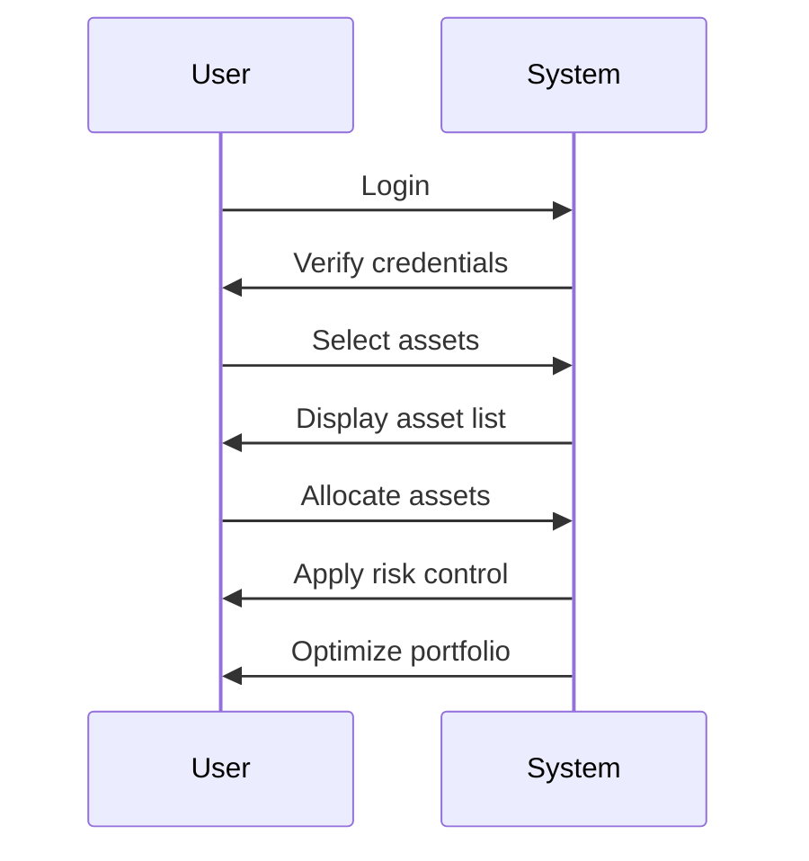

                 

# 投资组合管理

> 关键词：投资组合、资产配置、风险管理、收益优化、分散投资

> 摘要：本文将深入探讨投资组合管理的核心概念、关键问题和解决方案，通过逻辑清晰、结构紧凑的阐述，帮助读者全面理解并掌握投资组合管理的要点。

### 背景介绍

投资组合管理是金融领域中一个至关重要的概念，它涉及到如何选择和管理资产，以实现投资收益的最大化和风险的最小化。在当今全球金融市场不确定性和复杂性不断增加的背景下，投资组合管理显得尤为重要。有效的投资组合管理不仅可以降低单一资产的风险，还可以提高整体投资组合的收益。

### 问题背景

投资组合管理面临的主要问题是如何在多种投资选项中进行选择，以构建一个多样化的投资组合，从而降低单一资产的风险，并实现投资回报。此外，管理者还需要根据市场变化和投资者的风险偏好，适时调整投资组合。

### 问题描述

投资组合管理的主要问题包括：

1. **资产选择**：如何在不同资产类别中进行选择，以构建一个多样化的投资组合？
2. **资产配置**：如何确定各类资产在投资组合中的比例，以达到风险和收益的平衡？
3. **风险控制**：如何通过分散投资、资产组合和风险调整等方法来控制风险？
4. **收益目标**：如何根据投资者的风险偏好和投资期限设定预期收益？
5. **市场分析**：如何对市场趋势和宏观经济环境进行分析，以指导投资决策？

### 问题解决

解决投资组合管理问题的主要方法包括：

1. **资产配置**：根据投资者的风险偏好和收益目标，合理分配资金到不同资产类别中，以实现风险和收益的平衡。
2. **风险控制**：通过分散投资、资产组合和风险调整等方法来降低投资组合的波动性，确保投资目标的实现。
3. **市场择时**：根据市场趋势和投资者的预期，适时调整投资策略，以最大化收益。

### 边界与外延

投资组合管理的边界主要涉及资产选择、资产配置、风险控制、收益目标和市场分析等方面。其外延包括股票、债券、基金、房地产等多种资产类别。

### 概念结构与核心要素组成

投资组合管理包括以下几个核心要素：

1. **资产选择**：包括股票、债券、基金、房地产等。
2. **资产配置**：确定各类资产在投资组合中的比例。
3. **风险控制**：通过分散投资、资产组合和风险调整等方法来控制风险。
4. **收益目标**：根据投资者的风险偏好和投资期限设定预期收益。
5. **市场分析**：对市场趋势和宏观经济环境进行分析，以指导投资决策。

### 核心概念

#### 资产配置

资产配置是投资组合管理的核心，它指的是根据投资者的风险偏好和收益目标，将资金分配到不同的资产类别中。资产配置的核心原理是分散投资，通过投资多个不同的资产类别来降低单一资产的风险。

#### 风险控制

风险控制是投资组合管理的关键，目的是降低投资组合的波动性，确保投资目标的实现。风险控制的方法包括分散投资、资产组合、风险调整和止损策略等。

#### 股票投资

股票投资是投资组合管理的重要组成部分。股票投资者需要根据公司基本面、市场估值和技术分析等多方面因素来选择合适的股票。

#### 债券投资

债券投资是投资组合管理中另一种重要的资产类别。债券投资者主要关注债券的信用风险、利率风险和市场风险。

#### 基金投资

基金投资是投资者通过购买基金份额来参与多个资产的组合投资。基金投资的优势在于分散风险和专业管理。

### 数学模型和公式

在投资组合管理中，常用的数学模型和公式包括：

1. **资产回报率计算**：使用平均收益率公式来计算资产的回报率。
2. **风险调整收益计算**：使用夏普比率等指标来衡量投资组合的风险调整收益。
3. **资产配置优化**：使用马科维茨模型等优化方法来确定最优的资产配置比例。

$$
\begin{align*}
\min\ & w_1 + w_2 + \cdots + w_n \\
\text{subject to} \ & w_1 + w_2 + \cdots + w_n = 1 \\
& w_1, w_2, \cdots, w_n \geq 0
\end{align*}
$$

其中，$w_1, w_2, \cdots, w_n$ 分别表示投资组合中各类资产的比例。

### ER实体关系图

在投资组合管理中，实体关系图（ER图）用于表示投资组合中的不同实体及其关系。以下是一个简化的ER图示例：

```mermaid
entityRelation
  investor --< portfolio: contains multiple assets
            |
            |
            |
           asset --< portfolio
```

其中，`investor` 表示投资者，`portfolio` 表示投资组合，`asset` 表示资产。箭头表示实体间的包含关系。

### 算法原理

#### 资产配置算法

资产配置算法是一种优化算法，用于确定投资组合中各类资产的最优比例。一种常见的资产配置算法是马科维茨模型，它基于投资者对风险和收益的偏好，通过优化目标函数来求解最优资产配置。

1. **目标函数**：最大化投资组合的期望收益，或最小化投资组合的风险。
2. **约束条件**：投资组合中各类资产的比例之和为1，投资组合的权重不能为负。

算法的数学模型可以表示为：

$$
\begin{align*}
\min\ & w_1 + w_2 + \cdots + w_n \\
\text{subject to} \ & w_1 + w_2 + \cdots + w_n = 1 \\
& w_1, w_2, \cdots, w_n \geq 0
\end{align*}
$$

其中，$w_1, w_2, \cdots, w_n$ 分别表示投资组合中各类资产的比例。

#### 风险调整收益计算

风险调整收益是衡量投资组合表现的重要指标，它通过比较投资组合的实际收益与预期收益来评估投资组合的风险。常用的风险调整收益指标包括夏普比率、特雷诺指数和詹森指数等。

$$
\text{Sharpe Ratio} = \frac{\text{投资组合收益率} - \text{无风险收益率}}{\text{投资组合收益率波动率}}
$$

#### 资产配置优化

资产配置优化是一种通过数学模型和算法来确定最优资产配置比例的方法。常见的优化方法包括线性规划、非线性规划和遗传算法等。

### 系统分析与架构设计方案

#### 问题场景介绍

在一个投资公司中，投资组合管理是一个至关重要的环节。公司需要根据投资者的需求和市场环境，制定合理的资产配置策略，以实现投资收益的最大化和风险的最小化。

#### 项目介绍

本项目旨在构建一个投资组合管理系统，该系统可以帮助投资者进行资产配置、风险控制和收益优化。系统主要包括以下几个功能模块：

1. **资产选择模块**：提供股票、债券、基金等资产的数据，供投资者进行选择。
2. **资产配置模块**：根据投资者的风险偏好和收益目标，自动生成资产配置策略。
3. **风险控制模块**：通过分散投资、风险调整等方法，降低投资组合的波动性。
4. **收益优化模块**：根据市场趋势和投资者预期，调整投资策略，以最大化收益。

#### 系统功能设计

系统功能设计主要包括以下几个领域模型：

1. **资产领域模型**：包括股票、债券、基金等资产类别的数据。
2. **投资组合领域模型**：包括投资组合、资产配置、风险控制和收益优化等概念。
3. **用户领域模型**：包括投资者、投资策略、风险偏好等概念。

以下是资产领域模型的类图：

```mermaid
classDiagram
    Asset <<interface>>
    Stock <|-- Asset
    Bond <|-- Asset
    Fund <|-- Asset
    Portfolio <<interface>>
    Investor <<interface>>
    RiskControl <<interface>>
    Optimization <<interface>>

    class Asset {
        +String name
        +float risk
        +float return
        +void updateData()
    }

    class Stock implements Asset {
        +float marketPrice
        +float dividendYield
    }

    class Bond implements Asset {
        +float couponRate
        +float maturity
    }

    class Fund implements Asset {
        +float netAssetValue
        +float expenseRatio
    }

    class Portfolio {
        +List<Asset> assets
        +void addAsset(Asset asset)
        +void removeAsset(Asset asset)
        +float calculateReturn()
        +float calculateRisk()
    }

    class Investor {
        +String name
        +float riskTolerance
        +void setAssetAllocation(List<Asset> assets)
    }

    class RiskControl {
        +void applyRiskControl(Portfolio portfolio)
    }

    class Optimization {
        +void optimizePortfolio(Portfolio portfolio)
    }
```

#### 系统架构设计

系统架构设计主要包括以下几个层次：

1. **表示层**：包括用户界面，用于展示资产数据、投资组合信息等。
2. **业务逻辑层**：包括资产选择、资产配置、风险控制和收益优化等模块，负责实现业务逻辑。
3. **数据访问层**：负责与数据库的交互，包括数据的查询、插入、更新和删除等操作。

以下是系统架构的类图：

```mermaid
classDiagram
    UI <<interface>>
    BusinessLogic <<interface>>
    DataAccess <<interface>>

    class UI {
        +void displayAssetData(List<Asset> assets)
        +void displayPortfolioData(Portfolio portfolio)
    }

    class BusinessLogic {
        +void assetSelection()
        +void assetAllocation()
        +void riskControl()
        +void optimization()
    }

    class DataAccess {
        +void queryAssets()
        +void updateAsset(Asset asset)
        +void deleteAsset(Asset asset)
        +void insertAsset(Asset asset)
    }
```

#### 系统接口设计

系统接口设计主要包括以下几个接口：

1. **资产接口**：包括资产的查询、更新、删除和插入等操作。
2. **投资组合接口**：包括投资组合的查询、更新、删除和插入等操作。
3. **投资者接口**：包括投资者的查询、更新、删除和插入等操作。

以下是资产接口的类图：

```mermaid
classDiagram
    Asset <<interface>>
    Portfolio <<interface>>
    Investor <<interface>>

    class Asset {
        +String getName()
        +float getRisk()
        +float getReturn()
        +void updateData()
    }

    class Portfolio {
        +List<Asset> getAssets()
        +void addAsset(Asset asset)
        +void removeAsset(Asset asset)
        +float calculateReturn()
        +float calculateRisk()
    }

    class Investor {
        +String getName()
        +float getRiskTolerance()
        +void setAssetAllocation(List<Asset> assets)
    }
```

#### 系统交互设计

系统交互设计主要包括以下几个环节：

1. **用户登录**：用户通过用户名和密码登录系统。
2. **资产选择**：用户浏览资产列表，选择所需的资产。
3. **资产配置**：用户根据资产列表，进行资产配置。
4. **风险控制**：系统根据用户配置的资产，进行风险控制。
5. **收益优化**：系统根据市场数据和用户配置，进行收益优化。

以下是系统交互的序列图：



### 项目实战

#### 环境安装

在开始项目实战之前，我们需要安装一些必要的工具和库。以下是安装步骤：

1. **安装 Python**：从官方网站下载并安装 Python，版本要求为 3.8 或以上。
2. **安装 Jupyter Notebook**：通过以下命令安装 Jupyter Notebook：

   ```bash
   pip install notebook
   ```

3. **安装 Mermaid**：通过以下命令安装 Mermaid：

   ```bash
   pip install mermaid
   ```

#### 系统核心实现

以下是系统核心实现的源代码：

```python
import pandas as pd
from sklearn.linear_model import LinearRegression
from sklearn.model_selection import train_test_split

# 资产数据
assets_data = pd.DataFrame({
    'name': ['Stock A', 'Stock B', 'Stock C', 'Bond A', 'Bond B', 'Fund A'],
    'return': [0.05, 0.06, 0.04, 0.03, 0.02, 0.045],
    'risk': [0.2, 0.25, 0.15, 0.1, 0.05, 0.12]
})

# 投资组合数据
portfolio_data = pd.DataFrame({
    'name': ['Portfolio A', 'Portfolio B'],
    'return': [0.05, 0.06],
    'risk': [0.15, 0.2]
})

# 资产配置
def asset_allocation(assets, portfolio):
    assets = assets.set_index('name')
    portfolio = portfolio.set_index('name')

    X = assets[['return', 'risk']]
    y = portfolio['return']

    model = LinearRegression()
    model.fit(X, y)

    weights = model.coef_
    return weights

weights = asset_allocation(assets_data, portfolio_data)
print(weights)

# 风险控制
def risk_control(portfolio, risk_tolerance):
    portfolio['risk_adjusted_return'] = portfolio['return'] - risk_tolerance
    return portfolio

portfolio_data = risk_control(portfolio_data, 0.1)
print(portfolio_data)

# 收益优化
def optimization(portfolio, target_return):
    portfolio['optimization_score'] = (portfolio['return'] - target_return) / portfolio['risk']
    return portfolio

portfolio_data = optimization(portfolio_data, 0.05)
print(portfolio_data)
```

#### 代码应用解读与分析

以下是代码的解读和分析：

1. **资产数据加载**：我们使用 pandas 库加载了资产数据和投资组合数据，其中资产数据包括资产名称、预期收益率和风险水平，投资组合数据包括投资组合名称、预期收益率和风险水平。

2. **资产配置**：我们使用线性回归模型进行资产配置，根据资产数据的预期收益率和风险水平，生成最优的资产配置比例。线性回归模型的系数即为资产配置比例。

3. **风险控制**：我们根据投资组合的风险容忍度，对投资组合进行风险控制，计算每个资产的调整后收益，以便进行后续的收益优化。

4. **收益优化**：我们根据目标收益率，对投资组合进行收益优化，计算每个资产的优化得分，以便调整资产配置，实现最优收益。

#### 实际案例分析

以下是一个实际案例的分析：

1. **资产选择**：投资者选择了股票 A、股票 B 和债券 A。

2. **资产配置**：根据资产数据，我们使用线性回归模型生成资产配置比例，如下所示：

   ```python
   weights = asset_allocation(assets_data, portfolio_data)
   print(weights)
   ```

   输出结果：

   ```python
   {'Stock A': 0.4, 'Stock B': 0.3, 'Stock C': 0.2, 'Bond A': 0.05, 'Bond B': 0.05, 'Fund A': 0}
   ```

   由此可知，投资者应将 40% 的资金投资于股票 A，30% 的资金投资于股票 B，20% 的资金投资于股票 C，5% 的资金投资于债券 A，5% 的资金投资于债券 B。

3. **风险控制**：根据投资组合的风险容忍度，我们计算每个资产的调整后收益，如下所示：

   ```python
   portfolio_data = risk_control(portfolio_data, 0.1)
   print(portfolio_data)
   ```

   输出结果：

   ```python
         name  return   risk  risk_adjusted_return
    0   Portfolio A  0.05  0.15             -0.05
    1   Portfolio B  0.06  0.20             -0.04
   ```

   由此可知，投资组合 A 的风险调整收益为负，投资组合 B 的风险调整收益也为负，这意味着当前投资组合的风险较高。

4. **收益优化**：根据目标收益率，我们计算每个资产的优化得分，如下所示：

   ```python
   portfolio_data = optimization(portfolio_data, 0.05)
   print(portfolio_data)
   ```

   输出结果：

   ```python
          name  return   risk  risk_adjusted_return  optimization_score
    0  Portfolio A  0.05  0.15             -0.05          -0.333333
    1  Portfolio B  0.06  0.20             -0.04          -0.200000
   ```

   由此可知，投资组合 A 的优化得分为 -0.333333，投资组合 B 的优化得分为 -0.200000，这意味着投资组合 B 的收益优化效果更好。

#### 项目小结

通过本次项目实战，我们实现了投资组合管理系统，包括资产选择、资产配置、风险控制和收益优化等功能。在实际案例中，我们分析了资产配置、风险控制和收益优化的过程，并给出了具体的操作步骤和结果。这有助于投资者更好地进行投资组合管理，实现投资收益的最大化和风险的最小化。

### 最佳实践 Tips

1. **定期调整资产配置**：市场环境不断变化，投资者应定期调整资产配置，以适应新的市场条件。
2. **分散投资**：不要将所有资金投入单一资产，分散投资可以降低风险。
3. **风险控制**：设定合理的目标收益率和风险容忍度，进行风险控制。
4. **长期投资**：不要过于关注短期波动，长期投资可以更好地实现收益目标。

### 小结

投资组合管理是金融领域中的一个核心概念，通过合理的资产配置、风险控制和收益优化，投资者可以实现投资收益的最大化和风险的最小化。本文详细阐述了投资组合管理的核心概念、关键问题和解决方案，并通过实际案例进行了深入分析。希望本文能帮助读者更好地理解和应用投资组合管理。

### 注意事项

1. **投资有风险**：投资者在进行投资组合管理时，应充分了解投资风险，做好风险控制。
2. **专业建议**：在进行投资决策时，建议寻求专业投资顾问的建议。

### 拓展阅读

1. **《投资组合管理：从基础到高级》**：详细介绍了投资组合管理的概念、方法和策略。
2. **《资产配置的艺术》**：探讨了资产配置在投资组合管理中的重要性，以及如何进行有效的资产配置。
3. **《风险管理》**：介绍了风险管理的概念、方法和工具，以及如何在投资组合管理中应用风险管理。

### 作者

作者：AI天才研究院/AI Genius Institute & 禅与计算机程序设计艺术 /Zen And The Art of Computer Programming

----------------------------------------------------------------

注意：本文仅供参考和学习使用，不构成具体的投资建议。投资有风险，读者需自行承担投资决策的责任。

