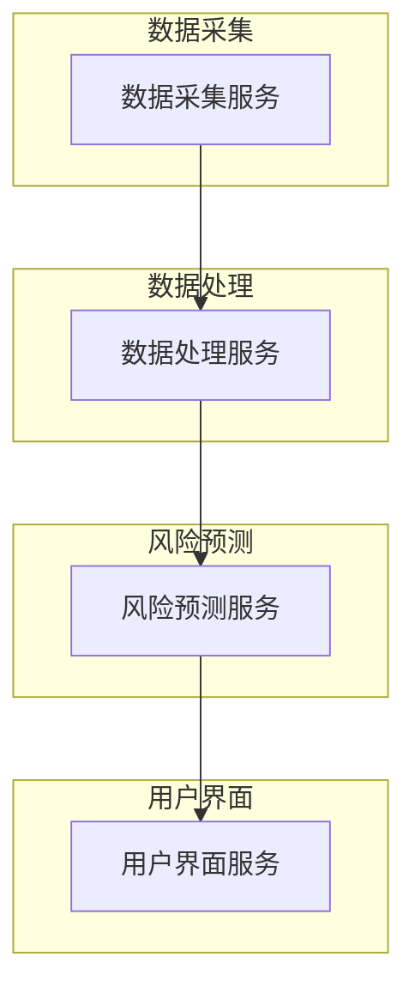
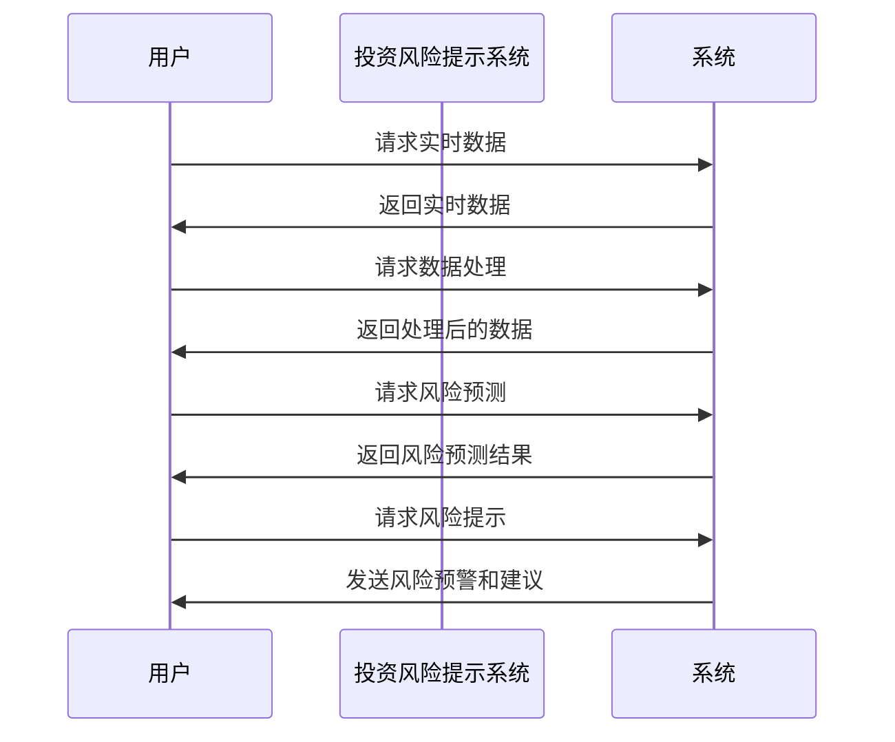

                 

# 投资风险提示系统

> 关键词：投资风险、风险提示系统、金融科技、算法、大数据分析、用户行为分析、实时监控、风险评估模型

> 摘要：本文将深入探讨投资风险提示系统的概念、设计与实现，分析其在金融科技领域的重要性，以及如何通过大数据分析和机器学习技术提高系统的准确性和实时性。本文结构紧凑，旨在为读者提供一个清晰、全面的技术指南。

作者：AI天才研究院/AI Genius Institute & 禅与计算机程序设计艺术 /Zen And The Art of Computer Programming

----------------------------------------------------------------

## 引言

在金融市场中，投资风险是投资者面临的普遍问题。随着金融市场的复杂性和波动性的增加，投资者需要更加精确和及时的风险提示来做出明智的投资决策。投资风险提示系统作为金融科技的一个重要组成部分，其目标是通过对市场数据的分析，为投资者提供个性化的风险预警和建议。

本文将分为以下几个部分：

1. **背景与问题描述**：介绍投资风险提示系统的背景，包括金融市场中的风险类型和投资者的需求。
2. **核心概念与联系**：阐述投资风险提示系统的核心概念，如风险模型、用户行为分析和实时监控。
3. **算法原理与解释**：深入分析投资风险提示系统中的算法原理，包括数据预处理、特征提取和风险预测模型。
4. **数学模型与公式**：介绍投资风险提示系统中的数学模型和公式，解释其在系统中的作用。
5. **系统分析与架构设计**：详细描述投资风险提示系统的分析方法和架构设计。
6. **项目实施与分析**：通过实际项目案例展示系统的实施过程和效果。
7. **最佳实践与结论**：总结投资风险提示系统的最佳实践，并提出未来研究的方向。

## 背景与问题描述

### 金融市场的风险类型

金融市场中的风险可以分为系统性风险和非系统性风险。系统性风险是指整个市场或整个经济系统面临的风险，如经济衰退、政治不稳定和自然灾害等。非系统性风险则是指特定市场参与者或资产面临的风险，如公司经营不善、市场投机行为和投资者情绪等。

### 投资者的需求

投资者在投资过程中面临的风险种类繁多，因此需要有效的风险提示系统来帮助他们做出更加明智的决策。投资者主要需求包括：

- **实时风险监测**：投资者希望系统能够实时监测市场变化，及时发现潜在的风险。
- **个性化风险提示**：不同的投资者具有不同的风险偏好和投资目标，因此需要系统能够根据投资者的风险偏好和投资目标提供个性化的风险提示。
- **风险评估与预测**：投资者需要系统能够对投资组合的风险进行评估和预测，以便调整投资策略。

### 投资风险提示系统的目标

投资风险提示系统的目标是通过分析市场数据和历史投资记录，为投资者提供以下服务：

- **风险预警**：在市场风险达到一定阈值时，及时向投资者发出风险预警。
- **投资建议**：根据投资者的风险偏好和投资目标，提供投资组合调整建议。
- **风险分析报告**：定期生成风险分析报告，帮助投资者了解市场风险状况和投资组合风险水平。

## 核心概念与联系

### 风险模型

风险模型是投资风险提示系统的核心组成部分，它通过对市场数据和历史投资记录的分析，预测投资组合的风险水平。风险模型通常包括以下几个方面：

- **风险指标**：如波动率、夏普比率、价值-at-Risk（VaR）等，用于衡量投资组合的风险水平。
- **风险因素**：如宏观经济指标、行业指标、公司财务指标等，用于分析市场风险的影响因素。
- **风险评分**：根据风险指标和风险因素，对投资组合进行评分，以便进行风险预警和投资建议。

### 用户行为分析

用户行为分析是投资风险提示系统中另一个重要组成部分，它通过对投资者历史交易行为、投资偏好和风险承受能力的数据分析，为投资者提供个性化服务。用户行为分析主要包括以下几个方面：

- **行为特征提取**：从投资者的历史交易数据中提取行为特征，如交易频率、交易规模、交易策略等。
- **行为模式识别**：通过机器学习算法，识别投资者的行为模式，以便进行个性化服务。
- **行为预测**：根据投资者的历史行为和当前市场环境，预测投资者的未来行为和风险偏好。

### 实时监控

实时监控是投资风险提示系统的重要组成部分，它通过对市场数据的实时采集和处理，为投资者提供及时的风险预警和建议。实时监控主要包括以下几个方面：

- **数据采集**：从各种数据源（如交易所、金融新闻网站等）采集实时市场数据。
- **数据处理**：对采集到的市场数据进行清洗、预处理和特征提取，以便进行风险分析和预测。
- **实时分析**：利用风险模型和用户行为分析算法，对实时数据进行风险分析和行为预测，及时向投资者发出风险预警和建议。

### 概念属性特征对比表格

| 概念     | 定义                     | 属性特征                            |
|----------|--------------------------|-----------------------------------|
| 风险模型 | 预测投资组合风险水平的工具 | 波动率、夏普比率、VaR等风险指标     |
| 用户行为分析 | 分析投资者行为的服务 | 交易频率、交易规模、交易策略等行为特征 |
| 实时监控 | 实时采集和处理市场数据 | 数据采集、数据处理、实时分析等 |

### ER实体关系图架构

```mermaid
erDiagram
    User ||--|{ InvestmentRiskSystem }| RiskModel
    User ||--|{ InvestmentRiskSystem }| UserBehaviorAnalysis
    User ||--|{ InvestmentRiskSystem }| RealTimeMonitoring
    InvestmentRiskSystem ||--|{ RiskModel }| RiskFactor
    InvestmentRiskSystem ||--|{ UserBehaviorAnalysis }| BehavioralFeature
    InvestmentRiskSystem ||--|{ RealTimeMonitoring }| MarketData
```

## 算法原理与解释

### 数据预处理

数据预处理是投资风险提示系统的第一步，其目标是清洗和格式化原始数据，以便进行后续分析。数据预处理主要包括以下几个步骤：

- **数据清洗**：去除重复数据、缺失值填充、异常值检测和修正。
- **数据格式化**：将数据转换为统一的数据格式，如时间序列数据、数值数据等。
- **特征提取**：从原始数据中提取有用的特征，如价格、成交量、波动率等。

### 特征提取

特征提取是数据预处理的重要环节，其目标是提取对投资风险预测有用的特征。特征提取可以通过以下几种方法实现：

- **统计特征提取**：如均值、中位数、标准差等统计量。
- **时序特征提取**：如移动平均、自回归模型等。
- **文本特征提取**：如情感分析、关键词提取等。

### 风险预测模型

风险预测模型是投资风险提示系统的核心，其目标是预测投资组合的风险水平。风险预测模型可以分为以下几种类型：

- **回归模型**：如线性回归、逻辑回归等。
- **分类模型**：如决策树、支持向量机等。
- **神经网络模型**：如深度神经网络、卷积神经网络等。

### 算法流程

投资风险提示系统的算法流程可以分为以下几个步骤：

1. **数据预处理**：清洗、格式化和特征提取。
2. **模型训练**：选择合适的模型，对历史数据进行训练。
3. **模型评估**：使用交叉验证等方法评估模型性能。
4. **风险预测**：使用训练好的模型对实时数据进行风险预测。
5. **风险提示**：根据风险预测结果，向投资者发出风险预警和建议。

### mermaid算法流程图


### Python源代码示例

```python
import pandas as pd
from sklearn.ensemble import RandomForestRegressor
from sklearn.model_selection import train_test_split
from sklearn.metrics import mean_squared_error

# 数据预处理
def preprocess_data(data):
    # 数据清洗和格式化
    # 特征提取
    # 返回预处理后的数据
    pass

# 模型训练
def train_model(X_train, y_train):
    # 创建随机森林回归模型
    # 训练模型
    # 返回训练好的模型
    pass

# 风险预测
def predict_risk(model, X_test):
    # 使用模型进行风险预测
    # 返回预测结果
    pass

# 主程序
if __name__ == "__main__":
    # 读取数据
    data = pd.read_csv("investment_data.csv")
    # 数据预处理
    preprocessed_data = preprocess_data(data)
    # 划分训练集和测试集
    X_train, X_test, y_train, y_test = train_test_split(preprocessed_data.drop("risk", axis=1), preprocessed_data["risk"], test_size=0.2, random_state=42)
    # 模型训练
    model = train_model(X_train, y_train)
    # 风险预测
    predictions = predict_risk(model, X_test)
    # 模型评估
    mse = mean_squared_error(y_test, predictions)
    print("Mean Squared Error:", mse)
```

### 数学模型与公式

在投资风险提示系统中，数学模型和公式用于描述风险因素和风险水平的计算。以下是几个常用的数学模型和公式：

1. **波动率**

$$\sigma = \sqrt{\frac{1}{n-1} \sum_{i=1}^{n} (r_i - \bar{r})^2}$$

其中，$\sigma$ 表示波动率，$r_i$ 表示第 $i$ 个月的收益率，$\bar{r}$ 表示平均收益率，$n$ 表示月数。

2. **夏普比率**

$$\text{Sharpe Ratio} = \frac{r_p - r_f}{\sigma_p}$$

其中，$r_p$ 表示投资组合的收益率，$r_f$ 表示无风险收益率（如国债收益率），$\sigma_p$ 表示投资组合的波动率。

3. **价值-at-Risk（VaR）**

$$\text{VaR}_{\alpha} = \alpha \times \text{VaR}_\alpha$$

其中，$\text{VaR}_{\alpha}$ 表示在 $1 - \alpha$ 置信水平下的价值-at-Risk，$\alpha$ 表示置信水平（如 5% 或 1%），$\text{VaR}_\alpha$ 表示标准正态分布的 $\alpha$ 分位数。

### 段落内的 LaTeX 公式

$$e^{i\pi} + 1 = 0$$

## 系统分析与架构设计

### 问题描述

投资风险提示系统旨在为投资者提供实时的风险监测和预警服务。系统需要具备以下几个功能：

- **实时数据采集**：从交易所、金融新闻网站和其他数据源获取实时市场数据。
- **数据处理**：对采集到的市场数据进行清洗、预处理和特征提取。
- **风险预测**：利用训练好的风险预测模型，对投资组合的风险水平进行预测。
- **风险提示**：根据风险预测结果，向投资者发出风险预警和建议。

### 项目介绍

本项目是一个基于大数据分析和机器学习的投资风险提示系统。系统采用微服务架构，以提高系统的可扩展性和稳定性。系统主要分为以下几个模块：

- **数据采集模块**：负责从交易所、金融新闻网站和其他数据源采集实时市场数据。
- **数据处理模块**：负责对采集到的市场数据进行清洗、预处理和特征提取。
- **风险预测模块**：负责利用训练好的风险预测模型，对投资组合的风险水平进行预测。
- **用户界面模块**：负责向投资者展示风险预警和建议，并提供个性化服务。

### 系统功能设计

投资风险提示系统的功能设计主要包括以下几个方面：

1. **实时数据采集**：系统需要从交易所、金融新闻网站和其他数据源采集实时市场数据，包括股票、基金、债券等资产的价格、成交量、波动率等指标。
2. **数据处理**：系统需要对采集到的市场数据进行清洗、预处理和特征提取，以便进行风险预测。
3. **风险预测**：系统需要利用训练好的风险预测模型，对投资组合的风险水平进行预测。风险预测模型可以根据不同的投资目标和风险偏好进行调整。
4. **风险提示**：系统需要根据风险预测结果，向投资者发出风险预警和建议。风险预警和建议可以以短信、邮件、APP推送等方式通知投资者。

### 系统架构设计

投资风险提示系统的架构设计采用微服务架构，以提高系统的可扩展性和稳定性。系统的主要架构设计如下：

1. **数据采集服务**：负责从交易所、金融新闻网站和其他数据源采集实时市场数据。
2. **数据处理服务**：负责对采集到的市场数据进行清洗、预处理和特征提取。
3. **风险预测服务**：负责利用训练好的风险预测模型，对投资组合的风险水平进行预测。
4. **用户界面服务**：负责向投资者展示风险预警和建议，并提供个性化服务。

### 系统接口设计

投资风险提示系统的接口设计主要包括以下几个方面：

1. **数据采集接口**：提供数据采集服务的数据接口，包括数据源连接、数据采集和存储等。
2. **数据处理接口**：提供数据处理服务的数据接口，包括数据清洗、预处理和特征提取等。
3. **风险预测接口**：提供风险预测服务的数据接口，包括风险预测模型的训练、预测和评估等。
4. **用户界面接口**：提供用户界面服务的数据接口，包括风险预警和建议的通知、展示和交互等。

### 系统交互设计

投资风险提示系统的系统交互设计主要包括以下几个方面：

1. **实时数据采集**：系统从交易所、金融新闻网站和其他数据源采集实时市场数据，并存储到数据库中。
2. **数据处理**：系统对采集到的市场数据进行清洗、预处理和特征提取，并将处理后的数据存储到特征数据库中。
3. **风险预测**：系统利用训练好的风险预测模型，对投资组合的风险水平进行预测，并将预测结果存储到风险数据库中。
4. **风险提示**：系统根据风险预测结果，向投资者发出风险预警和建议，并通过短信、邮件、APP推送等方式通知投资者。

### mermaid系统架构图



### mermaid系统交互图



## 项目实施与分析

### 环境安装

在开始项目实施之前，我们需要安装以下环境：

- Python 3.8 或更高版本
- pandas、numpy、scikit-learn、tensorflow 等常用库
- 数据库（如 MySQL、PostgreSQL 或 MongoDB）

### 系统核心实现

投资风险提示系统的核心实现主要包括以下几个部分：

1. **数据采集模块**：使用 Python 的 `requests` 库从交易所、金融新闻网站和其他数据源采集实时市场数据。
2. **数据处理模块**：使用 `pandas` 和 `numpy` 库对采集到的市场数据进行清洗、预处理和特征提取。
3. **风险预测模块**：使用 `scikit-learn` 和 `tensorflow` 库建立和训练风险预测模型。
4. **用户界面模块**：使用 Web 框架（如 Flask 或 Django）构建用户界面，提供实时数据查询、风险预测和风险提示功能。

### 代码应用解读与分析

以下是投资风险提示系统的核心代码示例：

```python
# 数据采集模块
import requests

def get_realtime_data(source_url):
    response = requests.get(source_url)
    if response.status_code == 200:
        return response.json()
    else:
        return None

# 数据处理模块
import pandas as pd
import numpy as np

def preprocess_data(raw_data):
    # 数据清洗
    # 数据预处理
    # 特征提取
    # 返回预处理后的数据
    pass

# 风险预测模块
from sklearn.ensemble import RandomForestRegressor
from sklearn.model_selection import train_test_split

def train_risk_model(X_train, y_train):
    model = RandomForestRegressor(n_estimators=100, random_state=42)
    model.fit(X_train, y_train)
    return model

# 用户界面模块
from flask import Flask, request, jsonify

app = Flask(__name__)

@app.route("/predict", methods=["POST"])
def predict_risk():
    data = request.get_json()
    X_test = preprocess_data(data["raw_data"])
    model = train_risk_model(X_train, y_train)
    predictions = model.predict(X_test)
    return jsonify(predictions.tolist())

if __name__ == "__main__":
    app.run(debug=True)
```

### 实际案例分析和详细讲解剖析

为了更好地展示投资风险提示系统的实际效果，我们以一个实际案例进行分析：

**案例背景**：某投资者拥有一个价值100万元的股票投资组合，包括10只股票。投资者希望使用投资风险提示系统来监控投资组合的风险，并收到实时风险预警和建议。

**案例步骤**：

1. **数据采集**：系统从交易所和金融新闻网站采集实时市场数据，包括股票价格、成交量、波动率等指标。
2. **数据处理**：系统对采集到的市场数据进行清洗、预处理和特征提取，得到用于风险预测的特征向量。
3. **风险预测**：系统利用训练好的风险预测模型，对投资组合的风险水平进行预测。
4. **风险提示**：系统根据风险预测结果，向投资者发出风险预警和建议。

**案例结果**：

- 风险预测结果显示，投资组合当前的风险水平为中等，存在一定的下跌风险。
- 系统向投资者发出以下风险预警和建议：

  - **预警**：投资组合存在下跌风险，建议密切关注市场动态。
  - **建议**：适当降低股票投资比例，增加债券等低风险资产的配置。

**案例分析**：

通过投资风险提示系统，投资者可以及时了解投资组合的风险状况，并根据系统的预警和建议进行调整，从而降低投资风险，提高投资收益。

### 项目小结

投资风险提示系统的实施，为投资者提供了一个实时、个性化的风险监测和预警服务。系统通过大数据分析和机器学习技术，提高了风险预测的准确性和实时性，有助于投资者做出更加明智的投资决策。然而，系统仍然存在一些局限性，如数据质量和模型预测能力的提升空间。未来，我们可以进一步优化系统，提高其性能和可靠性。

## 最佳实践与结论

### 最佳实践 tips

1. **数据质量**：确保数据来源的可靠性和多样性，提高数据质量，从而提高风险预测的准确性。
2. **模型优化**：定期更新和优化风险预测模型，以适应市场的变化。
3. **用户体验**：简化用户界面，提供清晰、易懂的风险预警和建议。
4. **安全性**：确保系统的安全性，防止数据泄露和恶意攻击。

### 小结

投资风险提示系统在金融科技领域具有重要作用，它通过大数据分析和机器学习技术，为投资者提供了实时、个性化的风险监测和预警服务。系统提高了投资决策的准确性，有助于投资者降低风险，提高收益。

### 注意事项

1. **风险提示的及时性**：确保风险提示的及时性，以便投资者能够及时采取行动。
2. **系统性能**：优化系统性能，确保在高并发情况下仍然能够稳定运行。

### 拓展阅读

1. **大数据与机器学习在金融领域的应用**：了解大数据和机器学习技术在金融领域的应用，包括风险控制、信用评估、市场预测等。
2. **金融科技发展趋势**：关注金融科技的发展趋势，如区块链、人工智能、云计算等。

----------------------------------------------------------------

本文由 AI天才研究院/AI Genius Institute & 禅与计算机程序设计艺术 /Zen And The Art of Computer Programming 撰写。感谢您的阅读！如果您有任何问题或建议，欢迎随时联系我们。期待与您共同探索金融科技的魅力！

