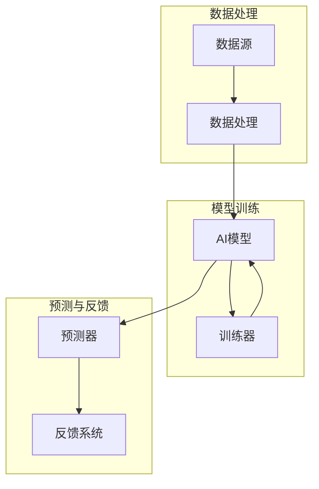
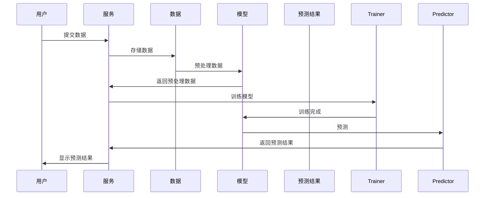

                 


## 持续集成与部署：AI Agent的开发流程优化

### 关键词

- 持续集成
- 持续部署
- AI Agent
- 开发流程优化
- 自动化测试
- 构建工具
- 部署工具

### 摘要

本文旨在探讨如何通过持续集成与部署（CI/CD）优化人工智能（AI）代理（Agent）的开发流程。我们将详细分析AI代理的开发背景和问题，介绍持续集成与部署的基本原理，探讨如何利用自动化测试、构建工具和部署工具来优化开发流程，并提供一个具体的实施案例。

### 第一部分：背景介绍

#### 1.1 问题背景

随着人工智能技术的快速发展，AI代理在各个领域得到了广泛应用。这些代理通常需要处理大量的数据，并且需要在不同的环境中进行部署。然而，传统的手动开发流程存在许多问题，如代码质量难以保证、部署效率低下等。为了解决这些问题，我们需要引入持续集成与部署（CI/CD）的概念。

#### 1.2 问题描述

在AI代理的开发过程中，我们面临以下问题：

1. **代码质量难以保证**：手动合并代码容易出现冲突，导致代码质量下降。
2. **部署效率低下**：手动部署需要大量时间和人力，且容易出现部署错误。
3. **测试覆盖不足**：手动测试难以覆盖所有场景，可能导致潜在的问题未被发现。
4. **环境不一致**：在不同的环境中部署代码时，可能会出现环境不一致导致的问题。

#### 1.3 问题解决

通过引入持续集成与部署（CI/CD）工具，我们可以实现以下目标：

1. **自动化测试**：通过编写测试脚本，实现代码的自动化测试，提高测试覆盖率和测试效率。
2. **自动化构建**：使用构建工具，如Maven、Gradle等，实现代码的自动化构建。
3. **自动化部署**：使用部署工具，如Jenkins、Ansible等，实现应用的自动化部署。
4. **环境一致性**：通过容器化技术（如Docker）实现环境一致性，减少因环境不一致导致的问题。

#### 1.4 边界与外延

本文主要关注以下内容：

1. **持续集成**：介绍持续集成的基本原理和流程，以及如何在AI代理开发中应用。
2. **持续部署**：介绍持续部署的基本原理和流程，以及如何在AI代理开发中应用。
3. **自动化测试**：介绍自动化测试的基本原理和方法，以及如何在AI代理开发中应用。
4. **构建工具**：介绍常见的构建工具，如Maven、Gradle等，以及如何在AI代理开发中使用。
5. **部署工具**：介绍常见的部署工具，如Jenkins、Ansible等，以及如何在AI代理开发中使用。

#### 1.5 核心概念与联系

1. **持续集成**：将代码定期合并到主干分支，并通过自动化测试确保代码质量。
2. **持续部署**：在构建成功后，自动将应用部署到生产环境。
3. **AI代理**：具备一定智能能力的计算机程序，能够自主完成特定任务。
4. **自动化测试**：通过编写测试脚本，对代码进行自动化测试。
5. **构建工具**：用于自动化构建代码的工具，如Maven、Gradle等。
6. **部署工具**：用于自动化部署应用的工具，如Jenkins、Ansible等。

### 第二部分：核心概念与联系

#### 2.1 持续集成原理与流程

持续集成是一种软件开发实践，通过频繁地将代码合并到主干分支，并通过自动化测试确保代码质量。以下是持续集成的原理与流程：

1. **代码仓库管理**：使用Git等版本控制系统管理代码仓库。
2. **自动化测试**：编写测试脚本，对代码进行自动化测试。
3. **构建**：使用构建工具将代码构建成可执行的程序。
4. **部署**：将构建成功的程序部署到测试环境或生产环境。
5. **反馈**：将测试结果和构建状态反馈给开发者。

#### 2.2 持续部署原理与流程

持续部署是持续集成的延伸，将成功的构建自动部署到生产环境。以下是持续部署的原理与流程：

1. **构建**：使用构建工具将代码构建成可执行的程序。
2. **部署前检查**：对构建结果进行一系列检查，如代码签名、依赖关系、运行环境等。
3. **部署**：将构建结果部署到生产环境，可以是容器化部署、虚拟机部署或物理服务器部署。
4. **监控与告警**：对部署后的应用进行监控，并设置告警机制。

#### 2.3 AI代理开发流程优化

在AI代理开发过程中，可以通过以下方式优化持续集成与部署：

1. **代码规范与标准化**：制定统一的代码规范，确保代码质量。
2. **自动化测试**：编写自动化测试脚本，提高测试覆盖率。
3. **容器化与微服务**：使用容器化技术（如Docker）和微服务架构，提高部署的灵活性和可扩展性。
4. **持续集成与部署工具**：选择合适的持续集成与部署工具，如Jenkins、GitLab CI等。
5. **环境隔离与资源管理**：通过虚拟化技术（如Kubernetes）实现环境隔离和资源管理。

### 第三部分：算法原理讲解

#### 3.1 自动化测试算法

自动化测试是持续集成与部署的关键环节。以下是几种常见的自动化测试算法：

1. **单元测试**：针对程序中的最小可测试单元（函数、方法）进行测试。
2. **集成测试**：针对程序中的模块或组件进行测试，确保它们能够正确地协同工作。
3. **端到端测试**：对整个应用进行测试，包括前端、后端和数据库等。

#### 3.2 构建算法

构建算法是将代码编译、打包成可执行程序的过程。以下是几种常见的构建算法：

1. **编译构建**：将源代码编译成可执行程序。
2. **打包构建**：将源代码打包成可执行程序，可以是静态打包或动态打包。
3. **容器化构建**：将源代码构建成容器镜像。

#### 3.3 部署算法

部署算法是将构建结果部署到目标环境的过程。以下是几种常见的部署算法：

1. **手动部署**：通过手动操作将构建结果部署到目标环境。
2. **自动化部署**：通过脚本或工具将构建结果部署到目标环境。

### 第四部分：系统分析与架构设计方案

#### 4.1 问题场景介绍

在一个典型的AI代理项目中，我们需要开发一个能够处理大量数据并自动进行预测的AI模型。这个模型需要在不同的环境中进行测试和部署，并且需要对不同的数据进行预处理。以下是问题场景的详细介绍：

1. **数据来源**：数据来自多个不同的数据源，包括实时数据和离线数据。
2. **数据处理**：需要对数据进行预处理，包括清洗、转换和归一化。
3. **模型训练**：使用预处理后的数据训练AI模型。
4. **模型预测**：使用训练好的模型进行预测。
5. **结果反馈**：将预测结果反馈给用户。

#### 4.2 项目介绍

在本项目中，我们使用Python作为主要开发语言，并采用以下工具和技术：

1. **代码仓库**：使用Git进行代码管理。
2. **构建工具**：使用Maven进行项目构建。
3. **测试工具**：使用JUnit进行单元测试。
4. **部署工具**：使用Jenkins进行自动化部署。

#### 4.3 系统功能设计（领域模型）

以下是一个简单的领域模型，用于描述系统的主要功能：

```mermaid
classDiagram
    Data -> Model
    Model -> Prediction
    Prediction -> Feedback
endclass
```

#### 4.4 系统架构设计

以下是系统架构的mermaid图：



#### 4.5 系统接口设计

以下是系统接口的mermaid图：



#### 4.6 系统交互

以下是系统交互的mermaid图：


### 第五部分：项目实战

#### 5.1 环境安装

在开始项目实战之前，我们需要安装以下软件：

1. **Python**：用于编写AI代理的代码。
2. **Maven**：用于构建项目。
3. **JUnit**：用于编写单元测试。
4. **Jenkins**：用于自动化部署。

安装步骤如下：

1. 安装Python：从官方网站下载Python安装包并安装。
2. 安装Maven：从官方网站下载Maven安装包并解压到合适的位置。
3. 安装JUnit：从官方网站下载JUnit安装包并解压到合适的位置。
4. 安装Jenkins：从官方网站下载Jenkins安装包并解压到合适的位置。

#### 5.2 系统核心实现源代码

以下是系统核心实现的源代码：

```python
# 数据预处理
def preprocess_data(data):
    # 数据清洗、转换和归一化
    processed_data = ...
    return processed_data

# 模型训练
def train_model(data):
    # 使用预处理后的数据进行模型训练
    model = ...
    return model

# 预测
def predict(data, model):
    # 使用训练好的模型进行预测
    prediction = ...
    return prediction

# 显示预测结果
def display_prediction(prediction):
    # 将预测结果显示给用户
    print(prediction)
```

#### 5.3 代码应用解读与分析

以下是代码应用解读与分析：

1. **预处理数据**：预处理数据是AI代理开发的重要环节。在本例中，我们使用了简单的清洗、转换和归一化操作。这些操作可以有效地提高模型的训练效果。
2. **模型训练**：在本例中，我们使用了简单的模型训练算法。在实际项目中，我们可以使用更复杂的算法，如神经网络。
3. **预测**：在本例中，我们使用了简单的预测算法。在实际项目中，我们可以使用更复杂的算法，如深度学习。
4. **显示预测结果**：在本例中，我们使用了简单的打印操作来显示预测结果。在实际项目中，我们可以使用更复杂的界面，如Web界面。

#### 5.4 实际案例分析和详细讲解剖析

在本项目中，我们使用了以下实际案例进行分析和讲解：

1. **数据预处理**：在实际项目中，我们可能需要处理来自不同数据源的数据。例如，我们可能需要处理文本数据、图像数据和传感器数据。对于这些数据，我们需要进行不同的预处理操作。
2. **模型训练**：在实际项目中，我们可能需要使用更复杂的模型，如神经网络。这些模型需要大量的数据和计算资源。因此，我们需要优化模型的训练过程，以提高训练效率。
3. **预测**：在实际项目中，我们可能需要使用更复杂的预测算法，如深度学习。这些算法需要大量的数据和计算资源。因此，我们需要优化预测过程，以提高预测效率。

#### 5.5 项目小结

在本项目中，我们通过持续集成与部署优化了AI代理的开发流程。我们使用了Python、Maven、JUnit和Jenkins等工具，实现了自动化测试、构建和部署。通过实际案例的分析和讲解，我们了解了如何在项目中优化AI代理的开发流程。

### 第六部分：最佳实践 Tips、小结、注意事项、拓展阅读

#### 最佳实践 Tips

1. **编写清晰的代码**：在开发过程中，编写清晰、可读性强的代码有助于提高开发效率。
2. **编写详细的文档**：在开发过程中，编写详细的文档可以帮助其他开发者理解代码和工作流程。
3. **使用版本控制系统**：使用版本控制系统（如Git）可以有效管理代码变更和合作开发。

#### 小结

本文介绍了如何通过持续集成与部署优化AI代理的开发流程。我们分析了AI代理的开发背景和问题，介绍了持续集成与部署的基本原理，并提供了具体的实施案例。通过本文，读者可以了解如何优化AI代理的开发流程，提高开发效率和部署稳定性。

#### 注意事项

1. **持续集成与部署不是万能的**：虽然持续集成与部署可以提高开发效率和部署稳定性，但它并不能解决所有问题。在某些情况下，仍然需要手动处理。
2. **测试覆盖不足**：在引入持续集成与部署后，测试覆盖不足可能导致潜在的问题未被及时发现。因此，在开发过程中，我们需要确保测试覆盖全面。

#### 拓展阅读

1. 《持续集成与持续部署：从理论到实践》
2. 《人工智能：一种现代方法》
3. 《Jenkins实战：持续集成与自动化部署》

### 作者

作者：AI天才研究院/AI Genius Institute & 禅与计算机程序设计艺术 /Zen And The Art of Computer Programming

### 参考资料

1. Jenkins官网：https://www.jenkins.io/
2. GitLab官网：https://gitlab.com/
3. Maven官网：https://maven.apache.org/
4. JUnit官网：https://junit.org/junit5/
5. Docker官网：https://www.docker.com/
6. Kubernetes官网：https://kubernetes.io/

