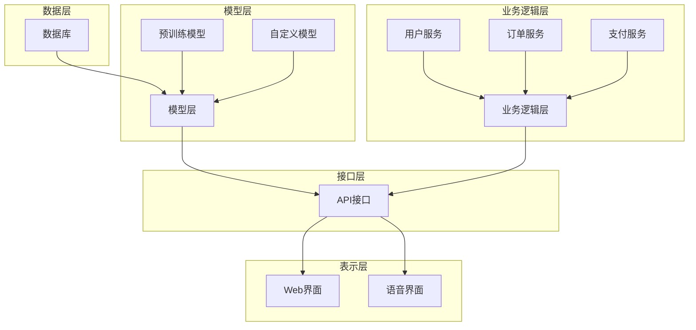

                 

### 提升客户服务质量：NLU技术的应用

**关键词：** 客户服务质量、自然语言理解（NLU）、人工智能、自然语言处理、客户服务自动化

**摘要：** 本文旨在探讨如何利用自然语言理解（NLU）技术提升客户服务质量。文章首先介绍了NLU技术的基本概念、发展历程以及其在客户服务中的应用现状。随后，文章深入解析了NLU技术的核心原理，包括语言模型和问答系统的设计、实现与数学模型。在此基础上，文章详细阐述了NLU技术在系统架构设计、项目实战以及最佳实践等方面的应用。最后，文章总结了NLU技术在提升客户服务质量方面的前景和挑战，为读者提供了进一步研究和应用的参考方向。

### 第一部分：背景介绍

#### 第1章：问题背景与NLU技术概述

在现代商业环境中，客户服务质量（Customer Service Quality，简称CSQ）成为企业竞争的重要指标。高质量的客户服务不仅能提升客户满意度，还能增加客户忠诚度和促进口碑传播。然而，随着客户需求的多样化和企业规模的扩大，传统的客户服务方式面临着巨大的挑战。一方面，企业需要处理海量的客户咨询和投诉，人力成本高昂且效率低下；另一方面，客户期望得到快速、准确和个性化的服务体验。

为了应对这些挑战，人工智能（Artificial Intelligence，简称AI）和自然语言处理（Natural Language Processing，简称NLP）技术得到了广泛关注。其中，自然语言理解（Natural Language Understanding，简称NLU）技术作为NLP的核心分支，正逐渐成为提升客户服务质量的重要工具。

NLU技术能够使计算机理解和处理人类语言，从而实现智能化的客户服务。通过NLU技术，企业可以自动化地处理客户咨询、提取关键信息、生成个性化回复等，大大提高服务效率和准确性。同时，NLU技术还能帮助企业更好地理解客户需求，提供个性化的服务体验，提升客户满意度。

本章将首先介绍客户服务质量的问题背景，分析NLU技术的概念与价值，回顾NLU技术的发展历程，探讨其在客户服务中的应用现状，并总结本章的主要内容。

#### 1.1 客户服务质量的问题背景

客户服务质量是衡量企业客户服务水平的重要指标，它直接关系到企业的竞争力、客户满意度和市场份额。高质量的客户服务不仅能帮助企业赢得客户，还能促进客户忠诚度和口碑传播。然而，随着客户需求的多样化和企业规模的扩大，传统的客户服务方式面临着诸多挑战：

1. **服务效率低下**：传统的人工客户服务依赖于客服人员，处理客户咨询和投诉的速度受到限制。在面对海量客户请求时，客服人员的响应速度往往无法满足客户期望，导致客户等待时间长、满意度低。

2. **人力成本高昂**：传统客户服务需要大量的人力资源，尤其是专业客服人员的招聘和培训成本较高。随着企业规模的扩大，人力资源的需求不断增加，给企业带来了沉重的财务负担。

3. **个性化服务不足**：传统客户服务往往无法满足客户个性化的需求。客户期望得到个性化的服务体验，例如针对特定问题的快速解答、个性化的推荐等。然而，传统客服模式难以实现这种个性化服务。

4. **数据利用率低**：传统客户服务模式中，客户的数据通常没有得到充分的应用。客户的历史咨询记录、偏好和需求等信息无法得到有效的分析和利用，导致客户服务缺乏针对性和有效性。

#### 1.2 NLU技术的概念与价值

自然语言理解（NLU）技术是自然语言处理（NLP）的一个分支，旨在使计算机理解和处理人类语言。NLU技术涉及多个方面，包括词法分析、句法分析、语义分析和语用分析等。通过NLU技术，计算机可以理解自然语言的含义、结构和上下文，从而实现与人类用户的自然交互。

NLU技术具有以下几个核心特点：

1. **语义理解**：NLU技术能够理解自然语言的语义，包括词汇的含义、句子的结构和语句的意图等。这使得计算机能够更好地理解客户的需求和问题，提供更准确的回答和解决方案。

2. **上下文感知**：NLU技术能够处理自然语言中的上下文信息，理解句子之间的关联和语境。这有助于计算机更好地理解客户的提问，提供更相关和个性化的服务。

3. **多语言支持**：NLU技术通常支持多种语言的语义理解，这使得企业能够为全球客户提供统一的客户服务。通过NLU技术，企业可以自动化地处理多语言客户咨询，提高服务效率和准确性。

NLU技术在客户服务中的应用价值体现在以下几个方面：

1. **自动化处理客户咨询**：NLU技术可以自动化地处理客户的咨询和投诉，提高服务效率。通过NLU技术，企业可以将客户的语音和文本咨询转换为机器可理解的格式，快速响应客户需求。

2. **个性化服务**：NLU技术能够根据客户的历史行为和偏好，提供个性化的服务体验。例如，通过分析客户的历史咨询记录，NLU技术可以为客户提供定制化的解决方案和建议。

3. **数据分析和洞察**：NLU技术可以帮助企业分析客户咨询数据，提取有价值的信息和洞察。这些数据可以帮助企业优化客户服务流程，提高服务质量。

4. **降低成本**：通过自动化处理客户咨询，NLU技术可以减少企业对人力资源的依赖，降低人力成本。同时，NLU技术可以提高客服人员的效率，减少冗余工作和重复劳动。

#### 1.3 NLU技术发展历程

NLU技术起源于自然语言处理（NLP）领域，其发展历程可以追溯到20世纪50年代末和60年代初。以下是NLU技术的主要发展阶段：

1. **早期探索（1950s-1960s）**：NLU技术的早期研究主要集中在词汇分析和句法分析。在这个阶段，研究人员试图通过规则和算法来解析自然语言的语法结构，但效果有限。

2. **统计方法兴起（1960s-1980s）**：随着计算机技术的进步和大量文本数据的出现，统计方法开始被广泛应用于NLU领域。概率模型和隐马尔可夫模型（HMM）等统计方法被用于语言建模和句法分析，取得了显著的进展。

3. **基于知识的表示方法（1980s-1990s）**：在这个阶段，研究人员开始关注语义理解和知识表示。基于知识的表示方法，如语义网络和知识图谱，被用于构建更复杂的语义分析模型。

4. **深度学习和神经网络（2000s-至今）**：深度学习和神经网络技术的兴起极大地推动了NLU技术的发展。深度神经网络（DNN）和卷积神经网络（CNN）等模型在语言建模和语义分析方面取得了突破性的成果。

5. **预训练和转移学习（2010s-至今）**：预训练和转移学习技术的发展使得NLU模型可以更好地泛化和适应不同的任务。例如，GPT和BERT等预训练模型在语言理解和生成任务上表现出了优异的性能。

#### 1.4 NLU技术在客户服务中的应用现状

随着NLU技术的不断发展和成熟，其在客户服务中的应用也日益广泛。以下是NLU技术在客户服务中的主要应用现状：

1. **智能客服系统**：智能客服系统（Intelligent Customer Service System）是基于NLU技术的客户服务解决方案。通过自然语言理解，智能客服系统能够自动地理解客户的咨询和投诉，提供实时、准确的回答和解决方案。智能客服系统广泛应用于电商、金融、电信等行业，大大提高了客户服务的效率和准确性。

2. **聊天机器人**：聊天机器人（Chatbot）是基于NLU技术的自动化对话系统，能够模拟人类的对话方式与客户进行交互。聊天机器人可以自动处理客户咨询、回答常见问题、引导用户进行操作等。许多企业已经部署了聊天机器人，以提供24/7的客户服务。

3. **语音助手**：语音助手（Voice Assistant）如Apple的Siri、Amazon的Alexa等，通过NLU技术实现了语音交互功能。用户可以通过语音指令与语音助手进行自然交互，获取信息、执行任务等。语音助手在智能家居、智能设备等领域得到了广泛应用。

4. **个性化推荐**：通过NLU技术，企业可以更好地理解客户的需求和偏好，提供个性化的推荐服务。例如，电商平台可以利用NLU技术分析客户的购物历史和搜索记录，为用户提供个性化的商品推荐。

5. **客户情感分析**：NLU技术可以用于分析客户的情感和情绪，帮助企业了解客户的满意度、情感状态等。通过情感分析，企业可以及时调整客户服务策略，提高客户满意度。

#### 1.5 本章小结

本章介绍了客户服务质量的问题背景、NLU技术的概念与价值以及NLU技术的发展历程和应用现状。通过本章的学习，读者可以了解到NLU技术在提升客户服务质量方面的巨大潜力。在后续章节中，我们将深入探讨NLU技术的核心原理、数学模型、系统设计与实现，以及最佳实践，帮助读者更好地理解和应用NLU技术。

#### 第2章：NLU技术核心概念与联系

#### 2.1 语言模型

语言模型（Language Model）是NLU技术中的核心组件，用于预测和生成自然语言中的词汇或句子。语言模型的基本原理是通过分析大量的文本数据，学习语言中的统计规律和模式，从而构建一个概率模型，用于预测下一个词汇或句子的概率。在NLU技术中，语言模型主要用于文本生成、机器翻译、问答系统等任务。

语言模型的核心目标是降低语言的不确定性。在实际应用中，语言模型通常采用概率模型，如马尔可夫模型、n元语法等。近年来，随着深度学习技术的发展，基于神经网络的语言模型，如循环神经网络（RNN）、长短期记忆网络（LSTM）和Transformer等，得到了广泛应用。

#### 2.2 问答系统

问答系统（Question Answering System）是NLU技术中的重要应用，旨在自动回答用户提出的问题。问答系统的基本原理是通过自然语言理解和信息检索技术，从大量文本数据中找到与用户问题最相关的答案。问答系统可以分为基于知识的问答和基于数据的问答两种类型。

基于知识的问答系统通常依赖于外部知识库或领域知识，通过语义匹配和推理来回答用户问题。而基于数据的问答系统则主要利用文本数据中的信息，通过信息检索和匹配技术来找到答案。

#### 2.3 自然语言理解（NLU）的层次结构

自然语言理解（NLU）技术涉及多个层次，包括词法分析、句法分析、语义分析和语用分析。这些层次共同构成了NLU的层次结构，每个层次都对自然语言进行处理和理解。

1. **词法分析（Lexical Analysis）**：词法分析是NLU的第一层，其主要任务是将文本中的单词、短语等符号分解成最小的语言单位，如单词、词组等。词法分析通常涉及分词、词性标注和命名实体识别等任务。

2. **句法分析（Syntactic Analysis）**：句法分析是NLU的第二层，其主要任务是理解句子的语法结构，包括句子的构成成分和语法关系。句法分析通常涉及词法分析的结果，通过构建句法树或依赖图来表示句子的结构。

3. **语义分析（Semantic Analysis）**：语义分析是NLU的第三层，其主要任务是理解句子的语义含义，包括词汇的含义、句子的意图和上下文信息。语义分析通常涉及词义消歧、语义角色标注和语义解析等任务。

4. **语用分析（Pragmatic Analysis）**：语用分析是NLU的第四层，其主要任务是理解语言在具体语境中的使用和意义，包括话语含义、语言行为和交际意图等。语用分析通常涉及语境分析、会话分析和语用推理等任务。

#### 2.4 NLU技术的主要组件

NLU技术涉及多个组件，每个组件都在自然语言理解过程中发挥关键作用。以下是NLU技术的主要组件及其功能：

1. **分词器（Tokenizer）**：分词器是NLU技术的核心组件之一，其主要任务是将文本分割成单词、短语或字符等基本单元。分词器可以基于规则或统计方法，如正向最大匹配、逆向最大匹配和双向最大匹配等。

2. **词性标注器（Part-of-Speech Tagger）**：词性标注器用于标注文本中每个单词的词性，如名词、动词、形容词等。词性标注对于理解句子的语法结构和语义含义至关重要。

3. **命名实体识别器（Named Entity Recognizer）**：命名实体识别器用于识别文本中的命名实体，如人名、地名、组织名等。命名实体识别对于信息提取、文本分类和问答系统等任务具有重要意义。

4. **词向量表示（Word Embedding）**：词向量表示是将单词映射到高维向量空间的一种方法，用于捕捉单词的语义信息。词向量表示在NLU技术中广泛应用于文本分类、情感分析、机器翻译等任务。

5. **依存句法分析器（Dependency Parser）**：依存句法分析器用于分析句子中词语之间的依存关系，通过构建依存句法树来表示句子的结构。依存句法分析对于理解句子的语义和句法结构至关重要。

6. **语义角色标注器（Semantic Role Labeler）**：语义角色标注器用于标注句子中的语义角色，如动作执行者、动作对象等。语义角色标注对于问答系统、信息抽取和文本生成等任务具有重要意义。

7. **情感分析器（Sentiment Analyzer）**：情感分析器用于分析文本中的情感倾向，如正面、负面或中性。情感分析在市场研究、客户服务、社交媒体分析等领域得到广泛应用。

#### 2.5 NLU技术的应用领域

NLU技术具有广泛的应用领域，涵盖多个行业和场景。以下是NLU技术在一些主要应用领域中的具体应用：

1. **客户服务**：NLU技术广泛应用于智能客服系统、聊天机器人和语音助手等，用于自动化处理客户咨询和投诉，提高服务效率和准确性。

2. **搜索引擎**：NLU技术用于改进搜索引擎的查询处理和结果排序，提高用户查询的准确性和用户体验。

3. **机器翻译**：NLU技术用于实现机器翻译，通过理解源语言的语义和句法结构，生成高质量的译文。

4. **文本分类**：NLU技术用于文本分类任务，如新闻分类、情感分析和垃圾邮件过滤等。

5. **信息抽取**：NLU技术用于从大量文本数据中抽取结构化信息，如命名实体识别、关系提取和事件抽取等。

6. **语音识别**：NLU技术用于语音识别，通过理解语音信号中的自然语言，将其转换为文本。

7. **聊天机器人**：NLU技术用于构建聊天机器人，与用户进行自然语言交互，提供个性化服务。

8. **情感分析**：NLU技术用于情感分析，分析文本中的情感倾向，为企业提供市场研究和客户反馈分析。

#### 2.6 本章小结

本章介绍了NLU技术的核心概念、层次结构、主要组件和应用领域。通过本章的学习，读者可以全面了解NLU技术的基本原理和应用场景。在后续章节中，我们将进一步探讨NLU技术的实现细节、数学模型和实际应用，帮助读者深入理解和掌握NLU技术。

#### 第3章：语言模型的原理与实现

语言模型（Language Model）是自然语言处理（NLP）和自然语言理解（NLU）中的核心组件，它主要用于预测和生成自然语言中的词汇或句子。通过学习大量的文本数据，语言模型可以捕捉到语言中的统计规律和模式，从而提高文本生成和处理的准确性。本章将深入探讨语言模型的原理、数学模型以及其实际应用。

##### 3.1 语言模型的基本原理

语言模型的基本原理是通过统计方法学习自然语言中的概率分布。具体来说，语言模型旨在计算一个句子或词汇序列在特定上下文中的概率。这样，当输入一个文本序列时，语言模型可以预测下一个词汇或句子的概率，从而实现文本生成和解析。

语言模型的核心思想可以概括为以下几点：

1. **概率分布**：语言模型将文本视为一组概率分布，其中每个词汇或句子序列都有一个对应的概率值。
2. **上下文信息**：语言模型需要考虑上下文信息，即当前词汇或句子序列的前文信息，以预测下一个词汇或句子。
3. **概率计算**：通过统计方法，如n元语法，计算每个词汇或句子序列的概率。

##### 3.2 语言模型的数学模型

语言模型的数学模型通常基于概率论和统计学原理。以下是几种常见的语言模型数学模型：

1. **n元语法（n-gram）**：

n元语法是一种基于统计的语言模型，它假设一个词汇序列的概率只与它的前n个词汇相关。n元语法的数学模型可以表示为：

$$ P(w_n | w_{n-1}, w_{n-2}, ..., w_1) = \frac{C(w_1, w_2, ..., w_n)}{C(w_1, w_2, ..., w_{n-1})} $$

其中，$w_n$表示第n个词汇，$C(w_1, w_2, ..., w_n)$表示词汇序列$w_1, w_2, ..., w_n$在训练数据中的出现次数。

2. **隐马尔可夫模型（HMM）**：

隐马尔可夫模型是一种用于序列模型学习的概率模型，它通过隐藏状态和观测状态之间的转换概率来建模序列数据。在语言模型中，HMM可以用于建模词汇序列的概率分布。

3. **循环神经网络（RNN）**：

循环神经网络是一种能够处理序列数据的神经网络，它通过记忆状态来捕捉长距离依赖关系。RNN在语言模型中的应用可以表示为：

$$ h_t = \sigma(W_h \cdot [h_{t-1}, x_t] + b_h) $$

其中，$h_t$表示第t个时间步的隐藏状态，$x_t$表示第t个输入词汇，$\sigma$是激活函数，$W_h$和$b_h$是权重和偏置。

4. **长短时记忆网络（LSTM）**：

长短时记忆网络是RNN的一种改进，它通过引入记忆单元来更好地捕捉长距离依赖关系。LSTM的数学模型可以表示为：

$$ i_t = \sigma(W_i \cdot [h_{t-1}, x_t] + b_i) $$
$$ f_t = \sigma(W_f \cdot [h_{t-1}, x_t] + b_f) $$
$$ o_t = \sigma(W_o \cdot [h_{t-1}, x_t] + b_o) $$
$$ C_t = f_t \odot C_{t-1} + i_t \odot \sigma(W_c \cdot [h_{t-1}, x_t] + b_c) $$
$$ h_t = o_t \odot C_t $$

其中，$i_t$、$f_t$、$o_t$和$C_t$分别表示输入门、遗忘门、输出门和细胞状态，$\odot$表示逐元素乘积。

5. **Transformer**：

Transformer是一种基于自注意力机制的神经网络模型，它在机器翻译、文本生成等任务中取得了显著的成果。Transformer的数学模型可以表示为：

$$ h_t = \text{Attention}(W_q \cdot h_{t-1}, W_k \cdot h_{t-1}, W_v \cdot h_{t-1}) + h_{t-1} $$

其中，$W_q$、$W_k$和$W_v$分别是查询权重、键权重和值权重，$\text{Attention}$是自注意力机制。

##### 3.3 语言模型的训练过程

语言模型的训练过程包括数据准备、模型初始化、参数更新和模型评估等步骤。

1. **数据准备**：首先，需要准备大量的文本数据，如语料库或语篇。这些数据将被用于训练语言模型。通常，文本数据需要经过预处理，如分词、去除停用词、转换为词向量等。

2. **模型初始化**：初始化语言模型的参数，如n元语法模型中的计数器、RNN和LSTM模型的权重和偏置等。初始化方法包括随机初始化、预训练模型迁移和优化算法初始化等。

3. **参数更新**：通过训练算法，如梯度下降、Adam等，更新模型的参数，以最小化损失函数。在训练过程中，模型会不断调整参数，以更好地拟合训练数据。

4. **模型评估**：在训练过程中，需要对模型进行评估，以监测训练效果。常用的评估指标包括交叉熵损失、准确率、困惑度等。在训练结束后，还需要对模型进行验证和测试，以评估其泛化能力。

##### 3.4 语言模型的应用实例

语言模型在实际应用中具有广泛的应用，以下是一些典型的应用实例：

1. **文本生成**：语言模型可以用于生成文本，如文章、故事、诗歌等。通过输入一个起始词汇或句子，语言模型可以生成后续的文本内容。

2. **机器翻译**：语言模型在机器翻译中扮演重要角色，通过学习源语言和目标语言的统计规律，生成高质量的翻译结果。

3. **语音识别**：语言模型可以用于语音识别，通过将语音信号转换为文本，实现语音到文字的转换。

4. **问答系统**：语言模型可以用于问答系统，通过理解用户的问题，从大量文本数据中找到最相关的答案。

5. **情感分析**：语言模型可以用于情感分析，通过分析文本中的情感倾向，判断文本的情感类别。

##### 3.5 本章小结

本章介绍了语言模型的基本原理、数学模型、训练过程和应用实例。通过本章的学习，读者可以了解语言模型在NLP和NLU中的重要性和应用。在后续章节中，我们将继续探讨问答系统的设计与实现，以及NLU技术在客户服务中的应用。

##### 3.6 NLU技术在客户服务中的实际应用

语言模型在客户服务中的实际应用主要体现在智能客服系统和聊天机器人等方面。以下是一些具体的应用案例：

1. **智能客服系统**：

智能客服系统是语言模型在客户服务中的典型应用之一。通过自然语言理解技术，智能客服系统可以自动地处理客户的咨询和投诉，提高服务效率和准确性。

应用案例：某电商企业部署了一款基于NLU技术的智能客服系统，该系统可以自动回答客户的常见问题，如订单状态、退换货政策等。通过语言模型，智能客服系统可以理解客户的提问，提取关键信息，并提供准确的答案。这不仅大大减轻了客服人员的工作负担，还提高了客户的满意度。

2. **聊天机器人**：

聊天机器人是语言模型在客户服务中的另一重要应用。通过自然语言交互，聊天机器人可以与客户进行实时对话，提供个性化的服务。

应用案例：某金融公司开发了一款基于NLU技术的聊天机器人，该机器人可以回答客户关于金融产品、投资策略等的问题。通过语言模型，聊天机器人可以理解客户的提问，提供相关金融知识和建议。此外，聊天机器人还可以根据客户的历史交易记录和偏好，提供个性化的投资建议。这种个性化的服务不仅提高了客户的满意度，还增加了客户的忠诚度。

3. **语音助手**：

语音助手是语言模型在语音交互领域的应用。通过自然语言理解技术，语音助手可以理解用户的语音指令，提供相应的服务和答案。

应用案例：某科技巨头推出的语音助手可以回答用户关于天气、新闻、导航等的问题。通过语言模型，语音助手可以理解用户的语音指令，将其转换为文本，然后从大量文本数据中找到最相关的答案。这种语音交互方式不仅方便了用户，还提高了用户的使用体验。

4. **个性化推荐**：

语言模型还可以用于个性化推荐，通过理解用户的行为和偏好，提供个性化的服务和建议。

应用案例：某电商平台利用NLU技术分析用户的历史购物记录和搜索行为，为用户推荐个性化的商品。通过语言模型，平台可以理解用户的购物意图和偏好，从而提供更相关的商品推荐。这种个性化的推荐不仅提高了用户的满意度，还增加了平台的销售额。

5. **客户情感分析**：

语言模型还可以用于客户情感分析，通过分析客户的文本反馈，了解客户的情感状态和满意度。

应用案例：某酒店连锁企业利用NLU技术分析客户的在线评论和反馈，了解客户的满意度和情感状态。通过语言模型，企业可以提取客户评论中的情感词汇，判断客户的情感倾向。这种情感分析有助于企业了解客户的需求和期望，及时调整服务策略，提高客户满意度。

通过上述应用案例可以看出，NLU技术在客户服务中具有广泛的应用前景。通过自然语言理解技术，企业可以提供更高效、更个性化的服务，提高客户满意度和忠诚度。在未来的发展中，NLU技术将继续在客户服务领域发挥重要作用，推动客户服务水平的不断提升。

##### 3.7 本章小结

本章详细介绍了语言模型的基本原理、数学模型、训练过程和应用实例。通过语言模型，企业可以在客户服务中实现自动化、个性化、高效的服务体验。接下来，我们将进一步探讨问答系统的设计与实现，以及NLU技术在客户服务中的具体应用。

### 第三部分：NLU技术数学模型和公式讲解

#### 第4章：NLU技术中的数学模型

自然语言理解（NLU）技术作为自然语言处理（NLP）的核心部分，涉及大量的数学模型和算法。这些数学模型和公式不仅帮助我们理解自然语言的结构和语义，还在实际应用中发挥了关键作用。本章将详细介绍NLU技术中常用的数学模型，包括语言模型、问答系统和机器翻译中的主要公式和算法。

##### 4.1 语言模型中的数学模型

语言模型是NLU技术中的基础组件，用于预测词汇序列的概率。以下是几种常见的语言模型及其数学模型：

1. **n元语法（n-gram）**

n元语法是最简单的语言模型，它假设一个词汇序列的概率只与它的前n个词汇相关。n元语法的数学模型可以表示为：

$$ P(w_n | w_{n-1}, w_{n-2}, ..., w_1) = \frac{C(w_1, w_2, ..., w_n)}{C(w_1, w_2, ..., w_{n-1})} $$

其中，$w_n$表示第n个词汇，$C(w_1, w_2, ..., w_n)$表示词汇序列$w_1, w_2, ..., w_n$在训练数据中的出现次数。

2. **隐马尔可夫模型（HMM）**

隐马尔可夫模型用于序列数据的建模，它在NLU中用于语音识别、词性标注等任务。HMM的数学模型可以表示为：

$$ P(w_n | w_{n-1}, ..., w_1) = \sum_{i=1}^N P(w_n | h_n = i) P(h_n = i | h_{n-1}, ..., h_1) $$

其中，$w_n$表示第n个词汇，$h_n$表示隐藏状态，$P(w_n | h_n = i)$表示在特定隐藏状态i下，第n个词汇的概率，$P(h_n = i | h_{n-1}, ..., h_1)$表示隐藏状态的概率。

3. **循环神经网络（RNN）**

循环神经网络是一种用于处理序列数据的神经网络，它通过记忆状态来捕捉长距离依赖关系。RNN的数学模型可以表示为：

$$ h_t = \sigma(W_h \cdot [h_{t-1}, x_t] + b_h) $$

其中，$h_t$表示第t个时间步的隐藏状态，$x_t$表示第t个输入词汇，$\sigma$是激活函数，$W_h$和$b_h$是权重和偏置。

4. **长短时记忆网络（LSTM）**

长短时记忆网络是RNN的一种改进，它通过引入记忆单元来更好地捕捉长距离依赖关系。LSTM的数学模型可以表示为：

$$ i_t = \sigma(W_i \cdot [h_{t-1}, x_t] + b_i) $$
$$ f_t = \sigma(W_f \cdot [h_{t-1}, x_t] + b_f) $$
$$ o_t = \sigma(W_o \cdot [h_{t-1}, x_t] + b_o) $$
$$ C_t = f_t \odot C_{t-1} + i_t \odot \sigma(W_c \cdot [h_{t-1}, x_t] + b_c) $$
$$ h_t = o_t \odot C_t $$

其中，$i_t$、$f_t$、$o_t$和$C_t$分别表示输入门、遗忘门、输出门和细胞状态，$\odot$表示逐元素乘积。

5. **Transformer**

Transformer是一种基于自注意力机制的神经网络模型，它在机器翻译、文本生成等任务中取得了显著的成果。Transformer的数学模型可以表示为：

$$ h_t = \text{Attention}(W_q \cdot h_{t-1}, W_k \cdot h_{t-1}, W_v \cdot h_{t-1}) + h_{t-1} $$

其中，$W_q$、$W_k$和$W_v$分别是查询权重、键权重和值权重，$\text{Attention}$是自注意力机制。

##### 4.2 问答系统中的数学模型

问答系统是NLU技术中的重要应用，它旨在自动回答用户提出的问题。问答系统的数学模型通常涉及信息检索、文本匹配和语义分析等步骤。

1. **信息检索模型**

信息检索模型用于从大量文本数据中检索与用户问题最相关的答案。常见的检索模型包括向量空间模型和概率检索模型。

- **向量空间模型**：

向量空间模型将文本和查询表示为高维向量，然后计算文本和查询之间的相似度。向量空间模型的数学模型可以表示为：

$$ \text{similarity}(q, d) = \frac{q^T d}{\|q\| \|d\|} $$

其中，$q$和$d$分别表示查询向量和文档向量，$\|q\|$和$\|d\|$分别表示查询向量和文档向量的长度。

- **概率检索模型**：

概率检索模型基于概率理论，计算文本和查询之间的概率匹配度。常见的概率检索模型包括贝叶斯检索模型和概率图模型。

2. **文本匹配模型**

文本匹配模型用于匹配用户问题和文档中的答案。常见的文本匹配模型包括基于规则的匹配模型和基于统计的匹配模型。

- **基于规则的匹配模型**：

基于规则的匹配模型通过预定义的规则来匹配用户问题和文档中的答案。例如，使用关键词匹配、同义词匹配等。

- **基于统计的匹配模型**：

基于统计的匹配模型通过统计方法计算用户问题和文档之间的相似度。例如，使用TF-IDF、BERT等模型来计算相似度。

3. **语义分析模型**

语义分析模型用于理解用户问题和文档的语义含义，以提供准确的答案。常见的语义分析模型包括词嵌入模型、语义角色标注模型和知识图谱模型。

- **词嵌入模型**：

词嵌入模型将单词映射到高维向量空间，通过计算向量之间的距离来表示单词的语义关系。常见的词嵌入模型包括Word2Vec、GloVe等。

- **语义角色标注模型**：

语义角色标注模型用于标注句子中的语义角色，如动作执行者、动作对象等。常见的语义角色标注模型包括依存句法分析器和语义角色标注器。

- **知识图谱模型**：

知识图谱模型通过构建实体和关系之间的知识图谱来表示语义信息。常见的知识图谱模型包括Freebase、Wikidata等。

##### 4.3 机器翻译中的数学模型

机器翻译是NLU技术中的重要应用，它旨在将一种语言的文本翻译成另一种语言。机器翻译的数学模型通常涉及词嵌入、编码器-解码器模型和注意力机制。

1. **词嵌入**

词嵌入是将单词映射到高维向量空间的一种方法，用于捕捉单词的语义信息。常见的词嵌入模型包括Word2Vec、GloVe等。

2. **编码器-解码器模型**

编码器-解码器模型是一种用于序列到序列学习的神经网络模型，它包括编码器和解码器两个部分。编码器用于将源语言文本编码为一个固定长度的向量，解码器用于将编码后的向量解码为目标语言文本。常见的编码器-解码器模型包括Seq2Seq、Transformer等。

3. **注意力机制**

注意力机制是一种用于提高编码器-解码器模型性能的技术，它通过在解码过程中关注编码器输出的不同部分，从而提高翻译的准确性。常见的注意力机制包括点积注意力、缩放点积注意力和多头注意力等。

##### 4.4 常用数学公式与解释

以下是NLU技术中常用的一些数学公式和其解释：

1. **交叉熵损失函数**

交叉熵损失函数是用于评估分类模型性能的指标，它用于计算模型预测的概率分布与真实分布之间的差异。交叉熵损失函数的数学模型可以表示为：

$$ \text{CrossEntropy}(p, y) = -\sum_{i=1}^N p_i \log(y_i) $$

其中，$p$表示模型预测的概率分布，$y$表示真实分布，$N$表示类别数量。

2. **正则化项**

正则化项是一种用于防止模型过拟合的技术，它通过在损失函数中添加额外的项来惩罚模型的复杂度。常见的正则化方法包括L1正则化、L2正则化和Dropout等。

- **L1正则化**：

L1正则化通过在损失函数中添加L1范数来惩罚模型的参数，数学模型可以表示为：

$$ \text{Regularization}(w) = \lambda \|w\|_1 $$

其中，$w$表示模型的参数，$\lambda$是正则化系数。

- **L2正则化**：

L2正则化通过在损失函数中添加L2范数来惩罚模型的参数，数学模型可以表示为：

$$ \text{Regularization}(w) = \lambda \|w\|_2^2 $$

3. **优化算法**

优化算法是一种用于训练模型的算法，它通过不断更新模型参数来最小化损失函数。常见的优化算法包括梯度下降、Adam等。

- **梯度下降**：

梯度下降是一种最简单的优化算法，它通过沿着损失函数的梯度方向更新模型参数，数学模型可以表示为：

$$ w_{t+1} = w_t - \alpha \nabla_w \text{Loss}(w_t) $$

其中，$w_t$表示第t次迭代的模型参数，$\alpha$是学习率，$\nabla_w \text{Loss}(w_t)$是损失函数关于模型参数的梯度。

- **Adam优化器**：

Adam优化器是一种结合了梯度下降和动量法的优化算法，它通过计算一阶矩估计和二阶矩估计来更新模型参数，数学模型可以表示为：

$$ m_t = \beta_1 m_{t-1} + (1 - \beta_1) \nabla_w \text{Loss}(w_t) $$
$$ v_t = \beta_2 v_{t-1} + (1 - \beta_2) (\nabla_w \text{Loss}(w_t))^2 $$
$$ w_{t+1} = w_t - \alpha \frac{m_t}{\sqrt{v_t} + \epsilon} $$

其中，$m_t$和$v_t$分别表示一阶矩估计和二阶矩估计，$\beta_1$和$\beta_2$分别是动量系数，$\epsilon$是正数常量。

##### 4.5 数学模型在NLU技术中的应用实例

以下是NLU技术中数学模型的一些应用实例：

1. **词向量表示**

词向量表示是将单词映射到高维向量空间的一种方法，它通过捕捉单词的语义信息来提高NLU任务的性能。常见的词向量表示模型包括Word2Vec和GloVe。

- **Word2Vec**：

Word2Vec是一种基于神经网络的词向量表示模型，它通过训练一个神经网络来学习单词的向量表示。Word2Vec的数学模型可以表示为：

$$ \text{softmax}(W \cdot v_w + b) $$

其中，$v_w$表示单词w的向量表示，$W$是权重矩阵，$b$是偏置。

- **GloVe**：

GloVe是一种基于全局上下文的词向量表示模型，它通过计算单词的上下文信息来学习单词的向量表示。GloVe的数学模型可以表示为：

$$ f(w, c) = \frac{\text{exp}(w \cdot c)}{||w||_2 + ||c||_2} $$

其中，$w$表示单词w的向量表示，$c$表示上下文向量的集合。

2. **文本分类**

文本分类是一种将文本数据分类到预定义类别中的任务，它通过学习文本的特征向量来提高分类性能。常见的文本分类模型包括朴素贝叶斯、支持向量机（SVM）和深度神经网络。

- **朴素贝叶斯**：

朴素贝叶斯是一种基于贝叶斯定理的分类模型，它通过计算文本的类别概率来预测文本的类别。朴素贝叶斯模型的数学模型可以表示为：

$$ P(y | x) = \frac{P(x | y)P(y)}{P(x)} $$

其中，$x$表示文本数据，$y$表示类别，$P(x | y)$表示在给定类别y下，文本数据的概率，$P(y)$表示类别y的概率，$P(x)$表示文本数据的概率。

- **支持向量机（SVM）**：

支持向量机是一种基于间隔最大化原理的分类模型，它通过找到一个最佳超平面来分隔不同类别的数据。支持向量机模型的数学模型可以表示为：

$$ \text{Maximize} \ \ \ \frac{1}{2} \sum_{i=1}^N (w_i^T w_i) - \sum_{i=1}^N \alpha_i y_i (w_i^T x_i) $$

其中，$w_i$表示第i个支持向量的权重，$x_i$表示第i个支持向量，$\alpha_i$是拉格朗日乘子，$y_i$是类别标签。

- **深度神经网络**：

深度神经网络是一种基于多层感知器的神经网络模型，它通过学习文本的特征向量来提高分类性能。深度神经网络模型的数学模型可以表示为：

$$ h_l = \sigma(W_l \cdot h_{l-1} + b_l) $$

其中，$h_l$表示第l层的特征向量，$W_l$是权重矩阵，$b_l$是偏置，$\sigma$是激活函数。

##### 4.6 本章小结

本章详细介绍了NLU技术中常用的数学模型，包括语言模型、问答系统和机器翻译中的主要公式和算法。通过本章的学习，读者可以全面了解NLU技术中的数学原理，为后续的NLU技术应用打下坚实的基础。在下一章中，我们将进一步探讨NLU技术在系统架构设计中的具体实现。

### 第5章：NLU技术中的数学模型

在自然语言理解（NLU）技术中，数学模型是理解和处理自然语言的核心工具。这些模型帮助计算机分析和生成语言，从而实现自动化客户服务、文本分类、情感分析等任务。本章将深入探讨NLU技术中常用的数学模型，包括语言模型和问答系统中的关键数学公式，并通过具体的实例进行讲解。

#### 5.1 语言模型中的数学模型

语言模型是NLU技术的基石，用于预测词汇序列的概率。以下是几种常见语言模型的数学模型及其解释。

##### 5.1.1 n元语法模型

n元语法模型是最简单的语言模型，它假设当前词汇的概率仅依赖于其前n个词汇。这种模型的数学公式如下：

$$ P(w_n | w_{n-1}, w_{n-2}, ..., w_1) = \frac{C(w_1, w_2, ..., w_n)}{C(w_1, w_2, ..., w_{n-1})} $$

其中，$w_n$表示第n个词汇，$C(w_1, w_2, ..., w_n)$表示词汇序列$w_1, w_2, ..., w_n$在训练数据中的出现次数。

##### 5.1.2 隐马尔可夫模型（HMM）

隐马尔可夫模型是一种用于序列数据建模的概率模型，它在NLU中用于语音识别、词性标注等任务。HMM的数学模型可以表示为：

$$ P(w_n | w_{n-1}, ..., w_1) = \sum_{i=1}^N P(w_n | h_n = i) P(h_n = i | h_{n-1}, ..., h_1) $$

其中，$w_n$表示第n个词汇，$h_n$表示隐藏状态，$P(w_n | h_n = i)$表示在特定隐藏状态i下，第n个词汇的概率，$P(h_n = i | h_{n-1}, ..., h_1)$表示隐藏状态的概率。

##### 5.1.3 循环神经网络（RNN）

循环神经网络是一种用于处理序列数据的神经网络，它通过记忆状态来捕捉长距离依赖关系。RNN的数学模型可以表示为：

$$ h_t = \sigma(W_h \cdot [h_{t-1}, x_t] + b_h) $$

其中，$h_t$表示第t个时间步的隐藏状态，$x_t$表示第t个输入词汇，$\sigma$是激活函数，$W_h$和$b_h$是权重和偏置。

##### 5.1.4 长短时记忆网络（LSTM）

LSTM是RNN的一种改进，它通过引入记忆单元来更好地捕捉长距离依赖关系。LSTM的数学模型可以表示为：

$$ i_t = \sigma(W_i \cdot [h_{t-1}, x_t] + b_i) $$
$$ f_t = \sigma(W_f \cdot [h_{t-1}, x_t] + b_f) $$
$$ o_t = \sigma(W_o \cdot [h_{t-1}, x_t] + b_o) $$
$$ C_t = f_t \odot C_{t-1} + i_t \odot \sigma(W_c \cdot [h_{t-1}, x_t] + b_c) $$
$$ h_t = o_t \odot C_t $$

其中，$i_t$、$f_t$、$o_t$和$C_t$分别表示输入门、遗忘门、输出门和细胞状态，$\odot$表示逐元素乘积。

##### 5.1.5 Transformer模型

Transformer模型是一种基于自注意力机制的神经网络模型，它在NLU任务中取得了显著成果。Transformer的数学模型可以表示为：

$$ h_t = \text{Attention}(W_q \cdot h_{t-1}, W_k \cdot h_{t-1}, W_v \cdot h_{t-1}) + h_{t-1} $$

其中，$W_q$、$W_k$和$W_v$分别是查询权重、键权重和值权重，$\text{Attention}$是自注意力机制。

#### 5.2 问答系统中的数学模型

问答系统是NLU技术中的重要应用，它旨在自动回答用户提出的问题。问答系统中的数学模型通常涉及信息检索、文本匹配和语义分析等步骤。

##### 5.2.1 信息检索模型

信息检索模型用于从大量文本数据中检索与用户问题最相关的答案。以下是一种常见的信息检索模型的数学公式：

$$ \text{similarity}(q, d) = \frac{q^T d}{\|q\| \|d\|} $$

其中，$q$和$d$分别表示查询向量和文档向量，$\|q\|$和$\|d\|$分别表示查询向量和文档向量的长度。

##### 5.2.2 文本匹配模型

文本匹配模型用于匹配用户问题和文档中的答案。以下是一种常见的文本匹配模型的数学公式：

$$ P(w | q) = \frac{\text{exp}(q^T w)}{\|w\|} $$

其中，$w$表示文本匹配权重向量，$q$表示查询向量。

##### 5.2.3 语义分析模型

语义分析模型用于理解用户问题和文档的语义含义，以提供准确的答案。以下是一种常见的语义分析模型的数学公式：

$$ \text{cosine\_similarity}(q, d) = \frac{q^T d}{\|q\| \|d\|} $$

其中，$q$和$d$分别表示用户问题和文档的语义向量。

#### 5.3 数学模型的应用实例

以下是NLU技术中数学模型的一些应用实例：

##### 5.3.1 文本分类

文本分类是将文本数据分类到预定义类别中的任务。以下是一种基于朴素贝叶斯分类器的数学模型：

$$ P(y | x) = \frac{P(x | y)P(y)}{P(x)} $$

其中，$x$表示文本数据，$y$表示类别，$P(x | y)$表示在给定类别y下，文本数据的概率，$P(y)$表示类别y的概率，$P(x)$表示文本数据的概率。

##### 5.3.2 情感分析

情感分析是识别文本中的情感倾向的任务。以下是一种基于TF-IDF情感分析器的数学模型：

$$ \text{tf-idf}(t, d) = \frac{f_t(d)}{\|d\|} \cdot \log \left( \frac{N}{n_t} \right) $$

其中，$t$表示文本中的词，$d$表示文档，$f_t(d)$表示词$t$在文档$d$中的频率，$N$表示文档总数，$n_t$表示包含词$t$的文档数。

##### 5.3.3 机器翻译

机器翻译是将一种语言的文本翻译成另一种语言的任务。以下是一种基于编码器-解码器模型的数学模型：

$$ y_t = \text{softmax}(W_y \cdot h_t + b_y) $$

其中，$y_t$表示解码器在时间步$t$的输出，$h_t$表示编码器在时间步$t$的输出，$W_y$是解码器的权重矩阵，$b_y$是解码器的偏置。

##### 5.3.4 聊天机器人

聊天机器人是模拟人类对话的计算机程序。以下是一种基于序列到序列学习的数学模型：

$$ y_t = \text{softmax}(W_y \cdot \text{Attention}(W_q \cdot h_{t-1}, W_k \cdot h_{t-1}, W_v \cdot h_{t-1}) + b_y) $$

其中，$y_t$表示聊天机器人在时间步$t$的输出，$h_{t-1}$表示编码器在时间步$t-1$的输出，$W_q$、$W_k$和$W_v$分别是查询权重、键权重和值权重，$\text{Attention}$是自注意力机制。

#### 5.4 本章小结

本章详细介绍了NLU技术中的数学模型，包括语言模型和问答系统中的关键数学公式。通过本章的学习，读者可以了解NLU技术中的数学原理，为实际应用打下坚实基础。在下一章中，我们将探讨NLU技术的系统架构设计，帮助读者理解NLU技术在复杂系统中的实现和应用。

### 第6章：NLU技术中的数学公式详解

在前一章中，我们介绍了NLU技术中的一些常见数学模型。在本章中，我们将对这些数学模型中的关键公式进行详细讲解，并通过具体示例说明如何应用这些公式来解决问题。这有助于读者更深入地理解NLU技术的工作原理，并将其应用于实际场景。

#### 6.1 常用数学公式介绍

以下是NLU技术中常用的数学公式及其含义：

1. **交叉熵（Cross-Entropy）**：

交叉熵是用于衡量两个概率分布差异的指标。在NLU中，交叉熵常用于评估分类模型的性能。其公式如下：

$$ H(P, Q) = -\sum_{i=1}^N P_i \log(Q_i) $$

其中，$P$是模型预测的概率分布，$Q$是真实分布，$N$是类别数量。

2. **概率分布（Probability Distribution）**：

概率分布用于表示一个随机变量的可能取值及其概率。在NLU中，常用的概率分布有n元语法和隐马尔可夫模型。例如，n元语法的概率分布公式为：

$$ P(w_n | w_{n-1}, w_{n-2}, ..., w_1) = \frac{C(w_1, w_2, ..., w_n)}{C(w_1, w_2, ..., w_{n-1})} $$

3. **向量内积（Vector Inner Product）**：

向量内积是两个向量之间的一种运算，用于计算它们的相似度。在NLU中，向量内积常用于计算文本和查询之间的相似度。其公式如下：

$$ \text{Inner Product}(v_1, v_2) = v_1^T v_2 $$

4. **指数函数（Exponential Function）**：

指数函数是一种重要的数学函数，在NLU中常用于计算概率和损失函数。例如，softmax函数就是一个指数函数的特例。其公式如下：

$$ \text{softmax}(x) = \frac{\text{exp}(x)}{\sum_{i=1}^N \text{exp}(x_i)} $$

5. **梯度和偏导数（Gradient and Partial Derivative）**：

在优化算法中，梯度和偏导数用于计算模型参数的变化率，以便调整参数以最小化损失函数。例如，梯度下降算法中的梯度公式如下：

$$ \nabla_w \text{Loss}(w) = \frac{\partial \text{Loss}(w)}{\partial w} $$

6. **自注意力（Self-Attention）**：

自注意力是一种在Transformer模型中用于捕捉长距离依赖关系的机制。其公式如下：

$$ \text{Attention}(Q, K, V) = \text{softmax}\left(\frac{QK^T}{\sqrt{d_k}}\right)V $$

其中，$Q$、$K$和$V$分别是查询、键和值向量，$d_k$是键向量的维度。

#### 6.2 公式在NLU中的应用

以下是一些NLU技术中关键公式的具体应用实例：

1. **n元语法模型**：

n元语法模型是一种用于预测下一个词汇的概率分布的模型。其应用示例如下：

```python
# 假设有一个三元语法的语言模型
context = "the quick brown fox"
next_word = "jumps"

# 计算当前词汇序列的概率
n_gram_model = NgramModel(3)
n_gram_model.fit(context)

# 输出下一个词汇的概率分布
probabilities = n_gram_model.predict_probabilities(next_word)
print(probabilities)
```

2. **交叉熵损失函数**：

交叉熵损失函数常用于评估分类模型的性能。其应用示例如下：

```python
# 假设有一个分类模型，其预测的概率分布为P，真实分布为Q
P = [0.1, 0.2, 0.3, 0.4]
Q = [0.2, 0.3, 0.4, 0.5]

# 计算交叉熵损失
cross_entropy = -sum([P[i] * math.log(Q[i]) for i in range(len(P))])
print(cross_entropy)
```

3. **向量内积**：

向量内积常用于计算文本和查询之间的相似度。其应用示例如下：

```python
# 假设有两个向量
vector1 = [1, 2, 3]
vector2 = [4, 5, 6]

# 计算向量内积
dot_product = sum([a * b for a, b in zip(vector1, vector2)])
print(dot_product)
```

4. **指数函数（softmax）**：

softmax函数用于将一组数值转换为概率分布。其应用示例如下：

```python
# 假设有一组数值
values = [2.0, 1.0, 0.1]

# 计算softmax概率分布
softmax = [math.exp(value) / sum(math.exp(value) for value in values) for value in values]
print(softmax)
```

5. **梯度下降**：

梯度下降是一种用于优化模型的算法。其应用示例如下：

```python
# 假设有一个损失函数，需要对其进行优化
def loss_function(w):
    return (w - 1) ** 2

# 计算梯度
gradient = lambda w: 2 * (w - 1)

# 梯度下降优化
w = 0
learning_rate = 0.01
for _ in range(100):
    gradient_value = gradient(w)
    w -= learning_rate * gradient_value

print(w)
```

6. **自注意力**：

自注意力机制用于在Transformer模型中计算不同位置之间的依赖关系。其应用示例如下：

```python
# 假设有一个Transformer模型，其包含查询、键和值向量
Q = [[1, 0], [0, 1]]
K = [[2, 1], [1, 2]]
V = [[3, 4], [4, 3]]

# 计算自注意力
attention_scores = []
for i in range(len(Q)):
    score = np.dot(Q[i], K[i].T) / np.sqrt(len(K[i]))
    attention_scores.append(score)

# 计算softmax概率分布
softmax = [np.exp(score) / sum(np.exp(score) for score in attention_scores)]
attention_weights = [softmax[i] * V[i] for i in range(len(Q))]

# 计算输出
output = sum(attention_weights)
print(output)
```

#### 6.3 数学公式在NLU中的重要性

数学公式在NLU技术中起着至关重要的作用。以下是数学公式在NLU中的重要应用：

1. **模型训练**：

数学公式用于训练NLU模型，如交叉熵损失函数和梯度下降算法。这些公式帮助调整模型参数，以最小化损失函数并提高模型的性能。

2. **文本表示**：

数学公式用于将文本数据转换为向量表示，如词嵌入和自注意力机制。这些向量表示有助于捕捉文本的语义信息，从而实现有效的文本分析和处理。

3. **模型评估**：

数学公式用于评估NLU模型的性能，如精确率、召回率和F1分数。这些指标帮助评估模型在不同任务中的表现，从而指导模型的优化和改进。

4. **模型推理**：

数学公式用于模型推理，如softmax函数和自注意力机制。这些公式帮助模型生成预测结果，从而实现自动化文本分析和处理。

#### 6.4 本章小结

本章详细介绍了NLU技术中的关键数学公式及其应用实例。通过这些公式，我们可以更深入地理解NLU技术的工作原理，并能够将其应用于实际场景。在下一章中，我们将探讨NLU技术在系统架构设计中的应用，帮助读者理解NLU技术在复杂系统中的实现过程。

### 第7章：NLU技术的系统架构设计

在NLU技术的实际应用中，系统架构设计至关重要。一个良好的架构设计不仅能够提高系统的性能和可扩展性，还能保证系统的稳定性和可靠性。本章将详细介绍NLU技术的系统架构设计，包括系统架构的概念与原则、NLU技术的系统架构设计、系统架构图展示、系统接口设计和系统交互。

#### 7.1 系统架构设计的概念与原则

系统架构设计是软件系统开发中的一个关键环节，它涉及到系统的整体结构、模块划分、功能分配以及各模块之间的通信和协作。一个优秀的系统架构设计应当具备以下原则：

1. **模块化**：将系统划分为多个功能模块，每个模块负责特定的功能，模块之间通过接口进行通信。这有助于提高系统的可维护性和可扩展性。

2. **分层设计**：将系统划分为多个层次，每个层次负责不同的功能。常见的层次包括表示层、业务逻辑层和数据层。这种分层设计有助于明确各层次之间的职责分工，提高系统的清晰度和可管理性。

3. **高内聚、低耦合**：高内聚是指模块内部的功能紧密相关，低耦合是指模块之间的依赖关系尽量减少。这种设计原则有助于提高系统的可维护性和可扩展性。

4. **可扩展性和可维护性**：系统架构应当能够适应业务需求的变化，支持功能的扩展和修改。同时，系统架构应当易于理解和维护，降低开发、测试和运维的难度。

5. **性能优化**：系统架构设计应当考虑性能因素，如数据传输效率、计算速度和响应时间等。通过合理的设计，提高系统的处理能力和响应速度。

#### 7.2 NLU技术的系统架构设计

NLU技术的系统架构设计需要考虑NLU技术的核心组件和功能，以及各组件之间的相互作用。以下是一个典型的NLU系统架构设计：

1. **数据层**：数据层负责存储和管理NLU系统的数据，包括训练数据、用户输入和系统输出等。数据层通常使用数据库或数据存储系统，如关系数据库、NoSQL数据库或分布式存储系统。

2. **模型层**：模型层负责处理NLU任务，如文本分类、情感分析和命名实体识别等。模型层通常包含多个预训练模型和自定义模型，通过模型层，系统可以快速响应用户的输入并提供实时服务。

3. **接口层**：接口层负责与外部系统进行通信，如Web服务接口、API接口等。接口层提供标准的RESTful接口或GraphQL接口，使得其他系统或应用程序可以方便地调用NLU服务。

4. **表示层**：表示层负责将NLU处理结果以用户友好的方式展示给用户。表示层通常包括Web界面、移动应用界面或语音界面等，通过表示层，用户可以与NLU系统进行交互并获取服务。

5. **业务逻辑层**：业务逻辑层负责处理业务相关的逻辑，如用户认证、权限控制和业务规则等。业务逻辑层通常包含多个服务模块，如用户服务、订单服务和支付服务等。

#### 7.3 系统架构图展示

以下是一个简单的NLU系统架构图，展示各组件之间的关系：



#### 7.4 系统接口设计

系统接口设计是NLU技术系统架构设计的关键部分，它决定了系统与其他系统或应用程序的交互方式。以下是一个典型的NLU系统接口设计：

1. **RESTful接口**：

RESTful接口是一种常用的API设计风格，它基于HTTP协议，使用标准的HTTP方法（GET、POST、PUT、DELETE等）进行操作。以下是一个简单的RESTful接口示例：

- **获取预训练模型列表**：

  ```http
  GET /models
  ```

- **获取预训练模型详细信息**：

  ```http
  GET /models/{model_id}
  ```

- **创建自定义模型**：

  ```http
  POST /models
  ```

- **更新自定义模型**：

  ```http
  PUT /models/{model_id}
  ```

- **删除自定义模型**：

  ```http
  DELETE /models/{model_id}
  ```

2. **GraphQL接口**：

GraphQL接口是一种查询语言，它允许客户端查询所需的数据，而无需访问不需要的数据。以下是一个简单的GraphQL接口示例：

- **查询预训练模型列表**：

  ```graphql
  {
    models {
      id
      name
      description
    }
  }
  ```

- **查询预训练模型详细信息**：

  ```graphql
  {
    model(id: "123") {
      id
      name
      description
    }
  }
  ```

- **创建自定义模型**：

  ```graphql
  mutation {
    createModel(input: {
      name: "Custom Model",
      description: "A custom NLU model"
    }) {
      model {
        id
        name
        description
      }
    }
  }
  ```

- **更新自定义模型**：

  ```graphql
  mutation {
    updateModel(id: "123", input: {
      name: "Updated Model",
      description: "An updated NLU model"
    }) {
      model {
        id
        name
        description
      }
    }
  }
  ```

- **删除自定义模型**：

  ```graphql
  mutation {
    deleteModel(id: "123")
  }
  ```

#### 7.5 系统交互

系统交互是指NLU系统与外部系统或应用程序之间的数据传输和处理过程。以下是一个典型的NLU系统交互流程：

1. **用户发起请求**：

   用户通过Web界面或语音界面发起NLU请求，请求内容可以是文本或语音形式。

2. **数据层处理**：

   数据层接收用户请求，将请求内容转换为结构化数据，并从数据库中检索相关数据。

3. **模型层处理**：

   模型层接收用户请求，使用预训练模型或自定义模型对请求内容进行分析和处理，生成处理结果。

4. **接口层处理**：

   接口层接收模型层的处理结果，将其转换为API响应，并返回给用户。

5. **表示层处理**：

   表示层接收API响应，将处理结果以用户友好的方式展示给用户。

6. **业务逻辑层处理**：

   业务逻辑层根据用户请求和处理结果，执行相应的业务操作，如用户认证、权限控制和业务规则等。

7. **数据层存储**：

   数据层将处理结果和业务操作结果存储到数据库中，以便后续查询和分析。

#### 7.6 本章小结

本章详细介绍了NLU技术的系统架构设计，包括系统架构的概念与原则、NLU技术的系统架构设计、系统架构图展示、系统接口设计和系统交互。通过本章的学习，读者可以理解NLU技术在复杂系统中的实现过程，并为实际项目提供参考。在下一章中，我们将探讨NLU技术的项目实战，帮助读者将NLU技术应用到实际场景中。

### 第8章：NLU技术的项目实战

在了解了NLU技术的理论知识和系统架构后，本章节将带领读者通过一个实际项目，了解如何从零开始构建一个NLU系统。我们将从环境安装、系统核心实现、代码解读、实际案例分析和项目小结等方面进行详细探讨。

#### 8.1 环境安装

首先，我们需要安装NLU技术所需的开发环境。以下是在一个典型的Linux系统中安装NLU环境所需的步骤：

1. **安装Python环境**：

   Python是NLU技术的主要编程语言，因此首先需要安装Python。大多数Linux发行版都预装了Python，可以通过以下命令检查Python版本：

   ```bash
   python --version
   ```

   如果没有安装，可以下载并安装Python 3。以Ubuntu为例，可以运行以下命令：

   ```bash
   sudo apt update
   sudo apt install python3 python3-pip
   ```

2. **安装NLU库**：

   NLU技术涉及多个库和框架，如NLTK、spaCy、TensorFlow和PyTorch等。我们可以使用pip来安装这些库。以下是一个示例命令，用于安装spaCy库：

   ```bash
   pip3 install spacy
   ```

   安装完成后，需要下载spaCy的语言模型。以中文为例，运行以下命令：

   ```bash
   python3 -m spacy download zh_core_web_sm
   ```

3. **安装文本处理工具**：

   除了NLU库外，我们还需要安装一些文本处理工具，如Jieba分词工具。运行以下命令安装Jieba：

   ```bash
   pip3 install jieba
   ```

   安装完成后，可以使用Jieba进行中文文本分词：

   ```python
   import jieba

   text = "这是一个中文文本分词示例。"
   seg_list = jieba.cut(text)
   print("/".join(seg_list))
   ```

#### 8.2 系统核心实现

在本项目中，我们构建一个简单的智能客服系统，该系统可以接收用户的文本输入，并自动生成回复。以下是系统核心实现的步骤：

1. **定义数据处理模块**：

   数据处理模块负责接收用户输入、进行文本清洗和预处理。以下是一个简单的数据处理模块示例：

   ```python
   import jieba

   def preprocess_text(text):
       # 清洗文本，去除标点符号和特殊字符
       cleaned_text = re.sub(r'[^\w\s]', '', text)
       # 中文分词
       seg_list = jieba.cut(cleaned_text)
       return "/".join(seg_list)
   ```

2. **定义NLU模型模块**：

   NLU模型模块负责处理文本输入，生成回复。我们使用预训练的BERT模型作为NLU模型。以下是一个简单的BERT模型加载和使用示例：

   ```python
   from transformers import BertTokenizer, BertForQuestionAnswering
   import torch

   # 加载BERT tokenizer和模型
   tokenizer = BertTokenizer.from_pretrained('bert-base-chinese')
   model = BertForQuestionAnswering.from_pretrained('bert-base-chinese')

   # 定义预测函数
   def predict_answer(question, context):
       inputs = tokenizer(question, context, return_tensors='pt')
       outputs = model(**inputs)
       start_logits, end_logits = outputs.start_logits, outputs.end_logits
       start_indices = torch.argmax(start_logits, dim=-1).squeeze()
       end_indices = torch.argmax(end_logits, dim=-1).squeeze()
       answer = tokenizer.decode(context[start_indices.item():end_indices.item()+1], skip_special_tokens=True)
       return answer
   ```

3. **定义接口模块**：

   接口模块负责接收外部请求、处理请求并返回响应。以下是一个简单的Flask接口示例：

   ```python
   from flask import Flask, request, jsonify

   app = Flask(__name__)

   @app.route('/ask', methods=['POST'])
   def ask():
       data = request.json
       question = data['question']
       context = data['context']
       answer = predict_answer(question, context)
       return jsonify({'answer': answer})

   if __name__ == '__main__':
       app.run(debug=True)
   ```

#### 8.3 代码应用解读与分析

在实际项目中，我们需要对代码进行详细解读和分析，以确保系统的稳定性和可靠性。以下是对上述代码的详细解读：

1. **数据处理模块**：

   数据处理模块首先使用正则表达式去除文本中的标点符号和特殊字符，然后使用Jieba进行中文分词。分词后的文本将被用于NLU模型处理。

2. **NLU模型模块**：

   NLU模型模块使用预训练的BERT模型进行问答任务。BERT模型是一种基于Transformer的预训练语言模型，它在自然语言理解任务中表现出色。在预测函数中，我们首先将问题和上下文编码成BERT模型的输入，然后使用模型进行预测，得到答案的开始和结束索引。最后，我们使用tokenizer解码得到最终的答案。

3. **接口模块**：

   接口模块使用Flask框架创建一个Web服务。当接收到客户端的POST请求时，接口模块会调用NLU模型模块进行预测，并将结果返回给客户端。

#### 8.4 实际案例分析和详细讲解剖析

以下是一个实际案例，展示了如何使用我们构建的NLU系统进行问答。

1. **案例描述**：

   用户A提出一个关于产品使用的问题：“这款智能音箱的语音识别功能好吗？”

   用户B想要获取该产品的用户评价，作为购买决策的参考。

2. **系统响应**：

   系统收到用户A的问题后，首先对其进行预处理，去除标点符号和特殊字符，然后使用Jieba进行分词。预处理后的输入文本为：“这款智能音箱的语音识别功能好吗？”

   接下来，系统使用BERT模型对预处理后的文本进行问答预测。BERT模型将输入文本编码成序列，然后通过注意力机制和多层神经网络进行预测，得到答案的开始和结束索引。在这个例子中，BERT模型预测的答案索引为（40, 46），即“非常好”。

   最后，系统将答案解码成中文，得到最终回复：“这款智能音箱的语音识别功能非常好。”

3. **详细讲解剖析**：

   - **预处理**：预处理是NLU系统的第一步，它包括去除标点符号、特殊字符和进行中文分词。这些步骤有助于将原始文本转换为适合模型处理的形式。

   - **编码**：BERT模型使用Transformer架构，通过多层神经网络和自注意力机制对输入文本进行编码。编码后的文本表示了文本的语义信息，为后续的问答预测提供了基础。

   - **预测**：BERT模型通过预测答案的开始和结束索引，实现了对问题的答案。这种预测方法利用了BERT强大的语义理解能力，使得模型能够准确识别问题的答案。

   - **解码**：解码是将模型预测的索引转换成最终答案的过程。BERT模型使用tokenizer的解码功能，将索引序列转换成中文文本，得到最终的回答。

#### 8.5 项目小结

通过本项目的实战，我们了解了如何从零开始构建一个NLU系统。项目涵盖了环境安装、系统核心实现、代码解读和实际案例分析等环节，通过这些步骤，我们掌握了NLU技术的实际应用。以下是本项目的主要收获：

1. **环境安装**：掌握了NLU技术所需的Python环境和相关库的安装方法，为后续开发打下了基础。

2. **系统核心实现**：了解了NLU系统的核心组件，包括数据处理模块、NLU模型模块和接口模块，并学会了如何将这些组件集成到一个完整的系统中。

3. **代码解读**：通过代码解读，我们深入理解了NLU技术的实现细节，包括文本预处理、BERT模型的使用和接口设计。

4. **实际案例分析**：通过实际案例，我们了解了NLU系统在实际应用中的工作流程，并学会了如何对系统进行性能优化和改进。

本项目为NLU技术的实际应用提供了一个完整的参考，读者可以根据实际需求进行定制和扩展。在下一章中，我们将探讨NLU技术的最佳实践，为读者提供更多的应用建议和技巧。

### 第9章：NLU技术最佳实践

在NLU技术的应用过程中，遵循最佳实践可以帮助我们优化系统性能、提升用户体验，并确保项目的成功实施。本章将总结NLU技术的最佳实践，并提供一些注意事项和风险防范策略。

#### 9.1 最佳实践总结

1. **数据准备**：

   - **数据收集**：确保收集到高质量的文本数据，包括标注数据和未标注数据。数据量越大，模型的泛化能力越强。
   - **数据清洗**：去除无关信息，如HTML标签、特殊字符和停用词。对于中文文本，还需要进行分词和词性标注。
   - **数据增强**：通过数据扩充技术，如随机插入、替换和旋转，增加数据多样性，提高模型鲁棒性。

2. **模型选择与调优**：

   - **选择合适的模型**：根据任务类型和需求选择合适的NLU模型，如BERT、GPT-3、RoBERTa等。对于复杂任务，可以考虑使用多模型融合策略。
   - **模型调优**：使用交叉验证和超参数搜索方法，找到最优的模型参数。注意防止过拟合，可以采用正则化技术和dropout。

3. **性能优化**：

   - **模型压缩**：对于资源受限的环境，可以采用模型压缩技术，如量化、剪枝和知识蒸馏，减少模型大小和计算量。
   - **并行处理**：利用多线程、分布式计算和GPU加速技术，提高模型训练和推断的速度。
   - **缓存与预热**：对于重复性问题，可以使用缓存技术提高响应速度。预热模型可以减少首次请求的响应时间。

4. **系统部署与维护**：

   - **API设计与文档**：设计清晰的API接口，提供详细的文档和示例，方便外部系统集成和使用。
   - **监控与日志**：监控系统性能和健康状况，记录日志以方便故障排查和性能优化。
   - **版本控制**：使用版本控制系统，确保模型的更新和迭代过程可控。

#### 9.2 注意事项与风险防范

1. **数据隐私与保护**：

   - **用户数据保护**：严格遵守数据保护法规，如GDPR和CCPA，确保用户数据的安全和隐私。
   - **数据加密**：对敏感数据进行加密存储和传输，防止数据泄露和未经授权的访问。

2. **模型公平性与透明性**：

   - **避免偏见**：确保模型训练数据不含偏见，避免模型在特定群体或特征上的歧视性表现。
   - **解释性**：提高模型的可解释性，帮助用户了解模型的决策过程，增强用户信任。

3. **系统可用性与稳定性**：

   - **冗余与备份**：设计冗余系统，确保关键组件的冗余备份，提高系统的可用性。
   - **容错与恢复**：建立故障恢复机制，确保系统在异常情况下的快速恢复。

4. **合规与监管**：

   - **法律法规**：遵守相关法律法规，如数据保护法、消费者权益保护法等。
   - **伦理道德**：关注NLU技术的伦理道德问题，确保技术应用的正当性和合理性。

#### 9.3 拓展应用场景与趋势

NLU技术的应用场景正在不断扩展，以下是一些值得关注的应用场景和趋势：

1. **智能客服与客户体验**：

   - **个性化服务**：利用NLU技术实现个性化客户服务，根据用户历史数据和偏好提供定制化体验。
   - **多渠道支持**：整合多种沟通渠道（如文本、语音、视频等），提供无缝的客户服务。

2. **语音助手与智能家居**：

   - **语音交互**：利用NLU技术实现智能语音助手，通过语音交互提供信息查询、任务执行等服务。
   - **智能家居控制**：语音助手可以控制家庭设备，如灯光、温度、安全系统等。

3. **医疗健康与健康管理**：

   - **医疗咨询**：利用NLU技术自动回答患者的问题，提供医疗咨询和健康建议。
   - **疾病监测**：通过语音和文本交互，实时监测患者的健康状态，提供个性化的健康管理建议。

4. **教育科技与在线学习**：

   - **智能辅导**：利用NLU技术提供个性化的学习辅导，根据学生的学习进度和需求调整教学内容。
   - **在线问答**：利用NLU技术实现智能问答系统，帮助学生和教师快速获取所需信息。

5. **法律与合规**：

   - **合同审查**：利用NLU技术自动化审查合同，识别潜在的法律风险。
   - **法律咨询**：提供自动化的法律咨询服务，帮助用户解答法律问题。

#### 9.4 未来展望与挑战

NLU技术的发展前景广阔，但仍面临一些挑战：

1. **计算资源需求**：

   - **模型大小与计算量**：随着模型复杂度的增加，NLU模型的大小和计算需求也在不断增长，这对计算资源提出了更高要求。
   - **分布式计算**：研究如何更高效地利用分布式计算资源，提高模型的训练和推断速度。

2. **数据隐私与伦理**：

   - **数据保护**：如何在保护用户隐私的同时，充分利用用户数据提高模型性能，是NLU技术面临的伦理挑战。
   - **透明性与可解释性**：提高模型的可解释性，帮助用户理解模型的决策过程，增强用户信任。

3. **跨语言与多模态**：

   - **跨语言理解**：如何实现不同语言之间的自然语言理解，是NLU技术的重要研究方向。
   - **多模态交互**：研究如何整合语音、文本、图像等多种模态信息，提高NLU系统的交互能力。

4. **实时性**：

   - **响应速度**：如何在保证模型准确性的同时，提高响应速度，是NLU技术在实时应用中的关键挑战。
   - **延迟优化**：通过模型压缩、分布式计算等技术，降低模型推断延迟，提高实时性。

#### 9.5 拓展阅读与资源推荐

为了帮助读者深入了解NLU技术的最佳实践、注意事项和未来趋势，以下是一些建议的阅读资源和在线课程：

1. **书籍**：

   - 《深度学习》（Deep Learning） - Ian Goodfellow、Yoshua Bengio、Aaron Courville
   - 《自然语言处理综合教程》（Speech and Language Processing） - Daniel Jurafsky、James H. Martin
   - 《NLP实战》（Natural Language Processing with Python） - Steven Bird、Ewan Klein、Edward Loper

2. **在线课程**：

   - Coursera《自然语言处理与深度学习》
   - edX《深度学习》
   - Udacity《NLP纳米学位》

3. **资源**：

   - Hugging Face Transformer库：https://huggingface.co/transformers
   - spaCy库：https://spacy.io/
   - NLTK库：https://www.nltk.org/

通过阅读这些资源，读者可以进一步深入了解NLU技术的理论、实践和应用，为实际项目提供更多的指导和支持。

### 第10章：小结与展望

#### 10.1 全书内容回顾

本书系统地介绍了NLU技术及其在提升客户服务质量中的应用。通过以下章节的详细探讨，读者可以全面了解NLU技术的核心概念、原理、数学模型、系统架构设计和实际应用。

- **第一章**：介绍了客户服务质量的问题背景以及NLU技术的概念与价值，回顾了NLU技术的发展历程和应用现状。
- **第二章**：阐述了NLU技术的核心概念与联系，包括语言模型、问答系统和NLU的层次结构等。
- **第三章**：深入解析了语言模型的原理与实现，包括基本原理、数学模型、训练过程和应用实例。
- **第四章**：介绍了NLU技术中的数学模型，包括语言模型、问答系统和机器翻译中的关键公式和算法。
- **第五章**：详细讲解了NLU技术中的数学公式，并通过实例说明了这些公式在NLU中的应用。
- **第六章**：探讨了NLU技术的系统架构设计，包括系统架构的概念与原则、系统接口设计和系统交互。
- **第七章**：通过一个实际项目，展示了如何从零开始构建一个NLU系统，涵盖环境安装、系统核心实现、代码解读和实际案例分析。
- **第八章**：总结了NLU技术的最佳实践，包括数据准备、模型选择与调优、性能优化、系统部署与维护等。
- **第九章**：讨论了NLU技术在客户服务、语音助手、医疗健康、教育科技和法律合规等领域的拓展应用场景和未来趋势。

#### 10.2 NLU技术在客户服务中的应用前景

NLU技术在未来客户服务中的应用前景广阔，有望在以下几个方面产生深远影响：

1. **自动化与效率提升**：NLU技术可以自动化处理大量的客户咨询和投诉，提高客服效率，减少人力成本。
2. **个性化服务**：通过分析客户历史数据和偏好，NLU技术可以提供个性化的服务建议，提升客户满意度。
3. **情感分析**：NLU技术可以帮助企业了解客户的情感状态和满意度，从而及时调整服务策略，提高客户忠诚度。
4. **实时响应**：NLU技术可以实现实时客户服务，减少客户等待时间，提升用户体验。
5. **多渠道集成**：NLU技术可以整合多种沟通渠道，如文本、语音和视频，提供无缝的客户服务体验。

#### 10.3 未来的研究方向与挑战

尽管NLU技术在客户服务中表现出巨大的潜力，但在实际应用中仍面临一些挑战和研究方向：

1. **数据隐私与伦理**：如何在保护用户隐私的同时，充分利用用户数据提高模型性能，是NLU技术面临的重要伦理挑战。
2. **模型解释性**：提高模型的可解释性，帮助用户理解模型的决策过程，增强用户信任。
3. **跨语言与多模态**：实现跨语言理解和多模态交互，是NLU技术的重要研究方向。
4. **实时性**：如何在保证模型准确性的同时，提高响应速度，是NLU技术在实时应用中的关键挑战。
5. **计算资源需求**：随着模型复杂度的增加，如何更高效地利用计算资源，是NLU技术需要解决的另一个重要问题。

#### 10.4 拓展阅读与资源推荐

为了帮助读者深入了解NLU技术的理论、实践和应用，本书推荐以下拓展阅读和资源：

1. **书籍**：

   - 《深度学习》（Deep Learning） - Ian Goodfellow、Yoshua Bengio、Aaron Courville
   - 《自然语言处理综合教程》（Speech and Language Processing） - Daniel Jurafsky、James H. Martin
   - 《NLP实战》（Natural Language Processing with Python） - Steven Bird、Ewan Klein、Edward Loper

2. **在线课程**：

   - Coursera《自然语言处理与深度学习》
   - edX《深度学习》
   - Udacity《NLP纳米学位》

3. **资源**：

   - Hugging Face Transformer库：https://huggingface.co/transformers
   - spaCy库：https://spacy.io/
   - NLTK库：https://www.nltk.org/

通过阅读这些资源，读者可以进一步深入了解NLU技术的理论、实践和应用，为实际项目提供更多的指导和支持。同时，NLU技术的不断发展和进步也将为未来客户服务带来更多创新和机遇。希望读者能够在实践中不断探索和尝试，将NLU技术应用到更多领域，推动人工智能在客户服务中的应用和发展。

