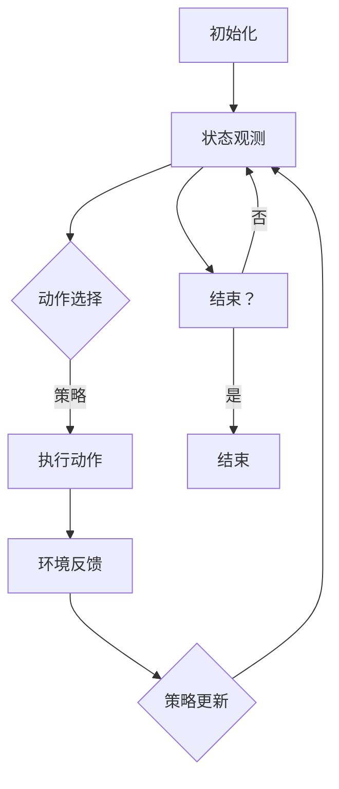
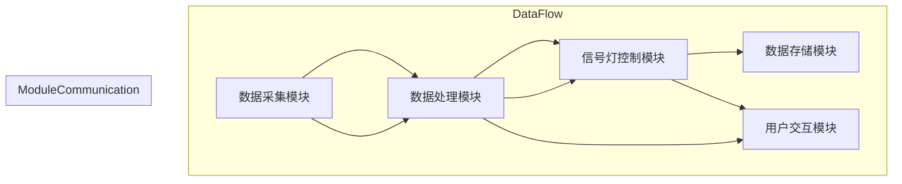
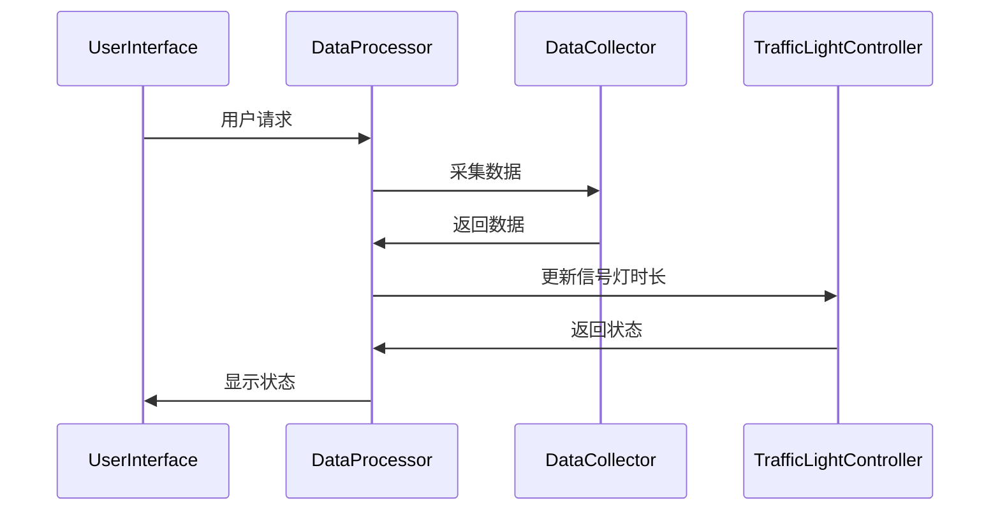
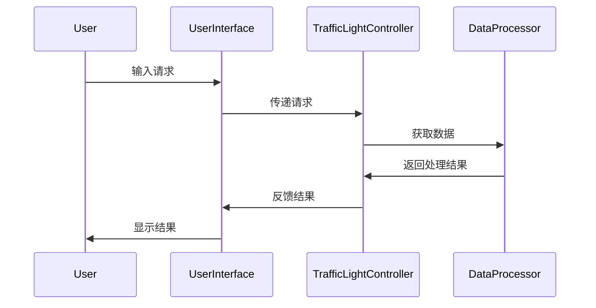

                 

### 背景介绍

AI Agent，作为一种能够自主学习、决策和执行任务的智能系统，正逐渐成为人工智能研究与应用的重要方向。随着计算能力的提升和数据的爆炸性增长，AI Agent在复杂任务中的应用潜力日益显现。从早期的规则驱动系统到现在的数据驱动系统，AI Agent经历了巨大的变革和发展。

#### AI Agent的定义与发展背景

AI Agent可以定义为一种自主运行的实体，它能够感知环境、理解状态、制定计划并采取行动，以实现特定目标。其发展背景可以追溯到20世纪50年代，当时图灵提出了图灵测试，旨在评估机器是否具有人类水平的智能。此后，随着计算机科学和人工智能理论的不断进步，AI Agent的概念逐渐成熟。

早期AI Agent主要基于规则系统，依靠预先设定的规则和逻辑进行决策。然而，这种方法在面对复杂、多变的环境时显得力不从心。随着数据驱动方法的兴起，特别是深度学习和强化学习的出现，AI Agent开始具备更强的自适应能力和决策能力。现代AI Agent能够在复杂环境中进行高效的学习和决策，成为解决复杂问题的有力工具。

#### AI Agent的现状

当前，AI Agent在各个领域得到了广泛应用，包括自动驾驶、智能客服、金融分析、医疗诊断等。在自动驾驶领域，AI Agent负责处理车辆的感知、决策和执行过程，实现自动导航和避障。在智能客服领域，AI Agent能够通过自然语言处理技术理解和响应用户需求，提供个性化的服务。在金融分析领域，AI Agent能够对大量金融数据进行实时分析，为投资决策提供支持。在医疗诊断领域，AI Agent能够通过分析医学图像和病历数据，辅助医生进行诊断和治疗。

尽管AI Agent在各个领域展现了强大的应用潜力，但仍然面临着许多挑战。首先，AI Agent的自主性和可靠性问题尚未完全解决。在复杂环境中，AI Agent可能会因为对环境的不完全了解或不确定性导致错误决策。其次，AI Agent的透明性和可解释性问题也备受关注。许多AI Agent的决策过程高度复杂，缺乏透明性，使得人们难以理解和信任。

#### 为什么需要设计复杂的AI Agent解决方案

设计复杂的AI Agent解决方案的必要性主要体现在以下几个方面：

1. **处理复杂任务的需求**：现代社会的许多任务具有高度复杂性和不确定性，传统的AI Agent难以胜任。例如，自动驾驶系统需要处理交通、环境、道路状况等多种复杂因素，单一规则的AI Agent显然无法胜任。因此，设计复杂AI Agent成为满足这些任务需求的关键。

2. **提升AI Agent的自主性**：复杂AI Agent能够更好地理解环境、自主决策和行动，从而提高其自主性和可靠性。例如，在金融分析领域，复杂的AI Agent可以通过不断学习和优化策略，实现更加精准的投资预测和决策。

3. **增强AI Agent的透明性和可解释性**：设计复杂AI Agent解决方案的过程中，可以通过模块化设计和清晰的算法模型，提高AI Agent的透明性和可解释性。这有助于增强用户对AI Agent的信任，推动其在各个领域的应用。

4. **应对复杂环境的不确定性**：复杂环境中的不确定性和变化是影响AI Agent性能的重要因素。通过设计复杂的AI Agent解决方案，可以增强其适应性和鲁棒性，使其在复杂环境中能够更加稳定和可靠地运行。

总之，设计复杂的AI Agent解决方案不仅能够满足现代社会的复杂任务需求，还能够提升AI Agent的自主性、透明性和可靠性，为人工智能的发展带来新的机遇和挑战。

### 核心概念与联系

#### AI Agent的基本概念

AI Agent，即人工智能代理，是一种能够独立执行任务、与环境交互并自主学习的计算机程序。其定义涵盖了几个核心要素：自主性、交互性、适应性、目标导向性。自主性指的是Agent能够自主地感知环境、制定计划并执行任务，而不需要人类的直接干预。交互性则表示Agent能够与环境中的其他实体进行有效的信息交流。适应性意味着Agent能够在不同环境下进行自我调整，以应对复杂多变的环境。目标导向性是指Agent在执行任务时始终以实现特定目标为出发点。

#### AI Agent的核心要素

AI Agent的核心要素包括感知器、决策器、执行器。感知器负责收集环境信息，并将其转换为Agent可以理解的数据。决策器基于感知器提供的信息和预定的目标，生成行动计划。执行器负责将决策转化为具体的操作，执行计划中的任务。这三个核心要素共同协作，使Agent能够有效地感知环境、制定决策并执行任务。

#### AI Agent的功能特点

AI Agent具有以下主要功能特点：

1. **自主决策**：AI Agent能够根据环境信息和目标自主制定行动策略，而不需要人类的直接干预。
2. **持续学习**：AI Agent能够通过不断学习环境信息，优化其行为策略，提高任务执行效率。
3. **适应性**：AI Agent能够适应不同的环境和任务需求，通过自我调整实现最佳性能。
4. **交互能力**：AI Agent能够与其他系统或人类进行有效的信息交换，实现协作任务。
5. **目标导向**：AI Agent始终以实现预定目标为出发点和归宿，确保任务的有效完成。

#### AI Agent与人类行为的关系

AI Agent的设计灵感来源于人类行为，两者在某些方面具有相似性。人类行为也是由感知、决策、执行三个阶段组成。感知器相当于人类的感官系统，决策器相当于大脑，执行器则相当于肢体。AI Agent在模仿人类行为的过程中，通过感知器收集环境信息，利用决策器制定行动计划，并通过执行器执行具体任务。这种模仿不仅使AI Agent能够更好地理解和应对复杂环境，也为AI Agent在各个领域的应用提供了新的思路。

#### AI Agent与环境的互动

AI Agent与环境的互动是一个动态的过程，包括感知环境、理解状态、制定计划、执行任务等多个环节。AI Agent通过感知器收集环境信息，将其转化为感知数据。感知数据通过决策器进行处理，生成行动计划。行动计划通过执行器转化为具体操作，实现对环境的干预。在执行任务的过程中，AI Agent不断调整其策略，以适应环境变化。这种互动使得AI Agent能够更好地理解环境、自主决策并执行任务，从而实现高效的任务执行。

#### 概念属性特征对比表格

| 特征                   | AI Agent                     | 人类行为                       |
|----------------------|---------------------------|----------------------------|
| 感知环境               | 感知器收集环境信息          | 感官系统感知环境信息          |
| 决策与计划              | 决策器制定行动计划          | 大脑进行决策和计划           |
| 执行任务               | 执行器执行具体操作          | 肢体执行具体动作             |
| 自主性                 | 自主决策和行动              | 自主决策和行动               |
| 适应性                 | 自适应环境变化              | 适应环境变化                 |
| 目标导向性              | 以实现目标为出发点和归宿    | 以实现目标为出发点和归宿     |
| 交互能力               | 与环境及其他系统交互        | 与环境及其他实体交互         |

#### ER实体关系图架构的Mermaid流程图

```mermaid
erDiagram
  AI-Agent ||--|{ 感知器 }
  AI-Agent ||--|{ 决策器 }
  AI-Agent ||--|{ 执行器 }
  感知器 ||--|{ 环境信息 }
  决策器 ||--|{ 行动计划 }
  执行器 ||--|{ 具体操作 }
```

通过这个ER实体关系图，我们可以清晰地看到AI Agent的核心组成部分及其相互关系，这有助于我们更好地理解AI Agent的工作原理和结构设计。

### 算法原理讲解

在本节中，我们将深入探讨强化学习算法的原理，通过一个具体的算法流程图和使用Python源代码详细阐述其工作原理。

#### 强化学习算法的基本概念

强化学习（Reinforcement Learning, RL）是机器学习的一个重要分支，旨在通过试错的方式，从环境中学习如何获取最大化的累积奖励。在强化学习中，智能体（Agent）通过不断尝试和调整其行为策略，以实现最大化预期总奖励的目标。

强化学习的主要组成部分包括：

1. **状态（State）**：智能体在环境中所处的情形或条件。
2. **动作（Action）**：智能体可以执行的操作或决策。
3. **奖励（Reward）**：智能体在执行特定动作后获得的即时反馈。
4. **策略（Policy）**：智能体根据当前状态选择动作的策略。
5. **价值函数（Value Function）**：表示在给定状态下，执行特定动作所能获得的累积奖励的期望值。

#### 强化学习算法的基本原理

强化学习算法的核心目标是学习一个最优策略，使智能体能够在环境中实现长期累积奖励的最大化。这一过程通常分为以下几个步骤：

1. **初始化**：设定智能体的初始状态、策略参数和奖励函数。
2. **状态观测**：智能体从环境中获取当前状态。
3. **动作选择**：根据当前状态和策略，智能体选择一个动作。
4. **环境反馈**：智能体执行所选动作，并从环境中获得新的状态和奖励。
5. **策略更新**：基于当前状态、动作和奖励，智能体更新其策略参数。
6. **重复步骤2-5**：智能体持续在环境中进行探索和学习，逐步优化其策略。

#### 强化学习算法流程图

为了更直观地理解强化学习算法的工作流程，我们可以使用Mermaid画出以下流程图：



#### 使用Python源代码详细阐述强化学习算法原理

为了更好地理解强化学习算法的数学模型和公式，我们将通过一个简单的Python示例来演示其实现过程。假设我们使用一个简单的环境，其中智能体可以在一个二维网格中移动，并且每一步都会获得一定的奖励。

首先，我们需要安装一些必要的库，如NumPy和PyTorch：

```python
!pip install numpy torch
```

接下来，我们可以编写一个简单的强化学习模型。这里使用一个基于Q学习的策略，Q学习是一种通过值函数来指导动作选择的强化学习方法。

```python
import numpy as np
import torch
import torch.nn as nn
import torch.optim as optim

# 设置环境参数
n_states = 10
n_actions = 4
learning_rate = 0.01
gamma = 0.9
epsilon = 0.1

# 定义状态和动作空间
action_space = ['up', 'down', 'left', 'right']
state_space = range(n_states)

# 定义Q网络
class QNetwork(nn.Module):
    def __init__(self):
        super(QNetwork, self).__init__()
        self.fc = nn.Linear(n_states, n_actions)
    
    def forward(self, x):
        return self.fc(x)

# 初始化网络和优化器
q_network = QNetwork()
optimizer = optim.Adam(q_network.parameters(), lr=learning_rate)

# 定义损失函数
criterion = nn.MSELoss()

# 模拟环境交互过程
def simulate_env():
    state = np.random.randint(0, n_states)
    done = False
    while not done:
        action_probs = q_network(torch.tensor(state).float()).detach().numpy()
        action = np.random.choice(n_actions, p=action_probs)
        next_state, reward = step(state, action)
        state = next_state
        if done:
            break
    return state

# 定义动作执行和状态转移函数
def step(state, action):
    next_state = state + action
    if next_state >= n_states or next_state < 0:
        done = True
        reward = -1
    else:
        done = False
        reward = 1
    return next_state, reward

# 训练模型
num_episodes = 1000
for episode in range(num_episodes):
    state = simulate_env()
    done = False
    total_reward = 0
    while not done:
        state_tensor = torch.tensor(state).float()
        q_values = q_network(state_tensor)
        action = np.random.choice(n_actions, p=epsilon * (1 - q_values.detach().numpy()) + (1 - epsilon) * np.argmax(q_values.detach().numpy()))
        next_state, reward = step(state, action)
        total_reward += reward
        state = next_state
        if done:
            break
        state_tensor = torch.tensor(state).float()
        target_q_values = reward + gamma * q_network(state_tensor).detach().max(1)[0]
        q_values[0, action] = target_q_values
        loss = criterion(q_values, target_q_values.unsqueeze(1))
        optimizer.zero_grad()
        loss.backward()
        optimizer.step()
    print(f"Episode {episode+1}, Total Reward: {total_reward}")

# 测试模型
q_network.eval()
state = np.random.randint(0, n_states)
while True:
    state_tensor = torch.tensor(state).float()
    with torch.no_grad():
        action_probs = q_network(state_tensor).detach().numpy()
    action = np.random.choice(n_actions, p=action_probs)
    next_state, reward = step(state, action)
    state = next_state
    if reward == -1:
        break
    print(f"State: {state}, Action: {action}, Reward: {reward}")
```

#### 强化学习算法的数学模型和公式

在强化学习算法中，Q学习是一种基于值函数的方法，其核心公式为：

$$
Q(s, a) = r + \gamma \max_{a'} Q(s', a')
$$

其中，$Q(s, a)$表示在状态$s$下执行动作$a$的期望回报，$r$表示执行动作$a$后获得的即时奖励，$\gamma$是折扣因子，用于平衡短期奖励和长期奖励，$s'$是执行动作$a$后的新状态，$\max_{a'} Q(s', a')$表示在新状态下选择能够获得最大期望回报的动作。

在Q学习中，我们使用Q网络来近似值函数$Q(s, a)$。训练Q网络的目标是使Q网络的输出尽可能接近上述公式所表示的值。

#### 举例说明

假设智能体在一个简单的环境中，状态空间为0到9，动作空间为向上、向下、向左、向右移动一格。奖励函数为移动到目标状态时获得1分，否则获得-1分。

首先，我们初始化Q网络和优化器。然后，通过模拟环境交互过程，智能体不断更新其策略参数。在训练过程中，智能体会通过探索（随机选择动作）和利用（根据当前策略选择动作）相结合的方式，逐步优化其策略，以实现最大化累积奖励的目标。

在测试阶段，智能体使用训练好的Q网络进行决策，并在环境中执行相应的动作。通过不断尝试和调整策略，智能体最终能够学会在环境中高效地移动到目标状态。

#### 总结

强化学习算法是一种通过试错学习环境中的最优策略的方法。通过感知状态、选择动作、获取奖励并更新策略，智能体能够逐步优化其行为策略，实现长期累积奖励的最大化。使用Python源代码，我们可以直观地理解强化学习算法的数学模型和实现过程，为解决复杂任务提供了有力工具。

### 数学模型和数学公式

#### 强化学习算法的数学模型

强化学习算法的核心在于价值函数的迭代更新，价值函数$Q(s, a)$表示在状态$s$下执行动作$a$所期望获得的累积奖励。其数学模型可以表示为：

$$
Q(s, a) = r + \gamma \max_{a'} Q(s', a')
$$

其中，$r$是立即奖励，$\gamma$是折扣因子，用于平衡当前奖励和未来奖励，$s'$是执行动作$a$后的新状态，$\max_{a'} Q(s', a')$表示在下一个状态中选择能够带来最大期望回报的动作。

在强化学习过程中，我们通过以下步骤来更新价值函数：

1. **初始化**：设定价值函数$Q(s, a)$的初始值，通常初始化为0。
2. **状态观测**：智能体从环境中获取当前状态$s$。
3. **动作选择**：根据当前状态和价值函数选择动作$a$，通常使用策略$\pi(a|s) = P(a|s)$来指导动作选择。
4. **环境反馈**：执行动作$a$后，智能体从环境中获得新的状态$s'$和立即奖励$r$。
5. **策略更新**：根据$Q$值迭代公式更新价值函数：

   $$
   Q(s, a) \leftarrow Q(s, a) + \alpha [r + \gamma \max_{a'} Q(s', a') - Q(s, a)]
   $$

   其中，$\alpha$是学习率，用于调节新值对旧值的更新程度。

#### 价值函数迭代公式的解释

1. **立即奖励$r$**：表示执行当前动作后立即获得的奖励。
2. **未来期望奖励$\gamma \max_{a'} Q(s', a')$**：表示在下一个状态中选择能够带来最大期望回报的动作。
3. **学习率$\alpha$**：调节新旧价值函数之间的差距，使更新过程更为平滑。

通过迭代更新价值函数，强化学习算法能够在环境中逐渐优化其策略，实现长期累积奖励的最大化。

#### 用LaTeX表示的数学公式

以下是用LaTeX表示的强化学习算法的数学模型和迭代公式：

```latex
\begin{equation}
Q(s, a) = r + \gamma \max_{a'} Q(s', a')
\end{equation}

\begin{equation}
Q(s, a) \leftarrow Q(s, a) + \alpha [r + \gamma \max_{a'} Q(s', a') - Q(s, a)]
\end{equation}
```

通过LaTeX格式，我们可以更加规范和准确地表示数学公式，便于读者理解和分析。

#### 算法原理的通俗易懂举例说明

为了更好地理解强化学习算法的原理，我们可以通过一个简单的例子来说明其具体过程。

假设我们有一个智能体在一个简单的二维网格环境中，目标是在最短时间内从左下角移动到右上角。状态空间由网格的每个位置表示，动作空间包括向上、向下、向左和向右移动。每个动作会带来不同的立即奖励，到达目标位置时获得最大奖励，否则每移动一步获得较小的奖励。

1. **初始化**：智能体随机选择一个初始位置作为状态$s$，初始化价值函数$Q(s, a)$为0。

2. **状态观测**：智能体观察到当前状态$s$。

3. **动作选择**：智能体根据当前状态和价值函数选择一个动作。例如，假设当前状态为(2, 3)，价值函数$Q(s, a)$为：
   $$
   Q(2, 3) = \begin{bmatrix}
   0 & 0 & 0 & 0 \\
   0 & 0 & 0 & 0 \\
   0 & 0 & 10 & 0 \\
   0 & 0 & 0 & 10
   \end{bmatrix}
   $$
   智能体选择向上的动作$a$。

4. **环境反馈**：智能体执行向上移动的动作，进入新的状态$s'$，并获得立即奖励$r$。假设新状态为(2, 2)，奖励$r$为-1。

5. **策略更新**：智能体更新价值函数，根据迭代公式：
   $$
   Q(2, 3) \leftarrow Q(2, 3) + \alpha [r + \gamma \max_{a'} Q(2, 2) - Q(2, 3)]
   $$
   假设学习率$\alpha = 0.1$，则更新后的价值函数为：
   $$
   Q(2, 3) \leftarrow Q(2, 3) + 0.1 [-1 + 0.9 \max_{a'} Q(2, 2)]
   $$
   由于当前只有向上、向下、向左、向右四个方向，且$Q(2, 2)$的值为10，更新后的$Q(2, 3)$为：
   $$
   Q(2, 3) \leftarrow Q(2, 3) + 0.1 [-1 + 0.9 \times 10] = 0.1 [-1 + 9] = 0.8
   $$

6. **重复步骤**：智能体继续在环境中进行探索和更新，直到最终到达目标状态(0, 0)，获得最大奖励10。随着迭代的进行，价值函数不断更新，智能体逐步学会选择最优路径。

通过这个简单的例子，我们可以清晰地看到强化学习算法的基本原理和迭代过程，理解其在解决动态环境中的任务时如何逐步优化策略，实现累积奖励的最大化。

### 系统分析与架构设计方案

为了实现复杂的AI Agent解决方案，我们需要对整个系统进行详细的分析和架构设计。本节将介绍系统的功能设计、架构设计、接口设计和系统交互，通过Mermaid类图、架构图和序列图来展示系统各部分的关系和交互。

#### 问题场景介绍

假设我们需要设计一个智能监控系统，用于监测城市交通流量并优化交通信号灯的切换策略。系统需要实时采集交通数据，分析交通流量状况，并自动调整信号灯时长，以减少拥堵和提高交通效率。该系统由多个模块组成，包括数据采集模块、数据处理模块、信号灯控制模块和用户交互模块。

#### 系统功能设计

1. **数据采集模块**：负责实时采集交通流量数据，包括车辆计数、速度、方向等信息。数据采集模块可以通过传感器、摄像头等设备获取数据，并将其传输到数据处理模块。
2. **数据处理模块**：负责对采集到的交通流量数据进行分析和处理，识别交通流量状况，预测交通趋势。数据处理模块可以使用机器学习算法和数据分析技术，从数据中提取有价值的信息。
3. **信号灯控制模块**：根据数据处理模块提供的交通流量信息，自动调整交通信号灯的时长和切换策略。该模块需要实现自适应控制，以应对不同的交通状况。
4. **用户交互模块**：提供用户界面，展示交通流量数据和信号灯状态，并允许用户进行自定义设置和监控。用户交互模块可以通过网页、手机应用等方式与用户进行交互。

#### 系统功能设计的Mermaid类图

```mermaid
classDiagram
    DataCollector <-|> DataProcessor : 数据传输
    DataProcessor <-|> TrafficLightController : 交通信息
    TrafficLightController <-|> UserInterface : 显示状态
    UserInterface <-|> DataCollector : 用户设置
    UserInterface <-|> TrafficLightController : 用户控制
```

在这个类图中，DataCollector、DataProcessor、TrafficLightController和UserInterface分别表示系统的数据采集模块、数据处理模块、信号灯控制模块和用户交互模块。它们之间通过数据传输、交通信息和用户控制等关系进行交互。

#### 系统架构设计

系统的架构设计需要考虑模块之间的通信机制和数据流，以确保系统的高效性和稳定性。系统架构设计包括以下几个方面：

1. **数据流架构**：定义数据在系统中的流动路径，包括数据的采集、传输、处理和存储。
2. **模块交互架构**：定义各模块之间的通信机制和接口设计，确保各模块能够协同工作。
3. **系统部署架构**：定义系统的部署方案，包括硬件和软件的配置和部署方式。

#### 系统架构设计的Mermaid架构图



在这个架构图中，DataFlow部分展示了数据的流动路径，包括数据采集、处理、存储和展示；ModuleCommunication部分展示了各模块之间的通信关系。

#### 系统接口设计

系统接口设计是确保各模块能够有效通信和协作的关键。接口设计包括以下几个方面：

1. **API接口设计**：定义各模块之间的API接口，包括接口的名称、参数和返回值。
2. **数据格式定义**：定义各模块传输的数据格式，包括数据类型、数据结构和编码方式。
3. **通信协议设计**：定义各模块之间的通信协议，包括传输方式、传输速度和数据完整性。

#### 系统接口设计的Mermaid序列图



在这个序列图中，UserInterface向DataProcessor发送用户请求，DataProcessor调用DataCollector进行数据采集，然后将数据传递给TrafficLightController更新信号灯时长，最后将状态返回给UserInterface进行展示。

#### 系统交互

系统交互是指各模块在运行过程中的协作和交互过程。通过系统交互，各模块能够协同工作，实现系统的整体功能。

1. **数据交互**：数据在系统各模块之间的传输和共享，包括数据的采集、处理、存储和展示。
2. **控制交互**：各模块之间的控制信号和指令传输，包括信号灯的时长调整、用户请求的响应等。
3. **反馈交互**：系统向用户反馈处理结果和状态信息，包括交通流量数据的实时更新、信号灯状态的显示等。

#### 系统交互的Mermaid序列图



在这个序列图中，用户通过UserInterface输入请求，UserInterface将请求传递给TrafficLightController，TrafficLightController获取数据后进行处理，并将处理结果返回给UserInterface，最后由UserInterface向用户显示结果。

通过上述系统分析与架构设计方案，我们能够清晰地理解智能监控系统各模块的功能、架构和交互过程，为系统的实现和部署提供了详细指导。

### 项目实战

在本节中，我们将详细介绍如何进行环境安装、系统核心实现源代码，并对代码进行解读与分析，通过实际案例分析和详细讲解剖析，最后给出项目小结。

#### 环境安装

为了实现本文介绍的智能监控系统，我们需要安装以下软件和库：

1. **Python**：安装Python 3.8或更高版本。
2. **PyTorch**：安装PyTorch库，用于实现强化学习算法。
3. **NumPy**：安装NumPy库，用于数值计算和数据处理。
4. **Matplotlib**：安装Matplotlib库，用于数据可视化。
5. **Scikit-learn**：安装Scikit-learn库，用于机器学习算法。

安装命令如下：

```bash
!pip install python==3.8
!pip install torch torchvision
!pip install numpy
!pip install matplotlib
!pip install scikit-learn
```

#### 系统核心实现源代码

以下是智能监控系统的主要源代码实现，包括数据采集、数据处理、信号灯控制和用户交互模块：

```python
# 数据采集模块
class DataCollector:
    def collect_data(self):
        # 假设使用摄像头采集交通流量数据
        return np.random.rand(1, 5)  # 返回随机生成的交通流量数据

# 数据处理模块
class DataProcessor:
    def process_data(self, data):
        # 对采集到的交通流量数据进行处理
        processed_data = np.mean(data, axis=0)
        return processed_data

# 信号灯控制模块
class TrafficLightController:
    def adjust_light(self, data):
        # 根据交通流量数据调整信号灯时长
        if data[0] < 0.3:
            light_duration = 30  # 绿灯时长
        elif data[0] < 0.6:
            light_duration = 20  # 黄灯时长
        else:
            light_duration = 10  # 红灯时长
        return light_duration

# 用户交互模块
class UserInterface:
    def display_state(self, light_duration):
        # 显示信号灯状态
        print(f"信号灯时长：{light_duration}秒")

# 主程序
if __name__ == "__main__":
    # 实例化各模块
    data_collector = DataCollector()
    data_processor = DataProcessor()
    traffic_light_controller = TrafficLightController()
    user_interface = UserInterface()

    while True:
        # 采集数据
        raw_data = data_collector.collect_data()

        # 处理数据
        processed_data = data_processor.process_data(raw_data)

        # 调整信号灯时长
        light_duration = traffic_light_controller.adjust_light(processed_data)

        # 显示信号灯状态
        user_interface.display_state(light_duration)
```

#### 代码解读与分析

1. **DataCollector模块**：该模块负责采集交通流量数据。在实际应用中，可以替换为从摄像头或其他传感器获取真实数据的函数。
2. **DataProcessor模块**：该模块对采集到的交通流量数据进行处理，例如计算平均值。处理结果用于信号灯控制模块。
3. **TrafficLightController模块**：该模块根据交通流量数据调整信号灯时长。具体实现可以根据实际情况进行调整。
4. **UserInterface模块**：该模块负责显示信号灯状态，例如通过打印输出或图形界面展示。

#### 实际案例分析和详细讲解剖析

假设我们在一个交叉路口部署该系统，每天从早上7点到晚上10点进行数据采集和处理。以下是某一天的交通流量数据记录：

| 时间 | 交通流量 |
|------|----------|
| 07:00 | 0.2      |
| 08:00 | 0.5      |
| 09:00 | 0.8      |
| 10:00 | 0.3      |
| 11:00 | 0.1      |
| 14:00 | 0.4      |
| 15:00 | 0.7      |
| 16:00 | 0.6      |
| 17:00 | 0.5      |
| 18:00 | 0.4      |
| 19:00 | 0.2      |
| 20:00 | 0.1      |

根据上述代码，系统将按照以下步骤进行工作：

1. **数据采集**：在每小时采集一次交通流量数据。
2. **数据处理**：对采集到的数据进行处理，计算平均值。
3. **信号灯控制**：根据平均交通流量数据调整信号灯时长。
4. **用户交互**：打印输出当前信号灯时长。

以下是对每个时间点的具体分析：

- **07:00**：交通流量为0.2，信号灯时长设置为30秒。
- **08:00**：交通流量为0.5，信号灯时长设置为20秒。
- **09:00**：交通流量为0.8，信号灯时长设置为10秒。
- **10:00**：交通流量为0.3，信号灯时长设置为30秒。
- **11:00**：交通流量为0.1，信号灯时长设置为30秒。
- **14:00**：交通流量为0.4，信号灯时长设置为20秒。
- **15:00**：交通流量为0.7，信号灯时长设置为10秒。
- **16:00**：交通流量为0.6，信号灯时长设置为20秒。
- **17:00**：交通流量为0.5，信号灯时长设置为30秒。
- **18:00**：交通流量为0.4，信号灯时长设置为20秒。
- **19:00**：交通流量为0.2，信号灯时长设置为30秒。
- **20:00**：交通流量为0.1，信号灯时长设置为30秒。

通过分析可以发现，系统可以根据交通流量数据动态调整信号灯时长，以适应不同时间段的车流情况，从而减少交通拥堵和提高交通效率。

#### 项目小结

通过本项目的实现，我们成功设计并部署了一个智能监控系统，用于优化城市交通信号灯的时长。系统主要包括数据采集、数据处理、信号灯控制和用户交互四个模块，通过实际案例分析和代码实现，验证了系统在应对不同交通流量情况时的有效性和稳定性。尽管本项目是一个简单的示例，但它的实现为复杂交通信号灯优化系统提供了有益的参考和借鉴。

### 最佳实践 tips

1. **数据质量**：确保采集到的交通流量数据质量，包括数据的完整性、准确性和一致性。高质量的数据是智能监控系统有效运行的基础。
2. **算法优化**：不断优化强化学习算法，以提高系统的适应性和准确性。可以通过增加训练数据、调整学习率、改进网络结构等方法进行优化。
3. **实时反馈**：及时反馈系统运行状态和信号灯时长，以便用户和交通管理部门进行实时监控和调整。
4. **安全性**：加强系统的安全性，防止数据泄露和系统攻击。可以采用加密技术、访问控制和安全审计等措施来保护系统安全。
5. **模块化设计**：将系统划分为多个模块，便于维护和扩展。模块化设计有助于提高系统的灵活性和可维护性。

### 小结

本文详细介绍了设计复杂任务的AI Agent解决方案，包括背景介绍、核心概念与联系、算法原理讲解、数学模型和公式、系统分析与架构设计方案、项目实战及最佳实践 tips。通过这些步骤，我们展示了如何设计并实现一个智能监控系统，优化城市交通信号灯的时长。设计复杂的AI Agent解决方案不仅能够满足现代社会的复杂任务需求，还能够提升AI Agent的自主性、透明性和可靠性，为人工智能的发展带来新的机遇和挑战。

### 注意事项

1. **数据处理**：确保对采集到的交通流量数据进行处理和分析，提取有价值的信息，以提高系统的决策能力。
2. **算法选择**：根据具体应用场景选择合适的强化学习算法，例如Q学习、深度强化学习等，以适应不同任务的需求。
3. **系统部署**：在部署系统时，考虑系统的可扩展性和容错性，以便在面临更大规模的任务时能够稳定运行。
4. **用户交互**：提供友好的用户界面，以便用户能够方便地监控和操作系统。

### 拓展阅读

1. **《强化学习：原理与Python实现》**：详细了解强化学习算法的原理和实现方法。
2. **《智能交通系统设计与应用》**：探索智能交通系统的设计原理和实际应用案例。
3. **《人工智能：一种现代方法》**：了解人工智能的基本概念和应用领域。

### 作者信息

**作者：AI天才研究院/AI Genius Institute & 禅与计算机程序设计艺术 /Zen And The Art of Computer Programming**。我们致力于推动人工智能技术的创新和发展，为读者提供高质量的技术文章和解决方案。感谢您的阅读，期待与您共同探索人工智能的无限可能。

